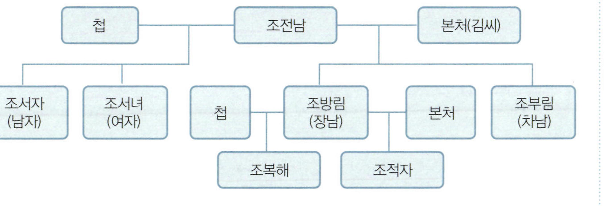
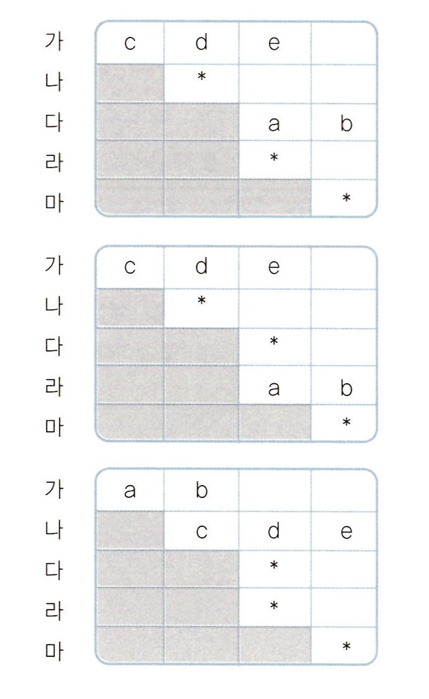

# 출제방향

## 1. 출제의 기본방향

추리논증 영역은 다양한 학문 분야에서 소재를 찾아 추리력과 비판적 사고력을 평가하는 데 출제의 기본 방향을 두었다. 또한 특정 전공자가 유리하거나 불리하지 않도록 전문 지식이 문항 해결에 미치는 영향을 최소화하는 데 주력하였다. 이를 위해서 대학에서 정상적인 학업과 평소의 독서를 통하여 사고력을 함양한 사람이라면 이해할 수 있도록 문항을 구성하였다. 또한 다양하고 전문적인 글을 이해하는 것만으로는 해결할 수 없고 주어진 글 또는 상황을 논리적으로 분석하고 비판, 평가할 수 있어야 답할 수 있도록 문항을 구성함으로써 사고력 측정 시험이 될 수 있도록 노력하였다. 구체적인 출제 원칙은 다음과 같다.

ㆍ예년에 정한 시간 내에 문항을 모두 풀어 답한 수험생의 숫자가 많지 않았던 점을 고려하여, 추리논증 문항 전체의 정보량을 줄여서 수험생의 읽기 부담을 줄였다.

ㆍ예년의 경우 일부 추리 문항이 극소수의 최상위권 학생을 제외하면 상위권 수험생 대부분에 대하여 의미 있는 변별 요인으로 작동하지 못하였던 통계적 분석의 결과를 참작하여 추리 문항, 특히 논리게임과 같은 순수한 추리 문항의 난도를 크게 낮추어 예년에 비하여 쉽게 출제하였다.

ㆍ논증이나 논쟁적 자료를 분석하고 비판, 평가하는 논증 문항들의 난도는 예년과 비슷하거나 조금 어려운 정도가 되도록 조정함으로써 추리논증 시험 전체에서 논증 문항의 문제 해결 부담의 정도를 예년에 비해 높이려 하였다.

ㆍ동양과 서양, 고전과 현대, 국내와 국제 관련 소재를 두루 활용하되, 학제적 내지 융복합적 소재를 적극적으로 활용하였다. 학부에서 법학을 전공한 자가 유리하지 않도록 하는 범위 내에서 법 관련의 다양한 제재를 사용한 문항을 다수 포함시키되, 법 관련 소재를 사용하는 문항의 문제 유형을 다양화하였다.

ㆍ전공에 따른 배경지식의 차이에 따라 문항의 접근 및 해결에 드는 시간과 노력이 크게 차이가 나지 않도록 유의하였다. 특히, 자연과학 소재를 활용하는 문항과 수리적인 추리력을 요구하는 문항의 경우, 계산 능력을 요구하지 않고 주어진 정보로부터 문제 해결의 열쇠를 찾아내는 사고력을 평가하는 문제가 되도록 하였다.

## 2. 출제 범위 및 문항 구성

인문, 사회, 자연과학을 소재로 하는 문항들의 경우 소재 활용의 원칙이나 범위에 있어서 예년과 차이가 없도록 하였다. 인문학, 사회과학, 과학ㆍ기술 등의 이론적 학문 분야뿐만 아니라, 일상적ㆍ도덕적 논변, 정책 및 의사결정 상황, 법적 논변 등의 실천적인 분야까지 포함시켰다.

이번 추리논증 영역에서는 법 관련 제재를 다수 포함시키되, 민주주의 원리에 입각하여 국가의 체제의 특정 요소를 비판적으로 평가하는 문항(1번), 다인종 사회가 겪는 법적인 문제 및 국제적인 사안을 다루는 문항(3~7번), 법제사적 고전 문헌의 자료에서 재구성한 문항(8, 9번), 법학과 과학의 학제적 소재를 다룬 문항(30번) 등 소재를 다양화하는 한편, 예년의 문항 유형뿐 아니라 부분적으로 논리게임의 성격을 갖는 문항도 포함하여 질문의 유형을 다양화하였다.

문제 해결에서 추리력이 관건이 되는 추리 문항과 제시된 논증이나 논증적 자료를 논리적으로 구성하고 평가하는 논증 문항이 균형을 이루도록 하였다.

추리력을 묻는 문항들은 일상어를 도구로 삼아 추리하는 언어추리 문항, 복잡한 계산을 요구하지 않는 수준에서 수리적 사고를 통하여 해결 가능한 수리추리 문항, 그리고 인문, 사회, 과학ㆍ기술 분야의 개념, 가설, 이론, 실험 등의 소재를 가공하여 특정한 상황에서의 복합적인 추리를 요구하는 논리게임 문항들을 포함하도록 하였다.

논증력을 묻는 문항들은 주어진 논변들을 분석하여 주장과 논거를 찾아내고 그 논리적 관계를 분석하는 문항, 주어진 논변에 대하여 비판하고 평가하는 문항, 발생한 현상을 설명하기 위해서 제시된 가설의 설득력을 평가하는 문항 등 다양한 인지 활동을 골고루 측정할 수 있도록 구성하였다.

## 3. 난이도

2013학년도 법학적성시험에서는 특정 학문 분야의 지식에 의존하기보다는 일반적인 지적 능력 및 논리적인 사고를 통하여 해결할 수 있는 문항들을 출제하되, 중상위권 학생들의 통계적 상방향 분포를 더 넓혀서 상위권 학생들의 변별력을 높이도록 전체적으로 문항의 난이도를 예년에 비해 낮추었으며 추리 문항에서 고난도의 문항을 제외하였다.

## 4. 출제 시 유의점

통계 분석의 결과 계산이 포함된 추리 문항의 경우 자연과학 전공 학생들에게 유리하였던 것으로 판단됨에 따라 계산이 필요한 문항들을 배제하였다.

논증 문항의 경우 그간 추리 문항에 비하여 다소 쉬웠던 것으로 판단하여 문항 접근성을 낮추고 문제 해결을 위한 사고의 단계를 늘려서 예년에 비해 다소 어려운 정도로 조정하였다.

---

# 문항별 해설

## 01

### 문항구분

* 문항 성격 : 법학 - 분석 및 재구성

* 평가 목표 : 상황에 대한 각 비판의 논지를 파악하고, 이를 재구성하여 그 차이를 이해하도록 함.

### 제시문 해설

* 정답 : (1)

이 문제는 헌법재판의 민주적 정당성 결여에 대한 문제 제기인 반다수결주의 난제를 이해하고 이러한 비판들의 분석 및 재구성을 통하여 그 취지 및 차이점을 파악하는 내용을 담고 있다. 헌법재판기관의 운영, 구성 등의 절차적 측면에서 반다수결주의 난제를 제기하는 입장과 국민의 대표기관의 활동을 제약한다는 측면에서 헌법재판기관의 활동의 문제점을 지적하는 입장(실체적 반다수결주의 난제)을 구분하여 헌법재판기관의 운영, 구성, 활동에 변화가 있을 경우 혹은 다른 관련 주장들과 더불어 볼 때 이러한 입장들이 지속적으로 유효한 비판이 될 수 있는지를 판단해 보는 문제이다.

### 선택지별 해설

정답 해설

(1) A국은 직접선거에 의해 입법부, 행정부, 사법부를 구성하고 있지만 헌법재판기관은 대통령의 결정에 의하여 구성된다. 그리고 헌법재판기관의 구성원들은 종신직위를 보장받는다. 임기와 선출 방식에 있어 민주적이지 못하다는 주장이 비판 (가)의 논지이다. 비판은 크게 두 축으로 구성되는데 하나는 헌법재판기관의 재판관들이 직접선거에 의하여 선출되지 않는다는 것이며 다른 하나는 종신제를 택하고 있는 관계로 정기적인 선거를 통하여 정치적 책임을 물을 수 없다는 것이다. 따라서 헌법재판기관 구성원의 선출 방식을 직선제로 변경하는 것으로 비판 (가)가 해소된다고 볼 수 없다. 선출 방식의 변경으로는 비판 (가)의 일부분이 해소되며 비판 (가)를 해소하기 위하여는 선출 방식 및 임기의 변경이 모두 이루어져야 한다. 종신제의 폐지 및 직선제가 이루어져야 구성에 있어 헌법재판기관이 민주적 정당성을 확보할 수 있다.

오답 해설

(2) A국의 헌법재판기관이 개혁법률들에 대하여 합헌결정을 내리게 되면 위헌결정이 민주적 정당성을 갖추지 못한다는 비판 (나)는 약화될 수 있다. 하지만 활동에 있어서의 민주적 정당성의 확보와 구성에 있어 민주적 정당성의 문제는 구별되는 것이며 비판 (가)는 선출 방식과 임기에 있어 문제를 삼은 것이므로 합헌 결정 등 기관의 활동과는 무관한 논의라고 볼 수 있다. 따라서 비판 (가)는 해소되지 않는다.

(3) 비판 (나)에서는 국민 의사의 반영이라 볼 수 있는 법률에 대하여 국민이 직접 선출하지 않은 헌법재판기관이 반대의견을 제시하는 것은 민주체제에서 용납할 수 없다고 한다. 헌법재판기관이 위헌결정을 하는 것은 국민 의사에 반하므로 용납될 수 없다. 입법부에 대한 견제 수단으로 헌법재판 제도가 마련되지만 정작 그 제도가 실제로 운영되는 경우 이는 민주적이지 않기 때문에 기관의 존재적 의의를 상실할 수 있다. 입법부에 반영된 국민 의사가 절대적으로 존중되어야 하고 이에 반하는 것은 민주적 정당성을 갖추지 못한다는 비판 (나)의 논지에 따르면 입법부에 대한 견제수단은 근본적으로 존재가 어려우며 헌법재판 제도 또한 그 의의를 상실하며 적절한 방법이 되지 못할 수 있는 것이다.

(4) 비판 (나)에서는 헌법재판기관 구성과 관련된 대통령의 결정, 임명이 국민 의사의 반영이라 이해하지 않는다. 먼저 비판 (가)에서는 헌법재판기관 구성이 대통령에 의하여 결정된다는 점에서 민주적 정당성을 갖추지 못한다고 하고 있다. 즉 대통령에 의한 헌법재판기관의 구성은 국민 의사가 반영된 것은 아니라고 본다. 이러한 비판 (가)의 헌법재판기관 구성에 대한 문제 제기는 비판 (나)에서 구성뿐만 아니라 활동도 민주체제에 부합하지 않는다는 지적을 통하여 여전히 받아들이고 있으므로 헌법재판기관 구성과 관련된 대통령의 결정을 비판 (나)에서도 국민 의사의 반영이라 이해하지 않는다.

(5) 비판 (가)와 (나)의 입장은 민주주의 체제에서 국민의 의사의 반영을 강조하고 있으며 특히 선거 등 다수결 원칙에 따라 모아진 국민 의사를 최우선적인 가치 척도로 강조하고 있다. (가)에서 헌법재판기관 구성의 문제점을 지적하며 다수결에 의하여 정해진 국민 의사에 의한 헌법재판기관의 구성을 강조하며, (나)에서는 입법부가 다수결 원칙에 따른 직선에 의해 구성된다는 점에서 민주적 정당성을 확보한다고 강조한다. 헌법재판기관에 대한 비판들은 그 구성과 활동에 있어 국민 의사가 반영되지 않았다는 점으로 수렴될 수 있다. 이들 비판의 논지에서 강조하는 국민 의사는 이처럼 선거 등을 통하여 다수결에 의하여 정해지는 국민의 의사라는 의미로 사용하고 있다.

## 02

### 문항구분

* 문항 성격 : 규범과학(법학) - 반박 및 논쟁

* 평가 목표 : 두 가지 견해의 논쟁을 분석하여 판단하는 능력 측정

### 제시문 해설

* 정답 : (1)

본 문제는 최근 논의되고 있는 특별검사제의 도입과 관련된 논의를 토대로 하여 상설특검과 개별특검의 장단점의 비교에 관한 논쟁을 분석하고 판단하는 능력을 측정하기 위함이다.

### <보기> 해설

정답 해설

ㄱ. 특별검사의 권한남용에 대한 적절한 통제수단이 없다는 사실은 특검제의 도입을 받아들이는 것을 전제로 한 개별특검 도입의 입장과 상설특검 도입의 입장 모두에 문제될 수 있다. 따라서 특별검사제도 도입 자체에 의문을 품는다면, A와 B는 모두 약화된다. 따라서 이 진술은 옳게 판단한 내용이다.

오답 해설

특검이 쉽게 작동하는 경우, 오히려 정치적 투쟁의 도구로 남용될 가능성이 있다면, 상설특검이 신속하게 작동된다는 것을 전제로 주장하고 있는 A는 약화되고, 이를 비판하고 있는 입장인 개별특검을 주장하고 있는 B는 강화되므로 ㄴ은 틀린 진술이다.

지문에서 개별특검과 상설특검을 비교해 보면, 기존의 검찰이 권력형 범죄나 비리를 제대로 수사하지 못하여 발생하는 사회적 비용이 개별특검에 소요되는 비용보다 크다면 특검을 도입하고자 하는 B입장은 강화되고, B입장이 강화된다면, 제시된 바와 같이 개별특검을 주장하는 B입장이 상설특검보다 비용이 덜 든다는 점을 인정하고 있으므로, 비용이 적게 드는 A입장도 마찬가지로 강화되므로 ㄷ은 틀린 진술이다.

## 03

### 문항구분

* 문항 성격 : 법학 - 판단 및 평가

* 평가 목표 : 차별폐지 정책의 적용 기준을 이해하고 실제 사례에 적용하는 능력을 측정

### 제시문 해설

* 정답 : (3)

헌법학상 평등권에 대한 논의 중 특히 미국에서의 인종차별 폐지 관련 정책들에 대한 논의를 재구성한 지문을 읽고 그 정책의 기본적 원리를 파악하여 각 사례에서 정책 적용의 경우를 판단해 보는 문항이다. Z국은 세 인종으로 구성된 국가인데 그 중 A인종이 타 인종들을 교육에 있어서 배타적으로 취급하자 A인종의 재학생 비율을 조정하는 정책을 마련하였다. 강제적이고 일률적인 정책의 실제 적용에 있어 선별적이고 제한적인 접근을 시도하게 되었고 그 기준에 대한 세 가지의 다른 원칙들이 제시되었는데, 이에 근거하여 각 사례에서 정책 적용이 인정될 수 있는지를 판단해 보는 문제이다.

### <보기> 해설

정답 해설

ㄱ. 갑은 특정 인종에 유리하도록 학생선발을 해 온 교육기관에만 이러한 정책을 시행하자는 주장이다. A인종이 사회의 주류세력으로 배타적 정책을 주도해 왔다는 점을 고려하면, 결국 갑은 A인종에 유리하도록 학생선발을 해 온 교육기관에 새로운 정책을 적용하자고 주장한 것이라 할 수 있다. 직접적으로 인종에 근거하여 A인종을 선발한 학교뿐만 아니라 인종 이외의 다른 선발기준을 제시하지만 A인종에 유리할 수밖에 없는 기준을 제시하여 학생선발을 해 온 교육기관은 갑의 주장에 따르면 당연히 새로운 정책의 적용을 받는다. 다만 갑은 학생선발의 결과 A인종에게 유리한지를 판단하지 않고 그 의도가 A인종에 유리하도록 하였는지를 살펴본다는 점에서 특징을 갖는다. 교육기관 P의 경우 선발 결과 A인종의 재학 비율이 높았는데 이는 언어능력시험성적이 높은 A인종의 특성을 고려하여 선발기준을 제시하였고 그에 따라 특정 인종에 유리하도록 학생선발을 한 것이므로 P에는 갑의 원칙에 따르면 새로운 정책이 적용될 수밖에 없다.

ㄷ. 병은 교육기관의 다양성을 증진하는 차원에서 새로운 정책이 의의를 가져야 한다고 하며 신정책의 시행시보다 다양한 인종들의 학생이 교육기관에 다니게 되는 결과를 낳는 경우에 한하여 새로운 정책의 적용을 인정한다. 특히 A인종이 주류세력인 Z국의 현실과 A인종 비율이 높은 교육기관에 대한 타 인종들의 입학을 허용시키려는 새로운 정책의 취지를 고려할 때 병이 제시한 '다양성 증진'은 A인종에 거의 독점적이었던 교육기관을 B, C인종에게 개방하여 다양성을 확보하자는 것이라 이해할 수 있다. 교육기관 R은 B, C인종만이 재학하던 교육기관인데 새로운 정책이 적용될 경우 A인종의 참여가 가능할 수 있으므로 다양한 학생들이 참여하게 되고 따라서 일견 병의 입장에서 R에 대한 새로운 정책의 집행을 인정하게 될 것으로 보인다. 하지만 기본적으로 새로운 정책은 한 교육기관 내에 A인종 비율이 60%를 초과하는 경우에만 적용된다는 구성요건을 마련하고 있다. 소외받는 B, C인종을 위한 특별한 교육기관은 애초에 정책의 대상이 아니므로 병의 주장과 상관없이 R에는 위 정책의 적용이 배제된다.

오답 해설

ㄴ. 을은 새로운 정책의 시행으로 인하여 해당 교육기관에 재학하게 될 모든 인종의 학생들의 학업성취도가 증진해야 함을 강조하고 있다. 교육에 있어 배타적 취급을 받았던 B, C인종이 정책의 시행에 따라 갑 인종이 독점하던 교육기관 내에 포섭되었을 때 이들 인종들뿐만 아니라 기존의 A인종의 학업성취도도 향상되어야 함을 주장하는 것이다. 이는 평등을 지향하는 정책에 있어 그로 인해 특정 집단이 불이익을 감수해서는 안 된다는 일반원칙의 반영이라 볼 수 있다. 학생비율이 조정될 교육기관에서 기존의 주재학층인 A인종과 B, C인종 모두 학업성취도가 향상됨이 예측되는 경우에 새로운 정책을 적용하자는 것이다. 보기 ㄴ에서는 B, C인종의 학업성취도의 향상이 예측되었지만 A인종의 경우에는 아무런 자료가 제시되지 않고 있다. A인종의 학업성취도를 언급하지 않았다는 점에서 ㄴ의 상황은 을의 원칙을 통과할 수 있는 상황이 아니며 을의 원칙 하에서 교육기관 Q에 대한 새로운 정책이 적용될 것이라고 판단할 수는 없게 된다.

## 04

### 문항구분

* 문항 성격 : 규범과학(법학) - 언어추리

* 평가 목표 : 법제도 원리를 사례에 적용하는 능력을 측정

### 제시문 해설

* 정답 : (5)

본 문제는 오랜 기간 동안 권리를 행사하지 않은 자의 보호 여부에 대한 갑과 을의 논변을 분석하고, 각자의 논지에 따를 경우 구체적인 사실관계에서 어떠한 결론에 이르게 되며, 어떠한 논거를 통해 각자의 주장을 강화 또는 상대방의 주장을 약화시킬 수 있는지를 판단할 수 있는 능력을 평가하기 위함이다.

### 선택지별 해설

정답 해설

(5) HIV 바이러스에 감염된 혈액제제를 투여받은 후 20년이 지난 다음 AIDS가 발병한 자는 위 혈액제제의 투여로 인해 손해가 발생한 자로서 혈액제제가 HIV 바이러스에 감염되었음을 알았을 때부터 위 혈액제제를 투여한 의사 또는 위 혈액제제를 제조ㆍ공급한 자를 상대로 그 책임을 물을 수 있었다. 하지만 실제로 위 혈액제제의 투여로 인해 AIDS 발병이라는 손해가 발생할 것인지 여부를 알지 못하는 잠복기 단계에서 미리 그 손해배상청구권을 행사할 것을 기대하기는 어렵다. 따라서 권리가 존재한다는 것을 알았더라도 그것을 행사하는 것이 사실상 불가능한 상태에 놓여 있었던 사람들을 보호해야 한다는 을의 입장에 따르면 AIDS 발병 사실을 알지 못한 상태에서 오랜 기간이 경과하였다는 이유만으로 손해배상청구권을 행사할 수 없다고 주장할 수는 없을 것이다. 따라서 을의 주장에 따르더라도 손해배상청권을 행사할 수 있을 것이므로 틀린 진술이다.

오답 해설

(1) 갑의 주장에 따르면 인접 지역에 고층빌딩이 건축됨으로써 일조권을 침해당하게 된 사람은 고층빌딩의 건축과 동시에 손해가 발생하여 그 소유자를 상대로 손해배상청구권을 행사할 수 있는바, 그 행사를 저지할 만한 아무런 법적 장애사유가 존재하지 않으므로, 일정 기간이 지나면 더 이상 고층빌딩 소유자를 상대로 손해배상청구권을 행사할 수 없을 것이다. 따라서 옳은 진술이다.

(2) 불법구금상태에서 고문을 당한 후 수십 년간 국가를 상대로 손해배상을 청구하지 않던 자가 과거사정리위원회의 진실규명결정을 받은 후에야 비로소 손해배상을 청구하는 경우 그에게는 권리를 행사할 수 없었던 객관적 사정이 존재하지 않았지만, 당시의 시대적 배경에 비추어 그의 권리불행사를 비난할 수 없는 사정이 있다. 이러한 경우에까지 소멸시효가 완성되어 더 이상 손해배상청구권을 행사할 수 없다고 보는 것은 현저히 부당하므로, 을의 논지를 강화하는 논거로 사용될 수 있을 것이다. 따라서 옳은 진술이다.

(3) 을은 권리의 행사가 사실상 불가능한 경우라도 권리자를 보호할 필요가 있다는 입장인바, 교통사고로 인해 혼수상태에 빠진 사람이 정해진 손해배상청구권의 존속기간 내에 스스로 손해배상청구권을 행사하거나 자신을 위해 손해배상청구권을 대신 행사해 줄 법정대리인을 구하는 것이 사실상 불가능하다는 점과 같은 현실적인 논거를 들어 자신의 주장을 강화할 수 있을 것이다. 따라서 옳은 진술이다.

(4) 국가에 의해 재산권이 침해당하였다면 보상청구권이 인정되어야 하겠지만 법률상 보상규정이 없어 보상청구권을 행사할 수 없었던 경우, 사후에 헌법재판소의 결정에 따라 위헌성이 확인된 경우에는 법률제정 등의 후속절차에 따라 보상청구권을 행사할 수 있게 될 것이다. 따라서 갑의 입장에 따르더라도 보상청구권을 행사할 수 있으므로 옳은 진술이다.

## 05

### 문항구분

* 문항 성격 : 법학 - 언어추리

* 평가 목표 : 주어진 사안에서 준거법을 찾아낼 수 있는지에 대해 평가하는 것을 목적으로 함.

### 제시문 해설

* 정답 : (3)

국제사법에서 논의되는 이른바 '반정'의 사안을 다룬 것이다. '반정'이란 "어떤 섭외적 법률관계에 대하여 법정지의 국제사법이 어느 외국법을 적용할 것을 지정하고 있으나, 그 외국의 국제사법 규정에 의하면 법정지법 또는 제3국법을 적용할 것을 규정하고 있는 경우에 그 규정에 따라 법정지법 또는 제3국법의 적용을 인정하는 것"을 말하는데, 이러한 반정을 인정할 것인지 여부에 대해 견해의 대립이 있다. 본 문제는 이러한 반정 사안에 관한 다양한 논거에 따를 경우 도달하게 되는 결론에 대한 추론 능력을 평가함과 동시에 반정 사안에 숨어 있는 암묵적 조건을 찾아내는 능력을 측정하는 것을 목적으로 한다.

### 선택지별 해설

정답 해설

(3) C국의 <당해 재판에 적용할 법률>에서 언급되고 있는 법률에서 말하는 다른 나라의 <당해 재판에 적용할 법률> 자체는 포함되지 않는 것으로 해석하면, C국의 법원은 이 사건 재판을 진행함에 있어 사망자의 본국법 규정, 즉 A국의 규정을 따라야 할 것이다. 이때 C국이 따라야 하는 A국의 법률은 오로지 '상속법'만이 해당한다. 따라서 옳은 답지임.

오답 해설

(1) A국 법원이 자국의 법률을 따라야 한다. 이때 "자국의 법률"에 <당해 재판에 적용할 법률>이 포함된다면, 순환의 상황에 빠진다. 그러나 만약 "자국의 법률"에 <당해 재판에 적용할 법률>이 포함되지 않는다면, A국은 자국의 상속법에 따라 재판을 하여야 한다. 따라서 "자국의 법률"을 어떤 식으로 해석하든, 이러한 결과는 C국 법원이 A국 법률을 따른다는 <C국 법원의 판단>과 부합하지 않는다.

(2) C국이 자국의 <당해 재판에 적용할 법률>은 물론 A, B국의 <당해 재판에 적용할 법률>을 따르는 경우, 답지 ①과 마찬가지로 C, A, B, C 순으로 계속 순환하게 되어 C국 법원의 판단을 지지하는 근거로 적절하지 않다.

(4) C국의 <당해 재판에 적용할 법률>이 다른 나라의 <당해 재판에 적용할 법률>을 따르도록 하는 경우 재판을 하는 C국 법원도 그 다른 나라의 <당해 재판에 적용할 법률>을 따른다면, 답지 ①, ②와 마찬가지로 C, A, B, C 순으로 계속 순환하게 된다. 따라서 C국 법원의 판단을 지지하는 근거로 적절하지 않다.

(5) C국의 <당해 재판에 적용할 법률>에 따른 결과가 다시 C국의 법률을 적용하도록 명하는 경우 C국의 <당해 재판에 적용할 법률>은 적용하지 않는다면, 결국 C국의 상속법이 적용되게 될 것이다. 따라서 A국의 상속법을 적용한 C국 법원의 판단을 지지하는 근거는 되지 못할 것이다.

## 06

### 문항구분

* 문항 성격 : 법학 - 언어추리

* 평가 목표 : 해당 법률 규정을 사실 관계에 적용했을 때, 초래될 수 있는 다양한 결과에 대해 추리할 수 있는지의 여부에 대한 평가

### 제시문 해설

* 정답 : (2)

동 문제는 조약은 원칙적으로 제3자에게 효력이 없으나 일정한 경우 권리와 의무를 창설할 수 있으며 해당 권리의무를 변경ㆍ취소하기 위한 일정 요건을 규정한 조약법에 관한 비엔나협약의 조건을 사실관계에 적용하는 문제이다. 동 사례에서 A국과 B국은 조약 체결 당사자 그리고 C는 해당 조약 a조항으로부터 권리가 발생하는 주체 그리고 D국은 b조항으로 의무가 발생하는 주체이다. A국과 B국의 조약 체결 과정에서 C국은 명시적으로 동의하지 않았으나, 해당 조약의 내용은 인지하고 있었으므로 묵시적인 동의를 하였으며, D국은 A, B, D 3국 간에 지원 비용을 균등하게 분배하는 것을 내용으로 하는 b조항에 서면으로 동의하였다. 그리고 현재까지도 C국은 a조항에 반대의사를 취하고 있지 않아 유효하게 성립하고 있다. 이후 A국과 B국은 a 및 b조항을 변경하고자 하는데 a조항의 경우 C국의 동의가 필요하지 않으며, 반대로 b조항의 경우 D국의 동의가 있어야 가능하다.

### <보기> 해설

정답 해설

ㄱ. D국이 A, B, D 3국 간에 지원 비용을 균등하게 분배하는 것을 내용으로 하는 b조항에 서면으로 동의함에 따라, 즉 A국과 B국 사이의 D국에게 의무를 부여한 내용을 D국이 명시적으로 수락하였으므로 D국에게 의무가 발생한다는 내용은 옳다.

ㄴ. 제3국에게 권리를 부여하는 조약에서 제3국의 동의는 반대의 표시가 없는 동안 있은 것으로 추정되고 조약 체결 이후 C국이 반대의 의사표시를 한 경우 그러하지 아니하므로, 반대의 의사표시를 하더라도 a조항은 유효라는 내용은 옳지 않다.

ㄷ. a조항은 제3국인 C국에게 권리를 부여하는 내용으로 해당 내용의 변경에는 C국의 동의 없이도 변경이 가능하므로 옳다.

ㄹ. b조항은 제3국인 D국에게 의무를 부여하는 내용으로, 조약 당사국과 제3국의 동의를 얻는 경우에만 취소 또는 변경될 수 있으므로 D국의 동의가 없이 변경이 가능하다는 주장은 옳지 않다.

결국 <보기>에서 ㄱ, ㄴ, ㄷ, ㄹ 중 ㄱ, ㄷ은 옳은 지문이고, ㄴ, ㄹ은 틀린 지문임.

## 07

### 문항구분

* 문항 성격 : 규범과학(법학) - 언어추리

* 평가 목표 : 제한된 조건을 활용하여 사례에 적용ㆍ추리하는 능력 측정

### 제시문 해설

* 정답 : (4)

형사소송절차에서 검사가 의도한 피고인(당사자), 공소장(소장) 기재자, 소송상 행위자(출석자)가 달라지는 경우의 법률관계를 다루는 피고인 특정의 문제를 유추하여 만든 추리퍼즐문제이다. 주어진 조건에서 각국의 제1순위 조건과 제2순위 조건을 추론하는 능력을 평가하기 위함이다.

주어진 조건과 처리결과들을 종합하면, 다음과 같이 정리할 수 있다.

<처리결과 (1)>, <처리결과 (2)>, <처리결과 (3)>을 지문의 원칙에 따라 대입하여 각국의 고려요소를 파악하고 나서 원칙 (나)와 원칙 (다)를 고려하여 나머지 정해지지 않은 요소를 파악한 후, 다시 역으로 각국 법원의 <처리결과 (1)>, <처리결과 (2)>, <처리결과 (3)>을 적용하여 보면 다음과 같은 도표가 완성된다.

검사가 의도(a), 공소장에 기재된 이름(b), 법정출석(c)라고 하고, 1순위 요소를 ①, 2순위 요소를 ②라 표시할 때, 도표로 그리면 다음과 같다.

| 구분 | (a) | (b) | (c) |
|---|:---:|:---:|:---:|
| A국 | X | ② | ① |
| B국 | ② | ① | X |
| C국 | ① | X | ② |

### 선택지별 해설

정답 해설

(4) 검사가 피고인으로 인식한 갑과 공소장에 기재된 을이 모두 법정에 출석한 경우 C국에서는 검사가 의도한 자를 1순위 요소로 고려하고 있으므로 갑을 피고인으로 인정할 것이다. 따라서 틀린 진술이다.

오답 해설

(1) 도표를 확인해 보면, B국에서는 법정에 출석한 자를 피고인 인정 요소로 삼지 않고 있으므로 옳은 진술이다.

(2) 검사가 피고인으로 인식한 갑과 공소장에 기재된 을이 모두 법정에 출석한 경우 A국에서는 출석한 자를 1순위 요소로 고려하므로 갑과 을이 모두 해당되나 원칙 (나)에 의해 다음 요소인 공소장에 기재된 을을 피고인으로 인정할 것이다. 따라서 옳은 진술이다.

(3) 검사가 피고인으로 인식한 갑과 공소장에 기재된 을이 모두 법정에 출석하지 않고 대신 병이 출석한 경우 C국에서는 검사의 의도를 1순위 요소로 하고 있으므로 갑을 피고인으로 인정할 것이다. 따라서 옳은 진술이다.

(5) 검사가 갑을 피고인으로 인식하였으나 공소장에는 을의 이름이 기재되었고 법정에는 을만이 출석한 경우 A국에서는 법정에 출석한 자를 1순위 요소로 삼고 있으므로 을을 피고인으로 인정할 것이다. 따라서 옳은 진술이다.

## 08

### 문항구분

* 문항 성격 : 법학 - 언어추리

* 평가 목표 : 해당 관련 규정을 사실 관계에 적용할 때, 추리될 수 있는 결과를 찾아낼 수 있는지에 대한 평가

### 제시문 해설

* 정답 : (5)

본 문제는 성종 4년(1473년), 10월 1일 『조선왕조실록』 성종 35권에 논의되었던 조전림 - 조복해 사건을 토대로 구성되었다.

본 문제에 제시된 원래의 법조문은 다음과 같다.

經國大典 〈禮典〉

奉祀條 : 만약 嫡長子에게 子가 없으면 衆子가, 衆子가 그러하면 妾子가 奉祀한다.

立後條 : 嫡妻와 妾에게 모두 子가 없으면 官에 신고하여 同宗의 支子를 세워 後嗣로 삼는다.

본 문제를 해결하기 위해서는 첫째, 조전남의 가계도를 이해할 수 있어야 한다. 둘째, 조부림과 조복해가 관련 규정을 둘러싸고 벌이는 논쟁을 이해해야 한다.

### <보기> 해설

(1) 먼저 조전남의 가계도는 다음과 같다.

ㄱ. '본처 소생 장남'을 조방림으로, '장남 이외의 아들'을 조부림으로 이해하여 조부림에게 제사를 받들 권한이 있는 것으로 해석하는 경우에도, 조부림은 자신의 부인 조전남의 제사를 지낼 수 있을 뿐이다. 결국, 관련 규정은 조부림이 자신의 형인 조방림의 제사를 받들 근거는 되지 못한다. 옳은 진술이다.

ㄴ. 관련 규정의 '본처 소생 장남'이 조적자를 가리키면, '장남 이외의 아들'은 서자인 조복해를 의미하게 되므로 부 조전남의 제사를 자신에게 있다고 주장하며 제사와 관련된 집과 땅을 빼앗아 간 조부림은 정당화될 수 없다. 옳은 진술이다.

ㄷ. 관련 규정에 근거하여 '본처 소생 장남'이 조방림이고, 이에 따라 '장남 이외의 아들'을 조부림으로 이해해야, 조부림의 행동이 정당화될 수 있을 것이다. 옳은 진술이다.

## 09

### 문항구분

* 문항 성격 : 법학 - 언어추리

* 평가 목표 : 역사적 사례에서 제시된 논의와 관련 법률들의 내용을 파악하고 이에 따라 사례 해결 방식을 추리하도록 함.

### 제시문 해설

* 정답 : (4)

본 문제는 법과 관련된 역사적 자료의 내용을 토대로 사례 해결을 추리하는 것이다. 본 문제의 사례는 세종 6년(1424년) 8월 24일 5번째 기사(세종 25권)에서 세종대왕이 내린 대명률 제서유위조에 대한 해석 지침에 근거하여 재구성되었으며 관련 조문들도 그에 따라 제시되었다. 본 문제를 해결하기 위해서는 무엇보다 금주라는 왕령을 위반하는 경우 어떠한 조문에 따라 처벌받게 될 것인지에 대한 사법관리들의 논의의 쟁점을 파악해야 한다. 그리고 그에 근거하여 B의 전략을 이해하고 그에 따라 금주에 관한 왕령 및 공무집행방해죄의 형량을 추리해 내야 한다.

㉡의 확인

먼저 B는 평민으로 금주기간에 술을 마신 혐의를 받고 있는데 자백을 하지 않고 있다. 자백을 해야 금주기간에 술을 마신 죄로 처벌되지만 B는 이렇게 될 경우 자신이 일반형사령 제10조 왕령위반죄에 따라 곤장 60대를 맞게 될 것임을 파악하고 있다. 하지만 자백을 하지 않는 경우에는 왕령위반죄의 적용을 피하고 다만 일반형사령 제50조의 공무집행방해죄가 적용되어 곤장 ㉡대를 맞게 될 것임을 이해하고 있다. 적용법률과 형량을 모두 따지는 B는 아무런 말을 하지 않음으로써 제50조(공무집행방해죄) 위반으로 ㉡대를 맞을 것을 각오하는데, 이 전략은 사법관리들의 논의의 갑에서 언급되었듯이 어리석은 판단을 피하고 유리함을 보기 위한 것이다. 결국 B가 선택한 ㉡은 왕령위반죄의 '60'대보다 적은 숫자일 것이다.

⇒ 요컨대 B는 자신이 일반형사령 제10조에 적용되어 60대를 맞는 것보다, 수사관의 명령에 불복종함으로써 60대보다 적은 ㉡대를 맞을 전략을 취하고 있다.

⇒ ㉡ < 60

㉠의 확인

사법관리 중 갑은 B는 그러한 전략에도 불구하고 사실은 손해를 보았다고 주장한다. 갑은 금주기간에 술을 마셔 처벌을 받게 되는 경우에 평민이라면 일반형사령 제10조의 왕령위반죄가 적용되지 않고 금주에 관한 왕령이 적용된다고 한다. 따라서 B가 술을 마셨다고 자백을 하였다면 금주에 관한 왕령이 적용되어 ㉠대를 맞았을 것이다. 그럼에도 B는 자백을 하지 않아 금주령 위반으로 인한 처벌을 피하고 공무집행방해죄로 처벌받는 것을 택하였는데 이는 오히려 손해였다는 것이 갑의 주장이다. 갑은 금주에 관한 왕령 위반으로 처벌받는 경우 공무집행방해죄로 처벌받는 것보다 형에 있어 유리하다고 하였는데, 그 내용에 따르면 결국 ㉠이 ㉡보다 적다는 점을 알 수 있다.

따라서 다음과 같은 도식이 만들어진다.

⇒ ㉠ < ㉡ < 60

그런데 제92조에 따라 곤장형은 10대 단위로 가감 전 최하 40대부터 부과할 수 있기 때문에, 위 도식은 다음과 같이 확정될 수밖에 없다.

⇒ ㉠ = 40 < ㉡ = 50 < 60

[최종 형량의 계산]

| 범죄자 | 갑의 관점 | 을의 관점 |
|---|---|---|
| 평민 A | 40대(금주에 관한 왕령 적용) + 70대(공무집행방해와 그로 인한 상해 부분 : 50+20)=110대 | 60대(일반형사령 제10조 적용) + 70대(공무집행방해와 그로 인한 상해 부분 : 50+20)=130대 |
| 평민 B - 실제(자백하지 않음) | 50대(일반형사령 제50조 적용) | 50대(일반형사령 제50조 적용) |
| 평민 B - 가정(자백한 경우) | 40대(금주에 관한 왕령 적용) | 60대(일반형사령 제10조 적용) |
| 관리 C | 60대(일반형사령 제10조 적용) | 60대(일반형사령 제10조 적용) |

### 선택지별 해설

정답 해설

(4) 국왕이 을의 판단보다 갑의 판단을 따르는 경우 130대가 아닌 110대를 선택하게 되므로 A에 유리하다.

오답 해설

(1) 국왕이 갑의 판단에 따르는 경우, C는 60대, A는 110대를 맞기 때문에 A가 더 많이 맞게 된다.

(2) 국왕이 갑의 판단에 따르는 경우, B가 처음부터 술을 마셨다고 자백했다면 B는 50대를 맞게 되는데 C는 60대를 맞으므로 둘의 곤장 대수가 같지 않다.

(3) 국왕이 을의 판단에 따르는 경우, B가 처음부터 술을 마셨다고 자백했다면 B, C 모두 60대를 맞는다.

(5) 관리 C에게 있어서는 국왕이 을의 판단을 따르거나 갑의 판단을 따르거나 60대로 마찬가지이다.

## 10

### 문항구분

* 문항 성격 : 인문학(철학) - 분석 및 재구성

* 평가 목표 : 법률 전문가에게 필수적인 '엄밀한 논증의 구성력 및 분석력'을 검사한다.

### 제시문 해설

* 정답 : (4)

이 문항은 법률 전문가에게 필수적인 능력 가운데 하나인 '추상적 사유의 차원에서 엄밀한 논증을 구성하고 평가할 수 있는 능력'을 검사한다. 인식론의 주요 주제인 '지식의 정당화'를 다루고 있는 이 논증은 10개의 문장으로 구성되어 있어서 읽기 분량의 부담 없이 논증 구성 및 평가의 능력을 검사할 수 있다.

### 선택지별 해설

정답 해설

주어진 논증은 '(추론을 통해 정당화되는) 지식'의 존재(ⓐ)와 '추론적 지식' 및 '비추론적 지식'의 정의(ⓑ)를 토대로, 논증이 의도하는 결론인 '비추론적 지식이 존재한다'(ⓙ)의 부정에 해당하는 '모든 지식이 추론적 지식이라고 하자'(ⓒ)를 가정한 후 모순(ⓖ&ⓗ)을 도출함으로써 ⓒ의 가정이 참일 수 없음을 보이는 귀류법의 구조로 이루어져 있다.

(4) ⓖ와 ⓗ가 충돌하므로 ⓐ도 부정되고 ⓒ의 '가정'도 부정된다.
→ ⓖ와 ⓗ가 충돌하기 때문에 귀류법의 가정에 해당하는 ⓒ가 부정된다. 그러나 귀류법을 부분으로 포함하는 논증의 대전제에 해당하는 ⓐ는 부정되지 않는다. 잘못된 분석!

오답 해설

(1) ⓔ는 ⓒ와 ⓓ로부터 도출된다.
→ ⓔ의 '그중 어떤 것인 G₂'는 ⓓ에서 지칭된 'G₁을 추론적으로 정당화하는 지식'이고, ⓒ에 따라 모든 지식이 추론적 지식이므로 ⓔ는 ⓒ와 ⓓ로부터 도출된다.

(2) ⓒ~ⓖ는, ⓒ의 '가정'이 주어지는 한, 지식을 정당화하는 과정이 끝나지 않는다는 것을 보여준다.
→ ⓒ~ⓕ는 추론적 지식의 정당화가 계속 이어질 수밖에 없음을 보여준다. ⓒ의 가정이 주어져 있는 한, 즉 이 정당화의 계열을 종료하게 하는 '비추론적 지식'이 없다고 가정되는 한, 지식의 이러한 정당화는 끝나지 않는다(ⓖ).

(3) ⓖ의 '과정'이 순환적일 가능성을 배제할 수 없으므로, ⓖ가 참이기 위해 무한히 많은 추론적 지식이 존재할 필요는 없다.
→ 만일 ⓖ의 정당화 과정이 예컨대 G₁ ← G₂ ← G₃ ← G₁ ← G₂ ← … 식의 '순환적 방식'으로 이루어질 경우 무한히 많은 수의 추론적 지식 없이도 ⓖ는 참이 된다.

(5) 이 논증이 타당하다면 '비추론적 지식이 없으면 추론적 지식도 있을 수 없다'는 것이 증명된다.
→ 이 논증은 '추론적 지식이 존재한다'는 대전제 아래 '모든 지식이 추론적 지식이다'(p)라는 가정에서 '어떤 지식은 추론적 지식이 아닌 지식이다'(p의 부정)를 도출함으로써 결국 '추론적 지식이 존재한다면, 추론적 지식이 아닌 지식, 즉 비추론적 지식이 반드시 존재한다'는 것을 증명하였다. 다시 말해 이 논증은 '비추론적 지식이 없으면 추론적 지식도 있을 수 없다'를 증명한 것이다.

## 11

### 문항구분

* 문항 성격 : 논리학 - 판단 및 평가

* 평가 목표 : 논증이 갖고 있는 결함들을 판단하여 이 중 결정적인 결함을 오류로 지적할 수 있는지를 평가함.

### 제시문 해설

* 정답 : (5)

논증의 결정적 결함을 정확하게 판단하는 능력을 평가하려는 문제이다.

### 선택지별 해설

정답 해설

답지 ⑤가 옳은 진술이다.

"피고인은 연쇄살인범이다."는 주장을 옹호하기 위한 지문의 논증을 정리하면 다음과 같다.

1. 피고인은 자기 스스로는 연쇄적으로 살인하지 않았다고 아무런 감정적 동요 없이 주장하지만, 거짓말 탐지기는 그의 진술을 거짓말로 판정하고 있다.
2. 만약 피고인이 연쇄적으로 살인을 저지른 것이 확실한데도 자기가 연쇄살인범이라는 것을 아무런 감정적 동요 없이 부인한다면, 그는 사이코패스이다.
3. 사이코패스는 전혀 죄책감을 느끼지 않으며 따라서 아무런 감정적 동요도 느끼지 않는다.
4. 살인을 경험한 사이코패스는 연쇄적으로 살인을 저지른다.
5. 피고인은 연쇄살인범이다(㉤).

여기에서 3은 '사이코패스'의 정의 내지 규정이므로 2를 부분적으로 뒷받침한다. 그리고 1과 2로부터 "피고인이 사이코패스이다"는 중간 결론이 도출되며, 이 중간 결론과 4가 최종 결론 5를 뒷받침하고 있다. 그런데 "피고인이 사이코패스이다"는 중간 결론이 도출되기 위해서는 1과 2뿐만 아니라 "피고인은 연쇄적으로 살인을 저질렀다"는 전제가 필요하다. 따라서 지문의 논증은 ㉤을 옹호하기 위해 ㉤을 전제하는 "논점 선취의 오류"(또는 "순환논법")를 범하고 있다.

오답 해설

답지 ①은 옳지 않은 진술이다. ㉠ "거짓말 탐지기는 그가 거짓말을 하고 있다는 반응을 보였습니다."라는 관찰 진술과 모순되는 전제 또는 관찰 진술이 주어진 논증에 포함되어 있지 않다.

답지 ②는 옳지 않은 진술이다. ㉡ "거짓말 탐지기의 결과에 전적으로 의존할 수는 없습니다." 진술은 사례들로부터 일반화하여 도출된 진술이 아니다. 오히려 "거짓말 탐지기의 결과에 전적으로 의존할 수 있다."는 진술이 사례들로부터 일반화하여 도출될 만한 진술이다. 만약 제시된 논증에서 "거짓말 탐지기의 결과에 전적으로 의존할 수 있다"는 주장이 특별한 근거 없이 또는 제한된 사례들에 근거해서 행해진다면, 그것은 불충분한 수의 사례들로부터 일반화된 것이라고 비판받을 수 있다. 그러나 ㉡ 진술은 일반화 진술이 아니라, 합리적 의심을 표현하는 진술로 간주될 수 있다.

답지 ③은 옳지 않은 진술이다. '도둑'이라고 불리는 것이 명예를 손상시키는 일이라 하더라도 도둑질한 사람에게 '도둑'이라고 부르는 것이 명예훼손이 되는 것이 아니듯이, '사이코패스'라고 불리는 것이 명예롭지 못한 일이라 하더라도 이렇게 불린다고 해서 인신공격이라고 할 수는 없다. ㉢ "그는 극단적 유형의 사이코패스에 속한다고 보아야 합니다." 진술은 조건문의 후건으로서, 전건의 조건이 참이라는 가정 하에서 주장되고 있다. 따라서 ㉢ 진술은 피고인을 근거 없이 사이코패스라고 규정하는 것이 아니므로, 지문이 피고를 사이코패스라고 부르는 것을 인신공격적 내용이라고 말할 수는 없다.

답지 ④는 옳지 않은 진술이다. ㉣ "피고인처럼 당연히 감정적 동요도 느끼지 않습니다." 진술의 생략된 주어는 "사이코패스"이다. 따라서 "사이코패스는 일반적인 살인자와 달리 살인을 저지르는 동안에 오히려 심리적으로 안정되고 심장 박동이 느려지기까지 한다는 점이 여러 사례에서 밝혀진 바 있습니다. 살인을 경험한 극단적 유형의 사이코패스는 전혀 죄책감을 느끼지 않죠."라는 그 앞의 진술이 ㉣에 대한 충분한 근거가 된다. 한편 ㉣ 진술은 피고인도 감정적 동요를 느끼지 않는다는 점을 전제하고 있는데, 그것은 지문 "우리 모두가 목격했듯이 피고인은 자기가 연쇄적으로 살인을 했다는 것을 아무런 감정적 동요 없이 단호하게 부인하고 있습니다."라는 진술이 언급하고 있는 관찰 사실에 의해 뒷받침되고 있다.
## 12

### 문항구분

* 문항 성격 : 논리ㆍ수학 - 논리게임

* 평가 목표 : 허용하는 가능성과 배제하는 가능성을 판별하는 능력 측정

### 제시문 해설

* 정답 : (4)

주어진 <시상규칙>과 추가적인 사실정보, 즉 유기화학과 무기화학이 같은 계절에 수상했다는 점을 결합하여 올바른 추론을 할 수 있는지를 평가한 문제이다.

### 선택지별 해설

정답 해설

(4) 유기화학과 무기화학이 적어도 한번은 같은 계절에 상을 받았다는 사실과 유기화학 분야는 여름에 상을 받는다는 시상규칙을 결합하면 유기화학과 무기화학은 여름 아니면 겨울에 적어도 한 번은 함께 상을 받을 수밖에 없다. 왜냐하면 봄이나 가을에 함께 상을 받는 것은 동일 분야에 연속으로 상을 주지 않는다는 규칙과 유기화학 분야가 여름에 상을 수상한다는 규칙을 결합하면 불가능해지기 때문이다. 어떤 경우라도 가을에 무기화학 분야에 시상하는 것은 동일 분야에 연속으로 상을 주는 것이 <시상규칙>에서 허용되지 않기에 불가능하다. 그러므로 정답이다.

오답 해설

오답이 왜 오답인지는 다음 표에 주어진 상황을 살펴보면 알 수 있다. 오답지에서 주어진 방식으로 각각의 오답지 진술을 참으로 만들 수 있기 때문이다.

| 가능 | 봄 | 여름 | 가을 | 겨울 |
|---|---|---|---|---|
| ① ③ | 분석 | 유기, 무기, 물리 | 분석 | 물리 |
| ② ⑤ | 물리 | 유기, 분석 | 물리 | 유기, 무기 |
## 13

### 문항구분

* 문항 성격 : 논리 - 논리게임

* 평가 목표 : 주어진 정보만을 이용하여 정확히 추론할 수 있는지를 평가함.

### 제시문 해설

* 정답 : (3)

주어진 정보로부터 바르게 추론할 수 있는 능력을 평가하려는 문제이다.

### <보기> 해설

정답 해설

새로운 과제를 배치할 수 있는 경우는 다음 세 가지뿐이다.

ㄱ. a를 (나)팀이 맡는다고 가정하면 모순이 발생한다. 그런 경우 (c, d, e)는 (가)팀에 배정되어야 하는데, 그럴 경우 모든 팀이 새로운 과제를 적어도 하나 맡으면서 총 과제 수가 4개인 팀이 2개 있다는 조건을 만족할 수 없기 때문이다.

ㄴ. (가)팀이 맡을 수 있는 과제는 a, b, c, d, e이다.

ㄷ. 세 경우 모두에서 기존에 하던 과제를 포함해서 2개 과제를 맡는 팀이 존재한다.

이로부터 정답 ③이 따라 나온다.
## 14

### 문항구분

* 문항 성격 : 논리학ㆍ수학 - 언어추리

* 평가 목표 : 명제논리에 대한 이해력을 측정한다.

### 제시문 해설

* 정답 : (3)

주어진 조건으로부터 경우를 나누어 참, 거짓을 판단하는 능력을 묻는 문제이다.

A, B의 예측이 서로 상충되므로 다음 두 가지 경우로 나눌 수 있다.

(i) A가 거짓이고 B가 참인 경우, C, D, E가 모두 참이다. 그런데 B, E가 상충되므로 모순이다.

(ii) A가 참이고 B가 거짓인 경우, C, D, E가 모두 참이다. 그러면 B는 <수학사>를 담당하고 C는 강좌가 없고 E는 <조합수학>을 담당한다. 그리고 A가 <정수론>을 담당하면 D는 <위상수학> 또는 A가 <위상수학>을 담당하면 D는 <정수론>을 담당한다.

### 선택지별 해설

정답 해설

(3) "C는 강좌를 맡지 않는다."는 참이다. 정답은 ③

오답 해설

(1) "A는 <수학사>를 담당한다."는 거짓이다.

(2) "B는 <위상수학>을 담당한다."는 거짓이다.

(4) "D는 <조합수학>을 담당한다."는 거짓이다.

(5) "E는 <정수론>을 담당한다."는 거짓이다.

참고로,

(1) A가 <수학사>를 담당한다면 A는 거짓이고, B, C, D, E는 참이다. 그런데 B, E가 상충되므로 모순이다.

(2) B가 <위상수학>을 담당한다면 A는 거짓이고, B, C, D, E는 참이다. 그런데 B, E가 상충되므로 모순이다.

(3) C가 강좌를 맡지 않는다면 A, C, D, E가 참이고 B가 거짓이다. 그러면 B는 <수학사>를 담당하고 C는 강좌가 없고 E는 <조합수학>을 담당한다. 그리고 A가 <정수론>을 담당하면 D는 <위상수학> 또는 A가 <위상수학>을 담당하면 D는 <정수론>을 담당한다.

(4) D가 <조합수학>을 담당한다면 C는 거짓이고, A, B, D, E는 참이다. 그런데 A, B 상충 또는 B, E가 상충되므로 모순이다.

(5) E가 <정수론>을 담당한다면 D는 거짓이고, A, B, C, E는 참이다. 그런데 A, B 상충 또는 B, E가 상충되므로 모순이다.
## 15

### 문항구분

* 문항 성격 : 논리학ㆍ수학 - 논리게임

* 평가 목표 : 주어진 조건을 이용하여 <보기>의 내용을 이해하는 능력을 측정한다.

### 제시문 해설

* 정답 : (1)

주어진 조건으로부터 <보기>에 있는 진술의 참, 거짓을 판단하는 능력을 묻는 문제이다.

주어진 표에 의해 A, B, D의 총점은 각각 A=10, C=11, D=8이다.

"B가 선발되지 않고 C가 선발된다면, A는 선발된다."에 의해 B≤9

"D가 선발되지 않을 경우, 나머지 세 명의 지원자는 선발된다."에 의해 B≥9

따라서 B=9

D가 선발되면, 나머지 세 명이 선발되므로 A, B, C, D가 선발된다.

D가 선발되지 않으면, 나머지 세 명이 선발되므로 A, B, C가 선발된다.

### <보기> 해설

ㄱ. 선발결과가 A, B, C, D와 A, B, C의 두 가지 경우만 있으므로 "A와 C는 반드시 선발된다."는 참이다.

ㄴ. 선발결과가 A, B, C, D와 A, B, C의 두 가지 경우만 있으므로 "두 명을 선발하는 경우가 있다."는 거짓이다.

ㄷ. B=9이므로 가능한 B의 평가결과는 3+3+2+1과 3+2+2+2의 두 가지이므로 "B가 상, 중, 하로 평가받은 영역이 모두 있다."는 거짓이다.
## 16

### 문항구분

* 문항 성격 : 논리학ㆍ수학 - 논리게임

* 평가 목표 : 지문을 이해하고 바르게 추론하는 능력을 측정한다.

### 제시문 해설

* 정답 : (3)

업무 역량 평가에서 주어진 결과로부터 나머지 결과를 추론하는 능력을 측정하는 문제이다.

평가 결과 A는 7점, B는 7점, C는 4점, D는 10점으로부터 알 수 있는 두 부서 간의 업무 평가는 다음과 같이 말할 수 있다.

A는 1승 1무 1패, B도 1승 1무 1패, C는 2무 1패, D는 2승 1패이다.
따라서 다음을 알 수 있다.

|   | A | B | C | D |
|---|---|---|---|---|
| A |   |   | 무 |   |
| B |   |   | 무 |   |
| C | 무 | 무 |   | 패 |
| D |   |   | 승 |   |

즉 (1) A와 C는 같은 평가를 받았다.

(2) B와 C는 같은 평가를 받았다.

(3) D가 C보다 더 나은 평가를 받았다.

### <보기> 해설

ㄱ. 위에서 A와 C는 같은 평가를 받았으므로 참이다.

ㄴ. 위에서 B가 D보다 더 나은 평가를 받았음을 알 수 없으므로 거짓이다.

ㄷ. 만약 A가 B보다 더 나은 평가를 받았다면 A가 1승 1무 1패이므로 D가 A보다 더 나은 평가를 받았다. B도 1승 1무 1패이어서 B가 D보다 더 나은 평가를 받았다. 마지막으로 D는 2승 1패이므로 D가 A보다 더 나은 평가를 받았다. 즉, 나머지 모든 비교 평가에 대한 결과를 알 수 있었으므로 참이다. 이를 표로 나타내면 다음과 같다.

|   | A | B | C | D |
|---|---|---|---|---|
| A |   | 승 | 무 | 패 |
| B | 패 |   | 무 | 승 |
| C | 무 | 무 |   | 패 |
| D | 승 | 패 | 승 |   |

## 17

### 문항구분

* 문항 성격 : 윤리학 - 판단 및 평가

* 평가 목표 : 윤리적 판단의 기준을 이해하고 실제 사례에 적용하는 능력을 측정

### 제시문 해설

* 정답 : (3)

생명보존 혹은 존중과 관련된 입장 혹은 원칙 3가지를 소개하고, 심각한 장애아나 알츠하이머 질환에 걸린 환자 등의 사례에 그 원칙들을 적용하여 각각의 입장에 부합하는 결론을 추리하도록 하는 문제이다.

A는 체험적 이익의 여부가 생명보존에 대한 일종의 충분조건임을 제안하고 있다. 체험적 이익이 가능하다면, 생명은 보존(존중)되어야 한다는 것이다.

B는 생명보존의 여부에 대한 판단의 근거는 자기결정권이라는 주장이다. 자기결정권을 행사할 수 없는 경우에는, 평소가치관이나 신념에 비추어 환자가 내렸을 결정을 대리인이 추정하여 결정권을 행사할 수 있다. 그리고 그러한 추정이 불가능한 경우라면, 생명보존이 이루어져야 한다고 주장한다.

C는 무조건적인 생명보존에 비판적인 입장이며, 인간 존엄성과 관련된 결정적 이익의 존재가 생명보존에 대한 일종의 필요조건임을 주장하고 있다. 즉, 결정적 이익이 존재하지 않는다면, 생명을 보존할 필요가 없다는 것이다. 결정적 이익은 삶의 정합성과 관련된 평소 본인의 신념이나 소망에 의해 결정된다.

### <보기> 해설

정답 해설

상황(1)과 상황(2)에 대한 각 입장의 결론은 다음과 같이 추론될 수 있다.

A : 상황(1) - 갑은 수술을 하여 살아남을 경우 기초적인 쾌ㆍ불쾌는 느낄 수 있으므로 향유적 이익이 존재한다. 따라서 수술을 해야 한다.

상황(2) - 을은 수술을 받을 경우 의식의 회복이 가능하므로 향유적 이익을 기대할 수 있다. 따라서 수술을 해야 한다.

B : 상황(1) - 갑의 자기결정권에 대한 의사의 추정이 불가능한 경우이다. 따라서 생명을 단축시키는 결정을 해서는 안 되며 수술을 해야 한다.

상황(2) - 을은 정신이 온전할 당시에 병세가 악화될 경우 치료를 받지 않겠다는 사전의료지시서를 남겼다. 이후 병세가 악화되어 생에 대한 애착을 보였을지는 모르지만, 그러한 의사를 철회했다고 판단할 이유는 없어 보인다. 자기결정권에 대한 추정은 평소 본인의 가치관이나 신념을 통하여 판단해야 하는데, 사전의료지시서는 그 결정에 대한 강력한 증빙으로 작용한다. 따라서 수술을 하지 않아야 한다.

C : 상황(1) - 갑은 생존은 할 수 있지만, 자각적인 인지 능력을 기대할 수 없으므로 결정적 이익의 생성이 불가능한 상황이다. C는 생명보존의 필요조건으로서 결정적 이익이 존재하거나 최소한 그 존재를 기대할 수 있어야 한다고 보는데, 그것의 충족이 불가능한 상황이다. 따라서 수술을 하지 않아야 한다.

상황(2) - 을은 자신의 삶을 통하여 축적해 온 결정적 이익을 가지고 있다. 결정적 이익에는 자신의 신념이나 소망과 어긋나지 않는 방식으로 죽을 권리가 포함된다. 그런데 수술을 통하여 생명을 보존함으로써 치매환자로서의 삶을 살 경우에, 자신의 소망과는 어긋나는 방식으로 죽음을 맞이하게 되어 그의 결정적 이익이 훼손된다. 따라서 기존의 결정적 이익을 보호하기 위해서는 수술을 하지 않아야 한다.

이러한 내용에 비추어 보기의 판단을 평가하면 아래와 같다.

ㄱ. A와 B는 상황(2)에서 수술 여부에 대하여 다르게 판단할 것이다. (○)

ㄴ. B와 C는 상황(1)에서 수술 여부에 대하여 동일하게 판단할 것이다. (×)

ㄷ. C는 상황(1)과 상황(2)에서 수술 여부에 대하여 동일하게 판단할 것이다. (○)
## 18

### 문항구분

* 문항 성격 : 윤리학 - 판단 및 평가

* 평가 목표 : 도덕적 허용 가능성에서 차이를 보이는 판단 사례로부터 적용된 원칙을 찾아 나가는 능력을 측정

### 제시문 해설

* 정답 : (3)

'이중효과의 원칙'(Principle of Double Effect)으로 알려진 도덕적 판단의 원칙을 소재로 한 문항이다. 좋은 결과를 의도했지만 나쁜 결과가 수반되는 것을 예상할 수 있는 행위의 도덕적 허용 가능성에 관한 판단들로부터 그런 판단의 배후에 어떤 원칙이 적용되고 있는지 판단하는 능력을 묻고 있다.

### <보기> 해설

정답 해설

③ <보기>에서 <판단>과 <원칙>에 관한 진술로 옳은 것은 ㄱ, ㄴ뿐이므로 ③이 정답이다.

ㄱ. 극심한 고통의 감소라는 좋은 결과와 기대수명의 단축이라는 나쁜 결과가 예상되는 상황에서 다른 조건은 동일하며 차이는 오직 말기 암환자와 완치 확률이 높은 암환자의 차이뿐이다. 말기 암환자의 경우 극심한 고통의 크기는 감내하기 어려운 반면, 모르핀 투여로 인한 기대수명의 단축은 죽음이 임박한 말기 암환자의 생명의 시한부성을 감안할 때 이러한 고통에 비해 상대적으로 수용 가능하다. 그러나 완치 확률이 높은 암환자의 경우라면 고통의 감소라는 효과가 기대 수명의 단축이라는 나쁜 결과를 감수할 수 정도로 높은 가치가 아니라고 판단한 것이다. 따라서 A에서 도덕적 허용 가능성의 차이를 낳는 원칙은 r이다. <보기> ㄱ은 판단 r이 도덕적 허용 가능성의 차이를 낳는 원칙이라고 진술하고 있으므로 옳은 진술이다.

ㄴ. 신체 일부를 절단하지 않으면 죽음에 이르게 될 가능성이 대단히 높은 상황에서 신체 일부를 절단하는 행위는 도덕적으로 허용되지만, 약물치료라는 대안을 써서 생명을 구할 가능성이 있다면 도덕적으로 허용되지 않는다는 판단에서 도덕적 허용 가능성의 차이를 낳는 원칙은 q이다. 신체 일부의 절단의 경우 예상되는 나쁜 결과인 불구가 될 확률은 100%인 반면, 생명을 구할 수 있는 가능성은 그 이하이다. 원칙 p는 의도된 좋은 결과가 일어날 확률이 예상되는 나쁜 결과가 일어날 확률보다 높아야 도덕적으로 허용된다고 하는데, B의 경우는 오히려 나쁜 결과가 일어날 확률이 높은 상황이므로 원칙 p는 적용되지 않은 것으로 판단해야 한다. <보기> ㄴ은 판단 B에서 원칙 p가 적용되지 않았다고 하고 있으므로 옳은 진술이다.

ㄷ. 어린이 혹은 유기견을 구하기 위해 달리는 자동차 앞으로 뛰어드는 행위에서 상황을 동일하다고 가정했으므로 만약 전자의 '상황이 급박'해서 다른 대안이 없는 상황이었다면 후자의 상황 역시 대안이 없는 상황이었다고 보아야 한다. 따라서 나쁜 결과를 피할 수 있는 대안이 없어야 한다는 원칙 q는 양 경우에 다 적용되고 있으며, 이것이 도덕적 허용 가능성의 차이를 낳는 원칙으로 적용된 것은 아니다. C와 같이 판단하는 사람은 어린이와 유기견의 가치 비교에서 결정적인 차이를 인지하고 이것으로부터 도덕적 허용 가능성에서의 차이를 보고 있는 셈이다. 어린이의 생명을 구하는 일은 자신의 부상 혹은 죽음이라는 나쁜 결과를 감수할 정도의 높은 가치로 판단하고 있는 반면, 유기견의 생명은 자신의 부상 혹은 죽음을 감수할 정도로 높은 가치라고 판단하지 않고 있는 것이 틀림없다. 따라서 판단 C에는 원칙 r이 적용되고 있다. <보기> ㄷ은 판단 q가 도덕적 허용 가능성의 차이를 낳는 원칙이라고 진술하고 있으므로 틀린 진술이다.
## 19

### 문항구분

* 문항 성격 : 윤리학 - 반박 및 논쟁

* 평가 목표 : 윤리적 논쟁을 분석하여 논거를 파악하고 제대로 평가하는지를 평가함.

### 제시문 해설

* 정답 : (1)

논쟁의 쟁점을 이해하고 이를 강화하거나 약화하는 근거들을 평가할 수 있는지를 묻는 문제이다.

### 선택지별 해설

정답 해설

(1) 사회계약에 참여하는 사람들은 자신이 사형당할 만한 죄를 저지를 가능성을 염두에 두지 않는다는 주장을 받아들인다고 하자. 갑의 주장에 따르자면 사회계약에 참여하는 사람은 자신이 사형받기를 원치 않을 것이기 때문에 사형은 옳지 않다고 주장한다. 그런데 자신은 사형을 받을 만한 죄를 저지르지 않을 것이 확실하다고 생각한다면 그는 사형을 포함하는 사회 계약에 동의하지 않을 이유가 없으므로, "사회계약에 참여하는 사람은 사형을 포함하는 사회계약에 동의하지 않을 것이다."라는 갑의 주장은 약화된다. 그러므로 갑의 논지가 강화된다고 할 수 없다.

오답 해설

(2) 살인범이 깨달음을 통해서 사형을 스스로 택한다면, 그 누구도 사형받기를 의도하지 않는다는 갑의 주장은 반박된다. 따라서 갑의 논지는 약화된다.

(3) 살인자에게는 이미 보편적 인간성이 사라졌다고 하면, 살인자의 보편적 인간성이 지켜져야 한다는 병의 논지는 약화된다. 유지되어야 할 보편적 인간성 자체가 없기 때문이다.

(4) 사형은 신체를 소멸하게 만들지만 이를 통해서 보편적 인간성이 회복된다는 주장을 받아들여 보자. 을에 따르면 사형이 범죄자의 보편적 인간성에 대한 존중이기 때문에, 이 주장을 받아들인다면, 을의 논지는 강화된다. 반면 병은 사형을 통해서 신체가 사라지면 보편적 인간성 역시 사라진다고 주장하기 때문에, 병의 논지는 약화된다.

(5) 보편적 인간성이 허구라는 주장은 을과 병 모두 받아들이지 않을 것이다. 을과 병 모두 보편적 인간성의 존재를 존중해야 할 것으로 전제하기 때문이다.
## 20

### 문항구분

* 문항 성격 : 역사학 - 반박 및 논쟁

* 평가 목표 : 글쓴이의 관점을 파악하고 이를 활용하여 특정 주장에 대한 가장 효과적인 비판을 찾도록 함.

### 제시문 해설

* 정답 : (3)

글쓴이는 중국의 전통적 습속인 전족이라는 특이한 문화를 어떻게 이해할 것인가에 대한 문제에 대하여, 종래의 서구 계몽주의적 입장에 입각한 남성 대 여성의 이항대립 구도에서 벗어나, 내부자의 시선인 당시 여성의 눈으로 여성문화의 하나로서 전족을 이해하고 재해석함으로써 종래 발견하지 못한 새로운 사실과 의미를 이끌어내려고 한다. 즉, 남성의 성적 억압의 산물로 치부되었던 전족에 대해, 정작 그 전족의 장본인인 여성들은 어떻게 생각하고 행동했는가를 보여줌으로써 다양한 관계망 속에서의 여성의 경험을 고찰하며, 이러한 시각에서 희생자만이 아닌 적극적 행위자로서의 여성의 측면을 강조하고 있다. 그렇다고 해서, 글쓴이가 전족에 대한 전통적인 이해를 정면으로 부정하고 있는지는 분명하지 않으며, 새로운 관점 혹은 해석을 제안하는 것으로 이해된다.

<갑의 주장>은 가냘픈 외모에 대한 여성들의 동경과 그것을 성취하기 위한 노력을, 남성의 왜곡된 시선과 문화산업의 자본논리를 바탕으로 해석함으로써, 여성을 수동적 존재로 이해하고 있다.

### 선택지별 해설

정답 해설

(3) "가냘픈 외모가 여성이 자신을 실현하는 하나의 방식임을 간과하고 있으므로 적절하지 않다."

글쓴이의 입장이 여성을 단순히 희생자가 아니라 적극적인 행위자로 간주하고 그 내부의 관점에서 여성의 경험을 이해하자는 것이므로, 가장 적절한 비판이다.

오답 해설

(1) 글쓴이는 서양의 계몽주의나 남성적 관점에서 이루어지는 전족 비판 자체를 전면적으로 부정하기보다 그러한 외부적 설명이 갖는 한계를 지적하고 있다. "자연스러운 아름다움을 여성이 추구해야 할 또 다른 이상으로 제시하는 것에 불과하다"는 비판은 외부적 관점에서 이루어지는 비판이다.

(2) 글의 논지와는 동 떨어진 비판이다.

(4) 글쓴이의 관점에서 남성의 시선이 왜곡되었는지 여부가 핵심적인 문제는 아니다. 오히려 글쓴이는 갑이 여성을 수동적인 존재로만 이해하고 있다는 점에 대하여 비판할 것이다.

(5) 글의 논지와는 동떨어진 비판이다.
## 21

### 문항구분

* 문항 성격 : 철학 - 분석 및 재구성

* 평가 목표 : 용기에 관한 논증들을 정확히 분석하고 논증의 각 부분들이 논리적으로 어떤 관계에 있는지를 이해하고 있는지 측정

### 제시문 해설

* 정답 : (4)

용기에 관한 논증의 일부를 소재로 논증의 각 단계들이 앞의 논의와 어떤 논리적 관계에 있는지를 분석하고 재구성하는 능력을 측정하는 문항이다. 길지 않은 지문이지만 면밀하게 분석해야 논의의 흐름을 따라갈 수 있을 미세한 논점들을 파악하고 논리적으로 분석해 내는지를 묻고 있다.

### 선택지별 해설

정답 해설

논증에 관한 분석으로 옳지 않은 것을 묻고 있는데 ④ "(다)에서 라케스가 동의한 내용은 ㉠과 양립할 수 없다."는 옳지 않은 분석이므로 이것이 정답이다.

(다)에서 라케스가 동의한 내용에 따르면 어리석은 끈기도 용기가 된다. 두 사람의 군인 중 똑똑한 계산 하에서 끈기 있게 버티는 군인보다 반대편 부대에 있는 군인이 더 용감하며, 이 군인은 전자와 비교할 때 어리석다는 점을 인정하고 있기 때문이다. 하지만 이러한 동의는 용기를 영혼의 끈기로 정의하고 있는 ㉠과 양립할 수 있다. (다)에서 비교되는 두 군인 모두 어리석게든 똑똑하게든 끈기 있게 버틴다는 점에서는 일치하기에 용기는 영혼의 끈기라는 ㉠ 정의에 부합한다.

오답 해설

(1) (가)에서 용기에 대한 라케스의 정의는 ㉠ '용기는 영혼의 끈기'에서 ㉡ '용기는 똑똑한 끈기'로 이행했다. 용기는 아름다운 것인데 어리석은 끈기는 아름답지 않다는 점을 인정하면서 어리석은 끈기를 배제한 만큼 어리석은 끈기를 포함했던 ㉠보다 ㉡ 정의의 외연이 줄어든 것이다.

(2) (나)에서 소크라테스는 똑똑한 끈기의 사례이면서 라케스가 용기라고는 부르지 않는 사례를 두 가지 제시한다. 투자자의 똑똑한 끈기나 의사의 똑똑한 끈기는 용기는 똑똑한 끈기라는 ㉡ 정의의 반례들이므로 논증에 대한 옳은 분석이다. 문항에서는 옳지 않은 것을 묻고 있으므로 오답이다.

(3) (나)에서 라케스가 대답한 내용에 따라 용기를 다시 정의한다면, 적어도 라케스도 인정한 ㉡의 반례들을 배제해야 할 것이다. (다)의 내용을 미리 고려한 하나의 가능성은 '군인의 똑똑한 끈기' 혹은 똑똑한 끈기가 용기로 인정될 수 있는 대상영역을 특정하는 방식 — 예를 들어 '생명 혹은 부상의 위험이 걸린 문제에 있어서의 똑똑한 끈기' — 이 될 것이다. 어떻게 정의하든 (나)에서 인정한 ㉡의 반례들을 배제해야 하므로 ㉡의 정의보다는 그 외연이 줄어들 것이다. 문항에서는 옳지 않은 것을 묻고 있는데 논증에 대한 옳은 분석이므로 오답이다.

(5) (다)에서 라케스가 동의한 내용에 대해서는 두 가지 해석이 가능하다. 첫 번째(a)는 어리석은 끈기를 용기로 인정한 것으로 보아 ㉡의 정의와 정면 충돌하는 것으로 해석하는 것이고, 두 번째(b)는 어리석은 끈기를 인정한 것이 아니라 똑똑한 끈기에 비해 덜 똑똑한 끈기를 용기로 인정한 것으로 해석하는 것이다. 전자의 경우에는 ㉡과 정면으로 충돌하므로 논증에 대한 옳은 분석이다. 후자의 경우는 어리석은 끈기를 용기로 인정했다고 보기는 어렵지만 적어도 용기 중에 어리석음의 계기를 부분적으로 인정하는 것으로 볼 수 있다. 즉 덜 똑똑한 끈기(지문에서 후자의 군인)를 더 똑똑한 끈기(지문에서 전자의 군인)보다 더 용감한 것으로 인정하고 있는 것이다. 이것은 ㉡의 정의로부터 논리적으로 기대되는 용기의 정도차에 대한 판단과는 반대방향의 비교이다. ㉡의 정의를 받아들이는 사람이라면 똑똑할수록 용감하다는 명제를 받아들일 것으로 기대할 수 있는데 (다)의 논지를 b처럼 해석하면 이것과 반대방향의 비교판단이 나오고 있는 셈이므로 ㉡과 충돌한다고 보아야 한다. 따라서 어느 쪽 해석을 따르든 ㉡과 충돌한다고 보아야 하므로 논증에 대한 옳은 분석이다. 문항에서는 옳지 않은 것을 묻고 있으므로 오답이다.
## 22

### 문항구분

* 문항 성격 : 철학 - 분석 및 재구성

* 평가 목표 : 논증의 각 부분을 정확히 이해하고 각 부분들이 어떤 관계를 갖는지 분석할 수 있는 능력을 측정

### 제시문 해설

* 정답 : (5)

기원전 1세기의 철학자 루크레티우스의 철학시 『사물의 본성에 관하여』 중 목적론에 대한 비판 부분을 소재로 논증의 각 부분들이 논증 전체에서 어떤 역할을 하고 있는지 분석하고 재구성하는 능력을 측정하는 문항이다. 복잡하지 않은 글이지만 각 부분이 어떤 역할을 하는지, 혹은 어떤 관점에서 논증하고 있는지, 부분 간의 논리적 관계는 어떠한지를 파악해야 문항에 답할 수 있다는 점에서 전형적인 분석 및 재구성 문항이다.

### 선택지별 해설

정답 해설

논증에 관한 분석으로 옳지 않은 것을 묻고 있는데 ⑤ "(마)는 (다)와 (라)가 양립할 수 없음을 지적함으로써 (바)가 옳음을 논증하고 있다."는 옳지 않은 분석이므로 이것이 정답이다.

(다)는 우리의 모든 신체적 지체가 사용보다 먼저 있었기에 사용되기 위해 생겨난 것일 수 없다는 논변을 하는 반면, (라)는 창이나 잔과 같은 인공물의 경우에는 사용을 위해 발명된 것이라는 주장을 한다. (다)와 (라)의 관계는 서로 다른 대상 영역에서 시간적 순서와 인과적 순서가 바뀔 수 있다는 것을 진술하고 있으므로 양립할 수 없는 관계가 아니다. (마)는 (다)와 (라)가 서로 다른 대상 영역임을 분명히 함으로써 ("완전히 다른 부류에 속한다") (라)에도 불구하고 (바)의 결론으로 갈 수 있음을 논변하는 부분으로 보아야 한다.

오답 해설

(1) (가)는 논증이 비판하고자 하는 견해, 즉 우리의 신체가 특정 기능 혹은 목적을 위해 생겨났다고 생각하는 견해를 '실수'로 규정하며 제시하고 있으므로 논증에 대한 옳은 분석이다. 문항에서는 옳지 않은 것을 묻고 있으므로 오답이다.

(2) (나)는 논증이 비판하고자 하는 견해의 잘못이 인과관계의 파악에서의 잘못이라는 점을 지적하고 있다. 비판하고자 하는 견해는 우리 신체가 사용을 목적으로 생겨난 것이라고 주장하지만 실제로는 그 신체의 발생이 먼저이고 사용은 나중이기 때문에 시간적으로 나중인 사용이 시간적으로 먼저인 발생의 이유일 수 없다는 것이다. 논증이 비판하고자 하는 견해의 잘못이 인과관계 파악에서의 실수임을 지적하면서 자신이 논증할 견해를 제시하고 있는 셈이며 따라서 논증에 대한 옳은 분석이다. 문항에서는 옳지 않은 것을 묻고 있으므로 오답이다.

(3) (다)는 논증의 핵심적 부분으로 발생과 사용의 시간적 선후관계를 축으로 논증하고 있다. 신체의 발생이 먼저이고 사용은 나중이기 때문에 인과관계의 시간적 선후관계를 받아들이는 한(시간적으로 원인이 결과보다 앞선다) 사용이 신체발생의 원인일 수 없다는 것이다. 논증에 대한 옳은 분석인데 문항에서는 옳지 않은 것을 묻고 있으므로 오답이다.

(4) (라)는 논증이 비판하고자 하는 견해, 즉 사용이 발생의 원인이라는 견해가 설득력을 얻는 대상 영역, 즉 인공물의 영역을 제시하고 그 영역에서는 사용이 발생의 원인임을 인정하고 있다. 따라서 (라)에 대한 옳은 분석이다. 문항에서는 옳지 않은 것을 묻고 있으므로 오답이다.
## 23

### 문항구분

* 문항 성격 : 사회학 - 판단 및 평가

* 평가 목표 : 사회학의 주요 주제인 네트워크의 특성에 대한 내용을 지문을 통해 이해하고 적용함에 있어 판단하고 평가하는 능력을 측정

### 제시문 해설

* 정답 : (5)

사회학의 관심 있는 주제인 연결망분석을 대상으로 하였다. 지문을 통해서 강한 네트워크와 약한 네트워크의 내용을 이해하고 이를 대학생의 취업동아리에 대한 설명에 적용할 때 판단하고 평가하는 능력을 측정하고자 한다.

### 선택지별 해설

정답 해설

정답은 ⑤번이다.

가끔 만나는 먼 지인을 통해 취직이 성사되는 사례가 많다는 사실은 D를 강화하고 C를 약화한다.

→ 가끔 만나는 먼 지인을 통해 취직이 성사되는 사례가 많다는 것은 취직의 성사가 약한 네트워크에 의해서 이루어지는 것이 많다는 것을 의미하는 것으로써 이는 D가 직접적으로 설명하는 내용이기 때문에 D를 강화한다고 볼 수 있다. 반면 C의 경우는 강한 네트워크라고 할 수 있는 대학의 취업동아리가 구인 정보 등과 같은 취업 기회에 실질적 도움이 되는 정보를 접하는 데 도움이 되지 않고 그래서 실질적 도움이 되지 못한다고 보고, 그보다는 가끔 방문하고 정서적 친밀도도 낮기 때문에 약한 네트워크의 성격을 가지는 취업지원센터가 실질적으로 도움이 되는 취업 정보를 얻을 가능성이 높다고 주장한다는 점에서 C를 약화한다고 보기 어렵다. 오히려 C를 강화한다고 볼 수 있다. 따라서 ⑤번이 옳지 않은 진술이고, 정답이다.

오답 해설

(1) A와 C는 강한 네트워크가 취업에 도움이 되는 정도에 대해서 다른 주장을 하고 있다.

→ A는 강한 네트워크가 취업 등에 도움이 된다고 진술하고 있는 반면 C의 경우는 강한 네트워크인 취업동아리가 취업에 실질적 도움이 되지 못하고 그보다 약한 네트워크인 취업지원센터가 더 큰 도움이 된다는 점에서 강한 네트워크가 취업에 도움이 되는 정도에 대해서 다른 주장을 하고 있다는 것은 옳은 진술이다. 따라서 오답이다.

(2) "병(病) 자랑은 하여라."라는 속담의 취지는 A보다 D에 더 적합하다.

→ 이 속담은 자신이 가진 병을 다른 사람들에게 알림으로써 치료할 수 있는 방법을 찾을 수 있고 실질적으로 치료할 가능성을 높일 수 있다는 의미를 가지는 것으로써 약한 네트워크가 강한 네트워크보다 더 많이 도움이 된다는 것을 의미하는 것으로 강한 네트워크의 중요성을 강조하는 A보다는 약한 네트워크의 중요성을 지적하는 D에 더 적합하다고 할 수 있다. 따라서 이는 옳은 진술이고 오답이다.

(3) B와 C는 취업동아리에서 얻는 취업 정보의 내용과 질에 대해 다르게 판단한다.

→ B는 취업동아리에서 얻는 정보들이 주로 시험 관련 정보 등으로서 취업을 준비하는 과정에 필요한 정보들에 대해서 이야기하고 있지만, C는 구인 정보 등과 같이 실질적으로 취업 기회와 연관되는 취업 정보의 중요성에 대해서 이야기하고 있다. 따라서 취업 정보와 내용에 있어서 차이가 있고 취업에 직접적으로 연결되는 정보의 질에 대해서도 다르게 판단하고 있다고 볼 수 있다. 따라서 이는 옳은 진술이고 오답이다.

(4) 객관적이고 투명한 공채 시험만으로 취업할 수 있는 분야를 준비하는 취업동아리의 사례는 C보다 B에 더 적합하다.

→ 객관적이고 투명한 공채 시험만으로 취업이 결정되는 분야는 취업 인원, 시기, 방법에 대한 정보가 공개된다. 따라서 이러한 분야에서 취업 기회에 대한 정보는 취업에 큰 의미를 가지는 정보라고 할 수 없다. 이런 분야를 함께 준비하는 취업동아리에서 필요한 정보는 시험을 준비하면서 더 효율적으로 준비할 수 있는 정보에 대한 것들이다. 따라서 구인 정보 등 취업 기회에 관한 정보의 중요성을 강조하는 C보다는 B에 더 적합하다고 볼 수 있다. 따라서 이는 옳은 진술이고 오답이다.
## 24

### 문항구분

* 문항 성격 : 사회학 - 분석 및 재구성

* 평가 목표 : 범죄예방 정책의 효과에 대한 주장에서 숨은 전제 중 두 효과의 공통적인 전제를 찾게 함으로써 분석하고 재구성하는 능력을 측정

### 제시문 해설

* 정답 : (2)

이 문항은 범죄예방 프로그램이 가지는 다양한 효과 중에서 전이효과와 무력화 전략에 대해 소개하고, 이러한 두 효과를 타당하게 하기 위해서 필요한 전제가 무엇인지 생각하게 하고, 두 효과 모두에 공통적으로 필요한 전제를 고르도록 하는 문제이다.

A는 범죄예방 프로그램을 시행할 때 프로그램이 목표로 하는 대상(지역, 범죄유형, 시간대 등)에서는 범죄감소가 나타나지만 동시에 다른 곳에서 범죄가 증가하는 현상이 나타나기도 하는데 이를 전이효과로 설명하는 것이다. 즉 범죄자가 프로그램이 시행되는 곳을 피해서 다른 곳으로 이동해서 범행을 저지르게 되며, 따라서 전체 범죄수준은 변화하지 않는다는 것이다.

B는 범죄자를 교도소에 구금함으로 인해서 적어도 그 시간만큼은 사회에서 범죄를 저지를 수 없도록 함으로써 전체 범죄의 감소를 시도하는 무력화 전략이다. 전체적인 범죄는 범죄자들이 구금되지 않았다면 발생했을 만큼 감소할 것이라고 본다.

### <보기> 해설

먼저 보기의 내용을 분석해 보자.

ㄱ. 범죄자는 필요한 정보를 사용하여 자유의지에 의해 범죄행동을 선택할 수 있는 합리적 행위자이다.

→ A의 전이 현상이 발생하기 위해서는 범죄자는 자신의 행동을 합리적으로 결정하고 선택할 수 있는 행위자임이 전제되어야 한다. 범죄예방 프로그램이 시행되고 있음에도 불구하고 무모하게 범행을 시도한다면 범죄의 전이 현상은 발생하지 않을 것이다. 반면 B의 무력화 효과의 경우 이러한 가정이 반드시 요구되는 것은 아니다. 충동적이거나 비합리적으로 범죄를 저지르는 범죄자일지라도 일정 기간 구금된다면 범죄의 감소에 영향을 미치게 된다.

따라서 이 가정은 A에서는 필요하지만 B에는 필요하지 않은 가정이다.

ㄴ. 어떤 범죄자의 범행이 좌절되거나 억제되었을 때 다른 범죄자가 그 자리를 채워 범행을 하지 않는다.

→ A의 핵심은 범죄가 이동함으로써 전체적인 수준에서의 범죄율에는 큰 변화가 없다는 것이다. 범죄의 전이가 발생하기 위해서 범죄예방 프로그램 때문에 좌절하여 범행을 포기한 범죄자를 대신하여 범행을 저지를 다른 범죄자가 없어야 할 필요는 없다. 다른 범죄자가 있더라도 그는 범죄예방 프로그램 때문에 범죄를 저지르지 않을 것이기 때문이다. 하지만 B의 무력화 효과의 경우 특정 지역에서 활동하는 범죄자를 구금할 경우 그 범죄자가 저지를 범죄를 그 지역에서 다른 누군가가 대신한다면 그 지역의 범죄발생 건수는 감소하지 않을 것이다.

따라서 이 가정은 A에는 필요하지 않고, B에는 필요하다.

ㄷ. 범죄자의 범행욕구는 비탄력적이어서 범죄자는 일정 기간 동안 일정한 정도의 범죄를 저지르도록 동기부여되어 있다.

범죄의 전이가 일어나기 위해서는 마음먹은 범죄행동을 반드시 행하고자 하는 범죄자의 성향에 대한 전제가 필요하다. 범죄예방 프로그램으로 인해서 특정 지역 혹은 특정 시간대에 범죄를 할 수 없을 경우에는 지역이나 시간대를 옮겨서라도 범죄를 행하고자 하는 욕구나 행동 패턴이 없다면 범죄의 전이는 나타나지 않을 것이다. 즉 범죄 전이 현상을 설명하기 위해서는 범죄예방 노력이 행해지든 그렇지 않든 범죄자의 범죄행동에 대한 욕구는 일정해야 한다는 전제가 필요하다. 무력화의 경우에도 범죄자의 범죄행동에 대한 욕구는 비탄력적이고 일정하다는 전제가 필요하다. 구금된 기간은 범죄의 욕구가 없는 시기라면 범죄자를 구금한다고 해서 해당 지역의 범죄 발생 건수가 그를 구금하지 않은 경우보다 줄어들지는 않을 것이다.

따라서 이 가정은 A와 B 모두에 필요하다.
## 25

### 문항구분

* 문항 성격 : 사회학 - 언어추리

* 평가 목표 : 지문을 통해 범행 가능성과 범행거리에 영향을 미치는 요인에 대한 설명을 이해하고 이를 적용하여 추리하는 능력을 측정

### 제시문 해설

* 정답 : (3)

범행가능성과 범행거리에 영향을 미치는 두 요인인 표적의 매력성과 검거위험성을 지문을 통해서 이해하고 이를 구체적인 사례에 적용시키는 추론능력을 측정하고자 하는 문항이다.

A에서 표적의 매력성은 범행가능성과 범행거리를 결정할 때 고려하는 이익요소로서 매력성을 중요시할수록 범행가능성이 높고 더 먼 거리까지 이동하는 경향이 있다. 범행의 계획성이 높을수록 전과가 많을수록 매력성을 중요시하기 때문에 범행가능성이 높고, 더 먼 거리를 이동하는 경향이 있다.

B에서 검기위험성은 범행가능성과 범행거리를 결정할 때 고려하는 손해요소로 검거위험성이 높을수록 매력성을 덜 중요시하기 때문에 범행가능성이 낮아지고, 먼 거리까지 이동하지 않으려는 경향이 있음을 알 수 있다. 나이가 많을수록 검거위험성을 중시하기 때문에 나이가 많을수록 범행가능성이 낮고, 먼 거리를 이동하지 않는 경향이 있다. 또한 검거위험성을 매우 중요시하면 표적이 매력성이 높아도 범행을 하지 않는다고 하였다.

### <보기> 해설

보기에 대해서 살펴보자.

ㄱ. 젊은 절도범은 같은 동네에 거주하는 나이 든 성폭행범보다 범행거리가 더 길 것이다.

→ 젊은 경우 나이가 든 경우보다 검거위험성을 중시하지 않고 따라서 표적의 매력성을 중시하는 경향이 있으므로 이동거리가 더 길 것이다. 또한 조건에 따라서 절도범은 재산범죄자로서 폭력범죄자인 성폭행범보다 계획성이 더 높기 때문에 매력성을 더 중시하고, 따라서 더 먼 거리까지 이동하는 경향이 있다. 따라서 두 요인이 중복되어 같은 경향성을 보이기 때문에 이 주장은 바르게 추론한 것이다.

ㄴ. 현재 주거지에 오래 거주한 강도범의 범행거리는 다른 동네에서 갓 이사 온 강도범의 범행거리보다 더 길 것이다.

→ B의 설명에서 범죄자는 주거지 근처에서 어느 정도 떨어진 곳에서 범행을 가장 많이 하고 그 이후에는 감소한다고 하였으며, 주거지에 아주 가까운 곳에서 범행을 하지 않는 이유는 주변에 아는 사람들이 많아 범행이 발각될 가능성에 대한 염려 때문이다. 따라서 주거지에 오래 거주한 강도범은 갓 이사온 경우보다 아는 사람이 많다고 추론할 수 있고 따라서 범행을 가장 많이 하는 지역이 더 먼 경향이 있다고 추론할 수 있다. 따라서 이것은 바르게 추론한 것이다.

ㄷ. 검거위험성을 매우 중시하는 두 명의 강도범 중 전과가 많은 쪽이 전과가 적은 쪽보다 보안시스템이 아주 잘 된 은행을 대상으로 범행을 저지를 가능성이 높을 것이다.

→ 검거위험성을 매우 중시하는 경우에는 매력도가 높아도 범행을 하지 않는다고 했기 때문에 매력도를 중요시하는 정도에서 차이가 있더라도 범행가능성에서는 차이를 기대할 수 없다. 보안시스템이 아주 잘 된 은행은 검거위험성이 아주 높다고 볼 수 있기 때문에 검거위험성을 매우 중시하는 경우에는 전과가 차이가 있어도 범행가능성은 동일하게 낮다고 할 수 있다. 따라서 이것은 바르게 추론한 것이 아니다.
## 26

### 문항구분

* 문항 성격 : 경제학 - 수리추리

* 평가 목표 : 경제학의 선호관계 개념을 이해하고 이를 그래프 분석에 적용하고 추론하는 능력을 측정

### 제시문 해설

* 정답 : (2)

선택에 관한 의사결정 규칙의 이해를 통해 의사결정자가 고려할 수 있는 다양한 전략을 평가하고 판단하는 문제이다. 지문에 제시된 원리의 이해를 통해 선지식 없이 문제 풀이가 가능하다.

### <보기> 해설

정답 해설

② ㄴ만 옳은 내용이므로 ②번이 정답이다.

ㄴ. F는 H와 차이가 없는 곡선 QR상의 선택에 비해 기대이익이 더 낮거나 위험이 더 크다. 따라서 을은 F보다는 H를 선호할 것임을 추론할 수 있다.

오답 해설

ㄱ. 점 G는 점 H에 비해 위험은 낮고 기대이익은 크므로, H보다 선호된다. 그리고 곡선 OP상에 있어 H와 동일한 선호를 가지면서 I와 동일한 기대이익을 갖는 선택(점 I로부터 수직 아래로 선을 그었을 때 곡선 OP와 만나는 점의 선택)에 비해, 점 I의 선택은 기대이익은 동일한 반면 위험이 더 높으므로 H보다 선호될 수 없다. 따라서 I는 G보다 선호될 수 없다.

ㄷ. 기대이익이 X₀보다 큰 영역에서 갑은 을에 비해 기대이익이 늘어날수록 추가로 감수하려는 위험이 작다. 이처럼 갑이 을에 비해 동일한 기대이익의 증가에 대해 작은 위험을 감수하려 한다는 것은 갑이 을보다 위험을 더 기피한다는 것을 의미한다.
## 27

### 문항구분

* 문항 성격 : 경제학 - 수리추리

* 평가 목표 : 제시된 표를 이해하고 표가 담고 있는 상황을 추론하는 능력을 측정

### 제시문 해설

* 정답 : (2)

설문 조사로 추정된 현재 가격과 희망 적정가격에 대한 수치 자료에 근거하여 보기에 제시된 내용을 추리하여 검증하는 문제로 관련 선지식이 없어도 문제 풀이가 가능하다.

### <보기> 해설

정답 해설

② ㄷ만 옳은 내용이므로 이를 지칭하는 ②번이 정답이다.

ㄷ. 산지 농가, 유통업체, 소비자 모두 우수인증 농산물의 적정 가격 수준이 일반 농산물보다 높고, 저농약인증 농산물 보다 낮다고 인식하고 있으므로 들어갈 숫자의 범위는 100보다 크고 120보다 작아야 하는데 답지에 제시된 105는 여기에 포함된다.

오답 해설

ㄱ. 소매상의 경우 우수인증 농산물에 대해서는 2, 저농약인증 농산물에 대해서는 13, 유기농인증 농산물에 대해서는 5만큼 불만이 있으므로, 가격에 대해 불만이 가장 큰 것은 저농약인증 농산물이다.

ㄴ. 저농약인증 농산물과 유기농인증 농산물의 현재가격이 적정가격에 비해 낮다는 데 생산농, 도매상, 소매상은 인식을 같이 하고 있지만, 소비자의 경우에는 현재가격이 적정가격보다 높다고 보고 있으므로 이들과는 인식을 달리하고 있다.
## 28

### 문항구분

* 문항 성격 : 경제학 - 판단 및 평가

* 평가 목표 : 밀도 높은 문장을 이해하고 이를 논제별로 재구성해 판단하고 평가하는 능력을 측정

### 제시문 해설

* 정답 : (5)

금태환의 정지를 둘러싼 경제적 논쟁에 관한 지문을 읽고 각 입장의 공통점과 차이점을 제대로 판단하고 있는지 그리고 핵심 쟁점을 제대로 이해하고 있는지를 평가하는 문제이다.

### 선택지별 해설

정답 해설

(5) 손턴은 사업가들의 기대가 경제 상황을 한층 증폭시킬 것이라는 인식 위에 중앙은행이 재량권을 가지고 경기 악화에 능동적으로 대응할 수 있어야 한다고 주장한다. 한편, '지금파'의 경우에는 경기 상황과 무관하게 물가안정을 위해 은행권 발행을 금보유량에 연계시킬 것을 주장한다. 따라서 실물경제가 불황인 상황에서 사업가들의 비관적인 기대로 인해 은행권의 유통이 줄어들고 이로 인해 불황이 한층 심화될 때는 사태 해결을 위해 중앙은행이 개입해야 할 필요성이 커지므로, 중앙은행의 능동적인 대응을 주장한 손턴의 논지는 강화되고 은행권 발행을 금보유량에만 연계시켜야 한다고 주장한 '지금파'의 논지는 약화된다.

오답 해설

(1) 금태환의 한시적 정지와 관련해, '지금파'는 물가안정을 훼손한다는 이유로 반대하고 있으며 '반지금파'는 파운드화 가치 안정에만 초점을 맞추어서는 안 되며 물가불안의 원인은 다른 데 있다며 찬성하고 있다. 그리고 통화정책의 우선순위와 관련해, 파운드화의 가치 안정에만 초점을 맞추어야 하는 진영의 경우에는 금태환의 한시적 정지에 반대 입장을, 불황 극복 등 다른 목표에도 관심을 기울여야 한다는 진영의 경우에는 금태환의 한시적 정지에 찬성 입장을 표명하리라는 것을 추론할 수 있다. 손턴은 파운드화의 가치 안정에만 초점을 맞춘 정책에 비판적이었고 불황 때는 중앙은행이 능동적으로 대응할 수 있어야 한다고 주장했으므로, 불황으로 고통을 겪고 있던 당시 금태환의 한시적 정지에 찬성했을 것이라는 추론이 가능하다.

(2) 물가상승의 원인과 관련해, '지금파'는 은행권의 초과발행에서만 찾는 반면, '반지금파'와 손턴은 다른 요인에서도 찾는다는 입장임을 지문에서 확인할 수 있다. 곡물가 상승은, 물가상승의 또다른 원인일 수 있으므로, '지금파'의 논지를 약화하고, 반면 '반지금파'와 손턴의 논지를 강화하는 요인이 된다.

(3) 중앙은행의 정책목표와 관련해, '지금파'는 물가상승을 가져오는 정책에 반대하는 반면 '반지금파'는 불황을 심화시키는 정책에 반대함을 지문에서 확인할 수 있다. 재산을 금융자산으로 보유한 사람들은 물가가 상승할 경우 손해를 본다는 점에서 '지금파'를 지지할 것이며, 농산물을 판매해야 할 사람들은 불황이 심화될 경우 손해를 본다는 점에서 '반지금파'를 지지할 것임을 추론할 수 있다.

(4) 중앙은행의 정책목표 달성 방식과 관련해, '지금파'는 엄격한 규율원리의 필요성을 강조하는 반면, '반지금파'는 규율원리의 필요성 자체를 부정하고 있으며, 손턴은 경제 상황에 따라 이 원리를 유연하게 적용해야 한다고 주장하고 있음을 지문에서 확인할 수 있다. 따라서 은행권 발행에 관한 중앙은행의 결정을 엄격한 원리에 의해 제약해야 할 필요성은 '지금파', 손턴, '반지금파'의 순서로 인정된다.
## 29

### 문항구분

* 문항 성격 : 과학ㆍ기술 - 분석 및 재구성

* 평가 목표 : 논증을 분석하여 전제와 결론, 그리고 암묵적 전제를 명확히 파악하고 나아가 논증을 강화 또는 약화하는 논거를 판별할 수 있는지 검사한다.

### 제시문 해설

* 정답 : (2)

이 문항은 한 편의 글로 주어진 논증을 분석하여 전제와 결론 그리고 암묵적 전제를 명확히 파악하는 능력과 더불어 논증의 설득력을 강화 또는 약화하는 논거를 판별하는 능력을 검사한다.

### 선택지별 해설

정답 해설

지문은 과학이 주술, 문학, 예술 등의 영역과 어떤 방식으로 다른 특성을 지녔는지를 논증한다. 글쓴이는 "중세 유럽인이나 오스트레일리아 원주민의 자연관과 마찬가지로 과학이 산출한 관념들 역시 당시 사회의 정치적, 경제적 목적과 결부된 특정 문화의 산물에 불과하고, 경쟁하는 관념들에 대한 평가 역시 특정한 사회문화적 배경의 영향 속에서 이루어진다."라는 주장을 반박한다. 반박의 논거는 다음 두 가지다. 첫째, 과학적 발견은 특정한 사회적 여건 속에서 특정 개인에 의해 이루어지지만 그와 같은 사회적, 개인적 범위에 속박되지 않는다. 셰익스피어의 작품과 달리 뉴턴의 역학법칙들은 뉴턴이 아니었더라도 발견되었을 것이다. 둘째, 정치체제나 예술과 달리 과학은 전 세계 모든 문화권에 수용되어 사용되고 있다.

(2) 글쓴이는 과학 이론과 사회적 배경의 관계를 평가할 때 이론이 발견되는 과정보다 그 이론이 어떻게 수용되고 사용되는가 하는 맥락이 더 중요하다고 전제하고 있다.

→ 글쓴이는 과학 이론의 발견 과정에 사회적 배경이 차이를 낳는다는 것을 인정하지만 과학의 수용과 활용은 보편성을 띤다고 주장한다. 그런데 이로부터 글의 논지인 과학의 특수성을 도출하기 위해서는 전자의 맥락보다 후자의 맥락이 중요하다고 전제해야 하며, 글쓴이는 암묵적으로 과학과 사회의 관계에 대한 평가에서 후자의 맥락이 더 중요하다고 전제하고 있다.

오답 해설

(1) 뉴턴이 생산한 과학적 성과가 역학의 몇몇 핵심 법칙에 국한되지 않고 『프린키피아』에 나타난 문체와 탐구정신 같은 요소들까지 포함한다고 보면 논증의 설득력은 커진다.

→ 뉴턴의 과학적 성과에 '문체'나 '고유의 탐구정신' 같은 요소를 포함시킬 경우, 과학적 성과와 『햄릿』 같은 문학작품 간의 차이는 축소되고 논증의 설득력은 약화될 것이다.

(3) 유럽의 정치체제나 사회사상이 유럽의 과학보다 더 먼저 세계의 다른 지역에 전파된 경우가 확인된다면 논증의 설득력은 약화된다.

→ 글쓴이의 논거는 과학이 결국 전 세계에 보편적으로 수용되었다는 것이고 전파의 시간적 선후는 이러한 논거와 무관하다. 더구나 그런 사례가 확인된다고 해서 정치체제의 전파와 과학의 전파 간의 일반적인 관계가 입증되는 것은 아니다.

(4) 글쓴이는 과학적 업적의 탄생에 과학자의 개인적 특성이나 문화적 환경은 영향을 미치지 않는다고 전제하고 있다.

→ 글쓴이는 과학적 업적의 탄생이 특정한 사회적 여건 속에서 특수한 개인에 의해 이루어진다는 것을 명시적으로 인정하고 있다.

(5) 과학에서 동시발견이 이루어진 사례들이 특정 문화권에 국한되어 있었음이 입증되는 경우 논증의 설득력은 커진다.

→ 동시발견의 예들이 특정 문화권에 국한되어 있었다고 해도 논증의 설득력에는 영향을 미치지 않는다. 지문은 과학이 유럽이라는 제한된 지역의 산물임을 인정하고 있다.
## 30

### 문항구분

* 문항 성격 : 법학ㆍ과학철학 - 판단 및 평가

* 평가 목표 : 구체적 사례와 추가된 정보에 입각하여 주어진 주장을 평가하는 능력 측정

### 제시문 해설

* 정답 : (4)

법원에서 특정한 사실 주장을 과학적 증거로 수용하는 기준에 대한 두 입장을 제시하고 그에 대한 올바른 이해에 근거하여 사례나 일반적인 관찰에 근거한 다른 견해가 이들 입장 각각의 설득력에 유리한지 불리한지 여부를 판단하게 하는 문제이다.

### 선택지별 해설

정답 해설

(4) (나) 입장은 법원이 관련 과학자 집단의 판단과 제출된 사실 주장이 방법론적으로 정확하게 적용되어 얻어졌는지를 독립적으로 판단해야 한다고 요구한다. 그러므로 유전자 감식 기법에 대한 일반적 수용에도 불구하고 실제 제출된 증거의 신뢰성을 추가적으로 판단해야 한다는 견해는 (나)에 유리하다. 그래서 틀린 평가이므로 정답이다.

오답 해설

(1) (가) 입장은 관련 과학자 집단의 판단에 법원이 전적으로 의존하자는 제안을 담고 있다. 만약 법원이 추가적으로 과학적 증거에 대한 수용 여부를 판단하는 일이 현실적으로 수행되기 어려운 과중한 업무라면 상대적으로 이는 (가) 주장이 보다 현실적인 주장임을 보여줄 것이다. 그러므로 올바른 평가이므로 오답이다.

(2) 만약 특정 사실 주장의 과학적 증거 여부에 대한 판단에 대해 의견을 구할 수 있는 관련 과학자 집단이 여럿이고 각각의 과학자 집단마다 판단이 달라질 수 있다면 (가) 입장을 따르려 해도 과학적 증거 여부에 대한 판단을 확정짓기 어려울 것이다. 이는 (가) 입장을 견지하는 일이 현실적으로 어렵다는 점을 시사하므로 (가)에 불리하다. 올바른 평가이므로 오답이다.

(3) 답지에서 주어진 견해는 (나) 입장에 따라 과학적 타당성에 대한 판단과 그것의 사건 관련성에 대한 판단 모두 법원이 수행하는 것이 '효율적'이라고 본다. 이는 (나) 입장이 실제로 효과적이라고 주장하므로 (나)에 유리하다. 올바른 평가이므로 오답이다.

(5) 법원이 진폐증의 원인이 연탄 공장이라는 확고한 과학적 증거가 없더라도 개연성이 높은 설명을 따라 연탄공장의 손해배상책임을 인정했다면 이는 법원이 과학자 집단이 공유하는 지식을 넘어선 독립적 판단을 수행한 것으로 볼 수 있다. 그러므로 (나) 기준의 장점을 부각시키는 견해이므로 (나)에 유리하다. 올바른 평가이므로 오답이다.
## 31

### 문항구분

* 문항 성격 : 과학ㆍ기술 - 반박 및 논쟁

* 평가 목표 : 논증의 구조와 논거를 명확히 파악하여 논증의 설득력을 효과적으로 약화하는 논거를 구성 또는 판별할 수 있는지 검사한다.

### 제시문 해설

* 정답 : (1)

이 문항은 논증의 구조와 논거를 정확히 파악하여 논증의 설득력을 효과적으로 약화할 수 있는 반대논거를 구성할 수 있는지를 검사한다.

### 선택지별 해설

정답 해설

지문의 논증은 인간 복제 연구에 대한 찬성의 논지를 펴고 있다. 중심 논거는 인간 복제가 불임 가정의 고통을 해소할 최선의 방안을 제공한다는 것이다. 이에 덧붙여 인간 복제가 "누군가의 쌍둥이 형제나 자매를 낳는 것과 다를 바 없다."는 논거를 인간 복제에 대한 "그릇된 혐오"에 대한 반대논거로 든다. 이와 같은 논증의 설득력을 효과적으로 약화할 수 있을 논거를 찾는다.

(1) 가정의 결속을 위협할 것은 유전적 이질성이 아니라 복제로 태어난 아이가 부부의 자식인 동시에 쌍둥이 형제인 까닭에 겪게 될 정체성 갈등이다.

→ 지문의 논증은 불임 문제의 해결을 인간 복제의 최대 효용으로 제시하면서 이 문제 해결의 경쟁적 대안인 '인공수정 방식'의 주된 약점으로 그것이 '가족 내부의 유전적 이질성을 통해 가정의 내적 결속을 와해하리라는 것'을 든다. 그러나 지문은 "인간 복제는 누군가의 쌍둥이 형제나 자매를 낳는 것과 다를 바 없는 일"이라고 주장함으로써 이 논거를 비판할 수 있는 요소를 스스로 제공하고 있다. 인간 복제를 통해 태어난 아이는 부부의 자식인 동시에 부부 중 어느 한 편의 쌍둥이 형제인 셈이기 때문이다. 가정의 결속을 위협하는 것이 유전적 이질성이 아니라 이 아이가 이와 같은 정체성의 이중성으로 인해 겪게 될 갈등임을 지적함으로써 지문의 논증은 효과적으로 약화될 수 있다.

오답 해설

(2) 연구개발 과정에서 희생되는 숱한 실험동물의 생명을 고려할 때 복제 연구를 비롯한 의학 연구는 오로지 인간만을 위한 종(種) 이기주의적 행위에 불과하다.

→ 의학 연구 전반에 관한 비판은 논증의 핵심과 무관한 진술일 뿐만 아니라 지문에서 인간 복제의 해법과 비교되고 있는 인공수정 방식도 똑같은 비판의 대상이 되기 때문에 지문의 논지를 약화하는 논거로 부적절하다.

(3) 고유하고 독립적인 인격을 지닌 개체라는 점을 고려하면 복제 인간도 사회적, 법적 차원에서 보통 인간과 동등하게 존엄성을 지닌 존재로 취급되어야 할 것이다.

→ 이는 복제 인간의 지위를 긍정적으로 인정해야 한다는 주장으로, 논증의 핵심과 무관할 뿐만 아니라 오히려 복제 인간의 해법이 일반화된 사회에서 고려될 만한 진술이다.

(4) 사회 전체의 이익이라는 관점에서는 가정을 이룬 부부가 자녀 갖기를 거부하거나 포기하는 편보다 어떤 방식으로든 자녀를 갖는 편을 선택하도록 유도하는 것이 옳다.

→ 논증이 다루고 있는 핵심적인 비교는 타인의 정자를 이용하는 인공수정 방식과 인간 복제 방식 간에 이루어지고 있으므로 논증의 강화 또는 약화와 무관하다. "어떤 방식으로든 자녀를 갖도록 유도하는 것이 옳다."는 주장은 지문의 취지와 상충하지 않는다.

(5) 연구 과정에서 최초에 의도하지 않았던 과학적 업적이 이루어지는 일이 다반사라고 해도 연구목적을 명료하게 설정하는 것이 연구 효율성의 전제조건이라는 사실은 부정되지 않는다.

→ 논증의 지엽적인 부분에 관한 진술일 뿐만 아니라 "연구목적을 명료하게 설정해야 한다."는 주장은 지문의 서두에 제시된 주장과 일치하는 것이다.
## 32

### 문항구분

* 문항 성격 : 과학ㆍ기술(물리학) - 언어추리

* 평가 목표 : 기본적인 물리학 내용인 운동에너지와 위치에너지 사이의 관계를 지문으로부터 명확히 파악하고 이를 이용해 답지의 내용을 추리하는 능력을 측정

### 제시문 해설

* 정답 : (4)

단순한 물리법칙인 운동에너지와 위치에너지 사이의 관계를 이용하여 제자리높이뛰기와 도움닫기높이뛰기의 차이를 구분할 수 있는 추리 능력을 측정하는 문제임.

제자리높이뛰기를 하는 경우에는 근육에 저장된 에너지가 위치에너지로 변환(근육으로부터 나오는 에너지=mgh)되지만, 도움닫기를 하면 도움닫기 과정의 운동에너지가 추가적으로 위치에너지로 변환(근육으로부터 나오는 에너지+½mv²=mgh)된다는 글의 내용을 이해하면 답지의 정답 여부를 판단할 수 있음.

### 선택지별 해설

정답 해설

(4) 도움닫기 과정의 운동에너지가 위치에너지로 변환될 때는 질량과 뛰어 오르는 높이는 무관하지만 근육에서 나오는 에너지가 위치에너지로 변환될 때는 근육으로부터 나오는 에너지가 일정할 경우에 질량이 작을수록 뛰어 오르는 높이는 더 높아진다. 따라서 도움닫기 후 근육에너지를 사용하는 경우에는 질량이 작을수록 더 높이 뛸 수 있기 때문에 질량이 작은 선수가 뛸 수 있는 높이가 질량이 큰 선수가 뛸 수 있는 높이 이상이라는 진술은 옳다. '이상'이라는 단어를 사용한 이유는 근육으로부터 나오는 에너지가 없을 경우에는 높이가 질량과 무관하기 때문에 뛰어 오르는 높이가 같을 경우인 것을 포함하기 위해서이다.

오답 해설

(1) 같은 양의 운동에너지가 위치에너지로 변환될 경우(½mv²=mgh), 글에서 높이는 속도 제곱의 절반을 중력가속도로 나눈 값(h=v²/2g)으로 결정된다고 하였다. 따라서 다른 모든 조건이 동일할 경우, 중력가속도가 클수록 뛸 수 있는 높이는 낮아질 것이므로 더 높이 뛸 수 있다는 진술은 옳지 않다.

(2) 뛰어 오르기 직전의 달리기 속도가 10m/s 이하이면 여기서 나오는 운동에너지로는 최고로 뛰어 오를 수 있는 높이가 5m이지만, 최종적으로 뛸 수 있는 높이는 근육으로부터 나오는 에너지도 고려해서 생각해야 된다. 따라서 근육으로부터 충분한 양의 에너지가 나온다면 뛸 수 있는 높이는 제한이 없으므로 세계기록이 갱신될 수 없다는 진술은 옳지 않다.

(3) 근육에서 나오는 에너지 없이 뛰어 오르는 높이가 오로지 달려오는 운동에너지로부터만 나온다면, 뛸 수 있는 높이는 속도 제곱의 절반을 중력가속도로 나눈 값(h=v²/2g)으로 결정된다고 하였으므로 질량과는 무관하다. 따라서 질량이 작을수록 더 높이 뛴다는 진술은 옳지 않다.

(5) 제자리높이뛰기는 근육으로부터 나오는 에너지가 위치에너지로 전환되는 것이기 때문에 질량뿐 아니라 근육으로부터 나오는 에너지를 고려해야 된다. 즉, 인간과 달리 몇몇 곤충의 경우 자기 몸 크기의 수십 배를 제자리높이뛰기로 뛰어 오를 수 있는 이유는 몸 크기 혹은 질량에 비해 근육으로부터 나오는 에너지가 상대적으로 크기 때문이다. 따라서 질량이 인간보다 작기 때문이라는 진술은 옳지 않다.
## 33

### 문항구분

* 문항 성격 : 과학ㆍ기술(생물학) - 판단 및 평가

* 평가 목표 : 시력과 눈의 크기에 대한 주장의 적절성을 평가할 때 필요한 자료의 적절성을 판단하는 능력을 측정

### 제시문 해설

* 정답 : (5)

척추동물에서 눈 크기와 이동속도에 관한 Leuckart의 법칙을 변형하여 주어진 가설에 대한 평가를 하고 자료의 적합 여부를 판단하는 능력을 측정하는 문제임.

주어진 글에서 최대 속도가 빠른 동물일수록 상을 더 많은 시각세포를 이용해 감지함으로써 장애물을 효과적으로 회피하기 위해 눈이 크다라는 진술을 파악하고 답지에 주어진 내용이 이 진술에 부합하는가를 평가하면 답지의 적절성 여부를 판단할 수 있다.

### 선택지별 해설

정답 해설

(5) 매보다 최대 속도가 느린 새들 중에 매보다 눈이 큰 새들이 있다고 했으므로 최대 속도가 빠를수록 눈이 크다고 한 글의 논지를 약화시킨다. 또한 매의 눈이 작더라도 망막에서 상이 맺히는 부분에 시각세포가 다른 새들보다 더 많이 존재한다고 하였으므로, 눈의 크기가 커지지 않고도 예민한 시력을 가질 수 있게 된다. 따라서 다른 새들보다 최대 속도가 빠른 매가 눈의 크기 대신 더 많은 망막의 시각세포를 이용해 효과적으로 위험물을 회피할 수 있다는 사실은 최대 속도가 빠른 동물일수록 예민한 시력을 위해 더 큰 눈을 가진다는 글의 논지를 효과적으로 약화시키므로 정답이 된다.

오답 해설

(1) 매의 경우 먹이를 찾기 위해 공중에 떠 있을 때는 이동속도가 느리지만 먹이를 사냥할 때는 장애물이 많은 곳에서 다른 새들보다 더 빠른 속도로 날며, 매의 눈이 비슷한 몸 크기를 가진 다른 새들보다 크다는 진술은 최대 속도가 빠를수록 눈이 크다는 글의 내용과 부합한다. 따라서 이 진술은 글의 내용을 약화하는 것이 아니라 강화하는 자료이므로 오답이다.

(2) 척추동물의 경우 몸의 크기가 클수록 몸 크기에 비해 눈의 크기는 상대적으로 작지만, 몸의 크기가 커질수록 눈의 절대적 크기는 커지는 경향이 있다. 또한 몸이 커질수록 몸이 작은 동물에 비해 더 빠른 이동속도를 가지는 경향이 있다. 이 두 가지 진술을 결합하면 눈이 클수록 이동속도가 빠르다는 사실을 알 수 있다. 이것은 눈이 클수록 최대 속도가 빠르다는 논지를 지지하는 자료로 사용될 수 있다. 따라서 이 자료는 논지를 약화시키지 않으므로 오답이다.

(3) 철새들의 경우 몸 크기가 작을수록 오랜 시간 동안 비행할 때 몸 크기가 큰 새들에 비해 에너지가 적게 들기 때문에 더 빠른 평균 비행속도를 가진다는 사실이 일부 알려져 있다. 또한 몸 크기가 작을수록 눈의 크기도 작은 경향이 있으므로 눈이 작을수록 더 빠른 평균 이동속도를 갖게 된다는 사실을 알 수 있다. 철새들이 먼 거리를 이동할 때는 장애물이 없는 곳에서 비행을 하는 경우가 일반적이므로 철새들의 이동속도와 눈의 크기는 직접적으로 영향이 없으며, 평균 이동속도가 빠르다고 해서 최대 속도가 빠르지는 않기 때문에 이 자료는 논지를 약화시키지 않는다. 눈이 큰 새의 평균 이동속도가 느리지만 이 새들이 먹이를 사냥하는 동안에는 눈이 작은 새들보다 더 빠른 최대 속도로 장애물을 효과적으로 피한다는 경우가 있을 수 있기 때문에 주어진 자료는 글의 논지를 약화시키는 자료로 사용될 수 없으므로 오답이다.

(4) 날지 못하는 방향으로 진화한 새들의 경우 나는 능력을 보유한 비슷한 몸 크기의 다른 새들에 비해 이동속도가 느릴 것이라는 사실을 추정할 수 있다. 이렇게 이동속도가 느려진 새들의 눈 크기가 작다는 사실은 글의 논지를 간접적으로 강화하는 자료로는 사용될 수 있지만 약화하는 자료로는 사용될 수 없다. 또한 타조처럼 날지 못하더라도 빠르게 이동하는 경우 다른 새들에 비해 큰 눈을 가지고 있다는 자료도 글의 논지를 강화하는 자료로 사용될 수 있지만 약화하는 자료로는 사용될 수 없다. 따라서 주어진 자료는 글의 논지를 약화시키지 않으므로 오답이다.
## 34

### 문항구분

* 문항 성격 : 과학ㆍ기술(생물학/의학) - 언어추리

* 평가 목표 : 주어진 의학 정보에 기반하여 진단 결과를 고려할 때 추론할 수 있는 능력 측정

### 제시문 해설

* 정답 : (2)

감각의 좌우교차가 감각의 종류에 따라 그 교차 위치가 다르다는 지문의 설명을 정확하게 이해하고 이를 다리의 경우에 적용하여 올바른 결과를 추론할 수 있는지를 평가하는 문제이다.

### 선택지별 해설

정답 해설

(2) 왼쪽 다리를 얼음으로 문지르면 차가운 온도 감각과 촉각에 해당하는 신호가 발생한다. 이 중 촉각에 해당하는 감각은 왼쪽 척수를 타고 올라가서 뇌에서 좌우교차가 일어나는데, 지문의 A의 왼쪽 척수는 사고에도 불구하고 손상받지 않았으므로 신호가 뇌로 정상적으로 전달된다. 그 결과 만지고 있다는 느낌이 있게 된다.

오답 해설

(1) 지문을 통해 왼쪽 다리에서 온 통증 감각 신호는 왼쪽 허리척수에서 입력된 후 좌우교차가 일어나서 오른쪽 허리척수를 따라 올라가게 된다. 하지만 오른쪽 가슴척수가 절단되었기에 이 감각 신호는 뇌로 전달되지 않는다. 그 결과 아프다는 느낌이 없게 된다.

(3) 지문을 통해 오른쪽 다리에서 온 통증 감각 신호는 오른쪽 허리척수에서 입력된 후 좌우교차가 일어나서 왼쪽 허리척수를 따라 올라가게 된다. 하지만 왼쪽 척수는 사고에도 불구하고 손상되지 않았으므로 감각 신호는 뇌로 정상적으로 전달된다. 그 결과 아프다는 느낌이 있게 된다.

(4) 오른쪽 다리를 얼음으로 문지르면 차가운 온도 감각과 촉각에 해당하는 신호가 발생한다. 이 중 차가운 온도 감각에 해당하는 신호는 오른쪽 허리척수에서 입력된 후 좌우교차가 일어나서 왼쪽 허리척수를 따라 올라가게 된다. 하지만 왼쪽 척수는 사고에도 불구하고 손상되지 않았으므로 감각 신호는 뇌로 정상적으로 전달된다. 그 결과 차갑다는 느낌이 있게 된다.

(5) 지문을 통해 오른쪽 다리를 솔로 문지르면 촉각 신호가 오른쪽 척수를 타고 뇌로 전달되게 된다. 하지만 오른쪽 척수는 사고로 가슴척수가 절단된 상태이므로 신호가 전달될 수 없다. 그 결과 만지고 있다는 느낌이 없게 된다.
## 35

### 문항구분

* 문항 성격 : 과학ㆍ기술(물리학/화학) - 언어추리

* 평가 목표 : 물리화학적으로 기체 입자의 운동을 설명하는 지문으로부터 기체 입자의 크기 및 수가 기체 운동에 미치는 영향을 추리하는 능력을 평가

### 제시문 해설

* 정답 : (1)

기체 운동 이론을 소개하는 글로부터 기체 입자의 크기가 기체 입자의 운동에 미치는 영향을 적절하게 추론할 수 있는가를 측정하는 문제임.

### <보기> 해설

정답 해설

ㄱ. 기체 입자들이 움직이는 순간 속도는 상온에서 평균적으로 초속 수백 미터라고 주어져 있다. 또한 글에서 기체 입자의 크기와 순간 속도의 관계는 전혀 나타나지 않았으므로 기체 입자의 크기와 순간 속도의 관계를 추론하는 것은 불가능하며, 실제로 기체 입자의 순간 속도는 크기와 관련이 없다. 따라서 기체 입자의 크기가 클수록 기체 입자들의 순간 속도의 평균이 클 것이라는 진술은 옳지 않다.

ㄴ. 기체 입자의 크기가 클수록 기체 입자들이 더 빈번하게 충돌할 수 있다는 것을 추론할 수 있다. 기체 입자들의 평균 자유이동거리는 기체 입자들의 충돌과 충돌 사이에 움직이는 거리라고 했으므로 충돌이 빈번하게 일어나면 평균 자유이동거리는 더 짧아질 것이다. 따라서 기체 입자들의 크기가 커지면 평균 자유이동거리가 짧아진다는 보기의 진술은 옳다.

ㄷ. 기체 입자들의 수가 늘어 나면 기체 입자들이 더 빈번하게 충돌할 것이며, 더 빈번하게 충돌하게 되면 기체 입자들의 평균 자유이동거리는 더 짧아질 것이다. 따라서 기체 입자들의 수가 늘어날수록 기체 입자들의 평균 자유이동거리가 길 것이라는 진술은 옳지 않다.
