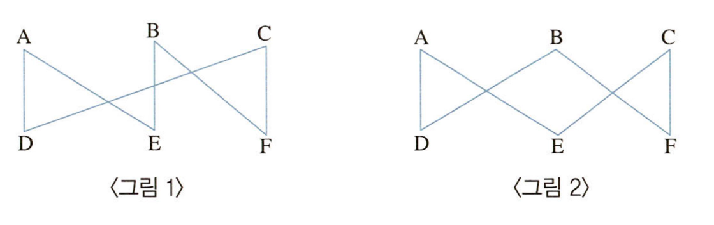
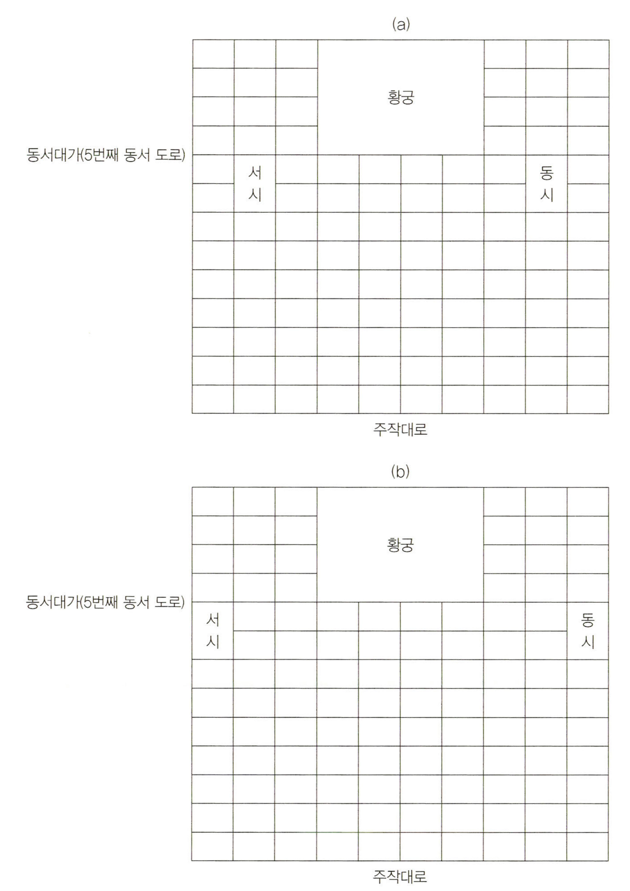

# 출제방향

## 1. 기본 방향

추리논증 영역은 내용 제재를 선택하는 데 있어서 전 학문 분야 및 일상적ㆍ실천적 영역에서 소재를 찾아 추리력과 비판적 사고력을 평가하는 데 출제의 기본 방향을 두었다. 특정 전공자가 유리하거나 불리하지 않도록 영역 간 균형잡힌 제재 선정을 위해 노력하는 한편, 제시문으로 선택된 영역의 전문 지식이 문항 해결에 미치는 영향을 최소화하는 데에도 주력하였다.

대학에서 정상적인 학업과 독서 생활을 통하여 사고력을 함양한 사람이면 누구나 접근할 수 있는 내용을 다루되, 주어진 제시문을 단순히 이해하는 것만으로는, 또한 제시문과 관련된 분야의 지식을 보유한 것만으로는 해결할 수 없고 제시된 글이나 상황을 논리적으로 분석하고 비판할 수 있어야 해결할 수 있도록 문항을 구성하여 사고력 측정 시험이 될 수 있도록 노력하였다.

## 2. 문항 구성

인문, 사회, 자연과학을 소재로 하는 문항들의 경우 소재 활용의 원칙이나 범위에 있어서 예년과 차이가 없었으나, 올해에는 동양 고전에서 자료를 취한 문항(9, 18, 19, 31, 32번)을 다수 포함시켰으며, 법 제재를 다루는 문항의 경우, 법해석 이론, 공법과 사법, 민법과 형법의 제재들을 고루 포함하도록 하였다.

자연과학적 제재를 다루는 문항(13, 14, 15, 16, 17, 30번)의 경우, 계산 등을 통한 수리적인 문제 해결이 아니라 언어적인 이해와 논리적인 추리를 통하여 충분히 문제를 해결할 수 있도록 구성하였다.

논증력을 묻는 문항들은 주어진 논변들을 분석하여 주장과 논거를 찾아내고 그 논리적 관계를 분석하는 문항, 주어진 논변에 대하여 비판하고 평가하는 문항 등 다양한 인지 활동을 골고루 측정할 수 있도록 구성하였다.

## 3. 출제 시 유의점 및 난이도

제시문의 분량 및 내용의 함량은 다수의 수험생이 한정된 시간 내에 문제를 해결하는 데 충분하도록 유의하였으며, 수리추리나 논리게임의 추리 문항의 경우 문항이 지나치게 어려워지지 않도록 노력하였고, 논증이나 논쟁적 자료를 분석하고 비판하도록 요구하는 문항들의 난이도는 예년과 비슷한 수준을 유지하려고 하였다.

내용 영역에 있어서 동양과 서양, 고전과 현대, 국내와 국제 관련 소재를 두루 활용하려고 하였으며, 법학 전공자가 유리하지 않도록 하는 범위 내에서 법 관련 제재를 다양하게 사용하려고 하였다.

2014학년도 법학적성시험은 수험생들에게 주는 인상에서나 실제 정답률에서나 다소 쉬운 정도가 되도록 하기 위해, 추리 문항과 논증 문항을 통틀어서 문제 해결의 열쇠가 쉽게 드러나도록 하는 한편, 고난도의 문항을 최소화하려고 하였다.

---

# 문항별 해설

## 01

### 문항구분

* 문항 성격 : 규범과학(법학) - 반박 및 논쟁

* 평가 목표 : 법해석과 관련한 간략한 논쟁을 읽고 논쟁에 등장하는 세 입장들 간의 차별성과 연관성을 추론해 내는 능력을 평가

* 정답 : (1)

### 제시문 해설

이 문제에서 법문의 의미를 밝힐 때 법률가가 누구의 표상을 기준으로 삼을 것인가와 관련하여 세 가지 입장이 등장한다. 첫 번째 입장(A)은 입법자의 의도를 기준으로 삼아야 한다는 역사적 해석을 지지하는 입장이고, 두 번째 입장(B)은 법문의 의미 확정이 문제시되는 특정 시점의 사회상황 하에서 사회성원 대다수가 무엇을 법문의 의미로 간주 내지 승인하고 있는가를 살펴보아 법문의 의미를 확정해야 한다는 입장이며, 세 번째 입장(C)은 당대의 시대정신을 살펴보아 그에 비추어 법문의 의미를 결정해야 한다는 입장이다. 이 세 입장 간의 차별성과 연관성을 지문을 보고 정확히 추론해 낼 수 있는 능력이 요구된다.

### <보기> 해설

ㄱ. A는 역사적 해석을 지지하는 입장이므로 과거 국회 속기록과 입법 제안서, 이유서 등을 살펴서 입법 당시 입법자가 가졌던 의도를 알아내는 것이야말로 법해석의 가장 중요한 작업이라고 생각할 것이다. ㄱ은 옳은 진술이다.

ㄴ. A는 변화된 사회상황에서 다수가 무엇을 법문의 의미로 표상하는가를 법해석의 기준으로 삼아야 한다는 B에 대해 그러한 상황 변화의 고려는 법문의 의미를 가변적인 것으로 만듦으로써 법문의 의미 확정과 그 적용에서 불확실성을 초래할 수 있다고 반박할 수 있다. ㄴ은 옳은 진술이다.

ㄷ. B와 C는 변화된 사회상황을 반영하여 법문을 해석할 때 누구의 표상을 기준으로 해야 하는지에 대해 의견이 다르다. B는 사회성원 다수의 표상이, C는 시대정신을 구현하는 표상이 그 기준이 되어야 한다고 본다. 하지만 이러한 B와 C의 입장 차이는, 만약 시대정신이라는 것이 이성을 통해 당대의 사회상황에 부합되게 파악된 것이고 또한 사람들이 동일한 이성능력을 보편적으로 갖고 있어서 그러한 것을 파악해 낼 수 있다고 한다면 해소된다. ㄷ은 옳은 진술이 아니다.

ㄹ. B와 C에 따르면 법문의 의미는 법문 그 자체에 단일하게 고정되어 있는 것이 아니라 변화된 시대상황에 따라 새롭게 해석되어야 하는 것이다. ㄹ은 옳은 진술이 아니다.

<보기> 중 ㄱ과 ㄴ만이 옳은 진술이므로 정답은 (1)이다.

## 02

### 문항구분

* 문항 성격 : 규범과학(법학) - 언어추리

* 평가 목표 : 다양한 사실관계를 법률조항에 포섭하여 올바른 결론을 추론해 내는 법적용 능력 평가

* 정답 : (3)

### 선택지별 해설

(1) A와 B가 모두 서울에 주소지를 가지고 있으므로, 제1호에 따라 서울가정법원에 소를 제기하여야 한다.

(2) 서울에 거주하던 A-B 부부 중 A가 부산으로 이사한 경우 A와 B는 더 이상 같은 가정법원의 관할구역 내에 주소지가 없으므로, 제1호가 적용될 수 없다. 그러나 A-B 부부의 최후의 공통의 주소지가 서울이었고, 서울가정법원의 관할구역 내에 여전히 B가 거주하고 있으므로, 제2호에 따라 서울가정법원에 소를 제기하여야 한다.

(3) 서울에 거주하던 A-B 부부 중 A가 부산으로 이사한 경우 A와 B는 더 이상 같은 가정법원의 관할구역 내에 주소지가 없으므로 제1호가 적용될 수 없다. 그러나 A-B 부부의 최후의 공통의 주소지가 서울이었고, 서울가정법원의 관할 구역 내에 여전히 B가 거주하고 있으므로, 제2호에 따라 오로지 서울가정법원만이 관할법원으로 된다. 제3호는 제1호 및 제2호에 해당하지 아니하는 경우에만 적용되는 규정이므로, 제3호에 따라 상대방인 A 주소지 관할법원, 즉 부산가정법원에 제기하는 것은 허용되지 않는다.

(4) 서울에 거주하던 A-B 부부 중 A가 부산으로, B가 광주로 이사한 경우 A와 B는 더 이상 같은 가정법원의 관할구역 내에 주소지가 없을 뿐만 아니라, A와 B 부부의 최후의 공통 주소지인 서울에 A도 B도 거주하고 있지 않으므로, 제1호와 제2호가 모두 적용될 수 없다. 이때에는 제3호에 따라 관할법원이 결정되는데, 동 사안에서는 제3자인 A의 모가 부부 쌍방, 즉 A와 B를 상대로 소를 제기하고 있으므로, 부부 중 일방의 주소지의 가정법원에 제기할 수 있다. 따라서 A의 모는 A의 주소지인 부산가정법원과 B의 주소지인 광주가정법원 중 어느 곳에라도 소를 제기하는 것이 가능하다.

(5) 서울에 거주하던 A-B 부부 중 A가 부산으로 이사한 후 A가 사망하였다면, 부부 중 일방이 사망한 경우로서 제4호에 따라 관할법원이 결정된다. 따라서 생존한 타방, 즉 B의 주소지인 서울가정법원에 소를 제기하여야 한다.

## 03

### 문항구분

* 문항 성격 : 규범과학(법학) - 언어추리

* 평가 목표 : 원고와 피고 간의 입증(증명)책임에 관한 원칙을 문제 상황에 적용하는 능력 평가

* 정답 : (1)

### <보기> 해설

ㄱ. 을이 돈이 생기면 갚겠다고 답변한 점에 비추어 갑이 을에게 돈을 빌려 준 사실에 다툼이 없다. 따라서 갑이 을에게 100만 원을 빌려 주었다는 사실을 증명할 책임이 갑에게 없다는 점을 지적하는 ㄱ은 옳다.

ㄴ. 을은 빌린 돈을 변제했다고 주장하고 있으며 이는 갑의 권리(채권)가 사후에 소멸하였다는 주장이다. 따라서 을이 빌린 돈을 갚았다는 사실을 증명할 책임이 을에게 있다는 점을 지적하는 ㄴ은 옳다.

ㄷ. 을이 돈을 빌린 사실을 부인하고 있으므로 갑이 을에게 돈을 빌려 준 사실에 다툼이 있다. 따라서 갑이 을에게 100만원을 빌려 주었다는 사실을 증명할 책임이 갑에게 있다. ㄷ은 옳지 않다.

ㄹ. 을은 돈을 빌린 것이 아니라 증여받았다고 주장하고 있다. 이는 갑의 권리(채권)가 애초부터 발생하지 않았다는 것으로 갑의 금전대여 주장을 다투는 것이다. 따라서 갑이 을에게 돈을 빌려주었다는 사실을 증명할 책임이 갑에게 있다. ㄹ은 옳지 않다.

<보기> 중 ㄱ, ㄴ만이 옳으므로 (1)이 정답이다.

## 04

### 문항구분

* 문항 성격 : 규범과학(법학) - 언어추리

* 평가 목표 : <규정>의 적용을 받는 주체 및 상황을 <사실관계>와 결합하여 이해하는 능력 평가

* 정답 : (2)

### 제시문 해설

<규정>에 따라 군인ㆍ경찰관 기타 공무원의 직무상 불법행위로 피해를 입은 사람은 국가에 손해배상을 청구할 수 있다. 그러나 군인ㆍ경찰관이 전투ㆍ훈련과 관련된 직무집행 중 (다른 군인ㆍ경찰관 기타 공무원의 직무상 불법행위로 인한) 손해를 입어 다른 법률에 따라 보상금을 지급받을 수 있는 경우에는 국가에 대해 손해배상을 청구할 수 없다. 따라서 A, B, C, E가 차례로 규정 첫부분이 적용되는 사람인지, 규정 뒷부분이 적용될 수 있는 군인ㆍ경찰관에 해당하는지를 구분한 후, 규정 첫부분이 적용되는 사람의 경우에는 D의 직무상 불법행위로 인한 국가배상청구가 가능하고, 군인ㆍ경찰관의 경우에는 D의 직무상 불법행위로 손해를 입었다고 하여도 그 손해를 입은 군인ㆍ경찰관이 전투ㆍ훈련 중이어서 다른 법률에 따라 보상금을 지급 받을 수 있는 경우에는 국가에 대해 손해배상을 청구할 수 없다는 것에 주의한다. 이 경우 다른 법률의 보상금 지급에 관한 단서는 사안에서 고려되지 않는다.

### <보기> 해설

ㄱ. <규정>의 본문에 따라 A는 군인인 D의 직무상 불법행위로 손해를 받은 사람이므로 국가에 배상을 청구할 수 있다. ㄱ은 옳은 추론이다.

ㄴ. <규정> 앞부분은 직무상 불법행위의 유형에 아무런 제한을 두고 있지 않다. <규정> 뒷부분 단서는 “전투ㆍ훈련”이라고 하여 직무집행의 유형을 거론하고 있으나 이 단서는 군인도 경찰관도 아닌 B에게는 적용되는 조항이 아니다. 따라서 B는 D의 전투ㆍ훈련과 무관한 직무상 불법행위로 손해를 받았든, D의 전투ㆍ훈련과 관련된 직무상 불법행위로 손해를 받았든 상관없이, 국가에 대해 배상청구를 할 수 있다. ㄴ은 옳은 추론이 아니다.

ㄷ. C는 승용차의 소유자로서 D의 직무상 불법행위로 자신의 자동차가 파손되었다면 그 역시 <규정>의 앞부분에 따라 국가에 배상청구를 할 수 있을 것이다. ㄷ은 옳은 추론이 아니다.

ㄹ. 군인인 E는 D의 직무상 불법행위로 손해를 받은 사람으로 E의 직무행위는 전투ㆍ훈련과 무관한 경우이므로 규정 뒷부분의 단서에 해당하지 않아 국가에 배상청구를 할 수 있다. ㄹ은 옳은 추론이다.

<보기> 중 ㄱ과 ㄹ만이 옳은 추론이므로 정답은 (2)이다.

## 05

### 문항구분

* 문항 성격 : 규범과학(법학) - 언어추리

* 평가 목표 : 행정소송에서의 무효확인소송과 민사소송에서의 확인소송에 관한 두 입장의 주장으로부터 추론되는 것과 추론되지 않는 것을 구별하는 능력 평가

* 정답 : (3)

### 제시문 해설

민사소송에서의 확인소송은 다른 성질의 소(형성의 소, 이행의 소)가 가능한 경우에는 제기할 수 없다는 것, 즉 다른 소송에 대하여 보충적이다(확인소송의 보충성)는 것이 법학계의 오랜 인식이었다. 행정소송에서의 확인소송, 예컨대 무효확인소송도 확인소송이므로, 다른 행정소송 또는 민사소송의 제기가 가능한 경우에는 허용되지 않는다는 것이 대법원의 확립된 판례였고 이것이 갑의 입장이다. 이러한 대법원의 오랜 판례는, “확인소송은 보충적 소송이다.”를 대전제로, “행정소송인 무효확인소송의 성질은 확인소송이다.”를 소전제로, “그러므로 무효확인소송은 보충적 소송이다.”를 결론으로 하는 전형적 삼단논법 구조에 입각하고 있다.

최근의 대법원판결은 무효확인소송의 보충성을 부인하는 방향으로 견해를 바꾸었는데, 그것이 을의 입장이다. 즉, 행정소송으로서의 확인소송인 무효확인소송의 판결은 그 자체로 실효성이 있으므로, 민사 확인소송과는 달리 다른 소송에 대해 보충적이지 않다는 논거를 사용하고 있다.

### <보기> 해설

ㄱ. 을은 행정소송으로서의 확인소송인 무효확인소송의 판결은 그 자체로 실효성이 있으므로, 민사 확인소송과는 달리, 다른 소송에 대해 보충적이지 않다고 보는 입장이지, 민사소송에서의 확인소송에 대하여는 보충성의 원칙이 요구되지 않는다는 것을 전제하지는 않는다. 을의 입장은 민사소송에서의 확인소송은 보충성이 요구되지만, 행정소송에서의 확인소송은 보충성이 요구되지 않는다는 입장이다. ㄱ은 옳지 않은 진술이다.

ㄴ. 갑은 자신의 마지막 문장에서 행정소송에서의 무효확인소송이 확인소송의 성질을 가지기 때문에 보충성의 원칙이 적용되는 것이라고 주장하고 있으나, 을은 행정소송에서나 민사소송에서나 확인소송의 성질에 관하여는 언급하고 있지 않다. 따라서 지문에 나타난 을의 주장에 비추어 볼 때, 을이 행정소송 중 무효확인소송의 성질이 확인소송임을 부인하는 것으로 판단할 수는 없다. ㄴ은 옳지 않은 진술이다.

ㄷ. 을은 행정소송에는 민사소송에서의 논리, 예컨대 확인소송의 보충성의 논리가 그대로 적용될 수 없다고 주장하며, 확인소송의 보충성을 민사소송에만 한정하고 있다. ㄷ은 옳은 진술이다.

<보기>의 ㄷ만이 옳은 진술이므로 (3)이 정답이다.

## 06

### 문항구분

* 문항 성격 : 규범과학(법학) - 언어추리

* 평가 목표 : 법 조항 사이에 일반적 구성요건과 가중적 또는 감경적 구성요건의 관계가 성립하는지 판단할 수 있는 능력 평가

* 정답 : (2)

### 제시문 해설

X국의 「형법」 제A조의 요건과 제B조의 요건은 일반개념과 특별개념의 관계에 있다. X국의 「형법」 제B조에는 일반개념의 모든 표지(標識)와 그 외에 적어도 한 개 이상의 개념표지가 포함되어 있다. 그와 같은 경우에 특별한 사건에는 특별규범이 적용되어야 하고 일반규범은 배제되어야 한다.

### <보기> 해설

ㄱ에서 “야간에 사람의 주거, 간수하는 저택, 건조물이나 선박 또는 점유하는 방실에 침입하여 타인의 재물을 절취한 자”는 “타인의 재물을 절취한 자”의 특수한 경우이므로 특별관계가 성립한다.

ㄴ에서 두 번째 규정은 “추행, 간음 또는 영리의 목적으로”라는 표지(標識)를 추가적으로 포함하고 있기는 하지만, 사람 중에는 미성년자가 아닌 자도 있으므로 두 번째 규정과 첫 번째 규정 사이에는 서로 특별관계가 성립하지 않는다.

ㄷ에서 “의사, 한의사, 조산사, 약제사 또는 약종상이 부녀의 촉탁 또는 승낙을 받아 낙태”하게 한 경우는 “부녀의 촉탁 또는 승낙을 받아 낙태”한 경우의 특수한 경우이므로 특별관계가 성립한다.

ㄹ에서 “사람의 궁박한 상태를 이용하여 현저하게 부당한 이익을 취득”하는 행위와 “공갈하여 재물의 교부를 받거나 재산상의 이익을 취득”하는 행위는 전혀 다른 행위로서 서로 특별관계가 성립하지 않는다.

<보기> ㄱ, ㄷ을 특별관계의 사례로 하고 있는 (2)가 정답이다.

## 07

### 문항구분

* 문항 성격 : 규범과학(법학) - 반박 및 논쟁

* 평가 목표 : 법적 논쟁에 대한 이해 및 분석력 측정

* 정답 : (4)

### 선택지별 해설

(1) 원고 측이 (가)를 쟁점(1)과 관련하여 자신의 입장을 옹호하는 논거로 사용하려면, 원문을 포털에 그대로 전재하는 경우도 편집권의 행사에 해당한다고 해야 피고의 행위에 의한 피해가 발생한다고 주장할 수 있다.

(2) 피고 측이 (나)를 쟁점(1)과 관련하여 자신의 입장을 옹호하는 논거로 사용하려면, 포털이 행한 원문 기사의 배치나 제목의 간결한 요약은 편집권의 행사가 아니라고 해야 자신의 행위로 인한 피해가 아니라고 주장할 수 있다.

(3) 피고 측이 (다)를 쟁점(2)와 관련하여 자신의 입장을 옹호하는 논거로 사용하려면, 게시물의 존재와 내용에 대한 인식이 있어야 그에 대한 의무위반에 대한 책임이 발생할 수 있다고 주장할 수 있다.

(4) 포털 사이트에 게시물 감시의무를 부과한다면 명예훼손보다 더 큰 희생이 초래될 것이라는 주장 (라)는 피고 측 입장을 대변하고 있다는 점에서, 원고에게 불리한 주장이다. 피고 측이 (라)를 쟁점(2)와 관련하여 자신의 입장을 옹호하는 논거로 사용하려면, (4)의 내용과 반대로 공익이 개인의 이익보다 우선한다는 전제가 필요하다. 따라서 (4)는 옳지 않은 진술로 정답이다.

(5) (마)가 쟁점(2)와 관련하여 피고의 입장을 옹호하는 논거로 사용될 수 없다고 원고 측이 주장하려면, 원고는 명문의 법률규정이 없는 경우라 하더라도 피고 측의 삭제의무가 발생할 수 있다고 주장해야 한다.

## 08

### 문항구분

* 문항 성격 : 규범과학(법학) - 반박 및 논쟁

* 평가 목표 : 각 입장의 내용을 파악하여 각 입장이 어떤 조건 하에서 강화되고 약화되는지 판단 능력 평가

* 정답 : (5)

### 제시문 해설

지문은 16세 미만인 사람에게 성폭력을 저지른 소아 성기호증 환자에게 재범의 위험성이 높다고 판단되는 경우 출소 후 최장 15년 간 약물요법을 실시하는 법안을 둘러싼 찬반논쟁을 소개하고 있다. 반대론자인 갑은 약물요법은 이중 처벌로서 위헌의 소지가 있다는 점, 근본적으로 인간의 미래 행위에 대한 판단인 재범의 위험성 판단을 근거로 약물요법을 시행하는 것은 부당하다는 점, 약물요법은 그에 막대한 예산 투입이 요구된다는 점에서 효용성이 의문시된다는 점을 들고 있고, 찬성론자인 을은 약물요법은 일종의 치료이므로 처벌이 아니라는 점, 미래 행위에 대한 판단에 기초하여 약물요법을 실시하는 것을 부당하다고 하는 것은 우리 사회가 이미 많은 위험성 판단에 기초하여 작동하고 있다는 것을 간과하는 것이라는 점, 피해자에게 매우 심각한 트라우마를 남기는 성폭력의 재범률을 낮추는 데 약물요법은 매우 효과적이라는 점을 들고 있다. 수험생은 두 입장의 주장 요지 및 논쟁의 논리적 전개 과정을 명확히 이해하고 두 입장이 각각 어떤 조건 하에서 강화되고 약화되는지에 대해 정확히 추론할 것이 요구된다.

### 선택지별 해설

(1) 약물요법은 약물 투여를 중단하면 본래 신체 기능의 회복을 가져오므로 신체 기능의 훼손에 해당되지 않는다고 보는 을의 주장은 비록 약물 투여 기간 중 발생한 잠정적인 것이라고 해도 신체 기능의 제한은 어쨌든 신체 기능의 훼손에 해당된다고 한다면 약화된다.

(2) 을은 을에서 약물요법은 재범 기회를 줄여줌으로써 당사자에게 이익이 된다고 주장하고 있는데, 이에 대해 갑은 만약 을의 논리에 따른다면 징역형 역시 당사자를 교화하는 측면이 있다는 점에서 당사자에게 이익인 것이고, 따라서 처벌이 아닌 것이 된다고 하여 을의 논리는 부당하다고 주장할 수 있다.

(3) 을은 을에서 인간의 미래 행위에 대한 예측을 근거로 약물요법을 실시하는 것은 부당하다는 갑에 대해 우리 사회가 이미 많은 미래 예측을 근거로 작동하고 있다는 점을 들어 반박하면서 기상 예보를 그 사례로 들고 있다. 하지만 이런 을의 주장은 약물요법에서 필요한 재범의 위험성 판단은 인간의 미래 행위에 대한 예측인 데 반해 기상예보는 자연현상에 대한 예측이고, 이 두 예측은 그 정확성에서 차이가 난다는 점을 들어 비판될 가능성이 있다. 따라서 을의 주장은 만약 인간행위에 대한 예측의 정확성이 향상될 수 있다면 강화될 것이다.

(4) 갑은 약물요법의 비용 대비 경제적 효율성에 관한 주장이고 을은 재범률 감소에 대한 약물요법의 효과에 대한 주장으로 갑은 을을 받아들여 약물요법이 비록 재범률을 감소하는 데에는 효과적이나 그 투입 예산에 비추어 보면 여전히 비효율적이라고 주장할 수 있다.

(5) 법안의 찬성론자인 을은 약물요법의 효과가 높다는 점을 보여주기 위해 약물 투여를 받은 성폭력범의 재범률이 그렇지 않은 경우보다 매우 낮다는 실험 통계 A를 인용하고 있다. 만약 이 실험 통계 A에서 약물 투여자의 대부분이 초범이고 비투여자의 대부분이 재범이었다면, 을의 주장은 약화될 수는 있어도 강화되지는 않는다. 왜냐하면 초범인 성폭력범 중 일부는 재범성향이 낮은 자일 것이므로, 초범인 경우의 성폭력범의 재범률은 재범인 경우의 성폭력범의 재범률보다 일반적으로, 즉 약물요법의 시행 여부와 관계없이 낮게 나올 것이기 때문이다. 따라서 선택지 (5)는 옳지 않은 진술로 정답이다.

## 09

### 문항구분

* 문항 성격 : 규범과학(법학) - 언어추리

* 평가 목표 : 책임과 인과에 관한 이론을 제시하고 이를 실제 사례에 적용하는 능력을 측정

* 정답 : (2)

### 제시문 해설

A는 행위가 없었다면 결과가 발생하지 않았다고 볼 수 있는 경우 그 행위자는 그 결과에 대하여 책임이 있다고 보는 견해, B는 행위자의 의도에 비추어 직접적 원인에 대해서만 책임이 있다는 견해, C는 일반인의 입장에서 전형적인 원인이라고 판단되는 경우에 책임을 인정하는 견해, D는 피해자가 결과를 회피하는 것이 가능하였을 때는 책임을 부인하는 견해이다.

### <보기> 해설

ㄱ에서 갑의 독약 관리 소홀함이 없었다면 간호사가 그 독약을 사용하여 애인을 죽일 수 없을 것이므로 A에 의하면 갑은 을의 애인의 죽음에 대해 책임이 있다. 따라서 A에 따르면 갑이 독살당한 자의 죽음에 대해 책임이 없다고 한 ㄱ은 옳지 않다.

ㄴ에서 갑이 을의 다리를 부러뜨린 행위는 을이 교통사고로 사망한 결과의 직접적 원인이 아니며 전형적인 원인이라고도 볼 수 없다. 따라서 B와 C에 따르면 갑이 을의 죽음에 대한 책임이 없다. 따라서 ㄴ은 옳은 진술이다.

ㄷ에서 갑이 을을 절벽에서 밀어뜨려 죽이려고 산책을 권유한 행위는 을이 번개에 맞아 죽은 결과의 전형적 원인이 아니다. 따라서 C에 의하면 갑에게 책임이 인정되지 않는다. 따라서 C에 의하면 갑에게 책임이 인정된다고 말하고 있는 ㄷ은 옳지 않다.

ㄹ에서 을이 술을 마시지 말라는 의사의 경고를 따랐다면 죽지 않았을 것인데, 스스로 술을 많이 마셔 질병이 악화되어 사망한 것이므로 D에 의하면 갑에게 책임이 인정되지 않는다. 따라서 D에 의하면 갑에게 책임이 인정된다고 말하고 있는 ㄹ은 옳지 않다.

<보기>의 ㄴ만이 옳으며, 따라서 (2)가 정답이다.

## 10

### 문항구분

* 문항 성격 : 윤리학 - 언어추리

* 평가 목표 : 칸트 윤리설, 경험주의, 정신분석학의 관점에서 ‘양심’에 대한 설명을 간략히 기술한 제시문을 이용하여, 양심의 구비, 양심과 도덕, 양심과 행동에 관한 간단한 명제들이 제시된 관점 모두와 양립하는지 판단하는 능력 측정

* 정답 : (2)

### 제시문 해설

A는 감정주의(emotivism)적 도덕이론과 경험주의 철학의 관점에서의 ‘양심’에 대한 설명으로서, 양심이 타인의 고통에 대한 공감이 학습되고 공유된 결과라고 말하고 있다. 양심이 ‘인류가 공유하는 습관화된 동정심’이라면 인간에게서 널리 공유되고 있을 것이 분명하지만, 모든 인간이 예외 없이 양심을 갖추고 있을 것이라는 주장까지 함축하지 않는다는 점에서 ‘양심 없는 인간의 존재’와는 양립하는 입장이다. 또, ‘양심에서 비롯된 잘못된 행위’와 ‘잘못된 양심’을 명시적으로 언급하고 있으므로 양심과 도덕이 불일치하는 경우도 용인한다. 양심이 습관화된 동정심이라면 양심에 따르지 않는 행동은 얼마든지 가능하며, 양심과 도덕이 일치하지 않을 수 있다고 인정한다면 양심에 맞서 도덕적인 선택을 하는 것이 가능하다는 것을 인정하여야 하므로 이 관점은 행동이 양심과 일치하지 않을 가능성도 인정한다.

B는 칸트의 견해로서 ‘양심이 없다’는 말이 ‘양심을 외면하고 있다’는 뜻이지 실제로 양심을 결여하고 있음을 뜻하는 것이 아니라고 말하는 것에서 ‘양심 없는 인간’은 불가능하다고 보고 있다. 또한, 이 견해에서 ‘양심’이란 실천이성과 동일한 것으로 보편타당한 도덕판단의 주체라고 말하는 점에서 양심과 도덕의 불일치 가능성도 인정할 수 없다. 그럼에도, 개인이 도덕의 명령에 반하는 행동을 하는 경우를 인정하지 않는 것은 아니며, 도덕의 명령에 반하는 행위란 곧 양심의 명령에 반하는 행위이므로 양심의 명령에 따르지 않는 행동의 가능성은 인정하고 있다.

C는 정신분석학의 견해로서 여기서 양심은 부모로부터 전승되는 가치의 담지자인 ‘초자아’의 기능이라고 설명되고 있다. 이 글만으로는 초자아를 갖지 않은 사람이 가능한가에 대하여 판단할 수 없다. 또, 초자아의 기능으로서의 양심의 판단이 언제나 도덕판단과 일치할 것인가 여부에 대해서도 이 글의 설명으로부터 판단하기 어렵다. 다만, 이 글에서 간단히 기술하는바, 신경증적 증후들의 예에서, 개인의 행동이 양심의 요구에 미치지 못하는 경우가 있을 수 있음을 인정하는 것으로 보아, 개인의 행동이 양심의 명령과 일치하지 않을 가능성은 인정하고 있다.

### <보기> 해설

위의 풀이를 <보기>의 진술과 관련하여 요약하면 다음과 같다.

|  | A | B | C |
|---|---|---|---|
| 양심 없는 인간의 가능성(ㄱ) | 인정 | 불인정 | 알 수 없음 |
| 양심과 도덕의 불일치 가능성(ㄴ) | 인정 | 불인정 | 알 수 없음 |
| 행동과 양심의 불일치 가능성(ㄷ) | 인정 | 인정 | 인정 |

그러므로 A\~C 모두와 양립할 수 있는 것은 ㄷ뿐이므로 정답은 (2)이다.

## 11

### 문항구분

* 문항 성격 : 정치경제학 - 분석 및 재구성

* 평가 목표 : 존 스튜어트 밀의 「정치경제학 원리」에서 아담 스미스의 주장을 간단히 비판하는 논증적인 글을 소재로, 일상어로 이루어진 논증문에서 요소들 간의 논리적 관계를 파악하도록 요구하는 논증구조 파악 문항

* 정답 : (5)

### 제시문 해설

제시문은 자본이 증가하면 경쟁도 심화되어 자본의 이윤은 감소한다는 아담 스미스의 주장에 대하여 존 스튜어트 밀이 반박하는 내용으로 되어 있다. 밀은 스미스의 주장을 자본의 증가가 이윤을 감소시키는 이유가 가격 때문이라고 생각한 것이라고 해석하면서(ⓒ를 포함한 문장), 이 주장은 한 상품에 대해서는 타당하지만, 모든 상품에 대해서 적용할 수는 없다고 논증한다(ⓓ를 포함한 문장). 한 상품의 경우에는 투자의 증가로 가격 경쟁이 심화되어 가격이 하락하고 따라서 이윤이 감소하는 것이 맞지만, 모든 업종에서 자본이 증가하여 모든 상품의 가격이 하락한다면 실질가격은 하락하지 않는 셈(ⓔ)이라는 것이 비판의 첫 번째 요점이다. 그리고 모든 업종에서 자본이 증가하는 경우에도 노동의 가격은 하락할 이유가 없으므로 모든 상품의 가격이 하락해도 노동의 가격만은 하락하지 않을 수도 있을 텐데, 이 경우에 실제로 발생한 것은 임금 상승이라는 것(ⓕ)이 비판의 두 번째 요점이다.

### 선택지별 해설

(1) 밀은 한 업종에 있어서는 자본의 증가가 가격을 낮추어 이윤을 감소시킨다는 것에 동의하므로 인용된 스미스의 주장 중 ⓐ에는 동의하고 있다. 그러므로 (1)은 옳은 분석이다.

(2) ⓓ는 밀의 주장으로서 스미스의 주장 ⓑ에 정면으로 충돌하는 진술이다. 그러므로 ⓓ는 ⓑ에 대한 비판으로, (2)는 옳은 분석이다.

(3) 모든 상품에서 가격 하락이 일어나면 가격 하락의 효과가 없어지는데(ⓓ), 그 이유는 모든 상품의 가격이 하락하면 실질 가격은 그대로가 되기 때문(ⓔ)이라는 것. 그러므로 ⓔ는 ⓓ의 근거로, (3)은 옳은 분석이다.

(4) 모든 업종에서 자본이 증가하여 모든 다른 물건들은 가격이 하락하는데 노동만이 가격이 하락하지 않는 유일한 상품이라면, 이윤이 낮아지는 것은 가격의 하락 때문(ⓒ)이 아니라, 임금의 상승 때문(ⓕ)이라는 것이다. 그러므로 ⓕ는 ⓒ를 비판하는 진술이다. (4)는 옳은 분석이다.

(5) 잘못 분석한 것을 찾아야 하므로 정답은 (5)이다. (5)는 ‘ⓕ가 ⓔ의 근거’라고 기술하는데, 제시문에서 ⓕ는 ⓔ(또는 ⓔ가 지지하는 진술인 ⓓ)와 함께 스미스의 주장에 대한 밀의 비판의 요점이다.

## 12

### 문항구분

* 문항 성격 : 사회과학 - 언어추리

* 평가 목표 : 정책안정성을 정치제도 및 선거제도와 연결시키는 가정을 제시한 후 이 가정을 사례들에 적용하여 비교하는 능력을 측정

* 정답 : (4)

### 제시문 해설

지문에 따르면 ‘거부권 행사자’에는 ‘제도적 거부권 행사자’와 ‘당파적 거부권 행사자’가 있다. 대통령중심제 하에서는 당파적 거부권 행사자가 존재하지 않으며, 제도적 거부권 행사자는 대통령과 의회(단원제 의회의 경우 1, 양원제 의회의 경우 2)가 된다. 의원내각제 하에서는 정부를 별도의 제도적 거부권 행사자로 보지 않으므로 제도적 거부권 행사자의 수는 의회가 단원제인가 양원제인가에 따라서만 결정된다. 한편, 의원내각제 하에서는 당파적 거부권 행사자가 존재하는데, 단일정당정부의 경우 1, 연립정부의 경우 연립정부를 구성하는 정당의 수가 당파적 거부권 행사자의 수가 된다. 이에 따라 A\~D국의 거부권 행사자의 수를 계산하면 다음과 같다.

A : 2(제도적 거부권 행사자 : 대통령, 단원제 의회)+0(당파적 거부권 행사자 없음)=2.

B : 3(제도적 거부권 행사자 : 대통령, 양원제 의회)+0(당파적 거부권 행사자 없음)=3.

C : 1(제도적 거부권 행사자 : 단원제)+1(당파적 거부권 행사자 : 소선거구제이므로 가정에 따라 양당제와 단일정당정부 출현)=2.

D : 2(제도적 거부권 행사자 : 양원제)+(2+α)(당파적 거부권 행사자 : 비례대표제이므로 가정에 따라 다당제와 연립정부 출현)=4와 같거나 4보다 크다.

정책안정성은 거부권 행사자의 수와 비례하므로, 다음의 판단이 가능하다.

ㄱ. A국이 B국보다 정책안정성이 높을 것이다 : 옳지 않은 진술이다.

ㄴ. D국이 A국보다 정책안정성이 높을 것이다 : 옳은 진술이다.

ㄷ. D국이 C국보다 정책안정성이 높을 것이다 : 옳은 진술이다.

따라서 정답은 (4)이다.

## 13

### 문항구분

* 문항 성격 : 과학기술 - 언어추리

* 평가 목표 : 제시문을 통해 상관관계의 개념을 이해하고, 이것이 함축하는 바와 상관관계와 인과관계의 구분 그리고 이에 바탕한 추론 능력을 평가

* 정답 : (1)

### <보기> 해설

ㄱ. 지문에 의하면 상관관계는 대칭적이다. 따라서 한 방향 상관관계가 성립한다면, 역방향 상관관계도 성립해야 한다. 흡연이 비만과 부정적 상관관계를 가진다면, 이는 비만도 흡연과 부정적 상관관계를 가짐을 의미한다. 따라서 지문의 상관관계에 대한 정의를 비만과 흡연에 그대로 적용하면, 비만인 사람 중 흡연자의 비율이 비만이 아닌 사람 중 흡연자의 비율보다 작다는 것을 도출할 수 있다. ㄱ은 옳은 진술이다.

ㄴ. 흡연과 비만이 긍정적 상관관계를 가질 경우, 비만과 흡연 사이에도 긍정적 상관관계가 성립한다. 하지만 이때 우리는 비만인 사람 중 흡연자의 비율과 비만이 아닌 사람 중 흡연자의 비율만 비교할 수 있으며, 비만인 사람 중에서 흡연자와 비흡연자의 비율이 어떤지에 대해서는 아무 것도 도출할 수 없다. 이는 상황에 따라 클 수도 있고 작을 수도 있다. 가령, 비만인 사람 중 흡연자의 비율이 10%이고 비만이 아닌 사람 중 흡연자의 비율이 5%라면, 비만과 흡연은 긍정적으로 상관된다. 하지만 이 경우 비만인 사람 중에서 흡연자의 비율은 10%에 불과하므로, 비흡연자의 수가 흡연자의 수보다 9배나 많다. ㄴ은 옳지 않은 진술이다.

ㄷ. 지문에 따르면, 흡연이 고혈압의 원인이라 하더라도, 우리는 이것만으로 이들 사이에 긍정적 상관관계가 성립하는지 여부를 판단할 수 없다. 따라서 우리는 흡연과 심장 발작 사이에 긍정적 상관관계가 있는지 여부를 판단할 수 없다. ㄷ은 옳지 않은 진술이다.

<보기> 중에서 옳은 진술은 ㄱ뿐이므로 정답은 (1)이다.

## 14

### 문항구분

* 문항 성격 : 과학기술 - 언어추리

* 평가 목표 : 기압 차이에 따라 기체의 용해도가 달라지는 원리를 서로 다른 상황, 즉 잠수하는 상황과 우주선 도킹 상황에 유비적으로 적용하여 올바르게 추론할 수 있는지 평가

* 정답 : (4)

### 제시문 해설

이 문제의 풀이를 위해서는 아폴로 우주선과 소유즈 우주선 사이에 기압 차이가 존재하기에 두 우주선 사이를 압력 조절실 없이 이동하는 상황이 잠수부가 물 속으로 들어가는 상황 및 수면 위로 나오는 상황과 유사한 상황이라는 점을 파악해야 한다.

### 선택지별 해설

(1) 제시문에서 압력 조절실을 만든 이유가 우주인이 이를 통과하면서 두 우주선 사이의 압력 차이에 천천히 적응할 수 있게 하기 위한 것이라는 언급이 있으므로, 압력 조절실을 통과하는 과정에서 우주인 혈액 내의 기체 용해도는 천천히 변화하게 될 것이다.

(2) 제시문에서 압력 조절실이 필요했던 이유가 두 우주선 사이의 기압 차이라는 점을 밝혔으므로 이로부터 만약 아폴로 우주선에 산소 외에 다른 기체를 섞어 대기압과 같게 되도록 공급했다면 아폴로 우주선의 기압이 소유즈 우주선의 기압과 같아져 압력 조절실이 불필요할 것이라는 점을 추론할 수 있다.

(3) 제시문에서 압력 조절실 없이 미국 우주인이 소유즈 우주선으로 이동하는 상황은 낮은 압력 조건에서 높은 압력 조건으로 이동하는 상황에 해당된다는 점을 알 수 있고 이는 잠수부가 물 속으로 급격하게 잠수하는 상황과 유사할 것이라는 점을 추론할 수 있다.

(4) 압력 조절실 없이 소련 우주인이 아폴로 우주선으로 바로 이동하는 상황은 압력이 높은 상태에서 압력이 낮은 상태로 이동하는 상황이므로 지문에서 잠수부가 수면으로 급격하게 상승하는 상황에 해당된다. 그러므로 소련 우주인의 혈액 속의 질소가 기체 상태로 바뀔 것이라는 점을 추론할 수 있다.

(5) 제시문에서 압력 조절실의 목적이 압력 차가 있는 두 우주선 사이를 왕복할 때의 위험을 막기 위해서라는 점을 추론할 수 있다. 또한 압력 조절실이 있는 상황에서 설사 남아 있는 위험이 있더라도 그 위험은 미국 우주인이 소유즈 우주선으로 이동할 때보다 소련 우주인이 아폴로 우주선으로 이동할 때가 더 클 것이다.

## 15

### 문항구분

* 문항 성격 : 과학기술(생물학) - 언어추리

* 평가 목표 : 동물세포에서 세포막 유동성을 조절하는 콜레스테롤, 진균의 세포막에서 같은 기능을 하는 에르고스테롤, 그리고 두 종류의 항진균제에 대한 설명으로부터 올바로 추론할 수 있는 능력을 평가

* 정답 : (2)

### <보기> 해설

ㄱ. 제시문에서 진균의 에르고스테롤은 세포막 유동성과 관련하여 다른 동물세포의 콜레스테롤이 수행하는 기능을 담당하고, 케토코나졸은 에르고스테롤의 합성을 방해한다는 것을 알 수 있다. 따라서 케토코나졸로 처리하면 콜레스테롤이 없는 경우와 유사하다는 점을 알 수 있다. 하지만 콜레스테롤이 없는 경우 세포막 유동성은 고온인지 저온인지에 따라 그 변화 양상이 달라지므로 일률적으로 증가한다든지 감소한다고 말할 수 없다. 그래서 ㄱ은 옳지 않은 진술이다.

ㄴ. 제시문에서 암포테리신-B는 진균의 세포막 유동성에 거의 영향을 주지 않고, 일반적으로 세포막 유동성은 고온일 때가 저온일 때보다 더 높다고 서술되어 있으므로, ㄴ은 옳지 않은 진술이다.

ㄷ. 제시문에서 암포테리신-B는 에르고스테롤과 결합하여 세포막에 구멍을 낸다고 서술되어 있다. 그런데 케토코나졸과 암포테리신-B를 동시에 처리하면 케토코나졸로 인해 암포테리신-B와 결합할 에르고스테롤 자체가 줄어들게 되므로, 세포막에 구멍이 나는 정도는 줄어들 것이다. 따라서 ㄷ은 옳은 진술이다.

<보기>에서 옳은 진술은 ㄷ뿐이므로 (2)가 정답이다.

## 16

### 문항구분

* 문항 성격 : 과학기술(생물학) - 언어추리

* 평가 목표 : 체내의 티록신 농도 조절 메커니즘에 대한 설명과 그레이브스병의 원인에 대한 설명을 결합하여 추론할 수 있는 능력을 평가

* 정답 : (1)

### <보기> 해설

ㄱ. 제시문에서 그레이브스병 환자는 TSH 농도와 무관하게 정상인보다 체내 티록신 농도가 높게 유지된다고 설명하였다. 이를 지문 첫 문단의 티록신 농도 조절 메커니즘과 결합하면 티록신 농도가 높아지면 TRH 분비량과 TSH 분비량이 차례로 줄어든다고 하였고 티록신 농도가 높은 상태는 그레이브스병 환자의 특성상 지속되므로 결국 그레이브스병 환자의 TRH와 TSH의 농도는 정상인에 비해 낮게 됨을 추론할 수 있다. ㄱ은 옳은 진술이다.

ㄴ. 제시문의 그레이브스병 환자에 대한 설명으로부터 환자의 TSH가 감소하더라도 TSH를 대신하여 결합하는 항체가 TSH-수용체에 결합하여 티록신 분비가 촉진된다는 것을 추론할 수 있으므로 ㄴ은 옳지 않은 진술이다.

ㄷ. 그레이브스병 환자는 TSH-수용체에 결합하는 특별한 항체를 갖고 있는 것이 특징이다. 그러므로 어떤 이유에서건 TSH-수용체가 부족해지거나 파괴된다면 그 특별한 항체가 결합할 수 있는 TSH-수용체가 줄어드는 것이므로 티록신 합성도 줄어들어, 티록신 농도가 높은 수준으로 유지되는 그레이브스병과 유사한 증상을 보이지는 않을 것이라고 추론할 수 있다. ㄷ은 옳지 않은 진술이다.

<보기> 중 옳은 진술은 ㄱ뿐이므로, 정답은 (1)이다.

## 17

### 문항구분

* 문항 성격 : 과학기술 - 언어추리

* 평가 목표 : 제시문을 통해 대칭적인 암호체계의 기본적인 구조와 장기열쇠와 단기열쇠의 공유 여부를 확인하는 방식을 이해하고, 이로부터 옳게 추론할 수 있는 능력 평가

* 정답 : (4)

### 제시문 해설

주어진 세 단계에 대한 설명을 통해서 각 단계의 목적이 무엇인지 알 수 있다. 최종적인 목적은 제시문에 나와 있다. 즉, 두 사람이 모두 동일한 장기열쇠와 단기열쇠를 공유하고 있는지를 확인하고 ‘제3자’가 단기열쇠를 알아채지 못하게 하는 것이다. 단계(1)은 이를 위한 예비적 작업이다. 단계(2)가 완료되고 채은이 해독한 메시지에 M이 있다면, 채은은 유진이 자신과 동일한 장기열쇠를 갖고 있다는 것을 확인할 수 있다. 단계(3)이 완료되고 유진이 해독한 메시지가 M과 동일하다면, 유진은 상대방 역시 자신과 동일한 장기열쇠를 갖고 있다는 것과 자신이 보낸 단기열쇠 S가 상대방에게 제대로 전달되었다는 것을 알 수 있다.

### <보기> 해설

ㄱ. 단계(2)가 성공적으로 완료되었다고 하더라도 유진은 자신과 채은이 단기열쇠 S를 공유하는지 알 수 없다. 단계(2)에서 유진이 한 것은 S를 보냈을 뿐, 아직 상대방으로부터 아무런 답을 받지 않은 상태이다. 유진은 이 상태에서 상대방이 S를 제대로 받았는지 알 길이 없다. 따라서 ㄱ은 올바른 추론이 아니다.

ㄴ. 단계(2)에서 채은이 자신과 유진이 장기열쇠를 공유함을 안다고 할 수 있으려면 채은이 해독한 메시지에 M이 있어야 한다. 만약 그렇지 못하면, 그 원인은 다양할 수 있다. 예를 들어, 채은과 유진이 다른 장기열쇠를 갖고 있는지 모른다. 만약 유진이 다른 장기열쇠를 사용한다고 하면, M을 암호화하는 열쇠와 해독하는 열쇠가 서로 다른 것이다. 채은이 해독한 메시지에 M이 없다면 이런 일이 일어날 가능성이 있다. 즉 채은은 유진과 자신이 장기열쇠를 공유하지 못하고 있을 가능성을 받아들여야 한다. 따라서 ㄴ은 올바른 추론이다.

ㄷ. 제3자가 M과 유진이 사용한 장기열쇠를 알고 있으며 단계(2)에서 유진이 보낸 메시지까지 안다고 하자. 그렇다면 그는 유진이 사용한 장기열쇠를 이용해서 이 메시지를 해독할 수 있고, 이 속에는 M과 S가 있을 것이다. 그는 M을 알고 있기 때문에, S가 무엇인지도 알 수 있다. 따라서 ㄷ은 올바른 추론이다.

<보기>에서 올바른 추론은 ㄴ, ㄷ이므로 정답은 (4)이다.

## 18

### 문항구분

* 문항 성격 : 인문학(역사) - 수리추리

* 평가 목표 : 병농 일치의 군사 제도를 제안한 황종희의 글로부터 인구, 병력 수, 병역 의무 기간에 관한 진술들을 추론할 수 있는 능력 평가

* 정답 : (2)

### 제시문 해설

17세기 중국의 전체 호구는 1,000만 호, 6,000만 인이었다. 따라서 50인마다 훈련병 1인과 복무병 1인을 차출하면 120만 명의 훈련병과 120만 명의 복무병을 차출할 수 있다. 그런데 10호마다 1인의 복무병을 부양한다고 하였으므로 전체 1,000만 호로 100만 명의 복무병을 부양할 수 있고, 나머지 20만 명은 국가의 부양 부담으로 남는다.

당시 강남에서 차출하는 복무병은 2개조 20만 명, 훈련병은 2개조 20만 명이므로, 이를 토대로 강남의 인구를 추론하면 1,000만(20만×50) 명이 된다.

### <보기> 해설

ㄱ. 17세기 강남 지방에서 20만 명의 복무병을 확보할 수 있다. 복무병은 50인에 1인씩이므로, 강남 지방의 구(口)는 1,000만(20만×50) 명이었을 것이다. 전국 인구가 6,000만 명이므로, 강남 지방에는 전국 인구의 6분의 1이 거주하고 있던 셈이다. ㄱ은 올바른 추론이다.

ㄴ. 복무병 부양은 구(口)가 아니라 호(戶)와 관련된다. 10호가 1인의 복무병을 부양하므로, 전국 1,000만 호는 최대 100만 명의 복무병을 부양할 수 있다. 따라서 국가 재정의 추가 부담 없이 유지할 수 있는 복무병의 최대 수는 100만 명이다. ㄴ은 올바른 추론이다.

ㄷ. 병역 의무자의 궁성 수비는 4년에 한 번씩 돌아온다. 20세부터 30년 동안 병역 의무를 지므로 궁성 수비는 7.5회가 되지만, 20세 또는 21세에 궁성 수비를 맡은 경우는 8회까지 궁성 수비를 맡게 된다. 따라서 궁성 수비를 맡는 기간은 최대 5년이 아니라 8년이다. ㄷ은 올바른 추론이 아니다.

<보기>의 ㄱ, ㄴ만이 올바른 추론이므로 (2)가 정답이다.

## 19

### 문항구분

* 문항 성격 : 인문학(역사) - 논리게임

* 평가 목표 : 오행의 순환 순서를 지문의 추론을 통해 알아내고 그 이후의 순환 순서를 추론하는 능력 평가

* 정답 : (3)

### 제시문 해설

제시문의 두 번째 문단의 정보를 이용하여 각 왕조가 모신 제사를 상생설과 상극설에 따라 표로 그려보면 다음과 같다.

| 왕조 | 한왕조 | 한왕조 이후 1번째 왕조 | 2번째 왕조 | 3번째 왕조 | 4번째 왕조 | 5번째 왕조 | 현 왕조 |
|---|---|---|---|---|---|---|---|
| 상극설 | 토덕 |  | 금덕 |  |  |  | 목덕 |
| 상생설 | 화덕 |  | 금덕 |  |  |  | 토덕 |

오행이 모두 규칙적으로 순환하므로, 상극설이나 상생설에 상관없이 한왕조가 제사드리는 대상은 한왕조 이후 5번째 왕조가 제사드리는 대상과 같고, 한왕조 이후 1번째 왕조에서 제사드리는 대상은 현 왕조가 제사드리는 대상과 같아야 한다. 이것을 표로 나타내면 다음과 같다.

| 왕조 | 한왕조 | 한왕조 이후 1번째 왕조 | 2번째 왕조 | 3번째 왕조 | 4번째 왕조 | 5번째 왕조 | 현 왕조 |
|---|---|---|---|---|---|---|---|
| 상극설 | 토덕 | 목덕 | 금덕 |  |  | 토덕 | 목덕 |
| 상생설 | 화덕 | 토덕 | 금덕 |  |  | 화덕 | 토덕 |

첫 번째 문단의 끝에서 상극설에서는 화 다음에 수가, 상생설에서는 금 다음에 수가 이어진다고 말하고 있으므로 각 왕조가 받든 제사는 다음과 같이 결정된다.

| 왕조 | 한왕조 | 한왕조 이후 1번째 왕조 | 2번째 왕조 | 3번째 왕조 | 4번째 왕조 | 5번째 왕조 | 현 왕조 |
|---|---|---|---|---|---|---|---|
| 상극설 | 토덕 | 목덕 | 금덕 | 화덕 | 수덕 | 토덕 | 목덕 |
| 상생설 | 화덕 | 토덕 | 금덕 | 수덕 | 목덕 | 화덕 | 토덕 |

### <보기> 해설

ㄱ. 위 문항 풀이에 따르면 현 왕조의 직전 왕조는 한왕조 이후 계속 상생설을 따랐으므로 한왕조와 제사 대상이 같다. 따라서 한왕조와 같이 화덕을 받들었을 것이다. ㄱ은 옳은 추론이다.

ㄴ. 위 표의 상극설의 순환 순서에 따르면 현 왕조의 전전 왕조는 수덕을 받들어 흑제에게 제사 지냈을 것이다(제시문에서 오행에 해당하는 오제는 적제(화), 흑제(수), 청제(목), 백제(금), 황제(토)라는 것을 알 수 있다). 그러므로 황제에게 제사 지냈을 것이라는 것은 옳은 추론이 아니다.

ㄷ. 현 왕조의 다음 왕조가 제사드리는 대상은 한왕조 이후 2번째 왕조가 제사드리는 대상과 같다. 그런데 한왕조 이후 2번째 왕조는 상생설을 따르건 상극설을 따르건 금덕을 받을 것이라고 제시문에 나와 있으므로, 백제에게 제사 지낼 것이다. ㄷ은 옳은 추론이다.

<보기>의 ㄱ과 ㄷ만이 옳은 추론이므로 정답은 (3)이다.

## 20

### 문항구분

* 문항 성격 : 논리학 - 언어추리

* 평가 목표 : 주어진 지문의 내용을 이해하여 새롭게 도입된 개념 ‘결정적 정보’를 주어진 상황에 적용하여 추론할 수 있는 능력 평가

* 정답 : (4)

### 제시문 해설

주어진 <관계>만으로는 5명의 증언이 참인지 아닌지 결정되지 않는다. 하지만 아래 해설에서 드러나듯이 D의 증언이 참이 아니라거나 C의 증언이 참이 아닌 것이 밝혀지는 경우 모든 증인의 증언이 참인지 아닌지가 결정된다.

### 선택지별 해설

(1) A의 증언이 참이라고 하자. 이로부터 C의 증언과 D의 증언이 참임이 추론된다. 하지만 B와 E의 증언이 참인지 아닌지는 결정되지 않는다.

(2) B의 증언이 참이라고 하자. 이로부터 E의 증언이 참이 아니라는 것과 D의 증언이 참이라는 것이 추론된다. 하지만 A와 C의 증언이 참인지 아닌지는 결정되지 않는다.

(3) C의 증언이 참이라고 하자. 이로부터는 다른 사람의 증언이 참인지 아닌지 결정되지 않는다.

(4) D의 증언이 참이 아니라고 하자. 그렇다면 <관계>의 두 번째 정보로부터 E의 증언은 참인 것이 추론된다. 또한 세 번째 정보로부터 A의 증언이 참이 아니라는 것이 추론된다. 왜냐하면 만약 A의 증언이 참이라면, D의 증언이 참이 아니므로 세 번째 정보가 거짓 정보가 되기 때문이다. E가 참이라는 사실과 네 번째 정보로부터 B의 증언이 참이 아니라는 것이 추론된다. A의 증언과 B의 증언이 참이 아니라는 사실과 첫 번째 정보로부터 C의 증언이 참임이 추론된다. 이로써 5명의 증언이 참인지 아닌지가 모두 결정되었다. 따라서 ‘D의 증언은 참이 아니다.’는 정보는 ‘결정적 정보’에 해당한다.

(5) E의 증언이 참이 아니라고 하자. 이로부터 D의 증언이 참임이 추론된다. 하지만 A, B, C의 증언이 참인지 아닌지는 결정되지 않는다.

## 21

### 문항구분

* 문항 성격 : 논리학ㆍ수학 - 논리게임

* 평가 목표 : 게임의 결과에 대하여, 주어진 부분적인 정보로부터 게임 결과들 간의 관계를 파악하여 게임 결과에 대한 나머지 정보를 추론하는 능력을 측정한다.

* 정답 : (5)

### 제시문 해설

제시문의 정보로부터 다음 두 가지 경우만 가능하다는 것을 알 수 있다(선은 우세 또는 열세의 관계를 나타내는데, 선 위의 항이 우세한 선수를 나타낸다).

(i) B가 E에 우세한 경우를 생각해 보자. 제시문의 세 번째 조건에 의해 E는 A에게도 열세이므로, E는 A와 B에 열세이다. 따라서 두 번째 조건에 의해 E는 C에 열세일 수 없다. 따라서 첫 번째 조건에 의해 C는 D와 F에 우세해야 한다. 이 경우 B는 E와 F에 우세하게 되므로, 〈그림 1〉의 경우이다.

(ii) B가 E에 우세하지 않는 경우를 생각해 보자. 이 경우 제시문의 첫 번째 조건에 의해 B는 D와 F에 우세할 것이다. 그리고 B가 E에 우세하지 않다면 E는 B에 열세이지 않으며, 따라서 두 번째 조건에 의해 E는 C에 열세이게 된다. 〈그림 2〉의 경우가 이러한 경우다.

### <보기> 해설

ㄱ. A가 D와 E에 우세하고, B가 E와 F에 우세하고, C가 D와 F에 우세한 〈그림 1〉의 경우가 가능하므로 C가 E에 우세하다는 것은 추론되지 않는다. ㄱ은 옳은 추론이 아니다.

ㄴ. 〈그림 1〉과 〈그림 2〉 중 어느 경우라도 F는 B와 C에게 열세이다. ㄴ은 옳은 추론이다.

ㄷ. B가 E에게 우세하면, E는 이미 두 명의 선수(A, B)에게 열세이므로, E는 C에게 열세일 수 없다. 따라서 C는 E에게 우세하지 않고, D와 F에게 우세해야 한다(〈그림 1〉). ㄷ은 옳은 추론이다.

<보기>의 ㄴ, ㄷ만이 옳게 추론되는 진술이므로 (5)가 정답이다.

## 22

### 문항구분

* 문항 성격 : 인문학 - 반박 및 논쟁

* 평가 목표 : 예술 작품의 도덕적 평가와 미적 평가 사이의 관계에 대한 다양한 주장들을 제대로 이해하고 있는지 평가

* 정답 : (5)

### 제시문 해설

갑은 “도덕적으로 훌륭한 작품은 바로 그 이유 때문에 미적으로 뛰어나다.”고 주장하므로 ‘도덕적으로 훌륭하지만 미적으로는 열등한 예술 작품이 있을 수 있다’는 주장(‘주장 A’라고 하자)에는 동의하지 않을 것이다.

을은 “예술 작품에 대해서 도덕적 평가를 할 수는 있지만 그 작품의 미적 성질은 도덕적 성질과 내재적인 관계를 갖지 않는다.”는 견해를 갖고 있기 때문에, 도덕적으로 훌륭하지만 미적으로는 열등한 예술 작품이 있을 수 있다는 것을 인정할 것이다. 따라서 을은 주장 A에 동의할 것이다.

병은 “도덕적으로 나쁜 작품은 바로 그 이유 때문에 미적으로도 열등하다. 긍정적인 사례에는 이와 같은 영향 관계가 없다.”고 주장한다. 즉 도덕적으로 훌륭한 작품의 경우에는 미적으로 뛰어날 수도 열등할 수도 있다는 것이다. 따라서 병도 주장 A에 동의할 것이다.

정은 도덕적으로 훌륭한 가치를 갖지만 미적으로는 형편없는 작품이 있다고 주장한다. 따라서 주장 A에 동의할 것이다.

주장 A에 동의할 사람은 을, 병, 정이므로 정답은 (5)이다.

## 23

### 문항구분

* 문항 성격 : 인문학 - 분석 및 재구성

* 평가 목표 : 논증의 구조를 파악한 후 그 추론과정에서 사용된 숨겨진 전제와 사용된 원리가 무엇인지 파악하는 능력 평가

* 정답 : (4)

### 제시문 해설

필로누스는 우리가 느끼는 뜨거움이나 차가움이 사물에 있는가 아니면 우리의 마음에 있는가(마음에 지각된 것으로만 존재하는가)의 질문을 던지고 있다.

### <보기> 해설

ㄱ. 하일라스는 강렬한 뜨거움이나 차가움은 불쾌감이라는 전제로부터, 이것들은 사물에 있는 것이 아니라는 결론을 내리고 있다. 이는 쾌감이나 불쾌감(강렬한 뜨거움이나 차가움)이 그것을 지각하는 주체에만 존재하는 것임을 전제해야 도출되는 주장이다. ㄱ은 옳은 진술이다.

ㄴ. 하일라스는 강렬한 것보다 덜한 정도의 뜨거움이나 차가움은 통증(쾌감/불쾌감)과 무관한 것이며, 그것들을 뜨거움이나 차가움으로 지각할 뿐 아니라 그 정도의 지각이 가능하다는 전제로부터, 그것들은 사물에 있다고 결론 내리고 있다. 이는 지각된 일부의 성질은 사물에 존재한다는 이야기로, 인간이 지각할 수 없는 사물의 성질이 존재하는지 그렇지 않은지의 여부와는 전혀 무관하게 이루어지는 추론이다. ㄴ은 옳은 진술이 아니다.

ㄷ. 하일라스는 어떤 것이 동시에 차기도 하고 뜨겁기도 할 수는 없다는 것을 전제로 하면서, 미지근한 물의 사례를 통해 한 손은 차게 느끼고 다른 한 손은 뜨거움을 느끼는 경우를 제시한다. 여기서 우리의 손이 느끼는 뜨거움과 차가움이 그 물에 있다고 말한다면, 그 물이 동시에 차기도 하고 뜨겁기도 할 수 있다는 것을 인정하는 것이 되어 앞의 전제와 모순되는 주장을 하게 되므로, 그 주장이 참일 수 없다고 결론 내리고 있다. ㄷ은 옳은 진술이다.

<보기> 중 옳은 진술은 ㄱ과 ㄷ이므로 정답은 (4)이다.

## 24

### 문항구분

* 문항 성격 : 사회과학 - 반박 및 논쟁

* 평가 목표 : 제시문의 논쟁을 읽고, 각 주장의 논거를 강화하는 진술과 약화하는 진술을 올바로 구분할 수 있는 능력을 평가

* 정답 : (3)

### 제시문 해설

A는 경제 발전을 위해서 대중 교육이 필요하며, 한 나라의 대중 교육의 수준은 그 나라의 고교 진학률로 평가되어야 한다고 주장한다. 그리고 경제 발전을 위해서 전문 지식인이 필요한 것은 사실이지만, 대중 교육을 통해서 국민의 전반적인 지식수준이 향상될 때 그러한 전문 지식인도 양성될 수 있다고 주장한다.

반면에 B는 문맹률을 토대로 대중 교육 수준을 판단하여 대중 교육 수준과 경제 성장 사이에 상관관계가 없다고 A를 반박하고, 경제 발전을 위해서는 대중 교육이 아니라 전문 지식인 육성을 위한 엘리트 교육이 필요하다고 주장한다.

### 선택지별 해설

(1) 경제 발전을 위해서는 대중의 지식수준을 높여야 하고 따라서 대중 교육이 경제 발전을 위해서 중요하다는 A1의 주장에 대해서, B1은 대중의 지식수준이 높지 않음에도 비약적으로 발전한 사례를 들어 논박하고 있다. B1이 A1의 주장을 논박하기 위해서 제시한 반례는 어떤 전제 없이 반례로서 설득력이 있다.

(2) A2는 자신의 앞의 주장(A1)에 대해서 B가 반례를 통해서 비판하자, 대중의 지식수준의 기준은 문맹률이 아니라 고교 진학률이라고 주장함으로써 그 비판에 답한다. 이에 대해 “문맹률이 낮아져도, 즉 대중의 지식수준이 높아져도 경제 성장이 별로 안 된다.”고 응수하는 것은 적절하지 않다. 그러한 응수에 대해서 A2는 여전히 대중의 지식수준을 판단하는 기준은 문맹률이 아니라 고교 진학률이라고 답할 것이기 때문이다.

(3) B2의 논증을 정리하면 다음과 같다.

1. 경제 발전을 위해서는 전문 지식이 필요하다.
2. 전문 지식을 가진 전문 지식인은 대중 교육이 아니라 엘리트 교육에 의해 육성될 수 있다.
3. 그러므로 경제 발전을 위해서는 엘리트 교육을 해야 한다.

그런데 만약 보편적인 대중 교육의 확대를 통해서도 경제 발전을 위한 전문 지식을 얻을 수 있다면 이 논증의 전제 2는 성립하지 않는다. 따라서 B2는 보편적인 대중 교육의 확대를 통해서는 경제 발전에 필요한 전문 지식을 얻기 어렵다는 점을 전제해야 한다. 그러므로 (3)은 옳은 분석이다.

(4) A3는 경제 발전을 위해서 필요한 전문 지식인을 육성하기 위한 교육이 불필요하다고 주장하지 않는다. A3가 주장하는 것은 보편적인 대중 교육을 통해서 대중의 지식수준이 높아지지 않으면 전문 지식인을 육성하기 어렵다는 점, 따라서 대중 교육이 선행되어야 한다는 점이다. A3는 대중 교육만으로 전문 지식인을 육성할 수 있다고 주장하고 있지 않다.

(5) 이 전체 논증의 쟁점은 한 나라가 경제 발전을 이루기 위해서 관심을 가져야 할 교육이 대중 교육인가, 엘리트 교육인가이다. 이에 대해서 A는 대중 교육이 보다 중요하다는 견해를, B는 엘리트 교육이 보다 중요하다는 견해를 제시하고 있지만, 그 둘은 경제 발전을 위해서 전문 지식인이 필요하다는 점에 대해서는 동의하고 있다.

## 25

### 문항구분

* 문항 성격 : 사회과학 - 반박 및 논쟁

* 평가 목표 : 저출산이 경제와 고령화 등의 사회 문제에 미치는 영향을 바라보는 두 가지 대립되는 입장에 대한 이해를 바탕으로 각 입장의 설득력을 높이게 하거나 낮추게 하는 근거를 판단할 수 있는지 평가

* 정답 : (4)

### 제시문 해설

(가)와 (나)는 저출산이 경제 및 사회에 미치는 영향에 대한 두 가지 대립되는 견해이다. (가)는 저출산으로 인한 인구의 감소가 경제 활동 인구의 감소로 이어져 국가 경제력이 낮아지고, 그것이 고령화와 결합될 경우 경제 활동 인구 층의 노인 인구에 대한 부양 부담이 커져 사회 문제로 발전할 가능성을 제기하고 있다. 그리고 저출산은 젊은 세대의 자녀 양육에 따른 경제적 부담, 직업의 영위와 양육을 동시에 할 수 있도록 지원해 주는 다양한 사회적 지원 시스템의 부족에서 주로 기인한다고 분석한다. 결론적으로 (가)는 젊은 세대들의 저출산을 초래하는 사회적 환경의 개선을 통해 출산이 확대되면 경제 활동 인구가 증가하여 국가 경제력이 향상되고 향상된 경제력을 통해 노인 인구의 부양 부담이 낮아질 것으로 전망하고 있다.

이에 대해 (나)는 두 가지 근거를 들어 저출산이 문제라는 (가)의 견해에 대해 동의하지 않는다. 첫째, 현대 경제는 더 이상 인간의 육체 노동에 기반을 둔 경제 활동에 의해 좌우되지 않는다. 대신 기술적 진보에 기반을 둔 제조업 생산력, 서비스 노동, 정신 노동 등이 지식 정보 사회의 중요한 경제력의 원천이라고 주장한다. 지식 정보 사회에서는 더 이상 인구수가 한 사회의 경제력의 결정적 요인이 되지 않기 때문에 저출산으로 인한 국가 경제력 약화를 문제 삼을 수 없다는 것이다. 물론 (나)는 저출산으로 인해 인구가 점차 감소할 경우 노인 인구 비율이 상대적으로 높아져 젊은 세대의 부양 부담이 높아지거나, 과학 기술적 진보로 인해 과거에는 사람이 담당했던 일들이 기계가 맡게 됨으로써 실업률이 증가하는 등의 사회 문제가 야기될 가능성을 인정한다. 그렇지만 이러한 문제들은 정보 혁명과 과학 기술적 진보로 인한 사회적 경제력이 향상되고 부가가치 창출이 확대될 경우 충분히 극복 가능하다고 판단한다.

### 선택지별 해설

(1) (가)는 저출산의 원인으로 젊은 세대의 양육에 따른 경제적 부담을 제시하고 있으므로, 양육 수당과 무상 교육의 확대는 젊은 세대의 경제적 부담을 완화함으로써 출산율을 높일 수 있을 것으로 전망한다. 그리고 (가)의 주장으로부터 출산율이 높아지면 경제 활동 인구가 증가하고 이는 다시 국가 경제력 향상을 낳을 것이라고 추론할 수 있다. 따라서 양육 수당과 무상 교육의 확대로 국가 경제력이 높아진다는 사실이 밝혀진다면, (가)의 설득력은 높아진다. (1)은 옳은 평가로 오답이다.

(2) (나)는 저출산이 현대 경제에서 더 이상 국가 경제력을 결정하는 주요 요인이 아니라고 주장하고 있으므로, 저출산이 장기화되더라도 사회적 생산력이 감소되지 않는다면 (나)의 주장에 대한 설득력을 높이는 것이다. 따라서 (2)는 옳은 평가로 오답이다.

(3) (가)는 고령화 문제의 효과적인 해결책으로서 출산율이 높아져야 한다는 점을 들고 있기 때문에, 노인에게 적합한 일자리를 많이 만드는 것에 의해 고령화 문제가 해결될 수 있다면 (가)의 주장은 설득력이 낮아진다. 따라서 (3)은 옳은 평가로 오답이다.

(4) (나)는 저출산으로 인해 인구가 감소해도 과학 기술적 혁신을 통해 국가 경제력을 향상시킴으로써 노인 인구를 포함한 전체 인구의 삶의 질이 향상된다고 주장하는 것으로 볼 수 있다. 따라서 인구가 감소해도 과학 기술 혁신을 통해 인구 전체의 삶의 질이 향상된다는 사실이 밝혀진다면 (나)의 설득력은 낮아지는 것이 아니라 높아진다. 따라서 (4)는 옳지 않은 평가로 정답이다.

(5) (가)는 저출산이 경제 활동 인구를 감소하여 젊은 세대의 노인 부양 부담을 가중함으로써 세대 간 갈등을 낳을 수 있다고 주장한다. 즉 부양 부담을 둘러싼 세대 간 갈등의 원인은 저출산이라고 주장한다. (나)는 정보 혁명이나 기술적 진보에 의해 사회적 생산력이 증대될 경우 노인층을 포함한 인구 전체를 경제적으로 부양할 수 있다고 주장한다. 즉 (가)와 (나)는 국가 경제력 향상의 방법으로 각각 출산율 제고와 과학 기술의 진보를 주장한다는 점에서 의견의 차이를 보이지만, 국가 경제력 향상이 노인을 포함한 전체 인구에 대한 부양 부담에 따른 세대 간 갈등을 완화시킬 것이라는 점에서는 의견을 같이 하고 있다. 따라서 국가 경제력 향상이 부양 부담에 따른 세대 간 갈등을 완화한다는 사실이 밝혀지더라도 (가)와 (나)의 설득력은 낮아지지 않는다. (5)는 옳은 평가로 오답이다.

## 26

### 문항구분

* 문항 성격 : 사회과학 - 분석 및 재구성

* 평가 목표 : 사형 찬성론자에게 불리한 경험적 자료를 무력화하거나 이를 우회하는 데 사용될 수 있는 반박 자료나 논리적 근거들이 적절한지 평가할 수 있는 능력 측정

* 정답 : (5)

### 제시문 해설

사형 제도가 살인 범죄율을 억제할 수 있다고 주장하는 사형 찬성론자들은 사형 제도가 도입된 지역의 살인 범죄율이 그렇지 않은 지역보다 낮다는 사실을 입증해야 한다. 하지만 〈표〉는 1급 살인, 2급 살인 모두 사형 제도가 있는 지역(주)이 없는 지역(주)보다 살인 범죄율이 제시된 두 개 연도에서 모두 더 높다. 이는 사형 찬성론자들에게 불리한 경험적 증거이다. 이를 무력화하기 위해서는 〈표〉에 사형 제도의 효과가 충분히 반영되어 있지 않았을 가능성을 사형 찬성론자들이 제기할 수 있어야 한다.

### <보기> 해설

ㄱ. 사형 제도가 있다는 사실 자체만으로는 살인 범죄율에 직접적으로 영향을 줄 수 없고, 구체적으로 사형이 집행되어야 일반 사람들이나 범죄자들에게 범죄 억제 효과가 있다는 주장이다. 이는 사형 찬성론자들이 제시할 수 있는 논거이므로 옳은 진술이다.

ㄴ. 살인 범죄율은 사형 제도뿐만 아니라 다양한 사회적 요인에 의해 영향을 받을 수 있다. 사형 제도의 억제 효과로 인해 살인 범죄율이 낮아지는 정도보다 해당 지역의 여러 가지 범죄 유발 요인으로 인해 살인 범죄율이 높아지는 정도가 더 크다면, 사형 제도의 살인 범죄 억제 효과는 가려질 수 있다. 이는 사형 찬성론자들이 제시할 수 있는 논거이므로 옳은 진술이다.

ㄷ. 범죄 억제 효과가 있는 제도는 설령 그것이 폐지되더라도 당분간 지속될 수 있다. 이는 사람들이 제도의 폐지를 미처 인식하지 못하거나 인식하더라도 그 제도가 유지될 때의 일반적인 행동 패턴이 일시적으로 유지되기 때문에 가능한 일이다. 사형 찬성론자들의 입장에서는 현재 사형 제도가 없는 주에서 1967년 직전까지 오랫동안 사형 제도가 실시되고 있었다면 그 효과가 1967년과 1968년에 이어질 수 있으므로 과거에 사형 제도 실시 유무와 그 기간을 살펴봐야 한다는 주장을 제기할 수 있다. 따라서 옳은 진술이다.

<보기>의 ㄱ, ㄴ, ㄷ 모두 옳은 진술이므로 정답은 (5)이다.

## 27

### 문항구분

* 문항 성격 : 사회과학 - 판단 및 평가

* 평가 목표 : 확실성, 엄격성, 신속성의 세 요소를 포함하고 있는 범죄 억제 이론을 이해하고 이 이론을 강화하는 사례와 약화하는 사례를 판단할 수 있는 능력 평가

* 정답 : (1)

### 제시문 해설

제시문의 설명에 따르면, 이론은 행위자가 행위의 잠재적 이득과 행위에 따른 고통에 대한 합리적 계산을 통해 범행 여부를 판단한다고 본다. 이론은 범죄가 억제되기 위해서는 형벌이 엄격하거나 확실하고 형벌의 적용이 신속하게 이루어져야 한다고 주장한다. 또한 억제 효과의 세 가지 요인 중 확실성은 엄격성이나 신속성보다 더 중요하다고 보고 있으며, 엄격성은 합리적 판단을 많이 요하는 범죄 유형에 더 많은 영향을 미치고, 신속성은 재산 범죄에 더 많은 영향을 미친다고 주장한다.

### 선택지별 해설

(1) <이론>은 행위에 따른 이득과 고통을 합리적으로 계산할 수 있으며, 범죄로 인한 이득보다 처벌의 고통이 더 크다는 것을 생각할 수 있어야 형벌의 억제 효과가 작동할 수 있다고 전제한다. 처벌의 고통이 이득보다 더 크다는 것을 생각할 수 있으려면 위반 행위에 대한 특정 처벌이 존재한다는 것과 실제로 처벌받을 가능성이 있다는 것을 알고 있어야 한다. 범죄 행동에 따르는 처벌이 없다고 생각하거나 이를 알고 있더라도 자신이 처벌받을 가능성이 낮다고 믿을 경우에는 그 행동에 대한 억제 효과가 거의 없게 된다. 따라서 사람들이 공식적인 제재를 알지 못하거나 범죄를 저지르더라도 처벌의 가능성이 희박하다고 믿을 경우 처벌의 억제 효과가 거의 없다고 한다면, <이론>은 약화되지 않는다. 따라서 (1)은 옳지 않은 진술로 정답이다.

(2) 집중적인 수사와 형사절차의 간소화를 통해 형사 제재까지 소요되는 시간을 단축하려는 것은 <이론>의 신속성에 해당한다. 사기 범죄는 재산 범죄에 해당한다. 신속성이 사기 범죄율을 낮추는 것은 <이론>으로부터 기대할 수 있는 결과이므로 이를 강화한다.

(3) 형량을 높이는 것은 형벌의 엄격성에 해당한다. 범행에 사전 계획이 요구되는 은행 강도가 우발적인 살인 행위보다 더 합리적인 판단이 많이 개입된다고 할 수 있다. <이론>에서 엄격성은 합리적인 판단이 많이 개입하는 범죄에 더 효과적이라고 서술하고 있으므로, 형량을 높이는 일이 은행 강도 발생률을 낮추는 데는 효과적이나 우발적 살인 범죄율을 낮추는 데는 그리 효과적이지 않다는 결과는 <이론>을 강화하는 경험적 증거가 될 수 있다.

(4) 공소 제기 기간을 단축한다는 것은 범죄의 발생에서 기소까지 걸리는 시간을 줄인다는 의미이므로 신속성에 해당한다. 검거율을 높이는 것은 범죄자의 체포 확률을 높이는 것을 의미하므로 확실성에 해당한다. <이론>은 확실성이 엄격성이나 신속성보다 더 효과적이라고 말하고 있으므로, 폭력 범죄에 대한 신속성이 확실성보다 더 효과적이라면 <이론>은 약화된다.

(5) 음주 단속을 강화할 경우 체포될 가능성이 높아지므로 이는 확실성의 요소를 강화하는 경우에 해당한다. 형량을 높이는 것은 처벌을 엄격하게 한다는 의미이므로 엄격성에 해당한다. <이론>은 확실성이 엄격성보다 더 효과적이라고 하고 있으므로, 음주 단속을 강화하는 것이 형량을 높이는 것보다 음주 운전 예방에 더 효과적이라면 <이론>은 강화된다.

## 28

### 문항구분

* 문항 성격 : 사회과학 - 분석 및 재구성

* 평가 목표 : 공식 범죄 통계로부터 범죄 발생 추이를 예측하는 주장을 전개할 때 필요한 전제를 찾을 수 있는 능력 평가

* 정답 : (5)

### 제시문 해설

전체 범죄의 추이를 알기 위해서는 공식 범죄 통계에 포함된 범죄 건수 외에 공식 통계에 포함되지 않은 암수 범죄가 얼마나 되는지 알아야만 한다. 하지만 해마다 암수 범죄가 얼마나 발생하는지는 정확히 알 수 없다. 다만 발생한 범죄 중 공식 통계에 포함되는 비율이 얼마나 되는지 알 수 있다면 암수 범죄의 발생량을 추정할 수 있다. 공식 통계는 신고되거나 형사 사법 기관이 인지한 범죄에 기초하여 작성되므로 암수 범죄 건수는 신고율 혹은 인지율에 의해 영향을 받는다.

### <보기> 해설

ㄱ. 갑의 추리는 공식 범죄 통계 건수의 추이로부터 전체 범죄 건수의 추이를 추리하는 것이다. 구체적인 설명을 위해 가상의 예를 보자(아래 표 참조).

| 연도 | 2000년 | 2001년 | 2002년 | 2003년 |
|---|---:|---:|---:|---:|
| 공식 통계 범죄 건수 | 100건 | 200건 | 300건 | 450건 |
| 전년 대비 공식 통계 범죄 건수 증가율 |  | 100% | 50% | 50% |
| 전년 대비 실제 범죄 건수 증가율(추정) |  | 100% | 50% | 50% |

위 표에서 2001년에 전년 대비 공식 통계 범죄 건수는 100% 증가한 것을 토대로 실제 범죄 건수 증가율도 100%라고 추정하고, 2002년에 전년 대비 공식 통계 범죄 건수가 50% 증가한 것을 토대로 실제 범죄 건수 증가율도 50%라고 추정하는 것이 갑의 추리 방식일 것이다. 실제 범죄 건수는 공식 통계 범죄 건수와 암수 범죄 건수의 합이므로, 이런 추리가 성립하기 위해서는 암수 범죄 건수의 증가율도 공식 통계 범죄 건수의 증가율과 동일해야 한다는 전제가 필요하다. 그러나 이런 추리가 성립하기 위해 암수 범죄의 전년 대비 증가율이 매년 일정하다는 전제는 필요 없다. 위 예에서 2002년의 암수 범죄의 전년 대비 증가율이 2001년과 동일하게 100%라고 가정하면, 2002년의 전년도 대비 공식 통계 범죄 건수 증가율이 50%라는 것을 토대로 2002년의 전년도 대비 실제 범죄 건수 증가율이 50%라고 추리하는 것은 잘못일 것이다. 따라서 ㄱ은 갑의 추리가 설득력을 갖기 위해 전제되어야 하는 것은 아니다.

ㄴ. 갑은 범죄 유형별 공식 범죄 통계의 추이로부터 범죄 유형별 범죄 건수의 추이를 추리한다. (범죄 유형별로) 발생한 범죄 사건 중 신고된 사건의 비율이 매년 달라진다면, 공식 범죄 통계 건수의 추이로부터 발생한 실제 범죄 사건 건수의 추이를 추론하는 것은 정당화되지 않는다. 예컨대 성범죄 신고율이 2009년에는 20%였지만 2010년에는 40%로 증가하였다면, 공식 성범죄 통계가 2009년의 1만건에서 2010년의 2만건으로 2배 증가하였다고 하여도 실제 성범죄 발생 건수도 2배 증가하였다고 추론하는 것은 잘못일 것이다. 2009년과 2010년의 실제 성범죄 발생 건수가 동일하지만 단지 성범죄 신고율이 2배로 높아져서 성범죄 통계가 2배 증가했기 때문이다. 따라서 갑의 추론이 설득력을 갖기 위해서는 발생한 범죄 사건 중 신고된 사건의 비율이 범죄 유형별로 매년 일정해야 한다. 따라서 ㄴ은 갑의 추론이 설득력을 갖기 위해 전제되어야 하는 것이다.

ㄷ. 형사 사법 기관이 신고를 받거나 인지한 사건들을 범죄 통계에 반영하는 기준과 방식에 일관성이 없다면, 발생한 범죄 사건 중 공식 범죄 통계에 잡히는 사건의 비율이 매년 달라질 수 있다. 이 경우 공식 범죄 통계 건수의 추이로부터 실제 범죄 건수의 추이를 추론하는 것은 정당화되지 않는다. 따라서 ㄷ은 갑의 추론이 설득력을 갖기 위해 전제되어야 하는 것이다.

<보기>의 ㄴ, ㄷ만이 갑의 추론이 설득력을 갖기 위해 전제되어야 하는 명제이므로 (5)가 정답이다.

## 29

### 문항구분

* 문항 성격 : 사회과학(인지 심리학) - 판단 및 평가

* 평가 목표 : 착시현상을 설명하는 가설을 제시한 후, 그 가설을 강화하는 사례와 그렇지 않은 사례를 판단하는 능력을 측정

* 정답 : (4)

### 제시문 해설

뮐러-라이어 착시는 동일한 길이의 두 직선이 쌍화살표 모양이나 역쌍화살표 모양이냐에 따라 길이가 다르게 보이는 착시이다. 리처드 그레고리는 우리의 입체적인 모서리에 대한 평소의 시각 경험이 배경 지식을 이루고, 이 배경 지식이 우리의 평면적 형태의 지각에 영향을 미치는 것이라는 가설을 통해 이 착시를 설명하고 있다. 이 문항은 이 가설을 강화하는 사례와 이 가설과는 무관하거나 오히려 약화하는 사례가 무엇인지 구분할 수 있는 능력을 평가하는 문제이다.

### 선택지별 해설

(1) 이는 우리처럼 3차원 모서리를 경험하지 않아도 뮐러-라이어 착시가 일어나는 경우로, 착시가 3차원 형태에 대한 우리의 지각 방식과 무관하게 일반적으로 나타나는 사례에 해당하여, <가설>을 강화하는 사례가 아니다.

(2) 가설이 옳다면 양 끝이 화살표 모양이 아니라 둥근 곡선 모양의 선분을 볼 경우 우리의 지각은 입체적 모서리와 연관된 배경지식의 영향을 받지 않을 것이므로 착시가 일어나지 않아야 한다. 그럼에도 착시가 일어난다는 주장이므로, 가설을 약화하는 사례이다.

(3) 자로 두 선분의 길이를 재서 서로의 같음을 확인하고 난 뒤에도 뮐러-라이어 착시가 여전히 사라지지 않는다는 것은 뮐러-라이어 착시가 쉽게 사라지지 않는 견고한 현상이라는 것만을 보여준다. 따라서 이것은 입체적인 모서리의 시각 경험이 뮐러-라이어 착시를 일으킨다는 <가설>을 강화하는 사례라고 볼 수 없다. <가설>을 강화하지도 약화하지도 않는 중립적인 사례로 볼 수 있다.

(4) <가설>에 의하면 뮐러-라이어 착시는 모서리에 관한 우리의 입체적 시각 경험이 배경 지식으로 작용하여 평면적 형태의 지각에 영향을 끼치기 때문에 발생한다. 따라서 모서리에 관한 시각 경험이 없을 경우 뮐러-라이어 착시를 일으키는 배경 지식이 없으므로 뮐러-라이어 착시가 발생하지 않을 것이다. 그러므로 모서리를 가진 직선형 건물이나 사물에 대한 경험이 없는 원주민 부족이 뮐러-라이어 착시를 거의 경험하지 못한다면, 이것은 <가설>을 강화하는 사례이다.

(5) <가설>은 일상적인 입체적 시각경험이 평면적 도형의 지각에 영향을 끼친다는 설명이다. 이 경우는 입체에 대한 경험에만 해당하여 <가설>과는 무관한 사례이다.

## 30

### 문항구분

* 문항 성격 : 자연과학(생물학) - 판단 및 평가

* 평가 목표 : 다윈의 『종의 기원』에 등장하는 두 견해 사이의 공통점과 차이점을 파악하고 각 견해가 수용할 수 있는 주장에 대해 판단할 수 있는 능력 평가

* 정답 : (4)

### 제시문 해설

(가)에서는 중간 형태가 과거에만 있었는지 아니면 현재에 있는지의 여부로 종과 변종을 구별할 수 있다는 견해가 제시되었고, (나)에서는 결국에는 개체들 사이의 차이를 임의적으로 구별한 것이 종 또는 변종이라는 견해가 제시되었다. 이를 정확히 파악하여 각 견해가 주장하고 있는 것과 주장할 수 없는 것을 판단한다.

### 선택지별 해설

(1) (가)는 중간 형태가 현재 존재하는지 여부에 따라 종과 변종을 구분할 수 있다고 말하고 있는 반면, 종이란 분류의 편리함을 위해 임의적으로 이름 붙인 것에 불과하다는 주장은 (나)가 하고 있으므로 오답이다.

(2) (나)는 종 분류가 임의적이라고 주장하고 있는 반면, 종과 변종의 차이는 그 둘 사이의 연결 고리가 현재 존재하는지의 여부라는 주장은 (가)가 하고 있으므로 오답이다.

(3) 종의 본질을 찾는 노력이 헛된 일이라는 견해는 (나)가 분명하게 말하고 있으므로 (가)에 대한 판단과 무관하게 오답이다. (가)는 종의 본질을 어떻게 이해하는지에 따라 그것을 찾는 노력이 헛된 일인지에 대해 다른 판단을 할 수 있다.

(4) (가)와 (나)의 차이점에도 불구하고 종이 다른 종들과 구별될 수 있는 불변하는 속성을 가지고 있다는 견해를 반대한다는 점에서는 일치하고 있다. (나)의 경우에는 마지막 문장에서 이를 명시적으로 밝히고 있고, (가)의 경우에도 중간 형태에 대한 설명에서 종이 불변하는 속성을 갖는다는 생각과 모순되는 주장(변종과 종은 중간 형태가 현재에 있는지 아니면 과거에만 있었는지에 따라 식별된다)을 하고 있다. 그러므로 (4)가 적절한 분석으로 정답이다.

(5) 종과 변종 사이의 차이가 개체들 사이의 차이보다 그 정도가 큰 것일 뿐이라는 견해는 (나)가 말하고 있으므로 (가)에 대한 판단과 무관하게 오답이다. (가)의 경우는 종과 변종을 구별하는 차이가 현재 중간 형태가 존재하는지의 유무에 있다고 보기에 이 견해를 받아들인다고 생각하기는 어렵다.

## 31

### 문항구분

* 문항 성격 : 인문학(역사) - 언어추리

* 평가 목표 : 윤달을 넣는 원칙의 이해를 통해, 윤달 전후 24절기가 포함되는 달을 추론하는 능력 평가

* 정답 : (3)

### 제시문 해설

중기가 없는 달이 윤달이므로, 윤달이 들어간 전달의 ‘중기’는 월말에 오게 되고, 윤달 다음 달의 ‘중기’는 월초에 오게 된다는 것을 추론할 수 있다. 이러한 추론을 활용하여 효종 1년 윤11월(소, 29일) 직후의 중기인 대한이 12월 초에 오게 된다는 것을 추론해야 한다.

### <보기> 해설

ㄱ. 대통력에서 ‘중기’ 간의 시간 간격은 약 30.4일이므로, 절기 간의 간격은 약 15.2일이다. 한 달은 길어야 30일이므로, 어떤 달의 초하루에 절기가 온다 해도 그 다다음 절기가 같은 달에 들 수는 없다. 따라서 ㄱ은 옳은 진술이다.

ㄴ. 11월에는 ‘중기’인 동지가 들어야 하고, 같은 달에 3개의 절기가 함께 들어 있을 수 없다. 그리고 경인년 윤11월은 무중치윤법에 따라 ‘중기’가 없는 달이다. 즉 대한은 12월에 있어야 한다. 그런데 소한이 윤11월에 없고 11월에 있다면 대한이 윤11월에 있어야 하는데 그럴 수 없다. 또 소한이 윤11월에 없고 12월에 있다면 동지가 윤11월에 있어야 하는데 그럴 수 없다. 따라서 소한은 윤11월에 있어야 한다. ㄴ은 옳은 진술이다.

ㄷ. 경인년 윤11월에 ‘중기’ 없이 소한만 들었고 윤11월은 29일인 작은달이므로, 12월 초(1일 또는 2일)에 대한이 오고, 그로부터 약 보름 뒤에 입춘이 온다. 경칩은 신묘년 정월 중순경에 들게 된다. 따라서 경칩이 신묘년 2월에 들게 된다는 것은 바르지 않은 추론이다. 신묘년 2월에는 24절기 중 춘분과 청명이 들게 된다. 따라서 ㄷ은 옳은 진술이 아니다.

<보기>의 ㄱ과 ㄴ만이 옳은 추론이므로 정답은 (3)이다.

## 32

### 문항구분

* 문항 성격 : 인문학(역사) - 수리추리

* 평가 목표 : 주어진 제시문을 통해 바둑판 형태의 도성 구조를 파악할 수 있는 능력 평가

* 정답 : (1)

### 제시문 해설

제시문을 활용하여 동서 14개의 도로, 남북 11개의 도로로 둘러싸인 구역을 그린 후, 1-5의 동서 도로, 4-8의 남북 도로 사이의 구역이 황궁이라는 것을 파악한다. 그리고 동시와 서시의 크기를 구역의 전체 수, 황궁의 크기, 방의 개수에 의해 추리한다.

130(구역의 전체 개수) - 16(황궁의 크기) - 110(방의 개수) = 4(서시와 동시의 크기)

위의 계산에 의하면 서시와 동시는 총 4개의 구역을 차지해야 하므로 각각 2개의 구역을 차지할 것이다. 서시는 5-7 동서 도로 사이에 그리고 남북 도로 중 서쪽부터 2번째 도로에 접해 있고, 서시와 동시는 주작대로를 중심으로 좌우 대칭이다. 이를 그림으로 표시하면 다음과 같다(서시와 동시의 위치가 완전히 결정되지 않으므로 (a)와 (b) 두 가능성이 있다).

### <보기> 해설

ㄱ. 위의 그림에서 황궁의 정서쪽에 있는 방의 수는 12개(3×4)이므로, ㄱ은 옳은 추론이다.

ㄴ. 그림에서 동시의 정동쪽에 있는 방의 수는 0개 또는 2개이므로, ㄴ은 옳은 추론이 아니다.

ㄷ. 그림에서 동시와 서시 사이에 존재하는 남북 도로는 7개 또는 9개이므로 ㄷ은 옳은 추론이 아니다.

<보기>의 ㄱ만이 옳은 추론이므로 (1)이 정답이다.

## 33

### 문항구분

* 문항 성격 : 논리학 - 논리게임

* 평가 목표 : 주어진 정보를 활용하여 진술 간의 논리적 관계를 파악하고 새로운 정보를 추론할 수 있는지 평가

* 정답 : (3)

### 제시문 해설

진우의 두 진술이 모두 참이거나 모두 거짓이라는 것으로부터 시작해 보자. 만약 진우의 두 진술이 모두 참이라면 유석의 두 진술 ⓐ와 ⓑ가 모두 거짓이고 소연의 두 진술 ⓒ와 ⓓ가 모두 참일 것이다. 하지만 ⓑ가 거짓이면서 ⓒ가 참일 수는 없다. 유석이 피해자를 만나본 적이 없다면, ⓒ는 참일 수 없기 때문이다. 이로부터 진우의 두 진술은 모두 거짓이라는 것을 추론할 수 있다. 따라서 다음이 성립한다.

유석의 두 진술 ⓐ, ⓑ 중 적어도 하나는 참이고, 소연의 두 진술 ⓒ, ⓓ 중 적어도 하나는 거짓이다.

이로부터 <보기>에서 올바른 것을 추론하면 정답을 고를 수 있다.

### <보기> 해설

ㄱ. ⓑ가 거짓이라고 해 보자. 그렇다면 ⓐ와 ⓑ 중 적어도 하나는 참이라는 것에 의해 ⓐ가 참이 된다. 따라서 ㄱ은 옳은 추론이다.

ㄴ. ⓒ가 참이라고 해 보자. 그렇다면 소연의 두 진술 ⓒ, ⓓ 중 적어도 하나는 거짓이므로 ⓓ는 거짓이다. 이로부터 ⓐ가 참인지 거짓인지는 알 수 없다. 따라서 ㄴ은 옳은 추론이 아니다.

ㄷ. ⓐ가 거짓이고 ⓓ가 참이라고 해 보자. 그렇다면 ⓑ가 참이고 ⓒ가 거짓이어야 한다. 즉 유석이 피해자를 만나본 적이 있고, 세 사람(유석, 소연, 진우) 모두 피해자를 만난 적이 있는 것은 아니다. 이로부터 소연과 진우 중 적어도 한 사람은 피해자를 만난 적이 없다는 것을 추론할 수 있다. 따라서 ㄷ은 옳은 추론이다.

<보기>의 ㄱ과 ㄷ만이 옳은 추론이므로 정답은 (3)이다.

## 34

### 문항구분

* 문항 성격 : 논리학ㆍ수학 - 수리추리

* 평가 목표 : 규칙으로부터 문제를 파악하여 추론하는 능력 측정

* 정답 : (3)

### <보기> 해설

ㄱ. 20번 지점은 1번째, 2번째, 4번째, 5번째, 10번째, 20번째 점검에서 방문하게 되므로 총 6회 방문하게 된다(20의 약수의 개수는 6이므로 총 6회 방문하게 된다). 따라서 ㄱ은 옳은 추론이다.

ㄴ. 2회만 방문한 지점은 2번, 3번, 5번, 7번, 11번, 13번, 17번, 19번 지점으로 총 8개이다(2회만 방문한 지점의 개수는 소수의 개수와 동일하다). 따라서 ㄴ은 옳은 추론이다.

ㄷ. 1번 지점부터 20번 지점까지 7회 이상 방문할 수 있는 지점은 존재하지 않는다. 20번 지점, 18번 지점, 12번 지점은 총 6회 방문한다. 따라서 ㄷ은 옳은 추론이 아니다.

<보기>의 ㄱ과 ㄴ만이 옳은 추론이므로 정답은 (3)이다.

## 35

### 문항구분

* 문항 성격 : 논리학ㆍ수학 - 논리게임

* 평가 목표 : 주어진 조건으로부터 논리적으로 추론하는 능력 측정

* 정답 : (4)

### 제시문 해설

각 팀이 2번씩 경기를 했다는 것과 승점으로부터 A와 B는 1승 1무, C는 1승 1패, D는 2패를 했음을 알 수 있다. 따라서 A와 B의 경기가 무승부이다.

A의 실점을 볼 때 A와 B 사이의 가능한 무승부 점수는 0 : 0이거나 1 : 1이거나 2 : 2이다. 그런데 무승부 점수가 0 : 0일 수 없다. 만약 0 : 0 무승부라면, A는 C나 D에게 3득점을 해야 하고, 이는 이 팀들이 3실점을 한다는 의미인데, 이는 불가능하다(C는 2실점밖에 하지 않았고, D는 또 한 번의 패배를 해야 하므로 불가능하다). 무승부 점수가 2 : 2일 수도 없다. B는 총 실점이 1점이기 때문이다. 따라서 A와 B의 경기 결과는 1 : 1 무승부였음을 알 수 있다.

A의 골득실과 리그전이라는 성격을 고려하면, A는 C나 D와 경기를 해 2 : 1로 이겼어야 한다. 그런데 D에게 2 : 1로 이겼을 수는 없다. D는 한 골도 득점하지 못했기 때문이다. 결국 A는 C와 경기를 해 2 : 1로 이긴 것이다.

A가 C와 경기를 했으므로, B는 D와 경기를 했다. 왜냐하면 네 팀 모두 2경기만을 했으므로 A는 D와 경기를 하지 않았고, 따라서 D는 B 그리고 C와 경기를 했을 것이기 때문이다. 그리고 B는 A와 1 : 1로 비겼으므로, B와 D의 경기 결과는 1 : 0일 수밖에 없다.

A와 C의 경기 결과가 2 : 1이므로, 남은 한 경기 C와 D의 경기 결과도 알 수 있다. 즉 C와 D의 경기 결과는 2 : 0이다. 이상의 결과를 종합하면 다음과 같다.

| 경기 | 점수 |
|---|---:|
| A : B | 1 : 1 |
| A : C | 2 : 1 |
| B : D | 1 : 0 |
| C : D | 2 : 0 |

이로부터 <보기>의 진술 중 ㄴ과 ㄷ만이 참이라는 것을 알 수 있다. 그러므로 정답은 (4)이다.
