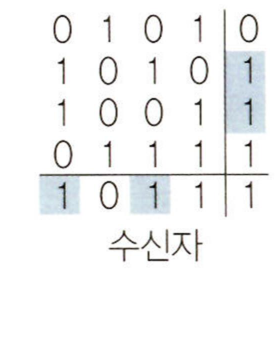
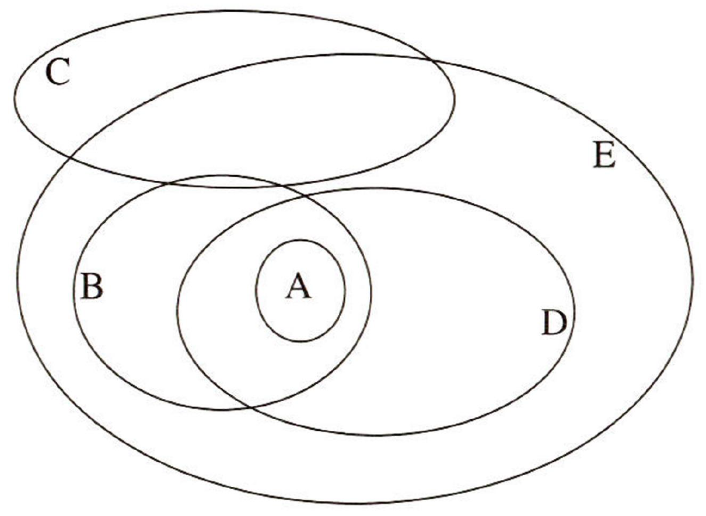

# 출제방향

## 1. 출제의 기본 방향

추리논증 시험은 대학에서 정상적인 학업과 독서 생활을 통하여 사고력을 함양한 사람이면 누구나 접근할 수 있는 내용을 다루되, 주어진 제시문을 단순히 이해하는 것, 제시문과 관련된 분야의 지식을 보유한 것만으로는 해결할 수 없고 제시된 글이나 상황을 논리적으로 분석하고 비판할 수 있어야 해결할 수 있도록 문항을 구성하여 사고력, 즉 추리력과 비판력을 측정하는 시험이 될 수 있도록 노력하였다.

내용 제재를 선택하는 데 있어서는 전 학문 분야 및 일상적ㆍ실천적 영역에서 소재를 찾아 활용하였다. 대학에서 특정 전공자가 유리하거나 불리하지 않도록 영역 간 균형잡힌 제재 선정을 위해 노력하는 한편, 제시문으로 선택된 영역의 전문 지식이 문항 해결에 미치는 영향을 최소화하는 데에도 주력하였다. 시험의 성격 상, 법 관련 제시문을 다소 많이 포함시켰으나, 제시문 및 질문을 최대한 순화하여 법학적 지식 없이 일상적 언어 능력과 사고력만으로 제시문을 읽어 내고 문제를 해결할 수 있도록 하였다.

## 2. 문항 구성

인문, 사회, 자연과학을 소재로 하는 문항들의 경우 소재 활용의 원칙이나 범위에 있어서 예년과 차이가 없었다. 법 관련 제재를 다루는 문항들(1~9번) 이외에 다른 영역의 문항들로는 인문 제재를 다루는 문항들(10~16번, 28번), 사회과학 제재를 다루는 문항들(25~27번, 31~33번), 자연과학 제재를 다루는 문항들(17번, 21~24번), 과학과 철학의 융복합적 소재를 다루는 문항들(29~30번) 그리고 전형적으로 논리/수리적 추리를 다루는 문항들(18~20번, 34~35번) 등으로, 다양한 성격의 글들을 골고루 포함하고 또 다양한 유형의 추리 능력 및 비판 능력을 골고루 측정할 수 있도록 하였다.

## 3. 출제 시 유의점 및 난이도

제시문의 분량 및 내용의 함량은 다수의 수험생이 한정된 시간 내에 문제를 해결하는 데 충분하도록 유의하였으며, 수리추리나 논리게임의 추리 문항의 경우 문항이 지나치게 어려워지지 않도록 노력하였고, 논증이나 논쟁적 자료를 분석하고 비판하도록 요구하는 문항들의 난이도는 예년과 비슷하거나 약간 어려운 수준을 유지하려고 하였다.

내용 영역에 있어서 동양과 서양, 고전과 현대, 국내와 국제 관련 소재를 두루 활용하려고 하였으며, 법학 전공자가 유리하지 않도록 하는 범위 내에서 법 관련 제재를 다양하게 사용하려고 하였다. 또한 법 관련 제재를 다루는 문항의 경우, 문제 해결에 다소 집중력이 필요한 문항을 포함시켰다.

---

# 문항별 해설

## 01

### 문항구분

* 문항 성격 : 법ㆍ규범 - 일상 언어 추리

* 평가 목표 : 기본권 보호의무의 개념과 이의 위반 여부를 판단하는 과소보호금지원칙을 이해하고 이를 구체적인 사례에 적용하여 판단할 수 있는지 측정함

### 제시문 해설

* 정답 : (3)

제시문의 설명에 따르면 국가는 국민의 기본권을 침해하여서는 안 되는 소극적 의무를 지는 동시에 적극적으로 국민의 기본권을 타인의 침해로부터 보호할 의무를 지닌다. 특히 기본권을 보호할 의무에 있어서는 이의 구체적 이행을 국가의 정치ㆍ경제ㆍ사회ㆍ문화적인 제반 여건을 감안하여 정책적으로 판단해야 하는 재량의 범위에 속하는 것으로 본다. 그에 따라 헌법재판소는 국가가 기본권 보호의무를 제대로 이행하였는지 여부를 판단함에 있어 이러한 재량을 존중하는 차원에서 과소보호금지원칙을 적용하는데, 이에 따르면 국가는 국민의 기본권 보호를 위하여 적절하고 효율적인 최소한의 보호조치를 취해야 하고 이에 미치지 못하는 경우에만 기본권 보호의무를 위반한 것으로 판단된다.

### <보기> 해설

ㄱ. 공사장 주변 주민들의 기본권이 침해됨에도 불구하고 국가는 아무런 보호조치를 취하고 있지 않다. 기본권 보호의무의 이행의 방법, 정도에 대한 국가의 재량을 인정하더라도 적절하고 효율적인 최소한의 보호조치를 취할 의무는 여전히 존재하고 이에 미치지 못하면 보호의무 위반이라는 제시문의 취지상, 아무런 조치를 취하지 않는 것은 기본권 보호의무 위반이다. 따라서 ㄱ은 옳은 추론이다.

ㄴ. 농어촌 지역의 약국 부족으로 주민의 건강권이 침해됨에 따라 일정 면적마다 약국을 설치하도록 하는 조치가 적절하고 효율적인 최소한의 조치라 평가되고 있다. 이러한 조치를 취해야 할 의무가 국가의 기본권 보호의무라 할 수 있는데, 이러한 조치에서 제시된 최소한의 기준에 못 미치는 조치를 취하면 기본권 보호의무 위반인 것이다. 사례에서 제시된 면적 단위보다 10배 이상이나 넓은 면적 단위마다 약국을 설치하도록 하는 조치는 제안된 최소한의 조치에 크게 못 미치는 것으로 기본권 보호의무 위반이라 판단된다. 따라서 ㄴ은 옳은 추론이다.

ㄷ. 이 사례에서는 확성장치 소음이 환경권을 침해함에 기본권 보호를 위한 몇 가지 정책안들이 제시되고 있다. 이들은 일단 모두 적절하고 효율적인 조치로 평가되고 있기 때문에 이 중 어느 것을 선택해도 적절하고 효율적인 최소한의 보호조치를 취한 것으로 보아야 하고 중간 정도의 효율성을 갖는 확성장치 사용 대수 제한 조치를 취하면 기본권 보호의무를 이행한 것으로 보아야 한다. 따라서 ㄷ은 옳지 않은 추론이다.

<보기> 중 ㄱ과 ㄴ만이 옳은 추론이므로 정답은 (3)이다.

## 02

### 문항구분

* 문항 성격 : 법ㆍ규범 - 일상 언어 추리

* 평가 목표 : 형법상의 원칙을 이해하고 이를 구체적인 사례에 적용하여 판단할 수 있는지 측정함

### 제시문 해설

* 정답 : (4)

형법상의 죄형법정주의, 특히 소급효금지의 원칙의 적용 및 예외와 관련된 문제이다. 형법상 소급효금지의 원칙에 따르면 범죄와 형벌은 행위할 당시의 법규정에 의해서만 규정되어야 한다. 또한 형사소송법에 대해서도 소급효금지원칙이 적용되는가에 대해서 견해가 대립되는데, 이를 부정하는 A견해와 절차법규범의 제정ㆍ개정이라고 해도 실질적으로 새롭게 형벌법규를 제정ㆍ개정하여 행위자를 처벌하는 것과 다르지 않다면 소급효금지원칙이 적용되어야 한다는 B견해가 제시되어 있다. 형법상 소급효금지의 원칙 및 형사소송법상의 A견해와 B견해를 이해하고, 각각의 견해에 의하면 구체적인 경우에 어떠한 결론에 이르게 될 것인지를 추론하는 문제이다.

### <보기> 해설

ㄱ. 제시문에서 소급효금지원칙은 행위자에게 불리한 소급효를 금지하는 것임을 알 수 있다. 헌법재판소의 위헌결정으로 인하여 형벌에 관한 법률 또는 법률조항이 소급하여 그 효력을 상실한 경우, 당해 형벌법규의 효력이 소급적으로 상실되는 것은 행위자에게 유리한 소급효이다. 따라서 당해 형벌법규가 적용되어 공소가 제기된 사건에 대해서 무죄판결이 선고되어야 한다. ㄱ은 옳은 추론이다.

ㄴ. A견해는 절차법규범에 대한 소급효금지원칙의 적용을 부정하는 입장이다. 따라서 행위자가 친고죄에 해당하는 범죄를 저지른 후 고소기간이 경과되지 않은 상태에서, 법률이 개정되어 친고죄의 고소기간이 연장된 경우, 개정된 법률은 당해 행위자에게 적용된다. ㄴ은 옳은 추론이다.

ㄷ. B견해는 절차법규범의 제정ㆍ개정이라고 해도 소급효금지원칙이 적용되어야 한다는 입장이다. 공소시효가 완성된 후에 행위자가 외국에 있는 기간 동안 공소시효가 정지되게 한 형사소송법 규정을 행위자에게 적용하는 것은, 공소시효 완성으로 처벌되지 않게 된 행위자를 실질적으로 새롭게 형벌법규를 제정ㆍ개정하여 처벌하는 것이 된다. 따라서 B견해에 의하면, 개정된 형사소송법은 당해 행위자에게 적용되어서는 안 되므로, 공소시효 기간을 계산함에 있어서 행위자가 외국에 있었던 기간을 제외해서는 안 된다. ㄷ은 옳지 않은 추론이다.

<보기>의 ㄱ과 ㄴ만이 옳은 추론이므로 (4)가 정답이다.

## 03

### 문항구분

* 문항 성격 : 법ㆍ규범 - 일상 언어 추리

* 평가 목표 : 특정한 법이론으로부터 추론될 수 있는 진술들과 그렇지 않은 진술들을 구분할 수 있는 능력 평가

### 제시문 해설

* 정답 : (2)

제시문에서 법은 규칙들의 체계이며, 그 기저에는 무엇이 법인지에 대한 규칙인 승인규칙이 있다고 설명되고 있다. 승인규칙은 일종의 사회적 규칙인데, 사회적 규칙이란 어떤 집단 구성원 대부분이 그것을 행동의 기준이나 이유로 받아들이고 사람들의 행위에 대한 비판적 태도의 근거로 삼는 규칙이다. 어딘가에 법이 있다고 할 수 있으려면 적어도 그 곳의 법관들 사이에는 승인규칙이 올바른 판결의 공통된 기준으로 수용되고 있어야 한다. 이런 내용을 토대로 <보기>의 옳고 그름을 판단하면 된다.

### <보기> 해설

ㄱ. 제시문에서 사회적 규칙은 어떤 집단에서 구성원 대부분이 어떤 행위를 반복적으로 하고 사회구성원 다수가 그것에 대하여 내적 관점을 취할 때 존재한다고 설명하고 있다. 따라서 채식주의자가 다수가 아니라 소수인 사회에서 “육식을 하면 안 된다.”는 것은 사회적 규칙이 아니다. ㄱ은 옳은 추론이 아니다.

ㄴ. 제시문에 따르면 ‘내적 관점’은 자기가 속한 집단의 규칙을 수용하여 반성적이고 비판적인 태도를 취할 때 취하는 관점이다. 보기 ㄴ에서 말하는 이는 자신이 속한 사회가 아니라 다른 사회의 규범을 반성적이고 비판적 태도 없이 기술하고 있으므로, 제시문에서 설명하는 내적 관점을 취하고 있지 않다. 보기 ㄴ은 옳은 추론이 아니다.

ㄷ. 제시문에 따르면 승인규칙은 사회의 구성원들이 법을 확인하는 기준이며, 실제와 부합하는지 문제될 수 있고, 법체계의 통일성과 계속성을 부여한다. 그리고 승인규칙은 법관들과 공직자들 및 시민들이 일정한 기준에 비추어서 법을 확인하는 관행 또는 실행으로 존재한다. 이로부터 국가마다 승인규칙이 다를 수 있음을 알 수 있고, 법을 제정하는 권한이 어디에 있는지는 승인규칙의 핵심적인 내용이므로 ‘군주가 법을 제정하는 나라와 의회에서 법을 제정하는 나라’의 승인규칙은 다르다는 것을 추론할 수 있다. 따라서 ㄷ은 옳은 추론이다.

<보기>의 ㄷ만이 옳은 진술이므로 정답은 (2)이다.

## 04

### 문항구분

* 문항 성격 : 법ㆍ규범 - 논쟁 및 반론

* 평가 목표 : 논쟁 분석을 통한 추론 능력을 평가함

### 제시문 해설

* 정답 : (3)

특허법의 정당화 근거에 대한 논쟁이다. A에 따르면 발명가가 혁신적인 기술을 만들려면 상당한 노동이 요구되기 때문에 그에 대한 동기를 부여함으로써 발명가에게 독점적 권리를 인정해야 한다. 하지만 그러한 독점적 특허권은 기술의 사회적 이용을 막을 위험성이 있기 때문에 발명가의 이익과 공공의 이익 사이에 균형을 잡을 필요성이 제기된다. 따라서 A는 당해 기술이 최초로 공개된 신규(新規)의 것으로서 산업상 이용 가능할 정도로 충분히 개발이 완료된 것이어야 하며, 발명가는 당해 기술의 내용을 구체적으로 공개할 것을 특허권의 인정 요건으로 주장한다. 더불어 특허권의 보호기간을 발명가가 충분히 보상받을 수 있는 기간으로 제한하려 한다.

B는 특허권을 얻기 위한 치열한 특허경쟁과 중복투자는 사회적 비용을 증대시킬 수 있기 때문에 특허법은 이러한 중복투자를 최대한 줄일 수 있도록 해야 한다고 주장한다. 이러한 이유로 A는 아직 기술 개발이 완료되지 않았어도 장래 혁신적인 것으로 개발될 가능성이 있는 발명에 대해 특허권을 부여함으로써 특허경쟁을 조기에 차단해야 하며, 개선 단계에 대한 조정권한을 최초의 발명가에게 부여함으로써 개선단계에서의 특허경쟁도 차단해야 한다고 주장한다. 또한 실질적으로 독점적 이익은 상업화 단계에서 얻을 수 있게 되는데, 특허취득 이후 상업화 단계까지는 오랜 기간이 필요하기 때문에 특허권의 보호기간을 연장해야 한다는 입장을 취한다.

문제를 해결하기 위해서는 A의 주장과 B의 주장의 근거들을 이해하고 각각의 주장에 의하면 구체적 상황에서 어떠한 결론에 이르게 될 것인지를 올바로 추론할 수 있어야 한다.

### <보기> 해설

ㄱ. A는 특허권을 통해 발명을 장려하고 기술 발전을 촉진시켜 사회적 부를 증대시키면서도 특허권이 사회적 효율성을 감소시킬 위험성을 고려하여 일정한 요건 하에서만 특허권을 인정하려 한다. B는 A의 주장에 따를 경우 치열한 특허경쟁에 의해 사회적 손실이 발생할 수 있기 때문에 기술 개발이 완료되지 않았어도 장래 혁신적인 것으로 개발될 가능성이 있는 발명에 대해 특허권을 부여함으로써 사회적 효율성을 증대시키려고 한다. 즉 A, B이론은 수단과 방법의 측면에서만 구별될 뿐 모두 특허권의 목적을 기술 발전을 통한 사회적 효율성의 증대라고 보고 있다. 그러므로 ㄱ은 옳지 않은 추론이다.

ㄴ. B는 특허 경쟁에서 발생할 수 있는 사회적 비용을 줄이기 위해 아직 기술 개발이 완료되지 않았어도 개발 가능한 단계에서도 광범위한 특허권을 부여해야 한다고 주장한다. 하지만, 같은 이유로 만약 초기에 더 광범위한 특허권을 부여할 경우 발명가들의 기대이익은 더 커지게 되기 때문에 결국 개발의 초기 단계에서 더 치열한 특허 경쟁이 발생할 수 있어 결국 B가 우려하는 사회적 비용은 줄지 않을 것이라는 반박이 가능하다. ㄴ은 옳은 추론이다.

ㄷ. 만약 신약 개발 과정에서 최초의 아이디어가 상업화 단계에 이르기 위해서는 너무 오랜 시간과 많은 비용이 든다면, B가 주장하는 것처럼 기술 개발이 완료되지 않았어도 혁신적인 발명에 대해서는 특허권을 제공하고 특허권의 보호 기간을 더 늘림으로써 발명가의 오랜 개발 시간과 많은 비용을 상쇄할 정도의 충분한 이익을 얻을 수 있다는 보장을 주어야 신약이 개발되어 사회적 효율성이 증대될 수 있을 것이다. 따라서 신약 개발 과정에서 최초의 아이디어가 상업화 단계에 이르기 위해서는 너무 오랜 시간과 많은 비용이 든다면, B의 설득력은 높아진다. ㄷ은 옳은 추론이다.

ㄹ. B는 발명가의 조정 권한을 광범위하게 인정해야 한다고 주장하고 있다. 그런데 만약 수많은 기존 발명에 근거하여 혁신적 연구가 이루어져야만 신제품을 개발할 수 있는 생명공학 분야에서 B의 주장에 따라 발명가의 조정 권한을 광범위하게 인정할 경우 혁신적인 신제품이 시장에 등장하는 속도가 늦어진다면 발명가의 광범위한 조정 권한에 의해 사회적 효율성이 낮아지게 될 것이다. 따라서 발명가의 조정 권한을 광범위하게 인정해야 한다고 주장하는 B의 설득력은 낮아진다. ㄹ은 옳지 않은 추론이다.

<보기>의 ㄴ과 ㄷ만이 옳은 추론이므로 (3)이 정답이다.

## 05

### 문항구분

* 문항 성격 : 법ㆍ규범 - 일상 언어 추리

* 평가 목표 : 일반 사면과 특별 사면의 차이를 이해하고 대통령의 사면권 제한에 대한 다양한 주장들을 각 사례에 적용하여 판단할 수 있는지 측정함

### 제시문 해설

* 정답 : (5)

대통령의 특별한 권한으로 사면권이 존재하는데 이에 대한 남용에 대한 우려가 꾸준히 제기되어 왔고 이를 제한하는 방법에 대한 다양한 주장을 갑, 을, 병, 정이 하고 있다. 갑의 주장에 따르면 일반 사면, 특별 사면을 특별히 구분하지 않고 모두의 경우에 있어 정적을 포용하는 차원에서만 사면을 허용해야 한다고 한다. 그리고 을의 주장에 따르면 을도 역시 일반 사면, 특별 사면을 구분하지 않는데 갑과 달리 폭넓게 사면에 대한 재량을 대통령에게 인정해야 한다고 한다. 일반 사면에 대해서는 특별한 제한을 제시하지 않고 있지만 정적이나 측근에 대한 특별 사면은 정당화될 수 없다고 한다. 병의 경우에는 일반 사면과 특별 사면을 구분하여 전자에 대해서는 제한을 할 필요가 없지만 후자에 대하여는 헌정 질서 파괴 교란 행위를 한 자나 뇌물수수 범죄자의 경우에 한해서는 특별 사면을 허용해서는 안 된다고 한다. 정은 앞선 주장들과 달리 절차적인 측면에 집중하는데 기본적으로 내용적인 측면에서 제한을 인정하지는 않고 있다. 다만 모든 종류의 사면에 있어 관련 심의 기관의 심의와 국회의 동의를 모두 받아야 사면이 정당화된다고 한다.

사례 (가)는 헌정 질서를 교란한 자이자 대통령과 정치적으로 대립하는 정적인 야당 대표 A에 대한 특별 사면에 관한 내용이다. 절차적으로는 관련 심의 기관의 심의와 국회의 동의를 모두 받아 진행되었다. 따라서 정적에 대한 사면이므로 갑에 의해서 정당화되며 심의와 동의를 모두 거쳤으므로 정에 의해서 정당화되는 사면권 행사이다. 다만 정적에 대한 특별 사면이므로 을에 의해서는 정당화되지 않고 헌정 질서 교란 자에 대한 특별 사면이므로 병에 의해서도 정당성을 인정받을 수 없다. 따라서 사례 (가)의 정당성을 인정하는 <주장>은 갑과 정이다.

사례 (나)는 간통죄를 저지른 측근에 대한 특별 사면이며 절차에 있어서는 관련 심의 기관의 심의만 거치고 국회의 동의를 받지 않은 채 진행되었다. 정적에 대한 사면이 아니므로 갑에 의해서는 정당화되지 않으며, 측근에 대한 사면이므로 을에 의해서도 정당화되지 않는다. 그리고 헌정 질서 파괴나 뇌물수수의 범죄를 저지른 것이 아니므로 병에 의해서는 정당화되지만 국회의 동의를 받지 않았으므로 정에 의해서는 정당화될 수 없다. 따라서 사례 (나)의 정당성을 인정하는 <주장>은 병이다.

사례 (다)는 경기 활성화 차원에서 진행된 일반 사면으로 관련 심의 기관의 심의와 국회의 동의라는 절차를 거쳐 진행되었다. 정치적인 이유가 고려되지 않은 사면으로 정적에 대한 사면으로 볼 수 없으므로 갑에 의해서는 정당화될 수 없지만, 일반 사면이므로 을과 병에 의해서는 정당화되고, 심의와 동의 절차를 거쳤으므로 정에 의해서 정당화된다. 따라서 사례 (다)의 정당성을 인정하는 <주장>은 을, 병, 정이다.

(가)에서의 대통령의 사면권 행사는 갑, 정에 의해서만 정당성을 인정받고, (나)에서의 대통령의 사면권 행사는 병에 의해서만 정당성을 인정받으며, (다)에서의 대통령의 사면권 행사는 을, 병, 정에 의해서만 정당성을 인정받는다. 따라서 정답은 (5)이다.

## 06

### 문항구분

* 문항 성격 : 법ㆍ규범 - 일상 언어 추리

* 평가 목표 : 특정한 법이 적용되는 요건들에 관련된 법규정들을 정확하게 이해하여 각 사례에 바르게 적용할 수 있는지를 측정함

### 제시문 해설

* 정답 : (2)

A법이 적용되는 사업장에 대한 규정을 제시한 후 몇 가지 사례에 A법이 적용되는지 묻는 문제이다. A법은 상시 사용하는 근로자 수가 5명 이상인 사업장에 적용되는데 상시 사용하는 근로자 수는 연인원(일정 기간 동원된 총 인원수)을 가동일수(실제 사업장 운영일수)로 나누어 계산한다. 다만 이러한 계산에 의해서 상시 사용하는 근로자 수가 5명 이상이라 하더라도 가동일수 일별로 근로자 수를 파악하였을 때 5명에 미달한 일수가 전체 가동일수의 2분의 1 이상이면 A법은 적용되지 않는다. 또한 친족만으로 구성된 사업장에는 A법이 적용되지 않으며 연인원 계산 시 파견근로자는 제외되지만 단시간 근로자는 포함된다.

### <보기> 해설

ㄱ. 연인원은 처음 10일 6명, 나중 4일 6명이므로 (10일×6명)+(10일×4명)=100명으로 계산된다. 가동일수는 20일이므로 결국 상시 사용하는 근로자 수는 5명이다. (가)의 조건을 충족하였으므로 A법이 적용되는 것처럼 보인다. 하지만 (다)의 기준을 적용하여 보면 사례가 (가)를 충족하더라도 법 적용 기준인 5명에 미달한 일수가 10일이고 이는 전체 가동일수 20일의 2분의 1 이상이므로 A법은 적용되지 않는다. ㄱ은 옳지 않은 추론이다.

ㄴ. 가동일수 1개월간 매일 8명의 단시간 근로자가 사용되었다. (라)에 따라 단시간 근로자도 연인원 산정 시 포함된다. 결국 상시 사용하는 근로자 수는 (8명×1개월/1개월=) 8명이고 (다)는 해당하지 않으므로 A법은 적용된다. ㄴ은 옳은 추론이다.

ㄷ. 사례에서 고정적으로 매일 근무한 근로자는 총 7명이다. 하지만 연인원 산정 시 사용자에게 고용되어 있지 않은 파견근로자는 제외하고 단시간 근로자는 포함하므로, 결국 상시 사용하는 근로자 수는 (5명×1개월/1개월=) 5명이다. 그리고 이 사업장은 친족과 단시간 근로자로 구성되어 결국 친족만을 사용하는 사업장이 아니므로 (가)의 적용배제 규정은 적용되지 않는다. 또한 (다)도 해당 사항 없으므로 사례에는 A법이 적용된다. ㄷ은 옳지 않은 추론이다.

<보기> 중 ㄴ만이 옳은 추론이므로 정답은 (2)이다.

## 07

### 문항구분

* 문항 성격 : 법ㆍ규범 - 일상 언어 추리

* 평가 목표 : 법규정을 이해하고 구체적인 사안에 적용하는 능력을 평가함

### 제시문 해설

* 정답 : (5)

제시문에 서술된 민사소송의 원칙(처분권주의) 및 그와 관련한 견해를 정확하게 이해하고 사례에 적용하여 올바른 판단을 할 것을 요구하는 문제이다. 제시문의 원칙에 따르면, 민사소송에서 심판의 대상과 범위는 원칙적으로 원고가 정한다. 또, 신체상해로 인한 손해배상을 청구하는 경우에 심판대상을 어떻게 볼지에 대하여 서로 다른 두 견해가 제시되고 있다. 이러한 내용에 비추어 선택지의 옳고 그름을 판단하면 된다.

### 선택지별 해설

(1) 제시문에 따르면, 민사소송에서 법원은 당사자가 판결을 신청한 사항에 대하여 그 신청 범위 내에서만 판단하여야 한다. 따라서 법원은 갑이 을에게 빌려준 돈 1,000만 원에 대하여, 갑이 신청한 범위 내에서만 판결을 할 수 있다. 그래서 법원은 500만 원을 한도로 하여 갑의 청구를 받아들이는 판결을 할 수 있다. 옳은 추론이다.

(2) 위와 같은 이유로, 법원은 갑이 신청한 500만 원을 한도로 하여 갑의 청구를 받아들이는 판결을 할 수 있다. 옳은 추론이다.

(3) A견해는 치료비 등의 적극적인 손해와 치료기간 얻지 못한 수입 등의 소극적인 손해 및 정신적 손해를 별개의 심판대상으로 여기며, 이 각각에 대해 법원은 제시문에서 설명된 민사소송의 원칙을 적용한다. 따라서 병이 치료비로 청구한 금액보다 법원이 평가한 치료비가 더 많은 경우에도, 법원은 병이 청구한 범위 내에서만 판결할 수 있다. 그래서 법원은 치료비의 경우 2,000만 원을 한도로 하여 병의 청구를 받아들이는 판결을 할 수 있다. 옳은 추론이다.

(4) B견해는 신체상해로 인한 손해배상을 청구할 경우에 심판대상을 손해의 유형에 따라서 나누어 보지 않고, 전체 손해를 하나로 본다. 따라서 병의 전체 청구액이 1억 원이고, 병의 손해에 대한 법원의 전체 평가액이 1억 원이므로 법원은 1억 원을 한도로 하여 병의 청구를 받아들이는 판결을 할 수 있다. 옳은 추론이다.

(5) 제시문에 의하면 신체상해로 인한 손해배상을 청구하는 경우에 적극적 손해, 소극적 손해, 그리고 정신적 손해를 구별하여 서로 다른 세 개의 심판대상으로 보는 A견해와 그 전체가 하나의 심판대상이라고 보는 B견해가 있다. 그러나 어떤 견해를 취하든 법원이 당사자가 신청한 것보다 적게 판결하는 것은 허용되지만, 신청의 범위를 넘어서 판결하여서는 안 된다. 따라서 원고가 신청한 교통사고 손해배상액의 총액이 법원이 인정한 손해배상액의 총액보다 적은 경우에도 (어떤 견해를 따르든 상관없이) 원고가 신청한 액수보다 적은 금액을 배상하라고 법원은 판결할 수 있다. 따라서 (5)는 옳지 않은 추론으로 정답이다.

## 08

### 문항구분

* 문항 성격 : 법ㆍ규범 - 일상 언어 추리

* 평가 목표 : 사실관계에 규칙을 적용할 수 있는 능력 평가

### 제시문 해설

* 정답 : (3)

이 문제를 해결하기 위해서는 <법률>과 A와 B가 펼치는 주장을 이해하여, 사건에 올바로 적용할 수 있는 능력이 필요하다.

X의 경우, A와 B 모두 병이 X를 소유할 수 있기 위해서는 적용 법률에 따라 매수한 지 2년 동안 X가 도품임을 몰랐어야 한다고 말하고 있다. 때문에 A와 B는 병이 X를 매수한 지 2년 동안 몰랐다면 X를 반환할 필요 없지만 2년 전에 알았다면 반환해야 한다는 데 모두 동의할 것이다. 그러나 Y의 경우, A와 B는 서로 다른 견해를 가지고 있다. A는 Y는 X의 일부이기 때문에 X를 소유한 자는 Y도 소유한다고 말하고 있다. 반면, B는 항상 Y를 X의 일부로 판단해서는 안 된다고 말하고 있다. 때문에 X와 Y의 소유에 대해서 각각 분리해서 판단해야 한다. <논쟁>에 따르면 병의 Y의 소유에 대해, B가 A와 의견을 달리하는 경우는 법률이 정한 기간이 지나지 않았지만, 수태 시점이 X를 매수한 이후이고, Y가 태어날 때까지 X가 도품인 줄 모르는 경우이다.

### 선택지별 해설

(1) X가 도품임을 병이 알게 된 시점이 매수 이후 2년이 지나기 전이었기 때문에 <법률>에 의하면 을이 X에 대한 소유권을 가진다. A는 Y를 X의 일부로 여기기 때문에, 을이 Y의 소유권도 가진다고 판단할 것이다. Y를 항상 X의 일부로 보지 않는 B도 X가 도품임을 병이 알게 된 시점이 매수 이후 2년이 지나기 전이었고, X가 Y를 수태한 것이 도난되기 전이었기 때문에 을이 Y의 소유권자라고 판단할 것이다.

(2) X가 도품임을 병이 알게 된 시점이 매수 이후 2년이 지난 경우이기 때문에 <법률>에 의하면 병이 X를 소유하고, A는 Y를 X의 일부로 보기 때문에 병이 Y의 소유권자라고 판단할 것이다. B도 병이 Y의 소유권자라고 판단할 것이다. 왜냐하면 병이 X를 소유할 수 있을 정도로 <법률>이 정한 기간이 지났으므로 Y도 병의 소유가 된다고 판단할 것이기 때문이다. A와 B 둘 다 병이 X를 소유하는 경우에는 Y를 병이 소유해야 한다고 판단할 것이다.

(3) X가 Y를 수태한 것이 매수 이후이었고, Y의 출산 이후 X가 도품임을 병이 알았는데 그 시점이 매수 이후 2년이 지나기 전인 경우에는 A와 B의 판단이 일치하지 않는다. 왜냐하면 병이 X가 도품임을 알게 된 시점이 매수 이후 2년이 지나기 전이므로 <법률>에 의하면 원래 주인 을이 X에 대한 소유권을 갖게 된다. 이 경우 A는 Y를 X의 일부이므로 을이 Y에 대한 소유권도 갖게 된다고 판단할 것이다. 그러나 B는 Y가 항상 X의 일부인 것으로 판단하지 않고, 병이 X를 매수한 다음에 Y가 수태되었고 Y가 태어날 때까지 X가 도품인 줄 몰랐으므로, 병이 Y의 소유권을 가진다고 판단할 것이다.

(4) X가 도품임을 병이 알게 된 시점이 매수 이후 2년이 지난 경우이기 때문에 병이 X를 소유하고, A는 Y를 X의 일부로 보기 때문에 병이 Y의 소유권자라고 판단할 것이다. B도 병이 Y의 소유권자라고 판단할 것이다. 왜냐하면 병이 X를 소유할 수 있을 정도로 <법률>이 정한 기간이 지났으므로 Y도 병의 소유가 된다고 판단할 것이기 때문이다. A와 B 둘 다 병이 X를 소유하는 경우에는 (X가 Y를 수태한 시점이 매수 이전이든 매수 이후이든 상관없이) Y를 병이 소유해야 한다고 판단할 것이다.

(5) X가 도품임을 병이 알게 된 시점이 매수 이후 2년이 지나기 전이었기 때문에 을이 X의 소유권을 가질 것이다. A는 Y를 X의 일부로 보기 때문에 Y의 소유권도 을이 가질 것이라고 판단할 것이다. B도 (비록 Y가 X를 매수한 이후에 Y가 수태되었다고 하더라도) Y가 출산하기 이전에 X가 도품임을 병이 알았으므로, 을이 Y의 소유권자라고 주장할 것이다.

## 09

### 문항구분

* 문항 성격 : 법ㆍ규범 - 논증 분석

* 평가 목표 : 재판 증거에 대한 진술들을 토대로 이루어진 의견들의 요지를 이해하고 논쟁자들이 서로 동의할 진술과 동의하지 않을 진술을 찾아낼 수 있는 능력을 측정함

### 제시문 해설

* 정답 : (3)

화제가 되고 있는 어떤 사건에 대해 갑은 피해자의 시체는 발견되지 않았지만 피해자는 사망했을 것이 분명하고 피고인이 피해자를 살해한 범인임이 분명하기에 그렇게 판결 내리는 것이 옳다고 본다. 을은 피해자가 살해되었다면 그 범인은 피고인이라고 생각하지만 시체가 발견되지 않았기 때문에 피해자가 살아 있을 가능성이 있다고 본다. 끝으로 병은 피해자가 사망했을 것과 피고인이 피해자를 살해했을 것이 분명하다는 점을 받아들이지만 시체가 발견되지 않았으므로 살인 사건이 성립하지 않는다고 본다. 병은 이 사건이 살인 사건임을 부정하고 있기 때문에 피고인이 살인 사건의 범인이라고 판결 내리는 것에 동의하지 않을 것이다.

### <보기> 해설

ㄱ. 갑과 병은 모두 피해자가 사망했다는 것이 확실하다고 본다. 제시문에서 갑은 “피해자가 사망했을 것은 확실해.”라고 명시적으로 말하고 있고 병은 “모든 증거는 피고인이 살인을 저지른 자가 분명함을 말하고 있어.”라고 말한다. 따라서 ㄱ은 옳은 판단이다.

ㄴ. 을은 피고인이 피해자를 살해하지 않았다고 합리적으로 의심할 여지는 여전히 있다고 보기 때문에 ‘피고인이 살인 사건의 범인이라고 판결을 내리는 것이 옳다.’는 견해에 동의하지 않을 것이다. 병도 시체가 발견되지 않아서 이 사건이 살인 사건으로 성립할 수 없다고 보기 때문에 피고인이 살인 사건의 범인이라고 판결을 내리는 것이 옳다는 견해에 동의하지 않을 것이다. 따라서 ㄴ은 옳지 않은 판단이다.

ㄷ. 갑과 병은 피고인이 살인을 저지른 것이 분명하다고 생각한다. 따라서 ‘피해자가 살해된 시체로 발견된다면 피고인이 살인범이라는 점은 확실하다.’는 견해에 동의할 것이다. 한편 을은 피고인이 살인을 했는지 의심의 여지가 있다고 생각하지만 그렇게 생각하는 이유는 시체가 발견되지 않았기 때문이다. 을은 “누군가 피해자를 살해했다면, 피고인이 그런 일을 저질렀다는 점은 분명하지.”라고 말하고 있으므로 피해자가 살해된 시체로 발견된다면 피고인이 살인범이라는 점은 확실하다는 견해에 동의할 것이다. 따라서 ㄷ은 옳은 판단이다.

<보기> 중 ㄱ과 ㄷ만이 옳은 판단이므로 정답은 (3)이다.

## 10

### 문항구분

* 문항 성격 : 인문 - 논증 분석

* 평가 목표 : 동물 실험에 반대하는 논증의 요지를 파악하고 이를 완성하기 위해서 필요한 전제를 찾을 수 있는지를 물어봄으로써 논증을 구성하는 능력을 측정하고자 함

### 제시문 해설

* 정답 : (1)

제시문에서는 동물 실험에 반대하는 논증이 제시되고 있다. 글쓴이는 동물 실험을 두 가지로 나눈다. 하나는 인간의 사소한 이익을 위해서 동물이 상당한 고통을 겪는 실험이고, 다른 하나는 인간의 상당한 이익을 위해서 동물이 상당한 고통을 겪는 실험이다. 글쓴이는 전자의 동물 실험은 동물 실험을 통해 생기는 이익이 동물에게서 박탈되는 이익에 비해 사소하기에 도덕적으로 정당화될 수 없다고 주장한다. 그리고 빈 칸 (A)에 들어갈 논거는 후자의 동물 실험이 도덕적으로 정당화될 수 없다는 글쓴이의 논증을 정당화하는 것이어야 한다.

### 선택지별 해설

(1) (A)에는 인간의 상당한 이익을 위해 동물이 상당한 고통을 겪는 후자의 동물 실험을 반대하는 논거를 제시해야 한다. 제시문에서 “동물은 대개의 인간과는 달리 자신의 먼 미래를 계획할 수 없으므로 인간의 이익이 동물의 이익보다 더 크고, 따라서 인간의 이익을 위해 동물의 이익을 박탈할 수 있다”는 주장이 후자의 동물 실험을 정당화한다고 볼 수 있다. 그러므로 이 주장을 반박할 수 있다면 후자의 동물 실험을 반대하는 논거가 될 것이다. “갓난아기는 자신의 먼 미래를 계획할 수 없다.”와 “다른 인간의 이익을 위해서 갓난아기의 이익을 박탈할 수 없다.”가 이 주장을 공격하는 논거일 것이다. 왜냐하면 갓난아기가 자신의 먼 미래를 계획할 수 없는데도 불구하고 다른 인간의 이익을 위해 갓난아기의 이익을 박탈할 수 없다면, 동물도 인간과는 달리 자신의 먼 미래를 계획할 수 없음에도 불구하고 인간의 이익을 위해 동물의 이익을 박탈할 수 없을 것이기 때문이다. 따라서 (가)와 (다)가 (A)에 들어갈 적절한 진술이다.

(2) “(가) 갓난아기는 자신의 먼 미래를 계획할 수 없다.”와 “(라) 동물 실험을 통해서 얻게 될 인간의 상당한 이익과 그 실험에서 박탈될 동물의 이익은 상쇄된다.”를 받아들인다고 하자. (라)는 동물 실험에서 얻는 인간의 이익과 동물의 이익이 서로 동일하다는 것을 의미한다. 하지만 글쓴이는 이를 받아들이지 않을 것이다. 글쓴이는 동물 실험을 통해서 얻는 인간의 이익이 더 크다는 것을 받아들이고 있기 때문이다. 또한 (가)를 받아들이는 것은 (라)와 무관하다. 따라서 (가)와 (라)는 (A)에 들어갈 두 진술로 적절하지 않다.

(3) (나)와 (다)를 동시에 받아들인다는 것 자체에서 충돌이 발생한다. (나)는 갓난아기에게는 이익이 없다는 것을 말하고 있고 (다)는 갓난아기의 이익을 박탈할 수 없음을 말한다. (다)가 공허한 주장이 아니기 위해서는 갓난아기의 이익이 있어야 한다. 따라서 (나)와 (다)는 그 자체로 충돌을 일으키기 때문에 동물 실험을 반대하는 주장을 지지하는 어떤 근거의 역할도 하지 못한다.

(4) (나)와 (마)를 받아들인다고 하자. 그러나 (마)가 할 수 있는 역할이 없기 때문에 동물 실험을 반대하는 주장을 지지하는 어떤 근거의 역할도 하지 못한다. 먼저 (마)의 ‘이익’이 누구의 이익인지가 분명하지 않다. 그 이익을 인간 자신의 이익이라고 해석한다면, 인간의 이익을 포기하는 것은 동물 실험을 하지 않는 것이 될 터인데 이를 명령할 수 없다는 것은 글쓴이의 논증과는 무관하거나 반대되는 주장이다. 또한 (마)의 ‘이익’을 동물의 이익이라고 해석한다면, 동물 실험이 정당한 행위라는 것을 옹호하는 것이 되기 때문에 동물 실험에 반대하는 글쓴이의 주장과 상충된다.

(5) (마)에 대한 설명에서 밝혔듯이 (마)를 받아들이는 것은 동물 실험을 반대하는 주장을 지지하는 어떤 근거의 역할을 하지 못한다. 그리고 (라)는 동물 실험을 통해 얻게 될 인간의 이익과 그 실험에서 박탈될 동물의 이익이 같다는 것만을 말할 뿐이다.

## 11

### 문항구분

* 문항 성격 : 인문 - 논쟁 및 반론

* 평가 목표 : 서양 금욕주의, 쾌락주의, 의무론의 쾌락과 욕망에 관한 태도의 차이점과 공통점을 정확히 파악하고 있는지 측정함

### 제시문 해설

* 정답 : (2)

갑은 쾌락의 추구를 삼가며 부동심을 추구하는 금욕주의자이며, 을은 쾌락만을 유일의 본래적 가치로 보면서 여타의 모든 가치를 쾌락으로 환원하고자 하는 쾌락주의자이다. 병은 쾌락에 대해 제한적으로만 그 수단적 가치를 인정하는 의무론자이다. 쾌락과 욕망에 관한 갑, 을, 병 세 사람의 태도의 차이점과 공통점에 대한 이해를 묻는 문항이다.

### 선택지별 해설

(1) 을은 쾌락이야말로 유일무이의 본래적 가치이며 그런 점에서 이 유일무이의 본래적 가치를 추구하지 않는 쾌락을 위한 금욕이 어리석다고 말함으로써 쾌락이 추구할 만하다는 것에 동의할 것이다. 갑은 쾌락의 추구를 삼가도록 습관화할 것을 주장함으로써 쾌락이 추구할 만하다는 것에 동의하지 않을 것이다.

(2) 욕망을 절제하여 도달한 상태도 쾌락의 상태라는 것은 을의 주장일 뿐이다. 갑은 금욕의 훈련에 의해 슬픔이나 기쁨에는 전혀 무관심한 부동심의 경지에 이를 수 있다고 함으로써 욕망을 절제하면 기쁨에 전혀 무관심한 상태에 이를 수 있다고 주장할 뿐 그런 상태를 쾌락의 상태라고 볼 여지를 두지 않고 있다. 따라서 욕망을 절제하여 도달한 상태가 쾌락의 상태라는 것에 을은 동의하겠지만 갑은 동의하지 않을 것이다.

(3) 갑은 금욕이 인간을 자유롭게 만들며 금욕의 훈련에 의해 부동심의 경지에 이를 수 있다고 주장함으로써 일체의 욕망 추구를 금지하는 것에 동의할 것이다. 을은 쾌락이야말로 유일무이의 본래적 가치이고 금욕을 위한 금욕은 어리석다고 말함으로써 일체의 욕망 추구를 금지하는 것에 동의하지 않을 것이다. 병은 불만족의 누적은 의무 수행에 장애가 될 수 있음을 지적하며 의무 수행에 장애가 되지 않을 만큼은 쾌락의 추구가 필요하다고 인정한다. 따라서 병은 일체의 욕망 추구를 금지하는 것에는 동의하지 않을 것이다.

(4) 갑은 자족성을 위해 쾌락의 추구를 삼가도록 습관화하라고 말함으로써 쾌락보다 상위의 가치가 있다는 것에 동의할 것이다. 을은 쾌락이 유일무이의 본래적 가치라고 말함으로써 쾌락보다 상위의 가치가 있다는 것에 동의하지 않을 것이다. 병은 의무 수행에 장애가 되지 않을 만큼은 쾌락을 추구해야 하고, 그런 점에서 쾌락의 추구가 간접 의무라고 말함으로써 쾌락보다 상위의 가치가 있다는 것에 동의할 것이다.

(5) 을은 쾌락이 유일무이의 본래적 가치라고 말함으로써 쾌락 추구의 허용 근거가 쾌락 자체에 있다는 것에 동의할 것이다. 병은 욕구 불만족의 누적으로 더 중요한 의무들을 위반하지 않도록 쾌락 추구를 허용한다는 점에서 쾌락 추구를 더 중요한 의무를 수행하기 위해 필요한 하나의 조건으로 보고 있다. 따라서 병은 쾌락 추구의 허용 근거가 쾌락 자체에 있다는 것에 동의하지 않을 것이다.

## 12

### 문항구분

* 문항 성격 : 인문 - 논증 분석

* 평가 목표 : 플라톤의 고전 중 하나인 「메논」에서 나쁜 것을 원하는 사람도 있을 수 있는가에 관한 대화 부분을 소재로 결론에 이르는 추론 방식을 이해하고 적용하는 능력을 평가하고자 함

### 제시문 해설

* 정답 : (4)

제시문의 대화는 나쁜 것을 원하는 사람도 있다는 메논의 주장이 성립할 수 없음을 소크라테스가 논박해 가는 과정이다. 이 과정에서 소크라테스는 나쁜 것을 원하는 사람을 (1) 나쁜 것을 좋은 줄로 여기고서 원하는 자와, (2) 나쁜 줄 알면서 원하는 자로 구분한 다음, 다시 후자를 (2)-(a) 그 나쁜 것이 이로울 줄 여기고서 원하는 자와 (2)-(b) 해로울 줄 알면서 원하는 자로 다시 구분한다. 그러는 가운데 소크라테스는 (1)과 (2)-(a)는 결국 좋은 것을 원하는 자임을 보이고, (2)-(b)는 있을 수 없다는 쪽으로 인정하도록 메논을 유도한다. 이리하여 나쁜 것을 원하는 사람도 있다는 메논의 원래 주장과 모순되는 결론을 메논이 받아들이도록 하는 것이 소크라테스의 전략이다. 따라서 이 문항에서는 소크라테스가 메논을 유도해 가는 과정을 바르게 이해했는지가 정답을 찾는 관건이 된다.

### 선택지별 해설

(1) 당초에 메논은 “어떤 이는 나쁜 것을 원한다.”는 점을 인정하였다. 그러나 메논은 대화의 맨 끝에서 이와 모순인 “아무도 나쁜 것을 원하지 않네.”라는 소크라테스의 말에 “참으로 맞는 말씀입니다.”라고 긍정함으로써 자신이 당초에 참이라고 인정한 견해를 부정하였다.

(2) 제시문의 중간 부분에서 소크라테스는 “또한 그 나쁜 것이 자신에게 이로울 것으로 여기는 자들은 그 나쁜 것이 나쁜 줄을 아는 자일까?”라고 질문하였고 이에 대해 메논은 “적어도 그건 전혀 아닐 것입니다.”라고 답변하고 있다. 따라서 메논은 나쁜 것이 나쁜 줄 아는 자에 나쁜 것이 자신에게 이로울 것으로 여기고서 원하는 자가 포함되지 않는다는 것을 인정하였다. 그렇다면 메논은 나쁜 것이 나쁜 줄 아는 자에 ‘나쁜 것을 좋은 것인 줄로 여기고서 원하는 자’도 포함되지 않는다는 것을 인정한 것으로 보아야 한다. 나쁜 것을 좋은 것인 줄로 여기고서 원하는 자는 나쁜 것이 자신에게 이로울 것으로 여기고서 원하는 자일 것이기 때문이다.

(3) ‘나쁜 것을 좋은 것인 줄로 여기고서 원하는 자’는 나쁜 것이 “나쁜 줄 몰라서 그게 좋은 줄로 여긴 거니까 실상 그런 사람은 좋은 것을 원하는 자임이 명백하네”라는 소크라테스의 말에서 알 수 있듯이 소크라테스가 좋은 것을 원하는 자에 포함시켰음을 알 수 있다. 소크라테스는 ‘그 나쁜 것이 자신에게 이로울 줄로 여기고서 원하는 자’가 그 나쁜 것이 나쁜 줄 아는 자가 아니라는 메논의 대답을 받고서 역시 앞의 경우와 마찬가지로 나쁜 것을 원하는 자가 아님, 즉 실상은 좋은 것을 원하는 자에 포함시켰다.

(4) 메논은 원래 ‘나쁜 것이 해로울 줄로 여기면서도 그 나쁜 것을 원하는 자’가 있다고 보았다. 그러나 대화의 맨 끝에서 “아무도 나쁜 것을 원하지는 않네.”라는 소크라테스의 주장에 동의함으로써 나쁜 것을 원하는 사람은 없음을 인정하였다. 즉, 해로울 줄로 여기든 그렇지 않든 간에 도대체 나쁜 것을 원하는 사람은 있을 수 없다고 인정함으로써 ‘나쁜 것이 해로울 줄로 여기면서도 그 나쁜 것을 원하는 자’가 있을 수 있다는 견해를 포기하였다.

(5) ‘아무도 나쁜 것을 원하지는 않는다’는 주장은 나쁜 것을 원한다는 사람 중에서 있을 수 있는 모든 경우들에 대해 그 각각이 성립할 수 없다고 배제한 끝에 도출되는 결론이다. 이 글에서 마지막으로 배제되는 경우가 ‘나쁜 것이 해로울 줄로 여기면서도 나쁜 것을 원하는 자’이다. 이러한 자는 그로 해서 자신이 해로움을 당할 것임을 알고 있는 자이면서 또한 해로움을 당하는 자를 비참한 자로 간주하는 자이기도 하다. 그런 점에서 이러한 자는 “해로움을 당하기를 원하는 자”이기도 하며 또한 그런 자는 비참한 자이기를 원하는 자이기도 하다. 그러므로 만일 그런 ‘비참한 자이기를 원하는 자’가 없다면 ‘나쁜 것이 해로울 줄로 여기면서도 나쁜 것을 원하는 자’ 또한 있을 수 없다. 그래서 “아무도 나쁜 것을 원하지 않네.”라는 소크라테스의 결론이 최종적으로 성립할 수 있다. 따라서 만일 비참하기를 원하는 자가 있다면 ‘나쁜 것이 해로울 줄로 여기면서도 나쁜 것을 원하는 자’가 없다고 배제할 수 없고, 소크라테스의 결론은 도출되지 않는다. 그러므로 비참하기를 원하는 자가 있다면 메논은 “아무도 나쁜 것을 원하지는 않네.”에 동의할 필요가 없다.

## 13

### 문항구분

* 문항 성격 : 인문 - 논증 분석

* 평가 목표 : 루소의 「사회계약론」 제1부 제3절 ‘강자의 권리에 관하여’의 논증을 사용하여, 논증에 등장하는 각 진술들 간의 관계를 이해할 수 있는 능력을 측정함

### 제시문 해설

* 정답 : (4)

이 문항은 아무리 강한 자라도 영원한 지배자가 될 수 없음에도 불구하고 강자에게는 강자라는 이유로 무엇인가 지배권이 있고 약자에게는 약자라는 이유로 강자에게 복종해야 할 의무가 있는 것처럼 여겨지는 통념을 논박하는 루소의 논증을 다루고 있다. 루소는 강자의 권리를 가정한다고 할 때 그것이 함축하는 바를 여러 비유와 사례들을 들어 비판적으로 분석하여 정당하지 못한 강자의 힘에 굴복하지 말아야 할 이유를 제시한다. 이 과정에서 루소의 서술 방식은 단선적이지 않고 다소 중층적이며 모호한 비유를 활용하여 논지 전개 과정의 파악이 쉽지 않다. 이 점을 어느 정도 정확히 파악하고 있는지를 측정하는 것이 이 문항의 출제 의도이다.

### 선택지별 해설

(1) ‘물리적인 것’과 ‘도덕적인 것’의 구별이 전제되지 않는다면 양자를 동일시할 수도 있다는, 즉 물리적 ‘힘’과 ‘도덕적 권리’가 같을 수 있다는 말이다. 그래서 이것이 전제되지 않으면, ‘힘’이 물리적인 것임에도 도덕적 결과를 가져올 수 있는지가 문제될 수 없게 된다. 그런 점에서 ‘물리적인 것’과 ‘도덕적인 것’의 구별은 힘이 권리를 만들어낸다는 주장을 논박하는 데 필요하다. 따라서 옳은 판단이다.

(2) 글쓴이는 ‘강자의 권리’라는 구절로부터 나오는 불합리한 귀결을 보임으로써 ‘강자의 권리’를 부정하는 논증을 펴고 있다. 따라서 옳은 판단이다.

(3) 강도의 권총 사례는 힘에 복종하는 것이 물리적으로 어쩔 수 없이 하는 행동일 뿐 의무에서 나온 행동이 아니라는 점을 보여 주는 사례이다. 따라서 옳은 판단이다.

(4) 글쓴이가 “장담”한 내용은 “힘에 복종하라”는 교훈이 지켜지지 않는 일이 결코 없으리라는 것이다. 이 장담의 근거는 힘에 복종하지 않을 수 없으면 의무 때문에 복종할 필요가 없고, 복종을 강요받지 않을 경우에는 복종할 의무도 없다는 데 있다. 따라서 그 근거는 선택지에서 말한 것과 같지 않으므로 옳지 않은 판단이다.

(5) 글쓴이는 힘이 권리를 만들어낸다는 주장을 비판하면서 힘에 복종한다는 것이 물리적 강제에 불과하다면 ‘권리’라는 말은 힘에 아무것도 덧붙이지 않는다고 본다. 따라서 강자의 권리라는 말에서 힘에서 나오는 ‘권리’는 무의미한 말임을 지적하고 있다. 옳은 판단이다.

## 14

### 문항구분

* 문항 성격 : 인문 - 수리추리

* 평가 목표 : 16~17세기 중국의 개혁사상가였던 황종희의 토지제도 개혁 주장으로부터 둔전의 면적과 둔전을 경작하는 군호의 수, 국유지와 사유지의 면적 등을 계산할 수 있는지를 측정함

### 제시문 해설

* 정답 : (1)

제시문의 설명에 따르면 현재 군호가 분배받아 경작하고 있는 둔전은 약 70만 경이고, 이는 전체 토지의 10분의 1에 해당한다. 따라서 전체 토지 면적은 약 700만 경이다. 이를 바탕으로 일반 토지 면적 약 630만 경의 구성이 어떻게 이루어져 있고, 여기에 약 1,000만 호에 이르는 민호에게 50무씩 토지를 분배할 경우, 사유지의 몇 퍼센트가 국가의 분배 대상이 되는 토지에 포함될 것인지를 계산해 보는 추리 문항이다.

### <보기> 해설

ㄱ. 군호마다 50무씩 경작하는 둔전이 전국에 약 70만 경이다. 그런데 전국에 둔전 아닌 일반 토지는 전국의 민호 약 1,000만 호에게 50무씩, 즉 약 5억 무를 나누어 준 뒤 1억 3천만 무가 남는다고 하였으므로 약 6억 3천만 무이다. 그런데 전국의 토지 면적은 약 700만 경이고, 그중 둔전이 약 70만 경이므로 일반 토지는 약 630만 경이다. 그러므로 630만 경은 6억 3천만 무와 같은 면적이 되고, 1경은 100무로 계산된다는 것을 추론할 수 있다. 둔전은 약 70만 경, 즉 약 7,000만 무이므로, 50무씩 경작하는 군호의 총수는 약 140만 호로 계산할 수 있으므로 옳은 추론이다.

ㄴ. ㄱ의 추론에 따르면 당시 전체 토지는 둔전은 약 70만 경, 일반 토지는 약 630만 경으로 합쳐서 약 700만 경이다. 그런데 일반 토지 가운데 사유지가 3분의 2이고, 국유지가 3분의 1이라고 하였으므로, 전국의 사유지는 약 420만 경, 국유지는 약 210만 경임을 추론할 수 있다. 따라서 둔전을 제외한 전국의 국유지가 약 420만 경이라는 것은 옳지 않은 추론이다.

ㄷ. ㄴ의 추론에 따르면 전국의 사유지는 약 420만 경이고, 전국의 국유지는 약 210만 경이다. 그런데 민호마다 50무씩 나누어 주더라도 1억 3천만 무, 즉 130만 경의 사유지가 남는다고 하였으므로, 전국 사유지 중 소유권 변동이 일어날 수 있는 최대 면적은 약 130만 경을 뺀 290만 경이 된다. 290만 경은 전국 사유지 면적 420만 경의 약 69%에 해당하므로, 소유권 변동이 일어날 수 있는 사유지는 전국 사유지 면적의 절반을 훨씬 넘을 것이므로, 절반을 넘지 않을 것이라는 것은 옳지 않은 추론이다.

<보기>의 ㄱ만이 옳은 추론이므로 (1)이 정답이다.

## 15

### 문항구분

* 문항 성격 : 인문 - 수리추리

* 평가 목표 : 고대 아테네의 클레이스테네스가 실시한 행정 개혁의 내용을 바탕으로, 데모스와 트리튀스의 분배 방식, 필레의 구성 방식 등을 추론할 수 있는지 측정함

### 제시문 해설

* 정답 : (5)

제시문의 설명에 따르면 모든 아테네인들은 139개의 데모스에 등록되고, 도시, 해안, 내륙의 세 지역에 데모스를 분배하는데, 각 지역에 균등하게 분배하고 남는 데모스는 도시 지역에 분배하므로 도시는 47개의 데모스, 해안은 46개의 데모스, 내륙도 46개의 데모스가 할당된다. 이어서 각 지역마다 두어진 10개의 트리튀스에 균등하게 배분하고 남는 데모스는 1개의 트리튀스에 배정할 때, 도시 지역은 9개의 트리튀스에 4개 데모스가, 1개의 트리튀스에는 11개의 데모스가 배정된다. 그리고 해안과 내륙 지역은 9개의 트리튀스에 4개 데모스가, 1개의 트리튀스에는 10개의 데모스가 배정된다.

| 도시 (47개의 데모스) | 해안 (46개의 데모스) | 내륙 (46개의 데모스) |
|---|---|---|
| 트리튀스(4개의 데모스) | 트리튀스(4개의 데모스) | 트리튀스(4개의 데모스) |
| 트리튀스(4개의 데모스) | 트리튀스(4개의 데모스) | 트리튀스(4개의 데모스) |
| 트리튀스(4개의 데모스) | 트리튀스(4개의 데모스) | 트리튀스(4개의 데모스) |
| 트리튀스(4개의 데모스) | 트리튀스(4개의 데모스) | 트리튀스(4개의 데모스) |
| 트리튀스(4개의 데모스) | 트리튀스(4개의 데모스) | 트리튀스(4개의 데모스) |
| 트리튀스(4개의 데모스) | 트리튀스(4개의 데모스) | 트리튀스(4개의 데모스) |
| 트리튀스(4개의 데모스) | 트리튀스(4개의 데모스) | 트리튀스(4개의 데모스) |
| 트리튀스(4개의 데모스) | 트리튀스(4개의 데모스) | 트리튀스(4개의 데모스) |
| 트리튀스(4개의 데모스) | 트리튀스(4개의 데모스) | 트리튀스(4개의 데모스) |
| 트리튀스(11개의 데모스) | 트리튀스(10개의 데모스) | 트리튀스(10개의 데모스) |

### <보기> 해설

ㄱ. 총 139개의 데모스를 지역별로 균등하게 할당하되 남는 데모스는 도시 지역에 포함시키므로 해안 지역에 46개, 내륙 지역에 46개, 도시 지역에 47개 데모스가 할당된다. 또한 해안 지역과 내륙 지역의 10개 트리튀스 중 9개 트리튀스에 각 4개씩, 나머지 1개 트리튀스에 10개의 데모스가 포함된다. 반면 도시 지역은 10개 트리튀스 중 9개 트리튀스에 각 4개씩, 나머지 1개 트리튀스에 11개의 데모스가 포함된다. 따라서 해안 지역, 내륙 지역, 도시 지역 모두 트리튀스마다 최소 4개의 데모스를 포함하게 되므로 옳은 추론이다.

ㄴ. 각 지역마다 트리튀스 1개씩을 뽑아 3개의 트리튀스로 1개의 필레를 구성하였으므로, 각 지역마다 제일 많은 데모스를 포함한 트리튀스가 필레를 구성할 경우 필레는 31개(도시 11개+해안 10개+내륙 10개)의 데모스를 포함하므로 옳은 추론이다.

ㄷ. 필레가 구성된다면 이 필레의 구성원이 평의회에 뽑힐 확률은 어느 지역 출신이든 관계없이 모두 같다. 따라서 도시 지역 거주자가 평의회에 뽑힐 확률이 해안이나 내륙 지역 거주자의 확률과 다르다면, 그 이유는 각 유형의 필레가 구성될 경우 도시 지역 거주자가 그 필레에 포함될 확률이 해안이나 내륙 지역 거주자가 그 필레에 포함될 확률과 다르기 때문이다.

먼저 구성 가능한 필레 중 가장 많은 유형(72.9%=9×9×9/1,000)의 필레는 도시, 해안, 내륙 지역에서 각각 400명의 인구를 가진 트리튀스가 뽑혀 구성되는 필레로, 구성 가능한 필레 중 구성원이 평의회에 뽑힐 확률이 가장 높은 필레이다(확률은 50/1,200). 그런데 이 필레가 구성될 경우 도시 지역 거주자가 이 필레의 구성원이 될 확률은 400/4,700이고 해안 또는 내륙 지역 거주자는 400/4,600으로, 도시 지역 거주자가 이 필레의 구성원이 될 확률이 해안이나 내륙 지역 거주자가 이 필레의 구성원이 될 확률보다 더 낮다.

한편 도시 지역 거주자가 해안이나 내륙 지역 거주자보다 필레의 구성원이 될 확률이 높은 그런 필레가 구성될 가능성이 있다. 예컨대 도시 지역에서 1,100명의 인구를 가진 트리튀스가 뽑히고, 해안과 내륙 지역에서 각각 1,000명의 인구를 가진 트리튀스가 뽑혀서 구성된 필레는 도시 지역 거주자가 이 필레의 구성원이 될 확률은 1,100/4,700이고 내륙 및 해안 지역 거주자의 확률은 1,000/4,600으로 도시 지역 거주자가 높다. 그러나 이 필레가 구성될 가능성(0.1%=1×1×1/1,000)은 매우 낮다.

결론적으로 각 400명의 인구를 가진 트리튀스 9개와 1,000명의 인구를 가진 트리튀스 1개로 구성되는 해안이나 내륙 지역과 비교해 볼 때 도시 지역에는 100명의 추가 인구가 각 400명의 인구를 가진 9개의 트리튀스가 아니라 훨씬 더 많은 인구를 가진 트리튀스, 즉 1,000명의 인구를 가진 트리튀스 1개에 더해지기 때문에, 필레를 구성하는 대부분의 경우에 해당하는 각 지역에서 400명의 인구를 가진 트리튀스를 뽑아 필레를 구성하는 경우에는 도시 지역 거주자가 이 필레에 포함될 확률이 해안이나 내륙 지역 거주자가 이 필레에 포함될 확률보다 낮아진다. 반면에 100명의 추가 인구가 더해져서 1,100명의 인구를 가진 트리튀스가 필레 구성에 포함되는 경우는 도시 지역 거주자가 해안이나 내륙 지역 거주자보다 필레의 구성원이 될 확률이 높아지기도 하지만, 그 경우의 수가 매우 작다. 따라서 도시 지역 거주자는 해안이나 내륙 지역 거주자보다 평의회에 뽑힐 확률이 더 낮게 된다.

<보기>의 ㄱ, ㄴ, ㄷ이 모두 옳은 추론이므로 (5)가 정답이다.

## 16

### 문항구분

* 문항 성격 : 인문 - 수리추리

* 평가 목표 : 로마 공화정에서 민회를 구성하는 켄투리아의 등급에 따른 투표 방식을 추론할 수 있는지 측정함

### 제시문 해설

* 정답 : (4)

제시문의 설명에 따르면 기원전 241년경 켄투리아의 개편 이전, 민회의 총 투표수 193표 중 기병이 18, 보병 1등급 80, 2등급 20, 3등급 20, 4등급 20, 5등급 30, 최하 등급 5표였다. 이중 과반수를 추론해 본다. 개편 이후 역사가 A의 가정에 따를 경우 총 투표수는 373표로 늘어나는 반면, B의 가정에 따를 경우 총 투표수는 193표이지만 1등급이 70표, 5등급이 40표로 바뀐다. 이러한 변경을 기존의 투표 방식에 적용했을 때 어느 등급의 찬반 투표에서 과반수가 확정되는가를 추론해 보는 문항이다. 켄투리아 수와 투표수를 표로 정리하면 다음과 같다.

<table>
<thead>
<tr><th colspan="3">개편 이전</th><th colspan="4">개편 이후</th></tr>
<tr><th>등급</th><th>켄투리아 수</th><th>투표수</th><th>등급</th><th>켄투리아 수</th><th>A에 따른 투표수</th><th>B에 따른 투표수</th></tr>
</thead>
<tbody>
<tr><td>기병</td><td>18</td><td>18</td><td>기병</td><td>18</td><td>18</td><td>18</td></tr>
<tr><td>보병 1등급</td><td>80</td><td>80</td><td>보병 1등급</td><td>70</td><td>70</td><td>70</td></tr>
<tr><td>2등급</td><td>20</td><td>20</td><td>2등급</td><td>70</td><td>70</td><td>20</td></tr>
<tr><td>3등급</td><td>20</td><td>20</td><td>3등급</td><td>70</td><td>70</td><td>20</td></tr>
<tr><td>4등급</td><td>20</td><td>20</td><td>4등급</td><td>70</td><td>70</td><td>20</td></tr>
<tr><td>5등급</td><td>30</td><td>30</td><td>5등급</td><td>70</td><td>70</td><td>40</td></tr>
<tr><td>최하 등급</td><td>5</td><td>5</td><td>최하 등급</td><td>5</td><td>5</td><td>5</td></tr>
<tr><td>계</td><td>193개</td><td>193표</td><td>계</td><td>373개</td><td>373표</td><td>193표</td></tr>
</tbody>
</table>

### <보기> 해설

ㄱ. 개편 이전 켄투리아 회의 총 투표수는 193표였으므로, 과반수는 97표이다. 민회에서 순서대로 투표할 때, 기병 18표와 평민 1등급 79표가 의견이 일치되었다면 97표에서 결정이 나고 투표는 중지되었을 것이다. 따라서 평민 2등급이 투표할 수 없었을 것이므로 옳은 추론이다.

ㄴ. A의 가정에 따라 확대 개편된 1켄투리아가 1표를 행사한다고 가정해 보자. 이 경우 기병 18표, 평민 1등급 70표, 2등급 70표, 3등급 70표, 4등급 70표, 5등급 70표, 최하 등급 5표 등 총 373표였으므로, 과반수는 187표였다. 따라서 기병, 1등급, 2등급의 의견이 일치되더라도 158표(18+70+70)에 불과하므로, 여전히 3등급이 투표를 해야 할 것이다. 그러므로 ㄴ은 옳지 않은 추론이다.

ㄷ. B의 가정에 따르면, 기병 18표, 평민 1등급 70표, 2등급 20표, 3등급 20표, 4등급 20표, 5등급 40표, 최하 등급 5표의 순서로 투표했으므로, 기병, 1등급, 2등급 투표수를 모두 합치면 108표로 총 투표수 193표의 과반을 넘는다. 따라서 B의 가정에 따르면 기병, 1등급, 2등급의 의견이 일치되었다면 3등급 켄투리아는 투표하지 못할 수도 있었으므로 옳은 추론이다.

<보기>의 ㄱ, ㄷ만이 옳은 추론이므로 (4)가 정답이다.

## 17

### 문항구분

* 문항 성격 : 과학기술 - 논리 퍼즐

* 평가 목표 : 이 문제는 주어진 정보를 분석하여 데이터에 어떤 오류가 발생할 수 있는지 추론할 수 있는 능력을 측정함.

### 제시문 해설

* 정답 : (1)

문제에서 수신자는 다음의 그림과 같은 데이터와 부가 비트를 수신하였고 부가 비트에는 오류가 없다고 가정하였다. 이때 부가 비트 정보가 데이터 비트 정보와 맞지 않는 것은, 즉 각 행과 열에서 1의 개수가 홀수가 되는 것은, 색으로 표시한 부분이다. 따라서 2행과 3행, 1열과 3열에 있는 데이터 비트에서 오류가 났음을 알 수 있다.

이때 데이터에서 오류는 최소 2비트이며 오류가 발생한 데이터는 2행 1열과 3행 3열 혹은 2행 3열과 3행 1열이 될 수 있다. 이 외에 1행 2열, 1행 4열, 4행 2열, 4행 4열에서 모두 0에서 1로 바뀌어 오류가 났을 수도 있다. 그러나 이 경우에는 1의 개수는 짝수가 되어 오류를 검출하지 못한다.

### <보기> 해설

ㄱ. <그림 3>의 2행과 3행에서 1의 개수가 홀수이므로 오류가 발생한 것을 알 수 있다. ㄱ은 옳은 추론이다.

ㄴ. 1행 2열, 1행 4열, 4행 2열, 4행 4열에서 모두 0에서 1로 바뀌어 오류가 났을 수도 있다. 그러나 이 경우에는 1의 개수는 짝수가 되어 오류를 검출하지 못한다. 따라서 ㄴ은 옳지 않은 추론이다.

ㄷ. 2행과 3행, 1열과 3열에서 1의 개수가 홀수이므로 오류가 났음을 알 수 있다. 이때 데이터에서 오류는 최소 2비트이며 오류가 발생한 데이터는 2행 1열과 3행 3열, 혹은 2행 3열과 3행 1열이 될 수 있다. ㄷ은 옳지 않은 추론이다.

<보기>의 ㄱ만이 옳은 추론이므로 (1)이 정답이다.

## 18

### 문항구분

* 문항 성격 : 논리학ㆍ수학 - 형식적 추리

* 평가 목표 : 주어진 조건으로부터 논리적 구조를 분석하여 문제를 해결하는 능력을 측정함

### 제시문 해설

* 정답 : (2)

주어진 조건을 집합들 사이의 포함 관계로 표현하면 다음과 같다.

A가 불량인 제품은 B, D, E도 불량이다: A가 불량인 제품들의 집합이 B가 불량인 제품들의 집합에도, D가 불량인 제품들의 집합에도, E가 불량인 제품들의 집합에도 포함된다는 것을 의미한다.

C와 D가 함께 불량인 제품은 없다: C가 불량인 제품들의 집합과 D가 불량인 제품들의 집합의 교집합이 공집합이라는 것을 의미한다.

E가 불량이 아닌 제품은 B나 D도 불량이 아니다: 이 진술은 ‘B가 불량이거나 D가 불량인 제품은 E가 불량인 제품이다.’와 동일한 의미를 가진다. 따라서 B가 불량인 제품들의 집합과 D가 불량인 제품들의 집합의 합집합이 E가 불량인 제품들의 집합에 포함된다는 것을 의미한다.

이 정보들을 참이게 하는 상황들 중 하나의 상황을 그림으로 표현하면 다음과 같다. 각각의 영역은 불량인 제품들의 집합을 의미한다.

### <보기> 해설

ㄱ. 주어진 조건들을 모두 만족하는 위의 그림에서 D가 불량인 제품들의 집합이 C가 불량인 제품들의 집합에 포함되어 있지 않다. 그러므로 ‘D가 불량인 제품은 C도 불량이다.’는 옳지 않은 추론이다.

ㄴ. C가 불량이라고 가정해 보자. 이 경우 두 번째 조건 ‘C와 D가 함께 불량인 제품은 없다.’에 의해 D는 불량이 아니다. D는 불량이 아니므로, 첫 번째 조건 ‘A가 불량인 제품은 B, D, E도 불량이다.’에 의해 A는 불량이 아니라는 것이 추론된다. A가 불량이라면 D도 불량이기 때문이다. 그러므로 C가 불량이라면 A는 불량이 아니라는 것이 성립한다. 즉 C가 불량인 제품 중에 A도 불량인 제품은 없다가 성립한다. 따라서 ㄴ은 옳은 추론이다(그림에서 C와 D의 교집합이 공집합이고, A가 D에 포함되므로 C와 A의 교집합이 공집합이다).

ㄷ. 주어진 조건들을 모두 만족하는 위의 그림에서 D가 불량인 제품들의 집합의 여집합과 B가 불량인 제품들의 집합의 교집합이 C집합에 포함되어 있지 않다. 그러므로 ‘D가 불량이 아니면서 B가 불량인 제품은, C도 불량이다.’는 옳지 않은 추론이다.

<보기>의 ㄴ만이 옳은 추론이므로 (2)가 정답이다.

## 19

### 문항구분

* 문항 성격 : 논리학ㆍ수학 - 배치 및 정렬

* 평가 목표 : 주어진 명제로부터 다른 명제를 추론할 수 있는 능력을 측정한다.

### 제시문 해설

* 정답 : (3)

주어진 조건은 다음과 같다.

1번째 조건: A는 개, C는 고양이, D는 닭을 키운다.

2번째 조건: B는 토끼를 키우지 않는다.

3번째 조건: A가 키우는 동물은 B도 키운다.

4번째 조건: A와 C는 같은 동물을 키우지 않는다.

5번째 조건: A, B, C, D 각각은 2종류 이상의 동물을 키운다.

6번째 조건: A, B, C, D는 개, 고양이, 토끼, 닭 외의 동물을 키우지 않는다.

6번째 조건에 의하면 동물 애호가 A, B, C, D는 개, 고양이, 토끼, 닭 외의 동물을 키우지 않는다. 이것을 표로 나타내면 다음과 같다.

|  | A | B | C | D |
|---|---|---|---|---|
| 개 |  |  |  |  |
| 고양이 |  |  |  |  |
| 토끼 |  |  |  |  |
| 닭 |  |  |  |  |

1, 2번째 조건을 표에 나타내면 다음과 같다.

|  | A | B | C | D |
|---|---|---|---|---|
| 개 | O |  |  |  |
| 고양이 |  |  | O |  |
| 토끼 |  | X |  |  |
| 닭 |  |  |  | O |

3번째 조건에 의하면 A가 키우는 동물은 B도 키우므로, B는 개를 키우고, A는 토끼를 키우지 않는다.

|  | A | B | C | D |
|---|---|---|---|---|
| 개 | O | O |  |  |
| 고양이 |  |  | O |  |
| 토끼 | X | X |  |  |
| 닭 |  |  |  | O |

4번째 조건에 의하면 A와 C는 같은 동물을 키우지 않으므로 C는 개를 키우지 않고, A는 고양이를 키우지 않는다.

|  | A | B | C | D |
|---|---|---|---|---|
| 개 | O | O | X |  |
| 고양이 | X |  | O |  |
| 토끼 | X | X |  |  |
| 닭 |  |  |  | O |

5번째 조건에 의해, A, B, C, D 각각은 2종류 이상의 동물을 키우므로, A는 닭을 키운다. 그리고 3번째 조건에 의해 A가 닭을 키우므로 B도 닭을 키우고, 4번째 조건에 의해 C는 닭을 키우지 않는다.

|  | A | B | C | D |
|---|---|---|---|---|
| 개 | O | O | X |  |
| 고양이 | X |  | O |  |
| 토끼 | X | X |  |  |
| 닭 | O | O | X | O |

A, B, C, D 각각은 2종류 이상의 동물을 키운다는 5번째 조건에 의해, C는 토끼를 기른다.

|  | A | B | C | D |
|---|---|---|---|---|
| 개 | O | O | X |  |
| 고양이 | X |  | O |  |
| 토끼 | X | X | O |  |
| 닭 | O | O | X | O |

이제 <표 6>에서 주어진 조건을 사용하여 더 추론할 수 있는 것은 없다.

### 선택지별 해설

(1) <표 6>에 의하면 B는 개를 키우므로 옳은 추론이 아니다.

(2) <표 6>에 의하면 개, 토끼, 닭은 B와 C가 공통으로 키우는 동물이 아니고, 고양이는 공통으로 키우는지 알 수 없다. 따라서 옳은 추론이 아니다.

(3) 위의 표에 의하면, C는 키우지 않지만 D가 키우는 동물로 닭이 있다. 그러므로 (3)이 옳은 추론으로 정답이다.

(4) <표 6>에 의하면 닭은 A, B, D가 공통으로 키우는 동물이므로 옳은 추론이 아니다.

(5) <표 6>에 의하면 B와 D는 3종류의 동물을 키우는지 알 수 없다. 따라서 옳은 추론이 아니다.

## 20

### 문항구분

* 문항 성격 : 논리학ㆍ수학 - 배치 및 정렬

* 평가 목표 : 몇 개의 참과 거짓인 진술로부터 다른 진술을 추론할 수 있는 능력을 측정한다.

### 제시문 해설

* 정답 : (4)

먼저 지원자 4와 지원자 5의 진술을 보면, 지원자 5는 D 부서에 선발되었다는 것을 추론할 수 있다. 왜냐하면 지원자 5가 D 부서에 선발되지 않았다면 지원자 4와 지원자 5의 진술 모두 거짓이 되는데, 조건에 의하면 1명의 진술만이 거짓이기 때문이다.

이제 지원자 5가 D 부서에 선발되었다는 것과 A, B, C, D 네 부서에 한 명씩 신입 사원이 선발되었다는 조건에 의해 지원자 1의 진술과 지원자 2의 진술 둘 다 참일 수 없다는 것이 추론된다. 왜냐하면 둘 다 참이면 지원자 2는 A 부서에 선발되었고, 지원자 3은 D 부서에 선발되어야 하는데 이미 지원자 5가 D 부서에 선발되었기 때문이다. 그래서 지원자 1의 진술이 거짓인 경우와 지원자 2의 진술이 거짓인 경우를 나누어 추론해 볼 수 있다.

(경우 1) 지원자 1의 진술이 거짓이고 다른 진술들이 모두 참인 경우

지원자 3은 A 부서에 선발되었고, 지원자 5는 D 부서에 선발되었다. 지원자 1은 선발되지 않았고, 지원자 4는 C 부서가 아닌 다른 부서에 선발되었다. 지원자 2는 A 부서에 선발되지 않았다. 이것을 표로 정리하면 다음과 같다.

|  | A 부서 | B 부서 | C 부서 | D 부서 |
|---|---|---|---|---|
| 지원자 1 | X | X | X | X |
| 지원자 2 | X |  |  |  |
| 지원자 3 | O | X | X | X |
| 지원자 4 |  |  | X |  |
| 지원자 5 | X | X | X | O |

A, B, C, D 네 부서에 한 명씩 신입 사원을 선발하였다는 것으로부터 지원자 2는 C 부서에 선발되었고, 따라서 지원자 4는 B 부서에 선발되었다는 것을 추론할 수 있다.

|  | A 부서 | B 부서 | C 부서 | D 부서 |
|---|---|---|---|---|
| 지원자 1 | X | X | X | X |
| 지원자 2 | X | X | O | X |
| 지원자 3 | O | X | X | X |
| 지원자 4 | X | O | X | X |
| 지원자 5 | X | X | X | O |

(경우 2) 지원자 2의 진술이 거짓이고 다른 진술들이 모두 참인 경우

지원자 2는 A 부서에 선발되었고, 지원자 3은 A나 D 부서에 선발되지 않았으며, 지원자 4는 C 부서가 아닌 다른 부서에 선발되었으며, 지원자 5는 D 부서에 선발되었고, 지원자 1은 선발되지 않았다. 이것을 표로 나타내면 다음과 같다.

|  | A 부서 | B 부서 | C 부서 | D 부서 |
|---|---|---|---|---|
| 지원자 1 | X | X | X | X |
| 지원자 2 | O | X | X | X |
| 지원자 3 | X |  |  | X |
| 지원자 4 |  |  | X |  |
| 지원자 5 | X | X | X | O |

이로부터 각 부서는 한 명씩 신입 사원을 선발했으므로, A와 D 부서는 지원자 4를 선발하지 않았고, 결국 지원자 4는 B 부서에 선발되었다는 것을 알 수 있다. 그리고 지원자 3은 C 부서에 선발되었다는 것을 추론할 수 있다.

|  | A 부서 | B 부서 | C 부서 | D 부서 |
|---|---|---|---|---|
| 지원자 1 | X | X | X | X |
| 지원자 2 | O | X | X | X |
| 지원자 3 | X | X | O | X |
| 지원자 4 | X | O | X | X |
| 지원자 5 | X | X | X | O |

### 선택지별 해설

(1) <표 2>와 <표 4>에 의하면 지원자 1은 선발되지 않았으므로 옳지 않은 추론이다.

(2) <표 2>에 의하면 지원자 2는 C 부서에 선발되었고, <표 4>에 의하면 A 부서에 선발되었다. 따라서 A 부서와 C 부서 중 정확히 어느 부서에 선발되었는지 알 수 없으므로 옳지 않은 추론이다.

(3) <표 2>에 의하면 지원자 3은 A 부서에 선발되었고, <표 4>에 의하면 C 부서에 선발되었다. 따라서 지원자 3은 A 또는 C 부서에 선발되었으므로 옳지 않은 추론이다.

(4) <표 2>와 <표 4>에 의하면 지원자 1과 지원자 2 중 누가 거짓말을 했든 상관없이 지원자 4는 B 부서에 선발되었으므로 옳은 추론이다.

(5) <표 2>와 <표 4>에 의하면 지원자 5는 D 부서에 선발되었으므로 옳지 않은 추론이다.

## 21

### 문항구분

* 문항 성격 : 과학기술 - 일상 언어 추리

* 평가 목표 : 과학 연구 결과에 대해 우선권(priority)을 인정받기 위해 필요한 여러 조건을 제시한 후, 수학사에서 잘 알려진 우선권 논쟁의 두 사례에 적용하여 누가 어떤 조건 하에서 우선권을 인정받을 수 있는지 추론하는 능력을 평가함

### 제시문 해설

* 정답 : (3)

과학 연구의 우선권과 관련하여 흔히 언급되는 조건이 제시문에서 제시된 세 조건이다. 즉, 연구 결과가 ‘최초’임을 강조하는 F-조건과 연구 성과가 표절이 아니고 독립적으로 연구된 것임을 강조하는 I-조건, 그리고 연구 성과가 동료 학자들이 참고할 수 있도록 출판될 것을 요구하는 P-조건이다. 이 문제는 각각의 조건을 ‘약화된 3차 방정식의 해법’, ‘3차 방정식의 일반 해법’, 그리고 미적분법의 발견과 관련된 여러 과학자들에게 적용하여 올바른 결론을 추론해 낼 수 있는지를 묻는 방식으로 구성되었다.

### 선택지별 해설

(1) 델 페로는 ‘약화된’ 3차 방정식의 해법을 가장 먼저 발견했으므로 F-조건을 만족한다. 하지만 제시문에 따르면 델 페로는 3차 방정식의 일반 해법을 발견하지는 못했다.

(2) 제시문에 따르면 카르다노는 델 페로와 타르탈리아가 발견한 3차 방정식 해법 관련 내용을 출판하기만 했을 뿐 ‘독자적으로’ 이 해법들을 발견한 것은 아니다. 3차 방정식의 일반 해법을 독자적으로 최초로 발견한 사람은 타르탈리아이다.

(3) F-조건은 연구 결과가 최초의 것이어야 한다는 조건이고, I-조건은 연구 결과가 독립적으로 성취한 것이어야 한다는 조건이다. 타르탈리아는 독자적으로 3차 방정식의 일반 해법을 최초로 발견하였으므로, F-조건과 I-조건을 모두 적용했을 때 우선권을 가진다. 뉴턴은 미적분법을 누구보다 먼저 연구해서 라이프니츠가 1975년부터 독자적으로 연구를 수행하기 전에 이미 전체 내용을 완성했다. 그러므로 F-조건과 I-조건을 모두 적용했을 때 우선권을 지닌다. 이는 옳은 추론이다.

(4) 뉴턴은 세 조건 모두를 만족한다. 우선 라이프니츠는 뉴턴이 미적분법의 ‘완성된 전체 내용’을 출판하지 않고 가지고 있는 상태에서 미적분법 연구를 시작했으므로 뉴턴은 F-조건과 I-조건을 만족한다. 그리고 뉴턴은 뒤늦게라도 1687년 자신의 연구 결과를 출판했으므로 P-조건도 만족한다.

(5) ‘약화된’ 3차 방정식의 해법은 델 페로와 타르탈리아에 의해 각각 ‘독자적으로’ 발견되었다. 반면 두 사람 모두 자신의 연구 결과를 발표하지 않았으므로 P-조건은 만족하지 않고, 델 페로가 타르탈리아보다 먼저 ‘약화된’ 3차 방정식의 해법에 도달하였으므로 오직 델 페로만 F-조건을 만족한다. 그러므로 이 두 사람에게 동시에 우선권을 부여하는 조건은 I-조건이다. I-조건을 미적분법에 대해 적용하면 뉴턴과 라이프니츠 모두 상대방 연구와 무관하게 ‘독자적’으로 미적분법에 도달했으므로 둘 다 우선권을 가진다.

## 22

### 문항구분

* 문항 성격 : 과학기술 - 평가 및 문제 해결

* 평가 목표 : 조류가 군집을 이루는 경우가 많다는 사실을 설명하기 위한 두 가설에 대해 추가적으로 제시된 경험적 사실이 각각의 가설의 설득력에 어떤 영향을 미치는지 파악하는 능력을 평가함

### 제시문 해설

* 정답 : (3)

제시문은 우선 조류가 군집 생활을 한다는 경험적 사실이 조류학자들에게 설명하기 쉽지 않은 현상임을 강조한다. 그 이유는 군집 생활은 치열한 경쟁이나 기생충 감염 등 치러야 하는 비용이 크기 때문이다. 제시문의 후반부에 이러한 비용에도 불구하고 새들이 군집 생활을 하는 이유는 군집 생활이 주는 ‘이득’이 크기 때문이라는 A가설과 새들의 군집 생활은 서식지와 배우자의 선호가 같기 때문에 나타나는 부산물에 불과하다는 B가설을 소개한다. 그런 다음 선택지에 제시된 세계 여러 조류행동학적 사실이 각각의 가설의 설득력에 어떤 영향을 줄 것인지를 평가하도록 문제가 구성되었다.

### 선택지별 해설

(1) 네브래스카 벼랑제비 둥지를 살충제로 청소하면 새끼들이 더 잘 살아남는다는 사실은 벼랑제비의 둥지가 제비벌레 등의 기생충에 오염되어 있고 이 오염이 새끼의 생존율에 영향을 끼친다는 점을 함축한다. 이는 군집 생활이 “전염성 질병과 기생충이 퍼질 가능성”을 높이는 비용을 초래한다는 제시문의 처음 문단의 내용과 일관된 것이지 그 비용에도 불구하고 왜 군집 생활이 나타나는지를 설명하려는 두 가설과는 무관한 사실이다. 그러므로 오답이다.

(2) A가설은 군집 생활이 조류에게 먹이를 찾거나 하는 과정에서 동료들로부터 정보를 얻는 데 유리하다는 점을 지적하고 있다. 그런데 만약 A가설이 옳다면 아이오와의 둑방제비는 먹이를 많이 물고 온 제비를 따라가는 경우가 그렇지 않을 경우보다 많을 것이다. 설사 다른 이유 때문에 이런 현상이 관찰되지 않는다고 하더라도 먹이를 찾아 군집을 떠날 때 “사방으로 흩어져 날아간다”는 사실은 A가설의 설득력을 높이지는 않는다. 그러므로 오답이다.

(3) 뉴질랜드 동박새 수컷들이 “영양 상태가 좋을수록 더 오랫동안 복잡한 노래를” 부른다면 이는 복잡한 노래를 오래 부를 수 있는 능력이 배우자로서 우수한 수컷에 대한 ‘정직한 신호(honest signal)’가 됨을 의미한다. 동박새 암컷 대다수가 이런 수컷을 선호한다는 것은 ‘복잡한 노래를 오랫동안 부르는 수컷’에 대해 동일한 배우자 선호를 보여 준다는 의미하므로 B의 설득력을 높인다. 그러므로 정답이다.

(4) 펭귄이 혹독한 추위를 견디기 위해 서로 몸을 밀착하고 번갈아 가며 바깥 자리를 서로 바꾸어 선다는 사실은 군집 생활이 줄 수 있는 이익의 사례이다. 그러므로 남극 펭귄 사례는 A가설의 설득력을 높여 줄 것이지, 이 사실은 B가설의 설득력을 높여주지는 않는다. 그러므로 오답이다.

(5) 1950년대 푸른박새가 “우유병 뚜껑에 구멍을 내고 크림을 마시는 새로운 행동”을 보였다는 사실이 이 행동이 본능적으로 등장했을 가능성이 낮음을 의미한다. 게다가 B가설은 “서식지와 배우자를 선택할 때” 적용되는 ‘규칙’의 동일함을 강조하고 있으므로 우유 크림에 대한 선호는 이에 해당되지도 않는다. 그리고 이 행동이 ‘순식간에 퍼졌다’는 사실은 군집 내의 푸른박새 개체들 사이의 학습을 통해 퍼졌을 가능성을 암시한다. 그러므로 영국 푸른박새의 행동은 A가설의 설득력을 높일 수 있지만, B가설의 설득력을 높이지 않는다. 그러므로 오답이다.

## 23

### 문항구분

* 문항 성격 : 과학기술 - 평가 및 문제 해결

* 평가 목표 : 주어진 과학적 가설에 대해 추가적인 정보가 주어졌을 때 그 정보가 가설과 정합적인지, 가설의 설득력을 강화하는지 여부 등을 포함한 다양한 수준의 논증 분석 능력을 평가함

### 제시문 해설

* 정답 : (4)

제시문은 고생대 오르도비스기에서 실루리아기로 넘어가는 시기에 발생한 빙하기의 원인에 대한 여러 인과 설명을 소개한다. 우선 제시문은 온실 기체 역할을 하는 이산화탄소 농도가 오르도비스기에 무척 높았음에도 빙하기가 시작되었다는 ‘역설적 사실’에 주목하고, 이산화탄소 농도를 낮춘 인과 작용으로 물리적 과정에 의한 암석의 풍화와 당시 최초로 등장한 육상 식물인 이끼에 의한 화학적 풍화 그리고 이 과정에서 바다로 흘러들어간 무기질에 의해 촉진된 해조류의 번성을 들고 있다. 제시문의 핵심은 이산화탄소 농도가 높으면 당연히 기후가 계속해서 따뜻해야 한다는 가정(즉, 이산화탄소가 온실 기체 역할을 한다는 과학적 사실)에서 출발하여, 이끼와 해조류가 오르도비스기에 이산화탄소 농도를 낮추는 인과적 역할을 할 수 있었음을 설명하는 것이다. 문제는 이끼가 수행한 이산화탄소 농도 감소 역할과 이에 따른 빙하기의 도래에 대한 최근 가설인 C에 관한 판단을 묻는 방식으로 구성되었다.

### 선택지별 해설

(1) 오르도비스기에 이산화탄소가 급격히 감소해야만 빙하기가 시작될 수 있다고 제시문에서 설명하고 있다. 즉 오르도비스기의 기후 조건에서는 이산화탄소 농도가 최소한 현재 수준의 8배 이하로 떨어져야만 빙하기가 시작될 수 있다는 것이다(이산화탄소의 감소가 빙하기 시작의 필요조건인 이유는 이산화탄소가 지구의 온도를 높이는 온실 기체로 기능하였기 때문일 것이다). 따라서 “오르도비스기에는 이산화탄소가 온실 기체로 기능하지 않았다고 C는 전제하고 있다”는 진술은 옳지 않은 분석이다. 만약 오르도비스기에 이산화탄소가 온실 기체로 기능하지 않았다고 가정하면, 이산화탄소의 감소가 빙하기가 시작되기 위한 요소라는 제시문의 내용이 설명될 수 없기 때문이다.

(2) C를 비롯한 제시문의 전체 논의는 온실 기체 역할을 하는 이산화탄소가 급격하게 감소되었기 때문에 오르도비스기 말기에 빙하기가 올 수 있었다는 가정 하에서 이산화탄소 감소에 책임이 있는 인과 작용을 찾으려는 데 초점이 맞추어져 있다. 그러므로 (2)는 제시문과 C가 결과로 간주하는 것을 원인으로 간주하여 인과 관계를 뒤집어 서술하고 있다. 그러므로 오답이다.

(3) 제시문에 따르면 오르도비스기의 이끼는 풍화 과정을 통해 해조류의 번성을 도왔고 그렇게 만들어진 해조류는 “많은 양의 이산화탄소를 대기로부터 흡수”했다. 이처럼 제시문은 이끼가 해조류의 번성에 도움을 주어 오르도비스기의 이산화탄소 농도를 낮추었다고 보고 있다. 그런데 만약 해조류가 성장하면서 “이끼의 번성을 억제하는 성분”을 방출했다면, 이러한 이끼의 해조류 도움은 약화되고, 결과적으로 C가 가정하고 있는 이끼와 해조류의 이산화탄소를 줄이는 기능은 감소하여, C의 설득력이 약화될 것이다. 그러므로 오답이다.

(4) 이끼가 오르도비스기의 이산화탄소 농도를 낮출 수 있었던 이유 중의 하나는 이끼가 “유기산을 분비하여 암석으로부터 막대한 양의 칼슘과 마그네슘을 분리”했고, “이것들이 대기 중의 이산화탄소와 결합하여” 석회암을 만들었기 때문이다. 그런데 이 과정에서 감소된 이산화탄소 양보다 이끼가 호흡과 대사 과정에서 오르도비스기 대기 중에 방출한 이산화탄소 양이 더 많았다면 이 두 인과 작용의 효과를 합했을 때 이끼가 대기 중의 이산화탄소 양을 줄여 빙하기가 시작되는 데 중요한 역할을 했다는 C의 설득력은 약화된다.

(5) 제시문에서 제시된 과제는 오르도비스기 초기의 이산화탄소 농도가 “현재 수준의 14~22배”에서 말기의 “8배 이하로” 감소해야만 빙하기를 설명할 수 있다는 것이었고 이에 대해 C는 이끼와 조류의 이산화탄소 농도의 감소 역할을 암석의 풍화 작용에 더해 제시하고 있다. 그러므로 설사 C가 맞더라도 오르도비스기 말기의 이산화탄소 농도는 현재 수준보다 훨씬 높은데도 빙하기가 도래한 셈이 된다. 결국 C가 제시한 인과 작용만으로는 오르도비스기 말기보다 이산화탄소 농도가 현저하게 낮은 ‘현재가 빙하기가 아닌 이유’를 설명할 수 없다. 그러므로 오답이다.

## 24

### 문항구분

* 문항 성격 : 과학기술 - 평가 및 문제 해결

* 평가 목표 : 증후군이 보여 주는 현상을 토대로 제시된 <이론>이 반박되는 관찰 결과를 찾아내도록 함으로써 인과 관계에 대한 귀납적 이론을 평가하는 능력을 측정함

### 제시문 해설

* 정답 : (1)

<이론>은 증후군 A의 발병 기제에 대한 가설을 제시하고 있다. 이에 따르면 증후군 A가 발병하기 위해서는 다음과 같은 두 조건이 필요하며 또한 다른 방식으로는 증후군 A가 발병할 수 없다고 주장한다.

(1) 태아 유래 세포의 존재

(2) 이유를 알 수 없는 면역 체계의 변화

이를 달리 말하면, (1)과 (2)가 있으면 증후군 A가 발병하고, A가 발병했다면 (1)과 (2)가 성립한다는 것이다. 즉, [(1) & (2)] → A 발병.

### <보기> 해설

ㄱ. <이론>이 맞다면, A가 발병할 경우, (1)과 (2)가 성립해야 한다. 그런데 A가 발병했음에도 (1)이 성립하지 않았다. 이 경우 <이론>이 반박된다. 따라서 ㄱ은 <이론>을 반박하는 관찰 결과이다.

ㄴ. (1)이 성립하고 A가 발병하지 않은 경우이다. 이 경우 <이론>은 면역 체계의 변화가 없었다고 주장할 것이므로 <이론>은 반박되지 않는다. 따라서 ㄴ은 <이론>을 반박하는 관찰 결과가 아니다.

ㄷ. 면역 체계에 문제가 있다고 해서 증후군 A를 발병시키는 특정 문제인지 알 수 없다. 또한 면역 체계의 문제가 증후군 A를 발병시키는 특정 문제라고 하더라도, ㄷ은 <이론>을 반박하는 관찰 결과가 아니다. 왜냐하면 (1)이 성립하지 않아서 A가 발병하지 않았다고 말할 수 있기 때문이다.

<보기> 중 ㄱ만이 <이론>을 반박하는 관찰 결과이므로, (1)이 정답이다.

## 25

### 문항구분

* 문항 성격 : 사회 - 일상 언어 추리

* 평가 목표 : 이질적인 노동 간 환산율을 결정하는 두 방법에 대한 설명을 이해하고 각 방법이 구체적인 상황에서 함축하는 것을 추리할 수 있는 능력을 측정함

### 제시문 해설

* 정답 : (1)

제시문은 생산물은 동일하지만 숙련도가 다른 두 노동 간 환산율을 산정하는 두 방법을 제시하고 있다. A는 단순히 각 노동의 단위 시간당 보수에 따라 환산율을 계산하는 방법이다. B는 각 노동의 단위 시간당 생산물의 가치, 즉 생산량과 가격의 곱에 따라 환산율을 계산하는 방법인데, 제시문에서 두 노동이 동일한 상품을 생산하고 일물일가의 법칙이 성립한다고 했으므로 결국 B는 각 노동의 생산량에 비례하여 환산율을 정하는 것과 동일하다.

### <보기> 해설

ㄱ. 노동의 단위 시간당 보수가 노동 생산물의 시장 가치와 비례한다면 A와 B에 따른 환산율은 같을 것이므로, ㄱ은 옳은 추론이다. 예컨대 비숙련 노동 X는 1시간당 1만 원의 보수를 받고, 숙련 노동 Y는 1시간당 2만 원의 보수를 받을 경우 노동의 환산율은 1:2이다. 그리고 비숙련 노동 X의 1시간당 생산물의 시장 가치가 2만 원이고, 숙련 노동 Y의 1시간당 생산물의 시장 가치가 4만 원이라면, 이 경우에도 노동의 환산율은 1:2로 보수를 기준으로 한 환산율과 동일하다. 따라서 ㄱ은 옳은 추론이다.

ㄴ. 동일한 상품을 생산하는 노동 간 비교이므로 생산물 가격의 변동은 생산물의 시장 가치를 동일한 비율로 변화시킨다. 그러므로 B에 따른 환산율은 변하지 않는다. 따라서 ㄴ은 옳지 않은 추론이다.

ㄷ. A에 따라 시간당 보수에 비례하여 환산율이 정해진 후, 설비 증가로 노동의 생산성이 늘어났음에도 불구하고 보수가 변하지 않는 경우이다. 이 경우 변화 전의 환산율이 유지되는데, 이 환산율은 이미 숙련도의 차이를 반영한 것이다. 따라서 ㄷ은 옳지 않은 추론이다.

<보기>의 ㄱ만이 옳은 추론이므로 정답은 (1)이다.

## 26

### 문항구분

* 문항 성격 : 사회 - 수리추리

* 평가 목표 : 1인당 실질 소득 증가에 따른 출생률과 사망률 변화를 나타낸 그래프로부터 인구 변화와 전체 실질 소득의 변화 방향을 파악하는 능력을 측정함

### 제시문 해설

* 정답 : (2)

출생률이 사망률보다 높으면 인구가 증가하고 반대로 사망률이 출생률보다 높으면 인구가 감소한다. 따라서 그림에서 A~C 구간에서는 인구가 증가하고 그 외의 구간에서는 인구가 감소한다. 인구 증가율은 B에서 최대가 되며 인구는 C에서 최대가 된다.

### <보기> 해설

ㄱ. A는 출생률에서 사망률을 뺀 인구 증가율이 양의 값을 가지기 시작하는 점으로 인구가 증가하기 시작하는 점이다. B는 출생률과 사망률을 뺀 값이 가장 큰 점으로, 인구 증가율이 최대가 되는 점이다. 그리고 A와 C 구간 사이에는 항상 인구 증가율이 양의 값을 가지므로 인구가 증가하고 있다. C는 인구 증가율이 양의 값에서 음의 값을 가지기 시작하는 점으로 바로 이 점에서 전체 인구가 최대가 된다. 따라서 인구가 B에서 최대가 되었다는 ㄱ은 옳지 않은 추론이다.

ㄴ. A~C 구간에서는 출생률이 사망률보다 높으므로 인구는 계속 증가한다. 따라서 옳은 추론이다.

ㄷ. A~C 구간에서는 1인당 실질 소득과 인구가 모두 증가한다. 따라서 인구와 1인당 실질 소득의 곱인 전체 실질 소득은 반드시 증가한다. 그러나 그 외의 구간에서는 1인당 실질 소득은 증가하지만 인구는 감소하므로 전체 실질 소득의 변화 방향을 확실히 알 수 없다. 따라서 ㄷ은 옳지 않은 추론이다.

<보기>의 ㄴ만이 옳은 추론이므로 정답은 (2)이다.

## 27

### 문항구분

* 문항 성격 : 사회 - 평가 및 문제 해결

* 평가 목표 : 서로 다른 두 사례에 공통적으로 적용될 수 있는 적절한 가설을 찾아내는 능력을 측정함

### 제시문 해설

* 정답 : (5)

(가)는 상품 가격이 동일한데도 소비자들의 태도가 상황에 따라 달라질 수 있음을 보이고 있다. 정가가 인상된 경우 사람들은 원래 가격을 준거점으로 생각해 이를 손실로 인식하는 반면, 인하된 가격을 원상으로 돌리는 경우에는 원래의 정가를 초기 상황으로 생각하는 사람이 많아 이러한 가격 변화가 부당하다고 인식하는 사람의 비율이 더 낮음을 보여 준다.

(나)는 동질적인 사람들 사이에서도 어떤 물건에 대해 부여하는 가치가 자신이 그 물건을 소유하고 있는지 여부에 따라 달라짐을 보여 준다. 물건 소유자가 그렇지 않은 사람에 비해 큰 가치를 부여함을 알 수 있는데, 이는 물건 소유자가 물건을 가지고 있는 상황을 초기 상황으로 인식하며 물건을 내놓는 것을 손실로 인식하여 꺼리는 성향에 따른 것이다.

### 선택지별 해설

(1) 이 진술은 민감도 체감성에 관한 것으로, (가)와 (나)에서는 이득이나 손실의 크기가 점점 커지는 상황이 등장하지 않아 (가), (나) 어느 것에도 적용되지 않는다. 따라서 이 진술은 (가)와 (나)를 모두 설명할 수 있는 가설이 아니다.

(2) 이 진술은 (나)에만 적용되며 (가)와는 관계가 없다. (가)는 물건 소유 여부와 관계가 없기 때문이다. 따라서 이 진술은 (가)와 (나)를 모두 설명할 수 있는 가설이 아니다.

(3) (가)에서 제시되고 있는 두 사례는 소비자의 입장에서 자동차의 가격이 모두 100만 원 인상되는 사례로 이득이 되는 사례와 손실이 되는 사례 둘 다 제시되어 있지 않으므로 이 진술은 (가)를 설명하는 가설로 적절하지 않다. (나)도 이득이 되는 사례와 손실이 되는 사례 둘 다 제시되어 있지 않으므로 이 진술은 (나)를 설명하는 가설로도 적절하지 않다.

(4) (가)에서 가격이 인상되는 경우에는 사람들이 이를 명시적 비용으로 인식하나 원래의 가격으로 복귀하는 경우에는 암묵적 비용으로 받아들여 거부감이 적은 것으로 해석할 수도 있다. 그러나 (나)에서 머그잔을 소유하느냐 그렇지 않느냐라는 점에서 다른 두 사례가 제시되고 있을 뿐 암묵적 비용에 대한 것이 전혀 아니므로 이 진술은 (나)를 설명할 수는 없다. 따라서 이 진술은 (가)와 (나)를 모두 설명할 수 있는 가설로 적절하지 않다.

(5) (가)는 원래 가격이 1,900만 원이라고 생각하는 사람과 2,000만 원이라고 생각하는 사람 간 태도에 차이가 있음을 보여 준다. 즉 초기 상황에 대한 인식에 따라 태도가 달라짐을 보여 준다. (나)는 물건 소유 여부에 따라 초기 상황에 대한 인식이 달라지며 물건 소유자는 손실 기피 성향에 따라 자신이 가진 물건에 큰 가치를 부여함을 보여 준다. (가)와 (나) 모두 초기 상황에 대한 인식이 사람들의 태도에 영향을 미침을 보여 준다. 따라서 이 진술은 (가)와 (나)를 모두 설명할 수 있는 가설로 적절하므로 정답이다.

## 28

### 문항구분

* 문항 성격 : 인문 - 논쟁 및 반론

* 평가 목표 : 도덕 교육과 관련된 윤리학의 제시문을 이용하여 두 사람의 논쟁점이 무엇인지 파악하는 능력을 측정함

### 제시문 해설

* 정답 : (4)

도덕성의 원천이 도덕 법칙을 따르려는 의무감의 발현에 있다는 칸트의 윤리학적 입장을 중심으로, 의무에 따라 행위하는 인간을 양성함에 있어서 이성과 의지, 그리고 감정의 역할의 중요성을 달리 평가하는 두 사람 사이의 가상 논쟁이 제시되고 있다.

A는 도덕 교육의 목표는 어린이를 의무감에 따라 행위하는 인간으로 양성하는 것이며, 그 과정에서 도덕 법칙을 판단하는 이성의 능력이 중요하다고 생각한다. 행위의 결과에 의존하는 타율적 인간을 양성한다는 이유에서 상이나 벌을 통한 교육에는 반대하고 있다. 어린이가 악행을 저질렀을 경우에는 고통을 동반하는 벌이 아니라 냉담한 태도를 통해서 어린이 스스로가 수치심을 느끼게 해야 한다고 주장한다.

반면에 B는 도덕적으로 행위하는 것에서 기쁨을 느끼도록 하여 올바른 일을 하는 습관을 형성시키는 것이 중요하다고 말하고 있다. 그러한 기쁨을 느끼지 못하면 도덕적 의무가 무엇인지 알아도 잘 실천하기 힘들다고 주장한다. 그리고 그러한 습관을 키워주기 위하여 상이 주는 기쁨이나 벌이 주는 고통을 적극 활용하여야 한다고 주장한다.

### 선택지별 해설

(1) A는 마지막 부분에서 악행을 했을 때 존중받고 싶은 아이의 바람이나 수치심과 같은 감정적 태도를 활용해야 한다고 주장하고 있으므로 적절한 진술이다.

(2) A는 도덕적 행위에서 기쁨을 느끼는 것은 도덕적 가치가 있는 일이 아니며, 도덕 법칙에 대한 의무감에 따라서 행위하는 것이 도덕적이라고 주장하고 있다. 기쁨이 동반되지 않더라도 옳다고 생각하는 원칙에 따라 행위하도록 만드는 것이 도덕적 인간을 양성하는 것이라고 주장한다. 따라서 A는 ‘타인을 돕는 데서 그 어떤 기쁨을 느끼지 못하는 사람도 도덕적 인간일 수 있다.’는 주장에 동의할 것이다.

(3) A는 의무론적 윤리학을 주장하는 사람으로 선한 행위는 선을 행해야 한다는 ‘의무감’ 때문에 행해져야 한다고 주장한다. 그리고 의무란 보편타당한 도덕적 명령으로서 감정이 아니라 이성에 의해 파악된다고 말하고 있다. 따라서 A에 따르면 어떤 일을 올바른 일이라 스스로 생각하고 판단할 수 없는 사람은 옳은 일을 해야 한다는 ‘의무감’을 가질 수 없을 것이고 따라서 도덕적 인간일 수 없을 것이다. A에 대한 판단으로 적절하다.

(4) B가 A에게 반대하여 내 놓는 주장은 도덕 교육에서 감정적 동기를 적극 활용해야 한다는 것이다. 행동에 동반하는 기쁨이나 괴로움과 같은 결과를 도덕 교육의 중요한 수단으로 활용해야 한다는 것이지, 행위의 옳고 그름이 행위의 결과에 달려 있다는 주장을 하는 것은 아니다. 그러므로 이는 적절하지 않은 판단이므로 정답이다.

(5) B는 습관을 통해 선행을 기뻐하도록 미리 준비되어 있어야만 의무도 잘 받아들일 수 있고, 선행을 기뻐하지 않는 사람은 의무를 말해 주어도 잘 실천하지 못할 것이기 때문에 마땅히 기뻐해야 할 것에 기뻐하고 마땅히 괴로워해야 할 것에 괴로워하도록 훈련시키는 것이 올바른 도덕 교육이라고 주장하고 있다. 즉 B는 도덕 교육에서 어떤 행위가 옳은 이유를 가르치는 것보다 옳은 일을 기쁨이나 괴로움을 통해 잘 실천하도록 만드는 것이 중요하다고 보고 있다. 따라서 B에 대한 판단으로 적절하다.

## 29

### 문항구분

* 문항 성격 : 인문 - 논쟁 및 반론

* 평가 목표 : 뇌는 결정되어 있지만 사회를 구성하는 사람은 개인적 책임을 지니며 따라서 사람은 자유롭다는 논증에 대해 반론이 될 수 있는 것을 찾을 수 있는 능력을 측정함

### 제시문 해설

* 정답 : (4)

최신의 뇌과학 발전에 따라 인간 행위의 원인이 완전하게 해명되었을 경우에도 여전히 인간의 자유와 그에 따른 책임을 말할 수 있는지의 문제에 대한 필자의 입장을 소개한 글이, 필자의 입장에 대한 적절한 반론이 무엇인지 판단하는 능력을 측정하는 문항이다.

필자는 미시적 차원에서 뇌 혹은 뇌의 작용이 결정되어 있다고 하더라도, 여전히 인간의 자유와 책임에 대해서 말할 수 있다는 일종의 양립론적 견해를 주장하고 있다. 그는 이러한 주장을 뒷받침하기 위하여, 먼저 뇌와 인간을 구분하고 자유나 책임이 귀속되는 것은 뇌가 아니라 인간이라고 주장한다. 또한 그는 책임이라는 것이 사회적인 차원의 상호작용에서 발생하는 것이며, 그러한 상호작용에서 행동의 자유라는 개념이 발생함을 지적하고 있다.

### <보기> 해설

ㄱ. 이는 미시적인 요소들이 전적으로 결정되어 있어도 거시적인 차원에서 어떤 일이 일어날지를 아는 것은 불가능하다는 주장이다. 이는 미시적 차원에서 거시적 차원이 창발한다는 견해로서, 뇌의 미시 과정이 결정되어 있어도, 인간의 행위와 같은 거시적 과정은 뇌에 의해 전적으로 결정되어 있지 않을 수 있는 가능성을 보여준다는 점에서, 필자의 입장과 양립 가능하거나 혹은 필자에게 유리하게 작용할 수 있는 주장이다. 따라서 적절한 반론이 될 수 없다.

ㄴ. 우리에게 책임을 지울 수 있는 자유가 존재한다고 말하기 위해서는, 우리가 실제와는 달리 행동할 수 있었다는 가능성이 확보되어 있어야 한다. 그런데 ㄴ은 나는 나의 육체(뇌를 포함)와 구분될 수 없음을 주장하고, 그 결과 뇌가 결정되어 있다면 나의 행위는 결정되어 있다고 주장하고 있다. 또한 다른 사람들도 나와 마찬가지로 모두 결정되어 있다면, 물리적 세계 속에서 일어나는 인간들의 상호작용 또한 결정되어 있음을 주장하고 있다. 이 경우 우리는 달리 행동할 수 있는 자유를 가지고 있지 않다. 따라서 ㄴ은 뇌의 결정론이 자유의 부정을 함축함을 지적함으로써, 필자의 양립론적 견해가 성립할 수 없음을 지적하는 적절한 반론이 된다.

ㄷ. 필자는 책임이란 것이 거시적인 차원에서 일어나는 인간들의 상호작용, 즉 사회적 관계 속에서 가능하다고 주장하고 있다. 그리고 책임을 부과하는 상호작용에서 행동의 자유 개념이 발생한다고 주장하고 있다. 그런데 이는 책임을 부과하는 현실적 관행을 그대로 인정하고, 그러한 관행이 함축하는 책임이나 자유를 말하고 있어서, 일종의 선결문제 가정의 오류를 저지르고 있다. ㄷ은 책임을 부과하는 관행이 자유의 존재를 가정하고 있을 뿐이며, 그러한 자유의 존재를 증명하지 못함을 들어서, 그러한 선결문제 가정의 오류를 지적하고 있으므로 적절한 반론이 된다.

<보기>의 ㄴ, ㄷ만이 글쓴이의 논증에 대한 반론이 될 수 있으므로 정답은 (4)이다.

## 30

### 문항구분

* 문항 성격 : 과학기술 - 논쟁 및 반론

* 평가 목표 : 도킨스의 이기적 유전자 이론에 대한 반론을 대화 형식으로 제시하고 논쟁의 각 단계의 쟁점이나 그에 대한 대응이 무엇인지 파악하는 능력을 측정함

### 제시문 해설

* 정답 : (5)

“유기체는 이기적 유전자의 꼭두각시에 불과하다.”는 리처드 도킨스의 유명한 주장에 대한 데이비드 스토브의 반론을 대화의 형식으로 재구성한 것이다. 대화는 이렇게 진행된다.

A1: 유기체는 ‘이기적’ 유전자의 꼭두각시일 뿐이라고 주장함.

B1: 유전자에 대해 ‘이기적’이라는 용어를 쓰는 것은 부적절하다고 지적하며, 결과적으로 그러한 용어 사용에 의존하고 있는 ‘유기체는 이기적 유전자의 꼭두각시일 뿐’이라는 A의 주장을 비판함.

A2: ‘이기적’이라는 용어를 곧이곧대로 읽지 말고, 행동주의적인 의미로 읽도록 제안.

B2: 행동주의적으로 읽는다고 하더라도, 원본과 복제본의 구분을 들어서, 복제본을 만드는 것은 원본에게 ‘이기적’인 결과를 가져올 수 없음을 지적. 이를 위하여 유기체와 그 유기체의 복제본을 비교함.

A3: 자신이 말하는 유전자는 특정한 개별적 유전자가 아니라 그 유전자의 모든 복사본을 포함하는 전체 집합 혹은 유전자의 유형에 해당한다고 답함.

B3: 유기체의 경우에 생존의 단위는 유형이나 복제본을 포함하는 전체 집합이 아니라 개체임을 지적하면서, 유전자의 생존 단위를 유형이나 그 전체 집합으로 보는 것은 ‘이기적’이라는 표현뿐 아니라, ‘생존’이라는 표현의 의미 또한 바꾸는 것임을 지적.

### 선택지별 해설

(1) A1은 이기적 유전자라는 비유에 의존하여 유기체가 유전자의 꼭두각시임을 주장하고 있다. 따라서 B1이 유전자에 이기적이라는 표현이 적용될 수 없음을 지적하는 것은, 그러한 비유에 의존하는 A의 주장이 설득력이 없음을 비판하는 것이다. 옳은 판단이다.

(2) B1은 유전자가 이기적이라는 것은 바이러스가 부끄러움을 많이 탄다고 말하는 것과 같은 말장난에 지나지 않는다고 A를 비판하고 있다. 이에 대해 A2는 ‘이기적’이라는 말을 행동(결과)주의적인 의미로 재정의하여 B1에 대응하고 있다. 옳은 판단이다.

(3) B2는 원본과 복제본을 구분하면서, 복제본을 만드는 것은 원본에게 ‘이기적’인 결과를 가져올 수 없음을 지적하고 있다. 옳은 판단이다.

(4) A3는 유기체의 경우에는 그 단위가 개체이지만, 유전자의 경우에는 그 단위가 개체가 아니라 유형 혹은 그 복제본을 모두 포함하는 집합이라고 대응하고 있다. 옳은 판단이다.

(5) B3는 여기서 유전자가 유기체의 꼭두각시임을 주장하는 것이 아니라, A가 ‘생존함’이라는 용어가 적용되는 주체를 자의적으로 다르게 사용하고 있음을 비판하고 있다. (5)는 옳지 않은 판단으로 정답이다.

## 31

### 문항구분

* 문항 성격 : 사회 - 수리추리

* 평가 목표 : 사회조사 자료의 분석을 통해 제시된 결과들을 정확히 이해하고 이들이 가지고 있는 함의를 추론할 수 있는지 측정함. 특히 동일한 자료의 분석을 통해 나타나는 다른 결과들로 인해 잘못된 결론으로 빠지지 않고 올바로 추리할 수 있는 능력이 있는지 측정함

### 제시문 해설

* 정답 : (2)

갑과 을이 각각 주장하고 있는 계급과 시민권에 대한 태도 사이의 관계를 <표 1>과 <표 2>에서 제시된 수치적 결과가 지지하는지 아니면 반박하는지를 평가해야 한다. <표 1>을 보면 시민권에 대해 긍정적인 사람의 비율이 중간계급은 37%이고 하층계급은 45%이므로, 하층계급이 시민권에 대해 더 긍정적인 것으로 나타나고 있다. 이는 갑의 주장을 지지하는 것으로 볼 수 있다. 하지만 <표 2>에서 이를 인종에 따라 나누어 보면, A인종의 경우 시민권에 대해 긍정적인 사람의 비율이 중간계급에서 70%이고 하층계급에서 50%이므로 오히려 중간계급이 더 긍정적임을 보여주고 있다. B인종의 경우 시민권에 대해 긍정적인 사람의 비율이 중간계급에서 30%이고 하층계급에서 20%이므로 역시 중간계급이 더 긍정적임을 보여주고 있다. 따라서 <표 1>의 결과를 인종별로 구분해 보았을 경우, 중간계급이 하층계급보다 시민권에 대한 태도가 더 긍정적임을 알 수 있기 때문에, <표 2>의 결과는 을의 주장을 지지하고 있다.

한편, 시민권에 대해 긍정적인 태도를 가진 37%의 중간계급 성인들을 인종별로 구분해 살펴보면, 70%의 중간계급 A인종과 30%의 중간계급 B인종으로 분해된다. 시민권에 대해 긍정적인 태도를 가진 37%의 중간계급 사람들이 긍정적인 태도를 가진 70%의 중간계급 A인종과 긍정적인 태도를 가진 30%의 중간계급 B인종으로 분해된다는 사실은(37%는 70%보다는 30%에 더 가깝기 때문에) 중간계급 중에는 B인종이 A인종보다 더 많다는 것을 의미한다. 마찬가지의 논리로 하층계급 중에는 A인종이 더 많다는 사실이 추론된다. <표 1>과 <표 2>의 결과를 통해 중간계급에는 B인종의 비율이 높고, 하층계급에는 A인종의 비율이 높음을 알 수 있다. 따라서 을이 갑을 비판할 수 있는 근거는 하층계급 중 A인종이 더 많기 때문에 계급 변수만 고려한 <표 1>은 X시 성인들의 시민권에 대한 태도를 제대로 드러내지 못한다는 것이다.

### <보기> 해설

ㄱ. “중간계급 중 A인종이 더 많기 때문에 <표 1>은 X시 성인들의 시민권에 대한 태도를 제대로 드러내지 않는다.”는 진술은 잘못된 통계적 추리로 을이 갑을 비판하는 근거로 적절하지 않다. <표 1>과 <표 2>의 결과는 중간계급 중 B인종의 비율이 높음을 보여준다.

ㄴ. “하층계급 중 A인종이 더 많기 때문에 <표 1>은 X시 성인들의 시민권에 대한 태도를 제대로 드러내지 않는다.”는 진술은 참인 통계적 추리로 을이 갑을 비판하는 근거로 적절하다. <표 1>과 <표 2>의 결과는 하층계급 중 A인종의 비율이 높음을 보여준다.

ㄷ. “B인종 중 하층계급이 더 많기 때문에 <표 1>은 X시 성인들의 시민권에 대한 태도를 제대로 드러내지 않는다.”는 진술은 잘못된 통계적 추리로 을이 갑을 비판하는 근거로 적절하지 않다. <표 1>과 <표 2>만으로는 B인종 중 하층계급이 더 많은지 또는 중간계급이 더 많은지를 알 수 없다.

<보기>의 ㄴ만이 을이 갑을 비판하는 근거로 적절한 것이므로 정답은 (2)이다.

## 32

### 문항구분

* 문항 성격 : 사회 - 논쟁 및 반론

* 평가 목표 : 자발적 결사체의 민주주의에 대한 기여를 두고 벌어지는 논쟁을 제대로 이해하고 그 차이를 적절하게 분석할 수 있는 능력을 측정함

### 제시문 해설

* 정답 : (3)

시민사회 근간인 자발적 결사체가 민주주의의 향상에 기여하는 과정과 그 결과에 대한 세 가지 시각을 소개하고 이를 평가하는 문제이다.

갑은 자발적 결사체가 서로 다른 입장과 목적을 가진 구성원들의 시민적 덕목을 촉진함으로써 교양시민을 길러내는 ‘민주주의의 학교’로서의 역할을 가지고 있으며, 이렇게 길러진 시민적 덕목은 다양한 이해관계와 배경을 가진 시민들의 정치 참여를 촉진하여, 이들의 다양한 목소리는 궁극적으로는 정부의 정책 결정 투명성과 공평한 결정을 이끌어낸다는 입장이다.

을은 자발적 결사체의 특성과 정치적 결과에 대해 갑과 정반대의 입장을 가지고 있다. 갑이 가정한 것과는 다르게 자발적 결사체는 동질적인 구성원들로 이루어져 있으며 같은 입장과 목적을 가진 사람들의 당파에 가깝다는 입장이다. 동질적인 배경을 가진 구성원들로 구성된 자발적 결사체에서 시민적 덕목이 함양되기보다는 배타적 태도와 편견이 강화된다. 따라서 자발적 결사체를 통해 높아진 구성원들의 정치 참여 수준은 민주주의의 질적 향상에 기여하기보다는 특정 집단의 이익에만 봉사할 가능성이 더 높다. 결론적으로 을은 자발적 결사체는 민주주의를 향상시키기보다는 후퇴시키는 결과를 초래할 가능성이 높다고 주장한다.

병은 자발적 결사체가 동질적인 또는 이질적인 구성원들로 구성되었느냐는 중요하지 않으며, 자발적 결사체를 통해 더 많은 정치 참여가 촉진되고 다양한 정치적 목소리가 정부의 정책 결정 과정에 투영될 수 있다는 사실이 중요하다는 입장이다. 즉 자발적 결사체가 정치 참여의 채널로 기여하고 있으며, 사회불평등으로 인한 정치 참여 불평등의 해소에 일정 부분 기여하고 있다고 주장한다.

### 선택지별 해설

(1) 갑은 자발적 결사체 구성원들은 서로 다른 입장과 목적을 가지고 있지만 상호작용을 통해 서로를 이해하게 되고 시민적 덕목인 관용과 타협의 정신을 익힌다.”라고 말하고 있으므로, 자발적 결사체가 민주적 시민으로서의 자질을 함양한다는 견해에 동의할 것이다. 그러나 을은 “같은 입장과 목적을 가진 사람들이 함께 활동한다고 시민적 덕목이 길러지지는 않는다.”라고 말하고 있으므로, 자발적 결사체가 민주적 시민으로서의 자질을 함양한다는 견해에 동의하지 않을 것이다. 옳은 분석이다.

(2) 갑은 “생각과 배경이 다른 사람들이 공적인 사안에 대해 다양한 목소리를 낸다면, 정부가 어느 한 쪽만을 옹호하거나 불투명하게 정책 결정을 하는 일도 줄어들 것이다.”라고 말하고 있으므로, 자발적 결사체는 정부의 정책 결정 과정에 다양한 목소리들이 반영되도록 한다는 견해에 동의할 것이다. 병은 “구성원들의 입장과 목적이 동질적이든 이질적이든 다양한 종류의 자발적 결사체가 자꾸 생겨나는 것이 가장 중요하다. … 이들의 정치 참여는 정부로 하여금 보다 공명정대하게 결정하도록 강제한다.”라고 말하고 있으므로 자발적 결사체는 정부의 정책 결정 과정에 다양한 목소리들이 반영되도록 한다는 견해에 동의할 것이다. 옳은 분석이다.

(3) 을은 자발적 결사체들의 구성원들은 단체를 통해 더 많은 정치 참여를 하게 되지만 이는 민주주의에 별 도움이 되지 않는다는 입장이고, 병은 자발적 결사체를 통한 정치 참여 수준의 고양은 궁극적으로 민주주의를 향상시킨다는 입장이다. 을도 자발적 결사체가 구성원들에게 정치 참여 기회를 제공한다는 점에 대해서는 동의할 것이므로, 잘못된 분석이다. 따라서 옳지 않은 분석에 해당되기 때문에 정답이다.

(4) 갑은 “민주주의에서 자발적 결사체의 역할은 중요하다. … 생각과 배경이 다른 사람들이 공적인 사안에 대해 다양한 목소리를 낸다면, 정부가 어느 한 쪽만을 옹호하거나 불투명하게 정책 결정을 하는 일도 줄어들 것이다.”라고 말하고 있으므로, ‘사람들이 자발적 결사체를 통해 활발하게 정치에 참여하면 정부의 정책 결정 과정에서 투명성이 높아진다’는 견해에 동의할 것이다. 병은 “구성원들의 입장과 목적이 동질적이든 이질적이든 다양한 종류의 자발적 결사체가 자꾸 생겨나는 것이 가장 중요하다. … 이들의 정치 참여는 정부로 하여금 보다 공명정대하게 결정하도록 강제한다.”라고 말하고 있으므로 ‘사람들이 자발적 결사체를 통해 활발하게 정치에 참여하면 정부의 정책 결정 과정에서 투명성이 높아진다.’는 견해에 동의할 것이다. 옳은 분석이다.

(5) 을은 자발적 결사체는 동질적 입장과 목적을 가진 사람들의 이익 추구 도구로 활용되는 당파이기 때문에 이들의 정치 참여는 민주주의에 부정적인 결과를 초래한다고 주장하고 있는 반면, 병은 어떤 자발적 결사체이냐에 관계없이 증가된 정치 참여는 궁극적으로 민주주의의 향상에 기여한다고 주장한다. 옳은 분석이다.

## 33

### 문항구분

* 문항 성격 : 사회 - 평가 및 문제 해결

* 평가 목표 : 저신뢰 사회로 알려진 국가가 국제 비교 설문조사에서 어떻게 일반적 신뢰 수준이 매우 높게 나타날 수 있는지에 대한 설명을 만들어 낼 수 있는 능력, 즉 역설적 상황을 해소할 수 있는 능력이 있는지를 측정함

### 제시문 해설

* 정답 : (5)

제시문에서 좁은 범위의 친숙하고 가까운 타인들에 대한 특수한 신뢰와 넓은 범위의 잘 알지 못하는 타인들에 대한 일반적 신뢰가 소개되고 있는데, 사회학자들은 “귀하는 일반적으로 대부분의 사람들을 신뢰할 수 있다고 생각하십니까 아니면 조심해야 한다고 생각하십니까?”라는 질문을 사용하여 일반적 신뢰를 측정한다. 사회학자 F에 따르면 신뢰의 범위가 가족이나 잘 아는 친구에 머무는지 아니면 잘 모르는 사람에게까지 확장되는지에 따라 저신뢰 사회와 고신뢰 사회가 구분된다. 그리고 아시아에 위치한 X국처럼 연줄을 중시하고 특수한 관계에 기초한 좁은 범위의 신뢰만을 허용하는 문화는 저신뢰 사회로 흐를 가능성이 높음에도 불구하고 다수의 국제 비교 조사는 X국의 일반적 신뢰 수준이 최상위권에 위치하고 있음을 보여주고 있다는 역설적 상황이 제시된다. 이 역설적 상황, 즉 어떻게 X국의 일반적 신뢰 수준이 최상위권이라는 조사 결과와 X국이 저신뢰 사회라는 것이 동시에 성립할 수 있는지, 이에 대한 적절한 대답을 <보기>의 선택지에서 선택할 수 있어야 이 문제를 해결할 수 있다.

### <보기> 해설

ㄱ. 국토의 특성상 지역 단위의 경제권을 형성해 온 역사가 있어 같은 지역 출신 아는 사람들만 신뢰하는 경향이 강하다면, 이는 X국이 저신뢰 사회라는 점만을 설명할 수 있을 뿐, X국의 일반적 신뢰 수준이 최상위권이라는 조사 결과는 설명할 수 없다. 그러므로 물음에 대한 대답으로 적절하지 않다.

ㄴ. X국 사람들이 타인에 대한 불신을 드러내기를 꺼려하는 경향이 강하다면 실제로는 저신뢰 사회이나 조사 결과에서는 일반적 신뢰 수준이 최상위권으로 나타날 수 있기 때문에 물음의 역설적 상황을 설명할 수 있다. 물음에 대한 대답으로 적절하다.

ㄷ. X국 사람들이 ‘대부분의 사람들’에 해당하는 사람을 떠올릴 때 자신의 신뢰 범위 내에 있는 사람들 중에서 찾는 경향이 강하다면, X국이 저신뢰 사회이면서 동시에 X국의 일반적 신뢰 수준이 최상위권이라는 조사 결과가 나올 수 있으므로, 물음의 역설적 상황을 설명할 수 있다. 물음에 대한 대답으로 적절하다.

<보기>의 ㄴ과 ㄷ만이 물음에 대한 대답으로 적절하므로 정답은 (5)이다.

## 34

### 문항구분

* 문항 성격 : 논리학ㆍ수학 - 수리추리

* 평가 목표 : 주어진 조건으로부터 수리적 분석을 하여 문제를 해결하는 능력을 측정함

### 제시문 해설

* 정답 : (3)

A1, B1, C1, D1을 각각 A, B, C, D가 각각 1차에서 받은 표의 수라 하자. 이 때, A1은 30이며, C1은 25이고, A1+B1+C1+D1=100이며, 1차 경연 결과 순위는 A, B, C, D 순이므로, 다음이 성립한다.

$$26 \le B_1 \le 29, \quad 16 \le D_1 \le 19$$

즉 (A1, B1, C1, D1)은 다음 중 하나이다.

(30, 26, 25, 19), (30, 27, 25, 18), (30, 28, 25, 17), (30, 29, 25, 16)

A2, B2, C2, D2를 각각 A, B, C, D가 2차에서 받은 표의 수라 하자. 그리고 X, Y를 3등, 4등의 득표수라 하자. 이때, 1등은 C이고, 2등은 B이며, B는 30표, 4등은 15표를 얻었고, A2+B2+C2+D2=100이므로 다음이 성립한다.

$$B_2=30, \quad Y=15, \quad 31 \le C_2 \le 39, \quad 16 \le X \le 24$$

즉 (C2, B2, X, Y)는 다음 중 하나이다.

(31, 30, 24, 15), (32, 30, 23, 15), …, (39, 30, 16, 15)

A, B, C, D의 1, 2차 합산 표는 다음과 같이 계산된다.

A: 1차에서 30, 2차에서 최소 15, 최대 24이므로, 합산하여 45 이상 54 이하이다.

B: 1차에서 26과 29 사이, 2차에서 30이므로, 합산하여 56 이상 59 이하이다.

C: 1차에서 25, 2차에서 31과 39 사이이므로, 합산하여 56 이상 64 이하이다.

D: 1차에서 최소 16, 최대 19, 2차에서 최소 15, 최대 24이므로, 합산하여 31 이상 43 이하이다.

### <보기> 해설

ㄱ. 위의 풀이에서 최종 순위 4위는 D이므로 탈락자는 D이다. ㄱ은 옳은 추론이다.

ㄴ. 위의 풀이에서 A의 최종 순위는 3등이다. ㄴ은 옳은 추론이다.

ㄷ. 2차 경연에서 C가 얻은 표는 31 이상 39 이하이므로 2차 경연에서 C가 얻은 표는 35표를 넘을 수 있다. ㄷ은 옳지 않은 추론이다.

<보기>의 ㄱ, ㄴ만이 옳은 추론이므로 정답은 (3)이다.

## 35

### 문항구분

* 문항 성격 : 논리학ㆍ수학 - 수리추리

* 평가 목표 : 주어진 조건으로부터 수리적 분석을 하여 문제를 해결하는 능력을 측정함

### 제시문 해설

* 정답 : (1)

한 명만 정답을 맞힌 ‘어려운 문항’의 개수를 $a$, 세 명 모두 정답을 맞힌 ‘쉬운 문항’의 개수를 $b$, 두 명만 정답을 맞힌 문항의 개수를 $c$라 하면, 전체 문항의 개수는 35이고, 아무도 정답을 맞히지 못한 문항은 없으므로 $a+b+c=35$이다. A, B, C 각각이 맞힌 문항은 25문항이며, $a$는 한 사람만이 정답을 맞힌 문항의 개수이고, $b$는 3명 모두 정답을 맞힌 문항의 개수이며, $c$는 두 명만 정답을 맞힌 문항의 개수이므로, $1a+3b+2c=25+25+25=75$가 성립한다(A가 25문항, B가 25문항, C가 25문항을 풀었으므로, 올바른 정답 표시의 개수는 총 75개이다. 한 명만 정답을 맞힌 문항의 개수가 $a$이고, 세 명 모두 정답을 맞힌 문항의 개수가 $b$이고, 두 명이 정답을 맞힌 문항의 개수가 $c$이므로, $a$개의 문항에 1개의 정답 표시가 있고, $b$개의 문항에 3개의 정답 표시가 있으며, $c$개의 문항에 2개의 정답 표시가 있는 것으로 생각할 수 있다. 그러므로 $1a+3b+2c=75$가 성립한다). 이 두 관계로부터 $b=a+5$, 즉 쉬운 문항이 어려운 문항보다 5개 더 많음을 알 수 있다. 따라서 $(a,b,c)$는 $(0,5,30)$, $(1,6,28)$, $(2,7,26)$, $(3,8,24)$, …, $(14,19,2)$, $(15,20,0)$ 중 하나이다.

### <보기> 해설

ㄱ. 위의 풀이에서 쉬운 문항이 어려운 문항보다 5개 더 많다는 것을 알 수 있으므로, ㄱ은 옳은 추론이다.

ㄴ. 위의 풀이에서 어려운 문항의 개수는 최대 15이므로 ㄴ은 옳지 않은 추론이다. 이 경우 쉬운 문항의 개수는 20이고, 두 명만 정답을 맞힌 문항의 개수는 0이다.

ㄷ. 위의 풀이에서 두 명만 정답을 맞힌 문항의 개수가 0일 수 있으므로 ㄷ은 옳지 않은 추론이다.

<보기>의 ㄱ만이 옳은 추론이므로 정답은 (1)이다.
