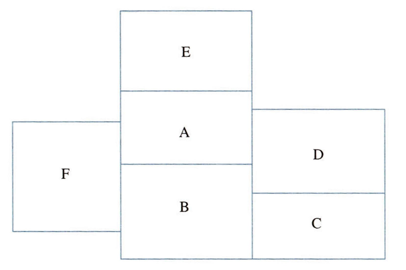
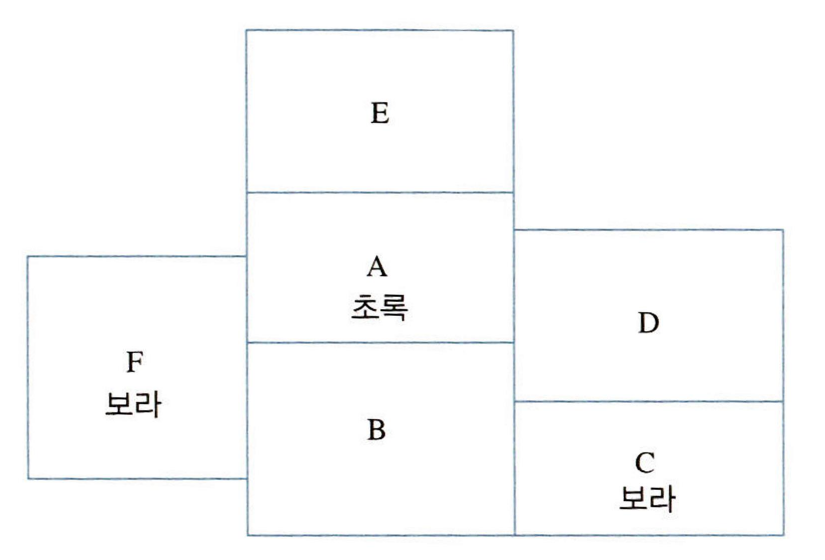
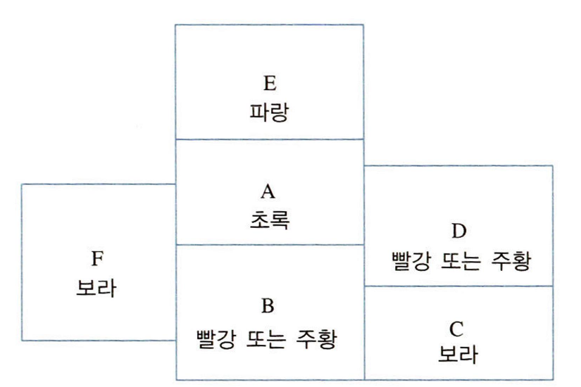
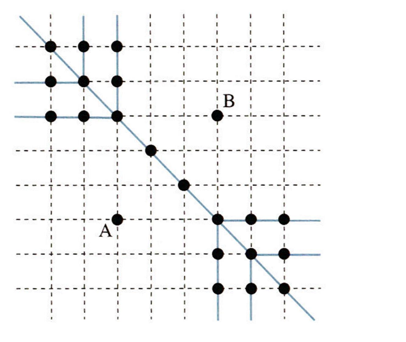
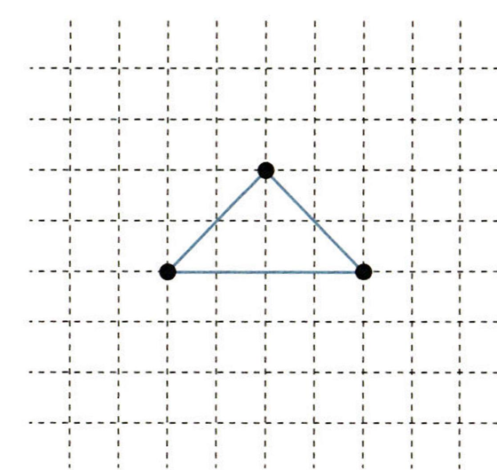
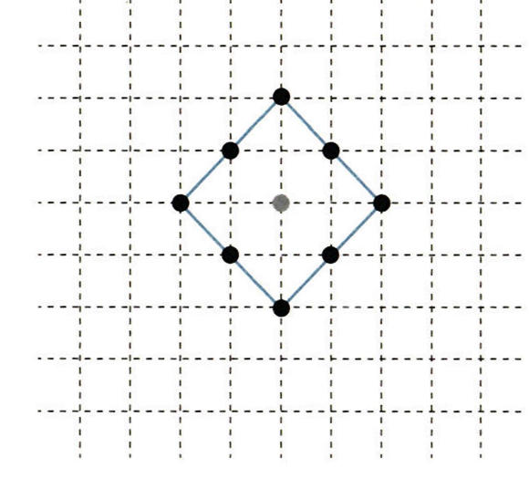
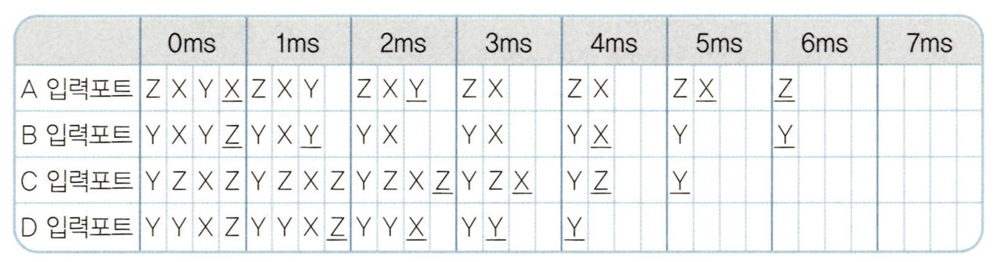

# 출제방향

## 1. 출제의 기본 방향

추리논증 시험은 대학에서 정상적인 학업과 독서 생활을 통하여 사고력을 함양한 사람이면 누구나 해결할 수 있는 내용을 다루되, 주어진 제시문의 내용에 관한 선지식이 문제 풀이에 도움이 되지 않도록 하였다. 그리고 제시문에서 주어진 내용을 단순히 문자적으로 이해하는 것만으로는 해결할 수 없고 제시된 글이나 상황을 논리적으로 분석하고 비판할 수 있어야 해결할 수 있도록 문항을 구성하여 사고력, 즉 추리력과 비판력을 측정하는 시험이 될 수 있도록 노력하였다.

내용 제재를 선택하는 데 있어서는 전 학문 분야 및 일상적ㆍ실천적 영역에서 소재를 찾아 활용하였다. 대학에서 특정 전공자가 유리하거나 불리하지 않도록 영역 간 균형 잡힌 제재 선정을 위해 노력하는 한편, 제시문으로 선택된 영역의 전문 지식이 문항 해결에 미치는 영향을 최소화하는 데에도 주력하였다. 시험의 성격상, 법을 비롯한 규범학의 제시문을 다소 많이 포함시켰으나, 제시문 및 질문을 최대한 순화하여 법학적 지식 없이 일상적 언어 능력과 사고력만으로 제시문을 읽어 내고 문제를 해결할 수 있도록 하였다.

## 2. 출제 범위 및 문항 구성

추리논증 시험은 법학과 윤리학 등의 규범학을 비롯하여 인문, 사회과학, 자연과학과 같은 다양한 학문적인 소재뿐만 아니라 사실이나 견해, 정책이나 실천적 의사결정 등을 다루는 일상적 소재도 포함하도록 하고 있다. 이번 시험에서도 소재 구성은 큰 차이가 없었다. 법 관련 제재를 다루는 문항들(1\~9번)과 윤리학을 포함한 인문 제재를 다루는 문항들(10\~17번), 사회과학 제재를 다루는 문항들(18\~25번), 자연과학과 융복합적 제재를 다루는 문항들(26\~29번), 그리고 일상적 논증과 논리ㆍ수리적 추리를 다루는 문항들(30\~35번)로 구성하여 다양한 성격의 글들을 골고루 포함하고 또 다양한 유형의 추리 능력 및 비판 능력을 측정할 수 있도록 하였다. 특히 법학전문대학원 교육에 필요한 논증 분석 및 평가 능력을 측정하는 것이 중요하다는 지적에 따라 이번 추리논증 시험에서는 복잡한 수리 추리 문항의 수를 줄이고 법과 규범에 관한 논증 평가 문항의 수를 늘렸다.

법학 전공자가 유리하지 않도록 하는 범위 내에서 법 관련 제재를 다양하게 사용하려고 하였다. 또한 법 관련 제재를 다루는 문항의 경우, 문제 해결에 다소 집중력이 필요한 문항을 포함시켰다.

## 3. 난이도

제시문의 분량 및 내용의 수준은 다수의 수험생이 한정된 시간 내에 문제를 충분히 해결할 수 있도록 조정하였으며, 수리 추리나 논리 게임의 추리 문항의 경우 문항이 지나치게 어려워지지 않도록 노력하였고, 논증이나 논쟁적 자료를 분석하고 비판하도록 요구하는 문항들의 난이도는 예년과 비슷하거나 약간 어려운 수준을 유지하려고 하였다. 예년에 비해 추리 문항의 수도 줄고 난도도 낮추어 체감 난도는 낮게 나타날 수 있지만, 비판 문항이 늘어 전체 분량이 늘어났고 글에 대한 깊이 있는 분석이 요구되어 실제 원점수의 평균점수는 예년에 비해 다소 낮아질 것으로 예상된다.

## 4. 출제 시 유의점

ㆍ 추리논증 시험으로 평가하고자 하는 능력이 법학전문대학원 교육에 필요한 추리 능력과 비판 능력임을 고려하여 추리 문항 수와 비판 문항 수 간의 적절한 비율을 유지하고자 하였다.

ㆍ 시험의 적절한 변별력을 위하여 난이도별 문항 수 간의 적정 비율을 유지하고자 하였다.

ㆍ 선지식에 의해 풀게 되거나 전공에 따른 유ㆍ불리가 분명해지는 제시문의 선택과 문항의 출제를 지양하였다.

ㆍ 출제의 의도를 감추거나 오해하게 하는 질문을 피하고, 평가하고자 하는 능력을 정확히 평가할 수 있도록 간명한 형식을 취하였다.

ㆍ 문항 및 선택지 간의 간섭을 최소화하고, 선택지 선택에서 능력에 따른 변별이 이루어질 수 있도록 하였다.

---

# 문항별 해설

## 01

### 문항구분

* 문항 성격 : 법ㆍ규범 - 논쟁 및 반론

* 평가 목표 : 인도적 군사개입과 관련된 지문을 이용하여 세 가지 주장을 이해하고, 주장들의 논쟁 점이 무엇인지를 파악하는 능력을 측정함

* 정답 : (2)

### 제시문 해설

인도적 군사개입의 정당성 논쟁에 관한 글이다. 이와 관련하여 제시문은 인도적 군사개입 부정론과 제한적 긍정론으로 구성되어 있다. 제시문에서의 첫 번째 쟁점은 인권은 보편적인 권리인가의 문제이다. 보편적 인권이란 어떠한 국가의 국민인지와 관계없이 사람이라면 마땅히 보호받아야 할 권리이고, 때문에 모든 국가는 이를 존중해야 하는 의무를 지니고 있음을 전제한다. 보편적 인권의 존재를 인정할 경우, 특정 국가가 자국 국민의 보편적 인권을 침해한다면 국제사회는 그 국가에 대해 인도적 견지에서 군사개입을 할 수 있는 근거를 갖게 된다. 반면 보편적 권리를 부정하거나 개별국가의 특수한 권리일 뿐이라고 한다면, 국제사회는 인도적 군사개입의 근거를 가질 수 없게 된다. 두 번째 쟁점은 인권은 도덕적 권리인가. 또는 법적 권리인가의 문제이다. 만약 인권이 도덕적 권리라고 본다면 일종의 규범 원리로 이해할 수 있지만, 자연법과 같이 그 요건과 한계가 불명확해진다. 그러나 법적 권리로 본다면 요건과 한계는 국제사회의 합의를 통해 규정될 필요가 있다.

A는 보편적인 도덕적 권리로서의 인권이란 강대국의 이데올로기에 불과한 것이며, 이에 기초한 인도적 군사개입은 주권국가의 자율성을 침해하는 것으로 보고 있다. B는 인권은 개별 주권국가들이 각각의 정치적 맥락에서 이룩한 특수한 권리이지만, 그와 동시에 인종청소와 대량학살과 관계 있는 최소한의 인권에 대해서는 보편적 권리라고 보고 있다. 또한 후자의 최소한의 인권은 도덕적 권리임을 명시하면서, 이에 근거한 경우에만 인도적 군사개입을 인정하고 있다. C는 역사적으로 인권은 법적 권리였으며, 특히 오늘날의 경우 국제법적으로 대부분의 나라들이 동의하는 법적 권리로 발전하였다고 판단한다. 때문에 C는 보편적 인권을 인정하면서도, 이에 따른 인도적 군사개입은 국제법으로 정한 요건과 한계를 준수할 때에만 정당화될 수 있다고 보고 있다.

### <보기> 해설

ㄱ. A는 보편적 인권이란 강대국이 약소국을 침략하기 위한 이데올로기로 보기 때문에 보편적 인권을 부정한다. 반면 B는 최소한의 도덕적 인권은 모든 주권국가들이 보호해야 하는 것으로 보기 때문에, C는 인권은 보편적인 법적 권리로 보기 때문에 각각 보편적 인권을 인정한다. ㄱ은 B는 보편적 인권을 부정한다고 했기 때문에 틀린 진술이다.

ㄴ. C는 국제법으로 정한 한계와 요건을 준수한다면 인도적 군사개입을 인정할 수 있다고 본다. 만약 국제법 규정이 원칙적으로 어떠한 국가도 무력을 사용하여 다른 주권국가를 침략할 수 없다고 되어 있어도 예외적으로 다른 규정에 정한 바가 있을 경우'에 허용한다고 정하고 있으면, 이는 C의 내용과 부합하기 때문에 C를 약화하지는 않는다. ㄴ은 옳지 않은 진술이다.

ㄷ. B와 C는 어떤 국가가 종교적 가치에 따라 사상ㆍ표현의 자유를 억압하고 있다는 근거만으로는 인도적 군사개입을 인정할 수 없다고 할 것이다. 왜냐하면 B의 경우 그것이 인종청소와 대량학살과 관계 있는 최소한의 도덕적 인권을 침해하는 것은 아니기 때문이며, C의 경우 국제법으로 정한 요건과 한계를 준수하였는지의 여부를 판단해야 하기 때문이다. ㄷ은 옳은 진술이다.
<보기>의 ㄷ만이 옳은 진술이므로 정답은 (2)이다.

## 02

### 문항구분

* 문항 성격 : 법ㆍ규범 - 언어 추리

* 평가 목표 : 헌법에 규정된 '인간다운 생활을 할 권리'의 법적 성격에 대한 여러 견해들을 분석하고 비판적으로 평가할 수 있는 능력을 측정함

* 정답 : (5)

### 제시문 해설

전형적인 법적 권리는 법원의 소송절차를 통하여 실현될 수 있다. 그런데 X국 헌법 제34조의 "모든 국민은 인간다운 생활을 할 권리를 가진다." 등의 사회적 기본권은 국가의 재정이 뒷받침되고 법률로 일반적인 기준이 정해진 다음에라야 실현될 수 있는 경우가 많다. 그래서 사회적 기본권의 성질에 대하여 다양한 이론이 제시되고 있다. 이 문항은 그러한 이론들 중 몇 가지를 간단히 소개하고 있다.

A는 위와 같은 사회적 기본권의 특징에 주목하여, 그것을 법적 권리로 인정하지 않는다.

B는 그것을 법적 권리로 인정하기는 하지만, 그 내용이 법률로 구체화되기 전에는 곧바로 국가기관에 주장하여 실현할 수 없다고 본다.

C는 위 조항이 국민에게 법적 권리를 일단 잠정적으로 인정하며, 그 확정적인 내용은 구체적인 사태에서 다른 권리나 의무와의 관계 및 사실적인 요소들을 고려하여 국민이나 국가기관이 판단할 수 있다고 본다.

D는 위 조항에 규정된 '인간다운 생활'의 내용으로 주장될 수 있는 여러 차원을 제시하고, 그 중 최소한의 물질적 생존 조건에 대하여는 바로 구체적인 법적 권리를 인정해서 별도의 입법조치 없이 실현할 수 있다고 보며, 사회의 여건에 따라서는 더 높은 수준에서 구체적인 법적 권리가 인정될 수 있다고 본다.

### 선택지별 해설

(1) A는 헌법 제34조가 "모든 국민은 인간다운 생활을 할 권리를 가진다."라고 규정하고 있음에도 불구하고, 그로부터 법적 권리가 인정되는 것은 아니라고 주장하므로 헌법 제34조의 문언에 반하는 해석을 한다는 비판을 받을 수 있다. (1)은 옳은 진술이다.

(2) B는 입법부가 그 권리의 내용을 법률로 구체화하기 전에는 국민에게 국가기관에 주장하여 실현할 수 있는 구체적인 법적 권리를 인정하지 않는다. 따라서 (2)는 옳은 진술이다.

(3) C에 따르면 그 권리의 확정적인 내용은 국민이나 국가기관이 구체적인 사태에서 여러 가지 규범적ㆍ사실적 고려를 한 판단을 통해 밝혀진다. 그런 판단은 사람에 따라 다를 수 있으므로, 그 권리의 확정적인 내용은 사람마다 다르게 이해할 수 있어서 불안정할 수 있다. 따라서 (3)은 옳은 진술이다.

(4) D는 최소한의 물질적인 생존 조건에 대하여는 어떤 경우에도 구체적인 법적 권리가 인정된다고 하지만, 사회여건에 따라서는 국가가 국민에게 최소한의 물질적인 생존 조건도 보장하지 못할 수도 있다. 따라서 (4)는 옳은 진술이다.

(5) A에 따르면 헌법 제34조는 국민에게 구체적인 법적 권리를 부여하는 것이 아니며, B에 따르면 헌법 제34조는 입법으로 구체화되어야 국민이 국가기관에 주장하여 실현할 수 있는 법적 권리가 있다고 보기 때문에, 국가의 다른 조치가 없다면 헌법 제34조를 근거로 법원에 구체적인 권리 주장을 할 수 없다. 하지만 C는 국민이나 국가기관이 그 권리의 확정적인 내용을 판단하여 실현할 수 있다고 하므로, 그 권리의 실현을 위하여 반드시 사전에 입법조치가 있어야 하는 것이 아니다. 따라서 C에 따르면 국민은 국가의 다른 조치가 없더라도 헌법 제34조를 근거로 법원에 구체적인 권리 주장을 할 수 있다. 따라서 (5)는 옳지 않은 진술이다.

## 03

### 문항구분

* 문항 성격 : 법ㆍ규범 - 논쟁 및 반론

* 평가 목표 : 자연물이 직접적인 소송 당사자가 될 수 있는지에 관하여 X국의 민사소송법을 토대로 대립되는 두 견해를 이해하고, 당사자자격에 관한 제시문의 내용을 중심으로 대립되는 각 주장을 바르게 평가할 수 있는 능력을 측정함

* 정답 : (4)

### 제시문 해설

위 문제는 자연물의 권리 소송에 대한 것이다. 자연물의 권리 소송은 자연물이 직접적인 소송 당사자가 되고 인간이 그에 대한 대변인이 되어 당사자인 자연이 침해당하고 있는 이익, 즉 자연이 가지고 있는 가치의 침해에 대해 판단을 하고 이에 근거한 판결을 요구하는 소송에서 당사자자격을 인정할 수 있는지를 판단한다. A는 대법원 2006. 6. 2.자 2004마1148, 2004마1149 결정을 소재로 한 주장이고, B는 모턴 판결(Sierra Club v. Morton, Secretary of the Interior, 405 U.S. 727(1972))을 소재로 올빼미로 각색하여 X국의 민사소송법제를 가정하여 당사자자격을 인정할 수 있는지에 관한 주장을 상정한 것이다. 한쪽에서는 당사자능력을 인정하지 않았고 한쪽에서는 당사자자격을 인정해야 한다는 내용을 대립시킴으로써 두 대립하는 입장이 공통적으로 전제하는 것과 각 주장에 대하여 강화 또는 약화시키는 논거를 찾는 문제이다.

### <보기> 해설

ㄱ. B는 현행법상 당사자자격의 규정을 무시하고 별도로 피침해 이익이 있는 주체에게는 당사자자격을 부여하여야 한다고 주장함으로써 자연물인 올빼미에게도 당사자자격을 인정하자는 것이므로 당사자자격 인정을 위해서는 당사자가 침해되는 이익이 있어야 함을 전제하고 있다고 말할 수 있다. 그러나 A는 침해되는 이익이 무엇인지에 관하여는 전혀 언급하지 않고 있으며, 오로지 당사자자격 중 당사자능력을 형식적으로만 파악하여 현행법을 기준으로 당사자능력을 사람이나 단체에 대하여만 인정하고 있으므로 당사자가 침해되는 이익이 있어야 함을 전제하고 있지는 않다. 그러므로 ㄱ은 옳지 않은 진술이다.
ㄴ. A에 따르면 현행법상 당사자능력이 있으려면 명문의 규정에 따라 사람 또는 단체이어야 하므로 올빼미가 당사자능력을 가지려면 현행법을 개정해야 한다. 따라서 ㄴ은 옳은 진술이다.
ㄷ. B는 현행법상 올빼미가 당사자자격이 인정되지 않음에도 불구하고 당사자자격을 인정하려는 것이므로 현행법의 명문의 규정에 반하는 해석이 허용된다면 B는 강화된다. 따라서 ㄷ은 옳은 진술이다.

<보기>의 ㄴ, ㄷ만이 옳은 진술이므로 정답은 (4)이다.

## 04

### 문항구분

* 문항 성격 : 법ㆍ규범 - 논증 평가 및 문제 해결

* 평가 목표 : 일수벌금형제 도입론과 관련된 제시문을 이용하여, 일수벌금형제 도입론의 취지, 내용 및 문제점을 파악하는 능력을 측정함

* 정답 : (3)

### 제시문 해설

일수벌금형제 도입론에 대한 글이다. 제시문은 형벌은 책임주의 형벌 원칙과 고통평등의 원칙을 충족해야 한다고 전제한 후, 징역형은 두 가지 원칙이 충족하고 있지만, 현행 총액벌금형제를 따르고 있는 벌금형은 책임주의 형벌 원칙에는 부합하더라도 고통평등의 원칙은 충족하지 못한다고 평가한다. 이러한 이유로 제시문은 일수벌금형제 도입이 필요하다고 본다. 일수벌금형제는 범죄자의 책임의 양에 따라 일수를 정할 수 있기 때문에 책임주의 형벌 원칙을 충족시킬 수 있을 뿐만 아니라, 범죄자의 경제적 능력에 따라 일일 벌금액을 차별적으로 정하기 때문에 고통평등의 원칙을 충족시킬 수 있다고 본다. <보기>의 진술들은 제시문에 기초하여 올바른 추론과 평가 능력을 측정하기 위한 것들이다.

### <보기> 해설

ㄱ. 벌금형의 경우 범죄자가 벌금이 부과될 때 느끼는 고통에 따라 범죄예방 효과가 발생할 것이다. 그런데 총액벌금형제에 있어서는 경제적 능력이 고려되지 않았기 때문에 경제적 능력이 큰 사람이 실제 벌금이 부과될 때 느끼는 고통은 크지 않을 수 있으며, 이 경우 범죄예방의 효과를 기대할 수 없게 된다. 그러나 일수벌금형제의 경우 경제적 능력을 고려하여 최종벌금액을 산정하기 때문에 경제적 능력이 큰 사람에게는 총액벌금형제보다 실제 벌금이 부과될 때 느끼는 고통을 크게 할 수 있으며, 이에 따라 범죄예방의 효과를 높일 수 있다. ㄱ은 옳은 진술이다.
ㄴ. 일수벌금형제 도입론은 동일한 범죄행위에 대해 동일한 고통을 느끼기 위해서는 경제적 능력을 고려하여 일일 벌금액을 정해야 한다고 주장한다. 이것은 경제적 능력이 다를 경우 동일한 벌금에 대해 상이한 고통을 느끼고, 경제적 능력이 같을 경우 동일한 고통을 느낀다는 점을 가정하고 있다. 그런데 실제 부자라고 할지라도 각자의 인생관, 도덕관 또는 재산 획득의 원인 등의 요인으로 인하여 동일한 벌금에 대해 상이한 고통을 느낄 수 있다. 예를 들어 1000만 원의 벌금에 대하여 자기 자신의 노력으로만 재산을 획득한 인색한 부자는 매우 큰 고통을 느낄 수 있지만, 단지 우연적 요인으로 재산을 얻은 낭비벽이 있는 부자는 큰 고통을 느끼지 않을 수 있다. 이처럼 경제적 능력이 같더라도 동일한 벌금을 통해 느끼는 고통의 정도가 다르다면, 일수벌금형제 도입론을 지지하는 가정이 충족되지 않기 때문에 일수벌금형제 도입론은 약화된다. ㄴ은 옳은 진술이다.
ㄷ. 제시문의 일수벌금형제 도입론은 징역형에 있어서는 기간을 정할 때 고통평등의 원칙과 책임주의 형벌 원칙이 충족된다고 보는 반면, 일수벌금형제의 경우 일수를 정할 때에는 책임주의 형벌 원칙이, 일일 벌금액을 정할 때에는 고통평등의 원칙이 충족된다고 설명하고 있다. 따라서 ㄷ은 옳지 않은 진술이다.

<보기>의 ㄱ, ㄴ만이 옳은 진술이므로 정답은 (3)이다.

## 05

### 문항구분

* 문항 성격 : 법ㆍ규범 - 논쟁 및 반론

* 평가 목표 : 재판에 나타나는 실천적인 논쟁을 정확하게 이해하고 평가할 수 있는 능력을 측정함

* 정답 : (5)

### 제시문 해설

근로기준법에 규정된 통상임금에 정기상여금을 포함하면, 통상임금을 기준으로 하는 추가근로수당이 오르게 된다. X국 법원은 정기상여금을 통상임금으로 보기로 하였고, 이런 해석을 기존에 정기상여금을 통상임금에서 배제한 노사협약에도 적용하기로 하였다. 따라서 기존의 노사협약에서 정기상여금을 통상임금에 포함하지 않은 경우에, 노동자들은 정기상여금을 통상임금에 포함하여 산정한 추가근로수당을 기준으로 하여 그동안 지급받지 못한 추가근로수당을 청구할 수 있는 것이 원칙이다. 이런 원칙에 대하여 일정한 경우에 예외를 인정할지를 두고서 A와 B가 다투고 있다. A는 노사의 신뢰관계를 심각하게 저버리는 것으로 평가될 수 있는 예외적인 경우에는 추가근로수당 미지급분 청구를 허용하면 안 된다는 입장인 데 반하여, B는 그런 예외를 인정하지 않는다.

### <보기> 해설

ㄱ. A는 이 재판의 결과를 계기로 추가근로수당 미지급분을 청구하는 것이 '임금협상 당시 서로가 전혀 생각하지 못한 사유'일 때 예외를 인정한다. 그런데 법원이 정기상여금을 통상임금으로 인정하는 판결을 곧 할 것이라는 사실을 X회사의 노사가 알았다면, 그런 조건을 갖추지 못한 것이 되므로 예외에 해당하지 않는다. 따라서 ㄱ은 옳은 진술이다.
ㄴ. A는 B와 달리 근로기준법과 그에 대한 법원의 해석을 획일적으로 적용하지 않고, 추가근로수당 미지급분을 청구하는 것이 노사관계의 기반을 무너뜨릴 정도로 노사의 신의를 심각하게 저버리는 데 해당하는 경우에는 예외적으로 청구를 허용하지 않는다. 따라서 A는 B보다 노사관계의 자율적인 형성과 발전을 더 중요하게 생각한다고 평가할 수 있다. 따라서 ㄴ은 옳은 진술이다.
ㄷ. 다른 기업들이 추가근로수당 미지급분 지급 여부를 이 판결에 따라 결정한다면, B에 따르면 예외 없이 그것을 지급할 것인데 A에 따르면 A가 인정하는 예외에 해당하는지를 판단해야 할 필요가 제기될 수 있다. 게다가 A는 그런 예외를 인정할 수 있는 요건으로 '이 재판의 결과를 계기로 추가근로수당 미지급분을 청구하는 것이 임금협상 당시 서로가 전혀 생각하지 못한 사유를 들어서 노동자 측이 그때 합의한 임금수준을 훨씬 초과하는 예상 외의 이익을 추구하는 것으로서, 그 결과 사용자에게 예측하지 못한 큰 재무부담을 지워서 중대한 경영상의 어려움이 발생하거나 기업의 존립이 위태로워진다'고 하는, 복잡하고 판단에 논란이 많을 수 있는 요건을 제시하였다. 그 중에서 기업 경영의 중대한 어려움이나 기업 존립의 위태로움이라고 하는 요건이 충족되는지에 대한 판단이 어려운 점은 B도 지적하였다. 따라서 A를 따를 때가 B를 따를 때보다 법적 분쟁이 생길 가능성이 더 높을 것이다. ㄷ은 옳은 진술이다.

<보기>의 ㄱ, ㄴ, ㄷ 모두 옳은 진술이므로 정답은 (5)이다.

## 06

### 문항구분

* 문항 성격 : 법ㆍ규범 - 언어 추리

* 평가 목표 : 연금분할 여부 및 방법에 대한 '가상'의 논쟁으로 구성된 제시문을 이용하여 각 의견들이 사실관계 속에서 어떻게 적용될 수 있는지를 파악하는 능력을 측정함

* 정답 : (3)

### 제시문 해설

부부가 이혼하였을 때 연금분할의 대상 및 지급 시기와 A, B, C, D는 다음 표와 같이 서로 대립되고 있다.

|  | 분할 대상 | 지급 시기 |
|---|---|---|
| A | 이혼 전 퇴직하여 이미 받은 연금 | 이혼일 |
| B | 퇴직 후 받게 될 연금총액의 현재 가치 | 이혼일 |
| C | 실제 퇴직하였을 때 받게 될 연금총액 | 퇴직일 |
| D | 이혼일에 사퇴한다면 받게 될 연금액 | 퇴직일 |

A의 경우 연금 수령자의 퇴직일 전에 이혼절차가 종결될 수도 있고 계속 진행될 수 있기 때문에 퇴직일 및 이혼절차 종결시점에 따라 연금 수령자 및 이혼 상대방에게 불리 또는 유리할 수 있다. B와 D의 경우 이혼일에 예상한 연금총액 및 퇴직일에 실제 받는 연금총액이 다를 경우 연금 수령자 및 이혼 상대방에게 불리 또는 유리할 수 있다.

### <보기> 해설

ㄱ. A에 의하면 만약 이혼 상대방이 연금형성에 기여했음에도 불구하고 이혼시점이 퇴직일 후라면 연금분할을 받을 수 없다. 만약 이것이 불합리하다면 A는 약화된다. ㄱ은 옳은 진술이다.
ㄴ. 만약 이혼 후 회사의 퇴직연한이 65세에서 60세로 바뀌었기 때문에, 연금 수령자가 연금 전액을 수령하기 위한 최소한의 근속연수를 채우지 못하는 경우가 발생한다면, 연금총액은 이혼일에 예상한 것보다 실제 퇴직일에 실제 받게 되는 것이 적게 된다. B의 경우 이미 이혼일에 예상한 연금총액을 대상으로 지급하였기 때문에 연금 수령자에게는 불리할 것이다. 반면 D의 경우 이혼일에 예상하였던 연금총액보다 퇴직일에 실제 받게 될 연금총액이 적다고 하더라도, 이미 이혼일 기준으로 사퇴할 경우 받게 될 연금액만을 대상으로 하고 있기 때문에 연금 수령자에게는 B보다 D가 더 유리하게 된다. ㄴ은 옳은 진술이다.
ㄷ. 만약 이혼 후 연금 자산 운용의 수익률 증가로 인하여 이혼 시 예상했던 것보다 더 많은 연금을 받게 된다면, 연금총액은 이혼일에 예상한 것보다 실제 퇴직일에 받게 되는 것이 더 많게 된다. C의 경우 퇴직일에 실제 받게 될 연금총액을 대상으로 하기 때문에 이혼 상대방에게는 유리할 것이다. 반면 B의 경우 이미 이혼일에 예상한 연금총액을 대상으로 지급하였기 때문에 이혼 상대방에게는 적어도 C보다 B가 더 불리하게 된다. ㄷ은 틀린 진술이다.

<보기>의 ㄱ, ㄴ만이 옳은 진술이므로 정답은 (3)이다.

## 07

### 문항구분

* 문항 성격 : 법ㆍ규범 - 언어 추리

* 평가 목표 : 현행 법규정을 단순화하여 가공된 민법상 선의취득에 관한 법리를 이해하고 이를 사례에 바르게 적용할 수 있는 능력을 측정함

* 정답 : (5)

### 제시문 해설

동산의 선의취득에 관한 법리를 단순화하여, 거래 시에 물건이 매도인의 것이라고 믿은 매수인이 유효한 거래에 의하여 넘겨받는 경우라면 무권리자(소유권이 없는 자)로부터도 물건에 대한 권리를 취득할 수 있는 원칙과 그에 대한 예외로서 도품에 관한 특칙, 다시 그에 대한 예외적인 사례인 돈에 관한 적용 여부를 이해하여 각 사례에 적용할 수 있는지를 묻는 문제이다. 제시문 두 번째 문단 이하의 주장에 따라, 동산에 관한 선의취득이 인정된다 하더라도 도품인 경우에는 소유권자가 달라질 수 있고, 도품이라 하더라도 돈인 경우에는 이것이 적용되지 않는 점을 이해한다면 문제를 쉽게 해결할 수 있다.

### <보기> 해설

ㄱ. 도품 아닌 시계를 갑이 을에게 매도하고 넘겨주었는데, 을은 그 시계가 갑의 것이 아님을 알고 있었기 때문에 제시문의 원칙에 의하여 소유권을 취득하는 상태가 아니다. 그러므로 소유권을 취득하지 못한 을은 여전히 소유권이 없다. 다시 정에게 그 시계를 매도하고 넘겨주었는데, 이 때 정은 을이 시계의 소유자라고 믿었기 때문에 무권리자 을로부터 선의취득하여 시계에 대하여 유효하게 권리를 취득한 것이다. ㄱ은 옳은 진술이다.
ㄴ. 돈을 물건으로 보는 경우, 갑이 을에게 도품인 돈을 넘겨주었다면, 도품성이 인정되므로 을은 그 돈이 도품이라는 사실을 몰랐고 갑의 것이라고 믿었음에도 불구하고 을의 것이 되지 않는다. ㄴ은 옳은 진술이다.
ㄷ. 제시문 마지막 문장에 따르면, 돈을 가치로 보는 경우에는 그 돈을 가지고 있는 자의 소유가 되므로, 갑이 을에게 돈을 주었는데, 을은 갑이 그 돈을 훔쳤다는 사실을 알고 있었다 하더라도 그 돈은 을의 소유가 된다. ㄷ은 옳은 진술이다.

<보기>의 ㄱ, ㄴ, ㄷ 모두 옳은 진술이므로 정답은 (5)이다.

## 08

### 문항구분

* 문항 성격 : 법ㆍ규범 - 언어 추리

* 평가 목표 : 행정법상 하자의 승계에 관한 법리를 이해하고, 이를 사례에 적용하여 해결할 수 있는 능력을 측정함

* 정답 : (5)

### 제시문 해설

행정법상 하자의 승계라 함은, 행정청의 선행행위(앞선 행위)와 후행행위(후속 행위)가 연속하여 발하여지는 경우에 선행행위에 대하여 제소기간이 경과하여 더 이상 소로써 다툴 수 없게 된 경우라 하더라도 후행행위를 다투는 소송에서 선행행위의 위법성을 끌어와 후행행위의 효력을 제거하는 것을 인정할 것인가를 의미한다. 이러한 하자의 승계가 인정되기 위한 전제로서 선행행위와 후행행위가 서로 결합하여 하나의 법적 효력을 이루어야 한다는 것이 필요하다. 다만, 제소기간과 무관하게 예외 없이 주장할 수 있는 선행행위의 무효사유에 해당하는 경우에는 선행행위와 후행행위가 서로 결합하여 하나의 효력을 발생시키는지 여부와 상관없이 하자의 승계가 인정될 수 있다는 점에 유의하고, 제시된 원리를 정확히 파악하여 사례에 적용하면 쉽게 해결할 수 있다.

### <보기> 해설

ㄱ. 철거명령에 하자가 있었으나 이에 대한 제소기간이 지났고 그 하자가 무효가 아니라면, 그 후속행위로서 대집행 절차의 하나인 대집행 계고 처분은 철거명령과 서로 결합하여 하나의 법적 효력을 발생시키지 않는다고 제시문에 나와 있으므로 철거명령의 하자를 대집행 계고 처분의 위법사유로 주장할 수 없다. ㄱ은 옳은 진술이다.
ㄴ. 철거명령이 무효라면, 앞선 행위와 후속 행위가 서로 결합하여 하나의 법적 효과를 발생시키는지 여부에 관계없이 앞선 행위의 하자를 다툴 수 있으므로, 대집행 계고 처분 취소소송에서도 철거명령의 하자를 대집행 계고 행위의 위법사유로 주장할 수 있다. ㄴ은 옳은 진술이다.
ㄷ. 대집행 계고와 비용징수 처분은 대집행 절차를 이루는 행위들로서 서로 결합하여 하나의 법적 효과를 발생시키므로 비용징수 처분 취소소송에서 대집행 계고 행위의 하자를 비용징수 행위의 위법사유로 주장할 수 있으며, 철거명령과 대집행 절차상의 행위는 따질 필요가 없으므로 ㄷ은 옳은 진술이다.

<보기>의 ㄱ, ㄴ, ㄷ 모두 옳은 추론이므로 정답은 (5)이다.

## 09

### 문항구분

* 문항 성격 : 법ㆍ규범 - 언어 추리

* 평가 목표 : 근대의 대표적인 사형폐지론자인 베카리아(1738-1794)의 글을 제시문으로 하여 이로부터 함축되는 진술을 파악하는 능력을 측정함

* 정답 : (1)

### 제시문 해설

베카리아는 제시문에서 다음과 같은 주장을 하고 있다.
(1) 주권과 법의 토대는 개인들이 내어놓은 자유에 기초하는데, 개인들이 자신의 생명을 주권과 법의 처분에 맡길 이유가 없으므로, 사형을 국가의 권리로 생각할 수 없다.
(2) 국가는 자유를 상실할 기로에 서거나 무정부상태가 도래하는 경우가 아니고서는 시민의 생명을 박탈할 수 없다.
(3) 사형이 범죄를 억제할 유일한 방법이어서 허용될 가능성은 없다.

### <보기> 해설

ㄱ. 제시문에서는 '국가가 자유를 상실할 기로에 서거나, 무정부상태가 도래하여 무질서가 법을 대체할 때'에만 시민에 대한 전쟁행위로서 국가가 시민의 목숨을 박탈하는 것이 허용될 가능성이 인정된다. '법에 따른 지배가 구현되고 있는 평화로운 나라'는 거기에 해당하지 않으며, 이 경우에는 범죄를 억제하는 유일한 방법일 때만 사형이 허용될 가능성이 있다고 한다. 그런데 사형이 범죄를 억제하는 유일한 방법일 가능성은 마지막 문단에서 부정되고 있다. 그러므로 '법에 따른 지배가 구현되고 있는 평화로운 나라에서 사형은 허용되지 않는다.'라고 추론할 수 있다.
ㄴ. 제시문에서 형벌의 목적은 주로 범죄를 억제하는 데서 찾아지고 있다. 따라서 '형벌의 주된 목적은 범죄자의 잘못된 습관을 교정하는 데 있다.'는 옳게 추론되는 진술이 아니다.
ㄷ. 제시문으로부터 형벌의 공개집행의 반대가 추론되지 않는다. 오히려 '우리의 감수성은 강력하지만 일시적인 충격보다는 미약하더라도 반복된 인상에 훨씬 쉽고도 영속적으로 영향을 받기 때문이다. 범죄자가 처형되는 무섭지만 일시적인 장면을 목격하는 것이 아니라, 일하는 짐승처럼 자유를 박탈당한 채 노동해서 사회에 끼친 피해를 보상하는 인간의 모습을 오래도록 보는 것이 범죄를 가장 강력하게 억제한다.'는 주장으로부터는 형벌의 공개집행에 찬성한다고 추론할 여지도 있다. 따라서 '형벌의 공개집행에 반대한다.'는 옳게 추론되는 진술이 아니다.

<보기>의 ㄱ만이 옳게 추론되는 진술이므로 정답은 (1)이다.

## 10

### 문항구분

* 문항 성격 : 인문 - 논증 평가 및 문제 해결

* 평가 목표 : 교육에서 일과 놀이라는 소재를 사용하여 이와 관련된 전형적 세 입장이 동의하는 것과 동의하지 않는 것을 추론하여 평가하는 능력을 측정함

* 정답 : (3)

### 제시문 해설

교육에 있어 일과 놀이의 관계에 대한 전형적인 세 가지 입장들(칸트, 프로벨, 오크쇼트)이 제시되어 있다. 칸트는 일과 놀이가 강제의 유무에 의해 구별된다고 보고 교과가 강제에 의해 배워져야 한다고 주장하는 반면 프로벨은 어린이가 일하는 방식의 '유희성'에 주목하여 학교가 이러한 '일의 유희성'을 계발해야 한다고 본다. 이에 비해 학교가 일을 위한 숙련 학습장이 아니라고 보는 오크쇼트는 놀이에 동반되는 '세계 이해성'을 학교가 계발해야 한다고 본다.

### <보기> 해설

ㄱ. 제시문에서 수학 교과를 놀이하면서 배우는 것은 불가능하다는 것은 A의 입장이라는 것은 분명하게 알 수 있다. 왜냐하면 교과를 배우는 것이 숙련성의 양성을 위해서이고 또 숙련성을 양성하기 위해서는 강제가 동원되어야 한다고 분명히 말하고 있기 때문이다. 다음으로 수학을 놀이의 방식으로 배울 수 있도록 교구를 계발해야 한다는 것이 B의 입장이라는 것, 그리고 수학이야말로 놀이로서의 세계 이해의 전형적 교과라는 것을 C가 주장하고 있다는 것도 제시문에서 알 수 있다. 그래서 놀이를 통한 수학 교과 학습의 가능성은 A에서는 부정되고 B, C에서는 긍정된다. ㄱ은 옳은 진술이다.

ㄴ. '학교는 일을 위한 공간이다'라는 주장에 A는 동의하고 B와 C는 동의하지 않는다는 제시문에서 추론할 수 없다. 왜냐하면 B가 학교에서 일을 배우되 '창의적 활동으로서의 일'을 배운다고 주장하기 때문이다. 즉 B는 학교는 일을 위한 공간이라는 데 동의한다. ㄴ은 옳은 진술이 아니다.

ㄷ. '과학을 배우는 이유는 일을 위한 쓸모 때문이다'라는 주장에 A는 동의하고 C는 동의하지 않는다는 제시문으로부터 추론할 수 있다. 제시문에서 A는 학교에서 배우는 교과는 숙련을 위한 것이라고 보고 있는 반면, C는 과학을 배우는 것이 일, 즉 세계를 이용해야 할 대상으로 보는 활동이 아니라, 이해를 위한 학문으로 보고 있기 때문이다. ㄷ은 옳은 진술이다.

<보기>의 ㄱ, ㄷ만이 옳은 진술이므로 정답은 (3)이다.

## 11

### 문항구분

* 문항 성격 : 법ㆍ규범 - 논쟁 및 반론

* 평가 목표 : 성매매 논쟁에서 찬반 입장을 명확하게 분석하고 상호 비판의 근거를 비교하는 능력을 측정함

* 정답 : (4)

### 제시문 해설

제시문에서 갑과 을은 성매매의 금지 혹은 허용에 관하여, 판매를 허용할 수 있는 대상인가, 선택의 자유에 해당하는가, 종속성을 강화하는가라는 기준을 두고 이 기준에 성매매가 해당하는지 아닌지를 논쟁하고 있다. 이 문제는 논쟁 당사자들의 논거를 파악하고 있는지, 어디가 논점인지, 상대방을 잘 반박하고 있는지 등을 평가한다.

### 선택지별 해설

(1) 유모가 자신의 젖을 아이에게 제공하는 것이 인신의 사용권을 양도하는 것이고 이런 인신의 사용권에 대한 판매가 비난받지 않는다면, 성매매도 다를 바 없다고 말할 수 있기 때문에 이것은 성매매를 찬성하는 을의 입장을 강화한다. 제시문에서 을은 성적 서비스 제공 역시 노동의 일종으로 직업선택의 자유를 보장해야 한다고 주장하고 있다. 따라서 성매매의 불법화로 인해 성판매자가 범죄자로 취급받는 적대적 환경 때문에 자신의 권리조차 제대로 행사할 수 없게 된다는 주장은 성매매의 불법화가 성판매자의 권리를 훼손한다는 주장이므로, 을의 입장을 지지한다.

(3) 갑은 성매매가 자발적 선택이라고 하여도 국가가 개입할 수 있다고 주장하고 있으므로, 자발적 선택으로 노예가 되기로 계약했다고 하더라도 노예노동이 금지되고 있다는 사실은 갑의 입장을 강화한다.

(4) 갑은 마약복용은 그것이 자율적 선택에 기인하는 것이라고 해도 인간의 존엄성과 관련되는 것이기 때문에 국가의 개입이 가능하듯이, 성매매가 자율적 선택에 기인하는 것이라고 해도 국가의 개입이 가능하다고 말한다. 따라서 마약복용이 행위자가 인지능력을 제대로 발휘하지 못하는 상태에서 행해진다면, 마약복용의 선택과 성매매 선택의 유사성은 약화되기 때문에 마약복용에 국가가 개입하듯이 성매매도 국가가 개입해야 한다는 주장은 약화되거나 최소한 강화되지는 않는다. 그러므로 (4)는 옳지 않은 진술로 정답이다.

(5) 을은 결혼, 외모성형 등도 성매매 못지않게 여성의 고정된 성정체성을 재생산하는데, 유독 성매매만 법적으로 금지하는 것은 설득력이 없다고 주장하고 있다. 다른 예로 미스 코리아 대회가 여성의 고정된 성정체성을 확대 재생산함에도 불구하고 법적으로 금지되지 않고 시행되고 있다는 사실은 성매매가 여성의 고정된 성정체성을 재생산하더라도 법적으로 금지하는 것은 설득력이 없다는 을의 입장을 강화한다.

## 12

### 문항구분

* 문항 성격 : 인문 - 논증 분석

* 평가 목표 : 육식 옹호를 비판하는 윤리학의 제시문을 이용하여 암묵적인 전제가 무엇인지를 정교하게 파악하는 능력을 측정함

* 정답 : (5)

### 제시문 해설

본문에서 글쓴이는 '동물들도 다른 동물을 먹기 때문에 인간도 다른 동물을 먹어도 된다.'는 주장에 근거하는 논변을 반박하고 있다. 글쓴이의 논증은 크게 두 부분으로 구성된다.

첫 번째 부분에서는 인간과 동물의 차이에 근거해서 동물들은 다른 동물을 먹는다.'는 것으로부터 '인간도 다른 동물들을 먹어도 된다.'고 추론할 수 없음을 보이고 있다. 글쓴이는 동물은 이성적 반성 능력이 없기 때문에, 동물은 자신의 식사 방법에 대한 책임을 질 필요가 없지만, 인간은 동물이 갖지 못한 이성적 반성 능력을 갖고 있기 때문에 자신의 식사 방식에 대해 책임져야 한다고 주장한다.

두 번째 부분에서 글쓴이는 인간의 육식에 대한 조금 다른 정당화로서, '동물이 다른 동물을 먹는 행위는 자연 과정의 일부이고, 인간의 육식 역시 그런 행위에 해당하므로, 인간의 육식은 자연 과정의 일부로서 정당하다. 는 논변을 비판하고 있다. 첫째로 그는 오늘날 인간의 육식은 자연 과정의 일부가 아니라, 자연적 필요를 벗어난 행위라는 점을 지적한다. 둘째로 그는 어떤 종류의 행위가 자연 과정의 일부라고 해서 그런 행위를 수정하거나 금지하는 일이 부당한 것은 아님을 보인다.

### 선택지별 해설

(1) 저자는 첫 번째 단락에서 '동물은 여러 대안을 고려할 능력이나 식사의 윤리성을 반성할 능력이 없다. 그러므로 동물에게 그들이 하는 일에 대한 책임을 지우거나, 그들이 다른 동물을 죽인다고 해서 죽임을 당해도 괜찮다고 판정하는 것은 타당하지 않다."라고 말하고 있다. 여기서 저자는 '반성 능력이 없는 존재에게는 책임을 물을 수 없다.'를 암묵적으로 전제하고 있다.

(2) 저자는 첫 번째 단락에서 '먹기 위해 다른 동물을 죽이지 않으면 살아남을 수 없는 많은 동물들과 달리, 사람은 생존을 위해 반드시 고기를 먹을 필요가 없다."라고 말하고 있고, 바로 이어서 위 (1)에서 말한 내용을 말하고 있다. 다시 말해서 동물은 다른 동물을 먹지 않으면 살아남을 수 없으므로, 먹지 말라는 것을 의무로 부과할 수 없지만, 인간은 다른 동물을 먹지 않아도 살아남을 수 있으므로 동물을 먹지 말라는 것을 의무로 부과할 수 있다는 것을 전제한다. 따라서 (2)는 이 글의 저자가 암묵적으로 전제하는 것이다.

(3) 저자는 첫 번째 단락에서 '나아가 동물은 여러 대안을 고려할 능력이나 식사의 윤리성을 반성할 능력이 없다. … 반면에 인간은 자신들의 식사습관을 정당화하는 일이 가능한지를 고려하지 않으면 안 된다."라고 말하고 있다. 다시 말해 동물은 어떤 행위(고기를 먹는 것의 대안을 고려할 수 있는 존재가 아니지만 인간은 그럴 수 있는 존재이므로, 윤리적 대안(고기를 먹지 않는 것이 있는데도 그 행위(고기를 먹는 것)를 하는 것을 정당화해야 한다는 말이다. 따라서 (3)은 이 글의 저자가 암묵적으로 전제하는 것이다.

(4) 저자는 두 번째 단락에서 '인간이 동물을 먹는 것이 자연적인 진화 과정의 한 부분이라는 주장은 더 이상 설득력이 없다. 이는 … 오늘날처럼 공장식 농장에서 가축을 대규모로 길러내는 것에 대해서는 참일 수 없다."라고 말하고 있다. 저자는 여기서 공장식 농장의 대규모 사육은 자연스러운 진화의 과정이 아니라는 것을 암묵적으로 전제하고 있다.

(5) 저자는 두 번째 단락 마지막 두 문장에서 우리가 자연법칙을 알 필요가 있지만 그로부터 자연적인 방식이 개선될 수 없음이 따라 나오지는 않는다고 말하고 있을 뿐이다. 이러한 주장을 이끌어 내기 위해 자연적인 방식이 개선되면 기존의 자연법칙은 더 이상 유효하지 않다.'를 암묵적으로 전제하지는 않는다. 저자는 예컨대 가임 여성이 매년 혹은 2년마다 아기를 낳는 것과 같은 자연적인 방식이 개선될 경우 기존의 자연법칙이 유효한지 그렇지 않은지에 대해 어떤 언급도 하지 않고 있다.

## 13

### 문항구분

* 문항 성격 : 사회 - 논쟁 및 반론

* 평가 목표 : 온실가스 배출을 제한하는 데 소요되는 부담을 국제적으로 어떻게 분담해야 하는지를 둘러싼 세 견해를 제시하고, 그것이 어떤 함의와 장단점을 갖는지를 추리하고 평가하는 능력을 측정함

* 정답 : (3)

### 제시문 해설

국제적으로 영향을 미치는 환경 문제인 온실가스 배출을 제한한다고 할 때, 이를 위한 부담을 분배하는 세 가지 원칙을 제시문은 제시하고 있다.

A는 개인의 평등한 대기 이용권을 근거로 인구 비례로 배출권을 주어야 한다는 입장이고, B는 기존에 온실가스를 배출한 양의 차이를 근거로 이를 보정할 수 있는 방향으로 배출권을 조절해야 한다는 입장이며, C는 배출을 제한함으로써 더 큰 이익을 얻는 국가가 더 큰 부담을 지는 수익자부담원칙을 제안하고 있다.
### <보기> 해설

ㄱ. 사치성 소비를 위한 배출 권리와 필수 수요 충족을 위한 배출 권리에 차별을 둔다는 것은 필수 수요 충족에 더 많은 가중치를 주는 것이 될 것이며, 따라서 단순히 인구수에 비례하여 배출권을 할당하는 것은 합당하지 않은 측면이 있다는 것을 함축한다. 단순히 인구수에 비례하여 할당할 경우, 자연 환경에 따라 필수 수요량이 다른 나라들 간의 차이를 반영하지 못할 뿐만 아니라, 총량은 같지만 경제적 여건에 따라서 사치성 소비 수요량이 상대적으로 더 큰 비중을 차지하는 나라와 필수 수요가 더 큰 비중을 차지하는 나라 간의 차이 또한 반영하지 못하기 때문이다. 따라서 ㄱ은 옳은 분석이다.

ㄴ. 이미 과거에 온실가스를 많이 배출한 나라는 그 만큼 배출권을 줄여야 한다는 B의 주장에 대해 과거 세대의 행위에 대해 현재 세대에게 책임을 지울 수 없다고 비판하는 쪽은 과거 세대의 행위와 현재 세대의 행위가 분리되어 별개로 고려되어야 한다는 것을 전제한다. 따라서 이 전제의 문제점을 지적한다면, B는 이 비판에 대해 재비판할 수 있다. ㄴ에 제시된 B의 응답인 '과거 화석 연료를 많이 이용한 국가들이 현재 1인당 국민총생산도 높다.'는 내용은 과거 세대의 행위가 현재 세대의 혜택으로 이어지고 있음을 보여 주고 있으므로, 이 전제에 대한 적절한 문제 제기라 할 수 있다. 따라서 ㄴ은 올바른 분석이다.

ㄷ. 현재 인구가 많은 국가는 우선 인구 비례로 온실가스 배출권을 배분하자는 A의 주장이 자신에게 유리하다고 판단할 것이다. 하지만 다른 한편, ㄷ에 따르면 인구가 많은 국가는 과거에 온실가스를 더 많이 배출했고, 온실가스를 더 많이 배출한 국가는 그로 인한 피해를 크게 입은 국가가 아니므로, C의 입장 역시 자신에게 유리하다고 판단할 수 있다. 현재 인구가 많은 국가에는 A와 C 모두 유리하므로, 현재 주어진 자료만으로는 A보다 C에 더 동의할 것이라는 결론을 내릴 수가 없다. 따라서 ㄷ은 옳지 않은 분석이다.
<보기>의 ㄱ, ㄴ만이 옳은 분석이므로 정답은 (3)이다.

## 14

### 문항구분

* 문항 성격 : 인문 - 논쟁 및 반론

* 평가 목표 : 가난한 나라에 대한 원조를 도덕적으로 강제할 수 있는지의 문제와 관련한 논쟁을 분 석하고 쌍방의 논거를 적절하게 평가할 수 있는 능력을 측정함

* 정답 : (2)

### 제시문 해설

이 문제는 원조의 의무에 대한 상반된 논증을 분석하고 비교해 보도록 하는 문제이다. 제시문에서 갑은 사실적 행위인과성과 이에 기초한 법적 책임소재가 분명한 경우에만 누군가에게 합당한 방식으로 원조의 의무를 부과할 수 있다고 주장한다. 반면에 을은 그러한 행위인과성과 법적 책임소재가 분명하지 않은 경우에도 어떤 사람이 다른 사람의 도움을 절실히 필요로 하는 상황 그 자체가 원조의 의무를 발생시키는 충분조건이 된다고 주장한다. 기아에 허덕이는 먼 나라 사람들의 불행한 상황을 외면할 것인가, 아니면 그러한 상황을 개선하기 위해 모종의 도움을 제공할 것인가 하는 문제와 관련하여 갑과 을은 상이한 실천적 결론을 이끌어 낸다. 5개의 선택지는 갑과 을의 상이한 주장이 지닌 함의를 비판적으로 분석하고 비교하며 평가해 보도록 유도한다.

### 선택지별 해설

(1) 을은 자유주의 사회 시민 대다수가 찬성하는 행위인과성과 이에 기초한 책임소재에 입각하여 부과된 의무만이 구속력을 갖는다는 통념을 비판하고 있으므로 (1)은 옳은 진술이다.

(2) 을은 가난한 나라를 도와주어야 하는 의무의 성립 조건은 '도와주는 자의 힘'이라고 말하지 나중에 도움 받을 수 있음'이라고 말하고 있지 않다. 그러므로 (2)는 옳지 않은 분석으로 정답이다.

(3) 갑은 행위를 규제하는 최소의 공리로서 '가해금지의 원칙' 에 충실할 것을 요구하는 소극적 도덕에 찬성하고 있으므로, 원조의 의무에서 핵심은 행위주체가 도와줄 수 있는 힘이 있느냐이지 그 외의 것은 부차적이라고 보는 것에 반대할 것이다. (3)은 옳은 진술이다.

(4) 을에게 중요한 것은 도움을 줄 수 있는 자의 힘이고 그 외의 것은 부차적이다. (4)는 옳은 진술이다.

갑은 부자 나라가 가난한 나라를 도울 의무가 있다는 것에 반대할 것이다. 따라서 (5)는 옳은 진술이다. 을이라면 가난한 나라가 부자 나라로부터 도움 받기를 원하는지에 상관없이 부자 나라에 원조 의무가 있다고 볼 것이다.

## 15

### 문항구분

* 문항 성격 : 인문 - 논쟁 및 반론

* 평가 목표 : 우연적 재능으로 얻은 혜택을 개인이 소유할 것인지 아니면 사회가 공유할 것인지를 판단하기 위한 원칙을 둘러싼 갑과 을의 논쟁을 제시하고, 각 주장이 함축하는 것을 추리하는 능력을 측정함

* 정답 : (3)

### 제시문 해설

갑은 사회ㆍ경제적 불평등은 가장 불리한 사회구성원들에게 혜택을 주는 경우에만 허용되어야 한다."는 원칙에 입각하여 볼 때 우연적 재능의 혜택을 각 개인이 갖는 것은 이 원칙에 부합하지 않으므로 그 혜택을 사회가 공유해야 한다고 주장한다.

반면 을은 우연적 재능의 혜택을 각 개인이 누릴 수 없다고 해서 거기서 바로 사회 전체가 공유해야 한다는 결론이 나오는 것은 아니라는 점을 지적하고 있다. 을은 갑의 논변이 공유 원칙을 가정하고 있다고 지적하면서, 이 공유 원칙은 무조건적으로 적용되어서는 안 되고, 개인의 덕을 존중하고, 개인의 다원성과 독자성이 유지되는 선에서만 적용될 수 있음을 피력하고 있다.

### 선택지별 해설

(1) 을은 정체불명의 '우르' 를 사회 전체를 의미하는 것으로 쓰고 있으며, 사회 전체를 의미하기 때문에 문제가 있다고 지적하고 있다. '사회 전체' 또는 '세상 모든 사람들'이 공유한다면 옳다고 보는 생각을 비판하고자 하므로, 갑은 오히려 을의 비판 정면에 놓이게 된다. (1)은 적절하게 추론할 수 있는 진술이 아니다.

(2) 갑은 공동체 전체의 이익 총량 증대를 기준으로 삼는 공리주의자와 달리 최소 수혜자의 복지 증진을 기준으로 삼으므로, 총량을 증대시키더라도 최소 수혜자의 복지 증진을 오히려 악화시킨다면 개인의 권리를 제한하는 데 반대할 것이다. (2)는 적절하게 추론할 수 있는 진술이 아니다.

(3) 을은 '하지만 그 공동체는 개인의 덕을 존중하는 공동체여야 한다. 그렇다면 사회적 공유의 범위는 상당히 제한될 수밖에 없다. 또한 공동선을 이유로 개인들의 다원성과 독자성을 위반할 가능성 역시 경계하지 않을 수 없다."라고 말하고 있다. 여기서 을은 우연적 재능으로 얻은 혜택을 개인이 갖는 것이 개인의 덕을 존중하는 데 더 기여한다면 개인이 우선적 소유권을 가질 수 있음을 부정하지는 않을 것이다. 따라서 (3)은 적절하게 추론될 수 있는 진술이다.

(4) 을에게는 개인의 다원성과 독자성이 공유 원칙보다 더 중요하므로, 공유 원칙과 충돌하는 충돌하지 않든 전자를 우선해야 한다고 볼 것이다. 따라서 충돌 시 공유 원칙을 우선할 것이라고 보는 (4)는 적절하게 추론할 수 있는 진술이 아니다.

(5) 을이 개인의 우연적 자산을 사회적으로 공유하는 것에 반대하는 경우가 있는 것은 맞지만, 그 이유에 대한 설명이 잘못되었다. 최소 수혜자의 복지 증진은 을이 아니라 갑이 주장하는 원칙이며, 을이 갑의 이 원칙에 동의하는지는 제시문에서 확인할 수 없다. 을이 사회적 공유에 반대한다면 그 이유는 그러한 공유가 개인의 덕이나 개인의 다원성이나 독자성을 훼손하기 때문이라고 보는 것이 제시문의 내용에 합당하다. (5)는 적절하게 추론할 수 있는 진술이 아니다.

## 16

### 문항구분

* 문항 성격 : 인문 - 논증 평가 및 문제 해결

* 평가 목표 : 낙태를 비판하는 윤리학의 제시문을 이용하여 반박을 약화할 수 있는 주장을 찾는 능력을 측정함

* 정답 : (4)

### 제시문 해설

위 문항은 대체 불가능성을 근거로 낙태를 비판하는 논증을 소재로 하고 있다. 낙태를 찬성하는 사람들 중에서는 지금 낙태를 하더라도 나중에 다시 임신을 하면 세계에 존재하는 행복의 양은 똑같으므로 낙태가 문제될 것이 없다는 입장이 있다. 을은 갑이 X의 경우에는 대체 불가능성을 이용해서 X의 낙태를 비판하면서, Y의 경우에는 대체 불가능하다는 점에서 Y의 대답이 더 정당하다고 주장해야 하는데, 아이의 항의가 더 정당하다고 생각하는 비일관성을 보이고 있다고 지적하고 있다. 따라서 을의 반박을 약화시키기 위해서는 갑이 사실은 비일관성을 보이고 있지 않다고 대답하면 된다. 갑은 대체 불가능성이라는 원칙이 X에는 적용되지만 Y에는 적용되지 않는다고 말하면 될 것이다. 다시 말해서 [A]에는 X에는 대체 불가능성을 적용할 수 있지만 Y에는 적용할 수 없는 이유가 들어가면 된다.

### 선택지별 해설

(1) 지금 을은 대체 불가능성을 가지고 갑을 비판하고 있다. 따라서 대체 불가능성과 상관없는 진술들은 을의 주장을 약화할 수 없다. (1)은 산모의 생명이나 건강 이외의 다른 이유로 낙태를 할 수 있느냐 없느냐가 X와 Y의 차이점인데, 이것은 대체 가능성과 상관이 없으므로 을의 반박을 약화할 수 없다. 답지 (1)을 [A] 자리에 넣어 문장을 완성하면 'X는 산모의 생명이나 건강 이외의 다른 이유로 낙태를 할 수 있다고 생각했으므로 대체 불가능성이 적용되지만, Y는 어떤 것도 낙태의 이유가 될 수 없다고 생각했으므로 대체 불가능성을 적용할 수 없다.'인데, 이것은 갑이 하려고 하는 말이 아니다. 이하 (2), (3), (5)도 이런 식으로 구성해 보면 갑이 하려고 하는 말이 아님을 알 수 있다.

(2) 만족스러운 삶의 질을 가질 수 있느냐 없느냐도 대체 가능성과 상관이 없으므로 을의 반박을 약화할 수 없다.

(3) 태어났을 아이를 존재하지 않게 하느냐, 가졌을 아이를 존재하지 않게 하느냐도 대체 가능성과 상관이 없으므로 을의 반박을 약화할 수 없다.

(4) 갑이 태아는 대체 불가능하다는 입장을 가지고 있다고 하더라도 X의 아이와 Y의 아이가 똑같은 경우가 아니라고 한다면 을의 비판을 약화할 수 있다. 다시 말해서 X는 이미 있는 태아에 대해 대체 가능한 것으로 결정했고, Y는 태아가 아직 존재하기 전에 결정을 내린 것이다. 즉, 'X는 이미 존재한 생명에 대해 결정을 했으므로 대체 불가능성이 적용되지만, Y는 아직 생명이 존재하기 전에 결정을 내렸으므로 대체 불가능성을 적용할 수 없다.'가 바로 갑이 하려고 하는 말이므로, (4)가 [A]에 들어가면 을의 반박은 약화된다.

(5) 누구인지 모르는 아이에게 해를 끼쳤느냐, 누구인지 아는 아이에게 해를 끼쳤느냐도 대체 가능성과 상관이 없으므로 을의 반박을 약화할 수 없다.

## 17

### 문항구분

* 문항 성격 : 인문 - 논쟁 및 반론

* 평가 목표 : 미끄러운 비탈길 논증에서 애매모호하게 사용된 개념을 정확히 찾아 논증의 오류를 적절히 평가하고, 반박하는 능력을 측정함

* 정답 : (4)

### 제시문 해설

제시문에서는 소유권의 성립에 관련한 로크의 제한조건과 “이러한 로크의 제한조건이 현재 만족될 수 없다면 과거에도 만족될 수 없었다.”는 이른바 zip back 논증이 소개되어 있다. 이 zip back 논증은, 연역논증으로서, “미끄러운 비탈길” 논증 유형에 속하는 것으로 간주될 수 있다. 미끄러운 비탈길 논증은 일반적으로 개념의 애매모호함에 의존한다. 잘 알려진 “모든 태아가 인간이다.”는 결론을 옹호하는 미끄러운 비탈길 논증은 ‘인간’ 개념의 애매모호함에 의존한다. 마찬가지로 제시문의 zip back 논증도 “로크의 제한조건에 위배된다.”는 개념의 애매모호함에 의존하는 오류를 범하고 있는 것으로 분석될 수 있다.

### 선택지별 해설

(1) 제시문의 논증의 목적은 가정 ⓐ가 참이라고 할 때 소결론 ⓔ가 도출되는지를 입증하는 데 있다. 따라서 ⓐ의 가정이 거짓이더라도 제시문의 논증에는 어떠한 영향도 미치지 않는다. 따라서 (1)의 비판은 제시문 논증에 대한 적절한 비판일 수 없다.

(2) “나쁜 상황에 빠뜨렸다.”를 느슨한 의미로 받아들이는 한 X가 Y를 나쁜 상황에 빠뜨렸다는 ⓑ는 ⓒ로부터 도출 가능하다. 왜냐하면 ⓒ에 따르면 X는 Y의 소유를 로크의 제한조건에 위배되게끔 만든 만큼은 Y를 나쁘게 만든 것이 사실이기 때문이다. ⓑ가 ⓒ로부터 도출되지 않는다고 하려면, 이를테면 X가 Y의 소유를 로크의 제한조건에 위배되게끔 만든 것은 로크가 의미하는 나쁜 상황이 아니라는 점을 지적해야 한다. 하지만 (2)는 엉뚱한 W를 끌어들여 결론을 부정하고 있으므로 적절한 비판일 수 없다.

(3) ⓒ의 주장을 받아들일 수 없는 근거가 잘못되었다. X가 t를 소유하면, Y가 남은 t를 소유하게 되므로 Y의 소유는 정의상 로크의 제한조건을 위배하지 않을 수 없다. 제시문에서 더 이상 사물 t를 소유할 수 없는 자로 Z를 가정하고, 그 Z 바로 전에 t를 소유한 자가 ‘Y’라고 정의하고 있기 때문이다. 따라서 Y가 로크의 제한조건에 위배되지 않고 t를 소유할 여지는 없다.

(4) 논증의 오류를 정확히 지적한 진술이다. 제시문의 내용에 따르면 X가 Y를 더 나쁘게 한 방식과 Y가 Z를 더 나쁘게 한 방식에는 질적인 차이가 있다. Y에 의해 나빠진 Z의 상황이란, 제시문에서 명시적으로 밝히고 있듯이, ‘Z가 사용할 수 있는 사물 t가 더 이상 존재하지 않는 상황’을 가리킨다. 반면 X에 의해 나빠진 Y의 상황이란, “Y가 사물 t를 소유하면 로크의 제한조건을 위배하는 상황”을 가리킨다. 로크의 제한조건을 “다른 사람들의 상황을 더 나쁘게 한다.”는 느슨한 의미로 이해하지 않고, 로크가 기술한 “다른 사람들도 좋은 상태로 사용할 만큼 (사물들이) 충분히 남아 있지 않게 한다.”로 이해한다면, Y의 소유는 로크의 제한조건에 위배되지만, X의 소유는 그렇지 않다. 제시문의 논증은 “상황을 더 나쁘게 한다.”는 표현의 이러한 애매성에 의존하고 있고, (4)는 이 점을 지적하고 있으므로 적절한 비판이다.

(5) ⓔ에서 주장하는 것은 “최초로 t를 소유한 자가 실제로 그 누구이든 상관없이 그 자의 소유는 로크의 제한조건에 위배된다.”는 것이다. 다시 말하면, ⓔ가 의미하는 바는, 만약 우리가 최초로 t를 소유한 자를 ‘A’로써 지칭하고자 약속한다면, A가 실제로 누구인지 몰라도 우리는 “A의 소유는 로크의 제한조건에 위배된다.”는 진술을 확실하게 주장할 수 있다는 것이다. 따라서 A가 누군지를 알 수 없다는 사실은 ⓔ를 조금도 약화하지 않는다.

## 18

### 문항구분

* 문항 성격 : 사회 - 논쟁 및 반론

* 평가 목표 : 결혼이 자살에 미치는 영향에 관한 다양한 견해들 중 어느 것이 타당한지를 주어진 <자료>를 갖고 평가할 수 있는 능력을 측정함

* 정답 : (1)

### 제시문 해설

갑은 사람들이 삶의 버거움에 절망을 느끼며, 이 경우 자살의 가능성이 높아진다고 본다. 제시문을 보면, 1873-1878년 동안 기혼자 중 자살한 사람은 16,264명이고 미혼자 중 자살한 사람은 11,709명으로 나타나고 있어, 이를 토대로 해석할 때 결혼과 가족은 버거운 부담과 책임을 지우기 때문에 자살 가능성을 높인다는 견해를 취하고 있다. 이와 달리 을은 결혼과 가족은 자살을 예방하는 효과가 있다고 본다. 병은 을이 제시하는 증거에 대해 비판적으로 바라보고 의문을 제기하며, 결혼의 자살 예방 효과를 확신하기 어렵다고 말하고 있다.

### 선택지별 해설

(1) 병은 을이 해석한 16세 이상 미혼자의 자살률(173)과 기혼자의 자살률(154.5)의 차이가 12%밖에 나지 않기 때문에 결혼이 자살을 억제하는 효과를 인정할 수 없다는 견해를 취한다. ㄱ은 기혼자의 평균 연령이 미혼자의 평균 연령보다 훨씬 높다는 사실, 그리고 연령대가 올라갈수록 자살률이 높아진다는 사실을 보여 준다. 을이 16세 이상의 연령대 모두를 통틀어서 비교했을 때 기혼자의 자살률이 미혼자의 자살률보다 약간 낮았지만, ㄱ이 사실이라면 결혼의 효과는 사실 과소추정된 것으로 볼 수 있다. 만약 연령이 자살에 영향을 미치는 유일한 요인이라면 기혼자의 자살률은(140 이상) 미혼자의 자살률(97.9 이하)보다 최소 43%([140/97.9]×100) 더 커야 한다. 그런데 실제 미혼자의 자살률이 기혼자의 자살률보다 더 높다는 사실은 결혼이 자살을 예방하는 데 큰 영향을 미쳤다는 것을 의미한다. 따라서 ㄱ은 결혼의 자살 예방 효과를 확신하기 어렵다는 병의 주장을 반박하는 데 을이 사용할 수 있는 자료가 된다. 따라서 (1)은 옳은 진술이다.

(2) 병은 결혼의 자살 예방 효과를 확신하기 어렵다고 주장한다. 그런데 ㄴ을 보면, 미혼 여성의 자살률은 기혼 여성의 자살률보다 56% 더 높고, 미혼 남성의 자살률은 기혼 남성의 자살률보다 173% 더 높다. 성별에 관계없이 미혼자의 자살률은 기혼자의 자살률보다 최소 56% 이상 더 높으므로 이는 결혼이 자살을 막는 효과가 있다는 을의 주장을 뒷받침하는 증거가 된다. 따라서 병은 ㄴ을 이용하여 을의 주장을 반박할 수 없다. (2)는 옳지 않은 평가이다.

(3) 갑은 결혼이 자살을 유도한다고 주장한다. ㄷ을 보면, 미혼 여성의 자살률은 배우자와 사별한 여성의 자살률의 84%에 불과하므로 여성의 경우에는 결혼 후 배우자와의 사별이 미혼보다 자살을 유도하는 효과가 있다고 말할 수도 있다. 하지만 미혼 남성의 자살률은 배우자와 사별한 남성의 자살률보다 32% 더 크기 때문에 남성의 경우에는 미혼이 결혼 후 배우자와의 사별보다 자살을 유도하는 효과가 더 큰 것으로 나타난다. 결혼 후 배우자와의 사별이 자살에 미치는 효과가 성별에 따라 달라지고 있으며, 더욱이 ㄷ은 근본적으로 결혼이 자살에 미치는 효과에 대한 자료는 아니기 때문에, ㄷ은 갑의 주장을 강화한다고 볼 수 없다. (3)은 옳지 않은 평가이다.

(4) ㄹ을 보면, 인구 대비 혼인 건수는 수십 년 동안 큰 변화가 없었다고 했으므로 그 기간 동안 혼인율은 일정했다고 보아야 한다. 그런데 이 기간 동안 자살률은 3배로 증가하였기 때문에, 이런 결과가 나타나기 위해서는 결혼 이외의 다른 변인이 자살에 영향을 미쳐야 한다. 을은 결혼이 자살을 막는 효과가 있다고 주장하고 있는데, ㄹ은 결혼 이외에 다른 변인이 자살에 영향을 미쳤다는 것을 보여 주므로, 최소한 ㄹ은 을의 주장을 강화하지는 않는다. (4)는 옳지 않은 평가이다.

(5) ㄹ은 자살이 결혼이 아닌 다른 요인에 의해 영향을 받는다는 점을 말해 주며, 결혼의 자살 예방 효과에 대해서는 말해 주는 바가 없다. 따라서 ㄹ은 결혼의 자살 예방 효과를 확신하지 못한다는 병의 주장을 약화하지 않는다. (5)는 옳지 않은 평가이다.

## 19

### 문항구분

* 문항 성격 : 사회 - 논쟁 및 반론

* 평가 목표 : 신약의 효능을 평가하는 방법을 둘러싼 각 견해의 주된 주장과 그 논거를 이해하고 있는지를 평가함

* 정답 : (3)

### 제시문 해설

글쓴이는 동등성시험이 아니라 위약시험으로 신약의 효능을 평가해야 한다는 A국 식약청이나 ⓒ의 몇몇 의사들의 주장이 왜 타당하지 못한지 다음과 같은 논거로써 반론을 제기하고 있다.
A국 식약청은 신약의 효능을 동등성시험이 아니라 위약시험을 통해 실시하도록 제도적으로 요구하고 있다. 이에 대해 H선언은 위약시험은 그 시험 기간 동안 아무런 약리적 효과가 없는 위약을 처방받는 환자들에게 치료받을 수 있는 기회를 박탈하기 때문에 윤리적으로 문제가 있다고 보고, 대신 이미 약리적 효과가 입증된 기존의 의약품과 비교하여 신약의 효능을 평가하는 동등성시험이 적용되어야 한다고 주장한다. 하지만 몇몇 의사들은 정신과 치료의 경우, 치료 효과는 환자의 주관적 평가에 좌우되기 때문에 동등성시험이 아닌 위약시험이 적용되어야 한다고 반론을 제기한다. 이런 주장의 이면에는 위약시험에서 사용되는 위약의 효과는 상대적으로 환자의 주관적 평가로부터 덜 영향을 받는다는 전제가 깔려 있다. 그러나 글쓴이는 위약의 효과가 평가하는 사람들의 주관에 따라 상당한 편차가 발생한다는 기존 연구 결과들은, 위약으로 약품의 실질적 효능을 측정할 수 있다고 보는 A국 식약청이나 ⓒ의 몇몇 의사들의 주장과 달리, 위약이 신약의 약효 평가의 확고한 준거점이 되지 못한다는 주장의 증거가 된다고 보고 있다.

### 선택지별 해설

(1) 제시문의 “이미 해당 질환에 대한 치료 효능이 입증되어 신약과 비교 가능한 약품이 존재하더라도, 신약 제조자는 신약에 대한 위약시험을 거쳐야 한다.”고 서술되어 있는 부분은 A국 식약청은 신약에 대한 동등성시험 여부에 관계없이 의무적으로 위약시험을 거치도록 요구하고 있다는 것을 의미한다. 이로부터 만약 동등성시험만 하고 위약시험을 하지 않았을 경우라면 A국 식약청은 그 신약의 출시를 불허할 수 있다는 점을 추론할 수 있다. 따라서 (1)은 옳은 진술이므로 오답이다.

(2) ⓑ는 효과적인 약품이 존재한다면 의사들은 이를 환자에게 제공할 법적ㆍ윤리적 의무가 있다고 주장한다. 그런데 위약은 실질적인 약리적 효과가 없기 때문에 위약시험에서 위약을 적용받은 환자 집단은 그 시험 기간 동안 효과적인 약품으로 치료받을 수 있는 기회가 박탈된다. 이런 사실은 ⓑ가 위약시험으로 신약의 효능을 검증하는 방식을 비판하는 논거가 된다. 따라서 (2)는 옳은 진술이므로 오답이다.

(3) ⓑ의 H선언은 신약의 효능성을 검증할 때 동등성시험을 사용해야 하는 이유로 시험에 참가하는 환자들이 치료받을 수 있는 기회를 박탈하지 않으면서도(윤리적 기준의 준수) 약품의 안전성과 효능에 대한 비교 가능한 정보(과학적 비교) 둘 다를 제공한다는 점을 든다. H선언에 따르면, 위약시험은 위약이 적용되는 집단에게 시험 기간 동안 치료받을 수 있는 기회를 제한하기 때문에, 비록 그 방법으로 약효의 효능이 검증될 수 있다고 하더라도 H선언의 윤리적 기준을 위반하는 것이 된다. 설령 위약이 적용되는 집단이 약리적 효과가 아닌 심리적 효과 때문에 치료가 되었더라도 그것이 H선언에서 강조하는 동등성시험의 중요성을 약화하지는 못한다. 왜냐하면 위약시험에서의 위약의 치료 효과는 우연적인 것으로 간주할 수 있어 위약시험에서는 여전히 환자가 치료받을 수 있는 기회가 제한된다고 볼 수 있으므로, 동등성시험의 필요성에 대한 논거가 약화되지 않기 때문이다. 따라서 (3)은 옳지 않은 진술로 정답이다.

(4) ⓒ는 동등성시험으로 우울증 치료제와 같은 향정신성 의약품의 약효를 검증하는 방법은 약효의 효과가 환자의 주관적 평가 결과에 의해 크게 영향을 받기 때문에 부적절하다면서, 신약의 효능 검증에는 다른 기준이 적용되어야 한다고 주장하고 있다. 여기서 그 ‘다른 기준’은 문맥상으로 볼 때 위약시험임을 알 수 있다. 글쓴이는 ⓒ의 이러한 주장이 타당하기 위해서는 위약이 약리 효과를 검증할 수 있는 항상적 기준을 제공할 수 있음을 전제해야 한다고 말하고 있다. 그러므로 ⓒ는 위약시험은 동등성시험보다 환자의 주관적 판단이 초래하는 오류로부터 상대적으로 자유롭다고 전제하고 있음을 추론할 수 있다. 따라서 (4)는 옳은 진술이므로 오답이다.

(5) 만약 위약의 효과에 대한 시험 참가자들의 평가 결과가 일정하고 가변적이지 않다면, 동일한 의약품에 대해 반복해서 실시한 위약시험에서의 위약의 효과에 대한 평가 결과는 균질해야 한다. 한편, 무작위로 선정된 대상자 중 신약을 적용받은 경우 50개 집단 간 응답의 분포와 평균값에 유의미한 차이가 없다는 점은 50개 신약 집단의 응답 분포가 유사하고 약리 효과에 대한 평가 결과들은 비슷했다는 점을 나타낸다. 이는 신약의 약리 효과 이외의 다른 요인들이 신약의 효능 평가에 영향을 거의 미치지 않았거나, 영향을 미쳤더라도 평가 결과에 미친 영향력의 정도가 응답자에 따라 크게 다르지 않았음을 의미한다. 반면 위약을 적용받은 경우 50개 집단 사이에는 약리 효과에 대한 응답 분포와 평균값이 유의미한 차이가 있다고 했기 때문에, 위약의 효과에 대한 50개 집단의 평가 결과들은 제각각이었음을 알 수 있다. 유사한 특징을 지닌 시험 참가자들의 위약에 대한 평가 결과가 시험마다 다르게 나타난다는 것은 신약의 효과를 검증하기 위한 준거로서의 위약의 효과가 일정하지 않고 가변적이며 평가자들의 주관에 크게 영향을 받는다는 점을 의미한다. 따라서 (5)는 옳은 진술이므로 오답이다.

## 20

### 문항구분

* 문항 성격 : 사회 - 논쟁 및 반론

* 평가 목표 : 대립되는 가설들이 타당하려면 어떤 검증 방법이 적용되어야 하는지, 그리고 그런 방법으로부터 도출된 결과들이 실제 가설의 타당성을 입증할 수 있는 근거가 되는지 판단할 수 있는 능력을 측정함

* 정답 : (3)

### 제시문 해설

제시문에서는 성별 채용 확률의 차이를 설명하는 인적 자본 가설과 차별 가설을 기술한 후, 가설을 검증하는 연구 설계를 제시하고 있다. 이 실험에서 중요한 것은 실기 시험에서 얼굴을 볼 수 있도록 하는 공개 시험과 얼굴을 볼 수 없게 커튼으로 가린 연주 시험으로 나누어 합격률을 조사하였다는 것이다. 이러한 실험 설계에서 커튼으로 가린 연주 시험은 성별이 연주 심사 결과의 평가에 영향을 미칠 수 있는 가능성을 통제하기 위한 방법이다. 따라서 커튼으로 가린 연주 심사의 여성 합격률이 공개 시험에서의 여성 합격률에 비해 더 높다면 이는 차별 가설을 지지하는 결과로 해석할 수 있다. 한편, 연주 심사 결과는 오직 인적 자본 요인이나 성별 요인에 의해서만 이루어진다고 가정하고 있기 때문에, 오직 인적 자본 요인만으로 평가가 이루어지는 커튼으로 가린 연주 시험의 결과는 인적 자본 가설의 타당성을 평가하는 데도 활용할 수 있다.
### <보기> 해설

ㄱ. 공개 연주 심사 결과는 순수한 연주 실력(인적 자본)과 성별 효과 둘 다에 의해 영향을 받을 수 있으며, 커튼으로 가린 연주 심사는 연주 실력만이 이에 영향을 미치게 된다. 만약 인적 자본 가설이 타당하다면 심사 결과는 오로지 연주 실력만으로 평가되었다는 것을 의미하므로, 공개 연주 심사 결과와 커튼으로 가린 연주 심사의 결과는 큰 차이가 없어야 한다. 즉 공개 연주 심사이든 커튼으로 가린 연주 심사이든 남성의 합격률은 여성의 합격률보다 항상 높아야 한다. 하지만 ㄱ에는 준거가 되는 남성 합격률에 대한 정보가 제시되어 있지 않고, 여성 합격률 또한 공개 심사의 경우와 커튼으로 가린 심사의 경우가 다르게 나타나고 있어, 인적 자본 가설을 지지하는 결과로 볼 수 없다. ㄱ은 옳지 않은 진술이다.

ㄴ. 공개 연주 심사에서는 연주자의 외모가 드러나므로 연주자의 연주 실력(인적 자본)뿐만 아니라 외모(성별 효과) 또한 평가자의 평가 결과에 영향을 미칠 수 있다. 따라서 비록 공개 심사의 여성 합격률이 남성 합격률에 비해 유의미하게 낮다고 하더라도, 그 평가 결과에 영향을 미친 요인이 인적 자본 효과인지 성별 효과인지 판단할 수 없으므로, 이 결과만 가지고서는 차별 가설을 지지한다고 볼 수 없다.

ㄷ. 커튼으로 가린 연주 심사에서는 성별 효과는 통제되고 오로지 인적 자본 효과(연주 실력)만 평가에 영향을 미치게 된다. 지원자들이 무작위로 배정된 상태에서 커튼으로 가린 연주 심사 결과 여성 합격률이 남성 합격률보다 유의미하게 낮았다는 것은 남성이 여성보다 상대적으로 연주 실력이 더 뛰어났음을 의미하므로, 이는 인적 자본 가설을 지지한다.
<보기>의 ㄷ만이 타당하므로 정답은 (3)이다.

## 21

### 문항구분

* 문항 성격 : 사회(경제학) - 논증 평가 및 문제 해결

* 평가 목표 : 통계적 데이터에 근거한 논쟁적 주장을 비판할 수 있는 논거를 찾는 능력을 측정함

* 정답 : (4)

### 제시문 해설

그래프에 나타낸 33개 OECD 회원국 가운데 한국의 시장소득 지니계수가 가장 낮고 처분가능소득 지니계수는 평균에 가깝다. <주장>은 이를 근거로 한국은 재분배 이전에 소득불평등이 가장 낮은 나라이며 재분배 결과 OECD 회원국의 중위권 수준이라고 판단한다. 이러한 판단에 기초하여 한국이 소득분배가 불평등한 나라라는 주장이 자료에 기초하지 않은 비현실적인 것이라고 비판하며, 한국에서 추가적인 재분배 정책이 필요하지 않다고 주장한다.
이 <주장>을 적절하게 비판하기 위해서는 <주장>이 근거로 삼고 있는 자료의 한계를 제시하거나, 자료에 대한 <주장>의 해석이 타당하지 않음을 지적하는 것이 필요하다.

### <보기> 해설

ㄱ. 재분배 효과가 가장 큰 아일랜드의 경우에는 재분배 이전의 시장소득이 가장 불평등하게 분배된 나라라는 사실을 지적하는 것이므로, 시장소득 불평등 정도가 가장 작은 한국의 경우에는 추가적인 재분배 정책이 필요하지 않다는 <주장>을 약화하지 않으므로 비판의 논거가 되지 않는다.
ㄴ. 한국의 소득분포통계의 조사 방법의 특성으로 인해 한국의 지니계수가 제시된 자료보다 더 높을 가능성이 크다는 사실을 지적하는 것이므로, 제시된 자료에 기초하여 한국의 소득불평등 정도가 낮다고 판단하는 <주장>을 비판하는 논거가 된다.
ㄷ. 제시된 자료가 각국이 자국의 지니계수를 조사하여 보고한 것에 기초한 것이므로 조사 방법이 나라마다 다르다면 이를 국가 간에 비교하는 것보다 각국의 시장소득 지니계수와 처분가능소득 지니계수의 차이를 비교하는 것이 중요하다고 지적함으로써, 한국의 경우에는 소득재분배가 적게 이루어지는 나라 중 하나라는 사실을 들어 <주장>을 비판할 수 있는 논거를 제시하고 있다.

<보기>의 ㄴ, ㄷ만이 <주장>을 비판하기 위한 논거로 적절하므로 정답은 (4)이다.

## 22

### 문항구분

* 문항 성격 : 사회(경제학) - 언어 추리

* 평가 목표 : 세계금융위기 이후 스페인의 경제 위기에 대한 글로부터 함축되는 진술을 추론할 수 있는 능력을 측정함

* 정답 : (5)

### 제시문 해설

세계금융위기 이후인 2010-2011년경에 스페인은 매우 어려운 경제 침체 상황에 처하게 되었는데, 스페인이 이렇게 어려운 상황에 처하게 된 것은 흔히 지적하는 것처럼 방만한 재정 운영이 원인이 아니고 정치통합 없는 화폐통합을 하였기 때문이라는 주장이 제시문의 핵심적인 논지이다. 제시문은 이를 논증하기 위해 첫째, 경제 침체 이전에 스페인의 재정 운영이 건전했다는 증거나 평가를 제시하고 둘째, 화폐통합을 하지 않았다면 팽창적인 통화정책을 통해 문제를 해결할 수 있었을 것이라는 주장을 제시하며 셋째, 스페인이 유로 지역의 한 나라가 아니라 미국의 한 주였다면 어떤 사태가 전개되었을지를 서술함으로써 화폐통합을 정치통합과 동시에 했더라면 이렇게 어려운 상황에 처하지 않았을 것이라는 주장을 제시하고 있다. 이 문항은 이러한 핵심적인 주장들과 이를 논증하는 방식을 이해하여 <보기>에 제시된 진술들을 추론할 수 있는지 판단할 수 있는 능력을 평가한다.

### <보기> 해설

ㄱ. 스페인의 경우에는 경제 침체 이전에 정부 재정 부담이 비교적 적었고 모범적인 재정 운영이라는 평가를 받았지만 부동산 거품이 꺼져 실업률이 치솟고 경제가 침체함에 따라 재정적자가 커지게 되었다는 진술들을 종합할 때, 스페인의 재정적자는 경제 침체의 원인이 아니라 결과임을 추론할 수 있다.

ㄴ. 스페인이 유로화를 사용하지 않고 구화폐를 여전히 사용하고 있었더라면 팽창적인 통화정책을 사용하여 비교적 신속하게 경제 침체에서 벗어날 수 있었을 것인데, 그렇게 할 수 없는 스페인은 느리고도 고통스러운 디플레이션 과정을 통해서만 경쟁력을 회복할 수 있을 것이라는 진술들을 종합할 때, 스페인이 자국 통화를 단독으로 발행할 수 없는 화폐통합으로 인하여 경제 침체에 대응할 수 있는 통화정책 수단을 갖고 있지 않기 때문에 디플레이션 과정을 통해서만 경쟁력 회복이 가능한 상태에 처하게 되었음을 추론할 수 있다.

ㄷ. 스페인이 이렇게 어려운 상황에 처하게 된 것은 정치통합 없는 화폐통합을 하였기 때문이라는 논증으로부터, 스페인이 유로화가 아니라 미국의 달러화와 화폐통합을 했더라도 정치통합을 동시에 하지 않았다면 비슷한 어려움에 처하게 되었을 것임을 추론할 수 있다.

<보기>의 ㄱ, ㄴ, ㄷ 모두 옳은 추론이므로 정답은 (5)이다.

## 23

### 문항구분

* 문항 성격 : 과학기술 - 논증 평가 및 문제 해결

* 평가 목표 : 음모론의 과학적 정당성을 다루는 제시문을 이용해서, 음모론에 대한 비판과 그 비판에 대한 재비판을 파악하는 능력을 측정함

* 정답 : (4)

### 제시문 해설

제시문의 내용을 정리하면 다음과 같다.
ㆍ첫 번째 문단 : 음모론이 가진 놀라운 설명력으로 인해서 많은 사람들이 음모론의 가설을 믿으려 한다. 과연 음모론의 설명력은 그것의 과학적 근거라고 할 수 있는가?
ㆍ두 번째 문단 : 과학에서 설명력을 근거로 가설 채택 여부를 결정하는 경우가 있다. 그것은 최선의 설명으로의 추론이다. 최선의 설명으로의 추론은 기존 증거와 미래 증거를 모두 고려하여, 가장 그럴듯하면서도 가장 아름다운 가설을 채택하는 과정이다.
ㆍ세 번째 문단 : 음모론은 기존 증거에 대해서 놀라운 설명을 제공하지만 이를 위해 복잡하고 비정합적일 수밖에 없다. 이에 음모론은 미래 증거에 대해서 설명을 제공할 수 없다. 이에 음모론의 설명력은 과학적 근거가 아니다.

### 선택지별 해설

(1) 예측 자체를 할 수 있다는 것은 제시문을 비판하는 논거가 아니다. 정확한 예측을 할 수 있다는 것이 논거가 되어야 한다.

(2) 음모론에 대한 제시문의 주장은 음모론은 그럴듯한 가설이지만, 이론적으로 아름답지 않다는 것이다. 이에 이론적으로 아름다운 가설이 어떤 특징을 가지고 있는가는 음모론에 대한 제시문의 주장에 대한 비판이라고 할 수 없다.

(3) 음모론은 기존 증거들을 잘 설명하지만 미래 증거에 대한 올바른 설명을 제공하지 않아, 좋은 과학적 근거를 갖추지 못했다는 것이 제시문의 비판의 요지이다. 그래서 음모론이 좋은 과학적 근거를 갖추지 못했다는 주장에 대한 비판 논거가 되기 위해서는 음모론처럼 기존 증거를 잘 설명할 수 있는 과학적 가설을 언급해야 한다. 이 선택지에서 언급된 과학적 성취는 기존 증거를 잘 설명하지 못하는 것이기에 음모론이 좋은 과학적 근거를 갖추지 못했다는 주장을 비판하는 논거가 될 수 없다.

(4) 이 선택지가 말하는 것은 기존 증거들을 잘 설명하는 가설들은 후속 연구를 통해서 이론적 아름다움을 갖추게 되는 경우가 많다는 것이다. 이에 음모론도 후속 연구를 통해서 이론적 아름다움을 갖추게 될 수 있으며 미래 증거를 잘 설명할 수 있다. 따라서 제시문의 주장인 음모론은 기존 증거에 대해 놀라운 설명을 제공하지만 미래 증거에 대해 설명을 제공할 수 없다는 주장을 올바르게 논박하는 근거라고 할 수 있다.

(5) 이 사실은 위 제시문의 글쓴이도 받아들일 수 있을 것이다. 이 사실은 음모론이 과학적 근거를 갖추지 못했다는 주장에 대한 어떤 비판도 제공하지 못한다.

## 24

### 문항구분

* 문항 성격 : 사회 - 논리 게임

* 평가 목표 : 선거에서 정치성향 선택 문제를 위치 선정 경쟁이라는 게임 상황으로 제시하여, 게임의 상황과 균형 개념을 이해하고 이를 후보자가 2명, 3명, 4명인 상황에 적용할 수 있는 능력을 측정함

* 정답 : (1)

### 제시문 해설

정치성향 선택 문제를 게임 이론의 내시균형(Nash equilibrium)을 이해할 수 있는 상황으로 제시하였다. 선거에서 후보자가 자신의 당선 가능성을 극대화하기 위해 정치성향을 바꾸는 상황을 가정하여 균형을 찾도록 함으로써 후보자들이 상대방의 전략을 주어진 것으로 가정하고 최적 대응을 찾아가는 상황이 제시되어 있다.
제시문의 내용에 따라 복수의 후보자들의 선택에 따른 당선 가능성을 계산하고 선택의 변경이 당선 가능성의 변화를 초래하는지 따짐으로써 균형을 찾아내거나 <보기>에서 균형이라고 진술된 상황이 각 후보자가 더 이상 선택을 변경할 유인이 없는 진정한 균형 상황인지 따져보아야 한다. 각 후보자가 당선 가능성을 계산하여 정치성향을 선택하고 바꾸는 구체적인 과정을 후보자가 2명인 상황에 대해 제시문에서 예를 들어 소개하고 있다. 제시문에서 설명한 바를 확장하면, 후보자가 2명인 경우에는 후보자가 모두 ‘중도’를 공표하여 각자의 당선 가능성이 1/2이 되는 상황이 균형임을 알 수 있다.
후보자가 3명인 경우에는 각 후보자가 ‘중도좌’, ‘중도’, ‘중도우’를 하나씩 공표하는 것이 균형이 된다. 이 상황에서 ‘중도좌’를 선택한 후보는 3/8을 득표하여 당선 가능성은 1/2이 된다. 이 상황에서 이 후보자가 다른 어떤 선택을 하더라도 당선 가능성은 0이 되므로 이 후보자가 선택을 변경할 유인은 없다. ‘중도우’를 선택한 후보의 경우도 마찬가지이다. ‘중도’를 선택한 후보의 경우에는 2/8를 득표하여 당선 가능성은 0이지만, 이 상황에서 선택을 변경한다 하더라도 당선 가능성은 여전히 0이 된다. 따라서 이 상황은 균형이다.

### <보기> 해설

ㄱ. 앞의 해설에서 설명한 바와 같이, 제시문에서 설명한 바를 확장하면 후보자가 2명인 경우에는 후보자가 모두 ‘중도’를 공표하여 각자의 당선 가능성이 1/2이 되는 상황이 균형임을 알 수 있다. 따라서 ㄱ은 옳게 추론한 것이다.
ㄴ. 앞의 해설에서 설명한 바와 같이, 후보자가 3명인 경우에는 각 후보자가 ‘중도좌’, ‘중도’, ‘중도우’를 하나씩 공표하는 것이 균형이며, 이 경우에 각자의 당선 가능성은 1/2, 0, 1/2이므로, 각 후보자의 당선 가능성은 같지 않다. ㄴ은 옳게 추론한 것이 아니다.
ㄷ. 후보자가 4명인 경우에 모두 같은 정치성향을 선택하는 상황에서는, 한 후보자가 선택을 바꿈으로써 당선 가능성을 1/4에서 1로 증가시킬 수 있다. 따라서 이 상황은 균형이 될 수 없다. ㄷ은 옳게 추론한 것이 아니다.

<보기>의 ㄱ만이 옳게 추론한 것이므로 정답은 (1)이다.

## 25

### 문항구분

* 문항 성격 : 과학기술 - 논증 평가 및 문제 해결

* 평가 목표 : 혐오라는 정서가 수행하는 진화적 기능이 무엇인지 설명하는 가설을 이해하고 이를 약화할 수 있는 가정적 정보를 찾을 수 있는지 평가함

* 정답 : (2)

### 제시문 해설

혐오라는 정서가 수행하는 진화적 기능이 무엇인지 설명하는 가설을 이해하고 이를 약화할 수 있는 가정적인 정보를 찾을 수 있는지 평가하는 문제이다. 인간이 진화한 역사를 통해서 전염성 병원체가 지속적으로 존재하면서 생존상의 큰 위협이 되었음을 감안하면, 병원체 혹은 병원체를 포함하고 있는 대상과의 접촉을 피하는 방어 기제가 혐오라는 정서로 진화했으리라고 이 가설은 제안한다.

### <보기> 해설

ㄱ. 혐오감이 전염성 병원체와의 접촉을 피하기 위함이라면, 건강한 사람이 병에 걸리고 난 후 특히 병원체를 더 피해야 할 필요가 있으므로 건강할 때보다 같은 자극에 의해서도 더 강한 혐오를 느낄 수 있다. 따라서 “건강한 사람이 병에 걸리고 난 후, 같은 자극에 대해서 혐오감을 더 강하게 느낀다."라는 정보는 저자의 주장을 강화할 수는 있어도 약화하지는 않는다. ㄱ은 옳은 평가가 아니다.

ㄴ. 제시문의 마지막 문장 특히 낯선 사람의 분비물은 우리 면역 체계가 방어하기 어려운 낯선 병원체를 전파하기 쉽기 때문에 혐오 정도가 더 심하다."로부터 우리는 자신의 대변보다 타인의 대변에 대해 더 강한 혐오 반응을 경험할 것이리고 추론할 수 있다. 따라서 '대변에서 풍기는 냄새에 혐오감을 느끼는 정도는 그 냄새가 자신의 것에서 나든지 다른 사람의 것에서 나든지 차이가 없다.'라는 정보는 저자의 주장을 약화할 것이다. ㄴ은 옳은 평가이다.

ㄷ. 우리는 병원체를 피하는 목표뿐만 아니라 목마름, 배고픔, 성욕, 지위 상승욕 등 다양한 목표를 항상 동시에 추구한다. 만일 다른 목표가 더 시급하고 중요한 상황이라면 혐오감을 잠시 억제하는 비용을 감수해서라도 그 목표를 추구하게끔 우리의 신체가 진화했을 것이다. 제시문에서는 첫 번째 단락에서 "번식이나 생존과 같은 고도의 생물학적 충동에서는 혐오 체계가 억제되기도 하지만"이라고 서술되어 있다. 따라서 '목이 말라 곧 죽을 것 같은 상황에서는 깨끗해 보이지 않는 물에 혐오감을 덜 느끼면서 마신다."라는 주장은 저자의 주장을 강화할 수는 있어도 약화하지는 않으므로, ㄷ은 옳은 평가가 아니다.
<보기>의 ㄴ만이 글쓴이의 주장에 대한 옳은 평가이므로 정답은 (2)이다.

## 26

### 문항구분

* 문항 성격 : 과학기술 - 논증 평가 및 문제 해결

* 평가 목표 : 지구 생물의 원시 조상의 수에 대한 논증을 파악하고, 그 논증을 약화시킬 수 있는 가능한 논거들을 파악하는 능력을 평가함

* 정답 : (3)

### 제시문 해설

제시문의 전제는 지구의 모든 생물들이 DNA라는 유전물질을 이용해서 유전한다는 사실이며, 제시문의 결론은 지구에 존재했던 다양한 생물종들이 모두 하나의 원시 조상으로부터 유래했다는 것이다. 이 논증을 약화하기 위해서는 전제의 신뢰성을 떨어뜨리거나, 전제와 결론 사이의 관계가 긴밀하지 않다는 것을 논증해야 한다.

### <보기> 해설

ㄱ. 해당 논증을 약화하는 한 가지 방법은 전제의 신뢰성을 감소시키는 것이다. ㄱ은 지구상의 생명체 중에서 DNA와 다른 유전물질을 가지고 있다는 사실을 언급하기에, 지구상의 생명체가 공통적인 유전물질을 가지고 있다는 전제의 신뢰성을 떨어뜨린다. 따라서 이는 논증을 약화하는 사례이다.
ㄴ. 이 논증을 비판하는 다른 한 가지 방법은 주장과 근거 사이의 관련성을 약화하는 것이다. “생물학적으로 가능한 모든 형태의 생명체들은 유전물질로 DNA를 사용할 수밖에 없다.”는 것으로부터, “원시 조상이 하나이든, 그렇지 않든 생물학적으로 가능한 모든 형태의 생명체들은 유전물질로 DNA를 사용할 수밖에 없다.”는 것이 도출된다. 이런 결론은 모든 생명체가 유전물질로 DNA를 사용한다는 것이 원시 조상의 수와 관련이 없다는 것을 보여 준다. 따라서 이는 논증을 약화하는 사례이다.
ㄷ. ㄷ에 따르면 지구상의 생명체들이 여러 개의 외계 생명체들로부터 기원했지만, 지구 생명체들의 원시 조상은 하나이다. 왜냐하면 그 외계 생명체들 중 하나가 다른 모든 것들의 조상이기 때문이다. 따라서 이 선택지는 해당 논증의 설득력을 약화하지 않는다.

<보기>의 ㄱ, ㄴ만이 제시된 논증의 설득력을 약화하는 것이므로 정답은 (3)이다.

## 27

### 문항구분

* 문항 성격 : 과학기술 - 논증 평가 및 문제 해결

* 평가 목표 : 모기가 혈액을 섭취하는 과정에서 꽁무니로 액체성분을 분비하는 이유에 대한 가설들을 제시하고 이 가설들의 타당성을 논리적으로 평가하는 능력을 측정함

* 정답 : (3)

### 제시문 해설

일반적으로 많은 종류의 모기들에서 수컷들은 동물의 혈액을 섭취하지 않고 식물의 체액만을 먹이로 이용하지만, 암컷들은 알을 생산하기 위해 필요한 단백질 성분이 많이 필요하기 때문에 동물의 혈액을 섭취한다. 많은 모기 종들에서 암컷 모기는 동물의 혈액을 섭취하는 과정에서 꽁무니로 액체성분을 분비하는 현상이 관찰되었는데, 이 현상을 설명하기 위해 본 문항에 제시된 가설을 포함하여 다양한 가설들이 제시되었다. 가장 유력한 가설들 중 하나는 암컷 모기들이 흡혈한 후, 숙주로부터 안전하게 도망갈 수 있는 몸무게를 유지하면서 최대한 많은 양의 단백질이 풍부한 세포성분을 몸속에 농축하여 저장하기 위해서 액체성분을 분비한다는 가설이다. 이외에도 최근에는, 나방이나 벌 등의 곤충들이 비행 중 날개 근육에 의해 발생하는 온도를 낮추기 위해 입을 통해 액체성분을 분비하고 증발시키는 것처럼, 모기도 항온동물의 혈액을 섭취하는 과정에서 받는 고온 스트레스를 줄이기 위해 꽁무니로 액체성분을 분비하고 물방울 형태로 유지함으로써 증발열을 이용한다는 가설이 제시되었다. 본 문항은 이 가설들 중 일부를 단순화하여 가설 A(인간의 혈액은 적혈구 등의 세포성분과 혈장으로 불리는 액체성분으로 구성되어 있다. 모기가 인간의 혈액을 섭취할 때 단백질 성분이 풍부한 세포성분을 더 많이 몸속에 저장할수록 알을 더 많이 생산한다. 따라서 모기가 인간의 혈액을 섭취하는 과정에서 꽁무니로 액체성분을 분비하는 이유는 더 많은 세포성분을 몸속에 저장하기 위한 행동이다)와 가설 B(급격한 온도 변화는 곤충의 생리에 좋지 않은 영향을 미친다. 평소 인간보다 낮은 체온을 가진 모기는 인간의 혈액을 섭취할 때 고온 스트레스의 위험에 직면하게 된다. 따라서 모기가 인간의 혈액을 섭취하는 과정에서 꽁무니로 액체성분을 분비하는 이유는 증발 현상을 이용하여 체온 상승을 조절하기 위한 행동이다)로 제시하고 이 가설들을 평가할 수 있는 능력을 측정하는 문항이다.

### <보기> 해설

ㄱ. ㄱ에서는 혈액의 온도를 모기의 체온과 같은 온도로 설정한 후, 세포성분이 서로 다른 혈액을 모기가 섭취하도록 했을 때 세포성분이 더 적은 혈액을 섭취한 모기로부터 더 많은 양의 액체성분이 분비된다는 결과를 제시하였다. 즉, 온도 차이에 따른 액체성분의 분비량은 통제를 하고, 세포성분 차이에 따른 분비량의 차이를 측정함으로써 가설 A의 타당성을 검증하기 위한 실험을 제시하였다. 가설 A에 따르면 모기가 혈액을 섭취할 때 액체성분을 분비하는 이유가 세포성분을 몸속에 더 많이 저장하기 위해서이다. 따라서 모기가 세포성분이 정상인 혈액을 섭취할 때보다 세포성분이 정상보다 적은 혈액을 섭취할 때 더 많은 액체성분이 분비된다는 결과는 가설 A를 강화한다. 따라서 ㄱ은 옳은 평가이다.
ㄴ. ㄴ에서는 세포성분이 없는 혈액으로 통제 요인을 설정한 후, 모기의 체온과 같은 혈액을 섭취했을 때에는 액체성분이 분비되지 않지만 인간의 체온과 같은 온도의 혈액을 섭취했을 때에는 액체성분이 분비된다는 결과를 제시하였다. 즉, 세포성분에 따른 분비량 차이는 통제를 하고, 온도에 의한 분비량 차이를 측정함으로써 가설 B의 타당성을 검증하기 위한 실험을 제시하였다. 가설 B에 따르면 모기가 혈액을 섭취할 때 액체성분을 분비하는 이유는 높은 온도의 혈액을 섭취할 때 일어나는 고온 스트레스를 피하기 위해서이다. 이 가설은 모기의 체온보다 높은 온도의 혈액을 섭취할 때 액체성분이 분비된다는 것을 의미한다. 따라서 모기의 체온과 같은 혈액을 섭취했을 때는 액체성분이 분비되지 않지만 모기의 체온보다 높은 인간의 체온과 같은 온도의 혈액을 섭취한 모기로부터는 액체성분이 분비된다는 결과는 가설 B를 강화한다. 따라서 ㄴ은 옳은 평가이다.
ㄷ. ㄷ에 제시된 실험은 혈액의 세포성분과 온도 두 가지 모두 변인으로 설정되어 있다. 세포성분이 정상보다 적은 혈액이라는 조건과 모기의 체온보다 높은 인간의 체온과 같은 혈액이라는 조건 모두 액체성분의 분비량을 증가시키는 요인이므로 이 실험 결과는 가설 A와 B를 동시에 약화시키지는 않는다. 하지만, 세포성분과 온도 두 가지 모두 변인으로 설정되어 있어 어떤 요인에 의해 분비량이 증가되어 있는지는 확인할 수 없다. 예를 들어, 가설 A에 따라 액체성분이 분비되지만 가설 B에 따라서는 액체성분이 분비되지 않는 경우(가설 A는 강화, 가설 B는 약화) 혹은 가설 A에 따라 액체성분이 분비되지 않고 가설 B에 따라 액체성분이 분비되는 경우(가설 A는 약화, 가설 B는 강화)에도 ㄷ의 조건처럼 세포성분이 정상보다 적고 인간의 체온과 같은 혈액을 섭취한 모기에서 더 많은 양의 액체성분이 분비되기 때문이다. 따라서 가설 A와 B가 모두 강화된다는 ㄷ은 옳은 평가가 아니다.

<보기>의 ㄱ, ㄴ만이 옳은 평가이므로 정답은 (3)이다.

## 28

### 문항구분

* 문항 성격 : 과학기술 - 언어 추리

* 평가 목표 : 사람의 유전 정보가 들어 있는 Y염색체와 미토콘드리아의 유전 특성에 대한 제시문을 이해하고 이를 유전자 검사를 이용한 혈연관계 검증 과정에 적용하여 추리하는 능력을 측정함

* 정답 : (3)

### 제시문 해설

최근 법의학 등에서 많이 활용되고 있는 DNA를 활용한 유전자 검사 방법 중 특히 혈연관계 검증에 주로 사용되는 미토콘드리아 DNA와 Y염색체 DNA의 유전적 특성 및 DNA 유전자 검사를 통해 혈연관계를 검증한 대표적인 사례인 러시아 로마노프 왕조의 예를 제시하였다.
Y염색체 DNA는 아버지로부터 딸에게는 유전되지 않고 아들로만 유전되기 때문에 부계 혈연관계 파악에만 이용될 수 있으며, 미토콘드리아는 아버지로부터는 아들과 딸 모두에게 유전되지 않지만 어머니로부터는 아들과 딸 모두로 유전되기 때문에 모계 혈연관계 파악에 이용될 수 있음을 추론할 수 있고, 이를 활용하여 <보기>에 제시된 선택지의 진위를 파악할 수 있는 능력이 있는가를 측정하는 문항이다.

### <보기> 해설

ㄱ. 미토콘드리아 DNA는 어머니로부터 아들과 딸 모두에게 유전되므로, 빅토리아 여왕의 외손녀로서 자매지간인 필립 공의 외할머니와 알렉산드라 황후는 빅토리아 여왕과 같은 미토콘드리아 DNA를 가진다. 따라서 필립 공과 아나스타샤도 빅토리아 여왕과 같은 미토콘드리아 DNA를 가진다. 따라서 아나스타샤라고 주장하는 여인이 진짜 아나스타샤라면, 미토콘드리아 DNA를 이용한 혈연관계 검사를 통해서 필립 공과 서로 관계가 있는 것으로 나올 것이다.
빅토리아 여왕의 후손 모두는 같은 미토콘드리아 DNA를 가지고 있으므로, 아나스타샤라고 주장하는 여인이 빅토리아 여왕의 후손 중 한 명이라면 아나스타샤가 아님에도 불구하고 필립 공과 같은 미토콘드리아 DNA를 가지고 있을 수 있다. 따라서 미토콘드리아 DNA를 이용한 혈연관계 검사 결과 필립 공과 아나스타샤로 주장하는 여인이 서로 관계가 있다는 사실만으로는 이 여인이 아나스타샤임을 확정할 수는 없다. 하지만, 미토콘드리아 DNA를 이용한 혈연관계 검사를 통해 아나스타샤라고 주장하는 여인과 필립 공이 혈연관계가 없다는 것으로 나온다면 이 여인이 아나스타샤가 아님을 알 수 있다. 따라서 ㄱ은 옳은 추론이다.
ㄴ. Y염색체는 아버지에게서 아들로 유전되므로, 필립 공의 아들인 찰스 왕세자의 Y염색체와 니콜라이 2세의 아들인 알렉세이의 Y염색체는 서로 다른 부계 유전을 통해 유전된 것이다. 따라서 필립 공(혹은 찰스 왕세자)과 니콜라이 2세(혹은 알렉세이)의 부계 혈연관계가 서로 같지 않은 상황에서 이들의 Y염색체를 혈연관계 검사에 이용할 수 없다. 즉, Y염색체를 이용해서 혈연관계 검사를 한다면, 실제 유골이 알렉세이의 것이더라도 찰스 왕세자와 알렉세이의 유골은 서로 혈연관계가 없다고 나올 것이다. 따라서 ㄴ은 옳지 않은 추론이다.
ㄷ. 미토콘드리아 DNA는 모계 유전을 통해 전해지므로 같은 어머니로부터 태어난 니콜라이 2세와 니콜라이 2세 누이는 니콜라이 2세의 어머니와 같은 미토콘드리아 DNA를 가질 것이고, 니콜라이 2세 누이의 외손자와 외손녀 모두 이들과 같은 미토콘드리아 DNA를 가질 것이다. 따라서 미토콘드리아 DNA를 이용한 혈연관계 검사를 통해 이들 모두 혈연관계가 있다는 결과가 나올 것이므로, ㄷ은 옳은 추론이다.

<보기>의 ㄱ, ㄷ만이 옳은 추론이므로 정답은 (3)이다.

## 29

### 문항구분

* 문항 성격 : 과학기술 - 논리 게임

* 평가 목표 : 생물학에서 중요한 개념인 면역체계의 기억 메커니즘에 대한 내용과 기억 메커니즘을 통해 면역체계가 암세포를 제거함으로써 암 발생을 억제할 수 있다는 내용을 활용하여 논리적인 추론 능력을 측정함

* 정답 : (5)

### 제시문 해설

면역체계는 기억 능력을 가지고 있기 때문에 특정 항원에 대한 면역반응이 유도되면, 이 후 이 항원과 동일하거나 유사한 항원을 쉽게 제거할 수 있다. 암세포도 항원의 일종으로, 특정 암세포에 대한 면역반응이 유도되면 이와 유사하거나 동일한 암세포는 쉽게 제거되지만, 이와 전혀 다른 암세포는 효율적으로 제거되지 않아 암이 발생하게 된다. 본 문항은 이러한 면역체계의 특징과 암의 발생과의 관계를 제시된 실험 결과로부터 논리적으로 추론할 수 있는지 측정하는 문항이다.
암세포 A1에 의해 면역반응이 유도된 생쥐 X1은 암세포 A2에 의해서 암이 발생하지 않았다는 실험 (다)의 결과는 암세포 A1과 암세포 A2가 같은 종류의 항원성을 가지는 암세포라는 것을 의미한다. 또한, 암세포 A1에 의해 면역반응이 유도된 생쥐 X2는 암세포 B2에 의해서, 암세포 B1에 의해 면역반응이 유도된 생쥐 Y1은 암세포 A2에 의해서, 암세포 B1에 의해 면역반응이 유도된 생쥐 Y2는 암세포 B2에 의해서 암이 발생한다는 실험 (다)의 결과는 A1과 B2가 서로 다른 항원성을 가지며, B1과 A2가 서로 다른 항원성을 가지며, B1과 B2가 서로 다른 항원성을 가진다는 것을 의미한다. 이로부터 암세포들의 항원성은 A1=A2≠B1≠B2라는 것을 추론할 수 있다. 실제로 SV40과 같은 바이러스들이 유발하는 암세포는 유사한 과정을 통해 암세포로 변형되었기 때문에 대부분 동일한 항원성을 가지며, 니트로벤젠과 같은 화합물에 유발되는 암세포는 암세포로 변형되는 과정이 다양하기 때문에 서로 다른 항원성을 가지는 경우가 대부분이다. 결론적으로, 생쥐 X1은 A1과 A2에 대해 면역반응이 유도되었기 때문에 A1과 A2에 의해 암이 발생하지 않음을 추론할 수 있고, 생쥐 X2는 A1과 B2에 의해 면역반응이 유도되었기 때문에 A1과 B2뿐 아니라 A1과 동일하거나 유사한 A2에 의해서도 암이 발생하지 않음을 추론할 수 있고, 생쥐 Y1은 B1과 A2에 의해 면역반응이 유도되었기 때문에 B1과 A2뿐만 아니라 A2와 동일하거나 유사한 A1에 의해서도 암이 발생하지 않음을 추론할 수 있고, 생쥐 Y2는 B1과 B2에 의해서 면역반응이 유도되었기 때문에 B1과 B2에 의해 암이 발생하지 않음을 알 수 있다. 이를 간략히 표로 나타내면 다음과 같다.

|  | 1차 면역 | 2차 면역 | 최종 면역 | A1 이식 | A2 이식 | B1 이식 | B2 이식 |
|---|---|---|---|---|---|---|---|
| 생쥐 X1 | A1(=A2) | A2(=A1) | A1, A2 | 암 × | 암 × | 암 ○ | 암 ○ |
| 생쥐 X2 | A1(=A2) | B2 | A1, A2, B2 | 암 × | 암 × | 암 ○ | 암 × |
| 생쥐 Y1 | B1 | A2(=A1) | A1, A2, B1 | 암 × | 암 × | 암 × | 암 ○ |
| 생쥐 Y2 | B1 | B2 | B1, B2 | 암 ○ | 암 ○ | 암 × | 암 × |

### <보기> 해설

ㄱ. 암세포 A1과 암세포 A2는 항원성이 유사하거나 동일하기 때문에, 암세포 A2에 의해 면역반응이 유도된 생쥐 Y1에 암세포 A1을 이식하면 암이 발생하지 않는다. 따라서 ㄱ은 옳지 않은 추론이다.
ㄴ. 암세포 A1과 암세포 A2는 항원성이 유사하거나 동일하기 때문에, 암세포 A1에 의해 면역반응이 유도된 생쥐 X2에 암세포 A2를 이식하면 암이 발생하지 않는다. 따라서 ㄴ은 옳지 않은 추론이다.
ㄷ. 암세포 B1은 암세포 A1, 암세포 A2, 암세포 B2와 항원성이 동일하거나 유사하지 않기 때문에, 암세포 B1에 의해 면역반응이 유도되지 않은 생쥐 X1과 생쥐 X2는 암세포 B1에 의해 암이 발생했을 것이다. 따라서 ㄷ은 옳은 추론이다.
ㄹ. 암세포 B2는 암세포 A1, 암세포 A2, 암세포 B1과 항원성이 동일하거나 유사하지 않기 때문에, 암세포 B2에 의해 면역반응이 유도되지 않은 생쥐 X1과 생쥐 Y1은 암세포 B2에 의해 암이 발생했을 것이다. 따라서 ㄹ은 옳은 추론이다.

<보기>의 ㄷ, ㄹ만이 옳은 추론이므로 정답은 (5)이다.

## 30

### 문항구분

* 문항 성격 : 과학기술 - 언어 추리

* 평가 목표 : 확률값을 결정하는 두 가지 모형을 파악하고, 그 모형에서 사용하는 원리를 개별 사례에 적용하는 능력을 측정함

* 정답 : (2)

### 제시문 해설

갑과 을의 입장 차이를 정확하게 파악하고 그것을 특정 사례에 적용하여 추론하는 문제이다. 여기서 갑은 선택지들에 대한 어떤 정보도 없으면 동일한 확률을 가져야 한다고 말하며, 을은 그런 경우 가능한 확률의 최댓값과 최솟값만을 알 수 있다고 말한다. 이런 입장에 따랐을 때, <사례>와 관련된 확률은 다음과 같이 나타낼 수 있다. (아래의 표에서 예컨대 '[0, 0.25]'는 최솟값이 0이고 최댓값이 0.25라는 것을 의미한다.)

| 갑 | 붉은색 | 흰색 | 검은색 | 합계 |
|---|---:|---:|---:|---:|
| 나무 | 0.25 | 0.125 | 0.125 | 0.5 |
| 금속 | 0.25 | 0.125 | 0.125 | 0.5 |
| 합계 | 0.5 | 0.25 | 0.25 | 1 |

| 을 | 붉은색 | 흰색 | 검은색 | 합계 |
|---|---:|---:|---:|---:|
| 나무 | [0, 0.5] | [0, 0.25] | [0, 0.5] |  |
| 금속 | [0, 0.5] | [0, 0.25] | [0, 0.5] |  |
| 합계 | 0.5 | [0, 0.5] | [0, 0.5] | 1 |

### <보기> 해설

ㄱ. 갑은 나무 재질로 된 흰색 구슬이라는 것에 대해서 0.125의 값을 할당하지만, 을은 그 값이 0보다 크고 0.25보다 작다고 말할 뿐이다. 따라서 갑과 을이 동일한 값을 부여한다고 말할 수 없다. ㄱ은 옳지 않은 추론이다.
ㄴ. 갑은 붉은색 구슬이 나올 확률에 대해서 0.5, 희지 않은 구슬이 나올 확률에 대해서 0.75를 할당한다. 한편, 을은 붉은색 구슬이 나올 확률에 대해서 0.5, 희지 않은 구슬이 나올 확률에 대해서 최솟값이 0.5, 최댓값이 1이라고 말할 것이다. 따라서 붉은색 구슬이 뽑힐 확률이 흰색이 아닌 구슬이 뽑힐 확률보다 크지 않다는 것에 대해서 갑과 을은 동의할 것이다. ㄴ은 옳은 추론이다.
ㄷ. 나무로 된 구슬이 모두 흰색이라는 정보로부터, 붉은색 구슬과 검은색 구슬은 모두 금속으로 되어 있다는 사실만을 추론할 수 있다. 그러나 이 정보만으로 흰색 구슬과 검은색 구슬 사이의 비율을 알아낼 수 없다. 따라서 을은 이 정보가 주어지기 전과 동일하게 흰색 구슬이 뽑힐 확률과 검은색 구슬이 뽑힐 확률에 대해 최솟값이 0, 최댓값이 0.5라고 말할 뿐이다. 따라서 흰색 구슬이 뽑힐 확률이 검은색 구슬이 뽑힐 확률보다 작지 않다는 것에 대해서 을은 동의하지 않을 것이다. ㄷ은 옳지 않은 추론이다.

<보기>의 ㄴ만이 옳은 추론이므로 정답은 (2)이다.

## 31

### 문항구분

* 문항 성격 : 논리학ㆍ수학 - 논리 게임

* 평가 목표 : 제시문에 주어진 지도 정보를 이용하여 각 주(州)의 배치 및 정렬 능력을 파악하고, 추가로 주어진 일부 주(州)의 색상 정보를 이용하여 나머지 주(州)의 색상 정보를 추리하는 능력을 측정함

* 정답 : (3)

### 제시문 해설

제시문에 주어진 내용을 바탕으로 6개 주의 접경 형태를 그림으로 표시하면 아래와 같다.

색상에 대해서는 <조건1>과 <조건2>에 의해 A는 초록색, C와 F는 보라색으로 칠해진다.

<조건3>에 의해 접경을 이룬 주끼리는 같은 색을 사용할 수 없으므로 B와 D에는 빨간색이나 주황색이나 파란색이 사용되어야 한다. 그런데 <조건4>에 의해 파란색과 보라색은 접경을 이룬 주끼리 사용될 수 없으므로, B와 D에는 빨간색이나 주황색이 사용되어야 한다. 그리고 <조건5>에 의해 5개의 색이 모두 사용되어야 하므로, E에는 파란색이 사용되어야 한다. 이 정보를 그림으로 표시하면 아래와 같다.

### <보기> 해설

ㄱ. 위의 그림에서 E는 파란색이므로, ㄱ은 옳은 추론이다.
ㄴ. 위의 그림에서 B와 D는 빨강 또는 주황색인데, 만약 B가 주황색이면 접경을 이룬 주는 같은 색을 사용할 수 없으므로 D는 빨간색이 되어야 한다. 따라서 ㄴ은 옳은 추론이다.
ㄷ. 만약 5개의 색을 모두 사용하지 않아도 된다면 E는 파란색 대신에 빨강 또는 주황 또는 보라색으로 색칠할 수 있다. 그러나 B와 D는 서로 접경을 이루고 있으므로 빨강, 주황 모두 사용되어야 한다. 따라서 최소 4개의 색으로 6개 주를 모두 색칠할 수 있으므로, ㄷ은 옳은 추론이 아니다.

<보기>에서 ㄱ, ㄴ만이 옳은 추론이므로 정답은 (3)이다.

## 32

### 문항구분

* 문항 성격 : 논리학ㆍ수학 - 형식적 추리

* 평가 목표 : 주어진 정보를 이용하여 정확한 추론을 할 수 있는 능력을 평가함

* 정답 : (3)

### 제시문 해설

조건1 : A, B, C 중 적어도 하나에는 상품이 들어 있다.
조건2 : A에 상품이 들어 있고 B가 비었다면 C에도 상품이 들어 있다.
조건3 : C에 상품이 들어 있다면 상품이 들어 있는 상자는 2개 이상이다.
조건4 : A와 C 중 적어도 하나는 빈 상자이다.

조건1에 의하여 모든 상자가 비어 있는 경우는 없다.

A에 상품이 들어 있는 경우 조건4에 의하여 C는 빈 상자이다. 한편 조건2에 의하여 B가 비었다면 C에도 상품이 들어 있어야 하는데, 이것은 조건4에 위배되므로, B에는 상품이 들어 있어야 한다.

A에 상품이 없는 경우 조건3에 의해 C에만 상품이 들어 있을 수는 없으므로 상품은 B와 C, 또는 B에만 들어 있을 수 있다.

따라서 상품은 A와 B, 또는 B와 C, 또는 B에만 들어 있다.

### <보기> 해설

ㄱ. A에 상품이 들어 있는 경우 B가 비었다면 조건2에 의해 C에도 상품이 들어 있어야 한다. 그러나 이것은 조건4에 위배되므로, A에 상품이 들어 있는 경우 B에도 상품이 들어 있어야 한다. 그러므로 ㄱ은 옳은 추론이다.
ㄴ. 상품이 들어 있는 상자로 가능한 경우가 A와 B, 또는 B와 C, 또는 B이므로 B에만 상품이 들어 있을 수도 있다. ㄴ은 옳은 추론이 아니다.
ㄷ. C에 상품이 들어 있는 경우 조건4에 의해 A는 빈 상자이고, 조건3에 의해 상품이 들어 있는 상자는 2개 이상이므로, B에도 상품이 들어 있다. ㄷ은 옳은 추론이다.

<보기>의 ㄱ, ㄷ만이 옳은 추론이므로 정답은 (3)이다.

## 33

### 문항구분

* 문항 성격 : 논리학ㆍ수학 - 논리 게임

* 평가 목표 : 주어진 정보를 이용하여 배치에 관한 추론을 할 수 있는지를 평가함

* 정답 : (1)

### 제시문 해설

주어진 조건에 번호를 붙이면 다음과 같다.

1. 생수를 생산하는 회사의 사무실은 정 가운데 위치한다.
2. C회사의 사무실은 가장 왼쪽에 위치하고, 보라색 로고의 회사 사무실 옆에 위치한다.
3. 연두색 로고의 회사는 커피를 생산하고, 그 사무실은 회색 로고의 회사 사무실 왼쪽에 붙어 있다.
4. A회사의 로고는 하늘색이다.
5. 검정색 로고의 회사는 싱가포르로 수출하며, 와플을 생산하는 회사 사무실의 옆에 위치한다.
6. 태국에 수출하는 회사의 사무실은 주스를 생산하는 회사의 사무실 오른쪽에 붙어있다.

1로부터 생수를 생산하는 회사, 2로부터 C회사, 보라색 로고의 회사의 위치를 알 수 있다.

3으로부터 연두색 로고의 회사, 회색 로고의 회사, 커피를 생산하는 회사의 위치를 알 수 있다.

<table>
  <tr><td>회사</td><td>C회사</td><td></td><td></td><td></td><td></td></tr>
  <tr><td>로고 색깔</td><td></td><td>보라색</td><td></td><td>연두색</td><td>회색</td></tr>
  <tr><td>음료</td><td></td><td></td><td>생수</td><td>커피</td><td></td></tr>
  <tr><td>과자</td><td></td><td></td><td></td><td></td><td></td></tr>
  <tr><td>수출대상국</td><td></td><td></td><td></td><td></td><td></td></tr>
</table>

4로부터 A회사, 하늘색 로고의 회사의 위치를 알 수 있다. 이로부터 검정색 로고의 회사의 위치를 알 수 있다.

5로부터 싱가포르로 수출하는 회사, 와플을 생산하는 회사의 위치를 알 수 있다.

<table>
  <tr><td>회사</td><td>C회사</td><td></td><td>A회사</td><td></td><td></td></tr>
  <tr><td>로고 색깔</td><td>검정색</td><td>보라색</td><td>하늘색</td><td>연두색</td><td>회색</td></tr>
  <tr><td>음료</td><td></td><td></td><td>생수</td><td>커피</td><td></td></tr>
  <tr><td>과자</td><td></td><td>와플</td><td></td><td></td><td></td></tr>
  <tr><td>수출대상국</td><td>싱가포르</td><td></td><td></td><td></td><td></td></tr>
</table>

6으로부터 주스를 생산하는 회사, 태국으로 수출하는 회사의 위치는 다음 두 가지 경우가 가능하다.

<경우 1>

<table>
  <tr><td>회사</td><td>C회사</td><td></td><td>A회사</td><td></td><td></td></tr>
  <tr><td>로고 색깔</td><td>검정색</td><td>보라색</td><td>하늘색</td><td>연두색</td><td>회색</td></tr>
  <tr><td>음료</td><td>주스</td><td></td><td>생수</td><td>커피</td><td></td></tr>
  <tr><td>과자</td><td></td><td>와플</td><td></td><td></td><td></td></tr>
  <tr><td>수출대상국</td><td>싱가포르</td><td>태국</td><td></td><td></td><td></td></tr>
</table>

<경우 2>

<table>
  <tr><td>회사</td><td>C회사</td><td></td><td>A회사</td><td></td><td></td></tr>
  <tr><td>로고 색깔</td><td>검정색</td><td>보라색</td><td>하늘색</td><td>연두색</td><td>회색</td></tr>
  <tr><td>음료</td><td></td><td>주스</td><td>생수</td><td>커피</td><td></td></tr>
  <tr><td>과자</td><td></td><td>와플</td><td></td><td></td><td></td></tr>
  <tr><td>수출대상국</td><td>싱가포르</td><td></td><td>태국</td><td></td><td></td></tr>
</table>

### <보기> 해설

ㄱ. 어떤 경우든 상관없이 A회사는 생수를 생산하므로, ㄱ은 옳은 추론이다.
ㄴ. 위 해설에서 설명했듯이 6으로부터 주스를 생산하는 회사의 위치는 두 가지 경우가 가능하다. 따라서 싱가포르에 수출하는 회사가 주스를 생산한다고 추론할 수 없다. ㄴ은 옳은 추론이 아니다.
ㄷ. 두 가지 경우들을 보면 보라색 로고의 회사가 중국에 수출한다고 추론할 수 없다. ㄷ은 옳은 추론이 아니다.

<보기>의 ㄱ만이 옳은 추론이므로 정답은 (1)이다.

## 34

### 문항구분

* 문항 성격 : 논리학ㆍ수학 - 수리 추리

* 평가 목표 : 공간 지각 능력 및 논리적 사고 능력을 평가함

* 정답 : (3)

### 제시문 해설

유클리드 공간에서 A지점까지의 직선거리와 B지점까지의 직선거리가 같은 모든 지점들은 두 점 A, B를 잇는 선분의 수직이등분선 위에 있지만 도로 공간에서는 한 직선 위에 있지 않다.

유클리드 공간에서 서로 같은 직선거리에 있는 세 지점들을 선분으로 서로 연결하면 정삼각형 모양이 된다. 그러나 도로 공간에서 서로 같은 도로거리에 있는 세 지점을 선분으로 서로 연결하면 정삼각형 모양이 되지 않는다.

유클리드 공간에서 한 지점에서 같은 직선거리에 있는 모든 지점들은 한 원 위에 있지만, 도로 공간에서 한 지점에서 같은 도로거리에 있는 지점들을 정사각형 모양이 되도록 연결할 수 있다.

### <보기> 해설

ㄱ. 아래 그림과 같이 A, B 두 지점에서 같은 도로거리에 있는 지점들은 검은색 점들이다. 이들을 직선거리로 일렬로 연결하면 중간 부분에는 직선 형태가 되지만, 양 끝에서는 직선, 각이 꺾어진 선 등의 형태가 나올 수 있다. 따라서 ㄱ은 옳은 추론이 아니다.

ㄴ. 아래 그림과 같이 도로거리로 서로 4블록인 세 지점을 직선으로 연결하면 정삼각형이 아닌 이등변삼각형이 된다. ㄴ은 옳은 추론이 아니다.

ㄷ. 아래 그림에서 보듯이 한 지점을 중심으로 도로거리가 2블록인 지점을 모두 표시하면 검정색 지점들이 된다. 이 검정색 지점들을 직선으로 연결하면 다이아몬드형 정사각형이 된다. ㄷ은 옳은 추론이다.

<보기>의 ㄷ만이 옳은 추론이므로 정답은 (3)이다.

## 35

### 문항구분

* 문항 성격 : 과학기술 - 논리 게임

* 평가 목표 : 제시문에 주어진 라우터의 특성과 대기 중인 패킷의 특성을 파악하여 최단 시간에 입력포트에 대기 중인 패킷들을 출력포트로 전달할 수 있는 방법을 찾아내는 능력을 평가함

* 정답 : (3)

### 제시문 해설

문제에서 목적지별로 패킷의 수를 세면 X 5개, Y 6개, Z 5개로 출력포트 Y로 가는 패킷이 6개로 가장 많다. 그리고 각 입력포트 A, B, C, D의 첫 번째 패킷들의 목적지는 X와 Z뿐이다. 따라서 각 입력포트의 첫 번째 대기 중인 패킷에서는 Y로 가는 패킷이 전달될 수 없기에 라우터가 동작하기 시작한 후부터 1ms까지를 제외하고 그 다음 1ms부터 매회 Y로 가는 패킷이 하나씩 존재하더라도 최소한 7ms가 필요하다. 이 때 Y로 가는 패킷은 1ms 이후부터 7ms까지 매번 포함되어 있어야 한다. 출력포트가 겹쳐서 하나의 패킷만 내 보내야 할 때에는 뒤에 Y로 가는 패킷이 대기하고 있거나 대기 중인 패킷이 많은 패킷을 우선적으로 내 보내면 최소 시간에 패킷을 모두 전달할 수 있다. 아래의 표를 보면 입력포트에 있는 모든 패킷을 7ms만에 모두 출력포트로 전달할 수 있기 때문에 입력포트에 대기 중인 패킷들이 출력포트로 전달되는 데 걸리는 최소 시간은 7ms이다.

### 선택지별 해설

위 해설에서 알 수 있듯이 입력포트에 대기 중인 모든 패킷을 출력포트로 전달하기 위해서는 최소 7ms가 소요되므로 (3)이 정답이다.
