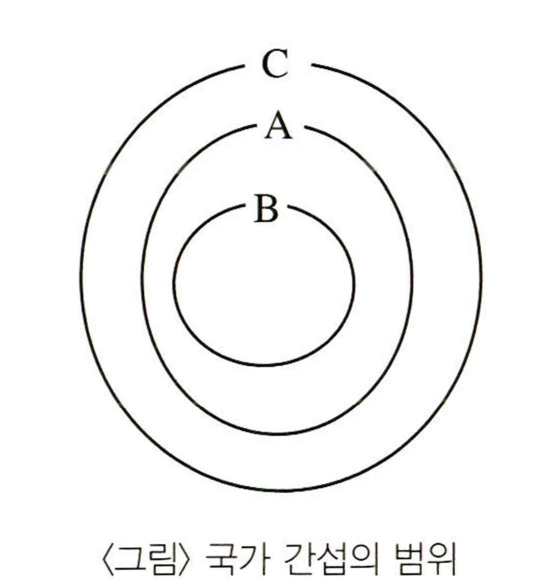
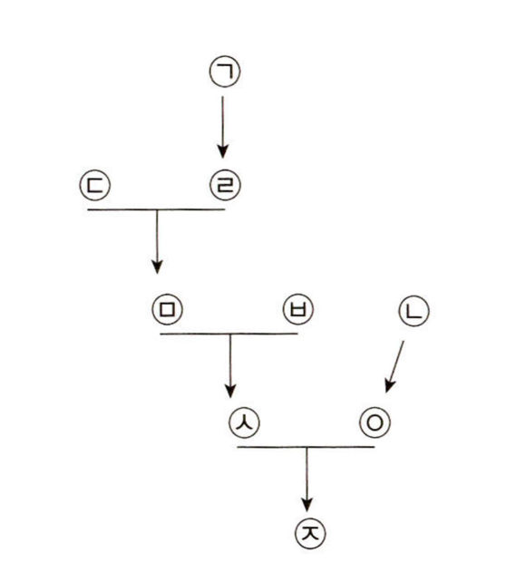
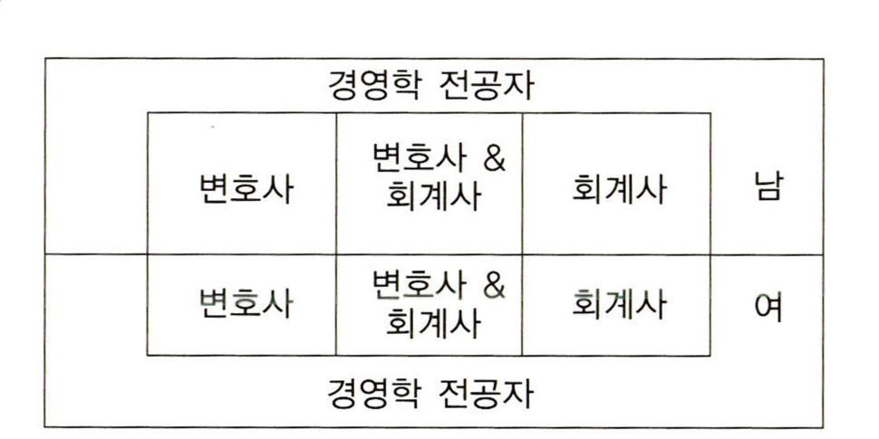
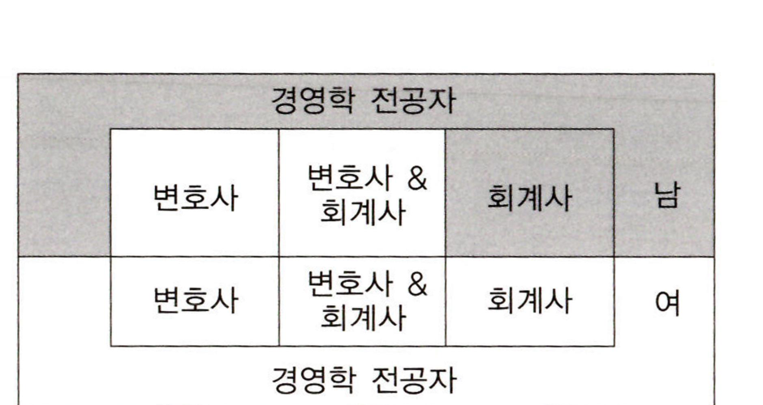
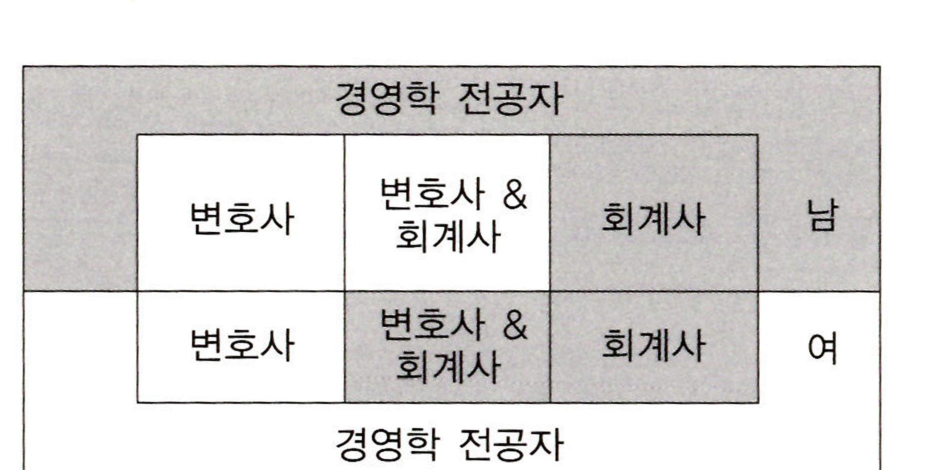
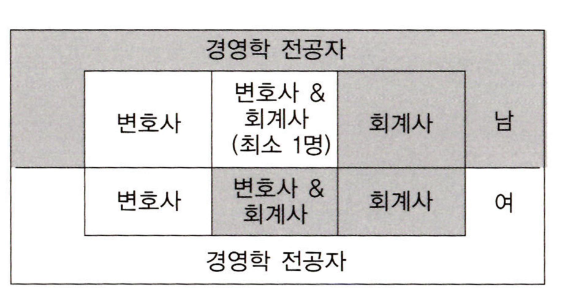
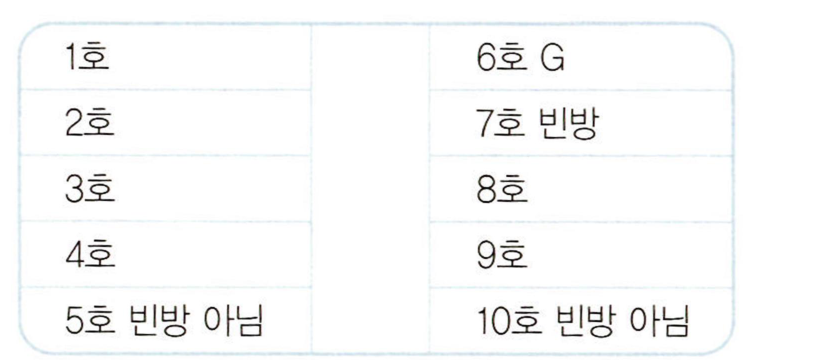
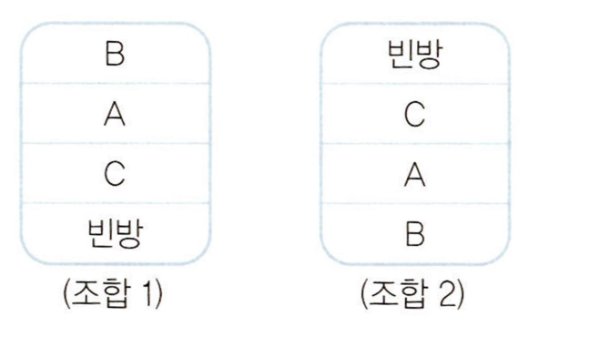
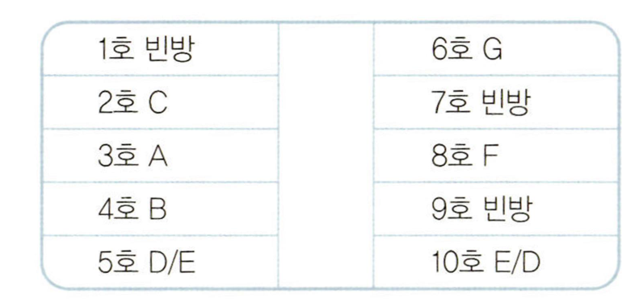

# 출제방향

## 1. 출제의 기본 방향

추리논증 시험은 대학에서 정상적인 학업과 독서 생활을 하여 사고력을 함양한 사람이면 누구나 해결할 수 있는 내용을 다루되, 주어진 제시문의 내용에 관한 선지식이 문제 풀이에 도움이 되지 않도록 하였다.

그리고 제시문에 주어진 내용을 단순히 문자적으로 이해하는 것만으로는 해결할 수 없고, 제시된 글이나 상황을 논리적으로 분석하고 비판해야 해결할 수 있도록 문항을 구성하여 사고력, 즉 추리력과 비판력을 측정하는 시험이 되도록 노력하였다.

추리능력을 측정하는 문항은 수리추리 문제보다는 일상언어 추리능력이 법학적성시험의 취지에 맞다는 판단에 따라 다양한 소재의 일상언어 추리 문항을 늘리고, 비판능력을 측정하는 문항도 주어진 정보를 평가하고 그 정보를 토대로 문제를 해결하는 능력을 측정하는 문항을 늘리기로 하였다.

전 학문 분야 및 일상적ㆍ실천적 영역에 걸쳐 다양하게 문항의 제재를 선택함으로써 대학에서 특정 전공자가 유리하거나 불리하지 않도록 영역 간에 균형 잡힌 제재 선정을 위해 노력하는 한편, 제시문으로 선택된 영역의 전문 지식이 문항 해결에 미치는 영향을 최소화하는 데에도 주력하였다. 시험의 성격상 규범 영역의 제시문을 다소 많이 포함하였으나, 제시문 및 질문을 최대한 순화하여 일상적 언어능력과 사고력만으로 제시문을 읽어 내고 문제를 해결할 수 있도록 하였다.

## 2. 출제 범위 및 문항 구성

추리논증 시험은 인문, 사회, 자연, 규범 영역의 다양한 학문적인 소재뿐만 아니라 사실이나 견해, 정책이나 실천적 의사 결정 등을 다루는 일상적 소재도 포함하고 있다. 이번 시험에서도 소재 구성은 큰 차이가 없었다. 규범 제재를 다루는 문항들(1~11번)과 인문 제재를 다루는 문항들(12~19번), 사회과학 제재를 다루는 문항들(23~29번), 자연과학과 융ㆍ복합적 제재를 다루는 문항들(30~35번), 그리고 일상적 논증과 논리ㆍ수리적 추리를 다루는 문항들(20~22번)로 구성하여 다양한 성격의 글을 골고루 포함하였다.

올해 추리논증 시험은 추리문항 40%, 비판문항 60% 정도로 출제하였다. 특히 법학적성시험이 법학전문대학원에서 수학능력과의 상관성을 높이기 위해서는 추리논증 시험에서 논증 분석 및 평가 능력을 측정하는 것이 중요하다는 지적에 따라, 이번 추리논증 시험에서는 추리문항에서는 수리추리 문항을 배제하고 일상언어 추리 문항의 수를 늘렸고, 비판문항은 문제해결능력을 묻는 문항의 비중을 높였다.

## 3. 난이도

문항의 글자 수를 줄여 독해의 부담을 최소화하였고, 제시문을 가능한 한 순화하여 비전공자들이 어렵지 않게 접근할 수 있도록 함으로써 난이도를 조정하였다.

특히 지금까지 자주 출제되었던 복잡한 수리추리 문항이나 논리게임의 문항을 2문항으로 난도를 낮춤으로써 많은 수험생이 해결할 수 있도록 하였다. 모형추리 문항도 사회경제학적 상황에서 추리하는 문항으로, 지나치게 형식적으로 추론하는 문항이 아니어서 수험생들이 풀이에 대해 자신감을 가지고 접근할 수 있도록 함으로써 체감 난도와 실제 난도를 낮추었다.

논증이나 논쟁적 자료를 분석하고 비판하도록 요구하는 문항들의 난도도 너무 높지 않도록 하였다.

## 4. 출제 시 유의점

ㆍ제시문을 분석하고 평가하는 데 시간을 사용할 수 있도록 제시문의 독해부담을 줄였다. 그렇게 함으로써 법학적성시험이 측정하고자 하는 추리능력과 비판능력을 측정할 수 있는 문항으로 구성하고자 하였다.

ㆍ복잡한 수리추리 문제를 출제하지 않고, 그럼에도 주어진 정보로부터 새로운 정보를 이끌어 내는 능력인 추리능력의 측정이 법학적성시험의 중요한 목적이라는 점을 감안하여 가능한 한 다양한 학문 영역을 제재로 한 언어추리 문제를 확대하였다.

ㆍ선지식에 의해 풀게 되거나 전공에 따른 유불리가 분명해지는 제시문의 선택과 문항의 출제를 지양하였다.

ㆍ출제의 의도를 감추거나 오해하게 하는 질문을 피하고, 평가하고자 하는 능력을 정확히 평가할 수 있도록 간명한 형식을 취하였다.

ㆍ문항 및 선택지 간의 간섭을 최소화하고, 선택지 선택에서 능력에 따른 변별이 이루어질 수 있도록 하였다.

---

# 문항별 해설

## 01

### 문항구분

* 문항 성격 : 법ㆍ규범 - 논쟁 및 반론

* 평가 목표 : 헌법상 위헌정당 해산제도가 기성(旣成) 정당 외에 창당준비과정에 있는 창당준비위원회에 적용될 수 있는지와 관련된 논쟁을 분석하고 평가할 수 있는 능력을 평가함

### 제시문 해설

* 정답 : (4)

창당준비위원회 해산과 관련된 논쟁을 보면, A는 창당준비위원회는 어디까지나 정당이 아니므로 정당의 특권을 가질 수 없고 언제든 법령에 의해 용이하게 해산이 가능하다는 입장이다. B는 창당준비위원회가 사실상 정당의 핵심을 구성하는 조직이므로 이에 대하여 헌법상 특권을 인정하고 해산도 까다로운 절차를 통해 이루어져야 한다고 주장한다. C는 일종의 절충설로 창당준비위원회가 이미 정당의 실질적 요건을 충족하였다면 이는 정당으로 보아 특권을 인정하고, 그렇지 않다면 일반 결사로 보자는 주장이다.

### 선택지별 해설

(1) 창당준비위원회는 「정당법」상 등록 기간 안에 등록신청을 하지 아니한 때는 특별한 절차 없이 자동 소멸된다는 주장이 옳다면, 이는 창당준비위원회가 정당과 다르고 창당준비위원회가 반드시 정당으로 이어지지 않는다는 점을 보여 주므로 A의 설득력을 높인다.

(2) 집권 여당과 정부가 그 목적이나 활동이 민주적 기본질서에 반하지 않는 반대당의 성립을 등록 이전에 손쉽게 봉쇄할 위험성이 있다는 주장은 A처럼 창당준비위원회를 일반 결사로 보아 이의 해산을 용이하게 할 때 나타날 수 있는 남용 가능성을 지적하고 있다. 만약 이러한 지적이 옳다면, A는 민주주의를 위해 정당존립의 특권을 보호하고자 하는 X국 헌법의 취지에 부합하지 않기 때문에 설득력이 낮아진다.

(3) 창당준비위원회가 앞으로 설립될 정당의 주요 당헌과 당규를 실질적으로 입안한다는 주장이 옳다면, 이는 창당준비위원회가 정당이나 다름없는 조직이기 때문에 보호를 해 주어야 한다는 B의 설득력을 높인다.

(4) C는 단순히 정당의 정당등록이 아닌 실질적 요건 충족에 따라 정당의 성립유무를 판단하고 특권을 인정하자는 것이다. 따라서 정당등록이 통과의례의 형식에 불과하다는 사실은 실질적 요건을 강조하는 C의 설득력을 높인다. 그러므로 (4)는 옳지 않은 진술이다.

(5) 정당설립의 실질적 요건을 강화하면 할수록 창당준비위원회가 정당으로 인정되기가 어려워질 것이며, C에 따라 창당준비위원회가 일반 결사로 인정되는 경우가 많아질 것이다. 따라서 정당설립의 실질적 요건을 강화할수록 C는 창당준비위원회를 일반 결사로 취급하자는 A와 결과적으로 비슷한 입장을 취할 것이다.

## 02

### 문항구분

* 문항 성격 : 법ㆍ규범 - 언어 추리

* 평가 목표 : 세계대전 이후 A국의 판결에서 쟁점이 된 내용이 무엇인지를 파악하는 능력을 평가함

### 제시문 해설

* 정답 : (2)

제시문의 1954년 판결은, 1951년 판결을 잘못된 것으로 본 것이 아니라, 1951년 판결로부터 발생된 법적 결과가 추후적으로 교정될 필요가 있다는 판결이다. 그러한 추후 교정조치가 바로 재고용이다. 즉 당시 시점에서 해고는 법적으로 정당했지만, 그러한 결과 무죄였던 자가 직장을 잃은 셈이 되었으니, 그 결과를 바르게 교정할 필요가 있다고 본 것이다. 그러므로 해고를 소급해서 무효라고 하지 않고 당시 해고는 유효하되 추후에 재고용할 기회를 제공하는 판결을 한 것이다. 한편 당시 해고가 정당한 사유를 ‘신뢰’라는 점에 있다고 하였다.

### 선택지별 해설

(1) 나치 체제에 협력했다는 혐의에 대한 무죄판결로 인해 해고를 소급해서 무효라고 하지 않고, 당시 해고는 유효하되, 추후에 재고용할 기회를 제공하는 판결을 한 것이다. 따라서 해고 결정이 소급적으로 소멸한다는 것은 옳지 않은 진술이다.

(2) ‘신뢰’를 근거로 당시의 해고 통고가 정당했으며, 무효로 할 수 없다는 판결로 미루어 볼 때, 해고의 정당성을 판단하는 시점은 A의 최종 판결 이후가 아닌 해고 통고 시임을 알 수 있다.

(3) A국 법원은 해고가 정당한 사유로 ‘신뢰’가 깨진 것을 들었다. 따라서 해고의 정당한 사유나 원인이 없는 경우라도 갑의 해고는 적법하다는 것은 옳지 않은 진술이다.

(4) 해고에 정당한 사유가 없으면 소급하여 무효가 되어야 한다. 그런데 당시 법원은 해고가 정당하다고 판단한 반면 신규고용청구권을 인정하였다. 해고의 정당한 이유는 당시 나치 체제에 동조한 혐의가 있어 신뢰관계를 잃었기 때문이라는 것이다. 그런데 무죄판결을 받음으로써 해고를 정당화한 신뢰관계의 상실이라는 이유가 더 이상 근거가 없게 되었다. 이것으로부터 고용에서 신뢰관계가 중요한 요건임을 추론할 수 있다. 이처럼 신규고용청구권을 통해 신규고용을 인정한 것은 신뢰관계를 고려하였기 때문이다. 설령 이러한 추론이 어렵다고 하더라도 신뢰관계를 고려하지 않았다고 단정할 수는 없다. 그런데 (4)는 “신뢰관계가 고려되지 않는다.”라고 하였기 때문에 옳지 않은 진술이다.

(5) 법원은 유죄가 아니어도 혐의가 있는 것만으로 신뢰관계가 깨져 해고가 정당화된다고 판단했다. 따라서 혐의가 있다는 사실만 가지고는 근로관계 지속을 위한 신뢰가 깨진다고 볼 수 없다는 것은 법원의 입장으로 옳지 않은 진술이다.

## 03

### 문항구분

* 문항 성격 : 법ㆍ규범 - 언어 추리

* 평가 목표 : 보조 생식 의료에 관한 글로부터 친자관계가 어떻게 이루어지는지를 파악하는 능력을 평가함

### 제시문 해설

* 정답 : (2)

제시문은 보조 생식 의료에 대한 각국 법의 상황 가운데 영국과 프랑스를 대비하여 설명한 것이다. 보조 생식 의료에 대하여 우리나라에서도 법률 제정을 서두르고 있는데, 각국은 자국의 상황 및 도덕관, 사회적 동의 등에 따라 서로 많이 다른 내용의 법을 가지고 있다. 그 가운데 가장 진보적인 나라가 영국인 데 반하여 가장 보수적인 나라가 프랑스이다. 영국은 「인간 수정 및 배아 발생에 관한 법률(Human Fertilisation and Embryology Act)」이라는 특별법으로 규율하고 있어, 여성도 동의라는 특별한 절차를 밟으면 부와 같은 부모가 될 수 있으므로, 모와 모의 부모도 가능하게 된다. 이에 반하여 프랑스는 민법전(Code civil des Francais)에서 정하고 있는데, 생식 가능 연령에 있는 가정이 아기를 갖지 못할 경우 치료의 목적으로 보조 생식 의료를 허용하고 있다.

### 선택지별 해설

(1) A국에서 여성도 다른 여성의 보조 생식 의료에 동의할 경우 여성이 남성을 대신하여 부가 될 수 있는 것이지, 부부로 되는 것은 아니다.

(2) A국에서는 보조 생식 의료를 통해서도 출산한 자만이 아이의 모로 된다. 따라서 대리모에게 난자를 제공한 의뢰인이 모가 되기 위해서는 입양이라는 절차를 밟아야 한다.

(3) B국에서는 생식 가능 연령의 부부만이 보조 생식 의료를 이용할 수 있다. 따라서 모든 자가 이용할 수 있다는 것은 옳은 추론이 아니다.

(4) B국에서는 출산한 자가 모로 확정되고 이 모와의 관계를 통해 부가 정해진다. 따라서 정자를 제공한 자가 부가 된다는 것은 옳은 추론이 아니다.

(5) A국에서는 대리모 계약을 금지하고 있지는 않다. 따라서 “제3자를 위해 출산을 하는 계약은 무효”라는 내용의 법규정을 가지고 있다는 것은 옳은 추론이 아니다.

## 04

### 문항구분

* 문항 성격 : 법ㆍ규범 - 논증 평가 및 문제 해결

* 평가 목표 : 범죄의 처벌에 있어서 그 기준에 대한 두 주장을 이해하여, <보기>의 범죄 및 의사에 대한 법원의 태도가 각 주장에 부합하는지 평가할 수 있는 능력을 평가함

### 제시문 해설

* 정답 : (4)

제시된 주장은 처벌의 기준을 무엇으로 할 것이냐에 대한 논쟁을 서술한 것이다. 갑의 주장은 형사상 범죄에 있어서는 필히 개인의 손해라는 결과 발생이 존재하게 되므로 이것만을 기준으로 처벌해도 된다는 주장이며, 을의 주장은 피해자가 받게 되는 손해뿐만 아니라 범인의 의사도 고려해야 한다는 주장이다.

### <보기> 해설

ㄱ. 갑의 주장은 처벌의 기준이 의사가 아닌 손해의 경중에 있다는 것이다. 따라서 범인의 의사의 존재 여부나 경중은 묻지 않고 오직 범행의 결과, 즉 피해자가 입은 손해의 경중을 기준으로 해야 한다. 갑의 주장에 의한다면 상해와 사망이라는 결과만을 가지고 판단해야 하는 바, 사망의 결과가 발생한 후자를 더욱 무겁게 처벌해야 한다. 따라서 전자와 후자를 동일하게 처벌한 법원의 태도는 갑의 주장에 부합하지 않으므로 ㄱ은 옳지 않은 판단이다.

ㄴ. 강도의 의사와 중상해의 결과, 그리고 살인의 의사와 중상해의 결과가 발생한 경우에 있어서 갑의 주장에 의한다면 손해의 경중만을 판단해야 하므로 전자와 후자를 동일하게 처벌해야 한다. 을의 주장에 의한다면 결과가 동일하다 하더라도 의사의 경중을 고려해야 하므로 후자를 더욱 무겁게 처벌해야 한다. 따라서 전자를 중하게 처벌한 법원의 태도는 갑과 을의 주장 모두에 부합하지 아니하므로 ㄴ은 옳은 판단이다.

ㄷ. 살인의 의사는 있으나 손해가 없는 경우, 그리고 부주의와 사람이 다친 결과가 발생한 경우에 있어서 갑의 주장에 의한다면 아무런 손해가 없는 전자의 경우는 처벌이 가능하지 않고 손해가 발생한 후자의 경우에만 처벌이 가능하다. 을의 주장에 의하면 처벌은 손해뿐만 아니라 의사의 경중 또한 고려하여 차등을 두어야 한다. 따라서 손해가 발생하지 않은 전자의 경우에는 처벌하지 않고 후자의 경우에만 처벌한 것은 을의 주장에도 부합한다. 결국 후자만을 처벌한 법원의 태도는 갑과 을의 주장 모두에 부합하므로 ㄷ은 옳은 판단이다.

<보기>의 ㄴ, ㄷ만이 갑과 을의 주장에 대한 옳은 판단이므로 정답은 (4)이다.

## 05

### 문항구분

* 문항 성격 : 법ㆍ규범 - 논증 평가 및 문제 해결

* 평가 목표 : K국 형법상 ‘미성년자약취죄’의 범죄 구성 요건과 그에 대한 해석을 주어진 상황에 대해 적용하여 옳게 판단할 수 있는 능력을 측정함

### 제시문 해설

* 정답 : (3)

K국 형법은 미성년자약취죄를 처벌함에 있어서 폭행ㆍ협박의 행사 또는 정당한 권한 없이 사실상의 힘을 사용하여 미성년자를 약취행위자나 제3자의 지배하에 옮기는 행위가 존재할 것을 요구한다. 그러나 ‘정당한 권한 없이 사실상의 힘을 사용하여’의 해석에 관해서는 견해가 갈리는 바, <견해 1>은 부모 중 한 사람이 다른 한 사람의 동의 없이 미성년자의 거소를 옮기는 행위가 미성년자의 평온ㆍ안전을 해치게 되는 경우에는 정당한 권한 없이 사실상의 힘을 사용한 것에 해당하게 되고, <견해 2>는 부모 한 사람이 다른 한 사람의 동의 없이 미성년자의 거소를 옮기는 행위 자체가 정당한 권한 없이 사실상의 힘을 사용한 것에 해당하게 된다.

### <보기> 해설

ㄱ. 부모 중 다른 일방이 폭행ㆍ협박을 행사하여 자녀를 탈취한 후 자기 또는 제3자의 지배하에 옮기는 경우에는, 미성년자의 거소를 옮김에 있어서 부모 한 사람의 동의가 있었느냐와 관계없이 K국 형법에 따라 미성년자약취죄가 성립된다. 왜냐하면 K국 형법은 폭행ㆍ협박의 행사와 정당한 권한 없이 사실상의 힘을 사용한 것 중 하나의 요건만 갖추면 미성년자약취죄를 인정하기 때문이다. 따라서 <견해 1>에 의하더라도, 또한 <견해 2>에 의하더라도 미성년자약취죄에 해당하므로 ㄱ은 옳은 평가이다.

ㄴ. 부가 모나 자녀에 대해 폭행ㆍ협박의 행사 없이 자녀의 거소를 옮겨 보호ㆍ양육을 적절히 하였다면, <견해 1>에 따를 경우 설령 모의 동의가 없었다고 하더라도 정당한 권한 없이 사실상의 힘을 사용한 것으로 볼 수 없다. 보호ㆍ양육이 적절히 이루어져서 자녀의 평온ㆍ안전을 해치지 않았기 때문이다. 따라서 자녀의 거소가 이전된 후 자녀에 대한 보호ㆍ양육이 적절히 이루어진 이 경우에는 <견해 1>에 의하면 미성년자약취죄에 해당하지 않는다. 따라서 ㄴ은 옳은 평가이다.

ㄷ. <견해 1>에 따르면 부모 일방이 다른 일방의 동의 없이 미성년자의 거소를 옮기는 행위가 미성년자의 평온ㆍ안전을 해치지 않는 경우에만 정당한 권한 없이 사실상의 힘을 사용한 것에 해당하지 않는다. 따라서 부의 동의 없이 미성년자를 외국에 데려가서 그로 인해 미성년자가 정신적ㆍ심리적 충격을 겪게 된 경우, <견해 1>에 따르면 정당한 권한 없이 사실상의 힘을 사용한 것에 해당하여 미성년자약취죄가 성립한다. <견해 2>에 따른다면 부의 동의 없이 미성년자의 거소를 옮긴 행위이므로 정당한 권한 없이 사실상의 힘을 사용한 것에 해당하여 미성년자약취죄가 성립한다. ㄷ은 <견해 1>에 따르면 미성년자약취죄에 해당하지 않는다고 말하고 있으므로 틀린 평가이다.

<보기>의 ㄱ, ㄴ만이 옳은 평가이므로 정답은 (3)이다.

## 06

### 문항구분

* 문항 성격 : 법ㆍ규범 - 논증 평가 및 문제 해결

* 평가 목표 : R국의 상속법 <원칙>을 이해하고 이 원칙에 의거하여 <판단>의 내용을 평가하는 능력을 측정함

### 제시문 해설

* 정답 : (4)

이 문제는 『로마법대전』에 있는 사건을 소재로 작성되었다. R국의 상속법 <원칙>에 따르면, 상속은 가장의 유언에 따라야 한다. 다만 가장이 배우자와 직계비속 중 상속인에서 제외하고자 하는 이가 있을 때에는 반드시 이를 유언으로 지정해야 한다. 만약 상속인으로 지정되지도 제외되지도 않은 직계비속이 있을 경우에는 유언은 무효가 된다. 나아가 상속인의 지위를 상실하게 할 수 있는 조건을 부가하여 상속인을 지정한 가장의 유언은 무효이다.

그런데 <판단>에서 가장 A는 상속인이 2명임을 전제로 하여 유언을 한 것이다. 그런데 실제로는 이란성 쌍둥이가 태어났기 때문에 아들, 딸, 배우자가 상속인 후보가 되었다. 만약 가장이 직계비속 2명과 배우자 1명 중 2명을 상속인으로 지정하여 유효한 유언을 하기 위해서는 상속인에서 배제된 자를 상속제외인으로 지정해야 한다. 그런데 사례의 경우 가장 A의 유언 속에는 상속제외인이 지정되어 있지 않기 때문에 유언은 무효가 된다.

상속법 <원칙>에 따르면 유언이 정하고 있는 내용대로 상속이 이루어지지 못하게 될 경우 법정상속이 이루어지게 된다. 법정상속 순위는 직계비속이 균분으로, 직계비속이 없을 경우 직계존속이 균분으로, 직계존속이 없으면 배우자가 상속을 받는다. 이를 사례에 적용하면 직계비속인 아들과 딸이 균분으로 1/2씩 상속을 받게 되고, 배우자는 상속을 받지 못하게 된다.

### <보기> 해설

ㄱ. 법률가 X의 판단에 대해, A의 유언이 무효라는 것을 확인한 후 법정상속에 따라 결론을 내렸어야 한다고 평가하고 있기 때문에 옳은 평가이다.

ㄴ. 상속법 <원칙>에 따르면 상속인의 지위를 상실하게 할 수 있는 조건을 부가한 유언은 무효이지만, 본 사례의 “만약 ……이 태어나면”이라는 문구는 이미 상속인의 지위를 취득한 태아에게 그의 상속분을 정하는 내용의 유언에 불과하다. 따라서 위 문구를 상속인의 지위를 상실하게 하는 조건에 대한 것이라고 해석하면서, 법률가 X의 판단에 대해 A의 유언이 처음부터 무효라고 판단했어야 했다고 평가하는 것은 틀린 평가이다.

ㄷ. 법률가 X의 판단에 대해 “A가 아들 또는 딸이 출생하는 경우에 대하여 유언을 한 것이지 아들과 딸이 동시에 출생하는 경우에 대하여 한 것은 아니었다”고 판단하면서 “상속인으로 지정되지도 제외되지도 않은 직계비속이 있을 경우 가장의 유언은 무효가 된다”는 상속법 <원칙>이 적용되는지 판단했어야 했다는 것이 옳은 평가이다. 따라서 ㄷ은 옳은 평가이다.

<보기>의 ㄱ, ㄷ만이 옳은 평가이므로 정답은 (4)이다.

## 07

### 문항구분

* 문항 성격 : 법ㆍ규범 - 논쟁 및 반론

* 평가 목표 : X국의 저작권법 개정 논쟁을 통하여 작가의 독점적 출판권이 인정되는 근거 등을 분석하고 평가할 수 있는 능력을 측정함

### 제시문 해설

* 정답 : (1)

제시문은 1876년 영국 의회에 설치된 ‘왕립저작권위원회’에서 치열하게 전개되었던 ‘로열티시스템 도입’ 논쟁을 소재로 작성되었다. A는 로열티시스템 도입을 찬성하는 주장이다. A는 재화가 희소할 경우 독점적 권리를 인정할 수 있지만, 그렇지 않을 경우에는 독점적 권리를 제한하거나 인정하지 말아야 한다고 전제하고 있다. 문학작품의 경우, 창작에 대한 적절한 인센티브를 제공하지 않는다면 문학작품의 공급이 감소함으로써 결국 출판시장에 공급되는 문학작품의 양이 희소해지기 때문에 독점적 권리를 인정하여 공급이 적절하게 이루어질 수 있도록 해야 한다. 그러나 그것은 창작비용이 충분히 회수될 수 있는 정도에 그쳐야 하는데, 왜냐하면 일단 창작된 작품은 인쇄비용 문제를 제외하면 무한정 출판할 수 있는데, 이럴 경우 독점적 권리로서의 출판권을 인정해야 하는 근거가 사라지기 때문이다.

B는 로열티시스템 도입 반대론자의 주장이다. B는 계약을 누구와 어떻게 체결할 것인지는 당사자가 결정해야 한다고 전제하고 있다. 문학작품의 경우, 작가는 자신이 원하는 방식과 기간으로 출판조건을 결정하고 이 조건에 부합하는 출판사와 자유롭게 계약을 체결할 자연적 권리를 가진다. 따라서 비록 그 자신이 어떠한 가격으로 책을 출판하든지 간에 자신의 작품을 그 가격에 따라 구매하고자 하는 사람에게 판매할 수 있는 독점적 출판권을 가져야 한다고 주장하고 있다. B는 국가가 로열티시스템을 통하여 작가의 독점적 출판권을 제한할 권한이 없다고 주장한다.

### <보기> 해설

ㄱ. A는 작가에게 창작의 유인책으로서 1년간의 독점적 출판권을 부여하여 작가가 창작비용을 회수할 수 있도록 해야 한다고 주장하고 있다. 그러나 예를 들어, 저급작품을 창작할 때보다 고급작품을 창작할 때 창작비용이 훨씬 크기 때문에, 고급작품의 작가가 국가에 의해 일률적으로 정해진 1년간의 독점적 출판기간 내에 창작비용을 회수할 수 없다면 A의 설득력은 낮아지게 된다. 따라서 작가마다 작품을 창작하는 데 들인 비용이 천차만별이어서 국가가 작가의 창작 비용 회수기간을 일률적으로 정할 수 없다는 주장이 옳다면, 이는 A의 설득력을 낮춘다. 따라서 ㄱ은 옳은 평가이다.

ㄴ. A는 창작의 유인책이 제공되지 않으면 문학작품의 공급이 제한될 수 있기 때문에 작가에게 독점적 권리를 인정해야 한다고 보고 있다. 다만, A는 창작비용을 회수할 수 있는 정도에서 독점적 권리를 1년으로 제한해야 한다고 주장하고 있을 뿐이다. 나아가 만약 재화의 공급이 제한된다면, 그 재화는 아무리 소비해도 줄지 않는 재화가 아니라 A가 언급하고 있는 희소한 재화가 된다. 따라서 특정한 원인에 의해 재화의 공급이 제한될 경우, 그 재화에 대한 독점적 권리를 인정할 수 있다는 주장이 옳다면, 이는 A의 견해와 부합하는 것으로 A의 설득력을 낮추지 않는다. 따라서 ㄴ은 옳지 않은 평가이다.

ㄷ. B에 따르면, 작가는 자신이 원하는 방식과 기간으로 출판조건을 결정하고 이 조건에 부합하는 출판사와 자유롭게 체결할 수 있는 자연적 권리를 가진다. 따라서 계약을 누구와 어떻게 체결할 것인지는 당사자가 결정해야 한다는 주장이 옳다면, 이는 B의 설득력을 높인다. 따라서 ㄷ은 옳지 않은 평가이다.

<보기>의 ㄱ만이 옳은 평가이므로 정답은 (1)이다.

## 08

### 문항구분

* 문항 성격 : 법ㆍ규범 - 논증 평가 및 문제 해결

* 평가 목표 : 강제 이행의 세 가지 방법을 글을 통해 분석하여 사실 관계에서 제시하는 문제를 적절히 해결할 수 있는 능력을 측정함

### 제시문 해설

* 정답 : (4)

제시문은 강제 이행의 세 가지 제도를 구분하여 설명한 것이다. 제시문을 통해 직접강제와 대체집행, 간접강제를 이해해야 한다. ‘A방법’은 대체집행을 의미하는데, 채무자가 어떤 행위를 하여야 하는데 하지 않는 경우, 급부 내용을 제3자로 하여금 실현시키고 그 비용을 채무자에게 부담시킴으로써 마치 채무자 자신이 자발적으로 실현한 것과 같은 상태를 만드는 방법이다. ‘B방법’은 직접강제로서, 국가권력으로 직접급부를 실현하는 방법인데, 물건의 인도를 목적으로 하는 채무, 즉 주는 채무에서만 인정된다. ‘C방법’은 간접강제로서, 채무자만이 채무를 이행할 수 있는데 하지 않을 경우에 허용되는 방법으로, 다른 강제 수단이 없는 경우에 인정되는 최후의 수단이다.

통신서비스는 금전ㆍ물건 등을 주어야 하는 채무가 아니라 어떤 행위를 해야 하는 채무이다. 시장 개방 전에는 X회사가 아니면 서비스를 할 수 없으므로 간접강제, 즉 ‘C방법’에 의할 수밖에 없다. 그러나 시장 개방 후에는 다른 통신 회사를 통해서 서비스를 할 수 있기 때문에 A방법으로 할 수 있다. A방법이 가능하면, C방법은 다른 강제 수단이 없을 경우에 인정되는 최후의 수단이므로 C방법으로는 할 수 없다. 따라서 시장 개방 전에는 C방법, 시장 개방 후에는 A방법이므로 정답은 (4)이다.

## 09

### 문항구분

* 문항 성격 : 법ㆍ규범 - 언어 추리

* 평가 목표 : A국에 주어진 재정적 조건들과 이에 따른 재정 개념들을 이해하여 각 교부금이 지급되었을 때 발생하는 결과를 적절히 추론할 수 있는지 평가함

### 제시문 해설

* 정답 : (4)

A국의 각 지방자치단체의 수입은 스스로 조달한 자체수입금과 국가가 지급한 교부금으로 구성된다. 국가는 각 지방자치단체가 제출한 자체수입예상액과 지출예상액을 고려하여 국가가 판단한 총지출규모를 수립한 후 필요한 교부금을 지급한다. A국은 ‘동액교부금’, ‘동률교부금’, ‘보통교부금’ 중 하나를 선택하여 모든 지방자치단체에 지급한다.

### <보기> 해설

ㄱ. 보통교부금은 각 지방자치단체의 자체수입금이 국가가 수립한 총지출규모를 충당하지 못할 경우 그 부족분만큼 지급되는 교부금이다. 따라서 부족분이 발생하면 그 액수와 관계없이 총지출규모에 이를 때까지 지급하게 되므로 지방자치단체는 자체수입금을 증가시킬 필요를 느끼지 못할 것이다. 결국 각 지방자치단체는 자체수입금 증대를 위한 노력을 하지 않을 것이므로 ㄱ은 옳지 않은 추론이다.

ㄴ. 보통교부금은 재정부족분만큼 지급되므로 재정부족분이 많이 발생하는 갑은 재정부족분이 상대적으로 적게 발생하는 을에 비해 보통교부금을 많이 지급받는다. 그리고 각 지방자치단체의 총지출규모가 동일한 상황에서 갑이 을보다 재정부족분이 많이 발생한다면 갑의 자체수입금은 을의 자체수입금보다 적은 것이다. 동률교부금은 자체수입금에 비례하여 지급되므로, 이 경우 을은 갑에 비해 동률교부금을 언제나 많이 받는다. 따라서 ㄴ은 옳은 추론이다.

ㄷ. 국가가 수립한 각 지방자치단체의 총지출규모가 같고, 각 지방자치단체의 자체수입금액도 같은 경우, 동액교부금을 지급한다면 각각의 지방자치단체가 받는 교부금 액수는 동일하다. 자체수입금에 비례하는 금액이 지급되는 동률교부금을 지급한다면, 각 지방자치단체의 자체수입금액이 같으므로 지급받는 교부금의 액수도 같게 된다. 마지막으로 보통교부금의 경우, 재정부족분만큼 지급하게 되므로 총지출규모가 같고 자체수입금액이 같다면 각 지방자치단체의 재정부족분도 같게 되고, 이 상황에서 보통교부금의 액수도 같게 된다. 따라서 ㄷ은 옳은 추론이다.

<보기>의 ㄴ, ㄷ만이 옳은 추론이므로 정답은 (4)이다.

## 10

### 문항구분

* 문항 성격 : 법ㆍ규범 - 논쟁 및 반론

* 평가 목표 : 사회적으로 논란이 되는 사안을 두고 벌어지는 논쟁에서 논점을 파악하여 논쟁 참여자들이 동의할 것과 동의하지 않을 것을 구분하는 능력을 평가함

### 제시문 해설

* 정답 : (4)

시위를 허용해야 하는지를 놓고 갑은 그들이 주장하는 내용과 상관없이 그들의 행위가 다른 사람에게 직접적이고 물리적인 위해가 되지 않는 한 허용해야 한다는 입장이고, 을은 시위대가 지지하는 가치가 대다수의 사람들에게 비도덕적으로 받아들여진다면 허용해서는 안 된다는 입장이며, 병은 시위가 많은 사람들에게 불쾌하게 여겨진다면 허용해서는 안 된다는 입장이다.

### <보기> 해설

ㄱ. 갑은 시위대가 시민들로부터 물리적으로 위해를 받는다면, “시위자를 공격하는 사람의 행위를 막아야지, 시위 자체를 막아서는 안 된다”는 견해를 밝히고 있다. 따라서 시위대가 시민들에게 물리적 위해를 받을 가능성이 시위 허용 여부를 결정하는 데 중요한 요소가 아니다. 을 역시 문제의 핵심은 물리적 충돌 여부에 있지 않다고 밝히고 나서, 중요한 것은 그들의 시위가 대다수 사람들에게 비도덕적으로 받아들여지는가에 있다고 주장한다. 따라서 을도 시위대가 시민들에게 물리적 위해를 받을 가능성이 시위 허용 여부를 결정하는 데 중요한 요소가 아니라는 데 동의한다. 따라서 ㄱ은 갑과 을이 의견을 달리한다고 말하므로 옳지 않은 진술이다.

ㄴ. 을은 시위대의 주장이 대다수 시민의 윤리적 판단에 부합하는지가 시위 허용 여부를 결정하는 데 중요한 요소라고 밝히고 있지만, 병은 ‘그들의 주장이 옳다 해도’ 이 시위를 막아야 하는 이유가 다른 사람에게 충분히 불쾌하게 받아들여지기 때문이라고 주장한다. 따라서 시위대의 주장이 대다수 시민의 윤리적 판단에 부합하는지가 시위 허용 여부를 결정하는 데 중요한 요소인지에 대해 을과 병은 의견을 달리한다. 따라서 ㄴ은 옳은 진술이다.

ㄷ. 제시문 마지막에서 병은 “(시위가) 다른 사람들의 눈에 잘 띄지 않는다면” 허용할 수도 있음을 시사한다. 반면에 갑은 제시문 처음에서 다른 사람에게 직접적인 물리적 위해를 줄 것이 분명히 예상되는 경우를 제외한다면, 어떤 행위도 할 수 있는 권리가 보장되어야 한다고 주장하고 있다. 따라서 갑에 따르면 나체 시위를 불쾌하게 여길 사람이 시위를 회피할 가능성은 시위 허용 여부를 결정하는 데 중요한 요소가 아니라는 점을 추론할 수 있다. 따라서 갑과 병은 의견을 달리하므로 ㄷ은 옳은 진술이다.

<보기>의 ㄴ, ㄷ만이 옳은 진술이므로 정답은 (4)이다.

## 11

### 문항구분

* 문항 성격 : 인문 - 논증 평가 및 문제 해결

* 평가 목표 : 도덕적 판단에서 유용성의 원리가 구체적 행위와 규칙 가운데 어느 것에 대해 적용되어야 하며, 또 얼마만큼 적용되어야 하는지에 대해 제시된 서로 다른 견해를 파악하고 그 함축된 의미를 분석하는 능력을 평가함

### 제시문 해설

* 정답 : (5)

유용성의 원리란 한 행위의 옳고 그름을 그 행위가 낳는 사람들의 행복을 통해 판단할 것을 요구하는 원리를 말한다. 그런데 이 유용성의 원리가 적용되는 대상을 A는 개별 행위, B는 행위 규칙으로 본다는 점에서 둘은 다르다. 다른 한편으로 이 유용성의 원리가 도덕적 판단의 유일한 기준이냐, 아니면 여러 기준 중의 하나이냐에 따라 A, B와 C의 견해가 다르다. A와 B는 도덕적 판단의 기준으로 유용성의 원리 하나만을 제시하는 데 반해, C는 그 원리가 각 개인이 그의 가족, 도시, 부족, 민족으로부터 물려받은 부채와 유산, 기대와 책무하에서 적용되어야 한다고 주장하고 있다.

### <보기> 해설

ㄱ. 한 명의 전우를 구하기 위해 두 명의 전우가 죽음을 무릅쓰는 행위가 도덕적으로 옳은지는, A에서는 그 행위가 가져올 행복에 의해 결정되어야 하고, B에서는 이 상황에 적용될 규칙에 비추어 결정되어야 한다. A의 경우, 비록 두 명의 목숨이 희생된다고 하더라도 목숨을 구한 전우가 공동체에 매우 중요한 인물이라면 그를 구하는 것이 관련된 사람들에게 더 큰 행복을 가져올 가능성이 있다. 또 설령 실제로 목숨을 구하지 못한다 하더라도 그 한 명을 구하려고 시도하는 것이 공동체 전체의 사기를 진작시킴으로써 더 큰 행복을 가져올 가능성이 있다. 따라서 A에 따르면 이 행위가 도덕적일 수 있다. 그리고 B의 경우, ‘사상자의 수가 최소가 되도록 행동하라’는 규칙보다는 ‘위험에 처한 아군을 구하는 데 최선을 다하라’는 규칙이 장기적인 관점에서 더 많은 유용성을 산출할 수 있다면, 이 경우 이 행위가 도덕적일 수 있다. 따라서 ㄱ은 옳은 분석이다.

ㄴ. A는 개별 행위의 옳고 그름을 각 상황에서 그 행위가 가져올 결과를 가지고 평가한다. 따라서 어떤 상황에서는 거짓말이 좋은 결과를 가져올 수도 있기 때문에, A에 따르면 거짓말이 상황에 따라 옳을 수 있다. 또 C에서도 많은 경우 거짓말이 그른 행위라고 하더라도, 가족이나 공동체가 부과한 책무를 수행하기 위해 거짓말을 하는 것이 오히려 옳은 경우를 충분히 생각할 수 있다. 따라서 ㄴ은 옳은 분석이다.

ㄷ. A는 개별 행위에 대한 도덕적 판단의 기준으로 유용성의 원리를 적용할 것을 주장하며, B는 행위 규칙의 옳고 그름을 판단하는 기준으로 유용성의 원리를 적용해야 한다고 하며, C는 비록 공동체의 부채와 유산, 기대와 책무를 염두에 두어야 한다는 단서를 달고 있지만, 그 아래에서 유용성 원리의 적용을 말하고 있으므로 A, B, C 모두 유용성의 원리를 도덕적 판단의 기준으로 고려하고 있다. 따라서 ㄷ은 옳은 분석이다.

<보기>의 ㄱ, ㄴ, ㄷ 모두 옳은 분석이므로 정답은 (5)이다.

## 12

### 문항구분

* 문항 성격 : 인문 - 논쟁 및 반론

* 평가 목표 : 다소 생소한 주장 및 견해를 이해하고, 주어진 사례들의 논지를 파악하여 적절한 반론을 찾는 능력을 평가함

### 제시문 해설

* 정답 : (3)

제시문은 죽음의 시점을 인간의 몸이 가진 두 기능, 즉 신체 기능과 인지 기능과 관련하여 다루고 있다. 저자는 죽음의 시점을 결정하는 데 더 중요한 요소는 ‘인지 기능의 정지 여부’라는 견해를 먼저 검토한다. 그런데 이 견해는 인지 기능이 없는 채로 깊은 잠을 자는 사람을 두고 ‘죽었다’고 판정해야 하는 반례에 부딪힌다. 이에 대해서 저자는 죽음이란 ‘인지 기능이 영구히 정지하는 것’이라는 수정된 견해를 고려한다. 이 수정된 견해에 따르면 깊은 잠에 빠진 사람을 두고 죽은 사람이라고 말할 수는 없다. 왜냐하면 그는 인지 기능이 영구히 정지한 것이 아니라 잠정적으로 정지했을 뿐이기 때문이다. 이제 이 수정된 견해에 대해서도 반론이 생길 수 있다. 이 문항은 이에 대해 제기할 수 있는 반론으로 적절한 것만을 선택해야 한다.

### <보기> 해설

ㄱ. 수정된 견해에 따르면 철수의 인지 기능은 새벽 2시부터 영구히 정지했으므로 그때부터 죽었다고 해야 한다. 하지만 철수의 심장이 마비되어 신체 기능까지 멈춘 것은 3시이므로 우리의 직관에 따르면 2시에 철수는 아직 살아 있었다고 해야 한다. ㄱ은 바로 이 점을 지적함으로써 수정된 견해가 상식적 판단과 어긋남을 지적하고 있으므로 적절한 반론이다.

ㄴ. 여기에 제시된 논증은 ‘부활’이라는 상상 가능하고 무모순적인 개념이 수정된 견해에서는 모순적인 개념이 됨을 지적한다. 이를 적절히 지적하고 있다면 이 논증을 수정된 견해에 대한 반론이라고 충분히 볼 수 있다. 부활이 상상 가능하다면 죽었던 철수가 부활했다고 상상할 수 있고, 또한 부활했으므로 그의 인지 기능이 다시 작동한다고 가정할 수 있다. 그런데 그렇다면 수정된 견해는 부활 이전의 철수가 죽지 않았다고 해야 한다. 그 당시 그의 인지 기능은 영구히 정지된 것이 아니기 때문이다. 그렇다면 애초에 철수는 부활했다고 할 수도 없다. 왜냐하면 철수가 부활하려면 죽었어야 하기 때문이다. 이로써 수정된 견해는 ‘부활’ 개념을 모순적으로 만든다. 따라서 이 논증은 수정된 견해에 대한 적절한 반론이다.

ㄷ. 철수는 주문에 걸려 인지 기능이 정지한 채로 있다가 영희에 의해 다시 인지 기능을 회복했다. 따라서 수정된 견해에 따르면 철수는 죽어 있다고 할 수 없다. 그런데 ㄷ은 “수정된 견해에 따르면, 철수는 주문에 걸려 있던 동안 죽은 것이다.”라고 주장하고 있다. 이는 수정된 견해를 잘못 이해한 것이다. 이 논증은 수정되기 이전의 견해에 대한 반론일 수는 있어도 수정된 견해에 대한 반론일 수는 없으므로 ㄷ은 적절하지 않은 반론이다.

<보기>의 ㄱ, ㄴ만이 적절한 반론이므로 정답은 (3)이다.

## 13

### 문항구분

* 문항 성격 : 인문 - 언어 추리

* 평가 목표 : 고전 문헌의 내용을 파악하고 그로부터 추론할 수 있는 내용과 추론할 수 없는 내용을 구별할 수 있는 능력을 평가함

### 제시문 해설

* 정답 : (3)

제시문에서는 ‘좋은 것’, ‘나쁜 것’, ‘좋지도 나쁘지도 않은 것’을 구분하여 각각에 대해 설명하고 있다. 제시문에 따르면, 덕 예컨대 분별력과 정의는 좋은 것이고, 이것의 반대, 즉 우매함과 부정의는 나쁜 것이다. 유익하지도 해롭지도 않은 것은 좋지도 나쁘지도 않은 것이다. 건강, 즐거움, 재물, 명예 그리고 이것들의 반대인 질병, 고통, 가난, 불명예가 좋지도 나쁘지도 않은 것이다. 이것들은 차이가 없는 것이다. 이 제시문의 내용을 파악하여 이로부터 추론할 수 있는 진술과 추론할 수 없는 진술을 구별할 수 있어야 한다.

### 선택지별 해설

(1) 제시문에서 질병은 “선호되거나 선호되지 않을 수는 있어도, 좋은 것도 아니고 나쁜 것도 아니다.”라고 명시하고 있다. 따라서 질병은 좋은 것이 아니라고 추론하는 것은 옳다.

(2) 재물은 ‘차이가 없는 것’에 속하는데, 제시문에서는 이런 것이 행복에 기여할 수는 없지만, 이런 것을 얻는 데 행복하거나 불행할 수는 있다고 밝히고 있다.

(3) 제시문 첫 문장에서 ‘좋은 것’, ‘나쁜 것’, ‘좋지도 나쁘지도 않은 것’은 구별되고 있으며, 각 범주에 속하는 것들이 있다. 따라서 나쁜 것이 아니라고 해서 모두 좋은 것이라고 할 수 없다. ‘좋지도 나쁘지도 않은 것’에 속할 수도 있기 때문이다.

(4) 건강과 재물 모두 ‘좋은 것도 아니고 나쁜 것도 아니다’라고 제시문은 밝히고 있다.

(5) 분별력이 나쁘게 사용될 수 있다면 이는 좋은 것이 아니다. 그런데 분별력은 덕에 속하고 덕은 좋은 것이다. 그러므로 분별력은 나쁘게 사용될 수 없다.

## 14

### 문항구분

* 문항 성격 : 인문 - 논증 분석

* 평가 목표 : 논증의 내용 및 구조를 정확하게 파악할 수 있는 능력을 측정함

### 제시문 해설

* 정답 : (1)

인간 행위 역시 결정론적 인과 법칙에 의해 지배된다면 어떻게 자유로운 행위가 가능한지의 문제가 논의되고 있다. 이 문제에 대한 한 가지 입장을 소개하고 있으며, 글쓴이는 이러한 입장을 비판하고 있다. 이 입장에 의하면, 우리가 ‘자유롭게 행위’한다고 하는 것보다 더 분명한 사실은 없으며 우리는 이를 이미 알고 있다고 주장한다. 이에 대해 글쓴이는 우리가 자유롭다고 느낀다는 것 자체가 우리가 실제로 자유롭다는 것을 보여 주지는 못한다고 주장한다.

### <보기> 해설

ㄱ. 제시문의 첫 번째 문장에서 우리 행위가 우리 자신의 자유로운 선택의 결과일 때에만 우리는 그에 대해 도덕적 책임을 진다고 말하고 있다. 즉, 자유로운 선택의 결과가 아닌 것에 대해서는 도덕적 책임을 질 필요가 없다. 이는 행위가 자유롭게 행해졌다는 것이 그에 대한 도덕적 책임을 묻기 위한 필요조건임을 말하지만, 충분조건임을 의미하지는 않는다. 따라서 글쓴이는 자유로운 선택에 의한 것이지만 도덕적 책임을 지지 않는 행위는 있을 수 없다는 어떤 주장도 하고 있지 않다. 따라서 ㄱ은 옳지 않은 진술이다.

ㄴ. 글쓴이에 의하면, 우리의 의지가 자유롭다는 것을 우리가 정말로 안다면 우리의지가 자유롭다는 것은 참일 수밖에 없다. 왜냐하면 “사실이 아닌 어떤 것을 알 수는 없기 때문이다.” 여기서 글쓴이가 가정하고 있는 것은 우리가 무언가를 안다는 것은 그것이 참임을 함축한다는 것이다. 따라서 ㄴ은 옳은 진술이다.

ㄷ. 이 글의 논지는 우리가 자유롭다고 느낀다는 사실이 우리가 실제로 자유롭다는 것을 보여 주지는 못한다는 것이다. 따라서 많은 인간 행위들에 대한 인과 법칙적 설명이 존재한다고 해도 이 글의 논지는 약화되지 않는다. 따라서 ㄷ은 옳지 않은 진술이다.

<보기>의 ㄴ만이 옳은 진술이므로 정답은 (1)이다.

## 15

### 문항구분

* 문항 성격 : 인문 - 논증 분석

* 평가 목표 : 귀납에 관한 귀납적 정당화는 논점 선취의 오류를 범한다는 것을 보이는 논증을 제시문으로 사용하여 논증 분석 능력을 평가함

### 제시문 해설

* 정답 : (5)

제시문은 미래에 관한 주장이 과거에 관한 주장으로부터 추리된다는 주장은 논점 선취의 오류를 범한다는 점을 밝히고 있다.

### <보기> 해설

ㄱ. 세 번째 단락에서 ㉢을 기본 전제로 가정해야 과거 경험에 근거해서 미래에 관한 결론이 필연적으로 따라나온다고 말하고 있다. 따라서 ㄱ은 옳은 진술이다.

ㄴ. 세 번째 단락에서 글쓴이는 ㉢이 거짓일 가능성을 논의하며, 그 경우 “아무런 추리도 할 수 없게 되거나 아무런 결론도 내릴 수 없게 될 것”이라 말하고 있다. 따라서 ㄴ은 옳은 진술이다.

ㄷ. 세 번째 단락 끝 부분에서 글쓴이는 “경험을 근거로 하는 어떠한 논증도 미래가 과거와 똑같을 것이라는 점을 증명할 수는 없다.”고 말하고 있다. 따라서 ㄷ은 옳은 진술이다.

<보기>의 ㄱ, ㄴ, ㄷ 모두 옳은 진술이므로 정답은 (5)이다.

## 16

### 문항구분

* 문항 성격 : 인문 - 논쟁 및 반론

* 평가 목표 : 일상적 원인 판단과 관련된 지문을 이용하여 주어진 논증의 논리적 구조를 정확하게 파악할 수 있는 능력을 평가함

### 제시문 해설

* 정답 : (3)

어떤 두 사건 사이의 인과 관계에 관한 철수의 추론이 제시된 후 이에 대한 수지의 비판이 제시된다. 철수는 원리 A와 원리 B를 근거로 ‘수지가 자신에게 전화를 건 사건’이 ‘자신이 접시를 깬 사건’의 원인임을 주장한다. 이에 대해 수지는 원리 A와 원리 B를 동시에 모두 받아들이는 것이 어떤 불합리한 결과를 낳는지의 예를 보임으로써 철수를 반박한다.

### <보기> 해설

ㄱ. 원리 A는 ‘원인’ 개념에 대한 일종의 정의 혹은 분석에 해당한다. 만약 X가 발생하지 않았더라면, Y가 발생하지 않았다는 것이 참임에도 불구하고 X는 Y의 원인이 아닌 것으로 보이는 상황이 존재한다면 이는 원리를 약화한다. 따라서 ㄱ은 옳은 진술이다.

ㄴ. 철수의 추론은 원리 A와 원리 B 이외에 두 개의 전제를 갖는데, 하나는 ‘수지가 자신에게 전화를 걸지 않았더라면, 자신이 깜짝 놀라지 않았을 것’이라는 것이고, 다른 하나는 ‘자신이 깜짝 놀라지 않았더라면, 자신은 접시를 깨지 않았을 것’이라는 것이다. 이 두 전제로부터 원리 A에 의해 철수는 ‘수지가 자신에게 전화를 건 사건’이 ‘자신이 깜짝 놀란 사건’의 원인이라는 것과 ‘자신이 깜짝 놀란 사건’이 ‘자신이 접시를 깬 사건’의 원인이라는 것을 추론한다. 그리고 이 둘로부터 원리 B에 의해 ‘수지가 자신에게 전화를 건 사건’이 ‘자신이 접시를 깬 사건’의 원인임을 추론한다. ‘수지가 자신에게 전화를 걸지 않았더라면, 자신이 접시를 깨지 않았을 것’이라는 것은 철수의 추론의 함축이지 전제가 아니다. 따라서 ㄴ은 옳은 진술이 아니다.

ㄷ. 수지가 ‘자신이 폭탄을 제거한 사건’이 ‘철수가 출근한 사건’의 원인임을 주장할 때 수지는 ‘자신이 폭탄을 제거하지 않았더라면, 철수는 출근하지 못했을 것’이 참이라고 전제하고 있다. 이로부터 수지는 원리 A를 통해 두 사건 사이의 인과 관계를 추론한다. 따라서 ㄷ은 옳은 진술이다.

<보기>의 ㄱ, ㄷ만이 옳은 진술이므로 정답은 (3)이다.

## 17

### 문항구분

* 문항 성격 : 인문 - 논증 평가 및 문제 해결

* 평가 목표 : 성질이 다르면 서로 다른 사물이라는 가정을 토대로 진열장과 그 진열장을 이루고 있는 부품이 별개임을 주장하는 비합리적 견해가 갖는 불합리한 결과와 문제점을 파악하고 평가하는 능력을 측정함

### 제시문 해설

* 정답 : (4)

한 사물을 진열장으로 규정할 때와 그것을 이루는 부품으로 규정할 때 사물의 성질이 다르다는 것을 근거로 을은 둘이 별개의 사물임을 주장하고, 별도의 금액을 요구하고 있다. 하지만 갑은 가구 판매자로서의 을과 가구 제작자로서의 을이 별개의 사람인 듯이 말하는 것은 관념적인 구별이고 실제로는 동일인이듯이, 진열장과 특정한 형태로 조합된 부품은 동일하다고 반박하고 있다.

### <보기> 해설

ㄱ. 을은 진열장은 조형미를 갖춘 반면 그 부품들은 그렇지 않으며, 진열장은 분해되면 더 이상 존재하지 않는 반면 그 부품들은 그렇지 않다는 등, 둘의 성질이 다르다는 것을 근거로 둘이 별개임을 주장하고 있다. 따라서 을이 ‘서로 다른 성질을 지니면 서로 다른 사물’이라고 가정하고 있다는 것은 적절한 평가이다.

ㄴ. 부품이 진열장으로 조립ㆍ가공되면서 창출되는 가치의 대가가 진열장에 대해 지불한 100만원에 이미 포함되어 있다면 진열장값으로만 100만원을 받았으므로 그 부품들에 대한 값을 더 받아야 한다는 을의 주장은 강화되지 않는다. 따라서 ㄴ은 적절한 평가가 아니다.

ㄷ. 을은 진열장 외에 그 진열장을 이루는 부품들의 가격을 별도로 요구하므로, 부분들에도 값이 있다면 그 부품들 역시 이를테면 좌우의 부분들로 나뉠 수 있고 그 좌, 우 각 부분에 대해 별도의 가격을 요구할 수 있으며, 또 그 좌, 우 각 부분에 대해 또 좌우의 부분들로 나누는 것이 가능하므로 거의 무한대의 금액을 요구하는 것이 가능하다. 따라서 ㄷ은 적절한 평가이다.

<보기>의 ㄱ, ㄷ만이 적절한 평가이므로 정답은 (4)이다.

## 18

### 문항구분

* 문항 성격 : 인문 - 논증 평가 및 문제 해결

* 평가 목표 : 개인에 대한 국가의 간섭 문제와 관련하여 서로 다른 세 견해의 차이를 정확히 파악하고 그런 견해 차이가 함축하는 바를 이해하는지를 평가함

### 제시문 해설

* 정답 : (3)

A는 타인의 이익을 침해하는 것을 국가 간섭의 필요충분조건으로, B는 그것을 필요조건으로 보지만 충분조건은 아닌 것으로, C는 그것을 충분조건으로 삼으면서 또한 침해할 가능성도 충분조건으로 보는 견해이다.

### 선택지별 해설

(1) A에서는 타인에게 손해를 입히는 행동과 국가가 간섭할 수 있는 행동의 외연은 서로 일치한다. 반면에 B에서는 타인에게 손해를 입히는 행동만이 국가가 간섭할 수 있는 행동이지만, 타인에게 손해를 입히는 행동 중 국가가 간섭할 수 없는 행동이 있다. 따라서 A는 B보다 국가가 간섭할 수 있는 행동의 범위를 넓게 잡고 있다. 따라서 (1)은 옳은 진술이다.

(2) A에서는 타인에게 손해를 입히는 행동과 국가가 간섭할 수 있는 행동의 외연은 서로 일치하지만, C에서는 그뿐만 아니라 타인에게 손해를 입힐 ‘가능성’이 있는 행동 또한 국가가 간섭할 수 있는 행동이므로 (2)는 옳은 진술이다.

(3) A는 다른 사람에게 손해를 입히는 행동 모두에 대한 국가의 간섭이 정당화된다고 주장하는 데 반해, B는 다른 사람에게 손해를 입히는 행동 중 어떤 것은 국가의 간섭이 정당화되지 않는다고 주장하고 있다. 따라서 A와 B가 같은 견해가 되려면 다른 사람에게 손해를 입혔는데도 국가의 간섭이 정당화되지 않는 행동은 없어야 하는데, ‘오직 자신에게만 영향을 주는 행동은 있을 수 없다’는 것이 그것을 의미하는 것은 아니므로 (3)은 옳지 않은 진술이다. ‘오직 자신에게만 영향을 주는 행동은 있을 수 없다’는 것은 자신에게만 영향을 주고 다른 사람에게는 아무런 영향도 주지 않는 행동의 집합을 배제할 뿐, 자신에게 영향을 주고 다른 사람에게 손해나 이익을 주는 행동의 집합을 배제하지는 않는다. 따라서 다른 사람에게 손해를 주는 행동인데 국가의 간섭 대상이 아닌 행동이 존재할 여지는 여전히 남아 있다.

(4) A와 B에 따르면, 타인에게 손해를 주는 것이 국가 간섭의 필요조건이므로 타인에게 손해를 주지 않았다면 국가가 간섭하지 않았을 것이다. 즉, 국가가 어떤 행동을 간섭했다면 그것은 타인에게 손해를 입힌 행동이라는 주장이 성립한다. 따라서 (4)는 옳은 진술이다.

(5) A와 C에서는 타인에게 손해를 입히는 것이 국가 간섭의 충분조건이므로(그리고 C의 경우 하나의 충분조건이 더 있다), 타인에게 손해를 입힌 행동인데도 국가의 간섭 대상이 아닌 것은 없다. 따라서 (5)는 옳은 진술이다.

## 19

### 문항구분

* 문항 성격 : 인문 - 논증 분석

* 평가 목표 : 제시문에 나타난 진술들의 내용으로부터 지지 관계를 파악하여 근거로부터 최종 주장을 도출해 가는 과정을 파악하는 능력을 평가함

### 제시문 해설

* 정답 : (3)

제시문은 자연권과 자연법에 대한 기본적인 주장을 근거로 모든 사물에 대한 자연적 권리를 스스로 포기해야 한다는 최종 주장을 엄밀한 논증을 통해 이끌어 내는 글이다. 이 논증의 전체적인 구조는 다음과 같다.

### 선택지별 해설

(1) ㄹ은 ㄱ에서 일반적으로 진술된 자연권의 내용이 자연 상태에서는 어떤 것인지 재진술한 것이므로, ㄱ은 ㄹ의 근거로 제시되고 있다.

(2) 자연 상태는 전쟁 상태이며(ㄷ), 전쟁 상태에서는 어떤 것이든 사용할 권리가 있다는 주장(ㄹ)으로부터, 자연 상태에서는 모든 것에 대한 권리를 갖는다(ㅁ)는 결론을 이끌어 내고 있으므로 ㄷ과 ㄹ이 ㅁ의 근거로 제시되고 있다.

(3) ㅁ은 자연 상태에서 모든 사람은 모든 것에 대해, 심지어는 상대의 신체에 대한 권리까지 갖게 된다는 진술이고, ㅂ은 ㅁ에서 이야기된 내용 중 상대의 신체에 대한 권리가 어떤 권리를 포함하고 있는지 알려 주고 있는 별도의 진술이다. 따라서 ㅁ이 ㅂ의 근거로 제시된다는 (3)의 진술은 잘못된 분석이다. 위의 구조도에서 보듯이 ㅁ과 ㅂ이 ㅅ의 근거로 제시된다고 해야 옳은 진술이다.

(4) 자연법의 명령(ㄴ)으로부터 ㅇ이 도출된다고 제시문(ㅇ이 포함된 문장)에 명시되어 있으므로 ㄴ은 ㅇ의 근거로 제시되고 있다.

(5) 안전을 위해서는 어떤 방안이든 찾으려 노력하지 않으면 안 되는데(ㅇ), 모든 것에 대한 자연적 권리가 유지되면 인간은 누구도 안전할 수 없으므로(ㅅ), 모든 것에 대한 자연적 권리가 제한되어야 한다(ㅈ)는 형태의 논증 구조를 이루고 있으므로, ㅅ과 ㅇ으로부터 ㅈ이 도출된다는 진술은 옳다.

## 20

### 문항구분

* 문항 성격 : 논리학ㆍ수학 - 모형 추리(형식적 추리)

* 평가 목표 : 주어진 정보의 논리 구조를 이해하고 추론하는 능력을 평가함

### 제시문 해설

* 정답 : (5)

두 번째 조건과 세 번째 조건에서 남자와 여자를 구분하고 있다는 점을 고려하여 다음과 같이 첫 번째 조건을 그림으로 표현할 수 있다.(경영학 전공자 집합이 변호사 집합과 회계사 집합을 모두 포함하고 있다.)

경영학 전공자 중 남자는 모두 변호사라는 두 번째 조건을 그림으로 표현하면 다음과 같다.(음영 부분은 그 영역에 포함되는 사람이 전혀 없다는 것을 의미한다.)

경영학 전공자 중 여자는 아무도 회계사가 아니라는 세 번째 조건을 그림으로 표현하면 다음과 같다.

마지막으로, 회계사이면서 변호사인 사람이 적어도 한 명 있다는 네 번째 조건을 다음과 같이 표시할 수 있다.

### 선택지별 해설

(1) 여자 회계사가 있다고 가정하면, 첫 번째 조건에 의해 여자 회계사는 경영학 전공자라는 것이 추론된다. 그러나 이것은 “경영학 전공자 중 여자는 아무도 회계사가 아니다.”라는 세 번째 조건에 모순된다. 그러므로 여자 회계사는 없다.

(2) 네 번째 조건에 의해 회계사인 사람이 적어도 한 명 있다는 것을 추론할 수 있다. 그 사람은 첫 번째 조건에 의해 경영학 전공자이다. 그런데 경영학 전공자이고 회계사인 그 사람은 세 번째 조건에 의해 여자가 아니다. 따라서 그 사람은 회계사이면서 남자이다. 그러므로 회계사 중 남자가 있다는 것을 추론할 수 있다.

(3) 누군가가 회계사라면, 첫 번째 조건에 의해 그 사람은 경영학 전공자라는 것이 추론된다. 세 번째 조건에 의해 그 사람은 여자가 아닌 남자라는 것을 추론할 수 있고, 두 번째 조건에 의해 그 사람은 변호사라는 것을 추론할 수 있다. 따라서 회계사는 모두 변호사이다.

(4) 누군가가 회계사이면서 변호사라면, 첫 번째 조건에 의해 그 사람은 경영학 전공자라는 것이 추론된다. 세 번째 조건에 의해 그 사람은 여자가 아닌 남자라는 것을 추론할 수 있다. 따라서 회계사이면서 변호사인 사람은 모두 남자이다.

(5) 경영학을 전공한 남자는 모두 변호사여야 한다. 그러나 이로부터 경영학을 전공한 남자가 모두 회계사이면서 변호사라는 것이 추론되지 않는다. 그림에서 경영학을 전공한 남자 중 회계사가 아닌 변호사가 있을 수 있다는 것을 확인할 수 있다. 따라서 (5)는 옳지 않은 추론이다.

## 21

### 문항구분

* 문항 성격 : 논리학ㆍ수학 - 모형 추리(논리 게임)

* 평가 목표 : 주어진 정보로부터 참일 수밖에 없는 것과 그렇지 않은 것을 구분하는 능력을 평가함

### 제시문 해설

* 정답 : (5)

먼저 두 번째 정보와, 일곱 번째 정보를 다음과 같이 표시할 수 있다.

세 번째 정보와 다섯 번째 정보에 의해 다음과 같은 방 조합이 가능하다는 것을 추론할 수 있다.

A가 오른쪽 방에 있다면 (조합 1)은 가능하지 않으므로, (조합 2)를 생각할 수 있다. 그런데 B와 마주 보는 방은 비어 있다는 네 번째 조건에 의해 (조합 2)도 가능하지 않으므로, A는 오른쪽 방에 있을 수 없고 왼쪽 방에 있다.

A가 왼쪽 방에 있다면, (조합 2)로만 가능하다. 왜냐하면 (조합 1)은 B가 1호 방에 있을 수밖에 없는데, 이 경우 B와 마주 보는 방은 비어 있다는 네 번째 조건에 위배되기 때문이다. 따라서 다음과 같은 두 가지 방 배정만이 가능하다는 것을 알 수 있다. (E와 D는 서로 바뀌어도 된다.)

### 선택지별 해설

(1) 위의 그림에 비추어 볼 때 옳은 추론이다.

(2) 위의 그림에 비추어 볼 때 옳은 추론이다.

(3) 위의 그림에 비추어 볼 때 옳은 추론이다.

(4) 위의 그림에 비추어 볼 때 옳은 추론이다.

(5) (5)는 옳지 않은 추론이다. 왜냐하면 위 그림과 같이 D의 방은 5호일 수도 있기 때문이다.

## 22

### 문항구분

* 문항 성격 : 논리학ㆍ수학 - 모형 추리(논리 게임)

* 평가 목표 : 주어진 조건들의 분석을 통한 추론 능력을 평가함

### 제시문 해설

* 정답 : (2)

두 번째 조건을 적용하면 수요일, 금요일은 대형 전시실에 작품을 설치한다.

| 요일 | 월 | 화 | 수 | 목 | 금 |
|---|---|---|---|---|---|
| 전시실 |  |  | 대형 |  | 대형 |
| 전시 주제 |  |  |  |  |  |

세 번째 조건에 따라 조각 작품을 설치한 다음다음날에 소형 전시실에 사진 작품을 설치하므로 작업 계획은 다음과 같아야 한다.

| 요일 | 월 | 화 | 수 | 목 | 금 |
|---|---|---|---|---|---|
| 전시실 |  |  | 대형 | 소형 | 대형 |
| 전시 주제 |  | 조각 |  | 사진 |  |

네 번째 조건에 따라 기획전시 작품을 설치한 다음다음날에 대형 전시실에 작품을 설치하므로 기획전시 작품은 월요일 또는 수요일에 설치해야 한다.

그렇지만 기획전시 작품을 설치한 다음다음날에 작품을 설치하는 대형 전시실은 그 옆에 서양화 작품을 전시하므로 서양화가 아닌 작품을 전시해야 한다. 따라서 남아 있는 동양화 작품이 설치되고, 동양화 전시실은 서양화 전시실의 옆이 된다. 따라서 작업계획은

| 월 | 화 | 수 | 목 | 금 |
|---|---|---|---|---|
| 기획 | 조각 | 동양화 또는 기획 (서양화 옆) | 사진 | 동양화 (서양화 옆) |

인데, 첫 번째 조건에 의해 동양화 작품은 금요일 이전에 설치되어야 하므로 동양화는 수요일에, 남은 금요일에는 서양화 작품을 설치하여야 한다. 따라서 최종 작업계획은 다음과 같다.

| 요일 | 월 | 화 | 수 | 목 | 금 |
|---|---|---|---|---|---|
| 전시실 |  |  | 대형 | 소형 | 대형 |
| 전시 주제 | 기획 | 조각 | 동양화 | 사진 | 서양화 |

### <보기> 해설

ㄱ. 서양화 작품은 금요일에 설치해야 하므로 ㄱ은 옳지 않은 진술이다.

ㄴ. 동양화 전시실과 서양화 전시실은 옆에 있어야 하므로 ㄴ은 옳지 않은 진술이다.

ㄷ. 전시실의 크기가 결정되지 않은 것이 2개이다. 소형 전시실이 2개이고 사진이 소형 전시실이므로, 기획전시가 소형 전시실이면 조각은 대형 전시실이다. 따라서 ㄷ은 옳은 진술이다.

<보기>의 ㄷ만이 옳은 진술이므로 정답은 (2)이다.

## 23

### 문항구분

* 문항 성격 : 사회 - 논증 평가 및 문제 해결

* 평가 목표 : 기온 - 공격성 사이에 나타나는 실제 관찰 결과에 기초하여 기온과 공격성 간의 관계에 대한 각 가설을 옳게 평가하고 있는지를 측정함

### 제시문 해설

* 정답 : (1)

A는 기온과 공격성 간에 정(+)의 관계를 가정하며 기온이 높을수록 공격성이 높아진다고 본다. B는 기온과 공격성 간에는 역 U자의 관계가 있다고 가정하며 매우 춥거나 매우 더울 때보다 중간 정도의 기온에서 공격성이 가장 높게 발현된다고 본다. 즉, 공격성은 기온이 높을수록 증가하지만 어떤 임계치를 넘어선 다음부터는 공격성이 감소한다고 본다. C는 기온과 공격 행동 간에 유의미한 관계가 있다고 하더라도 기온이 직접적으로 공격 행동을 유발하는 것으로 보지는 않는다. C에 따르면 기온이 공격 행동의 기회에 영향을 미치고, 이 기회의 많고 적음의 정도가 공격 행동의 빈도에 영향을 주는 것으로 본다.

### <보기> 해설

ㄱ. 바깥 기온이 섭씨 30도가 넘는 무더운 여름이라는 상황을 염두에 두면, 에어컨이 있는 차량 운전자는 에어컨을 가동할 것이라 기대할 수 있고, 그 결과 에어컨이 있는 차량의 실내 온도는 에어컨이 없는 차량의 실내 온도보다 낮을 것이라고 예측할 수 있다. 신경질적으로 경적을 누르는 행동은 공격성의 한 형태를 보여 주며, 제시된 내용을 보면 에어컨이 없는 차량 운전자의 공격성이 에어컨이 있는 차량 운전자의 공격성보다 더 강한 것으로 나타난다. 여기서 에어컨이 없는 차량 운전자는 에어컨이 있는 차량 운전자보다 상대적으로 높은 기온 상태에 있을 것이므로, 기온이 높을수록 공격성이 높다고 보는 A의 견해와 일치한다. 따라서 ㄱ은 옳은 진술이다.

ㄴ. 한여름 낮 시간에 실내 온도가 섭씨 30도 이상으로 올라갈 때 냉방 장치가 없는 장소는 높은 기온을 보일 것이다. 한편, 동일한 조건에서 냉방 장치가 가동되는 장소의 온도는 앞의 냉방 장치가 없는 장소의 온도보다 내려갈 것이므로 B에서 언급하는 중간 정도의 기온에 더 가까울 것이다. B는 기온과 공격성의 관계가 역 U자 형태를 나타내어 매우 덥거나 추울 때보다 중간 정도의 기온일 때 공격성이 두드러진다고 주장하고 있다. 이 주장은 더울 때보다 중간 정도의 기온일 때 공격성이 더 높아진다는 주장을 포함한다. 따라서 한여름 낮 시간에 실내 온도가 섭씨 30도 이상으로 올라갈 때 냉방 장치가 없는 장소(높은 기온)보다 냉방 장치가 있는 장소(중간 정도의 기온에 더 가까움)에서 폭력 범죄가 더 많이 발생한다는 연구 결과는 B의 주장에 부합하므로 B를 약화하지 않는다. 따라서 ㄴ은 틀린 진술이다.

ㄷ. 한여름 같은 심야 시간대의 주중 유흥가의 기온이나 주말 유흥가의 기온 사이에는 별 차이가 없을 것이다. 따라서 한여름 같은 심야 시간대에서 한적한 주중 유흥가보다 북적거리는 주말 유흥가에서 폭력 범죄가 더 많이 발생했다면, 기온이 공격 행동의 빈도 변화를 야기했다고 볼 수는 없다. 그러나 주말 유흥가에 사람 수가 증가함에 따라 공격 행동 기회의 차이가 생겼고 이것이 공격 행동 빈도 차이의 원인일 가능성은 있기 때문에 C를 약화하지는 못한다. 따라서 ㄷ은 틀린 진술이다.

<보기>의 ㄱ만이 옳은 진술이므로 정답은 (1)이다.

## 24

### 문항구분

* 문항 성격 : 사회 - 논쟁 및 반론(오류)

* 평가 목표 : 자료의 해석에서 범할 수 있는 세 종류의 오류를 이해하고, 주어진 사례가 이 오류를 범하고 있는지 여부를 옳게 판단할 수 있는지 평가함

### 제시문 해설

* 정답 : (5)

A 오류는 어떤 집단이 갖는 속성이 그 집단을 구성하는 개인들의 속성과 반드시 일치하는 것은 아님에도 불구하고 생태학적 단위(집단, 무리, 체제 등)에 대한 결론(판단)을 개인의 속성에 대한 판단에 그대로 적용할 때 발생한다. B 오류는 주어진 자료만으로는 특정 집단이 특정 성향을 갖고 있다고 판단할 수 없음에도 불구하고, 선입견이나 편견이 작용하여 특정 집단과 특정 성향을 섣불리 연결할 때 발생한다. C 오류는 어떤 집단이 다른 집단보다 특정 행위의 발생 건수가 많은 것은 단지 그 집단이 다른 집단보다 집단의 규모가 크기 때문에 나타난 것일 수 있으므로, 집단의 규모를 고려하지 않은 채 다른 집단보다 그 행위 성향이 강할 것이라고 속단할 때 발생하는 오류이다.

### <보기> 해설

ㄱ. 젊은 유권자가 많은 선거구가 나이 든 유권자가 많은 선거구보다 여성 후보에 대해 더 많은 비율로 투표했다는 사실은 젊은 유권자가 많은 선거구의 여성 후보 지지율이 나이 든 유권자가 많은 선거구의 여성 후보 지지율보다 높다는 점을 보여 줄 뿐 젊은 사람이 나이 든 사람보다 여성 후보의 지지율이 더 높다는 사실을 보여 주지는 않는다. 젊은 사람이 나이 든 사람보다 여성 후보의 지지율이 더 높다는 주장을 하기 위해서는 각 선거구의 연령 집단별 투표 행위에 대한 자료가 있어야 한다. 이런 자료가 제시되어 있지 않음에도 불구하고 연령 분포가 다른 선거구들의 투표 결과로부터 각 선거구에 속한 개인 행위자(투표자)의 연령별 투표 성향을 단정하는 것은 개인보다 큰 생태학적 단위의 특성에 대한 판단으로부터 그 단위를 구성하는 개인의 속성에 대한 판단을 도출하는 경우이므로 A 오류에 해당한다. 따라서 옳은 진술이다.

ㄴ. 외국인과 내국인 사이에 범죄가 발생했다는 사실만으로는 누가 가해자이고 누가 피해자인지 옳게 추정할 수 없다. 그런데 외국인과 내국인 사이에 발생한 범죄가 증가하고 있다는 자료로부터 가해자가 외국인이고 피해자가 내국인인 범죄가 증가한다고 결론을 내리고 있으므로, 해당 연구자는 외국인이 범죄를 저지를 가능성이 높다는 편견이나 선입견을 갖고 이런 결론을 내린 것으로 볼 수 있다. 따라서 옳은 진술이다.

ㄷ. 예를 들어 50~54세의 자살자 수는 1490명이고 인구수는 100만 명, 70~74세의 자살자 수는 1000명이고 인구수는 50만 명이라면, 50~54세의 인구 1만 명당 자살자 수는 14.9명이고 70~74세의 인구 1만 명당 자살자 수는 20.0명으로, 자살 성향은 70~74세가 더 높다. 따라서 연령 집단별 인구 규모를 고려하지 않고 어떤 연령 집단이 다른 연령 집단보다 관찰된 행위 건수가 많다는 점으로부터 그 연령 집단은 다른 연령 집단보다 그 행위 성향이 강할 것이라고 판단한다면 C 오류를 범하게 된다. 따라서 옳은 진술이다.

<보기>의 ㄱ, ㄴ, ㄷ 모두 옳은 진술이므로 정답은 (5)이다.

## 25

### 문항구분

* 문항 성격 : 사회 - 논증 평가 및 문제 해결

* 평가 목표 : 교사의 기대와 학생의 성적 간 관계를 설명하는 기대 효과 가설과 예측 가설을 바탕으로 특정 연구 결과가 두 가설 중 어떤 것을 강화하거나 약화하는지 평가하는 능력을 측정함

### 제시문 해설

* 정답 : (1)

기대 효과 가설(A)에 의하면, 학생에 대해 어떤 기대를 갖는 교사가 자신의 기대에 맞추어 학생에게 행동하고 학생도 교사의 이런 행동에 부합하는 방식으로 서로 상호작용함으로써 결과적으로는 교사의 기대와 학생의 성적은 유의미한 관계를 보이게 된다. 반면에 예측 가설(B)은 교사는 학생들의 성적에 대해 과거의 교육 경험에 기반을 둔 높은 예측력을 가지고 있으므로, 교사의 기대가 높은 학생의 성적이 높고 기대가 낮은 학생의 성적이 낮은 것은 학생의 지적 능력에 대한 교사의 정확한 예측 능력을 반영한 것일 뿐이라고 설명한다.

### <보기> 해설

ㄱ. A에 의하면, 교사가 학생들에게 긍정적인 기대와 관심을 부여하게 되면 그 학생들은 교사의 기대에 부응하기 위해 열심히 공부를 하게 됨으로써 성적이 향상된다. 따라서 A의 이런 입장에 따르면, 교사와 학생 간의 긍정적인 상호작용이 중단되는 것은 학생들의 성적이 낮아지는 원인이 될 수 있다. 질병으로 휴직한 담임교사의 후임으로 새로운 담임교사가 부임한 후 이전만큼 담임교사로부터 높은 기대와 관심을 받지 못하게 된 학생들에게 큰 폭의 성적 하락이 나타났다면, 교사와 학생 간의 긍정적인 상호작용이 중단된 것 때문에 학생들의 성적이 하락한 것으로 볼 수 있으므로 A를 강화한다. 따라서 ㄱ은 옳은 진술이다.

ㄴ. B에서 교사는 특정 학생에 대한 정보나 상징적 상호작용을 통해 그 학생의 학업 성취에 대한 기대를 형성하고, 과거의 교육 경험에 기반을 둔 이러한 기대는 매우 예측력이 높다고 했으므로, 과거의 교육 경험이 많을수록 학생의 성적에 대한 교사의 예측의 정확성은 높다고 할 수 있다. 이에 따라 교사의 기대 수준과 학생의 실제 성적 간 편차는 교육 경험이 많을수록 작을 것이다. 따라서 교육 경험이 없는 새내기 교사보다 교육 경험이 매우 많은 교사에게서 그 편차가 더 크게 나타났다면, B는 강화되지 않는다. 따라서 ㄴ은 틀린 진술이다.

ㄷ. 동일 시점에 학생에 대한 교사의 기대치와 학생들의 성적을 측정했더니 기대치가 높은 학생들의 성적은 높았고 기대치가 낮은 학생들의 성적은 낮았다는 결과는 교사의 기대치와 학생의 성적 간에 유의미한 관계가 있다는 사실을 보여 준다. 그런데 A나 B 모두 이 사실을 전제하고 있고 단지 왜 그런 결과가 나타나는지에 대한 설명을 달리하는 것일 뿐이므로, 기대치와 성적 간에 유의미한 관계가 있다는 사실만으로는 A, B 주장 어느 것도 강화하거나 약화하지 못한다. 따라서 ㄷ은 틀린 진술이다.

<보기>의 ㄱ만이 옳은 진술이므로 정답은 (1)이다.

## 26

### 문항구분

* 문항 성격 : 사회 - 논쟁 및 반론

* 평가 목표 : 심리학적 연구 결과를 근거로 특정한 윤리 이론을 비판하는 내용의 글을 이용하여 논증이 암묵적으로 가정하고 있는 전제를 찾을 수 있는 능력을 평가함

### 제시문 해설

* 정답 : (5)

행위의 올바름 및 성격 특성에 관한 덕 윤리학자들의 기본 주장이 소개된 후 이와 유관해 보이는 사회심리학적 실험 결과가 제시되고 있고, 이를 근거로 덕 윤리학을 비판하는 상황주의자들의 논증이 제시되고 있다. 상황주의자들은 덕 윤리학에서 덕이란 안정적이고 일관적인 성격 특성으로 가정되지만, 심리학적 실험들은 사람들의 행동이 성격이 아니라 상황에 의해 크게 좌우된다는 점을 지적함으로써, 덕 윤리학에서 가정하는 성격 특성은 존재하지 않으며, 따라서 덕 윤리학에는 심각한 문제가 있음을 주장하고 있다.

### <보기> 해설

ㄱ. <비판>에 의하면, 덕 윤리학에 문제가 있는 이유는 그 이론에서 가정하는 성격 특성이라는 것이 실제로 존재하지 않는다고 믿을 이유가 있기 때문이다. 이러한 비판은 ‘어떤 이론이 가정하고 있는 중심 요소가 실제로 존재하지 않는 것으로 판명된다면 그 이론에는 심각한 문제가 있다’와 같은 일반적인 원리를 암묵적으로 가정하고 있다.

ㄴ. “우리의 행동 성향이 일시적이고 상황에 크게 좌우된다면 우리는 좋은 삶을 영위할 수 없다.”와 같은 주장은 덕 윤리학자들이 할 법한 주장일 뿐, <비판>이 가정 혹은 전제하고 있는 바가 아니다. 덕 윤리학을 비판하는 입장에서는 “우리의 행동 성향이 일시적이고 상황에 크게 좌우되더라도 우리는 좋은 삶을 영위할 수 있다.”고 주장할 수도 있을 것이다.

ㄷ. <비판>은 덕 윤리학이 주장하는 친절함의 덕을 지닌 사람이라면 여러 상황하에서 일관되게 친절한 행동을 보여줄 것이라 전제하면서, 덕 윤리학이 주장하는 그런 성격 특성이 존재하지 않음을 실험 결과가 보여 준다고 논증한다.

<보기>의 ㄱ, ㄷ만이 옳은 진술이므로 정답은 (5)이다.

## 27

### 문항구분

* 문항 성격 : 사회 - 논쟁 및 반론

* 평가 목표 : 경제학의 기본 가정인 인간의 이기성이 가상적 실험 상황과 실제 실험에서 어떻게 발현되는지 판단하고 그 원인을 추론할 수 있는 능력을 평가함

### 제시문 해설

* 정답 : (3)

제시문의 A는 전통 경제학이 가정하는 인간의 이기성을 가상적 실험 상황에서 설명한다. 반면에 B는 인간의 행동이 이기성만으로는 설명되지 않는다는 점을 실제 실험 결과를 통해 주장한다. B의 주장은 결국 인간의 행동은 이타심(관대함)도 포함하고 있다는 것이다. 이에 C에서는 B의 실험에서 상대방의 거부 가능성을 제거함으로써 관대한 결과가 이기적 고려에 의한 것인지, 아니면 진짜 이타심에 의해 영향을 받는지 알아보기 위해 변형된 실험을 도입한다. 변형된 실험에서 달라진 점은 오직 을의 거부 가능성만을 제거했다는 점이다.

### <보기> 해설

ㄱ. 변형된 실험에서 갑이 을에게 10원만을 제안했다면, B의 결과와 차이를 보이는 것이고, 갑은 을이 거부할 수 없다는 점을 고려하여 자신의 관대한 제안을 변경하려 한다는 것을 추론할 수 있다. 결국 갑의 B에서의 행동은 순수한 이타심의 결과라기보다 상대의 거부 가능성 때문에 나온 행동임을 알 수 있고, 따라서 B의 주장인 인간은 이타심을 갖는 존재라는 주장을 약화한다.

ㄴ. 변형된 실험에서 을은 갑의 제안을 거부할 수 없다. 따라서 갑이 을을 이기적인 사람이라고 확신하든 확신하지 않든, 갑이 이타적인 사람이라면 B에서와 유사한 관대한 제안을 할 것이고, 갑이 이기적인 사람이라면 10원만을 제안할 것이다. 따라서 ㄴ은 옳지 않은 진술이다.

ㄷ. 변형된 실험은 기존 실험에서 을의 거부 가능성만을 제거한 상황이다. 따라서 그 결과가 B와 유사한지를 살핌으로써 갑의 관대한 행동의 원인이 을의 거부 가능성에 영향을 받는지 알아볼 수 있다.

<보기>의 ㄱ과 ㄷ만이 옳은 진술이므로 정답은 (3)이다.

## 28

### 문항구분

* 문항 성격 : 사회 - 언어 추리

* 평가 목표 : 경제학 고전에 나타난 가격 결정 상황에 대한 설명을 통해 그 구성부분들의 가격 변화와 상품가격의 상대적 변화를 추론할 수 있는 능력을 평가함

### 제시문 해설

* 정답 : (3)

제시문은 경제학 고전인 애덤 스미스의 『국부론』의 일부이다. 상품 가격을 그 상품 생산에 참여한 요소들의 대가로 구분하여 각각의 구성부분들이 그 자연율과 차이를 보일 때 어떻게 그 자연율로 수렴하고, 이것이 그 합인 상품가격을 자연가격으로 수렴하게 만들 것인지를 설명하고 있다. 이때 각 구성부분들의 변화 방향 간에 어떤 관계가 성립할 수 있는지를 이해하는 것이 중요한 논점이고 이를 추론할 수 있어야 한다.

### <보기> 해설

ㄱ. 토지의 대가인 지대가 그 자연율과 차이를 보일 때 제시문은 그 토지 소유자의 이해관계에 따라 토지를 회수하거나 추가 투입함으로써 자연율 수준으로 수렴할 것이라고 설명하고 있다.

ㄴ. 제시문에서 생산 요소의 소유주들은 요소를 통한 자신들의 소득이 자연적인 수준에 미달하거나 초과하는 데에 따라 요소의 철수와 투입을 결정한다. 따라서 노동의 경우 노동자가 임금의 자연율 수준을 안다면, 이 수준을 자신의 노동을 어디에 투입 또는 철수할지를 결정하는 하나의 준거로 삼을 수 있다.

ㄷ. 자동차 가격과 그 생산 요소인 철강 가격이 동시에 자연가격 이하로 떨어진다고 하자. 이 경우 철강은 자동차의 생산 요소이므로 자동차의 생산 비용도 하락하게 된다. 이때 철강 가격의 하락 효과가 자동차 가격의 하락보다 더 크다면 자동차 생산에 투입되는 자본의 소유주에게 돌아가는 이윤은 이전보다 증가할 수 있다. 따라서 자동차 산업의 자본 소유주는 자동차 산업에서 자본을 회수하지 않을 수 있다.

<보기>의 ㄱ과 ㄴ만이 옳은 진술이므로 정답은 (3)이다.

## 29

### 문항구분

* 문항 성격 : 사회 - 모형 추리(논리 게임)

* 평가 목표 : 다수결 투표 방식에서 정직한 투표(sincere voting)와 전략적 투표(strategic voting)가 가능한 상황에서 어떠한 행동을 보일 것인지 판단하는 능력을 평가함

### 제시문 해설

* 정답 : (1)

제시문의 상황에서 전략적 투표의 가능성을 이해하고 투표자가 전략적 투표를 통해 결과를 변화시킬 수 있는지를 판단하는 것이 중요하다.

### <보기> 해설

ㄱ. 세 후보 전체에 대해 정직하게 투표하면 세 후보 모두 한 표씩을 얻게 되어 승자가 결정되지 못한다. 이 경우 갑의 결정을 따라야 하는데 갑은 $a_1$을 선택할 것이다. 위원 을과 병의 전략적 투표 유인을 고려해 보자. 을은 $a_1$보다 $a_2$의 당선을 위해 1차 투표에서 $a_1$이나 $b$를 선택할 수 있지만 이런 전략적 투표는 결과를 변화시킬 수 없거나 더 나쁜 결과를 얻게 될 것이므로 전략적 투표 유인이 없다. 동일한 논리로 위원 병도 전략적 투표 유인이 없다. 따라서 전략적 투표를 허용하더라도 정직하게 투표한 결과와 같다.

ㄴ. 먼저 1차에서 A당 후보 간 투표를 진행하고, $b$와 결선하는 방식을 고려하자. 선호에 따라 정직하게 투표할 경우, 1차에서 $a_1$이 선발되고 $a_1$과 $b$를 결선하게 되면 $a_1$이 최종적으로 선발된다. 이제 위원 을이 $a_2$를 당선시키기 위해 전략적 투표에 대한 유인을 가지는지 생각해 보자. 만약 을이 1차에서 $a_2$가 아닌 $a_1$에 투표하더라도 최종 승자는 $a_1$이 되므로 이득이 없다. 따라서 을에게는 전략적 투표 유인이 없다.

ㄷ. A당과 B당 간의 1차 투표 후 A당이 선택되면 $a_1$과 $a_2$의 결선의 승자를, B당이 선택되면 $b$를 최종 승자로 결정하는 방식을 고려하자. 정직한 투표를 통한 최종 승자는 $a_1$이다. 이때 위원 을이나 병의 전략적 투표 가능성이 있는가? 을의 경우, 1차 투표에서 B당을 지지하면 $b$가 최종 승자가 되므로 더 나쁜 결과가 된다. 따라서 전략적 투표 유인이 없다. 위원 병도 역시 2차 투표에서 전략적으로 $a_2$를 지지하는 것이 더욱 나쁜 결과를 낳으므로 전략적 투표 유인이 없다. 따라서 전략적 투표를 허용하더라도 최종 승자는 $a_1$이다.

<보기>의 ㄱ만이 옳은 진술이므로 정답은 (1)이다.

## 30

### 문항구분

* 문항 성격 : 과학기술 - 언어 추리

* 평가 목표 : 정보의 양을 측정하는 방법에 대한 설명을 듣고, 놀라움의 정도, 예측의 정도, 확률, 정보의 양 사이의 관계를 추론할 수 있는 능력을 평가함

### 제시문 해설

* 정답 : (2)

제시문에 따라 다음 사항들을 알 수 있다.

ㆍ정보의 양은 놀라움의 정도에 비례한다.

ㆍ놀라움의 정도는 예측의 정도에 반비례한다.

ㆍ예측의 정도는 (관찰 이전에 부여한) 확률, 즉 사전 확률에 비례한다.

### 선택지별 해설

(1) 정보의 양은 관찰한 사건의 내용과 무관하다. 가령, (공평한) 주사위를 던져 짝수의 눈이 나왔을 때 획득되는 정보의 양과 (공평한) 동전을 던져 앞면이 나왔을 때의 정보의 양은 같다. 두 사건이 일어날 사전 확률이 동일하기 때문이다. 하지만 그때 관찰한 사건, 즉 짝수의 눈이 나왔다는 것과 앞면이 나왔다는 것은 서로 다른 사건이다. 따라서 (1)은 옳은 진술이다.

(2) 놀라움의 정도는 사전 확률에 반비례한다. 하지만 놀라움의 정도의 차이는 사전 확률의 차이에 반비례한다고 말할 수 없다. 놀라움의 정도와 사전 확률 사이의 반비례관계가 수학적으로 어떻게 제시되느냐에 따라서 두 가지 차이는 서로 비례할 수 있으며, 다른 관계에 있을 수 있다. 따라서 단정적으로 반비례한다고 말할 수 없다.

(3) 어떤 사건이 발생했다는 것을 관찰했을 때의 정보의 양이 클수록 그 사건의 사전 확률은 작아지고, 그 사건이 발생한다는 것에 대한 사전 확률이 작아질수록 발생하지 않는다는 것에 대한 사전 확률은 커진다.(어떤 사건이 발생할 확률과 어떤 사건이 발생하지 않을 확률의 합은 1이다.) 곧, 해당 사건이 발생하지 않았다는 것을 관찰했을 때 획득하는 정보의 양은 작아진다. 따라서 발생했다는 것을 관찰했을 때 획득되는 정보의 양과 발생하지 않았다는 것을 관찰했을 때의 정보의 양은 서로 반비례하므로 (3)은 옳은 진술이다.

(4) 어떤 사건이 반드시 일어날 수밖에 없다고 생각하는 사람은 그 사건에 최대의 사전 확률값 1을 부여한다. 정보의 양과 확률은 반비례하기 때문에 반드시 일어날 수밖에 없는 사건을 관찰한 사람은 최소량의 정보를 획득한다. 따라서 (4)는 옳은 진술이다.

(5) 주사위 던지기의 결과에 서로 다른 사전 확률을 부여하는 사람들은 예측의 정도가 서로 다르고, 따라서 놀라움의 정도도 서로 다르다. 따라서 (5)는 옳은 진술이다.

## 31

### 문항구분

* 문항 성격 : 과학기술 - 언어 추리

* 평가 목표 : 논리적 입증ㆍ반증ㆍ중립의 개념과 확률적 입증ㆍ반증ㆍ중립의 개념을 이해하고 그 개념들 사이의 관계를 논리적으로 추론하는 능력을 평가함

### 제시문 해설

* 정답 : (5)

제시문에 따라 다음 사항들을 알 수 있다. (여기서 기호 ↔는 왼쪽 명제로부터 오른쪽 명제를 도출할 수 있고, 오른쪽 명제로부터 왼쪽 명제를 도출할 수 있다는 것을 의미한다. (7)의 ⇒는 왼쪽 명제로부터 오른쪽 명제를 도출할 수 있다는 것을 의미한다.)

(1) H가 E를 논리적으로 함축한다. ↔ E가 H를 논리적으로 입증한다.

(2) H가 ~E를 논리적으로 함축한다. ↔ E가 H를 논리적으로 반증한다.

(3) H가 E를 함축하지도, ~E를 함축하지도 않는다. ↔ E는 H에 논리적으로 중립이다.

(4) E가 H의 확률을 증가시킨다. ↔ E가 H를 확률적으로 입증한다.

(5) E가 H의 확률을 감소시킨다. ↔ E가 H를 확률적으로 반증한다.

(6) E가 H의 확률을 변화시키지 않는다. ↔ E는 H에 확률적으로 중립이다.

(7) H가 E를 논리적으로 함축한다. ⇒ E는 H의 확률을 증가시킨다.

(1)~(6)에서 → 방향은 제시문에서 직접적으로 기술되고 있다. 한편, ← 방향은 추론에 의해서 성립한다. 가령, ‘E가 H를 논리적으로 입증한다’로부터 ‘E가 H를 논리적으로 반증하지 않고 E는 H에 논리적으로 중립이 아니다’라는 것이 도출된다. 그리고 ‘E가 H를 논리적으로 반증하지 않는다’로부터 H가 ~E를 논리적으로 함축하지 않는다는 것이 도출되고, ‘E는 H에 논리적으로 중립이 아니다’라는 것으로부터 H가 E를 함축하거나 ~E를 함축한다는 것이 도출된다. 결국 ‘E가 H를 논리적으로 입증한다’로부터 ‘H가 ~E를 논리적으로 함축하지 않으며, H가 E를 논리적으로 함축하거나 ~E를 논리적으로 함축한다’가 성립한다. 이에 ‘E가 H를 논리적으로 입증한다’로부터 ‘H가 E를 논리적으로 함축한다’가 도출된다. 나머지도 마찬가지다.

### 선택지별 해설

(1) E가 H를 논리적으로 반증하지 않고 H에 논리적으로 중립적이지도 않다면 E는 H를 논리적으로 입증한다. E가 H를 논리적으로 입증하면, (1)에 의해 H가 E를 논리적으로 함축한다. (7)에 의해 H가 E를 논리적으로 함축하면 E는 H의 확률을 증가시키고, (4)에 의해 E가 H를 확률적으로 입증한다. 이로부터 E는 H에 확률적으로 중립적이지 않다는 것이 도출된다. 따라서 (1)은 추론될 수 있으며, 오답이다.

(2) (1)에 의해 E가 H를 논리적으로 입증하면, H는 E를 논리적으로 함축한다. H가 E를 논리적으로 함축하면, H는 ~E의 부정을 논리적으로 함축한다. 즉, H는 ~E의 부정을 논리적으로 함축하므로 (2)에 의해 ~E는 H를 논리적으로 반증한다. 따라서 (2)는 추론될 수 있으며, 오답이다.

(3) (2)에 의해 E가 H를 논리적으로 반증한다면, H는 ~E를 논리적으로 함축한다. 따라서 (7)에 의해 ~E는 H의 확률을 증가시키므로 (4)에 의해 ~E는 H를 확률적으로 입증한다. 따라서 (3)은 추론될 수 있으며, 오답이다.

(4) E가 H에 확률적으로 중립적이라면, E는 H를 확률적으로 입증하지 않는다. 따라서 (4)에 의해 E는 H의 확률을 증가시키지 못한다. 그러므로 (7)에 의해 H는 E를 논리적으로 함축하지 않는다. 따라서 (1)에 의해 E는 H를 논리적으로 입증하지 않는다. 따라서 (4)는 추론될 수 있으며, 오답이다.

(5) E가 H를 확률적으로 입증하지 않는다고 가정하자. 그럼 (4)에 의해서 E는 H의 확률을 증가시키지 않는다. 그러면 (7)에 의해서 H는 E를 논리적으로 함축하지 않는다. 이는 곧 (1)에 의해서 E가 H를 논리적으로 입증하지 않는다는 것이다. 논리적으로 입증하지 않으면 논리적으로 반증하거나 논리적으로 중립일 뿐이므로 논리적으로 반증한다는 것이 도출되지 않는다. 따라서 (5)는 옳은 진술이 아니다.

## 32

### 문항구분

* 문항 성격 : 과학기술 - 언어 추리

* 평가 목표 : 인과 가설을 입증하는 데 사용되는 대조 사례의 특성과 기준을 이해하고, 이를 개별 사례에 적용하는 능력을 평가함

### 제시문 해설

* 정답 : (4)

C와 D를 모두 가진 사례와 C와 D를 모두 결여한 사례가 인과 가설을 입증하는 사례가 되기 위해서는 서로에게 대조 사례여야 한다. 이때 대조 사례가 되기 위해서는 다음 세 조건을 만족해야 한다.

(1) 두 사례는 C의 존재 여부를 제외한 거의 모든 측면에서 유사하다.

(2) D를 가진다는 것을 설명할 때, C를 가진다는 것보다 더 잘 설명하는 다른 속성 E가 존재하지 않는다.

(3) D를 결여한다는 것을 설명할 때, C를 결여한다는 것보다 더 잘 설명하는 다른 속성 F가 존재하지 않는다.

### <보기> 해설

ㄱ. ‘유전자가 조현병을 야기한다.’는 것을 입증하는 대조사례가 되기 위해서는 ‘(특정) 유전자를 가지고 조현병에 걸린 사례’와 ‘(특정) 유전자를 가지지 않고 조현병에 걸리지 않은 사례’가 필요하다. 하지만 모두 조현병에 걸린 일란성 쌍둥이의 경우, 위의 두 사례에 해당하지 않는다. 따라서 ㄱ은 옳지 않은 진술이다.

ㄴ. ‘B형 모기에 물린 것이 말라리아를 야기한다.’를 위한 대조사례가 되기 위해서는 해당 사례들이 원인, 즉 모기에 물렸다는 것 이외의 속성에 대해서는 유사해야 한다. 만약 말라리아에 대한 선천적 저항력과 관련해 갑과 을이 다르다면 이 조건, 즉 (1)을 만족하지 못한다. 따라서 갑과 을이 대조사례가 되기 위해서는 말라리아에 대한 선천적 저항력과 관련해 갑과 을 사이에 별 차이가 없다는 것이 밝혀져야 한다. 따라서 ㄴ은 옳은 진술이다.

ㄷ. ‘저탄수화물 식단이 체중 감소를 야기한다.’는 것을 입증하는 대조사례는 ‘저탄수화물 식단을 하고 체중이 감소한 사례’와 ‘저탄수화물 식단을 하지 않고 체중이 감소하지 않은 사례’여야 한다. 이 외에 다른 조건, 즉 총 식사량의 증감이 서로 다르다면, 이 총 식사량의 증감이 저탄수화물 식단보다 체중 감소를 더 잘 설명해서는 안 된다. 이는 (2) 또는 (3)이 요구하는 바이다. 따라서 ㄷ은 옳은 진술이다.

<보기>의 ㄴ과 ㄷ만이 옳은 진술이므로, 정답은 (4)이다.

## 33

### 문항구분

* 문항 성격 : 과학기술 - 언어 추리

* 평가 목표 : 탄소를 얻는 방법과 에너지를 얻는 방법에 따라 생명체를 네 가지 생물로 분류할 수 있다는 것을 이해하고 각 분류군 상호 간의 관계를 파악할 수 있는 능력을 평가함

### 제시문 해설

* 정답 : (2)

생명체에게 필요한 영양분은 두 가지 방식으로 사용되는데, 하나는 생명체를 구성하는 물질로 사용되는 것이며, 다른 하나는 생명 활동을 위한 에너지로 사용되는 것이다. 예를 들어 화학종속영양생물인 인간의 경우, 섭취하는 음식물 중 일부는 몸을 구성하는 성분으로 사용되며, 일부는 다양한 생명활동을 위한 에너지원으로 사용된다. 광독립영양생물인 식물의 경우는 직접적으로 ‘음식물’을 섭취하지 않고, 빛으로부터 에너지를 얻고 이를 이용하여 탄소가 가장 많이 산화된 형태인 이산화탄소(일반적으로 생물학에서는 무기물로 취급하나, 유기화학에서는 탄소화합물에 속하는 것으로 판단해서 최근에는 유기물에 포함하기도 함)로부터 유기물을 합성한다.

실제 생명과학에서는 에너지를 얻는 방법과 탄소원을 얻는 방법뿐 아니라, 환원력에 필요한 전자를 얻는 방법에 의해서도 생명체를 더욱 세분화할 수 있으나, 제시문에 있는 내용을 바탕으로 생명체를 분류하면 다음과 같다.

| 분류 | 에너지를 얻는 방식 | 탄소를 얻는 방식 | 생명체 종류 |
|---|---|---|---|
| 광독립영양생물 | 빛에너지 | 이산화탄소 | 식물, 미생물 |
| 광종속영양생물 | 빛에너지 | 유기물 | 미생물 |
| 화학독립영양생물 | 화학에너지 | 이산화탄소 | 미생물 |
| 화학종속영양생물 | 화학에너지 | 유기물 | 동물, 곰팡이, 버섯, 미생물 |

### <보기> 해설

ㄱ. 독립영양생물이 존재한다고 해서 반드시 종속영양생물이 있을 이유는 없기 때문에, 화성에서 광독립영양생물이 발견된다고 하여도 화학종속영양생물이 존재하지 않을 수 있다. 따라서 ㄱ은 옳지 않은 진술이다.

ㄴ. 지구에서 식물을 포함하는 광독립영양생물이 사라진다고 해도 화학독립영양생물은 남아 있기 때문에, 이들에 의존해 살아가는 화학종속영양생물은 살아갈 수 있다. 따라서 ㄴ은 옳지 않은 진술이다.(실제로 빛이 없는 곳에서 무기화합물로부터 에너지를 얻고, 이 에너지를 이용해 이산화탄소로부터 유기물을 합성하는 생명체인 화학독립영양생물은 해저 화산 근처에 많이 존재하고 있으며, 이 화학독립영양생물을 먹이로 하여 살아가는 동물 또한 존재한다.)

ㄷ. 빛이 없는 곳에서 살면서 에너지를 무기물인 황화수소로부터 얻으므로, 제시문에 의하면 이 박테리아는 화학영양생물이다. 또한 이 박테리아는 이산화탄소로부터 유기물을 합성하므로 독립영양생물이다. 따라서 이 박테리아는 화학독립영양생물이므로 ㄷ은 옳은 진술이다.

<보기>의 ㄷ만이 옳은 진술이므로 정답은 (2)이다.

## 34

### 문항구분

* 문항 성격 : 과학기술 - 논증 평가 및 문제 해결

* 평가 목표 : 포유동물이 맛을 느낄 때 사용되는 미각 수용체 유전자 중 일부가 육식동물로 진화하는 과정에서 돌연변이로 인해 기능을 상실하게 되는 진화적 원리를 제시문으로부터 이해하고, 이를 바탕으로 보기에 주어진 진술의 진위를 파악하는 능력을 평가함

### 제시문 해설

* 정답 : (2)

인간을 포함한 대부분의 포유동물은 다섯 가지 기본적인 맛, 즉 단맛, 쓴맛, 신맛, 짠맛, 감칠맛을 각 맛에 해당하는 미각 수용체를 이용하여 느낄 수 있는데, 단맛은 주로 식물성 먹이에 대한 정보를 주고 감칠맛은 주로 동물성 먹이에 대한 정보를 제공한다. 육식 동물로 진화한 경우, 식물성 먹이에 대한 정보를 제공하는 단맛은 느낄 필요가 없기 때문에 많은 육식동물의 경우 단맛 수용체 유전자에 돌연변이가 일어나 기능을 할 수 없는 경우가 많다. 이는 생명체가 진화하는 과정에서 필요 없는 유전자는 돌연변이를 통해 더 이상 기능을 할 수 없게 된다는 것을 의미한다.

서로 다른 종에 속하는 육식동물의 경우 단맛 수용체 유전자에 일어난 돌연변이의 위치가 서로 다르다는 사실이 밝혀졌는데, 이는 공동조상에서 단맛 유전자에 돌연변이가 일어나 후손으로 전달된 것이 아니라, 후손으로 갈라진 이후 각 종에서 단맛 유전자에 돌연변이가 일어났다는 것을 의미한다. 즉, 서로 다른 종의 육식동물에서 발견되는 단맛 유전자의 돌연변이는 진화적으로 가깝지 않은 종들이 육식이라는 공통의 환경에 적응한 결과, 유사한 형질을 보이는 모습으로 진화하는 수렴진화의 예이다.

### <보기> 해설

ㄱ. “집돼지와 불곰은 쓴맛 수용체 유전자의 개수가 줄어든 결과로 보다 강한 비위와 왕성한 식욕을 가지게 되었다”는 것은 서로 다른 종에 속하는 생명체가 유사한 형질을 보이는 모습으로 진화했다는 (B)를 강화시킬 수는 있지만, (A)를 약화하지는 않는다. 왜냐하면 유전자의 변화가 원인이 되어 왕성한 식욕을 가지게 되었다는 것은, (A)에서 주장한 내용인 “유전자가 필요 없을 경우 미련 없이 버린다”는 것과 직접적인 관련이 없기 때문이다. (유전자가 필요 없을 경우에도 유전자를 버리지 않는 사례가 있다면 (A)가 약화될 것이다.) 따라서 ㄱ은 옳지 않은 진술이다.

ㄴ. 먹이를 씹지 않고 통째로 삼키는 형태로 진화한 큰돌고래와 바다사자는 육식동물임에도 불구하고, 식물성 먹이에 대한 정보를 주는 단맛뿐만 아니라 단백질 성분의 맛에 대한 정보를 주는 감칠맛도 느낄 필요가 없다고 추론할 수 있다. 따라서 이들에게서 단맛 수용체 유전자뿐만 아니라 감칠맛 수용체 유전자에도 돌연변이가 일어나 기능을 할 수 없게 되었다는 것은 필요 없는 유전자를 버린다는 (A)를 강화하고, 진화적으로 서로 가깝지 않은 생물이 적응의 결과 둘 다 단맛과 감칠맛을 느끼지 못하는 유사한 형태를 보이는 모습으로 진화했기 때문에 수렴진화를 했다는 (B)도 강화한다. 따라서 ㄴ은 옳은 진술이다.

ㄷ. 사람과 오랑우탄의 공동조상은 과일 등을 통해 충분한 양의 비타민 C를 섭취할 수 있도록 진화한 결과로 비타민 C 합성 유전자에 돌연변이가 일어나 기능을 할 수 없게 되었다는 것은 필요 없는 유전자를 버린다는 (A)를 강화하는 것으로 볼 수 있다. 하지만 공동조상으로부터 돌연변이 비타민 C 합성 유전자를 그대로 물려받았기 때문에 진화적으로 서로 가까운 사람과 오랑우탄이 비타민 C를 합성하지 못한다는 사실은 진화적으로 가깝지 않은 서로 다른 종들이 적응의 결과 수렴진화를 했다는 (B)와는 관련이 없으므로 (B)를 약화하지 못한다. 따라서 ㄷ은 옳지 않은 진술이다.

<보기>의 ㄴ만이 옳은 진술이므로 정답은 (2)이다.

## 35

### 문항구분

* 문항 성격 : 과학기술 - 언어 추리

* 평가 목표 : 세포 내에 존재하는 다양한 종류의 단백질을 항체를 이용하여 분리하는 방법에 대한 내용을 제시문을 통해 파악하고, 이를 적용하여 단백질 복합체의 분리 및 단백질 상호 간의 결합관계에 대한 추론 능력을 평가함

### 제시문 해설

* 정답 : (1)

세포 내에는 수천 가지 이상의 서로 다른 단백질들이 상호작용을 통해 복잡한 생명현상을 나타내는데, 이 단백질들 사이의 상호작용을 구체적으로 연구하기 위해서는 어떤 단백질들이 상호간에 결합을 할 수 있는지를 파악하는 것이 중요하다. 단백질을 분리하기 위해 가장 많이 사용되는 방법 중 하나는 분리를 원하는 단백질과 특이적으로 결합하는 성질을 가지고 있는 항체를 이용하는 것이다. 분리를 원하는 단백질 A가 있을 경우, 주로 사용되는 방법은 단백질 A에 특이적으로 결합하는 항체 X와 항체 X에 특이적으로 결합하는 항체 Y를 사용하는 것이다. 이때 항체 Y에는 자성을 가지는 물질을 부착하여, 금속을 이용해 쉽게 분리하는 방법을 사용한다. 일반적으로 항체는 특정 단백질에만 결합하는 능력을 가지고 있지만, 실제 실험과정에서는 항체의 교차결합으로 인해 분리를 원하는 단백질 이외에 다른 단백질들도 분리될 수 있기 때문에 대조군 실험을 통해 실험군에서 분리를 원하지 않는 단백질이 분리되었는지를 파악하는 실험을 수행한다.

### <보기> 해설

ㄱ. 단백질 A, B, C는 대조군에서 분리되지 않았기 때문에 모두 자성을 갖지 않는다. 만일 이들 중 자성을 가지는 단백질이 있다면, 실험군처럼 금속을 이용하는 과정을 거치는 대조군에서도 분리되었을 것이다. 따라서 ㄱ은 옳은 진술이다.

ㄴ. 단백질 D가 자성을 갖지 않더라도 항체 Y에 결합해서 분리될 수도 있다. 즉, 단백질 D가 대조군에서 검출되었다는 사실만으로는 단백질 D가 자성을 가지고 있다는 판단을 할 수 없다. 따라서 ㄴ은 옳지 않은 진술이다.

ㄷ. 예를 들어 단백질 A와 단백질 C가 직접적인 결합을 하고, 단백질 C와 단백질 D가 직접적인 결합을 하는 경우(항체 X-단백질 A-단백질 C-단백질 D), 단백질 D는 A와 직접적인 결합이 없더라도 항체 X를 이용해 A를 분리하는 과정을 통해 분리될 수 있다. 따라서 “단백질 C와 단백질 D 둘 다 단백질 A와 직접 결합하는 단백질이다.”는 옳지 않은 진술이다.

<보기>의 ㄱ만이 옳은 진술이므로 정답은 (1)이다.
