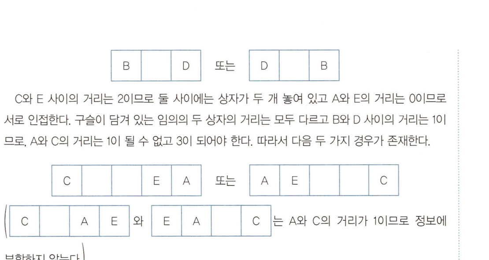
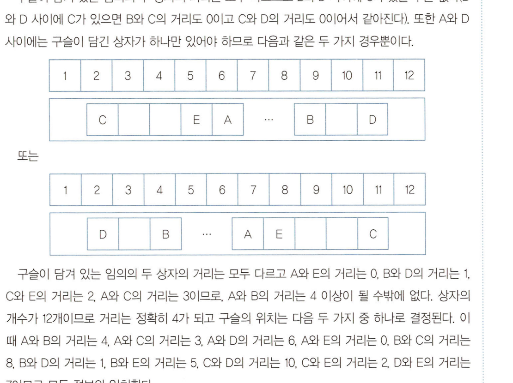
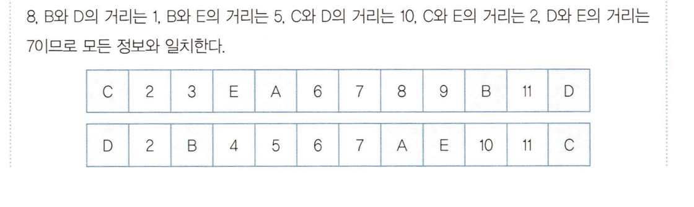
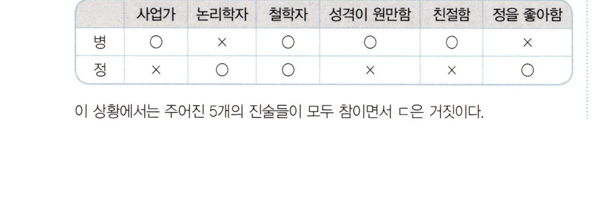

# 출제방향

## 1. 출제의 기본방향

추리논증은 제시문의 제재나 문항의 구조, 질문의 방식 등을 다양화하여 이해력, 추리력, 비판력을 골고루 측정하는 시험이 될 수 있도록 하였다. 추리 능력을 측정하는 문항과 논증 분석 및 평가 능력을 측정하는 문항을 규범, 인문, 사회, 과학기술의 각 영역 모두에서 균형 있게 출제하였으며, 상이한 토대와 방법론에 따라 진행되는 다양한 종류의 추리 및 비판을 상황과 맥락에 맞게 파악하고 적용하는 능력을 측정하고자 하였다.

문항의 풀이 과정에서는 제시문의 의미, 상황, 함의를 논리적으로 분석하고 핵심 정보를 체계적으로 취합하여 종합적으로 평가할 수 있어야 문제를 해결할 수 있도록 하였다. 제재의 측면에서 전 학문 분야 및 일상적ㆍ실천적 영역에 걸친 다양한 소재를 활용하였고, 영역 간 균형을 맞추어 전공에 따른 유ㆍ불리를 최소화하고자 하였다. 또한 제시문의 내용이나 영역에 관한 선지식이 문제 해결에 끼치는 영향을 최소화함으로써 정상적인 학업과 독서 생활을 통해 사고력을 함양한 사람이라면 누구나 해결할 수 있는 문항을 만들고자 하였다.

## 2. 출제 범위 및 문항 구성

인문, 사회, 과학기술과 같은 학문 영역별 문항 수는 예년과 큰 차이가 없이 균형 있게 출제되었다. 특기할 사항으로는, 인문학 영역의 문항들이 지식이나 규범과 관련된 원리적 토대를 다루는 문제 외에도, 예술이나 사회과학, 자연과학과 융합된 방식으로 다양하게 출제되었다는 점이다. 전체 문항의 구성은 규범 영역 12문항, 철학ㆍ윤리학ㆍ미학을 포함한 인문학 영역 13문항, 사회와 경제 영역 6문항, 자연과학 영역 6문항, 그리고 논리/수리적 추리 영역 3문항으로 이루어져 있다. 전체 문항에서 추리 문항과 비판(논증) 문항이 차지하는 비중은 각각 55%와 45%로 양쪽 사고력이 골고루 평가될 수 있도록 하였다.

## 3. 난이도

제시문의 이해도를 높이기 위해서 전문적인 용어는 순화하여 전공 여부에 상관없이 내용에 접근하고 이해할 수 있도록 하였다. 문제를 해결하기 위해 거쳐야 할 추리나 비판 및 평가의 단계도 지나치게 복잡해지지 않도록 하였고, 문항의 글자 수를 상당량 줄여서 불필요한 독해의 부담으로 난이도가 상승하는 일이 없도록 하였다.

## 4. 출제 시 유의점

ㆍ 제시문을 분석하고 평가하는 데 충분한 시간을 사용할 수 있도록 제시문의 독해 부담을 줄여 주고자 하였다.

ㆍ 추리 문항과 비판(논증) 문항의 문항별 성격을 명료하게 하여, 문항별로 측정하고자 하는 능력을 정확히 평가할 수 있도록 하였다.

ㆍ 선지식으로 문제를 풀거나 전공에 따른 유ㆍ불리가 분명한 제시문의 선택이나 문항의 출제는 지양하였다.

ㆍ 법학지식 평가를 배제하기 위해 문항에 나오는 개념, 진술, 논리 구조, 함의 등을 이해하는 데 법학지식이 요구되지 않도록 하였다.

ㆍ 출제의 의도를 감추거나 오해하게 하는 질문을 피하고, 문항 및 선택지 간의 간섭을 최소화함으로써, 문항의 의도에 충실한 변별이 이루어지도록 하였다.

---

# 문항별 해설

## 01

### 문항구분

* 문항 성격 : 규범 - 논증 평가 및 문제해결

* 평가 목표 : 이 문항은 대법관에 대한 국민심사제 도입을 둘러싼 논쟁의 내용을 이해하여 주어진 정보에 따라 각 견해가 강화 또는 약화되는지 판단할 수 있는 능력을 평가하는 문항

### 제시문 해설

이다. 정답: @ ×국은 대법관에 대한 국민심사제를 시행하고 있다. 내각이 임명한 대법관을 국민의 직접 선거에 부쳐 자격이 없다고 판단하는 의견이 총 투표수의 과반수이면 해당 대법관을 파면한다.

국에서 이 제도의 도입을 둘러싸고 ㅣ) 국민에 의한 사법 통제의 필요성을 인정하여 대법관에 대한 국민심사제 도입을 희망하는 견해, ㅣ ) ×국의 운영 방식에 대해 효용성을 우려하는 견해, 1 ) 대법관에 대한 국민심사제를 도입할 경우 법관이 대중적 인기에 연연하게 될 것을 우려하여 도입 에 부정적인 견해가 제시되고 있는데, 각 견해들의 주장 및 논거를 이해하여 주어진 정보에 따리

각 견해들이 강화 또는 약화되는지 파악할 수 있어야 한다.

### 선택지별 해설

정답 해설 (3) 을은 ×국의 운영 방식에 따르면 투표자가 대법관의 파면을 희망하는 '×'를 표ㅅ 하는 경우 이외에는 기권의 여지없이 모두 대법관의 파면에 반대하는 것으로 간 주되어 국민의 의사를 제대로 반영하지 못한다는 것을 문제시하는 입장으로, 대 법관에 대한 국민심사제가 ×국의 운영 방식 그대로 도입될 경우 효용성에 의문 을 제기한다. ×국에서 지난 70년간 대법관에 대한 국민심사가 실시되었으나 실 제로 파면된 대법관은 없었고 매번 총 투표수의 10% 내외만 파면을 원하였다면, 대법관의 자격 유무에 관하여 국민의 의사가 실질적인 영향을 미쳤다고 보기는 어렵다고 할 것이므로 이 제도의 효용성을 우려하는 을의 견해를 약화하지 못한 다. @은 적절하지 않은 평가이다.

오답 해설 (1 “국 헌법에서 대통령으로부터 대법관 임명을 받으면 오직 회복 불가능한 신체 장애라는 사유를 제외하고는 종신직으로 대법관 신분을 유지하도록 하여 그 신 분을 강력히 보장하고 있다면, 대법관이 독단적이고 편향적인 성향을 가졌더라 도 해임 또는 탄핵제도 등을 통해 그를 견제하거나 통제할 수 없다. 이는 사법에 대한 민주적 통제의 필요성을 인정하고 대법관에 대한 국민심사제 도입을 주장 하는 갑의 견해의 설득력을 높인다. (::은 적절한 평가이다.

(2 갑은 자의적인 기준을 가진 법관에 의해 부적절한 재판이 자행될 것을 우려하면 서 사법부에 대하여 국민의 통제가 이루어져야 한다고 주장한다. +국에서 법원 의 판결에 대해 비판이 난무하고 사법부에 대한 국민의 신뢰도가 매년 낮아졌 다는 여론 조사 결과는 현재 국에 대법관에 대한 국민심사가 필요함을 여실히 보여주는 자료라고 할 수 있다. 이는 갑의 견해의 설득력을 높인다. @는 적절한

평가이다.

(@ *국에서 일부 대법관이 대중적 인기만을 추구한 결과 종전 대법원 판결들을 뒤 집고 이로 인해 사회적 혼란이 야기된 상황에서, 대법관의 자격 유무를 국민이 심사하게 된다면 대법관의 일부만이 아니라 다수가 대중적 인기를 추구하게 될 가능성이 더욱 높아질 것이다. 따라서 대중적 인기만을 추구한 일부 대법관이 종전 대법원 판결들을 뒤집어 사회적 혼란이 야기된 사실은 대법관에 대한 국민 심사제가 도입될 경우 대법관이 법과 소신에 따라 재판하는 것이 아니라 대중적 인기에만 연연하여 법관의 독립이 저해될 것을 우려하는 병의 견해의 설득력을 높인다. @는 적절한 평가이다.

66 병은 국민이 대법관의 신임 여부를 심사하면 대법관이 대중적 인기에 연연하게 될 것이라고 우려하면서 이 제도의 도입에 대해 부정적인 의견을 제시한다. 이 는 +국에서 대법관의 신임 여부에 관한 올바른 여론 형성이 전제되지 않고서는 국민의 심사가 제대로 기능할 수 없음을 의미하는 것이기도 하다. 국에서 대법 관별로 판결에 관련된 정보가 제대로 제공되지 않고 주로 사적 활동을 중심으로 흥미 위주의 보도가 이루어지고 있어 대법관 신임 여부에 관한 올바른 여론이 형성되기 어렵다고 가정하자. 이 경우 국민심사제를 도입하면 대법관은 대중들 에게 신임을 받기 위해 자신의 판결보다는 자신의 이미지 관리에 더 많은 관심 을 둘 것이고, 이로 인해 대법관이 법과 소신에 따라 판결하기 위해 노력하기보 다는 대중적 인기를 높이는 것에만 시간과 노력을 투자하여 법관의 독립성이 저 해되는 결과가 나타날 것이다. 뿐만 아니라 대법관 신임 여부에 관한 올바른 여 론이 형성되기 어려운 사회라면 대중을 의식하여 대법관이 내린 판결의 결과 역 시 합당하지 못할 것이다. 6:는 적절한 평가이다.

## 02

### 문항구분

* 문항 성격 : 규범 - 논쟁 및 반론

* 평가 목표 : 이 문항은 각 주장의 논리적 전제 및 주장에 따른 결론을 추론해 내는 능력을 평가하 는 문항이다.

### 제시문 해설

정답: @ 갑, 을 병은 음란물을 「저작권법,상 저작물로 보호해야 하는지를 두고 논쟁을 하고 있다. 갑은 저 작물 여부를 판단함에 있어 가치중립성이 필요하다는 입장에서 '창의성'만을 판단기준으로 제시 하면서 음란물도 저작물에 포함될 수 있다고 보는 반면, 을은 법의 통일성 및 형평의 원칙을 강조 하면서 '합법성'을 저작물의 요건에 포함시킴으로써, 음란물은 저작물이 될 수 없다는 입장이다. 한편 병은 음란물이 저작물인지를 판단함에 있어 '사회적 해악성'을 기준으로 음란물을 구분하여

차별적으로 취급해야 한다는 절충적 입장이다.

2012 (부20>해셀 ㄱ. 감은 저작물의 개념 내지 판단기준에 있어서 음란성 등과 같은 도덕적 기준을 배제하는 가치중립적 입장으로, 창의성만을 저직물의 판단기준으로 삼는다. 이 는 음란물과 같이 도덕성이 문제되는 표현물에 대해서도 창의성을 인정함이 가 능하다는 것을 전제로 한다. ㄱ은 울지 않은 분석이다.

ㄴ. 을은 불법을 원조할 수 없다는 '더러운 손' 이론과 법의 통일성 및 형평의 원칙 을 근거로 합범성을 저작물의 개념 요소로 보는 입장이다. 그러므로 을의 입장 에 따르면, 법적으로 금지된 장소에 그려진 벽화나 국가보안법에 위반하여 대중 을 선동하는 작품은 그 불법성으로 인해 '저작권법;상의 저작물이 될 수 없다.

Ｌㄴ은 올은 분석이다.

은 옳은 분석

ㄷ. 병은 사회적 해악성이라는 판단기준을 통해 음란물을 분류하여 저작물 보호에 있어서 차별화하고자 하는 절충적 입장이다. 이와 관련하여, '음란성'에 대한 법 적 평가가 아니라 '저작성'에 대한 법적 평가가 사회적 해악성에 따라 달라짐을 주장하고 있다. 따라서 같은 시대, 같은 지역에서도 배포의 목적, 방법, 대상에 따라 음란성에 대한 법적 평가가 달라질 수 있다는 것은 병의 주장의 전제가 될 수 없다. 즉 배포의 목적, 방법, 대상에 따라 음란성에 대한 법적 평가가 달라질

수 없더라도 병의 주장은 여전히 성립할 수 있다. ㄷ은 옳지 않은 분석이다.

6

<보기>의 ㄴ만이 옳은 분석이므로 정답은 이다.

## 03

### 문항구분

* 문항 성격 : 규범 - 논증 분석

* 평가 목표 : 이 문항은 파산제도에 관한 두 가지 운영 방식을 비교하여 각각의 장단점을 이해하는 능력을 평가하는 문항이다.

### 제시문 해설

정답: @) ×국 제도는 파산한 채무자에게 빚을 갖지 못한 것에 대한 책임을 면제하는 파산면책주의를 제도 화한 것이고, \국 제도는 파산면책주의를 채택하지 않은 것이다. +국 제도는 당사자 간에 자유로 운 의사에 따라 체결한 계약은 지켜져야 한다는 원칙을 파산제도에서도 유지하는 것인 반면에, × 국 제도는 그와 달리 파산을 통하여 채무자에게 새로운 기회를 부여하고자 하는 것이다.

### 선택지별 해설

정답 해설 (3 `국 제도는 파산선고를 받은 채무자를 구금하고 선거권을 박탈하는 등 채무자 의 권리 제한을 허용하는 것이어서, 어느 채권자가 다른 채권자들보다 먼저 돈 을 받아 내려는 계획을 세운 후 파산을 채무자의 심리를 압박하는 협박의 수단 으로 이용할 수 있다. 채무자는 파산을 피하고자, 그 채권자에게 빚을 갖기 위해 다른 빚을 자유롭게 갖지 못할 수도 있고 또 다른 새로운 빚을 지면서까지 그 빛 을 갖고자 할 수 있어, 이를 우려하는 사람은 \국 제도를 지지하지 않을 것이다.

@은 울지 않은 분석이다.

오답 해설 (: >국 제도에 의하면 파산으로 기존의 채권: 채무관계가 소멸하므로, 그 관계로 인 한 소송은 더 이상 이루어지지 않는다. 따라서 그러한 소송이 끊임없이 이어질 것을 우려하는 사람은 ×국 저도를 지지할 것이다. @#은 옳은 분석이다.

2 ×국 제도는 채무자의 남은 빚을 전부 탕감해 주므로, 감당할 수 있는 범위 이상 으로 빚을 불성실하게 증가시켜 온 채무자에게 혜택이 주어진다는 비판도 가능 하다. 2는 옳은 분석이다.

'@ \국 제도는 파산 당시의 채무자의 재산으로 일단 빚의 일부를 갖고, 그 후에도 계속 채무자의 권리를 제한하면서 남은 빚을 감으라고 강제하는 것이어서, 채무 자로서는 탕감의 혜택이 없는 파산은 가능하면 회피하고자 돌려막기 수단으로 새로운 빚을 계속 지게 될 수 있어. 이를 우려하는 사람은 *묵 제도를 지지하지 않을 것이다. @는 옳은 분석이다.

6 \국 제도는 일괄적인 빛 탕감의 효과가 없으므로, 채무자와 모의한 가공의 채권 자가 허위로 채권을 주장하며 채무자의 재산을 분배받아 실제 채권자들의 채권 회수를 방해하고자 하는 경우도 예상될 수 있어, 이를 우려하는 사람은 *국 제

도를 반대할 것이다. 6@는 옳은 분석이다.

## 04

### 문항구분

* 문항 성격 : 규범 - 언어 추리

* 평가 목표 : 이 문항은 자녀의 양육을 위한 휴직 제도와 근로시간 단축 제도에 관한 규정을 이해 하여 주어진 상황에 올바르게 적용하는 능력을 평가하는 문항이다.

### 제시문 해설

정답: @ <규정>에 따르면 근로자는 자녀가 만 8세 이하인 동안에 양육휴직 및 근로시간 단축을 사용할 수 있다. 양육휴직과 근로시간 단축의 의미, 사용 기간, 사용 형태 등에 관한 내용이 제시되는데, 각 조문의 의미로부터 <보기>의 주어진 상황에서 양육휴직과 근로시간 단축을 어떻게 사용할 수 있

는지 이해하여야 한다.

<분20해셜 ㄱ. 만 6세 딸과 만 5세 아들을 양육하는 갑은 자녀 명당 1년의 양육휴직을 할 수 있으므로(제조제'항, 제2항) 총 2년간 양육휴직을 할 수 있다. 같은 지금까지 딸 을 위해서만 8개월간 연속하여 양육휴직을 하였으므로 앞으로 딸을 위해 4개월 간, 아들을 위해 1년간 양육휴직을 할 수 있다. 따라서 갑이 앞으로 그 자녀들을 위해 양육류직으로 사용할 수 있는 기간은 최대 16개월(=4개월+12개월)이다.

ㄱ은 을은 추론이다.

ㄴ. 양육휴직과 근로시간 단축 도두 자녀 1명당 1년의 기간이 보장되는데(제'조제2 항, 저2조제3항|, 양육휴직을 할 수 있는 근로자가 휴직 기간 중 사용하지 않은 기간이 있으면 그 기간만큼 근로시간 단축으로 변경하여 사용할 수 있다(저조 제3항). 만 2세 두 자녀를 양육하는 을이 지금까지 양육휴직 및 근로시간 단축 을 한 적이 없고 앞으로 근로시간 단죽만을 하고자 할 때, 그는 자녀 !명당 양육 휴직으로 보장된 1년에 근로시간 단축으로 보장된 1년의 기간을 합한 2년간 근 로시간 단축을 할 수 있다. 따라서 을이 두 자녀를 위해 사용할 수 있는 근로시 간 단축 기간은 최대 4년이다. ㄴ은 옳지 않은 추론이다.

ㄷ. 양육류직을 할 수 있는 근로자가 휴직 기간 중 사용하지 않은 기간이 있으면 그 기간만큼 근로시간 단축으로 변경하여 사용할 수 있으므로(저?조제3항| 만 4세 아들이 만 1세일 때 6개월간 연속하여 양육휴직만을 한 적이 있고 근로시간 단 축을 한 적이 없는 병은 최대 18개월(=24개월-6개월/의 기간을 근로시간 단축

으로 사용할 수 있다. 근로시간 단축 기간은 나누어 사용할 수 있고 그 경우 1회

의 기간은 3개월 이상이 되어야 하므로(제3조제2항|, 병이 앞으로 근로시간 단

축을 최대한 여러 번으로 나누어 사용하고자 한다면 3개월씩 6개의 기간으로

나누어 사용할 수 있다. ㄷ은 옳은 추론이다.

<보기>의 ㄱ, ㄷ만이 옳은 추론이므로 정답은 @이다.

## 05

### 문항구분

* 문항 성격 : 규범 - 언어 추리

* 평가 목표 : 이 문항은 유실물의 습득, 신고 반환 절차 및 소유권 취득 등에 관한 규정을 적절하 게 이해하여 구체적인 사례에 적용하는 능력을 평가하는 문항이다.

### 제시문 해설

유실물의 습득 및 반환에 관한 <규정은 각 조에서 습득자 및 경찰서장의 의무와 조치제조) 유 실물의 소유권 변동(제조). 유실물의 제출 보관 등에 소요된 비용의 처리(제3조에 관한 사항을

정하고 있다. 각 조를 적절하게 이해하여 구체적인 <사례>에 적용하여야 한다.

### 선택지별 해설

정답 해설 < 제조에 따르면 유실물의 습득자는 제2조에 따라 소유권을 상실한 소유자에게 유실물의 가치보존에 소요된 비용을 청구할 수 있는데, 제2조에 따라 유실물의 소유권을 취득한 습득자는 이 비용을 청구할 수 없다. 갑은 4의 발견ㆍ보관의 공 고일(2020. 1. 24.)로부터 3개월 이후에 의 반환을 요구하여 이미 의 소유권은 습득자 을이 취득하였으므로 소유자가 된 을은 의 상처 치료에 소요된 비용을 갑에게 청구하지 못한다. @:는 옳지 않은 서술이다.

오답 해설 (1 제'조제3항에 따르면 경찰서장은 유실물이 제출된 경우 경찰서 제출일로부터 3 개월 이내의 기간을 정하여 이 조에 따른 의무를 위반한 자 이외의 타인으로 ㅎ 여금 유실물의 보관을 명할 수 있다. <사례>의 을은 2020. 1. 14.에 를 발견한 뒤 7일이 지난 이후인 2020. 1. 23.에 경찰서를 방문하여 의 습득사실을 신고히 고 를 제출하였다. 이는 유실물 습득자는 습득한 날부터 7일 이내에 경찰서어 신고 및 제출하여야 한다고 규정한 제'조제1항의 의무를 위반한 것이므로 경찰 서장은 을에게 를 계속 보관하도록 명할 수 없다. 따라서 (::은 옳은 서술이다.

(2 제2조에 따르면 소유자가 유실물 공고 후 3개월 내에 권리를 주장하지 않거나 유실물에 대한 권리를 포기하면 소유자는 유실물의 소유권을 상실하고 습득자 가 소유권을 취득하게 된다. 갑이 ^의 소유권을 포기한 사실은 없고 유실물 공 고 후 3개월이 지나기 전에 갑이 경찰서장에게 에 대한 권리를 주장하였으므 로 갑은 소유자로서 를 반환받을 수 있다. 따라서 는 옳은 서술이다.

(9 제2조제2항에 따르면 소유자가 권리를 포기한 경우 습득자는 유실물의 소유권 을 습득한 때에 취득하게 되므로 을이 ^를 발견한 2020. 1. 14.부터 는 을의 소 유가 된다. 따라서 @은 옳은 서술이다.

(9) 제3조에 따르면 유실물을 보관한 자는 소유자에게 유실물의 가치보존에 소요된 비용을 청구할 수 있다. 이때 비용 청구의 상대방인 소유자에는 제2조에 따라 소 유권을 상실한 소유자는 포함되고, 동조에 따라 소유권을 취득한 습득자는 제외 된다. 갑이 에 대한 권리를 포기하여 소유권을 상실하였더라도 비용 청구의 대 상에서 제외되는 것이 아니므로, 경찰서장은 ^가 경찰서에 있는 동안 소비한 사

료에 대한 비용을 갑에게 청구할 수 있다. 따라서 @는 옳은 서술이다.

## 06

### 문항구분

* 문항 성격 : 규범 - 언어 추리

* 평가 목표 : 이 문항은 불법행위에 어느 나라의 법을 적용할 것인가에 관한 여러 견해를 이해하고 구체적 사례에 적용하는 능력을 평가하는 문항이다.

### 제시문 해설

정답: @ 불법행위의 모든 요소가 한 나라 안에만 있는 경우에는 당연히 그 나라의 법에 의하나, 불법행위 에 외국적 요소가 있어서 여러 나라와 관련되는 경우에는 어느 나라의 법을 적용할지가 문제된 다. <이론>에서는 행동지와 결과발생지를 기준으로 제시한다. <사례>에서는 재산이라는 법률상 이익이 침해되었다. 가해자가 \국에 거주하고 있고 \국에 영업소가 있으며 \국에서 피해자를 속였고 '\국 은행 계죄로 송금 받았으므로, 행동지가 국임에는 의심의 여지가 없다. 결과발생지

를 어느 곳으로 할 것인지는 <보기>에서 각각 다르게 보고 있다.

(부기해셜 -. 결괴발생지가 피해자의 거주지라고 본다면, <사려>에서 결괴발생지는 ×국이고, 그곳에서의 손해배상액은 11억 원이다. 행동지 '\\국에서의 손해배상액은 12억 원이다. 에 따른 손하배상액은 가해자가 피해자의 거주지를 예견할 수 있었으 면 1억 원, 예견할 수 없었으면 12억 원이다. 에 따른 손해배상액은 항상 11억 원이다. 2에 따른 손해배상액은 12억 원 또는 1억 원이므로 6에 따른 손해배 상액 1억 원보다 크거나 같다. ㄱ은 올은 분석이다.

ㄴ. 결과발생지가 피해자가 주된 경제활동을 영위하고 있는 곳이라고 본다면, <사 례>에서 결과발생지는 갑이 모든 소득을 얻으며 대부분의 지출을 행하는 \국이 고. 그곳에서의 손해배상액은 13억 원이다. 행동지 \\국에서의 손해배상액은 12 억 원이다. 63에 따른 손해배상액은 결과발생지 법에 따라 13억 원이다. 2에 따 른 손해배상액은 피해자가 주된 경제활동을 영위하는 곳을 가해자가 알고 있었 으므로 결과발생지 법에 따라 1억 원이다. 6에 떠른 손하배상액은 결괴발생지 법과 행동지 법 중 피해자에게 유리한 결과발생지 법에 따라 역시 13억 원이다. 3, 0, 6에 떠른 손해배상액은 도두 결과발생지 법에 따라 13억 원으로 같다. ㄴ은 옳은 분석이다.

ㄷ. 결괴발생지가 피해자가 가해자에게 송금한 금전이 예치되어 있던 계좌가 개설 된 곳이라고 본다면, <사려>에서 결과발생지는 갑이 모든 소득을 예치하는 계좌

를 개설한 은행의 소재지인 2국이고, 그곳에서의 손해배상액은 14억 원이다. 행

동지 \국에서의 손해배상액은 12억 원이다. 에 따른 손해배상액은 결과발생 지 법에 따라 14억 원이다. 에 따른 손해배상액은 가해자가 피해자의 계좌 개 설 은행 소재지를 예견할 수 없었으므로 행동지 법에 따라 12억 원이다. 에 따른 손해배상액 14억 원은 에 따른 손해배상액 12억 원보다 크다. ㄷ은 옳은

분석이다.

<보기>의 ㄱ, ㄴ, ㄷ 모두 옳은 분석이므로 정답은 @/이다.

## 07

### 문항구분

* 문항 성격 : 규범 - 언어 추리

* 평가 목표 : 이 문항은 외국에서 증권을 발행하는 경우의 신고의무 부과 및 면제에 관한 규정을

!                이해하여 각 사례에 올바르게 적용하는 능력을 평가하는 문항이다.                       |

### 제시문 해설

정답: <규정>에서는 ×국 회사 또는 제2조의 요건을 충족하는 외국 회사에는 증권 발행 신고의무를 부고 하되, ×국 거주자가 그 증권을 2년 이내에 취득할 수 없는 경우에는 신고의무를 면제하고(제조 본문 및 단서), 제2조의 요건을 충족하는 외국 회사가 외국에서 외국 통화로 표시한 증권을 발행 하는 경우에도 ×국 거주자가 그 증권을 1년 이내에 취득할 수 없는 경우에는 신고의무를 면제한

다(제3조). 신고의무가 면제되는 경우를 정확히 파악하는 것이 중요하다.

0부2해셀 ㄱ. >국 주식시장에 상장된 외국 회사이므로 저2조가 적용되고 제/조가 준용된다. ×국 거주자가 발행일로부터 2년 이내에 취득할 수 없다는 조건이 증권에 포함 되어 있으므로 제"조 단서에 해당하여 신고의무가 면제된다. 따라서 신고의무가 없는 경우이다.

ㄴ. ×국 주식시장에 상장되어 있지도 않고 ×국 거주자의 주식보유비율도 209 이상 이 아니어서 제2조에 해당하지 않는 외국 회사이므로 제/조가 준용되지 않는다. 신고의무가 부과되는 대상 자체에 해당하지 않는 외국 회사이므로, 신고의무기

없는 경우이다.

ㄷ. ×국 거주자의 주식보유비율이 209 이상인 외국 회사이므로 제2조가 적용되고 제"조가 준용된다. 다만, 외국 통회로 표시한 증권을 발행하므로 제2조에 따리 신고의무가 면제되는지가 문제된다. ×국 거주자가 발행일로부터 6개월이 경과 하면 취득할 수 있다는 조건이 증권에 포함되어 있어서 1년 이내에 취득하는 것 을 허용하므로, 제3조에 따라 신고의무가 면제되지 않는다. 따라서 신고의무7 있는 경우이다.

쓰 =

<보기>의 ㄷ만이 신고의무가 있으므로 정답은 @이다.

## 08

### 문항구분

* 문항 성격 : 규범 - 언어 추리

* 평가 목표 : 이 문항은 형벌 등급의 가중과 감경에 관한 원칙을 이해하고 구체적 사례에 적용하는 능력을 평가하는 문항이다.

### 제시문 해설

3908 정답: @ <규정>에 따르면 형벌의 등급을 가중하거나 감경하는 경우 단순히 기계적으로 하는 것이 아니라 일정한 원칙에 의하여야 한다. 가중에는 상한이 있고(<규정> (8); 감경하는 경우에는 노역 없는 유 배형을 하나의 등급으로 취급한다(<규정>(7):. 가중과 감경의 순서도 규정하는데. <규정>에서는 (3) ㅡ (4) ㅡ (5) ㅡ (60이다. <사례>에서 병은 자수한 후 탈옥하였으나, <규정> (9'에 따라 <규정> 를 <규정>(6!보다 먼저 적용하여야 한다.

정탑해셜 < 감은 <규정>(2의 죄를 저질렀다(3등급). 병은 갑의 범죄를 도왔으므로 <규정>(3) 에 따라 갑보다 한 등급을 감경하여야 하는데, <규정>(7'에 따라 5등급이다. 병은 포졸이 체포하려고 하자 포졸을 때려 상해를 입혔으므로 <규정>(4'에 따라 5등 급에서 네 등급을 가중하여야 하는데, <규정>(8)에 따라 2등급이 상한이다. 병은 탈옥하였으므로 <규정>(5에 따라 2등급에서 세 등급을 가중하여야 하는데, ×국 의 형벌의 상한은 1등급이다. 병은 자수하였으므로 <규정>(6에 따라 1등급에서 세 등급을 감경하여야 하는데, <규정>(7'에 따라 5등급이다. 따라서 병이 받을 형 벌은 5등급에 해당하는 노역 3년 6개월이다.

## 09

### 문항구분

* 문항 성격 : 규범 - 언어 추리

* 평가 목표 : 1. 이 문항은 위법 콘텐츠의 무분별한 확산을 막기 위한 소셜 네트워크 사업자의 의무와 책임에 관한 규정을 이해하여 각 사례에 올바르게 적용하는 능력을 평가하는 문항이다.

### 제시문 해설

문제 풀이 발지밸이

×국 법의 적용 대상과 그 의무 및 면제 조건을 정리하면 다음과 같다.

. 적용대상                  _ 의무                           . 의무 면제 조건 - 위법 콘텐츠 신고 절차 제공의무(제2조 제향 가나 사어 자| 시 및 식제의무서2조제2항)          국내 등록이용자 수 150만 명 이하

- 심사 결과ㆍ이유 통지의무(제2조제3항) 국내 등록이용자 수 200만 명 이하 - 위법 콘텐츠 신고 절차 제공의무(제2조 국내등록01용자 제리 수 100만 명 이상 - 심사 및 삭제의무(제2조제2항) 인 국외 사업자 - 심사 결과ㆍ이유 통지의무(제2조제3항) 국내 등록이용자 수 200만 명 이하 - 국내 송달대리인 임명/공시의무(제3조)

<부20해설 ㄱ. 국내 등록이용자 수 100만 명 이상 200만 명 이하인 국외 사업자이므로 이 범 의 적용 대상이고 통지의무는 면제된다. 그러나 국내 송달대리인 임명/공시의 무는 등록이용자 수와 무관하게 부담한다. 따라서 심사 결과를 통지하지 않아도 법 위반이 아니지만 국내 송달대리인 정보를 공시하지 않은 것은 제초 위반이 므로 5억 원 이하의 과태료가 부과된다. ㄱ은 옳은 추론이다.

ㄴ. 국내 사업자이므로 적용 대상이나, 국내 등록이용자 수가 150만 명이므로 심사 및 삭제의무와 통지의무가 도두 면제된다. 따라서 신속한 심사를 하지 않은 것 과 심사 결과를 통지하지 않은 것 모두 법 위반이 아니므로 과태료가 부과되지 않는다. ㄴ은 옳지 않은 추론이다.

=. 국내 등록이용자 수 100만 명 이상 200만 명 이하인 국외 사업자이므로 이 법 의 적용 대상이고 통지의무는 면제된다. 따라서 심사 결과를 통지하지 않아도 된다. ㄷ은 옳지 않은 추론이다.

<보기>의 ㄱ만이 옳은 추론이므로 정답은 (:이다.

## 10

### 문항구분

* 문항 성격 : 규범 - 언어 추리

* 평가 목표 : 이 문항은 부설주차장의 설치의무와 그 기준에 관한 규정을 이해하여 사례에 적용하 는 능력을 평가하는 문항이다.

### 제시문 해설

정답: @ 애초에 갑은 판매시설인 시설면적 6.00007의 시설물에 대해 6000+150=40대 규모의 기계식 주차장치를 설치하였다가 고장을 이유로 철거한 후 구청장으로부터 부설주치장 설치기준을 2분 의 [로 완화하여 적용받아 20대 규모의 부설주차장을 갖추고 있는 상태이다. 이 상태에서 갑이 이 시설몰의 시설면적 6.0000 중 3.00007를 위락시설로 용도변경하고자 한다면 제8조에 따라 용도변경 시점의 부설주차장 설치기준에 따라 변경 후 용도의 최소 주차대수를 갖추도록 부설주

차장을 설치하여야 한다.

정탑해셜| 6 (프>에 따르면 [판매시설 ㅡ 위락시설]의 용도변경은 제2조제4항의 `부설주차장 설치기준이 강화되는 용도로 변경될 때"에 해당하므로, 용도변경하는 부분에 대 해서만 <표>의 부설주차장 설치기준이 적용되고. 용도를 변경하지 않는 부분에 대해서는 구청장이 2분의 {로 완회한 설치기준이 그대로 적용된다. 즉 용도변경 하려는 30000" 부분에 대해서는 3000+100=30대 규모의 부설주차장이 설 치되어야 하고, 용도변경을 하지 않는 30000? 부분에 대해서는 3.000+150+2 =10대 규모의 부설주차장이 설치되어야 한다. 기존에 20대 규모의 부설주차장 을 갖추고 있는 상태이므로. 갑이 추가로 갖추어야 할 부설주차장의 최소 주차

수는 (30+10)-20=20대이다.

## 11

### 문항구분

* 문항 성격 : 규범 - 언어 추리

* 평가 목표 : 이 문항은 규정에 나타난 조건부 상속 제도의 특징, 상속재산의 현금화, 빚을 갖는 순 서 등을 이해하고 사례에 적용하는 능력을 평가하는 문항이다.

### 제시문 해설

<규정>에는 조건부 상속의 효과, 경매를 통한 상속재산의 현금화, 상속재산의 한도에서 사망자의 채무를 부담하는 제도의 구조. 사망자의 특정 재산에 대해 우선권을 가진 채권자와 그렇지 않은 보동의 채권자에게 빚을 갖는 방법 등에 관한 내용이 제시되어 있다.

### <보기> 해설

<보기> 해설 ㄱ. 사망한 갑의 채권자 병이 상속재산 중 하나인 집에 대해 우선권을 가지고 있으 므로 일단 그에게 경매가액 1억 원 중 7천만 원이 지급되어야 하며, 나머지 3천 만 원은 우선권 없는 채권자들에게 지급될 수 있으나, <규정> 제3조제2항이 채 권자의 청구의 순서와 관계없이 빛을 갖을 수 있다고 하였으므로 ㄱ은 옳지 않 은 서술이다.

ㄴ. 병이 집에 대해 우선권 있는 채권자이므로 집으로부터 발생한 경매가액 5천만 원을 전액 받을 수 있고, 병의 채권액 7천만 원 중 나머지 2천만 원은 <규정> 제 3조제3항에 따라 우선권 없는 채권이 되며, 그 한도에서 병의 지위는 정, 무와 같다. 따라서 상속인 을은 병, 정, 무 중에 누구에게라도 자유롭게 자신의 의사 대로 갖을 수 있으므로, 자동차로부터 발생한 경매가액 2천만 원을 병에게 지급 하는 것이 가능하다. ㄴ은 옳은 서술이다.

ㄷ. 병이 집에 대해 우선권 있는 채권자이므로 집으로부터 발생한 경매가액 1억 원 중 자신의 채권액 7천만 원을 다른 채권자 정, 무보다 우선적으로 지급받을 수 있다. 1억 원 중 남은 금액 3천만 원과 자동차로부터 발생한 경매가액 2천만 원 은 우선권 없는 채권자로서 평등한 지위에 있는 정과 무 중 누구에게든 지급될 수 있는 것이므로, 을이 무에게 5천만 원을 지급하고 상속재산이 소진하였다면, <규정> 제4조에 의하여 상속인 을은 더 이상 갑의 빛을 갖을 책임이 없다. ㄷ은

옳은 서술이다.

<보기>의 ㄴ, ㄷ만이 옳은 서술이므로 정답은 @이다.

## 12

### 문항구분

* 문항 성격 : 규범 - 언어 추리

* 평가 목표 : 이 문항은 규정에 나타난 추급권의 요건, 청구금액 산정 방법, 미술상의 의무 등을 이

해하여 사례에 올바르게 적용하는 능력을 평가하는 문항이다.

### 제시문 해설

정답: 6) 미술저작물의 저작자는 미술상이 관여한 후속거래에 대하여 거래가액에 따라 정해진 금액을 청 구할 수 있다. 저작자가 요구할 수 있는 정보는 두 종류인데, 저작물이 거래되었는지에 관한 정보 는 어느 미술상에게나 요구할 수 있으나 최근 3년간의 거래에 한정되고, 거래의 내용에 관한 정 보는 그 거래에 관여한 미술상에게 요구할 수 있고 시간적 제한은 없다. 갑이 /를 을에게 판 이후 후속거래는 @미술상 을이 병에게 20만 원에 판 것, 6 병이 미술상 을의 중개로 미술상 정에게 2 억 원에 판 것, 6'미술상 정이 무에게 3억 원에 판 것. 이렇게 3건이다. 무가 기에게 선물한 것은

거래가 아니다.

19탭하실 6 미술상 정은 무가 기에게 를 선물할 때에 관여하지 않았고 선물하는 것은 거래 가 아니므로 이에 관한 정보를 제공할 의무가 없다. 따라서 정은 기가 현재 4를 가지고 있다는 사실을 갑에게 알려주지 않아도 된다. 6는 울지 않은 서술이다.

### 선택지별 해설

오답 해설 저작자 같은 미술상의 중개로 미술상에게 그림을 매도한 병에 대하여 4백만 원 (판매가액 2억 원의 2%) 미술상으로서 그림을 매도한 정에 대하여 9백만 원(판 매가액 3억 원의 3%을 청구할 수 있다. ("은 을은 서술이다.

6 을은 갑과의 거래에서는 최초의 매수인이므로, <규정> 제?조의 후속거래에 해당 하지 않고 매도인 요건에도 해당하지 않아 거래가액의 일부를 지급할 의무가 없 다. 병과의 거래에서는 거래가액이 20만 원이어서 40만 원 미만이므로 거래가 액의 일부를 지급할 의무가 없다. @는 옳은 서술이다.

@ 병은 미술상 을의 중개로 그림을 미술상 정에게 매도하였으므로, <규정> 제2조 의 요건을 충족하여 지급 의무가 있다. @은 옳은 서술이다.

을은 병과 정 사이의 거래를 중개한 미술상이므로, <규정> 저5조에 의하여 같은 을에게 매도인인 병에 관한 정보의 제공을 요구할 수 있다. @는 옳은 서술이다.

## 13

### 문항구분

* 문항 성격 : 인문 - 논쟁 및 반론

* 평가 목표 : 이 문항은 사전 처벌이 정당화될 수 있는지에 대한 논증을 이해하고 이 논증에 사용 된 추상적인 원리를 사례에 적용할 수 있는 능력을 평가하는 문항이다.

### 제시문 해설

정답 @ 제시문은 미래 사회에서 중요해질 수 있는 '사전 처벌'(6『ㅎ-0406706000|, 어떤 가정하에서 정 당화되거나 정당화되지 않는지를 다룬 글이다. 주어진 사례의 특징은 경찰이 미래 갑의 행위에 대해서 이미 알고 있고, 실제로 그 행위가 일어난다는 것이다. 는 처벌에 대한 응보주의를 가정 했을 때 사전 처벌이 정당화된다고 주장한다. 실제로 과속이 일어날 것이기 때문에, 그에 대한 보 복의 시점은 중요하지 않다는 논리이다. 6는 범죄를 저지르기 이전의 갑이 자유로운 선택을 할 수 있는 행위자이고 그 때문에 무고한 사람임을 근거로, 사전 처벌이 정당화되지 않는다고 주장 한다. 4 입장은 경찰이 미래의 갑의 과속 사실을 알고 있다는 것을 핵심 전제로 갖고, 6 입장은 갑이 자유로운 선택 능력이 있다는 전제를 갖고 있다는 것을 파악하는 것이 문제해결에서 핵심적

인 역할을 한다.

### <보기> 해설

<보기> 해설 ㄱ. 경찰이 갑이 과속할 것을 알고 있다는 것이 4 논증의 중요한 전제 중 하나이 다. 따라서 이를 부정할 경우, 에서 의도된 결론은 얻을 수 없게 된다. 따라서 7ㄱ은 옳은 분석이다.

ㄴ. 갑이 과속을 하지 않을 능력이 있다는 것이 8 논증의 핵심 전제이다. 하지만 이는 6("… 경찰은 갑이 … 과속할 것이라는 것을 알고 있다.")과 긴장 관계에 있다. ㄴ에서 가정된 견해 “행위자가 어떤 행위를 하느냐 마느나를 결정할 능력 이 있다면, 그가 그 행위를 할지에 대해서 타인이 미리 아는 것이 불가능하다" 는 이런 긴장 관계를 명시적으로 드러내는 견해이다. 이런 견해가 주어질 때 8 는 과 양립 불가능하다. 따라서 ㄴ은 옳은 분석이다.

ㄷ. 테러리스트의 사례와 과속 사례의 핵심적인 차이는 실제 범죄가 행해지느냐의 여부이다. 테러리스트 사례의 경우 사전 처벌을 함으로써 범죄가 일어나지 않기 때문에, 처벌은 죄에 대한 균형을 맞추는 역할을 하지 못하게 된다. 따라서 테러 리스트 사례의 경우, 의 응보주의에 의해서는 사전 처벌이 정당화될 수 없다. 따라서 ㄷ은 옳지 않은 분석이다.

<보기>의 ㄱ, ㄴ만이 옳은 분석이므로 정답은 @이다.

## 14

### 문항구분

* 문항 성격 : 인문 - 논쟁 및 반론

* 평가 목표 : 이 문항은 어떤 행위가 손해 혹은 이익을 준다는 것이 무엇을 의미하는지에 대한 논 쟁을 적절하게 분석할 수 있는지 평가하는 문항이다.

### 제시문 해설

정답: <이론>은 어떤 사건 혹은 행위가 누군가에게 손해 혹은 이익을 준다는 것이 무엇을 의미하는지에 대한 반사실적 비교 설명(60401608048! 000108180/6 800040!에 해당한다. 이 견해는 행위가 어 떤 사람에게 '손해(이익)를 준다'는 것은, 만약 그 행위가 일어나지 않는다면 그 사람이 더 나은(더 못한) 상태에 있게 된다는 것이다. 갑은 일련의 반례를 통해 이 견해를 비판하려는 입장을 취하고 있고, 을은 '행위'에 대한 정확한 정의를 통해 이 견해를 옹호하려는 입장을 취하는 것으로 볼 수

있다. 논쟁의 구조는 다음과 같다.

갑1 : 친구에게 5만 원을 주지 않음을 <이론>에 대한 반례로 제시한다.

을1 : '행위'에 대한 제한을 통해 반례가 되지 않는다고 답한다.

갑2 : 아이를 구조하지 않은 것을 새로운 반례로 제시해서, 을1의 해결책이 완벽하지 않음을 주 장한다.

을2 : "행위'에 대한 추가적인 조건을 통해 아이를 구조하지 않은 사례가 반례가 되지 않는다고 답한다.

갑3 : 새로운 조건이 추가되었을 때, 또 다른 반례가 있음을 주장한다.

<

### <보기> 해설

<보기> 해설 ㄱ. 감1은 '아무 것도 하지 않고 가만히 있는 것'을 행위로 해석해, <이론>에 따라 친 구에게 5만 원을 주지 않을 경우 친구가 더 못한 상태에 있게 되므로, 친구에게 5만 원을 주지 않는 것을 친구에게 손해를 주는 행위로 본다. 이 논리를 그대로 적용하면, '친구를 때려 코를 부러뜨리지 않은 것도 행위로 해석할 수 있고, 친 구를 때렸을 경우 친구는 더 못한 상태에 있었을 것이므로, <이론>은 친구를 때 리지 않은 것이 친구에게 이익을 준 것으로 해석할 것이다. 따라서 ㄱ은 옳은 분석이다.

ㄴ. 갑2는 아이가 물에 빠진 사례에서 아이를 구조하지 않은 것은 명백하게 아이에 게 손해를 준 것이라고 주장하면서, 이것이 을1이 해석한 <이론>의 반례가 된다 고 주장한다. 을2는 아이를 구조하지 않은 것이 아이에게 손해를 준 것이라는

갑2의 판단에 동의하면서, <이론>에 대한 재해석을 통해 이 사례가 <이론>에 대

한 반례가 아니라고 주장하고 있다. 따라서 ㄴ은 옳지 않은 분석이다.

ㄷ. 갑3은 을2가 해석한 <이론>에 대한 또 다른 반례를 제시한다. 을이 자신의 입장 을 포기하지 않으면서 갑3에 일관적으로 응수할 수 있는 한 가지 방법은, 실제 로 이 사례가 반례가 아니라고 주장하는 것이다. 다시 말해, '^가 8에게 선물을 주지 않은 것은 8에게 손해를 준 것이 맞다고 주장한다면, 을2가 제시한 해석 을 그대로 고수하고 있는 것이며 아무런 비일관성도 없다. 따라서 ㄷ은 옳지 않

은 분석이다.

는

<보기>의 ㄱ만이 옳은 분석이므로 정답은 (이다.

## 15

### 문항구분

* 문항 성격 : 인문 - 논쟁 및 반론

* 평가 목표 : 이 문항은 예술이 지식을 제공할 수 있는지에 관한 논쟁을 분석하고 평가하는 능력을 측정하는 문항이다.

### 제시문 해설

문제 풀이 발레 예술이 우리에게 지식을 줄 수 있는가의 문제는 오랜 역사를 가지고 있다. 그런 만큼이나 예술이 지식을 제공할 수 있다는 견해와 그렇지 않다는 견해는 다양한 층위에서 논쟁을 이어가고 있다. 예술에만 고유한 지식이 있는가의 문제, 예술에서 얻는 지식이 있다면 그러한 지식의 성격을 어 떻게 규정할 수 있는가의 문제, 예술에서 지식을 얻는다고 해도 예술의 그러한 인식적 가치가 예 술의 미적ㆍ예술적 가치의 증진에 얼마나 어떻게 기여할 수 있는가의 문제 등이 논쟁의 층위를 구 성한다. 이 문항에서는 지식을 정당화된 참인 믿음으로 규정할 때 정당화의 문제에 초점을 맞춘 논쟁

을 소개하고 있다. 제시문은 우리가 작품에서 얻게 되는 믿음이 참일 경우에도 그것이 진정한 지 식이려면 제도적 보증과 같은 외재적 정당화가 필요한데, 백과사전과 달리 사실주의 소설은 외재 적 정당화를 요구하지 않으므로 지식을 제공할 수 없다고 보는 갑의 견해와, 외재적 정당화 논증 이 사실주의 소설과 백과사전의 지식 제공 여부를 나누는 기준이 될 수 있을지에 대해 회의적인

입장인 을의 견해를 대비시키고 있다.

(부기해셜 -. 은 우리가 예술작품에서 얻게 되는 믿음이 참일 수 있다고 해도 결코 정당화 되지 못한다고 말하고 있다. 그러나 예술작품의 한 종류인 사실주의 소설이 어 떤 사건이 실제로 일어난 것인지에 대해 증거적 효력이 있는 확인을 거쳐 작성 된다는 것이 사실이라면, 이것은 우리가 사실주의 소설에서 얻게 도는 믿음이 참일 수 있을 뿐만 아니라 정당화될 수 있다는 것을 의미하므로 63은 약화된다.

그러므로 ㄱ은 적절한 평가이다.

ㄴ. '히틀러 일기]의 경우 히틀러가 쓴 자서전인지 확인하기 위한 제도적 보증을 거 쳤을 것이지만, 이 책이 히틀러가 쓴 자서전이 아니라 다른 사람이 날조한 것으 로 밝혀졌다는 사실은 그 확인이 성공적이지 않았음을 보여준다. 따라서 『히틀 러 일기』의 사례는 출판 관행으로서의 제도적 보증은 저자 또는 내용 확인 절 차가 이루어졌다는 것만을 보여줄 뿐 그 확인이 성공적임을 보여주는 것은 아 니라고 말하는 을 지지하는 사례로 볼 수 있다. 그러므로 ㄴ은 적절하지 않은 평가이다.

ㄷ. 갑은 백과사전의 경우 관련 분야의 전문가들에게 그 정확성을 확인받는 절차 인 제도적 보증이 있기 때문에 백과사전에서 얻게 되는 믿음은 정당화될 수 있 지만, 예술작품의 경우에는 그런 객관적 절차가 없기 때문에 예술작품에서 얻게 되는 믿음은 정당화되지 못한다고 주장한다. 백과사전에서 정보를 찾는 독자와 달리, 예술작품인 『황량한 집의 독자가 작품에서 드러난 내용을 믿어야 할 이 유를 주로 개인적 경험에서 찾는다는 점은, 「황량한 집』의 독자가 관련 분야의 전문가들에게 그 내용의 정확성을 확인받는 절차 없이 단지 개인적이고 주관적 인 경험에 근거해 이 작품의 내용을 믿게 된다는 것을 보여주므로 갑의 견해를

강화한다. 그러므로 ㄷ은 적절한 평가이다.

<보기>의 ㄱ, ㄷ만이 적절한 평가이므로 정답은 @이다.

## 16

### 문항구분

* 문항 성격 : 인문 - 논쟁 및 반론

* 평가 목표 : 이 문항은 올바르게 논쟁을 분석하고 평가할 수 있는 능력을 측정하는 문항이다.

### 제시문 해설

문제 풀이 발=헬9 이 문항은 우아함을 예로 들어 미적 속성이 쇼팽의 야상곡과 같은 대상의 실제 속성인지 아닌지 에 관한 논쟁을 다루고 있다. 갑의 견해는 미적 속성은 대상의 실제 속성이 아니고 대상에 미적 속성을 적용하는 진술은 단지 개개인의 주관적 인상을 표현한 것에 불과하다는 것이다. 이에 대 해 을은 미적 속성이 대상의 실제 속성이고, 그 속성을 지각하기 위해서는 정상적인 조건하에서 감상자가 적절한 음악적 감수성을 갖출 것이 요구된다고 주장한다. 한편 병은 미적 속성이 단순 히 주관적 인상에 불과한 것은 아니지만 대상의 실제 속성은 아니며, 집단 내에서 공유하는 음악 적 감수성에 따라 달리 파악될 수 있다고 주장한다. 이 문항은 이러한 견해 차이를 분명하게 인식

하고 각 견하로부터 어떤 함의를 도출할 수 있는지 묻는다.

0221해셜 -. 을은 적절한 음악적 감수성을 갖춘 사람들만이 음악 작품의 우아함을 지각한다

고 주장한다. 이는 우아함을 지각하는 사람들의 집단이 적절한 음악적 감수성을

갖춘 사람들로 한정된다는 조건만 제시하는 것이므로, 그 집단의 규모가 시 대와 문화에 따라 클 수도 있고 작을 수도 있다는 주장과 양립 가능하다. 따 라서 을이 이러한 주장에 반대할 것이라고 말하는 ㄱ은 옳지 않은 분석이다.

ㄴ. 병은 사람들이 쇼팽의 야상곡을 듣고 다른 반응을 보이는 것이 각자가 속한 집 단에서 공유하는 음악적 감수성이 달라서 그렇다고 설명한다. 이 설명에 의하면 야상곡이 지루하다고 여기는 사람들은 야상꼭이 우아하다고 여기는 사람들과는 다른 음악적 감수성을 가지고 있을 것이다. 따라서 ㄴ은 옳지 않은 분석이다.

ㄷ. 을에 따르면 적절한 음악적 감수성을 가진 사람들만이 쇼팽의 야상곡에 속한 진짜 성질인 우아함을 지각할 수 있으므로, 을은 이러한 감수성을 가진 사람이 '쇼팽의 야상곡은 우아하다고 주장하는 것을 받아들일 수 있다. 한편 병에 따르 면 우아함이 쇼팽의 야상꼭에 속한 진짜 성질일 필요가 없으며, 쇼팽의 야상곡 이 우아하다고 느끼는 음악적 감수성을 공유하는 집단이 있으면 충분할 것이다. 따라서 병은 이러한 집단에 속한 사람이 '쇼팽의 야상꼭이 우아하다'고 주장하

는 것을 받아들일 수 있다. 따라서 ㄷ은 옳은 분석이다.

<보기>의 ㄷ만이 옳은 분석이므로 정답은 이다.

## 17

### 문항구분

* 문항 성격 : 인문 - 논쟁 및 반론

* 평가 목표 : 이 문항은 믿음은 충분한 근거에 기초해야만 하는가의 문제에 대한 고전적인 논쟁을 올바로 분석할 수 있는 능력을 평가하는 문항이다.

### 제시문 해설

다대 정답 : ㅇ@) 제시문은 클리포드와 져임스 사이의 고전적인 논쟁의 핵심 부분을 발취한 글이다. 클리포드는 불 충분한 증거에 근거해 믿음을 형성하는 것은 옳지 않다고 주장한다. 불충분한 증거에 근거해 믿음 을 형성하게 된다면 사회가 속기 쉬운 상태가 되어 야만의 상태로 돌아갈 것이라는 근거에서다. 제임스는 '진리 추구'와 오류 회피'가 별개의 지적인 임무임을 강조하면서, 클리포드의 주장은

후자에 초점을 두었을 경우에만 정당화될 수 있음을, 그리고 둘 사이의 선택은 정념의 문제임을

지적하고 있다.

### <보기> 해설

<보기> 해설 ㄱ. 의 결론은 "불충분한 증거에서 어떤 것을 믿는 것은 언제나 어디서나 누구에 게나 옳지 않다는 것이다. 클리포드는, 그렇게 하지 않을 경우 사회가 '야만의

상태'에 빠질 것이라고 주장함으로써 이를 정당화하고 있다. 따라서 ㄱ은 옳은 분석이다.

ㄴ. 8는 "진리를 믿어래!", "오류를 피하래!"라는 두 인식적 의무가 있고, 클리포드는 후자에만 초점을 맞추었다고 주장한다. 그리고 이런 선택은 증거에 기초한 것0 아니라 정념에 기초한 것이라고 주장한다. 따라서 6에 따르면 에 대한 클리 포드의 믿음은 충분한 증거에 기초하지 않았다고 볼 수 있다. 따라서 ㄴ은 옳은 분석이다.

ㄷ. 8의 논증은 '충분한 증거에 기초한 믿음이 오류일 수 있다'라는 진술과 무관ㅎ 다. 이 진술이 거짓이라고 하여도, 즉 충분한 증거에 기초한 믿음이 절대 오류일 수 없다고 하여도 8의 논증은 전혀 영향을 받지 않는다. 는 단지 충분한 증> 에 기초해서만 믿음을 갖고자 하는 태도가 정념에 기초해 있음을 지적하는 것

뿐이다. 따라서 ㄷ은 옳지 않은 분석이다.

<보기>의 ㄱ, ㄴ만이 옳은 분석이므로 정답은 @이다.

## 18

### 문항구분

* 문항 성격 : 인문 - 논쟁 및 반론

* 평가 목표 : 이 문항은 인식적 객관성과 비평가의 예술적 판단에 관한 견해를 소재로 하여, 각자 의 주장과 근거를 올바로 분석할 수 있는 능력을 평가하는 문항이다.

### 제시문 해설

문제 풀이 탈==0 제시문은 판단의 인식적 객관성이 주관적 요소를 완전히 배제하고 이성의 합리성을 온전하게 발 휘함으로써만 확보될 수 있다는 ㅅ의 입장과 예술작품에 대한 비평가의 판단이 적절한 것이기 위 해서는 비평가 자신의 특수한 상황에서 벗어나 작품에서 전제하는 특정한 관점을 취해야 할 필요

가 있다는 8의 입장을 대비하고 있다.

(부기>해셀 ㄱ. 두 사람이 어떠한 주장에 대해 동일한 판단을 내린 경우, ^에 따르면 그 판단이 인식적 객관성을 가지기 위해서는 판단을 내리는 사람 자신을 포함해 그 누구 의 것이든 주관적인 요소가 그 판단에 개입되어서는 안 된다. 하지만 두 사람의 판단이 동일하다는 것만으로는 이러한 주관적 요소가 배제되었음이 따라 나오 지 않으므로 그들의 판단이 인식적 객관성을 가진다고 단정할 수 없다. 따라서 ㄱ은 옳지 않은 분석이다.

ㄴ. 에 따르면 8의 비평가의 판단이 인식적 객관성을 가지기 위해서는 비평가 자 신을 포함해 그 누구의 것이든 주관적인 요소가 그 판단에 개입되어서는 안 된 다. 그런데 8의 비평가는 작품이 요구하는 특정한 관점을 취할 필요가 있고, 그 러한 관점은 비록 비평가 자신의 특수성은 아니지만 어떤 다른 사람의 주관적

요소를 고려해야 한다. 따라서 ㄴ은 옳은 분석이다.

ㄷ. 서로 다른 시대나 나라에 살았던 어떤 두 비평가가 예술작품에 대해 동일한 판 단을 내린 경우, 8에 따르면 그들의 판단이 적절한 것이기 위해서는 그 작품이 전제로 하는 관점에서 이루어져야 한다. 그러나 그들의 판단이 동일하다는 것만 으로는 그들이 그 작품이 전제로 하는 관점을 취했다는 점이 따라 나오지 않는

다. 따라서 ㄷ은 옳지 않은 분석이다.

내 재가

<보기>의 ㄴ만이 옳은 분석이므로 정답은 2이다.

## 19

### 문항구분

* 문항 성격 : 인문 - 언어 추리

* 평가 목표 : 이 문항은 '무어의 역설'이라 불리는 언어 현상을 화용론적으로 설명하는 이론을 소 개하고, 이 이론의 함축을 정확하게 파악할 수 있는지를 평가하는 문항이다.

### 제시문 해설

정답 : 여기서 다루고 있는 무어의 역설은 다음과 같은 현상이다. “나는 [라고 믿지만, 6가 아니다"가 난 센스로 들리지만, 의미론적 모순은 없다. 이 난센스를 어떻게 설명할지에 대해 여러 가지 견해가 제시되었는데, 제시문은 한 가지 화용론적 설명을 소개하고 있다. <이론>은 "나는 [라고 믿는다" 라고 주장하는 것은 대화 상대방을 고려하여 [를 완곡하게 주장하는 것이고, 이 때문에 “나는 6 라고 믿지만 [가 아니다"는 사실상 모순된 내용을 표현한다고 주장함으로써, 무어의 역설을 설명

하고자 한다.

### <보기> 해설

<보기> 해설 ㄱ. <이론>은 '나는 [라고 믿는다'를 주장하는 것이 대화 상대방을 고려하여 를 완 곡하게 주장하는 것이라고 말하고 있다. 그러나 <이론>으로부터 '너는 를 믿는 다'가 0에 대한 완곡한 주장이라는 것이 함축되지 않는다. 따라서 <이론>은 '너 는 지금이 여름이라고 믿지만 지금은 여름이 아니다'라고 주장하는 것 역시 난 센스로 들릴 것이라고 예측하지는 않는다. 따라서 ㄱ은 옳지 않은 분석이다.

ㄴ. <이론>은 '나는 [라고 믿는다'를 주장하는 것이 대화 상대방을 고려하여 (를 완 곡하게 주장하는 것이라고 말하고 있다. 이로부터 '나는 0가 아니라고 믿는다' 라고 주장하는 것은 '6가 아니다를 완곡하게 주장하는 것에 해당한다는 것을 추론할 수 있다. 따라서 '나는 6라고 믿지만 [가 아니라고도 믿는다'라는 주장은 '0이고 [가 아니다를 주장하는 것으로 읽히게 된다. 이 주장은 명백한 모순이 며, 따라서 <이론>은 '나는 [라고 믿지만 [가 아니라고도 믿는다'라고 주장하는 것 역시 난센스로 들릴 것이라고 예측한다. 따라서 ㄴ은 옳은 분석이다.

ㄷ. <이론>은 '나는 [라고 믿는다'를 주장하는 것이 대화 상대방을 고려하여 (를 완 곡하게 주장하는 것이라고 말하고 있다. 마음속으로 말없이 판단할 때에는 대화 상대방이라는 것이 없다. 이 때문에 <이론>은 '나는 6라고 믿지만 6가 아니다'고 마음속으로 판단하는 것이 난센스로 여겨져야 할 것이라고 예측하지는 않는다.

따라서 ㄷ은 옳지 않은 분석이다.

<보기>의 ㄴ만이 옳은 분석이므로 정답은 이다.

## 20

### 문항구분

* 문항 성격 : 인문 - 논쟁 및 반론

* 평가 목표 : 이 문항은 과학 이론의 변화가 어떤 경우 진보적이라고 볼 수 있는지에 관한 논쟁을 읽고 각각의 견해를 정확히 분석할 수 있는지를 평가하는 문항이다.

### 제시문 해설

정답: 0) 제시문에서 과학 이론의 변화가 진정한 진보'인지, 어떤 의미에서 진보인지, 진보인지 여부는 떻게 판단할 수 있는지를 둘러싼 논쟁이 소개되고 있다. 논쟁에서 갑은 이론이 보여준 과거의 성 취를 인정하더라도 이는 사회적 요소에 의해 설명될 수 있기 때문에 진정한 진보의 근거가 되지 못한다고 주장한다. 을은 과거 성취에 대한 갑의 주장을 받아들이더라도, 이론의 장래성을 판단 함으로써 진정한 진보를 평가할 수 있다고 주장한다. 논쟁을 분석하여 <보기)에서 제시된 여러

주장에 갑과 을이 동의하는지 여부를 판단할 필요가 있다.

### <보기> 해설

<보기> 해설 ㄱ. 감은 이론의 성공 사례들이 사회적 요소의 영향이 있었다는 것만을 보여주므로 진보의 근거가 아니라고 주장한다. 이는 이론의 성공이 사회적 요소로만 해명되 는 경우 이론의 변화가 진정으로 진보적인 것은 아니라고 주장하는 셈이다. 그 렇다면 “이론의 변화가 '진정한 진보'이려면 이론의 성공이 사회적 요소로만 해 명되어서는 안 된다"는 데 동의한다. 을은 사회적 요소의 영향을 받지 않는 이 론의 장래성에 의해 진보 여부를 판단할 수 있다고 주장하므로, 같은 주장에 동 의한다. 따라서 ㄱ은 옳은 분석이다.

ㄴ. 갑은 "후속 이론이 더 많은 수의 사실을 설명하고 예측"하는 경우가 있음을 인 정한다. 그러나 그렇다 해도 과학 이론의 변화가 과거 이론의 설명과 예측을 보 존하고 그에 더하여 새로운 설명과 예측을 제공하는 방식으로 이루어져 왔다는 주장에 동의한다고 할 수 없다. 따라서 ㄴ은 옳지 않은 분석이다.

ㄷ. 뉴턴 이론이 잘못 예측했던 부분에 대해 상대성 이론이 옳게 예측했다면, 상대 성 이론이 뉴턴 이론의 모든 예측에 덧붙여 새로운 예측을 했다고 볼 수 없다. 뉴턴 이론의 예측 가운데 어떤 것을 보존하지 않았기 때문이다. 이 경우 상대성 이론은 을이 말하는 '더 일반적'인 이론에 해당한다고 볼 수 없다. 따라서 ㄷ은

옳지 않은 분석이다.

ㄷ 눈그

<보기>의 ㄱ만이 옳은 분석이므로 정답은 (이다.

## 21

### 문항구분

* 문항 성격 : 논리학ㆍ수학 - 모형 추리

* 평가 목표 : 이 문항은 주어진 조건과 정보로부터 상자들의 가능한 위치를 찾아내는 능력을 평가

하는 문항이다.

### 제시문 해설

정답: 0

8와 ㅁ 사이의 거리는 1이므로 다음 두 가지 경우가 존재한다.

8    ㅁ  또는  ㅁ    8

와 ㄷ 사이의 거리는 20!므로 둘 사이에는 상자가 두 개 놓여 있고 ^와 의 거리는 00|므로 ： 서로 인접한다. 구슬이 담겨 있는 임의의 두 상자의 거리는 모두 다르고 6와 [ㅁ 사이의 거리는 1이 므로, ^와 (의 거리는 10| 될 수 없고 30| 되어야 한다. 따라서 다음 두 가지 경우가 존재한다.

의      ㄷ6ㄷ| ^  또는  ^] ㄷ      의

| 8   ^] ㄷ|와| [ㅁ| &   6 |는 &와 ㅇ의 거리가 1이므로 정보에

: 부합하지 않는다.

구슬이 담겨 있는 임의의 두 상자의 거리는 모두 다르므로 8와 [ 사이에 <가 있을 수는 없다6 와 ㅁ 사이에 가 있으면 6와 의 거리도 00|고 (와 ㅁ의 거리도 0이어서 같아진다). 또한 4와 0 사이에는 구슬이 담긴 상자가 하나만 있어야 하므로 다음과 같은 두 가지 경우뿐이다.

1    2    3    4    5    6    7    8    9    10    1    12 요               ㄷ    ^             8         ㅁ 또는 1    2    3    4    5    6    7    8    9    10    1    12 ㅁ              8        나        ^^|ㄷ                     @

구슬이 담겨 있는 임의의 두 상자의 거리는 모두 다르고 ^와 ㄷ의 거리는 0, 6와 ㅁ의 거리는 1,

: 와 6의 거리는 2 &와 의 거리는 30|므로, ^와 8의 거리는 4 이상이 될 수밖에 없다. 상자의

. 개수가 12개이므로 거리는 정확히 4가 되고 구슬의 위치는 다음 두 가지 중 하나로 결정된다. | 때 2와 8의 거리는 4, ^와 <의 거리는 3, ^와 [ㅁ의 거리는 6, 와 6의 거리는 0, 6와 의 거리는 8, 8와 ㅁ의 거리는 1, 8와 ㄷ의 거리는 5, 와 ㅁ의 거리는 10, 와 ㄷ의 거리는 2. ㅁ와 의 거리는 70|므로 모든 정보와 일치한다.

ㅇㄷㅇ    엄    3    는    ^    6    7    8    9    81 71    ㅁ

ㅁ    2    ㅁ8    4    5    6    7    ^    ㄷㄱ710 | 1    6

### <보기> 해설

<보기> 해설 ㄱ. 둘 중 어느 경우든 구슬 ^와 8가 각각 담겨 있는 두 상자 사이에는 구슬이 담겨

있는 상자가 없다. ㄱ은 옳은 추론이다.

ㄴ. 첫 번째 경우에는 구슬 (:가 담겨 있는 상자의 번호가 구슬 [가 담겨 있는 상자 의 번호보다 작다. 주어진 정보들로부터 어떤 진술이 옳게 추론된다고 하기 위 해서는, 주어진 정보들이 모두 참이면서 그 진술이 거짓인 가능한 상황이 존재 하지 않아야 한다. 첫 번째 경우에서 주어진 정보들은 모두 참이면서 ㄴ은 거짓 이므로, ㄴ은 옳지 않은 추론이다.

ㄷ. 두 번째 경우에는 8번 상자에 구슬이 담겨 있다. ㄷ은 옳지 않은 추론이다.

<보기>의 ㄱ만이 옳은 추론이므로 정답은 (:이다.

## 22

### 문항구분

* 문항 성격 : 논리학-수학 - 모형 추리

* 평가 목표 : 이 문항은 제시문에 주어진 진술들로부터 <보기>의 각 진술이 추론되는지 여부를 판 단하는 능력을 평가하는 문항이다.

### 제시문 해설

문제 풀이 발기

### <보기> 해설

<보기> 해설 -. 다음 단계를 거쳐서 ㄱ은 옳은 추론이라는 것을 알 수 있다.

(1) 사업가이거나 논리학자인 갑의 성격이 원만하지 않다(ㄱ의 가정).

(2) 갑의 성격이 원만하지 않다((!!로부터)

(3) 갑은 친절하지 않다(2와 두 번째 진술로부터). (4: 갑은 사업가가 아니다(3:과 첫 번째 진술로부터).

(5) 갑은 사업가이거나 논리학자이다(1!로부터).

(6) 갑은 논리학자이다(4)와 (5!로부터).

(7) 갑은 친절하지 않은 모든 사람을 좋아한다(6:과 세 번째 진술로부터).

ㄴ. 다음 단계를 거쳐서 ㄴ은 옳은 추론이라는 것을 알 수 있다.

(1) 을은 논리학자이다(ㄴ의 가정).

(2) 을은 친절하지 않은 모든 사람을 좋아한다((1:과 세 번째 진술로부터).

(3) 을은 친절하지 않은 사람이다(2/와 네 번째 진술로부터).

(4) 어떤 철학자는 친절하지 않은 모든 사람을 좋아한다(세 번째 진술과 다섯 번 째 진술로부터).

(5) 어떤 철학자는 을을 좋아한다(3과 (4!로부터).

ㄷ. 주어진 진술들로부터 어떤 명제가 옳게 추론된다고 하기 위해서는, 주어진 진술 들이 모두 참이면서 그 명제가 거짓인 가능한 상황이 없어야 한다. 다음의 가능 한 상황에서는 주어진 진술들이 모두 참이면서 ㄷ이 거짓이기 때문에, ㄷ은 을 지 않은 추론이다.

[가능한 상황] 병과 정만이 존재하고 병과 정이 다음과 같은 특성을 가진다. 6      사업가 ：논리학자 ㅣ 철학자 ： 성격이 원만함 ㅣ 친절함 정을 좋아함 병       @         ×         ㅇ           오           ㅇ          × 정       ×         0        ㅇ           ×            ×          ㅇ

이 상황에서는 주어진 5개의 진술들이 모두 참이면서 ㄷ은 거짓이다.

제시문의 진술 및 ㄷ           진리치 모든 사업가는 친절하다.               참 사업가인 병이 친절하다.

성격이 원만하지 않은 모든 사람은            성격이 원만하지 않은 정이 친절하

친절하지 않다.                               지 않다 모든 논리학자는 친절하지 않은 모 。 논리학자인 정이 친절하지 않은 자 든 사람을 좋아한다.                      그 신을 좋아한다. 친절하지 않은 모든 사람을 좋아하            친절하지 않은 모든 사람을 좋아하 는 사람은 모두 그 자신도 친절하 참는 사람은 정이다. 정은 친절하지 지 않다                                  않다.

철학자이면서 논리학자인 정이 존 어떤 철학자는 논리학자이다.          된 | 으이저이면서 슨리희자인 정미

재한다. 병이 진절하다면 병은 사업가가 아 병은 진절하고 사업가이면서 철학 니거나 철학자가 아니다.                   ^ 자이다

## 23

### 문항구분

* 문항 성격 : 논리학:수학 - 모형 추리

* 평가 목표 : 이 문항은 주어진 조건으로부터 각 주자의 참가 여부와 순서를 추론하는 능력을 평가 하는 문항이다.

### 제시문 해설

문제 풍이 발크=밸의 먼저 첫 번째 조건에 주목하여, 을이 선발되는 경우와 선발되지 않는 경우로 나누어서 추리해 보자.

- 경우1: 을이 선발되는 경우

첫 번째 조건에 의해 같은 선발되지 않는다. 5명 중 4명을 주자로 선발해야 하므로, 이 경우 을, 병, 정 무가 선발된다. 이때 같은 경주에 참가하지 않기 때문에 네 번째 조건에 의해 을은 세 번째 경주에 참가한다.

세 번째 조건에 의해 정은 병이 참가하는 경주의 바로 다음 경주에 참가하기 때문어, 병은 첫 번째 경주어, 정은 두 번째 경주에 참가하고 무는 네 번째 경주에 참가한다. 이때 무는 두 번째 경 주에 참가하지 않으므로, 두 번째 조건도 충족된다.

경주              첫 번째            두 번째            세 번째            네번째 주자         병            정            을           무 - 경우2 : 을이 선발되지 않는 경우

5명 중 4명을 주자로 선발해야 하므로, 이 경우 갑, 병, 정, 무가 선발된다. 이때 을은 경주에 참 가하지 않기 때문에 네 번째 조건에 의해 갑은 첫 번째 경주에 참가한다.

무는 두 번째 조건에 의해 두 번째 경주에 참가하지 않기 때문에, 세 번째 경주에 참가하거나 네 번째 경주에 참가한다. 그런데 무가 세 번째 경주에 참가한다면 '정은 병이 참가한 경주의 바 로 다음 번 경주에 참가한다는 세 번째 조건을 충족하지 못하기 때문에, 무는 네 번째 경주에 참 가한다. 그리고 병은 두 번째 경주에, 정은 세 번째 경주에 참가한다.

(ㆍ 경주          첫 번째           두 번째           세 번째           네 번째 주자           갑             병              정              무

=     ㅎ     ~

### 선택지별 해설

정답 해설 6 어느 경우에나 무는 네 번째 경주에 참가하므로, 는 옳은 추론이다.

오답 해설 (1 경우1에 의하면 갑이 경주에 참가하지 않는 것이 가능하므로, (은 옳지 않은 추 론이다.

(3 을은 경우1에서는 세 번째 경주에 참가하고 경우2에서는 경주에 참가하지 않으 므로, @는 옳지 않은 추론이다. (6 경우2에 의하면 병이 두 번째 경주에 참가하는 것이 가능하므로, 은 옳지 않은 추론이다. @ 경우1에 의하면 정이 두 번째 경주에 참가하는 것이 가능하므로, @는 옳지 않은 추론이다.

## 24

### 문항구분

* 문항 성격 : 사회 - 논쟁 및 반론

* 평가 목표 : 이 문항은 인간을 형성하는 데 있어 인간 본성과 문화가 어떠한 역할을 하는지에 대 한 두 가지 주장을 이해하고 제시된 조사 결과 또는 연구 결과가 각 주장을 강화 혹 은 약화하는지를 판단하는 능력을 평가하는 문항이다.

### 제시문 해설

| = 20 타=업이 <견해>에서 는 인간 형성에 있어 인간의 본성, 특히 생물학적 특성의 중요성을 강조하고 있다. 또한 이러한 생물학적 특성에 의해 개인 간, 집단 간 차이가 발생한다고 본다. 반면 6는 인간 형 성에 있어 문화나 사회 환경의 중요성을 강조한다. 생물학적 특성을 강조하는 것은 사회적 위계 를 옹호하는 것이며, 실질적으로 생물학적 특성에 따른 집단 간 차이는 거의 없다고 반박한다. 나

아가 문화나 사회 환경 변화에 따른 인간의 발전 가능성도 강조한다.

0분26해철 -. 역시상 모든 사회에서 15세에서 25세 사이의 남자라는 특정 집단에서 범죄율이 높았다는 것은 어떠한 문화나 사회 환경에서도 특정 집단의 범죄율이 높다는 것을 의미한다. 즉 문화나 사회 환경이 변회하더라도 특정 연령의 남자라는 생 물학적 특성이 범죄율에 결정적 영향을 미친다는 조사 결과로, 인간 형성에 있 어 인간의 생물학적 특성을 강조하는 ㅅ의 주장을 약화가 아니라 강화한다. ㄱ은 적절하지 않은 평가이다.

ㄴ. 모든 사회 구성원의 능력을 공평하게 발전시키려는 다양한 사회 개혁이라는 것 은 문화나 사회 환경의 변화를 통해 인간의 발전을 도모하는 시도라고 할 수 있 다. 따라서 그러한 사회 개혁이 실패했다는 조사 결과는 환경 변화를 통한 인간 의 가변성과 발전 가능성을 주장하고 있는 8의 주장을 강화하지 않는다. ㄴ은 적절한 평가이다.

ㄷ. 영어교육프로그램 개선으로 대다수 초등학생의 점수가 이전보다 크게 향상되 었다는 사실은 인간 형성에 있어 환경. 특히 제도의 변회를 통해 인간의 발전이 가능하다는 것을 말해 준다. 따라서 이러한 연구 결과는 인간 형성에 있어 생물 학적 특성을 강조하는 ㅅ의 주장을 약화하고 동시에 환경의 중요성을 강조하는

8의 주장을 강화하는 것이라고 할 수 있다. ㄷ은 적절하지 않은 평가이다.

<보기>의 ㄴ만이 적절한 평가이므로 정답은 이다.

## 25

### 문항구분

* 문항 성격 : 사회 - 논증 분석

* 평가 목표 : 이 문항은 사회과학의 실험연구에서 사전조사가 가질 수 있는 문제와 이에 대한 해결 책을 이해하고 흑인 영웅 영화의 관람이 흑인에 대한 부정적 편견 정도를 줄였음을

보여주는 실험결과를 찾아내는 능력을 평가하는 문항이다.

### 제시문 해설

정답: @

: 사회과학의 고전적 실험연구에서 사전조사를 하게 되면 피험자들이 실험자극에 대해 민감해질 수 있고 이로 인해 실험결과에도 영향을 줄 수 있다. 따라서 이렇게 얻어진 실험결과는 현실 세 계로 일반화시키기 곤란하다. 이러한 문제를 해결하기 위해서는 사전조사를 하지 않는 추가 실험 을 해야 한다. <실험설계>의 실험집단인 집단1과 집단3에서는 실험자극의 영향이 나타나 편견 정 도가 낮아지고 반면에 통제집단인 집단2와 집단4에서는 편견 정도의 변화가 없다고 하는 결과가 관찰된다면, 영화 관람이 흑인에 대한 부정적 편견 정도를 줄였다는 것을 입증할 수 있다. 단서로

모든 피험자들이 무작위로 선정되었다는 점을 제시하였으므로, 집단 간 비교가 가능하다.

### 선택지별 해설

정답 해설 66 실험자극을 주지 않은 집단4의 사후조사 편견 정도가 실험자극을 준 집단1의 사 후조사 편견 정도보다 낮게 나타났다면 실험자극의 효과가 발견되지 않은 것이 다. @)는 (을 입증할 수 없다. 오답해설 (: 집단1에서 실험자극을 준 후의 사후조사 편견 정도가 실험자극을 주기 전 사전 조사 편견 정도보다 낮게 나타났다면 실험자극의 효과가 발견된 것이다. (은 (을 입증할 수 있다.

(2) 실험자극을 준 집단1의 사후조사 편견 정도가 실험자극을 주지 않은 집단2의 시 후조사 편견 정도보다 낮게 나타났다면 실험자극의 효과가 발견된 것이다. 2는 (3을 입증할 수 있다.

(3 실험자극을 준 집단3의 사후조사 편견 정도가 실험자극을 주지 않은 집단2의 시 전조사 편견 정도보다 낮게 나타났다면 실험자극의 효과가 발견된 것이다. @은 (을 입증할 수 있다. @ 실험자극을 준 집단3의 사후조사 편견 정도가 실험자극을 주지 않은 집단4의 시 후조사 편견 정도보다 낮게 나타났다면 실험자극의 효과가 발견된 것이다. @는

~  즈한 스 을 입증할 수 있다.

## 26

### 문항구분

* 문항 성격 : 사회 - 언어 추리

* 평가 목표 : 이 문항은 국회의원 후원회의 정치자금영수증 발행-교부에 관한 규정을 이해하고 사 례에 적용하는 능력을 평가하는 문항이다.

### 제시문 해설

정답: 0) 국회의원 후원회에 기부한 후원금에 대해 후원회가 정치자금영수증을 발행하여 후원인에게 교부 하는 것에 관한 규정을 이해하고 이를 사례에 적용하는 것이 이 문제 풀이의 핵심이다. 특히 정치 자금영수증의 발행 및 교부 시기에 관한 규정, 정치자금영수증의 종류와 용도에 관한 규정, 그리

고 교부 예외 규정에 관한 내용을 이해하고 구체적 사례에 적용할 수 있어야 한다.

2209세 -. 을 후원회는 2020년 5월에 같으로부터 만 원을 3회, 2만 원을 1회 기부받았다. 후원회는 기부받은 날부터 30일 이내에 정치자금영수증을 발행하고 후원인어 게 교부해야 한다. 단, 1만 원 이하의 금액에 대해서는 하당 연도 말일에 합산히 여 일괄 발행:교부할 수 있다. 따라서 2만 원의 후원금에 대해서는 30일 이내 에 정치자금영수증을 발행해야 하고, 나머지 3만 원(만 원 3회의 후원금에 대 해서만 2020년 12월 91일에 일괄 발행:교부할 수 있다. ㄱ은 옳지 않은 추론0 다

ㄴ. 병 후원회는 2020년 5월 갑으로부터 72만 원을 1회 기부받았다. 만약 병 후원회 가 정액영수증과 무정액영수증을 함께 발행했다면, 50만 원 정액영수증 1장. 10 만 원 정액영수증 ?장, 그리고 10만 원 미만인 2만 원에 다해 무정액영수증 '장. 총 4장을 발행하는 것이 영수증 발행 장수가 초소가 될 것이다. ㄴ은 옳은 추론 이다

ㄷ. 정 후원회는 2020년 5월 갑으로부터 100만 원을 1회 기부받았다. 만약 갑이 정 치자금영수증 수령을 원하지 않았다면 교부 예외에 해당하는데, 정 후원회는 이 경우에도 정치자금영수증을 발행하여 원부와 함께 보관해야 한다. ㄷ은 옳지 않

은 추론이다.

<보기>의 ㄴ만이 옳은 추론이므로 정답은 (:이다.

## 27

### 문항구분

* 문항 성격 : 인문 - 언어 추리

* 평가 목표 : 이 문항은 제시문에 주어진 개념과 원칙을 이해하여 사례에 올바르게 적용하는 능력

을 평가하는 문항이다.

### 제시문 해설

정답: @ 제시문에서 어떤 사람이 다른 사람에게 기생한다는 것과 어떤 사람이 다른 사람에게 무임승차한 다는 것이 무엇을 의미하는지 정의되고 있다. 또한 자신의 행위나 다른 사람의 행위를 통해 순0 익을 얻은 경우, 그로 인해 순손실을 입은 쪽에게 보상해야 한다는 <보상원칙>이 제시되어 있다. 정의를 통해 <사례>에 나타난 관계를 정리하면, ×의 이전세대는 2의 현세대에 기생하며, ×의 현세대, 의 이전세대, 의 현세대는 2의 현세대에 무임승차한다.

<분기> 해설 ㄱ. ×의 이전세대는 자신의 ^산업 행위를 통해 10의 순이익을 얻었지만 2의 현세디 는 그 행위로 인해 4의 순손실을 입었다. 그러므로 ×의 이전세대는 2의 현세대 에 기생하는 것이다. 한편 의 이전세대는 ×의 이전세대의 산업 행위를 통히 6의 순이익을 얻었지만 2의 현세대는 그 행위로 인해 4의 순손실을 입었다. 그 러므로 \의 이전세대는 2의 현세대에 무임승차하고 있는 것이다. ㄱ은 옳은 판 단이다.

ㄴ. 의 현세대는 ×의 이전세대의 산업 행위를 통해 3의 순이익을 얻었지만 2의 현세대는 그 행위로 인해 4의 순손실을 입었다. 그러므로 의 현세대는 2의 현 세대에 무임승차하는 것이다. 2의 현세대가 ^산업 행위로 인한 손실에 대해 어 떤 보상도 받지 못했다면, <보상원칙>에 따라 +의 현세대는 자신이 얻은 순이익 인 3과 2의 현세대가 입은 순손실인 4 중 적은 금액인 3을 보상해야 한다. 따라 서 30| 아니라 4를 보상해야 한다는 ㄴ은 옳지 않은 판단이다.

ㄷ. ×의 현세대의 순이익 7과 의 현세대의 순이익 3은 2의 현세대에 무임승차한 결과이다. 그러므로 <보상원칙>을 ㄷ과 같이 대체하면, 그 두 순이익의 총합(/+ 3/에서 순손실의 총합(2의 4/을 뻔 전체 순이익인 6을 분배하여 각 나라의 현세 대가 똑같은 순이익을 갖도록 해야 한다. 이때 각 나라의 현세대가 가져야 할

똑같은 순이익은 2씩이다.

×의 현세대 : 순이익 7= 순이익 2(-5) 의 현세대 : 순이익 3 = 순이익 2(-1) 2의 현세대 : 순손실 4=> 순이익 2(+6|

따라서 ×와 의 현세대가 2의 현세대에 제공해야 할 순이익의 총합은 6=5+1) 이 된다. ㄷ은 을은 판단이다.

= 배은 큰

보기>의 ㄱ, ㄷ만이 을은 판단이므로 정답은 @이다. 매            (=

## 28

### 문항구분

* 문항 성격 : 사회 - 논쟁 및 반론

* 평가 목표 : 이 문항은 누진 요금제의 구간을 변경하는 정책을 이해하고 이 정책에 관한 논쟁의

!                 각 주장이 제시된 자료에 의해 강화 혹은 약화되는지 판단하는 능력을 평가하는 문항

### 제시문 해설

!              이다. 누진 요금제는 단일 요금제와는 달리 구간별로 적용하는 요금이 상이하고 상위 구간이라고 하더 라도 하위의 각 구간에 규정된 단가를 해당 구간에서 누적적으로 적용하는 방식이다. 사용량의 구간 기준을 변경하여 각 구간의 범위를 확장하는 경우, 상위 구간에 속한 가정일수록 요금 인하 혜택이 커진다. 제시문의 쿨섬머 제도를 예로 들면, 변경 전에 최하위 구간인 1구간에 속했던 가 정은 이미 가장 낮은 요금제를 적용받고 있으므로 구간 범위 확장에 따른 효과가 발생하지 않지 만, 변경 전 2구간에 속했던 가정은 200~~300/^/7 구간에 대하여 "\1당 90원(=180원-90원) 이라는 단가 인하 혜택을 받게 되며(200~~3001</\의 전력을 소비하는 가정에는 700원의 기본 요금 인하 효과도 발생한다), 변경 전 3구간에 속했던 가정은 200~~3000^/7 구간에 대하여 같은 혜택을 받고 추가로 400~~450<'\1 구간에 대하여 '"1당 100원(=280원-180원)이라는 단가 인하 혜택을 받게 된다(600^~450<'\\의 전력을 소비하는 가정에는 5,700원의 기본요금 인하 효 과도 발생한다)

분기 해설 -. /는 쿨섬머 제도를 도입하여 요금을 인하하면 여름철 전력 소비가 확대되고 이 에 따라 여름철의 시간당 전력 소비가 가장 클 때에 소비되는 전력도 많아질 것 이므로 전력 공급의 안정성이 낮아질 것이라고 주장한다. 그러므로 ×국의 시간 당 전력 소비가 여름철이 아닌 시기에 가장 크고 쿨섬머 제도 도입으로 여름철 전력 소비가 확대되어도 이것이 역전될 가능성이 없다면 &가 약화될 것이다. 그 러나 ×국의 시간당 전력 소비가 여름철에 가장 크게 나타난다는 자료는 ^를 약 화하지 않는다. ㄱ은 적절하지 않은 평가이다.

ㄴ. 누진 요금제하에서는 전력 소비량이 많아 높은 구간에 속하더라도 이전 구간 에서의 낮은 요금을 누적적으로 부담하게 된다. 월 400~-450<의 전력을 소 비하는 가정은 쿨섬머 제도하에서 2구간에 속하므로, 기본 요금은 1600원이 며, 단가는 300</\7까지에 대하여 /\당 90원이고 300 초과분에 대하여 \1당 180원이 된다. 그러나 가 주장하는 기본 요금 1600원에 단가 180원인 단일 요금제하에서는 3007/7까지에 대해서도 \당 180원이 적용되므로, 오 히려 쿨섬머 제도하에서보다 많은 전기 요금을 부담하게 된다. 따라서 이러한

가정이 대부분이라는 자료는 ㅁ를 약화한다. ㄴ은 적절한 평가이다.

ㄷ. (는 모든 가정보다는 취약 계층 복지에 초점을 맞추는 것이 나으므로 모든 가 정에 적용하는 쿨섬머 제도를 취약 계층에 한해 적용하도록 변경할 필요가 있 다고 주장한다. 따라서 모든 가정에 적용하는 쿨섬머 제도를 취약 계층에 한해 적용하는 것으로 변경할 때 취약 계층에 혜택이 발생할 경우에만, 이 주장이 설 득력을 가질 것이다. 그러나 취약 계층의 대다수를 차지하는 독거노인들이 월 20007 이하의 전력만 사용한다면, 독거노인들은 쿨섬머 제도를 도입하기 전 상황, 쿨섬머 제도를 도입하여 모든 가정에 적용하는 상황, 쿨섬머 제도를 취약 계층에 한해 적용하도록 변경한 상황 모두에서 전기 요금은 같을 것이다. 따라 서 쿨섬머 제도를 취약 계층에 한해 적용하도록 변경하더라도 독거노인들에게 어떤 혜택도 발생하지 않을 것이므로, 쿨섬머 제도를 취약 계층에 한해 적용하

도록 변경하자는 (:는 약화된다. ㄷ은 적절한 평가이다.

<보기>의 ㄴ, ㄷ만이 적절한 평가이므로 정답은 이다.

## 29

### 문항구분

* 문항 성격 : 사회 - 언어 추리

* 평가 목표 : 이 문항은 주가의 수익률 변동성의 개념 및 특성을 이해하고 다양한 상황에서 이러한 특성이 가지는 의미를 추론하는 능력을 평가하는 문항이다.

### 제시문 해설

정답: @ 수익률 변동성은 군집성과 비대칭성의 특성을 가진다. 이중 군집성은 주가의 등락과는 관계없이 변동성이 높은 상태나 낮은 상태가 일정 기간 지속되는 특성인 반면, 비대칭성은 주가의 등락에

따라 변동성의 크기가 달라지는 특성을 의미한다.

글          ㄴㄴ 파견

<분기해설 -. 군집성은 주가의 등락과는 관련이 없는 특성이므로 주가가 상승한 시기와 하락 한 시기의 수익를 변동성의 군집성을 비교할 수 없다. ㄱ은 을지 않은 추론이다.

ㄴ. 레버리지 효과 가설에 떠를 경우, 주가 하략이 부채 비율의 조정을 통해 위험

을 증가시켜 수익률 변동성을 높인다. 만약 주가 변화에서 수익률 변동성 변화

로 이어지는 경로에 있는 부채 비율의 조정이 이루어지지 않는다면, 주가 하락

이 수익를 변동성을 높게 하는 인과 고리가 형성되지 않게 도어 이들 간 음(-)

의 상관관계가 나타나지 않게 된다. ㄴ은 옳은 추론이다.

ㄷ. 변동성 피드백 가설에 따를 경우, 주식의 수익률 변동성이 높아지면 위험이 증 가하여 이 주식에 대한 투자 유인이 낮아지게 되므로 투자 유인을 높이기 위해 적절한 보상이 필요하다. 이러한 보상이 위험 프리미엄의 형태로 나타나며 이는

주가를 하락시켜 기대 수익률을 높이는 요인으로 작용한다. ㄷ은 옳은 추론이다.

<보기>의 ㄴ, ㄷ만이 옳은 추론이므로 정답은 @이다.

## 30

### 문항구분

* 문항 성격 : 사회 - 언어 추리

* 평가 목표 : 2 이 문항은 경제 변수들 간 관계에 대한 상반된 주장들 및 이를 통합하는 새로운 견해 를 이해하고 이를 바탕으로 <보기>의 각 진술이 추론되는지 판단하는 능력을 평가하

는 문항이다.

### 제시문 해설

정답: @ 리카도는 물가와 이자을 간에는 음(-:)의 상관관계가 있다고 주장하는 반면, 투크는 이들 간에 양 (+:의 상관관계가 있다고 주장한다. 빅셀은 이러한 상반된 견해가 서로 배치되지 않음을 규명하 기 위해 기존의 회폐 이자율에 더해 자연 이지율이라는 새로운 개념을 도입하였다. 그는 경제에 어떤 충격이 발생할 경우 두 이자율이 시간에 따른 동태적 조정 과정을 거치면서 리카도와 투크 가 주장했던 물가와 이자율 간의 관계가 도두 나타나므로 두 주장이 서로 양립 가능하다고 설명 한다.

### <보기> 해설

<보기> 해설 ㄱ. 경제 충격의 초기에는 [화폐량 증가 - 화폐 이자율이 자연 이자율보다 낮아짐 ㅡ 자본재에 대한 기업의 투자 수요 증가 - 생산 요소가 소비재 생산에서 자본 재 생산으로 이동 ㅡ 소비재 공급의 감소 ㅡ 물가 상승]이 나타난다. 그러므로 자본재와 소비재 간 생산 요소의 이동이 빠를수록 물가 상승 또한 빨라질 것이 고, 리카도가 주장하는 물가와 (화폐) 이자율의 관계가 더 빨리 나타날 것이다.

ㄱ은 올은 추론이다.

ㄴ. 제시문 세 번째 단락은 균형에서 벗어나 화폐 이지율이 자연 이자율을 하회하 는 경우에 관한 빅셀의 주장이다. 이것을 균형에서 벗어나 화폐 이지율이 자연 이자율을 상회하는 경우에 적용해 보면, 초기에는 자연 이자율의 상대적 하락0 자본재에 대한 기업의 투자 및 생산 유인을 감소시켜 자본재 생산에서 소비재 생산으로 생산 요소가 이동하면서 소비재 공급이 증가하고 물가는 하락할 것0 다. 한편 시간이 경과하면서 소비재 물가의 하락에 따라 기업의 소비재 투자 유 인이 감소하여 은행 신용에 대한 수요는 감소하고, 이에 따라 화폐 이자율이 6 락할 것이다. 즉 두 이자율 간 균형이 회복될 것 같지만, 그 원인이 은행 신용 공급의 축소에 따른 자연 이지율 상승이라는 것은 추론되지 않는다. ㄴ은 올ㅅ 않은 추론이다.

ㄷ. 외부 충격으로 경제가 균형에서 이탈할 경우, 충격의 초기어는 회폐 이지율의 움직임이 물가와 반대로 움직이므로 리카도의 주장과 일치하며, 일정 시간이 경 과한 이후에는 은행 신용에 대한 수요의 증가 또는 감소로 인해 물가와 이자율

은 같은 방향으로 움직여 투크의 주장과 일치한다. ㄷ은 옳은 추론이다.

<보기>의 ㄱ, ㄷ만이 옳은 추론이므로 정답은 @이다.

## 31

### 문항구분

* 문항 성격 : 과학기술 - 언어 추리

* 평가 목표 : 이 문항은 열린 세계 가정과 닫힌 세계 가정의 원리를 이해하고 이를 주어진 08에 적용하여 연역적 질의-응답 체계의 예상되는 판정을 추론할 수 있는 능력을 평가하 는 문항이다.

### 제시문 해설

정답: @ 항공기 운항 정보 6를 이용한 연역적 질의-응답 체계는 도시 사이를 연결하는 항공편에 대한 08 내의 사실을 표현하는 명제에 규칙을 적용하여 입력된 명제에 대한 판정(참, 거짓, 결정불가 능)을 출력한다. 이 과정에서 08가 열린 세계와 닫힌 세계 중 어느 쪽으로 가정되느냐에 따라 입 력된 명제에 대한 판정이 달라질 수 있다. 그러나 어떤 가정을 택하건 <사실>과 <규칙>으로부터 연역적으로 도출할 수 있는 명제에 대해서는 동일한 판정이 출력된다(그 판정은 '참'이다).

우선 첫 번째 규칙과 <사실)로부터 연역적으로 도출할 수 있는 명제는 다음과 같다.

"서울발 제주행 항공편이 있다." ㅡ “제주발 서울행 항공편이 있다." "제주발 부산행 항공편이 있다." ㅡ "부산발 제주행 항공편이 있다."

"광주발 부산행 항공편이 있다." ㅡ "부산발 광주행 항공편이 있다."

두 번째 규칙으로부터, “×발 행 항공편이 있다."가 창이면 “와 \가 항공편으로 연결된다.`도 참이다. `×발 *행 항공편이 있다."가 참이 아닌 경우에도, ”×와 \ 모두와 항공편으로 연결된 2가 있다."가 참이면 “와 \가 항공편으로 연결된다."도 참이다. 따라서 앞서 도출한 항공편에 관한 명제에 두 번째 규칙을 반복 적용하여 임의의 두 도시가 항공편으로 연결되어 있는지에 대한 명 제를 다음과 같이 도출할 수 있다.

우선 두 도시 간 항공편이 있으면 두 도시는 항공편으로 연결된다. 따라서 앞서 도출한 항공편

에 관한 명제로부터 항공편 연결에 관한 다음의 명제를 도출할 수 있다.

“서울과 제주는 항공편으로 연결된다." "제주와 서울은 항공편으로 연결된다." "제주와 부산은 항공편으로 연결된다." "부산과 제주는 항공편으로 연결된다." "광주와 부산은 항공편으로 연결된다."

"부산과 광주는 항공편으로 연결된다"

다음으로 도시 × \, 2에 대해 ×와 모두와 항공편으로 연결된 2가 있으면, ×와 \슨 항공편으 로 연결된다. 따라서 다음의 명제를 도출할 수 있다.

“서울과 제주는 항공편으로 연결된다."와 `제주와 부산은 항공편으로 연결된다." ㅡ "서울과 부산은 항공편으로 연결된다." "부산과 제주는 항공편으로 연결된다.”와 `제주와 서울은 항공편으로 연결된다." ㅡ "부산과 서울은 항공편으로 연결된다." "제주와 부산은 항공편으로 연결된다.”와 '부산과 광주는 항공편으로 연결된다." ㅡ `제주와 광주는 항공편으로 연결된다." “광주와 부산은 항공편으로 연결된다."와 “부산과 제주는 항공편으로 연결된다."

ㅡ '광주와 제주는 항공편으로 연결된다."

마지막으로 지금까지 도출한 명제를 이용하면 서울과 광주, 두 도시가 항공편으로 연결되었는

지에 대한 명제를 도출할 수 있다.

“서울과 부산은 항공편으로 연결된다."와 “부산과 광주는 항공편으로 연결된다." ㅡ "서울과 광주는 항공편으로 연결된다." "광주와 부산은 항공편으로 연결된다.”와 “부산과 서울은 항공편으로 연결된다."

ㅡ '광주와 서울은 항공편으로 연결된다.”

조단

따라서 문제에 등장하는 도시들 중 임의의 두 도시를 선택했을 때, 두 도시는 항공편으로 연결

된다. 이러한 결과들은 다음과 같이 시각적으로 나타낼 수 있다. 0 으으 | 서울 }*어 제주 }<거 부산

### 선택지별 해설

정답 해설 < 모든 도시가 항공편으로 연결되어 있으므로 해당 명제는 거짓임을 증명할 수 있 다. 따라서 열린 세계나 닫힌 세계에 관계없이 해당 명제는 거짓으로 판정된다. @는 옳지 않은 추론이다. '오답 해설 (: 해당 명제의 참 또는 거짓을 증명할 수 없다. 따라서 열린 세계를 가정하면 해당 명제는 결정불가능으로 판정되고 닫힌 세계를 가정하면 해당 명제는 거짓으로 판정된다. (::은 옳은 추론이다.

(2 모든 도시가 항공편으로 연결되어 있기 때문에 해당 명제는 참임을 증명할 수 있다. 따라서 열린 세계나 닫힌 세계에 관계없이 해당 명제는 참으로 판정된다. @는 올은 추론이다. (@@ 제주발 서울행 항공편이 있으므로 해당 명제는 거짓임을 증명할 수 있다. 따라 서 열린 세계나 닫힌 세계에 관계없이 해당 명제는 거짓으로 판정된다. @은 옮 은 추론이다. (6 모든 도시가 항공편으로 연결되어 있기 때문에 해당 명제는 거짓임을 증명할 수 있다. 따라서 열린 세계나 닫힌 세계에 관계없이 해당 명제는 거짓으로 판정된 다. @는 옳은 추론이다.

ㅡ- 항공편으로 연결

> 협공    을 항공편이 있음

## 32

### 문항구분

* 문항 성격 : 인문 - 언어 추리

* 평가 목표 : 이 문항은 복지 분배의 불평등 정도를 계산하는 방식에 관한 세 가지 견해를 이해하 고 이를 사례에 적용하여 불평등 정도를 계산하는 능력을 평가하는 문항이다.

### 제시문 해설

| 무지 푸이 블피=밸의 불평등을 최소화해야 한다고 주장하는 평등주의 이론을 구체적으로 전개하려면 불평등의 정도가 어떻게 계산될 수 있는지 밝혀야 한다. 이 문항에서는 복지 분배의 불평등 정도를 계산하는 방식 과 관련하여 생애 전체 견해, 동시대 부분 견해, 해당 부분 견해의 세 가지를 소개한다. 생애 전체 견해는 두 사람의 생애 전체의 복지 총량을 비교해야 한다고 주장하고, 동시대 부분 견해는 20년 단위로 '동시대 부분'을 구분하여 두 사람이 도두 생존해 있는 동시대 부분에 각자가 얻는 복지의 양을 하나하나 비교해야 한다고 주장하며, 해당 부분 견해는 두 사람이 각 연령대에 얻는 복지의

양을 하나하나 비교해야 한다고 주장한다.

### <보기> 해설

<보기> 해설 ㄱ. 해당 부분 견해에 따라 (상황)/의 불평등 정도를 계산하면 (/-3)+(7-6)+(6-

4)+(5-5)=7이고, (상황2/의 불평등 정도를 계산하면 (/-2)|+(8-6)+(6-4)+ (5-5)=9이다. 두 값의 차이는 20|므로, ㄱ은 옳은 분석이다.

ㄴ. 해당 부분 견해에 따르면 (상황!)과 (상황2/의 불평등 정도는 각각 7과 9로 서로 다르다(ㄱ 참조). 동시대 부분 견해에 따라 (상황))의 불평등 정도를 계산하면 (7 -7)+(6-6)+(5-4)=-1이고, (상황2)의 불평등 정도를 계산하면 (6-7)+(6-

6)+(5-4)=2이므로, 두 상황의 불평등 정도는 서로 다르다. 생애 전체 견해에 따라 (상황1)의 불평등 정도를 계산하면 (/+6+4+5)-(3+7+6+5)=1이고, (상 황2)의 불평등 정도를 계산하면 (/+6+4+5)-(2+8+6+5)=10므로, 두 상황 의 불평등 정도는 서로 같다. ㄴ은 옳은 분석이다.

ㄷ. (상황2)의 갑과 을이 1941^~7960년의 동시대 부분에서 얻은 복지의 양(각각 8과

7)이 서로 반 경우, 동시대 부분 견해에서는 불평등 정도에 아무런 차이가 없 지만, 생애 전체 견해에서는 불평등 정도가 8+6+4+5)-(2+7+6+5)=3이 되어 원래 값인 1보다 커지게 된다. ㄷ은 옳은 분석이다.

<보기>의 ㄱ, ㄴ, ㄷ 모두 옳은 분석이므로 정답은 @이다.

## 33

### 문항구분

* 문항 성격 : 인문 - 논증 분석

* 평가 목표 : 이 문항은 (정의1)과 (정의2) 및 이들 정의를 특수한 사례에 적용한 논증을 제대로 이 해하고 이로부터 타당한 결론을 도출하는 능력을 평가하는 문항이다.

### 제시문 해설

드로깨 정담:ㅇ 제시문에서 사건의 흐름은 다음과 같다.

^    ~ [수 ~*{ 0 )~ 노가        ~ 재

0에서 0를 거쳐 6까지 이어지는 인과적 의존의 연쇄는 도두 실제로 일어났다(그림의 파란색으 로 표시한 8만이 실제로 일어나지 않은 사건이다) 그리고,

가 일어나지 않았더라면, [는 일어나지 않았을 것이다. ㅁ가 일어나지 않았더라면, 는 일어나지 않았을 것이다.

이 둘이 모두 성립한다.

그런데 00과 같이, ”<가 일어나지 않았더라면 6는 일어나지 않았을 것이다."는 성립하지 않는 다. 는 실쩌로 일어났지만, (가 일어나지 않았다고 가정해 보자 그러면 갑은 독약에 의해 죽었 을 것이다. 즉. 4-8-6로 이어지는 인과적 의존의 연쇄가 실현되었을 것이다. 그래서 6과 같이 가 6의 원인이 아닌 듯 보인다.

그러나 6은 제시문의 주장이 아니다. 제시문의 마지막 네 줄에 서술되어 있듯이. 다음의 (1)과 (27가 함께 참이라는 데는 어떠한 모순도 없다.

×-즈

(01) `×가 일어나지 않았더라면 2는 일어나지 않았을 것이다."는 거짓이다.

(2) "×가 일어나지 않았더라면 는 일어나지 않았을 것이다."와 “가 일어나지 않았더라면 2는

일어나지 않았을 것이다."는 모두 참이다.

여기서 (1)0| 바로 2에 해당하며, (2)가 제시문의 마지막 문장에 해당한다. 따라서 6이 아니라 제시문의 마지막 문장이 이 글의 주장이다.

### <보기> 해설

<보기> 해설 ㄱ. 제시문의 마지막 문장에 따르면 다음이 성립한다.

(1) 가 일어나지 않았더라면 [는 일어나지 않았을 것이다.

(2) ㅁ가 일어나지 않았더라면 ㄷ는 일어나지 않았을 것이다.

(1), (2) 그리고 제시문의 “ㅇ로부터 0를 거쳐 ㄷ까지 모두 실제로 일어났다."에 (정의))을 적용하면 다음의 (3) (4:가 얻어진다.

(3) ㅁ는 <:에 인과적으로 의존한다.

(4) ㄷ는 ㅁ에 인과적으로 의존한다.

마지막으로 (3)과 (4:에 (정의2를 적용하면 다음의 (5)가 얻어진다.

(5) (는 의 원인이다.

즉 갑이 건물 10층에서 떨어지는 사건은 갑의 죽음의 원인이다. 이 문장은 제시

문 전체의 결론이기도 하다. ㄱ은 옳은 분석이다.

ㄴ. (정의!)에 사건 6를 대입해서 다시 쓰면 다음과 같다.

가 8에 인과적으로 의존한다. … (8가 일어났다. & 가 일어났다. & 8가 일어나 지 않았더라면 \는 일어나지 않았을 것이다.)

그런데 에 따르면 밑줄 친 부분은 거짓이므로 위 쌍조건문의 오른쪽은 언제 나 거짓이 된다. 따라서 의 자리에 어떤 사건이 대입되더라도 위 쌍조건문의 왼쪽 역시 언제나 거짓이다. 그러므로 모든 사건 에 대해서, 가 8에 인과적 으로 의존한다."는 거짓이다. 즉 어떠한 사건도 8에 인과적으로 의존하지 않는

다. ㄴ은 옳은 분석이다.

느 ㄷㄷ 논그

ㄷ. 위의 ㄴ에 대한 해설에서와 같이 (정의))은 쌍조건문으로 되어 있다. (정의))에 사건 (와 6를 대입해서 다시 쓰면 다음과 같다.

6가 (에 인과적으로 의존한다. … (<가 일어났다. & 6가 일어났다. & 가 일어나 지 않았더라면 는 일어나지 않았을 것이다.)

그런데 에 따르면 밑줄 친 부분은 거짓이므로 위 쌍조건문의 오른쪽은 언제 나 거짓이 되고, 따라서 왼쪽도 언제나 거짓이다. 즉 ㄷ는 (에 인과적으로 의존 하지 않는다. 여기에 "<가 ㄷ의 원인이라면 ㄷ는 (에 인과적으로 의존한다."(대우

명제인 "ㄷ가 (에 인과적으로 의존하지 않는다면 (:는 ㄷ의 원인이 아니다."와 동 치이다)를 적용하면 “는 ㄷ의 원인이 아니다."가 도출된다. 이 말은 @에 해당

한다. 그러므로 @이 도출됨을 알 수 있다. ㄷ은 옳은 분석이다.

<보기>의 ㄱ, ㄴ, ㄷ 모두 옳은 분석이므로 정답은 @/이다.

## 34

### 문항구분

* 문항 성격 : = 인문 - 논증 평가 및 문제해결

* 평가 목표 : 이 문항은 실험 결과가 주어진 가설을 강화하는지 약화하는지 율게 판단할 수 있는 능력을 평가하는 문항이다.

### 제시문 해설

우지 16 (가설[은 상식적인 견하로 사람은 자신의 기대 수익을 최대화하는 행위를 한다는 것이다. (가설2) 는 사람은 자신의 불공정한 행위가 상대방에게 발각되지 않을 법한 경우에는 자신에게 이득이 되 는 불공정한 행위를 한다는 것이다.

[실험1]에서는 제안자는 다음 세 개의 안 중 하나를 제안한다.

5-5안 : 제안자와 반응자 둘 다 5,000원씩 가진다. 8-2안 : 제안자는 8.000원을 가지고 반응자는 2000원을 가진다. 동전안 : 공평한 동전을 던져 앞면이 나오면 5-5안에 따르고, 뒷면이 나오면 8-2안에 따른다.

반응자가 제안을 수용하거나 거부하는데, 거부할 경우 제안자와 반응자 모두 (원을 가진다. 제 안자가 5-5안이나 8-2안을 제안하여 반응자가 수용할 경우 그 안대로 돈을 나누어 가지게 된다. 제안자가 동전안을 제안하여 반응자가 수용할 경우 실험자가 반응자 앞에서 동전을 던져 앞면이

나오면 5-5안에 따라, 뒷면이 나오면 8-2안에 따라 제안자와 반응자가 돈을 나누어 가진다.

[실험21에서는 [실험1]과 마찬가지로 제안자는 세 개의 안 중 하나의 안을 선택한다. 그러나 만 약 제안자가 동전안을 선택하면 실험자는 반응자 몰래 동전을 던져 앞면이 나오면 5-5안이, 뒷면 이 나오면 8-2안이 제안되었다고 반응자에게 알려준다. 나머지는 [실험1]과 동일하게 진행된다. 반응자는 예컨대 8-2안이 제안되었음을 들을 때, 제안자가 직접 이 안을 제안했기 때문인지, 아 니면 동전을 던져 뒷면이 나왔기 때문인지 알 수 없다. 반응자가 이를 알 수 없다는 사실은 제안

자도 알고 있다.

2260해셜 ㄱ. [실험1에서 8-2인을 제안받은 반응자는 이 안을 거부할 경우 기대 수익이 0원 이고, 수용할 경우 기대 수익이 2.000원이므로, 기대 수익 최대화의 원칙인 (가 살))에 의하면 반응자는 8-2안을 수용할 것이다. 따라서 8-2안을 제안받은 반 응자의 과반수인 60%가 져안을 거부했다면 (가설은 약화된다. ㄱ은 적절한 평 가이다.

ㄴ. [실험1]에서 반응자가 5-5안, 8-2안, 동전안을 수용할 확률이 각각 100%, 20%,

80%라고 믿는 제안자가 각각의 안을 선택했을 때의 기대 수익은 다음과 같다.

5-5안 : 5.000원×100/100=5,000원 8-2안 : 8000원×20/100=1600원 동전안 {(5,000원×50/100)+(8,000원×50/100)}×80/100=5,200원

제안자가 세 개의 안 중 기대 수익이 가장 높은 동전안을 제안했다면 기대 수익 최대화의 원칙인 (가설))은 강화된다. ㄴ은 적절한 평가이다.

ㄷ. [실험1]에서는 반응자가 제안자가 세 개의 안 중 어떤 안을 선택했는지 알 수 있 다. 그러나 [실험21에서 반응자는 8-2안이 제안으로 들어왔을 때 이것이 제안자 가 직접 8-2안을 선택했기 때문이지 아니면 동전안을 거쳐 8-2안이 선택되었 기 때문인지 알 수 없다. 그러므로 [실험2!에서 제안자는 자신이 제안했다는 사 실을 반응자에게 은폐하면서 8-2안을 제안하는 것이 가능하다. 즉 [실험21에서 제안자는 자신을 포함한 참가자들이 불공정한 행위라고 생각하는 8-2안 제안 이 상대방에게 발각되지 않을 것이라고 믿을 것이다. 반면에 [실험1]에서는 그런 믿음을 가지지 못한다. 따라서 [실험]에서보다 [실험2]에서 8-2안을 선택하는 제안자의 비율이 더 높다면 (가설기는 강화된다. ㄷ은 적절한 평가이다.

<보기>의 ㄱ, ㄴ, ㄷ 모두 적절한 평가이므로 정답은 @이다.

## 35

### 문항구분

* 문항 성격 : 인문 - 논증 평가 및 문제해결

* 평가 목표 : 이 문항은 개념이란 무엇인지에 관한 이론을 가상의 실험 결과가 약화하는지 판단할 수 있는 능력을 평가하는 문항이다.

### 제시문 해설

문제 풀이 발레) <이론>에 따르면 개념은 곧 정의와 같아서, 의 개념은 어떤 것이 가 되기 위한 필요충분조건 에 해당하는 특성들로 구성된다. 의 개념을 가진 사람은 어떤 대상이 에 속하는지 여부를 판단 하는 데 의 개념을 사용할 것이다. 그러면 개념을 이용한 범주화 판단에 걸리는 시간을 측정함 으로써 <이론>을 평가해 볼 수 있다. <실험>은 소위 '전형성 효과 를 보여주는 심리학 실험을 매우

단순화한 형태로 제시한다.

(분20해설 ㄱ. 만일 실험잠여자들이 새의 개년을 가지지 않는다면 그들은 범주화 교저에서 새 의 개념을 사용하지 않았을 것이다. <실험>은 실험참여자들이 새의 개념을 사용 하여 물음에 답변하였다는 전제하에서만 <이론>을 평가할 수 있다. 그러므로 개 념이 아니라 언어표현이 주는 느낌에 의거해서 답변을 했다면 <실험>의 결과는 <이론>을 약화하지 않는다. ㄱ은 적절한 평가이다.

ㄴ. 새의 개념이 × 특성과 * 특성으로 이루어져 있다고 가정해 보자. <실헌>의 결과 는 참새가 새라고 답변하는 데 걸리는 시간보다 팽권이 새라고 답변하는 데 걸 리는 시간이 긴 것으로 나타났으므로, × 특성과 + 특성에 다해 참새가 각 특성 을 가지는지 확인하는 시간과 권이 각 특성을 가지는지 확인하는 시간이 같 거나 후자가 더 짧은 경우에만, <실험>의 결과는 <이론>을 약화할 수 있다. 참새 와 팸권이 각 특성을 가지는지 확인하는 시간이 서로 다르다면, 참새가 각 특 성을 가지는지 확인하는 시간이 더 짧은 경우도 포함되므로, <이론>은 <실험> 의 결과와 양립할 수 있다. 따라서 <실험>의 결과는 <이론>을 약화하지 않는다. ㄴ은 적절하지 않은 평가이다.

ㄷ. 인간의 개념이 이성적 동물로 정의된다고 생각하는 사람들은 어떤 대상이 인간 인지 판단하려면 그 대상이 이성적인지, 그리고 동물인지를 확인해야 한다. 따 라서 그 대상이 인간인지 판단하는 데 걸리는 시간은 그 대상이 동물인지 판단 하는 데 걸리는 시간보다 짧을 수 없다. 이와 반대되는 결과가 나왔다면 <이론>

은 약화된다. ㄷ은 적절한 평가이다.

<보기>의 ㄱ, ㄷ만이 적절한 평가이므로 정답은 @이다.

## 36

### 문항구분

* 문항 성격 : 과학기술 - 논쟁 및 반론

* 평가 목표 : 이 문항은 세이셀 제도에 살고 있는 호랑이 카멜레온의 기원에 관한 두 경쟁 가설을 이 해하고 각 가설을 강화하거나 약화하는 근거를 찾을 수 있는 능력을 평가하는 문항이다.

### 제시문 해설

문제 풀이 발레 에 따르면 대륙의 분리가 호랑이 카멜레온의 진화에 영향을 미친다. 세이셀 제도를 기준으로 대륙이 분리된 순서는 '아프리카 ㅡ 마다가스카르 ㅡ 인도'이므로, 각 지역에 살고 있는 다른 카 멜레온과 호랑이 카멜레온의 분화 순서 역시 동일할 것이다. 그러나 ㅇ에 따르면 대륙 이동과 독 립적으로 호랑이 카멜레온이 세이셀 제도에 살게 되었으므로 분화 순서가 과 같지 않아도 된 다. 또한 62은 수영을 잘하지 못하는 동물도 우연에 의해 외딴 섬에 정착할 수 있다는 주장을 포 함한다. 덧붙여 제시문 초반에 제시된 지리적 정보를 이용하면 언급된 지역들 사이의 상대적 위

치를 아래와 같이 추론할 수 있다(실제 거리 및 면적 무시! 세이셀 제도              인도

마다가스카르 ㅣ 인도양

부기 해셜 -. 해저 회산의 분화로 형성된 후 대륙과 연결된 적이 없는 외딴 섬에서만 서식하 는 카멜러온 종이 있다면 그 종은 다른 곳에서 이주했을 것이다. 이는 카멜레온 의 원거리 이주가 가능함을 강하게 시사한다. 따라서 세이셀 제도 호랑이 카멜 레온의 외부로부터의 이주를 주장하는 00은 다소 강화될 수 있으나 이 강화 될 수는 없다. ㄱ은 적절하지 않은 평가이다.

ㄴ. 에 따르면 아프리카나 마다가스카르에서 서식하던 호랑이 카멜레온의 조상은 나못가지 등을 타고 동쪽에 있는 세이셀 저도로 이동해야 한다. 따라서 해류가 서쪽에서 동쪽으로 흘렸다면 표류물을 타고 세이셀 제도로 이동하기가 수월해 진다(위 그림 참조). 따라서 이러한 연구 결과가 있다면 이는 (0을 약화하지 않 으며 오히려 0을 다소 강화한다고 볼 수 있다. ㄴ은 적절하지 않은 평가이다.

ㄷ. 에 따르면 아프리카와 마다가스카르 중 먼저 서이셀 저도와 분리된 것은 0 프리카이므로, 아프리카 동부의 카멜레온이 상대적으로 먼저 분화하여 독립적 으로 진화하였을 것이다. 따라서 호랑이 카멜레온과 마다가스카르 카멜레온의 최근 공동조상은 호량이 카멜레온과 아프리카 동부 카멜러온의 최근 공동조상 보다 더 늦은 시기에 등장했을 것이다. 따라서 연구 결과가 이와 반대로 나왔디 면 은 약화된다. (0은 세이셀 제도가 자리 잡은 후 호량이 카멜레온의 조상0

아프리카

이주해 왔을 것이라 주장한다. 따라서 아프리카 동부에 살던 카멜레온이 표류물 을 타고 세이셀 제도에 이주했다면 호랑이 카멜레온과 아프리카 동부 카멜레온 의 최근 공동조상이 호랑이 카멜레온과 마다가스카르 카멜레온의 최근 공동조 상보다 나중에 등장했을 것이다. 따라서 은 다소 강화되며, 적어도 이 약화

된다고 말할 수는 없다. ㄷ은 적절한 평가이다.

<보기>의 ㄷ만이 적절한 평가이므로 정답은 @이다.

## 37

### 문항구분

* 문항 성격 : 과학기술 - 논증 평가 및 문제해결

* 평가 목표 : 이 문항은 라부아지에가 제안한 가설을 경험적 근거가 강화 또는 약화하는지 판단할

수 있는 능력을 평가하는 문항이다.

### 제시문 해설

문제 풀이 발레)

라부아지에의 산소 연소 이론은 연소 과정의 질량 변화에 대한 강력한 설명력을 바탕으로 수용되 었다. 그러나 라부아지에의 이론에도 몇 가지 약점이 있었는데, 그중 하나가 연소 과정에서 왜 열 이 발생하는지 설명하기 어렵다는 것이었다. 그는 연소 과정에서 발생하는 열의 출처로 기체 상 태에 포함되어 있는 열소를 지목하는 이론 을 제시했으나. 그의 이론은 당시에도 많은 비판을 받았다. 에 따르면 연소 과정, 즉 기체 산소와 결합하는 과정에서 열이 발생하는 이유는 기체 산소에 포함되어 있던 열소가 연소 과정에서 공기 중으로 빠져나가기 때문이다. 유의할 점은 라 부아지에의 이론에서 등장하는 열소 개념이 현대 과학의 에너지 개념과 동일하지 않다는 것이다. 열소는 일종의 물질로 다른 물질(예 : 산소)과 결합하여 화합물을 형성하는더, 기체는 충분한 양 의 열소가 물질과 결합한 결과로 생성되는 화합물인 것이다. 현대 과학에서 말하는 것과 달리 라

부아지에에게 기체는 일종의 화합물인 것이다.

<

### <보기> 해설

<보기> 해설 ㄱ. 라부아지에의 연소 이론에서는 물질의 연소 과정에서 물질은 산소와만 결합한 다. 이 과정에서 기체 산소에 포함되어 있던 열소가 공기 중으로 빠져나가면서

열이 발생한다. 이는 다음의 도식으로 나타낼 수 있다. 물질+ 기체 산소(산소+ 열소) ㅡ 산화물(물질+ 산소)+ 방출되는 열소

그런데 석탄과 같은 고체 상태의 물질이 연소하면서 기체 화합몰이 생성된다고 하자. 이는 열소가 적은 고체 상태의 물질이 열소를 훨씬 많이 포함하는 기체 화합물로 되는 과정이므로, 산소뿐 아니라 열소와도 결합해야 한다. 이러한 과 정은 다음의 도식으로 나타낼 수 있다.

고체 상태 물질+ 기체 산소(산소+ 열소) ㅡ 기체 산화물(물질+ 산소+ 열소) 또는

고체 상태 물질+기체 산소(산소+열소) ㅡ 기체 산화물(물질+산소+열소)+ 소량의 잔여 열소 즉 외부로 빠져나가는 열소의 부족으로 이어지게 되므로, 연소 과정에서 열이 발생하지 않거나 발생하더라도 소량만 발생해야 한다. 따라서 고체 상태의 물질 이 연소할 때 열이 발생함과 동시에 기체가 생성된다는 사실은 ㅇ을 강화하지

않는다. ㄱ은 적절하지 않은 평가이다.

ㄴ. (은 연소 과정에서 발생하는 열의 출처를 기체 상태의 산소와 결합해 있던 열 소라고 가정했다. 그런데 화약은 기체 상태의 산소가 없어도 연소하면서 엄청 난 양의 열을 방출한다. 물론 화약 내부에 산소화합물이 있기 때문에 연소가 가 능하기는 하나, 그것은 화약 내 고체 상태로 존재하며 열소가 매우 적다. 따라서 연소 과정에서 기체 산소에 포함되어 있던 열소가 빠져나감으로써 열이 발생한 다고 설명하는 은 약화된다. ㄴ은 적절한 평가이다.

ㄷ. 라부아지에는 열소를 질량이 없는 물질로 간주했기 때문에, 연소 과정에서 공기 중으로 열호가 방출되더라도 공기의 질량은 증가하지 않는다. 따라서 연소 과정 에서 발생하는 열의 출처를 기체 상태의 산소와 결합해 있던 열소에서 찾는 ㅎ

을 약화하지 않는다. ㄷ은 적절하지 않은 평가이다.

<보기>의 ㄴ만이 적절한 평가이므로 정답은 이다.

## 38

### 문항구분

* 문항 성격 : 과학기술 - 언어 추리

* 평가 목표 : 이 문항은 셀롤로오스가 미생물의 도움으로 분해된다는 내용을 파악하고 이를 포유 동물의 소화기관과 연관시켜 영양소의 분해와 흡수가 일어나는 방식을 추리할 수 있 는 능력을 평가하는 문항이다.

### 제시문 해설

정답: @) 식물은 광합성을 통해 유기물을 합성하는 생산자의 역할을 한다. 하지만 육식동물은 물론이고

식물을 주된 먹이로 사용하는 1차 소비자인 초식동물들조차 식물의 주요 구성 성분인 셀룰로오스

를 분해하는 효소를 가지고 있지 않기 때문에 스스로는 셀룰로오스를 분해할 수 없다. 따라서 초 식동물들은 셀룰로우스를 분해할 수 있는 능력을 가진 다양한 종류의 미생물을 이용하여 식물성

먹이를 분해하고 발효함으로써 식물을 주된 먹이로 사용할 수 있다. 이때 미생물을 이용한 셀룰 로오스의 분해와 발효가 일어나는 부위에 따라 초식동물들을 크게 두 가지로 구분할 수 있다. 전 장 발효 동물은 음식물의 소화 및 흡수가 주로 일어나는 위와 소장 이전에 미생물을 이용하여 셀 룰로오스를 _  발효시키며, 후장 발효 동물은 위와 소장 이후의 소화기관인 맹장 등에서 미생물을 이용하여 셀룰로오스를 분해하고 발효시킨다.

(부2해셀 -. 소의 경우는 미생물에 의한 셀룰로오스의 분해 및 발효, 그리고 셀룰로오스 성 분을 먹고 살아가는 미생물의 바야 반추위에서 일어난 후, 셀를로오스가 분해 및 발효된 성분과 바양된 미생물이 위-소장-대장을 지나기 때문에 셀룰로오 스로부터 유래된 영양분의 흡수가 주로 소장에서 소장 점막을 통해 일어난다는 사실을 추론할 수 있다. 토끼의 경우에는 미생물에 의한 셀룰로오스의 분해 및 발효, 그리고 셀룰로오스 성분을 먹고 살아가는 미생물의 배양이 맹장에서 일어

난 후, 셀룰로오스가 분해 및 발효된 성분과 배양된 미생물이 식변으로 배출되 었다가 다시 입으로 섭취되기 때문에, 위-소장-대장을 다시 한 번 지나게 된다. 따라서 토끼의 경우도 셀룰로오스로부터 유래된 영양분이 주로 소장에서 소장 점막을 통해 흡수되리라는 것을 추론할 수 있다. 말의 경우에는 토끼처럼 맹장 에서 미생물을 이용하여 셀룰로오스 성분을 소화하지만 토끼와 달리 식변을 하 지 않기 때문에, 소화기관의 순서가 위-소장-대장이고 맹장이 대장의 일부라는 점을 고려하면, 소화된 셀룰로오스 성분의 흡수는 대장에서 일어날 수밖에 없다 는 것을 추론할 수 있다. ㄱ은 옳은 추론이다.

ㄴ. 소화기관은 위-소장-대장의 순서인데, 소의 경우에는 반추위에서 미생물에 의 해 소화된 셀룰로오스 성분이 실질적 위에 해당하는 네 번째 위와 소장에서 추 가적으로 분해되고 소장에서 소장 점막을 통해 영양분이 흡수된다. 토끼의 경우 맹장에서 미생물에 의해 셀룰로오스가 분해되는데, 맹장은 대장의 일부이므로 맹장에서 분해된 셀룰로오스 성분이 소장으로 되돌아갈 수 없다. 따라서 토끼는 일단 맹장에서 배양된 미생물과 이들에 의해 분해된 성분을 식변으로 배출하고 이를 다시 섭취한다. 이로부터 토끼의 경우도 소화된 영양분의 흡수는 주로 소 장에서 소장 점막을 통해 일어나는 것으로 추론할 수 있다. ㄴ은 옳지 않은 추 론이다.

ㄷ. 식물을 주 영양원으로 사용하는 초식동물들조차 미생물의 도움이 없이는 셀룰 로오스를 분해할 수 없고, 이들 중 반추동물을 제외하고는 맹장에서 셀룰로오스 를 분해한다. 맹장은 대장의 일부이므로, 자기분식을 하지 않는 한 맹장에서 분 해된 셀룰로오스 성분이 소장으로 되돌아갈 수는 없다. 그렇기 때문에 반추와 자기분식을 하지 않는 말과 같은 초식동물의 경우에도 분해된 셀룰로오스 성분 을 대장에서만 흡수할 수 있다(ㄱ 해설 참조). 따라서 육식동물인 고양이는 셀룰 로오스를 분해 및 흡수하지 못하거나, 할 수 있다 하더라도 소장이 아니라 대장

에서 분해 및 흡수할 것이다. ㄷ은 옳지 않은 추론이다.

<보기>의 ㄱ만이 옳은 추론이므로 정답은 (:이다.

## 39

### 문항구분

* 문항 성격 : 이 문항은 항원변이를 통한 인플루엔자 바이러스의 면역시스템 회피에 대한 내용을

* 평가 목표 : 이해하고 이로부터 <보기>에 제시된 내용이 추론 가능한지 판단하는 능력을 평가하 는 문항이다.

### 제시문 해설

정답: 6)

. 항원변이는 원생동물, 세균 혹은 바이러스와 같은 감염원이 표면에 존재하는 단백질이나 탄수화 물 같은 분자, 즉 표면 항원을 변형시켜 숙주의 면역시스템을 회피하는 메커니즘이다. 항원변이 를 통해 감염원은 숙주가 기존에 획득한 기억 면역시스템을 회피함으로써 효율적으로 숙주를 감 염시킬 수 있게 된다. 항원변이를 통한 숙주의 면역시스템 회피 메커니즘은 원생동물이나 세균보 다 바이러스에서 더 많이 발견된다.

바이러스의 항원변이 중 서로 다른 두 종류 이상의 바이러스 유전자가 혼합되는 과정을 거침 으로써 바이러스의 항원성이 크게 변화하는 것을 항원대변이 혹은 항원불연속변이라 하고, 한 종 의 바이러스가 돌연변이를 통해 서서히 항원성이 변하는 것을 항원소변이 혹은 항원연속변이라

한다.

《보기> 해설 ㄱ. 항원연속변이는 하나의 바이러스 유전자에 돌연변이가 축적되는 과정을 통해 항원이 서서히 변하는 것이고, 인플루엔자 바이러스 8보다 에서 돌연변이가 더 잘 일어난다고 알려져 있다. 따라서 항원연속변이를 통한 항원의 변화는 인 플루엔자 바이러스 8보다 돌연변이가 더 잘 일어나는 인플루엔자 바이러스 ^ 에서 더 클 것이다.

항원불연속변이는 서로 다른 두 개 이상의 바이러스 유전자가 혼합되는 과정을 통해 항원이 급격하게 변하는 것이다. 인플루엔자 바이러스 8는 항원연속변이 를 통한 항원의 변화가 에 비해 작은데다 주로 사람만 감염시키기 때문에, 인 플루엔자 바이러스 8 사이의 유전자 차이는 크지 않을 것이다. 이로 인해 인플 루엔자 바이러스 8 사이에서는 유전자가 서로 혼합되는 과정을 거치더라도 항 원의 변화가 크지 않을 것이다. 이에 비해 인플루엔자 바이러스 는 항원연속 변이를 통한 항원의 변화가 8에 비해 큰데다 사람뿐 아니라 돼지나 조류도 감 염시키기 때문에, 인플루엔자 바이러스 ^ 사이의 유전자 차이는 클 것이다. 이 로 인해 인플루엔자 바이러스 ^ 사이에서 유전자가 서로 혼합되는 과정을 거치

게 되면 항원의 변화가 클 것이다. 따라서 항원불연속변이를 통한 항원의 변화 는 인플루엔자 바이러스 8보다 ㅅ에서 더 클 것이다.

ㄱ의 뒷부분은 옳은 추론이나 앞부분이 울지 않은 추론이므로, ㄱ은 옳지 않은 추론이다.

ㄴ. 항원연속변이를 통한 항원의 변화와 항원불연속변이를 통한 항원의 변화 모두 인플루엔자 바이러스 8보다 에서 더 클 것임을 추론할 수 있다(ㄱ 해설 참조. 따라서 인플루엔자 바이러스 가 6보다 어린 시절 감염으로 획득된 기억 면역 시스템을 더 쉽게 회피할 수 있기 때문어, 성인이 되었을 때 인플루엔자 바이러 스 8보다 에 감염될 확률이 높을 것이다. ㄴ은 을은 추론이다.

ㄷ. '평년보다 다소 증가한 인플루엔자의 소규모 유행'이 아니라 '전 세계적인 인플 루엔자의 대규모 유행'이 발생했다면, 이는 많은 사람들의 기억 면역시스템을 효과적으로 회피할 수 있는 항원변이가 크게 일어난 새로운 형태의 인플루엔자 바이러스에 의한 것임을 추론할 수 있다. 항원연속변이는 하나의 바이러스 유전 자에 돌연변이가 축적도는 과정을 통해 항원이 서서히 변하는 것이고, 항원불연 속변이는 서로 다른 두 개 이상의 바이러스 유전자가 혼합도는 과정을 통해 항 원이 급격하게 변하는 것이다. 따라서 항원변이가 크게 일어난 새로운 형태의 인플루엔자 바이러스는 항원연속변이보다는 항원불연속변이에 의해 일어났을

확률이 높다. ㄷ은 옳지 않은 추론이다.

<보기>의 ㄴ만이 옳은 추론이므로 정답은 (:이다.

## 40

### 문항구분

* 문항 성격 : 과학기술 - 언어 추리

* 평가 목표 : 이 문항은 웨스턴 블의 실험 과정과 원리를 이해하고 이로부터 <보기>에 제시된 내 용이 추론 가능한지 판단하는 능력을 평가하는 문항이다.

### 제시문 해설

문제 풀이 블므페이 웨스턴 블랐은 단백질 사이의 특이적인 상호작용을 이용하여 특정 단백질을 검출하는 방법으로, 일반적으로 항체를 이용하여 이 향체에 특이적으로 결합하는 특정 단백질을 검출하게 된다. 일반 적인 워스턴 블랐은 먼저 단백질들을 아크릴아마이드 전기영동을 통해 분리하고, 분리된 단백질 들을 여과막에 결합시키는 블락 과정을 거친 후, 최종적으로 탐침의 역할을 하는 항처를 이용하

여 원하는 단백질을 검출하는 방법이다.

[보기 해설 -. 백그라운드 신호는 표적단백질과 상관이 없는 신호이므로, 2차 항체가 표적단 백질에 결합하더라도 백그라운드 신호에는 영향을 미치지 않을 것이다. ㄱ은 옮 지 않은 추론이다.

ㄴ. 여과막 차단에 사용된 단백질 중 2차 항체와 결합하는 능력을 가진 단백질이 존 재할 경우, 1차 항체를 결합시킨 후에 2차 항체를 결합시키는 과정에서 2차 항 체가 1차 항체뿐 아니라 여과막 차단에 사용된 단백질에도 결합하게 되므로, 표 적단백질과 상관이 없는 백그라운드 신호가 증가할 것이다. ㄴ은 옳지 않은 추 론이다.

ㄷ. 2차 항체를 사용하는 이유가 모든 1차 항체에 단백질 검출을 위한 효소를 결합 시키기가 어렵기 때문이고 또한 2차 항체를 활용한 신호 증폭을 위해서이므로, 1차 항체에 단백질 검출을 위한 효소가 결합되어 있고 이 효소가 단백질 검출에 충분한 신호를 낸다면, 2차 항체를 사용하지 않고도 표적단백질 검출이 가능할

것이다. ㄷ은 옳은 추론이다.

<보기>의 ㄷ만이 옳은 추론이므로 정답은 이다.
