# 출제방향

## 1. 출제의 기본방향

추리논증 문항을 출제하는 과정에서 가장 중점을 두고 지향하는 방향은 법학적성을 평가하는 데 중요한 기준인 추리와 논증 능력을 측정하기 위해서 제시문의 제재나 문항의 구조, 질문의 방식 등을 다양화하고 수험생의 이해력, 추리력, 비판력을 골고루 측정하는 완성도 있는 문항을 제시하는 것이다. 이번 시험에서도 지금까지의 법학적성시험의 기본 방향을 유지하였다.

추리 능력을 측정하는 문항과 논증 분석 및 평가 능력을 측정하는 문항을 인문, 사회, 과학기술, 규범의 각 영역 모두에서 균형 있게 출제하였다. 특히, 고도의 생각을 요구하는 내용의 글을 가능한 한 일상적인 맥락으로 풀어서 쓰고자 노력했고, 공상소설의 형식을 빌려 물리학의 주제를 풀어내는 등 지문의 다양성과 가독성을 높이고자 했다.

문항의 풀이 과정에서 제시문의 의미, 상황, 함의를 논리적으로 분석하고 핵심 정보를 체계적으로 취합하여 종합적으로 평가할 수 있어야 문제를 해결할 수 있도록 하였다. 제재의 측면에서 전 학문 분야 및 일상적ㆍ실천적 영역에 걸친 다양한 소재를 활용하였고, 영역 간 균형을 맞추어 전공에 따른 유ㆍ불리를 최소화하고자 하였다. 또한 제시문의 내용이나 영역에 관한 선지식이 문제 해결에 끼치는 영향을 최소화함으로써 정상적인 학업과 폭넓은 독서 생활을 통해 사고력을 함양한 수험생이라면 충분히 해결할 수 있는 문항을 만들고자 하였다.

## 2. 출제 범위 및 문항 구성

인문, 사회, 과학기술, 규범과 같은 학문 영역별 문항 수는 예년과 큰 차이가 없이 균형 있게 출제되었다. 규범 영역의 문항은 법학 일반, 법철학, 공법, 사법, 윤리학 등 소재를 다양화하였고, 인문학 영역의 문항들은 지식이나 규범과 관련된 원리적 토대를 다루거나 예술, 경제학, 사회학, 물리학, 화학 등의 영역 내용이 융합되는 방식의 내용을 많이 담고 있다. 전체 문항에서 추리 문항을 43%, 논증 문항을 57% 정도 출제하였다.

## 3. 난이도

제시문의 이해도를 높이기 위해서 전문적인 용어는 순화하여 전공 여부에 상관없이 내용에 접근하고 이해할 수 있도록 하였다. 문제를 해결하기 위해 거쳐야 할 추리나 비판 및 평가의 단계도 지나치게 복잡해지지 않도록 하였고, 문제풀이와 관계없는 자료는 최대한 줄여 불필요한 독해의 부담이나 함정으로 난이도가 상승하는 일이 없도록 하였다. 특히 예년에 비해서 전체 글자 수를 소폭 줄임으로써 읽기에 소비되는 시간을 조금이나마 줄이고 좀 더 논리적 구조에 집중할 수 있도록 하였다. 그 결과, 이번 추리논증 영역 문항은 전체적으로 예년과 거의 같거나 조금 쉬울 것으로 예상한다.

## 4. 출제 시 유의점

ㆍ제시문을 분석하고 평가하는 데 충분한 시간을 사용할 수 있도록 제시문의 독해 부담을 줄여 주고자 하였다.

ㆍ제시문이 전달하고자 하는 내용을 효과적으로 전달할 수 있도록 전반적인 가독성을 높이고, 문두와 선지의 내용을 최대한 명료하게 만들었다.

ㆍ추리 문항과 논증 문항의 문항별 성격을 명료하게 하여, 문항별로 측정하고자 하는 능력을 정확히 평가할 수 있도록 하였다.

ㆍ선지식으로 문제를 풀거나 전공에 따른 유ㆍ불리가 분명한 제시문의 선택이나 문항의 출제는 지양하였다.

ㆍ법학적성 능력을 평가하기 위하여 법학의 기본 원리를 응용한 내용을 소재로 하면서도, 문항에 나오는 개념, 진술, 논리구조, 함의 등을 이해하는 데 법학지식이 요구되지 않도록 하여 법학지식 평가를 배제하였다.

ㆍ출제의 의도를 감추거나 오해하게 하는 질문을 피하고, 문항 및 선택지 간의 간섭을 최소화함으로써, 문항의 의도에 충실한 변별이 이루어지도록 하였다.

ㆍ자연과학 영역의 제시문을 생물학, 의학 등의 영역에서 확장해서 물리학, 화학 등의 주제까지 담도록 하였다.

---

# 문항별 해설

## 01

### 문항구분

* 문항 성격 : 문항유형 : 언어 추리 / 내용영역 : 규범

* 평가 목표 : 이 문항은 근로자의 개념과 노동조합 가입자격 여부에 관한 법규정을 제대로 이해하여 사례에 적용하는 능력을 평가하는 문항이다.

### 제시문 해설

* 정답 : (1)

X국의 A법에 따르면 근로자만 노동조합에 가입할 수 있다. A법에서 말하는 '근로자'의 범위에 대
하여 갑, 을, 병이 각각 견해를 제시하였다.

갑의 견해에 따르면, 계약을 맺은 사용자로부터 근로의 대가를 계속적ㆍ정기적으로 받는 자만
A법의 근로자에 해당한다.

을의 견해에 따르면, 갑이 A법의 근로자로 보는 자 외에 계약을 맺은 사용자로부터 성과에 따
른 수수료(인센티브)를 받는 자도 법의 근로자에 해당한다.

병의 견해에 따르면, 사용자와의 계약 유무나 사용자로부터의 계속적ㆍ정기적 금품 또는 인센
티브 수령 여부와 무관하게 실업자나 구직 중인 자도 일정한 경우(노동3권 보장 필요성이 있는
경우)에는 A법의 근로자에 해당한다.

### <보기> 해설

ㄱ. 이 사람은 헬스장 사업자와 계약을 맺었으나 헬스장 사업자로부터 근로의 대가
로 계속적ㆍ정기적인 금품을 받지는 않으므로, 갑에 따르면 법에서 말하는 '근
로자'가 아니기 때문에 노동조합에 가입할 수 없다. ㄱ은 옳지 않은 추론이다.

ㄴ. 이 사람은 원격영어학원과 계약을 맺었으나 근로의 대가로 계속적ㆍ정기적인 금
품을 받지는 않으므로, 갑에 따르면 A법에서 말하는 '근로자'가 아니다. 그러나
그 학원으로부터 수강생 모집 실적이라는 성과에 따라 수수료를 받고 있으므로,
을에 따르면 법에서 말하는 '근로자'이다. 따라서 갑에 따르면 노동조합에 가
입할 수 없으나, 을에 따르면 노동조합에 가입할 수 있다. ㄴ은 옳은 추론이다.

ㄷ. 원치 않는 해고를 당한 자는 사용자로부터 계속적ㆍ정기적인 금품이나 성과에
따른 수수료를 받지 못하므로, 을에 따르면 법에서 말하는 '근로자'가 아니다.
그러나 일시적 실직자로서 노동3권을 보장할 필요성이 있을 수도 있으므로, 병
에 따르면 법에서 말하는 '근로자'에 포함될 가능성이 있다. 따라서 을에 따르
면 노동조합에 가입할 수 없으나, 병에 따르면 노동조합에 가입할 수도 있다.

ㄷ은 옳지 않은 추론이다.

<보기>의 ㄴ만이 옳은 추론이므로 정답은 (1)이다.

## 02

### 문항구분

* 문항 성격 : 문항유형 : 논쟁 및 반론 / 내용영역 : 규범

* 평가 목표 : 이 문항은 제시된 주장을 이해하고 이에 대한 적절한 반대 논거를 찾아내는 능력을 평가하는 문항이다.

### 제시문 해설

* 정답 : (5)

<주장>은 대법원 상고에서 심리불속행 제도와 불속행 결정 시 판결에 이유 기재를 하지 않는 제
도에 대한 찬성론이다. <주장>에서는 무엇보다도 대법원 상고가 남용될 수 있고 이로 인해 오히
려 대법원의 사건 심리가 정작 필요한 당사자들이 대법원에서 충분히 재판을 받지 못하는 상황이
벌어질 수 있다는 점에 주목하며, 대법원 자원의 효율적 활용을 위해 덜 중요한 사건들을 이유를
밝히지 않고 종결시킬 수 있어야 한다고 한다. 특히 판결이유를 밝히지 않고 결정을 내리는 경우
가 소액사건의 경우에도 존재한다는 점을 들면서 이유 기재가 판결의 필수요소는 아니라고 한다.

또한 대법원에서 재판받을 기회를 모두에게 보장할 필요는 없다고 한다.

### <보기> 해설

ㄱ. 재판을 받을 권리가 청구권이므로 이에 대응하는 의무가 법원에 있고, 그 의무

에는 재판을 할 의무(청구에 응할 의무/와 상고를 기각하는 경우에도 기각의 이

유가 무엇인지를 판결문에 기재하여 당사자에게 알려줄 의무(성실히 답할 의무)
가 포함된다. ㄱ은 <주장>에 대한 반대 논거가 될 수 있다.

ㄴ. 법원이 재판을 열지 않으면 재판을 받을 권리의 주된 내용인 재판절차에의 접

근성 보장은 실현될 수 없다. 또 판결의 정당성 판단을 위해서는 판결의 이유

기재를 통한 근거제시가 필요하다. ㄴ은 <주장>에 대한 반대 논거가 될 수 있다.

ㄷ. 대법원 판결의 결론과 논증 과정은 국민이 유사한 사안을 해석하고 규범적 평

가를 내리는 사실상의 판단기준으로서 기능하는데, 대법원의 판결에 이유를 기

재하지 않으면 국민은 그 판결의 논증 과정을 알 수가 없으므로 결과적으로 그

논증 과정이 국민의 판단기준으로서 기능할 수 없게 된다. ㄷ은 <주장>에 대한

반대 논거가 될 수 있다.

<보기>의 ㄱ, ㄴ, ㄷ 모두 <주장>에 대한 반대 논거가 될 수 있으므로 정답은 (5)이다.

## 03

### 문항구분

* 문항 성격 : 문항유형 : 논쟁 및 반론 / 내용영역 : 규범

* 평가 목표 : 이 문항은 형사절차에서 추구해야 할 진실의 개념 및 그러한 진실을 발견하기 위해 판사가 해야 할 역할에 관한 갑, 을, 병의 논쟁을 적절하게 분석하는 능력을 평가하는 문항이다.

### 제시문 해설

* 정답 : (4)

갑은 형사절차에서 추구해야 할 진실은 '객관적 진실'이라고 보면서, 판사는 객관적 진실을 발견

하기 위해서 사건 당사자인 피고인 및 검사와 별개로 진실발견 과정에 적극적으로 참여해야 한
다는 입장이다. 을은 객관적 진실의 추구가 불가능하기 때문에 형사절차에서 추구해야 할 진실은
'절차를 통한 진실'이라고 보면서, 판사는 공정한 절차의 준수ㆍ집행과 중립적인 판단자의 역할을
수행해야 한다는 입장이다. 병은 객관적 진실의 추구에 대해서는 동의하지만, 진실발견의 주체는
어디까지나 사건 당사자이고 판사는 중립적인 판단자의 지위에서 피고인의 인권을 보호하는 역

할을 수행해야 한다는 입장이다.

### <보기> 해설

ㄱ. 범죄를 조사하기 위해 구속기간 연장의 횟수 제한을 없애자는 법률개정안에 대

해서, 객관적 진실의 발견을 강조하는 갑은 찬성할 것이나, 객관적 진실의 발견

이 중요하지만 인권침해를 통해서 얻어낸 객관적 진실은 정당성을 획득할 수

없다고 주장하는 병은 반대할 것이다. ㄱ은 옳지 않은 분석이다.
ㄴ. 적법한 절차를 위반하여 수집된 증거는 예외 없이 사용을 금지하는 법원칙에
대해서, 절차를 통한 진실을 강조하고 판사의 역할은 절차의 공정하고 엄격한

해석-적용-준수여야 한다고 주장하는 을은 찬성할 것이다. 그러나 객관적 진실

의 발견을 강조하는 갑은 그러한 절차 위반이 중대한 것이 아닌 한 반대할 것이

다. ㄴ은 옳은 분석이다.

ㄷ., 피고인의 출석을 원칙적인 재판의 진행 요건으로 보는 법원칙에 대해서, 진실발

견의 주체는 사건 당사자(피고인 및 검사)이며 판사는 중립적인 제3자여야 한다

고 주장하는 을과 병은 찬성할 것이다. ㄷ은 옳은 분석이다.

<보기>의 ㄴ, ㄷ만이 옳은 분석이므로 정답은 (4)이다.

## 04

### 문항구분

* 문항 성격 : 문항유형 : 언어 추리 / 내용영역 : 규범

* 평가 목표 : 이 문항은 감사청구와 시민소송 사이의 관계를 명확하게 파악하여 사례에 정확하게 적용하는 능력을 평가하는 문항이다.

### 제시문 해설

* 정답 : (2)

시민소송을 제기하기 위해서는 먼저 감사청구를 해야 한다. 감사청구를 한 시민은, 해당 지방정
부의 장이 감사결과에 따른 행정부장관의 조치 요구를 성실히 이행하지 아니한 경우, 감사 청구
한 사항과 관련이 있는 위법한 행위나 업무태만에 대하여 해당 지방정부의 장을 상대로 시민소송
을 제기할 수 있다. 소송을 제기한 시민이 도중에 사망하더라도 감사청구의 연대서명자가 소송절

차를 이어받을 수 있다.

### <보기> 해설

ㄱ. 감사청구를 한 시민은 시민소송을 제기할 수 있으나, 감사청구의 연대서명자가
시민소송을 제기할 수 있다는 것은 제시문으로부터 추론되지 않는다. 을은 연대

서명자일 뿐이고 감사청구를 하지 않았으므로, ㄱ은 옳지 않은 추론이다.

ㄴ. 지방정부의 장의 업무 처리가 공익을 현저히 해친다고 인정되면 감사를 청구할

수 있다는 것은 명백하다. 그러나 지방정부의 장의 업무 처리가 공익을 현저히

해졌다는 이유로 시민소송을 제기할 수 있다는 것은 제시문으로부터 추론되지

않는다. ㄴ은 옳지 않은 추론이다.

ㄷ. 제시문에서 시민소송의 대상에는 '감사 청구한 사항과 관련이 있는 위법한 행
위'도 포함하고 있다. 따라서 감사결과에 따른 행정부장관의 조치 요구가 있었
음에도 해당 지방정부의 장이 이를 이행하지 않은 경우, 정은 감사 청구한 사항
과 관련이 있는 위법한 행위에 대해서 시민소송을 제기할 수 있다. ㄷ은 옳은

추론이다.

<보기>의 ㄷ만이 옳은 추론이므로 정답은 (2)이다.

## 05

### 문항구분

* 문항 성격 : 문항유형 : 언어 추리 / 내용영역 : 규범

* 평가 목표 : 이 문항은 무도장업 제재처분에 관한 규정을 정확히 이해하고 사례에 적용하는 능력을 평가하는 문항이다.

### 제시문 해설

* 정답 : (2)

제2조에서 무도장업을 양수한 사람이 종전 영업자의 위반사실이나 제재처분을 몰랐던 경우에도
종전 영업자에 대한 제재처분의 효과가 양수인에게 미친다. 그러나 무도장업 양도 당시에 종전
영업자에게 제재처분을 하기 위한 절차가 진행 중이었다면. 양수인이 양수 당시에 종전 영업자의

위반사실을 알고 있었던 경우에만 그 절차를 양수인에 대하여 계속 진행하고, 양수인이 종전 영

업자의 위반사실을 몰랐던 경우에는 제재처분을 위한 절차를 계속하여 진행할 수 없다. 제재처분

의 효과는 그 양수인에게 그 제재처분일부터 1년간 미친다.

### <보기> 해설

ㄱ. 을이 무도장업을 양수한 2020. 6. 30.은 갑이 제재처분을 받은 날인 2019. 6.
20.로부터 1년이 지난 후이므로, 제2조에 따르면 갑이 받은 제재처분의 효과는
을에게 미치지 않는다. 따라서 을의 위반행위 및 위반사항만을 기준으로 제재처
분을 확인하는 것이 타당하고, 접대부 고용과 주류판매가 각각 1차 위반에 해당
하여 각각 영업정지 2개월 및 영업정지 1개월이 처분기준으로 적용된다. 이 경
우 '가'에 따라 두 처분 중 무거운 것을 택하여 처분하므로 행정청은 영업정지 2
개월의 처분을 하는 것이 합당하다. ㄱ은 옳지 않은 적용이다.

ㄴ. 병은 호객행위로 시정명령을 받은 2020. 3. 15.로부터 1년이 지나지 않은 2020.
5. 15. 및 2020. 5. 30. 또 호객행위로 적발되었으므로, '다'에 따라 각각 2차위
반과 3차위반에 해당한다. 그런데 3차위반은 2차위반에 대한 제재처분 전에 적
발되었고 각각의 위반행위에 대한 처분기준이 모두 영업정지이므로 '나'가 적용
된다. 따라서 2차위반에 대한 처분기준인 영업정지 10일과 3차위반에 대한 처
분기준인 영업정지 20일에 각각의 2분의 1씩을 더한 영업정지 15일과 영업정지
30일을 합산하여 처분하므로, 행정청이 병에게 처분할 영업정지 기간의 합은
45일이다. ㄴ은 옳은 적용이다.

ㄷ. 정이 주류판매로 받은 제재처분의 효과는 제2조에 따라 제재처분일인 2019. 5.
10.로부터 1년간 양수인 무에게 미치므로, 무가 2020. 5. 15. 적발된 주류판매의
차수를 계산할 때에 정이 받은 제재처분은 고려하지 않는다. 또 정이 접대부 고
용으로 적발된 사실은 무가 무도장업 양수 당시에 몰랐기 때문에, 제2조에 따라
제재처분을 위한 절차가 무에 대하여 진행되지 않으므로 '가'가 적용될 여지가
없다. 따라서 무의 위반행위는 주류판매 1차위반에 해당하므로 행정청은 무에게

영업정지 1개월의 처분을 하는 것이 합당하다. ㄷ은 옳지 않은 적용이다.

<보기>의 ㄴ만이 옳은 적용이므로 정답은 (2)이다.

## 06

### 문항구분

* 문항 성격 : 문항유형 : 논증 평가 및 문제해결 / 내용영역 : 규범

* 평가 목표 : 이 문항은 [학칙]의 주요 용어나 적용 범위를 어떻게 해석할 것인지에 관한 각각의 주장이 징계 찬성 또는 징계 반대의 논거가 되는지 판단하는 능력을 평가하는 문항이다.

### 제시문 해설

* 정답 : (5)

갑이 P중학교 체벌 사건의 내용을 SNS에 게시한 것은 학교에서 한 것은 아니었으나, 실시간 원격수업 중이었으므로 수업시간에 해당하고, 시민의 알권리를 위한다는 공익적 목적이 있었다.

### <보기> 해설

ㄱ. <상황>에서 갑이 SNS 게시 행위를 한 장소는 집이므로, [학칙]의 ‘학내’를 물리적 공간으로 보아야 한다는 주장은 갑에 대한 징계를 반대하는 논거가 된다. ㄱ은 옳은 판단이다.

ㄴ. <상황>에서 갑이 시민의 알권리를 위해 자신의 학교에서 조사 중인 체벌 사건의 내용을 SNS에 게시한 행위는 공익을 위한 표현 행위이므로, 공익을 위한 학생의 표현의 자유를 제한 없이 보장해야 한다는 주장은 갑에 대한 징계를 반대하는 논거가 된다. ㄴ은 옳은 판단이다.

ㄷ. <상황>에서 갑의 SNS 게시 행위는 수업시간 중에 있었으므로, 수업시간 동안의 학생의 모든 활동을 학내 활동으로 간주해야 한다는 주장은 갑에 대한 징계를 찬성하는 논거가 된다. ㄷ은 옳은 판단이다.

<보기>의 ㄱ, ㄴ, ㄷ 모두 옳은 판단이므로 정답은 (5)이다.

## 07

### 문항구분

* 문항 성격 : 문항유형 : 언어 추리 / 내용영역 : 규범

* 평가 목표 : 이 문항은 「범죄처벌법」 제2조의 ‘2년 이내’의 시작일에 대한 견해들 및 「범죄처벌법」상 ‘반복범’과 「절도범죄처벌특별법」상 ‘절도반복범’의 관계에 관한 견해들을 이해하고 이를 적용하여 갑에게 부과될 형의 범위를 계산하는 능력을 평가하는 문항이다.

### 제시문 해설

* 정답 : (2)

갑이 받은 마지막 징역형의 집행은 2017. 9. 17. 종료되었으며, 2019. 9. 17. 낮에 다시 절도를 저질렀다. 갑이 「범죄처벌법」의 반복범에 해당하는지 확인하기 위해서는 기간 계산의 시작점을 알아야 하는데, 견해1에 따르면 반복범의 기간 2년은 형의 집행 종료일 다음날인 2017. 9. 18. 시작하고, 견해2에 따르면 형의 집행 종료 당일인 2017. 9. 17. 시작한다. 따라서 견해1에 따르면 반복범의 기간은 2019. 9. 17.까지이므로 갑은 「범죄처벌법」의 반복범에 해당하고, 견해2에 따르면 반복범의 기간은 2019. 9. 16.까지이므로 갑은 「범죄처벌법」의 반복범에 해당하지 않는다. 한편 갑은 절도죄로 두 번의 징역형을 받았으므로 「절도범죄처벌특별법」의 절도반복범에 해당한다. 견해A에 따르면 갑에게 반복범에 관한 「범죄처벌법」 제2조는 적용되지 않고 「절도범죄처벌특별법」 제1조에 따로 규정한 형벌의 범위 내에서만 형이 부과되어야 하지만, 견해B에 따르면 갑이 「범죄처벌법」의 반복범에 해당하는 경우에는 「절도범죄처벌특별법」 제1조에 정한 형벌을 「범죄처벌법」 제2조에 따라 가중한 형을 받아야 한다.

### 선택지별 해설

(1) 견해A에 따르면 갑에게는 「절도범죄처벌특별법」 제1조만 적용되므로, 갑에게 부과되는 형은 2년 이상 20년 이하의 징역이다.

(2) 견해1에 따르면 갑은 「범죄처벌법」의 반복범에 해당하고, 견해B에 따르면 「범죄처벌법」의 반복범에도 해당하는 사람에게는 「절도범죄처벌특별법」 제1조에 정한 형벌을 「범죄처벌법」 제2조에 따라 가중한 형을 부과해야 하므로, 갑에게 부과되는 형은 「절도범죄처벌특별법」 제1조에 정한 형벌을 「범죄처벌법」 제2조에 따라 가중한 형이다. 「범죄처벌법」 제2조에 따르면 형의 기간 상한만 1.5배로 가중하므로, 「절도범죄처벌특별법」 제1조에 정한 형벌의 상한인 20년을 30년으로 가중하게 된다. 따라서 갑에게 부과되는 형은 2년 이상 30년 이하의 징역이다.

(3) 견해A에 따르면 갑에게는 「절도범죄처벌특별법」 제1조만 적용되므로, 갑에게 부과되는 형은 2년 이상 20년 이하의 징역이다.

(4) 견해A에 따르면 갑에게는 「절도범죄처벌특별법」 제1조만 적용되므로, 갑에게 부과되는 형은 2년 이상 20년 이하의 징역이다.

(5) 견해2에 따르면 갑은 「범죄처벌법」의 반복범에 해당하지 않으므로, 「절도범죄처벌특별법」 제1조만 적용되어 갑에게 부과되는 형은 2년 이상 20년 이하의 징역이다.

## 08

### 문항구분

* 문항 성격 : 문항유형 : 논증 분석 / 내용영역 : 규범

* 평가 목표 : 이 문항은 갑, 을, 병이 언급한 모든 사항을 충족하는 규범을 찾아내는 능력을 평가하는 문항이다.

### 제시문 해설

* 정답 : (4)

갑에 따르면 A 조항은 공무원의 알선행위뿐만 아니라 공무원 아닌 사람의 알선행위도 처벌한다. 을에 따르면 A 조항은 실제 알선행위를 한 것뿐만 아니라 알선 명목으로 자신의 이익을 추구한 행위도 처벌한다. 병에 따르면 A 조항은 자신의 이익을 취득하기 위한 알선행위를 금지하고, 알선에 관련하여 취득한 재산을 보유하지 못하게 한다.

### 선택지별 해설

(1) 징역형 또는 벌금형이 가능할 뿐이고 재산 몰수 규정이 없으므로 병이 언급한 사항을 충족하지 못한다. 벌금형으로 사실상의 재산 몰수가 가능한 면이 있으나, 벌금의 상한이 1천만 원으로 정해져 있으므로 알선에 관련하여 취득한 재산을 전부 회수하지 못할 수도 있고, 벌금형 아닌 징역형에 처해지는 경우에는 알선에 관련하여 취득한 재산을 그대로 보유할 수 있게 된다. (1)은 A 조항의 내용으로 적절하지 않다.

(2) 실제 알선행위를 한 경우만을 처벌하므로 을이 언급한 사항을 충족하지 못한다. (2)는 A 조항의 내용으로 적절하지 않다.

(3) 공무원만 처벌 대상이므로 갑이 언급한 사항을 충족하지 못하고, 재산 몰수 규정이 없으므로 병이 언급한 사항을 충족하지 못한다. 벌금형으로 사실상의 재산 몰수가 가능한 면이 있으나, 벌금의 상한이 1천만 원으로 정해져 있으므로 알선에 관련하여 취득한 재산을 전부 회수하지 못할 수도 있고, 벌금형 아닌 징역형에 처해지는 경우에는 알선에 관련하여 취득한 재산을 그대로 보유할 수 있게 된다. (3)은 A 조항의 내용으로 적절하지 않다.

(4) 공무원 신분을 요구하지 않는다는 점에서 갑이 언급한 사항을 충족하고, 실제 알선행위를 할 것을 요구하지 않는다는 점과 금품 또는 이익을 받거나 받기로 약속함으로써 자신의 이익을 추구한 사람을 처벌한다는 점에서 을이 언급한 사항을 충족하며, 알선에 관련하여 자신의 이익을 추구한 사람을 처벌하고 이들이 취득한 재산을 몰수한다는 점에서 병이 언급한 사항을 충족한다. (4)는 갑, 을, 병이 언급한 모든 사항을 충족하는 A 조항의 내용으로 적절하다.

(5) 알선 명목으로 자신의 이익을 추구하는 행위 또는 자신의 이익을 취득하기 위한 알선행위를 하는 사람을 처벌하는 것이 아니라, 그들에게 알선을 부탁하면서 이익을 제공하거나 제공 의사를 표시하는 사람을 처벌하는 것이므로, 을과 병이 언급한 사항을 충족하지 못한다. (5)는 A 조항의 내용으로 적절하지 않다.

## 09

### 문항구분

* 문항 성격 : 문항유형 : 논증 평가 및 문제해결 / 내용영역 : 규범

* 평가 목표 : 이 문항은 규정을 근거로 사례를 해석하는 각각의 견해가 별도의 규정이나 입법취지 등 추가적인 정보에 의해 강화되거나 약화되는지 따져 보는 능력을 평가하는 문항이다.

### 제시문 해설

* 정답 : (2)

[규정]은 약사법상 판매할 수 있는 자를 약국 개설자와 허가받은 제조업자ㆍ판매업자로 한정하고
있다. <사례>에서는 제조업과 판매업의 허가를 모두 받은 P회사가 제조업자의 지위에서 판매 정
지 처분을 받은 상황에서 의약품을 회사 내에서 출고하고 또 입고하였다. P회사의 이러한 출고
및 입고가 [규정]의 '판매'에 해당하는지에 대해 견해1과 견해2가 대립하고 있다.

견해1은 P회사는 제조업자와 판매업자 각각의 독립된 지위를 가지고 있으므로 동일한 회사 내
에서의 이동도 거래로 볼 수 있어 '판매'에 해당된다는 입장이다.

견해2는 P회사가 제조업과 판매업 허가를 각각 받았더라도 판매라고 하기 위해서는 독립한 거
래 상대방이 있어야 하는데, <사례>는 동일한 회사 내에서 의약품의 단순한 이동에 불과하므로

[규정]의 '판매'에 해당하지 않는다는 입장이다.

### <보기> 해설

ㄱ. 별도의 규정에서 의약품 도매상에 대한 허가기관과 제조업자에 대한 허가기관
이 각각 다르다는 것이 P회사가 서로 다른 지위에 있다는 점을 도출하는지 명
확하지 않으므로 상대방에게 '판매'한 것에 해당되는지 여부와 직접적으로 연결
시키기 어렵다. 따라서 이것이 견해1 또는 견해2를 약화하거나 강화하는지를 판
단하기 어렵다. 만약 제조업과 판매업에 대해 각각의 허가기관이 다르다는 것으
로부터, P회사가 제조업자와 판매업자의 지위가 각각 구분되는 상황에서 서로
다른 지위에서 거래한 것으로 보아 '판매'에 해당하는 것으로 보아야 한다는 점
이 도출된다면, 견해1은 약화되는 것이 아니라 오히려 강화된다. ㄱ은 옳지 않은
평가이다.

ㄴ. 거래의 상대방과 무관하게 물건의 이전이 곧 '수여'에 해당하고 따라서 '판매'에
해당한다면, 의약품이 동일 회사 내에서 이동하더라도 그 지위가 구분되는 상대
방과의 거래로 볼 수 있다는 견해1은 강화되고, '판매는 독립한 거래 상대방의
존재를 전제하는 개념이라는 견해2는 약화된다. ㄴ은 옳지 않은 평가이다.

ㄷ. P회사에 의약품을 입고한 것은 일반 대중에게 의약품을 유통시킨 것이 아니고,
P회사는 소매상이 아니라 도매상이므로 P회사가 일반 대중에게 유통시킬 목적
으로 취득한 것도 아니다. 제2조의 입법취지에 따른 판매 개념이 일반 대중에게
의약품이 유통되는 것을 의미하는 것이라면, P회사 내에서의 의약품의 이동은
제2조의 입법취지에 따른 판매라고 할 수 없으므로, 동일한 회사 내에서의 이동

은 판매에 해당하지 않는다고 하는 견해2는 강화된다. ㄷ은 옳은 평가이다.

<보기>의 ㄷ만이 옳은 평가이므로 정답은 (2)이다.

## 10

### 문항구분

* 문항 성격 : 문항유형 : 언어 추리 / 내용영역 : 규범

* 평가 목표 : 이 문항은 체결 가격 결정에 관한 규정을 이해하고 이를 개별 사례에 적용하여 문제를 해결하는 능력을 평가하는 문항이다.

### 제시문 해설

* 정답 : (4)

[규정]의 가격 결정 기준을 이해하고 호가별 매도주문과 매수주문을 비교하여 체결 가격을 결정하는 것이 풀이의 핵심이다. 예컨대, 호가 10,500원에 가격이 결정되는지 알아보기 위해서는 매도주문은 호가 10,500원 이하를 모두 살펴보고, 매수주문은 호가 10,500원 이상을 모두 살펴보아야 한다. 매도주문은 34,000주, 매수주문은 8,400주이므로 8,400주가 체결될 수 있다. 10,450원에 체결되는지 알아보기 위해서는 매도주문은 호가 10,450원 이하를 모두 살펴보고, 매수주문은 호가 10,450원 이상을 모두 살펴보아야 한다. 매도주문은 14,000주, 매수주문은 [8,400+㉠]주가 된다.

### <보기> 해설

ㄱ. ㉠이 17,000이고 갑이 10,500원에 4,000주 추가 매수주문을 내면, 호가 10,500원에는 매도주문 수량이 34,000주이고 매수주문 수량은 12,400주이므로 더 적은 12,400주가 체결가능수량이 된다. 호가 10,450원에는 매도주문 수량은 14,000주, 매수주문 수량은 29,400주이므로 매도주문 수량인 14,000주가 체결가능수량이 된다. 호가 10,500원의 체결가능수량 12,400주보다 호가 10,450원의 체결가능수량이 더 많으므로, 10,450원에 14,000주가 체결된다(참고로 10,500원에 매수주문된 12,400주 전부와 10,450원에 매수주문된 일부 수량인 1,600주가 체결된다). ㄱ은 옳게 적용하지 않은 것이다.

ㄴ. 갑이 10,500원에 8,000주 추가 매수주문을 내면, 호가 10,500원에는 매도주문 수량이 34,000주이고 매수주문 수량은 16,400주이므로 체결가능수량은 매수주문 수량인 16,400주이다. 호가 10,450원에는 매도주문 수량이 14,000주이고, 매수주문 수량은 [16,400+㉠]주이다. 이때, ㉠이 0이라고 해도 호가 10,450원의 매수주문 수량은 16,400주가 되어 매도주문 수량(14,000주)보다 크므로 호가 10,450원에는 ㉠과 관계없이 14,000주가 체결가능수량이 된다. 따라서 10,500원에 매수주문 수량 16,400주가 전량 체결된다(참고로 10,450원에 매도주문된 14,000주 전부와 10,500원에 매도주문된 일부 수량인 2,400주가 체결된다). ㄴ은 옳게 적용한 것이다.

ㄷ. 갑이 10,450원에 10,000주 추가 매도주문을 내는 경우, 호가 10,500원에는 매도주문 수량이 44,000주이고 매수주문 수량이 8,400주여서 8,400주가 체결가능수량이고, 호가 10,550원 이상과 호가 10,400원 이하에는 매도주문 수량 또는 매수주문 수량이 0이어서 체결가능수량이 0이므로, 10,450원에 매도주문된 24,000주 전량이 체결되기 위해서는 호가 10,450원의 체결가능수량이 24,000주 이상이어야 한다. 갑의 추가 매도주문으로 호가 10,450원에는 매도주문 수량이 24,000주가 되므로, 호가 10,450원의 체결가능수량이 24,000주 이상이기 위해서는 호가 10,450원의 매수주문 수량이 24,000주 이상이어야 한다. 호가 10,450원의 매수주문 수량은 [8,400+㉠]주이므로 [8,400+㉠]이 24,000 이상이어야 한다는 의미이고, 결국 ㉠은 15,600(=24,000-8,400) 이상이어야 한다. 그러므로 ㉠은 15,700이 될 수 있다. ㄷ은 옳게 적용한 것이다.

<보기>의 ㄴ, ㄷ만이 옳게 적용한 것이므로 정답은 (4)이다.

## 11

### 문항구분

* 문항 성격 : 문항유형 : 논쟁 및 반론 / 내용영역 : 규범

* 평가 목표 : 이 문항은 부동산 가격의 범위에 따라 세율이 다른 것으로 인하여 합산과세와 개별과세에 어떠한 차이가 생기는지를 이해하고 각 견해의 요지를 이해하여 개별 사안을 판단하는 능력을 평가하는 문항이다.

### 제시문 해설

* 정답 : (3)

[X국 세법의 부동산보유세율]은 각 부동산 가격의 해당 범위에 따라 가격이 높을수록 세율이 높아지는 구조를 취하고 있다. 이에 따르면, 하나의 경제주체가 여럿의 부동산을 소유하고 있는 경우 따로 과세하는 경우보다 합산하여 과세하는 경우 세금이 더 많아진다. 이러한 구조에서 하나의 그룹에 속한 여러 회사들이 각각 소유한 부동산에 대한 개별과세가 이루어진다면, 전체 부동산 금액에 대하여 합산과세하는 것보다 세금이 적어진다. 이러한 문제의식에서 견해1은 하나의 그룹에 속한 회사들에게는 경제공동체로서의 속성을 반영하여 부동산보유세 합산과세를 해야 함을 주장하고 있다. 반면, 견해2는 견해1의 기본적인 입장(경제공동체에 대한 부동산보유세 합산과세)에 동의하면서도, Q일가가 운영하는 회사들이 사실상 경제공동체로서 P그룹과 같은 입장에 있는데도 개별과세를 할 수밖에 없어서 P그룹 회사들은 Q일가의 회사들과 비교하여 더 많은 세금을 내는 구조가 되므로 차라리 P, Q 모두 현행 세법대로 개별과세를 하는 것이 형평에 맞다고 본다.

### <보기> 해설

ㄱ. 부동산 합산 가격이 5억 원 이하인 경우에는 견해1에 따라 합산과세를 하든 견해2에 따라 개별과세를 하든 0.5%의 세율이 적용되어 과세총액이 같다. ㄱ은 옳은 분석이다.

ㄴ. 부동산을 보유한 P 소속 회사들이 각각 20억 원을 넘는 부동산을 보유하고 있다면, 견해1에 따라 합산과세를 하든 견해2에 따라 개별과세를 하든 3.5%의 세율이 적용되어 과세총액이 같다. ㄴ은 옳지 않은 분석이다.

ㄷ. 견해2는 하나의 경제공동체에 대한 부동산보유세 합산과세에는 기본적으로 동의한다. 다만 P와 Q 모두 실질적으로 경제공동체로 취급할 수 있는데도 P에 대하여만 합산과세를 하고 Q에 대해서는 개별과세를 하게 되면 불공평한 결과를 초래하므로 차라리 P와 Q 모두에 대해 개별과세를 하자는 주장인 것이다. 따라서 실질적 경제공동체인 Q를 기업등록부에 등록된 그룹으로 보는 세법 개정이 이루어져서 Q를 P와 같이 취급할 수 있게 됨으로써 불공평한 결과를 막을 수 있다면, 견해2는 P에 대한 부동산보유세 합산과세에 반대하지 않을 것이다. ㄷ은 옳은 분석이다.

<보기>의 ㄱ, ㄷ만이 옳은 분석이므로 정답은 (3)이다.

## 12

### 문항구분

* 문항 성격 : 문항유형 : 언어 추리 / 내용영역 : 규범

* 평가 목표 : 이 문항은 약속의 역설적 측면에 대한 서로 다른 입장을 이해하고 이를 사례에 적용하여 옳게 추론할 수 있는 능력을 평가하는 문항이다.

### 제시문 해설

* 정답 : (1)

행위 X를 약속하는 경우 일반적으로 X를 해야 할 도덕적 의무가 발생한다. 하지만 언제나 그런 것은 아니다. 제시문의 내용은 그에 관한 논쟁을 다루고 있다. 제시문에서 갑은 일반적으로 약속을 하는 것은 그 약속을 지켜야 할 의무를 발생시킨다고 본다. 하지만 살인 약속처럼, X를 하는 것이 도덕적으로 나쁜 경우 그리고 오직 그런 경우에만 X를 하겠다는 약속을 지킬 의무가 사라진다고 말한다. 반면에 을은 약속을 하는 것과 약속을 지키는 것을 구분할 필요가 있고, 약속의 내용으로부터 약속을 하는 것의 도덕적 좋음이나 나쁨이 따라나오지 않는다고 주장한다. 그리고 갑과 마찬가지로 을은 일반적으로 약속은 약속을 지켜야 할 의무를 부과하지만, 살인의 약속과 같이 X가 도덕적으로 옳지 않고 X를 하지 않을 의무가 X를 하기로 한 약속을 지켜야 할 의무보다 더 강할 때 그 약속을 지켜야 할 의무가 사라진다고 말한다. 제시문의 <사례>는 살인 약속을 수단으로 사용하여 선한 결과를 얻게 된 상황을 보여주고 있다.

### <보기> 해설

ㄱ. <사례>에서 A는 살인 약속을 수단으로 사용하여 선한 결과를 얻게 된다. 갑은 살인 행위가 도덕적으로 나쁜 행위이고 그렇기 때문에 살인을 약속하는 것도 도덕적으로 나쁘다고 보고 있으므로, A의 살인 약속은 도덕적으로 나쁘다고 볼 것이다. 반면 을은 약속을 하는 것과 약속을 지키는 것을 구별하고, 살인 약속이 수단이 되어 선한 결과를 얻는 경우 그 약속 자체는 오히려 도덕적으로 옳다고 보고 있으므로, A의 약속이 도덕적으로 옳다고 볼 것이다. ㄱ은 옳은 판단이다.

ㄴ. 갑은 일반적으로 약속을 한 사람은 그 약속을 지켜야 할 의무가 있지만, 살인 약속은 살인 자체가 나쁘기 때문에 그 약속을 지켜야 할 의무가 없다고 말하고 있다. 을 역시 일반적으로 약속은 그 약속을 지켜야 할 의무를 부과하지만, 살인과 같이 X가 도덕적으로 옳지 않고 X를 하지 않을 의무가 X를 하기로 한 약속을 지키는 의무보다 더 강할 때 그 약속을 지켜야 할 의무가 사라진다고 보고 있다. 따라서 ㄴ은 옳지 않은 판단이다.

ㄷ. "현금 1억 원을 준다면 내가 물구나무를 서겠다."는 도덕적으로 옳지 않은 내용의 약속인 것은 아니다. 갑과 을 모두, 도덕적으로 옳지 않은 내용의 약속이 아닌, 일반적인 약속의 경우에는 약속을 지켜야 할 의무가 발생한다고 보고 있다. 따라서 ㄷ은 옳지 않은 판단이다.

<보기>의 ㄱ만이 옳은 판단이므로 정답은 (1)이다.

## 13

### 문항구분

* 문항 성격 : 문항유형 : 논쟁 및 반론 / 내용영역 : 규범

* 평가 목표 : 이 문항은 논쟁의 쟁점이 무엇이며 각 쟁점에 대한 논쟁 참여자들의 주장이 무엇인지 정확히 분석할 수 있는 능력을 평가하는 문항이다.

### 제시문 해설

* 정답 : (3)

순위험이란 현실화되지 않은 위험을 의미한다. 순위험 부과 행위의 도덕성 문제가 전체 논쟁의 쟁점이다. 이에 대한 갑~정의 견해는 다음과 같다.

갑 : 모든 순위험 부과 행위가 도덕적으로 그르다.

을 : 순위험을 안긴 행위가 도덕적으로 그르다 할 수 있는 경우는 그런 위험이 있다는 것을 알았다면 당사자의 자율적 행위 선택이 바뀔 수도 있는 경우로 한정하는 것이 옳다.

병 : 을의 판단기준에 동의하지 않으며, 혼수상태에 빠진 사람이나 갓난아기에게 순위험을 안긴 행위가 도덕적으로 잘못일 때가 있다. (병은 순위험 부과 행위가 도덕적으로 그른 것인지 판단하는 일반 원칙을 제시하지 않는다.)

정 : 순위험 부과 행위가 부수적 해악을 입혔을 때만 도덕적으로 그르다.

### <보기> 해설

ㄱ. 병은 구체적으로 혼수상태에 빠진 사람에 대한 순위험 부과 행위가 도덕적으로 그를 수 있다고 주장하였고, 갑은 모든 순위험 부과 행위가 도덕적으로 그르다고 주장하므로, ㄱ은 옳은 분석이다.

ㄴ. 갑은 모든 순위험 부과 행위가 도덕적으로 그르다고 주장하고, 을과 정은 제한조건을 제시하여 순위험 부과 행위 중 일부가 도덕적으로 그르다고 주장하고 있다. 따라서 을이나 정이 도덕적으로 그르다고 인정하는 순위험 부과 행위를 갑도 그렇다고 인정할 것이다. ㄴ은 옳은 분석이다.

ㄷ. 병이 을의 견해에 반대한 것은 순위험을 안긴 행위가 도덕적으로 그르다고 할 수 있는 경우는 타인의 자율성을 침해한 경우로 한정해서는 안 된다는 것일 뿐, 타인의 자율성을 침해한 순위험 부과 행위가 도덕적으로 그르지 않다고 밝힌 바가 없다. 따라서 을과 병의 의견이 다르다고 분석할 근거가 없으므로, ㄷ은 옳지 않은 분석이다.

<보기>의 ㄱ, ㄴ만이 옳은 분석이므로 정답은 (3)이다.

## 14

### 문항구분

* 문항 성격 : 문항유형 : 논쟁 및 반론 / 내용영역 : 인문

* 평가 목표 : 이 문항은 현존하지 않는 욕구와 그 욕구의 충족에 대한 주어진 논쟁을 올바르게 분석할 수 있는 능력을 평가하는 문항이다.

### 제시문 해설

* 정답 : (1)

제시문은 다음과 같은 대화로 구성되어 있다. 이 대화를 분석하면 아래와 같다.

갑의 첫 번째 발언에서 핵심 내용은 다음과 같다. (1) 죽은 사람은 물리적으로 해를 입을 수 없다. (2) 죽은 사람에게 이롭거나 해로운 일을 할 수 있다는 생각은 잘못이다. (3) 죽은 사람에 관해 거짓 소문을 퍼뜨리는 일은 죽은 당사자에게 해를 끼치지는 않는다. (4) 죽은 사람에 관해 거짓 소문을 퍼뜨리는 일은 죽은 당사자의 살아 있는 자손들, 그를 존경하는 살아 있는 사람들의 마음에 상처가 될 수 있다.

을의 첫 번째 발언에서 핵심 내용은 다음과 같다. (1) 살아 있는 사람들에게뿐만 아니라 고인에게도 비열한 소문이 해를 끼쳤다고 살아 있는 그들은 생각한다. (을은 죽은 당사자도 비열한 소문으로 해를 입는다는 사람들의 생각에 동의한다.) (2) 자신이 죽고 난 후에도 집을 팔지 않기를 원했던 어머니가 죽은 후에, 이 어머니의 욕구는 집을 팔지 않는 딸의 행동을 통해 실현된다. 이 사례는 죽은 사람의 현존하지 않는 욕구도 충족된다는 것을 보여준다. (3) 어떤 사람의 욕구 충족을 돕는 일은 그 사람의 생사와 무관하게 그에게 이로운 일이다.

갑의 두 번째 발언에서 핵심 내용은 다음과 같다. (1) 과거의 욕구이든, 미래의 욕구이든, '현존하지 않는 욕구'는 언제 충족되더라도 욕구 당사자에게 이로울 수 없다. (2) 어머니의 욕구는 '현존하지 않는 욕구'이므로, 딸의 행동은 죽은 어머니에게 이롭지도 해롭지도 않다.

을의 두 번째 발언에서 핵심 내용은 다음과 같다. (1) 을이 든 사례에서, 아들은 현재 돈에 대한 욕구는 전혀 없다. 부모는 미래에 아들이 돈을 원하게 될 것이라고 욕구를 예측하면서 자격증을 따라고 권한다. (2) 고민 끝에 아들은 현재 돈에 대한 욕구는 없지만, 미래에 돈을 원하게 될 것이라는 부모의 예측에 동의하며 자신이 지금 해야 할 일은 자격증을 따는 것이라고 판단한다.

### <보기> 해설

ㄱ. ㉠에서 아들은 지금 돈에 대한 욕구는 없지만, 몇 년 안에 자신이 돈에 대한 욕구를 가질 것이라는 부모의 예측에 동의하면서 지금 자신이 해야 할 일은 자격증을 따는 것이라고 판단한다. 즉 현존하지 않는 욕구를 미래에 충족하는 것이 자신에게 이득이라고 생각하기 때문에 지금 자격증을 따겠다고 판단하는 것이다. 갑은 두 번째 발언에서 '현존하지 않는 욕구는 언제 충족되더라도 당사자에게 이득이 되지 않는다'고 명시적으로 주장한다. 따라서 ㉠의 판단이 합리적이라고 인정된다면, 갑의 주장은 약화된다. ㄱ은 옳은 분석이다.

ㄴ. 갑은 첫 번째 발언에서 죽은 사람에 대해 해를 입힐 수는 없다고 주장하므로, 죽은 사람의 시신을 훼손하는 행위가 죽은 당사자에게 해를 입히는 행위가 아니라는 견해를 가질 것이다. 이에 비해, 죽은 사람의 시신을 훼손하는 행위가 죽은 당사자에게 해를 입히는 행위인지에 대해 을이 어떤 견해를 가지는지 드러난 바가 없다. ㄴ은 옳지 않은 분석이다.

ㄷ. 어떤 사람에게 이롭거나 해로운 일이 그 사람의 욕구 충족과 관련이 있다는 주장에 갑이 동의하지 않는다는 것은 제시문 어디에도 찾을 수 없다. 따라서 ㄷ은 옳지 않은 분석이다.

<보기>의 ㄱ만이 옳은 분석이므로 정답은 (1)이다.

## 15

### 문항구분

* 문항 성격 : 문항유형 : 논쟁 및 반론 / 내용영역 : 인문

* 평가 목표 : 이 문항은 인간의 행동을 예측하는 인공지능 로봇을 설계할 때, 예측의 성공률을 높이기 위해 어떠한 방식을 취해야 하는지에 대한 서로 다른 입장들을 이해하고 분석할 수 있는 능력을 평가하는 문항이다.

### 제시문 해설

* 정답 : (4)

제시문은 인간의 행동을 예측하는 인공지능 로봇을 설계할 때, 예측의 성공률을 높이기 위해 어떠한 방식을 취해야 하는지에 대한 갑, 을, 병 세 사람의 논쟁을 담고 있다.

갑은 인공지능 로봇이 인간의 내면 상태를 이해하도록 설계하는 방식은 현실적으로 실현되기 어렵기 때문에 인간의 내면적 상태를 배제하고 인공지능 로봇이 빅데이터를 활용하여 주어진 상황에서 인간들이 어떠한 행동을 하는지에 대한 패턴을 스스로 찾아낼 수 있도록 설계하는 방식을 제안한다.

을에 따르면, 갑의 방식은 인간의 행동을 성공적으로 예측할 수 있는 방식으로 보기 어렵다. 을은 인간의 가능한 행동을 제한하는 규범에 대한 정보를 입력하면 인간의 행동에 대한 예측의 성공률을 높일 수 있다고 주장한다.

병은 인공지능 로봇이 인간의 내면적 상태를 이해하도록 설계해야 함을 주장한다. 병은 인간의 행동은 내면적 상태가 원인이 되어 발생하고, 경우에 따라서는 사회적 규범을 따르지 않고 행위하는 경우가 있기 때문에 규범적 정보뿐만 아니라 인간의 의도나 욕구와 같은 내면적 상태까지 고려하여 설계해야 함을 주장하고 있다.

### <보기> 해설

ㄱ. 갑은 인간의 내면적 상태에 대한 이해를 배제하고 빅데이터를 활용하여 패턴을 스스로 찾는 인공지능 로봇을 설계해야 함을 주장한다. 따라서 갑은 인간의 내면적 상태에 대한 이해 없이 인간의 행동을 예측할 수 있는 방식을 제안하고 있으므로 인공지능 로봇이 인간의 내면적 상태를 이해하지 못한다면 인간의 행동을 예측할 수 없다는 것에 대해 동의하지 않는다. 병은 갑과 을의 방식을 모두 적용하더라도 예측이 틀릴 수 있으며, 인간의 행동은 여러 내면적 상태가 원인이 되어 나타나므로 의도나 욕구와 같은 내면적 상태까지 고려하여 인간의 행동을 예측하도록 설계해야 한다고 주장한다. 따라서 병은 인공지능 로봇이 인간의 내면적 상태를 이해하지 못한다면 인간의 행동을 예측할 수 없다는 것에 동의한다고 볼 수 있다. ㄱ은 옳지 않은 분석이다.

ㄴ. 갑의 "이때 우리가 취할 수 있는 방식은 인공지능 로봇이 빅데이터를 활용하여 인간이 주어진 상황에서 어떠한 행동을 하는지에 대한 정교한 패턴을 스스로 찾아내도록 설계하는 것이다."라는 주장을 통해, 특정 상황에서 인간의 행동에 패턴이 존재한다는 것에 갑은 동의한다는 것을 알 수 있다. 을은 "모든 인간은 불이익을 피하기 위해 사회에서 정해진 규범에 따라 행동하는 경향이 있다."고 말하고 있다. 따라서 을 역시 특정한 상황에서 인간의 행동에 패턴이 존재한다는 것에 대해 동의한다는 것을 알 수 있다. ㄴ은 옳은 분석이다.

ㄷ. 을은 "… 규범에 대한 정보를 입력하면 인간의 행동에 대한 예측의 성공률을 더 높일 수 있다."고 말하고 있다. 따라서 을은 인간의 행동을 예측하는 데에는 규범에 대한 정보를 고려하는 것이 필요하다는 것에 대해 동의한다. 병은 "따라서 … 규범에 대한 정보뿐만 아니라 의도나 욕구와 같은 내면적 상태까지 고려하여 인간의 행동을 예측하도록 설계해야 한다."고 말하고 있다. 따라서 병도 인간의 행동을 예측하는 데에는 규범에 대한 정보를 고려하는 것이 필요하다는 것에 대해 동의한다. ㄷ은 옳은 분석이다.

<보기>의 ㄴ, ㄷ만이 옳은 분석이므로 정답은 (4)이다.

## 16

### 문항구분

* 문항 성격 : 문항유형 : 언어 추리 / 내용영역 : 인문

* 평가 목표 : 이 문항은 반가능문의 진리조건을 설명하기 위해 불가능세계를 도입해야 한다는 제안을 소개하고, 이로부터 올바르게 추론할 수 있는 능력을 평가하는 문항이다.

### 제시문 해설

* 정답 : (1)

필자는 전건이 가능하지만 실제 사실은 아닌 반사실문에 대해 가능세계를 통한 분석을 우선 소개한다. 이 분석에 따르면, 반사실문의 전건이 성립하는 가능세계들 중에서 현실 세계와 가장 유사한 세계에서 후건이 성립하면, 그 반사실문은 참이고, 그렇지 않다면 거짓이다.

다음으로, 필자는 전건이 개념적으로 불가능한 반사실문인 반가능문을 소개하며, 이러한 반가능문은 전건이 성립하는 가능세계가 존재하지 않기에, 가능세계를 통한 분석을 적용할 수 없으며, 불가능세계라는 개념을 도입하여야 분석될 수 있다고 설명한다. 이에 따르면, 반가능문의 전건이 성립하는 불가능세계들 중에서 현실 세계와 가장 유사한 불가능세계에서 후건 역시 성립하면, 그 반가능문은 참이고, 그렇지 않다면 거짓이다.

### <보기> 해설

ㄱ. 이 글에 따르면, 불가능세계는 세계가 개념적으로 불가능하게 될 수 있는 방식으로서, 어떤 불가능세계는 스포츠카를 판매하는 사람이 있으면서 여전히 불가능할 수 있다. 예를 들어 '철수가 둥근 사각형을 그리고, 또한 스포츠카를 판매하는 사람이 있다'는 것이 성립하는 세계는 가능세계가 아니라 불가능세계이다. ㄱ은 옳은 추론이다.

ㄴ. 이 글에 따르면, (2)가 참이라면 철수가 둥근 사각형을 그리는 수많은 불가능세계 중 현실 세계와 가장 유사한 불가능세계에서 기하학자들이 놀라는 것이므로, 모든 불가능세계에서 기하학자들이 놀란다는 것은 따라나오지 않는다. ㄴ은 옳지 않은 추론이다.

ㄷ. 이 글에 따르면, 조건문의 전건이 실제 사실이 아니라면 반사실문이며, 나아가서 가능하지도 않다면 반가능문이다. 하지만 "만일 대한민국의 수도가 서울이라면 나는 억만장자일 것이다."의 전건인 "대한민국의 수도가 서울이다."는 실제 사실이므로, 이 글에 따르면, 반사실문에 속하지 않는다. ㄷ은 옳지 않은 추론이다.

<보기>의 ㄱ만이 옳은 추론이므로 정답은 (1)이다.

## 17

### 문항구분

* 문항 성격 : 문항유형 : 논증 분석 / 내용영역 : 인문

* 평가 목표 : 이 문항은 "또는"이 애매한 용어가 아니라는 논증을 소개하며, 논증의 과정에서 나타나고 있는 논증 구성 요소들이 함축하는 것과 전제하는 것들을 정확하게 이해하고 있는지 평가하는 문항이다.

### 제시문 해설

* 정답 : (3)

필자는 일상 언어에서 사용되는 연결사 "또는"이 두 가지 의미, 즉 포괄적 의미와 배타적 의미를 가지는 애매한 용어라는 입장을 비판하고, 문자적 의미와 함의 구분을 통해서, "또는"이 언제나 포괄적 의미만을 문자적으로 표현하며, 배타적 의미는 특정 맥락에서의 함의를 통해 전달되는 것이라고 주장한다.

문장 (3)을 통해, 전달된 내용이 문자적 의미에 속하는지, 함의에 속하는지를 구분할 수 있는 한 가지 테스트가 소개되는데, 이에 따르면 전달된 내용이 함의인 경우, 전달된 내용의 부정을 표현하는 문장을 원래 문장 뒤에 나열해도 두 문장 사이에서는 논리적 모순이 발생하지 않는다. (달리 말하면, 모순이 발생할 경우 전달된 내용이 함의일 수는 없다.)

따라서 (2)의 사용을 통해 전달된 내용 <커피와 녹차를 모두 드릴 수는 없다> 역시, 그 부정을 표현하는 문장을 원래 문장 뒤에 나열해도 모순이 발생하지 않기 때문에 함의로서 전달된 것이라 결론 내릴 수 있다.

### <보기> 해설

ㄱ. ㉠은 두 문장 "철수는 노트북 또는 핸드폰을 가지고 있다."와 "후식으로 커피 또는 녹차를 드립니다."를 구성하는 개별 문장들 "철수는 노트북을 가지고 있다.", "철수는 핸드폰을 가지고 있다.", "후식으로 커피를 드린다.", "후식으로 녹차를 드린다."가 모두 참인 경우를 고려하고 있으며, 이때 원래의 두 문장의 진리치가 다르다는 것을 근거로 '또는'의 의미가 다르다고 주장하고 있다. 이러한 주장은 "p, q, r, s가 모두 참인 문장일 때, 문장 'p 또는 q'는 참이지만 문장 'r 또는 s'는 거짓이라면, 전자와 후자의 문장에서 사용된 '또는'이 다른 의미를 나타낸다."를 전제하고 있는 것으로 볼 수 있다. 어떤 주장이 있을 때, 그 주장이 전제하는 것은 그 주장과 상충할 수 없으므로, ㄱ은 옳은 분석이다.

ㄴ. ㉡에 대한 필자의 설명에 따르면, 전달된 내용이 함의에 속하는 경우, 함의된 내용의 부정을 표현하는 문장을, 실제 사용된 문장 뒤에 나열해도 어떤 논리적 모순도 발생하지 않는다. 하지만 <철수는 빵을 먹었다>라는 내용의 부정을 표현하는 문장 "철수는 빵을 먹지 않았다."를 원래의 문장 뒤에 붙인 "철수는 밥과 빵을 먹었다. 철수는 빵을 먹지 않았다."에서는 모순이 발생하고, 따라서 <철수는 빵을 먹었다>는 함의로서 전달될 수는 없다. ㄴ은 옳은 분석이다.

ㄷ. ㉢은, "또는"의 문자적 의미는 포괄적 의미일 뿐, 배타적 의미는 함의로서 전달되는 것이라고 하고 있으므로, 배타적 의미에 속하는 <후식으로 커피와 녹차 모두를 드릴 수는 없다>가 함의로 전달될 수는 있어도, 포괄적 의미에 속하는 <후식으로 커피와 녹차 모두를 드릴 수 있다>가 문자적 의미가 아니라 함의로 전달된다고 추론할 수는 없다. ㄷ은 옳지 않은 분석이다.

<보기>의 ㄱ, ㄴ만이 옳은 분석이므로 정답은 (3)이다.

## 18

### 문항구분

* 문항 성격 : 문항유형 : 논쟁 및 반론 / 내용영역 : 인문

* 평가 목표 : 이 문항은 허구 작품에서 명시적 참 외에 암묵적 참이 있는지에 대한 갑과 을의 논쟁을 이해하고 분석하는 능력을 평가하는 문항이다.

### 제시문 해설

* 정답 : (2)

갑은 허구 작품에 명시적 진술을 통해서 참이 되는 명제들 이외에도, 암묵적으로 참인 명제들도 있다고 주장한다. 예를 들어 <홈즈의 콧구멍은 두 개다>, <지구는 둥글다>, <모든 사람은 죽는다>와 같은 명제들은 『주홍색 연구』에서 암묵적으로 참이다.

반면 을은 속편이 전작에서 명시되지 않은 것들의 참을 결정하는 힘을 가지며, 암묵적 참을 받아들이는 경우 속편에서 그전까지 암묵적 참으로 여겨진 것을 부정하는 명시적 진술이 나타나는 경우 불합리한 결과가 나타난다는 논증을 통해서, 암묵적 참과 같은 것은 없다고 논증한다.

### <보기> 해설

ㄱ. 갑의 주장은 명시적 참 이외에 암묵적 참이 있다는 것뿐이며, 본문에서는 상식에 부합하는 명제들로 이것을 한정하고 있다. 따라서 어떤 명제는 허구에서 명시적이든 암묵적이든 참도 거짓도 아니라는 주장과 갑의 주장은 양립가능하다. 예를 들어 갑의 주장은 <홈즈의 머리카락 개수는 홀수이다>와 같은 명제가 『주홍색 연구』에서 참이거나 거짓 둘 중 하나여야 한다는 것을 함축하지는 않는다. 그 명제는 명시적이든 암묵적이든 참도 거짓도 아니라는 것과 갑의 주장은 양립가능하다. 따라서 갑은 어떤 명제도 특정 허구에서 참이거나 거짓 둘 중 하나여야 한다는 것을 전제하고 있지는 않다. ㄱ은 옳지 않은 분석이다.

ㄴ. 을의 주장은 『주홍색 연구』에서 참이었던 명제 <홈즈의 콧구멍은 두 개다>가, 코난 도일이 속편 『빨간색 연구』를 쓴다면 진리치가 거짓으로 바뀐다는 주장이 아니다. 을의 주장 어디에서도 명제의 진리치가 바뀔 수 있다는 주장은 나타나지 않는다. 을의 주장은 단지 애초에 <홈즈의 콧구멍은 두 개다>가 『주홍색 연구』에서 암묵적 참 자체가 아니라는 주장이다. 또한 속편이 전작의 명시적 참을 거짓으로 바꿀 수 있는지는 제시문에는 나타나지 않은 다른 주제이다. ㄴ은 옳지 않은 분석이다.

ㄷ. 을의 주장은 암묵적 참이 존재하지 않는다는 것이므로, <지구는 둥글다>가 『주홍색 연구』에서 암묵적 참이 될 수는 없다. 그러나 을의 다음 주장, "이때, <홈즈의 콧구멍은 세 개다>라는 명제가 『빨간색 연구』뿐만 아니라 『주홍색 연구』에서도 명시적 참이라고 보는 것이 합당할 것이다."를 고려할 때, 을에 따르면 『주홍색 연구』의 속편 『빨간색 연구』에서 "지구는 둥글다."라는 명시적 진술이 나타난다면, <지구는 둥글다>는 『주홍색 연구』에서 명시적 참일 것이다. ㄷ은 옳은 분석이다.

<보기>의 ㄷ만이 옳은 분석이므로 정답은 (2)이다.

## 19

### 문항구분

* 문항 성격 : 문항유형 : 논증 분석 / 내용영역 : 인문

* 평가 목표 : 이 문항은 주어진 논증의 구조를 분석하여, 전제와 결론을 구분하고 최종 결론이 도출되는 과정을 파악하는 능력을 평가하는 문항이다.

### 제시문 해설

* 정답 : (3)

제시문의 논리 구조는 다음과 같이 분석될 수 있다.

[1]

"㉬ 자의식은 전혀 유용하지 않은 것이다."는 다음 세 진술로부터 따라 나온다.

㉠ 철학에서 중요한 문제로 다루어져 온 자의식이 유용하다면, 그것은 그 자체로 유용한 것이거나 유용한 다른 뭔가를 낳는 것이다.

㉡ 알고 보면 자의식은 그 자체로는 전혀 유용하지 않다.

㉫ 자의식은 유용한 다른 어떤 것도 낳지 않는다.

[2]

㉢은 ㉡ 다음에 오면서, '… 때문이다'로 끝나고 있으므로, ㉢이 ㉡의 근거 역할을 한다는 것을 알 수 있다. 즉, ㉢으로부터 ㉡이 따라 나온다.

[3]

"㉫ 자의식은 유용한 다른 어떤 것도 낳지 않는다."는 다음 세 진술로부터 따라 나온다.

㉣ 자의식이 자신과 다른 유용한 것을 낳는다면, 자의식이 낳는 유용한 것은 마음 안에 있거나 마음 밖에 있다.

㉤ 자의식은 마음 밖에 있는 어떤 유용한 것도 낳지 못한다.

㉧ 자의식이 마음 안에 낳는 유용한 것이란 존재하지 않는다.

[4]

"㉤ 자의식은 마음 밖에 있는 어떤 유용한 것도 낳지 못한다."는 다음 두 진술로부터 따라 나온다.

㉥ 자의식이 마음 밖에 뭔가를 낳을 수 있다면, 자의식이 인과적 영향을 미칠 수 있는 것이 마음 밖에 있어야 한다.

㉦ 자의식이 인과적 영향을 미칠 수 있는 것은 모두 마음 안에 있다.

(추가 설명 : ㉥과 ㉦으로부터 "자의식은 마음 밖에 어떤 것도 낳지 못한다."가 추론되며 이 진술로부터 ㉤이 추론된다.)

[5]

"㉧ 자의식이 마음 안에 낳는 유용한 것이란 존재하지 않는다."를 결론으로 갖는 논증은 다음과 같다.

㉨ 마음 안에 있는 유용한 것이란 결국 마음 안의 좋은 상태와 다르지 않다.

㉩ 이런 상태들이 생겨나기 위해서는 자의식이 필요치 않다.

㉪ 어떤 것이 생겨나기 위해서 자의식이 필요치 않다면 그것은 자의식이 낳는 것이 아니다.

(추가 설명 : ㉩과 ㉪으로부터, "이런 상태들은(즉, 마음속의 좋은 상태들은) 자의식이 낳는 것이 아니다."가 추론된다. 이 진술에 ㉨을 결합하면, "마음 안에 있는 유용한 것은 자의식이 낳는 것이 아니다."가 추론된다. 이 진술로부터 ㉧이 추론된다.)

### 선택지별 해설

(3) 위에서 설명한 [1]부터 [5]까지의 논증 분석을 모두 충족하는 논증 구조도는 (3)이다.

## 20

### 문항구분

* 문항 성격 : 문항유형 : 논쟁 및 반론 / 내용영역 : 인문

* 평가 목표 : 이 문항은 '거짓말'과 '오도적인 말'을 주제로 한 대화의 내용을 올바르게 분석할 수 있는 능력을 평가하는 문항이다.

### 제시문 해설

* 정답 : (3)

각 발언 내용은 다음과 같다.

(1) 갑의 첫 번째 발언 : 갑은 거짓말은 '거짓을 상대방이 참이라고 믿게 하려는 의도를 가진 말'이고, '오도적인 말'은 '참이지만 듣는 사람이 오해하기 쉬운 말'이라고 정의한다.

(2) 을의 첫 번째 발언 : 을은 갑의 질문에 대해 '그렇지 않아'라고 답변한다. 이 답변은 '오도적인 말이 거짓말보다 도덕적으로 덜 비난받아야 하는 것은 아니다'라는 말과 같다. 그리고 을은 거짓말이지만 상대방을 속이려는 의도를 가지지 않는 '뻔뻔한 거짓말'의 사례를 제시한다.

(3) 갑의 두 번째 발언 : 갑은 살인을 한 A가 거짓말을 하는 경우와 오도적인 말을 하는 경우를 제시한다. '나는 살인자가 아니다'라는 A의 거짓말은 상대방이 거짓을 참으로 믿게 하려는 의도를 가진 말이다. '나는 내 목숨을 걸고 B를 두 번이나 구한 적이 있다'라는 A의 오도적인 말은 참이지만 듣는 사람이 오해하기를 바라며 의도적으로 한 말이다. 따라서 거짓말이든 오도적인 말이든 상대방이 'A가 살인자가 아니다'라는 거짓을 믿게 하려는 의도에서 비롯된 것이라는 점에서, 갑은 거짓말과 오도적인 말이 동일한 정도로 나쁘다고 주장한다.

(4) 을의 두 번째 발언 : 을은 오도적인 말이 진실을 통해 상대방을 기만하려고 한다는 점에서 항상 나쁘지만, 거짓말은 그렇지 않을 수 있다고(즉, 항상 나쁜 것은 아니라고) 주장한다. 을은 자신의 주장을 뒷받침하는 과학자의 사례를 제시한다. 어떤 말이 거짓으로 드러난 사실 자체만을 가지고 도덕적으로 비난받아야 한다면, 가설처럼 과학자들의 예측들 중에는 나중에 거짓으로 드러나는 것이 있으므로 이때 과학자는 비난받아야 할 것이다. 그러나 사람들은 이런 경우에 일반적으로 과학자를 도덕적으로 비난하지는 않는다.

### <보기> 해설

ㄱ. 갑은 "거짓말이란 거짓을 상대방이 참이라고 믿게 하려는 의도를 가진 말이지."라고 말함으로써, 거짓말에는 상대방을 속이려는 의도가 있어야 한다는 점에 동의한다. 그러나 을은 상대방을 속이려는 의도가 없는 '뻔뻔한 거짓말'의 사례를 들면서, 거짓말에는 상대방을 속이려는 의도가 있어야 한다는 점에 동의하지 않는다. ㄱ은 옳은 분석이다.

ㄴ. 오도적인 말은 '참으로 드러난 말'이다. 갑은 두 번째 발언에서 거짓말과 오도적인 말이 동일한 정도로 나쁜 경우를 말하고 있다. 을은 두 번째 발언에서 진실을 말하면서 상대방을 기만하려고 한다는 점에서 오도적인 말이 항상 나쁘다고 보고 있다. 따라서 참으로 드러난 말 중에 도덕적으로 비난할 수 있는 것이 있다는 점에 대해 갑과 을은 모두 동의한다. ㄴ은 옳은 분석이다.

ㄷ. 갑은 두 번째 발언에서 오도적인 말과 거짓말이 동일한 정도로 나쁘다고 명시적으로 주장하므로, 오도적인 말과 거짓말은 도덕적으로 나쁜 정도가 다르다는 점에 대해 동의하지 않는다. ㄷ은 갑이 동의한다고 기술하고 있으므로, 옳지 않은 분석이다.

<보기>의 ㄱ, ㄴ만이 옳은 분석이므로 정답은 (3)이다.

## 21

### 문항구분

* 문항 성격 : 문항유형 : 논증 평가 및 문제해결 / 내용영역 : 인문

* 평가 목표 : 이 문항은 가설을 실험을 통해 입증하고자 할 때, 가설에 대한 정확한 이해를 바탕으로 가설을 강화하는 증거, 약화하는 증거, 무관한 증거를 각각 분별하여 강화/약화 여부를 판단할 수 있는 능력을 평가하는 문항이다.

### 제시문 해설

* 정답 : (2)

제시문에 따르면, 양립 불가론자는 결정론하에서 행위자에게 도덕적 책임을 부과할 수 없다고 주장하는 사람이며, 양립론자는 결정론을 받아들여도 누군가에게 도덕적 책임을 부과할 수 있다고 주장하는 사람이다. 갑이 제시한 <가설>은 다음과 같다.

결정론적 세계에서도 행위자의 마음 상태가 행위 발생에 영향을 미칠 수 있다는 사실을 인정하면, 양립론을 받아들일 가능성이 크다.

<시나리오>는 결정론적 우주를 제시한다. 이 상태에서 다음 [진술1]과 [진술2]에 대해 실험 대상자들의 동의 여부와, 이 동의 여부가 가설을 강화 또는 약화하는지 여부는 아래의 표와 같다. 이 시나리오의 우주는 결정론적이므로, [진술2]에 동의한다는 것은 양립론을 받아들인다는 뜻이다.

[진술1] 반지를 훔치겠다는 톰의 결심은 반지를 훔친 그의 행위에 영향을 미친다.

[진술2] 반지를 훔친 톰에게 도덕적 책임이 있다.

| [진술1] | [진술2] | 동의 여부가 의미하는 것 | <가설>의 강화 여부 |
|---|---|---|---|
| 동의 | 동의 | 영향을 미친다는 것을 인정하고, 양립론자이다. | 강화 |
| 동의 | 동의 안 함 | 영향을 미친다는 것을 인정하고, 양립론자가 아니다. | 약화 |
| 동의 안 함 | 동의 | 영향을 미친다는 것을 인정하지 않고, 양립론자이다. | 무관 |
| 동의 안 함 | 동의 안 함 | 영향을 미친다는 것을 인정하지 않고, 양립론자가 아니다. | 강화 |

### <보기> 해설

ㄱ. 어떤 사람 X가 [진술2]에 동의하면 X는 결정론적 세계에서 도덕적 책임을 인정하는 사람이므로 양립론자라고 판단할 수 있다. 그러나 어떤 사람 Y가 [진술1]에 동의하지 않는다면 Y는 톰의 결심이 그의 행위에 영향을 미치지 않음을 인정하는 사람이라고 판단할 수 있지만, Y가 결정론적 세계에서 누군가에게 도덕적 책임을 부과할 수 있다고 믿는 사람인지 그렇지 않은 사람인지 판단할 수 없다. 따라서 Y가 양립 불가론자라고 단정할 수 없으므로, ㄱ은 옳지 않은 평가이다.

ㄴ. 예를 들어 100명의 실험 대상자가 [진술1]과 [진술2]에 대해 다음과 같이 답했다고 가정해 보자.

| [진술1] | [진술2] | 응답자 수(명) | <가설>의 강화 여부 |
|---|---|---|---|
| 동의 | 동의 | 18 | 강화 |
| 동의 | 동의 안 함 | 80 | 약화 |
| 동의 안 함 | 동의 | 0 | 무관 |
| 동의 안 함 | 동의 안 함 | 2 | 강화 |

위 상황에서 [진술1]과 [진술2]에 모두 동의하는 실험 대상자(18명)가 두 진술 중 어느 것에도 동의하지 않는 실험 대상자(2명)보다 훨씬 더 많지만, <가설>을 약화하는 사례인 [진술1]에 동의하지만 [진술2]에 동의하지 않는 사람이 80명이나 되기 때문에, <가설>은 강화된다고 할 수 없다. ㄴ은 옳지 않은 평가이다.

ㄷ. [진술2]에 동의하지 않은 사람 50명 중 거의 전부가 [진술1]에 동의했다면, 약화사례가 50명 가까이 된다는 뜻이며, [진술2]에 동의한 50명 중 거의 전부가 [진술1]에 동의하지 않는다면 무관사례가 50명 가까이 된다는 뜻이다. 따라서 이 수치는 <가설>을 약화한다고 말할 수 있다. ㄷ은 옳은 평가이다.

<보기>의 ㄷ만이 옳은 평가이므로 정답은 (2)이다.

## 22

### 문항구분

* 문항 성격 : 문항유형 : 논증 평가 및 문제해결 / 내용영역 : 인문

* 평가 목표 : 이 문항은 대립하는 논증의 구조를 정확히 이해하여, 추가 조건들이 그 두 논증의 강도에 어떤 영향을 미칠 수 있는지 올바로 파악할 수 있는 능력을 평가하는 문항이다.

### 제시문 해설

* 정답 : (3)

개념 역할 의미론은 다음과 같이 주장한다.

1. 단어의 의미를 이해한다. → 단어의 사용 규칙을 따른다.

2. 단어의 사용 규칙을 따른다. → 사용 규칙에 부합하게 사용한다. & 사용 규칙을 이해하고 있다.

따라서 개념 역할 의미론에 따르면, 단어의 사용 규칙을 이해하지 못한다면 그 단어의 의미를 이해하지 못하는 것이다.

개념 역할 의미론에 대한 반박 논증의 구조는 다음과 같다.

1. 언어 사용자가 단어의 의미를 이해하기 위해서는 단어의 사용 규칙을 이해해야 한다. (개념 역할 의미론의 주장, 귀류법적 가정)

2. 단어의 사용 규칙을 이해하려면, 사용 규칙이 언어적으로 명료하게 표현되어야 한다.

3. 사용 규칙을 언어적으로 명료하게 표현하면, 그 규칙에 많은 단어가 포함된다.

4. 사용 규칙을 이해하려면, 규칙에 포함된 모든 단어의 의미를 이해해야 한다.

5. 규칙에 포함된 단어의 의미를 이해하려면, 그 단어의 사용 규칙을 이해해야 한다.

6. 2-5의 과정이 반복되면서 무한 퇴행이 발생한다.

7. 무한 퇴행이 발생한다면, 어떤 단어에 대해서도 의미를 이해할 수 없다.

8. 어떤 단어에 대해서도 의미를 이해하는 사람은 없다. (6과 7로부터)

9. 어떤 단어에 대해서도 의미를 이해하는 사람이 없다는 것은 매우 불합리하다.

10. 따라서 언어 사용자가 단어의 의미를 이해하기 위해서는 단어의 사용 규칙을 이해해야 한다(개념 역할 의미론의 주장)는 주장은 받아들일 수 없다. (결론)

### 선택지별 해설

(1) 인공지능의 한국어 의미 이해가 규칙의 이해에 근거한 것인지가 관건이므로 한국어를 완벽히 구사하는 인공지능이 있다는 것만으로는 개념 역할 의미론의 주장과 무관하다. 따라서 ㉠은 약화되지 않는다. (1)은 옳은 평가이다.

(2) 단어의 사용 규칙이 반드시 언어적으로 표현되어야 하는 것이 아니라면, 반박 논증의 2번 전제가 부정되므로, ㉡은 약화된다. (2)는 옳은 평가이다.

(3) 개념 역할 의미론은 단어의 의미를 이해하는 사람들이 존재할 때 단어의 의미를 이해한다는 것이 무엇인지 설명하는 이론이므로, 단순히 ㉢에 들어 있는 모든 단어의 의미를 이해하고 있는 사람이 실제로 있다는 것에 의해 강화되거나 약화되는 이론은 아니다. 또한 ㉢에 들어 있는 모든 단어의 의미를 이해하고 있는 사람이 실제로 있다는 것은 ㉠(개념 역할 의미론)에 대한 반박 논증의 9번 전제를 지지하는 근거로 볼 수 있으므로, ㉠을 강화할 수는 없다. (3)은 옳지 않은 평가이다.

(4) 어떤 진술 안에 의미를 이해하지 못하는 단어가 포함되어 있어도 그 진술의 의미를 이해하는 것이 가능하다면, 반박 논증의 4번 전제가 부정되므로, ㉡은 약화된다. (4)는 옳은 평가이다.

(5) 개념 역할 의미론을 반박하는 사례는 어떤 사람이 단어의 의미를 이해하지만 그 단어의 사용 규칙을 이해하지 못하는 경우이다. 어떤 단어의 의미를 이해하지 못하는 행위자가 그 단어를 사용 규칙대로 쓰고 있는 모습이 관찰된다는 것은 개념 역할 의미론의 반례가 아니라 무관한 사례이다. 따라서 ㉠은 약화되지 않는다. (5)는 옳은 평가이다.

## 23

### 문항구분

* 문항 성격 : 문항유형 : 논쟁 및 반론 / 내용영역 : 인문

* 평가 목표 : 이 문항은 즐거움과 고통에 관해 논쟁점을 가지는 두 이론을 다양한 상황에 적용하여 분석 및 비교하는 능력을 평가하는 문항이다.

### 제시문 해설

* 정답 : (5)

제시문에는 즐거움과 고통에 관한 두 이론이 소개된다. A는 즐거움과 고통을 쾌감과 불쾌라는 현상적 느낌에 의해 설명한다. 이는 현대인의 직관에 잘 부합한다는 장점을 가진다. 그러나 B는 즐거움을 쾌감과 같은 현상적 느낌이 아니라 인간의 활동에 관한 적합성에 의해 설명한다. B는 즐거움을 주체가 좋은 조건에서 자기 능력에 '걸맞은 일을 탁월하게 하는 것'이라고 규정한다. 제시문에서 갑, 을, 병은 수학계의 오랜 난제를 해결했을 정도로 뛰어난 능력을 가진 수학자들이다. A에 따르면, 이들이 수학을 하면서 쾌감을 느껴야만 즐거움을 느낀 것이다. 반면에, B에 따르면, 개인의 느낌과 상관없이, 자신의 뛰어난 능력에 '걸맞은' 어려운 문제를 해결해 내는 경험이 즐거운 것이 된다.

갑이 '오랫동안 준비'하여, '계획적으로', '집중력을 기울여 해결했다'는 것은 좋은 조건에서 자신의 능력에 걸맞은 문제를 탁월하게 해결했다는 것을 의미한다. 따라서 갑은 B가 말하는 즐거움에 부합하는 사례이다.

을은 난제를 해결하는 순간에는 쾌감을 느꼈지만, 그 과정은 고생스러웠으며 고통을 더 크게 느꼈다. A에 따르면, 을은 어려운 문제를 해결하면서 순간의 즐거움과 고통을 모두 느꼈다. A는 을이 오히려 쉬운 문제를 해결할 때 쾌감을 느끼므로, 이를 즐거운 경험이라 볼 것이다. 하지만 수학계의 오랜 난제를 해결할 정도로 뛰어난 수학자 을에게 집중할 필요가 없는 쉬운 문제는 그의 능력에 걸맞지 않은 것이다. 따라서 B에 따르면, 쉬운 문제를 푼 을의 경험은 그의 주관적인 느낌에도 불구하고 즐거운 것이 아니다. 오히려 그가 고통스러웠다고 했어도 '다년간의 집중적인 노력으로' 난제를 해결한 것이 즐거운 경험이다.

병은 어려운 문제로 고민할 때는 고통스러웠다고 한다. 그래도 의무감으로 노력하여 수학을 잘하게 되었고, 난제도 해결할 수 있었다. A에 따르면, 어려운 문제를 풀면서 병은 고통만을 느꼈지만, B의 관점에서 볼 때, 병은 의무감에서라도 열심히 수학을 하여 잘하게 되었고, 어려운 문제를 집중적인 노력으로 해결했으므로, 주관적인 쾌ㆍ불쾌와 상관이 없이 병은 즐거운 경험을 한 것이다.

### 선택지별 해설

(1) 을은 어려운 문제를 풀어내는 동안 고생도 하고 고통도 크게 느꼈지만, 풀어내는 순간 쾌감을 느꼈다. 병은 어려운 문제를 풀어낸 경험에서 쾌감을 느끼지 못했다. A에 따르면 병은 즐거움을 느끼지 못했지만, 을은 즐거움을 느낀 것이다. (1)은 적절하지 않은 분석이다.

(2) B에 따르면, 갑은 자신의 능력에 걸맞은 일을 탁월하게 잘했으므로 즐거운 경험을 했지만 을이 집중이 필요 없는 쉬운 문제를 푼 것은 뛰어난 자신의 능력에 걸맞은 경험이 아니므로 즐거움이 아니다. 따라서 을이 쉬운 문제를 풀 때의 즐거움이 갑의 즐거움에 못지않다는 (2)는 적절하지 않은 분석이다.

(3) 을은 어려운 문제를 풀면서 고통을 느꼈지만, 결국 어려운 문제를 해결했으므로 B는 이를 즐거운 경험이라고 볼 것이다. 하지만 A는 을이 느낀 고통을 고통이라고 볼 것이다. (3)은 적절하지 않은 분석이다.

(4) A에 따르면, 을은 쉬운 문제를 풀면서 쾌감을 느꼈으므로 이 경험은 즐거운 것이다. 그러나 B에 따르면, 을이 집중이 필요 없는 쉬운 문제를 푼 것은 자신의 뛰어난 능력에 걸맞은 경험이 아니므로 즐거운 것이 아니다. (4)는 적절하지 않은 분석이다.

(5) A에 따르면, 수학을 좋아서 한 것이 아니라 의무감으로 열심히 했다는 병에게 수학은 즐겁지 않다. 반면에 B에 따르면, 비록 의무감에서지만 수학을 열심히 해서 잘하게 되었고, 집중적인 노력으로 결국 난제를 해결한 병에게 수학은 즐거운 것이다. 따라서 (5)는 적절한 분석이다.

## 24

### 문항구분

* 문항 성격 : 문항유형 : 언어 추리 / 내용영역 : 인문

* 평가 목표 : 이 문항은 세 가지 행위 이론을 정확하게 이해한 후 각 이론을 여러 사례에 올바로 적용하는 능력을 평가하는 문항이다.

### 제시문 해설

* 정답 : (4)

제시문은 우리가 가지는 믿음이 참이어야만 하며, 참인 믿음 중에서도 '믿음이 형성된 경로와 참이 된 경로가 적절할 때만', 즉 정당화될 때만 지식이 될 수 있다고 말한다. 지식의 세 요건, 즉 믿음 조건, 진리 조건, 정당화 조건을 행위에 적용하면 세 행위 이론 A, B, C가 가능하다.

A는 어떤 행동이 행위인지 아닌지를 결정하는 데 있어 믿음이 참인지가 결정적이라고 본다. 갑의 '브레이크가 정상적으로 작동한다'는 믿음이 참이라면, 그가 차를 세운 것은 행위가 된다.

B는 믿기만 하면, 그 믿음이 참인지 거짓인지 따질 필요 없이 행위를 유발한다고 본다. 을은 오랫동안 차를 정비하지 않았으며 주요 부품들이 고장 난 것을 알고 있음에도 불구하고 '브레이크가 정상적으로 작동할 것'이라고 믿는다. 이 믿음은 정당하지 않을 뿐더러 거짓일 수 있지만, 을이 이를 믿기만 하면 그가 브레이크 페달을 밟는 것은 행위가 된다. 여기서 브레이크가 정상 작동하는지, 차가 정지하는지는 행위 여부와 상관이 없다.

C는 지식, 즉 정당화된 참인 믿음만이 행위와 이어진다고 주장한다. '페달을 밟으면 차가 설 것'이라는 병의 믿음은 결과적으로 참이 되었다. 브레이크 페달을 밟으면 브레이크가 작동하지 않더라도 연료가 차단되어 결국 차가 서기 때문이다. 그러나 병의 믿음이 형성된 경로와 참이 된 경로는 일치하지 않으며, 특히 참이 된 경로는 적절하지 않다. 결국 병의 믿음은 지식일 수 없으며, 그의 믿음이 유발한 행동은 행위일 수 없다.

### 선택지별 해설

(1) 차를 정비한 직후 갑이 브레이크 페달을 밟았을 때 정상적으로 작동하지 않았다면, '브레이크가 정상적으로 작동한다'는 갑의 믿음은 거짓이 된다. 거짓인 믿음은 지식이 될 수 없는데, C는 지식이 아니면 행위가 될 수 없다고 주장한다. 따라서 (1)은 적절하지 않은 추론이다.

(2) 을은 브레이크가 정상이 아닐 수 있다고 여길 주요 근거들이 있음에도 '브레이크가 정상적으로 작동할 것'이라고 믿는다. 이는 정당하지 않은 믿음이며 지식이 될 수 없다. 그럼에도, 믿기만 하면 행위로 이어진다고 주장하는 B는 을이 페달을 밟은 것을 행위라고 여길 것이다. 그러나 C는 을이 페달을 밟은 것을 행위라고 여기지 않을 것이다. 따라서 (2)는 적절하지 않은 추론이다.

(3) 병은 브레이크 '페달을 밟으면 차가 설 것'이라고 믿는다. 병이 페달을 밟아도 차가 서지 않았다면, 그의 믿음은 거짓으로 드러난다. 믿음이 참인지 거짓인지를 중요시하는 A는 병이 브레이크를 밟은 것을 행위로 보지 않을 것이다. 반면에, 믿기만 하면 행위로 이어진다고 주장하는 B는 차가 서지 않았어도 병이 페달을 밟는 행위를 했다고 볼 것이다. 따라서 (3)은 적절하지 않은 추론이다.

(4) A는, 믿음에 기반한 행동이 행위이기 위해서, 지식을 정의하는 세 조건 중 믿음 조건과 진리 조건을 요구하지만, C는 믿음 조건, 진리 조건, 정당화 조건을 모두 요구한다. C가 행위라고 여기는 것은 A도 당연히 행위라고 여길 것이므로, (4)는 적절한 추론이다.

(5) C가 행위로 보지 않는 것 중에, 예를 들어 참이지만 정당화되지 않은 믿음에 의한 행동이나 거짓인 믿음에 의한 행동 등이 있을 것이다. B는 정당화되지 않거나 거짓인 믿음에서 비롯한 것도 행위로 여길 것이다. 따라서 (5)는 적절하지 않은 추론이다.

## 25

### 문항구분

* 문항 성격 : 문항유형 : 논쟁 및 반론 / 내용영역 : 인문

* 평가 목표 : 이 문항은 마음에 관한 세 입장을 정확히 이해하고, 각 입장이 심적 상태의 존재와 심적 용어의 유용성에 대해 어떤 태도를 취하는지 비교·분석하는 능력을 평가하는 문항이다.

### 제시문 해설

* 정답 : (1)

제시문에 따르면, 상식 심리학은 '믿음'과 '욕구' 같은 심적 용어로 이루어진 이론 체계이다. 기능주의자는 우리가 상식 심리학을 통해 일상에서 타인의 마음과 행동을 예측하고 설명한다고 주장한다. 기능주의자는 심적 상태의 존재와 심적 용어의 유용성을 당연하게 생각한다.

반면에 제거주의자는 상식 심리학이 실패해 왔음을 지적한다. 일상의 타자 이해에서 우리는 상대의 마음을 자주 오해한다. 과학사에서 '현자의 돌'이나 '마녀', '플로지스톤'과 같은 용어와 그 용어가 지시하는 존재는 그에 관한 이론과 함께 제거되어 왔다. 그렇다면, 역시 실패한 이론인 상식 심리학과 함께 심적 상태와 심적 용어까지 제거되어야 한다는 것이 제거주의자의 논리이다.

도구주의자는 제거주의자와 마찬가지로 마음의 존재를 부정하지만, 제시문에 그 이유는 나타나지 않는다. 도구주의자는 믿음과 욕구가 있는 것처럼 "인간에게 심적 상태를 귀속시켜 말한다면 이는 인간의 행동을 예측하는 데 큰 도움이 된다."고 하므로, 심적 용어가 유용하다고 본다.

### <보기> 해설

ㄱ. 기능주의자는 심적 상태의 존재를 긍정하지만 도구주의자는 부정한다. 하지만 심적 용어의 유용성은 둘 다 긍정한다. ㄱ은 옳은 분석이다.

ㄴ. 도구주의자는 심적 용어의 필요성을 인정하지만 제거주의자는 부정한다. ㄴ은 옳지 않은 분석이다.

ㄷ. 제거주의자와 도구주의자는 모두 심적 상태의 존재를 부정한다. 제거주의자는 상식 심리학의 실패를 그 이유로 제시하지만, 도구주의자의 이유는 나타나지 않는다. ㄷ은 옳지 않은 분석이다.

<보기>의 ㄱ만이 옳은 분석이므로 정답은 (1)이다.

## 26

### 문항구분

* 문항 성격 : 문항유형 : 논증 분석 / 내용영역 : 사회

* 평가 목표 : 이 문항은 투표소 출구조사에서 표본 확보를 위해 조사 대상 투표구를 선정하는 방법들의 논리를 제대로 이해하여 그 차이를 구분할 수 있는지를 평가하는 문항이다.

### 제시문 해설

* 정답 : (1)

투표소 출구조사도 다른 조사와 마찬가지로 표본의 대표성 확보가 관건이 된다. A는 직전 선거 결과를 토대로 전체 선거구의 결과와 가장 유사한 결과를 보였던 투표구를 선정하여 표본의 대표성을 확보하려는 방법이다. B는 직전 선거에서 유사한 결과를 보였던 투표구들끼리 여러 집단으로 먼저 묶어 전체 선거구를 먼저 층화한 후, 각 층에서 일정 수의 투표구를 선정한다. 이를 통해 다양한 특성을 보이는 이질적인 투표구들이 골고루 표본에 포함되도록 함으로써 대표성을 확보하려는 방법이다. C는 모든 투표구의 투표소를 순회하면서 일정 시간 동안 조금씩 조사하는 방법이다. 각 투표소에서 상대적으로 소수의 투표자를 조사하지만 모든 투표소의 투표자들이 골고루 표본에 포함되도록 함으로써 표본의 대표성을 확보하려는 방법이다.

### <보기> 해설

ㄱ. A는 특정 투표구의 투표행태가 직전 선거와 유사할 것임을 가정하고 있다. 만약 직전 선거 이후 투표구의 인구 사회적 특성에 심한 변화가 있다면 그에 따라 투표행태가 과거와 달라질 가능성이 크므로 A는 활용하기 어렵다. 따라서 ㄱ은 옳은 분석이다.

ㄴ. B는 동일 선거구일지라도 투표구들이 서로 이질적이라고 가정하기 때문에, 먼저 동질적인 투표구들끼리 층으로 묶어 구분한 후 각 층에서 일정 수의 투표구를 선정하는 것이다. 같은 층의 투표구들은 동질적이지만, 다른 층의 투표구들은 이질적이다. 이렇게 함으로써 이질적인 다양한 투표구들이 골고루 조사 대상이 되어 전체 선거구의 투표 결과를 더 잘 예측할 수 있게 된다. 만약 투표구들의 정치적 성향이 동질적이라면, 굳이 층으로 나누어 각 층에서 일정 수의 투표구를 선정할 필요가 없다. 따라서 ㄴ은 옳지 않은 분석이다.

ㄷ. A와 B는 선거구를 대표할 수 있는 투표구를 미리 선정해야 하므로 투표구별 직전 선거 득표 자료가 필요하지만, C는 어차피 모든 투표구가 조사 대상이 되므로 굳이 직전 선거 득표 자료가 필요하지 않다. 따라서 ㄷ은 옳지 않은 분석이다.

<보기>의 ㄱ만이 옳은 분석이므로 정답은 (1)이다.

## 27

### 문항구분

* 문항 성격 : 문항유형 : 논증 평가 및 문제해결 / 내용영역 : 사회

* 평가 목표 : 이 문항은 COVID-19로 인해 출생률이 감소할 것이라는 논증을 이해하고, 가정적인 자료가 그 논증을 강화 또는 약화하는지 옳게 판단할 수 있는 능력을 평가하는 문항이다.

### 제시문 해설

* 정답 : (2)

COVID-19로 인해 출생률이 감소할 것이라는 주장의 근거로 다음 세 가지가 제시되고 있다.

첫째, 강력한 사회적 거리두기로 인해 만남과 연애가 상대적으로 어려워져, 결혼을 미루거나 포기하는 경우가 많아졌다.

둘째, 상대적으로 출생률이 높은 저소득 계층과 청년층에서 소득이 감소하고, 이로 인해 출산도 감소할 것이다.

셋째, 자녀가 있는 가정뿐만 아니라 자녀가 없는 가정에서도 보육과 양육의 문제로 인해 출산 계획을 미루거나 포기할 것이다.

### <보기> 해설

ㄱ. 1세 이하 인구에서 2019년 7월과 2022년 7월에 차이가 없다는 것은 2019년의 출생률과 2022년의 출생률에 큰 차이가 없었을 것이라는 것을 의미한다. (1세 이하 인구에는 차이가 없었지만 전체 영유아 인구가 감소한 것은 아마도 2세 이상의 영유아의 사망률이 높아진 것 등과 같은 다른 이유 때문일 것이다.) 따라서 전체 영유아 인구는 2019년 7월보다 2022년 7월에 감소했지만 1세 이하 인구에는 차이가 없었다는 것은 COVID-19로 인해 출생률이 감소할 것이라는 논증을 강화하지 않는다. ㄱ은 옳지 않은 평가이다.

ㄴ. 저소득 계층과 청년층의 소득이 감소하지 않았다는 사실은 논증을 약화할 것이지만, 1인당 국내총생산에 별 차이가 없었다는 사실만으로는 논증을 약화할 수 없다. 저소득 계층과 청년층의 소득이 실제 감소하였더라도 중상층과 중장년층의 소득이 증가하였다면 1인당 국내총생산이 이전과 차이가 없는 것으로 나타날 수 있기 때문이다. 따라서 ㄴ은 옳지 않은 평가이다.

ㄷ. COVID-19로 인해 출생률이 감소할 것이라는 주장의 근거로 자녀 양육이 더 어려워지면서 가정에서 이러한 문제로 인해 출산 계획을 미루거나 포기할 것이라는 것이 제시되었다. 2019년 8월의 조사와 2021년 8월의 조사에서 현재 임신 중이라고 답한 경제활동 여성의 비율 수치와 비경제활동 여성의 비율 수치에 거의 변화가 없었다면 이 근거는 부정되므로 이 논증은 약화된다. ㄷ은 옳은 평가이다.

<보기>의 ㄷ만이 옳은 평가이므로 정답은 (2)이다.

## 28

### 문항구분

* 문항 성격 : 문항유형 : 논증 평가 및 문제해결 / 내용영역 : 사회

* 평가 목표 : 이 문항은 노동조합의 임금 프리미엄에 대한 두 이론을 이해하고 제시된 사례들이 어떤 이론을 강화 또는 약화하는지 옳게 판단할 수 있는 능력을 평가하는 문항이다.

### 제시문 해설

* 정답 : (1)

노동조합의 임금 프리미엄에 대한 두 이론을 소개하고 이와 관련된 사례들을 보기에서 제시하고 있다. A에 따르면, 노동조합이 기업에 노동 공급의 독점력을 행사할 수 있기 때문에 노동조합에 가입한 노동자(조합원)는 상대적으로 높은 임금을 받지만, 노동조합이 있으나 가입하지 않은 노동자(비조합원)와 노동조합이 없는 직장에서 일하는 노동자(무조합원)는 상대적으로 낮은 임금을 받게 된다. 이에 반해 B에 따르면, 노동조합은 노동자들의 임금 격차를 없애고 노동조건을 개선함으로써 회사 내 모든 노동자의 사기를 제고하고 생산성을 높인다. 노동조합의 임금 프리미엄은 이러한 생산성 향상의 결과로 나타난다.

### <보기> 해설

ㄱ. A에 따르면, 노동조합이 독점력을 확보할 수 있으므로 조합원의 임금이 비조합원이나 무조합원의 임금보다 높고, 비조합원과 무조합원의 임금은 비슷해야 한다. 따라서 조합원의 임금이 비조합원의 임금보다 높고 비조합원과 무조합원 사이에는 임금 차이가 없다는 조사 결과는 A를 강화한다. B에 따르면, 노동조합의 활동이 노동자의 생산성을 높이고 이는 기업 전반의 임금 수준을 높이므로, 조합원과 비조합원의 임금은 상대적으로 비슷한 수준으로 높고 무조합원의 임금은 상대적으로 낮아야 한다. 조합원의 임금이 비조합원의 임금보다 높고 비조합원과 무조합원 사이에는 임금 차이가 없다는 조사 결과는 이러한 예측과 다르므로 B를 약화한다. ㄱ은 옳은 평가이다.

ㄴ. 임금 프리미엄에 대한 A의 설명에서 노동조합 가입 여부에 따른 남녀 사이의 임금 격차에 대해 어떠한 주장이나 암시도 없으므로, A를 강화하지도 약화하지도 않는다. ㄴ은 옳지 않은 평가이다.

ㄷ. B에 따르면, 노동조합의 활동이 노동자의 생산성을 높이고 이는 자연스럽게 기업 전반의 임금 수준을 높이므로, 조합원과 비조합원의 임금은 비슷한 수준으로 높아야 한다. 따라서 노동조합이 있는 회사의 노동자들을 대상으로 진행한 조사에서, 조합원들의 임금이 직종과 숙련도에서 유사한 비조합원들의 임금과 유사하다는 결과는 B를 약화하지 않는다. ㄷ은 옳지 않은 평가이다.

<보기>의 ㄱ만이 옳은 평가이므로 정답은 (1)이다.

## 29

### 문항구분

* 문항 성격 : 문항유형 : 논증 평가 및 문제해결 / 내용영역 : 사회

* 평가 목표 : 이 문항은 주택 매매에서 주인-대리인 문제가 정보의 비대칭성과 대리인의 이익 추구 때문에 발생한다는 주장을 이해하고 각각의 조사 결과가 이러한 주장을 강화하거나 약화하는지 따져 보는 능력을 평가하는 문항이다.

### 제시문 해설

* 정답 : (1)

주인-대리인 문제(principal-agent problem)는 비대칭적 정보가 존재하는 경제 관계에서 흔히 발생하는 문제다. 주인이 대리인의 행동을 완전히 관찰하거나 통제하지 못하는 상황에서 주인의 목적과 다른 목적을 가진 대리인은 자신의 목적 달성을 위해 행동할 것이다. 소위 도덕적 해이(moral hazard) 현상이 나타나는 것이다. 미국 주택 매매 시장에 이런 주인-대리인 문제를 적용해 보면, 대리인인 중개인은 집주인의 목적인 높은 가격을 추구하기보다 자신의 중개 비용을 고려해 상대적으로 낮은 가격에 빨리 매매를 성사시키려는 유인이 있다. 대리인은 중개 비용과 자신이 얻는 중개 수수료를 고려하여 매물이 시장에 머무는 시간을 줄이려 할 수 있다는 점을 파악하는 것이 중요하다. 한편 주인-대리인 문제의 근원인 정보의 비대칭성이 줄어들면 주인-대리인 문제가 완화될 것이다.

### <보기> 해설

ㄱ. 중개인이 자신 소유의 집을 팔 때에는 대리인이 아니라 주인이므로 주인-대리인 문제가 발생하지 않는다. ㉠에 따르면 중개인은 대리인인 자신의 이익을 극대화하기 위해 매물이 적당한 가격에 시장에서 빨리 사라지게 하려 할 것이므로, ㉠이 옳다면 중개인이 주인으로서 거래할 때보다 대리인으로서 거래할 때 매물을 시장에 덜 오래 머물게 할 가능성이 높다. 따라서 중개인이 타인 소유의 집보다 자신 소유의 집을 팔 때 매물이 더 오래 시장에 머물렀다는 조사 결과는 ㉠을 강화한다. ㄱ은 옳은 평가이다.

ㄴ. 집값에 연동된 실질적인 수수료율이 상승하면 집값을 높여 받을수록 중개인의 몫이 많아지므로, 이익의 극대화를 꾀하는 중개인은 집값을 높여 받기 위해 매물을 시장에 더 오래 내놓으려 할 것이다. 따라서 중개인이 자신의 이익을 극대화하려 한다는 ㉠이 옳다면 집값에 연동된 실질적인 수수료율의 상승으로 매물이 시장에 머무는 기간이 길어질 가능성이 높다. 따라서 집값에 연동된 실질적인 수수료율을 높이자 매물이 시장에 머무는 기간이 짧아졌다는 조사 결과는 ㉠을 강화하지 않는다. ㄴ은 옳지 않은 평가이다.

ㄷ. 제시문 마지막 문장에 따르면, 집주인은 주택 시세 등에 대한 정보가 적기 때문에 낮은 가격을 받아들이라는 중개인의 제안에 넘어가기 쉽다. 따라서 정보통신기술 발달로 집주인이 주택 시세 정보를 과거보다 쉽고 정확하게 얻을 수 있게 되면 중개인의 그러한 제안을 거절할 가능성이 커지고, 집값을 더 높이 받기 위해 매물을 시장에 오래 내놓으려 할 가능성이 커진다. 부동산 중개인을 통한 주택 매매에서도 주인-대리인 문제가 발생한다는 ㉠이 옳다면, 주인-대리인 문제의 발생 원인인 집주인과 중개인 간 정보의 비대칭성이 완화된 때에는 정보의 비대칭성이 클 때와 비교하여 매물이 시장에 머무는 기간이 길어질 가능성이 높은 것이다. 따라서 정보통신기술 발달로 주택 시세 정보를 과거보다 쉽고 정확하게 얻게 됨에 따라 매물이 시장에 머무는 기간이 짧아졌다는 조사 결과는 ㉠을 강화하지 않는다. ㄷ은 옳지 않은 평가이다.

<보기>의 ㄱ만이 옳은 평가이므로 정답은 (1)이다.

## 30

### 문항구분

* 문항 성격 : 문항유형 : 언어 추리 / 내용영역 : 사회

* 평가 목표 : 이 문항은 주민 효용 극대화를 추구하는 선출직과 예산 극대화를 추구하는 임명직의 행태 차이를 이해하고 예산 수준이 어떻게 결정될 것인지를 분석하는 능력을 평가하는 문항이다.

### 제시문 해설

* 정답 : (5)

주민 효용 극대화를 추구할 경우, 기존 예산 수준에 관계없이 주민 효용을 가장 크게 하는 $x^*$가 다음 해 예산으로 결정되도록 할 것이다. 반면 예산 극대화를 추구할 경우, 기존 예산 수준에 따라 전략적 예산안 제출이 가능한 점을 이해해야 한다.

### <보기> 해설

ㄱ. 기존 예산이 $x_1$이면 주민에게 보다 높은 효용을 주는 $x^*$가 신규 예산안으로 제출되는 경우 주민 투표에서 만장일치로 가결될 것이다. 그리고 $x^*$보다 높은 효용을 주는 예산안은 없다. 그러므로 갑이 주민 효용 극대화를 추구하고 기존 예산이 $x_1$이면, 갑은 신규 예산안 $x^*$를 제출하여 주민 투표를 통해 확정 예산이 되는 것을 꾀할 것이고, 신규 예산안 $x^*$는 실제로 주민 투표에서 통과되어 확정 예산이 될 것이다. ㄱ은 옳은 추론이다.

ㄴ. 기존 예산이 $x^*$보다 크다면, 제출되는 신규 예산안은 다음 경우로 나누어 볼 수 있다.

(1) 신규 예산안이 기존 예산보다 작으면서, 기존 예산보다 더 낮은 효용을 주는 경우

이 경우 신규 예산안은 주민 투표에서 부결되고 기존 예산이 확정 예산이 된다.

(2) 신규 예산안이 기존 예산보다 작으면서, 기존 예산보다 더 낮지 않은 효용을 주는 경우

이 경우 신규 예산안은 주민 투표에서 통과되고 확정 예산이 된다.

(3) 신규 예산 수준이 기존 예산 수준과 같은 경우

주민 투표 없이 신규 예산안이 확정 예산이 된다.

(4) 신규 예산안이 기존 예산보다 큰 경우

그래프에서 예산이 $x^*$보다 큰 구간에서는 예산이 커질수록 주민의 효용이 낮아진다. 기존 예산이 $x^*$보다 크고 신규 예산안은 기존 예산보다 더 크므로, 신규 예산안은 기존 예산보다 낮은 효용을 준다. 따라서 신규 예산안은 주민 투표에서 부결되고 기존 예산이 확정 예산이 될 것이다.

(2)의 경우에서만 기존 예산보다 작은 신규 예산안이 확정 예산이 되며, 나머지 (1), (3), (4)의 경우에서는 기존 예산이 확정 예산이 되거나 기존 예산 수준과 같은 신규 예산안이 확정 예산이 된다. 따라서 갑이 예산 극대화를 추구하고 기존 예산이 $x^*$보다 크다면, 갑은 (2)에 해당하는 신규 예산안이 아니라, (1), (3), (4)에 해당하는 신규 예산안을 제출할 것이다. 즉, 기존 예산보다 작고 주민에게 더 낮은 효용을 주는 신규 예산안이 제출되어 주민 투표에서 부결되거나, 기존 예산 수준과 같은 신규 예산안이 제출되어 그대로 확정되거나, 기존 예산보다 큰 신규 예산안이 제출되어 주민 투표에서 부결될 것이다. 이로부터 신규 예산안이 주민 투표에 부쳐지는 경우에는 항상 부결된다는 것을 알 수 있다. ㄴ은 옳은 추론이다.

ㄷ. (1) 갑이 주민 효용 극대화를 추구한다면, 기존 예산의 수준과 관계없이 갑은 언제나 $x^*$를 신규 예산안으로 제출할 것이고 이것이 확정 예산이 된다.

(2) 갑이 예산 극대화를 추구하고 기존 예산이 $x^*$보다 작다면, 그래프에서 예산이 $x^*$보다 큰 구간에 기존 예산과 동일한 효용을 주민에게 주는 예산 수준이 존재하므로 갑은 그 수준의 신규 예산안을 제출할 것이고, 그 신규 예산안은 주민 투표를 통과하여 확정 예산이 될 것이다. 이 경우 확정 예산은 $x^*$보다 크다. 만약 갑이 예산 극대화를 추구하고 기존 예산이 $x^*$보다 크다면, ㄴ의 해설에서 알 수 있듯이, 기존 예산이 확정 예산이 되거나 기존 예산 수준과 같은 신규 예산안이 확정 예산이 될 것이다. 이때 기존 예산이 $x^*$보다 크므로 확정 예산도 $x^*$보다 크다. 그러므로 기존 예산이 $x^*$가 아닌 경우, 즉 $x^*$보다 작거나 $x^*$보다 큰 경우, 갑이 예산 극대화를 추구한다면 확정 예산은 항상 $x^*$보다 크다.

(1)과 (2)에 의해, 기존 예산이 $x^*$가 아니라면, 갑이 주민 효용 극대화를 추구할 때의 확정 예산은 $x^*$이고 갑이 예산 극대화를 추구할 때의 확정 예산은 항상 $x^*$보다 크므로, 확정 예산은 갑이 주민 효용 극대화를 추구할 때가 예산 극대화를 추구할 때보다 항상 작다. ㄷ은 옳은 추론이다.

<보기>의 ㄱ, ㄴ, ㄷ 모두 옳은 추론이므로 정답은 (5)이다.

## 31

### 문항구분

* 문항 성격 : 문항유형 : 언어 추리 / 내용영역 : 사회

* 평가 목표 : 이 문항은 정부의 정책을 평가하는 세 가지 기준을 이해하고 구체적인 정책 상황에서 사회 구성원이 느끼는 효용의 크기를 고려하여 각 기준을 적용하는 능력을 평가하는 문항이다.

### 제시문 해설

* 정답 : (5)

X를 Z로 바꾸면 집단 2 구성원의 개인 효용이 낮아지고 Z를 X로 바꾸면 집단 1 구성원의 개인 효용이 낮아지므로, X를 Z로 바꾸거나 Z를 X로 바꾸는 것은 A의 '개선'이 아니다. 사회 구성원 중 효용이 가장 낮은 사람의 효용(최소 효용)은 X를 선택했을 때는 1이고 Z를 선택했을 때는 2이므로, $y$값에 관계없이 X는 C에 따른 바람직한 정책이 될 수 없다.

### 선택지별 해설

(1) $y=2$인 경우 각 정책에 따른 최소 효용은 다음과 같다.

| | X | Y | Z |
|---|---|---|---|
| 최소 효용 | 1 | 2 | 2 |

따라서 C에 따른 바람직한 정책은 Y와 Z, 두 개이다. (1)은 옳지 않은 추론이다.

(2) $0<\alpha<1$이므로 각 집단에 속한 사람이 적어도 한 명 존재한다. 따라서 사회 구성원 중 어떤 사람의 효용도 현재보다 낮추지 않으면서 적어도 한 사람의 효용을 높인다는 것은 <상황>에서는 어느 집단의 효용도 현재보다 낮추지 않으면서 다른 집단의 효용을 높인다는 것을 의미한다. 그러므로 A의 '개선'이 가능한지 여부는 집단 1의 효용을 낮추지 않으면서 집단 2의 효용을 높이거나 집단 2의 효용을 낮추지 않으면서 집단 1의 효용을 높이는 게 가능한지 조사하면 알 수 있고, 결국 A에 따른 정책의 수용가능 여부도 이러한 조사를 통해 알 수 있을 뿐 $\alpha$값이 무엇이냐에 영향을 받지 않는다. (2)는 옳지 않은 추론이다.

(3) $y=2$인 경우 각 정책에 따른 사회 구성원 효용의 산술평균값은 다음과 같다.

$X : \alpha \times 1 + (1-\alpha) \times 5 = 5 - 4\alpha$

$Y : \alpha \times y + (1-\alpha) \times 2y = \alpha \times 2 + (1-\alpha) \times 4 = 4 - 2\alpha$

$Z : \alpha \times 3 + (1-\alpha) \times 2 = \alpha + 2$

X가 B에 따른 바람직한 정책일 조건은 X에 따른 사회 구성원 효용의 산술평균값이 Y에 따른 사회 구성원 효용의 산술평균값보다 작지 않고 Z에 따른 사회 구성원 효용의 산술평균값보다도 작지 않은 것, 즉 $5 - 4\alpha \ge 4 - 2\alpha$와 $5 - 4\alpha \ge 2 + \alpha$이다. 방정식을 계산하면 각각 $\alpha \le 0.5$와 $\alpha \le 0.6$이므로, X가 B에 따른 바람직한 정책일 조건은 $\alpha \le 0.5$이다. 따라서 $\alpha$가 반드시 $0.5$이어야 하는 것은 아니다. (3)은 옳지 않은 추론이다.

(4) 집단 1과 2의 인구가 같으면 $\alpha=0.5$이다. 이때 각 정책에 따른 사회 구성원 효용의 산술평균값 및 최소 효용은 다음과 같다.

| | X | Y | Z |
|---|---|---|---|
| 산술평균값 | 3 | $1.5y$ | 2.5 |
| 최소 효용 | 1 | $y$ | 2 |

$y=1$인 경우, 사회 구성원 효용의 산술평균값은 X를 선택할 때 가장 크지만, 최소 효용은 Z를 선택할 때 가장 크다. 이 경우에는 B에 따른 바람직한 정책은 X이지만 C에 따른 바람직한 정책은 Z이므로 B와 C에 따른 바람직한 정책이 서로 다르다. (4)는 옳지 않은 추론이다.

(5) 사회 구성원 중 어떤 사람의 효용도 현재보다 낮추지 않으면서 적어도 한 사람의 효용을 높이면 전체 구성원의 효용이 커지므로 사회 구성원 효용의 산술평균값도 커진다. 그러므로 A의 '개선'을 이룰 수 있는 정책은, 사회 구성원 효용의 산술평균값을 더 크게 하는 것이 가능한 정책이므로, B에 따른 바람직한 정책이 아니다. 따라서 B에 따른 바람직한 정책은 A의 '개선'을 이룰 수 없는 정책, 즉 A에 따라 수용가능한 정책이다. (5)는 옳은 추론이다.

## 32

### 문항구분

* 문항 성격 : 문항유형 : 모형 추리 / 내용영역 : 논리학ㆍ수학

* 평가 목표 : 이 문항은 주어진 조건을 이용하여 가능한 상자 위치를 추론하는 능력을 평가하는 문항이다.

### 제시문 해설

* 정답 : (5)

빨간 상자를 R, 파란 상자를 B, 하얀 상자를 W로 나타내기로 한다. 마지막 조건에 따르면 상자 5와 상자 6은 모두 W이거나 모두 B이거나 모두 R이다.

i) 상자 5와 상자 6이 모두 W인 경우

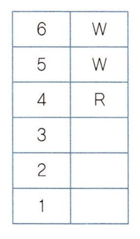

세 번째 조건과 네 번째 조건에 의하여 상자 1~3 중에 B와 W가 있으므로, W가 3개 이상이고 R이 2개 이하가 되어 두 번째 조건을 만족시키지 못한다. 따라서 이 경우는 가능하지 않다.

ii) 상자 5와 상자 6이 모두 B인 경우

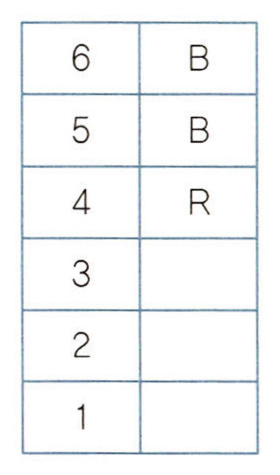

세 번째 조건과 네 번째 조건에 의하여 상자 1~3 중에는 B와 W가 있다. 상자 4~6 중에서 R이 1개이므로, 상자 1~3 중에 W가 있다는 사실과 두 번째 조건에 의하여 상자 1~3 중에는 R도 있다. 따라서 상자 1~3 중에는 R, B, W가 1개씩 있다. 세 번째 조건에 의하여 상자 1은 R이 아니다. 만약 상자 2가 R이면 세 번째 조건에 의하여 상자 1이 B이고 이 경우 네 번째 조건을 충족하지 못하므로, 상자 2도 R이 아니다. 따라서 상자 3이 R이다. 세 번째, 네 번째 조건에 의해 상자 2는 B, 상자 1은 W이다.

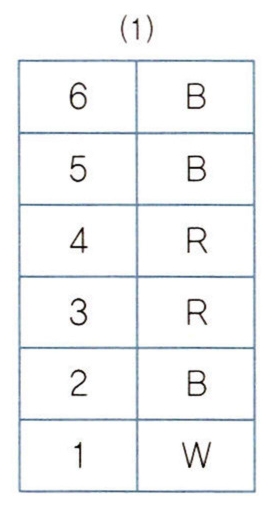

iii) 상자 5와 상자 6이 모두 R인 경우

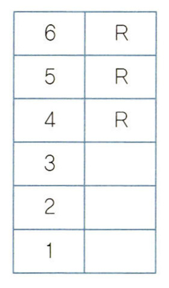

네 번째 조건에 의하여 상자 1~3 중에는 B 바로 아래 W가 있는 B와 W가 있다. 따라서 상자 3에 B가 있고 상자 2에 W가 있거나, 상자 2에 B가 있고 상자 1에 W가 있는 것이 가능하다.

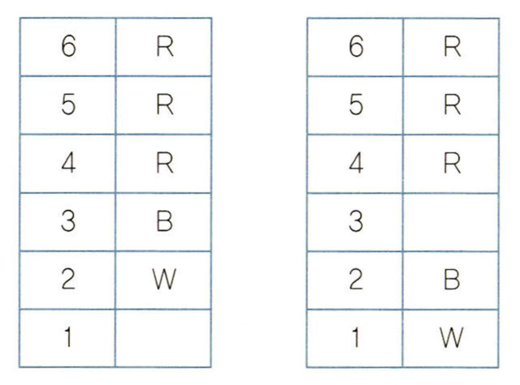

위의 왼쪽 그림에서, 세 번째 조건에 의하여 상자 1은 R이 아니다. 오른쪽 그림의 상자 3은 R, B, W 모두 가능하다. 왼쪽 그림에서든 오른쪽 그림에서든, R이 3개 이상이고 W가 2개 이하이므로 두 번째 조건을 충족한다. 따라서 상자 5와 상자 6이 모두 R이면 다음과 같은 경우들만이 가능하다.

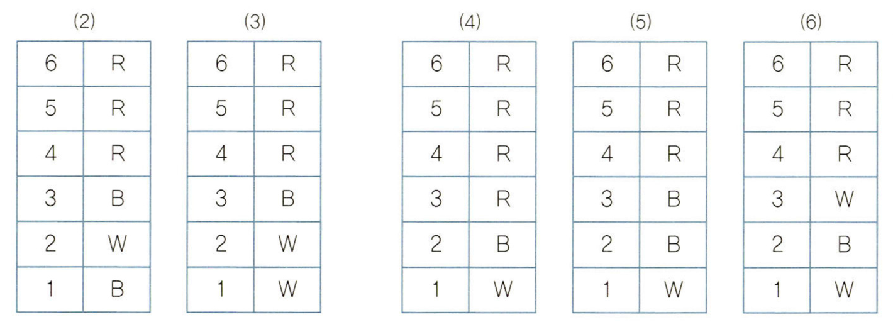

### 선택지별 해설

(1) (2)의 경우에는 상자 1이 파란 상자이다. (1)은 옳지 않은 추론이다.

(2) (1)의 경우에는 상자 2와 상자 5가 모두 파란 상자여서 색깔이 같다. (2)는 옳지 않은 추론이다.

(3) 상자 3이 빨간 상자인 것은 (1)과 (4)의 경우인데, (1)의 경우에는 파란 상자가 3개이다. (3)은 옳지 않은 추론이다.

(4) (3)과 (6)의 경우에는 하얀 상자의 개수가 파란 상자의 개수보다 많고, (4)의 경우에는 파란 상자의 개수와 하얀 상자의 개수가 같다. (4)는 옳지 않은 추론이다.

(5) 하얀 상자 아래 파란 상자가 있으면 (2) 또는 (6)의 경우이다. 두 경우 모두 빨간 상자는 3개이다. (5)는 옳은 추론이다.

## 33

### 문항구분

* 문항 성격 : 문항유형 : 모형 추리 / 내용영역 : 논리학ㆍ수학

* 평가 목표 : 이 문항은 주어진 조건과 상황으로부터 가능한 경우를 추론하는 능력을 평가하는 문항이다.

### 제시문 해설

* 정답 : (2)

첫 번째 조건으로부터, 재무팀의 갑, 을, 병이 받은 등급으로 가능한 것 중에서는 A등급 1명과 B등급 2명이 최고임을 알 수 있다. 따라서 재무팀 직원들이 받은 성과급의 총액은 정이 받은 500만 원을 포함하여 최대 5,500만(=2,000만+1,500만+1,500만+500만) 원임을 알 수 있다. 두 번째 조건으로부터 홍보팀의 기, 경, 신은 B등급 또는 C등급을 받았음을 알 수 있다. 기, 경, 신이 모두 B등급을 받았다면 홍보팀 직원들이 받은 성과급의 총액은 무가 받은 2,000만 원을 포함하여 6,500만(=2,000만+1,500만+1,500만+1,500만) 원이고, 기, 경, 신이 모두 C등급을 받았다면 홍보팀 직원들이 받은 성과급의 총액은 5,000만(=2,000만+1,000만+1,000만+1,000만) 원이다. 즉 홍보팀 직원들이 받은 성과급의 총액은 최소 5,000만 원, 최대 6,500만 원이다. 따라서 세 번째 조건으로부터, 각 팀의 성과급 총액은 최소 5,000만 원, 최대 5,500만 원임을 알 수 있는데, 각 등급에 따른 성과급이 모두 500만 원의 배수이므로 각 팀의 성과급 총액도 500만 원의 배수이고, 따라서 각 팀의 성과급 총액은 5,000만 원(홍보팀이 받은 성과급 총액으로 가능한 최솟값) 또는 5,500만 원(재무팀이 받은 성과급 총액으로 가능한 최댓값)이다.

(1) 5,500만 원인 경우 : 5,500만 원은 재무팀이 받은 성과급 총액으로 가능한 최댓값이므로, 갑, 을, 병은 2,000만 원, 1,500만 원, 1,500만 원을 받은 것이다(순서 무관). 또 5,500만 원은 홍보팀이 받은 성과급 총액으로 가능한 최솟값보다 500만 원이 많으므로, 기, 경, 신이 받은 성과급은 1,000만원, 1,000만 원, 1,000만 원보다 500만 원 많은 1,500만 원, 1,000만 원, 1,000만 원이다(순서 무관).

| ㉮ | 재무팀 | 재무팀 | 재무팀 | 재무팀 | 홍보팀 | 홍보팀 | 홍보팀 | 홍보팀 |
|---|---|---|---|---|---|---|---|---|
| 직원 | 갑 | 을 | 병 | 정 | 무 | 기 | 경 | 신 |
| 평가 | A, | B, | B | D | A | B, | C, | C |
| 성과급 | 2,000, | 1,500, | 1,500 | 500 | 2,000 | 1,500, | 1,000, | 1,000 |

(2) 5,000만 원인 경우 : 5,000만 원은 재무팀이 받은 성과급 총액으로 가능한 최댓값보다 500만 원이 적으므로, 갑, 을, 병이 받은 성과급은 2,000만 원, 1,500만 원, 1,500만 원보다 500만 원 적은 금액이다. 따라서 갑, 을, 병은 2,000만 원, 1,500만 원, 1,000만 원(순서 무관) 또는 1,500만 원, 1,500만 원, 1,500만 원을 받은 것이다. 또 5,500만 원은 홍보팀이 받은 성과급 총액으로 가능한 최솟값이므로, 기, 경, 신은 1,000만 원, 1,000만 원, 1,000만 원을 받은 것이다.

| ㉯ | 재무팀 | 재무팀 | 재무팀 | 재무팀 | 홍보팀 | 홍보팀 | 홍보팀 | 홍보팀 |
|---|---|---|---|---|---|---|---|---|
| 직원 | 갑 | 을 | 병 | 정 | 무 | 기 | 경 | 신 |
| 평가 | A, | B, | C | D | A | C, | C, | C |
| 성과급 | 2,000, | 1,500, | 1,000 | 500 | 2,000 | 1,000, | 1,000, | 1,000 |

| ㉰ | 재무팀 | 재무팀 | 재무팀 | 재무팀 | 홍보팀 | 홍보팀 | 홍보팀 | 홍보팀 |
|---|---|---|---|---|---|---|---|---|
| 직원 | 갑 | 을 | 병 | 정 | 무 | 기 | 경 | 신 |
| 평가 | B, | B, | B | D | A | C, | C, | C |
| 성과급 | 1,500, | 1,500, | 1,500 | 500 | 2,000 | 1,000, | 1,000, | 1,000 |

### <보기> 해설

ㄱ. 홍보팀에 지급한 성과급의 총액은 5,500만 원일 수도 있다. ㄱ은 옳지 않은 추론이다.

ㄴ. 갑이 C등급을 받은 경우는 ㉯의 경우뿐이고, 이 경우에서 기, 경, 신은 C등급을 받았으므로 모두 같은 등급이다. ㄴ은 옳은 추론이다.

ㄷ. ㉰의 경우에는 B등급을 받은 사람도 3명이고 C등급을 받은 사람도 3명이다. ㄷ은 옳지 않은 추론이다.

<보기>의 ㄴ만이 옳은 추론이므로 정답은 (2)이다.

## 34

### 문항구분

* 문항 성격 : 문항유형 : 모형 추리 / 내용영역 : 논리학ㆍ수학

* 평가 목표 : 이 문항은 주어진 조건으로부터 진술의 참 또는 거짓을 판단하고 가능한 경우를 추론하는 능력을 평가하는 문항이다.

### 제시문 해설

* 정답 : (2)

을의 진술과 정의 진술은 동시에 참이 될 수 없으므로, 을의 진술은 거짓이고 정의 진술은 참이거나 정의 진술은 거짓이고 을의 진술은 참이며, 갑의 진술과 병의 진술은 참이다. 갑의 진술과 병의 진술에 의하여 갑의 차와 병의 차가 주차된 칸은 다음과 같다.

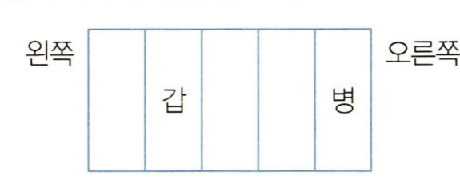

i) 을의 진술이 거짓이고 정의 진술이 참인 경우

정의 차는 갑의 차 바로 옆에 주차되어 있고 그 바로 옆에는 무의 차가 주차되어 있으므로, 정의 차와 무의 차가 주차된 칸을 나타내면 다음과 같다.

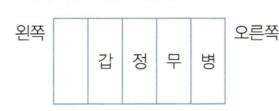

마지막으로 을의 차는 가장 왼쪽 칸에 주차되어 있음을 알 수 있다.

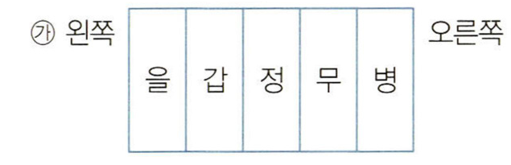

ii) 정의 진술이 거짓이고 을의 진술이 참인 경우

을의 차 바로 옆에 정의 차가 주차되어 있으므로 을의 차가 주차된 칸은 가장 왼쪽 칸이 아니다. 을의 차와 정의 차가 주차된 칸을 나타내면 다음 둘 중 하나이다.

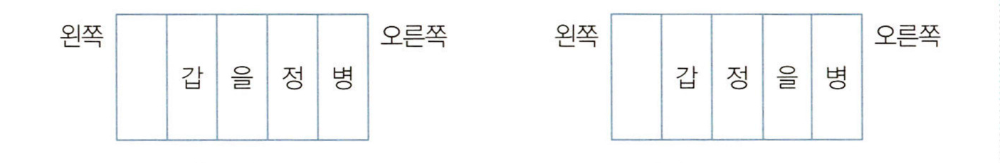

마지막으로 무의 차는 가장 왼쪽 칸에 주차되어 있음을 알 수 있다.

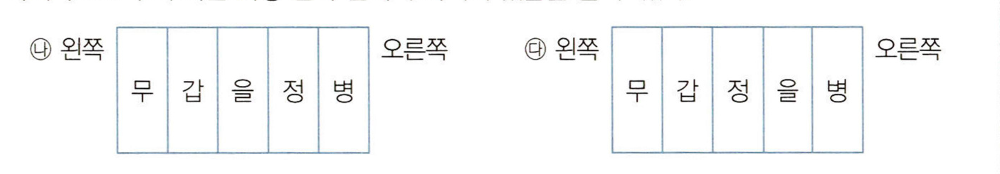

### <보기> 해설

ㄱ. ㉰의 경우에는 정의 진술이 거짓인데도 갑의 차 바로 옆 칸에 정의 차가 주차되어 있다. ㄱ은 옳지 않은 추론이다.

ㄴ. 을과 병 중 한 명의 진술이 거짓인 경우는 을의 진술이 거짓인 경우이다. 을의 진술이 거짓이고 정의 진술이 참인 경우(㉮)에는 을의 차가 가장 왼쪽 칸에 주차되어 있다. ㄴ은 옳은 추론이다.

ㄷ. ㉯의 경우에는 거짓을 진술한 사람이 정인데, 정의 차와 무의 차 사이에 한 대의 차만 주차되어 있다. ㄷ은 옳지 않은 추론이다.

<보기>의 ㄴ만이 옳은 추론이므로 정답은 (2)이다.

## 35

### 문항구분

* 문항 성격 : 문항유형 : 논쟁 및 반론 / 내용영역 : 과학기술

* 평가 목표 : 이 문항은 인공지능 프로그램의 한국어 능력과 한국어 원어민의 한국어 능력에 차이가 있는지에 관한 논쟁을 올바르게 분석할 수 있는 능력을 평가하는 문항이다.

### 제시문 해설

* 정답 : (4)

갑은 컴퓨터 프로그램 X의 한국어 능력에는 한국어의 의미 이해가 빠졌다고 주장한다. 을에 따르면, 숫자의 의미를 이해하지 못하는 신경 프로그램의 수학적 능력과 인간의 수학적 능력에 별 차이가 없는 것처럼 한국어의 의미를 이해하지 못하는 X의 한국어 능력과 인간의 한국어 능력 사이에도 별 차이가 없다. 병에 따르면, 언어의 의미를 이해한다는 것은 사용 중인 단어나 문장의 지시적 의미에 맞게 행동한다는 것이므로 그렇게 행동할 수 있는 로봇 R의 한국어 능력과 인간의 한국어 능력은 같다.

### <보기> 해설

ㄱ. 갑은 로이가 한국어 단어나 문장이 연속적으로 관계하는 것을 아무리 잘 외워도 한국어의 의미를 이해할 수 없다고 주장한다. 로이가 실제 감자를 보고 한국어 기호 '감자'를 떠올리려면 그 기호의 의미를 이해해야 한다. 그러므로 갑에 따르면 로이가 실제 감자를 보더라도 '감자'라는 기호를 떠올리지 못할 것이다. ㄱ은 옳지 않은 추론이다.

ㄴ. 을은, X와 한국어 원어민은 한국어 능력에서 근본적으로 같다고 주장한다. R는 X를 설치한 로봇이므로, ㄴ은 옳은 추론이다.

ㄷ. 갑은 X가 한국어의 의미를 이해하지 못하여 X와 한국어 원어민은 한국어 능력에서 근본적인 차이가 있다고 주장한다. 을은 다음과 같은 유비 논증을 펼친다. 신경 프로그램은 숫자의 의미를 이해하지 못하지만, 신경 프로그램의 수학적 능력과 인간의 수학적 능력은 본질적으로 같다. X와 신경 프로그램은 같은 방식으로 작동하므로, X의 한국어 능력에도 의미 이해가 빠져 있지만 X의 한국어 능력과 한국어 원어민의 한국어 능력은 근본적으로 같다. 즉 을도 X가 한국어의 의미를 이해하지 못한다는 데 동의한다. ㄷ은 옳은 추론이다.

<보기>의 ㄴ, ㄷ만이 옳은 추론이므로 정답은 (4)이다.

## 36

### 문항구분

* 문항 성격 : 문항유형 : 언어 추리 / 내용영역 : 과학기술

* 평가 목표 : 이 문항은 DNA 분석을 통해 용의자가 범인일 가능정도가 어떻게 계산되는지 설명하는 글로부터 옳게 추론할 수 있는 능력을 평가하는 문항이다.

### 제시문 해설

* 정답 : (4)

제시문의 핵심 내용을 정리하면 다음과 같다.

(1) 범죄현장에 남겨진 범인의 DNA와 용의자의 DNA가 일치할 때 그 용의자가 범인일 가능정도 = 용의자가 범인일 때 DNA가 일치할 확률($R$) / 용의자가 범인이 아닐 때 DNA가 일치할 확률($Q$)

(2) 범죄현장에 남겨진 범인의 DNA가 용의자의 것임을 전제로 하여 $R$를 1로 보게 된다면, 그 가능정도는 1/$Q$이며, $Q$가 1/1,000이면 1/$Q$=1,000이다. 흔히 이런 계산만으로 '용의자가 범인일 확률이 아닐 확률의 1,000배'라고 말하지만, 범죄현장의 DNA가 용의자의 것이라는 전제하에 얻은 결과이므로 이처럼 단정할 수 없다. 이를 보정하기 위해 사전가능정도를 알아야 한다.

(3) 사전가능정도 = (DNA 분석 이외의 범죄 정보에 따라) 용의자가 범인일 확률 / 용의자가 범인이 아닐 확률

(4) 사후가능정도(사전가능정도를 반영한 용의자가 범인일 가능정도) = DNA 분석 결과를 반영한 용의자가 범인일 확률 / DNA 분석 결과를 반영한 용의자가 범인이 아닐 확률 = 사전가능정도 × 1/$Q$

### <보기> 해설

ㄱ. '그 범죄현장의 (범인의) DNA가 용의자의 것일 확률'은 '용의자가 범인일 확률'을 의미하고 '그 범죄현장의 DNA가 용의자의 것이 아닐 확률'은 '용의자가 범인이 아닐 확률'을 의미한다. 따라서 ㄱ은 '$Q$가 1/10,000일 때, 범죄현장에 남겨진 범인의 DNA와 용의자의 DNA가 일치한다면 용의자가 범인일 확률은 아닐 확률의 10,000배이다.'를 의미한다. 제시문에서 $Q$값만으로 용의자가 범인일 확률이 아닐 확률의 몇 배라고 말할 수 없고, 사전가능정도를 알아야 이를 알 수 있다고 하였다. ㄱ에서 사전가능정도에 대한 정보가 주어져 있지 않으므로 ㄱ은 옳지 않은 추론이다.

ㄴ. 제시문에서 '사후가능정도 = 사전가능정도 × 1/$Q$'로 계산할 수 있는데, 용의자의 DNA가 범죄현장에 남겨진 DNA와 일치하더라도 사전가능정도가 0이면 사후가능정도가 0이 된다. 범행 시각에 용의자가 범행 장소가 아닌 다른 장소에 있었고 이것이 사실로 입증된 경우 사전가능정도(즉, 용의자가 범인이 아닐 확률에 대한 범인일 확률)는 0이 될 수 있으므로, 사후가능정도도 0이 될 수 있다. 따라서 ㄴ은 옳은 추론이다.

ㄷ. '사후가능정도 = 사전가능정도 × 1/$Q$'이다. 따라서 사전가능정도가 1/100이고 $Q$가 1/1,000인 경우 사후가능정도는 10이므로, '용의자가 범인일 확률은 범인이 아닐 확률의 10배'라고 말할 수 있다. 따라서 ㄷ은 옳은 추론이다.

<보기>의 ㄴ, ㄷ만이 옳은 추론이므로 정답은 (4)이다.

## 37

### 문항구분

* 문항 성격 : 문항유형 : 논증 평가 및 문제해결 / 내용영역 : 과학기술

* 평가 목표 : 이 문항은 특정한 수학 모형이 적용될 경우 단어의 의미를 확장할 수 있다는 논증을 이해하고, 새로운 정보가 그 논증을 강화하는지 약화하는지 판단하는 능력을 평가하는 문항이다.

### 제시문 해설

* 정답 : (2)

단어 '잡아먹다'의 의미를 과학적 증거에 호소하여 반직관적으로 확장할 수 있다는 논증을 다루고 있다. 수학 모형 M은 특정 지역에 사는 상어와 대구의 개체군 크기 변화 관계를 예측하기 위해 만들어졌으며 실제로 이 예측은 성공적이었다. 따라서 M은 상어가 대구를 잡아먹는 현상에 관한 모형으로 볼 수 있다. 그런데 수학 모형 M은 상어와 대구의 개체군 크기 변화뿐만 아니라, 기생식물인 겨우살이와 참나무의 개체군 크기 변화 관계도 성공적으로 예측한다는 것이 밝혀졌다. 그렇다면 상어와 대구 사이의 관계에 대한 해석은 겨우살이와 참나무 사이의 관계에도 일관되게 적용되어야 한다. M의 적용이 상어 사례에서 겨우살이 사례로 확장된다는 사실은 단어 '잡아먹다'의 의미를 입과 소화기관이 없는 겨우살이에도 확장할 수 있다는 과학적 근거가 된다.

### <보기> 해설

ㄱ. 제시문에 따르면 직관은 단어의 의미를 결정하는 의미론적 근거로 부적합하다. 직관이 제시문의 과학적 근거보다 더 좋은 의미론적 근거인 이유를 제시하면 이 논증은 약화될 수 있다. 그러나 '입 없이 먹이를 몸 안으로 흡수하는 생물의 행동에 대한 일상적 설명에는 단어 '잡아먹다'가 잘 쓰이지 않는다는 사실'은 직관이 과학적 근거보다 더 좋은 의미론적 근거인 이유를 제시하지 않고 있다. ㄱ은 옳지 않은 평가이다.

ㄴ. 입과 소화기관이 없는 (하지만 그것과 유사한 구조를 가진) 식충식물에 대해서 '잡아먹다'라는 표현이 일상적으로 사용된다는 사실은 '잡아먹다'를 입과 소화기관이 없는 대상에게 사용할 수 있다는 직관적 근거를 제공한다. 그러나 이 직관적 근거는 이 논증에서 제시된 입과 소화기관이 없는 대상에게 '잡아먹다'를 사용해도 되는 과학적 근거와는 상관이 없으므로, 이 논증을 약화하지 않는다. ㄴ은 옳지 않은 평가이다.

ㄷ. 박테리아와 사람 사이의 관계에 M이 잘 적용되어, "크기가 작은 박테리아가 사람을 잡아먹는다"는 진술이 생물학자들 사이에 일반적으로 사용되기 시작한다는 것은, 'M이 상어 사례뿐만 아니라 다른 대상 사례에도 잘 적용된다면, 이것은 단어 '잡아먹다'를 그 다른 대상에게도 사용할 수 있다는 과학적 근거이다'라는 주장에 일치하는 사례이므로, 이 논증을 강화한다. ㄷ은 옳은 평가이다.

<보기>의 ㄷ만이 옳은 평가이므로 정답은 (2)이다.

## 38

### 문항구분

* 문항 성격 : 문항유형 : 언어 추리 / 내용영역 : 과학기술

* 평가 목표 : 이 문항은 비열과 열용량의 개념을 이해하고 개별 사례에 적용하여 옳은 결론을 도출할 수 있는 능력을 평가하는 문항이다.

### 제시문 해설

* 정답 : (4)

같은 질량의 물질 A와 물질 B에 대해, 물질 A의 비열이 물질 B보다 크다는 것은 같은 온도만큼 높이기 위해 물질 A가 물질 B보다 더 많은 열량을 필요로 한다는 의미이므로, 두 물질에 같은 열량을 공급하거나 같은 열량을 제거할 때 물질 A의 온도 변화가 더 작다는 의미도 된다.

### <보기> 해설

ㄱ. 체온을 낮춘다는 것은 열량을 빼앗는다는 말이다. 주머니 속 물질의 비열이 클수록, 사람에게서 같은 열량을 빼앗을 때 온도가 덜 높아지므로, 물질의 온도가 천천히 올라가게 된다. 따라서 사람에게서 더 많은 열량을 빼앗을 수 있고, 체온을 더 낮출 수 있다. ㄱ은 옳지 않은 추론이다.

ㄴ. 제시문의 "상온과 상압에서 물이 끓기 시작할 때까지 약 16분이 걸린다면 같은 질량의 철을 같은 온도만큼 높이는 데는 2분 정도밖에 걸리지 않는다. 은이라면 1분이 채 걸리지 않는다."로부터, 같은 크기의 온도 상승(상온에서 100℃까지)을 위해 물이 16분 동안의 열량 공급이 필요하다면 같은 질량의 철은 2분, 은은 1분 미만 동안의 열량 공급이 필요하다는 것을 알 수 있다. 따라서 같은 크기의 온도 상승을 위해 필요한 열량이 물 > 철 > 은 순이라는 것을 추론할 수 있으며, 이에 20℃에서 가열하여 30℃에 이르렀을 때 공급된 열량이 가장 적은 것부터 순서대로 나열하면 은, 철, 물이다. ㄴ은 옳은 추론이다.

ㄷ. 질량이 같을 때 같은 크기의 온도 상승을 위해 물은 은보다 약 16배 더 많은 열량 공급이 필요하므로, 물의 비열이 은의 비열의 약 16배라는 것을 추론할 수 있다. 열용량은 어떤 물체의 온도를 1℃ 높이는 데 필요한 열량이므로, 하나의 물질로 이루어진 물체의 열용량은 '비열 × 질량'이다. 물의 비열이 은의 비열에 비해 16배 더 크므로, 물 100g의 비열은 은 1.5kg의 비열의 약 16배이고 은 1.5kg의 질량은 물 100g의 질량의 15배이므로, 물 100g의 열용량이 은 1.5kg의 열용량보다 크다. ㄷ은 옳은 추론이다.

<보기>의 ㄴ, ㄷ만이 옳은 추론이므로 정답은 (4)이다.

## 39

### 문항구분

* 문항 성격 : 문항유형 : 언어 추리 / 내용영역 : 과학기술

* 평가 목표 : 이 문항은 가속도의 개념을 이해하여 개별 사례에서 옳은 결론을 도출할 수 있는 능력을 평가하는 문항이다.

### 제시문 해설

* 정답 : (1)

제시문의 '나'는 시간에 따른 물체의 이동 거리를 측정함으로써 물체의 가속도를 구할 수 있다는 것을 설명하고 있으며, 이렇게 구한 낙하물의 (중력)가속도가 지구의 중력가속도 값과 다르다는 점을 서술하고 있다. 이를 통해서 '나'가 있는 곳은 지구가 아니라는 결론에 도달하게 된다. 제시문 마지막 단락에 따르면 거리는 가속도의 2분의 1에 시간의 제곱을 곱한 값이므로, 거리는 가속도에 비례하고 시간의 제곱에도 비례한다. '나'가 있는 '이 방'에서의 중력가속도를 구해 보면, 1m = 중력가속도 ÷ 2 × 0.4초²이므로 중력가속도 = 2m ÷ 0.16초 = 12.5m/s²이다. '이 방'의 중력가속도가 지구의 중력가속도보다 크므로 '이 방'은 지구보다 중력이 큰 곳이다.

### <보기> 해설

ㄱ. 거리는 가속도의 2분의 1에 시간의 제곱을 곱한 값이므로, 가속도가 같을 때 거리가 두 배가 되면 시간의 제곱도 두 배가 된다. 시간의 제곱이 두 배가 되는 것이므로 시간은 두 배보다 작은 값이 된다. 따라서 거리가 두 배인 2m가 되면 낙하 시간은 두 배인 0.8초보다 짧게 측정됐을 것이다. ㄱ은 옳지 않은 추론이다.

ㄴ. 만약 '이 방'이 지구 표면에 정지해 있다면, '이 방'의 중력가속도는 지구의 중력가속도인 9.8m/s²이 되어 제시문에서보다 작은 값을 갖게 된다. 거리가 같을 때 가속도는 시간의 제곱에 반비례하므로, 중력가속도가 더 작은 곳에서 시험관을 떨어뜨리는 동일한 실험을 하면 시간의 제곱은 커지고 따라서 떨어지는 시간이 더 길어진다. ㄴ은 옳은 추론이다.

ㄷ. 용수철저울을 사용해서 측정한 것은 질량이 아니라 무게이다. 사람의 몸을 포함하여 물체의 질량은 중력가속도에 관계없이 일정하지만, 무게는 중력가속도에 비례하여 변한다. '이 방'의 중력가속도는 지구의 중력가속도와 다르므로 '이 방'에서 재는 무게는 지구에서 재는 무게와 달라진다. ㄷ은 옳지 않은 추론이다.

<보기>의 ㄴ만이 옳은 추론이므로 정답은 (1)이다.

## 40

### 문항구분

* 문항 성격 : 문항유형 : 언어 추리 / 내용영역 : 과학기술

* 평가 목표 : 이 문항은 투명전극의 성능지수, 투과율, 면저항에 관한 설명 및 이에 근거한 표를 이해하여 투명전극의 성질에 관한 올바른 추론을 할 수 있는 능력을 평가하는 문항이다.

### 제시문 해설

* 정답 : (3)

투명전극의 성능지수는 투과율이 클수록, 그리고 면저항이 작을수록 커진다. 그런데 투과율과 면저항은 서로 양의 상관관계를 갖기 때문에 두 성질을 적절하게 조합하는 것이 필요하다. 예를 들어 투명전극의 두께가 두꺼워짐에 따라 투명전극의 투과율과 면저항은 동시에 떨어지게 된다.

### <보기> 해설

ㄱ. 투명전극의 두께가 두꺼워질수록 $T$는 지속적으로 줄어들고 $T$와 $R_s$는 양의 상관관계를 갖고 있으므로, 투명전극의 두께가 두꺼워질수록 $R_s$는 지속적으로 줄어든다. 따라서 투명전극의 두께가 얇아지면 $R_s$는 커진다. ㄱ은 옳은 추론이다.

ㄴ. $\Phi = T^{10}/R_s$이므로, $T$가 같을 때는 $\Phi$가 크다면 $R_s$는 작다. 두께가 9nm인 M1의 $\Phi$값은 11이고 두께가 9nm인 M2의 $\Phi$값은 3이다. M1의 $\Phi$값이 M2의 $\Phi$값보다 크기 때문에 M1의 $R_s$값은 M2의 $R_s$값보다 작다는 것을 알 수 있다. M1의 저항이 M2의 저항보다 작으므로 M1이 M2보다 전기가 잘 통한다. ㄴ은 옳지 않은 추론이다.

ㄷ. 가장 성능 좋은 투명전극 물질은 바로 성능지수 $\Phi$가 가장 큰 물질이다. 표의 측정값에 한정할 경우, 30nm 미만에서는 M3의 성능지수가 가장 크고(9nm일 때 35), 30nm 이상에서는 M4의 성능지수가 가장 크다(58nm일 때 504). 따라서 가장 성능 좋은 투명전극 물질은 두께 30nm 미만에서는 M3, 30nm 이상에서는 M4이다. ㄷ은 옳은 추론이다.

<보기>의 ㄱ, ㄷ만이 옳은 추론이므로 정답은 (3)이다.

