# 출제방향

## 1. 출제의 기본방향

법학적성의 중요한 기준 중 하나는 추리와 논증 능력이다. 이 능력을 평가하기 위해 추리논증 문항 출제의 기본 방향은 제시문의 제재나 문항의 구조, 질문의 방식 등을 다양화하고 수험생의 이해 능력, 추리 능력, 비판 능력을 골고루 측정하는 완성도 있는 문항을 제시하는 것이다. 이 기본 방향은 이번 시험에서도 그대로 유지되도록 하였다. 이번 출제의 기본 방향을 요약하면 다음과 같다.

첫째, 제시문의 다양성. 추리 능력을 측정하는 문항과 논증 분석 및 평가 능력을 측정하는 문항을 규범, 인문, 사회, 과학기술의 각 영역 모두에서 균형 있게 출제하였다. 제재의 측면에서 전 학문 분야 및 일상적ㆍ실천적 영역에 걸친 다양한 소재를 활용하였고, 영역 간 균형을 맞추어 전공에 따른 유ㆍ불리를 최소화하고자 하였다. 특히, 고도의 생각을 요구하는 내용의 글을 가능한 한 일상적인 맥락으로 풀어서 수험생들이 친숙하게 접근하도록 노력하였다.

둘째, 문항의 성격. 문항 풀이 과정에서 제시문의 의미, 상황, 함의를 논리적으로 분석하고 핵심 정보를 체계적으로 취합하여 종합적으로 평가할 수 있어야 문항의 정답을 고를 수 있도록 하였다. 또한 제시문의 내용이나 영역에 관한 선지식이 문제 해결에 끼치는 영향을 없애고 대학에서 정상적인 학업과 폭넓은 독서 생활을 통해 사고력을 함양한 사람이라면 충분히 해결할 수 있는 문항을 만들고자 하였다. 그러면서도 법학적성을 평가하는 데 있어 중요하면서도 새로운 소재를 활용하여 참신한 문항이 되도록 하였다.

셋째, 난이도와 가독성. 지문에서 불필요한 내용을 배제하고 제시문을 명료하게 작성함으로써 가독성을 높였다. 특히 지나치게 글자 수가 많아 결과적으로 난이도가 높게 되는 점을 지양하기 위해 글자 수를 줄여 수험생이 문제를 읽는 부담을 덜도록 하였다. 또한 난이도에 있어 법학적성을 측정하는 데 적정한 정도의 수준을 유지하도록 하였다.

## 2. 출제 범위 및 문항 구성

규범, 인문, 사회, 과학기술과 같은 학문 영역별 문항 수는 예년과 큰 차이가 없이 균형 있게 출제되었다. 규범 영역의 문항은 헌법, 민법, 형법, 행정법, 소비자법, 경쟁법, 국제사법 등을 소재로 다양화하면서도 법학지식을 측정하지 않도록 하였다. 아울러 법 개정 전후의 차이, 법 개정 순서에 따라 개정의 효력이 달라지는 점, 견해에 따른 위법성의 평가 등 종래 출제되지 않았지만 법학을 전공할 사람이 알아야 할 중요한 내용으로 출제하였다. 인문 영역의 문항은 형이상학, 언어학, 미학, 인지과학 등의 주제를 담고 있으며, 사회과학 영역에서는 경제학, 심리학, 정치학, 사회학, 행정학 등의 글이 활용되었다. 과학 영역은 생물학, 물리학, 화학 등의 소재를 활용하여 문항의 내용이 한 쪽으로 치우치지 않도록 하였다. 전체 문항에서 추리 문항과 논증 문항은 비슷한 분량으로 구성되었다.

## 3. 난이도

제시문의 이해도를 높이기 위해서 전문적인 용어는 순화하여 전공 여부에 상관없이 내용에 접근하고 이해할 수 있도록 하였다. 문제를 해결하기 위해 거쳐야 할 추리나 비판 및 평가의 단계도 지나치게 복잡해지지 않도록 하였고, 문제풀이와 관계없는 자료는 최대한 줄여 불필요한 독해의 부담이나 함정으로 난이도가 상승하는 일이 없도록 하였다. 특히 예년에 비해서 전체 글자 수를 줄임으로써 읽기에 소비되는 시간을 줄이고 좀 더 논리적 구조에 집중할 수 있도록 하였다. 아울러 지나치게 난이도를 높여 변별력에 의미가 없게 되는 점을 지양하고 문항 간 난이도에서 큰 차이가 없도록 노력하였다.

## 4. 출제 시 유의점

* 추리 문항과 논증 문항의 문항별 성격을 명료하게 하여, 문항별로 측정하고자 하는 능력을 정확히 평가할 수 있도록 하였다.
* 법학적성을 측정할 수 있는 중요하고도 새로운 소재를 발굴하면서도 학생들이 친숙하게 접할 수 있는 문항이 되도록 하였다.
* 선지식으로 문제를 풀거나 전공에 따른 유ㆍ불리가 분명한 제시문의 선택이나 문항의 출제는 지양하였다.
* 제시문을 분석하고 평가하는 데 충분한 시간을 사용할 수 있도록 글자 수를 줄이는 등 제시문의 독해부담을 줄여 주고자 하였다.
* 제시문이 전달하고자 하는 내용을 효과적으로 전달할 수 있도록 전반적인 가독성을 높이고, 문두와 선지의 내용을 최대한 명료하게 만들었다.
* 법학적성 능력을 평가하기 위하여 법학의 기본 원리를 응용한 내용을 소재로 하면서도, 문항에 나오는 개념, 진술, 논리구조, 함의 등을 이해하는 데 법학지식이 요구되지 않도록 하여 법학지식 평가를 배제하였다.
* 출제의 의도를 감추거나 오해하게 하는 질문을 피하고, 문항 및 선택지 간의 간섭을 최소화함으로써, 문항의 의도에 충실한 변별이 이루어지도록 하였다.

---

# 문항별 해설

## 01

### 문항구분

* 문항 성격 : 논쟁 및 반론
* 내용영역 : 규범
* 평가 목표 : 이 문항은 부사관과 장교의 의무복무기간 단축을 둘러싼 논쟁의 내용을 이해한 후 논증의 논거를 정확하게 이해하고 있는지, 주어진 정보가 각 견해를 강화 또는 약화하는지 판단할 수 있는 능력을 평가하는 문항이다.

* 정답 : (1)

### 제시문 해설

개정안은 부사관과 장교의 의무복무기간을 사병과 동일한 수준으로 단축하는 내용이다. 갑과 을의 논쟁의 핵심은 다음과 같다.

갑 : 지금의 의무복무기간은 국가가 장교와 부사관의 직무역량을 충분히 활용하기 위한 최소한의 기간이다.

을 : 사병과 같은 3년을 넘어 복무하게 하는 것은 장교와 부사관의 직업의 자유와 행복추구권을 과도하게 침해하는 것 같다.

갑은 개정안에 반대하는(현행 유지) 입장이며, 을은 개정안에 찬성하는(부사관과 장교의 의무복무기간을 사병과 동일한 수준으로 단축) 입장이다.

### <보기> 해설

ㄱ. 정보기술의 발달로 군의 자동화 및 첨단화가 빠르게 진행되어 직무역량 강화를 위한 시간과 비용이 예전보다 대폭 절감되었다면, 장교와 부사관의 지금의 의무복무기간이 장교와 부사관의 직무역량을 충분히 활용하기 위한 최소한의 기간이라는 갑의 견해는 약화된다고 할 수 있다. 따라서 ㄱ은 옳은 분석이다.

ㄴ. 의무복무의 이행방식에 선택권이 있다는 사실은 현재의 의무복무기간을 알고서도 자신이 선택한 것이므로 을의 견해를 약화한다고 할 수 있다. 따라서 ㄴ은 옳지 않은 분석이다.

ㄷ. 사병의 의무복무기간을 3년으로 정한 「병역법」 규정이 헌법에 반하지 않는다는 것은 의무복무제 자체가 헌법에 반하지 않는다는 것으로, 부사관과 장교의 의무복무기간의 단축 여부가 쟁점이 되는 갑과 을의 논쟁과는 무관하다. 그러므로 갑 또는 을의 견해를 강화시키거나 약화시키지 않는다. 따라서 ㄷ은 옳지 않은 분석이다.

<보기>의 ㄱ만이 옳은 분석이므로 정답은 (1)이다.

## 02

### 문항구분

* 문항 성격 : 논증 평가 및 문제해결
* 내용영역 : 규범
* 평가 목표 : 이 문항은 학교폭력 가해학생에 대한 조치 중 전학과 퇴학에 대해서만 재심을 허용하는 개정안을 둘러싼 논쟁의 내용을 이해하여 주어진 정보가 각 견해를 강화 또는 약화하는지 판단하는 능력을 평가하는 문항이다.

* 정답 : (1)

### 제시문 해설

개정안은 학교폭력 가해학생에 대한 모든 조치에 대해 재심을 허용하는 현행 규정과 달리 전학과 퇴학에 대해서만 재심을 허용하도록 하고 있어 재심의 대상이 되는 조치의 범위가 축소되었다. 이에 대해서 <견해>는 개정안이 전학이나 퇴학 조치가 아닌 다른 조치를 받은 가해학생의 부모의 자녀교육권(학교의 불이익조치에 대한 의견 제시권)을 침해하고, 전학 또는 퇴학 조치를 받은 가해학생과 그 부모에게는 재심을 허용하지만 그 밖의 조치를 받은 가해학생과 그 부모는 재심을 허용하지 않음으로써, 그 밖의 조치를 받은 가해학생과 그 보호자를 부당하게 차별하는 결과를 초래한다는 입장이다.

### <보기> 해설

ㄱ. 재심이 허용되지 않는 조치에 대해 다른 방법을 통한 법적 구제가 가능하다면 학교로부터 불리한 조치를 받은 학생의 학부모가 재심을 통한 의견 진술의 기회가 없다고 하여도 다른 방법을 통한 법적 구제에 호소할 수 있으므로, 개정안이 학부모의 의견 제시권을 침해한다는 ㉠은 약화된다. 따라서 ㄱ은 옳지 않은 분석이다.

ㄴ. 가해학생에게 내려진 전학 또는 퇴학 조치는 다른 조치와 달리 추후 별도의 소송을 통해 번복되더라도 그 조치에 따른 가해학생의 피해가 회복 불가능하다면, 전학 또는 퇴학의 조치를 받은 가해학생의 경우는 그 이외의 다른 조치를 받은 가해학생의 경우와는 다르다. 따라서 전학 또는 퇴학 조치를 받은 가해학생에게만 재심을 허용하는 것은 합리적 이유가 있는 차별로 볼 수 있으므로, 개정안이 그 밖의 조치를 받은 가해학생과 그 보호자를 부당하게 차별하는 결과를 초래한다는 ㉡은 약화된다. 따라서 ㄴ은 옳은 분석이다.

ㄷ. 모든 가해학생에게 재심 기회를 부여하여 모범적인 사회인으로 성장할 수 있도록 하는 것이 학교와 사회의 책임이라면, 전학 또는 퇴학 조치 이외의 조치를 받은 가해학생 및 그 부모에게도 재심 기회를 부여해야 한다는 것이므로 개정안이 학부모의 의견 제시권을 침해한다는 ㉠은 약화되지 않는다. 따라서 ㄷ은 옳지 않은 분석이다.

<보기>의 ㄴ만이 옳은 분석이므로 정답은 (1)이다.

## 03

### 문항구분

* 문항 성격 : 언어 추리
* 내용영역 : 규범
* 평가 목표 : 이 문항은 담합은 위법한 반경쟁적 행위인지 여부를 판단함에 있어 위법성의 정도가 낮은 경우를 옳게 판단할 수 있는 능력을 평가하는 문항이다.

* 정답 : (5)

### 제시문 해설

제시문의 핵심 내용은 다음과 같다.

담합행위의 위법성의 평가는 여러 가지 요소를 종합적으로 고려하여 판단하게 되는데, 시장 환경의 변화에 따라 서비스업에서 종전에 비하여 경쟁이 심해진 경우, 서비스의 질적 저하를 막기 위해 가격을 담합한 경우, 그리고 담합을 규제한 결과로 이용자가 부담하는 가격이 상승하여 이용자에게 더 불리하게 작용하는 경우 등에는 위법성이 낮다고 평가한다.

### <보기> 해설

ㄱ. 최저수임료 이하로 수임료가 낮아지는 경우에 서비스의 질적 하락이 가격의 하락보다 더 큰 폭으로 발생한다면, ㉠은 서비스의 질적 저하를 막기 위해 가격을 담합한 경우에 해당하므로 ㉠에 의한 담합은 위법성의 정도가 낮다고 평가할 것이다. 따라서 ㄱ은 옳은 추론이다.

ㄴ. 규제에 의해 변호사들이 성공보수약정 담합을 포기하는 경우에 그 약정금액이 승소와 관계없이 의뢰인이 부담하는 수임료로 전부 전가된다면, 이 경우는 담합을 규제한 결과로 이용자가 부담하는 가격이 상승하여 이용자에게 더 불리하게 작용하는 경우에 해당하여 ㉡에 의한 담합은 위법성의 정도가 낮다고 평가할 것이다. 따라서 ㄴ은 옳은 추론이다.

ㄷ. X국 정부가 종전의 제도를 변경하여 변리사도 관련 업무에 대한 국내 소송사건을 수임할 수 있게 한다면, 시장 환경의 변화에 따라 변호사업에서 종전에 비하여 경쟁이 심해진 경우에 해당하여, ㉠과 ㉡에 의한 담합은 모두 위법성의 정도가 낮다고 평가할 것이다. 따라서 ㄷ은 옳은 추론이다.

<보기>의 ㄱ, ㄴ, ㄷ 모두 옳은 추론이므로 정답은 (5)이다.

## 04

### 문항구분

* 문항 성격 : 언어 추리
* 내용영역 : 규범
* 평가 목표 : 이 문항은 고려시대와 조선시대에 우리나라에서 통용되었던 대명률(大明律)의 규정을 변형하여 제시하고 그것을 가상의 사례에 옳게 적용할 수 있는 능력을 평가하는 문항이다.

* 정답 : (3)

### 제시문 해설

[규칙]은 대명률의 규정을 변형하여 제시한 것이다.

### 선택지별 해설

(1) 갑은 내란죄를 범한 죄인이다. 내란죄를 범한 죄인은 사형에 처하고 그 배우자는 유배하므로([규칙] (1) 참조), 갑은 사형에 처하고 갑의 배우자는 유배한다. 그런데 내란죄를 범한 죄인에 대하여 사면이 선포되면 죄인은 유배형에 처하고 그 배우자는 자원하지 않더라도 죄인과 함께 같은 곳에 유배한다([규칙] (3), (4) 참조). 그러므로 갑의 배우자는 자원하지 않더라도 갑과 함께 같은 곳에 유배된다. (1)은 갑의 배우자는 자원하지 않으면 갑과 함께 유배되지 않는다고 기술하고 있으므로 옳지 않은 진술이다.

(2) 을은 살인죄를 범한 죄인이다. 살인죄를 범한 죄인은 사형에 처하고 그 배우자는 유배하므로([규칙] (1) 참조), 을은 사형에 처하고 을의 배우자는 유배한다. 그런데 살인죄를 범한 죄인에 대하여 사면이 선포되면 죄인은 유배형에 처하고 그 배우자는 자원하면 죄인과 함께 같은 곳에 유배한다([규칙] (3), (4) 참조). 그러므로 을의 배우자는 자원하면 을과 함께 같은 곳에 유배된다. (2)는 을의 배우자는 자원하지 않더라도 을과 같은 곳에 유배된다고 기술하고 있으므로 옳지 않은 진술이다.

(3) 병은 살인죄를 범한 죄인이다. 살인죄를 범한 죄인은 사형에 처하고 그 배우자는 유배하므로([규칙] (1) 참조), 병은 사형에 처하고 병의 배우자는 유배한다. 그런데 살인죄를 범한 죄인에 대하여 사면이 선포되면 죄인은 유배형에 처하고 그 배우자는 자원하면 죄인과 함께 같은 곳에 유배한다([규칙] (3), (4) 참조). <사례>에 따르면 유배형에 처해진 병에게 추가로 사면이 선포되었다. 유배형에 처한 죄인은 사면이 선포되면 석방하는데, 그 죄인이 유배지로 이송되던 중이면 함께 이송되던 배우자도 석방한다([규칙] (6) 참조). (3)은 병의 배우자는 병과 함께 유배지로 이송되던 중이었다면 석방된다고 기술하고 있으므로 옳은 진술이다.

(4) 정은 강도죄를 범한 죄인이다. 강도죄를 범한 죄인은 유배형에 처하고 그 배우자는 자원하면 죄인과 함께 같은 곳에 유배한다([규칙] (2), (4) 참조). 그런데 유배형에 처한 죄인은 사면이 선포되면 석방하는데, 그 죄인이 유배지로 이송되던 중이면 함께 이송되던 배우자도 석방한다. 그러나 유배지로 이송되던 중 도망한 죄인에 대하여 선포된 사면은 죄인과 그 배우자에게 효력이 없다([규칙] (6) 참조). 유배지로 이송되던 죄인이 도망하더라도 함께 이송되던 배우자는 계속 이송한다([규칙] (5) 참조). 그러므로 정의 배우자는 자원하여 정과 함께 유배지로 이송되던 중이었더라도 석방될 수 없다. (4)는 정의 배우자는 자원하여 정과 함께 유배되었다면 석방된다고 기술하고 있으므로 옳지 않은 진술이다.

(5) 무는 강도죄를 범한 죄인이다. 강도죄를 범한 죄인은 유배형에 처하고 그 배우자는 자원하면 죄인과 함께 같은 곳에 유배한다([규칙] (2), (4) 참조). 그런데 유배형에 처한 죄인은 사면이 선포되면 석방하는데, 그 죄인이 유배지로 이송되던 중이면 함께 이송되던 배우자도 석방한다. 그러나 유배지로 이송되던 중 도망한 죄인에 대하여 선포된 사면은 죄인과 그 배우자에게 효력이 없다([규칙] (6) 참조). 유배지로 이송되던 죄인이 도망하더라도 함께 이송되던 배우자는 계속 이송한다([규칙] (5) 참조). 다만, 사면이 선포되기 전에 유배지로 이송되던 중 도망한 죄인이 사면이 선포된 후에 사망한 것으로 확인되는 경우 자원하여 유배된 배우자는 석방된다([규칙] (7) 참조). 그러므로 무의 배우자는 석방된다. (5)는 무의 배우자는 무와 함께 유배되었더라도 석방되지 않는다고 기술하고 있으므로 옳지 않은 진술이다.

## 05

### 문항구분

* 문항 성격 : 논증 분석
* 내용영역 : 규범
* 평가 목표 : 이 문항은 의사결정에 의해 체결된 계약의 내용통제의 정당화 사유에 대한 정확한 이해를 기초로 하여 <주장>을 올바르게 평가할 수 있는 능력을 측정하는 문항이다.

* 정답 : (1)

### 제시문 해설

각 주장의 핵심 내용은 다음과 같다.

A : 이 주장은 계약통제의 정당화 사유를 정보비대칭에서 찾는다. 정보비대칭으로 인한 시장실패가 결국 제품의 질적 저하라는 위험을 가져오며, 그 위험은 계약당사자 중 정보의 열위에 있는 자가 모두 부담하기 때문에 계약을 통제해야 한다고 주장한다.

B : 이 주장은 계약통제의 정당화 사유를 역학적 불균형으로부터 계약당사자를 보호하는 것에서 찾는다. 역학적 불균형이 존재하는 경우에는 계약당사자 일방의 자기결정권만이 보장되므로 계약을 통제해야 한다고 주장한다.

### <보기> 해설

ㄱ. A에 의하면, 성년자 갑이 자기 소유의 물건에 관한 모든 정보가 적힌 설명서를 교부하기만 해도 정보의 비대칭성은 해소된다. 따라서 A에 의한 계약의 통제는 정당화되지 않는다. 반면에 갑은 성년자이고 을은 대학을 졸업하였지만 미성년자이므로, B에 의하면 당사자 간의 역학적 불균형은 존재한다. 따라서 B에 의한 계약통제는 정당화된다. 따라서 ㄱ은 옳은 평가이다.

ㄴ. A와 B에 의하면 병이 일면식도 없는 정에게 온라인 중개 플랫폼을 통해 자신이 소유한 자전거를 매도한 것은 계약통제가 정당한지를 판단하는 데 크게 문제가 되지 않는다. 한편 병이 시장가격보다 낮은 금액으로 자신 소유의 자전거를 매도한 경우에 시장가격은 이미 공개된 정보이므로 미성년자가 낮은 가격으로 매도하였다 할지라도 정보비대칭의 문제는 발생하지 않는다. 반면에 병은 미성년자이고 정은 성년자이므로 그 자체로 당사자는 역학적 불균형 상태에 놓인다. 따라서 병과 정의 계약통제는 A에 의해서는 정당화되지 않고 B에 의해서는 정당화된다. 따라서 ㄴ은 옳지 않은 평가이다.

ㄷ. 성년자 무와 국가 X는 이미 계약의 대상인 어떤 토지에 관한 모든 정보를 알고 있으므로 정보의 비대칭은 발생하지 않는다. 반면에 계약당사자 일방만이 국가이므로 양자는 역학적 불균형 상태에 놓인다. 따라서 무와 국가 X가 체결한 계약의 통제는 A에 의해서는 정당화되지 않고 B에 의해서는 정당화된다. 따라서 ㄷ은 옳지 않은 평가이다.

<보기>의 ㄱ만이 옳은 평가이므로 정답은 (1)이다.

## 06

### 문항구분

* 문항 성격 : 언어 추리
* 내용영역 : 규범
* 평가 목표 : 이 문항은 의료사고로 발생한 피해에 대한 보상 규정을 사례에 올바르게 적용하는 능력을 평가하는 문항이다.

* 정답 : (5)

### 제시문 해설

X국 법에 의하면 다음이 성립한다.

| 의료사고 원인 | 의료인의 배상책임 |
|---|---|
| 의료인이 주의의무를 다하지 못하여 사고가 발생 | 있음 |
| 의료인이 주의의무를 다하였으나 불가항력으로 인하여 사고가 발생 | 없음 |

제출된 각 법안의 내용을 정리하면 다음과 같다.

| 법안 | 환자에 대한 보상 | 의료인에 대한 구상 |
|---|---|---|
| <1안> | 의료인이 주의의무를 다하였으나 불가항력으로 인하여 사고가 발생한 경우 그 피해는 국가가 보상함 | 없음 |
| <2안> | 의료사고가 발생한 경우 의료인이 주의의무를 다하였는지 여부와 상관없이 그 피해는 국가가 보상함 | 주의의무를 다하지 못한 의료인에게 보상액을 청구할 수 있음 |
| <3안> | 의료인이 주의의무를 다하지 못하여 사고가 발생한 경우 그 피해는 국가가 보상함 | 국가는 그 의료인에게 보상액을 청구할 수 있음 |

### <보기> 해설

ㄱ. 의료인이 주의의무를 다하였으나 불가항력으로 인하여 의료사고가 발생한 경우, <1안>에 의하면 그 피해는 국가가 보상하므로 환자는 국가로부터 피해의 보상을 받을 수 있다. 한편 <2안>에 의하면 의료인의 주의의무 여부와 상관없이 의료사고의 피해를 국가가 보상하므로 환자는 국가로부터 피해의 보상을 받을 수 있다. 따라서 ㄱ은 옳은 추론이다.

ㄴ. 의료인이 주의의무를 다하지 못하여 의료사고가 발생한 경우, <2안>에 의하면 의료인의 주의의무 여부와 상관없이 의료사고의 피해를 국가가 보상하므로, 환자는 국가로부터 피해의 보상을 받을 수 있다. <3안>에 의하면 주의의무를 다하지 못하여 사고가 발생한 경우 그 피해는 국가가 보상하므로, 환자는 국가로부터 피해의 보상을 받을 수 있다. 따라서 ㄴ은 옳은 추론이다.

ㄷ. 의료인이 주의의무를 다한 경우, <1안>에는 그러한 경우 그 피해는 국가가 보상한다는 규정은 있지만 국가가 의료인에게 보상액을 청구할 수 있다는 규정은 없다. 또한 X국의 법에 의하면 의료인이 주의의무를 다한 경우 배상책임이 없으므로, 국가는 의료인에게 보상액을 청구할 수 없다. <2안>에 의하면 의료인이 주의의무를 다하지 못한 경우에 한하여 국가가 의료인에게 보상액을 청구할 수 있다고 하였으므로, 국가는 주의의무를 다한 의료인에게 보상액을 청구할 수 없다. <3안>에는 의료인이 주의의무를 다하지 못한 경우 국가가 의료사고의 피해를 보상한다는 규정은 있지만, 의료인이 주의의무를 다한 경우 국가가 의료사고의 피해를 보상한다는 규정은 없다. 또한 X국의 법에 의하면 의료인이 주의의무를 다한 경우 배상책임이 없으므로, 국가는 의료인에게 보상액을 청구할 수 없다. 따라서 ㄷ은 옳은 추론이다.

<보기>의 ㄱ, ㄴ, ㄷ 모두 옳은 추론이므로 정답은 (5)이다.

## 07

### 문항구분

* 문항 성격 : 언어 추리
* 내용영역 : 규범
* 평가 목표 : 이 문항은 혼인과 상속에 관한 고대 X국의 [규정]을 <사례>에 올바르게 적용하는 능력을 평가하는 문항이다.

* 정답 : (2)

### 제시문 해설

혼인과 상속에 관한 고대 X국의 [규정]을 정확히 이해하여 <사례>에 적용할 수 있어야 한다. [규정]에서 ‘제○조’가 두 번 나타나므로 구별을 위해 앞에 나타나는 ‘제○조’를 ‘앞의 제○조’라고 하고, 뒤에 나타나는 ‘제○조’를 ‘뒤의 제○조’라고 하자.

### 선택지별 해설

(1) 갑과 을은 혼인하여 부부가 되었으므로 처 을이 가져온 지참재산인 소는 남편 갑의 재산이 된다(앞의 제○조 제1항). 그 후 갑과 을은 이혼했는데, 갑과 을의 이혼이 남편 갑의 귀책사유 때문이라면 을에게 지참재산인 소의 소유권이 회복된다(앞의 제○조 제2항). 따라서 (1)은 옳은 진술이다.

(2) 갑과 을은 혼인하여 부부가 되었으므로 처 을이 가져온 지참재산인 소는 남편 갑의 재산이 된다(앞의 제○조 제1항). 그 후 갑과 을은 이혼했는데, 갑과 을의 이혼이 처 을의 귀책사유로 이혼했다면 남편 갑이 계속 소를 소유하게 된다(앞의 제○조 제2항). 이혼 후에 갑이 사망하였고 소에 대한 갑의 유언이 없으므로, 그 상속인은 처 병은 될 수 없고 그 자녀인 정만 되므로 정이 소를 상속받게 된다(뒤의 제○조 제2항). (2)는 정이 소를 상속받지 못한다고 기술하고 있으므로 옳지 않은 진술이다.

(3) 갑이 집을 구매하였으므로 집은 갑의 소유이다. 갑은 집에 대해 어떤 유언도 하지 않고 사망하였다. 갑의 처 병은 상속인이 되지 못하고, 자녀인 정이 단독상속인으로 아버지인 갑으로부터 집을 상속받는다(뒤의 제○조 제1항, 제2항). 따라서 (3)은 옳은 진술이다.

(4) 말은 갑의 소유이다. 갑은 “정이 말을 상속받고, 말에 대한 병의 사용권은 유지되어야 한다.”라고 유언했으므로, 병이 말의 사용권을 포기하지 않더라도 정은 말을 상속받는다(뒤의 제○조 제1항). 따라서 (4)는 옳은 진술이다.

(5) 소에 대한 갑의 유언이 없으므로, 갑으로부터 소를 상속받을 수 있는 유일한 사람은 자녀 정이다(뒤의 제○조 제1항, 제2항). 상속인인 정이 상속을 포기하면 상속받을 수 없다(뒤의 제○조 제3항). 이 경우에는 갑의 처 병과 자녀 정은 모두 상속인이 될 수 없고 소는 갑의 전처 을의 지참재산에 해당하므로 ‘부(夫)가 이혼 후 사망했을 때 상속인이 없는 경우’에 해당되어 을에게 소의 소유권이 회복된다(앞의 제○조 제3항). 따라서 (5)는 옳은 진술이다.

## 08

### 문항구분

* 문항 성격 : 논증 평가 및 문제해결
* 내용영역 : 규범
* 평가 목표 : 이 문항은 국가가 공공재를 관리하는 방법에 대한 <견해>를 정확하게 이해하고 평가할 수 있는 능력을 측정하는 문항이다.

* 정답 : (5)

### 제시문 해설

제시문에서 공공재를 민영화를 통해 관리하자는 견해와 민영화 대신 ‘협치’를 통해 관리하자는 견해가 소개되고 있다. 각 견해의 핵심은 다음과 같다.

A : 이 견해는 국민이 공공재를 어떻게 관리할 것인지에 대해서 전적으로 국가에 위임하였으므로 국가는 제3자에게 공공재를 관리하게 할 수 있으며, 효율적으로 공공재를 관리하여 이용가격에 합당한 서비스 품질을 보장하기 위해서 국가가 직접 관리하지 않고 민영화하자고 주장한다.

B : 이 견해는 민영화가 가지는 문제점을 고려하여 ‘협치’를 통해서 공공재를 관리하게 하고 특별한 사정이 없는 한 국가는 공공재 관리에 직접 관여해서는 안 된다고 주장한다.

### <보기> 해설

ㄱ. A에 의하면, 공공재 관리를 국가가 직접 관리하지 않고 민영화 등을 통해 제3자에게 맡기는 경우에도 국가가 관리하였다면 국민이 부담하였을 비용을 초과하여 부담하지 않는 것을 조건으로 국민이 국가에 관리 방법의 재량을 부여한 것이다. 이에 국가는 민영화 이후에 공공재 X의 이용가격이 국가가 직접 관리하였다면 국민이 부담하였을 이용가격보다 초과된 부분에 대해서는 국민에게 부담하게 할 수 없다. 따라서 ㄱ은 옳은 분석이다.

ㄴ. B에 의하면, ‘협치’가 실패하면 그 상태는 공공재가 관리되지 않는 상태가 된다. 공공재가 관리되지 않으면 필연적으로 편익감소가 발생하므로 국가는 편익감소를 막아야 하며, 그 경우에는 B에 의해서도 국가가 직접 공공재 관리에 관여할 수 있다. 따라서 ㄴ은 옳은 분석이다.

ㄷ. 민영화를 하는 경우에 국가가 공공재 이용가격을 통제하면서 서비스의 질적 저하를 막을 수 있다는 연구 결과는 민영화에 의해 이용가격에 합당한 서비스 품질을 보장할 수 있다는 A의 주장을 강화하고, 민영화로 이용가격이 종국적으로 인상되거나 종전 가격 대비 서비스의 질적 하락을 가져온다는 문제점을 지적한 B의 주장을 약화한다. 따라서 ㄷ은 옳은 분석이다.

<보기>의 ㄱ, ㄴ, ㄷ 모두 옳은 분석이므로 정답은 (5)이다.

## 09

### 문항구분

* 문항 성격 : 언어 추리
* 내용영역 : 규범
* 평가 목표 : 이 문항은 명예훼손이라는 불법행위가 온라인 콘텐츠를 통하여 국제적으로 발생하는 경우에 적용되는 국제재판관할과 준거법의 법리를 이해하여 가상의 <사례>에 올바로 적용할 수 있는 능력을 평가하는 문항이다.

* 정답 : (3)

### 제시문 해설

<이론>은 온라인 콘텐츠를 통한 국제적인 명예훼손 사안에 대하여 국제재판관할이 인정되어 재판권을 행사할 수 있는 나라는 어디인지(1단계), 재판권을 행사할 수 있는 나라의 법원이 어느 범위에서 재판권을 행사할 수 있는지(2단계), 손해배상의 성립 여부와 금액을 판단하기 위하여 어느 나라의 법을 적용하여야 하는지(3단계)에 관한 대립되는 견해를 순차적으로 제시하고 있다. <이론>에 제시되어 있는 ㉠과 ㉡은 위 1단계에 관한 대립되는 견해이고, ㉢과 ㉣은 위 2단계에 관한 대립되는 견해이며, ㉤, ㉥, ㉦은 위 3단계에 관한 대립되는 견해이다. 1단계, 2단계, 3단계는 단계적 구조를 취하고 있으므로, 1단계에서 재판권을 행사할 수 있는 나라로 인정되어야 2단계, 3단계의 판단으로 나아갈 수 있다.

### <보기> 해설

ㄱ. ㉡은 피해자의 명예가 훼손된 나라로서 그 나라의 법원이 재판권을 행사할 수 있는 나라는 가해자가 그곳에서 피해자의 명예가 훼손되기를 의도하였던 나라라는 견해이고, 이때 가해자의 의도는 콘텐츠가 작성된 언어와 콘텐츠에 접근할 수 있는 나라의 공용어가 같고 다름을 기준으로 판단한다. <사례>에서 갑이 인터넷에 게시한 을을 비난하는 콘텐츠는 B언어로 작성되었고 을이 갑을 상대로 소를 제기한 Y국의 공용어는 A언어이다. 콘텐츠가 작성된 언어인 B언어와 콘텐츠에 접근할 수 있는 Y국의 공용어인 A언어가 서로 다르므로, 가해자 갑이 Y국에서 피해자 을의 명예가 훼손되기를 의도하였다고 볼 수 없다. 따라서 Y국 법원이 ㉡을 적용하여 판단한다면 Y국 법원은 을이 갑을 상대로 제기한 소에 대하여 재판권을 행사할 수 없다고 판단할 것이므로 을은 갑으로부터 손해배상을 받을 수 없다. 그러므로 ㄱ은 옳은 판단이다.

ㄴ. ㉠은 피해자의 명예가 훼손된 나라로서 그 나라의 법원이 재판권을 행사할 수 있는 나라는 피해자가 거주하는 나라라는 견해이다. <사례>에서 피해자 을은 Y국에 거주하고 있으므로 ㉠을 적용하여 판단한다면 Y국 법원은 을이 갑을 상대로 제기한 소에 대하여 재판권을 행사할 수 있다고 판단할 것이다. 다음으로 Y국 법원이 ㉢, ㉥의 순서로 적용하여 판단한다면, Y국 법원은 ㉢에 따라 피해자 을이 Y국에서 입은 손해(30)로 범위를 한정하여 재판권을 행사할 것이고, ㉥에 따라 가해자가 거주하는 나라의 법인 X국법을 적용하여 손해배상의 성립 여부와 금액을 판단할 것이다. 그러나 X국법은 허위의 사실을 적시한 행위에 대하여만 손해배상책임을 인정하므로 갑이 진실한 사실을 적시한 콘텐츠를 통하여 을을 비난한 행위에 대하여는 손해배상책임이 인정되지 않을 것이다. 한편 Y국 법원이 ㉣, ㉥의 순서로 적용하여 판단한다면, Y국 법원은 ㉣에 따라 피해자 을이 X국, Y국, Z국에서 입은 모든 손해(100)에 대하여 재판권을 행사할 것이고, ㉥에 따라 가해자가 거주하는 나라의 법인 X국법을 적용하여 손해배상의 성립 여부와 금액을 판단할 것이다. 그러나 X국법은 허위의 사실을 적시한 행위에 대하여만 손해배상책임을 인정하므로, 갑이 진실한 사실을 적시한 콘텐츠를 통하여 을을 비난한 행위에 대하여는 손해배상책임이 인정되지 않을 것이다. 결국 Y국 법원이 ㉠, ㉢, ㉥의 순서로 적용하여 판단하든 ㉠, ㉣, ㉥의 순서로 적용하여 판단하든, 을은 갑으로부터 손해배상을 받을 수 없다. 그러므로 ㄴ은 옳은 판단이다.

ㄷ. ㉠은 피해자의 명예가 훼손된 나라로서 그 나라의 법원이 재판권을 행사할 수 있는 나라는 피해자가 거주하는 나라라는 견해이다. <사례>에서 피해자 을은 Y국에 거주하고 있으므로 ㉠을 적용하여 판단한다면 Y국 법원은 을이 갑을 상대로 제기한 소에 대하여 재판권을 행사할 수 있다고 판단할 것이다. 다음으로 Y국 법원이 ㉣을 적용하여 판단한다면 Y국 법원은 피해자 을이 X국, Y국, Z국에서 입은 모든 손해(100)에 대하여 재판권을 행사할 것이다. 그 다음으로 Y국 법원이 ㉤을 적용하여 판단한다면 Y국 법원은 피해자 을이 거주하는 나라의 법인 Y국법을 적용하여 손해배상의 성립 여부와 금액을 판단할 것이다. Y국법은 진실한 사실이든 허위의 사실이든 이를 적시한 행위에 대하여 손해배상책임을 인정하므로 갑이 진실한 사실을 적시한 콘텐츠를 통하여 을을 비난한 행위에 대하여 손해배상책임이 인정될 것이다. 따라서 을은 갑으로부터 X국, Y국, Z국에서 입은 모든 손해인 100에 대하여 손해배상을 받을 수 있을 것이다. 한편 Y국 법원이 ㉦을 적용하여 판단한다면 Y국 법원은 피해자 을이 X국에서 입은 손해(50)에 대하여는 X국법을 적용하고 Y국에서 입은 손해(30)에 대하여는 Y국법을 적용하며 Z국에서 입은 손해(20)에 대하여는 Z국법을 적용하여 손해배상의 성립 여부와 금액을 판단할 것이다. X국법은 허위의 사실을 적시한 행위에 대하여만 손해배상책임을 인정하고 Y국법과 Z국법은 진실한 사실이든 허위의 사실이든 이를 적시한 행위에 대하여 손해배상책임을 인정하는데, 갑은 진실한 사실을 적시한 콘텐츠를 통하여 을을 비난하였으므로, Y국 법원은 피해자 을이 X국에서 입은 손해(50)에 대하여는 X국법을 적용하여 손해배상책임을 인정하지 않고, 피해자 을이 Y국에서 입은 손해(30)에 대하여는 Y국법을 적용하여 손해배상책임을 인정하고 Z국에서 입은 손해(20)에 대하여는 Z국법을 적용하여 손해배상책임을 인정할 것이다. 따라서 을은 갑으로부터 Y국과 Z국에서 입은 손해인 50에 대하여만 손해배상을 받을 수 있을 것이다. 결국 Y국 법원이 ㉠, ㉣, ㉤의 순서로 적용하여 판단하면 을은 갑으로부터 X국, Y국, Z국에서 발생한 모든 손해에 대하여 손해배상을 받을 수 있는 반면에, Y국 법원이 ㉠, ㉣, ㉦의 순서로 적용하여 판단하면 을은 갑으로부터 Y국, Z국에서 발생한 손해에 대하여만 손해배상을 받을 수 있다. 그러므로 ㄷ은 옳지 않은 판단이다.

<보기>의 ㄱ, ㄴ만이 옳은 판단이므로 정답은 (3)이다.

## 10

### 문항구분

* 문항 성격 : 논증 평가 및 문제해결
* 내용영역 : 규범
* 평가 목표 : 이 문항은 ‘1+1 행사’ 광고에 대한 평가와 규제기관의 처분행위에 대해 올바른 논거를 찾을 수 있는 능력을 측정하는 문항이다.

* 정답 : (3)

### 제시문 해설

제시문에서 P사가 2023. 10. 1.부터 제품 A에 대해 ‘1+1 행사’를 한다고 광고하였다는 것과, 규제기관 Q가 이 광고가 [규정]을 위반하였다는 이유로 과태료를 부과하였다는 사례가 제시되어 있다. [규정]은 사업자가 상품의 할인판매를 하는 경우 할인율 표시와 종전거래가격 기재에 관한 규정이다.

### <보기> 해설

ㄱ. P사의 ‘1+1 행사’는 할인율을 직접 표시하지 않았으므로 15,000원을 판매가격으로 기재한 행위가 증정판매를 위한 것에 불과하다는 해석에 따르면 ‘1+1 행사’가 할인판매가 아니라 증정판매가 되므로, “‘1+1 행사’는 할인판매에 해당한다”는 ㉠은 약화된다. ㄱ은 옳은 추론이다.

ㄴ. ㉠에 따르면, P사의 ‘1+1 행사’는 할인판매에 해당한다. 이 경우 [규정] 제○조 제1항 본문에 따라 그 할인판매의 할인율을 표시하고 광고 개시 직전 30일간의 종전거래가격을 기재하여야 한다. 사례에서 P사는 광고 개시 직전 30일간의 가격이 계속 변동하였으므로 [규정] 제○조 제1항 단서에 의해, ‘30일간의 가격의 평균’과 ‘30일간의 가격 중 최저가격과 최고가격의 평균’ 중 낮은 가격을 기재해야 한다. ‘30일간의 가격의 평균’은 14,500원, 13,500원, 11,000원의 평균이므로 13,000원이다. ‘30일간의 가격 중 최저가격과 최고가격의 평균’은 11,000원과 14,500원의 평균이므로 12,750원이다. 이에 따라 P사는 더 낮은 가격인 12,750원을 기재했어야 한다. ㄴ은 옳지 않은 추론이다.

ㄷ. 할인율을 표시하지 않고 할인하여 판매한 경우도 할인판매로 본다면, P사가 할인율을 표시하지 않고 2023. 9. 1.부터 2023. 9. 10.까지는 14,500원, 2023. 9. 11.부터 2023. 9. 20.까지는 13,500원, 2023. 9. 21.부터 2023. 9. 30.까지는 11,000원에 판매한 것을 할인판매로 보아야 한다. 따라서 P사의 ‘1+1 행사’가 할인판매로 인정될 경우, P사의 A 판매는 서로 다른 조건으로 연달아 할인판매를 하는 경우에 해당하므로 [규정] 제○조 제2항에 따라 A의 판매가격을 최초의 할인판매 직전 30일간의 가격인 15,000원을 기재해야 한다. 따라서 ㄷ은 옳은 추론이다.

<보기>의 ㄱ, ㄷ만이 옳은 추론이므로 정답은 (3)이다.

## 11

### 문항구분

* 문항 성격 : 언어 추리
* 내용영역 : 규범
* 평가 목표 : 이 문항은 개발사업에 관한 [규정]을 <사례>에 올바로 적용할 수 있는 능력을 평가하는 문항이다.

* 정답 : (4)

### 제시문 해설

<사례>를 도식화하면 다음과 같다.

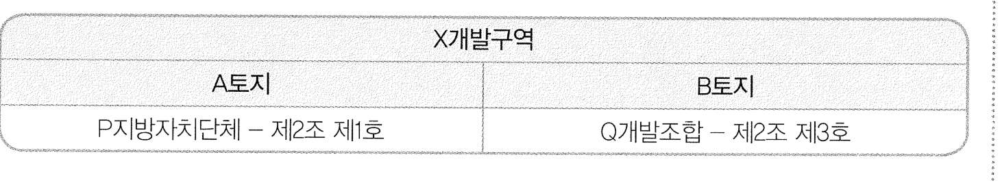

### <보기> 해설

ㄱ. 제3조 제2호만 보면, B개발조합은 B토지 개발사업 시행방식을 제2조 제3호에서 제2조 제1호로 변경하는 것이 가능하다. 그러나 A토지에 대해 P지방자치단체가 제2조 제1호의 방식으로 개발사업을 시행하기로 했으므로 B토지에 대해 B개발조합이 제2조 제1호로 시행방식을 변경한다면, X개발구역 전부에 대해 제2조 제1호의 방식으로 개발사업을 시행하는 것이 된다. 그러나 이것은 제1조 제3항(개발구역 전부에 대하여 제2조 제1호의 방식으로 개발사업을 시행하는 것은 시행자가 지방자치단체인 경우에 한한다)에 위배되므로 B개발조합은 B토지 개발사업 시행방식을 제2조 제1호로 변경하여 개발사업을 시행할 수 없다. ㄱ은 옳지 않은 분석이다.

ㄴ. A토지 개발사업 시행자가 B개발조합으로 변경되는 경우, B개발조합이 A토지에 대해서는 제2조 제1호의 방식으로, B토지에 대해서는 제2조 제3호의 방식으로 개발사업을 시행하는 것이 된다. 이 경우 제2조 제1호의 방식과 제2조 제3호의 방식이 혼용되고 있으므로, 제2조의 단서에 의해 B개발조합은 제2조 제3호를 선택한 것으로 본다.

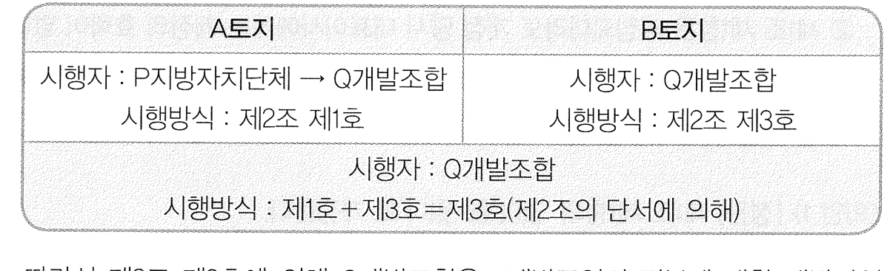

따라서 제3조 제2호에 의해 B개발조합은 X개발구역의 전부에 대한 개발사업 시행방식을 제2조 제3호에서 제2조 제2호로 변경하여 개발사업을 시행할 수 있다. ㄴ은 옳은 분석이다.

ㄷ. B토지 개발사업 시행자가 P지방자치단체로 변경되는 경우, 제3조 제1호에 의해 P지방자치단체는 B토지에 대한 개발사업 시행방식을 제2조 제3호에서 제2조 제1호로 변경할 수 있다. 이렇게 변경한다면 X개발구역 전부에 대하여 제2조 제1호의 방식으로 개발사업을 시행하는 것이지만, 시행자는 P지방자치단체이므로 제1조 제3항에 위배되지 않는다. 따라서 ㄷ은 옳은 분석이다.

<보기>의 ㄴ, ㄷ만이 옳은 분석이므로 정답은 (4)이다.

## 12

### 문항구분

* 문항 성격 : 언어 추리
* 내용영역 : 규범
* 평가 목표 : 이 문항은 가상의 주식회사 [정관]과 대표이사에 우호적인 주주의 분포가 변화하는 상황으로부터 대표이사가 일정한 목적을 달성하기 위한 합법적인 [정관] 개정 방안이 무엇인지 파악할 수 있는 능력을 평가하는 문항이다.

* 정답 : (3)

### 제시문 해설

대표이사가 연임하기 위하여는 [정관] 제1조 제1항을 개정하여 대표이사의 연임이 가능하도록 하여야 하고, 이를 목적으로 하는 <의안 1>이 주주총회를 통과하여야 한다. 다만, [정관] 제3조 제2항은 제1조 제1항이 개정되더라도 개정 당시 대표이사에게는 개정의 효력이 없다고 규정하고 있으므로, [정관] 제3조 제2항을 삭제하여 제1조 제1항 개정 당시 대표이사에게도 제1조 제1항 개정의 효력이 미치도록 하여야 한다. [정관] 제3조 제3항은 제3조 제2항이 삭제되기 전에 제1조 제1항이 개정되더라도 개정 당시 대표이사에게는 제1조 제1항 개정의 효력이 없다고 규정하고 있으므로, <의안 3>이 <의안 1>보다 먼저 주주총회를 통과하여야 한다. 한편 정관 개정을 위한 주주총회 의안이 2023. 6. 30. 이전에 제안되는 경우에는 대표이사 갑에게 우호적인 주주가 9명이므로 주주총회를 통과할 수 있지만, 정관 개정을 위한 주주총회 의안이 2023. 7. 1. 이후에 제안되는 경우에는 대표이사 갑에게 우호적인 주주가 8명이므로 정관 개정을 위한 의결정족수가 전체 지분의 4분의 3 이상의 동의에서 전체 지분의 3분의 2 이상의 동의로 하향되지 않은 한 주주총회를 통과할 수 없다. 이를 고려하여 정관 개정을 위한 의결정족수를 하향시키는 <의안 2>가 제안되어야 하는 시점을 판단하여야 한다.

### <보기> 해설

ㄱ. <의안 1>과 <의안 3>이 2023. 7. 1. 이후에 제안된 경우 2023. 7. 1. 이후에는 대표이사 갑에게 우호적인 주주가 8명이므로 정관 개정을 위한 의결정족수가 하향되지 않은 한 <의안 1>과 <의안 3>은 주주총회를 통과할 수 없었을 것이다. 의결정족수를 하향시키는 <의안 2>가 주주총회를 통과하기 위하여는 갑에게 우호적인 주주가 9명에서 8명으로 감소하기 전에 주주총회에 제안되었어야 한다. 따라서 <의안 2>는 2023. 6. 30. 이전에 주주총회에 제안되었어야 한다. 그러므로 ㄱ은 옳은 추론이다.

ㄴ. <의안 2>가 2023. 7. 1. 이후에 제안된 경우 2023. 7. 1. 이후에는 대표이사 갑에게 우호적인 주주가 8명이므로 의결정족수를 하향시키는 <의안 2>는 주주총회를 통과할 수 없었을 것이다. 그렇더라도 <의안 1>과 <의안 3>이 2023. 6. 30. 이전에 주주총회에 제안되었다면 2023. 6. 30. 이전에는 대표이사 갑에게 우호적인 주주가 9명이므로 <의안 1>과 <의안 3>이 주주총회를 통과할 수 있었을 것이다. 다만, <의안 1>에 따라 [정관] 제1조 제1항이 개정된 효과가 개정 당시 대표이사에게 미치기 위하여는 <의안 3>이 <의안 1>보다 먼저 주주총회에 제안되었어야 한다. 그러므로 ㄴ은 옳은 추론이다.

ㄷ. <의안 3>이 2023. 6. 30. 이전에 제안된 경우 2023. 6. 30. 이전에는 대표이사 갑에게 우호적인 주주가 9명이므로 <의안 3>은 주주총회를 통과할 수 있었을 것이다. <의안 1>이 2023. 7. 1. 이후에 제안된 경우 2023. 7. 1. 이후에는 대표이사 갑에게 우호적인 주주가 8명이므로 정관 개정을 위한 의결정족수가 하향되지 않은 한 <의안 1>은 주주총회를 통과할 수 없었을 것이다. 의결정족수를 하향시키는 <의안 2>가 주주총회를 통과하기 위하여는 갑에게 우호적인 주주가 9명에서 8명으로 감소하기 전에 주주총회에 제안되었어야 한다. 따라서 <의안 2>는 2023. 6. 30. 이전에 주주총회에 제안되었어야 한다. 그러므로 ㄷ은 옳지 않은 추론이다.

<보기>의 ㄱ, ㄴ만이 옳은 추론이므로 정답은 (3)이다.

## 13

### 문항구분

* 문항 성격 : 논쟁 및 반론
* 내용영역 : 인문
* 평가 목표 : 이 문항은 악한 의도를 가지고 행동한 두 행위자 중 한쪽은 살인에 성공하고 다른 한쪽은 살인에 실패한 경우 둘에게 내려지는 처벌이 달라야 하는지에 대한 여러 견해들을 이해하여, 각 견해의 함축과 그 견해들의 공통점, 차이점 등을 분석하는 능력을 평가하는 문항이다.

* 정답 : (4)

### 제시문 해설

제시문은 악한 의도를 가진 갑과 을 두 사람이 성공과 실패라는 상이한 결과를 맞이할 때 다르게 처벌하는 것이 정당화될 수 있는지에 대한 여러 견해를 제시하고 있다. A는 성공과 실패의 차이가 ‘운’에 기인하기 때문에, 두 사람을 다르게 처벌하는 것은 정당화될 수 없다고 주장한다. B는 성공과 실패의 차이는 의도의 악랄함의 정도를 반영하므로 다른 처벌이 정당화될 수 있다고 주장한다. C는 성공과 실패를 다르게 처벌하는 것을 ‘운에 의한 처벌’의 사례로 보면서, 갑과 을을 다르게 처벌하는 것이 정당화될 수 있다고 주장한다.

### <보기> 해설

ㄱ. A는 악한 의도를 가진 두 사람이 운에 의해 다른 결과를 맞이하게 되었기 때문에 다르게 처벌해서는 안 된다고 주장한다. 누군가를 죽일 의도는 없었으나 난폭운전을 해서 행인을 죽인 사람과 누군가를 죽일 의도로 난폭운전을 해서 행인을 다치게 한 사람을 동일하게 처벌해야 한다는 것은 A의 입장으로부터 도출되지 않는다. 따라서 ㄱ은 옳지 않은 분석이다.

ㄴ. 의도가 악랄할수록 감정에 휩쓸려 판단력이 떨어진다는 것과 판단력이 떨어질수록 계획의 성공 가능성이 낮아진다는 것이 모두 사실이라면, 의도가 악랄할수록 성공 확률이 높다는 B의 논거는 약화된다. 따라서 ㄴ은 옳은 분석이다.

ㄷ. A와 C는 갑과 을을 동등하게 대우하여 처벌해야 한다는 것에는 동의하지만 어떤 처벌을 해야 하는지에 대해서는 의견을 달리한다. 따라서 ㄷ은 옳은 분석이다.

<보기>의 ㄴ, ㄷ만이 옳은 분석이므로 정답은 (4)이다.

## 14

### 문항구분

* 문항 성격 : 언어 추리
* 내용영역 : 인문
* 평가 목표 : 이 문항은 부재 증거와 부재 가설 사이의 관계에 대한 철학적 원칙을 일상생활의 사례에 적용한 것을 적절하게 분석하고 평가할 수 있는 능력을 측정하는 문항이다.

* 정답 : (2)

### 제시문 해설

부재 가설이란, 무언가가 부재한다는, 즉 ‘없다는’ 가설이다. 격률은 ‘증거를 발견하지 못했다는 것이 부재 가설의 참의 증거가 아니라는 것’, 즉 ‘있다는 증거가 없다는 것이, 없다는 가설이 참이라는 증거가 아니라는 것’이다. 제시문의 서술과 같이 많은 철학자들은 이 격률을 일반적인 격률로 받아들인다. 그러나 철학자들의 생각과 달리, 일반인들은 일상생활에서 증거의 부재는 부재 가설이 참이라는 증거라고 생각한다. 예를 들어 제시문의 ‘천장의 쥐’의 사례에서 보듯 격률에 역행하는 추론은 오히려 일상적으로는 합리적인 추론으로 보이기도 한다. 철학자 A는 증거의 부재가 부재의 증거가 되는, 즉 격률이 성립하지 않는 두 가지 조건을 제시한다. A에 따르면 조건 1과 조건 2를 모두 만족하는 사례는 격률이 성립하지 않게 된다.

### <보기> 해설

ㄱ. <사례>에서 부재 가설은 ‘멧돼지가 없다’이다. X산에 멧돼지가 존재할 확률이 0%라면 ‘멧돼지가 없다’라는 부재 가설이 참일 확률은 100%이므로 조건 1을 만족하지 못한다. A에 따르면 조건 1과 조건 2를 모두 만족해야 격률 ‘증거의 부재는 부재의 증거가 아니다’가 성립하지 않게 된다. 따라서 이 경우는 조건 1을 만족하지 못하므로 격률이 성립하지 않는 사례라고 할 수 없다. ㄱ은 옳지 않은 판단이다.

ㄴ. <사례>에서 부재 가설은 ‘멧돼지가 없다’이다. 그리고 ‘부재 가설이 거짓이라는 증거’는 ‘멧돼지가 있다는 증거’이며, 이 증거는 ‘멧돼지 발자국이 발견된다’이다. 갑이 등산하기 전에 누군가 먼저 X산을 깨끗이 정돈하여 모든 동물 발자국을 지워 놓았다면, 이 증거를 획득할 확률은 0이 된다. 따라서 ‘멧돼지가 없다’가 참일 때 ‘멧돼지가 있다는 증거’를 획득할 확률과 ‘멧돼지가 없다’가 거짓일 때 ‘멧돼지가 있다는 증거’를 획득할 확률 모두 0으로 동일하다. 따라서 조건 2가 만족되지 않는다. 그러나 조건 1이 만족되지 않는지는 보장되지 않는다. 모든 동물 발자국을 지웠다는 것이, ‘멧돼지가 없다’가 참일 확률이 100%라는 것을 의미하지도 않고 그와 관련도 없기 때문이다. 따라서 ㄴ은 옳지 않은 판단이다.

ㄷ. 이 선택지는 조건 2에 <사례>를 그대로 대입한 것이다. 부재 가설이 참일 때(멧돼지가 없을 때) ‘부재 가설이 거짓이라는 증거’(멧돼지 발자국이 발견된다)를 획득할 확률이, 부재 가설이 거짓일 때(멧돼지가 있을 때) ‘부재 가설이 거짓이라는 증거’(멧돼지 발자국이 발견된다)를 획득할 확률보다 더 작으므로, 조건 2가 만족된다. 따라서 ㄷ은 옳은 판단이다.

<보기>의 ㄷ만이 옳은 판단이므로 정답은 (2)이다.

## 15

### 문항구분

* 문항 성격 : 언어 추리
* 내용영역 : 인문
* 평가 목표 : 이 문항은 비난할 자격과 위선자에 관한 견해를 정확하게 이해하여 사례에 올바로 적용할 수 있는 능력을 평가하는 문항이다.

* 정답 : (2)

### 제시문 해설

[원리]는 A의 위반에 대하여 위선자가 아닐 경우, 그리고 그 경우에만 A를 위반한 사람을 비난할 자격이 있다고 말한다. A의 위반에 대해서 위선자가 되는 필요충분조건에 대해 A, B, C의 견해가 다르며, 이 세 견해가 제시하는 조건들의 차이는 다음과 같다.

A : A를 위반, A를 위반한 다른 사람 비난함

B : A를 위반, A를 위반한 자신을 비난하지 않음, A를 위반한 다른 사람을 비난함

C : A를 위반, A를 위반한 자신을 비난하지 않음, A를 위반한 다른 사람을 비난함, 잘못에 대해 자신을 비난하지 않고 다른 사람만 비난하는 성향이 있음

<사례 1>과 <사례 2>에서 갑, 병, 정의 특징을 정리하면 다음과 같다.

갑 : (1년 전) 거짓말을 했음, 거짓말을 한 을을 비난했음

(현재) 거짓말을 함, 거짓말을 한 자신을 비난함, 거짓말을 한 을을 비난함, 두 비난이 성향에서 나옴

병 : 부정행위를 했음, 부정행위를 한 자신을 비난했음, 부정행위를 한 정을 비난했음

정 : 부정행위를 했음, 부정행위를 한 자신을 비난하지 않았음, 부정행위를 한 병을 비난했음

자신을 비난하지 않은 것과 병을 비난한 것 모두 자신의 성향에서 나옴

### <보기> 해설

ㄱ. 1년 전에 갑은 거짓말을 했고 거짓말을 한 을을 비난했으므로 A에 따르면 1년 전의 갑은 위선자이고 따라서 을을 비난할 자격이 없다. 그 이후 갑은 잘못에 대해서는 다른 사람이든 자신이든 비난하는 성향을 가지게 되었고 그 성향으로 인해 현재 갑은 거짓말을 한 을과 자신을 비난하고 있다. 비록 성향에서 나온 행위이긴 하지만 갑은 잘못한 행위를 한 자신과 동일한 잘못을 한 을을 둘 다 비난하고 있다. 따라서 C에 따르면 갑은 위선자가 아니므로 현재 갑은 을을 비난할 자격이 있다. ㄱ은 옳지 않은 판단이다.

ㄴ. 병은 부정행위에 대해서 정과 자신을 둘 다 비난했으므로, B에 따르면 병은 위선자가 아니고 따라서 정을 비난할 자격이 있다. 병은 자신과 정을 둘 다 비난했으므로, C에 의하면 병은 위선자가 아니고 따라서 병은 정을 비난할 자격이 있다. ㄴ은 옳지 않은 판단이다.

ㄷ. 정은 부정행위에 대해 자신을 비난하지 않았지만 병을 비난했는데, 이는 둘 다 정이 가진 성향 때문이다. 정은 부정행위를 했고 부정행위를 한 병을 비난했으므로, A에 따르면 위선자이며 따라서 정은 병을 비난할 자격이 없다. 정은 부정행위를 했고 부정행위를 한 병을 비난했지만 부정행위를 한 자신을 비난하지 않았기 때문에, B에 따르면 정은 위선자이며 따라서 정은 병을 비난할 자격이 없다. ㄷ은 옳은 판단이다.

<보기>의 ㄷ만이 옳은 판단이므로 정답은 (2)이다.

## 16

### 문항구분

* 문항 성격 : 논증 평가 및 문제해결
* 내용영역 : 인문
* 평가 목표 : 이 문항은 제시된 실험의 내용과 그 실험이 함축하는 바를 정확하게 이해하고 추가적인 증거가 가설을 강화 또는 약화하는지 판단할 수 있는 능력을 평가하는 문항이다.

* 정답 : (2)

### 제시문 해설

제시문은 행위자의 도덕적 행동이 행위자의 성격이 아닌 상황적 요소에서 나올 수 있다는 상황주의의 입장을 뒷받침하는 실험을 설명해 주고 있다. 이 실험이 보여주는 것 중 하나는 행위자가 좋은 빵 냄새를 맡아 기분이 좋아지게 되는 것이 타인을 돕는 친사회적인 행동을 하게 하는 원인이 될 수 있다는 것이다. 이 실험을 통해 도출된 가설은 다음과 같다.

㉠ 사람의 행동을 좌우하는 결정적 요인은 성격보다는 상황적 요소이다.

㉡ 행위자의 행동을 이끄는 것이 아주 사소한 상황적 요소일 수도 있다는 것이다.

### <보기> 해설

ㄱ. 행인을 도와주지 않은 사람 중 대부분이 평소에도 이기적으로 행동한다고 알려진 사람들이었다는 것이 밝혀지면, 이것은 ㉠을 강화하기보다는 약화한다고 보아야 한다. 행인을 돕지 않은 그들의 행동이 빵 냄새를 맡지 않았다는 상황적 요소가 아니라 이기적인 성격에서 기인한 것일 수도 있다는 추정이 가능해지기 때문이다. 따라서 ㄱ은 옳지 않은 평가이다.

ㄴ. 갑의 실험에 참여한 사람 가운데 평소 이타적인 성격을 지녔다고 알려진 사람이 그렇지 않은 사람보다 압도적으로 많은 것으로 밝혀지더라도 ㉠은 약화되지 않는다. 왜냐하면 이타적 성격을 가진 사람들도 ‘빵 냄새’라는 상황적 요소가 만들어 낸 기분에 따라서 행동이 달라진다는 것을 ‘빵 냄새 실험’의 결과가 보여준다고 말할 수 있기 때문이다. 따라서 ㄴ은 옳지 않은 평가이다.

ㄷ. 변경된 설정에서도 유사한 결과를 나타냈다는 것은 행동을 결정하는 요인이 상황적 요소에 있다는 가설을 지지하는 근거가 될 수 있으므로 ㉠은 강화된다. ㉡은 단지 행동을 결정하는 상황적 요소가 아주 사소한 것일 수도 있다는 것이므로, 고가의 경품 당첨이 상황적 요소가 되어 행동을 결정하는 요인이 된다는 것이 ㉡을 약화시키지는 않는다. 따라서 ㄷ은 옳은 평가이다.

<보기>의 ㄷ만이 옳은 평가이므로 정답은 (2)이다.

## 17

### 문항구분

* 문항 성격 : 논증 분석
* 내용영역 : 인문
* 평가 목표 : 이 문항은 ‘의도’와 ‘후회’에 대한 역설과 그 구조에 대한 설명을 적절하게 분석하고 평가할 수 있는 능력을 측정하는 문항이다.

* 정답 : (4)

### 제시문 해설

이 내기는 후회를 할 것이라고 예측하고 선택하면 후회를 하지 않게 되고, 그래서 반대쪽 선택을 하면 후회를 해서 상금을 받을 것이므로 다시 후회를 하지 않게 되어 상금을 받지 못하는 구조를 가진 내기다. 여기서 중요한 것은 “선택은 한 번 이루어졌지만 그것이 후회할 선택인지 여부는 계속 변하며”이다. 즉, 1불과 10불 중 하나를 고른 ‘한 번의 선택’에 대해서 그것이 잘한 선택인지 잘못한 선택인지의 평가가 계속 바뀌는 것이다. 첫 번째 단락은 일종의 사고실험으로서 역설적인 결과가 도출되는 내기를 제시한다. 두 번째 단락은 이 사고실험의 논리적 구조를 분석한다.

### <보기> 해설

ㄱ. 1불과 10불 중 어느 쪽을 선택하더라도 100불을 추가로 받으므로, 두 선택의 총 상금은 각각 101불과 10불이 된다. 그리고 제시문에 주어진 조건에 의해서, 더 적은 돈을 받으면 후회하는 것으로 가정되어 있으므로, 1불의 선택은 후회하는 선택이 된다. 따라서 ㄱ은 옳지 않은 분석이다.

ㄴ. 더 많은 돈을 얻는 선택이 후회하지 않는 선택이므로, 10불을 선택하는 것이 후회하지 않는 선택이다. 이 경우 100불을 추가로 받으므로 이 선택이 후회하지 않는 선택이라는 것은 바뀌지 않는다. 반면 1불을 선택하면 후회하므로 100불을 추가로 받지 못한다. 역시 후회할 선택이라는 것은 바뀌지 않는다. 더 많은 돈을 얻는 선택이 합리적인 선택이므로, 합리적인 선택은 10불을 선택하는 것이다. 따라서 ㄴ은 옳은 분석이다.

ㄷ. 두 번째 단락에서 “그 선택의 의도는 시점 2에서 후회를 하는 것이다.”라고 하여, 1불을 선택하는 경우 그 선택의 의도와 10불을 선택하는 경우 그 선택의 의도가 시점 2에서 후회를 하는 것임을 명시하고 있다. 그리고 첫 번째 단락의 내용을 통해, 1불의 선택은 ‘10불 대신 1불을 선택한 후회’를, 10불의 선택은 ‘100불을 추가로 받지 못한 후회’를 목표로 함을 알 수 있다. 따라서 ㄷ은 옳은 분석이다.

<보기>의 ㄴ, ㄷ만이 옳은 분석이므로 정답은 (4)이다.

## 18

### 문항구분

* 문항 성격 : 언어 추리
* 내용영역 : 인문
* 평가 목표 : 이 문항은 한 집단이 다른 집단에 의해 피해를 받았을 때 피해를 받은 집단이 피해를 가한 집단에게 보복 시 자신의 행동을 어떤 도덕 원칙에 근거해 정당화할 수 있는지에 대해 분석할 수 있는 능력을 평가하는 문항이다.

* 정답 : (4)

### 제시문 해설

이 문제는 전쟁 시 전투원의 적법한 공격 대상이 무엇인가라는 소재를 변경하여 출제한 문제이다. 세 가지 도덕 원칙에서 전투원이 대표로 변경되었다. 각 원칙의 핵심은 다음과 같다.

P1 : 한 집단 내의 누군가가 다른 집단을 무차별적으로 공격한 상황을 가정하고 있다. 이러한 상황에서 피해를 받은 집단 내의 누구나 피해를 가한 집단에 속한 누구에게라도 그에 상응하는 보복을 할 도덕적 권리를 가진다.

P2 : 한 집단의 대표 중 한 사람이 다른 집단을 무차별적으로 공격한 상황을 가정하고 있다. 이러한 상황에서 피해를 받은 집단의 대표 누구나 피해를 가한 집단에 속한 누구에게라도 그에 상응하는 보복을 할 도덕적 권리를 가진다.

P3 : 한 집단의 대표 중 한 사람이 다른 집단을 무차별적으로 공격한 상황을 가정하고 있다. 이러한 상황에서 피해를 받은 집단의 대표 누구나 피해를 가한 집단의 대표들에게, 그리고 오직 그들에게만 그에 상응하는 보복을 할 도덕적 권리를 가진다.

P1이 가장 많은 보복의 사례를 허용하는 원칙이고, P2가 그 다음으로 많은 사례를 허용하고, P3가 가장 엄격한 원칙이다.

### <보기> 해설

ㄱ. 갑은 보복으로 A 마을 사람들에게 무차별적으로, 즉 대표와 대표 아닌 사람의 구분 없이 오물을 투척하였고, 을은 A 마을의 대표들에게만 오물을 투척하였다. P1과 P2는 갑과 을의 행동이 모두 정당하다고 판정을 내린다. 반면 P3는 을의 행동은 정당하지만 갑의 행동은 정당하지 않다고 판정을 내린다. 세 원칙이 갑과 을의 행동에 대해 같은 도덕적 판정을 내리는 것은 아니므로, ㄱ은 옳지 않은 분석이다.

ㄴ. P1과 P2는 갑의 행동이 정당하다고 판정하지만 P3는 정당하지 않다고 판정을 내린다. 갑의 행동을 정당화하기 위해서는 세 원칙 가운데 P1이나 P2 중 하나에 의존해야 하므로, ㄴ은 옳은 분석이다.

ㄷ. P1, P2, P3는 모두 을의 행동이 정당하다고 판정을 내린다. 을의 행동을 정당화하기 위해 반드시 P3에 의존할 필요는 없으므로, ㄷ은 옳은 분석이다.

<보기>의 ㄴ, ㄷ만이 옳은 분석이므로 정답은 (4)이다.

## 19

### 문항구분

* 문항 성격 : 언어 추리
* 내용영역 : 인문
* 평가 목표 : 이 문항은 어떤 행위를 하지 않을 도덕적 의무가 있는지에 대한 몇 가지 윤리 원칙들을 사례에 올바로 적용할 수 있는 능력을 평가하는 문항이다.

* 정답 : (5)

### 제시문 해설

제시문에서 기후 변화 문제에 적용되는 도덕 원리들 중 세 개가 제시되고 있으며, 개인의 탄소배출 사례와 이와 유사한 두 사례가 제시되어 있다.

원리 A는 타인에게 해를 입히거나 세상을 더 나쁘게 하지 않을 도덕적 의무에 대해 말하고 있다. 원리 B는 모든 사람이 특정 유형의 행위를 하는 가정적 상황에서 누군가 해를 입거나 세상이 더 나빠진다면, 그 유형의 행위를 하지 않을 도덕적 의무에 대해 말한다. 원리 C는 특정 유형의 행위를 하는 것이 허용되는 가정적 상황에서 누군가 해를 입거나 세상이 더 나빠진다면, 그런 유형의 행위를 하지 않을 도덕적 의무에 대해 말한다.

<사례 1>은 한 개인이 스포츠카를 운전하는 사례에 대한 판단을 요구한다. 한 사람의 운전은 그 자체로 부정적인 영향을 발생시키지 않으므로, A를 적용할 경우 그 행위를 하지 않을 도덕적 의무가 있는 것은 아니다. 그러나 현재 많은 사람이 운전을 하고 있으며, 모든 사람이 운전을 한다면 지구 온난화가 심화되어 많은 사람이 피해를 입게 될 것이다. 따라서 B를 적용한다면, 갑은 스포츠카 운전을 하지 않을 의무를 가진다.

<사례 2>는 실내 흡연에 관한 판단을 묻는다. 지정된 흡연 구간에서의 흡연은 타인에게 특별한 해를 입히지 않으며 세상을 나쁘게 하는 것도 아니다. 그러나 아파트에서의 실내 흡연은 다르다. 한 사람의 실내 흡연만으로도 이웃은 피해를 입을 것이다. 모두가 아파트에서 실내 흡연을 한다면, 많은 사람이 피해를 입을 것이다.

<사례 3>은 아직 아이가 없는 상황에서 영구 불임수술을 받을 것인지에 대한 판단을 묻는다. 모든 사람이 아이를 가질 수 없다면 이는 인류의 절멸과 사회적 재앙으로 이어질 것이다. 그러나 영구 불임수술은 현재 허용되고 있음에도 불구하고 실제로 이 수술을 받는 사람은 많지 않아 세상은 나빠지지 않았다. 따라서 그 허용 여부는 사회적 차이를 발생시키지 않을 것이다.

### <보기> 해설

ㄱ. A를 적용하면, 갑은 ㉠을 하지 않을 도덕적 의무가 있다고 할 수 없다. <사례 1>에서 한 사람의 스포츠카 운전이 지구 온난화에 영향을 미치는 것은 아니기 때문이다. 그러나 B를 적용하면 다르다. 모든 사람이 운전을 하면 지구 온난화 추세가 심화될 것이므로 갑은 ㉠을 하지 않을 도덕적 의무를 가진다. 따라서 ㄱ은 옳은 분석이다.

ㄴ. A를 적용하면, 을은 ㉡을 하지 않을 도덕적 의무가 있다고 할 수 있다. 고층 아파트에서 한 사람이라도 실내에서 흡연을 하면 연기와 냄새로 이웃에게 피해를 주기 때문이다. B를 적용해도 마찬가지다. 고층 아파트에서는 한 사람의 실내 흡연도 해를 끼치는데, 모두가 실내 흡연을 할 경우 피해는 더 커질 것이다. 따라서 ㄴ은 옳은 분석이다.

ㄷ. <사례 3>의 서술에 직접 나오듯, 모두가 아이를 낳기 전에 영구 불임수술을 받는다면, 이는 세상을 나쁘게 할 것이다. 따라서 B를 적용하면 병은 ㉢을 받지 않을 도덕적 의무가 있다. 그러나 영구 불임수술이 현재 허용되고 있음에도 불구하고 실제로 수술을 받는 사람은 많지 않아 세상은 더 나빠지지 않았다. 따라서 C를 적용하면 병은 ㉢을 받지 않을 도덕적 의무가 있다고 할 수 없다. 따라서 ㄷ은 옳은 분석이다.

<보기>의 ㄱ, ㄴ, ㄷ 모두 옳은 분석이므로 정답은 (5)이다.

## 20

### 문항구분

* 문항 성격 : 언어 추리
* 내용영역 : 인문
* 평가 목표 : 이 문항은 진정한 용서가 이루어지기 위한 필요조건을 제시한 제시문을 읽고 주어진 사례들이 진정한 용서에 해당하는지에 관해 판단할 수 있는 능력을 평가하는 문항이다.

* 정답 : (4)

### 제시문 해설

제시문은 진정한 용서가 이루어지기 위해서는 분노가 적절한 방식으로 사라져야만 한다는 것을 전제로, 그 ‘적절한 방식’이 되기 위한 세 가지 필요조건을 제시하고 있다. 첫 번째 조건은 상대방의 행위가 도덕적으로 나쁜 행위였다는 판단을 유지하는 것이다. 두 번째 조건은 상대방이 자신의 행위에 대한 합리적인 도덕적 판단을 내릴 수 있는 분별력을 갖춘, 도덕적 행위자라는 판단을 유지하는 것이다. 세 번째 조건은 분노가 자기 존중을 해치지 않는 방식으로 사라져야 한다는 것이다. 적어도 세 조건이 모두 만족되어야만 용서가 이루어졌다고 할 수 있다.

### <보기> 해설

ㄱ. 처음에는 차를 소유주의 허락 없이 사용한 것이 도덕적으로 나쁜 행위라고 판단했지만, 그것이 아이의 생명을 살리기 위한 불가피한 행위라고 판단함으로써 분노가 사라졌으므로 용서가 되기 위한 첫 번째 조건을 위반하였다. 따라서 용서라고 볼 수 없다. ㄱ은 옳은 추론이다.

ㄴ. 주어진 상황이 세 조건 중 하나의 조건이라도 위반하고 있다고 추론할 수 없다. 즉 ‘아버지에게 어린 시절 가정 폭력을 당한 사람이, 성인이 된 후 아버지가 말기 암 진단을 받았다는 것을 듣고 아버지에 대한 분노가 사라진 상황’이 가해자의 행위가 도덕적으로 나쁘다는 판단을 수정함에 따른 것인지, 혹은 가해자의 도덕적 책임 가능성에 대한 판단을 수정함에 따른 것인지, 피해자의 자기 존중을 훼손함에 따른 것인지 확정할 수 없다. 따라서 이 상황을 용서라고 볼 수 없다고 추론할 수 없다. ㄴ은 옳지 않은 추론이다.

ㄷ. 누군가를 다치게 하는 것은 도덕적으로 나쁜 행위임에도 불구하고, 그 행위자가 도덕적 분별력을 갖추지 않았다는 것을 인정함으로써 분노가 사라졌으므로 두 번째 조건을 위반하고, 따라서 용서라고 볼 수 없다. ㄷ은 옳은 추론이다.

<보기>의 ㄱ, ㄷ만이 옳은 추론이므로 정답은 (4)이다.

## 21

### 문항구분

* 문항 성격 : 논증 분석
* 내용영역 : 인문
* 평가 목표 : 이 문항은 사회과학의 방법론과 형이상학에 관한 글을 읽고서 논증의 구조를 정확하게 분석하는 능력을 평가하는 문항이다.

* 정답 : (2)

### 제시문 해설

제시된 논증의 결론은 ㉩이다. 이는 ㉡, ㉢, ㉨으로부터 판단할 수 있다. 조건문 ㉡의 앞부분 “둘의 설명 논리에서 차이가 없거나 방법론에서 차이가 없다면”과 직접 연관된 문장을 논리적으로 추적하면 ㉢과 ㉨이 합해서 ㉡의 바로 이 부분을 부정하고 있음을 알 수 있다. ㉢은 사회과학의 인간의 행동에 대한 설명 논리가 자연과학의 그것과 다르다는 것이고, ㉨은 사회과학과 자연과학의 방법론 사이에 차이가 있다는 것이다. 그렇다면 조건문 ㉡의 뒷부분 “사회과학도 과학이므로 자연과학과 별 차이가 없을 것이다.”가 도출될 수 없다. ㉩이 이를 주장한다.

이러한 핵심적인 구조를 파악하면, 나머지는 ㉢과 ㉨을 뒷받침하는 하위 논증을 구성함을 알 수 있다. ㉥은 ㉤을 뒷받침하는 사례이며, ㉣과 ㉤과 ㉦이 합해서 인간의 행동에 대한 설명 논리가 자연현상의 설명 논리와 다름을 주장하는 ㉢을 뒷받침한다. 또한 ㉨은 조건문 ㉧의 앞부분을 부정하고 있으므로 ㉧의 뒷부분이 도출될 수 없다. ㉩이 이를 주장하고 있으므로, ㉧과 ㉨이 합해서 ㉩을 뒷받침한다는 것을 알 수 있다.

### 선택지별 해설

(1)~(5)의 선택지 중에 논증의 구조를 적절하게 분석한 것은 (2)이며, (1), (3), (4), (5)는 적절하지 않은 분석이다. 따라서 정답은 (2)이다.

## 22

### 문항구분

* 문항 성격 : 논쟁 및 반론
* 내용영역 : 인문
* 평가 목표 : 이 문항은 그룹의 존재에 대한 다양한 견해들을 이해하여 제시문에 주어진 정보에 따라 각 견해로부터 판단할 수 있는 능력을 평가하는 문항이다.

* 정답 : (2)

### 제시문 해설

이 문제는 사회적 그룹의 존재에 대한 다양한 견해들을 소개하고 있다. 각각의 견해는 다음과 같다.

A : A에 따르면, 그룹은 존재하지 않는다. 존재하는 것은 각각의 개인들뿐이다. 이러한 견해에 따르면, ‘삼신기’라는 이름은 어떠한 대상도 지칭하지 않는다. 따라서 “삼신기가 공연했다”는 말은 엄밀히 말해 참이 될 수 없다.

B : B에 따르면, 그룹은 구체적 존재자로 존재한다. 그룹은 구성원들을 단순히 모은 것과 동일하다. 예를 들면, 삼신기는 갑, 을, 병의 모음과 동일하다. 갑, 을, 병의 모음인 삼신기는 특정한 공간을 차지한다는 점에서 구체적 존재자이다. 이러한 견해에 따르면, “삼신기는 공연했다”는 말은 곧 “갑, 을, 병의 모음이 공연했다”로 이해될 수 있고, 갑, 을, 병의 모음이 실제로 공연했을 경우 이 문장은 참이 된다.

C : C에 따르면, 그룹은 구성원이 변하더라도 존속할 수 있는 존재자이다. 그룹은 각각의 구성원이나 그들의 모음과는 구분되는 존재로 어떤 공간을 차지하는 대상이 아니라는 점에서 추상적 존재자이다. 이러한 추상적 존재자는 그룹이 결성되었을 때 비로소 존재하기 시작한다.

### <보기> 해설

ㄱ. A에 따르면, 그룹은 존재하지 않고 그룹의 구성원들만 존재한다. 따라서 갑, 을, 병 세 사람과 구분되는 삼신기라는 그룹은 존재하지 않는다. B에 따르면, 그룹은 존재하고, 그룹은 구성원들의 단순한 모음과 동일하다. 삼신기라는 그룹은 존재하지 않는다는 것에 대해 A는 동의하고 B는 동의하지 않으므로, ㄱ은 옳지 않은 추론이다.

ㄴ. B에 따르면 삼신기는 갑, 을, 병의 모음과 동일하다. 외통수도 갑, 을, 병의 모음과 동일하다. 따라서 삼신기는 외통수와 동일하다. C에 따르면, 그룹은 구성원들이 그룹을 결성했을 때 비로소 존재하기 시작한다. 그런데 삼신기와 외통수는 서로 다른 시점에 결성되었다. 따라서 삼신기와 외통수는 동일하지 않다. 삼신기와 외통수가 동일하다는 것에 대해 B는 동의하고 C는 동의하지 않으므로, ㄴ은 옳은 추론이다.

ㄷ. A에 따르면 삼신기는 멤버의 교체 여부와 상관없이 존재하지 않는다. C에 따르면 삼신기는 구성원이 변하더라도 존속할 수 있는 종류의 대상이다. 갑이 새로운 멤버로 교체되어도 삼신기는 존재한다는 데 A는 동의하지 않고 C는 동의하므로, ㄷ은 옳지 않은 추론이다.

<보기>의 ㄴ만이 옳은 추론이므로 정답은 (2)이다.

## 23

### 문항구분

* 문항 성격 : 논쟁 및 반론
* 내용영역 : 인문
* 평가 목표 : 이 문항은 명제란 무엇인가라는 질문에 대한 서로 다른 두 견해를 이해하여 제시문에 주어진 정보에 따라 각 견해로부터 무엇을 추론할 수 있는지 판단할 수 있는 능력을 평가하는 문항이다.

* 정답 : (5)

### 제시문 해설

제시문에서 명제란 무엇인가라는 질문에 대한 서로 다른 두 견해가 소개되고 있다. 각각의 견해는 다음과 같다.

갑 : 갑에 따르면, 문장이 표현하는 명제는 그 문장이 참인 가능세계들의 집합이다. 가령, “수철이는 키가 크다”는 문장이 표현하는 명제는 수철이는 키가 크다는 사실이 성립하는 모든 가능세계들의 집합이다. 어떤 문장이 모든 가능세계에서 참이면, 이 문장이 표현하는 명제는 모든 가능세계들의 집합이고, 어떤 문장이 모든 가능세계에서 거짓이면, 이 문장이 표현하는 명제는 공집합이다.

을 : 을에 따르면, 명제는 부분 표현들의 지시체로 이루어진 일종의 순서쌍이다. 가령, “3은 홀수이다”는 문장이 표현하는 명제는 ‘3’이 가리키는 대상, ‘홀수이다’가 가리키는 속성으로 구성된 순서쌍이고, “4는 홀수이다”는 문장이 표현하는 명제는 ‘4’가 가리키는 대상, ‘홀수이다’가 가리키는 속성으로 구성된 순서쌍이다. ‘3’이 가리키는 대상과 ‘4’가 가리키는 대상이 동일하지 않으므로 두 순서쌍은 동일하지 않고 두 문장은 서로 다른 명제를 표현하게 된다.

### <보기> 해설

ㄱ. 갑에 따르면, “수철이는 희영이를 사랑한다”는 문장이 표현하는 명제는 수철이는 희영이를 사랑한다는 사실이 성립하는 가능세계들의 집합이고, “희영이는 수철이를 사랑한다”는 문장이 표현하는 명제는 희영이 수철이를 사랑한다는 사실이 성립하는 가능세계들의 집합이다. 그런데 두 집합은 동일하지 않다. 따라서 두 문장은 서로 다른 명제를 표현한다. 한편, 을에 따르면, ‘수철’이 가리키는 대상을 a, ‘희영’이 가리키는 대상을 b, ‘사랑한다’가 가리키는 2항 관계를 R이라고 할 때, “수철이는 희영이를 사랑한다”는 문장이 표현하는 명제는 〈a, b, R〉이고 “희영이는 수철이를 사랑한다”는 문장이 표현하는 명제는 〈b, a, R〉이다. 그런데 a와 b는 동일하지 않으므로 〈a, b, R〉과 〈b, a, R〉 역시 동일하지 않다. 따라서 두 문장은 서로 다른 명제를 표현한다. 갑과 을 모두 두 문장이 서로 다른 명제를 표현한다는 데 동의하므로, ㄱ은 옳은 추론이다.

ㄴ. “둥근 사각형은 존재한다”는 문장과 “3은 홀수이면서 홀수가 아니다”는 문장은 모두 모든 가능세계에서 거짓이다. 따라서 갑에 따르면, 두 문장이 표현하는 명제는 공집합으로 동일하다. 두 문장이 서로 다른 의미를 가지고 있다고 믿는 사람은 갑의 견해에 반대할 것이므로, ㄴ은 옳은 추론이다.

ㄷ. ‘샛별’과 ‘개밥바라기’는 같은 대상을 가리키므로 둘의 지시체를 a라고 하자. 또한 ‘아름답다’가 가리키는 속성을 F라고 하자. 을에 따르면, “샛별은 아름답다”는 문장과 “개밥바라기는 아름답다”는 문장이 표현하는 명제는 〈a, F〉로 동일할 것이다. 두 문장이 서로 다른 의미를 가지고 있다고 믿는 사람은 을의 견해에 반대할 것이므로, ㄷ은 옳은 추론이다.

<보기>의 ㄱ, ㄴ, ㄷ이 모두 옳은 추론이므로 정답은 (5)이다.

## 24

### 문항구분

* 문항 성격 : 논쟁 및 반론
* 내용영역 : 인문
* 평가 목표 : 이 문항은 허구와 비허구에 관한 철학적 논쟁을 적절하게 분석할 수 있는 능력을 평가하는 문항이다.

* 정답 : (2)

### 제시문 해설

제시문은 예술에서 허구와 비허구가 어떠한 조건에 의해 구분될 수 있는지에 관한 갑, 을, 병의 논쟁을 다루고 있다. 각각의 입장의 요지는 다음과 같다.

갑 : 예술에서 허구와 비허구는 그 내용이 실제 사태와 부합하는지를 기준으로 구분된다.

을 : 예술에서 허구와 비허구는 그 작품의 내용에 대해 우리가 어떠한 심적 태도를 가지는 것이 적절한지를 기준으로 구분된다. 즉, 허구의 경우 상상이라는 태도를, 비허구의 경우 믿음이라는 태도를 가져야만 각각을 적절하게 감상했다고 말할 수 있고, 따라서 허구는 상상, 비허구는 믿음과 관련짓는 방식으로 구분된다.

병 : 비허구작품을 감상하면서 그 작품의 내용에 대한 믿음을 가지는 것은 물론 적절하다. 그렇다고 해서 비허구작품을 감상하면서 그 내용에 대한 상상에 참여하는 것이 부적절하다는 결론이 따라나오는 것은 아니다. 전쟁의 실상을 다룬 비허구작품을 감상하면서 그 안에서 일어난 참혹한 일들을 상상하는 것은 그 작품을 적절하게 감상하는 것이다.

### <보기> 해설

ㄱ. 갑은 상상과 허구, 비허구작품과의 관계에 대해 아무런 입장을 밝히고 있지 않다. 따라서 『조선왕조실록』을 읽으면서 상상에 참여하는 것이 적절하다고 하더라도 갑의 주장은 강화되지 않는다. ㄱ은 옳지 않은 분석이다.

ㄴ. 을은 『홍길동전』이 비허구작품이었다면 그 내용의 믿음을 가지는 것이 그것에 대한 적절한 감상이라고 여겼을 것이라고 주장하므로, 비허구작품의 내용에 대한 믿음을 갖는 것이 그 작품을 적절하게 감상하는 것이라는 주장에 동의한다고 보아야 한다. 한편 병은 비허구작품의 내용에 대해 믿음을 가지는 것뿐만 아니라 상상을 가지는 것 역시 적절한 감상이라고 주장하고 있으므로, 비허구작품의 내용에 대한 믿음을 갖는 것이 그 작품을 적절하게 감상하는 것이라는 주장에 동의한다고 보아야 한다. ㄴ은 옳은 분석이다.

ㄷ. 병은 비허구작품에 대해 그 내용에 대한 믿음을 가지는 것뿐만 아니라 상상을 하는 것 역시 적절한 감상이라고 주장하고 있지만, 허구작품에 대해서는 어떤 주장도 하고 있지 않다. ㄷ은 옳지 않은 분석이다.

<보기>의 ㄴ만이 옳은 분석이므로 정답은 (2)이다.

## 25

### 문항구분

* 문항 성격 : 논쟁 및 반론
* 내용영역 : 인문
* 평가 목표 : 이 문항은 창작자가 작품의 속성 변화를 승인하는 행위가 작품의 정체성과 의미에 어떠한 효력을 미치는지에 관한 논쟁을 적절하게 분석할 수 있는 능력을 평가하는 문항이다.

* 정답 : (1)

### 제시문 해설

갑은 작품 속성 변화에 대한 창작자의 승인에 의한 것이라면 작품의 정체성을 훼손하지 않을 수 있다고 주장하면서도, 해당 작품의 경우 그 의미 차원에서는 변화가 일어났다고 주장한다. 한편 을은 작품의 정체성과 의미가 작가의 실제 의도에 달려 있다는 입장으로서, 작가의 승인 행위가 작가의 실제 의도를 반영하지 못할 경우, 그 승인 행위는 작품의 정체성과 의미에 영향을 미치지 못한다는 입장이다. 병은 작품의 정체성은 작품이 공적으로 발표되는 순간 완성된다고 보기 때문에, 그 이후에 일어난 물리적 속성의 변화와 승인 행위가 작품의 정체성에 아무런 영향을 미치지 못한다고 주장한다.

### <보기> 해설

ㄱ. 갑은 ㉠에서 형광등이 수명을 다함이라는 속성이 ‘형광등이 지속적으로 켜져 있음’이라는 속성으로 변화했고, 이로 인해 이 작품의 의미가 변화되었다고 본다. 따라서 갑은 작품의 어떤 물리적 속성의 변화는 작품의 의미를 변화시킬 수 있다고 본다. ㄱ은 옳은 분석이다.

ㄴ. 만일 창작자의 사후 승인 행위가 작품의 물리적 제작 행위와 동등한 효력을 가진다면, 창작자의 사후 승인 행위를 통해 작품의 속성, 정체성, 의미를 변화시킬 수 있다고 보아야 한다. 이것은 병의 입장과 모순되므로, ㄴ은 옳지 않은 분석이다.

ㄷ. 미술관이 창작자 몰래 형광등을 새것으로 교체했다면, 창작자의 실제 의도와 무관한 물리적 속성의 변화가 발생했다고 보아야 한다. 따라서 작품의 정체성과 의미가 창작자의 실제 의도에 달려있다고 보는 을로서는, 미술관의 독단적인 행위에 의해 ㉠의 의미가 변화할 수 있다고 보지 않을 것이다. ㄷ은 옳지 않은 분석이다.

<보기>의 ㄱ만이 옳은 분석이므로 정답은 (1)이다.

## 26

### 문항구분

* 문항 성격 : 논증 평가 및 문제해결
* 내용영역 : 과학기술
* 평가 목표 : 이 문항은 코마에서 회복한 뇌 손상 환자의 최소의식 여부를 확인할 때 적용한 가설과 이에 따른 결론이 추가적인 실험 결과에 따라 어떠한 논리적 영향을 받는지를 판단하는 능력을 평가하는 문항이다.

* 정답 : (1)

### 제시문 해설

제시문에서 심각한 마비로 인해 신체를 움직이지 못하는 뇌 손상 환자의 최소의식 여부를 확인할 때 적용한 가설과 <실험>이 제시되어 있다. 움직임에 관한 언어 지시를 내리고 환자가 그 내용을 이해해서 적절히 반응하는지를 확인할 경우, 최소의식이 있다는 진단을 내린다. 그러나 환자가 최종 단계인 근육 운동의 문제로 반응할 수 없다면, 환자의 무반응을 근거로 최소의식이 없다는 진단을 내리는 것은 성급하다. 그래서 갑은 운동을 실제로 할 때와 마찬가지로 자신의 운동을 상상만 해도 보조운동피질이 반응한다는 가설 ㉠을 활용한다. 갑은 환자에게 심적 운동, 즉 자신의 몸을 움직이는 상상을 하라는 지시를 내린 후, 보조운동피질의 반응 여부에 따라 A는 최소의식을 가졌고, B는 최소의식이 없다고 결론을 내렸다. <실험>에서는 뇌 손상을 입지 않은 실험 참가자를 상대로 운동을 지시했다는 것과 운동의 상상을 지시했다는 것이 기술되고 있다.

### <보기> 해설

ㄱ. 자기 신체를 실제로 움직일 때와 마찬가지로 자신의 움직임을 상상하는 것만으로도 보조운동피질이 반응한다는 가설 ㉠이 참이라면, 뇌 손상을 입지 않은 사람이 실제로 운동을 할 때와 운동을 상상할 때 모두에서 보조운동피질이 반응할 것이다. 따라서 <실험>에서 세 경우, 즉 실제로 운동하라고 지시한 경우와 상상을 하라고 지시한 두 경우 모두 보조운동피질이 반응했다면, ㉠이 강화될 것이다. 또한 ㉠을 적용하여 내린 A에 대한 갑의 결론도 강화될 것이다. ㄱ은 옳은 분석이다.

ㄴ. ㉠이 참이라면, 뇌 손상을 입지 않은 사람이 운동을 상상할 때 보조운동피질이 반응할 것이다. 따라서 <실험>에서 실제로 움직이라고 한 경우와는 달리 움직이는 상상만 하라고 했을 때 보조운동피질의 반응이 없었다면, ㉠은 약화될 것이다. 또한 ㉠을 적용하여 내린 B에 대한 갑의 결론도 약화될 것이다. ㄴ은 옳지 않은 분석이다.

ㄷ. ㉠이 참이라면, 뇌 손상을 입지 않은 사람이 운동을 상상할 때 보조운동피질이 반응할 것이다. 따라서 <실험>에서 탁구를 하는 상상을 하라는 지시를 받았을 때 보조운동피질 반응이 없었다면, ㉠은 약화될 것이다. 그러나 이러한 반응이 나온 이유가 언어 지시를 오해하여 실험 참가자가 자신이 아니라 다른 사람이 탁구하는 모습을 상상한 것이었음이 밝혀졌다면, 이는 적절한 실험 통제가 이루어지지 않아 실험이 정확히 수행되지 않았음을 의미하며, 이를 통해 내릴 수 있는 결론은 기껏해야 ㉠이 약화되지 않는다는 것뿐이다. 이는 ㉠이 강화된다는 것과 전혀 다른 말이며, 따라서 ㄷ은 옳지 않은 분석이다.

<보기>의 ㄱ만이 옳은 분석이므로 정답은 (1)이다.

## 27

### 문항구분

* 문항 성격 : 언어 추리
* 내용영역 : 사회
* 평가 목표 : 이 문항은 독립적인 문화 성향, 상호의존적 문화 성향, 조망 수용이 부탁의 거절에 미치는 영향을 서술한 글을 통해 부탁의 거절과 관련한 상황을 분석 및 추리할 수 있는 능력을 평가하는 문항이다.

* 정답 : (4)

### 제시문 해설

독립적인 문화 성향을 가진 사람은 개인의 내적 기준, 독립성 및 자율성과 권리 향유의 관점에서 부탁을 평가한 후 거절 여부를 결정한다. 이에 반해 상호의존적 문화 성향을 가진 사람은 사회적 관계를 중요시하고 대인관계에서 긴장이 초래되는 것을 꺼리기 때문에 부탁을 거절하면 나타날 상대방의 부정적인 반응을 과대 추정한다. 조망 수용은 다른 사람의 관점에서 상황을 이해하는 것이기에 친사회적 도덕 추론과 동정심을 촉진하여 어려운 부탁에 대한 수용 가능성을 높인다.

### <보기> 해설

ㄱ. 주어진 부정 청탁 상황에서 상호의존적 문화 성향을 가진 교수는 조교라는 친분이 있는 대학원생의 청탁을 들어주지 않은 경우 ‘대인관계에서 긴장을 초래하여 관계를 훼손할 가능성’을 과대 추정하기 때문에 거절할 가능성이 상대적으로 낮지만, 독립적 문화 성향을 가진 교수는 ‘개인 내적 기준에 비춰보아 합당한 부탁인지’를 근거로 판단하기 때문에 거절 가능성이 상대적으로 더 높을 것이다. ㄱ은 옳지 않은 추론이다.

ㄴ. 제시문에서 상호의존적 문화 성향을 가진 사람은 ‘부탁의 거절이 상대방에게 끼칠 부정적인 영향을 실제보다 과대 추정할 가능성이 크다’고 서술하고 있다. 이로부터 자신이 누군가의 부탁을 거절할 경우, 상호의존적 문화 성향이 강한 사람은 그 성향이 약한 사람에 비해 상대방에게 끼칠 부정적 영향을 보다 크게 여길 것이라고 판단할 수 있다. ㄴ은 옳은 추론이다.

ㄷ. 제시문에서 조망 수용은 ‘개인의 고정 관념적 편향을 줄이며 친사회적 도덕 추론과 동정심을 촉진’한다고 서술하고 있다. 이로부터 자신이 누군가의 부탁을 거절할 경우 조망 수용을 했을 때가 조망 수용을 하지 않았을 때보다 자신에게 거절당하는 상대방에 대한 미안한 마음이 더 클 것이라고 판단할 수 있다. ㄷ은 옳은 추론이다.

<보기>의 ㄴ, ㄷ만이 옳은 추론이므로 정답은 (4)이다.

## 28

### 문항구분

* 문항 성격 : 논증 평가 및 문제해결
* 내용영역 : 사회
* 평가 목표 : 이 문항은 얼굴에 나타난 정서 표정의 차이와 학습 시와 검사 시 표정의 차이로 인한 기억률의 차이를 검증하는 실험을 이해하여 실험 결과가 가설을 강화 또는 약화하는지 옳게 판단할 수 있는 능력을 평가하는 문항이다.

* 정답 : (3)

### 제시문 해설

정서 표정과 학습 시와 검사 시 표정의 일치 여부에 따른 기억률의 차이에 관한 두 개의 가설이 제시되어 있다. 가설 A는 ‘부정적 표정을 지닌 얼굴에 대한 기억률이 중성적 표정에 대한 기억률보다 높다’이며 가설 B는 ‘부정적, 중성적 표정의 차이보다, 학습 시와 검사 시 표정의 일치 여부가 기억률에 미치는 영향이 더 크다’이다.

실험 1에서 참가자들은 학습 시 두 집단으로 나뉘어 각각 부정적 표정의 얼굴과 중성적 표정의 얼굴을 학습하고 학습 시와 동일한 정서 표정의 사진으로 검사를 받고 있기 때문에, 실험 1은 A를 검증하기 위해 설계된 것이다. 실험 2는 학습 시에 모두 부정적 표정의 얼굴을 보여주고 검사 시에 부정적 표정과 중성적 표정의 사진을 보여주어 기억률을 검사함으로써 B의 일부인 ‘학습 시와 검사 시 표정의 일치 여부가 기억률에 미치는 영향’을 검증하는 실험이다. 이때 실험 2는 B 전체를 검증하는 것이 아니라 그 일부를 검증한다는 점에 주의해야 한다.

### <보기> 해설

ㄱ. 실험 1의 결과, 두 집단의 기억률이 유사하다면 부정적인 얼굴의 기억률과 중성적인 얼굴의 기억률 사이에 차이가 없다는 것을 의미하기 때문에 A는 약화된다. ㄱ은 옳은 평가이다.

ㄴ. 실험 2는 학습 시 동일한 표정의 얼굴을 보여주었으므로 정서 표정 차이에 따른 기억률의 차이를 평가하지 못한다. 따라서 실험 2는 A에 관해 어떤 함의도 없다. 그러므로 실험 2에서 두 집단의 기억률이 유사하다는 결과를 얻는다고 하여도, 이 결과는 A를 약화하지도 강화하지도 않는다. ㄴ은 옳지 않은 평가이다.

ㄷ. 실험 1의 결과 두 집단의 기억률이 유사하다는 것은 부정적이거나 중성적 표정의 차이에 따른 기억률의 차이가 없다는 것을 의미한다. 실험 2의 결과 검사 시 부정적 표정을 본 집단의 기억률이 검사 시 중성적 표정을 본 집단의 기억률보다 높다면, 학습 시와 검사 시 동일한 표정을 본 집단의 기억률이 서로 다른 표정을 본 집단의 기억률보다 높다는 것을 의미한다. 따라서 학습 시와 검사 시 표정의 일치 여부가 기억률에 영향을 준다는 결론을 내릴 수 있다. 이러한 두 가지 실험 결과로부터 부정적, 중성적 표정의 차이보다, 학습 시와 검사 시 표정의 일치 여부가 기억률에 미치는 영향이 더 크다는 B를 도출할 수 있다. 따라서 ㄷ은 옳은 평가이다.

<보기>의 ㄱ, ㄷ만이 옳은 평가이므로 정답은 (3)이다.

## 29

### 문항구분

* 문항 성격 : 논증 평가 및 문제해결
* 내용영역 : 사회
* 평가 목표 : 이 문항은 <실험> 결과가 제시된 가설을 강화하거나 약화하는지 옳게 판단하는 능력을 평가하는 문항이다.

* 정답 : (1)

### 제시문 해설

‘여성은 남성들과 함께 모여서 작업하는 환경에서보다, 남성들과는 따로 작업하는 환경에서 창조성을 더 발휘할 것이다’라는 가설과 이를 검증하는 <실험>이 제시되어 있다. <실험>에서 여성 가수가 남성 가수 및 남성들로 이루어진 연주자들과 함께 노래를 부르는 집단이 통제집단이 되며 여성 가수가 남성 가수 및 연주자들과 별도로 노래를 부르는 집단이 실험집단이 된다.

### <보기> 해설

ㄱ. ㉠이 참이라면, 여성 가수는 남성들과 협업을 했을 때에 비해 그렇게 하지 않았을 때 창조적 표현 점수가 높을 것이다. 여성 가수의 점수가 통제집단보다 실험집단에서 높았다면, 이것은 남성들과 협업을 했을 때에 비해 그렇게 하지 않았을 때 창조적 표현 점수가 높았다는 것을 의미하므로 ㉠은 강화된다. ㄱ은 옳은 평가이다.

ㄴ. 예를 들어, 실험 결과 통제집단에서 여성 가수가 남성 가수보다 창조적 표현 점수가 높았고, 실험집단에서 여성 가수와 남성 가수의 점수가 유사하였고, 통제집단의 남성 가수와 실험집단의 남성 가수의 점수가 유사하였다면, 여성 가수 전체 점수의 합이 남성 가수 전체 점수의 합보다 높지만, 통제집단의 여성 가수의 점수가 실험집단의 여성 가수의 점수보다 높다는 것을 의미하기 때문에, ㉠은 약화된다. 따라서 ‘여성 가수 전체 점수의 합이 남성 가수 전체 점수의 합보다 높았다’는 결과가 ㉠을 강화한다고 판단할 수 없다. ㄴ은 옳지 않은 평가이다.

ㄷ. 예를 들어, 통제집단의 남성 가수의 점수와 실험집단의 남성 가수의 점수가 유사하다고 가정해 보자. 이때 통제집단에서 여성 가수의 점수가 남성 가수에 비해 약간 낮았으나 실험집단에서 여성 가수의 점수가 남성 가수에 비해 높았다면, 통제집단의 여성 가수 점수가 실험집단의 여성 가수 점수에 비해 낮았음을 의미하므로, ㉠은 강화된다. 따라서 ‘통제집단에서 여성 가수의 점수가 남성 가수에 비해 약간 낮았으나 실험집단에서 여성 가수의 점수가 남성 가수에 비해 높았다’는 결과가 ㉠을 약화한다고 판단할 수 없다. ㄷ은 옳지 않은 평가이다.

<보기>의 ㄱ만이 옳은 평가이므로 정답은 (1)이다.

## 30

### 문항구분

* 문항 성격 : 논증 평가 및 문제해결
* 내용영역 : 사회
* 평가 목표 : 이 문항은 선거에서 투표자가 고려하는 두 가지 결정 요인의 상대적 영향력에 대한 <가설>이 추가적인 정보에 의해 강화되거나 약화되는지 옳게 판단하는 능력을 평가하는 문항이다.

* 정답 : (1)

### 제시문 해설

주어진 자료의 ㉠은 소위 ‘이탈률’로 해석할 수 있다. 선거 결과에 따라 이 이탈률을 해석함으로써 해당 선거에서 정책 요인과 후보 특성 요인 중 어떤 것이 상대적으로 더 영향을 끼쳤는지 파악할 수 있다. 선거의 내용이나 선거 결과가 향후 정국에서 정책적 변화에 더 크게 영향을 미친다면 <가설>이 주장하듯 투표자들은 상대적으로 후보 특성 요인보다 정책 요인에 따라 투표할 것이고, 이때 이탈률은 상대적으로 낮을 것임을 추론할 수 있다.

### <보기> 해설

ㄱ. 대통령은 개별 국회의원보다 정책 영향력이 크다. 대통령 선거와 국회의원 선거가 동시에 실시되는 경우 대통령 선거 결과가 국회의원 선거보다 향후 정책 영향력이 더 클 것이므로 이탈률은 상대적으로 국회의원 선거가 더 높을 것으로 예측할 수 있다. 선거 결과가 이와 부합하므로 <가설>은 강화된다. 따라서 ㄱ은 옳은 추론이다.

ㄴ. 국회의원 선거에서 정당 지지자들은 자신이 지지하는 당 소속의 대통령이 집권하고 있는 경우보다 타당 소속 대통령이 집권하고 있을 때 정책의 변화를 더 추구하려 할 것이다. 이는 진보 정당 지지자들은 국회의원 선거가 정책에 미치는 영향력이 대통령이 진보 정당 소속일 때보다 보수 정당 소속일 때 더 크다고 판단할 가능성이 높다는 것을 의미한다. 이 경우 <가설>에 의하면 대통령이 진보 정당 소속일 때보다 보수 정당 소속일 때 진보 정당 지지자의 이탈률은 더 낮을 것이다. 따라서 이런 선거 결과를 얻었다면 <가설>은 강화된다. 최소한 진보 정당 지지자가 대통령이 진보 정당 소속일 때보다 보수 정당 소속일 때 국회의원 선거가 정책에 미치는 영향력이 더 크다고 판단하는지 알 수 없다면, 진보 정당 지지자의 이탈률이 더 낮았다는 것은 <가설>을 강화하는지 아니면 약화하는지 추론할 수 없다. ㄴ은 옳지 않은 추론이다.

ㄷ. 국회의원 선거에서 국회 다수당이 달라지는 경우보다 그렇지 않은 경우에 정책적 변화 가능성은 더 낮을 것이다. 따라서 국회의원 선거는 국회 다수당이 달라지는 경우보다 그렇지 않은 경우에 정책에 미치는 영향이 더 적은 선거일 가능성이 크다. 그렇다면 <가설>에 의해 국회 다수당이 달라지는 경우보다 그렇지 않은 경우에 지지자의 이탈률은 더 높을 것이다. 이탈률이 더 낮았다면 <가설>은 약화된다. 이렇게 단정할 수 없다고 하여도 최소한 <가설>이 강화된다고 추론할 수는 없다. 따라서 ㄷ은 옳지 않은 추론이다.

<보기>의 ㄱ만이 옳은 추론이므로 정답은 (1)이다.

## 31

### 문항구분

* 문항 성격 : 언어 추리
* 내용영역 : 사회
* 평가 목표 : 이 문항은 중앙정부가 지방정부에 제공하는 교부금의 성격에 따른 분류와 소득보조 형태의 보조금이 이론적인 예측에서 벗어나 비대칭적으로 사용되는 현상에 관한 제시문으로부터 적절하게 추론할 수 있는 능력을 평가하는 문항이다.

* 정답 : (4)

### 제시문 해설

교부금의 개념과 분류를 파악하고, 특히 가격보조와 소득보조에 해당하는 교부금 형태를 구별하는 것이 우선 요구된다. 조건부교부금 중 대응교부금은 가격보조 형태이고, 무조건부교부금과 조건부교부금 중 비대응교부금은 소득보조 형태이다.

지방정부와 지역 주민은 소득보조 형태의 교부금의 배분방식을 결정하게 되는데, 이때 이론적인 관점에서는 주민의 전체 소득이 교부금만큼 증가한 경우와 동일한 배분방식이 채택돼야 한다. 이 경우 일반적으로 주민의 조세 경감에 사용되는 부분과 공공서비스 부분에 사용되는 비율은 교부금을 얻은 경우와 주민 소득 증가의 경우 동일해야 한다는 것이 이론적 예측이다. 하지만 현실에서는 관료주의, 관행에 의한 경향성 등에 영향을 받아 공공서비스 부분에 사용되는 비율이 더 크게 나타난다.

### <보기> 해설

ㄱ. 무조건부교부금은 가격보조가 아닌 소득보조 형태의 보조금이다. ㄱ은 옳지 않은 분석이다.

ㄴ. 관료주의는 주민 전체의 효용함수와 다른 관료만의 효용함수가 존재하는 경우에 발생한다. 일반적으로 관료는 자신의 정치적, 관료적 영향력을 증가시키기 위해 과도한 예산을 자신이 추진하는 정책에 배정, 운용하려 한다. 이 경우 주민의 조세 경감에 사용될 보조금이 공공서비스 공급에 사용되는 현상이 나타난다. 따라서 ㄴ은 옳은 분석이다.

ㄷ. 만약 당해 연도 무조건부교부금의 규모가 전년도 교부금 중 공공서비스 생산에 사용된 비중에 비례한다면, 관료들은 예산 규모를 늘리기 위해 주민의 조세 경감보다 공공서비스 공급에 가중치를 둘 것이고 이는 ㉠ 현상을 심화시킬 것이다. 따라서 ㄷ은 옳은 분석이다.

<보기>의 ㄴ, ㄷ만이 옳은 분석이므로 정답은 (4)이다.

## 32

### 문항구분

* 문항 성격 : 언어 추리
* 내용영역 : 사회
* 평가 목표 : 이 문항은 주어진 무역 상황과 자료를 통해 개별 국가의 경제 자료를 완성하고 무역의존도에 따른 경제 상황을 추리할 수 있는 능력을 평가하는 문항이다.

* 정답 : (5)

### 제시문 해설

제시문에 나타난 무역의존도의 경제적 의미를 파악하고, <상황>에 나타난 자료를 통해 병국의 무역 자료를 완성해야 한다. <상황>에서 갑국과 을국 사이에는 교역이 존재하지 않으므로, 갑국과 을국 모두와 교역하고 있는 나라는 병국이 유일하다. 병국의 수출액은 갑국과 을국의 수입액의 합이고, 수입액은 갑국과 을국의 수출액의 합이다. 이를 이용해 병국의 수출액과 수입액을 우선 구하고, 주어진 병국의 GDP와 수출의존도를 이용해 병국의 수출입의존도를 구하면 된다. 병국의 자료를 포함한 표를 완성하면 다음과 같다.

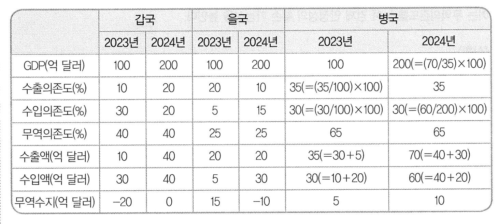

예를 들면, 갑국의 2024년 수입액이 40억 달러이고, 을국의 2024년 수입액이 30억 달러이므로, 병국의 2024년 수출액이 70억 달러라는 것을 추리할 수 있다. 또한 이 정보와 병국의 2024년 수출의존도가 35%라는 것으로부터 병국의 2024년 GDP는 200억 달러라는 것을 추리할 수 있다.

### <보기> 해설

ㄱ. 병국의 2024년 무역수지는 10억 달러 흑자이다. ㄱ은 옳은 추론이다.

ㄴ. 병국의 2024년 GDP는 200억 달러이다. ㄴ은 옳은 추론이다.

ㄷ. 세 국가 모두 2024년 무역의존도는 전년 대비 변화가 없다. 결국 무역의존도 기준으로 경제 안정성의 훼손 가능성이 변화한 국가는 없다. ㄷ은 옳은 추론이다.

<보기>의 ㄱ, ㄴ, ㄷ 모두 옳은 추론이므로 정답은 (5)이다.

## 33

### 문항구분

* 문항 성격 : 모형 추리
* 내용영역 : 논리학ㆍ수학
* 평가 목표 : 이 문항은 주어진 조건으로부터 <보기>의 진술이 옳게 추론되는지 판단하는 능력을 평가하는 문항이다.

* 정답 : (1)

### 제시문 해설

갑, 을, 병, 정 네 사람은 2024. 7. 6.부터 2024. 7. 9.까지 각각 다른 날 구치소에 구금되었고, 2024. 7. 10.부터 2024. 7. 13.까지 각각 다른 날 석방되었다. 문제의 조건은 다음과 같다.

(1) 네 사람 중 갑의 구금 일수가 가장 적고 정의 구금 일수가 가장 많다.

(2) 을과 병의 구금 일수는 같고, 이 두 사람만 구금 일수가 같다.

(3) 정의 석방 일자는 2024. 7. 13.이 아니다.

(4) 정이 구금된 날, 병은 이미 구금되어 있었다.

구금된 날짜가 2024. 7. 6., 2024. 7. 7., 2024. 7. 8., 2024. 7. 9., 그리고 석방된 날짜가 2024. 7. 10., 2024. 7. 11., 2024. 7. 12., 2024. 7. 13.이라는 것을 고려하면, 네 사람의 구금 일수의 합계는 ($5 \times 4 = 20$) 20일이다.

(1)번 정보에서 가장 오랫동안 구금된 사람은 정으로, 정의 구금 일수는 6일 이하이다. 그 이유는 (3), (4)로부터 정은 6일에 구금될 수 없고, 13일에 석방될 수 없기 때문이다.

을과 병의 구금 일수가 4일 이하라면, 정의 구금 일수는 6일 이하이므로, 갑의 구금 일수는 6일 이상이 되어 갑의 구금 일수가 가장 적을 수가 없기 때문에 이것은 모순이다. 따라서 을과 병의 구금 일수는 5일씩이다. 네 사람 전체 구금 일수를 합하면 20일이므로, 갑의 구금 일수는 4일이 된다.

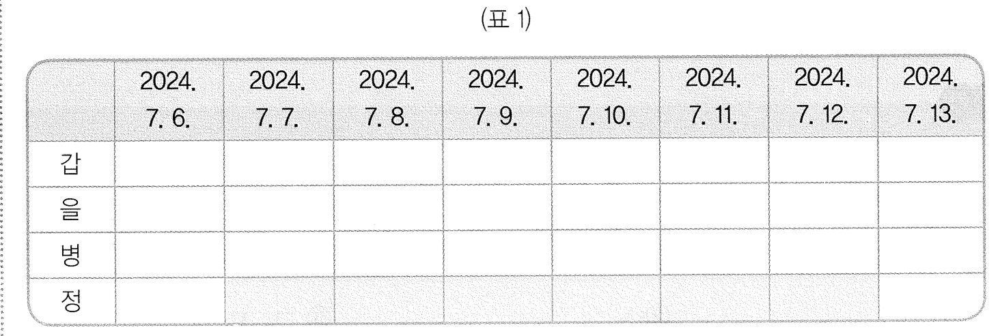

정리해 보면, 정의 구금 일수는 6일이 되고, 2024. 7. 7.에 구금되었고, 2024. 7. 12.에 석방되었다는 것을 알 수 있다.

또한, (4)와 병의 구금 일수는 5일이라는 것으로부터 병은 2024. 7. 6.에 구금되었고 2024. 7. 10.에 석방되었다는 것을 알 수 있다. 을의 구금 일자와 석방 일자를 알아보기 위해, 만약 을이 2024. 7. 8.에 구금되었다고 하면, 2024. 7. 12.에 석방되었고, 이 석방 일자는 정의 석방 일자와 겹치게 된다. 따라서 을은 2024. 7. 9.에 구금되었고 2024. 7. 13.에 석방되었다는 것을 알 수 있다. 따라서 갑은 2024. 7. 8.에 구금되었고 2024. 7. 11.에 석방되었다는 것을 알 수 있다. 아래 (표 2)는 최종적으로 확정된 네 사람의 구금 일자와 석방 일자를 표현하고 있다.

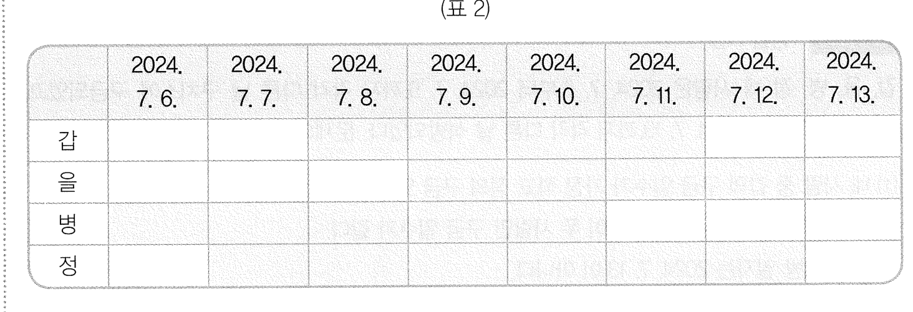

### <보기> 해설

ㄱ. (표 2)에서 을의 구금 일수는 5일이다. ㄱ은 옳은 추론이다.

ㄴ. (표 2)에서 정은 2024. 7. 7.에 구금되었고 2024. 7. 12.에 석방되었음을 알 수 있다. ㄴ은 옳지 않은 추론이다.

ㄷ. (표 2)에서 갑은 2024. 7. 11.에 석방되었고, 병은 2024. 7. 10.에 석방되었다는 것을 알 수 있다. ㄷ은 옳지 않은 추론이다.

<보기>의 ㄱ만이 옳은 추론이므로 정답은 (1)이다.

## 34

### 문항구분

* 문항 성격 : 모형 추리
* 내용영역 : 논리학ㆍ수학
* 평가 목표 : 이 문항은 주어진 조건으로부터 <보기>의 진술이 옳게 추론되는지 판단하는 능력을 평가하는 문항이다.

* 정답 : (4)

### 제시문 해설

병이 진실을 말하고 있든, 거짓을 말하고 있든, 병의 발언에서 정이 먹은 사과는 2개임을 알 수 있다. 그 이유는 병의 발언이 진실이라면 병은 사과를 1개, 정은 사과를 2개 먹은 것이 되고, 병의 발언이 거짓이라면 병은 사과를 2개, 정은 사과를 2개 먹은 것이 된다. 따라서 정이 먹은 사과의 개수는 2개이다. 이로부터, 정의 발언은 거짓이 되므로, 을은 사과를 1개 먹었다. 또한, 을이 사과를 1개 먹었으므로, 을의 발언은 참이고, 갑에게 남은 사과는 4개라는 것을 알 수 있다. 그리고 정은 사과를 2개 먹었으므로 갑의 발언은 거짓이고 갑은 사과를 2개 먹었다. 따라서 갑은 처음에 6개의 사과를 가지고 있었다.

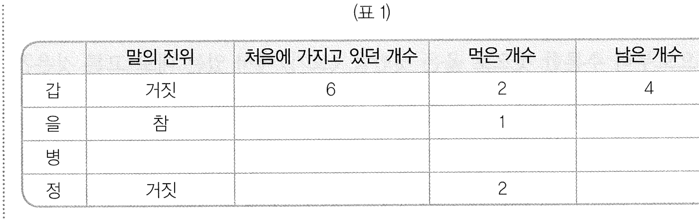

이제, 을이 처음에 가지고 있던 사과의 개수를 보자. 을이 처음에 가지고 있던 사과의 개수는 4개, 5개, 7개가 가능하다. 각각의 경우를 살펴보자.

(1) 을이 처음에 사과를 4개 가지고 있는 경우

을에게 남은 사과의 개수는 3개가 된다. 또한 정이 처음에 가지고 있던 사과의 개수는 5개 또는 7개이다. 만약 정이 처음에 5개의 사과를 가지고 있었다면, 정에게 남은 사과의 개수는 3개이고 이 개수는 을에게 남은 사과의 개수와 같으므로 모순이다. 따라서 정이 처음에 가지고 있던 사과의 개수는 7개이다. 이때 정에게 남은 사과의 개수는 5개가 된다. 그리고 병은 처음에 5개의 사과를 가지게 된다. 따라서 병에게 남은 사과의 개수는 3개 또는 4개이다. 하지만, 이는 갑 또는 을의 남은 사과의 개수와 같게 된다. 결국 모순이 발생하므로, 을은 처음에 사과를 4개 가지고 있지 않다.

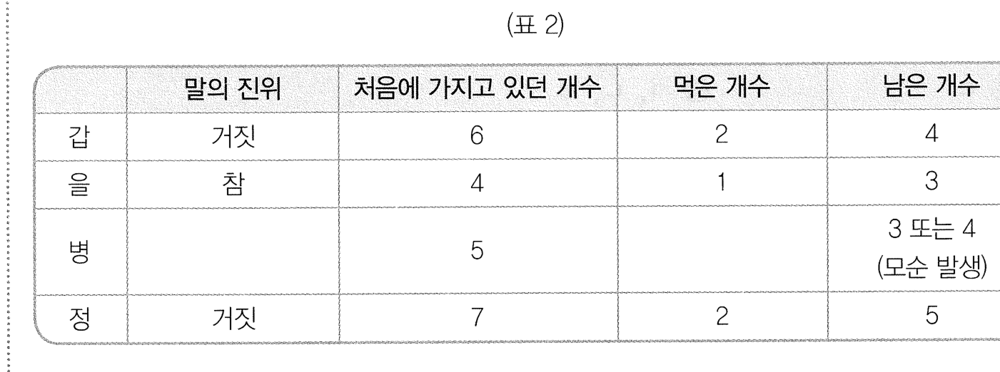

(2) 을이 처음에 사과를 5개 가지고 있는 경우

을에게 남은 사과의 개수는 4개가 되어 갑에게 남은 사과의 개수와 같아지게 되므로 모순이다.

을이 처음에 가지고 있던 사과의 개수는 4개, 5개, 7개가 가능하다는 것과 (1)과 (2)에 의해, 을은 처음에 사과 7개를 가지고 있었고 을에게 남은 사과의 개수는 6개이다.

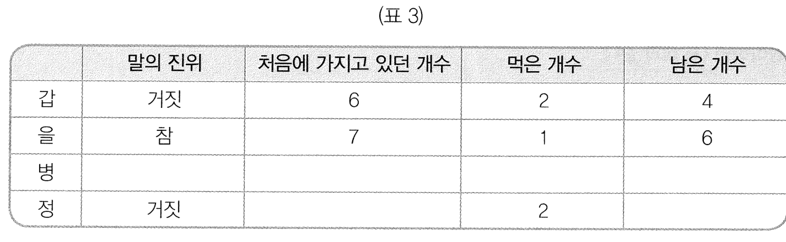

이제 정이 처음에 몇 개의 사과를 가지고 있었는지 보자. 정이 처음에 가지고 있던 사과의 개수는 5개 또는 4개이다.

(3) 정이 처음에 사과를 5개 가지고 있는 경우

이 경우 정에게 남은 사과의 개수는 3개이다. 이때 병이 처음에 가지고 있던 사과의 개수는 4개이고, 병에게 남은 사과의 개수는 2개 또는 3개인데, 이 중 남은 사과의 개수 3개는 정에게 남은 사과의 개수와 같으므로 불가능하다. 따라서 병이 처음에 가지고 있던 사과의 개수는 4개, 남은 사과의 개수는 2개이다.

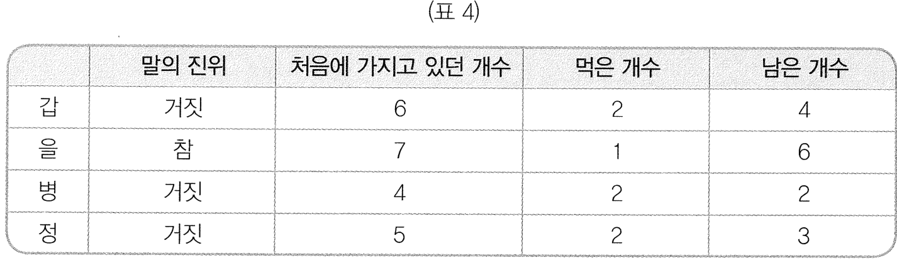

(4) 정이 처음에 사과를 4개 가지고 있는 경우

이 경우 정에게 남은 사과의 개수는 2개이다. 이때 병이 처음에 가지고 있던 사과의 개수는 5개이고, 병에게 남은 사과의 개수는 3개 또는 4개인데, 이 중 남은 사과의 개수 4개는 갑의 남은 사과의 개수와 같으므로 불가능하다. 따라서 병이 처음에 가지고 있던 사과의 개수는 5개, 남은 사과의 개수는 3개이다.

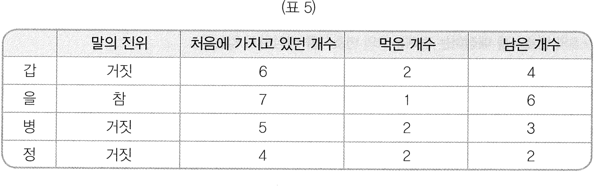

이상의 추론을 종합하면, (표 4)와 (표 5)만이 가능하다는 것을 알 수 있고 이것을 하나의 표로 정리하면 (표 6)과 같다.

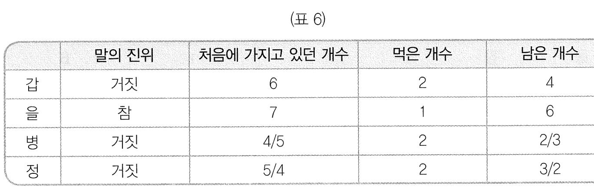

### <보기> 해설

ㄱ. (표 6)에서 갑이 처음에 가지고 있던 사과는 6개이다. ㄱ은 옳지 않은 추론이다.

ㄴ. (표 6)에서 을에게 남은 사과는 6개이다. ㄴ은 옳은 추론이다.

ㄷ. (표 6)에서 병이 먹은 사과의 개수와 정이 먹은 사과의 개수는 2개로 같다. ㄷ은 옳은 추론이다.

<보기>의 ㄴ, ㄷ만이 옳은 추론이므로 정답은 (4)이다.

## 35

### 문항구분

* 문항 성격 : 모형 추리
* 내용영역 : 논리학ㆍ수학
* 평가 목표 : 이 문항은 주어진 조건으로부터 <보기>의 진술이 옳게 추론되는지 판단하는 능력을 평가하는 문항이다.

* 정답 : (4)

### 제시문 해설

주어진 조건은 다음과 같다.

(1) 어느 팀에도 배정되지 않는 변호사는 없으며, 둘 이상의 팀에 배정되는 변호사도 없다.

(2) 각 팀에는 최소 3개 법무법인의 변호사를 배정한다.

(3) P의 변호사 중 3명을 C팀에 배정한다.

(4) S의 변호사를 배정하는 팀에는 P의 변호사를 배정하지 않는다.

(5) Q의 변호사를 배정하는 팀에는 P의 변호사를 최소 2명 배정한다.

주어진 조건 (3)의 정보를 다음과 같이 (표 1)로 나타낼 수 있다.

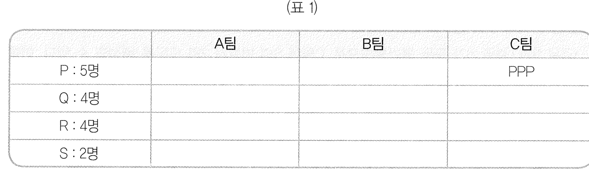

만약 S의 변호사 2명을 서로 다른 팀에 배정하면, S의 변호사를 배정한 두 팀에는 P의 변호사를 배정할 수 없고, 나머지 한 팀에는 Q의 변호사를 배정하려면 P의 변호사를 최소 2명 배정해야 한다. 이 경우 어느 한 팀에는 P의 변호사와 S의 변호사가 배정될 수 없기 때문에 이것은 (2)와 모순된다.

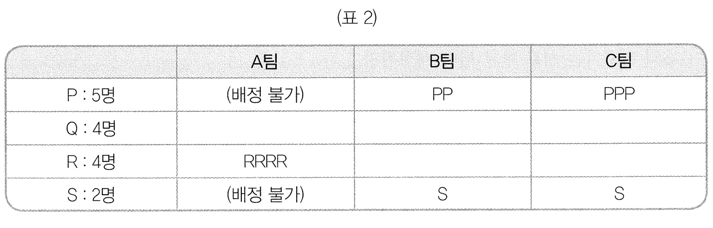

따라서 3개 팀 중 1개 팀에 S의 변호사 2명 전부를 배정해야 한다. 따라서 다음 경우로 나눌 수 있다.

(경우 1) A팀에 S의 변호사 2명 모두 배정한 경우

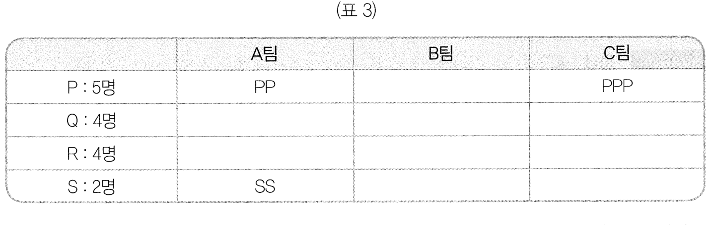

이제, S의 변호사 2명과 P의 변호사 5명 모두 A팀 또는 C팀에 배정되었다. 그러므로 B팀에 S의 변호사도 P의 변호사도 배정할 수 없고 이것은 (2)와 모순된다. 따라서 이 경우는 불가능하다.

(경우 2) B팀에 S의 변호사 2명 모두 배정한 경우

(경우 1)과 유사하게, 이 경우도 A팀에 S의 변호사도 P의 변호사도 배정할 수 없고 이것은 (2)와 모순된다. 따라서 이 경우도 불가능하다.

(경우 1)과 (경우 2)가 모두 불가능하므로, C팀에 S의 변호사 2명 모두를 배정할 수 있다. 이를 표로 나타내면 (표 4)와 같다.

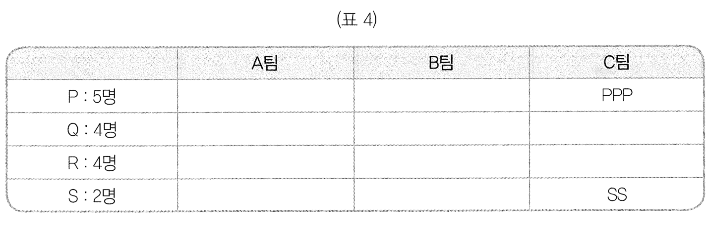

P의 변호사는 총 5명이므로 P의 변호사 2명이 A팀 또는 B팀에 배정된다.

만약 P의 변호사 2명 모두가 A팀에 배정되어 있으면, S와 P의 모든 변호사는 A팀 또는 C팀에 배정되어 있으므로 B팀에 배정되는 변호사는 Q 또는 R의 변호사밖에 없다. 이것은 (2)와 모순되므로 P의 변호사 2명 모두가 A팀에 배정될 수 없다. 비슷한 추론에 의해 P의 변호사 2명 모두가 B팀에 배정될 수 없다. 따라서 P의 변호사 1명은 A팀에, 다른 1명은 B팀에 배정된다. 이것을 표로 나타내면 (표 5)와 같다.

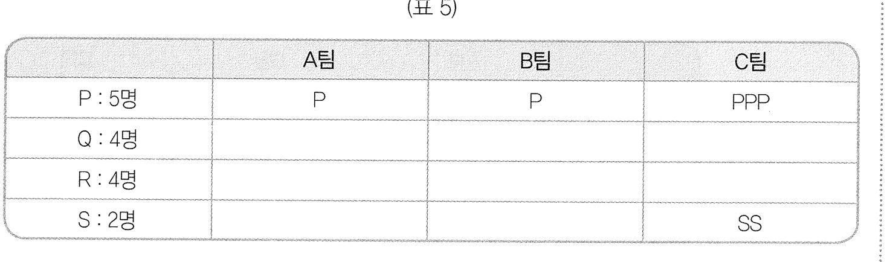

### <보기> 해설

ㄱ. (표 5)에서, S의 변호사 2명 모두 C팀에 배정된다. ㄱ은 옳지 않은 추론이다.

ㄴ. (표 5)에서, P, Q, R의 변호사로 구성된 팀이 있다면 A팀이거나 B팀이다. 예를 들어, A팀이 P, Q, R의 변호사를 배정하여 총 7명으로 구성된 팀이라고 가정하자. A팀에 P의 변호사는 1명이 배정되어 있으므로, 나머지 6명을 Q와 R의 변호사를 배정해야 한다. Q와 R의 변호사 총수는 8명이므로 6명이 A팀에 배정된다면 나머지 2명으로 B팀과 C팀에 배정해야 하는데, 어떻게 배정하여도 B팀, C팀 모두에 3개 법무법인의 변호사를 배정하는 것은 불가능하다. 따라서 A팀이 P, Q, R의 변호사로 구성된 총원 7명인 팀일 수 없다.

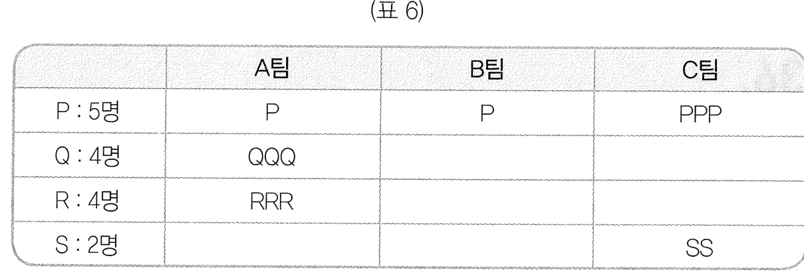

비슷한 방법으로, B팀이 P, Q, R의 변호사로 구성된 총원 7명인 팀일 수 없다. 따라서 P, Q, R의 변호사로 구성된 총원 7명인 팀은 없다. ㄴ은 옳은 추론이다.

ㄷ. A팀에 배정된 변호사가 6명이라고 가정하자. 이 경우, (표 5)에서 (2)를 만족하기 위해서는 A팀에 Q의 변호사 3명과 R의 변호사 2명을 배정하거나 Q의 변호사 2명과 R의 변호사 3명을 배정해야 한다. 어떤 경우든 Q, R의 변호사 3명이 남는다. (2)를 만족하기 위해, 이들 중 1명만이 C팀에 배정되어야 하고 나머지 2명이 B팀에 배정되어야 한다. 따라서 B팀의 변호사 수는 3명이다.

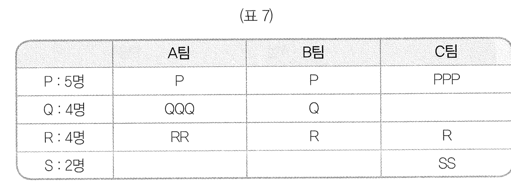

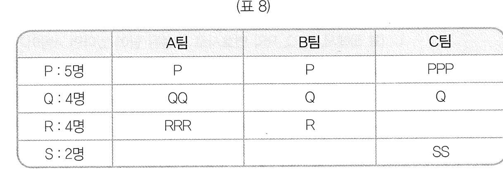

따라서 ㄷ은 옳은 추론이다.

<보기>의 ㄴ, ㄷ만이 옳은 추론이므로 정답은 (4)이다.

## 36

### 문항구분

* 문항 성격 : 언어 추리
* 내용영역 : 과학기술
* 평가 목표 : 이 문항은 물체가 에너지를 흡수 및 방출하는 과정에 대한 설명을 바탕으로, 온실효과와 관련된 현상과 성질을 추론하는 능력을 평가하는 문항이다.

* 정답 : (2)

### 제시문 해설

온실기체가 에너지를 흡수하고 방출하는 현상은 온실효과에 핵심적인 역할을 한다. 온실효과를 이해하려면, 지구가 태양의 복사에너지를 받아 열적 평형에 도달하는 과정을 살펴보아야 한다. 지구를 포함한 태양계의 행성은 태양으로부터 복사에너지(빛 혹은 전자기파)를 받고, 이와 같은 크기의 에너지를 우주로 방출해 열적 평형에 도달한다. 지구의 복사에너지 방출은 온도를 가진 물체가 자발적으로 에너지를 방출하는 메커니즘을 통해 일어나는데, 지구 온도가 높아지면 보다 많은 에너지가 방출된다. 태양이 방출하는 에너지는 자외선, 가시광선, 적외선을 포함한 다양한 파장의 전자기파 스펙트럼의 빛으로 구성되어, 지구는 이렇게 다양한 파장의 전자기파 스펙트럼의 빛을 받는다. 반면 지구로부터 방출되는 에너지는 주로 적외선으로 구성된다. 지구에 대기가 없다면, 태양으로부터 지구가 받은 에너지는 바로 우주로 방출되어, 열적 평형 상태가 된다. 하지만 지구의 대기, 특히 온실가스의 존재는, 바로 우주로 방출되어야 할 에너지를 잠시 흡수해, 온도가 높아진 상태의 열적 평형 상태를 만든다. 중요한 점은, 지구 입장에서 들어온 에너지와 나가는 에너지의 크기는 결국에는 같아지지만, 이러한 열적 평형 상태는 지구의 온도가 낮은 상태로 있을 때도 달성되고, 높은 상태로 있을 때도 달성된다는 것이다. 참고로 지구의 온도는 지구 위치에 따라 모두 다르지만, 제시문에서 표시한 온도는 지구의 평균온도로 생각할 수 있다.

### <보기> 해설

ㄱ. 제시문에 의하면 지구 대기 중에 메테인은 이산화탄소보다 훨씬 적게 존재하지만(“메테인은 대기 중 농도가 이산화탄소의 0.5%에 불과”), 온실효과에 대한 기여도는 3분의 1에 달한다. 이로부터 분자당 온실효과에 대한 기여도는 메테인이 이산화탄소에 비해 크다고 추론할 수 있다. 온실효과에 대한 기여도는 온실기체분자가 적외선 에너지를 흡수했다가 다시 방출하는 양에 의해 결정되므로, 온실효과에 대한 기여도가 크다는 것에서 분자당 적외선 흡수량이 크다는 것을 추론할 수 있다. 이에 분자당 적외선 흡수량은 메테인이 이산화탄소보다 크다. ㄱ은 옳지 않은 추론이다.

ㄴ. 제시문에서 온실효과는 온실기체가 우주로 바로 빠져나가야 할 에너지의 일부를 지구로 돌려보내기 때문에 나타난다. 지구로 되돌려진 만큼의 에너지는 결국에는 방출되어 지구는 열적 평형 상태에 도달한다. 이때 지구의 온도는 온실효과가 없을 때보다 높아진 상태로 유지되기 때문에 지구의 현재 대기의 양과 구성 성분 비율이 고정된다면 지구의 온도는 현재와 같다는 것을 추론할 수 있다. 따라서 ㄴ은 옳지 않은 추론이다. (참고로 대기권에 온실기체가 사라진다면 온실효과 역시 사라져 지구의 온도는 매우 낮아진 상태로 유지된다. 온실기체가 포함된 대기가 없다면 지구의 기온은 섭씨 영하 20도 정도로 떨어져 유지될 것으로 예상된다. 온실효과는 지구 생명체의 존속을 위해 필요하다.)

ㄷ. 제시문에 의하면 메테인은 온실기체 중 하나이며, 온실효과에 큰 기여를 한다. 이에 다른 조건이 같을 때, 지구 대기에서 메테인이 완전히 사라진다면 온실효과는 완화된다는 것을 추론할 수 있다. ㄷ은 옳은 추론이다.

<보기>의 ㄷ만이 옳은 추론이므로 정답은 (2)이다.

## 37

### 문항구분

* 문항 성격 : 언어 추리
* 내용영역 : 과학기술
* 평가 목표 : 이 문항은 생명체 내에서 일어나는 에너지 생성 과정을 생화학적으로 표준환원전위를 이용해 설명하는 제시문을 이해하고 이로부터 <보기>의 진술이 추론되는지 판단하는 능력을 평가하는 문항이다.

* 정답 : (3)

### 제시문 해설

표준환원전위($E_0'$)는 어떤 물질이 전자를 주고받을 수 있는 상대적인 능력을 수치화한 값으로 어떤 물질이 전자를 받아서 환원되려고 하는 경향성을 나타내는 값이다. 즉, 전자의 이동은 표준환원전위가 작은 물질로부터 큰 물질로 일어나며, 이 과정에서 나오는 에너지($\Delta G$)는 $-nF\Delta E_0'$($n$은 이동하는 전자 수, $F$는 패러데이 상수, $\Delta E_0'$는 $E_0'$ 차이)이므로 $\Delta E_0'$를 통해 에너지를 계산할 수 있다. 예를 들어, $E_0'$가 작은 NADH($E_0'=-0.32V$)에 저장된 전자는 NADH보다 $E_0'$가 큰 산소($E_0'=+0.82V$)로 이동할 것이다. 따라서 NADH에 2개의 전자가 저장된 형태인 NADH로부터 2개의 전자가 산소로 이동하게 되면 NAD+와 H2O가 생성되고 NADH와 산소의 $E_0'$ 차이(1.14V)에 의해 3분자의 ATP가 합성된다.

### <보기> 해설

ㄱ. 제시문의 ‘표준환원전위($E_0'$)는 전자를 받아서 환원되려고 하는 물질의 경향성을 수치화하여 나타낸 것이다. $E_0'$가 큰 물질일수록 전자를 받아 환원되려는 경향성이 크므로 $E_0'$가 작은 물질로부터 큰 물질로 전자가 이동한다.’로부터 $E_0'$가 작은 물질일수록 전자를 잃을 경향성이 크다는 것을 추론할 수 있다. ㄱ은 옳은 추론이다.

ㄴ. NAD+에 전자가 저장된 형태인 NADH로부터 전자가 산소로 이동할 때 나오는 에너지는 NADH와 산소의 $E_0'$ 차이(1.14V)에 비례하고 이에 의해 3분자의 ATP가 합성된다. 하지만, FAD에 전자가 저장된 형태인 FADH2로부터 전자가 산소로 이동할 때는 2분자의 ATP가 합성된다고 했으므로 FADH2와 산소의 $E_0'$ 차이는 1.14V보다 작아야 된다. 따라서 FAD의 $E_0'$는 NAD+의 $E_0'$(-0.32V)보다 커야 된다. ㄴ은 옳은 추론이다.

ㄷ. 질산염의 $E_0'$는 +0.42V이고 푸마르산의 $E_0'$는 +0.03V이므로 둘 다 산소의 $E_0'$인 +0.82V에는 미치지 못하지만 그 차이가 더 작은 것은 질산염이므로, 산소가 없고 질산염과 푸마르산이 있는 경우 대장균은 포도당으로부터 더 많은 에너지를 얻기 위해 최종 전자수용체로 질산염을 사용할 것이다. ㄷ은 옳지 않은 추론이다.

<보기>의 ㄱ, ㄴ만이 옳은 추론이므로 정답은 (3)이다.

## 38

### 문항구분

* 문항 성격 : 언어 추리
* 내용영역 : 과학기술
* 평가 목표 : 이 문항은 운동량 보존법칙, 역학적 에너지 보존법칙을 이해하고, 이와 관련된 주어진 <상황>으로부터 물체의 물리량을 올바르게 추론할 수 있는 능력을 평가한다.

* 정답 : (3)

### 제시문 해설

제시문은 운동량 보존법칙과 역학적 에너지 보존법칙에 대한 설명이며, 이 두 보존법칙을 활용해 다양한 상황에서 물체의 물리량을 추론할 수 있다. 문제의 <상황>에서 주어진 상황은 외부와의 상호작용이 없고, 마찰이나 공기의 저항 등에 의한 에너지 손실이 없기에, 운동량 보존법칙과 역학적 에너지 보존법칙이 모두 성립한다. 나아가 물체 A, 물체 B, 용수철로 이루어진 계(system)는 처음에 정지해 있었기 때문에 운동량은 0으로 보존된다는 것을 추론할 수 있다. <상황>의 계의 에너지를 살펴보자. 처음에는 용수철이 압축되어 있으므로 탄성력에 의한 퍼텐셜에너지가 존재하지만, 물체 A와 물체 B는 정지해 있으므로 운동에너지는 0이고, 처음 시작하는 높이를 기준 높이로 보면 중력에 의한 퍼텐셜에너지도 0으로 볼 수 있다. 두 물체가 분리되어 움직이기 시작하면, 용수철이 갖고 있던 탄성력에 의한 퍼텐셜에너지가 물체 A와 물체 B의 운동에너지로 전환된다. 이때 물체 A와 물체 B의 운동에너지는 운동량 보존법칙에 의해 결정되는 속도를 알면 구할 수 있다. 빗면을 올라가기 전, 두 물체의 높이는 변하지 않으므로, 위치에너지는 여전히 0이다. 이 두 물체의 운동에너지는 두 물체가 빗면을 올라가면 각각 중력에 의한 위치에너지로 전환된다. 두 물체가 최대 높이에 도달하면 이때 속력은 0이므로, 운동에너지는 0이 된다.

### <보기> 해설

ㄱ. 두 물체와 스프링으로 이루어진 계(system)는 처음 분리되기 전 정지 상태에 있었기 때문에 이때 운동량은 0이다. 제시문에 의하면 운동량은 보존되기 때문에, 스프링에 의해 물체 A와 B는 반대 방향으로 진행할 때 총 운동량은 0이 되어야 한다. 즉, 물체 A가 한 방향으로 움직이는 운동량의 크기와 물체 B가 반대 방향으로 움직이는 운동량의 크기는 같다. 운동량은 질량과 속도를 곱한 물리량이므로, 속도의 비는 처음 탄성력에 의한 퍼텐셜에너지의 크기와는 관계가 없으며, 두 물체의 질량의 비에 의해서만 정해진다는 것을 추론할 수 있다. 역학적 에너지 보존으로부터 속도의 비가 정해지면 최고 높이의 비율도 정해진다. 이로부터 처음 계가 갖고 있던 탄성력에 의한 퍼텐셜에너지의 크기와 최고 높이의 비율이 무관하다는 것을 알 수 있다. 용수철이 처음 압축된 정도가 달라지면 탄성력에 의한 퍼텐셜에너지의 크기가 달라지므로, 결국 최고 높이의 비율은 용수철이 처음 압축된 정도와 무관하다는 것을 추론할 수 있다. ㄱ은 옳은 추론이다.

ㄴ. 제시문에 의하면 운동량은 보존된다. <상황>에서 두 물체와 스프링으로 이루어진 계(system)는 처음 분리되기 전 정지 상태에 있었기 때문에 이때 운동량은 0이다. 스프링에 의해 물체 A와 B는 반대 방향으로 진행하는데, 이때 총 운동량을 0으로 만들기 위해서는 물체 A가 한 방향으로 움직이는 운동량의 크기는 물체 B가 반대 방향으로 움직이는 운동량의 크기와 같아야 한다. 따라서 분리된 순간 A와 B의 운동량 크기의 비는 질량비와 상관없이 1 : 1이다. ㄴ은 옳지 않은 추론이다.

ㄷ. 두 물체를 놓기 직전의 계의 역학적 에너지는 용수철의 탄성력에 의한 퍼텐셜에너지만 있으며, 이 역학적 에너지는 보존된다. 이 역학적 에너지는 두 물체 A와 B의 운동에너지로 전환되었다가, 최종적으로는 A와 B의 중력에 의한 퍼텐셜에너지로 전환된다. A와 B가 각각 최고점에 올라갔을 때, A와 B의 운동에너지는 모두 중력에 의한 퍼텐셜에너지로 각각 전환되었다. 따라서 두 물체가 최고점에 올라갔을 때의 중력에 의한 퍼텐셜에너지의 합은 두 물체를 놓기 직전의 탄성력에 의한 퍼텐셜에너지와 같다. ㄷ은 옳은 추론이다.

<보기>의 ㄱ, ㄷ만이 옳은 추론이므로 정답은 (3)이다.

## 39

### 문항구분

* 문항 성격 : 논쟁 및 반론
* 내용영역 : 과학기술
* 평가 목표 : 이 문항은 일반적으로 정의되는 생물학적 종의 개념과 ‘우의 삼각형 모델’에 관한 글로부터 <보기>의 진술이 추론될 수 있는지 평가하는 문항이다.

* 정답 : (3)

### 제시문 해설

생물학적 종의 개념, 즉 종이란 다른 집단과는 생식적으로 격리되어, 집단 내 상호교배가 가능한 개체군의 집단이라는 것은 일반적으로 사용되고 있지만, 완벽한 정의가 아니기 때문에 많은 문제점을 가지고 있다. 예를 들어, A와 B가 교배가 가능하고 B와 C가 교배가 가능하지만, C와 A는 교배가 불가능한 경우에, A와 B는 같은 종이고 B와 C는 같은 종이므로 A와 C도 같은 종이 되어야 하지만, C와 A는 교배가 불가능하므로 A와 C가 같은 종이 아니라는 상황도 발생한다. 따라서 다윈의 진화론에 따른 생물학적 종 형성은 많은 문제점을 가지고 있다. 제시문에서는 감수분열과 수정과정에 문제가 생겨 비정상적인 배수체 상태가 되어도 정상적으로 발생 가능한 식물을 이용하여, 다윈의 진화론에 의한 종 분화, 즉 종 형성 이외에도 서로 다른 종 사이에서 새로운 종, 즉 합성종이 생겨난다는 우장춘 박사의 ‘우의 삼각형 모델’을 설명하고 있다.

### <보기> 해설

ㄱ. 우의 삼각형 모델에 따르면 배추속에 속하는 다른 두 종간의 자연적 교배를 통해 한 종의 염색체에 다른 종의 염색체가 추가되어 두 종의 염색체를 모두 가지는 또 다른 종이 생성된다고 했으므로 흑겨자($n=8$)와 양배추($n=9$) 사이의 합성종인 에티오피아 겨자의 염색체 수($n$)는 17임을 추론할 수 있다. 따라서 에티오피아 겨자의 염색체 수($n$) 17은 흑겨자의 염색체 수($n$) 8보다 크므로, ㄱ은 옳은 분석이다.

ㄴ. ㉠에 따르면 종이란 상호교배가 가능한 개체군의 집단이고, 배추와 양배추는 상호교배가 가능함이 밝혀졌으므로, 배추와 양배추는 다른 종으로 볼 수 없다. 또한 ㉡에 따르면 배추속에 속하는 다른 두 종간의 자연적 교배를 통해 또 다른 종이 생성된다고 했는데, 배추와 흑겨자가 교배되어 갓이 만들어졌으므로 흑겨자와 갓은 다른 종으로 볼 수 있다. 따라서 ㄴ은 옳은 분석이다.

ㄷ. ㉠이 말티즈($n=39$)와 푸들($n=39$)을 같은 종으로 분류하고 있고 이들 사이에서 염색체의 변화가 없는 말티푸($n=39$)가 태어났으므로, 말티즈, 푸들, 말티푸는 모두 같은 종이다. 다른 두 종간의 자연적 교배를 통해 한 종의 염색체에 다른 종의 염색체가 추가되어 두 종의 염색체를 모두 가지는 또 다른 종이 만들어진다는 ㉡(우의 삼각형 모델)은 염색체 수가 모두 같은 이들 애완견에 적용할 수 없다. 따라서 말티즈($n=39$)와 푸들($n=39$) 사이에서 말티푸($n=39$)가 태어났을 때, ㉡에 사용된 종의 합성 이론은 푸들과 말티푸를 다른 종으로 분류한다는 것은 틀린 진술이다. ㄷ은 옳지 않은 분석이다.

<보기>의 ㄱ, ㄴ만이 옳은 분석이므로 정답은 (3)이다.

## 40

### 문항구분

* 문항 성격 : 논증 평가 및 문제해결
* 내용영역 : 과학기술
* 평가 목표 : 이 문항은 스테로이드계 호르몬과 펩타이드계 호르몬의 작용 메커니즘을 이해하고 이를 적용한 <실험>의 결과를 적절히 분석하여 가설을 검증할 수 있는 능력을 평가하는 문항이다.

* 정답 : (1)

### 제시문 해설

극성도의 차이로 인해서, 스테로이드계 호르몬은 세포막을 자유롭게 통과하여 세포 내부에서 직접적으로 작용하지만 세포막을 통과하지 못하는 펩타이드계 호르몬은 세포 표면 수용체를 통해 세포 내부로 신호를 전달한다. 식물 호르몬인 브라시노라이드(BR)는 스테로이드계 호르몬임에도 불구하고 세포막을 통과하지 못하기 때문에 펩타이드계 호르몬처럼 세포 표면 수용체와 세포 내부 신호전달 단백질을 이용하는 것으로 최근 밝혀졌는데, 이를 규명하는 실험의 일부가 소개되고 있다.

### <보기> 해설

ㄱ. 제시문의 “대부분의 스테로이드계 호르몬은 극성도가 낮아 세포막을 쉽게 투과하여 세포 내부에서 직접적으로 신호전달 물질로 작용하지만, 대부분의 펩타이드계 호르몬은 극성도가 높아 세포막을 투과하지 못한다.”로부터 극성도가 높을수록 세포막을 잘 투과할 수 없다는 것을 알 수 있다. 또한 “동물 스테로이드계 호르몬은 세포막을 쉽게 투과하지만, 식물의 생장을 촉진하는 식물 스테로이드계 호르몬인 브라시노라이드(BR)는 … 세포막을 쉽게 투과하지 못하는 것으로 알려져 있다.”라고 제시되어 있다. 따라서 ‘동물과 식물 스테로이드계 호르몬의 세포막 투과도 차이가 극성에 의해서만 결정된다면, BR은 동물 스테로이드계 호르몬보다 극성도가 높을 것이다.’는 옳은 분석이다.

ㄴ. <실험>에서 BR을 처리했을 때, B는 저해된 생장이 회복되었으므로 BR 생합성 유전자에 돌연변이가 일어났음을 알 수 있고, A는 저해된 생장이 회복되지 않았으므로 BR 수용체 유전자에 돌연변이가 일어났음을 알 수 있다. 따라서 <실험>은 ‘A는 BR을 합성하지 못하고, B는 BR 수용체에 이상이 있다.’라는 가설을 강화하지 않는다. ㄴ은 옳지 않은 분석이다.

ㄷ. C는 신호전달 단백질 유전자에만 돌연변이가 일어나 생장이 저해된 표현형을 가지므로 BR은 정상적으로 합성하고 있다. 따라서 C는 단순히 BR을 첨가한다고 해서 저해된 생장이 회복될 수 없으므로, BR 처리 후 저해된 생장이 회복되지 않는 A와 유사한 표현형을 나타낼 것이다. 따라서 ‘BR 처리 후, A와 C는 유사한 표현형을 나타낼 것이다.’는 옳지 않은 분석이다.

<보기>의 ㄱ만이 옳은 분석이므로 정답은 (1)이다.
