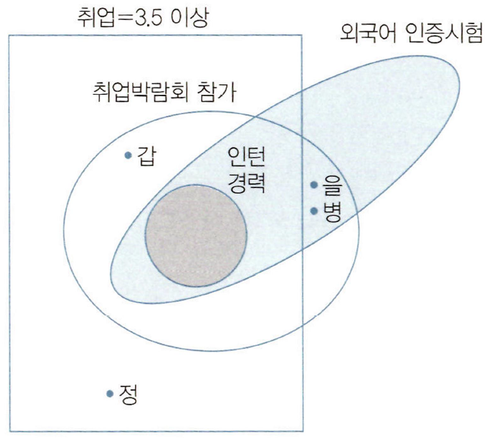

# 출제방향

## 1. 출제의 기본방향

추리논증 시험은 제시문에서 주어진 내용을 단순히 문자적으로 이해하는 것만으로는 해결할 수 없고 제시된 글이나 상황을 논리적으로 분석하고 비판할 수 있어야 해결할 수 있도록 문제로 구성하여 추리력과 비판력을 측정하는 시험이 되도록 하였다. 특히 전공에 따른 유·불리를 최소화하도록 정상적인 학업과 독서 생활을 통하여 사고력을 함양한 사람이면 누구나 해결할 수 있는 내용을 다루되, 주어진 제시문의 내용에 관한 선지식이 문제 풀이에 크게 도움이 되지 않도록 하였다.

전 학문 분야 및 일상적, 실천적 영역에 걸쳐 다양하게 문항의 제재를 선택함으로써 대학에서 특정 전공자가 유리하거나 불리하지 않도록 영역 간 균형 잡힌 제재 선정을 위해 노력하는 한편, 제시문으로 선택된 영역의 전문 지식이 문항 해결에 미치는 영향을 최소화하는 데에도 주력하였다. 시험의 성격상, 법을 비롯한 규범학의 제시문을 다소 많이 포함시켰으나, 제시문 및 질문을 최대한 순화하여 법학적 지식 없이 일상적 언어능력과 사고력만으로 제시문을 읽어 내고 문제를 해결할 수 있도록 하였다.

추리능력을 측정하는 문항은 예년에 비해서 원리적용 문제를 늘림으로써 법학적성시험의 취지에 맞추려고 노력하였다. 어떤 규정이나 원칙을 주고 그 원칙을 적용한 사례를 추리하거나 주어진 규정이나 원칙을 적용한 사례가 적절한지 평가하는 능력이 법학을 배우는 학생들에게 중요하다고 생각하여 규범 영역에서 원리적용 문제의 비중을 늘렸고, 인문과 사회과학 영역에서도 원리적용 유형의 문제를 출제하였다.

## 2. 출제 범위 및 문항 구성

추리논증 시험은 법학과 윤리학 등의 규범학을 비롯하여 인문, 사회과학, 자연과학과 같은 다양한 학문적인 소재를 균형 있게 다루었다. 이번 시험의 소재 구성도 예년과 큰 차이가 없었다. 법 관련 제재를 다루는 문항 9문항과 윤리학을 포함한 인문학 제재를 다루는 문항 10문항, 사회과학 제재를 다루는 문항 5문항, 자연과학과 융·복합적 제재를 다루는 문항 7문항, 그리고 일상적 논증과 논리·수리적 추리를 다루는 문항 4문항으로 구성하여 다양한 성격의 글들을 골고루 포함하였다.

올해 추리논증 시험은 원리적용의 문항을 늘리기 위해서 추리문항을 70% 정도로 늘리고, 비판(논증)문항을 30% 정도로 출제하였다.

## 3. 난이도

제시문의 이해도를 높이기 위해서 가능한 전문적인 용어를 순화하였고 지나치게 전문적인 글을 배제하였다. 또한 제시문의 분량이 많아 수험생들이 한정된 시간 내에 문제를 해결하지 못하는 일이 없도록 하기 위해서 문항의 글자 수를 줄여서 독해의 부담을 최소화하도록 하였고, 모든 제시문이 전공 여부에 상관없이 누구나 어렵지 않게 접근할 수 있도록 함으로써 난이도를 조절하였다.

특히 지금까지 자주 출제되었던 형식추리 문항이나 논리게임의 문항도 난도를 낮춤으로써 많은 수험생들이 해결할 수 있도록 하였다. 논증이나 논쟁적 자료를 분석하고 비판하도록 요구하는 문항들의 난도도 작년에 비해 낮추도록 하였다.

## 4. 출제 시 유의점

* 제시문을 분석하고 평가하는 데 충분한 시간을 사용할 수 있도록 제시문의 독해 부담을 줄이도록 하였다. 그렇게 함으로써 추리논증을 시험을 통해서 측정하고자 하는 추리능력과 비판능력을 측정할 수 있는 문항으로 구성하고자 하였다.
* 추리 문항도 복잡한 형식추리나 모형추리의 문제보다도 법학적성시험의 취지에 맞게 원리적용의 언어추리 문항을 크게 늘렸다.
* 선지식에 의해 풀게 되거나 전공에 따른 유·불리가 분명해지는 제시문의 선택과 문항의 출제를 지양하였다.
* 출제의 의도를 감추거나 오해하게 하는 질문을 피하고, 평가하고자 하는 능력을 정확히 평가할 수 있도록 간명한 형식을 취하였다.
* 문항 및 선택지 간의 간섭을 최소화하고, 선택지 선택에서 능력에 따른 변별이 이루어질 수 있도록 하였다.

---

# 문항별 해설

## 01

### 문항구분

* 문항 성격 : 규범 - 논증 평가 및 문제해결

* 평가 목표 : 행정의 법률 유보의 원칙에 관하여 설명한 제시문을 이용해서 원칙의 적용 범위에 관해 다른 견해의 입장 차이를 제대로 파악하고 적용할 수 있는 능력을 평가함

### 제시문 해설

* 정답 : (5)

제시문은 행정은 법적 근거를 갖고서 이루어져야 한다는 행정상 법률유보의 원칙을 설명하고 이 원칙을 적용할 때 법률에 근거가 없는 경우에는 어떻게 판단할 것인지에 대해, 즉 법률유보의 대상과 범위에 관한 논쟁을 제시하고 있다. A 견해는 침해행정에 있어서 법률유보가 필요하다는 입장으로 권리를 제한하거나 침해하는 행정에는 법적 근거가 필요하지만, 국민에게 이익이 되는 급부행정 등에서는 법적 근거가 없어도 행정을 수행할 수 있다고 보는 입장이다. B 견해는 침해행정이든 급부행정이든 모든 행정영역에 있어서 법률유보가 필요하다는 입장이다. C 견해는 행정을 침해행정 또는 급부행정 등으로 구분하기보다는 기본적인 규범영역에서 중요한 행정영역인지 여부에 따라 법률유보의 필요성을 판단한다는 입장이다.

### <보기> 해설

ㄱ. 시위를 진압하는 행위는 시위참가자의 집회와 결사의 자유를 제한하는, 기본권을 제한하는 행정이고 따라서 개인에게 영향을 미치는 중요한 사항이기도 하므로 이 경우에는 A, B, C 어떤 견해를 따르더라도 법률상 근거가 사전에 필요하다. 따라서 침해행정에 있어서는 법률유보가 필요하다고 보는 A 견해에 따를 때 법에 시위 진압에 관한 근거가 없으면 행정부는 그 행위를 할 수 없다. A에 의할 때 법에 근거가 없으면 시위진압행위를 할 수 없다고 한 ㄱ은 옳은 평가이다.

ㄴ. 재난 구호품을 지급하는 것은 국민의 기본권을 제한하는 사항이 아니고 오히려 국민에게 이익이 되는 행정이다. A 견해는 재난 시 구호품 지급에 관한 사항이 법률에 규정되어 있지 않아도 재난상황에서 국가는 구호품을 지급하여야 한다고 보겠지만, 침해행정이든 급부행정이든 모든 행정영역에 있어서 법률유보가 필요하다는 입장인 B는 이 경우에도 법에 근거가 있어야 구호품을 지급할 수 있다고 볼 것이다. ㄴ은 옳은 평가이다.

ㄷ. 초등학교 무상급식 정책은 기본권을 제한하지 않고 오히려 이익이 되는 행정이다. A에 의하면 법적 근거가 필요 없지만 B에 의하면 그래도 필요하다고 볼 것이다. 초등학교 무상급식 정책이 개인과 공공에게 중요하게 영향을 미치는 행정이라 한다면 C는 개인과 공공에게 중요하게 영향을 미치는 행정은 법률에 근거가 필요하다는 입장이므로 C에 의할 때 법적 근거가 필요하다고 볼 것이다. ㄷ은 옳은 평가이다.

<보기>의 ㄱ, ㄴ, ㄷ 모두 옳은 평가이므로 정답은 (5)이다.

## 02

### 문항구분

* 문항 성격 : 규범 - 언어 추리

* 평가 목표 : 규정의 구조 및 규정이 제시하고 있는 법적 요건을 분석하여 사례에 적용할 수 있는 능력을 평가함

### 제시문 해설

* 정답 : (2)

<규정>에 따르면, 신설합당이 성립하기 위해서는 합동회의의 결의 및 합당등록이 필요하다(제1조 제1항 및 제2항, 제2조 제1항).

합당등록(신청)은 합동회의가 있은 날로부터 14일 이내에 해야 한다(제2조 제1항). 신설합당이 성립한 경우에는 그 소속 시·도당도 합당한 것으로 보는데(제1조 제3항 본문), 합당등록(신청)일로부터 3개월 이내에 변경등록(신청)을 하지 않은 경우에는 기간만료일의 다음 날에 당해 시·도당은 소멸된다(제1조 제3항 단서 및 제4항).

신설합당등록의 경우 그 소속 시·도당의 소재지와 명칭, 대표자의 성명 및 주소를 합당등록(신청)일로부터 120일 이내에 보완하지 않으면 당해 시·도당의 등록이 취소될 수 있다(제2조 제2항 및 제3항).

### <보기> 해설

ㄱ. C당으로의 합당이 성립된 경우에 그 소속 시·도당도 합당한 것으로 본다. 따라서 C당으로의 합당이 성립하기 위해 그 소속 시·도당의 합당이 전제되어야 하는 것은 아니다. ㄱ은 옳지 않은 진술이다.

ㄴ. 합당등록(신청)일로부터 3개월 이내에 변경등록(신청)을 하지 않은 경우에 기간만료일의 다음 날에 당해 시·도당은 소멸된다. 그런데 <사례>에서 합당등록(신청)일이 확정되어 있지 않으므로 기간만료일을 알 수 없다. ㄴ은 옳지 않은 진술이다.

ㄷ. 신설합당등록의 경우 그 소속 시·도당의 대표자의 성명을 합당등록(신청)일로부터 120일 이내에 보완하지 않으면 당해 시·도당의 등록이 취소될 수 있다. 따라서 합당등록(신청)일인 2017년 5월 10일로부터 120일이 되는 날인 2017년 9월 7일까지 대표자의 성명을 보완하지 않으면 당해 시·도당의 등록이 취소될 수 있다. ㄷ은 옳은 진술이다.

<보기>의 ㄷ만이 옳은 진술이므로 정답은 (2)이다.

## 03

### 문항구분

* 문항 성격 : 규범 - 언어 추리

* 평가 목표 : 상이한 견해에 따라 각 규정이 지시하고 있는 법적 요건을 확인하고 규정 상호간의 관계를 파악할 수 있는 능력을 측정함

### 제시문 해설

* 정답 : (5)

제시문의 내용을 정리하면 다음과 같다.

| &lt;규정&gt; &lt;견해&gt; | &lt;규정&gt; A의 적용범위 | &lt;규정&gt; B의 적용범위 | 문서의 파손에 적용되는 &lt;규정&gt; |
|---|---|---|---|
| 갑 | 물건의 효용을 해하는 행위 = 파손 + 은닉 | 문서의 은닉 | A |
| 을 | 물건의 효용을 해하는 행위 = 파손 + 은닉 | 문서의 효용을 해하는 행위 = 문서의 파손 + 은닉 | B(B가 적용되는 경우에는 A는 적용하지 않는다.) |
| 병 | 물건의 효용을 해하는 행위 = 파손(은닉 ×) | 문서의 은닉 | A |

### <보기> 해설

ㄱ. 갑에 따르면, 타인의 문서를 파손한 경우에는 A가 적용되고 B는 적용되지 않는다. ㄱ은 옳은 추론이다.

ㄴ. 을에 따르면, 타인의 문서를 파손한 경우에는 A도 적용되고 B도 적용되지만, B가 적용되는 경우에는 A는 적용하지 않으므로, 결과적으로 A는 적용되지 않고 B가 적용된다. ㄴ은 옳은 추론이다.

ㄷ. 병에 따르면, 타인의 문서를 파손한 경우에는 A가 적용되고 B는 적용되지 않는다. ㄷ은 옳은 추론이다.

<보기>의 ㄱ, ㄴ, ㄷ 모두 옳은 추론이므로 정답은 (5)이다.

## 04

### 문항구분

* 문항 성격 : 규범 - 언어 추리

* 평가 목표 : 주주총회 안건에 대한 주주의 의결권 행사와 결의요건에 관한 법규정상 원리를 사실관계에 적용할 수 있는 능력을 평가함

### 제시문 해설

* 정답 : (1)

이사이면서 동시에 주주인 경우 자신의 해임 안건에 대해 특별이해관계인으로서 주주총회에서의 의결권 행사가 제한되는지 여부에 따라서 특별결의정족수 산정 시 해당 주주의 의결권 수를 포함하는지 여부가 달라질 수 있다. 특별이해관계인이 아니라고 보는 경우에는 주주총회에 출석하여 의결권을 행사함에 있어 다른 주주와 아무런 차이가 없다. 따라서 출석한 주주의 주식 수 산정에 포함됨은 물론 출석한 주주의 의결권 수를 산정할 때도 해당 주주를 포함하여 산정하여야 한다. 이에 반해 특별이해관계인이라고 보는 경우에는 주주총회에 출석은 할 수 있으나, 의결권은 행사할 수 없으므로 출석한 주주의 주식 수 산정에는 포함하여야 하지만 의결권을 행사할 수 있는 의결권 수를 산정할 때는 제외해서 결의요건 성립 여부를 판단하여야 한다.

### <보기> 해설

ㄱ. 병이 이사 해임 안건에 대한 주주총회 결의에 대하여 특별한 이해관계가 있다고 보는 경우 병은 의결권을 행사할 수 없다. 갑, 을, 병이 모두 출석하였으므로 특별결의 요건의 하나인 발행주식 총수의 3분의 1 이상 출석의 요건은 갖추어졌다. 다음 요건인 출석한 주주 중에서 의결권을 행사할 수 있는 주주의 의결권 수의 3분의 2 이상의 찬성이라는 요건에 대해 살펴보면, 의결권을 행사할 수 없는 병을 제외한 갑과 을을 합한 의결권(60%)의 3분의 2인 40% 이상이 되어야 이사해임을 가결할 수 있다는 것을 알 수 있다. 갑은 34%, 을은 26%의 의결권을 보유하고 있는 바, 각자 단독 의결권은 40%에 미치지 못하므로 갑과 을이 모두 이사 해임에 찬성해야만 이사해임 안건이 가결될 수 있다. 따라서 ㄱ은 옳은 진술이다.

ㄴ. 병이 이사해임 안건에 대한 주주총회 결의에 대하여 특별한 이해관계가 없다고 보는 경우 주주총회에 갑과 을은 불참하고 병만 출석한 경우 병은 X주식회사 발행주식 총수의 40%를 보유하고 있으므로 발행주식 총수의 3분의 1 이상이라는 요건을 충족한다. 병은 의결권을 행사할 수 있는 주주이므로 병은 자신의 이사해임 안건에 대한 반대의 의결권 행사로 이사해임 안건을 부결시킬 수 있다. ㄴ은 옳지 않은 진술이다.

ㄷ. 갑(34%)과 병(40%)이 출석한 경우 발행주식 총수의 3분의 1 이상의 출석이라는 요건을 충족한다. 병이 안건에 대하여 특별한 이해관계가 있는 경우 병은 의결권을 행사할 수 없다. 따라서 의결권을 행사할 수 있는 유일한 주주인 갑(발행주식 총수의 34%)이 해임 안건에 찬성하였다면 출석한 주주 의결권 수의 100% 찬성이므로 병의 해임을 가결할 수 있다. ㄷ은 옳지 않은 진술이다.

<보기>의 ㄱ만이 옳은 진술이므로 정답은 (1)이다.

## 05

### 문항구분

* 문항 성격 : 규범 - 언어 추리

* 평가 목표 : 인과관계의 인정에 관한 상이한 견해를 사례에 적용할 수 있는 능력을 평가함

### 제시문 해설

* 정답 : (1)

인과관계의 인정에 관한 갑과 을의 견해를 다음과 같이 정리할 수 있다.

|  | 인과관계 판단의 기초 | 인과관계 판단의 대상 | 판단의 기준 |
|---|---|---|---|
| 갑 | '행위 당시 행위자가 인식한 사실' 또는 '행위 당시 행위자 이외의 일반인이 인식·예견 가능했던 사실' | 그 행위와 그 결과 사이의 인과관계 | 그 행위에 의해 그 결과가 발생하는 것이 이례적이지 않은지의 여부 |
| 을 | '행위 당시 행위자의 인식 여부 또는 일반인의 인식·예견가능성 유무와 상관없이 그 당시 객관적으로 존재한 모든 사실' | 그 행위와 그 결과 사이의 인과관계 | 그 행위에 의해 그 결과가 발생하는 것이 이례적이지 않은지의 여부 |

### <보기> 해설

ㄱ. 행위 당시 행위자가 인식한 사실을 기초로 하는 경우, '땅콩에 대해 특이체질이 있는 X에게 땅콩이 든 빵을 먹게 한 행위'에 의해 'X가 땅콩에 대한 특이체질 반응을 일으켜 상해를 입은 결과'가 발생하는 것은 이례적이지 않으므로 갑은 인과관계를 인정한다. '행위 당시 객관적으로 존재한 모든 사실'을 기초로 하는 경우에도 '땅콩에 대해 특이체질이 있는 X에게 땅콩이 든 빵을 먹게 한 행위'에 의해 'X가 땅콩에 대한 특이체질 반응을 일으켜 상해를 입은 결과'가 발생하는 것은 이례적이지 않으므로 을도 인과관계를 인정한다. ㄱ은 옳은 진술이다.

ㄴ. 행위 당시 행위자 이외의 일반인이 인식·예견 가능했던 사실을 기초로 하는 경우, 'Y가 Z를 트럭으로 치고 지나간 행위'에 의해 'Z가 트럭에 치어 사망에 이른 결과'가 발생하는 것은 이례적이지 않으므로 갑은 인과관계를 인정한다. '행위 당시 객관적으로 존재한 모든 사실'을 기초로 하는 경우, 'Y가 Z를 트럭으로 치고 지나간 행위'에 의해 'Z가 트럭에 치어 사망에 이른 결과'가 발생하는 것은 이례적이지 않으므로 을도 인과관계를 인정한다. ㄴ은 갑이 인과관계를 인정하지 않는다고 기술하고 있으므로 옳지 않은 진술이다.

ㄷ. '행위 당시 행위자가 인식한 사실' 또는 '행위 당시 행위자 이외의 일반인이 인식·예견 가능했던 사실'을 기초로 하는 경우, 행위 당시 A는 C에게 고혈압이 있는 것을 인식하지 못했고 일반인으로서도 그것을 예견할 수 없었으므로 A가 '시속 10km로 자전거를 타다가 건장한 C와 부딪친 행위'에 의해 'C가 고혈압성 뇌출혈로 사망한 결과'가 발생하는 것은 이례적이므로 갑은 인과관계를 인정하지 않는다. ㄷ은 갑이 인과관계를 인정한다고 기술하고 있으므로 옳지 않은 진술이다.

<보기>의 ㄱ만이 옳은 진술이므로, 정답은 (1)이다.

## 06

### 문항구분

* 문항 성격 : 규범 - 언어 추리

* 평가 목표 : 중소기업 판단 규정상의 원리를 구체적 사례에 적용하여 중소기업 여부를 판단할 수 있는 능력을 평가함

### 제시문 해설

* 정답 : (4)

중소기업 판단 규정은 매출액(1,000억 원 이하 또는 1,000억 원 초과)을 기준으로 하여 중소기업과 대기업을 구별한다. 그러나 매출액만을 기준으로 하는 경우에는 중소기업이 매출액이 증가하여 대기업 기준에 해당하게 되기만 하면 그동안 중소기업에 인정되었던 각종 보호관련 규정이 적용되지 못하게 되므로 중소기업 보호를 위한 규정의 취지가 몰각될 우려가 있다. 이에 따라 판단 규정은 중소기업이 매출액이 1,000억 원을 초과하더라도 일정한 기간 동안(증가한 그 해 및 그 다음 해부터 3년) 중소기업으로 인정하는 중소기업보호기간을 두고 있다. 아울러 중소기업보호기간이 적용되지 않는 예외 규정도 두고 있는데, 중소기업이 대기업과 합병한 경우이거나 기존에 중소기업보호기간의 적용을 받던 기업이 중소기업으로 되었다가 다시 매출액이 증가하여 대기업 기준에 해당하게 된 경우에는 중소기업보호기간의 적용을 배제한다.

### 선택지별 해설

(1) 2015년 A와 갑의 합병은 중소기업과 중소기업의 합병이다. 따라서 2015년 합병으로 매출액이 1,000억 원을 초과하게 되더라도 A는 중소기업보호기간이 적용된다. 그러므로 2016년 기준 A는 중소기업이다.

(2) 2015년 B는 중소기업(중소기업보호기간 적용), 을은 대기업이다. B와 을의 합병은 중소기업과 대기업 간의 합병이므로 중소기업보호기간 적용이 배제된다. 2016년 기준으로 B는 매출액이 대기업 기준에 해당하고 중소기업보호기간 적용이 배제되었으므로 대기업이다.

(3) 2015년 C는 중소기업, 병은 중소기업(중소기업보호기간 중인 기업)이다. 따라서 C는 병을 합병한 이후에 매출액이 대기업 기준에 해당하게 되더라도 중소기업보호기간의 적용을 받을 수 있다. 2016년 기준 C의 매출액이 3,000억 원으로 대기업 기준에 해당하나 중소기업보호기간의 적용을 받으므로 C는 중소기업이다.

(4) D는 2015년 중소기업보호기간이 종료되고 다시 중소기업이 되었다. 이러한 D가 2015년 중소기업을 합병한 이후 2016년에는 D의 매출액이 2,000억 원으로 증가하여 대기업 기준에 해당하게 되었다. D는 중소기업보호기간을 적용받았던 기업이 매출액 감소로 원래 의미의 중소기업이 된 후 다시 매출액의 증가로 대기업 기준에 해당하게 된 경우이므로 중소기업보호기간이 적용되지 않는다. 따라서 2016년 기준 D는 대기업이다. (4)는 2016년 기준 D는 중소기업이라고 하고 있으므로 옳지 않은 추론이다.

(5) 2015년 E는 중소기업보호기간 중에 있으므로 중소기업이다. 이러한 E가 중소기업을 합병하는 경우 여전히 중소기업보호기간의 적용을 받을 수 있다. 따라서 2016년 기준 E의 매출액이 2,000억 원이지만, 중소기업보호기간 중이므로 E는 중소기업이다.

## 07

### 문항구분

* 문항 성격 : 규범 - 언어 추리

* 평가 목표 : 여러 규정들의 내용에 기초하여 사례를 해결하는 능력을 평가함

### 제시문 해설

* 정답 : (1)

재해 보상금의 지급에 대한 원칙을 정하고 있는 규정, 재해 보상금의 종류 및 금액산정 기준을 정하고 있는 규정을 종합적으로 해석하고 사례에 적용하여 구체적 금액을 산정할 수 있는지를 평가하고 있다. 재해 보상금은 장애 보상금과 휴업 보상금으로 구분된다. 각 보상금의 산정 기준을 적용하여 구체적 금액을 산정할 수 있어야 한다. 보상금 지급 시 다른 법령에 따라 이미 같은 종류의 보상금을 지급받은 경우에는 이를 제외하도록 하고 있으므로 다른 법령에 따라 지급받은 보상금이 있는지를 확인해서 지급받을 수 있는 보상금의 총합을 판단하여야 한다.

장애 보상금은 사망 보상금(고용노동부에서 조사·공표하는 전체 산업체 월평균임금총액의 36배에 상당하는 금액)의 1/2이므로, 4,320만 원(=240만 원×36×1/2)이다. 통계청이 매년 조사·공표하는 도시가계비와 농가가계비를 평균한 금액의 100분의 60에 해당하는 금액은 60만 원(=100만 원×60/100)이고 이것을 1일 단위로 계산한 금액은 2만 원이다. 갑이 생업에 종사하지 못한 기간이 60일이므로 2만 원에 60일을 곱한 120만 원이 갑의 휴업 보상금이 된다. 따라서, 장애 보상금(4,320만 원)과 휴업 보상금(120만 원)을 더한 금액은 4,440만 원이 된다. 여기에서 다른 법령에 따라 국가로부터 지급받은 재해 보상금 400만 원을 제외한 4,040만 원이 보상금의 총합이 된다. 따라서 (1)이 정답이다.

## 08

### 문항구분

* 문항 성격 : 규범 - 언어 추리

* 평가 목표 : 행정권 행사에 대한 취소소송이 적법하기 위해 소송의 대상인 행정청의 행위가 갖추어야 할 요소를 제대로 이해하여 사례에 적용할 수 있는 능력을 평가함

### 제시문 해설

* 정답 : (4)

행정권 행사에 대한 취소소송이 적법하기 위해 행정청의 행위가 갖추어야 할 요소 세 가지를 제시하고 있다.

A의 내용은 '행정청이 우월한 지위에서 한 공권력의 행사'에 관한 것으로 행정청의 개념이나 행정청과 공권력 작용의 우월성에 대한 것이다. 우월성의 이해를 돕기 위해 우월하지 않은 예인 계약상대방의 지위와 대조하여 설명하고 있다.

B의 내용은 '구체적 사실에 관한 행위'에 관한 것으로, 법집행행위인 처분의 특성상 일반·추상적인 규율이 아니라 개별·구체적인 사실, 사건, 특정 상대방에 대한 규율일 것을 필요로 한다는 점을 설명하고 있다.

C의 내용은 '권리·의무에 직접적으로 영향을 미치거나, 변동을 일으키는 것'에 관한 것으로, 바로 그 행정권의 행사로 인해 구체적인 의무가 발생하는 등의 변동이나 영향이 발생하여야 한다. 이해를 돕기 위해 그렇지 않은 경우, 즉 이미 발생한 기존의 의무를 이행하라고 독촉하는 행위는 해당하지 않는다는 점을 설명하고 있다.

### <보기> 해설

ㄱ. 사례에서 행정청의 개발자금 반환 요구행위는 행정청과 갑 사이에서 체결된 계약에 따라 이루어진 것으로 행정청이 공권력의 주체로서 요구행위를 한 것이 아니라 계약 상대방으로서 계약상의 권리를 행사한 것이다. 따라서 이 사례는 '행정청이 우월한 지위에서 한 공권력의 행사'라는 조건을 갖추지 못한 사례이다. 갑이라는 특정인에게 자금의 반환을 요구한 행위이므로 B는 갖추었고, 행정청의 반환요구에 의하여 갑에게 비로소 자금 반환이라는 의무가 발생하였으므로 C는 갖추었다고 볼 수 있지만 A를 갖추지 못하였다. 따라서 A, B, C 모두 갖추었다고 한 ㄱ은 옳지 않은 판단이다.

ㄴ. 감사기관의 징계요구가 있어도 인사권자인 시장이 징계를 하여야 비로소 을에게 징계로 인한 권리·의무에서의 불이익이 발생하는 것이어서 감사기관의 징계요구는 아직 을의 권리의무에 직접적으로 영향을 미치지 않은 행위이다. 따라서 감사기관의 징계요구는 C를 갖추지 못하였다. 그러므로 C를 갖추지 못하였다고 한 ㄴ은 옳은 판단이다.

ㄷ. 시장이 X토지를 적법하게 임대하였다고 하였으므로, 행정청이 우월한 지위에서 공권력의 행사로 토지 사용에 관한 허가를 내린 것이 아니라, 임대할 수 있는 시 소유지에 관하여 사경제주체로서 상대방과 대등한 위치에서 임대차계약을 체결한 것이다. 그리고 토지 사용료의 산정방식이 임대차계약에 이미 정해져 있었으므로 토지를 임차한 을이 토지 사용료를 납부해야 하는 의무는 임대차계약에 의하여 이미 발생해 있었던 것이다. 따라서 시장이 토지 사용료를 납부하라고 통보한 것은 임대차계약상 이미 발생해 있는 사용료납부의무를 이행하라고 독촉한 것에 불과하고 새로운 의무를 발생시키는 등의 영향을 일으킨 것이 아니다. 따라서 시장의 사용료납부통보는 특정인 병에게 구체적인 사용료를 납부하라고 한 것이므로 B는 갖추었으나, 대등한 계약상대방의 지위에서 행한 행위로서 A를 갖추지 못하였고, 새로운 권리·의무의 변동을 일으킨 행위가 아니므로 C를 갖추지 못하였다. 따라서 ㄷ은 옳은 판단이다.

<보기>의 ㄴ, ㄷ만이 옳은 판단이므로 정답은 (4)이다.

## 09

### 문항구분

* 문항 성격 : 규범 - 언어 추리

* 평가 목표 : 허가 취소의 두 유형의 설명을 이해하여 예로 든 사례가 어디에 해당하는지 판단할 수 있는 능력을 평가함

### 제시문 해설

* 정답 : (4)

허가 취소는 유형 A와 유형 B로 나눌 수 있다. 유형 A는 적법·정당하게 내려진 허가를 사후적인 사유로 취소하는 것이기 때문에 법적 근거를 엄격하게 요구하고, 신뢰보호의 필요성도 더 커서 허가를 받은 자의 귀책이 없으면 신뢰를 보호해 주어야 하며, 취소의 효력은 취소 시로부터 발생하고 소급하지 않는다. 반면 유형 B는 허가가 내려질 당시 이미 위법·부당하게 내려져 이를 바로잡아야 할 필요성이 있는 경우에 하는 허가 취소이기 때문에 허가를 취소할 사유가 법에 근거가 없어도 행정청이 스스로 이를 취소하여 바로잡을 수 있고, 신뢰를 보호할 필요가 없으며 취소의 효력도 애초부터 허가를 받지 않았던 것과 같은 상태가 되도록 허가가 내려질 당시로 소급하여 발생한다.

### 선택지별 해설

(1) 허가를 받은 자가 행정청의 정당한 약관변경명령을 이행하지 아니하여 행정청이 허가의 취소를 하는 것은 허가가 내려질 당시에는 적법·정당하게 내려진 허가에 대해 허가를 받은 자의 사후적인 의무 위반을 이유로 허가 취소를 하는 것이다. 따라서 이는 유형 A의 허가 취소에 해당하므로 옳은 추론이다.

(2) 허가에 필요한 요건을 갖춘 것처럼 허위의 자료를 제출하여 허가를 받은 자에 대해 행정청이 허가의 취소를 하는 것은 처음부터 허가가 위법·부당하게 내려진 것에 대한 허가 취소이므로 유형 B의 허가 취소에 해당한다. 옳은 추론이다.

(3) 허가가 내려진 이후 해당 사업을 폐지하기로 행정정책이 바뀌어 행정청이 그 허가를 취소하려는 것은 허가가 내려질 당시에는 적법·정당하게 내려진 허가에 대해 사후에 공익상의 이유로 허가 취소를 하는 것이므로 유형 A의 허가 취소에 해당한다. 제시문에 따르면 공익상의 이유로 하는 유형 A의 허가 취소에 대해서는 허가를 받은 자는 허가에 대한 신뢰를 보호해 달라고 주장할 수 있다. 따라서 옳은 추론이다.

(4) 허가에 필요한 동의서의 수가 부족하였으나 이를 간과하고 허가가 내려진 것은 처음부터 허가가 위법·부당하게 내려진 것이므로 유형 B의 허가 취소에 해당한다. 따라서 허가 취소의 사유로 법에 이미 사유가 규정되어 있지 않아도 이를 이유로 한 허가 취소를 할 수 있다. (4)는 옳지 않은 추론이다.

(5) 허가를 받은 자가 허가를 받은 날부터 정당한 사유 없이 2년이 지나도록 사업을 개시하지 않고 있어 이를 이유로 행정청이 허가를 취소하는 경우는 허가가 내려질 당시에는 적법·정당하게 내려진 허가에 대해 허가를 받은 자의 사후적인 의무 위반을 이유로 허가 취소를 하는 경우이므로 유형 A의 허가 취소에 해당하고, 법에 이 사유가 허가 취소 사유로 규정되어 있어야 행정청이 허가 취소를 할 수 있다. 따라서 옳은 추론이다.

## 10

### 문항구분

* 문항 성격 : 인문 - 언어 추리

* 평가 목표 : 여러 판단을 통합했을 때 생길 수 있는 역설적 상황에 관한 사례를 통해서 논리적 추론 능력을 평가함

### 제시문 해설

* 정답 : (2)

제시문에서 고려하고 있는 쟁점은 다음 세 가지이다. 각 쟁점에 대해서 판사들은 '그렇다' 또는 '아니다'를 판단하는데, 이들의 판단을 통해서 어떤 결론을 이끌어 내는 데는 다수결의 원칙이 적용된다. 만약 동수라면 가장 경력이 오래된 재판관의 판단을 따른다고 한다. 제시문에 제시된 정보를 표로 나타내면 다음과 같다.

|  | 계약이 X를 금지하는가? | 을이 X를 했는가? | 을이 계약 위반을 했는가? |
|---|---|---|---|
| 판사1 | YES | YES | YES |
| 판사2 | YES | NO | NO |
| 판사3 | NO | YES | NO |
| 다수결에 따른 결론 | YES | YES | NO |

제시문에 나오는 '곤란한 상황'이란 다수결에 따를 때, 각 쟁점에 대해서 YES-YES-NO로 답해야 하지만, 계약 위반이 발생하는 조건에 따르면 YES-YES-YES라고 해야 하는 상황을 말한다.

### <보기> 해설

ㄱ. 을이 주장하는 바는 '자신이 계약을 위반하지 않았다'는 것이다. 계약 위반은 (1) 계약이 X를 금지하고 (2) 을이 X를 했을 때 발생한다. 그렇다면 계약을 위반하지 않았다는 것은 이 두 조건 중 적어도 하나가 성립하지 않는다는 것이다. 하지만 이로부터 후자의 조건, 즉 '을이 X를 했다'는 조건이 성립하지 않는다고 추론할 수 없다. 다시 말해서 을은 자신이 X를 했지만 계약이 X를 금지하지는 않는다고 주장함으로써 '자신이 계약을 위반하지 않았다'고 주장할 수 있다. ㄱ은 이런 가능성을 고려하지 않고 있기 때문에 옳은 추론이 아니다.

ㄴ. 위의 표에서 다른 조건은 동일하다고 가정하고 판사3이 앞의 두 쟁점에 대해서 NO-NO라고 판단한다고 하자. 그렇다면 계약 위반의 조건에 따라서 세 번째 쟁점에 대해서도 NO라고 판단해야 한다. 그렇다면 다수결에 따른 결론은 YES-NO-NO가 된다. 이는 계약 위반의 조건에 상충하지 않는다. 따라서 앞에서 말한 곤란한 상황은 발생하지 않으므로, ㄴ은 옳은 추론이다.

ㄷ. 위의 표에서 다른 조건은 동일하다고 가정하고 판사4를 추가한다고 가정하자. 판사4가 각 쟁점에 대해서 어떤 판단을 내리는지는 주어지지 않았으므로, 우리는 여러 가지 상황을 고려하여 앞서 말한 곤란한 상황이 발생하는지를 생각해야 한다. 만약 판사4의 판단에 따라서 곤란한 상황이 발생하는 경우가 있다면, ㄷ은 옳지 않은 추론이다. ㄷ은 그런 상황이 발생하지 않을 것이라고 단언하고 있기 때문이다. 만약 판사4가 YES-NO-NO라고 판단했다고 하자. 또한 판사4보다 판사1이 경력이 오래되었다고 하자. 그렇다면 다음 표에서 보듯이 곤란한 상황이 발생한다.

|  | 계약이 X를 금지하는가? | 을이 X를 했는가? | 을이 계약 위반을 했는가? |
|---|---|---|---|
| 판사1 | YES | YES | YES |
| 판사2 | YES | NO | NO |
| 판사3 | NO | YES | NO |
| 판사4 | YES | NO | NO |
| 다수결에 따른 결론 | YES | YES | NO |

따라서 곤란한 상황이 발생하지 않았을 것이라고 말하는 ㄷ은 옳지 않은 추론이다.

<보기>의 ㄴ만이 옳은 추론이므로, 정답은 (2)이다.

## 11

### 문항구분

* 문항 성격 : 인문 - 논증 평가 및 문제해결

* 평가 목표 : 제시문의 두 논증을 이해하여, 새로운 정보가 주어짐에 따라 각 주장이 강화 또는 약화되는지 판단할 수 있는 능력을 평가함

### 제시문 해설

* 정답 : (1)

본문에서 동물과 로봇에게 도덕적 지위를 부여할 수 있느냐 하는 문제와 관련하여, 두 개의 논증이 제시되고 있다. 우선 동물의 경우에는, 동물이 도덕적 지위의 필요조건인 쾌락·고통의 감각 능력과 주체적 지각·판단 능력을 갖추었다는 근거에서 ㉠을 주장하고 있다. 이 논증에서 인간보다 더 우월한 대상의 존재 가능성을 결정적인 전제로 사용하고 있다. 한편, 로봇의 경우에는 이른바 유비추리를 사용하여 ㉡을 주장하고 있다. 지각·판단 능력, 쾌락·고통의 감각 능력, 로봇과 동물의 구성 소재 등이 로봇과 동물의 유사성을 보여주는 성질들로 언급되고 양자의 발생적 이력 차이만이 유사성에 반하는 성질로 제시되었다. 이렇게 논증의 구조를 정확히 파악하고 나면, <보기>의 가정적인 정보가 주어졌을 때 ㉠ 또는 ㉡이 강화되는지 그렇지 않은지 판단할 수 있다.

### <보기> 해설

ㄱ. 본문에 따르면 쾌락 및 고통의 감각 능력은 도덕적 지위를 부여하는 데 필요한 조건이면서 동물과 로봇의 유사성을 주장할 수 있는 한 가지 성질이다. 그리고 동물과 로봇의 발생 이력의 차이는 이 글에서 양자의 차이점으로 인정되고 있는 사실이다. 그런데 만약 동물과 로봇의 발생적 이력 차이가 바로 그 쾌락 및 고통의 감각 능력을 평가하는 데 중요한 요소로 밝혀진다면, 로봇에게 그런 감각 능력을 부여할 수 있다는 판단에 부정적인 영향을 미칠 것이고, 그것은 곧 동물과 로봇의 유사성을 주장하는 데에도 부정적인 영향을 미칠 것이므로, 결과적으로 ㉡은 약화될 것이다. 하지만 ㉡의 논증에서 ㉠은 이미 전제되어 있는 것이고 또한 ㉠을 주장하는 논증의 경우 양자의 발생적 이력 차이가 아무런 영향을 미치지 않는 구조이므로, 양자의 발생적 이력 차이가 쾌락 및 고통의 감각 능력을 평가하는 데 중요한 요소로 밝혀진다고 하여도, ㉠에는 아무런 영향을 미치지 않는다. 따라서 ㄱ은 옳은 평가이다.

ㄴ. 로봇에 관한 어떤 증거나 정보도 ㉠의 논증과 직접 무관하기 때문에, 동물과 로봇의 구성 소재 차이가 극복할 수 없는 것으로 밝혀진다고 하여도 ㉠은 강화되지 않는다. ㄴ은 ㉠이 강화된다고 말하고 있기 때문에 옳지 않은 평가이다.

ㄷ. 인간보다 우월한 지각 및 판단 능력을 가진 대상이 존재하지 않는다면, 이런 대상의 존재를 전제로 동물에게 주체적 지각 및 판단 능력을 부여했던 논증이 약화될 것이므로 결과적으로 ㉠은 약화될 것이다. ㉡의 경우 그것이 동물과 로봇의 유사성에 근거한 결론이므로 만약 ㉠이 약화된다면 ㉡도 함께 약화된다고 주장하거나, 혹은 로봇은 도덕적 지위의 필요조건을 여전히 유지하는 대상이므로(지각 및 정보처리 능력에서 인간 수준에 필적한다고 가정되어 있기 때문에) ㉡의 강도에는 아무 영향이 없다고 주장할 수 있을 것이다. 하지만 어떻게 생각하든 적어도 ㉡이 강화된다고 말할 이유는 전혀 없다. 따라서 ㄷ은 옳지 않은 평가이다.

<보기>의 ㄱ만이 옳은 평가이므로 정답은 (1)이다.

## 12

### 문항구분

* 문항 성격 : 인문 - 논쟁 및 반론

* 평가 목표 : 제시문에서 두 사람의 논쟁점이 무엇인지 세밀하게 파악하는 능력을 평가함

### 제시문 해설

* 정답 : (5)

A의 입장은 거짓말을 하는 자는 그 결과에 대해 책임을 져야 하고, 거짓말을 하지 않는다면 어떤 경우에도 잘못으로 여겨지지 않는다는 것이다. 반면에 B의 입장은, 우리의 예상에 따라 최선의 결과를 낳을 것으로 생각되는 행위를 하면 되므로, 거짓말을 함으로써 피해자를 보호할 수 있으리라 생각할 만한 충분한 이유가 있다면 거짓말을 하는 것이 옳다는 것이다. 그리고 B는 거짓말을 해서 좋지 않은 결과가 나올 수도 있음을 인정하고 있다.

### <보기> 해설

ㄱ. A의 입장은 거짓말을 하는 자는 그 결과에 대해 책임을 져야 하고, 거짓말을 하지 않는다면 어떤 경우에도 잘못으로 여겨지지 않는다는 것이다. 따라서 A는 거짓말로 인한 나쁜 결과에 대해서는 책임을 져야 하지만, 사실대로 말해서 얻게 되는 나쁜 결과에 대해서는 책임이 없다고 전제하고 있다. ㄱ은 적절한 분석이다.

ㄴ. B의 입장은 우리의 예상에 따라 최선의 결과를 낳을 것으로 생각되는 행위를 하면 된다는 것이다. 그러므로 B는 (우리의 예상이 항상 일치하는 것은 아니기 때문에) 어떤 행위의 실제 결과가 나쁜 것으로 드러나더라도 그 행위를 하는 것이 올바른 선택일 수 있다는 점을 인정한다. 따라서 ㄴ은 적절한 분석이다.

ㄷ. A는 우리가 사실대로 말했을 경우 결과가 나쁘더라도 우리의 잘못으로 여겨지지 않는다고 말한다. 따라서 A는 행위의 옳고 그름이 그 행위의 실제 결과에 전적으로 달려 있다는 데 동의하지 않는다. B는 최선의 결과를 낳을 것으로 생각하는 행위를 하면 될 뿐 그것이 어떤 결과를 낳을지 확신할 수 없다고 본다. 그러므로 B도 행위의 옳고 그름이 그 행위의 실제 결과에 전적으로 달려 있다는 데 동의하지 않는다. 그러므로 ㄷ은 적절한 분석이다.

<보기>의 ㄱ, ㄴ, ㄷ 모두 적절한 분석이므로, 정답은 (5)이다.

## 13

### 문항구분

* 문항 성격 : 인문 - 언어 추리

* 평가 목표 : 본질적 속성과 우연적 속성의 구분에 관하여 제시된 정의와 우화에 등장하는 동물들의 대화 내용으로부터 옳게 추론할 수 있는 능력을 평가함

### 제시문 해설

* 정답 : (3)

본질적 속성과 우연적 속성의 정의를 정확히 이해한 후 우화의 대화 내용이 함축하는 바를 바탕으로 동물들이 '뿔이 있음', '네 다리를 가짐', '꼬리가 있음', '음매'하고 울 수 있음, '젖을 짜낼 수 있음' 등의 성질들을 제각기 어떻게 분류하고 있는지 추리할 수 있어야 한다.

### <보기> 해설

ㄱ. 본질적 속성의 정의에 의해 만약 젖을 짜낼 수 있는 성질이 암소의 본질적 속성이라면, 암소는 암소로 존재하는 한 이 속성을 결코 상실할 수 없다. 즉, 어떤 동물이 젖을 짜낼 수 있는 성질을 가지지 않는다면 그 동물은 암소일 수 없다는 것이다. 우화에서 초롱이는 자신이 이 속성을 갖고 있지 않다고 인정하였다. 그러므로 얼룩이가 젖을 짜낼 수 있는 성질을 암소의 본질적 속성으로 여긴다면, 얼룩이는 초롱이를 암소로 여기지 않을 것이다. 따라서 ㄱ은 옳은 추론이다.

ㄴ. 우화에서 초롱이가 생각하는 사슴의 본질적 속성은 '다리 네 개와 꼬리 하나와 머리에 뿔이 있음'이다. 즉 초롱이에 따르면 어떤 것이 사슴이라면 반드시 이 세 가지 속성을 모두 갖추어야 한다. 토끼가 머리에 뿔이 없다는 것은 이 세 가지 속성 중에 하나가 빠져 있다는 것이므로, 초롱이는 토끼를 사슴으로 여기지 않을 것이다. 따라서 ㄴ은 옳은 추론이다.

ㄷ. 초롱이가 자신도 '음매'하고 울 수 있다고 하였으나, 그것을 사슴의 본질적 속성으로 간주하지 않는다. 즉 초롱이의 입장에서는 '음매'하고 울지 못하는 사슴도 존재할 수 있다. 따라서 초롱이가 날쌘이를 사슴으로 여긴다 해도, 날쌘이가 반드시 '음매'하고 울 수 있다는 보장은 없다. 따라서 ㄷ은 옳지 않은 추론이다.

<보기>의 ㄱ, ㄴ만이 옳은 추론이므로 정답은 (3)이다.

## 14

### 문항구분

* 문항 성격 : 인문 - 언어 추리

* 평가 목표 : 인과 관계에 대한 논쟁에서 드러나는 견해의 핵심적 차이를 파악하여 적용할 수 있는 능력을 평가함

### 제시문 해설

* 정답 : (1)

원인과 결과 사이의 관계에 관한 갑~병의 주장의 요지는 다음과 같다.

갑 : 어떤 것이 없다거나 어떤 것을 행하지 않았다는 것이 원인이 될 수 없다. 존재하지 않는 것은 원인이 될 수 없기 때문이다.

을 : X가 Y의 원인이라고 말하기 위해서는 X가 없었다면 Y도 일어나지 않았을 것이라고 판단할 수 있어야 한다.

병 : 경험할 수 있는 것, 즉 일어난 것만을 토대로 원인-결과 관계를 따져야 한다. 또한 X가 Y의 원인이라면, X가 Y보다 시간적으로 앞서야 한다. 하지만 X가 Y보다 시간적으로 앞선다고 해서 X가 Y의 원인이라고 단정할 수는 없다.

### <보기> 해설

ㄱ. 위에서 설명한 갑의 견해에 따르면 무엇이 없다는 것은 어떤 것의 원인이 될 수 없다. 따라서 오아시스가 없다는 것은 A가 사망한 사건의 원인이 되지 않는다고 볼 것이다. ㄱ은 옳은 평가이다.

ㄴ. 을의 견해에 비추어 B의 행위와 C의 행위를 따져보면, 다음과 같다. B의 행위, 즉 물통을 비우고 물 대신 소금을 넣은 행위가 없었다고 가정해 보자. 하지만 C의 행위, 즉 물통을 훔치는 행위가 있기 때문에 A는 여전히 죽게 되었을 것이다. 여기서 중요한 것은 A의 죽음이 없었을 것이라고 단언할 수 없다는 점이다. 그렇다면 을은 B의 행위가 A가 사망한 사건의 원인이라고 보지 않을 것이다. 마찬가지 이유에서 을에 따르면, C의 행위도 A가 사망한 사건의 원인이 아니다. 따라서 ㄴ은 옳지 않은 평가이다.

ㄷ. 병에 따르면 사건의 선후만으로 인과 관계를 단정할 수 없다. B의 행위가 A의 사망 사건보다 선행하지만 이것으로 전자가 후자의 원인이라고 할 수 없다. 따라서 ㄷ은 옳지 않은 평가이다.

<보기>의 ㄱ만이 옳은 평가이므로, 정답은 (1)이다.

## 15

### 문항구분

* 문항 성격 : 인문 - 언어 추리

* 평가 목표 : 조건문의 진위가 어떻게 결정되는지 설명하는 글로부터 추론될 수 있는 것과 그렇지 않은 것을 판단할 수 있는 능력을 평가함

### 제시문 해설

* 정답 : (3)

제시문은 "어제 공항에서 비행기가 이륙했다면, 1번 활주로로 이륙하지 않았다."와 "어제 공항에서 비행기가 이륙했다면, 1번 활주로로 이륙했다."가 모두 참일 수 있는 사례를 제시하고 있으며, 동시에 일상적인 조건문의 진위를 파악하는 (가) 방식에 따르면, ㉠과 ㉡ 모두 참일 수 없다는 것을 주장하고 있다. 이 글로부터 추론할 수 있는 것으로 옳은 것을 <보기>에서 찾으면 된다.

### <보기> 해설

ㄱ. 영우가 가진 정보는 "1번 활주로가 며칠 전부터 폐쇄되어 있다."이고 경수가 가진 정보는 "2번 활주로가 며칠 전부터 폐쇄되어 있다."와 "비행기 이륙이 1번 활주로와 2번 활주로 중 하나를 통해서만 가능하다."는 것이다. 따라서 이 정보를 모두 가지고 있는 사람은 "어제 공항에서는 어떤 비행기도 이륙하지 않았다."를 타당하게 추론할 수 있다. 그러므로 ㄱ은 옳은 진술이다.

ㄴ. 영우가 가진 정보가 참이라는 것을 아는 사람은 "1번 활주로가 며칠 전부터 폐쇄되어 있다."가 참이라는 것을 아는 사람이다. 이 사람이 (가)를 적용하여 ㉡의 진위를 판단해 보기 위해서는 "어제 공항에서 비행기가 이륙했다."가 참이라고 가정할 때, "1번 활주로로 이륙했다."의 진위를 판단해야 한다. 이 사람은 1번 활주로가 며칠 전부터 폐쇄되어 있다는 것을 알기 때문에 "1번 활주로로 이륙했다."를 거짓으로 판단할 것이다. 따라서 ㉡이 거짓이라고 판단할 것이다. ㄴ은 옳은 진술이다.

ㄷ. 영우나 경수가 가진 어떤 정보도 갖지 않은 사람이 (가)를 적용하여 ㉠과 ㉡ 모두 거짓이라고 판단할 수 없다. 왜냐하면 이 사람이 "어제 공항에서 비행기가 이륙했다."가 참이라고 가정할 때, "1번 활주로로 이륙했다."와 "1번 활주로로 이륙하지 않았다."가 모두 거짓이라고 판단하는 것은 가능하지 않기 때문이다. 그러므로 ㄷ은 옳지 않은 진술이다.

<보기>의 ㄱ과 ㄴ만이 옳은 진술이므로 정답은 (3)이다.

## 16

### 문항구분

* 문항 성격 : 인문 - 논쟁 및 반론

* 평가 목표 : 글에서 주어진 세 사람의 입장이 무엇인지를 정교하게 분석할 수 있는 능력을 평가함

### 제시문 해설

* 정답 : (4)

A, B, C의 입장을 정리하면 다음과 같다.

[A의 입장]

* 연극의 대사나 문법책의 예문을 말한 경우라면, (1)에서 (2)로 나아가는 데 문제가 있다.
* 그런 예외적인 경우가 아니라면 (1)에서 (2)로 나아갈 수 있다.
* (2)에서 (3)으로 나아가는 데는 문제가 없다.

따라서 (1)에서 (3)으로 나아갈 수 있다. 단 예외적인 경우도 있다.

[B의 입장]

* 보통의 상황에서 약속을 했다고 할 때 (1)에서 (2)로 나아가는 데 문제가 없다.
* (2)에서 (3)으로 나아가는 데 문제가 있다.
* (2)에서 (3)으로 나아가려면 사실과 당위를 연결해줄 암묵적 전제를 새로 추가해야 한다.

[C의 입장]

* (2)에서 (3)으로 나아가는 데 문제가 있다.
* (1)에서 (2)의 단계에 대해서는 언급이 없다.
* '약속한다'는 말은 다의적이다.
* (2)에서 (3)으로 나아가려면 (2)가 당위 판단이라는 보장이 있어야 한다.
* C의 입장은 원래 논증이 부당하다는 데 있다. 이 점에서 A의 입장과 대비된다.

### <보기> 해설

ㄱ. A는 (2)에서 (3)으로의 추론은 옳다고 본다. 그런데 (3)은 당위 판단이다. 이로부터 A가 (2)를 당위 판단으로 여기고 있다는 것을 추론할 수 없다. 그러려면 당위로부터만 당위가 나온다는 것을 전제해야 하는데, A가 이를 전제하고 있다고 할 수 없기 때문이다. 따라서 ㄱ은 적절한 분석이다.

ㄴ. B에 의하면, (3)이 도출되려면 사실과 당위를 연결해주는 암묵적 전제가 있어야 한다. 이것은 B가 (2)를 사실로 본다는 의미이다. 한편 C는 (2)가 당위일 때도 있고 사실일 때도 있다고 말하고 있다. 따라서 C가 (2)를 당위 판단으로 여긴다는 것은 거짓이다. 그러므로 ㄴ은 적절한 분석이 아니다.

ㄷ. A는 예외적인 경우가 아니라면, (1)에서 (3)으로의 추리가 옳다고 보는 사람이다. 그런데 (1)에서 (3)으로의 추리는 사실에서 당위로의 추리이므로, (2)가 사실이든 당위든 사실에서 당위가 도출된다고 보는 것이다. 다시 말해 (1)에서 (2)로의 단계가 사실에서 당위로 나아가는 단계인지, 아니면 (2)에서 (3)으로의 단계가 사실에서 당위로 나아가는 단계인지를 확정하지 않고도 A가 사실 판단에서 당위 판단이 도출될 수 있다고 보고 있다는 점은 명백하다. 한편 C는 (2)에서 (3)으로 나아가는 단계에 문제가 있다고 하면서, (2)에서 그것이 당위를 의미한다는 보장이 없는 한 (3)으로 나아가는 과정은 문제가 된다고 말한다. 따라서 C는 사실 판단에서 당위 판단이 도출될 수 없다고 보는 것이다. 그러므로 ㄷ은 적절한 분석이다.

<보기>의 ㄱ, ㄷ만이 적절한 분석이므로, 정답은 (4)이다.

## 17

### 문항구분

* 문항 성격 : 인문 - 논증 분석

* 평가 목표 : 질문의 의도를 정확히 파악하여 주어진 자료의 암묵적인 요소들을 정확히 분석할 수 있는 능력을 평가함

### 제시문 해설

* 정답 : (3)

이 문제를 해결하기 위해서는 질문의 의도를 정확히 파악하여 문제 해결에 필요한 암묵적인 요소들을 분석할 수 있어야 한다. 특히 문제의 본문이 일상적인 대화체로 되어 있기 때문에, 각 화자의 숨은 의도를 정확하게 파악하는 데 유의해야 한다.

### <보기> 해설

ㄱ. 이 대화에서 농부의 추론 능력을 평가해 볼 만한 부분은 다음 두 곳이다.

(1) 독일에 낙타가 없다. B시는 독일에 있다. 이 전제들로부터 B시에 낙타의 존재 여부를 추론하는 부분

(2) 큰 도시에 낙타가 있다. B는 큰 도시이다. 이 전제들로부터 B시에 낙타의 존재 여부를 추론하는 부분

농부는 (1)에 대해서는 '모른다.'라고 답함으로써, 실제로 'B시에 낙타가 존재하지 않는다.'라는 결론이 타당하게 도출될 수 있음에도 불구하고 그런 판단을 내리지 않았다. 하지만 (2)와 관련하여 농부는 네 번째 발언에서 올바른 추론을 통해 'B에 낙타가 존재한다.'라는 결론을 타당하게 도출하였다. 농부는 (2)의 올바른 논증을 통해 결론을 이끌어 내었으므로, 이 농부가 대화 중에 올바른 논증을 사용한 적이 있는 것은 분명한 사실이다. 따라서 실제로 농부가 대화 중에 올바른 논증을 사용한 적이 있다는 사실은 '농부가 논리적 추론을 전혀 할 줄 모른다.'는 판단이 성급했다고 생각할 수 있는 적절한 근거에 해당한다.

ㄴ. 어떤 논증이 설득력 있는 좋은 논증인지를 평가하는 요소는 크게 두 가지 차원으로 구분된다. 하나는 전제로부터 결론이 도출되는지와 관련된 측면이고, 다른 하나는 전제가 실제로 참인지와 관련된 측면이다. 이 중 논리적 추론 능력을 평가할 때 고려되는 것은 전자, 즉 논리적 타당성(validity)의 차원이다. 논증에 사용된 전제가 실제로 참인지 여부는 별개의 인식론적 문제로서 논리적 추론 능력과는 무관하다고 보는 것이 일반적인 견해이다. '큰 도시에 낙타가 있다.'와 'B가 큰 도시이다.'라는 진술은 농부가 대화 중 성공적으로 사용한 논증(2와 관련된 논증)의 전제들에 해당하며, 이 두 진술이 실제로 참이라고 해도 농부의 추론 능력의 평가와 관련된 것은 아니다. 그리고 큰 도시에 낙타가 있고 B가 큰 도시라는 농부의 말이 거짓이 아니라는 것은 이 대화의 녹취록에서는 찾아낼 수 없다. 따라서 '큰 도시에 낙타가 있고 B가 큰 도시라는 농부의 말은 거짓이 아니었다.'는 것은 '농부가 논리적 추론을 전혀 할 줄 모른다.'는 판단이 성급했다고 생각할 수 있는 이 대화의 녹취록에서 찾아낸 적절한 근거가 아니다.

ㄷ. 논리적 추론을 수행할 때 참인지 여부가 확인되지 않은 전제를 가정해야 한다는 것에 거부감을 갖는 사람들이 있다. 문제에 등장하는 농부는 (1)과 관련하여 그런 태도를 보이고 있는 것처럼 보인다. 교수는 '독일에 낙타가 없다.'고 그냥 가정하자고 여러 차례 이야기했으나("독일에 낙타가 없다고 합시다", "그냥 독일에 낙타가 없다고 치자는 겁니다", "독일 안에 그 어디에도 낙타라고는 단 한 마리도 없다고 치자고 했는데 그건 어떻게 되나요?") 농부는 일관되게 (1)과 관련된 추론을 시도하려 하지 않았다. 이런 점을 고려할 때, 농부는 (1)과 관련해서 순전히 가정적인 전제에서 시작하는 추론을 굳이 할 필요가 없다고 여긴 것으로 볼 수 있다. 따라서 이로부터 농부가 논리적 추론을 전혀 할 줄 모른다고 판단한 것은 성급한 판단이라고 할 수 있다. 따라서 '농부는 순전히 가정적인 전제에서 시작하는 추론을 굳이 할 필요가 없다고 여긴 것 같다'는 것은 '농부가 논리적 추론을 전혀 할 줄 모른다.'는 판단이 너무 성급했다고 생각할 수 있는 이 대화의 녹취록에서 찾아낸 적절한 근거이다.

<보기>의 ㄱ과 ㄷ만이 적절하므로, 정답은 (3)이다.

## 18

### 문항구분

* 문항 성격 : 인문 - 논쟁 및 반론

* 평가 목표 : 수학적 대상에 관한 세 사람의 논쟁점이 무엇이고 논증의 암묵적 요소가 무엇인지를 정교하게 분석할 수 있는 능력을 평가함

### 제시문 해설

* 정답 : (5)

제시문에서 수학적 대상은 비시간적·비공간적·비인과적 대상, 즉 추상적 대상이라는 점이 설명되고 있다. 그리고 수학적 대상에 관한 세 사람의 입장을 요약하면 다음과 같다.

A: 수학적 대상도 물리적 대상과 마찬가지로 존재하며, 수학적 대상은 추상적 대상이라는 점에서만 물리적 대상과 차이가 있다.

B: 수학적 대상은 추상적 대상이므로, 비인과적 대상이다. 비인과적 대상은 존재하든 하지 않든 아무런 차이도 불러오지 않는다. 따라서 수학적 대상은 존재하지 않는다.

C: 추상적 대상이 비인과적 대상이라면 우리는 그것에 대한 지식을 가질 수 없다. 나무나 별에 대한 지식을 가질 수 있는 이유는 그것이 인과적 대상이기 때문이다. 그런데 우리는 수학적 지식을 가지고 있다. 따라서 수학적 대상은 추상적 대상이 아니라고 해야 한다.

### <보기> 해설

ㄱ. A는 물리적 대상뿐만 아니라 추상적 대상도 존재한다고 생각하므로 물리적 대상만 존재한다는 것을 부정한다. B는 수학적 대상과 같은 비인과적 대상은 우리의 구체적이고 물리적인 세계에 아무런 차이를 일으키지 않으므로, 비인과적 대상은 존재하지 않는다고 생각한다. 그런데 '비인과적 대상은 존재하지 않는다'는 것은 '인과적 대상만 존재한다'는 의미이다. 인과적 대상은 특정 시점과 특정 장소에 존재하므로, 인과적 대상은 모두 물리적 대상이다. 결국 B는 '물리적 대상만 존재한다'는 것을 받아들인다. ㄱ은 옳은 평가이다.

ㄴ. B는 수학적 대상이 추상적 대상이라고 보고, 바로 그 이유 때문에 그런 대상은 존재하지 않는다고 본다. 반면, C는 추상적 대상에 대해서는 지식을 가질 수 없는데, 우리는 수학적 대상에 관한 지식을 가지고 있으므로, 수학적 대상은 추상적 대상이 아니라고 결론 내린다. 따라서 ㄴ은 옳은 평가이다.

ㄷ. C의 논증을 재구성하면 다음과 같다. "수학적 대상이 추상적 대상이어서 우리와 어떤 인과적 관계도 맺을 수 없다면, 우리는 그 대상이 어떤 성질을 가졌는지 알 수 없다. 그런데 우리는 수학적 대상에 대한 지식을 가지고 있다. 따라서 수학적 대상은 추상적 대상이 아니다." 여기서 C는 첫 번째 전제를 주장할 때 "인과적 대상에 대해서만 지식을 가질 수 있다."는 것을 암묵적으로 전제하고 있다. 따라서 ㄷ은 옳은 평가이다.

<보기>의 ㄱ, ㄴ, ㄷ 모두 옳은 평가이므로 정답은 (5)이다.

## 19

### 문항구분

* 문항 성격 : 사회 - 언어 추리

* 평가 목표 : 확률표집 원리에 대한 정보를 활용하여 모집단으로부터 대표성 있는 표본을 추출하는 사례에 적용하는 방식과 그 결과에 대해서 판단할 수 있는 능력을 평가함

### 제시문 해설

* 정답 : (2)

대표성 있는 표본을 추출하는 방법인 확률표집에 관한 내용이다. 확률표집은 기본적으로 모집단의 모든 요소가 동일한 추출 확률을 갖도록 하는 균일추출확률 원리에 따르는 것으로, 이렇게 추출된 표본은 대표성이 있다. 단순 무작위 추출은 이러한 원리에 따르는 것이나, 이를 위해서는 모집단의 모든 구성요소를 포함하는 명단(표집틀)이 필요하다. 그런데 현실에서 이러한 표집틀이 존재하지 않는 경우가 많기 때문에, 그 대안으로 흔히 다단계 집락표집 방법이 사용된다. 다단계 집락표집에서는 집락의 크기가 클수록 집락의 추출 확률을 높이는 방식과 동질적인 집락에 관한 정보를 활용하여 표본을 추출하는 방식이 표본의 대표성을 높일 수 있다.

### <보기> 해설

ㄱ. 모든 기독교인을 무작위로 추출한 것이 아니라 다단계 집락표집을 시행했기 때문에, 큰 집락(대형교회)의 교인은 작은 집락(소형교회)의 교인보다 추출확률이 작아진다. 따라서 전국의 모든 기독교인들이 뽑힐 확률이 동일하지 않다. ㄱ은 옳지 않은 진술이다.

ㄴ. 구성원이 동질적인 집단은 그렇지 않은 집단과 비교할 때 무작위로 뽑은 비교적 소수의 표본만으로도 집단을 대표할 수 있다. 제시문의 마지막 부분에서 교회가 일반적으로 동질적인 집단이라고 말하고 있으므로, 각 교회로부터 비교적 소수의 표본만을 뽑아도 그 표본은 각 교회를 대표할 수 있다. 따라서 1,000명의 표본을 뽑기 위해서는 뽑을 교회의 수를 늘리고 각 교회에서 뽑을 신도의 수를 줄이는 것이 그 반대의 경우보다 표본의 대표성을 더 높일 것이라고 추론할 수 있다. 따라서 ㄴ은 옳지 않은 진술이다.

ㄷ. 대형교회의 교인들이 소형교회의 교인보다 뽑힐 확률이 작기 때문에, 표본의 대표성을 높이기 위해서 교회의 교인 수에 비례하여 교회의 추출확률을 정해야 한다. 예를 들어 전국에 10,000개의 교회가 있고 이로부터 100개의 교회를 뽑는다고 할 때, 각 교회가 뽑힐 확률은 1/100이다. 각 교회로부터 10명의 교인을 뽑는다고 할 때, 교인 수가 1,000명인 대형교회의 특정 교인이 최종 표본에 추출될 확률은 1/10,000(=1/100×10/1,000)이다. 반면 교인 수가 100명인 소형교회의 교인이 최종 표본에 추출될 확률은 1/1,000(=1/100×10/100)이다. 결과적으로 두 교회 교인의 추출확률은 10배의 차이가 난다. 따라서 교인 수에 비례하여 대형교회의 추출확률을 소형교회보다 10배 크게 함으로써 대형교회의 교인들이 최종 표본에 추출될 확률을 소형교회의 교인들이 추출될 확률과 동일하게 만들 수 있다. 따라서 ㄷ은 옳은 진술이다.

<보기>의 ㄷ만이 옳은 평가이므로, 정답은 (2)이다.

## 20

### 문항구분

* 문항 성격 : 사회 - 논증 평가 및 문제해결

* 평가 목표 : 인간 선택을 설명하는 특정한 원리를 지지하는 사례를 판단할 수 있는 능력을 평가함

### 제시문 해설

* 정답 : (4)

제시문은 시간의 경과에 따라 선호가 변하는 '시간적 비정합성' 현상을 설명하기 위해 야엘 트로프(Yaacov Trope)와 니라 리버먼(Nira Liberman)이 제시한 '시간해석이론'이라는 심리학 이론에 대한 설명이다. <보기>의 사례들은 행동경제학에서 자주 언급되는 사례나 실험 결과들로서, 모두 경제학에서 전통적으로 전제하고 있는 효용이론에 의문을 제기하는 사례라고 할 수 있다. 이 가운데 제시문이 설명하는 시간해석이론을 지지하는 사례를 찾아야 한다.

### <보기> 해설

ㄱ. 이익의 크기가 클 경우보다 작을 경우에 이익의 변화에 더 민감하게 반응하는 사례로, 카너먼과 트버스키의 전망이론(prospect theory)의 사례라고 할 수 있다. 기준점의 변화에 따른 민감도의 차이를 보여주는 사례로 시간해석이론의 기본 전제인 시간 경과에 따른 선호의 변화를 보여주지는 않는다. 따라서 시간해석이론을 지지하는 사례는 아니다.

ㄴ. 시간이 많이 남은 경우 여행지의 선호 결정에 '고차원적 수준'인 좋은 경치, 맛있는 음식 등의 여행의 본질적 요소가 '저차원적 수준'인 준비물, 교통수단 등 세부 사항보다 더 중요시된다. 하지만 막상 여행 출발 시점이 다가올수록 세부 사항이 걱정된다는 것은 처음 여행지를 결정할 당시에 고려된 선호의 차이가 좁혀졌다는 사실을 알려준다. 따라서 시간해석이론을 지지하는 사례이다.

ㄷ. 먼 미래(60일 후)의 결정에서는 '고차원적 수준'인 냉장고 가격의 차이가 '저차원적 수준'인 하루 동안 냉장고를 사용하지 못하는 불편함보다 높게 평가가 되었지만, 막상 동일한 선택이 임박해서는 그 선호가 역전되는 현상으로 시간해석이론을 지지하는 실험 결과이다.

<보기>의 ㄴ, ㄷ만이 시간해석이론을 지지하는 사례이므로 정답은 (4)이다.

## 21

### 문항구분

* 문항 성격 : 사회 - 언어 추리

* 평가 목표 : 투자전략에 관한 글로부터 새로운 정보를 추론할 수 있는 능력을 평가함

### 제시문 해설

* 정답 : (1)

효율적 시장 가설은 새로운 정보만이 미래의 주가 변화를 설명할 수 있다는 가설이다. 한편 A전략이나 B전략은 주가의 주기적 변동을 전제하여 이 등락의 원인이 어디에 있는지에 따라 상반된 투자전략을 구사한다.

### <보기> 해설

ㄱ. 효율적 시장 가설에 의하면 현 주가 수준은 이미 시장에 알려진 정보를 모두 담고 있으므로, 이미 시장에 알려진 정보만을 이용한 투자로는 시장에서의 평균 수익을 능가하는 수익을 올릴 수는 없다. 시장의 평균 수익을 초과하는 수익을 달성하는 투자가 있다면 그 투자는 새로운 정보를 이용한 투자이다. 따라서 ㄱ은 옳은 추론이다.

ㄴ. B전략은 주가가 급변하는 경우 이를 해당 주식의 본질적인 가치와는 괴리된 상황으로 인식하고 조만간 주가가 본질적인 가치를 반영하는 수준으로 수렴될 것이라 생각한다. 따라서 B전략은 기업실적 대비 주가가 높은 주식은 조만간 주가가 기업실적에 대응하는 수준으로 떨어질 것으로 예측하므로 선호하지 않을 것이다. 따라서 ㄴ은 옳지 않은 추론이다.

ㄷ. A전략과 B전략은 모두 주가가 장기적인 평균 추세로 수렴할 것으로 예측하고 있으나 이들의 차이는 수렴 속도이다. A전략의 경우 주가가 평균 추세에 서서히 수렴하기 때문에 단기적으로 상승한 주식은 그 상승세가 당분간은 지속될 것으로 예측하고 있다. 이에 반해 B전략의 경우 주가가 평균 추세로 수렴하는 속도가 상대적으로 빨라 최근 상승한 주가는 멀지 않아 평균 추세 부근으로 수렴할 것으로 예측한다. 따라서 A전략이 B전략에 비해 주가가 평균 추세 수준으로 수렴하기 위해 상대적으로 긴 시간이 소요될 것으로 전망한다. 따라서 ㄷ은 옳지 않은 추론이다.

<보기>의 ㄱ만이 옳은 추론이므로, 정답은 (1)이다.

## 22

### 문항구분

* 문항 성격 : 사회 - 언어 추리

* 평가 목표 : 통계에 관한 정의로부터 사회 현상의 변화에 관한 정보를 추론할 수 있는 능력을 평가함

### 제시문 해설

* 정답 : (5)

실업률은 일을 하고 싶은데 일하지 못하는 사람들의 비중을 측정함으로써 고용상태를 나타내는 대표적인 통계이지만 개념과 측정방법 때문에 잠재적 실업자나 불완전취업자의 비중을 보여주지 못한다는 한계가 있다. 특히 비경제활동인구가 많은 우리나라의 경우에는 실업률이 매우 낮게 나타난다. 이 때문에 비경제활동인구의 비중을 반영하는 고용률이 실업률과 함께 고용상태를 측정하는 중요한 통계로 사용된다.

### <보기> 해설

ㄱ. 일자리가 증가하여 취업자의 수가 증가하더라도 구직단념자 등이 새롭게 구직활동에 참여한다면 비경제활동인구가 줄어들고 실업자가 늘어나 실업률이 상승할 수 있다. 따라서 ㄱ은 옳지 않은 추론이다.

ㄴ. 실업률은 경제활동인구(=취업자+실업자) 가운데 실업자의 비중을, 고용률은 생산가능인구(=취업자+실업자+비경제활동인구) 가운데 취업자의 비중을 나타내므로 취업자들의 구성을 반영하지 못한다. 따라서 실업률과 고용률을 통해 취업자 중 불완전취업자의 비중을 알 수는 없다. ㄴ은 옳지 않은 추론이다.

ㄷ. 어떤 실업자가 적극적인 구직활동을 포기하게 되어 구직단념자가 되면 경제활동인구와 실업자의 수는 감소하지만 생산가능인구와 취업자의 수는 변화가 없다. 따라서 단기적으로 인구의 변화가 없는 경제에서 구직단념자가 많아지면 실업률은 하락하지만, 고용률은 변화가 없다. 따라서 ㄷ은 옳은 추론이다.

ㄹ. 주어진 경제지표의 정의로부터 다음 관계를 찾을 수 있다. 고용률=경제활동참가율×(1-실업률). 이 경우 실업률이 하락하고 고용률이 동시에 하락하는 경우 경제활동참가율은 하락해야 한다. 따라서 ㄹ은 옳은 추론이다.

<보기>의 ㄷ, ㄹ만이 옳은 추론이므로 정답은 (5)이다.

## 23

### 문항구분

* 문항 성격 : 사회 - 언어 추리

* 평가 목표 : 실험연구에서 나타날 수 있는 방법론적 문제에 대한 정보를 활용하여 그 문제들의 해결 방법과 그 방법으로 인한 결과에 대해서 추론할 수 있는 능력을 평가함

### 제시문 해설

* 정답 : (4)

이 글은 의료적인 치료법에서 의도한 효과와 의도하지 않은 간접적 효과를 구분하고, 네 가지 간접적 효과에 의해 실험 결과가 오염되는 경우에 대해 설명하고 있다. 이러한 실험 결과 오염을 방지하는 것이 실험연구의 성패를 좌우하는 관건이 된다. 이 네 가지 효과 각각에 대해서 예방조치를 강구할 수도 있고, 연구책임자가 피험자뿐만 아니라 실제 실험을 시행하는 실험자도 피험자가 진짜 약을 복용하는지 아니면 가짜 약을 복용하는지 모르게 하는 이중눈가림(double blind) 실험방법을 통해 이 효과들을 한꺼번에 막는 조치도 가능하다.

### <보기> 해설

ㄱ. 피험자가 진짜 약을 처방받았는지 아니면 가짜 약을 처방받았는지 전혀 모르게 하면 (1) 플라시보 효과와 (2) 피험자 보고편향을 동시에 차단할 수 있다. 따라서 동일한 예방조치로 (1)과 (2)를 차단할 수 있으므로, ㄱ은 옳지 않은 추론이다.

ㄴ. (3) 기대성 효과를 차단하기 위한 예방조치가 (4) 실험자 보고편향을 차단하지 못할 수도 있다. 예를 들어 실험자가 피험자와 만나서 약의 효과나 이에 대한 낙관적 느낌을 간접적으로라도 전달하는 것이 금지되어 있고, 피험자가 자신이 복용하는 약이 진짜 약인지 가짜 약인지 모를 경우 (3) 기대성 효과를 차단할 수 있지만, 어떤 피험자가 진짜 약을 처방하는 집단에 속하는지 실험자가 안다면 (4) 실험자 보고편향은 차단하지 못할 수도 있다. 따라서 (3)과 (4)를 차단하기 위한 예방조치는 서로 다를 수 있다. ㄴ은 옳은 추론이다.

ㄷ. (4) 실험자 보고편향은 실험자가 실험 결과에 대해 특정한 희망과 기대를 가지기 때문에 진짜 약을 처방하는 집단에 속하는 피험자에 대한 실험 결과와 가짜 약을 처방하는 집단에 속하는 피험자에 대한 실험 결과를 편향되게 보고함으로써 생기는 효과이다. 따라서 실험자 보고편향을 차단하기 위해서는 어떤 피험자가 진짜 약을 처방하는 집단에 속하고 어떤 피험자가 가짜 약을 처방하는 집단에 속하는지에 대해 실험자가 몰라야 한다. ㄷ은 옳은 추론이다.

<보기>의 ㄴ과 ㄷ만이 옳은 추론이므로, 정답은 (4)이다.

## 24

### 문항구분

* 문항 성격 : 과학기술 - 논증 분석

* 평가 목표 : 제시문의 내용을 토대로 주어진 주장의 적절한 근거가 무엇인지 판단할 수 있는 능력을 평가함

### 제시문 해설

* 정답 : (4)

제시문에서 살아있을 때 생체의 작용 혹은 반응으로만 나타날 수 있는 현상들은 폐 기관지의 매 부착, 혈중 일산화탄소-헤모글로빈 농도의 증가, 발적과 종창을 동반한 1도 화상 등 화상임을 알 수 있다.

또한 근육 단백질이 고열에 의해 변성되고 그 결과 근육의 변형과 위축이 발생하는 것은 굳이 생존 중에 고열이 가해지지 않아도 발생할 수 있는 현상임을 알 수 있다.

### <보기> 해설

ㄱ. 제시문의 내용상 불에 탄 시체의 관절이 굽어 있는 것은 근육이 고열에 의해 변성·위축되었기 때문이다. 이는 사망 후 고열에 노출되어도 동일한 결과가 나타난다. 따라서 ㄱ은 ㉠에 대한 근거로 적절하지 않다.

ㄴ. 화상에서 빨간 발적과 종창이 나타나는 것은 화염이나 고열에 의한 손상에 살아있는 인체가 반응하여 환부로의 혈액공급의 증가 등의 생체반응에 의한 것이다. 죽은 뒤에 고열이나 화염에 노출된 경우에는 나타나지 않는다. 따라서 ㄴ은 ㉠에 대한 근거로 적절하다.

ㄷ. 일산화탄소와 결합한 헤모글로빈은 호흡에 의해 일산화탄소가 흡입되어 혈류로 유입되어야만 증가된다. 사후에 불에 탄 경우에는 일산화탄소와 결합한 헤모글로빈의 증가를 볼 수 없다. 따라서 ㄷ은 ㉠에 대한 근거로 적절하다.

<보기>의 ㄴ, ㄷ만이 ㉠에 대한 근거로 적절하므로, 정답은 (4)이다.

## 25

### 문항구분

* 문항 성격 : 논리학·수학 - 모형 추리(논리 게임)

* 평가 목표 : 제시문의 정보로부터 가능한 경우를 나누어 따져보는 능력을 평가함

### 제시문 해설

* 정답 : (2)

을의 아이디가 cherry이고 정의 패스워드가 durian이다. 그리고 병의 아이디는 아이디가 banana인 사용자의 패스워드와 같다. 이것을 다음과 같이 표로 나타낼 수 있다.

|  | 갑 | 을 | 병 | 정 |
|---|---|---|---|---|
| 아이디 |  | cherry |  |  |
| 패스워드 |  |  |  | durian |

* 병의 아이디는 아이디가 banana인 사용자의 패스워드와 같다.

그리고 각 사용자는 같은 아이디와 패스워드를 가질 수 없으므로 banana 아이디는 병이 가질 수 없고, 갑이 가지거나 정이 가질 것이다.

<banana 아이디를 갑이 가질 경우>

|  | 갑 | 을 | 병 | 정 |
|---|---|---|---|---|
| 아이디 | banana | cherry |  |  |
| 패스워드 |  |  |  | durian |

* 병의 아이디는 아이디가 banana인 사용자의 패스워드와 같다.

banana 아이디를 갑이 가질 경우, 사용자 정이 durian 패스워드를 가지고 있으므로 사용자 병이 durian 아이디, 정이 apple 아이디를 가질 수밖에 없다. 그러나 그렇게 되면 "병의 아이디는 아이디가 banana인 사용자의 패스워드와 같다."는 조건에 의해 사용자 갑의 패스워드는 durian이 되어야 하나 이미 사용자 정이 durian을 패스워드로 가지고 있으므로 "하나의 패스워드를 두 명 이상이 같이 쓸 수 없다."는 조건에 모순이 된다.

따라서 banana 아이디는 사용자 정이 가져야 하고 사용자 갑, 을, 병, 정의 아이디는 각각 apple, cherry, durian, banana가 된다.

|  | 갑 | 을 | 병 | 정 |
|---|---|---|---|---|
| 아이디 | apple | cherry | durian | banana |
| 패스워드 |  |  |  | durian |

* 병의 아이디는 아이디가 banana인 사용자의 패스워드와 같다.

사용자 갑, 을, 병, 정의 아이디는 각각 apple, cherry, durian, banana이며 사용자 정의 패스워드는 durian이다. 이때 한 사용자가 같은 아이디와 패스워드를 가질 수 없다는 규칙이 있으므로 사용자 갑, 을, 병의 패스워드는 각각 (banana, apple, cherry), (cherry, apple, banana), (cherry, banana, apple)이 될 수 있다.

### <보기> 해설

ㄱ. 정의 아이디는 banana이다. 따라서 ㄱ은 옳지 않은 추론이다.

ㄴ. 갑의 패스워드가 cherry라고 하여도, 을과 병의 패스워드는 확정할 수 없다. ㄴ은 옳지 않은 추론이다.

ㄷ. 아이디가 durian인 사용자는 병인데 병의 패스워드로 banana를 쓸 수 있다. 따라서 ㄷ은 옳은 추론이다.

<보기>의 ㄷ만이 옳은 추론이므로, 정답은 (2)이다.

## 26

### 문항구분

* 문항 성격 : 논리학·수학 - 모형 추리(형식적 추리)

* 평가 목표 : 제시문의 진술들로부터 주어진 정보가 타당하게 추론될 수 있는지 그렇지 않은지 판단할 수 있는 능력을 평가함

### 제시문 해설

* 정답 : (5)

제시문의 진술을 간단히 표현하면 다음과 같다.

(가) 취업 → 3.5 이상 또는 외국어 인증시험

(나) 인턴 경력 → 취업박람회 참가

(다) 3.5 이상 그리고 취업박람회 참가 → 취업

(라) 외국어 인증시험 그리고 인턴 경력 → 취업

### 선택지별 해설

(1)~(4) 갑, 을, 병, 정에 관한 사실이 다음과 같을 때, 제시문의 진술들은 모두 참이지만 (1), (2), (3), (4)는 모두 거짓이다.

|  | 취업 | 3.5 이상 | 외국어 인증시험 | 인턴 경력 | 취업박람회 참가 | 선택지 | 제시문의 진술들 |
|---|---|---|---|---|---|---|---|
| 갑 | 참 | 참 | 거짓 | 거짓 | 참 | (1) 거짓 : 취업박람회에 참가하고 취업을 한 갑은 인턴 경력이 없음 | 참 |
| 을 | 거짓 | 거짓 | 참 | 거짓 | 참 | (2) 거짓 : 외국어 인증시험에 합격했지만 취업을 하지 못한 을은 취업박람회에 참가함 | 참 |
| 병 | 거짓 | 거짓 | 참 | 거짓 | 참 | (3) 거짓 : 취업박람회에 참가하고 외국어 인증시험에 합격한 병은 취업을 하지 못함 | 참 |
| 정 | 참 | 참 | 거짓 | 거짓 | 거짓 | (4) 거짓 : 취업박람회에 참가하지 않았는데 취업을 한 정은 외국어 인증시험에 합격하지 못함 | 참 |

따라서 제시문의 진술들로부터 (1), (2), (3), (4) 중 어떤 것도 추론되지 않는다(아래 그림 참조).

(5) 무가 인턴 경력이 있다는 것과 (나)로부터 무가 취업박람회에 참가했다는 것이 추론된다. 따라서 무는 졸업평점이 3.5 이상이고 취업박람회에 참가했다. 이 진술과 (다)로부터 무가 취업을 했다는 것이 추론된다. 따라서 (5)는 옳은 추론이다.

## 27

### 문항구분

* 문항 성격 : 논리학·수학 - 모형 추리(논리 게임)

* 평가 목표 : 제시문의 조건으로부터 주어진 명제가 추론될 수 있는지 그렇지 않은지 판단할 수 있는 능력을 평가함

### 제시문 해설

* 정답 : (3)

제시문의 조건은 다음과 같다.

(가) $P_1$~$P_4$만이 실행되고 각 프로그램은 $M_1$~$M_4$를 사용한다. 각 프로그램은 적어도 1개 이상의 메모리 영역을 사용하고 어떤 프로그램에 의해서도 사용되지 않는 메모리 영역은 없다.

(나) 메모리 영역은 $M_1$~$M_4$의 순서대로 일렬로 연결되어 있다.

(다) 전체 프로그램이 사용하는 메모리 영역의 개수의 합은 최대 6이다.

(라) 어떤 프로그램도 연속되는 2개의 메모리 영역을 사용할 수 없다.

(마) $P_1$은 2개의 메모리 영역을 사용한다.

(바) $P_2$는 $M_2$를 사용한다.

(사) $P_4$는 $P_2$가 사용하는 메모리 영역을 1개 이상 공유한다.

### <보기> 해설

ㄱ. 만약 $P_2$가 2개의 메모리 영역을 사용한다면, (나), (라), (바)에 의해서 $P_2$는 메모리 영역 $M_2$, $M_4$를 사용하게 된다. 각 프로그램은 적어도 1개 이상의 메모리 영역을 사용하며 전체 프로그램이 사용하는 메모리 영역의 개수의 합은 최대 6이고 $P_1$이 2개의 메모리 영역을 사용하기 때문에, $P_2$가 2개의 메모리 영역을 사용한다면 $P_3$와 $P_4$는 1개의 메모리 영역만을 사용할 수 있다. 따라서 ㄱ은 옳은 추론이다.

ㄴ. $P_1$이 메모리 영역 $M_1$, $M_3$를, $P_2$가 메모리 영역 $M_2$, $M_4$를 사용하면 $P_3$과 $P_4$는 1개의 메모리 영역만을 사용할 수 있다. $P_4$는 (사)에 의해 메모리 영역 $M_2$, $M_4$ 중 하나를 사용해야 한다. $P_3$은 메모리 영역 $M_1$~$M_4$ 중에서 1개를 제약 없이 사용할 수 있다. 따라서 $P_3$와 $P_4$가 $M_2$를 사용하는 경우, $M_2$는 3개의 프로그램에 의해서 사용된다. 따라서 ㄴ은 옳은 추론이다.

|  | $M_1$ | $M_2$ | $M_3$ | $M_4$ |
|---|---|---|---|---|
| $P_1$ | ○ |  | ○ |  |
| $P_2$ |  | ○ |  | ○ |
| $P_3$ |  | ○ |  |  |
| $P_4$ |  | ○ |  |  |

ㄷ. $P_1$이 $M_1$, $M_3$을 사용하고, $P_2$가 $M_2$, $M_4$를 사용하고, $P_3$가 $M_2$를 사용하고, $P_4$가 $M_4$를 사용할 경우, 제시문의 조건은 모두 참이지만 "만약 $P_4$가 $M_4$를 사용한다면 $P_4$는 $M_2$도 사용한다."는 거짓이다. 따라서 ㄷ은 옳지 않은 추론이다.

|  | $M_1$ | $M_2$ | $M_3$ | $M_4$ |
|---|---|---|---|---|
| $P_1$ | ○ |  | ○ |  |
| $P_2$ |  | ○ |  | ○ |
| $P_3$ |  | ○ |  |  |
| $P_4$ |  |  |  | ○ |

<보기>의 ㄱ, ㄴ만이 옳은 추론이므로, 정답은 (3)이다.

## 28

### 문항구분

* 문항 성격 : 논리학·수학 - 모형 추리(논리 게임)

* 평가 목표 : 제시문의 조건으로부터 주어진 명제가 추론될 수 있는지 그렇지 않은지 판단할 수 있는 능력을 평가함

### 제시문 해설

* 정답 : (5)

A반을 `{a1, a2, a3, a4}`, B반을 `{b1, b2, b3}`, C반을 `{c1, c2, c3}`, D반을 `{d1, d2}`로 나타내자. 세 개의 팀으로 나눌 때, 제시문의 조건은 다음과 같다.

(가) 각 학생은 어느 한 팀에만 포함된다.

(나) 각 팀은 최소한 3개 반의 학생을 포함한다.

(다) 특정 반의 학생 전체를 포함한 팀은 없다.

### <보기> 해설

ㄱ. 세 개의 팀을 `{a1, a2, d1, d2}`, `{a3, b1, c1, c2}`, `{a4, b2, b3, c3}`으로 만들 경우, 제시문의 조건을 모두 만족하면서 각 팀의 학생 수가 4명으로 모두 같다. 따라서 ㄱ은 옳은 추론이다.

ㄴ. 세 개의 팀을 `{a1, a2, b1, b2, c1, c2}`, `{a3, b3, d1}`, `{a4, c3, d2}`로 만들 경우, 제시문의 조건을 모두 만족하면서 A반, B반, C반으로만 구성된 6명인 팀이 있다. 따라서 ㄴ은 옳은 추론이다.

ㄷ. B반, C반, D반으로만 구성된 5명인 팀이 있다면, (다)에 의해 그 팀은 특정 반의 학생 전체를 포함하지 않으므로, B반 2명, C반 2명, D반 1명으로 구성될 것이다. 그렇다면 B반, C반, D반에서 1명씩만 남는다. 그러나 이 경우, A반 4명, B반 1명, C반 1명, D반 1명으로 (나)를 만족하는 두 팀을 만들 수 없다. 따라서 B반, C반, D반으로만 구성된 5명인 팀이 있을 수 없다. ㄷ은 옳은 추론이다.

<보기>의 ㄱ, ㄴ, ㄷ 모두 옳은 추론이므로, 정답은 (5)이다.

## 29

### 문항구분

* 문항 성격 : 과학기술 - 언어 추리

* 평가 목표 : 특정 검사법이 갖추어야 할 세 가지 특징을 이해하고 이로부터 추론될 수 있는 진술과 그렇지 않은 진술을 판단할 수 있는 능력을 평가함

### 제시문 해설

* 정답 : (2)

위폐 여부를 확인하기 위한 검사법이 갖추어야 할 완전성, 건전성, 결정가능성의 정의는 다음과 같다.

* 완전성 : 위폐를 모두 '위폐이다'라고 판정한다.
* 건전성 : '위폐이다'라고 판정된 것은 모두 위폐이다.
* 결정가능성 : 모든 것에 대해서 '위폐이다'라는 판정과 '위폐가 아니다'라는 판정 중 하나의 결과를 내놓는다.

### <보기> 해설

ㄱ. 완전한 검사법은 위폐에 대해서 '위폐이다'라고 판정한다. 따라서 완전하고 건전한 위폐 검사법은 A가 위폐라면, '위폐이다'라는 판정 결과를 내놓는다. 따라서 ㄱ은 옳지 않은 추론이다.

ㄴ. 건전한 검사법은 위폐가 아닌 B에 대해서 '위폐이다'라고 판정하지 않는다. 즉 그 검사법은 B에 대해서 아무런 판정 결과도 내놓지 않거나 '위폐가 아니다'라고 판정한다. 이때, 결정가능성에 의해서 어떤 판정 결과도 내놓지 않을 가능성은 배제된다. 따라서 해당 검사법은 B에 대해서 '위폐가 아니다'라고 판정한다. 따라서 ㄴ은 옳은 추론이다.

ㄷ. 완전하고 결정가능한 위폐 검사법이 C에 대해서 '위폐가 아니다'라는 판정을 내리지 않았다고 가정하자. 이 검사법은 결정가능한 검사법이기 때문에 C에 대해서 '위폐이다'라는 판정을 내렸다는 것을 추론할 수 있다. 그러나 이 검사법이 건전한 검사법이라는 보장이 없기 때문에 이로부터 C가 위폐라는 것을 추론할 수 없다. 따라서 ㄷ은 옳지 않은 추론이다.

<보기>의 ㄴ만이 옳은 추론이므로 정답은 (2)이다.

## 30

### 문항구분

* 문항 성격 : 과학기술 - 언어 추리

* 평가 목표 : 경쟁가설에 관한 정의를 주고 이로부터 추론되는 진술과 그렇지 않은 진술을 판단할 수 있는 능력을 평가함

### 제시문 해설

* 정답 : (2)

### 선택지별 해설

(1) (1)이 거짓이라고 가정해 보자. 그렇다면 세 개의 경쟁가설만으로 구성된 집합이 있는데 어떤 자료가 이 가설 각각에 대해 부정적 증거가 된다. 하지만 이런 일은 발생할 수 없다. 어떤 자료가 세 개의 가설 각각에 대해 참일 확률을 낮춘다면, 그 합은 1이 될 수 없기 때문이다. (1)이 거짓이라고 가정할 때 모순이 발생하므로, (1)은 옳은 추론이다.

(2) 어떤 자료가 경쟁가설 집합에 속한 한 가설의 확률을 1로 높였다면, 그 집합에 속한 다른 가설의 확률은 그 자료에 의해서 모두 0으로 낮아지게 될 것이다. 그렇다면 그 자료는 그 집합에 속한 다른 가설에 대해서 중립적 증거일 수 없다. 따라서 (2)는 옳지 않은 추론으로, 정답이다.

(3) 경쟁가설 집합에 속하는 각 가설이 참일 확률의 합은 1이어야 하므로, 어떤 자료가 경쟁가설 집합에 속한 한 가설이 참일 확률을 높였다면, 그 집합에 속한 적어도 한 개의 다른 가설이 참일 확률은 낮아져야 한다. 따라서 (3)은 옳은 추론이다.

(4) 어떤 경쟁가설 집합이 H1, H2, H3 세 가설로 구성되었다고 하자. 각각이 참일 확률은 0.4, 0.3, 0.3이라고 하자. 어떤 자료가 각 가설이 참일 확률을 0.6, 0.2, 0.2로 변화시켰다고 가정하자. 그렇다면 이 자료가 긍정적인 증거가 되는 가설의 수는 1이고, 부정적인 증거가 되는 가설의 수는 2이므로, 그 수는 다르다. 따라서 (4)는 옳은 추론이다.

(5) 경쟁가설 집합에 세 개의 가설만이 있다고 하자. 이 중 두 개의 가설 각각의 확률이 어떤 자료에 의해 변하지 않았다고 하자. 확률이 변한 이후에도 경쟁가설 집합에 속한 각 가설들이 참일 확률의 합은 1이어야 한다. 따라서 나머지 한 가설의 확률이 변한다면 그 합은 1보다 작거나 1보다 크게 되므로, 나머지 한 가설의 확률이 변해선 안 된다. 따라서 (5)는 옳은 추론이다.

## 31

### 문항구분

* 문항 성격 : 과학기술 - 언어 추리

* 평가 목표 : 제시문에 등장하는 빈도가설들을 확인하고 이들의 특징을 이해하여 그들 사이의 관계를 추론할 수 있는 능력을 평가함

### 제시문 해설

* 정답 : (3)

제시문의 빈도가설과 관련된 정보와 개념은 다음과 같다. 아래에서 기호 ⇔는 왼쪽 명제와 오른쪽 명제가 서로 필요충분조건이라는 것을 의미한다.

* 빈도가설-N : 4번 동전 던지기에서 앞면이 N번 나온다.
* 빈도가설-N은 겸손하다 ⇔ 다음과 같은 빈도가설-K(≠N)가 있다 : 빈도가설-N은 빈도가설-K에 0보다 큰 확률을 부여한다.
* 빈도가설-N은 겸손하지 않다 ⇔ 빈도가설-N은 모든 빈도가설-K(≠N)에 0의 확률을 부여한다.
* 빈도가설-N은 포용력이 있다 ⇔ 빈도가설-N은 모든 겸손하지 않은 빈도가설-K에 0보다 큰 확률을 부여한다.

빈도가설들은 빈도가설-0, 1, 2, 3, 4밖에 없으며, 빈도가설-N이 빈도가설-K에 부여하는 확률은 다음 식에 의해 결정된다.

$$\binom{4}{K}(N/4)^K(1-N/4)^{4-K}$$

가령, 빈도가설-2는 빈도가설-3에 다음 확률을 부여한다.

$$\binom{4}{3}(2/4)^3(1-2/4)^1=4/16$$

이제 각 빈도가설들이 다른 빈도가설들에 부여하는 확률을 다음과 같이 정리할 수 있다.

|  | 앞면 확률 | 빈도가설-0 0번 앞면 확률 | 빈도가설-1 1번 앞면 확률 | 빈도가설-2 2번 앞면 확률 | 빈도가설-3 3번 앞면 확률 | 빈도가설-4 4번 앞면 확률 |
|---|---:|---:|---:|---:|---:|---:|
| 빈도가설-0 | 0 | 1 | 0 | 0 | 0 | 0 |
| 빈도가설-1 | 1/4 | 81/256 | 108/256 | 54/256 | 12/256 | 1/256 |
| 빈도가설-2 | 1/2 | 1/16 | 4/16 | 6/16 | 4/16 | 1/16 |
| 빈도가설-3 | 3/4 | 1/256 | 12/256 | 54/256 | 108/256 | 81/256 |
| 빈도가설-4 | 1 | 0 | 0 | 0 | 0 | 1 |

위 <표 1>에 따르면, 빈도가설-2는 빈도가설-3에 0보다 큰 확률(4/16)을 부여하지만 빈도가설-4는 빈도가설-3에 0의 확률을 부여한다. 위 표를 이용하면, 각 빈도가설의 특징은 다음과 같이 나타낼 수 있다.

|  | 겸손 여부(O/X) | 포용력 여부(O/X) |
|---|---|---|
| 빈도가설-0 | × | × |
| 빈도가설-1 | ○ | ○ |
| 빈도가설-2 | ○ | ○ |
| 빈도가설-3 | ○ | ○ |
| 빈도가설-4 | × | × |

### 선택지별 해설

(1) 위 <표 2>가 보여주듯이, 포용력 있는 가설은 모두 겸손하며, 겸손한 가설은 모두 포용력이 있다. 그러므로 포용력이 있는 빈도가설들 중 겸손하지 않은 것은 없다. 따라서 (1)은 옳지 않은 추론이다.

(2) 위 <표 1>이 보여주듯이, 모든 가설들에 의해서 참일 수 있다고 판단되는, 즉 0보다 큰 확률을 부여받는 가설은 없다. 빈도가설-0은 빈도가설-4에 의해서 0의 확률이 부여되며, 빈도가설-1, 2, 3은 빈도가설-0이나 빈도가설-4에 의해서 0의 확률이 부여된다. 그리고 빈도가설-4는 빈도가설-0에 의해서 0의 확률이 부여된다. 따라서 모든 빈도가설에 의해서 참일 수 있다고 판단되는 빈도가설은 없다. 따라서 (2)는 옳지 않은 추론이다.

(3) 위 <표 1>에서 알 수 있듯이, 자신을 포함하여 모든 빈도가설들에 동일한 확률을 부여하는 빈도가설은 없다. 따라서 (3)은 옳은 추론이다.

(4) <표 1>의 음영부분이 보여주듯이 모든 빈도가설은 자신에게 0보다 큰 확률을 부여한다. 그렇지만 <표 2>에서 알 수 있듯이, 빈도가설-0과 빈도가설-4는 포용력 없는 빈도가설이다. 따라서 자신이 참일 수 있다고 판단하는 빈도가설들 중 어떤 것은 포용력 없는 빈도가설이다. 따라서 (4)는 옳지 않은 추론이다.

(5) 위 <표 2>가 보여주듯이, 빈도가설-1, 2, 3만이 겸손하다. 그리고 <표 1>의 음영부분이 보여주듯이 이런 겸손한 가설들은 자기 자신에게 가장 큰 확률을 부여한다. 따라서 (5)는 옳지 않은 추론이다.

## 32

### 문항구분

* 문항 성격 : 과학기술 - 논증 평가 및 문제해결

* 평가 목표 : 두뇌에 의한 우리 몸과 외부 세계의 인식방법에 대한 글을 읽고, 그 속에 포함된 여러 주장들이 새로운 증거에 의해 약화 또는 강화되는지 판단할 수 있는 능력을 평가함

### 제시문 해설

* 정답 : (3)

제시문의 ㉠은 대뇌피질 전담 영역 결정방법에 대한 주장으로, 그 주장에 따르면 각 영역의 물리적 특징이 아니라 연결 방식에 의해서 대뇌피질의 전담 영역이 결정된다. 제시문의 ㉡은 대뇌피질로 입력되는 신호에 대한 주장으로, 그 주장에 따르면 그 신호의 유형은 모두 동일하다. 제시문의 ㉢은 뇌가 몸을 어떻게 파악하는가에 대한 주장으로, 그 주장에 따르면 뇌에 의해 파악된 외부 세계와 몸 사이의 경계는 달라질 수 있다.

### <보기> 해설

ㄱ. ㉠의 주장은 (i) 대뇌피질의 전담 영역은 각 영역의 물리적 특징에 의해서 결정되지 않고, (ii) 그 영역의 연결 방식에 의해서 결정된다는 것이다. 만약 대뇌피질 전 영역의 물리적 특징이 균일하다면 차이가 없을 것이고, 차이가 없다면 그 물리적 특징에 의해서 전담 영역이 결정된다고 말할 수 없다. 따라서 대뇌피질 전체가 겉모습이나 구조 면에서 놀라울 정도로 균일하다는 사실은 ㉠의 (i)을 강화하며, 이에 이를 포함한 ㉠을 강화한다고 말할 수 있다. 따라서 ㄱ은 적절한 평가이다.

ㄴ. 대뇌피질로 들어오는 입력의 유형이 똑같다는 사실은 대뇌피질에 전담 영역이 있다는 것을 부정하지 않는다. 이에 얼굴 인식 영역, 수학 영역이 있다는 사실은 ㉡과 충돌하지 않고, 따라서 약화하지 않는다. ㄴ은 적절하지 않은 평가이다.

ㄷ. 다른 감각을 차단한 채, 작은 갈퀴를 손에 쥐고 무엇인가를 건드리도록 한다면 뇌는 작은 갈퀴를 우리 몸의 일부로 여긴다는 사실은 뇌로 전달된 패턴이 갈퀴로부터 비롯되었다 하더라도 정합적이기만 하면 뇌는 그것을 몸의 일부로 여긴다는 것을 보여준다. 따라서 이 사실은 뇌에 의해 파악된 외부 세계와 몸 사이의 경계는 달라질 수 있다는 주장을 강화한다. ㄷ은 적절한 평가이다.

<보기>의 ㄱ, ㄷ만이 적절한 평가이므로, 정답은 (3)이다.

## 33

### 문항구분

* 문항 성격 : 사회 - 논증 평가 및 문제해결

* 평가 목표 : 특정한 실험 결과가 주어진 가설을 약화하는지 강화하는지 판단할 수 있는 능력을 평가함

### 제시문 해설

* 정답 : (3)

아내에 관한 말과 행동이 일치하지 않는 환자가 아내에 대해 어떤 믿음을 갖는다고 사람들이 판단하는지 알기 위해 제시문에서 가설과 실험이 제시되고 있다. 그 내용을 정리하면 다음과 같다.

* <가설 1> 언어적 행동과 일치하는 믿음을 갖는다고 판단한다.
* <가설 2> 비언어적 행동과 일치하는 믿음을 갖는다고 판단한다.

<실험 1> A그룹과 B그룹에 K에 관한 다음 이야기를 들려주고 "K는 아내가 가짜라고 믿고 있는가?"라는 질문에 답하게 하였다.

|  | A그룹 | B그룹 |
|---|---|---|
| 언어적 행동 | 아내가 가짜라고 말함 | 아내가 가짜라고 말함 |
| 비언어적 행동 | 일상을 함께 보냄 | 일상을 함께 보내지 않음 |

<실험 2> A그룹과 B그룹에 K에 관한 다음 이야기를 들려주고 "K는 아내가 가짜라고 믿고 있는가?"라는 질문에 답하게 하였다.

|  | A그룹 | B그룹 |
|---|---|---|
| 언어적 행동 | 아내가 가짜라고 한 번 말함 | 아내가 가짜라고 매일 말함 |
| 비언어적 행동 | 일상을 함께 보냄 | 일상을 함께 보냄 |

### <보기> 해설

ㄱ. <실험 1>의 A그룹과 B그룹에게 아내를 가짜라고 말한다는 점에서는 동일하지만, 비언어적 행동에서는 A그룹에게는 아내와 일상을 보내는 K의 이야기를, B그룹에게는 아내와 일상을 보내기를 거부하는 K의 이야기를 들려주었다. 따라서 사람들이 다른 사람의 믿음을 판단할 때 그 사람의 비언어적 행동과 일치하는 믿음을 갖는다고 판단한다는 <가설 2>가 참이라면 A그룹에서 질문에 '예'라고 답한 비율은 낮아야 하고, B그룹에서 '예'라고 답한 비율은 높아야 한다. 그러나 만약 두 그룹 모두에서 95% 이상이라는 높은 비율이 나왔다면, 이 예측과 일치하지 않고 따라서 <가설 2>는 약화된다. ㄱ은 옳은 평가이다.

ㄴ. ㄱ의 해설에서 설명한 것처럼, <가설 2>가 참이라면 <실험 1>의 결과 A그룹에서 질문에 '예'라고 답한 사람의 비율은 낮아야 하고, B그룹에서 '예'라고 답한 사람의 비율은 높아야 한다. 그러므로 A그룹에서 질문에 '예'라고 답한 사람의 비율이 20% 이하이고, B그룹에서는 90% 이상이라면, 이 예측과 일치하고 따라서 <가설 2>는 강화된다. ㄴ은 옳은 평가이다.

ㄷ. <실험 2>의 A그룹과 B그룹에게 아내와 일상을 보낸다는 점에서는 동일하지만, A그룹에게는 아내가 가짜라는 말을 한 번 하는 K의 이야기를, B그룹에게는 매일 하는 K의 이야기를 들려주었다. 사람들이 다른 사람의 믿음을 판단할 때 그 사람의 언어적 행동과 일치하는 믿음을 갖는다고 판단한다는 <가설 1>이 참이라면, A그룹에서 질문에 '예'라고 답한 사람의 비율보다 B그룹에서 '예'라고 답한 사람의 비율은 더 높아야 한다. 따라서 <실험 2>의 결과 A그룹에서 '예'라고 답한 사람의 비율은 10% 이하지만, B그룹에서는 90% 이상이라면, 이 예측과 일치하고 따라서 <가설 1>은 강화된다. ㄷ은 옳지 않은 평가이다.

<보기>의 ㄱ과 ㄴ만이 옳은 평가이므로, 정답은 (3)이다.

## 34

### 문항구분

* 문항 성격 : 과학기술 - 논증 평가 및 문제해결

* 평가 목표 : p53 단백질의 기능 중 물질대사 억제 기능이 암 발생을 억제한다는 가설이 실험 결과에 의해 강화 또는 약화되는지 판단할 수 있는 능력을 평가함

### 제시문 해설

* 정답 : (2)

실험 결과는 다음 표와 같이 요약된다. 여기서 정상 생쥐는 대조군1, p53 유전자가 결손된 생쥐 x는 대조군2이다.

| 실험 대상 | 자극에 반응한 p53 발현량 증가 여부 | 암 발생 |
|---|---|---|
| 정상 생쥐 | 발현량 증가(정상 단백질) | 대조군1 |
| a | 발현량 증가(돌연변이 단백질) | 대조군1과 동일 |
| b | 발현량 증가(돌연변이 단백질) | 증가 |
| c | 발현량 증가 없음(돌연변이 단백질) | 증가 |
| x | 비발현(p53 유전자 아예 없음) | 증가 |

### <보기> 해설

ㄱ. 물질대사 억제 기능을 여전히 보유한 p53 단백질의 발현이 증가한 실험군 a의 암 발생률이 정상 생쥐와 동일하므로 가설이 약화되지 않는다. 따라서 ㄱ은 적절하지 않은 평가이다.

ㄴ. 실험군 b의 경우 세포자살 유도, 세포분열 정지 기능은 남아 있지만 물질대사 억제 기능이 사라진 p53 단백질의 발현이 증가했으나, 암 발생은 증가되었으므로, p53 단백질이 암 발생을 억제하는 데에 물질대사 억제 기능이 필요하다는 가설을 강화한다. 따라서 ㄴ은 적절한 평가이다.

ㄷ. 실험군 c의 경우 세포자살 유도, 물질대사 억제 기능은 사라졌지만 세포분열 정지 기능은 보유하고 있는 p53 단백질의 발현이 증가되지 않았다. 따라서 암 발생의 증가가 p53 단백질의 발현이 증가되지 않은 것 때문인지, 아니면 p53 단백질의 돌연변이로 인한 세포자살 유도 기능의 상실 때문인지, 아니면 물질대사 억제 기능의 상실 때문인지 알 수 없다. 따라서 ㄷ은 적절하지 않은 평가이다.

<보기>의 ㄴ만이 적절한 평가이므로 정답은 (2)이다.

## 35

### 문항구분

* 문항 성격 : 과학기술 - 언어 추리

* 평가 목표 : 유전자 감식의 원리를 이해한 후 간단한 감식 결과의 해석을 실제로 할 수 있는 능력을 평가함

### 제시문 해설

* 정답 : (3)

STR, Y염색체 STR, 미토콘드리아 DNA 감식 결과를 종합하여 부자관계, 동일모계, 동일부계 여부를 판단하는 문제이다.

### <보기> 해설

ㄱ. 검체 A는 갑과 STR 유전형 한 쌍 중 적어도 한쪽씩은 일치한다. 또한 Y염색체 STR 결과가 완전히 일치한다. 따라서 갑과 A는 부자관계의 가능성이 있다. 아버지의 미토콘드리아 DNA는 자식에게 유전되지 않으므로 미토콘드리아 DNA가 서로 다른 것은 부자관계의 가능성을 배제하지 않는다. 따라서 ㄱ은 옳은 추론이다.

ㄴ. 검체 B는 갑과 미토콘드리아 DNA만 일치한다. 이는 부자관계의 가능성과 동일부계의 가능성은 배제되며, 동일모계의 가능성만 배제되지 않음을 의미한다. 이종사촌은 이모의 자녀이므로 어머니들로만 이어진 모계가 공유된다. 따라서 ㄴ은 옳은 추론이다.

ㄷ. 검체 C는 갑과 미토콘드리아 DNA만 일치한다. 이는 부자관계의 가능성과 동일부계의 가능성은 배제되며, 동일모계의 가능성만 배제되지 않음을 의미한다. 이복형제는 아버지를 공유하므로 Y염색체 STR이 일치해야 한다. C와 갑의 Y염색체 STR은 서로 다르므로 이복형제일 가능성이 배제된다. 따라서 ㄷ은 옳지 않은 추론이다.

<보기>의 ㄱ, ㄴ만이 옳은 추론이므로 정답은 (3)이다.
