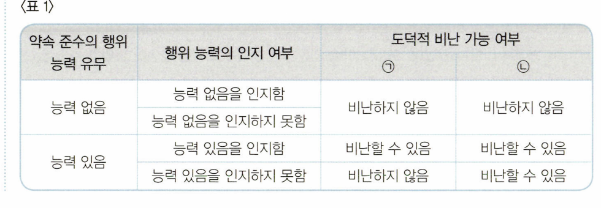
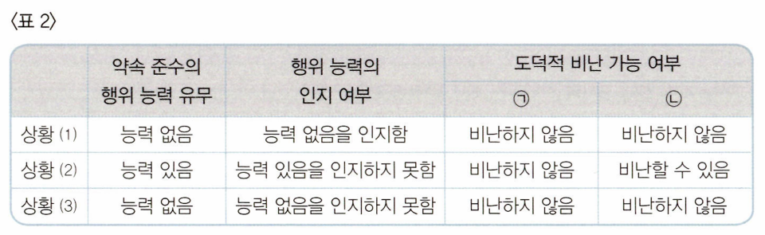
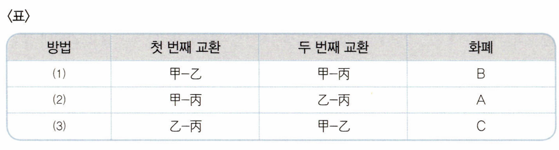
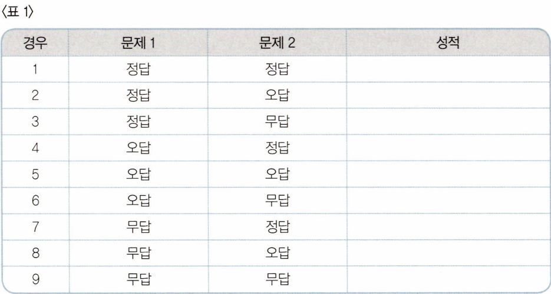
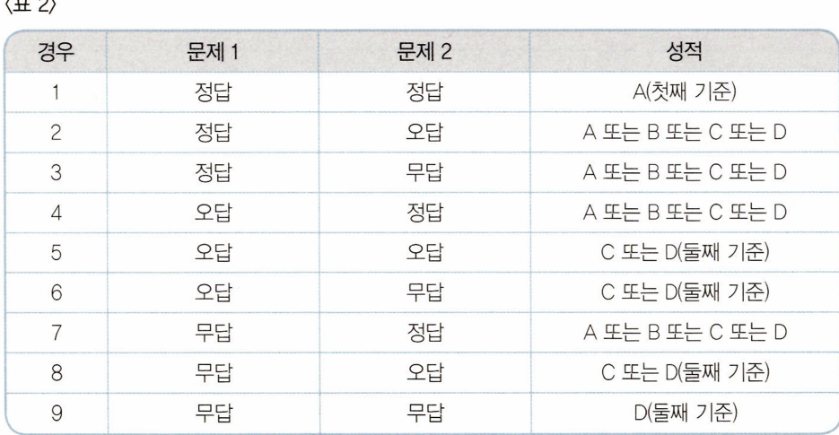
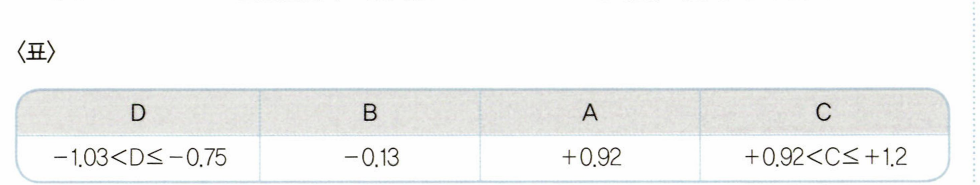

# 출제방향

## 1. 출제의 기본방향

추리논증 시험은 이해력, 추리력, 비판력을 측정하는 시험이 될 수 있도록 제시문에 주어진 내용을 단순히 문자적으로 이해하는 것을 넘어 제시된 글의 의미, 상황, 함의를 논리적으로 분석하고 핵심 정보를 취합하여 종합적으로 평가할 수 있어야 해결할 수 있도록 문제를 구성하였다. 특히 정상적인 학업과 독서 생활을 통하여 사고력을 함양한 사람이면 해결할 수 있는 내용을 제시문으로 구성하였다.

전 학문 분야 및 일상적ㆍ실천적 영역에 걸쳐 다양하게 문항의 제재를 선택함으로써 영역 간 균형 잡힌 제재 선정을 위해 노력하는 한편, 제시문의 내용에 관한 선지식이나 제시문으로 선택된 영역의 전문 지식이 문항 해결에 영향을 미치지 않도록 하는 데에도 주력함으로써 전공에 따른 유ㆍ불리를 최소화하고자 하였다. 특히 각 영역 내에서도 제시문의 세부 분야를 다변화함으로써 다양한 분야에 대한 폭넓은 지식을 갖춘 법조인 양성의 취지를 살리고자 하였다.

또한 추리 능력을 측정하는 문항과 논증 분석 및 평가 능력을 측정하는 문항을 규범, 인문, 사회, 과학기술 각 영역 모두에서 균형 있게 출제함으로써 상이한 토대와 방법론에 따라 진행되는 다양한 종류의 추리와 비판을 상황과 맥락에 맞게 파악하고 점검하는 능력을 측정하고자 하였다.

## 2. 출제 범위 및 문항 구성

40문항으로 확대된 작년 시험의 기조를 유지하되 세부 학문 분야의 다양화를 도모하고자 하였다. 인문학 영역의 문항이 늘고, 규범, 사회, 과학기술 영역의 문항은 예년과 큰 차이 없이 균형 있게 출제되었다. 규범 관련 제재를 다루는 13개 문항, 철학과 윤리학을 포함한 인문학 제재를 다루는 12개 문항, 사회와 경제를 다루는 6개 문항, 자연과학 제재를 다루는 6개 문항, 그리고 논리ㆍ수리적 추리를 다루는 3개 문항으로 구성하였다.

올해 추리논증 시험에서는 추리 문항을 55%, 논증 문항을 45% 정도로 출제함으로써 양쪽 사고력이 골고루 평가될 수 있도록 하였다. 규범적 평가를 다양한 상황으로 확대 적용하여 문항을 구성하였으며, 증거에 비추어 가설이나 견해의 올바름을 평가하는 문항의 출제 비중도 늘렸다.

## 3. 난이도

제시문의 이해도를 높이기 위해서 전문적인 용어를 순화하여 전공 여부에 상관없이 누구나 어렵지 않게 내용에 접근하고 이해할 수 있도록 하였다.

또한 문제를 해결하기 위해 거쳐야 할 추리나 비판 및 평가의 단계가 지나치게 많고 복잡해지지 않도록 함으로써 수험생들이 보다 손쉽게 문제를 해결할 수 있도록 하였다.

## 4. 출제 시 유의점

ㆍ제시문을 분석하고 평가하는 데 충분한 시간을 사용할 수 있도록 제시문의 독해 부담을 줄여 주면서 동시에 추리 능력과 비판 능력을 적절히 측정할 수 있는 변별력 있는 문항으로 구성하고자 하였다.

ㆍ선지식에 의해 풀게 되거나 전공에 따른 유ㆍ불리가 분명해지는 제시문의 선택과 문항의 출제를 지양하였다.

ㆍ법학 지식 평가를 배제하기 위해 문항에 나오는 개념, 진술, 논리 구조, 함의 등을 이해하는 데 법학 지식이 요구되지 않도록 하였다.

ㆍ출제의 의도를 감추거나 오해하게 하는 질문을 피하고, 평가하고자 하는 능력을 정확히 평가할 수 있도록 간명한 형식을 취하였다.

ㆍ문항 및 선택지 간의 간섭을 최소화하고, 선택지 선택에서 능력에 따른 변별이 이루어질 수 있도록 하였다.

---

# 문항별 해설

## 01

### 문항구분

* 문항 성격 : 규범 - 논쟁 및 반론

* 평가 목표 : 이 문항은 규범이 주어졌을 때 그것을 해석하는 다양한 견해들을 이해하고 각각의 견 해에 따를 때 규범을 구체적인 사례에 적용할 수 있는 능력을 평가하는 문항이다.

### 제시문 해설

* 정답 : ③

뿌은 \에게 부탁하여 에게 상해를 입혔다. 그런데 ×국 법률에는 상해죄에 관하여 "사람의 신
체를 상해한 자는 5년 이하의 징역에 처한다"라고만 규정하고 있어서 이 법률을 뼈에게 적용할
수 있는지가 문제가 된다.

이에 대해서 는 타인에게 부탁을 하여 상해를 유발한 자를 상해죄로 처벌할 수 있기 위해서
는 그 타인이 부탁을 거절할 수 없는 상황이었어야 한다고 주장한다.

반면에 6는 타인에게 부탁을 하여 상해를 유발한 자를 처벌해야 한다는 것에는 동의하지만. 그
이유가 상해를 유발했다는 사실 때문이 아니라 타인을 범죄자로 만들었다는 사실 때문이라고 주
장한다.

또한 (는 타인을 범죄자로 만들었다는 이유로 처벌하는 법률이 존재하지 않기 때문에 그러한
이유로는 처벌할 수 없다고 주장하면서 8의 주장에 반대한다. 대신에 그는 상해죄에 관한 규정이
'사람의 신체를 상해한 자'라고만 규정하고 있을 뿐 '사람의 신체를 직접 상해한 자'라고 한정하고
있지 않기 때문에 '사람의 신체를 간접적으로 상해한 자에게도 상해죄에 관한 규정이 적용된다

고 주장한다.

### <보기> 해설

ㄱ. 직접 폭력을 행사하여 상해를 입힌 자는 상해죄로 처벌받는다. 는 뿌이 타인에
게 부탁하여 상해를 유발했을 때 그 타인이 부탁을 거절할 수가 없었던 경우에
만 뼈이 상해죄로 처벌받을 수 있다고 주장하고, (는 타인을 간접적으로 상해
한 경우에도 상해죄로 처벌받는다고 주장한다. 따라서 ㅅ와 (는 타인을 이용하
여 상해를 유발한 자가 처벌을 받는 경우에 직접 폭력을 행사하여 상해를 입힌
자와 같은 죄목의 범죄로 처벌받을 수 있다고 본다. ㄱ은 옳은 분석이다.

ㄴ. 뿌이 \에게 부탁을 하였고 러이 뿌의 부탁을 거절할 수 있는 상황이었다면,
"뤄이 뿌의 부탁을 거절할 수 없는 상황이었어야만 뽀을 상해죄로 처벌할 수
있어"라고 주장하고 있는 ㅅ는 뽀을 상해죄로 처벌할 수 없다고 본다. 상해죄 규
정이 상해 행위를 직접 하는 경우로 한정하지 않는다고 보는 (는 투을 상해죄
로 처벌해야 한다고 본다. ㄴ은 옳은 분석이다.

ㄷ. 는 뚜이 \을 범죄자로 만들었기 때문에 처벌받아야 한다고 보고 (는 뚜을 상
해죄로 처벌해야 한다고 본다. 따라서 ^, 8, 0 모두가 투이 처벌받지 않을 수 있

음을 인정한다고 볼 수는 없다. ㄷ은 옳은 분석이 아니다.

<보기>의 ㄱ, ㄴ만이 옳은 분석이므로 정답은 ③이다.

## 02

### 문항구분

* 문항 성격 : 규범 - 언어 추리

* 평가 목표 : 이 문항은 장애아동에게 무상으로 제공되어야 하는 적절한 공교육의 범위에 관한 서 로 다른 주장을 이해하여 구체적인 사례에 적용한 결과를 추리할 수 있는 능력을 평 가하는 문항이다.

### 제시문 해설

* 정답 : ②

적절한 공교육의 범위에 대하여 뿌은 장애아동과 비장애아동이 각각 자신의 잠재능력에 비례하
는 성과를 내는 데 차이가 나지 않도록 개별 장애아동에게 필요한 추가적인 학습 과정과 지원 서
비스를 무상으로 제공해야 한다고 본다. 반면에 <은 공교육을 통하여 장애아동이 수업을 이수하

고 과목별 합격 점수를 받아 상급 학년으로 진급할 수 있도록 해야 한다고 본다.

### <보기> 해설

ㄱ. 며은 청각장애가 생긴 아동이 청각장애가 생기기 전에 내었던 성과를 낼 수 있
을 정도의 추가적인 지원 서비스가 무상으로 제공되어야 한다고 봐서 공교육이
그 아동에게 수화 통역사를 무상으로 제공해야 한다고 본다. 반면에 <은 청각
장애가 생긴 아동이 상급 학년으로 진급할 수 있을 정도의 공교육만 무상으로
제공하면 된다고 보므로 공교육이 그 아동에게 수화 통역사를 무상으로 제공하
지 않아도 된다고 본다. 따라서 뿌과 2 의 견해가 일치하지 않는다. ㄱ은 옳은
추론이 아니다.

ㄴ. 의 견해에 따를 때 공교육은 수업을 이수하고 과목별 합격 점수를 받아 상급
학년으로 진급할 수 있을 정도의 평등을 실현하면 되므로 기존의 공교육 1학년
과정은 청각장애아동에게 이미 적절한 공교육이라고 볼 수 있다. 따라서 공교육
기관은 청각장애아동의 추가적인 요구를 받아들이지 않아도 된다. ㄴ은 옳은 추
론이다.

ㄷ. 뼈은 잠재능력에 비례하는 성과라는 장애아동의 학업 성취 결과를 고려해야 한
다고 보고, <은 상급 학년 진급이라는 장애아동의 학업 성취 결과를 고려해야
한다고 본다. 따라서 공교육 기관이 장애아동의 학업 성취 결과를 고려하지 않
아도 된다는 주장에 대하여 뿌과 < 모두 받아들이지 않는다. ㄷ은 옳은 추론이
아니다.

<보기>의 ㄴ만이 옳은 추론이므로 정답은 ②이다.

## 03

### 문항구분

* 문항 성격 : 규범 - 논쟁 및 반론

* 평가 목표 : 이 문항은 검사가 자량으로 범죄 피의자 중 일부만 선별적으로 기소하는 것이 정당화 될 수 있는지에 대한 논쟁의 내용을 분석하고 논거의 관련성을 이해할 수 있는 능력 을 평가하는 문항이다.

### 제시문 해설

* 정답 : ④

같은 불법 도박장에서 종업원으로 일을 한 2 \, 7 이 있는데, 검사가 \과 7 은 기소하지 않고
만 기소한 것에 대해서 각자 다양한 관점에서 비판 또는 옹호하는 입장이 제시되어 있다. 각

입장을 분석하고, <보기>의 논거가 어떤 입장을 강화 또는 약화하는지 평가할 수 있어야 한다.

022008세 ㄱ. 검사가 범행에 가담한 정도를 살펴서 기소 여부의 근거로 삼았다는 사실은, 선
별적 기소는 검사의 괜한 남용이라고 주장하는 를 강화한다고 볼 수 없다. 그
리고 이 사실은 부당한 의도를 가지고 차별적으로 기소한 경우에만 권한 남용
을 인정해야 한다고 주장하는 『를 약화하는 것이 아니라, 오히려 강화한다고 볼
수 있다. 따라서 ㄱ은 옳은 평가가 아니다.

ㄴ. 외부 압력에 의해 중한 범죄 혐의자도 기소하지 않아 검찰에 대한 국민들의 신
뢰도가 낮아졌다는 조사 결과는 기소에 대한 검사의 자량을 인정할 경우 나쁜
결과가 나온다는 것을 보여 주는 증거이므로 검사의 자량을 인정하는 것에 대
해 찬성하는 입장인 6를 약화하며, 독선적 사용과 외부의 압력 때문에 검사의
자량을 인정하는 것에 대해 부정적인 입장인 를 강화한다.

ㄷ. 0는 기소의 필요성이 적은 사람의 인권에 주목하고, 6는 혼자 기소된 사람의 인
권에 주목하고 있다. ㅁ와 6는 범죄 혐의자의 인권 보호에 다해 언급하고 있지
만, 누구의 인권에 관심을 가지고 있는지가 다르다. 따라서 ㄷ은 옳은 평가이다.

<보기>의 ㄴ, ㄷ만이 옳은 평가이므로 정답은 ④이다.

## 04

### 문항구분

* 문항 성격 : 규범 - 논쟁 및 반론

* 평가 목표 : 이 문항은 선택적 출산의 방지를 위해 태아의 유전자 검사 및 유전적 우열성 고지를 금지하는 것이 정당한지를 둘러싼 논쟁의 내용을 분석하고 논거의 관련성을 이해할 수 있는 능력을 평가하는 문항이다.

### 제시문 해설

* 정답 : ③

선택적 출산 방지를 위한 태아의 유전적 우열성 고지 금지와 관련하여 태아의 생명권과 인간의
존엄성을 중시하는 견해와 임신 여성의 알 권리를 중시하는 견해가 제시되고 있다. 각 견해에서

추론될 수 있는 입장을 파악하고, <보기>의 논거가 어떤 관련을 갖는지 분석할 수 있어야 한다.

### <보기> 해설

ㄱ. 매은 태아의 상태나 유전적 질환의 무조건적인 고지 금지는 임신 여성의 알 권
리를 침해하기 때문에 반대하는 입장이다. 따라서 유전적 질환의 발생이 염려되
어 진료 목적상 태아 상태의 고지가 필요한 경우 이를 고지할 수 있어야 한다고
볼 것이다. ㄱ은 옳은 분석이다.
ㄴ. 임신 말기로 갈수록 낙태 건수가 현저히 줄어든다는 통계는 낙태가 거의 불가
능하게 되는 시기가 있다는 주장을 강화한다. 따라서 그러한 시기가 존재하고
그러한 시기에는 태아의 유전적 소질을 알려 주더라도 무방하다는 <의 주장을
강화한다. ㄴ은 옳은 분석이다.
ㄷ. 태아의 생명이 알 권리보다 경시되지 않아야 한다는 주장은 태아의 생명 보호
를 위해 태아의 유전적 소질을 알고자 하는 호기심을 참아야 한다는 \의 견해

를 지지한다고 볼 수 있다. ㄷ은 옳지 않은 분석이다.

<보기>의 ㄱ, ㄴ만이 옳은 분석이므로 정답은 ③이다.

## 05

### 문항구분

* 문항 성격 : 규범 - 논쟁 및 반론

* 평가 목표 : 이 문항은 법원의 개명 허가 기준에 관한 견해를 이해하고, <보기>의 논거가 어떤 견 해를 강화 또는 약화하는지 올바르게 판단할 수 있는 능력을 평가하는 문항이다.

### 제시문 해설

* 정답 : ③

다” 정답: 2
ㅅ^ 8, 는 개명을 할 수 있는 권리에 관한 세 가지 견해이다.
스는 이름을 변경할 권리는 보호되어야 하므로 과거의 범죄행위를 은폐하여 새로운 범죄행위
를 할 위험이 있는 경우를 제외하고 허가해 주어야 한다는 입장이다.
6는 개명이 사회적 질서나 신뢰에 영향을 주어 혼란을 초래할 수 있기 때문에 독립된 사회생

활의 주체라 할 수 없는 아동에 대해서만 제한적으로 허용해야 한다는 입장이다.

는 개명 허가 여부를 법관의 재량에 맡겨 두면 법관 개인의 기준에 따라 결과가 달라질 소지
가 있기 때문에 구체적인 기준을 마련하여 이에 따라 허용 여부를 결정하는 것이 시급하다는 입

장이다.

### <보기> 해설

ㄱ. 이름을 결정할 권리는 자기 고유의 권리로 출생 시점에는 예외적으로 부모가
대신 행사하는 것일 뿐이라고 보는 견해는 부모 등에 의해 일방적으로 결정된
이름을 변경할 권리가 자신에게 있다는 주장을 지지한다. 따라서 이 견해는 ^를
지지한다. ㄱ은 옳은 평가이다.
ㄴ. 수사 과정에서 범죄자의 동일성 식별에 이름 대신 주민등록번호가 사용된다면
"개명은 개인의 자유로운 의사에 맡기면 범죄를 은폐하는 수단으로 활용될 수
도 있다는 주장이 약화된다. 따라서 이 주장을 포함하는 6가 약화된다. ㄴ은 올
은 평가이다.
ㄷ. 는 범죄에 악용될 우려가 없는 한 자유로운 의사에 의한 개명을 허용해야 한
다는 것이므로, 개명을 원하는 초등학생이 개명 신청서를 법원에 제출하기만 하
면 범죄에 악용될 우려가 없는 한 개명을 허용하게 하는 초등학생 개명허가처
리지침'의 시행에 찬성할 것이다. 6는 개명은 독립된 사회생활의 주체라 할 수
없는 아동에 대해서만 허용해야 한다는 것이므로, '초등학생의 개명허가처리지
침에 대해 특별히 반대할 이유는 없을 것이다. 개명 허가 여부에 관한 구체적인
기준을 조속히 마련해야 한다는 도 지침의 시행에 특별히 반대할 이유는 없을

것이다. 따라서 '#&는 반대하고'라고 기술되어 있는 ㄷ은 옳은 평가가 아니다.

<보기>의 ㄱ, ㄴ만이 옳은 평가이므로 정답은 ③이다.

## 06

### 문항구분

* 문항 성격 : 규범 - 논쟁 및 반론

* 평가 목표 : 이 문항은 무죄추정의 원칙이 의미하는 바와 그 보호 범위에 대한 견해들을 분석하고 그것들을 구체적인 사례에 적용할 수 있는 능력을 평가하는 문항이다.

### 제시문 해설

* 정답 : ③

은 무죄추정의 원칙은 수사 절치에서 재판 절차에 이르기까지 형사 절차의 전 과정에서 어떠
한 형사 절차상 불이익도 입지 않아야 한다는 것으로 보고 회사에서 직원을 해고하는 것은 무죄
추정의 원칙과 상관이 없는 것으로 본다.

류은 무죄추정의 원칙은 이를 실현하는 구체적인 규정이 있을 때 오직 그 경우에만 인정되는
것으로 본다. 형사 절차와 관련해서는 무죄추정에 관한 구체적인 규정이 있지만, 회사의 해고와
관련해서는 규정이 없다고 본다.

7은 무죄추정의 원칙이 재판 과정에서 검사가 피고인의 유죄를 증명하지 못하는 한 피고인을

처벌할 수 없다는 의미일 뿐이고 다른 의미는 없다고 본다.

### <보기> 해설

ㄱ. <은 회사에서 직원을 해고하는 것은 무조추정의 원칙과 상관이 없다고 보므
로 뿌의 해고는 무조추정의 원칙에 우배되지 않는다고 볼 것이다. \은 구체적
인 규정이 존재하는 경우어만 무죄추정의 원칙이 인정되는 것으로 보는데, 회사
의 해고와 관련해서는 규정이 없으므로 토의 해고는 무죄추정의 원칙에 위배되
지 않는다고 볼 것이다. 따라서 은 뿌의 해고가 무죄추정의 원칙에 위배되는
지 여부에 대하여 2.과 결론을 같이한다. -은 옳은 추론이다.

ㄴ. 수사기관이 수사를 행하면서 알게 된 피의 사실을 재판 전에 공개하여 마치 유
죄인 것처럼 여론을 형성하는 것은 재판 과정이 아니라 수사 과정에 관한 것이
다. 7 은 무조추정의 원칙이 재판 과정에서 검사가 피고인의 유죄를 증명하지
못하는 한 피고인을 처벌할 수 없다는 의미일 뿐이고 다른 의미는 없다고 보므
로, 해당 사례가 무죄추정의 원칙에 위배되지 않는다고 주장할 것이다. ㄴ은 을
은 추론이다.

ㄷ. 재판에서 절도하지 않았음을 스스로 증명하지 못하는 피고인은 처벌을 받도록
하는 특별법에 대하여 <은 무죄추정의 원칙의 범위를 수사 절차로부터 재판
절차에 이르기까지의 형사 절차의 전 과정으로 보고 그 과정에서 피고인은 어
떠한 형싸 절차상 불이익도 받아서는 안 된다고 보므로 그 법률이 무죄추정의
윈칙에 위배된다는 주장에 동의할 것이다. 은 무조추정의 원직을 재판 과정
에서 검사가 피고인의 유죄를 입증하지 못하는 한 피고인을 처벌할 수 없다는
의미로 이해하므로 특별범이 무죄추정의 원칙에 위배된다는 주장에 동의할 것
이다. 따라서 2.과 7은 그러한 주장에 대하여 입장을 같이한다. ㄷ은 옳은 추
론이 아니다.

<보기>의 ㄱ, ㄴ만이 옳은 추론이므로 정답은 ③이다.

## 07

### 문항구분

* 문항 성격 : 규범 - 언어 추리

* 평가 목표 : 이 문항은 회의 절차에 관한 규정을 사례에 적용하여 올바른 결론을 이끌어 낼 수 있 는 능력을 평가하는 문항이다.

### 제시문 해설

* 정답 : ⑤

=페이               .
제시문에는 ×협회의 각종 회의체에서의 안건 심의 절차 중 개최 요건, 심사 대상, 의결 요건 등에
관한 규정이 나와 있다. <보기>의 각 선택지가 이 규정을 <사례>에 올바로 적용한 결과인지 그렇

지 않은지 추리할 수 있어야 한다.

### <보기> 해설

ㄱ. 전문위원회는 대의원회의 의장이 필요하다고 인정할 경우 개최될 수 있지만, 전

원위원회는 대의원회 재적의원 4분의 1 이상이 요구할 때에만 개최될 수 있다.
전문위원회의 심사를 거친 회비 인상에 대한 사항을 심사하기 위한 경우라 할
지라도, 대의원회의 의장이 필요하다고 인정하는 것만으로는 전원위원회는 개
최될 수 없다. ㄱ은 옳은 추론이 아니다.

ㄴ. 소관 전문위원회는 “전문위원회 재적위원의 4분의 1 이상의 요구"가 있을 때에
도 개최될 수 있다. 업종 종사 전문위원의 수는 8명(20명의 40%/이고, 이는 전
문위원회 재적위원 4분의 1에 해당하는 5명(=20명~4)을 상회한다. 따라서 ^업
종 종사 전문위원 8명이 개최를 요구한다면, 다른 업종 종사 전문위원 12명(20
명의 60%)이 개최에 반대하더라도 안건 심사를 위한 전문위원회는 개최될 수
있다. ㄴ은 옳은 추론이 아니다.

ㄷ. 전문위원회 의결 요건은 재적위원 과반수의 출석과 출석위원 과반수의 찬성이
다. 소관 전문위원회 재적위원 20명 중 업종 종사 전문위원 8명(20명의 40%)과
8업종 종사 전문위원 7명(20명의 35%)이 출석하여 “재적위원 과반수"라는 출석
요건을 충족한다. 그리고 안건에 찬성한 업종 종사 전문위원(8명)이 전체 출석
위원의 수(15명) 중에서 과반수가 되므로 안건은 가결된다. ㄷ은 옳은 추론이다.

2. ×협회 회원 10,000명 전원이 출석하여 투표한다면 출석 요건은 당연히 충족한
다. 그렇지만 ^업종 종사 회원 4.000명((0,000명의 40%)과 [업종 종사 회원
1.000명(10,000명의 10%)을 합한 5,000명만이 찬성한다면, “출석회원 과반수의

찬성" 요건을 충족하지 못하여 안건이 부결된다. 은 옳은 추론이다.

<보기>의 ㄷ, 2만이 옳은 추론이므로 정답은 ⑤이다.

## 08

### 문항구분

* 문항 성격 : 규범 - 언어 추리

* 평가 목표 : 이 문항은 제시된 규정의 내용을 정확하게 이해하여 사례에 올바로 적용할 수 있는 능력을 평가하는 문항이다.

### 제시문 해설

* 정답 : ②

일부 외국에서 시행되고 있는 익명출산제는 산모의 비밀을 유지하고, 일정한 요건 하에 신생아의
신상정보를 열람하게 하는 제도이다. <규정>에는 열람청구자격을 가진 자와 그 공개의 요건 및
공개 내용이 규정되어 있다. 제\조에서는 '신상정보서'상에 기재되는 정보의 내용을 규정하고 있
고, 제3조에서는 열람청구권자를 익명출산신청자의 자녀와 그 직계비속으로 한정하고 있다. 제4

조는 산모에 관한 정보의 열람에 관하여 요구되는 추가적인 요건을 규정하고 있다.

### <보기> 해설

. <사려>의 <은 익명출산제 하에 태어난 신생아의 숫인더, 제2조의 열람청구권
자에 규정되지 않았으므로 청구 자격이 없다. ㄱ은 옳은 진술이 아니다.
ㄴ. 익명출산으로 태어난 \이 성인이 되면 '신상정보서상의 정보에 관하여 열람을
청구할 수 있다. 그러나 제시된 혈연에 관한 정보, 출생 당시의 정황"은 제조
@ 02의 "자녀의 부모에 관한 사항"에 해당하므로, 제4조의 적용을 추가적으로
받게 된다. 즉 익명출산신청자인 뿌이 신상정보서 작성 시 자신이 사망한 이후
에 신청자의 정보를 공개하는 것에 대하여 반대하였다면 그의 사망 사실이 확
인되더라도 열람이 허용될 수 없다. ㄴ은 옳은 진술이 아니다.
ㄷ. 익명출산으로 태어난 \이 사망한 경우 \5의 딸 7 도 성인이 되면 '신상정보서'
의 열람을 청구할 수 있다. 제조 @ 01:의 "자녀에 관한 사항"의 열람에 관해서
는 제한 요건이 존재하지 않으므로 어떤 경우에든 져조의 열람청구권자의 청

구에 따라 열람이 허용된다. ㄷ은 옳은 진술이다.

<보기>의 ㄷ만이 옳은 진술이므로 정답은 ②이다.

## 09

### 문항구분

* 문항 성격 : 규범 - 언어 추리

* 평가 목표 : 이 문항은 제시된 규범의 내용을 정확하게 이해하여 사례에 올바로 적용할 수 있는 능력을 평가하는 문항이다.

### 제시문 해설

* 정답 : ④

제시문에서 ×국의 법은 유언에 의한 상속인 지정을 인정하고, 자유롭게 상속분을 정하도록 하고
있다. 이와 같은 제도에서는 근친인 친족이 있는데도 유언으로 타인에게 재신을 상속하게 함으로
써 근친을 경제적으로 매우 끈궁한 상태에 두어 생계유지조차 어렵게 할 우려도 있다. 이 경우에
근친으로 하여금 당해 유언이 윤리에 반한다고 하여 무효를 주장하게 함으로써 근친의 경제적 생

활을 보장할 수 있는 방안을 마련하고 있다.

### 선택지별 해설

정답 해설 < 빈윤리의 소는 `친족이면서도 상속인으로 지정되지 않아 상속에서 배제된 자"를
경제적 곤궁에서 구제하기 위한 것으로 “법이 정하고 있는 상속 순위에 있는 자
중 상속에서 배제된 자"로 소 제기의 자격을 한정하였다. 따라서 <.이 상속인으
로 지정된 이상 <에게는 반윤리의 소를 제기할 자격이 없다. @는 옳지 않은 진
술로 정답이다.
 오오답 해설 설 (: 유언을 통하여 근친과 근친이 아닌 자를 동시에 상속인으로 지정할 수 있다. 이
때 지정되지 않은 근친은 상속에서 배제된다.
(2 유언을 통하여 근친과 근친이 아닌 자를 상속인으로 지정할 수 있으며, 자유롭
게 상속분을 정할 수 있다.
@ 제시문의 반윤리성 심사에서 `그 상속 사안에서 상속 순위에 있는 친족들에게
존재하는 사정만을 판단의 근거로 삼을 수 있다"고 하였으므로, 친족이 아닌 ㅣ
이 뿌의 생전에 뼈을 부양한 것과 같은 7 의 사정은 판단의 근거가 될 수 없다.
(6 제시문에서 `법이 정하고 있는 상속 순위에 있는 자 중 상속에서 배제된 자"에
게 소 제기의 자격이 있다고 하였으므로, \은 상속 순위에 있어 소 제기가 가능
하다. 그리고 \이 제기한 반윤리의 소에 대하여 승소 판결이 내려지면 유언이
없는 것과 같은 상태가 되어 법정상속이 개시되므로, 이때에는 1순위자인 <이

단독으로 상속재산을 취득한다.

## 10

### 문항구분

* 문항 성격 : 규범 - 언어 추리

* 평가 목표 : 이 문항은 규정상 용어의 정의를 이해하고 이를 사례에 적용하여 문제를 해결하는 능 력을 평가하는 문항이다.

### 제시문 해설

* 정답 : ①

『전자상거래법」상의 통신판매중개에 관한 규정을 변형한 문제이다. 새로운 거래플랫폼에 대한 규
제 원리 및 관련 규정을 이해하여 사이버몰판매중개자로 규제받는 자와 아닌 자를 구별할 수 있
어야 한다.

### <보기> 해설

ㄱ. 사이버몰판매중개는 사이버몰판매를 중개하는 것이다. 그런데 ㄱ에서 유명 식
당의 음식점 판매는 주문자와 유명 식당 간에 이루어지는 것이 아니라 『와 유
명 식당 간에 이루어지는 것으로, 『의 직원이 유명 식당에 직접 가서 주문하고
결제하기 때문에 오프라인 판매이지 사이버몰판매가 아니다. 『는 음식을 구매
하여 배달까지 해 줄 것을 인터넷상으로 위탁받은 것이다. 유명 식당의 음식점
판매가 사이버몰판매가 아니므로, 『는 사이버몰판매중개자가 아니다.
ㄴ. 사이버몰판매중개자는 사이버몰판매, 즉 재화의 “판매"를 중개하는 자이므로
부동산 "임대차"를 중개하는 자는 사이버몰판매중개자가 아니다.
ㄷ. 할인쿠폰은 재화에 포함되므로 [는 인터넷에서 재화를 판매하는 사이버몰판매
자로 판매에 대한 책임을 져야 하는 거래 당사자이다. 사이버몰판매중개자의 경
우는 거래 당사자가 아님을 고지하는 방법으로 판매의 책임을 면제받을 가능성

이 있으나 사이버몰판매자는 책임의 면제 가능성이 적용될 여지가 없다.

## 11

### 문항구분

* 문항 성격 : 규범 - 언어 추리

* 평가 목표 : 이 문항은 묶음상품 판매 방식에 관한 소비자의 선택권과 경쟁 제한의 측면을 이해하 고 규제 필요성에 관하여 적절하게 추론할 수 있는 능력을 평가하는 문항이다.

### 제시문 해설

* 정답 : ③

. 조이 틀기
제시문에서는 기업의 입장에서 비용 절감이나 시장 공략 측면에서 효과적인 전략일 수 있는 세
가지의 묶음상품 판매 방식을 소개하고, 이러한 판매 방식이 소비자의 선택권을 제한하거나 다른
기업에 불리한 경쟁 환경을 조성할 수 있기 때문에 법적 규제의 대상이 될 수 있다는 것을 설명

하고 있다.

### <보기> 해설

ㄱ. 판매 방식 2에서는 소비자가 를 개별적으로 구입하는 것도 를 개별적으로 구
입하는 것도 가능하나, 판매 방식 3에서는 6를 개별적으로 구입하는 것은 가능
하지만 를 개별적으로 구입하는 것은 불가능하다. 따라서 4, 6를 개별적으로
모두 구매하려는 소비자는 판매 방식 2를 판매 방식 3보다 선호할 것이다. ㄱ은
옳은 추론이다.

ㄴ. 판매 방식 1의 경우 소비자의 선택지는 4+ 8 1개이고 판매 방식 2의 경우 4 8,
^+ㅁ 3개이며, 판매 방식 3의 경우는 4+8, 8 2개이다. 따라서 소비자 선택지
개수로만 판단하면 판매 방식 10| 선택권을 가장 크게 제한한다. ㄴ은 옳은 추
론이 아니다.

ㄷ. 제시문 마지막 단락에서 "개별 상품 가격의 총합이 묵음상품의 가격에 비해 현
저히 높아서 소비자들이 개별 구매할 가능성이 낮은 경우나 가격 할인이 과도
해서 효율적인 경쟁자를 배제하는 경우는 규제 대상에 포함된다."고 하였다. 두
상품을 묶어서 판매하는 가격이 단일 상품만 취급하는 기업의 단일 상품 가격
보다도 낮다면, 소비자들이 단일 상품을 개별 구매할 가능성이 매우 낮아지게
되므로 규제 대상에 포함될 수 있다. ㄷ은 옳은 추론이다.

<보기>의 ㄱ, ㄷ만이 옳은 추론이므로 정답은 ③이다.

## 12

### 문항구분

* 문항 성격 : 규범 - 언어 추리

* 평가 목표 : 이 문항은 코인의 구매 및 사용에 관한 규정을 이해하고 사례에 이를 적용하여 올바 른 결과를 추론할 수 있는 능력을 평가하는 문항이다.

### 제시문 해설

* 정답 : ⑤

제시문에는 코인의 투기상품화 방지를 위한 코인의 구매와 사용에 대한 규정이 나와 있다. 규정
의 세부 내용을 이해하여 <보기>의 각 선택지의 추리가 정확한지 확인할 수 있어야 한다.

### <보기> 해설

ㄱ. 규정 (2(의 원화에 의한 코인 구매한도는 거래자 1인 기준으로 계산하고 있으므
로 동일인이 여러 개의 계정을 가지고 있더라도 이들 계정을 통한 구매액은 합
산되어 구매한도가 적용되어야 한다. 1명의 거래자가 2개의 코인 계정을 가지고
1개월간 원화로 각각 600만 원의 코인을 구매한다면, 합산 구매액이 1200만 원
으로 1000만 원을 초과한다. ㄱ은 옳은 추론이 아니다.

ㄴ. 규정 (4'에도 적용되는 규정 (3/의 '이때의 최대 코인 개수'는 코인 종류별로 구매
한도액 내에서 취득할 수 있는 최대 코인 개수를 비교하여 그중 최저치로 한다
고 하였다. 구매한도액 1000만 원 지급 시 ^코인은 10,000개, 6코인은 5000
개, (코인은 4,000개를 구매할 수 있으므로 '최대 코인 개수'는 4.000개이다.
이것의 5분의 1은 800개이므로, 규정 (4'에 따르면 거래자 1명이 코인을 구매하
거나 지급에 사용한 결과 1일 동안 그 거래자의 총보유량이 같은 날 0시 총보유
량과 비교하여 800개를 초과하여 감소한 경우 그 시점부터 24시간 동안 거래
가 정지된다. 2019년 6월 26일 19시에 코인 {000개를 보유한 채 그날의 거래를
시작한 자가 총 4번의 거래 후 같은 날 20시에 코인 총보유량이 300개가 되었
다면, 0시의 총보유량에 비해 700개가 감소되었을 뿐이므로 코인 거래는 정지
되지 않는다. ㄴ은 옳은 추론이 아니다.

ㄷ. ㄴ에서 보았듯이 구매한도액으로 구매할 수 있는 `최대 코인 개수'는 4.000개이
다. 규정 (3:에서 거래자 1명이 1회의 거래에서 코인 구매에 사용할 수 있는 코인
개수는 구매한도액으로 취득할 수 있는 최대 코인 개수의 10분의 1을 초과할 수
없다고 했으므로, 400개를 초과할 수 없다. ㄷ은 옳은 추론이다.

2. ㄴ에서 보았듯이 규정 (4:에 따르면 거래자 1명이 코인을 구매하거나 지급에 사
용한 결과 1일 동안 그 거래자의 총보유량이 같은 날 0시 총보유량과 비교하여
800개를 초과하여 감소한 경우 그 시점부터 24시간 동안 거래가 정지된다. 그
런데 규정 (4'에 의하면 "일 동안'은 같은 날 오전 0시부터 24시 사이를 의미하
므로 코인 사용 중 자정을 넘겨 다음 날이 되면 다시 0시를 기준으로 보유량 변
동을 산정해야 한다. 자정 전까지 코인 600개가 감소하고 자정 이후 코인 300
개가 추가로 감소하더라도 자정 전까지나 자정 이후나 각각 코인 보유량이 1일
동안 800개 미만으로 감소하였으므로 코인 사용은 정지되지 않는다. 2은 옳은

추론이다.

<보기>의 ㄷ, 2만이 옳은 추론이므로 정답은 6:이다.

## 13

### 문항구분

* 문항 성격 : 규범 - 언어 추리

* 평가 목표 : 이 문항은 규칙이 그 목적과의 관계에서 볼 때 어떤 사례를 '과다포함' 혹은 '과소포함' 한다는 개념을 이해하여 구체적인 사례에 적용할 수 있는 능력을 평가하는 문항이다.

### 제시문 해설

* 정답 : ⑤

제시문에서 어떤 금지 규칙이 사례를 '과다포함' 혹은 '과소포함 한다고 할 때 '포함"이란 금지를
의미한다는 것을 일어내는 것이 중요하다. 그렇다면 '과다포함'이란 어떤 규칙이 그 목적의 관점
에서 볼 때 금지하지 않아도 되는 사려를 금지하는 경우이며, '과소포함"이란 어떤 규칙이 그 목

적의 관점에서 볼 때 금지해야 하는 사례를 금지하지 않는 것을 의미한다.

### <보기> 해설

ㄱ. 목적 의 '동물원 이용자의 안전 확보'라는 관점에서 보면 동물원 이용자의 안
전을 보호하기 위해 경찰차가 동물원에 진입하는 사례를 포함하지 않아도 된다.
하지만 "동물원 내에는 어떠한 경우에도 차량이 진입할 수 없다."는 규칙 1은 동
물원에 진입하려는 모든 차량을 포함하므로 '과다포함'이 된다. ㄱ은 옳은 추론
이다.

ㄴ. 목적 @의 '차량으로 인한 동물원 내의 불필요한 소음 방지'라는 관점에서 보면
불필요한 소음을 발생시키는 핫도그 판매 차량이 사전 허가를 받아 동물원에
진입하는 사례를 포함해야 한다. 하지만 "동물원 내에는 동물원에 의해 사전 허
가를 받은 차량 외에 다른 차량은 진입할 수 없다."는 규칙 2는 사전 허가를 받
은 핫도그 판매 차량을 포함하지 않으므로 '과소포함'이 된다. ㄴ은 옳은 추론
이다.

ㄷ. 목적 @의 '동물원 이용자의 안전 확보'라는 관점 및 목적 의 '차량으로 인한
동물원 내의 불필요한 소음 방지'라는 관점에서 보면 불필요한 소음을 발생시키
지 않는 구급채목적 에 부합)가 동물원 이용자를 구소하기 위해(목적 에 부
합) 동물원 내로 진입하는 사례는 규칙이 포함하지 않아도 된다. "동물원 내에
는 긴급사태로 인한 소방차, 구급차가 진입하는 경우 외에 다른 차량은 진입할
수 없다."는 규칙 3은 이 사례를 포함하지 않아 '과다포함'하지 않는다. 또한 규
칙이 포함해야 하는 경우도 아니므로, 포함해야 하는데도 포함하지 않는 경우가

아니다. 따라서 '과소포함'하지도 않는다. ㄷ은 옳은 추론이다.

<보기>의 7, ㄴ, ㄷ 모두 옳은 추론이므로 정답은 ⑤이다.

## 14

### 문항구분

* 문항 성격 : 규범 - 언어 추리

* 평가 목표 : 이 문항은 원리를 사례에 적용하여 결론을 올바로 추론할 수 있는 능력을 평가하는 문항이다.

### 제시문 해설

* 정답 : ②

원리 1~~4를 종합하면 다음과 같이 요약할 수 있다. 가 상황 ×에서 존재하는 경우, [가 ×에서보
다 더 많은 행복을 누리게 되는 다른 가능한 상황 +가 존재하고, 에서 존재하는 사람 중 보다
×에서 더 많은 행복을 누리게 되는 사람 0가 존재하지 않는 경우, 그리고 오직 그 경우에만 6는
×에서 나쁘게 대우받는 것이다. 가 상황 ×에서 존재하지 않는다면 6는 ×에서 나쁘게 대우받는
것이 아니다. 그리고 나쁘게 대우받는 사람이 없는 상황은 도덕적으로 허용 가능하다.

### <보기> 해설

ㄱ. 벼과 <의 행복도는 ^보다 6에서 더 높은 것은 아니다. 따라서 원리 1에 의해
뿌과 <은 에서 나쁘게 대우받는 것은 아니다. 그리고 은 에서 존재하지
않으므로 원리 3에 의해 에서 나쁘게 대우받는 것은 아니다. ㅇ가 5 이하인 경
우 \의 행복도는 보다 8에서 더 높은 것이 아니므로 \은 에서 나쁘게 대우
받는 것은 아니다. @가 5보다 큰 경우에 \의 행복도는 ^보다 에서 더 높지만,
<의 행복도가 8보다 ^에서 더 높기 때문에 원리 2에 의해 류은 에서 나쁘게
대우받는 것은 아니다. 결국 @의 값이 무엇이든 상관없이 에서 누구도 나쁘게
대우받지 않는다. 따라서 ㄱ은 옳은 추론이 아니다.
ㄴ. 뼈과 7] 의 행복도는 8보다 ^에서 더 높지 않으므로 원리 1에 의해 8에서 뿌과
7 이 나쁘게 대우받는 것은 아니다. <,과 \에 대해서는 가 5보다 작은 경우,
5인 경우, 5보다 큰 경우로 나누어 판단해 보자.
(1) @가 5보다 작은 경우
과 \ 모두 8보다 에서 행복도가 높고 ^에서 존재하는 사람 중에 ^보다
에서 더 높은 행복도를 가지는 사람이 없으므로, 원리 2에 의해 6에서 나쁘게
대우받는 사람은 <,과 류으로 2명이 된다.

(21 가 5인 경우

의 행복도는 8보다 에서 더 높지 않으므로 원리 1에 의해 에서 나쁘게
대우받는 것이 아니다. 반면에 <의 행복도는 8보다 에서 더 높으며 에서 존
재하는 사람 중에 보다 8에서 더 높은 행복도를 가지는 사람이 존재하지 않으
므로, 원리 2에 의해 <.은 8에서 나쁘게 대우받는다. 결국 8에서 나쁘게 대우받
는 사람은 1명이다.
(3) @가 5보다 큰 경우

류의 행복도는 8보다 에서 더 높지 않으므로 원리 1에 의해 8에서 나쁘게
대우받는 것이 아니다. <.의 행복도는 6보다 ^에서 더 높지만 ^에서 존재하며
스보다 8에서 더 높은 행복도를 가지는 사람인 \이 존재하므로, 원리 2에 의해
은 나쁘게 대우받는 것이 아니다. 따라서 나쁘게 대우받는 사람은 0명이다.

위의 설명으로부터 8에서 뼈~~」 중 한 사람만 나쁘게 대우받고 있다면 는
5라는 것을 알 수 있다. 따라서 ㄴ은 옳은 추론이 아니다.

ㄷ. &와 8가 모두 도덕적으로 허용 가능하려면 원리 4에 따라 ^에서도 8에서도 나
쁘게 대우받는 사람은 없어야 한다. ㄱ에서 설명했듯이 0가 어떤 값을 가지든
상관없이 &에서 나쁘게 대우받는 사람은 없다. 또한 ㄴ에서 설명했듯이 6가 5
보다 큰 경우에만 8에서 나쁘게 대우받는 사람이 존재하지 않는다. 따라서 4 8
가 모두 도덕적으로 허용 가능하다면 @는 5보다 커야 한다. 따라서 ㄷ은 옳은
추론이다.

## 15

### 문항구분

* 문항 성격 : 인문 - 언어 추리

* 평가 목표 : 이 문항은 연민의 감정을 설명하는 제시문으로부터 연민이 이성적 반성, 혐오감, 자 기애와 어떠한 관계를 가지고 있는지 추론할 수 있는 능력을 평가하는 문항이다.

### 제시문 해설

* 정답 : ②

사회적 계약 상태에 들어가서 이성을 사용하기 전인 자연 상태에서도 연민이라는 인간의 보편적
감정을 통해 불완전한 정도의 정의감이 존재한다는 루소의 주장을 담은 글이다.

연민의 감정과 자기애의 감정은 본성에서 주어진 보편적 감정이라는 점에서 공통점을 가지고
있다. 연민은 동물에게도 나타나는 것으로 인간의 또 다른 보편적 감정인 자기애와 달리 종 전체
의 존속에 기여한다. 연민의 감정은 자기희생을 요구하는 상황에서는 나타나지 않는다. 연민은
정의에 대한 이성의 명령이 작동되기도 전에 불안한 정도이기는 하지만 정의를 실행하게 만드는
역할을 한다. 타인이 약을 행하거나 당할 때 느끼는 혐오감도 이성을 통해서가 아니라 연민이 작

동한 결과이다.

### <보기> 해설

ㄱ. 연민은 "모든 이성적 반성에 앞서는 자연의 충동"이다. 또 '연민은 이성에 앞서

는 것으로 인간에게 보편적인 자연적 감정이다." ㄱ은 옳은 추론이 아니다.
ㄴ. 본성에 의해서 우리에게 새겨진 서로 다른 두 감정이 자기애와 연민이며, 혐오

감은 연민으로부터 발생한다. 따라서 혐오감은 연민의 감정에서 비롯된다고 말
할 수 있지만 자기애는 연민의 감정에서 비롯된다고 말할 수 없다. 오히려 “본성
에 의해서 우리에게 새겨진 또 다른 감정인" 것이다. ㄴ은 옳은 추론이 아니다.
ㄷ. “연민은, 본성에 의해서 우리에게 새겨진 또 다른 감정인 자기애가 자연이 설정
한 범위를 넘어서 과도하게 작용되는 것을 방지하여 종 전체의 존속에 기여한
다."로부터, 타인에 대한 연민의 감정은 자기애와 양립 가능하다는 것을 추론할

수 있다. ㄷ은 옳은 추론이다.

## 16

### 문항구분

* 문항 성격 : 인문 - 언어 추리

* 평가 목표 : 이 문항은 도덕 원리의 적용과 관련하여 여러 가지 상이한 상황들에서 관련 요소를 고려하여 올바르게 판단할 수 있는 능력을 평가하는 문항이다.

### 제시문 해설

* 정답 : ②

약속 준수의 행위 능력 유무와 인지 여부에 따른 제시문의 입장을 정리하면 다음의 <표 1>과 같다.

<상황>을 분석하여 각 입장을 <상황>에 적용한 결과는 다음의 <표 2>와 같다.

### <보기> 해설

ㄱ. <표 2>에서 보듯이 (1)과 (3의 상황 도두 행위자가 행위 능력이 없다는 점에서
동일하므로 을 채택하든 을 채택하든 7 에 대한 도덕적 판단이 다르지 않
다. 즉 도덕적으로 비난하지 않을 것이다. 따라서 뿌이 (1)과 (3'의 상황에서 ㅣ
에 대한 도덕적 판단이 서로 달라야 할 이유가 없다고 생각하더라도 반드시 6
을 채택했다는 보장은 없다. 따라서 ㄱ은 옳은 추론이 아니다.

ㄴ. 을 채택했다는 것은 약속 준수의 행위 능력의 유무로만 도덕적 비난 여부를
판단하겠다는 것이다. <표 2/에서 보듯이 (2:의 상황에서 을 채택한 사람은 7
을 도덕적으로 비난할 수 있다고 판단할 것이다. 따라서 ㄴ은 옳은 추론이 아
니다.

ㄷ. 귀찮아서 약속을 지킬 의도조차 없었던 것으로 보이는 상황 (3!의 7 을 도덕적
으로 비난할 수 있을 것이라 생각하는 사람도 있을 것이다. 하지만 <표 2>에서
보듯이 (3.의 상황은 7 이 약속을 지킬 수 있는 능력이 없는 경우이므로. 류이
과 0 중 어떤 것을 채택하더라도 7 이 도덕적 비난의 대상이 될 수 없다고
판단할 것이다. 따라서 ㄷ은 옳은 추론이다.

<보기>의 ㄷ만이 옳은 추론이므로 정답은 ②이다.

## 17

### 문항구분

* 문항 성격 : 인문 - 논증 평가 및 문제해결

* 평가 목표 : 이 문항은 새로 추가된 정보가 두 가설을 각각 강화하는지 약화하는지 을게 판단할 수 있는 능력을 평가하는 문항이다.

### 제시문 해설

* 정답 : ③

업무 할당 방식 중 8방식의 특징은 동전 던지기를 통해 업무를 할당하는 일견 공정한 방식이지
만, 이 방식을 선택하더라도 실제 업무 할당 과정이 공개되지 않으므로 방식과 마찬가지로 자기
에게 유리하도록 결과를 조작하여 임의로 업무를 할당할 여지가 있다. 실저로 실험 결과는 8방식
을 택한 사람들의 일부가 결과를 조작했다는 것을 강하게 암시한다. 8방식을 택한 20명의 참가
자 중 18명이 자신에게 긍정적 업무를 할당했기 때문이다. 실험 결과를 설명하고자 하는 다음 두

가설이 제시되었다.

가설 1: 공정하게 업무를 할당할 의도로 8방식을 채택했지만, 결국은 이기적인 동기가 원래의 공
정한 의도를 압도하면서 결과를 조작했다.

가설 2 : 원래 공정하게 업무를 할당할 의도가 없었으며, 업무 할당의 이득을 확보하면서 사람들
에게 공정한 사람처럼 보일 수 있는 추가 이득까지 얻을 수 있기 때문에 8방식을 택한

것이다.

### <보기> 해설

ㄱ. 가설 21 따르면, 8방식을 택한 대부분의 사람들은 결과 조작을 통해 업무 할당
의 이득을 확보할 수 있고 사람들에게 공정한 사람처럼 보일 수 있는 추가 이득
까지 얻을 수 있기 때문에 이 방식을 채택했다. 하지만 ㅅ방식도 8방식만큼 공정
하다고 사람들이 생각하리라고 믿었다면, 굳이 8방식을 택할 이유가 없어진다.
그러므로 추가 이득 때문에 6방식을 택했다는 가설 2는 약화된다. ㄱ은 옳은 평
가이다.
ㄴ. 8방식을 택한 참가자들 중 결과를 조작한 사람들 대부분이 자신의 업무 할당이
공정하지 않았음을 인정한다는 정보만으로는 가설 1이나 가설 2의 강화 및 약화

를 평가할 근거가 되지 않는

ㄷ. 동전 던지기를 통한 업무 할당 과정이 도두 공개되는 것으로 수정된다는 것은
결과 조작을 통한 업무 할당의 이득을 안전하게 확보할 수 없다는 뜻이다. 그럼
에도 불구하고 여전히 8방식을 택한 참가자의 수에 큰 변화가 없다면, 이것은 8
방식을 택한 사람들 대부분이 처음에는 공정하게 업무를 할당할 의도가 있었음

을 강화하는 증거가 된다. ㄷ은 옳은 평가이다.

## 18

### 문항구분

* 문항 성격 : 인문 - 언어 추리

* 평가 목표 : 이 문항은 신에 대한 두 가지 다른 입장의 차이를 이해하고 이로부터 추론한 것이 올 은지 판단할 수 있는 능력을 평가하는 문항이다.

### 제시문 해설

* 정답 : ⑤

뿌에 의하면 신은 완전한 존재이다. 이는 첫짜로 신이 자신이 원하면 무엇이든지 할 수 있음을
함축한다. 신은 기적을 일으킬 수 있으며 이미 지나가 버린 과거를 바꿀 수도 있다. 둘짜로 신의
완전함은 신이 이 세상을 완전하게 창조했으며 자신이 계획한 그대로 역사를 진행시킨다는 것을
함축한다. 이에 반해 <은 뽀의 주장에 모순이 있음을 지적하면서 자신의 입장을 전개한다. 우선
신이 완벽하게 과거 현재 미래를 이미 결정한 채 역사를 진행시키고 있다는 것이 사실이라면 신
이 그렇게 진행되어 온 과거를 결코 바꾸지 않을 것이라는 것을 지적하고 있다. 또한 신도 시간의
흐름만은 통제할 수 없기에 과거의 사건을 바꿀 수는 없으며, 신이 자신이 계획한 대로 역사를 진

행시킨다면 우리가 신에게 기도하는 현상을 설명할 수 없다고 주장한다.

0220해설 ㄱ. 은 신이 전능하여 기적을 일으킬 수 있다고 명시적으로 말하고 있다. 2은 신
이 이미 벌어진 사건을 바꿀 수는 없지만, 아직 결정되지 않은 장차 벌어질 사
건들에서는 무한한 능력을 가질 수 있다고 주장하고 있으므로 기적이 있을 수
있음을 인정한다고 볼 수 있다. ㄱ은 옳은 추론이다.

ㄴ. 뿌은 신이 전능하므로 이미 지나가 버린 과거를 바꿀 수 있으며, 또한 완전하므
로 자신이 계획한 그대로 역사를 진행시킨다고 주장한다. 반면에 2은 신조채)
도 시간의 흐름을 통제할 수 없기에 과거로 거슬러 올라가 이미 벌어진 사건을
바꿀 수는 없으며, 우리의 기도를 통해 신의 계획은 변경될 수도 있을 것이라고
주장하고 있다. 따라서 뿌과 <은 신이 역사를 진행시키는 방식에 대해 서로 다
른 견해를 가지고 있다. ㄴ은 옳은 추론이다.

ㄷ. 2.은 "신이 완벽하게 과거 현재 미래를 이미 결정한 채 역사를 진행시키고 있
다는 것이 사실이라면, 신이 그렇게 진행되어 온 과거를 결코 바꾸지 않을 것이
다."라고 주장하고 있으므로, <은 신이 과거를 바꾼다는 것은 신의 계획이 완
전하지 않음을 의미한다고 여길 것이다. ㄷ은 옳은 추론이다.

<보기>의 ㄱ, ㄴ, ㄷ 모두 옳은 추론이므로 정답은 ⑤이다.

## 19

### 문항구분

* 문항 성격 : 인문 - 논증 평가 및 문제해결

* 평가 목표 : 이 문항은 각 주장의 논거를 정확히 파악하여 추가적인 정보에 따라 각 주장이 약화 또는 강화되는지 올바르게 판단할 수 있는 능력을 평가하는 문항이다.

### 제시문 해설

* 정답 : ①

쾌락의 추구와 고통의 회피가 인간의 보편적인 성향임에도 불구하고 많은 사람들이 공포 영화를

즐길 수 있는 이유를 설명하고자 하는 두 개의 주장이 제시되었다.

4 : 공포 영화는 엄청난 과감을 제공한다. 그러한 쾌감은 공포 영화에 등장하는 미지의 대상에 대
한 관객의 호기심이 충족되는 순간 주어진다.

8 : 공포 영화는 엄청난 과감을 제공하지 않는다. 공포 영화에 등장하는 대상이 일으키는 고통이
나 불과감은 충분히 통제할 만한 것이므로 그 정도의 과감으로 보상할 필요도 없고, 줄거리
가 뻔한 공포 영화가 그런 엄청난 과감을 제공할 수도 없다. 우리가 공포 영화를 즐기는 이유
는 통제 가능한 수준의 고통이나 불과감은 적절한 자극제가 되어 정신 건강에 유익하기 때문

이다.

### <보기> 해설

ㄱ : 원작 소설을 이미 읽었다는 것은 공포 영화의 줄거리와 영화에서 공포를 불러
일으키는 대상의 정체를 이미 알고 있다는 뜻이다. 따라서 미지의 대상이 정체
를 드러내는 순간에 호기심이 충족모면서 엄청난 쾌락을 느끼게 된다고 주장
하는 #는 약화된다. ㄱ은 옳은 평가이다.

ㄴ : 6는 '엄청난 과감"이 필요할 정도로 공포 영화에 등장하는 대상이 유발하는 고
통이나 불쾌감이 크다는 것을 부정하고 있다. 그러한 고통이나 불카감은 통제
가능하며, 우리가 공포 영화를 즐기는 이유는 이러한 통제 가능한 수준의 고
통이나 불쾌감은 오히려 적절한 자극제가 되어 정신 건강에 유익하기 때문이
라는 것이다. 따라서 고통이나 불쾌감의 강도가 사람마다 다른 것이라면. 고통
이나 불라감이 통제 가능한 수준이라고 말하는 6는 강화되지 않는다. 따라서
ㄴ은 옳은 평가가 아니다.

ㄷ : 다수의 공포 영화에 호기심을 일으키는 미지의 대상이 등장하지 않는다는 것
은 를 약화하고, 그런 영화가 엄청난 쾌감을 보상한다는 것은 6를 약화한다.

ㄷ은 옳은 평가가 아니다.

<보기>의 ㄱ만이 옳은 평가이므로 정답은 0:이다.

## 20

### 문항구분

* 문항 성격 : 인문 - 논증 분석

* 평가 목표 : 이 문항은 논증의 전체적인 논리적 구조 및 요소들 사이의 논리적 관계를 파악하는 능력을 평가하는 문항이다.

### 제시문 해설

* 정답 : ⑤

이 논증의 결론은 의 “선을 정의하려는 시도는 성공할 수 없다."이며, 이 결론은 2, 0, @으로
부터 논리적으로 도출된다. ㅁ에서 “선을 정의할 수 있으려면 그것을 자연적 속성과 동일시하거
나, 아니면 형이상학적 속성과 동일시해야 한다."라고 했는데, @에서 선을 자연적 속성과 동일시
할 수 없다고 했고, @에서 선을 형이상학적 속성과 동일시할 수 없다고 했다. 따라서 8, @에 의
해 조건문 의 뒷부분 "그것을 자연적 속성과 동일시하거나, 아니면 형이상학적 속성과 동일시
해야 한다."가 부정되므로, 선을 정의할 수 있음이 부정되어 이 도출되는 논증 구조이다.

@은 @, @, @에 의해 지지된다. 선을 쾌락과 동일시한다면 “선은 쾌락인가?"라는 물음은 무
의미한 것이 되어야 하지만(6), 그 물음이 무의미하지 않다고 주장하고 있으며(8), 쾌락 대신에
어떠한 자연적 속성을 대입하더라도 결과는 마찬가지라고 했으므로(8), 이로부터 “선을 자연적
속성과 동일시하는 모든 정의는 오류이다."(8)/가 추론된다.

한편 선을 형이상학적 속성과 동일시하는 정의들은 사실 명제로부터 당위 명제를 추론한다는
(@;, 즉 어떠한 형이상학적 질서가 존재한다는 사실로부터 "선은 무엇이다"라는 정의를 이끌어
낸다는 것(@)과 사실로부터 당위를 끌어내는 것은 가능하지 않다는 것(@)으로부터 선을 형이상
학적 속성과 동일시하는 정의들은 모두 오류라는 것(&)이 추론되기 때문에, @, @, 으로부터
@이 추론된다.

'정

### 선택지별 해설

오답 해설 설 만이 위의 해설에서 설명한 논증 구조를 적절히 파악하고 있다. (과 는 논증
의 결론을 @으로 잘못 파악하고 있기 때문에 오답이며, @@/은 을 지지하는 명제
로 @과 @만을 배치하고 을 다른 곳에 배치하고 있기 때문에 오답이다. @는 6:
@에 의해 @이 지지되도록 하고 &, @에 의해 @이 지지되도록 한다는 점에서 오
답이다.

## 21

### 문항구분

* 문항 성격 : 인문 - 논증 분석

* 평가 목표 : 이 문항은 논증을 이루는 명제들의 의미를 정확히 이해하고 이를 바탕으로 결론까지 이어지는 논증의 구조 전체를 파악하는 능력을 평가하는 문항이다.

### 제시문 해설

* 정답 : ⑤

다 대308 정답:

명제 ^가 명제 6를 필면적으로 함축한다면 &가 참일 가능성은 8가 참일 가능성을 필연적으로 함
축한다는 것을 증명하는 논증이 제시되고 있다. 이 논증은 귀류법의 형태를 취한다. 즉 결론인 2
을 증명하기 위하여, 그 부정에 해당하는 명제인 ㅇ을 먼저 가정하고 이로부터 모순도는 결과를

이끌어 내는 구조로 이루어져 있다. 먼저 은 다음과 같은 가정이다.

(지구에 행성이 충돌한다는 것이 인간 멸종을 필연적으로 함축한다) & (지구에 행성이 충돌할

가능성이 있다 & 인간 멸종의 가능성이 없다)

은 세 명제로 이루어져 있으므로 그중 하나인 "지구에 행성이 충돌할 가능성이 있다."도 가
정된다. 그러므로 지구에 행성이 충돌하는 상황이 있다. 이 명제와 함께, 역시 가정된 다른 명제
인 "지구에 행성이 충돌한다는 것은 인간이 멸종한다는 것을 필연적으로 함축한다."로부터, 그
상황에서는 인간이 멸종한다는 것이 추론된다. 그런데 인간이 멸종하는 상황이 있다는 이 결론
은 인간이 멸종하는 상황이 없다는 가정과 모순된다. 그러므로 가정 의 부정인 결론 2:이 도출
된다.

### <보기> 해설

ㄱ. 앞의 해설에서 보았듯이 0 명제를 증명하기 위하여 그 부정에 해당하는 명제
인 을 먼저 가정하고 이로부터 모순되는 결과를 이끌어 내고 있다. 에서
“인간 멸종의 가능성은 없다."가 가정되고 있다. 그런데 끝에서 세 번째 문장의
"그 상황에서는 인간이 멸종한다."는 인간이 멸종하는 상황이 있다는 뜻이다.
이로부터 "그런데 인간이 멸종하는 상황은 없다고 가정했으므로 모순이 발생
한다."라고 말하고 있으므로, "인간 멸종의 가능성은 없다."는 것과 “인간이 멸
종하는 상황은 없다."는 것을 동일한 의미로 간주하고 있다는 것을 알 수 있다.
ㄱ은 옳은 분석이다.

ㄴ. 앞의 해설에서 보았듯이 은 가정이다. 가정이 실제로 참인가의 여부는 가정
으로부터의 추론에 어떠한 영향도 주지 않는다. 이는 제시문 두 번째 단락의 두
번째 문장("… 그런 충돌이 가능하다고 가정했기 때문에, 그런 일이 실제로 일
어나는 상황이 있다고 해도 아무런 모순이 없다.")을 통해서도 간접적으로 확인
할 수 있다. ㄴ은 옳은 분석이다.

ㄷ. 앞의 해설에서 보았듯이 이 논증은 을 가정함으로써 모순을 도출하고 이로부
터 @의 부정인 2이 참임을 이끌어 내는 구조를 가지고 있다. ㄷ은 옳은 분석

이다.

<보기>의 ㄱ, ㄴ, ㄷ 모두 옳은 분석이므로 정답은 ⑤이다.

## 22

### 문항구분

* 문항 성격 : 인문 - 논증 평가 및 문제해결

* 평가 목표 : 이 문항은 정신적 현상이 물리적 현상에 다름 아니라는 물리주의에 대한 논증을 이해 할 수 있는 능력을 평가하는 문항이다.

### 제시문 해설

* 정답 : ①

제시문은 다음 세 가지 원리로부터 정신적 현상이 물리적인 현상에 다름 아니라는 물리주의를 이

끌어 내고 있다.

첫째 원리 : 모든 정신적인 현상은 물리적 결과를 야기한다.
둘째 원리 : 어떤 물리적 사건이 원인을 갖는다면, 그것은 반드시 물리적 원인을 갖는다.

셋째 원리 : 한 가지 현상에 대한 두 가지 다른 원인이 있을 수 없다.

세 원리로부터 물리주의로의 논증은 다음과 같다. 정신적 현상 \/이 있다고 하자. 은 첫째 원
리에 의해 물리적 결과 『를 갖는다. 이제 『는 을 원인으로 가지므로, 원리 ?에 의해 물리적 원
인 \을 갖는다. \과 40 다르다는 것은 원리 3| 의해 불가능하다. 따라서 1과은 동일하다고
결론내릴 수 있다.

### <보기> 해설

ㄱ. 어떤 물리적 결과도 야기하지 않는 정신적 현상이 존재한다는 진술은 첫째 원
리와 직접적으로 모순된다. 따라서 논증의 전제를 부정하게 되는 셈인데, 특히
이런 정신적 현상의 경우 논증의 첫 단계가 성립하지 않아 물리적 현상에 다름
아니라는 결론을 내릴 수 없게 된다. 따라서 ㄱ은 옳은 평가이다.

ㄴ. 언뜻 보기에 아무 원인 없이 일어나는 물리적인 사건이 있다면 둘째 원리가 부
정되는 것 같지만, 둘째 원리는 어떤 물리적 사건이 원인을 갖는다면 그것은 물
리적 원인을 갖는다는 조건적 원리이다. 따라서 아무 원인 없이 일어나는 물리
적인 사건이 있다는 것은 둘째 원리를 부정하지 못한다. 이런 물리적인 사건이
있다는 것은 다른 원리도 부정하지 못하기 때문에 ㄴ은 옳은 평가가 아니다.

ㄷ. 위의 논증은 정신적인 현상이 물리적 결과를 야기한다는 것을 전제로 사용하고
있다. 따라서 어떤 정신적 현상이 물리적 결과 외에 다른 현상을 추가적으로 야
기한다고 해도 여전히 그 정신적 현상이 물리적 결과를 야기한다는 것이 성립

하므로 논증은 영향을 받지 않는다. 따라서 ㄷ은 옳은 평가가 아니다.

<보기>의 ㄱ만이 옳은 평가이므로 정답은 ①이다.

## 23

### 문항구분

* 문항 성격 : 인문 - 언어 추리

* 평가 목표 : 이 문항은 형사사건에서 검사에게 높은 정도의 입증 책임을 부과하는 것을 정당화하 는 논증을 이해하고 이를 여러 상황에 적용할 수 있는 능력을 평가하는 문항이다.

### 제시문 해설

* 정답 : ①

제시문은 검사의 입증 책임을 높게 설정하는 것을 정당화하는 논증을 담고 있다. 이 논증은 두 가
지 가정을 하고 있는데, 하나는 검사의 유죄 입증 수준을 수치화할 수 있다는 것이고 다른 하나는
일단 피고인들 각각이 범죄자일 확률이 주어져 있고 검사는 그 확률의 수준으로 증거를 확보하였
다는 가정이다. 이런 가정 하에 피고인의 수와 각 피고인이 범죄자일 확률이 주어지면. 유죄 입증
수준이 변화함에 따라 범죄자인데도 처벌받지 않는 피고인의 수와 범죄자가 아닌데도 처벌받는
피고인의 수를 계산할 수 있게 된다. 다른 조건이 동일할 때, 유죄 입증 수준을 높일수록 범죄자
가 아닌데도 처벌받는 피고인의 상대적인 수를 줄일 수 있기 때문어, 정의의 관점에서 유죄 입증
수준을 높이는 것이 정당화된다는 논리이다.
두 번째 단락은 이런 계산을 구체적인 상황에 적용한다. 상황과 8상황에서 범죄자인데도 처

벌받지 않은 피고인의 수가 각각 145와 65, 범죄자가 아닌데도 처벌받은 피고인의 수가 각각 5와
25이다. 범죄자가 아닌데도 처벌받은 피고인에 10배의 가중치를 두어 상황의 나쁘 정도를 측
정한다고 가정하였으므로, ^상황의 나봄의 정도는 195(=145+(5×%10), 8상황의 나쁘 정도는
315(=65+(25*610)가 되어 6싱황이 더 나쁜 것으로 드러난다. 다시 말해 높은 수준의 유죄 입증

수준이 정당화될 수 있다는 것이다.

<분20해설 -. 제시문에 주어진 두 상황에서 다른 것은 그대로 두고, 범죄자가 아닌더도 처벌
받은 것의 나봄의 정도의 가중치를 3바로 변화시킨 경우이다. 이 경우 ㅅ상황의
나쁘 정도는 160(=145+(5%3)이고. 8상황의 나쁘 정도는 140(=65+(25
×3)이므로, ^상황이 더 나쁜 것으로 드러난다. ㄱ은 옳은 추론이다.

ㄴ. 8상황에서 피고인들이 범죄를 저질렸을 확률이 10% 낮아져 각각 85%, 70%.
55%이고 유죄 입증 수준도 75%에서 65%로 낮출 경우, 무고하게 처벌받는 피
고인의 수는 25에서 100-(100×85%)}+{100-(100×70%)}=45로 늘어난다
는 것을 알 수 있다. ㄴ은 옳은 추론이 아니다.

ㄷ. ^상황에서 유죄 입증 수준을 95%로 높인다면, 첫 번째 그룹의 피고인은 실제
범죄자일 확률이 95%이므로 검사는 이 확률로 각 피고인에 대해 유죄를 확신
할 수 있는 증거를 확보할 것이고, 따라서 유죄 입증 수준 95%를 만족시켜 모
두 처벌받게 된다. 다른 두 그룹의 피고인은 실제 범죄자일 확률이 80%이거나
65%이므로. 유죄 입증 수준 95%를 만족시키지 못하여 도두 처벌받지 않게 된
다. 따라서 무고하게 처벌받는 사람의 수는 5명으로, 원래 상황과 변함이 없다.

ㄷ은 옳은 추론이 아니다.

<보기>의 ㄱ만이 옳은 추론이므로 정답은 (:이다.

## 24

### 문항구분

* 문항 성격 : 인문 - 논증 평가 및 문제해결

* 평가 목표 : 이 문항은 자기기만에 대한 두 가지 다른 견해를 소개하고 이를 비교하고 평가할 수 있는 능력을 평가하는 문항이다.

### 제시문 해설

* 정답 : ③

제시문 ㅅ 6는 자기기만에 대한 두 가지 다른 견해를 소개한다. (는 한 사람이 모순되는 믿음을

가질 수 없다는 주장을 담고 있다.

^는 자기기만을 문자 그대로 자기 자신을 속이는 것으로 이해한다. 뿌이 <로 하여금 무언가
를 사실로 믿도록 속인다는 것은 뿌이 의도를 갖고서 자신은 그 무언가가 사실이 아니라고 믿으
면서 <.이 그것을 사실로 믿도록 하는 것이다. 이를 그대로 자기 자신에게 적용하면, 자기기만이
란 자신이 의도를 갖고서 자신은 그 무언가가 사실이 아니라고 믿으면서 자신이 그것을 사실로
믿도록 하는 것이다. 이것이 성공하면 자기기만하는 사람은 어떤 것이 사실이 아니라고 믿으면서
동시에 사실이라고 믿게 된다.

6는 자기기만을 완전히 다른 방식으로 본다. 이 견해에 따르면 자기기만은 희망에 이끌려 의도

치 않게 편향된 정보를 수집하여 믿음을 갖게 되는 것이다.

### <보기> 해설

ㄱ. (는 한 사람이 모순된 믿음을 갖는 것이 불가능하다고 주장한다. ^에 따르면 자
기기만은 성공 가능하며 이때 어떤 사람이 어떤 것이 참이라는 믿음과 그것이
거짓이라는 믿음을 동시에 가지게 되므로 (:에 따르면 는 불가능하다. 반면 8
는 자기기만을 편향된 증거 사용에 의한 믿음 형성으로 보며 이렇게 형성된 믿
음이 반드시 자신이 가진 다른 믿음과 모순될 이유가 없으므로, (:와 양립 가능
하다. ㄱ은 옳은 분석이다.

ㄴ. &와 8 모두 자기기만에 의해 가질 수 있는 구체적 믿음에 대해서는 어떤 한정
도 두지 않는다. 8는 어떤 사람이 자기 자신의 지적 능력에 대한 편향된 정보
로부터 자신의 지적 능력이 남들보다 뛰어나다는 믿음을 갖게 된 것으로 설명
할 수 있으며, ^는 어떤 사람이 자기 자신의 지적 능력이 남들보다 뛰어나지 않
다고 믿으면서 자신의 지적 능력이 남들보다 뛰어나다고 믿도록 자신을 속이는
것으로 설명할 수 있다. ㄴ은 옳은 분석이 아니다.

ㄷ. ㄷ의 첫 번째 조건에서 '<,'에 '뿌'을 대입하면 "벼이 뼈을 속이려고 할 때, 뿌을
속이려는 뼈의 의도가 만일 뼈에게 알려진다면 뿌은 뿌에게 속지 않을 것이다."
가 된다. 또 두 번째 조건은 자기 자신의 의도는 자신이 알 수밖에 없다고 말하
고 있으므로, 빼은 뼈을 속일 수 없다는 것이 따라 나온다. ^는 자기기만을 자
기 자신을 속이는 것으로 보므로, 이 조건들이 성립한다면 는 약화된다. ㄷ은

패으주의

<보기>의 ㄱ, ㄷ만이 옳은 분석이므로 정답은 ③이다.

## 25

### 문항구분

* 문항 성격 : 사회 - 논증 평가 및 문제해결

* 평가 목표 : 이 문항은 차량의 과속 단속에 걸린 운전자 중 특정 인종의 비율이 높은 것으로 나타 난 현상을 설명하고자 하는 가설을 검증하는 데 필요한 연구 설계 방법을 이하하고 있는지를 평가하는 문항이다.

### 제시문 해설

* 정답 : ④

이 문제를 풀기 위한 핵심은 <연구 설계>의 ^~-0 각각이 경찰이 과속 단속 여부를 결정하는 데
운전자의 인종이 중요한 요인으로 작용한다고 하는 ㅇ의 검증과 관련된 차별적인 자료를 만들어

낼 수 있는지 여부를 판단하는 것이다.

### <보기> 해설

ㄱ. /이서 고속도로 요금소를 통과하는 운전자의 인종별 비옳은 단지 특정 시점에
어떤 인종이 고속도로에 더 많이 진입했는지를 보여 줄 수는 있으나, 어떤 인종
이 과속 운전을 더 많이 했는지를 보여 주지는 못한다. 따라서 이 비율을 고속
도로에서 과속으로 경찰에 의해 단속된 운전자의 인종별 비율과 비교하더라도
그 비율의 차이가 특정 인종이 실제 과속을 많이 하기 때문인지 아니면 그 인종
에 대한 경찰의 인종적 편견 때문인지 알 수 없다. 따라서 ㄱ은 옳은 평가이다.

ㄴ-. 경찰이 과속 단속을 할 때 운전자의 인종이 중요한 요인으로 작용하기 위해서
는 경찰이 운전자의 인종을 식별할 수 있어야 한다. 과속 운전자의 인종적 특징
을 식별할 수 없다면 경찰의 과속 단속 결과는 인종이 아닌 과속 행위에만 영향
을 받을 것이다. 운전자의 인종을 구별할 수 있는 외양적 특징이 주ㆍ야간에 다
르게 드러날 경우, 주간과 야간의 과속 단속 결과에서 단속된 운전자의 인종별
비율을 비교하여 유의미한 차이가 있다면 과속 단속에서 인종이 중요한 요인으
로 작용했을 가능성이 크다고 결론 내릴 수 있다. 그러나 유의미한 차이가 없다
면 인종이 중요한 요인으로 직용할 가능성이 적다고 결론 내릴 수 있다. 따라서
ㄴ은 옳은 평가이다.

ㄷ. 에서 뿌은 경찰이 과속 운전을 단속하는 것과 동일한 조건에서 6개월 동안 객
관적으로 직접 관찰했다고 했으므로, 뽀의 관찰 자료는 인종적 편견이 개입되
지 않은 상태에서 실제 과속한 운전자의 인종 분포가 반영된 것이라 할 수 있
다. 6개월 동안 경찰이 실시한 과속 단속에서의 인종 분포가 뿌의 관찰 자료와
유사하다면, 이것은 경찰의 과속 단속도 인종적 편견이 개입하지 않았을 가능성

이 크다는 것을 의미하므로, 이 약화된다. 따라서 ㄷ은 옳은 평가이다.

2. 과속으로 단속된 운전자의 인종별 비율이 실제 과속 운전자의 인종별 비율과
차이가 있는지 여부를 알 수 있으려면, 도로를 이용하는 운전자 중 과속 운전자
의 인종별 비율과 경찰에 의해 과속으로 단속된 운전자의 인종별 비율을 비교
해야 한다. 그런데 경찰의 과속 단속이 이루어지는 어떤 도로가 특정 관할 구역
에 있을 때, 그 도로를 이용하는 운전자는 그 관할 구역의 주민에 한정되지 않
는다. 더욱이 그 관할 구역 주민 일부가 그 과속 던속이 행해지는 도로를 이용
하지 않을 수도 있다. 따라서 관할 구역 거주민 모집단의 인종별 분포는 경찰의
과속 단속이 행해지는 도로를 이용하는 운전자 모집단의 인종별 분포나 과속
운전자의 인종별 비율에 대해 야무런 정보도 제공해 주지 못한다. 따라서 2에
서 제시된 자료는 의 타당성을 뒷받침하는 논거가 되지 못한다. 2은 옳은 평

가가 아니다.

<보기>의 ㄱ, ㄴ, ㄷ만이 옳은 평가이므로 정답은 ④이다.

## 26

### 문항구분

* 문항 성격 : 사회 - 언어 추리

* 평가 목표 : 이 문항은 제시문으로부터 어떤 조건에서는 방해 자극의 정보가 처리되어 과제 수행 에 영향을 미치고 어떤 조건에서는 그렇지 않은지 올바르게 추론할 수 있는 능력을 평가하는 문항이다.

### 제시문 해설

* 정답 : ③

주의 통제 기제는 우리의 지각 시스템이 어떤 과제를 보다 잘 수행하기 위해 과제와 관련된 자극
의 정보는 더 정교하고 빠르게 처리하는 반면, 관련이 없는 자극은 방해 자극으로 간주하여 처리
되지 않도록 억제하는 기제이다. 방해 자극의 선명도가 높을 경우 방해 자극에 주의가 가게 되어
방해 자극의 정보 처리가 효과적으로 억제됨으로써 과제 수행이 저하되지 않지만, 그 정도로 선
명하지 않은 방해 자극인 경우에는 방해 자극에 주의를 기울일 수가 없어서 과제 수행이 저하될

수 있다

정

### 선택지별 해설

오답 해설 설 6 세 번째 단락에서 방해 자극의 선명도가 높을 경우 방해 자극에 주의가 가게 되
어 방해 자극의 정보 쳐리가 효과적으로 억제됨으로써 과제 수행이 저하되지 않
는다고 하였다. 이로부터 선명한 방해 자극의 정보는 처리가 억제된다는 점을
추론할 수 있으므로 6@은 옳은 추론이 아니다.

오오답 해설 설 : 세 번째 단락에서 방해 자극에 주의가 가게 되면 방해 자극의 정보 처리가 효과
적으로 억제됨으로써 과제 수행이 저하되지 않지만, 방해 자극에 주의를 기울일
수가 없으면 과제 수행이 저하될 수 있다고 했으므로, 방해 자극의 지각 정도와
방해 자극이 과제 수행을 방해하는 정도는 역의 상관관계에 있음을 알 수 있다.
따라서 @은 옳은 추론이다.

@ 제시문의 마지막 문장에서 과제의 난이도가 높을수록 선명한 방해 자극의 정보
가 처리될 가능성이 높아진다고 하였다. 한편 방해 자극의 정보가 처리된다는
것은 과제 수행에 방해가 된다는 것을 의미하므로, 뿌의 실험에서 과제의 난이
도를 높이면 선명한 방해 자극은 과제 수행을 방해할 것이라는 것을 추론할 수
있다. 따라서 @는 옳은 추론이다.

@ 방해 자극이 과제의 수행과 연관성이 높아 보여 방해 자극으로 보이지 않게 된
다는 것은 그 방해 자극의 정보가 과제와 관련된 정보로 간주된다는 것을 의미
한다. 주의 통제 기제는 과제와 관련된 정보는 처리한다고 했으므로 @는 옳은
추론이다

(6 세 번째 단략에서 선명한 방해 자극의 정보에는 주의를 기울일 수 있어 그 정보
의 처리가 효과적으로 억제되어 처리되지 않지만, 선명하지 않은 방해 자극의
정보에는 주의를 기울일 수 없어 그 정보 처리가 효과적으로 억제되지 않고 처
리됨을 알 수 있다. 이로부터 비록 방해 자극의 선명도가 역치하 수준으로 낮더
라도 그 자극에 의도적으로 주의를 가게 하면 방해 자극으로 인식됨으로써 그
정보의 처리는 억제될 것이라고 추론할 수 있다. 따라서 6는 옳은 추론이다.

## 27

### 문항구분

* 문항 성격 : 사회 - 논증 평가 및 문제해결

* 평가 목표 : 이 문항은 경험적 증거가 주어질 때 지역 격차와 이에 대한 국가 개입의 효과를 설명 하는 주장들이 강화되는지 아니면 약화되는지 판단할 수 있는 능력을 평가하는 문항 이다.

### 제시문 해설

* 정답 : ⑤

^, 8, 0는 지역 간 경제적 격차의 원인, 지역 간 경제적 균등화 가능성 및 국가가 지역 간 격차를

해소할 수 있는 능력이 있는지 여부에 대해 서로 다른 주장을 하고 있다.

스는 지역 간 경제적 격차는 자본과 노동이 시장 논리에 따라 자연스럽게 이동할 것이므로 해
소된다고 본다. 즉 는 국가의 인위적 개입이 없더라도 지역 간 경제적 균형은 가능하며 국가의
인위적인 개입은 지역 균등화를 방해한다고 봄으로써 지역 균형을 만드는 국가의 능력에 대해 부
정적인 태도를 취하고 있다.

6는 경제가 발전하기 위해서는 혁신적인 인재가 필요하고 물리적, 문화적 인프라가 있는 곳은
혁신적인 인재가 몰려 경제가 발전하며 자본과 노동은 경제가 발전한 곳을 떠나려 하지 않기 때
문에 지역 간 경제적 격차는 심화된다고 본다. 또한 6는 지역의 인프라를 무시하고 자본과 노동
을 이동시키려는 국가 정책은 대부분 실패한다고 말함으로써 지역 균형을 만드는 국가의 능력에
대해 부정적인 태도를 취하고 있다.

(는 지역 간 경제적 격차는 국가의 경제 발전 전략의 결과이고 지역 간 경제적 격차는 국가 개
입으로 해소된다는 견해를 피력하고 있다. 즉 (:는 국가가 지역 간 경제적 격차를 만들 수 있는 능

00"   0”   .    0
력과 이를 해결할 수 있는 능력을 모두 갖춘 것으로 판단하고 있음을 알 수 있다.

: [0

### 선택지별 해설

오답 해설 설 6) ㄷ에서 1980년대 “국 정부의 경제 정책으로 인해 노동조합 근거지의 경제가 침
체되고 실업이 크게 증가하였다는 부분은 국가가 지역 간 경제적 격차를 만들
수 있다는 (:의 주장과 부합한다. 하지만 +국 정부가 쇠퇴된 지역의 경제를 회복
하기 위해 개입했지만 성공하지 못했다는 내용은 국가가 지역 간 경제적 균형을
만들 수 있다는 <:의 주장과 상충된다. ㄷ은 (:에 상충되는 내용을 담고 있으므로,
일부 부합하는 내용을 담고 있다고 하여도 결국 (를 약화한다. 따라서 6는 옮
은 평가이다.
오오답 해설 설 (1) 7은 세계적으로 자본과 노동은 주로 북미, 서유럽, 동북아시아에서 움직인다는
것과 국내적으로도 자본과 노동은 산업화된 지역에 집중된다는 내용을 담고 있
다. 이러한 내용은 지역 간 경제적 격차는 시장 논리에 따라 자연히 완화될 수
있다고 말하는 &와 부합하지 않는다. 따라서 ㄱ은 를 강화한다는 것은 옳은 평
가가 아니다.
@@ ㄱ은 자본과 노동이 지역 간에 편중되어 있다는 것과 개별 국가나 지방자치단체
가 이러한 불균등을 시정한 경우가 거의 없다는 내용을 담고 있다. 6는 자본과
노동의 이동 가능성이 낮다는 것과 지역의 인프라를 무시하고 자본과 노동을 이
동시키려는 국가 정책은 대부분 실패한다는 주장을 하고 있다. 따라서 ㄱ은 6를
약화한다는 것은 옳은 평가가 아니다. (는 국가가 지역 간 불균등을 해소할 수
있는 능력이 있다고 보고 있기 때문에 ㄱ은 (:를 약화한다. 따라서 2는 옳은 평

가가 아니다.

@ ㄴ은 >×지역의 성장을 이끌었던 인재와 산업은 높아진 부동산 가격을 견디지 못
하고 다른 곳으로 밀려나 그 지역이 쇠퇴했다는 내용을 담고 있다. 6는 자본
과 노동이 발전된 곳을 쉽게 떠나려고 하지 않는다는 것을 주장하고 있으므로,
ㄴ은 6를 약화한다. 따라서 @은 옳은 평가가 아니다.

@ ㄴ은 >×지역의 성장을 이끌었던 인재와 산업은 높아진 부동산 가격을 견디지 못
하고 다른 곳으로 밀려나 그 지역이 쇠퇴했다는 것과 국가는 그 지역의 쇠퇴를
막을 수 없었다는 내용을 담고 있다. (는 국가가 지역 간 경제적 격치를 일으킬
수 있는 능력과 해소시킬 수 있는 능력이 있다고 보고 있으므로 ㄴ은 (를 강화

하지 않는다. 따라서 ㄴ이 (:를 강화한다고 기술한 @는 옳은 평가가 아니다.

## 28

### 문항구분

* 문항 성격 : 사회 - 언어 추리

* 평가 목표 : 이 문항은 간단한 교환 경제를 통해 거래의 발생과 화폐의 역할을 이해할 수 있는 능 력을 평가하는 문항이다.

### 제시문 해설

* 정답 : ④

세 명의 사람과 세 개의 상품으로 이루어진 경제에서 아직 자신이 원하는 상품을 갖지 못한 사람
은 교환의 기회를 찾는다. 예를 들어, 뿌과 <.의 상품 교환이 이루어지면 <은 자신이 가장 선호
하는 상품 를 갖게 되어 더 이상 교환하지 않는다. 아직 교환의 유인을 갖는 사람은 뿌과 \이
므로 둘은 서로 상품을 교환할 것이고 이를 통해 자신이 가장 선호하는 상품을 소유하게 된다. 이
때 뿌은 자신이 가장 선호하는 상품을 얻기 위해 6를 잠시 보유하는데 이것이 이 경제에서는 화
폐로 정의된다.
이 경제의 가능한 교환 방식은 모두 세 가지이고 각 경우에 나타나는 교환 순서와 화폐는 다음 <표>와 같다.

### <보기> 해설

ㄱ. 위 <표>에서 알 수 있듯이 교환의 순서가 어떻게 결정되는지에 따라 하나의 상

품이 화폐가 된다. 세 가지 방법이 존재하고 각 경우에 화폐는 다르므로 모든
상품이 화폐가 될 수 있다. 따라서 ㄱ은 옳은 분석이다.

ㄴ. 뿌이 화폐를 사용했다면 두 번의 교환을 했을 것이므로 위 <표>의 방법 (뿐이
다. 이때 화폐는 8이므로 ㄴ은 옳은 분석이다.

ㄷ. 위 <표>에서 알 수 있듯이 이 경제에서 한 번이나 두 번의 교환을 통해 누구든
자신이 가장 선호하는 상품을 얻게 되므로, 세 번 이상의 교환은 일어날 수 없
다. 따라서 ㄷ은 옳은 분석이다.

2. 상품 ^가 화폐로 사용될 수 있는 경우는 위 <표>의 방법 (2뿐이다. 이때 첫 번째
교환은 뼈과 \이 해야 하므로 은 옳은 분석이 아니다.

<보기>의 ㄱ, ㄴ, ㄷ만이 옳은 분석이므로 정답은 ④이다.

## 29

### 문항구분

* 문항 성격 : 사회 - 언어 추리

* 평가 목표 : 이 문항은 보험 관련 용어의 정의를 이해하여 펫보험 시장을 분석하는 능력을 평가하 | 는 문항이다.

### 제시문 해설

* 정답 : ②

： <사실)에서는 순보험료는 과거 자료를 이용하여 계산되고, 만약 과거 자료가 충분치 못한 경우
실제 보험사들의 손해율의 변동성은 커지게 된다는 점을 지적한다. <사려>에서는 펫보험 시장 사
례를 설명하고 있다. 아직 성숙되지 못한 시장 상황에서 보험사들이 손해율의 큰 변동성을 우려
해 상품 출시에 소극적이었으나 보험통계기관이 과거의 축적된 자료를 모아 순보험료를 계산ㆍ발
표함으로써 개별 보험사의 보험설계에 도움을 주게 된 상황을 제시한다. 반려견과 반려묘의 순보
험료를 제시하고, 나아가 보험 상품의 두 가지 변형으로 보장률이 고정된 상품(3)과 자기부담금

이 있는 상품(을 언급하고 있다.

0220해설 -. 순보험료의 실제 계산에서 고려되어야 할 중요 변수로 특정 보험 상품의 보험
금. 보험금 수령 건수, 보험금 지급 상황 발생 확률 등을 생각할 수 있다. 이때
제시된 반려묘의 순보험료가 반려견의 순보험료의 80%라는 사실이 반려묘의
보험금 수령 건수가 반려견의 보험금 수령 건수의 80%리는 사실을 보장하지는
못한다. 따라서 ㄱ은 옳은 분석이 아니다.

ㄴ. <사려>에 따르면 ×국의 보혐통계기관이 최근까지 축적된 각 보험사의 자료를
통합하여 펫보험에 대한 순보험료를 계산ㆍ발표했다. <사실>의 마지막 문장에서
과거 자료가 부족한 경우 순보험료를 기반으로 산정된 손해율의 변동성이 커지
게 된다는 점이 지적되고 있으므로, <사려>의 보험통계기관의 순보험료 발표로
인해 순보험료를 기반으로 산정되는 개별 보험사의 펫보험 손해율의 변동성이
작아질 것으로 기대할 수 있다. 따라서 ㄴ은 옳은 분석이다.

ㄷ. 의 경우 진료비의 일정 비옳은 보험 가입자가 부담해야 하므로 진료비가 늘
어날수록 그 부담도 늘어난다. 하지만 ㅇ의 경우 일정 금액까지만 가입자가 부
담하면 그 금액을 초과하는 진료비는 보험금으로 충당되므로 진료비가 늘어나
도 가입자의 부담은 일정하다. 따라서 ㄷ은 옳은 분석이 아니다.

<보기>의 ㄴ만이 옳은 분석이므로 정답은 ②이다.

## 30

### 문항구분

* 문항 성격 : 사회 - 논쟁 및 반론

* 평가 목표 : 이 문항은 이동통신 서비스 시장에서 단말기 보조금상한제의 경제적 효과에 대한 다 양한 견해를 이해하고 분석하는 능력을 평가하는 문항이다.

### 제시문 해설

* 정답 : ④

이동통신 서비스 사업자들의 경쟁 수단인 보조금과 요금의 상호 관계를 보조금상한제의 유지 또
는 폐지를 지지하는 입장에서 달리 바라보는 다양한 견해가 소개되고 있다.

뼈은 보조금상한제가 폐지되면 자유롭게 보조금 지급 경쟁이 일어날 것이고 높은 보조금은 가
입자들이 통신 사업자를 쉽게 전환하도록 만들 것이라고 본다. 이런 전환 과정에서 요금에 대한
소비자의 반응도 더 민감해질 것이고, 따라서 사업자들도 요금 경쟁을 활발히 할 것이라는 주장
이다.

은 보조금상한제를 통해 보조금 경쟁을 제한하면 요금 경쟁이 활성화되어 요금이 낮아질 것
이라는 주장이다.

류은 높은 보조금을 지급하면 이는 기업의 전반적인 비용 상승 요인이 될 것이며 이를 보존하

기 위해 요금은 높아질 것이라는 주장이다.

[

### <보기> 해설

. 며의 주장에 의하면 보조금상한제의 시행은 보조금 경쟁을 약화시킬 것이고 이
경우 소비자들은 통신 사업자를 전환할 유인이 낮아진다. 따라서 보조금상한제
시행 후 전환 비율이 증가했다는 사실은 뼈의 주장을 약화한다. 따라서 ㄱ은 옮
은 분석이 아니다.

ㄴ. <은 요금 경쟁이 심화되어 요금을 낮아지게 만들기 위해서는 보조금 경쟁을
제한해야 한다는 입장이다. 보조금상한을 낮추면 기업 간 보조금 경쟁은 제한될
것이므로 요금은 낮아질 것이다. 따라서 ㄴ은 옳은 분석이다.

ㄷ. 뿌은 보조금 제한이 없어서 보조금이 높아진다면 요금에 대한 소비자의 반응도
더 민감해져 사업자 간 요금 경쟁이 더욱 활발해질 것이라고 주장한다. 따라서
뼈은 요금 인하 효과의 측면에서 보소금상한제를 반대할 것이다. \은 사업자
가 높은 보조금을 지급하게 되면 이 비용을 보존하기 위해 요금은 높아질 것이
라고 주장한다. 따라서 요금 인하 효과의 측면에서 '은 보조금상한제를 찬성

할 것이다. 따라서 ㄷ은 옳은 분석이다.

<보기>의 ㄴ, ㄷ만이 옳은 분석이므로 정답은 ④이다.

## 31

### 문항구분

* 문항 성격 : 논리학ㆍ수학 - 모형 추리

* 평가 목표 : 이 문항은 제시문의 진술들로부터 선택지가 타당하게 추론되는지, 그렇지 않은지를 판단할 수 있는 능력을 평가하는 문항이다.

### 제시문 해설

* 정답 : ④

문제 1과 문제 2의 채점 결과는 정답과 오답, 그리고 무답 세 가지 중 하나만 가능하다. 따라서 채점 결과의 가능한 조합은 다음의 <표 1>과 같이 아홉 가지로 나누어진다.

<성적 산출 기준>의 첫째 기준에 의하면 문제 1과 문제 2의 채점 결과가 (정답, 정답)인 경우 ^
를 부여해야 한다. 그리고 둘째 기준에 의하면, (무답, 무답)인 경우 [를, (오답, 오답) (오답, 무답),
(무답, 오답)인 경우 <: 또는 [를 부여해야 한다. 나머지 (정답, 오답), (정답, 무답) (오답, 정답) (무

답, 정답)인 경우에는 4, 8, <; ㅁ 중 하나의 성적을 부여하는 것이 가능하다.

### 선택지별 해설

오답 해설 설 6 (<프 2:의 경우 에 따라 문제 1의 채점 결와가 오답, 문제 2의 채점 결과가 정답
인 경우 (를 받을 수도 있다. @는 을지 않은 추론이다.

1269  <프 2:이 따라 (를 받을 가능성이 없는 경우는 1 또는 90|고 이때 각각 ㅅ 또는
10를 받는다. 따라서 뿌이 (를 받을 가능성이 없다면 6를 받을 수 없다.

@ <이 두 문제 모두 무답으로 제출한 경우는 <표 2>의 경우 9에 해당한다. 이

경우 반드시 0를 받는다.

@ 메이 8를 받았다면, <표 2>의 경우 2. 3, 4. 7에 따라 두 문제의 채점 결과 중 어
느 한쪽은 반드시 정답이어야 한다.

6 개가 문제 2를 무답으로 제출한 경무는 <표 2>의 경우 3. 6. 90|며, 이 경우 문제

1의 채점 결와가 정답이 아닌 한 6를 받을 수 없다.

## 32

### 문항구분

* 문항 성격 : 논리학ㆍ수학 - 모형 추리

* 평가 목표 : 이 문항은 진실 또는 거짓을 말하는 여러 사람들의 진술들로부터 선택지가 타당하게 추론되는지, 그렇지 않은지를 판단할 수 있는 능력을 평가하는 문항이다.

### 제시문 해설

* 정답 : ③

은 범인이거나 7은 범인이 아니다. 7 이 범인이라면, \의 진술은 참이고 7 의 진술은 "의
진술은 거짓이다"이므로 거짓이 된다. 7 이 범인이 아니라면, \의 진술은 거짓이고 의 진술은
"줘의 진술은 거짓이다"이므로 참이 된다. 따라서 \과 7 의 진술 중 하나는 참이고 다른 하나는
거짓이다.

정

### 선택지별 해설

오답 해설 설 3) 범인이 뿌, \, 7 인 경우 뿌, <., 유의 진술은 참이고 7 의 진술만 거짓이다. 따
라서 범인이 세 명이면서 한 명의 진술만 거짓인 경우가 있으므로, @은 옳지 않
은 추론이다.
오오답 해설 설 (1 범인이 두 명이라고 가정하자. 만약 <.이 범인이라면, <ㅇ의 진술은 거짓이다. 따
라서 범인 중 적어도 한 명의 진술은 거짓이다. <.이 범인이 아니라면, 범인은
뿌과 \이거나 뿌과 7 이거나 \과 일 것이다. 범인이 뿌과 \인 경우, ] 은
범인이 아니므로 \의 진술은 거짓이다. 범인이 뿌과 ] 이거나 0과 7 인 경우,
7 이 범인이므로 \의 진술은 참이고 7 의 진술은 거짓이다. 어떤 경우든 범인
중 적어도 한 명의 진술은 거짓이므로 (::은 옳은 추론이다.
(2 거짓인 진술을 한 사람이 세 명이고 <이 범인이 아니라고 가정하자. 이때 <.의
진술은 참이므로 뿌, \, 7 의 진술이 모두 거짓이어야 하지만 쥬과 7 의 진술이
동시에 거짓일 수는 없으므로 모순이다. 따라서 2는 옳은 추론이다.
@ \과 7 의 진술 중 하나는 참이고 다른 하나는 거짓이다. 따라서 @는 옳은 추론
이다.
@ <이 범인이 아니라고 가정하자. 이 경우 <의 진술은 참이다. 또한 앞에서 설명
했듯이 \과 7 의 진술 중 하나는 참이다. 따라서 두 명 이상의 진술이 참이므로
@는 옳은 추론이다.

## 33

### 문항구분

* 문항 성격 : 논리학ㆍ수학 - 모형 추리

* 평가 목표 : 이 문항은 주어진 조건 아래에서 특정한 두 대상의 순서가 정해졌을 때, 나머지 대상 들 사이의 순서를 파악하는 능력을 평가하는 문항이다.

### 제시문 해설

* 정답 : ④

주어진 조건을 간단히 표현하면 다음과 같다(-는 왼쪽에 있는 사람이 오른쪽에 있는 사람보다

먼저 연주한다는 것을 의미하며, 연이어 이름이 나오는 경우는 그 순서대로 연이어 연주한다는 ：
: 것을 의미한다

)) 각자 한 번만 연주하며 두 명 이상이 동시에 연주할 수 없다.
206-

3) 7 -투그리고 - <

4) 0 또는 뿌

5926

정

### 선택지별 해설

오답 해설 설 4) 7 이 뿌 직전에 연주하면 위의 4)에 의해 '] 뿌)※ 로 결정된다. 또 3), 5/에 의해
' 7 뿌%-ㅁ< 로 결정되고 2/에 의해 '8-7 뿌/※%'이므로 8 ] 뿌42ㅇ로 순서 ：
가 완전히 결정된다.
오오답 해설 설 ： (1 벼이 2 직전에 연주하면 4), 5)에 의해 '[%부2ㅇ 로 결정된다. 그러나 치과
은 2). 8/에 의해 이들보다 이전에 연주한다는 것만 결정될 뿐 어떤 학생이 먼
저 연주하는지 결정되지 않는다. 즉 7 /《배2ㅁ<, 또는 '] 6%부2<.'이 가능
하다.
@@ <.이 6 직전에 연주하면 5)에 의해 '2<ㅇ\ 이 결정된다. 그러나 이 경우 '] 2
<.00뿌' 또는 '| ㅁㅇ.\뿌/《 가 가능하므로, 뿌과 /의 순서가 결정되지 않
는다.
(@@ 뛰이 / 직전에 연주하면 4)에 의해 '5,※뿌'이 결정된다. 그러나 이 경우 '] ㅎ
<뽀22" 또는 '] 2 <.00/뿌'이 가능하므로, 뿌과 < 의 순서가 결정되지 않
는다.

66 가 직전에 연주하면 4), 5/에 의해 '뿌《2ㅎ,'이 결정된다. 그러나 6과 ] 은
2), 3/에 의해 이들보다 이전에 연주한다는 것만 결정될 뿐 어떤 학생이 먼저 연
주하는지 결정되지 않는다. 즉 1] /%부ㅁ<,' 또는 '] 6%부2<.'이 가능하다.

## 34

### 문항구분

* 문항 성격 : 과학기술 - 논증 평가 및 문제해결

* 평가 목표 : 이 문항은 과학적 용어에 관한 본질주의적 견해를 비판하는 두 가지 근거를 이해하고 그것이 뿌의 주장을 어떻게 뒷받침하는지 파악할 수 있는 능력을 평가하는 문항이다.

### 제시문 해설

* 정답 : ①

이론은 과학 개념에 대한 본질주의적 견해이다. 뿌은 본질주의의 문제점을 실제 과학 용어 사
용에 비추어 비판하고 있다. 뿌에 따르면 실제 과학자들은 과학 용어를 본질주의지들이 요구하는
것처럼 연구에 앞서 정의하지 않는다. 오히려 연구를 수행해 나가면서 얻은 경험적 자료와 이론
의 상호 작용에 의해 용어를 정의하고, 때때로 과거의 정의를 수정하기도 한다. 뿌은 실제 과학자
들의 연구가 본질주의자들의 주장과 다른 방식으로 진행된다는 것을 사례들을 통해 보임으로써
본질주의가 과학의 실제 모습과 충돌한다고 비판한다.

<

### <보기> 해설

ㄱ. 첫 번째 단락에서 ^이론은 과학적 연구보다 과학 용어의 정의가 시간적으로 선
행한다고 주장함을 확인할 수 있다. '먼저', '부터' 등의 표현이 이를 직접적으로
나타낸다. 그러나 ㄱ에서 과학적 연구의 중요한 부분인 '결정적 실험'이 용어의
정의보다 앞서 실행된 예를 언급한다. 이는 ^이론의 주장에 대한 반박 사례이므
로 ^이론을 약화한다. 따라서 ㄱ은 옳은 평가이다.

ㄴ. &이론은 용어의 정의가 과학적 연구보다 시간적으로 선행한다고 주장한다. 그
런데 개념에 대한 정의를 내리는 활동과 그 개념에 관련된 과학 연구 활동이 원
칙적으로 구별될 수 없다면 둘 사이의 시간적 선후 관계도 없을 것이다. 두 사
건 사이에 시간적 선후 관계가 있기 위해서는 두 사건이 서로 구별 가능해야 하
기 때문이다. 그러므로 개념에 대한 정의를 내리는 활동과 그 개념에 관련된 과
학 연구 활동이 원칙적으로 구별될 수 없다면, 이 사실은 ^0|론을 약화한다. 따
라서 ㄴ은 옳은 평가가 아니다.

ㄷ. 세 번째 단락에서 서술된 뿌의 입장은, “실제 과학에서 용어의 정의는 연구가
진행됨에 따라 끊임없이 변화한다."는 것이다. 따라서 과학자들이 '중력'의 개념
을 뉴턴 역학뿐만 아니라 일반상대성 이론에서의 개념과도 다르게 사용한다면,
이는 용어의 정의가 계속 변화한다는 부의 주장을 지지하는 사례이므로 뿌의
주장을 강화한다. 따라서 ㄷ은 옳은 평가가 아니다.

<보기>의 ㄱ만이 옳은 평가이므로 정답은 ①이다.

## 35

### 문항구분

* 문항 성격 : 인문 - 언어 추리

* 평가 목표 : 이 문항은 제시문의 내용을 정확히 파악하고 그로부터 선택지가 타당하게 추론될 수 있는지 판단하는 능력을 평가하는 문항이다.

### 제시문 해설

* 정답 : ⑤

<이론>에 따르면, 가설은 예측 성공이나 실패를 통해서만 시험을 통과하거나 통과하지 못하며, 시
험을 통과함으로써만 입증 정도가 높아진다. 즉. 위험을 감수하는 시험을 통과함으로써만 가설이
입증된다는 것이다.

제시문의 <사례>의 조건을 정리하면 다음과 같다.

*1~~99일까지의 날씨 : (증거

ㆍ<증거를 예측하는 것 : ^가설

ㆍ<증거를 설명하는 것 : 가설

*^가설과 8가설이 예측하는 시점 : 99일째(즉, 오늘)

*&가설과 8가설이 예측하는 것 : 100일째(즉, 내일)의 날씨

### 선택지별 해설

정답 해설 | 6 <이론:에 따르면 입증은 예측의 성공을 통해 이루어진다. 그런데 ㅅ가설은 이미
지난 99일 동안 예측에 성공하고 있었다. 따라서 1일 차부터 99일 차 사이의 어
느 시점에서든 &가설은 이미 어느 정도 입증되었음을 알 수 있다. 물론 1일 차에
서 99일 치로 갈수록 ㅅ가설의 입증의 정도는 점점 더 높아질 것이다. 8가설은
지난 99일의 날씨가 관측된 이후에 만들어졌으므로, 6가설이 아직 구성되지 않
은 어떤 시점에서 &가설은 이미 어느 정도 입증되었다는 것을 추론할 수 있다.

오답 해설 <시려)/의 마지막 문장에서 <증거가 ^가설과 8가설을 비교할 수 있는 증거의 전
부라고 되어 있다. 그런데 100일째의 날씨에 대해 ㅅ가설은 비가 올 것이라고 예
측하고, 8가설은 비가 오지 않을 것이라고 예측한다. 따라서 은 옳은 추론이
아니다.

2 <0|론>에 따르면 가설은 시험을 통과함으로새만 입증의 정도가 높아지며 시험을

통과하지 못함으로써만 입증의 정도가 낮아진다. 100일짜에 비가 오지 않았다는
증거는 /가설이 100일째의 날씨 여측에 실패했다는 것을 보여 주는 증거이므로.
이는 &가설의 입증 정도를 낮출 것이다. 따라서 는 옳은 추론이 아니다.

(@@ 100일째에 비가 오지 않았다는 증거는 8가설이 100일째의 날씨 예측에 성공했
다는 것을 보여 주는 증거이므로, 이는 8가설의 입증 정도를 높일 것이다. 따라
서 @은 옳은 추론이 아니다.

(4 <이론>에 따르면 입증이 이루어지는 유일한 경로가 예측의 성공을 통한 시험의
통과이다. 그런데 <사례>에 따르면 99일까지 8가설은 예측을 한 적이 한 번도
없으므로, 99일째의 시점에서 6가설은 전혀 입증이 이루어지지 않았다. 따라서

@는 옳은 추론이 아니다.

## 36

### 문항구분

* 문항 성격 : 과학기술 - 논증 평가 및 문제해결

* 평가 목표 : 이 문항은 폐암에 관한 제시문을 읽고 새로운 증거가 제시된 주장을 강화 또는 약화 하는지 올바르게 판단할 수 있는 능력을 평가하는 문항이다.

### 제시문 해설

* 정답 : ②

첫 번째 단락은 특이성 질환과 비특이성 질환의 차이에 대해 설명하고 있다. 두 번째 단락에서는
비특이성 질환의 원인을 밝혀내기 위한 방법이 기술되어 있다. 비특이성 질환의 원인을 밝히기
위해서는 그 위험인자에 노출된 집단과 노출되지 않은 다른 일반 집단을 대조하여 역학조사를 해
야 하며, 그뿐만 아니라 그 집단에 속한 개인이 위험인자에 노출된 시기와 정도, 발병 시기, 그 위
험인자에 노출되기 전의 건강 상태, 생활 습관 등을 면밀히 살펴 특정 위험인자에 의하여 그 비특
이성 질환이 유발되었을 개연성을 확실히 증명하여야 한다는 것이다.
마지막 단락에서는 비특이성 질환인 폐암의 종류에 대해 설명하고 있다. 폐암은 조직형에 따
라 크게 소세포암과 비소세포암으로 나눌 수 있고, 여기에는 흡연과 관련성이 높은 것부터 흡연
과 관련성이 전혀 없거나 현저히 낮은 것까지 다양한 종류의 폐암이 존재한다는 내용을 기술하고
있다
<시려>는 30년 동안 매일 한 갑씩 담배를 피운 뿌이 제조사 『를 상대로 소송을 제기한 내용을

다루고 있다.

### <보기> 해설

. 흡연이 노출되지 않은 집단에서 폐암이 발병할 확률이 뿌이 포함된 흡연자 집

단에서 폐암이 발병할 확률보다 낮은 것으로 확인되었다면, 이는 흡연자 집단에
서 폐암에 걸릴 확률이 더 높다는 것이다. 이 결과는 흡연과 폐암 사이의 상관
성을 높여주는 결과이므로, 뿌의 폐암이 흡연에 의해 유발되었을 개연성이 낮
다는 의 주장을 약화한다. 따라서 ㄱ은 옳은 평가가 아니다.

ㄴ. 뿌의 부친은 만성 폐렴으로 오랫동안 고생한 후 폐암으로 사망하였고 뿌 또한
청년기부터 만성 폐렴을 앞아 왔고 조직검사 결과 뿌의 폐암이 비소세포암으로
판명되었다면, 우선 만성 폐렴이 폐암을 유발하였을 가능성이나 부친과 뿌이
모두 가지고 있는 유전적 요인에 의해 폐암이 유발되었을 가능성을 생각해 볼
수 있다. 따라서 이러한 사실이 뿌의 폐암이 흡연에 의해 유발되었을 개연성이
낮다는 『의 주장을 약화하는 것은 아니다. 또한 비소세포암에는 흡연과 관련성
이 전혀 없거나 현저하게 낮은 유형의 폐암도 포함되어 있기 때문에, 뿌의 폐암
이 흡연에 의해 유발되었을 개연성이 낮다는 『의 주장을 약화하는 것은 아니다.
따라서 ㄴ은 옳은 평가가 아니다.

ㄷ. 제시문에 따르면 소세포암은 흡연과 관련성이 높다고 하였으므로, 조직검사 결
과 뿌의 폐암이 소세포암으로 판명되었다면 흡연으로 인해 폐암이 발생하였다
는 뿌의 주장이 강화된다. 따라서 ㄷ은 옳은 평가이다.

<보기>의 ㄷ만이 옳은 평가이므로 정답은 ②이다.

## 37

### 문항구분

* 문항 성격 : 과학기술 - 논증 평가 및 문제해결

* 평가 목표 : 이 문항은 베이츠 의태에 다한 두 개의 다른 가설을 이해하고 새로이 제시된 사실 이 각 가설을 강화 또는 약화하는지 올바르게 판단할 수 있는 능력을 평가하는 문항 이다.

### 제시문 해설

* 정답 : ①

베이츠 의태는 독이 없는 의태자가 독이 있는 모델과 유사한 경고색 혹은 형태를 가짐으로써 포
식자에게 잡아먹히는 것을 피하는 것이다. 서로 형태가 유사하지만 독성이 서로 다른 2종의 모델.
즉 약한 독성을 가진 모델 ㅅ와 강한 독성을 가진 모델 6가 동시에 존재하는 경우에 의태자 0가

어떻게 의태하는 것이 의태자의 생존에 유리한가에 대해 다음 두 가지 가설이 제시되어 있다.

3 의태자 (가 독성이 더 강한 8의 형태로 진화하는 것이 생존에 유리하다.
6 의태자 가 독성이 더 약한 의 형태로 진화하는 것이 생존에 유리하다.

은 널리 알려지고 직관적인 가설이지만, '자극의 일반화 라는 현상을 기반으로 가설 도 제
시되었다. 자극의 일반화란 자신에게 좋지 않은 약한 자극에 노출된 경우어는 포식자가 이후에
이와 동일한 자극만 회피하려고 하지만, 자신에게 좋지 않은 강력한 자극에 노출된 경우에는 포
식자가 이후에 이 자극과 동일 종류의 자극뿐 아니라 유사한 종류의 자극도 회피하려고 한다는
것이다.

### <보기> 해설

. 독이 대한 경험이 없던 닭들이 개구리의 형태로 독성을 판단하여 강한 독을 가
진 개구리는 잡아먹으려고 시도하지 않지만 약한 독을 가진 개구리는 잡아먹으
려고 시도한다는 것이 사실이라고 하자. 이 사실로부터 독이 없는 개구리가 약
한 독을 가진 개구리와 강한 독을 가진 개구리 중에서 강한 독을 가진 개구리의
형태로 진화하는 것이 생존에 더 유리할 수 있다는 것을 추론할 수 있다. 따라
서 이 사실은 의태자 (가 강한 독을 가진 모델 6의 형태로 진화하는 것이 생존
에 유리하다는 가설 을 깅화하고, 의태자 가 약한 독을 가진 모델 ㅅ의 형태
로 진화하는 것이 생존에 유리하다는 가설 을 약화한다. 따라서 ㄱ은 옳은 판
단이다.

ㄴ. 독에 대한 경험이 없던 닭들 중 강한 독이 있는 니방을 집아먹은 닮들은 모두
죽었으나, 약한 독이 있는 나방을 잡아먹은 닮들은 죽지 않고 이후에 약한 독
이 있는 나방과 동일하게 생긴 독이 없는 나방을 잡아먹지 않으려고 한다는 것
이 사실이라고 하자. 이로부터 어떤 닭이 독이 있는 나방을 잡아먹었다면. 약한
독을 가진 나방의 형태로 진화한 의태자는 그 닭에게 잡아먹히지 않을 것이라
는 것을 추론할 수 있다. 왜냐하면, 그 닮은 강한 독이 있는 니방을 잡아먹었거
나 약한 독이 있는 니방을 잡아먹었을 것인데, 강한 독이 있는 나방을 집아먹었
다면 죽었을 것이기 때문에 이후에 독이 없는 의태자를 잡아먹지는 못할 것이
며. 약한 독이 있는 나방을 잡아먹었다면 이후에 약한 독이 있는 나방과 동일하
게 생긴 독이 없는 의태자를 잡아먹지는 않을 것이기 때문이다. 따라서 ㄴ에서
말하고 있는 사실은 의태자 (가 약한 독을 가진 ㅅ의 형태로 진화하는 것이 생
존에 유리하다는 00 가설을 강화한다. ㄴ은 이러한 사실이 을 약화한다고 말
하고 있기 때문에 옳은 판단이 아니다.

한편. 독이 있는 나방을 잡아먹은 닮들 중 약한 독이 있는 나방을 잡아먹은
닭은 죽지 않고 살이남기 때문에 강한 독을 가진 니방의 형태로 진화한 의태자
를 이후에 잡아먹을 수 있다. 이 가능성이 있다면, ㄴ에서 말하고 있는 사실들은

을 약화한다고 할 수 있다.

ㄷ. 독에 대한 경험이 없던 닭들이 아주 강력한 독이 있는 나방을 잡아먹은 이후에
이와 유사하게 생긴 독이 없는 나방은 잡아먹으려 하지 않는다는 사실은 '자극
의 일반화'에 부합하는 사실이다. 자극의 일반화란 자신에게 좋지 않은 약한 자
극에 노출된 경우에는 포식자가 이후에 이와 동일한 자극만 회피하려고 하지만,
자신에게 좋지 않은 강력한 자극에 노출된 경우에는 포식자가 이후에 이 자극
과 동일 종류의 자극뿐 아니라 유사한 종류의 자극도 회피하려고 한다는 것이
기 때문이다. 따라서 이 사실은 자극의 일반화에 기반한 가설인 을 강화한다.
한편 독에 대한 경험이 없던 닭들이 아주 강력한 독이 있는 나방을 잡아먹은 이
후에 전혀 다르게 생긴 독이 있는 개구리는 잡아먹으려고 시도한다는 사실은
과 무관하다. ㄷ은 이러한 사실들이 을 약화한다고 말하고 있기 때문에 옮
은 판단이 아니다.

= 간

<보기>의 ㄱ만이 옳은 판단이므로 정답은 ①이다.

## 38

### 문항구분

* 문항 성격 : 과학기술 - 언어 추리

* 평가 목표 : 이 문항은 췌장의 중탄산 이온 분비에 관한 가설을 토대로 실험 결과를 올바르게 평 가할 수 있는 능력을 평가하는 문항이다.

### 제시문 해설

* 정답 : ⑤

췌장에 존재하는 는 이 를 수송한다. 하지만 췌장 세포 내 0!" 농도가 낮다면 &단백질이 활
성화된다. 활성화된 ^단백질은 (ㅠ-1와 결합을 하는데, 이는 (ㅠ-1의 구조를 변화시켜 이 보다
1100; 를 더 잘 통과시킬 수 있도록 한다. 하지만 이는 구조적으로 불안하여 -1ㅁ가 100; 를
통과시키도록 유지하지 못하고 이내 다시 이" 통로로 돌아가게 된다. 하지만 8단백질이 같이 존재
하면 아 + 단백질 복합체에 8단백질이 결합하여 안정적인 구조를 형성하고 비로소 100; 만

을 수송하는 통로로서의 기능을 수행할 수 있다. ㅠ-1ㅠ<의 이러한 기능은 실험 결과로 증명되었다.

### <보기> 해설

7. <결과>를 보면, ㅇㅇ; 가 수송되는 모든 경우에 ^단백질은 있으며, ^단백질
이 없다면 0) ^가 수송된다는 것을 확인할 수 있다. 반면에 8단백질은 없더라도
"100, 가 수송되는 경우가 있다. 따라서 아1의 기능이 0! 수송에서 100,
수송으로 전환되기 위해서는 단백질이 필요하다는 것을 알 수 있다.

ㄴ. <결과>를 보면, ^단백질만 있고 세포 내 0! 농도가 낮을 때, [는 1060, 를
수송하다 시간이 경과함에 따라 점차적으로 | 를 수송하였다. 하지만 세포 내
0" 농도가 높을 때에는 시간의 경과와 무관하게 만을 수송하였다. 한편 8
단백질만 있을 경우 세포 내 0! 농도와 무관하게 만을 수송하였다. 따라서
의 기능을 변화시킬 수 있는 것은 &단백질이고, 이때 세포 내 0! 농도가
다 기능 변화의 중요한 변수라는 것을 알 수 있다.

ㄷ. <결과>를 보면, &단백질만 있고 세포 내 0! 농도가 낮을 때, [는 100; 를
수송하다 시간이 경과함에 따라 점차적으로 0! 를 수송하였다. 반면에 ^단백질
과 8단백질이 모두 있고 ^ 농도가 낮을 때 [는 지속적으로 100; 를 수
송한다는 것을 알 수 있다. 따라서 세포 내 0! 농도가 낮은 상황에서 ^단백질
이 존재할 때, 8단백질은 +-1ㅁ의 "100;』 수송 기능을 유지하는 데 중요하다는

것을 추론할 수 있다.

<보기>의 ㄱ, ㄴ, ㄷ 모두 옳은 평가이므로 정답은 ⑤이다.

## 39

### 문항구분

* 문항 성격 : 과학기술 - 언어 추리

* 평가 목표 : 이 문항은 단백질 분리 방법 중 하나인 이온교환 크로마토그래피의 원리를 이해하고, 이를 <보기>에 제시된 추론들의 적절성을 판단하는 데에 활용할 수 있는지 평가하는 문항이다.

### 제시문 해설

* 정답 : ①

단백질을 분리할 때 가장 많이 사용되는 방법은 관(쓸, 00400) 크로마토그래피로서, 플라스틱이
나 유리로 만들어진 관 속에 수지0@06)라고 불리는 합성 폴리머를 채운 크로마토그래피 관을 이
용한다. 완충용액에 들어 있는 단백질 혼합물을 크로마토그래피 관 위에 넣고 추가적으로 왼충용
액을 넣어 주면, 수지와 단백질이 상호작용하는 정도에 따라 관을 통한 단백질의 이동 속도가 달
라지는데, 이러한 현상을 이용하여 서로 다른 종류의 단백질을 분리할 수 있게 된다. 단백질마다
서로 다른 특징인 크기, 전하량, 특정 물질과의 결합 능력 등이 특정 수지와의 상호작용에 이용된
다. 단백질의 성질 중 가장 많이 이용되는 것 중 하나가 단백질의 전하량 차이이며, 이를 이용하
여 단백질을 분리하는 방법이 이온교환 크로마토그래피 방법이다.
이 문제를 해결하기 위해서는 제시문으로부터 단백질의 0와 완충용액의 01 사이의 관계를 파
악한 후 단백질의 0와 완충용액의 마"에 따라 단백질의 전하량이 어떻게 변화하는지 이해하고,

전하량을 가진 단백질이 이온교환수지와 어떻게 상호작용하는지 파악하여야 한다.

ㄱ. 첫 번째 단락의 세 번째 문장으로부터 ㅁ!가 7인 단백질은 마가 8인 완충용액에
서 음전하를 띠게 된다는 것을 알 수 있다. 따라서 이 단백질은 상반되는 전하
인 양전하를 가진 음이온교환수지와는 결합을 잘 하지만, 같은 종류의 전하인
음전하를 가진 양이온교환수지와는 결합을 하지 않는다. 따라서 ㄱ은 옳은 진술
이다.

ㄴ. 첫 번째 단락의 세 번째 문장으로부터 미가 9인 단백질은 마1 8인 완충용액보다
마1 7인 완충용액에서 양전하를 더 많이 가지게 된다는 것을 알 수 있다. 따라서
이 단백질은 마1 8인 완충용액보다 마1 7인 완충용액에서 음전하를 가진 양이온
교환수지와 더 강하게 결합한다. 따라서 ㄴ은 옳지 않은 진술이다.

ㄷ. 첫 번째 단락의 세 번째 문장으로부터 ㅁ가 6인 단백질과 ㅁ가 7인 단백질은 01 8
인 완충용액에서 모두 음전하를 가지게 된다는 것을 알 수 있다. 따라서 07 8의
완충용액에서는 두 단백질 모두 음전하를 가진 양이온교환수지에는 결합하지 않
으므로 분리가 불가능하다. 하지만, 양전하를 가진 음이온교환수지를 이용할 경
우, 가 6인 단백질과 ㅁ가 7인 단백질 모두 음이온교환수지에 결합한다. 음이온
교환수지에 결합시킨 후, 80:을 이용하여 흘러나오게 할 경우에 음이온교환수
지와 상호작용이 약한 0가 7인 단백질이 먼저 흘러나오게 되고 이후에 음이온
교환수지와 강하게 결합한 ㅁ가 6인 단백질이 흘러나오게 되므로, 음이온교환수
지를 사용하면 이 두 단백질을 분리할 수 있다. 따라서 양이온교환 크로마토그래
피보다 음이온교환 크로마토그래피를 사용해야 이 두 단백질을 분리할 수 있다.

따라서 ㄷ은 옳지 않은 진술이다.

<보기>의 ㄱ만이 옳은 추론이므로 정답은 (:이다.

## 40

### 문항구분

* 문항 성격 : 과학기술 - 언어 추리

* 평가 목표 : 이 문항은 금속의 서로 다른 표준환원전위 차이를 이용하는 전지에 대한 설명을 이해 하고, 이를 <보기>에 제시된 추론들의 적절성을 판단하는 데에 활용할 수 있는지 평 가하는 문항이다.

### 제시문 해설

* 정답 : ②

갈바니 전지 혹은 볼타 전지라고 불리는 전기화학적 전지는 서로 다른 금속의 산화환원 반응을
통해 전자를 이동시킴으로써 전기를 생산하는 전지이다. 이때 전지에 사용된 두 종류의 금속 전
극 중 더 큰 표준환원전위를 가진 금속 전극에서는 전자를 얻는 환원 반응이 일어나 전극의 질량
이 증가하게 되고, 더 작은 표준환원전위를 가진 금속 전극에서는 전자를 잃는 산화 반응이 일어
나 전극의 질량이 감소하게 된다. 이때 두 전극 사이의 전위차인 표준전지전위는 환원 전극의 표
준환원전위에서 산화 전극의 표준환원전위를 밴 값이다.
금속 ^, 8, , ㅁ를 이용하여 갈바니 전지를 구성했을 때, 다음 사실이 알려졌다.

(1) &~ㅁ에 대한 금속이온 = 금속의 표준환원전위는 모두 +1.20\ 이하이다.
(2) ^에 대한 금속이온 = 금속의 표준환원전위는 +0.92\이다.

(3) (와 를 이용한 전지에서 환원 반응은 <: 전극에서 일어났다.

(4) ^와 6를 이용한 전지에서 양쪽 전극의 전위차는 105\이다.

(5) (와 ㅁ를 이용한 전지에서 양쪽 전극의 전위차는 195\이다.

(2'에 의하면 &의 표준환원전위는 +0.92\이다. (4)에 의하면 ^와 6를 이용한 전지에서 전위차
가 105이므로 8-^=1.05 혹은 4-ㅁ8=1.05이다. 그런데 86-ㅅ^=1.05인 경우는 8=1.05+0.92
=1.97이므로 &~0 모두 표준환원전위가 12 이하라는 사실 (1)에 위배된다. 따라서 4-ㅁ8=1.05,
즉 6=0.92-1.05=-0.13이다.

(3:에 의하면 (:와 를 이용한 전지에서 환원 반응이 <: 전극에서 일어났으므로 (:의 표준환원전
위는 ^의 표준환원전위인 +0.92\보다 크고, +1.2\ 이하이다. 즉 0.92<<드1.2가 성립한다.

(5)에 의하면 와 ㅁ를 이용한 전지에서 전위차가 195이므로 <-ㅁ=1.95 혹은 0-(=1.95이다.

그런데 (의 표준환원전위는 +0.92\보다 크므로, 0ㅁ-(;=1.95가 되기 위해서는 0가 +2.87/
보다 커야 되므로 (1)에 위배된다. 따라서 -ㅁ=1.95, 즉 0=(-1.95이다. 위에서 0.92<<드12
이므로 -103<0-1.95흐-0.75, 즉 -1.03<ㅁ드 -0.75가 성립한다.

따라서 A~D를 표준환원전위가 작은 것부터 순서대로 나열하면, 다음 <표>와 같다.

### <보기> 해설

ㄱ. [에 대한 표준환원전위가 가장 작으므로 어떤 다른 금속과 조합하여 전지를 만
들더라도 [ 전극은 항상 산화되어 질량이 감소한다. 따라서 ㄱ은 옳은 추론이
아니다.

ㄴ. 표준환원전위가 가장 큰 와 표준환원전위가 가장 작은 [로 갈바니 전지를 만
들 때 가장 큰 표준전지전위를 갖게 된다. 따라서 ㄴ은 옳은 추론이다.

ㄷ. ^와 (를 이용한 전지의 표준전지전위는 -^이고 0<(;-ㅅ&흐0.28이다. 8와 0
를 이용한 전지의 표준전지전위는 8-ㅁ이고 0.62드8-0ㅁ<0.9이다. 따라서 ^
와 (를 이용한 전지의 표준전지전위(2.28\ 이하)는 6와 [를 이용한 전지의 표
준전지전위(0.62\ 이상)보다 작다. ㄷ은 옳은 추론이 아니다.

<보기>의 ㄴ만이 옳은 추론이므로 정답은 ②이다.
