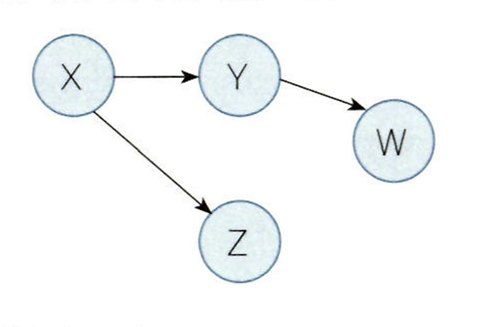

# 출제방향

## 1. 출제의 기본방향

추리논증 영역은 제시문의 제재나 문항의 구조, 질문의 방식 등을 다양화하여 이해력, 추리력, 비판력을 골고루 측정하는 시험이 될 수 있도록 하였다. 추리 능력을 측정하는 문항과 논증 분석 및 평가 능력을 측정하는 문항을 규범, 인문, 사회, 과학기술의 각 영역 모두에서 균형 있게 출제하였다. 또한 상이한 토대와 방법론에 따라 진행되는 다양한 종류의 추리 및 비판을 상황과 맥락에 맞게 파악하고 적용하는 능력을 측정하고자 하였다.

문항의 풀이 과정에서 제시문의 의미, 상황, 함의를 논리적으로 분석하고 핵심 정보를 체계적으로 취합하여 종합적으로 평가할 수 있어야 문제를 해결할 수 있도록 하였다. 제재의 측면에서 전 학문 분야 및 일상적ㆍ실천적 영역에 걸친 다양한 소재를 활용하였고, 영역 간 균형을 맞추어 전공에 따른 유ㆍ불리를 최소화하고자 하였다. 또한 제시문의 내용이나 영역에 관한 선지식이 문제 해결에 끼치는 영향을 최소화함으로써 정상적인 학업과 독서생활을 통해 사고력을 함양한 사람이라면 누구나 해결할 수 있는 문항을 만들고자 하였다.

## 2. 출제 범위 및 문항 구성

규범, 인문, 사회, 과학기술과 같은 학문 영역별 문항 수는 예년과 큰 차이 없이 균형 있게 출제되었다. 규범 영역의 문항은 법학 일반, 법철학, 공법, 사법 등 소재를 다양화하였고, 인문학 영역의 문항들은 지식이나 규범과 관련된 원리적 토대를 다루면서도 예술이나 사회과학, 자연과학과 융합된 방식의 내용이 주를 이루었다.

전체 문항은 규범 영역 15문항, 철학, 윤리학을 포함한 인문학 영역 11문항, 사회와 경제 영역 5문항, 과학기술 영역 6문항, 그리고 논리ㆍ수리적 추리 영역 3문항으로 이루어져 있다. 전체 문항에서 추리 문항과 논증 문항의 비중은 각각 50%로 양쪽 사고력이 골고루 평가될 수 있도록 하였다.

## 3. 난이도

제시문의 이해도를 높이기 위해서 전문적인 용어는 순화하여 전공 여부에 상관없이 내용에 접근하고 이해할 수 있도록 하였다. 문제를 해결하기 위해 거쳐야 할 추리나 비판 및 평가의 단계도 지나치게 복잡해지지 않도록 하였고, 문제풀이와 관계없는 자료는 줄여 불필요한 독해의 부담이나 함정으로 난이도가 상승하는 일이 없도록 하였다.

## 4. 출제 시 유의점

이번 시험에서 문항 출제 시 유의점은 다음과 같다.

* 제시문을 분석하고 평가하는 데 충분한 시간을 사용할 수 있도록 제시문의 독해 부담을 줄여 주고자 하였다.

* 추리 문항과 논증 문항의 문항별 성격을 명료하게 하여, 문항별로 측정하고자 하는 능력을 정확히 평가할 수 있도록 하였다.

* 선지식으로 문제를 풀거나 전공에 따른 유ㆍ불리가 분명한 제시문의 선택이나 문항의 출제는 지양하였다.

* 법학적성을 평가하기 위하여 법학의 기본 원리를 응용한 내용을 소재로 하면서도, 문항에 나오는 개념, 진술, 논리구조, 함의 등을 이해하는 데 법학지식이 요구되지 않도록 하였다.

* 출제의 의도를 감추거나 오해하게 하는 질문을 피하고, 문항 및 선택지 간의 간섭을 최소화함으로써 문항의 의도에 충실한 변별이 이루어지도록 하였다.

---

# 문항별 해설

## 01

### 문항구분

* 문항 성격 : 문항유형 : 논증 평가 및 문제해결 / 내용영역 : 규범

* 평가 목표 : 이 문항은 신경과학의 발전이 법에 대해서 어떤 함축을 가질지에 대한 한 가지 입장을 담은 제시문을 읽고 신경과학이 무엇을 밝혀낼 경우 이 입장이 강화 또는 약화되는지 따져 볼 수 있는 능력을 평가하는 문항이다.

### 제시문 해설

* 정답 : (1)

” 제시문은 신경과학이 미래에 모든 행동의 원인을 완전히 밝혀낼 수 있다면, 이것이 법적 처벌 관 행에 어떤 영향을 미칠 수 있는지 다루고 있다. 제시문에 의하면, 신경과학이 모든 행동의 원인을 뇌 안에서 완전히 찾아내게 된다고 하여도 법적 책임을 묻고 처벌하는 관행에는 아무런 영향을 미치지 못한다는 것이다. 그 이유는 법이 가정하는 것은 사람들이 형이상학적 의미의 자유의지를 갖고 있다는 것이 아니라, 사람들이 최소한의 합리적 행위 능력을 가지고 있다는 것이기 때문이 다. 여기서 최소한의 합리적 행위 능력은 자신의 믿음에 입각해서 자신의 욕구를 달성하는 행동 을 수행할 수 있는 능력을 말한다. 제시문은 신경과학이 일반적으로 사람이 이런 능력을 결여하 고 있다는 것을 보이지는 못할 것이기 때문에 신경과학이 법적 처벌의 관행을 변화시킬 수는 없 다고 본다:

### <보기> 해설

ㄱ. 제시문에 따르면, 법은 범죄를 저지른 사람이 범행 당시에 합리적 행위 능력이 있으면 처벌하기에 충분하다고 본다. 여기서 합리적 행위 능력이란 자신의 믿음 에 입각해서 자신의 욕구를 달성하는 행동을 수행할 수 있는 능력이다. 그러나 신경과학이 믿음이나 욕구가 행동을 발생시키는 데 아무런 역할을 하지 못한다 는 것을 보인다면, 이는 인간이 합리적 행위 능력을 갖지 못함을 보이는 셈이다. 따라서 신경과학이 법적 처벌의 관행을 변화시킬 수 없다는 이 글의 논지는 약 화된다. ㄱ은 옳은 평가이다.

ㄴ. 제시문에 따르면 신경과학이 법적 처벌의 관행을 변화시킬 수 있는 유일한 길 은 인간이 합리적 행위 능력을 결여한다는 것을 보이는 것뿐이다. 합리적 행위 능력 자체가 특정 방식으로 진화한 두뇌의 생물학적 특성에 기인한다는 것은 이런 능력의 원인을 밝힐 뿐, 인간이 이런 능력을 결여한다는 것을 보이는 것이 아니다. 따라서 인간의 합리적 행위 능력 자체가 두뇌의 생물학적 특성에 기인 한다는 것을 신경과학이 밝혀낸다고 하여도 이 글의 논지는 약화되지 않는다. ㄴ은 옳지 않은 평가이다.

ㄷ. 범죄를 저지른 사람들 중 상당수가 범죄 유발의 신경적 기제를 공통적으로 지 니고 있다는 것이 사실이라고 하자. 이 사실은 범죄를 저지른 사람들 중 상당수 가 합리적 행위 능력을 결여하고 있다는 주장을 강화할 가능성이 있다. 따라서 이 사실은 신경과학이 법적 처벌의 관행을 변화시킬 수 없다는 이 글의 논지를 강화시킬 수는 없다. ㄷ은 옳지 않은 평가이다. <보기>의 ㄱ만이 옳은 평가이므로 정답은 (1)이다.

## 02

### 문항구분

* 문항 성격 : 문항유형 : 언어 추리 / 내용영역 : 규범

* 평가 목표 : 이 문항은 '법의 발견'과 '법의 형성'의 개념을 적극적 후보, 중립적 후보, 소극적 후보라는 도구개념을 통하여 이해하고 사례에 적용하는 능력을 평가하는 문항이다.

### 제시문 해설

* 정답 : (2)

법률 문언의 가능한 의미'의 제한을 받지 않는 '법의 형성'은 법률 문언에 반하여 법률의 목적을 실현할 필요가 있어야 정당화된다. 반면에 '법의 발견'은 '법률 문언의 가능한 의미' 안에서의 해 석이므로 법률 문언에 반하여 법률의 목적을 실현할 필요와 무관하다. '법의 발견'의 하나인 `축소 해석'은 중립적 후보를 법률 문언의 적용범위에서 제외하는 것이고, '법의 형성'의 하나인 '목적론 적 축소'는 적극적 후보를 소극적 후보로 만들어 법률 문언의 적용범위에서 제외하는 것이다. <견해>에서 부여된 상황에 따르면, ×국은 '차를 '동력장치가 있는 이동수단'으로 이해하는 국 가로서, 승용차와 버스는 '차의 적용범위에 명백히 포함되는 적극적 후보이고, 동력장치가 있는 자전거는 '차"의 적용범위에 포함되는지 여부가 명확하지 않은 중립적 후보이며, 동력장치가 없는 자전거는 `차'의 적용범위에서 명백히 제외되는 소극적 후보이다. 갑의 견해는 동력장치가 없는 자전거라는 소극적 후보를 법률 문언의 적용범위에 포함시키는 것이므로 '법의 형성'에 해당한다. 을의 견해는 버스라는 적극적 후보를 소극적 후보로 만드는 목적론적 축소로서 '법의 형성'이며, 병의 견해는 동력장치가 있는 자전거라는 중립적 후보를 법률 문언의 적용범위에서 배제하는 축 소해석으로서 법의 발견 이다. = '. 기기 들의 견해는 법의 형성'에 해당하는 것으로서, 법률 문언에 반하여 법률의 목적을 실현하는 법 획득 방법이다. 즉, 갑과 을의 견해 모두 법률 문언에 반하여 법률의 목적을 실현할 필요가 있어야 정당화된다. ㄱ은 옳지 않은 분석이다.

ㄴ. 명의 견해는 법률 문언의 가능한 의미 안에서 행한 축소해석으로서 법의 형 성이 아니라 법의 발견'에 해당한다. ㄴ은 옳지 않은 분석이다.

ㄷ. 주차금지 팩말의 '차의 법률 문언의 가능한 의미'에 자기 소유의 승용차가 명 백히 포함됨에도 불구하고 이를 제외하는 것은 적극적 후보를 해당 법률의 목 적에 따라 소극적 후보로 만드는 것으로서 목적론적 축소 에 해당하므로, 을의 법 획득 방법과 같다. ㄷ은 옳은 분석이다. <보기>의 ㄷ만이 옳은 분석이므로 정답은 (2)이다.

## 03

### 문항구분

* 문항 성격 : 문항유형 : 논증 평가 및 문제해결 / 내용영역 : 규범

* 평가 목표 : 이 문항은 법률에 대한 위헌판단의 근거에 관하여 여러 견해의 차이를 제대로 파악하고 <상황>에 적용하여 옳게 판단할 수 있는 능력을 평가하는 문항이다.

### 제시문 해설

* 정답 : (2)

. 법률문장의 문자적 의미, 구체적 사안에 대한 법률문장 적용의 직접적인 결과, 한 사회에 법률이 시행되었을 때의 광범위한 사회적 영향, 법률문장이 그 사회에서 가지는 역사적 맥락 모두가 해 당 법률이 위헌인지를 판단하기 위한 근거를 제공한다. <상황>에서는 ×국의 헌법질서에 반하여 범죄로 평가되는 행위를 처벌하는 법률을 입법하였는데, 법률 시행의 사회적 영향은 애초에 법률 이 의도한 바에 역행하고 있다.

### <보기> 해설

ㄱ. /<을 적용한 직접적 결과는 국기 소각 행위를 한 자를 처벌하는 것이다. ×국의 헌법질서상 국기 소각 행위는 범죄라는 합의가 있으므로, (을 위헌판단의 근거 를 제공하는 핵심 측면으로 판단하면 Ｌ은 위헌이 아니라고 판단될 것이다. ㄱ은 옳지 않은 판단이다.

ㄴ. Ｌ의 은 Ｌ의 시행이 사회 전체에 미친 영향이다. 이것은 이전에는 별로 일어나 지 않던 국기 소각이 오히려 빈번하게 일어나게 되었고 국기 소각에 동조하는 사람들이 늘었다는 것으로, 국기의 권위와 존엄을 보호한다는 ! 의 입법 목적에 역행하는 것이다. ㄴ은 옳은 판단이다.

ㄷ. 을 위헌판단의 근거를 제공하는 핵심 측면으로 판단하는 입장은 /<과 관련한 ×국의 역사적 맥락을 통해 판단한다. 수차례 전쟁을 거치며 국기가 국가적 권위 와 존엄을 가지는 것으로 인정받게 된 ×국의 역사적 맥락으로 판단할 때, 국기 소각 행위는 반국가적ㆍ반헌법적인 행위임이 분명하다. 따라서 이를 처벌하는 법률이 위헌이라고 할 수 없다. ㄷ은 옳지 않은 판단이다. <보기>의 ㄴ만히 옳은 판단이므로. 정답은 (2)이다.

## 04

### 문항구분

* 문항 성격 : 문항유형 : 언어 추리 / 내용영역 : 규범

* 평가 목표 : 이 문항은 벌점과 처분벌점 및 이를 근거로 한 운전면허정지처분에 관한 규정을 이해하여 구체적인 사례에 적용하는 능력을 평가하는 문항이다.

### 제시문 해설

* 정답 : (4)

_ 처분벌점은 교통법규위반시 배점된 벌점을 누적하여 합산한 점수에서 기간경과로 소멸한 벌점 점수와 운전면허정지처분으로 집행된 벌점을 뻔 점수를 말한다. 처분벌점이 40점 이상이 되면 운전면허정지처분을 받는다. 처분벌점의 점수에 해당하는 일수가 운전면허정지처분의 기간이 된 다. 예를 들어 처분벌점이 50점이면 50일 동안 운전면허가 정지된다. 운전면허정지 중에 새로운 운전면허정지처분을 추가로 받는 경우, 추가된 운전면허정지처분은 집행 중인 운전면허정지처분 의 기간이 종료한 다음날부터 집행한다. 4 감은 201. 5. 1. 신호위반으로 받은 벌점 15점 외에 2020. 7. 1. 정지선위반 전까 지 누적된 벌점이 없다. 따라서 갑의 처분벌점은 30점 미만이므로 교통법규위반 없이 1년이 지난 2018. 5. 1. 소멸하였다. 벌점으로서도 벌점을 받은 지 3년이 지 난 2020. 5. 1. 소멸하였다. 이후 갑은 2020. 7. 1 정지선위반으로 벌점 18점을 받 아 처분벌점이 18점이 된다. 또 2021. 3. 1. 갓길통행으로 벌점 25점을 받아 처분 벌점이 43점이 된다. 처분벌점이 40점 이상이므로 2021. 3. 1. 운전면허정지처분 이 내려진다. 그 기간은 43일이고 갓길통행 다음날인 2021. 3. 2부터이므로. 갑 의 운전면허는 2021. 4. 13.까지 정지된다(43일=30일(3. 2.A~3. 31.)+13일(4. 1.A~ 4. 13.) 갑은 운전면허정지 중인 2021. 4. 1. 벌점 40점에 해당하는 속도위반을 하였으므로, 벌점이 2배로 배점되어 80점의 벌점을 받는다. 따라서 80일의 운전 면허정지처분을 추가로 받게 되는데, 그 집행은 먼저 집행 중인 운전면허정지처분의 기간이 끝난 다음날, 즉 2021. 4. 14.부터 시작한다. 그 결과 갑의 운전면허 는 최종적으로 2021. 7. 2.까지 정지된다(80일=17일(4. 14.~~4. 30.)+ 31일(5. 1A~ 5. 31)+ 30일(6. 1~6. 30.)+2일(7. 1~7. 2).

## 05

### 문항구분

* 문항 성격 : 문항유형 : 논증 및 반론 / 내용영역 : 규범

* 평가 목표 : 이 문항은 한 세대 전의 잘못된 행위에 대해 현세대에 배상을 해야 한다는 주장에 관한 논쟁을 적절하게 분석할 수 있는 능력을 평가하는 문항이다.

### 제시문 해설

* 정답 : (1)

” 이 문제는 과거의 잘못된 행위에 대해 후속 세대에게 배상을 해야 한다는 것과 배상에 대한 반사 실 조건문 원리를 동시에 주장하는 것이 어렵다는 점을 소재로 하여 출제된 문제이다. 각 주장의 핵심은 다음과 같다. 갑 : 배상은 다음과 같은 원리에 따라 이루어진다. 행위 ×가 없었더라면 6가 누리게 되었을 삶 의 수준이 되도록 혜택을 제공한다. 이 원리에 따라 8에게 배상이 이루어져야 한다. 을 : 갑의 논리의 문제점을 지적한다. 섬의 무단 점유가 없었더라면 8는 존재하지 않았을 것 이므로, 그 섬의 무단 점유가 없었더라면 8가 누렸을 삶의 수준이 어느 정도인지의 질문에 대해 애초에 어떤 답도 없다. 병 : 8가 배상받아야 할 행위는 섬의 무단 점유 가 아니라 8가 태어난 후 발생한 섬의 무단 점유에 대해 에게 배상하지 않음 이다. 즉 섬의 무단 점유에 대해 A에게 배상했더라면 6는 더 잘 살았을 것이므로, 이 수준이 되도록 6에게 배상이 이루어져야 한다 부결) 해설 '. 김근 피해자의 삶의 수준을 악화시킨 경우에만 배상이 있어야 한다고 주장한다. 만약 80년 전 섬의 무단 점유가 없었더라면 8가 누렸을 삶의 수준이 실제보다 더 낮았을 것이라고 인정한다면, 무단 점유가 8의 삶의 수준을 약화시킨 경우가 아니라 향상시킨 경우이다. 따라서 갑에 따르면 8에게 배상을 할 필요가 없다. ㄱ은 옳은 분석이다.

ㄴ. 을이 주장하고 있는 것은 @》의 원리가 8에게 배상이 이루어져야 할 근거가 될 수 없다는 것이다. 의 원리를 따를 때, 무단 점유가 발생하지 않았을 경우 8의 삶의 수준을 묻는 것이 무의미하기 때문이다. 을이 (〉을 받아들인다면, 그는 80 년 전 섬의 무단 점유에 대해 8에게 배상이 이루어져야 한다는 것에 동의하지 않을 것이다. ㄴ은 옳지 않은 분석이다. ㄷ. 병은 8가 배상받아야 할 잘못된 행위는 80년 전에 발생한 섬의 무단 점유 가 아니라 8가 태어난 후 발생한 섬의 무단 점유에 대해 배상하지 않음 이라 는 사건이라고 주장하고, 이에 근거해서 8에게 배상이 이루어져야 한다고 주장 한다. @ 의 주장에 근거해서 이런 주장을 하고 있기 때문에 병은 (@3에 동의하고 있다고 볼 수 있고, 갑과 배상의 원인이 되는 잘못을 다르게 판단하지만, 8에게 배상이 이루어져야 한다고 보는 점에서는 갑과 의견을 같이한다. 의 원리에 동의하지 않지만" 부분이 틀렸기 때문에, ㄷ은 옳지 않은 분석이다. <보기>의 ㄱ만이 옳은 분석이므로 정답은 (1)이다.

## 06

### 문항구분

* 문항 성격 : 문항유형 : 언어 추리 / 내용영역 : 규범

* 평가 목표 : 이 문항은 개인정보 보호에 관한 규정을 이해하고 구체적인 사례에 적용하여 관련 규정 준수 여부를 판단할 수 있는 능력을 평가하는 문항이다.

### 제시문 해설

* 정답 : (1)

： <사례>에서 『사는 개인정보처리자에 해당하고, 『사에 회원으로 가입한 이용자들은 정보주체에 해당한다. 제2조 제2항에서 개인정보를 제3자에게 제공하는 것은 개인정보를 제3자와 공유하는 것도 포함한다고 하였으므로, 제2조 제3항에서 제3자에게 제공할 수 있다고 한 것도 제3자와 공 유할 수 있다는 의미를 포함하는 것으로 해석하여야 한다.

### <보기> 해설

-. 『사가 0ㅇ에게 개인정보를 제공한 것은 『사의 수집 목적 범위(숙박예약)에서 제3 자에게 제공한 것이므로, 제2조 제2항이 적용된다. 『사는 회원에게 즉시 제공사 실을 알렸으므로, '주일 이내에 알려야 한다는 규정을 준수한 것이다.

ㄴ. 8사의 여행상품 홍보는 숙박예약이나 이벤트행사와 무관하므로, 『사의 수집 목 적 범위에 들지 않는다. 따라서 『사가 8사와 회원정보를 공유한 것은 개인정보 를 수집 목적 이외의 용도로 제3자에게 제공한 것에 해당하여 제조 제3항이 적용된다. 『사는 회원들로부터 별도의 동의를 받지 않았으므로, 규정을 위반한 것이다.

ㄷ. 싸는 개인정보처리자 『사가 본래의 개인정보 수집ㆍ이용 목적(항공권 경품이 벤트)과 관련된 업무(항공권 경품이벤트를 메일발송의 방법으로 안내함)를 위탁 하여 위탁자 [사의 이익을 위해 개인정보를 처리하는 자이므로, 『사의 업무수 탁자에 해당한다. 따라서 제2조 제4항이 적용되므로, 위탁사실을 회원들에게 고 지ㆍ공개하여야 한다. 그런데 이 고지ㆍ공개에는 (제2조 제2항과 같은) 기간제한 이 없으므로, 『사는 규정을 준수한 것이다. 2. 1사의 도박 홍보는 숙박예약이나 이벤트행사와 무관하므로, 『사의 수집 목적 범위에 들지 않는다. 따라서 『사가 7사에게 개인정보를 제공한 것은 개인정보 를 수집 목적 이외의 용도로 제3자에게 제공한 것에 해당하여 제2조 제3항이 적용된다. 제2조 제3항에 따르면 정보주체의 이익을 부당하게 침해할 우려가 없는 경우에만 제3자 제공이 허용되는데, 불법 도박을 홍보하면 홍보 대상인 『 사 회원들의 이익이 부당하게 침해될 우려가 있다. 따라서 『사가 비록 회원들 부터 별도의 동의를 받았다 하더라도, 『사는 규정을 위반한 것이다. <보기>의 ㄱ, ㄷ만이 규정을 준수한 것이므로 정답은 (1)이다.

## 07

### 문항구분

* 문항 성격 : 문항유형 : 언어 추리 / 내용영역 : 규범

* 평가 목표 : 이 문항은 음주운전자의 혈중알코올농도 측정에 관한 규정과 공식을 이해하여 구체적 사례에 적용하는 능력을 평가하는 문항이다.

### 제시문 해설

* 정답 : (4)

&공식을 적용하여 혈중알코올농도를 계산할 때에는 다음 두 가지 점에 유의하여야 한다. 첫째. A 공식은 혈중알코올농도 상승기에는 적용할 수 없다. ×국 법원의 입장에 따르면 최고 혈중알코올농도에 이르는 시점은 음주종료시부터 1시간 30분 후이므로 그 이전에 발생한 사고에 대해서는 A공식을 적용할 수 없다. 둘째, 시간당 알코올 분해율은 측정대상자에게 가장 유리한 값을 적용 한다고 하였으므로, 시간당 0008~~0.03% 중 가장 작은 값인 시간당 0.008%를 대입하여야 한다.

### <보기> 해설

ㄱ. 교통사고가 발생한 시점이 2100로 음주종료시인 20:00로부터 1시간밖에 지나 지 않았다. 혈중알코올농도 상승기이므로 A공식을 적용할 수 없다. 따라서 면허 취소는 불가능하다. ㄱ은 옳지 않은 추론이다.

ㄴ. 교통사고 시간이 미상이므로 사고 시점의 정확한 혈중알코올농도의 추정은 불 가능하나, 음주종료 1시간 30분 후의 최고 혈중알코올농도는 추정할 수 있다. A 공식에 +=0.012. 』《==0.008, 1=2(음주종료 1시간 30분 후인 21:30부터 측정 시점 인 23:30까지 2시간이 지났음)를 대입하면 <=0.012+ 0.008×2=0.028이다. 최 고 혈중알코올농도가 0.028%로 면허취소 기준에 미달하므로, 이후 사고시간이 몇 시로 밝혀지더라도 면허는 취소되지 않는다. ㄴ은 옳은 추론이다.

ㄷ. 음주종료 직후인 20:00에 자가측정한 혈중알코올농도는 교통사고를 낸 시점인 22:30의 혈중알코올농도를 추정할 수 있는 자료로 사용되지 못한다. 23:30에 측 정한 혈중알코올농도가 유일한 기준이 된다. A공식에 =0.021 4《=0.008, = 1(교통사고를 낸 22:30부터 측정 시점인 23:30까지 1시간이 지났음)을 대입하면 (6=0.021+0.008×1=0.029이다. 혈중알코올농도가 0.029%로 면허취소 기준 에 미달하므로, 면허는 취소되지 않는다. ㄷ은 옳은 추론이다. <보기>의 ㄴ, ㄷ만이 옳은 추론이므로 정답은 (4)이다.

## 08

### 문항구분

* 문항 성격 : 문항유형 : 논증 평가 및 문제해결 / 내용영역 : 규범

* 평가 목표 : 이 문항은 아동학대범죄에 관한 규정의 내용과 그에 대한 의견을 이해하고 제시된 연구 결과를 각 의견에 대한 논거로 사용할 수 있는지 판단하는 능력을 평가하는 문항이다.

### 제시문 해설

* 정답 : (2)

[규정]은 행위주체를 누구든지'로 규정하여 특별한 제한을 두지 않는데, A는 이를 '성인 으로 한 정하여야 한다고 주장하고, 『6는 이를 현행대로 유지(미성년자 포함)하여야 한다고 주장한다. A는 보호의무자가 학대행위의 주체가 된다는 범죄의 특징을 근거로 들고 6는 학대가해자를 철저히 처벌하여 학대피해자를 폭넓게 보호하여야 한다는 규정의 목적을 근거로 든다. 성적 아동학대와 관련하여 |규정은 '성적 수치심을 야기하는 성적 학대행위로 규정하고 있는 데 는 '성적 수치심을 야기하는 이라는 표현을 삭제하여야 한다고 주장한다. (는 아동은 성인과 달리 성적 자기결정능력이 충분하지 않다는 피해자의 특성을 근거로 는다.

### <보기> 해설

ㄱ. 제시된 연구 결과는 미성년자인 보호의무자-미성년자인 보호대상자의 관계가 증가하고 있다는 것을 보여준다. 따라서 보호의무자를 성인, 보호대상자를 미성 년자로 전제하고 미성년자를 아동학대 행위주체에서 제외하자는 의 의견은 이 연구 결과에 의해서 뒷받침되지 못한다. ㄱ은 옳지 않은 평가이다.

ㄴ. 제시된 연구 결과는 거시적 관점에서는 아동학대 피해자와 가해자의 개념 구분 이 명확하지 않을 수 있다는 내용이다. 따라서 특정 범죄에 국한한 미시적 관점 에서 아동학대의 가해자와 아동학대의 피해자를 명확히 구분하는 ㅁ의 의견은 이 연구 결과에 의해서 뒷받침되지 못한다. ㄴ은 옳지 않은 평가이다.

ㄷ. 제시된 연구 결과는 '0 성적 수치심을 야기하지 않는 성적 요구라도 미성년자 의 성적 발달에 해를 끼칠 수 있다. @ 미성년자의 성적 요구행위 역시 학대로 보아 처벌하여야 한다는 두 가지 내용으로 정리된다. 우선, 성적 자기결정능력 이 충분하지 않은 아동을 대상으로 한 성적 학대에는 '성적 수치심을 야기하는 이라는 요건이 불필요하다는 (의 의견은 (에 의하여 뒷받침될 수 있다. 또한 학대가해자를 철저히 처벌하기 위하여 행위주체에 제한을 두지 말아야 한다(미 성년자도 처벌하여야 한다)는 8의 의견은 @에 의하여 뒷받침될 수 있다. ㄷ은 옳은 평가이다. <보기>의 ㄷ만이 옳은 평가이므로 정답은 (2)이다.

## 09

### 문항구분

* 문항 성격 : 문항유형 : 언어 추리 / 내용영역 : 규범

* 평가 목표 : 이 문항은 다른 사람의 물건을 재료로 하여 새로운 물건을 만든 경우에 관한 규정을 이해하고 구체적 사례에 적용하는 능력을 평가하는 문항이다.

### 제시문 해설

* 정답 : (1)

타인의 물건을 원재료로 사용하여 제작한 새로운 물건의 소유자가 누가 되는지는 @ 원재료 주인 의 원재료 사용동의 유무와 새로운 물건이 원재료보다 비싼 물건인지 여부에 따라 달라진다. 원재료 주인이 새로운 물건을 소유하지 못하게 되는 경우에는 제작자에게 원재료 가액의 지급을 청구할 수 있다. 그런데 새로운 물건을 쉽게 원재료로 환원할 수 있는 경우에는 원재료 소유자는 원재료 사용동의 유무에 관계없이 그리고 새로운 물건을 소유하느냐 여부에 관계없이 제작자에 게 새로운 물건을 원재료로 환원하여 반환하라고 청구할 수 있다. 6 3. = 검게 원재로인 소기죽으로 환원할 수 있으므로, 제3조에 의하여 소가죽 소유자인 갑이 환원을 원하기만 하면 옳은 원상대로 소가죽을 반환하여야 한 다. 갑의 사용동의가 있었던 경우는 없었던 경우는 다르지 않다. ㄱ은 옳은 판단 이다.

ㄴ. 은 게 원재료로 환원할 수 없고 원재료 소유자 갑의 사용동의가 없었으므 로 제2조가 적용된다. ㅁ-의 가격이 원재료 가액에 미달하므로, 갑은 먼저 을에 게 원재료 가액의 지급을 청구해야 하고, 을이 이를 지급하지 않는 경우에 한해 서만 의 소유자가 될 수 있다. 갑이 원재료 가액의 지급을 청구하였는지 그리 그 을이 지금하였는지 알 수 없으므로, 이 갑의 소유라고 단정적으로 밀할 주 없다. ㄴ은 옳지 않은 판단이다.

ㄷ. 은 쉽게 원재료로 환원할 수 없으므로, 원재료 소유자인 갑의 사용동의를 얻 은 경우에는 제1조가, 사용동의를 얻지 않은 경우에는 제2조가 적용된다. 의 가격이 원재료 가액을 초과하므로, 갑의 사용동의를 얻은 경우에는 제1조 제2항 에 의하여 @의 소유자는 병이 되고, 사용동의를 얻지 않은 경우에는 제2조 1에 의하여 @은 갑의 소유가 된다. 제1조AA제3조에서 새로운 물건의 소유자가 될 수 있는 사람은 원재료 소유자 또는 새로운 물건의 제작자이므로, 소가죽 소유 자도 아니고 @을 제작하지도 않은 옳은 어떠한 경우에도 @의 소유자가 될 수 없다. ㄷ은 옳지 않은 판단이다. <보기>의 ㄱ만이 옳은 판단이므로 정답은</미대

## 10

### 문항구분

* 문항 성격 : 문항유형 : 언어 추리 / 내용영역 : 규범

* 평가 목표 : 이 문항은 디지털 성범죄 처벌에 관한 여러 법안의 차이점을 이해하고 각각의 규정을 사례에 적용하여 비교하는 능력을 평가하는 문항이다.

### 제시문 해설

* 정답 : (5)

그대 개 정답: 6 <1안>~<3안>은 처벌대상으로 하는 행위도 조금씩 다르고 처벌도 다르다. 성적 의도로 다른 사람 의 신체를 그 의사에 반하여 촬영하는 행위와 이에 따른 촬영물 또는 그 복제물을 유포하는 행 위는 공통적으로 처벌대상이고, 영리를 목적으로 정보통신망을 이용하여 유포하는 행위를 그렇 지 않은 유포 행위보다 중한 범죄로 본다는 점에서도 공통된다. 그러나 촬영 당시에 촬영대상자 의 의사에 반하지 않았다면 그 촬영물(복제물 포함)의 유포가 촬영대상자의 의사에 반할지라도 <1 안>에서는 처벌대상이 아니고, 촬영자가 자신을 촬영한 촬영물(복제물 포함)을 다른 사람이 유포 하는 행위는 <3안>에서만 처벌대상이 될 수 있다. 유포 외에 소지ㆍ구입ㆍ저장ㆍ시청까지도 처벌대 성으로 하는 짓은 (92뿐이다.

### 선택지별 해설

정답 해설 6 다인의 의사에 반하여 그의 신체를 성적 의도로 촬영한 사진을 가판대에서 판매 하는 행위는 정보통신망을 통한 유포가 아니므로, <1안>에서는 제2항, <2안/에서 는 제1항, <3안>에서는 제2항에 따라 처벌된다. 각각 6년 이하의 징역, 5년 이하 의 징역, /년 의하의 징역을 규정하고 있으므로. 카잠 중한 처벌을 규성한 외법 안은 <1안>이 아니라 <3안>이다. @는 옳지 않은 분석이다.

오답 해설 (1: <1인>에 따르면 성적 의도로 타인의 신체를 그의 의사에 반하여 촬영하는 행위 는 4년 이하의 징역으로 처벌되고, 그 촬영물을 유포하는 행위는 6년 이하의 징 역으로 처벌된다. <3안>에 따르면 성적 의도로 타인의 신체를 그의 의사에 반하 여 촬영하는 행위는 5년 이하의 징역으로. 처벌되고, 그 촬영물을 유포히는 행우 는 7년 이하의 징역으로 처벌된다. 더 중한 처벌을 규정한 것은 더 중한 범죄로 본다는 것을 의미하므로, (은 옳은 분석이다. (2 성적 의도로 타인의 신체를 그의 의사에 반하여 촬영한 동영상을 인터넷에서 다 운로드받아 개인 [에 저장하는 행위는 <3안> 제4항의 복제물을 소지ㆍ구입ㆍ저 장 또는 시청하는 행위'에 해당한다. 이러한 행위가 <3안>에서만 처벌대상이라 고 한 @는 옳은 분석이다. @ 성적 의도로 촬영대상자의 허락을 받아 촬영한 나체사진을 그의 의사에 반하여 다른 사람에게 이메일로 전송하는 행위는 촬영 당시에는 촬영대상자의 의사에 반하지 아니하였으나 촬영 후에 그 의사에 반하여 촬영물 또는 그 복제물을 유 포하는 행위에 해당하고, <2안> 제2항과 <3안> 제2항 둘째 문장에서 처벌대상으 로 규정하고 있다. 그러나 <1안>에 따르면 촬영 당시에 촬영대상자의 의사에 반 하지 않았다면 이후 어떠한 행위도 처벌대상이 아니다. @/은 옳은 분석이다. @) <3안>은 촬영이나 유포가 촬영대상자의 의사에 반한 것인지 여부만 문제 삼을 뿐, 촬영대상이 '다른 사람의 신체일 것을 규정하지 않는다. 촬영자가 자신의 나 체를 촬영하였으므로, 촬영자의 의사에 반하여 유포한 것은 촬영대상자의 의사 에 반하여 유포하였다는 것을 의미한다. 따라서 촬영자가 성적 의도로 자신의 나체를 촬영한 사진을 촬영자의 의사에 반하여 다른 사람들에게 야46로 보낸 행 위는 <3안> 제2항 둘째 문장에 따라 처벌된다. @는 옳은 분석이다.

## 11

### 문항구분

* 문항 성격 : 문항유형 : 언어 추리 / 내용영역 : 규범

* 평가 목표 : 이 문항은 법의 인적-장소적 적용범위와 2회 이상 죄를 범한 경우의 형량 산정에 관한 규정을 이해하여 구체적 사례에 적용하는 능력을 평가하는 문항이다.

### 제시문 해설

* 정답 : (2)

[×국 규정]과 [+국 규정]을 적용하여 갑, 을, 병에게 선고될 형량을 계산하기 위해서는 우선 재판 하는 국가가 어디인지를 확인하여 적용될 규정을 정하여야 한다. 다음으로 해당 규정에 따라 범 죄자가 내국인인지 외국인인지 파악하여야 하고, 개별 범죄가 이루어진 곳이 어느 나라의 영역인 지도 확인하여야 한다. 이에 따라 해당 규정이 적용되는 범죄와 적용되지 않는 범죄를 알 수 있 다. 이어서 해당 규정이 적용되는 범죄의 형량을 확인하고, 끝으로 해당 규정이 2회 이상의 범죄 에 대하여 정한 처리 방식을 적용하면 선고될 형량을 알 수 있다.

### 선택지별 해설

정답 해설

(2) ,국에서 재판을 받는 갑에게는 +국 규정이 적용되며, /국 규정 제3조에 따르면 갑은 외국인이다. 갑이 범한 죄는 외국에서의 강간, 외국에서의 해상강도, 내국 에서의 해상강도이다. 외국인이 외국에서 범한 강간에는 +국 규정이 적용되지 않는다. 해상강도를 내국에서 범하든 외국에서 범하는 제2소 제2항에 따라 내국 인과 외국인에게 모두 제2조 제1항이 적용되고, 형량은 9년이다. 갑은 형량 9년 인 2개 범죄에 대해 재판을 받게 되므로, 제4조 제1항에 따라 갑에게는 9년에 4 년 6개월(9년의 2분의1)을 더한 13년 6개월의 형이 선고될 것이다. +국에서 재판을 받는 을에게는 +국 규정이 적용되며, +국 규정 제3소에 따르면 옳은 내국인이다. 을이 범한 죄는 내국에서의 2회 강간과 외국에서의 강간이다. 제1조 제2항에 따라 내국인이 내국 또는 외국에서 범한 강간에는 제1소 제1항이 적용되고, 형량은 6년이다. 옳은 형량 6년인 3개 범죄에 대해 재판을 받게 되므 로, 제4조 제1항에 따라 을에게는 6년에 4년(6년의 3분의가을 더한 10년의 형이 선고될 것이다. ×국에서 재판을 받는 병에게는 ×국 규정이 적용되며, ×국 규정 제3조에 따르면 병은 외국인이다. 병이 범한 죄는 외국에서의 해상강도와 내국에서의 2회 강간 이다. 외국인이 외국에서 범한 해상강도에는 ×국 규정이 적용되지 않는다. 제1조 제2항에 따라 외국인이 내국에서 범한 강간에는 제1소 제1항이 적용되고, 형량은 /년이다. 병은 형량 /년인 2개 범죄에 대해 재판을 받게 되므로, 제4소에 따라 병에게는 7년에 7년을 더한 14년의 형이 선고될 것이다. <사례>에서 선고되는 형 중 최저 형량은 을의 10년이고 최고 형량은 병의 14년이 므로 정답은.@이다

## 12

### 문항구분

* 문항 성격 : 문항유형 : 논쟁 및 반론 / 내용영역 : 규범

* 평가 목표 : 이 문항은 ×국 형법상 재물 개념을 둘러싼 논쟁에서 갑, 을, 병의 주장 및 논지를 파악하고 이를 바탕으로 구체적 물건의 재물 여부를 판단할 수 있는 능력을 평가하는 문항이다.

### 제시문 해설

* 정답 : (3)

갑, 을, 병은 형법상 재물이 재산적 가치가 있는 물건 이라는 데 의견이 일치하나, 재산적 가치가 무엇을 의미하는가에 관하여 논쟁하고 있다. 갑은 재산적 가치가 순수한 경제적 가치, 즉 금전적 (교환)가치와 같은 의미라고 보는 입장이고, 옳은 소유자의 주관적 가치소유의사의 표출)만 있으 면 금전적 교환가치가 없어도 형법상 재물이 된다고 보는 입장이며, 병은 금전적 교환가치 외에 소유 및 거래의 적법성을 요구하는 입장이다.

### <보기> 해설

ㄱ. 감은 물건이 형법상 재물이 되기 위해 소유의 적법성은 필요하지 않고 금전적 (교환)가치만 있으면 된다는 입장이므로, 마약밀매상의 마약도 형법상 재물로 본다. ㄱ은 옳은 분석이다.

ㄴ. 옳은 물건에 소유자의 주관적 가치만 있으면 금전적 교환가치 유무에 관계없이 형법상 재물로 인정하는 입장이므로, 마약판매상의 마약이는 연예인의 팬레터 든 모두 형법상 재물로 본다. ㄴ은 옳은 분석이다.

ㄷ. 병은 물건의 금전적 교환가치와 더불어 그 소유 및 거래의 적법성까지 갖추어 야 형법상 재물이 될 수 있다는 입장이므로, 거래가 되지 않는 팬레터는 금전적 교환가치가 없어서 형법상 재물로 보지 않고, 법적으로 소유가 금지된 마약은 소유의 적법성이 없어서 형법상 재물로 보지 않는다. ㄷ은 옳지 않은 분석이다 <보기>의 ㄱ, ㄴ만이 옳은 분석이므로 정답은 (3)이다.

## 13

### 문항구분

* 문항 성격 : 문항유형 : 언어 추리 / 내용영역 : 규범

* 평가 목표 : 이 문항은 서로 다른 국적을 가진 사람들이 혼인하고자 하는 경우에 혼인성립요건의 준거법을 결정하는 원칙을 이해하고 사례에 적용하는 능력을 평가하는 문항이다.

### 제시문 해설

* 정답 : (3)

_ ×국 국적의 갑은 18세가 넘었고, +국 국적의 옳은 남성으로서 16세가 넘었으며, 국 국적의 병은 여성으로서 16세가 넘었으므로, 각자가 국적을 가진 국가의 규정에 따르면 3명 다 혼인 적령에 해당한다. 따라서 혼인의 성립이 가능한지 알기 위해서는 중혼이나 동성혼이 가능한지만 확인하 면 된다. ×국은 중혼과 동성혼을 모두 허용한다. 국은 남성의 중혼은 허용하나 여성의 중혼은 허용 여 부를 알 수 없고, 동성혼은 금지한다. 2국은 중혼은 금지하나 동성혼은 허용한다. 두스 고: -. 김은 이성이고 옳은 남성이므로 동성혼에 관한 규정은 검토하지 않아도 된다. 갑이 국적을 가진 ×국에서는 모든 중혼을 허용하고 을이 국적을 가진 +국에서 는 남성의 중혼을 허용하므로, 기혼 남성인 을의 중혼은 금지되지 않는다. 따라 서 갑과 옳은 ×국에서 혼인할 수 있다. ㄱ은 옳게 적용한 것이다.

ㄴ. 갑과 병 모두 미혼이므로 중혼에 관한 규정은 검토하지 않아도 된다. 갑과 병 모두 여성이므로 두 사람의 혼인은 동성혼에 해당하는데, 두 사람이 각각 국적 을 가진 ×국과 7국에서는 모두 동성혼을 허용한다. 따라서 갑과 병은 ×국에서 혼인할 수 있다. ㄴ은 옳게 적용한 것이다.

ㄷ. 옳은 남성이고 병은 여성이므로 동성혼에 관한 규정은 검토하지 않아도 된다. 을 이 기혼 남성이므로 병과의 혼인은 중혼에 해당하는데, 을이 국적을 가진 +국에 서는 남성의 중혼을 허용하나 병이 국적을 가진 2국에서는 모든 중혼을 금지한 다. 따라서 을과 병은 ×국에서 혼인할 수 없다. ㄷ은 옳게 적용하지 않은 것이다. <보기>의 ㄱ, ㄴ만이 옳게 적용한 것이므로 정답은 (3)이다.

## 14

### 문항구분

* 문항 성격 : 문항유형 : 언어 추리 / 내용영역 : 규범

* 평가 목표 : 이 문항은 지분 보유 제한과 관련하여 '사실상 동일인'에 관한 규정을 이해하고 사례에 적용하는 능력을 평가하는 문항이다.

### 제시문 해설

* 정답 : (5)

_ 모든 자연인은 단독으로 또는 [규정] 제2조의 '사실상 동일인'과 합하여 마스크 생산회사 지분을 50%까지만 보유할 수 있는데, '사실상 동일인'에 해당하는 자는 0) 부모ㆍ배우자ㆍ자녀, 그가 509% 이상 지분을 보유하고 있는 법인, @ 그가 부모ㆍ배우자ㆍ자녀와 합하여 50% 이상 지분을 유하고 있는 법인이다. 갑, 을, 병, 정의 친족관계를 파악하고 각자의 『회사 지분율 및 회사 지 분율을 정확히 계산하여야 한다.

### 선택지별 해설

정답 해설 6: 감이 정으로부터 @회사 지분 50%를 취득하면, @회사는 갑이 50% 이상 지분을 보유하는 법인으로서 갑의 '사실상 동일인(제2조 제2호)에 해당하게 된다. 갑이 제3자들로부터 『회사 지분 35%를 취득하면 현재의 15%와 합하여 50%를 보유 하게 된다. 여기에 사실상 동일인 인 @회사가 보유하는 『회사 지분 20%를 합하 면 70%가 되어 50%를 초과하므로, 제1조를 위반하게 된다. @)는 옳지 않은 판단 이다.

오답 해설 (1: 옳은 병의 배우자이므로 병의 사실상 동일인(제2조 제1호)이다. 병이 @회사 지 분 40%를 보유하고 있고, 병의 '사실상 동일인 인 을이 @회사 지분 10%를 보유 하고 있으므로, @회사는 병이 그 배우자와 합하여 50% 이상 지분을 보유하는 법인으로서 병의 '사실상 동일인'(제2조 제3호)에 해당하게 된다. 병이 제3자들 부터 『회사 지분 30%를 취득하면, 사실상 동일인 인 @회사가 보유하는 『회 사 지분 20%와 합하여 50%가 된다. 병은 '사실상 동일인 과 합하여 [회사 지분 을 50%까지 보유할 수 있으므로 문제가 되지 않는다. (1;은 옳은 판단이다. 2) 을이 갑의 딸이면 갑의 '사실상 동일인(제2조 제1호)에 해당한다. 그러나 을의 남편인 병은 갑의 '사실상 동일인 이 아니므로, @회사도 갑의 '사실상 동일인'이 아니다. 옳은 『회사 지분을 보유하고 있지 않다. 따라서 갑은 단독으로 『회사 지 분을 50%까지 보유할 수 있는데, 갑이 제3자들로부터 『회사 지분 35%를 취득 하면 현재의 1%와 합하여 50%를 보유하게 되므로 문제가 되지 않는다. @는 굴는 반단이다. @ 정이 갑의 딸이면, 갑은 정의 부모이므로 정의 사실상 동일인(제2조 제1호)이다. @회사는 정이 50% 이상 지분을 보유하는 법인이므로 정의 '사실상 동일인(제 2조 제2호)이다. 정이 제3자들로부터 『회사 지분 15%를 취득하면, '사실상 동일 인' 인 갑이 보유하는 『회사 지분 15% 및 '사실상 동일인 인 @회사가 보유하는 『 회사 지분 20%와 합하여 50%가 된다. 정은 사실상 동일인'과 합하여 『회사 지 분을 50%까지 보유할 수 있으므로 문제가 되지 않는다. 은 옳은 판단이다. @ 정이 병으로부터 회사 지분 17%를 취득하면, 을과 병이 보유하는 @회사 지분 은 각각 10%와 30%가 된다. 병이 그 배우자와 합하여 보유하는 @회사 지분은 50%에서 40%로 감소하게 되므로, (1:과 달리 @회사는 더 이상 병의 '사실상 동 일인 이 아니게 된다. 옳은 『회사 지분을 보유하고 있지 않다. 따라서 병은 단독 으로 『회사 지분을 50%까지 보유할 수 있는데, 현재 병은 『회사 지분을 보유하 고 있지 않으므로, 제3자들로부터 「『”회사 지분 50%를 취득하면 「”회사 지분 50% 를 보유하게 되어 문제가 되지 않는다. 는 옳은 판단이다.

## 15

### 문항구분

* 문항 성격 : 문항유형 : 언어 추리 / 내용영역 : 규범

* 평가 목표 : 이 문항은 도덕적 무지가 나쁜 행위에 대한 비난가능성을 줄일 수 있는지 여부에 대해 두 대립되는 입장을 이해하여 두 입장으로부터 옳은 것을 추론할 수 있는 능력을 평가하는 문항이다.

### 제시문 해설

* 정답 : (4)

어떤 나쁜 행위가 '사실적 무지 에서 기인할 때 이는 그 행위에 대한 행위자의 비난가능성을 낮출 수 있다는 것은 분명하다. 그러나 도덕적 무지, 즉 어떤 것이 나쁜 행위라는 것을 몰랐을 때 그 행위에 대한 행위자의 비난가능성이 낮아질 수 있는지는 논란의 여지가 있다. A는 도덕적 무지도 사실적 무지와 다를 바 없이 행위의 비난가능성을 낮출 수 있다고 본다. 반면에 ㅁ는 도덕적 무지 는 비난가능성과 무관하다고 주장한다. 행위에 대한 행위자의 비난가능성과 칭찬가능성은 도덕 적 성품으로부터 나온다는 것이다.

### <보기> 해설

ㄱ. 감은 노예를 돕는 행위가 옳지 않다는 도덕적으로 틀린 믿음을 갖고 있으나, 좋 은 행위를 했다. A에 따르면 나쁜 행위라도 그것이 도덕적으로 잘못된 믿음에 서 나올 때에는 비난의 여지는 낮아질 수 있고, 심지어 칭찬의 여지까지 생긴다. 그런데 갑의 사례는 도덕적 믿음에 반해서 행동한 사례이므로 이에 대해서 A가 어떤 함축을 갖는지는 결정할 수 없다고 보아야 한다. 6는 행위자에 대한 비난 가등성과 징찬가능성은 행위가 드러내는 행위자의 도덕적 성품으로부터 나온다 고 주장하므로, 6에 따르면 좋은 행위를 한 갑은 칭찬받을 만하다고 추론할 수 있다. 따라서 ㄱ은 옳지 않은 추론이다.

ㄴ. 클의 행위는 도덕적 무지에서 나온 악행이다. 따라서 A는 이 무지가 비난가능성 을 낮춘다고 평가할 것이다. 반면에 6는 도덕적 무지는 비난가능성과 칭찬가능 성에 대한 판단에 영향을 미치지 못한다고 본다. 게다가 이런 행동에 아무 거리 낌을 느끼지 않는다는 것은 을이 선한 도덕적 성품을 가지지 않았음을 시사한 다. 따라서 8에 따르면 을의 도덕적 무지는 그에 대한 비난가능성을 낮주지 못 한다. ㄴ은 옳은 추론이다.

ㄷ. 병의 무지는 사실적 무지에 해당한다. A는 사실적 무지가 행위의 비난가능성을 낮춘다고 명시적으로 말하고 있으므로, A는 병의 착각이 비난가능성을 낮춘다 고 판단할 것이다. ㄷ은 옳은 추론이다. (25 <보기>의 ㄴ, ㄷ만이 옳은 추론이므로 정답은 (4)이다.

## 16

### 문항구분

* 문항 성격 : 문항유형 : 논증 평가 및 문제해결 / 내용영역 : 인문

* 평가 목표 : 이 문항은 거짓 판단의 불가능성에 대한 소크라테스의 논증을 읽고 이에 대해 올바른 평가를 할 수 있는 능력을 측정하는 문항이다.

### 제시문 해설

* 정답 : (4)

알지 못한다는 것을 알아야 한다, 또는 너 자신을 알라 라는 소크라테스의 말에서 문제되는 않 의 개념은 불완전한 잃이 아니라 완전한 읽이다. 소크라테스가 가지고 있었던 '완전한 않의 캐념 이 컴토되는 테아이테토스편의 논의로셔, 여기서 등장하는 소크라테스는 거짓된 판던이 불가능 하다는 논증을 제시한다. 소크라테스카 제시힌 존증의 구조는 다음과 길다.

(1) 우리는 대상들에 대해 알거나 알지 못한다. (소크라테스의 첫 번째 진술) (9 만일 대상들에 대해 모두 안다면, 거짓된 판단은 할 수 없다. (소크라테스의 세 번째 진술) (@ 만일 대성들에 대해 모두 일지 못한다면, 커짓된 판단은 할 수 없다: (소크리테스의 네 번째 진술) @ 따라서 우리는 거짓된 판단을 할 수 없다. (소크라테스의 다섯 번째 진술) 이로부터 '6는 6이다'라는 거짓된 판단은 8와 6를 모두 아는 경우, 모두 모르는 경우에서 불가 등하다는 것을 알 수 있다.

### <보기> 해설

ㄱ. 제시문으로부터 3와 를 모두 알 때 참된 판단이 가능하다는 것을 추론할 수는 있지만, 8와 6 중 하나를 알고 하나를 모를 때 참된 판단을 내릴 수 있다는 것을 추론할 추는 없다. 0 일고 는 .모르= 경우에는, 향자를 모름 때와 마잔가지 이유에서, 즉 모르는 것에 대해서는 판단 자체가 불가능하다는 이유에서 `3는 6 이다 라는 참된 판단을 내릴 수 없을 것이다. ㄱ은 옳지 않은 분석이다.

ㄴ. 소크라테스의 네 번째 진술에서, 8와 를 알지 못하는 경우 '6는 0이다 라는 생 각에 이르게 되는 일이 있을 주 없다고 말하고 있다. 즉, "6 06이다라는 판단을 할 수 없다고 주장하고 있다. ㄴ은 옳은 분석이다.

ㄷ.. 소크라테스의 세 번째 진술에서, 8와 6를 둘 다 아는 경우 @는 6이다 라는 커짓 판단을 내리는 것이 가능하지 않다는 것을 주장하고 있다. 따라서 3와 [를 둘 다 알면서 는 6이다 라는 거짓 판단을 내리는 것이 실제로 가능하다면, 소크라 테스의 주장은 유지되지 못할 것이다. 따라서 ㄷ은 옳은 분석이다. 《보키/의 ㄴ, ㄷ만히 옳은 분석이므로 정답은 (4)이다.

## 17

### 문항구분

* 문항 성격 : 문항유형 : 논쟁 및 반론 / 내용영역 : 인문

* 평가 목표 : 이 문항은 악을 자립적 존재로 이해하는 글과 악을 단순한 결여로 이해하는 글을 읽고 그 논점이 무엇인지를 파악하는 능력을 평가하는 문항이다.

### 제시문 해설

* 정답 : (5)

&는 악이 존재가 아니라 결여에 불과하다는 관점을 반박하는 논증이고, 6는 악이 결여에 불과하 다는 관점을 지키기 위해 A&를 반박하는 논증이다. 두 논증에서 문제가 되는 것은 결여의 다의성 이다. 는 존재에 대한 결여의 관계를 단순히 진술의 부정으로 이해하고, 긍정문과 부정문이 상 호 모순적이라는 의미에서 부정과 결여에는 더함과 덜함이 있을 수 없다고 본다. 즉, 존재하다 와 '존재하지 않다(결여되어 있다)는 진술은 모순이며 이 두 진술 사이에는 어떤 중간의 것, 즉 더함 과 덜함이 들어설 자리가 없다는 것이다. 그러나 경험적 사실이나 일상적 어법에서 더 악함과 덜 악함의 존재는 당연하게 받아들여지며, 따라서 악은 결여가 아니라는 것이다. 이에 비해 68는 존재에 대한 결여의 관계를 단순히 진술의 부정으로 이해하는 것이 아니라 실 체나 성질이 특정한 원인에 의해 제거되거나 약화되어 있는 것으로 이해한다. 이렇게 결여를 이 해할 때, 결여는 당연히 정도를 받아들인다. (보기>해설 -. /는 결여가 정도를 받아들이지 않으나 존재는 정도를 받아들이고 악도 정도를 받아들이므로, 악도 존재라고 주장한다. 이와 달리 6는 결여의 의미를 정도를 받아들일 수 있는 것으로 이해함으로써 에 맞서 결여로서의 악 개념을 옹호하 려 한다. ㄱ은 옳은 평가이다.

ㄴ. 악에 더함과 덜함이 있다는 것은 A&의 핵심적인 전제 중의 하나이다. 6도 이 전 제에 동의한다. 8가 부정하는 것은 결여가 더함과 덜함을 받아들이지 않는다는 의 주장이다. ㄴ은 옳은 평가이다.

ㄷ. 8에 따르면 결여는 존재의 부분적 부정(또는 존재에서 삭제된 부분)이므로, 존 재에 의존하는 개념이다. 그러므로 악을 결여로 파악하는 8의 입장은, 악 없이 손재하는 선은 가능해도 선 없이 존재하는 악은 불가능하다는 관점을 지지한다. 반면 악을 일종의 존재로 보는 A의 입장은 선과 악의 존재적 동등성을 주장하 는 관점, 즉 선 없이도 악이 존재할 수 있다는 관점과 연결된다. ㄷ은 옳은 평가 이다. <보기/의 ㄱ, ㄴ, ㄷ 모두 옳은 평가이므로 정답은 (5)이다.

## 18

### 문항구분

* 문항 성격 : 문항유형 : 논쟁 및 반론 / 내용영역 : 인문

* 평가 목표 : 이 문항은 논쟁에서 나타나는 논증을 비판하는 능력과 각 전제가 참이 되기 위한 필요조건, 충분조건을 판단하는 능력을 평가하는 문항이다.

### 제시문 해설

* 정답 : (1)

ㄴㄴ [전제 1] 내가 공부를 하지 않으면 더 많은 응시생의 등수가 오른다. [전제 2] 응시생은 등수가 오르면 기뻐한다. [전제 3] 나는 더 많은 사람이 기봄을 누리기를 원한다 [결론] 따라서 나는 공부를 하지 않는 것이 정당하다. 을의 두 번째 논증은 다음과 같다 ㄴㄴ [추가 전제 1] 내가 공부를 하면 더 많은 사람들이 나보다 낮은 점수를 받는다. [추가 전제 2] 사람들이 나보다 낮은 점수를 받으면, 그들은 김을 느낄 기회를 잃는다 [숨은 결론] 따라서 내가 공부를 하면 더 많은 사람들이 김을 느낄 기호를 잃는다. 갑의 논증은 다음과 같다, ㄴ < [전제 1] 공부를 하지 않는 것은 다른 사람들의 금의 원인이 될 수 없다. [전제 2] 다른 사람들의 기뽑의 원인은 그들이 공부를 한 것이다. [숨은 결론] 따라서 을이 공부를 하지 않아야 한다는 주장은 정당하지 않다.

### <보기> 해설

ㄱ. 을의 첫 번째 논증에서 [전제 1]과 [전제 21로부터 내가 공부를 하지 않으면 더 많은 사람들이 기뻐한다. 가 도출된다. 이를 통해 을이 공부를 하지 않는 것이 더 많은 사람들이 기뽑을 획득하기 위한 수단임을 알 수 있다. 그리고 을이 더 많은 사람들의 기뽑을 원한다는 것은 [전제 3]이다. 이로부터 옳은 [결론| 즉 자 신이 원하는 것을 얻기 위한 수던(공부를 하지 않는 것)이 정당하다는 것을 이 끌어낸다. 그런데 만약 무언가를 원한다고 해서 그것을 획득하는 모든 수단이 정당화되지는 않는다면, 을이 더 많은 사람들의 기뽑을 원한다는 전제로부터 그 수단인 공부를 하지 않는 것이 정당하다는 결론으로 나아가는 논증은 약화된다. ㄱ은 옳은 분석이다.

ㄴ. 을의 점수가 우르는 것과 응시생들의 등수에 변화가 있다는 것은 논리적으로 똑립적이다. 예컨대 을이 극히 낮은 점수의 꼴찌라면 을이 공부를 하여 점수가 오르더라도 응시생들의 등수에는 변함이 없을 것이다. 이 경우 을이 공부를 한 다면 을의 점수가 오른다'가 참이라고 하여도, 을이 공부를 하지 않을 경우 더 많은 응시생들의 등수가 오른다 는 거짓이다. 따라서 ㄴ은 옳지 않은 분석이다.

ㄷ. 무언가를 하지 않는 것이 다른 것의 원인이 될 수 없다는 명제가 참이라면 공부 를 하지 않는 것이 타인으로 하여금 기뽑을 누리게 하는 원인이 될 수 없다는 명제 역시 참이다. 그러나 후자가 전자로부터 논리적으로 따라 나온다는 사실은 후자가 참이기 위해서는 반드시 전자가 참이어야 한다는 것을 의미하지는 않는 다. 공부를 하지 않는 것이 타인으로 하여금 기뽑을 누리게 하는 원인이 될 수 없다는 주장이 참이라고 하여도, 어떤 특정한 종류의 무언가를 하지 않음이 어 떤 결과의 원인이 될 수도 있다. ㄷ은 옳지 않은 분석이다. <보기>의 ㄱ만이 옳은 분석이므로 정답은 (1)이다.

## 19

### 문항구분

* 문항 성격 : 문항유형 : 논증 평가 및 문제해결 / 내용영역 : 인문

* 평가 목표 : 이 문항은 주어진 조사 자료를 이해하여 그로부터 새로운 증거가 가설을 강화 또는 약화하는지 판단할 수 있는 능력을 평가하는 문항이다.

### 제시문 해설

* 정답 : (5)

참임의 객관성을 긍정하는 문장 (가), (다)와 참임의 객관성을 부정하는 문장 (나)를 철학자와 일반인에게 각각 제시하고 이 문장들에 대한 동의 여부를 조사하였다. (나)는 참임의 객관성을 부정하는 문장이고 (다)는 참임의 객관성을 긍정하는 문장이라는 것과 조사 결과로부터 진리에 대한 철학자와 일반인의 직관이 대체로 일치한다는 것을 추론할 수 있다. 다만 (가)에 대해서는 의견이 갈렸는데, 그 이유를 추측하는 것이 이 글의 주요한 내용이다. 글의 주장은 가설 ㉠이 그 차이를 설명한다는 것, 그리고 결국 철학자와 일반인은 참임의 객관성에 대해 의견이 일치한다는 가설 ㉡이다.

### <보기> 해설

ㄱ. 실험 결과를 간략히 표현하면 다음과 같다.

| . | (가) 원문 | (가) 독해 1 | (가) 독해 2 | (나) | (다) |
|---|---|---|---|---|---|
| 철학자 | 긍정 | - | - | 부정 | 긍정 |
| 일반인 | 부정 | - | - | 부정 | 긍정 |

또한 ㉠에 따르면, 제시문에서 주어진 정보를 바탕으로 표는 다음과 같이 그릴 수 있다.

| . | (가) 원문 | (가) 독해 1 | (가) 독해 2 | (나) | (다) |
|---|---|---|---|---|---|
| 철학자 | - | 긍정 | a | 부정 | 긍정 |
| 일반인 | - | b | 부정 | 부정 | 긍정 |

그런데 ㉠은 '일반인들이 (가)에 부정적인 의견을 제시한 것은 (가) 자체에 대한 의견이 철학자들과 달라서가 아니라 독해가 달랐기 때문이다'라는 가설이므로, 위의 두 번째 표에서 철학자와 일반인의 의견이 일치하면(즉, a는 '부정', b는 '긍정'이라면) ㉠은 더욱 강화된다. 따라서 ㄱ의 증거가 주어지면, 두 번째 표의 a가 '부정'으로 채워지게 되므로 ㉠이 강화된다. ㄱ은 옳은 평가이다.

ㄴ. 제시문에 따르면, ㉡을 지지하는 근거는 참임의 객관성을 긍정하는 (다)에 대해 철학자와 일반인의 동의함의 비율이 비슷하게 높았고, 참임의 객관성을 부정하는 (나)에 대해 철학자와 일반인의 동의하지 않음의 비율이 비슷하게 높아, 철학자와 일반인의 의견이 일치한다는 것이다. 한편 [독해 1]은 참임의 객관성을 명시적으로 긍정하는 진술이다. 그러므로 (가)에 동의하지 않는다는 응답의 비율이 높았던 일반인이 [독해 1]에 동의한다는 증거가 주어진다면, 이 증거는 일반인들도 철학자들과 마찬가지로 참임의 객관성을 긍정하는 진술에 동의한다는 추가적인 증거가 된다. 따라서 ㉡은 강화된다. ㄴ은 옳은 평가이다.

ㄷ. 제시문에 따르면, (나)에 대해서는 철학자와 일반인 모두 동의하지 않는다는 응답이 훨씬 우세했지만, 동의한다는 응답의 비율은 철학자 쪽이 더 높았다. 그런데 만약 ㄷ에서 기술된 실수가 있었다는 것이 밝혀진다면 (나)에서 동의함으로 응답한 철학자들의 일부가 실제로는 동의하지 않음의 의견을 가진 것이 된다. 이 경우 (나)에 대한 동의함의 의견의 비율과 동의하지 않음의 의견의 비율이 철학자와 일반인 사이에 더욱 비슷해지므로 ㉡은 강화된다. ㄷ은 옳은 평가이다. <보기>의 ㄱ, ㄴ, ㄷ 모두 옳은 평가이므로 정답은 (5)이다.

## 20

### 문항구분

* 문항 성격 : 문항유형 : 언어 추리 / 내용영역 : 인문

* 평가 목표 : 이 문항은 지표사와 관련된 특수하고 복잡한 언어 의미 현상에 관한 글로부터 옳게 추론할 수 있는 진술을 찾아내는 능력을 평가하는 문항이다.

### 제시문 해설

* 정답 : (2)

주어진 제시문으로부터 분명하게 추론할 수 있는 것과 그렇지 않은 것을 구별해야 한다. 즉, 선택 지 중에서 실제로 참인 경우가 있다고 하더라도 제시문에 주어진 내용만으로 추론되지 않는 것은 정답이 아니다. 제시문에서 주어진 정보를 표로 정리하면 다음과 같다.

| 사례 | 언어적 의미 | 표현이 가리키는 대상 | 맥락 | 말 |
|---|---|---|---|---|
| 화요일에 말한 “오늘 비가 온다.” 수요일에 말한 “오늘 비가 온다.” | 같음 | 다른 대상 | 다름 | 다른 말 |
| 화요일에 말한 “오늘 비가 온다.” 수요일에 말한 “어제 비가 왔다.” | 다름 | 같은 대상 | 다름 | 같은 말 |
| 누군가가 말한 “세종의 장남은 총명하다.” 다른 사람이 말한 “세조의 형은 총명하다.” | 다름 | 같은 대상 | 다름 | 다른 말 |

### 선택지별 해설

정답 해설 ㅇ2 제시문의 두 번째 문단에 의하면, 오늘 비가 온다."에 사용된 단어 '오늘'을, 가 리키는 대상은 같지만 언어적 의미가 다른 단어 '어제로 바꿔 쓰더라도, 여전히 같은 말을 할 수 있다. 따라서 @는 적절한 추론이다.

오답 해설 (:: 제시문에 따르면, `세종의 장남은 총명하다.”와 세조의 형은 총명하다."는 다른 말을 하지만, 두 표현 '세종의 장남'과 '세조의 형'은 같은 대상을 가리킨다. 따라 서 다른 말을 하는 두 문장에 사용된 표현은 같은 대상을 가리킬 수 있다. 은 적절한 추론이 아니다. @ 제시문에 따르면, "오늘 비가 온다"와 “어제 비가 왔다."는 '오늘'과 '어제를 바 꿔 써서 발화자의 맥략(화요일과 수요일)에 따라 같은 말을 한 것이지만, '오늘 과 '어제는 언어적으로 다른 의미를 지닌다. 따라서 @은 적절한 추론이 아니다. @ 제시문에서는 가리키는 대상이 다르며 언어적으로 의미가 같은 단어의 예로 화 요일과 수요일에 각각 사용된 '오늘'을 들고 있다. 그리고 화요일에 발화된 "오 늘 비가 온다."와 수요일에 발화된 “오늘 비가 온다."는 다른 말을 한다는 것을 제시문으로부터 알 수 있다. 그러나 가리키는 대상이 다르며 언어적으로 의미가 같은 단어의 교체로 같은 말을 할 수 있는가에 대해서는 전혀 이야기하고 있지 않다. 따라서 @는 적절한 추론이 아니다. 6 제시문에서 가리키는 대상도 같고 언어적 의미도 같은 단어의 대체가 발화자의 맥락에 따라 다른 말이 될 수 있는가에 대해서는 전혀 이야기하고 있지 않다. 따 라서 @/는 적절한 추론이 아니다.

## 21

### 문항구분

* 문항 성격 : 문항유형 : 논증 분석 / 내용영역 : 인문

* 평가 목표 : 이 문항은 모든 허구 작품에서 사용되는 이름이 실존 인물을 지칭하지 않는다는 제시문의 논증을 올바르게 분석할 수 있는 능력을 평가하는 문항이다.

### 제시문 해설

* 정답 : (3)

제시문은 우선 작품에 나타나는 나폴레옹이 실존 인물 나폴레옹과 전혀 유사하지 않은 경우를 고 려하며, 그러한 극단적인 작품들에서 사용되는 이름 '나폴레옹 은 실존 인물 나폴레옹을 지칭하지 않는다는 것이 분명하다고 논증한다. 그리고 이 결론을 받아들인다면, 모든 허구 작품에셔 사용 되는 이름 '나폴레옹 이 실존 인물을 지칭하지 않는다는 이론이 경쟁하는 다른 이론보다 단순하 고 통일된 이론이기 때문에 우리가 전자를 취해야 한다고 주장한다. 또한 그러한 이론 하에서 왜 사람들이 허구 작품 속의 이름 '나폴레옹 이 실제 나폴레옹을 지칭한다는 잘못된 직관을 가지게 되는지에 대해 설명한다.

### <보기> 해설

ㄱ. 제시문이 수상하는 것은 어떤 실존 인물에 대한 이름도 그것이 허구 작품에서 사용되는 한, 실존 인물을 지칭하지 않는다는 것이므로, 이러한 결론으로부터 어떤 글에서 사용되는 이름이 실존 인물을 지칭한다는 것이 주어신다면 그 글 은 허구 작품이 아니라는 것이 따라 나온다. ㄱ은 옳은 분석이다.

ㄴ. 만일 모든 허구 작품들에서 사용되는 '나폴레옹이 실존 인물을 지칭한다는 견 해에 어떤 문제점도 없다면, 제시문의 전반부의 주장과는 반대로 극단적인 허구 작품에서 이름이 실존 인물을 지칭한다고 보아도 어떤 문제점이 없다는 것이며, 또한 이를 통해

(2) 만큼 단순하고 통일된 입장, 즉 모든 허구 작품들에서 사용 되는 '나폴레옹 은 실존 인물을 지칭한다. 라는 입장을 선택하는 것이 가능해지 므로, (23)를 단순성과 통일성을 근거로 지지하는 제시문의 논증 역시 약화된다. ㄴ은 옳은 분석이다.

ㄷ. 허구 작품에서 사용되는 등장인물의 이름이 실존 인물을 지칭하지 않는다면, 그 등장인물과 실존 인물은 어떤 유사성도 갖지 않는다. 는 제시문에 따르면, 거 짓이다. 이는 제시문에서 『전쟁과 평화』에 등장하는 나폴레옹이 실존 인물과 유 사함에도 불구하고 『전쟁과 평화』에 사용되는 '나폴레옹 이 실존 인물을 지칭하 지 않는다고 주장하는 것을 통해서 알 수 있다. ㄷ은 옳지 않은 분석이다. <보기>의 ㄱ, ㄴ만이 옳은 분석이므로 정답은 (3)이다.

## 22

### 문항구분

* 문항 성격 : 문항유형 : 논쟁 및 반론 / 내용영역 : 인문

* 평가 목표 : 이 문항은 취향 술어 분석에 대한 주어진 논쟁을 올바르게 분석할 수 있는 능력을 평가하는 문항이다.

### 제시문 해설

* 정답 : (4)

취향 술어 '맛있다'가 포함된 문장이, 말하는 사람에 따라 진리값이 달라지는 것처럼 보이는 직관 에 대한 갑과 을의 논쟁을 이해하고 분석하는 능력을 평가하는 문항이다. 갑은 이러한 직관을 설명하기 위해서, 술어 '맛있다'를 포함하는 문장은 ×에게'라는 숨겨진 표 현을 문법적으로 포함하고 있으며, 이때 변항 ×의 값이 발화자로 채워진다고 주장한다. 이에 따 르면, 각기 다른 발화자들이 "곱창은 맛있다."라는 문장을 말할 때는, 다른 진리값을 가질 수 있는 다른 명제가 표현되고, 따라서 발화자에 따라 동일한 문장에 대한 진술의 진리값이 달라질 수 있 다는 직관을 설명할 수 있다. 옳은, 갑의 입장이 취향 술어가 포함된 문장의 진리값에 대해서 사람들이 진정한 논쟁을 할 수 있는 이유를 설명하지 못한다고 비판한다. 을에 따르면, 진정한 논쟁이라는 것은 서로 같은 명제 의 진리값에 대해서 불일치를 보이고 있다는 가정 하에서만 가능한 것인데, 갑의 입장에 따를 경 우 서로 다른 발화자는 '곱창은 맛있다."라는 문장으로 같은 명제에 대해서 얘기할 수가 없으므 로, 진정한 논쟁이 불가능하다. 옳은 이를 해결하기 위해서, '곱창은 맛있다."와 같은 문장이 숨 겨진 변항을 가지지 않고, 단순히 <곱창은 맛있다>라는 명제를 표현한다는 입장을 취해야 한다고 수장한다.

### <보기> 해설

ㄱ. 감은 의 값이 발화자로 채워진다고 주장하고 있으므로, "곱창은 맛있다."라고 말하는 사람들의 취향이 같은 경우에도, 비록 각각의 진술의 진리값은 같다고 할지라도, 발화자에 따라서 서로 표현하는 명제는 달라진다. 예를 들어 굽창을 맛있어 하는 철수와 민호가 곱징은 맛있다. 라그 각각 말하는 경우 이는 곱창 은 철수에게 맛있다, <곱창은 민호에게 맛있다>라는 다른 명제를 표현한다. 따 라서 ㄱ은 옳지 않은 분석이다.

ㄴ. 갑에 따르면, 영호의 진술 '곱창은 맛있다. 는 <곱창은 영호에게 맛있다>는 명제 를 표현하므로, 영호가 급창을 맛없어 한다면 이 진술은 참이 될 수 없다. 하지 만 을에 따르면 영호의 진술 "곱창은 맛있다. 는 영호가 포함되지 않은 명제인, 단지 <곱창은 맛있다/를 표현하므로, 이는 영호의 개인적인 취향에 상관없이 참 이 될 수 있다. ㄴ은 옳은 분석이다.

ㄷ. 글은 두 사람 간에 서로 고려하고 있는 명제가 다를 경우, 진정한 논쟁이 될 수 없다고 주장하고 있으므로, 이로부터 두 사람 간의 같은 명제에 대한 견해 불일 치가 진정한 논쟁의 필요조건이라 가정하고 있다는 것을 추론할 수 있다. ㄷ은 옳은 분석이다, 르노. 포드 개 <보기>의 ㄴ, ㄷ만이 옳은 분석이므로 정답은 (4)이다.

## 23

### 문항구분

* 문항 성격 : 문항유형 : 언어 추리 / 내용영역 : 인문

* 평가 목표 : 이 문항은 제시문에 나타난 올바른 번역이 무엇인지에 대한 논증을 올바르게 이해하고, 그로부터 어떤 것들이 함축되는지 판단할 수 있는 능력을 평가하는 문항이다.

### 제시문 해설

* 정답 : (4)

제시문은 우선 인용 부호를 사용하면 단어나 문장 같은 언어 표현 자체를 언급할 수 있다는 사실 을 문장

(1) 과 (2를 통해 설명한다. 그리고 문장 (2!의 올바른 번역에 대한 세 후보를 고려하는데 우선 (2는 참이지만 (5는 거짓이기 때문에

(5) 가 올바른 번역이 될 수 없음을 논증한다. 또한 는 (2'와 다른 의미를 표현하기 때문에, 즉 (4는 영어 단어 100 가 한 음절이라는 의미를 표현하지만 (2는 한국어 단어 '돼지'가 두 음절이라는 의미를 표현하기 때문에 (4는 (2의 올바른 번역이 될 수 없다고 논증한다. 따라서 제시문에 따르면, 한국어 단어 '돼지'가 두 음절이라는 (2(와 같은 의 미를 표현하는 (310| 올바른 번역이며, 언어 표현들에 나타나는 인용 부호 안의 표현들을 그대로 남겨 두어야 번역 후에도 문장이 표현하는 정확한 의미를 보존할 수 있다. 1062 부계) 해설

### <보기> 해설

ㄱ. 제시문에 따르면, 인용 부호 안의 표현 자체를 그대로 남겨 두지 않는다면, 올바 른 번역이 아니다. 그런데 (6)을 (7;로 번역할 때, 한국어 단어 돼지'와 한국어 글 자 돼 가 그대로 남지 않았으므로, 이는 올바른 번역이 아니다. (6)은 한국어 단 어 돼지 가 돼라는 글자로 시작한다는 의미를 나타내며, (/)은 영어 단어 [106 가 글자 『로 시작한다는 다른 의미를 나타내는 문장이다. ㄱ은 옳은 추론이다.

ㄴ. 제시문은 인용 부호 안의 표현을 그대로 남겨 두어야만 올바른 번역이 될 수 있 다고 주장하고 있는데, (8)을 (9!로 번역할 때 인용 부호 안의 표현, 즉 한국어 단 어 '돼지가 그대로 남아 있으므로, 올바른 번역이 아니라는 것이 따라 나오지 않는다. 나아가서 (8)과 (9)는 한국어 단어 '돼지 가 동물이라는 동일한 의미를 표 현하는 문장이므로, 제시문에 따른 올바른 번역이라 볼 수 있다. ㄴ은 옳지 않은 추론이다.

ㄷ. 제시문에 따르면,

(5) 가

(2) 의 올바른 번역이 될 수 없는 이유는 진리값이 다르기 때문이므로, 이를 통해서 두 문장의 진리값이 다르다는 사실이 한 문장이 다른 문장의 올바른 번역이 아니라는 것에 대한 충분조건이라는 것을 추론할 수 있다. 또한

(4) 는

(2) 와 진리값이 동일하지만 올바른 번역이 아니라고 말하고 있으므로, 이를 통해 두 문장의 진리값이 다르다는 사실이 한 문장이 다른 문장의 올바른 번역이 아니라는 것을 보이기 위한 필요조건이 아니라는 것도 추론할 수 있다. ㄷ은 옳은 추론이다. <보기>의 ㄱ, ㄷ만이 옳은 추론이므로 정답은 (4)이다.

## 24

### 문항구분

* 문항 성격 : 문항유형 : 언어 추리 / 내용영역 : 인문

* 평가 목표 : 이 문항은 제시문에 주어진 합리적임의 평가 기준들을 조합하여 구체적인 사례에 적용할 수 있는 능력을 평가하는 문항이다.

### 제시문 해설

* 정답 : (1)

행위는 인식과 목적 두 측면에서 모두 합리적인 것으로 평가받아야 합리적이라는 점과, 인식의 측면에서는 주관적/객관적 입장으로 나누어지고, 목적의 측면에서의 내재주의/외재주의 입장으로 나누어진다는 것이 설명되고 있다. 그리고 이를 조합하여 총 네 가지 입장을 제시하고 있다. 이를 정리하면 다음의 <표 1>과 같이 나타낼 수 있다.

<표 1>

| . | 행위의 인식 측면 | . | 행위의 목적 측면 |
|---|---|---|---|
| 주관적 입장 | • 행위자가 개인적으로 믿고 있는 정보를 기준으로 목적을 달성할 수 있는 행위를 한 경우 합리적이라고 평가함 | 내재주의 | • 행위를 수행하는 목적이 행위자 자신에 대한 직접적 해악과 무관한 경우 합리적이라고 평가함 |
| 객관적 입장 | • 실제로 참인 정보를 토대로 목적을 달성할 수 있는 행위를 한 경우 합리적이라고 평가함 | 외재주의 | • 행위를 수행하는 목적이 비판적으로 정당화되는 도덕이론의 관점에서 부당하지 않은 경우에만 합리적이라고 평가함 |

<사례>를 살펴보면 인식의 측면에서 볼 때 A와 C의 믿음은 행위자의 개인적 믿음의 관점에서는 목적을 달성할 수 있는 행위를 한 것이지만, 실제로 참인 정보의 관점에서는 그렇지 않다. 따라서 잘못된 정보에 따라 행위한 A와 C는 인식의 측면에서 주관적 입장을 취할 경우 합리적인 것으로 평가되지만, 객관적 입장을 취하면 비합리적인 것으로 평가된다. B의 믿음은 참이므로 개인적 믿음의 관점에서는 실제로 참인 정보의 관점에서는 목적을 달성할 수 있다. 따라서 B는 인식의 측면에서는 주관적인 입장을 취하든 객관적인 입장을 취하든 항상 합리적인 것으로 평가된다.

한편 목적의 측면에서 보면 A와 B는 목적이 행위자 자신에 대한 직접적 해악과 무관하며, 비판적으로 정당화되는 도덕의 관점에서도 부당하지 않으므로, 내재주의와 외재주의 입장 모두에서 합리적이다. C는 행위를 수행하는 목적이 행위자 자신에 대한 직접적 해악과 무관하므로 내재주의의 입장에서 합리적이지만, 금품 편취의 목적은 비판적으로 정당화되는 도덕이론의 관점에서 부당한 것으로 평가될 것이므로 외재주의의 입장에서는 비합리적이다.

이를 정리하면 다음의 <표 2>와 같이 나타낼 수 있다.

<표 2>

| <사례> | 인식의 측면 | 목적의 측면 | 결과 |
|---|---|---|---|
| A | • 주관적 입장 : 합리적 • 객관적 입장 : 비합리적 | • 내재주의 : 합리적 • 외재주의 : 합리적 | • 주관적 내재주의 : 합리적 • 주관적 외재주의 : 합리적 • 객관적 내재주의 : 비합리적 • 객관적 외재주의 : 비합리적 |
| B | • 주관적 입장 : 합리적 • 객관적 입장 : 합리적 | • 내재주의 : 합리적 • 외재주의 : 합리적 | • 주관적 내재주의 : 합리적 • 주관적 외재주의 : 합리적 • 객관적 내재주의 : 합리적 • 객관적 외재주의 : 합리적 |
| C | • 주관적 입장 : 합리적 • 객관적 입장 : 비합리적 | • 내재주의 : 합리적 • 외재주의 : 비합리적 | • 주관적 내재주의 : 합리적 • 주관적 외재주의 : 비합리적 • 객관적 내재주의 : 비합리적 • 객관적 외재주의 : 비합리적 |

### 선택지별 해설

정답 해설

(1) <표 2>에 의하면 A와 C의 행위를 모두 비합리적이라고 평가하는 입장은 객관적 내재주의와 객관적 외재주의이다. 따라서 (1)은 옳지 않은 분석이다.

오답 해설

(2) 주관적 내재주의는 자신이 믿고 있는 정보를 토대로 자신에 대한 직접적 해악과 무관한 목적을 설정하여 행위를 한다면 합리적이라고 평가하므로 A와 B의 행위를 모두 합리적이라고 평가한다. (2)는 옳은 분석이다.

(3) A는 자신이 믿고 있는 정보를 토대로 목적을 달성할 수 있는 행위를 하였으며 수분 섭취라는 목적은 외재주의와 내재주의 모두에서 합리적이라고 평가되므로, 주관적 외재주의와 주관적 내재주의 모두 A의 행위에 대해 합리적이라고 평가한다. (3)은 옳은 분석이다.

(4) 동료가 C에게 이메일 주소를 거짓으로 알려주었다는 사실은 개인적으로 믿고 있는 정보가 왜 거짓이었는지 이유를 알려주는 사실일 수는 있으나, 이와 같은 사실이 네 가지 입장 모두에서 C의 행위의 인식에 대한 평가나 목적에 대한 평가를 변경시키지 못한다. (4)는 옳은 분석이다.

(5) B의 행위는 비판적으로 정당화되는 도덕이론의 관점에서 목적은 부당하지 않지만 수단이 부당하다는 평가를 수반하는데, 만약 외재주의가 행위의 목적뿐만 아니라 수단의 도덕성을 함께 고려하는 입장이라면 B의 행위를 비합리적인 것으로 평가할 것이다. 이 경우 주관적 외재주의와 객관적 외재주의는 B의 행위를 비합리적인 것으로 평가한다. (5)는 옳은 분석이다.

## 25

### 문항구분

* 문항 성격 : 문항유형 : 언어 추리 / 내용영역 : 인문

* 평가 목표 : 이 문항은 합리성에 관해 제시된 두 입장의 견해 차이를 정확히 이해하고 이를 구체적인 상황에 적용할 수 있는 능력을 평가하는 문항이다.

### 제시문 해설

* 정답 : (3)

선택 설계만을 변경하는 정부에 의한 부드러운 간섭은 구성원의 최선의 선택을 증진할 가능성이 크므로 사람들의 합리성을 존중할 것처럼 기대되곤 한다. 하지만 부드러운 간섭은 구성원의 인지 편향과 같은 비합리적 성향을 이용하여 선택의 변경을 유도하게 되는 것이므로 오히려 비합리적 인 존재로 취급하게 된다는 반론의 의미와 구조, 그리고 합리성을 환경적 관점에서 이해하는 재 반론을 이해해야 한다. 제시문에 의하면, 이상적 합리성 은 자신에게 최선의 이익을 가져다주는 항목이나 우선순위를 찾아 주는 최선의 절차를 발견하고 이에 따르는 것으로 발현되고, 환경적 합리성 은 개인의 주관 적 처지를 고려하여 그 범위 내에서 적절한 절차를 발견함으로써 발현된다. 합리성을 이상적 합 리성으로 이해하는 견해에서 정부의 부드러운 간섭은 최선의 절차를 발견하려는 합리성을 조장 하는 것이 아니라 인지편향과 관련된 비합리적 성향을 이용하는 것이다. 반면 합리성을 환경적 합리성 으로 이해하는 견해에서는 환경에 따라 개인이 합리성 발현을 통해 발견한 절차는 여전히 최선의 이익에 도달할 수 있는 절차가 아닐 수 있으며, 만약 정부의 부드러운 간섭 이 개인의 선 택 과정에서의 환경적 제약을 극복하려는 범위에서 이루어지는 한 이는 합리성을 발현하는 것을 방해하거나 비합리적 성향을 이용하는 것이 아니다.

### <보기> 해설

ㄱ. 에 따르면, 개인은 합리성을 최대한 발현하더라도 환경적 제약 때문에 이상적 이지 않은 결정을 할 수 있다. 예를 들어, 평소에는 충분히 *-/-2의 순위로 결 정할 심사숙고된 절차를 마련하고 따를 수 있는 사람조차, 매우 긴급한 순간 결 정을 해야 하는 경우 시간적 제약에 따라 최선의 절차를 검토하지 못하거나 그 절차를 따르지 못하여 를 선택할 수도 있다. ㄴ에 따르면 이와 같은 환경적 제 약에 의한 2의 선택도 합리적일 수 있다. ㄱ은 옳은 분석이다.

ㄴ. (에 따르면, 자신에게 최선의 이익을 가져다수는 선택지를 발견하기 위한 최선 의 절차를 마련하고 이에 따르는 합리성을 발현한 행위가 합리적이다. 그런데 사람들은 부주의한 습관에 따라 선택하거나 눈에 잘 띄는 것을 고르는 등 자신 의 비합리적 성향에 따라 결정을 수행하기도 한다. 정부의 부드러운 간섭은 이 와 같은 인간의 비합리적 성향에 맞추어 선택지의 설계를 조정하는 것이다. 따 라서 @에 따르면, 어떤 사람이 정부의 부드러운 간섭 때문에 를 선택한다면 그 사람은 자신의 비합리적 성향에 따라 결정한 것이다. ㄴ은 옳은 분석이다.

ㄷ. 에 따르면, 정부의 부드러운 간섭은 그 간섭이 개인에게 최선의 이익이 되는 선택을 하도록 유인할지라도, 이는 개인의 부주의한 습관이나 눈에 잘 띄는 것을 고르는 등과 같은 개인의 비합리적 성향을 이용하는 것이다. 즉, 에 따르면 정 부의 부드러운 간섭은, 최선의 이익을 조장하더라도, 구성원을 비합리적 존재로 취급하여 그 사람의 합리성을 존중하지 않는 것이다. ㄷ은 옳지 않은 분석이다. <보기>의 ㄱ, ㄴ만이 옳은 분석이므로 정답은 (3)이다.

## 26

### 문항구분

* 문항 성격 : 문항유형 : 논쟁 및 반론 / 내용영역 : 인문

* 평가 목표 : 이 문항은 용인되는 행위에 대한 세 가지 입장을 이해하고 구체적인 사례를 이러한 입장에 따라 분석할 수 있는 능력을 평가하는 문항이다.

### 제시문 해설

* 정답 : (2)

제시문에서 P가 수행하거나 수행하지 않을 능력이 있는 육식 행위 A와 동물보호단체에 기부하는 행위 B와 관련하여, 네 개의 행위조합과 각 행위조합의 결과값을 알 수 있다. 이를 간단히 나타내면 다음의 <표 1>과 같다.

<표 1>

| . | A | B | 결과값 |
|---|---|---|---|
| 행위조합 1 | A를 수행함 | B를 수행함 | 20 (=-80+100) |
| 행위조합 2 | A를 수행함 | B를 수행하지 않음 | -80 (=-80+0) |
| 행위조합 3 | A를 수행하지 않음 | B를 수행함 | 100 (=0+100) |
| 행위조합 4 | A를 수행하지 않음 | B를 수행하지 않음 | 0 (=0+0) |

또한 행위조합에 속한 행위가 용인되는 조건에 대한 갑, 을, 병의 주장이 제시되고 있다. 갑, 을, 병 각각의 주장과 그 함축을 정리하면 다음의 <표 2>와 같다.

<표 2>

| 입장 | 주장 및 함축 |
|---|---|
| 갑 | • 한 사람의 행위는 자신의 능력에 따라 가능한 행위들로 구성된 행위조합들 중 최대의 결과값을 산출하는 조합에 속하는 경우, 그리고 오직 그 경우에만 용인된다. • 행위조합 3이 최대의 결과값을 산출하는 조합이다. |
| 을 | • 한 사람의 행위는 그가 현실에서 하려고 할 행위조합들 중에서 최대의 결과값을 산출하는 조합에 속하는 경우, 그리고 오직 그 경우에만 용인된다. • 그런데 행위조합 3은 P가 현실에서 선택하려고 할 조합이 아니다. • 따라서 다른 행위조합이 현실에서 추가로 부인되지 않는다면 P가 현실에서 하려고 할 조합 중 최대의 결과값을 산출하는 조합은 행위조합 1이다. |
| 병 | • 한 사람의 행위는 자신의 능력에 따라 가능한 행위들로 구성된 행위조합들 중에서 결과값이 0이거나 양의 값을 가지는 조합에 속하는 경우, 그리고 오직 그 경우에만 용인된다. • 행위조합 1, 3, 4가 결과값이 0이거나 양의 값을 가지는 조합이다. |

### <보기> 해설

ㄱ. 네 가지 행위조합 중 행위조합 3이 최대의 결과값을 산출하는 조합이다. 따라서 갑에 따르면 A를 수행하지 않음과 B를 수행함은 용인되는 행위이고, 다른 행위는 용인되지 않는 행위이다. 따라서 갑에 따르면 A를 수행함은 용인되지 않는 행위이다. 그러나 을에 따르면 행위조합 3은 P가 현실에서 선택하려고 할 조합이 아니므로, 다른 행위조합이 현실에서 추가로 부인되지 않는다면, P가 현실에서 하려고 할 조합 중 최대의 결과값을 산출하는 조합은 행위조합 1이다. 이 경우 을에 따르면 P가 A를 수행하는 것이 용인된다. 따라서 ㄱ의 “을에 따르면 P의 A는 어떤 경우에도 용인될 수 없다.”는 부분은 틀린 진술이다. 따라서 ㄱ은 적절하지 않은 분석이다.

ㄴ. 결과값이 0이거나 양의 값을 가지는 조합은 행위조합 1, 3, 4이며, 이 중 행위조합 1에는 P가 A를 수행하고 B를 수행하는 것이 포함된다. 따라서 병에 따르면 P의 A는 용인될 수 있다. ㄴ은 적절한 분석이다.

ㄷ. 병에 따르면 행위조합들 중에서 결과값이 0이거나 양의 값을 가지는 행위조합이 용인될 수 있다. 결과값이 0이거나 양의 값을 가지는 조합은 행위조합 1, 3, 4로 총 3개이므로, 병에 따르면 용인될 수 있는 P의 행위조합은 3개이다. ㄷ은 적절하지 않은 분석이다.

<보기>의 ㄴ만이 적절한 분석이므로 정답은 (2)이다.

## 27

### 문항구분

* 문항 성격 : 문항유형 : 언어 추리 / 내용영역 : 사회

* 평가 목표 : 이 문항은 범죄전이에 관한 연구 설계의 내용을 이해하고 연구 결과를 연구 설계에 맞춰 올바르게 해석하는 능력을 평가하는 문항이다.

### 제시문 해설

* 정답 : (3)

\00의 정의와 관찰 결과로부터 (00 공식의 분모가 0보다 작다는 점을 이해하는 것이 풀이의 단서이다. 실험 지역(에 적용한 범죄 예방 프로그램이 범죄 감소 효과가 있다는 것은 통제 지 역(보다 실험 지역의 범죄율 감소량(범죄 감소의 정도)이 크다는 것을 의미한다. 다시 말해 A에 서 범죄 감소 효과가 있다는 것은 실험을 실시한 후의 통제 지역 범죄율(-) 대비 실험 지역 범죄 율(4)이 실험을 실시하기 전의 통제 지역 범죄율(-;) 대비 실험 지역 범죄율(4,보다 작다는 점을 나타낸다. 여기서 4/ㅎ-46/@8=&, 8/ㅇㄴ-8./2=2'라 놓을 때, 실험 지역의 범죄가 감소했다는 것은 ㅅ<0을 의미한다. 8 <00면 실험 시행 후의 통제 지역 범죄율(2) 대비 완충 지역 범죄율 (3/)이 실험을 실시하기 전의 통제 지역 범죄율(;) 대비 완충 지역 범죄율(3,)보다 작다는 것, 즉 8로의 혜택확산이 이루어졌음을 의미한다. 8 >00|면 실험 전보다 실험 후 완충 지역의 범죄가 증가하여 범죄전이가 나타났음을 의미한다 0, % A. 시억은 범죄 예방 프로그램 실시 전 A 6, 의 범죄율이 동일한데 범죄 예방 프로그램 실시 후 범죄 감소 효과가 나타났다고 했으므로, /0ㅇ의 분모 값(A) 은 음수임을 알 수 있다. 4 <0일 때 \0ㅇ가 1보다 크려면 6<0이며 #'의 절 대값은 A의 절대값보다 커야 한다. 6'가 0보다 작다는 것은 완충 지역에서도 범죄 감소 효과가 나타난다는 의미이다. 그리고 6'의 절대값이 A 의 절대값보다 크다는 의미는 실험 지역에서의 범죄율의 변화량보다 완중 지역에셔의 범죄율 의 변화량이 크다는 점을 나타내는데, 이런 현상이 발생하려면 실험 지역에서의 범죄 감소 효과보다 완충 지역으로의 혜택확산 효과가 커야 한다. 따라서 ㄱ은 옳은 추론이다. ㄴㄴ. \109가 -1보다 크고 0보다 칙다는 것은 6 >00|고 6"의 절대갖은 A의 절대 값보다 작다는 의미이다 6'>600!므로 완충 지역은 범죄가 증가했고범죄전이) 6“의 절대값이 A의 절대값보다 작으므로, 완충 지역으로의 범죄전이 효과가 실 험 지역의 범죄 감소 효과보다 작다는 사실을 알 수 있다. 따라서 ㄴ은 옳은 추 몬이다. ㄷ, \002가 -ㅡ1에 근접한다는 것은 6'">00|고 8 의 절대값과 A 의 절대값은 거의 같다는 점을 의미한다. 6'가 0보다 크다는 것은 완충 지역으로의 범죄전이 효과 가 나타났음을 의미하며 A'의 절대값과 68 의 절대값이 거의 같다는 것은 실험 지역에서 나타난 범죄 감소 효과와 거의 비슷한 정도로 완충 지역에서 범죄전 이 효과가 발생했다는 것을 의미한다. 따라서 ㄷ은 옳지 않은 추론이다. <보기>의 ㄱ, ㄴ만이 옳은 추론이므로 정답은 (3)이다.

## 28

### 문항구분

* 문항 성격 : 문항유형 : 논증 평가 및 문제해결 / 내용영역 : 사회

* 평가 목표 : 이 문항은 피해자 영향 진술이 없는 경우보다 있는 경우에 형량이 더 무거워지는 경향이 있는 이유에 관한 다른 두 견해를 이해하고, 새로운 연구 결과가 각 견해를 강화 또는 약화하는지 판단할 수 있는 능력을 평가하는 문항이다.

### 제시문 해설

* 정답 : (2)

것이며 [집단 1]과 [집단 21의 결과를 통해 양형 판단에 피해자 감정 표출의 정도가 영향을 미치는 지 여부를 알 수 있고, [집단 2]와 [집단 3]의 결과를 통해 피해 내용이 양형 판단에 영향을 미치 는지 여부를 확인할 수 있음을 아는 것이 풀이의 단서이다.

### <보기> 해설

ㄱ. /견해는 형량은 \/6의 유무에 관계없이 피해 내용의 심각성에 의해 영향을 받는 다는 입장이다. 『에서 [집단 1]은 \/5를 통해 피해자가 일반적인 기대를 뛰어넘 는 심각한 피해를 입었다는 피해 내용의 정보를 접할 것이고 [집단 2|는 피해자 가 입은 피해 내용이 일반적인 기대보다 낮은 수준이라는 정보를 접할 것이다. [집단 3]의 경우, \/6가 제시되지 않았기 때문에 모의 배심원들은 사건에 대한 객 관적인 정보를 바탕으로 일반적으로 기대되는 정도의 피해 내용을 추정할 것이 다, 그렇다면 각 짐단이 점한 피해 내용의 심각성 정도는 [점딘 1| [접닌 31 !집 단 2]의 순서가 된다. 만약 피해 내용, 즉 피해의 심각성이 양형에 영향을 주는 요인이라면, [집단 1]의 평균 형량은 [집단 2]의 평균 형량보다 높아야 하고 [집단 2]의 평균 형량은 [집단 3]의 평균 형량보다 낮아야 한다. 따라서 ㄱ에서 [집단 2] 의 평균 형량이 [집단 3]의 평균 형량보다 유의미하게 높다는 연구 결과는 A견해 와 부합하지 않으므로 A견해를 강화하지 못한다. ㄱ은 옳지 않은 평가이다.

ㄴ. ㅁ견해는 \/6에 부각된 피해 내용뿐만 아니라 이를 전달할 때 표출되는 피해자 의 강한 감정 역시 양형에 영향을 미친다는 입장이다. 8견해가 타당하다면. \/6 에 의해 부각되는 피해 내용이 동일할 경우 강한 감정이 실린 채 전달되는 \/6 는 그렇지 않은 \!6보다 양형에 더 큰 영향을 미친다. 따라서 에서 강한 감 정이 실린 채 \/6가 전달되는 [집단 1]의 평균 형량이 강한 감정이 실리지 않은 채 동일한 내용의 \/6가 전달되는 [집단 2]의 평균 형량보다 유의미하게 높아 진다면, 이것은 양형 판단에 피해자의 강한 감정의 표출이 영향을 미치고 있음 을 보여준다. 그리고 [집단 2]와 [집단 3] 모두 피해자가 \/6를 차분하게 낭독하 는 장면을 접했기 때문에 두 집단에게 전달된 피해자의 감정 표출의 정도는 동 일하다. 그런데도 [집단 2|의 평균 형량이 [집단 3]의 평균 형량보다 유의미하게 높으면, 이는 양형 판단에 피해 내용의 심각성 요소가 작용했다고 볼 수 있다. ㄴ에서 제시된 결과는 모의 배심원들의 양형 판단이 피해 내용과 피해자의 강 한 감정의 표출이라는 두 가지 요인으로부터 모두 영향을 받고 있음을 보여주 고 있다. 따라서 이 결과는 8견해를 강화한다. ㄴ은 옳은 평가이다.

ㄷ. &견해는 형량은 \/6의 유무에 관계없이 피해 내용의 심각성에 의해 영향을 받 는다는 입장이다. 따라서 A견해에 따르면, 피해 내용이 동일하다면 배심원의 양형 판단의 결과도 동일할 것이라고 예측할 수 있다. 그러므로 동일한 내용의 \/06가 제시된 [집단 1]과 [집단 2]의 평균 형량에 유의미한 차이가 나지 않는다 는 결과는 A견해에 부합하므로 A견해를 약화하지 못한다. ㄷ은 옳지 않은 평가 이다. <보기>의 ㄴ만이 옳은 평가이므로 정답은 (2)이다.

## 29

### 문항구분

* 문항 성격 : 문항유형 : 논증 평가 및 문제해결 / 내용영역 : 사회

* 평가 목표 : 이 문항은 경험적 사실이 제시된 이론적 주장을 강화 또는 약화하는지 판단하는 능력을 평가하는 문항이다.

### 제시문 해설

* 정답 : (3)

제시문에서 폭력과 재산 범죄율은 10대 후반에서 20대 초반에 가장 높은데, 청소년이나 성인과 달리 아동의 경우에는 납에 노출되는 것이 뇌 발달과 미래의 범죄 가능성에 영향을 미진다. 특히 납은 공격성과 충동성 등의 증가를 유발하는 것으로 알려져 있다. 라는 진술이 문제를 해결하는 단서이다. 이 단서로부터 납은 아동의 범죄 가능성에 영향을 미치지만 그 효과는 아동이 10대 후 반A~~20대 초반이 되는 약 20년 후에 나타난다는 점을 추론할 수 있다. =. 1. |-5=시 아동의 22000년 평균 혈중 납 농도가 10년 전인 1990년의 절반 수준으로 낮아졌다는 것이 사실이라고 하자. @이 참이어서 납 중독과 범죄 행동 간에 양 의 상관관계가 있다면, 이 사실로부터 범죄의 위험성이 있는 인구 집단의 상대 적 규모가 감소함을 예측할 수 있다. 1990년에 1~5세인 아동의 잠재적 범죄 행 동이 발현되는 시기는 대략 2005~-2010년 정도이며, 2000년에 1~5세인 아동 의 잠재적 범죄 행동이 발현되는 시기는 대략 2015~~2020년 정도가 된다. 제 시문에서 실제로 미국의 범죄 감소 추이가 1990년대 초반부터 2020년 현재까 지 지속되고 있다고 서술되어 있다, 그러므로 미국의 1~5세 아동의 2000년 평 균 혈중 납 농도가 1990년의 절반 수준으로 낮아졌다는 사실은 을 강화한다. ㄱ은 옳은 평가이다.

ㄴ. @의 논거에 따르면, 납은 아동의 뇌 발달에 대한 부정적인 영향을 매개로 미래 의 범죄 가능성에 영향을 미친다. 닙은 청소년이나 성인보다 아동의 뇌 발달에 부정적인 영향을 미쳐 해당 아동이 청소년 혹은 성인이 되었을 때 범죄 행동을 유발할 수 있다는 것이다. 이런 진술에 따르면, 납 중독과 범죄 행동의 표출 간 에는 일정한 시차(아동이 청소년 혹은 성인이 될 때까지)가 있다고 볼 수 있다. 따라서 1970년대에 휘발유에서 납이 제거되기 시작함으로써 범죄에 미칠 효과 는 대략 20년 뒤에 나타나야 한다. 그러므로 미국의 폭력 범죄가 감소하기 시작 하는 시기가 1970년대가 아닌 1990년대라는 사실은 에 부합하므로 (을 약화 하지 않는다. ㄴ은 옳지 않은 평가이다.

ㄷ. 미국의 범죄 감소가 납과 밀접한 관련이 있다는 말은 납 중독과 범죄 행동 간 에는 양의 상관관계가 있다는 것을 뜻한다. 범죄를 저지른 청소년이 그렇지 않 은 청소년보다 뼈 안에 축적된 납 농도가 훨씬 높다는 것은 비행 행동과 납 중 독 간에 양의 상관관계가 있다는 증거가 되므로 (을 강화한다. ㄷ은 옳은 평가 이다. <보기>의 ㄱ, ㄷ만이 옳은 평가이므로 정답은 @/이다.

## 30

### 문항구분

* 문항 성격 : 문항유형 : 논증 평가 및 문제해결 / 내용영역 : 사회

* 평가 목표 : 이 문항은 기본소득제도에 대한 찬반 주장을 이해하고 주어진 경제 관련 자료들이 각 주장을 강화 또는 약화하는지 판단할 수 있는 능력을 평가하는 문항이다.

### 제시문 해설

* 정답 : (2)

&와 0는 기본소득제도를 찬성한다. 는 기술 변화에 따라 일자리가 줄어들어 생계를 위한 소득 을 얻지 못하는 사람들을 위해 기본소득이 필요하고, 기존의 선별적 복지 혜택은 사각지대에 있 는 사람들에게 도움이 되지 못한다고 주장한다. (는 기본소득이 양극화 완화에 기여하고 이에 따 라 복지 분야의 선순환이 가능하다고 주장한다. 반면 8와 [는 기본소득제도를 반대한다. 는 재 정여건상 기본소득 규모가 작아 사각지대 해소에 실효성이 없다고 주장한다. 0는 기존의 선별적 복지제도가 기본소득보다 양극화 완화에 더 효과적이라고 주장한다. 보기> 해설 7. 신규로 장출될 일자리보다 사라질 일자리가 많다는 것은 일자리가 줄어들 것 이라는 의미이므로, 이러한 연구 결과는 A를 약화하는 것이 아니라 강화한다. ㄱ은 옳지 않은 평가이다.

ㄴ. 일시적으로 지급된 전국민재난지원금은 지속성이 없으므로 기본소득이 아니다. 전국민재난지원금이 기본소득의 일부 기능을 가지고 있다고 하더라도, 자영업 자 폐업률에 영향을 미치지 않았다는 점은 폐업의 위기에 빠진 사람들에게 실 질적 효과를 발생시키지 못한다는 내용이므로, 이러한 조사 결과는 기본소득이 사각지대 해소에 실효성이 없다는 6를 약화하지 않는다. ㄴ은 옳지 않은 평가 이다.

ㄷ. 기존 복지제도를 통합하여 기본소득으로 전환할 때 소득 최하위 분위의 소득 점유율 대비 소득 최상위 분위의 소득 점유율이 감소한다는 것은 양극화가 완 화된다는 의미이므로, 기본소득이 양극화 완화에 기여한다는 (는 강화되고, 기 본소득이 기존 복지제도보다 양극화 완화에 덜 효과적이라는 [는 약화된다. ㄷ은 옳은 평가이다. <보기>의 ㄷ만이 옳은 평가이므로 정답은 (2)이다.

## 31

### 문항구분

* 문항 성격 : 문항유형 : 논증 평가 및 문제해결 / 내용영역 : 사회

* 평가 목표 : 이 문항은 개인의 이타심이 발현되는 과정에 관한 이론인 순수이타주의 가설과 비순수이타주의 가설을 이해하고 기부 행위에 관한 실험의 결과가 두 가설을 강화 또는 약화하는지 판단할 수 있는 능력을 평가하는 문항이다.

### 제시문 해설

* 정답 : (2)

순수이타주의 가설에 따르면 인간은 (자신의 소비를 통한 효용+기부받는 사람의 효용)에 따라 행동할 것이고, 비순수이타주의 가설에 따르면 인간은 (자신의 소비를 통한 효용+ 기부받는 사람 의 효용+기부를 통한 자신의 감정적 효용)에 따라 행동할 것이다. 이때 특징적인 내용은 순수이 타주의 가설에 따르면 기부자는 수혜자가 받는 총 기부액을 우선 결정하고 수혜자가 다른 기부자 부터 키부름받는 금엑반큼차진의 키무엑을줄인다는 점이다 이들 가설을 검증하기 위해 실험을 실시한다. 각 참가자에게 소득의 변화, 자선 단체의 기부액 변화 등이 존재하는 상황에서 자신의 기부액의 변화를 나타내도록 요구한다. 참가자의 기부액 변 화 형태에 따라 주어진 두 가설을 검증하는 것이다.

### <보기> 해설

ㄱ. 소득이 다른 상황 8와 에서 기부자가 결정한 종 기부액이 같다면 이것은 ㅁ 을 지지하는 근거가 될 수 있다. 왜냐하면 에 의하면, 기부자는 수혜자가 받을 총 기부액을 우선 결정하여, 만약 수혜자가 다른 기부자로부터 일정 금액의 기부 를 받는 것을 알게 되면 기부자는 그 금액만큼 기부액을 줄이기 때문이다. 따라 서 참가자 대부분에서 6=6-6인 실험 결과를 얻게 된다면, 이것은 참가자 대부 분이 상황 8의 총 기부액과 상황 ㄷ의 총 기부액이 동일하도록 결정했다는 것을 의미하므로, 이 실험 결과는 을 강화한다고 할 수 없다. ㄱ은 옳지 않은 평가 이대 느. 685 -60|면 @-1<8-6ㅇ이다. 이 짐이라면, 침가자의 소득이 동일한 성황 ㄷ와 「『에서 참가자가 결정한 수혜자가 받을 총 기부액은 같을 것이고, 참가자의 소득이 동일한 상황 A와 (에서도 총 기부액은 같을 것이다. 이 경우 6+4=1[+ 28이고, 《3+4=0+28이므로, 6@-[=8-ㅇ=24이다. 그러므로 이 참이라면 6- [=8-ㅇ일 것이다. 따라서 참가자 대부분에서 6@- 3<[-ㅇ 즉 6-[<8-ㅇ인 실험 결과는 (〉을 강화하지 않는다. ㄴ은 옳지 않은 평가이다.

ㄷ. 상황 &~0ㅁ에서는 참가자에게 제공되는 소득이 동일하고, 상황 A에서 ㅁ로 갈수 록 자선 단체의 기부액이 증가한다. 0<8-30<[6-24<6ㅇ-6<0이면, (모든 항 에 34를 더할 경우) 34<8+4<[6+10<6ㅠ+28<0+34가 성립한다. 즉 상황 A에 서 ㅁ로 갈수록 참가자가 결정한 수혜자가 받을 총 기부액이 증가한다. 따라서 참가자 대부분에서 0<8-30<[-24<ㅇ-6<0이면, 이는 소득이 동일한 상황 &A~~0ㅁ에서 자선 단체의 기부액이 증가함에도 참가자 대부분이 기부액을 줄이지 않거나 줄이더라도 자선 단체 기부액 증가분보다 적은 금액만큼 줄인다는 것을 의미하는데, 이러한 실험 결과는 (》으로는 설명되지 않는 추가적인 기부 유인 (즉, 기부 행위 자체를 통해 얻는 감정적 효용)이 존재한다는 점을 알려준다. 따 라서 참가자 대부분에서 0<8-30<[6-24<ㅇ-6<0인 실헐 결과는 ㅇ을 강화 한다. ㄷ은 옳은 평가이다. ㄷㄷ 252 6 <보기>의 ㄷ만이 옳은 평가이므로 정답은 (2)이다.

## 32

### 문항구분

* 문항 성격 : 문항유형 : 모형 추리 / 내용영역 : 논리학-수학

* 평가 목표 : 이 문항은 주어진 정보로부터 각각의 유물을 어느 나라에서 만들었을지 가능한 경우들을 찾아내어 <보기>의 각 진술이 추론되는지 여부를 판단하는 능력을 평가하는 문항이다.

### 제시문 해설

* 정답 : (2)

네 번째 정보를 표로 나타내면 다음과 같다.

| 고구려 | 백제 | 신라 |
|---|---|---|
| B | F | . |

첫 번째 정보로부터 C가 백제의 유물이면 E도 백제의 유물이고 E가 백제의 유물이면 C도 백제의 유물이다. C와 E가 백제의 유물이면 백제의 유물은 F까지 포함하여 3개 이상이 되는데, 이는 세 번째 정보와 모순이다. 따라서 다음의 두 가지 경우가 가능하다.

(1)

| 고구려 | 백제 | 신라 |
|---|---|---|
| B, C, E | F | . |

(2)

| 고구려 | 백제 | 신라 |
|---|---|---|
| B | F | C, E |

(1)의 경우는 세 번째 정보로부터 A, D는 다음과 같이 모두 신라의 유물이다. 이는 두 번째 정보도 만족시킨다.

(1-1)

| 고구려 | 백제 | 신라 |
|---|---|---|
| B, C, E | F | A, D |

(2)의 경우는 두 번째 정보로부터 A는 고구려 또는 백제의 유물이다. 따라서 다음의 두 가지 경우가 가능하다.

(2-1)

| 고구려 | 백제 | 신라 |
|---|---|---|
| B, A | F | C, E |

(2-2)

| 고구려 | 백제 | 신라 |
|---|---|---|
| B | F, A | C, E |

(2-1)의 경우에 D가 백제의 유물이면 세 번째 정보와 모순이므로, D는 고구려 또는 신라의 유물이다. 따라서 다음의 두 가지 경우가 가능하다.

(2-1-1)

| 고구려 | 백제 | 신라 |
|---|---|---|
| B, A, D | F | C, E |

(2-1-2)

| 고구려 | 백제 | 신라 |
|---|---|---|
| B, A | F | C, E, D |

(2-2)의 경우는 세 번째 정보로부터 D는 다음과 같이 신라의 유물이다.

(2-2-1)

| 고구려 | 백제 | 신라 |
|---|---|---|
| B | F, A | C, E, D |

(1-1), (2-1-1), (2-1-2), (2-2-1)이 완성된 표이다.

### <보기> 해설

ㄱ. (2-2-1)의 경우 A는 백제에서 만든 유물이다. ㄱ은 옳지 않은 추론이다.

ㄴ. C가 고구려에서 만든 유물인 경우는 (1)의 경우이다. 이때 (1-1)에서 알 수 있듯이 A, D는 모두 신라의 유물이다. ㄴ은 옳은 추론이다.

ㄷ. (2-1-1)의 경우 E를 만든 신라의 유물(C, E 2개)보다 고구려의 유물(B, A, D 3개)이 더 많다. ㄷ은 옳지 않은 추론이다.

<보기>의 ㄴ만이 옳은 추론이므로 정답은 (2)이다.

## 33

### 문항구분

* 문항 성격 : 문항유형 : 모형 추리 / 내용영역 : 논리학-수학

* 평가 목표 : 이 문항은 주어진 정보로부터 각국의 1ㆍ2차 분담금의 가능한 범위를 알아내어 선택지의 각 진술이 추론되는지 여부를 판단하는 능력을 평가하는 문항이다.

### 제시문 해설

* 정답 : (4)

각국의 분담금을 표로 나타내면 <표 1>과 같다. (아래 표에서 ‘A/D’는 A 또는 D를 의미하며, ‘D/A’는 D 또는 A를 의미한다. 2차 분담금에서 ‘A/D’가 가장 많은 분담금인 300억 달러를 낸다.)

<표 1> (단위 : 억 달러)

| 구분 | 항목 | A | B | C | D | 합계 |
|---|---|---|---|---|---|---|
| 1차 | 국가명 | A | B | C | D | 1,000 |
| 1차 | 분담금 | . | 260 | . | 200 | . |
| 2차 | 국가명 | A/D | B | C | D/A | 1,000 |
| 2차 | 분담금 | 300 | . | 250 | . | . |
| 전체 | 분담금 | . | . | . | . | 2,000 |

1차에서 B와 D가 460억 달러를 부담하므로 A와 C는 540억 달러를 부담한다. 그런데 C의 분담금이 200억 달러 초과 260억 달러 미만이므로 A의 분담금은 280억 달러 초과 340억 달러 미만이다.

<표 2> (단위 : 억 달러)

| 구분 | 항목 | A | B | C | D | 합계 |
|---|---|---|---|---|---|---|
| 1차 | 국가명 | A | B | C | D | 1,000 |
| 1차 | 분담금 | 280 초과 340 미만 | 260 | 200 초과 260 미만 | 200 | . |
| 2차 | 국가명 | A/D | B | C | D/A | 1,000 |
| 2차 | 분담금 | 300 | . | 250 | . | . |
| 전체 | 분담금 | . | . | . | . | 2,000 |

2차에서 C와 가장 많은 금액을 부담하는 국가(A/D)가 550억 달러를 부담하므로 B와 D/A는 450억 달러를 부담한다. 그런데 B가 가장 적은 금액을 부담하므로 B의 분담금은 150억 달러 이상 200억 달러 이하이고, D/A의 분담금은 250억 달러 이상 300억 달러 이하이다.

<표 3> (단위 : 억 달러)

| 구분 | 항목 | A | B | C | D | 합계 |
|---|---|---|---|---|---|---|
| 1차 | 국가명 | A | B | C | D | 1,000 |
| 1차 | 분담금 | 280 초과 340 미만 | 260 | 200 초과 260 미만 | 200 | . |
| 2차 | 국가명 | A/D | B | C | D/A | 1,000 |
| 2차 | 분담금 | 300 | 150~200 | 250 | 250~300 | . |
| 전체 | 분담금 | . | . | . | . | 2,000 |

따라서 국가별 총 분담금은 A는 530억 달러 초과 640억 달러 미만, B는 410~460억 달러, C는 450억 달러 초과 510억 달러 미만, D는 450~500억 달러이다.

<표 4> (단위 : 억 달러)

| 구분 | 항목 | A | B | C | D | 합계 |
|---|---|---|---|---|---|---|
| 1차 | 국가명 | A | B | C | D | 1,000 |
| 1차 | 분담금 | 280 초과 340 미만 | 260 | 200 초과 260 미만 | 200 | . |
| 2차 | 국가명 | A/D | B | C | D/A | 1,000 |
| 2차 | 분담금 | 300 | 150~200 | 250 | 250~300 | . |
| 전체 | 국가명 | A | B | C | D | 2,000 |
| 전체 | 분담금 | 530 초과 640 미만 | 410~460 | 450 초과 510 미만 | 450~500 | . |

### 선택지별 해설

(1) A의 분담금은 530억 달러를 넘고 B, C, D의 분담금은 모두 510억 달러를 넘지 않으므로 가장 많은 분담금을 부담하는 국가는 A이다. (1)은 옳은 추론이다.

(2) B의 분담금은 410억 달러 이상 460억 달러 이하이다. (2)는 옳은 추론이다.

(3) A의 1차 분담금이 280억 달러를 넘으므로, A가 2차 분담금을 가장 많이 부담하는 국가(300억 달러)이면 A의 총 분담금은 580억 달러를 넘는다. 따라서 A의 분담금이 570억 달러이면 2차 분담금을 가장 많이 부담하는 국가는 A가 아니라 D이다. 이 경우 D의 2차 분담금이 300억 달러이므로, D의 총 분담금은 500억 달러이다. (3)은 옳은 추론이다.

(4) C의 분담금이 510억 달러 미만이고 D의 분담금이 450억 달러 이상이므로, 두 국가의 분담금의 차이는 50억 달러를 초과할 수도 있다. 예를 들어 <표 5>와 같이 C의 1차 분담금이 259억 달러이고 D의 2차 분담금이 250억 달러이면, C의 총 분담금은 509억 달러이고 D의 총 분담금은 450억 달러가 된다. 이 경우 두 국가의 분담금의 차이는 59억 달러가 된다. (4)는 옳지 않은 추론이다.

<표 5> C와 D의 분담금 차이가 50억 달러를 넘는 경우의 예시 (단위 : 억 달러)

| 구분 | 항목 | A | B | C | D | 합계 |
|---|---|---|---|---|---|---|
| 1차 | 국가명 | A | B | C | D | 1,000 |
| 1차 | 분담금 | 281 | 260 | 259 | 200 | . |
| 2차 | 국가명 | A | B | C | D | 1,000 |
| 2차 | 분담금 | 300 | 200 | 250 | 250 | . |
| 전체 | 국가명 | A | B | C | D | 2,000 |
| 전체 | 분담금 | 581 | 460 | 509 | 450 | . |

(5) B의 1, 2차 분담금은 각각 260억 달러와 150~200억 달러이므로 같을 수 없다. D의 1, 2차 분담금은 각각 200억 달러와 250~300억 달러이므로 같을 수 없다. 따라서 1차 분담금과 2차 분담금이 같은 나라는 A 또는 C이다. A의 1, 2차 분담금이 같다면, A의 2차 분담금이 300억 달러 이하이므로 A의 1차 분담금도 300억 달러 이하이고, 따라서 A의 총 분담금은 600억 달러 이하이다. C의 1, 2차 분담금이 같다면, C의 2차 분담금이 250억 달러이므로 C의 1차 분담금도 250억 달러이고, 이 경우 A의 1차 분담금은 290억 달러이다.

<표 6> C의 1차 분담금과 2차 분담금이 같은 경우 (단위 : 억 달러)

| 구분 | 항목 | A | B | C | D | 합계 |
|---|---|---|---|---|---|---|
| 1차 | 국가명 | A | B | C | D | 1,000 |
| 1차 | 분담금 | 290 | 260 | 250 | 200 | . |
| 2차 | 국가명 | A/D | B | C | D/A | 1,000 |
| 2차 | 분담금 | 300 | 150~200 | 250 | 250~300 | . |
| 전체 | 국가명 | A | B | C | D | 2,000 |
| 전체 | 분담금 | 540~590 | 410~460 | 500 | 450~500 | . |

그런데 A의 2차 분담금이 300억 달러 이하이므로, A의 총 분담금은 590억 달러 이하이다. (5)는 옳은 추론이다.

## 34

### 문항구분

* 문항 성격 : 문항유형 : 모형 추리 / 내용영역 : 논리학-수학

* 평가 목표 : 이 문항은 각각 참인 정보와 거짓인 정보를 하나씩 제공하는 여러 사람의 대답으로부터 <보기>의 각 진술이 추론되는지 여부를 판단하는 능력을 평가하는 문항이다.

### 제시문 해설

* 정답 : (3)

병의 대답의 제1문인 나는 범인이다.`가 거짓이면 병이 범인이 아니므로, 병의 대답의 제2문인 범인은 나를 포함하여 세 명이다.`는 거짓이 된다. 이는 각자의 대답에서 한 문장은 참이고 다른 린 분정은 커짓이라는 조건글 만족시키지 봇하므로, 병의 대답의 제!문은 첨이고 제2분은 거짓이 다. 병의 대답의 제1문인 `나는 범인이다. 가 참이므로 갑의 대답의 제1문인 "병은 범인이다."는 참이고, 따라서 갑의 대답의 제2문인 "범인은 두 명이다.`는 거짓이다. 이를 표로 나타내면 다음과 같다.

| 용의자 | 제1문 | 진위 | 제2문 | 진위 |
|---|---|---|---|---|
| 갑 | 병은 범인이다. | 참 | 범인은 두 명이다. | 거짓 |
| 병 | 나는 범인이다. | 참 | 범인은 나를 포함하여 세 명이다. | 거짓 |

갑의 대답의 제2문과 병의 대답의 제2문이 모두 거짓인 것으로부터 범인은 1명 또는 4명임을 알 수 있다. 또 병은 범인이므로, 병을 제외한 3명 중에서는 범인이 0명 또는 3명임을 알 수 있다. 측 갑을, 정 중 누구도 범인이 아니거나 3명 모두 범인이다. 두 경우가 모두 가능함을 다음에서 확인할 수 있다. )) 갑, 을, 정 중 누구도 범인이 아닌 경우(병만 범인인 경우) 을의 대답의 제1문인 `내가 범인이다. 는 거짓이고 제2문인 정은 범인이 아니다. 는 참이 되 어, 각자의 대답에서 한 문장은 참이고 다른 한 문장은 거짓이라는 조건을 만족시킨다. 또 정의 대답의 제1문인 '나는 범인이 아니다.`는 참이고 제2문인 “갑은 범인이다.`는 거짓이 되어, 각자의 대답에서 한 문장은 참이고 다른 한 문장은 거짓이라는 조건을 만족시킨다. 토드 노트 2 = ㄴㄴ 고군 1브 2) 갑, 을, 정 모두 범인인 경우(도든 용의자가 범인인 경우) 을의 대답의 제1문인 “내가 범인이다."는 참이고 제2문인 "정은 범인이 아니다."는 거짓이 되 어, 각자의 대답에서 한 문장은 참이고 다른 한 문장은 거짓이라는 조건을 만족시킨다. 또 정의 대답의 제1문인 “나는 범인이 아니다.”는 거짓이고 제2문인 “갑은 범인이다.”는 참이 되어, 각자의 대답에서 한 문장은 참이고 다른 한 문장은 거짓이라는 조건을 만족시킨다. ㄴㄴ

### <보기> 해설

ㄱ. 감의 대답에서는 제1문인 '병은 범인이다. 가 참이고, 제2문인 `범인은 두 명이 다.'가 거짓이다. ㄱ은 옳은 추론이다.

ㄴ. 감, 을. 정 3명 모두 범인일 수도 있고, 3명 중 누구도 범인이 아닐 추도 있다. ㄴ은 옳지 않은 추론이다.

ㄷ. 병은 반드시 범인이므로, 병과 정 중에서 한 명만 범인이면 병은 범인이고 정은 범인이 아니다. 정이 범인이 아닌 경우에는 갑과 을도 범인이 아니다. ㄷ은 옳은 추론이다. <보기>의 ㄱ, ㄷ만이 옳은 추론이므로 정답은 (3)이다.

## 35

### 문항구분

* 문항 성격 : 문항유형 : 언어 추리 / 내용영역 : 과학기술

* 평가 목표 : 이 문항은 득실과 확률에 관한 신호탐지이론에 대한 설명이 주어졌을 때, 이론을 실제 사례에 올바르게 적용하는 능력을 평가하는 문항이다.

### 제시문 해설

* 정답 : (5)

제시문에서 ×가 신호일 확률은 0.80|므로 ×가 잡음일 확률은 0.2이다. 또한 갑이 ×를 관측할 때 버튼을 누르거나 누르지 않는 것에 따른 갑의 득실은 표로 주어져 있다. 이 경우 갑이 버튼을 누 를 때 기댓값의 합계와 버튼을 누르지 않을 때 기댓값의 합계는 다음과 같이 계산된다. 버튼을 누를 때 :(3×0.8)+(-3※×0.2)=18 버튼을 누르지 않을 때 :(-3×0.81+(2×0.20=-2 갑이 버튼을 누를 때 기댓값의 합계가 버튼을 누르지 않을 때 기댓값의 합계보다 크므로, 갑은 를 관측했을 때 버튼을 누를 것이다.

### <보기> 해설

ㄱ. 신호일 확률이 011이라면 잡음일 확률은 0.9이다. 이 경우, 버튼을 누를 때 기댓 값의 합계는 (3×0.1+(-3×0.9)= -2.4이고, 누르지 않을 때 기댓값의 합계는 (-3※×0.1+(2×0.9)=1.5이다. 그러므로 갑은 버튼을 누르지 않을 것이다. ㄱ은 옳은 추론이다.

ㄴ. 누락의 득실만 -3에서 0으로 변경될 경우, 버튼을 누를 때 기댓값의 합계는 (3 ×08)+(-3×0.2)=1.80|고 누르지 않을 때 기댓값의 합계는 (0×0.8)+(2×02) =0.4이다. 그러므로 갑은 버튼을 누를 것이다. ㄴ은 옳은 추론이다.

ㄷ. 오경보의 득실만 -3에서 -2로 변경될 경우, 버튼을 누를 때 기댓값의 합계는 (3×0.8)+(-2×0.2)=20|고 누르지 않을 때 기댓값의 합계는 (-3×0.8)+(2× 0.2)= -2이다. 그러므로 갑은 버튼을 누를 것이다. ㄷ은 옳은 추론이다. <보기>의 ㄱ, ㄴ, ㄷ 모두 옳은 추론이므로 정답은 (5)이다.

## 36

### 문항구분

* 문항 성격 : 문항유형 : 논증 분석 / 내용영역 : 사회

* 평가 목표 : 이 문항은 논증의 구조를 논증의 내용에 따라 올바르게 파악하는 능력을 평가하는 문항이다.

### 제시문 해설

* 정답 : (1)

이 문항은 서양인보다 한국인이 더 강하게 로봇을 생명체처럼 여기는 현상을 다룬다. 제시문에 따르면, 서양인보다 한국인이 더 강하게 로봇을 마치 살아있는 생명체처럼 여기는 이유는 다음과 같다. 한국인은 묵가와 유가 전통을 선택압으로 갖는 문화선택을 겪었다. 그러한 전통 아래에서 사람들은 인간과 로봇 사이에 모종의 관계가 성립했을 때 자연스럽게 로봇을 마치 사람처럼 대하 게 된다. 이 문항을 풀 때 주의할 점은 제시문의 주요 논증이 두 개의 하위 논증으로 구성되어 있음을 아는 것이다. 첫 번째 하위 논증은 로봇을 마치 사람처럼 대하는 것에는 서양인과 한국인 사이에 차이가 존재한다는 논증이다. 다른 하나는 한국인에게서 특징적으로 나타나는 이와 같은 현상을 동양철학 이론으로 설명하는 하위 논증이다. 또 한 가지 주의할 점은 묵가와 유가에 관한 문장들 @, @, 0, @의 관계를 파악하는 것이다. @은 문화선택에 관한 주장이지만, &은 @, @을 전제로 갖는 주장에 해당한다. 좀 더 구체적으 로 말하자면, @은 한국 문화와 한국인의 사회적 측면에 묵가와 유가 전통이 녹아 들어가 있다는 명제이고 은 묵가와 유가 이론에 관한 명제이다. @과 은 서로 독립적인데, 그 이유는 @이 거짓이더라도 은 참일 수 있으며 그 역도 성립하기 때문이다.

### 선택지별 해설

정답 해설

(1) (〉은 제시문 전체를 관통하는 주요 주장에 해당한다. 이 주장에 대한 직접적인 근거는 @, @@, @이다. @과 은 각자의 하위 논증을 갖는다. @에 대한 근거로 서양인보다 한국인이 강하게 아이보에게 감정을 느까는 4, 그리고 서양인보 다 한국인이 강하게 아이보를 도덕 판단의 대상으로 여긴다는 6이 주어셨다. 은 @과 @으로부터 도출된다. @/은 별도의 근거를 갖지 않는다. 꿀즈애3 2 으은 득성 연구 결과에 관한 명제로 제시문 전체를 관통하는 주요 주장이 아 니다. @ 앞에서 설명한 것처럼, @과 은 서로 독립적이므로 으로부터 @이 도출될 주 없다: (0) @은 특정 연구 결과에 관한 명제로 제시문 전체를 관통하는 주요 주장이 아 니다. 69 (@은 ~ 중 그 어떤 명제로부터도 도출될 수 없다.

## 37

### 문항구분

* 문항 성격 : 문항유형 : 언어 추리 / 내용영역 : 과학기술

* 평가 목표 : 이 문항은 인과관계와 상관관계 사이에 성립하는 원리를 파악하여 그것을 올바르게 적용하는 능력을 평가하는 문항이다.

### 제시문 해설

* 정답 : (5)

제시문은 베이지안 네트워크 이론(Bayesian Network Theory)의 마코프 조건(Marcov Condition)을 다루고 있다. 이 조건에 따르면 특정 사건의 원인은 그 사건과 그 사건의 결과가 아닌 사건들 사이에 성립하는 상관관계를 지운다. 다르게 말하자면 특정 사건의 원인이 성립한다는 조건 아래에서 그 사건과 그 사건의 결과가 아닌 사건들은 확률적으로 독립적이다.

좀 더 구체적으로 말하면, 다음 두 가지가 성립한다. (i) X와 Z를 인과적으로 매개하는 Y는 X와 Z 사이에 성립하는 상관관계를 지운다. (ii) Y와 Z의 공통 원인인 X는 Y와 Z 사이에 성립하는 상관관계를 지운다.

### 선택지별 해설

정답 해설

(5) 이 선택지에서 말하는 인과관계는 다음과 같다.

X는 Z의 유일한 원인이고 Z는 W의 원인이 아니므로, W와 Z 사이에는 인과관계가 성립하지 않는다. 따라서 제시문의 마지막 문단에 기술된 원리에 의해, Z의 원인인 X는 Z와 Z의 결과가 아닌 사건 W 사이에 성립하는 상관관계를 지운다는 것을 추론할 수 있다. 따라서 (5)는 옳은 추론이다.

오답 해설

(1) X가 원인인 사건을 Y라고 하고, Y 외에는 X를 원인으로 하는 사건이 없다고 하자. 그리고 Z가 X의 원인이라고 하자. 그럼 X는 Z와 Y를 인과적으로 매개하는 사건이 되며, 따라서 위 해설의 (i)에 따라 X는 Z와 Y 사이에 성립하는 상관관계를 지운다. (1)은 옳지 않은 추론이다.

(2) Z가 X와 Y를 인과적으로 매개하는 사건이라고 하자. 그럼 (i)에 의해서 Z는 X와 Y 사이에 성립하는 상관관계를 지운다. 하지만 Z는 X와 Y 중 하나의 원인이고 다른 하나의 결과이므로, 두 사건의 공통 원인이 아니다. 그밖에 X와 Y 모두의 원인인 사건이 있다는 것을 추론할 수 없으므로, (2)는 옳지 않은 추론이다.

(3) 사건 X가 사건 Y의 원인이고 사건 Y는 사건 Z의 원인이라고 하자. 그럼 사건 Z는 사건 X의 결과이다. 한편, Y의 원인인 사건이 상관관계를 지우는 사건은 Y와 Y의 결과가 아닌 사건이다. 따라서 Y의 원인인 X는 Y와 Y의 결과인 Z 사이의 상관관계를 지운다고 추론할 수 없다. (3)은 옳지 않은 추론이다.

(4) 사건 X의 원인은 사건 Y이기도 하고 사건 Z이기도 하다고 가정하자. 그럼 X는 Y나 Z 어떤 것의 원인도 아니다. 따라서 Y의 원인도 아니고 Z의 원인도 아닌 X가 Y와 Z 사이에 성립하는 상관관계를 지운다고 추론할 수 없다. (4)는 옳지 않은 추론이다.

## 38

### 문항구분

* 문항 성격 : 문항유형 : 논증 평가 및 문제해결 / 내용영역 : 과학기술

* 평가 목표 : 이 문항은 면역 활성화의 메커니즘을 이해하고 장내 세균이 면역 활성화에 미치는 영향에 대한 가설이 각각의 실험 결과에 의해 강화 또는 약화되는지 판단할 수 있는 능력을 평가하는 문항이다.

### 제시문 해설

* 정답 : (3)

산모의 비정상적인 면역 활성화는 3단계로 이루어진다. 1단계는 어떤 바이러스의 감염으로 장에 존재하는 DC가 활성화되는 과정이다. 2단계는 활성화된 DC가 장에 존재하는 TH17 면역 세포를 활성화시키는 과정이다. 3단계는 이 TH17 세포가 IL-17 단백질을 분비하는 과정으로, 이 IL-17이 결국 태아의 뇌 발달을 저해한다. 그러므로 IL-17이 생산되었다는 실험 결과나 새끼 쥐가 자폐 성향을 보이는 현상은 DC와 TH17 면역 세포가 모두 활성화되었음을 의미하고, 반대의 실험 결과나 현상은 DC 또는 TH17 면역 세포가 활성화되지 않았음을 의미한다.

제시문에서 이 비정상적인 면역 활성화에 장내 세균이 관여한다는 가설이 제시되어 있다. 즉, 산모가 어떤 특정 장내 세균을 보유하고 있을 때는 이 과정이 일어나지만, 이 특정 장내 세균이 없으면 감염이 있어도 면역 활성화가 일어나지 않는다는 것이다.

### <보기> 해설

ㄱ. X1의 DC는 동일하고 TH17만 서로 다른 경우이다. X1의 생쥐는 바이러스에 감염되었으므로 DC가 활성화된다. 활성화된 DC가 X2의 TH17은 활성화시키지만 Y2의 TH17은 활성화시키지 못한다면, X2의 TH17과 Y2의 TH17이 세포의 상태가 다름을 의미한다. X2와 Y2의 차이는 장내 특정 세균의 유무밖에 없으므로, X2의 TH17이 분리 전에 장내 특정 세균의 영향을 받았을 것이라고 추측할 수 있다. 그러므로 이 실험 결과는 ㉠을 강화한다. ㄱ은 적절한 평가이다.

ㄴ. X2의 TH17은 동일하고 DC만 서로 다른 경우이다. X1과 Y1의 생쥐는 모두 바이러스에 감염되었으므로 DC가 활성화되어 있을 것이다. 이 경우 이들 생쥐에서 분리한 DC는 X2의 TH17을 활성화시켜야 하는데, X1의 DC만 X2의 TH17을 활성화시키고 Y1의 DC는 X2의 TH17을 활성화시키지 못한다면, X1의 DC와 Y1의 DC가 세포의 상태가 다름을 의미한다. X1과 Y1의 차이는 장내 특정 세균의 유무밖에 없으므로, X1의 DC가 분리 전에 장내 특정 세균의 영향을 받았을 것이라고 추측할 수 있다. 그러므로 이 실험 결과는 ㉠을 강화한다. ㄴ은 적절한 평가이다. ㄱ에서는 장내 특정 세균이 TH17에 영향을 미쳤을 것으로 추측하고 ㄴ에서는 장내 특정 세균이 DC에 영향을 미쳤을 것으로 추측하므로 ㄱ과 ㄴ은 양립할 수 없는 실험 결과이지만, 어떤 실험 결과가 나오든 ㉠이 강화된다는 점에 유의하여야 한다.

ㄷ. X1의 생쥐는 장에 특정 세균이 공생하고 바이러스에 감염되었으며, Y2의 생쥐는 장내 특정 세균이 없고 바이러스에 감염되지 않았다. X1의 생쥐는 면역 활성화가 일어났지만 Y2의 생쥐는 면역 활성화가 일어나지 않았다면, X1의 생쥐의 면역 활성화가 장내 특정 세균의 존재 때문인지 그렇지 않은지 불확실하다. X1과 Y2는 장내 특정 세균의 존재 여부에서 다르지만 바이러스 감염 여부도 다르기 때문이다. 그러므로 이러한 현상은 ㉠을 강화하지 않는다. ㄷ은 적절하지 않은 평가이다. <보기>의 ㄱ, ㄴ만이 적절한 평가이므로 정답은 (3)이다.

## 39

### 문항구분

* 문항 성격 : 문항유형 : 논증 평가 및 문제해결 / 내용영역 : 과학기술

* 평가 목표 : 이 문항은 비만 수술에서 혈당이 개선되는 이유에 대한 '항인크레틴 가설'을 이해하여, 주어진 정보가 이를 강화하거나 약화하는지 판단하는 능력을 평가하는 문항이다.

### 제시문 해설

* 정답 : (1)

소화관은 식도-위-소쟁(순서대로 십이지장, 공장, 회장}-대장-직장으로 연결되어 있다. 루비노 는 위의 끝을 분리하여 십이지장 대신 공장으로 연결하는 위 우회술을 시술하였고, 제시문에 설 명한 바와 같이 혈당 개선을 관찰하였다. 특히 체중 감소에 앞서서 혈당이 개선되는 효과를 관찰 한 것은 이 수술이 비만이 교정됨으로써 이차적으로 혈당 개선이 오는 것이 아니라 모종의 어떤 기전에 의해 혈당에 직접 영향을 미쳤다고 볼 수 있기 때문에 매우 중요한 관찰이었다. 왜 이런 효과가 나타났는지를 이해하기 위해서, 인크레틴의 작용을 이해할 필요가 있다. 인크레틴은 음식 을 먹으면 소장에서 분비되어 춰장에 인솔린 분비 신호를 주는 물질이다. 식사 후 소장에 음식물 이 들어가면 인크레틴이 소장에서 분비되어, 이로 인해 인슬린 분비가 촉진되어 혈당이 낮아지는 효과가 있다. 루비노는 본인의 시술에서 단지 십이지장을 우회(6/0869)하였기 때문에, 아마도 십이지장에서 나오는 어떤 물질은 원래 인크레틴과 반대의 작용을 가지고 있을 것이라는 추정을 하였다. 즉 비 만에서 혈당이 높아져 있을 때 십이지장에 음식이 들어가지 못하게 되면 인크레틴의 작용이 커 지게 되어 혈당 개선이 되는데, 이를 '십이지장에 존재하는 가상의 물질'이 나오지 않기 때문이라 생각한 것이다. 루비노는 이를 '항인크레틴' 또는 '루비노 인자(300) 라 부르며 이 가설을 주장하 였다. 루비노 가설을 정리하면, 십이지장에 음식이 들어가면 항인크레틴이 나오고, 이는 공장, 회장 에서 주로 분비되는 인크레틴과 균형을 이루는데, 십이지장에 음식이 들어가지 않으면 항인크레 틴이 나오지 않으므로 인크레틴의 작용이 상대적으로 매우 커져 혈당이 조절된다는 것으로 요약 될 수 있다.

### <보기> 해설

ㄱ. 십이지장에서 분비되는 물질이 인크레틴에 의한 인슬린 분비를 감소시킨다면, 바로 그 물질이 인크레틴의 효과를 방해하는 생체 내에 손재하는 물질일 것이 므로 @이 강화된다. ㄱ은 옳은 평가이다. ㄴ, 첫 번째 문단에 의하변, 비만 수술은 “위에서 조장으로 우회로를 만드는 주술 법"이다. 이로부터 비만 수술은 위를 절제하지 않는 수술이라는 것을 알 수 있 다. 그런데 위를 절제하고 식도와 십이지장을 직접 연결하는 수술은 위를 절제 하는 수술이다. 따라서 이 수술에서 혈당이 개선된다는 사실은 위를 절제하지 않는 수술인 비만 수술 후 혈당 조절 능력이 개선되는 이유를 제시한 @:과는 관 련 없는 사실이므로, (을 강화하지도 약화하지도 않는다. ㄴ은 옳지 않은 평가 이다.

ㄷ. 루비노의 비만 수술은 집이지칭을 우회하여 위를 공장으로 바로 연결하는 수술 이다. 제시문에 따르면 이 비만 수술이 시행된 결과 체중이나 식이랑의 감소 없 이 혈당이 개선됨이 관찰되었다. 그런데 이러한 비만 수술 이후 재수술을 통해 공장으로 넘어간 음식물을 십이지장으로 다시 가게 하였을 때 혈당 개선 효과 가 사라진다고 하자. 그렇다면 십이지장에서 나오는 어떤 물질이 인크레틴의 효 과를 방해한다는 주장이 강화될 것이다. 따라서 비만 수술 후 혈당 조절 능력이 개선되는 것은 인크레틴의 효과를 방해하는 물질이 생체 내에 존재하기 때문이 라는 @이 강화된다. ㄷ은 옳지 않은 평가이다. <보기>의 ㄱ만이 옳은 평가이므로 정답은 ({:이다.

## 40

### 문항구분

* 문항 성격 : 문항유형 : 언어 추리 / 내용영역 : 과학기술

* 평가 목표 : 이 문항은 효소 발현에 의한 유전자 조작의 메커니즘과 <실험 결과>를 이해하고 이를 바탕으로 <보기>의 각 진술이 추론되는지 판단할 수 있는 능력을 평가하는 문항이다.

### 제시문 해설

* 정답 : (3)

<실험 결과>에서 × 약물 처리 후 모든 내장 지방 세포와 모든 피하 지방 세포가 파란색이 되었다. 고지방 식이 후에는 내장 지방 세포와 피하 지방 세포의 크기가 증가하고, 내장 지방 세포의 수가 증가하였다. 그러나 근육 세포는 × 약물 처리 후에도 색깔이나 크기에 변화가 없고, 지방 식이 후 에도 변화가 없었다. ㄱ. 파란색이 된 세포는 죽지도 않고 색깔도 변하지 않는다. 따라서 <실험 결 과>에서 고지방 식이 후 내장 지방 세포 100개당 파란 세포의 수가 감소했다는 것은 내장 지방 세포가 새로 만들어졌음을 의미한다. 예를 들어 고지방 식이 전 에 내장 지방 세포가 100개였다면 이 중 파란 세포가 100개인데, 고지방 식이 후에는 내장 지방 세포 100개당 20개가 파란 세포이므로, 총 500개의 내장 지 방 세포가 있는 것이 된다(22/100=100/500). 이는 400개의 내장 지방 세포가 새로 만들어졌기 때문이다. 반면에 피하 지방 세포 100개당 파란 세포의 수는 고지방 식이 후에도 변화가 없으므로, 새로 만들어진 것이 없다. ㄱ은 옳은 추론 이다.

ㄴ. 고지방 식이 전 모든 내장 지방 세포와 모든 피하 지방 세포가 파란색이고 한번 파란색이 된 세포는 죽지 않으므로, 고지방 식이 후 내장 지방 세포의 수와 피 하 지방 세포의 수는 감소하지 않는다. <실험 결과>에서 고지방 식이 후 내장 지 방 세포와 피하 지방 세포 모두 그 크기가 증가하였다. 세포의 수는 줄지 않고 크기가 증가하였으므로, 내장 지방이든 피하 지방이든 그 부피가 증가하였다. 따라서 피하 지방의 부피가 증가하지 않는다고 한 ㄴ은 옳지 않은 추론이다.

ㄷ. A 효소는 × 약물이 있는 상황에서만 발현되고, A 효소가 발현되면 유전자 조작 으로 세포가 파란색이 된다. 그런데 <실험 결과>에서 × 약물 처리 후 내장 지방 세포와 피하 지방 세포만 파란색이 되고 근육 세포는 파란색이 되지 않았다. 이 로부터 × 약물 처리로 내장 지방 세포와 피하 지방 세포에서만 A 효소가 발현 되고 근육 세포에서는 A 효소가 발현되지 않았음을 추리할 수 있다. ㄷ은 옳은 추론이다. <보기>의 ㄱ, ㄷ만이 옳은 추론이므로 정답은 (3)이다.

