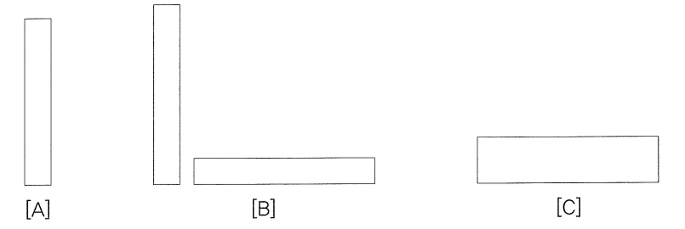
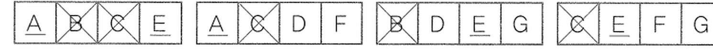
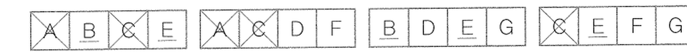
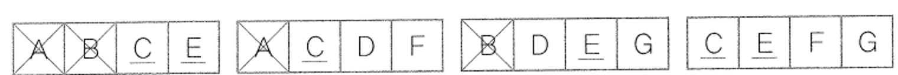
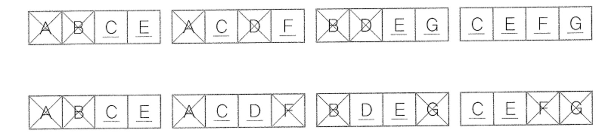
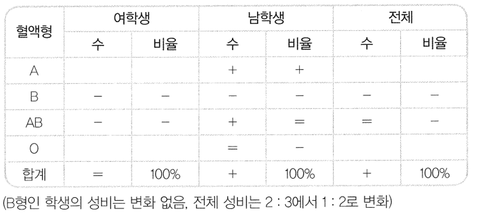
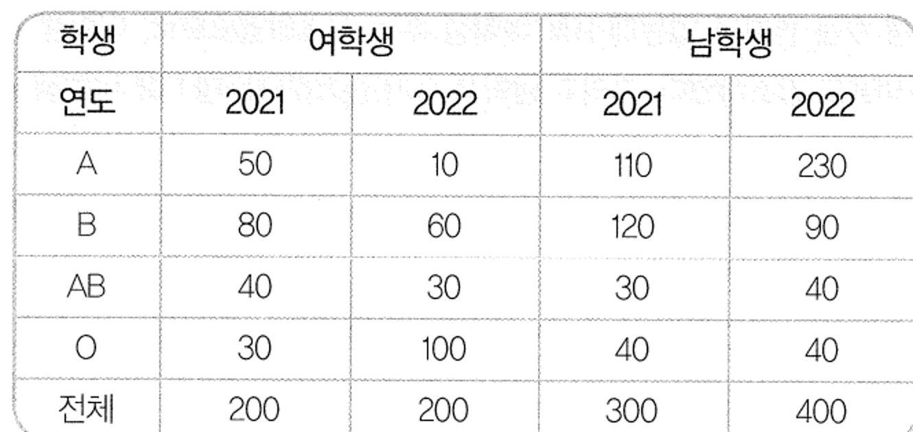

# 출제방향

## 1. 출제의 기본방향

추리논증 문항 출제의 기본 방향은 법학적성을 평가하는 데 중요한 기준인 추리와 비판 능력을 골고루 측정하는 완성도 있는 문항을 제시하는 것이다. 이 기본 방향은 다음 세 가지 요소를 체계적으로 고려하여 실현하고자 하였다.

첫째, 문항의 성격. 문항의 풀이 과정에서 제시문의 의미, 상황, 함의를 논리적으로 분석하고 핵심 정보를 체계적으로 취합하여 종합적으로 평가할 수 있어야 문항의 정답을 고를 수 있도록 하였다. 또한 제시문의 내용이나 영역에 관한 선지식이 문제 해결에 끼치는 영향을 최소화함으로써 정상적인 학업과 폭넓은 독서 생활을 통해 사고력을 함양한 사람이라면 충분히 해결할 수 있는 문항을 만들고자 하였다.

둘째, 제시문의 다양성. 제시의 측면에서 각 학문 분야 및 일상적ㆍ실천적 영역에 걸친 다양한 소재를 활용하였고, 영역 간 균형을 맞추어 전공에 따른 유ㆍ불리를 최소화하고자 하였다. 추리 능력을 측정하는 문항과 논증 분석 및 평가 능력을 측정하는 문항을 규범, 인문, 사회, 과학기술의 각 영역 모두에서 균형 있게 출제하였다. 특히, 고도의 생각을 요구하는 내용의 글을 가능한 한 일상적인 맥락으로 풀어서 쓰고자 노력하였다.

셋째, 난이도와 가독성. 지문에서 불필요한 내용을 배제하고 제시문을 명료하게 작성하도록 하였다. 전체 글자 수를 4만자 이하가 되도록 하여 수험생이 문제를 읽는 부담을 덜도록 하였다.

## 2. 출제 범위 및 문항 구성

규범, 인문, 사회, 과학기술과 같은 학문 영역별 문항 수는 예년과 큰 차이가 없이 균형 있게 출제되었다. 규범 영역의 문항은 공법, 사법, 윤리학 등 소재를 다양화하였고, 인문, 사회, 과학기술 영역의 문항들은 예술비평, 철학, 경제학, 사회학, 심리학, 물리학, 화학, 생물학 등의 다양한 영역에서 출제되었다.

## 3. 난이도

전체 문항에서 추리 문항과 논증 문항은 비슷한 분량으로 구성되었다.

이번 추리논증 영역의 난이도는 전년도와 비슷하도록 기획되었다. 어려운 개념이나 구조를 가진 제시문을 사용하더라도 제시문의 문맥이나 문제풀이 과정에서 그러한 개념이나 구조를 추론할 수 있도록 하였다. 또한 제시문의 글자 수를 줄여 수험생이 지문을 읽는 시간을 조금이나마 줄이고 좀 더 논리적 구조에 집중할 수 있도록 하였다. 문항 간 난이도에서 큰 차이가 없도록 노력하였다. 그 결과, 이번 추리논증 영역 문항의 난이도는 전체적으로 예년과 거의 같을 것으로 예상된다.

## 4. 출제 시 유의점

ㆍ 추리 문항과 논증 문항의 문항별 성격을 명료하게 하여, 문항별로 측정하고자 하는 능력을 정확히 평가할 수 있도록 하였다.  
ㆍ 선지식으로 문제를 풀거나, 전공에 따른 유ㆍ불리가 분명한 제시문의 선택이나 문항의 출제는 지양하였다.  
ㆍ 제시문을 분석하고 평가하는 데 충분한 시간을 사용할 수 있도록 제시문의 독해 부담을 줄여 주고자 하였다.  
ㆍ 제시문이 전달하고자 하는 내용을 효과적으로 전달할 수 있도록 전반적인 가독성을 높이고, 문두와 선지의 내용을 최대한 명료하게 만들었다.  
ㆍ 법학적성 능력을 평가하기 위하여 법학의 기본 원리를 응용한 내용을 소재로 하면서도, 문항에 나오는 개념, 진술, 논리구조, 함의 등을 이해하는 데 법학지식이 요구되지 않도록 하여 법학지식 평가를 배제하였다.  
ㆍ 출제의 의도를 감추거나 오해하게 하는 질문을 피하고, 문항 및 선택지 간의 간섭을 최소화함으로써, 문항의 의도에 충실한 변별이 이루어지도록 하였다.

---

# 문항별 해설

## 01

### 문항구분

* 문항 성격 : 문항유형 : 논증 평가 및 문제해결 / 내용영역 : 규범

* 평가 목표 : 이 문항은 불법행위의 본질과 불법행위법의 목표 등에 관한 두 견해를 이해하고 법원 의 판결이 이들 견해를 강화 또는 약화하는지 판단하는 능력을 평가하는 문항이다.

### 제시문 해설

* 정답 : (4)

불법행위 재판에서 법관이 오로지 소송당사자들의 이익조정에 초점을 맞출 것인가, 그렇지 않으 면 일견 사적으로 보이는 분쟁을 공동체 차원의 이익에 부합하는 방향으로 해결할 것인가 하는 문제에 관하여 두 견해가 대립한다. 견해 ^는 손해의 회복, 견해 8는 불법행위의 예방에 각각 중

접을 두고 있다. ^와 의 요지는 다음과 같다.

A : 불법행위법은 불법행위로 손상된 피해자의 이익을 이전 상태로 되돌리는 것을 우선시해야 하고, 다른 사회적 효용증진이나 유용성은 고려할 필요가 없다. 배상은 피해자의 관점에서 불법행위 이전 상태로 완전하게 회복될 수 있도록 하는 것이어야 한다.

B : 불법행위법이 사회를 구성하는 구성원에게 행위지침을 제시하여 불법행위를 예방할 수 있 도록 해야 한다. 이때 예방의 메시지는 공동체에 최고의 선을 가져올 수 있는 것으로서 가

해자를 넘어 사회 구성원 전체를 향해 발신되어야 한다.

### <보기> 해설

ㄱ. 불법행위로 물건이 파손된 경우에 파손 부분의 수리비보다 그 물건의 교환가치 가 낮은 경우가 있을 수 있다. 이 경우 파손된 물건을 불법행위 이전의 상태로 완전하게 회복시키는 것은 수리를 통하여야 가능할 것이므로, 설사 수리비가 교 환가치를 초과하더라도 가해자는 교환가치를 배상하는 데에 그치지 않고 수리 비까지를 배상하도록 하는 판결이 있었다면, 이는 피해자의 관점에서의 원상회 복을 강조하는 ^를 강화한다. ㄱ은 옳지 않은 평가이다.

ㄴ. 회사의 영업비밀 자료를 경쟁사에 넘겨 이득을 취하였지만 회사 입장에서는 그 자료의 가치가 극히 낮거나 거의 없어 회사에 현실적 손해가 발생하지 않는 경 우가 있을 수 있다. 이 경우에도 가해자가 취한 부당한 이득을 전부 피해자인 회사에 손해배상의 형식으로 지급하도록 하는 판결이 있었다면, 이는 원상회복 의 관점보다는 예방의 관점을 보여 준다. 즉 해당 행위가 법적으로 옳지 않은 행위라는 점을 가해자를 포함한 사회 구성원에게 선언하여 일종의 행위지침을 제시함으로써 동종의 불법행위를 예방하고자 하는 취지로 볼 수 있다. 이는 8를 강화하므로 ㄴ은 옳은 평가이다.

ㄷ. 피해자가 아닌 제3자에게 배상하라는 판결이 있었고 그 이유가 비하적인 표현 의 반복적인 사용을 용인하는 것이 사회의 자유로운 토론을 저해하기 때문이라

면, 이는 사회적 효용증진이나 유용성은 고려하지 않고 피해자의 원상회복을 강

조하는 견해인 ^를 약화한다. 반면에 이 판결은 6를 강화한다. 사회의 자유로운 토론을 저해함을 이유로 그러한 비하적 표현을 용인하지 않겠다는 메시지의 발 신은 공동체의 입장에서 요구되는 선(폼)이 무엇인가를 고려하면서 이러한 명예

훼손 행위를 금지한다는 행위지침을 제시하기 때문이다. ㄷ은 옳은 평가이다.

<보기>의 ㄴ, ㄷ만이 옳은 평가이므로 정답은 (4)이다

## 02

### 문항구분

* 문항 성격 : 문항유형 : 언어 추리 / 내용영역 : 규범

* 평가 목표 : 이 문항은 제시된 법률해석 방법으로 규정을 해석하여 주어진 문제를 해결하는 능력 을 평가하는 문항이다.

.

### 제시문 해설

* 정답 : (3)

법률 규정을 사건에 적용하기 위해 의미를 해석할 때에는 법률 규정의 문언이 가지는 '통상적 의 미'에 따라야 한다. '통상적 의미'와 관련하여 '일상적 의미'와 '전문적 의미'가 다른 경우에는 후자 를 따른다. 그러나 '통상적 의미'에 따라 법률 규정을 해석할 때 단일한 해석이 나오지 않을 수도 있다. 이때는 문제된 조항과 관련된 조항 또는 관련된 다른 법률과의 연관관계를 고려하여 해석 하여야 한다. 연관관계를 고려한 해석으로도 단일한 해석이 불가능하면 입법목적 또는 유사사례 와의 형평을 고려하여 해석한다. '통상적 의미'에 따라 단일한 해석이 나오면 그렇게 해석해야 히

고, 다른 법률과의 연관관계나 입법목적 또는 유사사례와의 형평을 고려한 해석은 하지 않는다.

### <보기> 해설

ㄱ. 법학계의 확립된 견해는 '전문적 의미로서 '일상적 의미'에 우선하므로, @를 수 당으로 받은 금전적 이익을 실제로 향유하고 있는 경우만을 의미하는 것으로 해석하여야 한다. 같은 이전에 지급받은 명예퇴직수당 전액과 이자 상당액을 반 환하였기 때문에, 명예퇴직수당으로 받은 금전적 이익을 실제로 향유하고 있지 않다. 만으로 @에 관한 단일한 해석이 나오며, 이에 따를 때 갑이 @에 해당

하지 않으므로 갑에게 명예퇴직수당이 지급된다. ㄱ은 옳은 적용이다.

ㄴ. @으로는 @의 의미에 관하여 양립할 수 없는 해석이 존재하고, 어느 해석을 취 하느냐에 따라 갑에게 명예퇴직수당이 지급되는지 여부가 달라진다. (1) 수당으 로 받은 금전적 이익을 실제로 향유하고 있는 경우만을 의미한다고 해석하면, 그과 같으므로 갑에게 명예퇴직수당이 지급된다. (2) 수당으로 받은 금전적 이익 을 실제로 누린 바 없어도 지급받은 사실이 있는 경우까지 의미한다고 해석하 면, 갑은 이미 한 차례 명예퇴직수당을 지금받은 적이 있으므로 [규정] 제2조 제 2항 단서에 따라 명예퇴직수당의 지급 대상이 아니다. 0으로는 복수의 해석가 능성이 있으므로 0©에 따른다. [규정]에서 관련 조항인 제1조를 보면 '정년퇴직 수당'을 정하고 있는데, 이 조항과의 연관관계를 고려하여도 복수의 해석가능성 은 여전히 남는다. 에 따르더라도 갑에게 명예퇴직수당이 지급되는지 여부가 불분명한 것이다. ㄴ은 옳지 않은 적용이다.

ㄷ. @과 0으로는 단일한 해석이 불가능한 경우이므로 6에 따라야 한다. 명예퇴직 수당의 실질적인 중복 수혜를 막는다는 입법목적을 고려하면, 이전에 지급받은 명예퇴직수당 전액과 이자 상당액을 반환한 갑에게 명예퇴직수당을 지급하여도 실질적으로 중복 수혜가 되지 않으므로, 갑은 @에 해당하지 않는다고 해석하여 야 할 것이다. 따라서 이 경우 에 따라 갑에게 명예퇴직수당이 지급된다. ㄷ은

옳은 적용이다.

<보기>의 ㄱ, ㄷ만이 옳은 적용이므로 정답은 (3)이다

## 03

### 문항구분

* 문항 성격 : 문항유형 : 언어 추리 / 내용영역 : 규범

* 평가 목표 : 이 문항은 거래의 당사자 일방이 어느 경우에 거래 상대방에게 정보를 제공해야 하는 지에 대한 기준을 올바르게 이해하여, 그 기준에 따라 주어진 사례를 판단할 수 있는

능력을 평가하는 문항이다.

### 제시문 해설

* 정답 : (2)

거래 당사자 일방이 가지는 정보를 상대방에게 고지해야 하는 경우를 판단하기 위한 기준을 정확 히 이해하여 <보기>에서 고지의무를 위반한 사안을 판단하여야 한다. 먼저 객관적 정보인지를 판 단해야 하고 그 정보가 비용을 들여 취득한 정보인지 우연히 취득한 정보인지를 판단해야 한다. 비용을 들여 취득한 정보라면 원칙상 고지할 필요가 없으나 예외적으로 고지해야 하는 경우가 발 생하고 우연히 취득한 정보는 원칙상 고지해야 하나 예외적으로 고지의무가 발생하지 않는 경우 가 있다.

### <보기> 해설

ㄱ. 원칙적으로 우연히 취득한 객관적 정보는 상대방에게 고지할 의무가 있으나 그

정보의 제공이 상대방이 거래 가격을 상승시킬 유인이 된다면 고지할 필요가

없다. 재건축으로 시장 가격이 상승될 것이라는 점은 시장 가격을 높이는 정보

이므로 객관적 정보에 해당하고, 감은 그 정보를 우연히 취 정보를 상대방에게 제공하면 그 정보 제공에 의해 상대방이 현재 시장 가격인 평당 1600만 원(8아파트의 도시 조망 세대 가격)보다 거래 가격을 싱승시킬 수

있다. 따라서 갑은 8아파트가 재건축되어 시장 가격이 상승될 것이라는 정보를

득하였다. 그러나 그

고지할 필요가 없다. ㄱ은 옳지 않은 판단이다.

ㄴ. '강 조망'이라는 정보는 세대별 시장 가격 차이를 가져오는 요인이므로 강 조망 이라는 사실은 객관적 정보에 해당한다. 그러나 옳은 강 조망임에도 불구하고 평당 2,000만 원이 아닌 1,600만 원에 매도하였다. 시장 가격보다 낮은 금액으 로 거래할 경우에는 객관적 정보이더라도 상대방에게 고지할 필요가 없다는 점 을 고려하면, 옳은 '강 조망'이라는 정보를 고지할 의무가 없다. ㄴ은 옳지 않은 판단이다.

ㄷ. 가격 히락 요인인 누수(하자)는 객관적이고 평균적인 매수인의 입장에서 보아 계약의 체결 여부 및 가격에 상당한 영향을 미치는 정보, 즉 객관적 정보에 해 당한다. 병은 누수를 확인하기 위해 비용을 지출하였지만, 누수를 확인하여 비

용지출 목적을 달성하였다. 이에 병은 숲 조망 세대를 시장 가격인 평당 1,800

만 원에 매도하는 경우에 누수에 대한 객관적 정보를 상대방에게 고지해야 한

다. ㄷ은 옳은 판단이다.

드 흠드그

<보기>의 ㄷ만이 옳은 판단이므로 정답은 (2)이다

## 04

### 문항구분

* 문항 성격 : 문항유형 : 언어 추리 / 내용영역 : 규범

* 평가 목표 : 이 문항은 용도지역과 용도지구에 있는 대지의 용적률과 건폐율에 관한 규정을 정확 히 이해하여 개별 사례에 적용하는 능력을 평가하는 문항이다.

### 제시문 해설

* 정답 : (3)

하나의 대지가 둘 이상의 용도지역등에 걸치는 경우에 전체 대지의 용적률과 건폐율을 어떻게 계산하는지를 이해해야 한다. 대지가 각 용도지역등에 걸치는 부분 중 가장 작은 부분의 규모가 400" 이하인 경우, 대지의 용도변경으로 각 용도지역등에 걸치는 부분 중 가장 작은 부분의 규 모가 400” 이하가 된 경우, 대지 위 건축물이 고도지구에 걸치는 경우, 대지 위 건축물이 고도

지구와 경관지구에 걸치는 경우, 용적률과 건폐율을 정확하게 도출할 수 있어야 한다.

### <보기> 해설

ㄱ. 1,000"의 대지가 상업지역 600와 주거지역 400"로 걸치는 경우에는 가 장 작은 부분의 규모가 400” 이하이므로, <계산식>에 따른 결과값을 적용한 다([규정] 제2조 제1호 첫 문장). <계산식>에 따른 가중평균 용적률은 [600"× 1,500% + 400m°x500%]+[1,000m"]=1,100%0|고 가중평균 건폐율은 [600m X90% + 400m°x70%]+[1,000m]=82%이다. ㄱ은 옳은 적용이다.

ㄴ. 1,000" 대지 위의 건축물이 고도지구와 경관지구에 걸치므로, 대지의 절반인 ㆍ:

5000*는 경관지구로, 나머지 절반인 500m는 고도지구로 보고 <계산식>에 따 른 결과값을 적용한다([규정] 제2조 제2호). <계산식>에 따른 가중평균 용적률 ㆍ 은 [500m*x 100% +500m*x200%]+[1,000m°]=150%0|고 가중평균 건폐율은 [500m°X50% +500m°x60%]+[1,000m]=55%0|다. ㄴ은 옳은 적용이다.

ㄷ. 1,000의 대지가 각 용도지역에 걸치는 부분 중 가장 작은 부분의 규모가 원 래는 400"보다 큰 450"였는데 관할관청의 용도변경으로 400" 이하가 된 경우이므로, <계산식>에 따른 용도변경 이후의 결과값이 용도변경 이전의 결과 값보다 크면 용도변경 이후의 결과값을 적용하고, 그렇지 않으면 용도변경 이전 의 결과값을 적용한다([규정] 제2조 제1호 둘째 문장). 용도변경 전에는 가장 작 은 부분의 규모가 400m"보다 큰 450m"이므로, 제2조 본문에 의하여 가장 넓 은 면적(650")이 속하는 용도지역인 주거지역에 관한 규정을 적용한다. 따라 서 용도변경 전의 용적률은 500%이고 건페율은 70%이다. 용도변경 후의 용적 률 및 건폐율은 ㄱ과 같으므로 각각 1,100%와 82%이다. 용도변경 이후의 결과 값이 용도변경 이전의 결과값보다 크므로, 대지의 용적률은 1,100%이고 건폐율

은 82%이다. ㄷ은 옳지 않은 적용이다.

<보기>의 ㄱ, ㄴ만이 옳은 적용이므로 정답은 (3)이다

## 05

### 문항구분

* 문항 성격 : 문항유형 : 논쟁 및 반론 / 내용영역 : 규범

* 평가 목표 : 이 문항은 계약 당사자의 자율은 어느 경우에 제한할 수 있는지에 관한 견해들을 이해하여 각 견해에 따른 결론을 정확히 판단하는 능력을 평가하는 문항이다.

### 제시문 해설

* 정답 : (3)

계약 당사자의 자율은 최대한 관철시키고 강화하여야 하므로, 원칙적으로는 국가 등이 제한할 수 없다. 어떤 경우에 예외적으로 자율을 제한할 수 있는지에 관하여 세 가지 견해가 있다. A는 자율의 행사가 오히려 자율 그 자체를 본질적으로 침해하는 정도에 이르러야만 자율의 제한이 정당화된다고 주장한다. B는 자율을 제한함으로써 당사자에게 발생하는 비용(-)의 절댓값이 당사자에게 발생하는 효용(+)의 절댓값보다 작은 경우에만 자율에 대한 제한이 정당화된다고 주장한다. C는 자율을 제한함으로써 사회 전체에 발생하는 비용(-)의 절댓값이 사회 전체에 발생하는 효용(+)의 절댓값보다 작은 경우에만 자율에 대한 제한이 정당화된다고 주장한다.

### 선택지별 해설

(1) A에 따르면, 당사자 일방이 의도했던 의사가 다르게 표시되어 상대방이 그 표시대로 믿은 경우에도 표시보다는 당사자 일방이 의도한 의사를 존중해야 하므로, 당사자 일방이 자신이 의도했던 의사가 ㉮임에도 실수로 ㉯로 표시하여 상대방이 ㉯로 인식한 경우에도 당사자 일방의 의사를 ㉮로 본다. (1)은 옳은 추론이다.

(2) B에 따르면, 자율에 대한 제한이 정당하다는 것은 자율을 제한함으로써 당사자에게 발생하는 비용(-)의 절댓값이 당사자에게 발생하는 효용(+)의 절댓값보다 작다는 것을 의미한다. 이때 비용(-)과 효용(+)의 합은 양(+)이다. 따라서 당사자의 자율을 정당하게 제한함으로써 발생하는 당사자의 비용(-)과 효용(+)의 합은 항상 양(+)이 된다. (2)는 옳은 추론이다.

(3) C에 따르면, 자율을 제한함으로써 당사자에게 발생하는 비용(-)의 절댓값이 당사자에게 발생하는 효용(+)의 절댓값보다 큰 경우에는 그 차액만큼 국가 등이 보상해 주어야만 자율을 제한할 수 있다. 이때 보상된 만큼 계약 당사자의 효용은 증가된 것으로 보기 때문에, 당사자에게 발생하는 비용(-)의 절댓값과 당사자에게 발생하는 효용(+)의 절댓값이 같아짐으로써 비용(-)과 효용(+)의 합은 0이 된다. 그러므로 C에 따라 당사자의 자율을 제한하는 경우에는 당사자의 비용(-)과 효용(+)의 합이 음(-)이 되는 경우가 없고, 반드시 양(+) 또는 0이다. (3)은 옳지 않은 추론이다.

(4) A는 자율을 제한함으로써 당사자에게 발생하는 효용에 초점을 맞추지 않고, 자율 그 자체에 가치가 있기 때문에 보호되어야 한다고 주장한다. 따라서 A에 따르는 경우에는, 당사자의 자율을 제한하여 발생하는 당사자의 비용(-)과 효용(+)의 합이 양(+)이 되더라도, 자율의 행사가 오히려 자율 그 자체를 본질적으로 침해하지만 않으면 당사자의 자율을 제한할 수 없다. C에 따르면, 당사자의 자율을 제한하여 발생하는 당사자의 비용(-)과 효용(+)의 합이 양(+)이 되는 경우에도 사회 전체에 발생하는 비용(-)과 효용(+)의 합이 음(-)이 된다면 당사자의 자율을 제한할 수 없다. (4)는 옳은 추론이다.

(5) B는 사회 전체의 효용보다는 당사자의 효용에 초점을 맞춘다. 반면에 C는 당사자의 효용보다는 사회 전체의 효용에 초점을 맞춘다. X국 규제기본법은 사회 전체의 효용에 초점을 맞추고 있다는 점에서 B보다는 C에 의해서 정당화된다. (5)는 옳은 추론이다.

## 06

### 문항구분

* 문항 성격 : 문항유형 : 논증 평가 및 문제해결 / 내용영역 : 규범

* 평가 목표 : 이 문항은 견해들의 논거를 이해하고 새로운 정보가 이들 견해를 강화 또는 약 지 판단하는 능력을 평가하는 문항이다.

### 제시문 해설

* 정답 : (3)

드론을 이용하여 무단으로 고층 아파트의 외부에서 주거 내부를 촬영한 행위를 처벌할 수 있는지

르미 응귀

에 관하여, <견해> 중 ^는 제1조를 적용하여 비밀탐지죄로 처벌할 수 있다고 주장하며, B는 제2조

를 적용하여 불법수색죄로 처벌할 수 있다고 주장한다. <견해> ^와 8의 논거는 다음과 같다.

A:

### <보기> 해설

ㄱ. 외부에서 창문을 통해 육안으로 들여다보는 것은 조망에 해당하고, 이는 ^가

첫째. '탐지의 개념이 '주거 내부의 정보를 알야내어 거주자가 누리는 사생활의 안전감을 침 해하는 것'이라는 점을 근거로 든다. 4는 드론을 이용한 주거 내부의 촬영이 거주자의 사생활 의 안전감을 침해했다고 보는 것이다. 둘째, 저조는 주거 내부를 '녹음 또는 청취 등의 방식' 으로 탐지한 행위를 처벌한다고 규정되어 있음을 근거로 든다. 여기의 '등은 다른 해석의 가 능성을 열어둔 것이므로 '녹화 또는 조망의 방식'과 같은 시각적 방식에 의한 탐지를 포함할 수 있다고 한다. 즉 ^는 드론을 이용한 촬영이라는 시각적 방식도 '녹음 또는 청취 등의 방식'

에 해당할 수 있다고 보는 것이다.

: ×국의 기존 해석본에 따르면, 불법수색죄는 '주거나 건조물에 적법하게 들어간 사람이 권한

없이 수색하는 경우로 제한되었다. 그러나 제2조에는 주거나 건조물에 들어간 경우에만 불법 수색죄가 성립한다고 명시적으로 규정되어 있지 않다. 이를 토대로 8는 '위법하게 주거나 건 조물에 들어가 권한 없이 수섹한 경우와 주거나 건조물에 들어가지 않고 '주거나 건조물 밖 에서 그 내부를 권한 없이 수색한 경우도 불법수색죄로 처벌할 수 있다고 주장한다. 그러므 로 드론을 이용한 촬영은 주거나 건조물 밖에서 그 내부를 수색한 경우로서 처벌할 수 있다

고 볼 것이다.

'탐자'에 포함된다고 주장하는 시각적 방식이다. 그런데 ×국 법원은 조망이 비 밀탐지죄의 '탐지'에 해당하지 않는다고 판결하였다. 촬영도 조망과 마찬가지로 시각적 방식이므로, ×국 법원은 촬영이 비밀탐지죄의 '탐지에 해당하지 않는다 고 볼 가능성이 크다. 따라서 이 판결은 '탐지'가 음향적 또는 청각적 방식 외에 시각적 방식을 포함한다고 주장하는 ^를 약화한다. ㄱ은 옳은 평가이다.

ㄴ. [규정] 재조(비밀탐지죄)와 제2조(불법수색죄)는 형량이 각각 5년 이하와 3년 이하이다. 타인의 주거에 위법하게 들어가 정보를 획득 어가 정보를 획득하는 행위보다 더 위법하다는 것이 두 범죄의 형량에 치등을

둔 취지라면, 비밀탐지는 타인의 주거에 위법하게 들어가 정보를 획득하는 행위

는 행위가 적법하게 들

이고 불법수색은 타인의 주거에 적법하게 들어가 정보를 획득하는 행위라고 본 것이다. 즉 [규정] 제1조와 제2조는 모두 '주거에 들어간 경우를 예상하고 만들 어진 조문으로서 적법한가 혹은 위법한가라는 점에만 차이가 있다고 본 것이다. 그러므로 제1조와 제2조의 형량을 다르게 정한 입법 취지에 의하여, 주거나 건 조물에 적법하게 들어간 경우에만 제2조의 불법수색죄가 성립한다는 기존 해석 은 강화된다. 그런데 는 기존 해석론에 반대하면서, 불법수색죄의 문언이 명시 적으로 주거나 건조물에 들어간 경우만으로 제한하고 있지 않다는 접을 근거로, 주거나 건조물 밖에서 그 내부를 권한 없이 수색한 사람도 불법수색죄로 처벌 할 수 있다고 주장한다. 따라서 8는 강화되지 않는다. ㄴ은 옳지 않은 평가이다.

ㄷ. ×국 법원은 경찰이 드론으로 영장 없이 주거를 외부에서 찰영한 행위가 사생활

의 안전감을 침해하지는 않았으나 위법한 '수색'에는 해당한다고 보았다. 우선

GBM 드 ><국 법원은 이러한 행위가 사생활의 안전감을 침해하지 않는다고 판단하였으므 로, '탐지는 사생활의 안전감을 침해하는 것이라고 설명하면서 드론을 이용하 여 주거 내부를 외부에서 무단으로 촬영한 행위가 비밀탐지죄에 해당한다고 주 장하는 4는 악화된다. 다음으로, 경찰이 드론을 이용하여 주거 내부를 촬영한 행위를 위법한 '수색'이라고 본 것은 경찰의 행위를 '수색'으로 파악하면서 그 수색이 위범하다고 본 것이므로 드론을 이용하여 주거 내부를 외부에서 무단으 로 촬영한 행위가 불법수색죄에 해당한다고 주장하는 B는 깅화된다. ㄷ은 옳은

평가이다.

<보기>의 ㄱ, ㄷ만이 옳은 평가이므로 정답은 (3)이다

## 07

### 문항구분

* 문항 성격 : 문항유형 : 언어 추리 / 내용영역 : 규범

* 평가 목표 : 이 문항은 도로 노선의 지정과 폐지, 토지점용료, 무단점용과 초과점용의 경우에 부

과되는 변상금 등 도로의 관리에 관한 규정을 정확하게 이해하여 구체적인 사례에 적

용하는 능력을 평가하는 문항이다.

### 제시문 해설

* 정답 : (5)

도로관리청은 도로 노선 지정의 고시가 있으면 해당 도로구역을 지정하여야 하고, 도로 노선 폐 지의 고시가 있으면 해당 도로구역을 폐지하여야 한다. 도로구역 지정과 도로구역 폐지의 효력 은 고시함으로써 발생한다. 도로(도로구역 포힘)로 지정된 토지를 점용하려는 지는 제2조 제2항 에 따라 도로관리청의 허가를 받고 매월 토지점용료를 납부하여야 한다. 도로관리청은 도로점용 허가 없이 도로를 무단으로 점용한(무단점용) 자에게서 그 토지에 부과되어야 하는 토지점용료의 150%에 해당하는 금액을 변상금으로 징수한다. 고의 또는 과실로 인해 허가의 내용을 초과하여 점용하는(초과점용) 자에게서는 초과점용한 토지에 부과되어야 하는 토지점용료의 120%에 해당

하는 금액을 변상금으로 징수하고, 초과점용이 점용자의 고의 또는 과실로 인한 것이 아니면 토

지점용료에 해당하는 금액만 징수한다. 허가를 받고 허가된 범위 내에서 점용하는 토지와 고의: 과실 없이 초과점용하는 토지에 대하여는 토지점용료에 해당히는 금액을 납부하고, 무단점용하 는 토지에 대하여는 토지점용료의 15배에 해당하는 금액을 납부하며, 고의 또는 과실로 초과점

용하는 토지에 대하여는 토지점용료의 1.2배에 해당하는 금액을 납부하는 것이다.

### <보기> 해설

ㄱ. 도로의 초과점용에 대하여 6,000만 원의 변상금 부과처분을 하였으므로, 초과 점용한 토지에 부과되어야 하는 토지점용료의 1.2배에 해당하는 금액0| 6,000 만 원이다. 초과점용에 고의나 과실이 없었음이 밝혀졌으므로, 도로관리청은 토 지점용료에 해당하는 금액만 부과할 것이다. 그 금액을 계산하면 6,000만 원+

1.2=5,000만 원이다. 따라서 도로관리청이 초과점용을 이유로 부과할 토지점 용료 상당액은 5,000만 원이다. ㄱ은 옳은 적용이다.

ㄴ. 도로관리청의 도로점용허가 없이 농지를 조성하였는데도 변상금 부과처분 대상 이 아닌 것으로 확정되었으므로, 그 토지가 도로관리청의 도로점용허가의 대상이 아니라는 것을 알 수 있다. 구도로 노선의 도로구역으로 지정되었던 토지가 현재 도로관리청의 도로점용허가의 대상이 아닌 것은 이 토지에 대하여 도로구역 폐 지가 있었기 때문일 것이다. 도로구역 폐지의 효력은 고시함으로써 발생하므로, 구도로 노선의 도로구역 폐지의 고시가 있었을 것이다. ㄴ은 옳은 적용이다.

ㄷ. 도로인 ×국유지를 도로점용허가 없이 점용한 것은 무단점용이고 점용기간은 1 개월이므로, 월 토지점용료 1,200만 원의 1.5배인 1,800만 원이 변상금으로 부과 될 것이다. 도로인 ×국유지에 대하여 도로점용허가를 받은 후 인근의 도로구역 을 초과점용하였는데 고의로 한 것이고 점용기간이 1개월이므로, 월 토지점용료

1.500만 원의 1.2배인 1,800만 원이 변상금으로 부과될 것이다. 두 경우에 부과

처분될 변상금액은 1,800만 원으로 같다. ㄷ은 옳은 적용이다.

<보기>의 ㄱ, ㄴ, ㄷ 모두 옳은 적용이므로 정답은 (5)이다

## 08

### 문항구분

* 문항 성격 : 문항유형 : 언어 추리 / 내용영역 : 규범

* 평가 목표 : 이 문항은 두 종류의 규칙을 정확하게 이해하여 구체적인 사례에 적용하는 능력을 평 가하는 문항이다.

### 제시문 해설

* 정답 : (3)

우선 [선발 규치]의 세 가지 안 중 하나를 적용하여 1,600명의 신입사원을 선발하고, [조정 규칙] 을 적용하여 추가로 신입사원을 선발한다. [선발 규칙]에 따른 우선 선발자 중 비공대 출신이 몇 명인지 또는 경력자가 몇 명인지에 따라 [조정 규칙]에 따른 추가 선발자의 수가 달라질 수 있다.

추가 선발에서는 비공대 출신 또는 경력자만 선발한다.

### <보기> 해설

ㄱ. [선발 규칙] 1안에 따라 1.600명을 선발하면, 공대 출신 1,200명과 비공대 출신 400명이 선발된다. 이 결과를 [조정 규칙] 1안에 따라 조정하면, 비공대 출신 선 발자 400명의 4분의 1에 해당하는 100명의 비공대 출신을 추가로 선발하면서 이들 중 경력자와 비경력자가 같은 수가 되도록 하므로, 경력자 50명과 비경력 자 50명이 선발된다. 따라서 최종 선발자 1,700명 가운데 비경력자가 최소 50 명이므로, 경력자의 수는 1,650명을 넘을 수 없다. ㄱ은 옳은 적용이다.

ㄴ. [선발 규칙] 2안에 따라 공대 출신과 비공대 출신을 3 : 2로 선발하고 [조정 규 칙] 2안에 따라 공대 출신과 비공대 출신이 같은 수가 되도록 추가 선발하면, 우 선 선발된 신입사원은 공대 출신의 수가 비공대 출신의 수의 1.5배이고 추가 선 발된 신입사원은 공대 출신의 수가 비공대 출신의 수의 1배이므로, 최종 선발자 중 공대 출신의 수는 비공대 출신의 수의 1.5배보다 작다. ㄴ은 을지 않은 적용 이다.

ㄷ. [조정 규칙] 1안은 비공대 출신(비공대 출신 경력자와 비공대 출신 비경력자)을 추가로 선발하는 것이고, [조정 규칙] 2안은 경력자(공대 출신 경력자와 비공대 출신 경력지)를 추가적으로 선발하는 것이다. 그러므로 [조정 규칙] 1안을 적용 하든 2안을 적용히든 공대 출신 비경력자의 수는 [선발 규칙]에 따라 우선 선발 된 수에서 증가하지 않는다. 따라서 [조정 규칙] 1안과 2안의 적용 여부나 순서 에 관계없이 공대 출신 비경력자의 수는 [선발 규칙] 3안에 따라 우선 선발된 수에서 증가하지 않으므로, [조정 규칙] 1안을 먼저 적용하든 [조정 규칙] 2안을

먼저 적용하든 최종 선발된 공대 출신 비경력자의 수는 같다. ㄷ은 옳은 적용

이다.

<보기>의 ㄱ, ㄷ만이 옳은 적용이므로 정답은 (3)이다

## 09

### 문항구분

* 문항 성격 : 문항유형 : 언어 추리 / 내용영역 : 규범

* 평가 목표 : 이 문항은 기존 약관과 개정 약관을 비교ㆍ분석하여 구체적인 차이를 찾아내고 제시된 방안이 불공정성을 완화하는 방안인지 판단하는 능력을 평가하는 문항이다.

### 제시문 해설

* 정답 : (4)

P사는 포인트 적립과 관련한 <약관>의 일부 조항을 개정하여 즉시 시행한다고 공지하였다. 그런데 개정된 조항의 주행거리당 적립되는 포인트를 변경함에 따라 불공정의 문제가 발생하게 되었다. A 플랜의 경우 기준거리인 1,000km를 초과하여 주행하는 것을 전제로 개정 전 km당 1.5포인트가 적립되던 것을 개정 후 km당 2.0포인트가 적립되도록 변경하였기 때문에 유리한 변경으로 평가된다. 반면에 B 플랜의 경우 주행거리와 무관하게 개정 전 km당 1.0포인트가 적립되던 것을 개정 후 0.5포인트가 적립되는 것으로 변경하였기 때문에 불리한 변경으로 평가된다. 이에 B 플랜 계약자는 개정 조항이 불공정하다고 주장할 수 있다.

### <보기> 해설

ㄱ. B 플랜의 경우 <약관> 개정 전 km당 1.0포인트 적립되었는데 개정 후에는 km당 0.5포인트 적립되므로, B 플랜 계약자가 개정 전과 동일한 포인트를 적립하기 위해서는 개정 후 100% 더 많은 거리를 주행하여야 한다. 그러나 A 플랜 계약자는 기준거리인 1,000km를 초과한 경우에만 포인트가 적립된다. 예컨대 개정 전에 1,200km를 주행하였다면 km당 1.5포인트를 적립하여 총 1,800포인트를 적립할 수 있었으나, 개정 후에 25% 적은 거리인 900km를 주행하면 포인트를 전혀 적립하지 못한다. 따라서 <약관> 개정 후 A 플랜 계약자는 <약관> 개정 전과 동일한 포인트를 적립하기 위하여 25% 더 적은 거리를 주행하여도 충분하다는 것은 틀린 진술이다. ㄱ은 옳지 않은 추론이다.

ㄴ. 기존 가입자 중 일부가 개정된 조항이 [규정]에 위반되는 불공정약관조항이라 주장할 수 있으며, 실제로 B 플랜 계약자의 경우 개정 전보다 불리하게 개정되었음을 확인할 수 있다. 위원회가 시정조치를 권고한다면 이러한 불공정성을 인정하였기 때문이다. 그런데 기존 가입자에게 개정된 <약관>을 잔여 계약기간에 적용할지를 선택할 수 있도록 한다면, B 플랜으로 계약한 기존 가입자들은 개정된 <약관>을 적용하지 않는 것을 선택함으로써 잔여 계약기간에 대하여 불공정성을 제거할 수 있을 것이다. ㄴ은 옳은 추론이다.

ㄷ. 개정 전 <약관>에 따라 B 플랜을 선택한 경우 km당 1.0포인트 적립된다. 위원회의 권고에 따른 시정조치에 의하면 개정 후 <약관>의 B 플랜을 선택하는 계약자는 주행거리 1,000km까지 km당 0.5포인트 적립되고 1,000km를 초과한 부분에 대해서는 km당 1.5포인트 적립되므로, 2,000km를 운행하면 총 2,000포인트 적립으로 km당 1.0포인트 적립과 같게 된다. 따라서 개정 후 <약관>의 B 플랜을 선택하는 계약자가 개정 전 <약관>에 따라 B 플랜을 선택한 경우보다 더 많은 포인트를 적립하려면 2,000km를 초과하여 운행하여야 한다. ㄷ은 옳은 추론이다.

<보기>의 ㄴ, ㄷ만이 옳은 추론이므로 정답은 (4)이다.

## 10

### 문항구분

* 문항 성격 : 문항유형 : 언어 추리 / 내용영역 : 규범

* 평가 목표 : 이 문항은 국제적인 등록 상표권 침해 사건에서 침해지를 어디로 볼 것인가에 관한 이론에 따라 구체적인 경우에 나타나는 차이를 판별하는 능력을 평가하는 문항이다.

### 제시문 해설

* 정답 : (4)

<이론>의 A에 따르든 B에 따르든, 어떤 국가에 등록된 상표를 다른 나라에서 무단 복제하여 상품을 생산하거나 판매하는 경우에도 상표권 침해는 인정된다. 그러나 A는 그러한 경우에 상표권 침해가 상표가 등록되어 있는 나라에서 발생한 것으로 보고, B는 무단 복제한 상표가 부착된 상품을 실제로 생산하거나 판매한 나라에서 상표권 침해가 발생한 것으로 본다는 차이가 있다. 이 문항은 이러한 견해 대립을 기초로 [규정]을 <사례>에 적용해 볼 것을 요구한다. [규정]은 X국에서 상표권이 침해되고 이로 인하여 X국에서 상표권자에게 손해가 발생한 경우에 그 손해에 대하여만 X국 법원이 재판권을 행사할 수 있다고 한다. 그러므로 <이론>의 A와 B에 따라 <보기>의 각 경우에 상표권 침해의 장소와 손해 발생의 장소가 어떻게 파악되는지를 정확히 판단하는 것이 핵심이다.

### <보기> 해설

ㄱ. A에 따르면 을이 X국에서 생산한 Q상품을 W국, X국, Y국에서 판매했어도 상표권 침해는 모두 상표 등록지인 W국에서 발생한 것으로 보기 때문에, X국에서 발생한 상표권 침해는 없는 것으로 본다. 제○조의 “X국에서 상표권이 침해되는 경우”에 해당하지 않으므로 X국 법원은 재판권을 행사할 수 없다. ㄱ은 옳지 않은 적용이다.

ㄴ. B에 따르면 을이 X국에서 Q상품을 생산하고 또 판매하였으므로 X국에서 상표권 침해가 발생한 것으로 본다. 따라서 갑이 X국에서 입은 손해에 한하여 X국 법원이 재판권을 행사할 수 있다. ㄴ은 옳은 적용이다.

ㄷ. A에 따르면 을이 X국에서 생산한 Q상품을 W국, X국, Y국에서 판매했어도 상표권 침해는 모두 상표 등록지인 W국에서 발생한 것으로 보기 때문에, X국 법원은 재판권을 행사할 수 없다(ㄱ에 대한 해설 참조). B에 따르면 을이 Q상품을 Y국에서 판매하였을지라도 X국에서 생산한 것이기 때문에 X국에서 상표권 침해가 발생한 것으로 본다. 따라서 제○조 본문에 따르면 X국 법원은 재판권을 행사할 수 있다. 그러나 제○조 단서에 따라 재판권의 범위는 X국에서 상표권자가 입은 손해액을 한도로 하므로, 을이 Q상품을 Y국에서 판매하여 갑이 입은 손해에 대하여는 X국 법원이 재판권을 행사할 수 없다. ㄷ은 옳은 적용이다.

<보기>의 ㄴ, ㄷ만이 옳은 적용이므로 정답은 (4)이다.

## 11

### 문항구분

* 문항 성격 : 문항유형 : 언어 추리 / 내용영역 : 규범

* 평가 목표 : 이 문항은 특정 법률관계에 관한 분쟁에 대하여 어느 법역의 법원이 재판관할을 가지 고 재판권을 행사하는가를 결정하기 위한 기준과, 당사자들이 특정한 법역의 법원으 로 전속관할합의를 한 경우 그 유효성을 판단하기 위한 기준을 구체적인 사례에 적용 하는 능력을 평가하는 문항이다.

### 제시문 해설

* 정답 : (3)

[규정]의 제1조는 하나의 분쟁에 관한 소송은 복수의 법역의 법원에 중복하여 제기될 수 없다는 원칙을 제시하고 있고, 제2조는 특정한 법역의 법원으로의 당사자들의 유효한 전속관할합의가

있으면 기타 법역의 범원은 소송절치를 개시할 수 없다는 원칙을 제시하고 있으며, 제3조는 전속

: 관할합의가 유효하기 위한 요건으로 당사자들이 합의한 법역과 해당 법률관계 사이에 관련성이 있을 것을 제시하고 있다(해당 법역에 당사자의 영업소 소재지나 의무 이행지가 있어야 함). 제4 조는 제3조의 시행일자를 규정하고 그 시행 당시 진행 중인 소송에는 저3조의 유효요건이 적용 되지 않는다는 조건을 제시하고 있다. <사례>에서 갑과 을의 영업소는 ×주에만 있고 갑과 을의 의 무 이행지는 갑의 영업소이므로, 영업소 소재지와 의무 이행지가 모두 ×주에만 있다. 따라서 주 법원은 갑과 을 간의 법률관계와 아무런 관련이 없는데, 두 시람이 소송은 주 법원에만 제기하 기로 합의하였다. 전속관할합의의 유효 여부를 판단할 때 매매계약일인 2022. 10. 1은 아무런 의

미가 없다.

### <보기> 해설

ㄱ. 2022. 12. 1은 제3조 시행 전이므로 \주 법원이 갑과 을 간의 법률관계와 아무

런 관련이 없더라도 주 법원으로의 전속관할합의의 유효성은 인정된다. 그러

므로 제2조 제2문에 따라 ×주 법원은 소송절치를 개시할 수 없다. ㄱ은 옳은 적 용이다.

ㄴ. 제3조 시행 전인 2022. 12. 1.에 주 법원에 소송이 제기되었으므로 주 법원은 소송절차를 개시하였다. 제3조 시행 전에 이미 소송절차가 개시되었으므로 제 4조 제2문에 따라 제3조가 적용되지 않고 주 법원으로의 전속관할합의의 유 효성은 여전히 인정된다. 그러므로 제3조 시행 이후인 2023. 1. 1.에 ×주 법원에

소송이 제기되더라도 ×주 법원은 소송절차를 개시할 수 없다. ㄴ은 옳은 적용

이다.

ㄷ. 제3조 시행 이후인 2023. 2. 1.에 주 법원에 소송이 제기되었으므로 Y주 법원 으로의 전속관할합의는 처음부터 무효인 것으로 본다. 그러므로 제3조 제4문에 따라 주 법원은 소송절치를 개시할 수 없고, \주 법원에 처음부터 소송이 제기 되지 않은 것으로 본다. 따라서 ×주 법원은 제1조 제2문의 “같은 분쟁에 관하여

나중에 소송이 제기된 주 법원"에 해당하지 않고, 갑과 을 간의 법률관계와 관

련이 있으므로, 소송절차를 개시할 수 있다. ㄷ은 옳지 않은 적용이다.

<보기>의 ㄱ, ㄴ만이 옳은 적용이므로 정답은 (3)이다

## 12

### 문항구분

* 문항 성격 : 문항유형 : 언어 추리 / 내용영역 : 규범

* 평가 목표 : 이 문항은 특정한 집안에서 이름을 지을 때 실제로 적용하였던 돌림자 사용 규칙을 변형하여 제시하고 이를 구체적인 사례에 적용하는 능력을 평가하는 문항이다.

### 제시문 해설

* 정답 : (2)

돌림자로는 오행 중 하나를 부수로 하는 한지를 사용하고, 오행은 목 - 화 ㅡ 토 -금 ㅡ수의 순서대로 반복하여 사용한다[규칙]의 1). 두 글자 이름의 경우 돌림지를 사용하되 형제간에는 같 은 돌림변을 사용하고 사촌간에는 다른 돌림변을 사용한다(규칙]의 2,. 한 글자 이름의 경우 돌 림변을 사용하되 해당 세대에서 두 글자 이름을 지었다면 시용하였을 돌림자의 부수는 바로 다음 세대에서 사용한다[규칙]의 3). 돌림자와 달리, 돌림변은 오행 중 하나일 필요가 없고, 오행 중 하나를 사용하는 경우에도 위 순서를 지킬 필요가 없다. 이들 규칙을 일끈(-0의 아들과 손자의

사례에 적용하는 문제이다. <보> 해설 ㄱ. 돌림변은 오행 중 하니를 사용할 필요가 없으므로, 형제간으로서 같은 항렬에 있는 을과 병은 '1 '을 돌림변으로 사용하여 한 글자 이름을 지을 수 있다. ㄱ은 옳지 않은 적용이다.

ㄴ. 을과 병이 한 글자 이름이면, 다음 세대인 정과 무가 '금(술)'을 부수로 히는 돌 림자인 '종(/)'을 사용하여 두 글자 이름을 지을 수 있다. 이 경우 정과 무는 형 제간이므로 돌림자 외의 글자에는 같은 돌림변을 사용하여야 하는데, '인(1-)'과 '근(B)'은 돌림변이 다르다. ㄴ은 옳은 적용이다.

ㄷ. 돌림변은 오행의 순서를 지킬 필요가 없으므로, 사촌간으로서 같은 항렬에 있는 정과 무는 '목()'을 돌림변으로 사용하여 한 글자 이름을 지을 수 있다. ㄷ은

옳지 않은 적용이다.

[Celi

<보기>의 ㄴ만이 옳은 적용이므로 정답은 (2)이다.

## 13

### 문항구분

* 문항 성격 : 문항유형 : 논쟁 및 반론 / 내용영역 : 규범

* 평가 목표 : 이 문항은 전쟁에서 살인의 도덕적 책임을 평가하는 도덕적 원리를 구성하는 데 요구 되는 이론에 관한 다른 두 입장으로부터 옳게 추론할 수 있는 능력을 평가하는 문 이다.

### 제시문 해설

* 정답 : (1)

견해 ^는 환원주의로 전쟁에서 살인에 대한 도덕적 책임을 적절하게 평가할 수 있는 어떤 원리가 있다면, 이 원리는 일상생활에서의 살인에 대한 도덕적 책임 또한 적절하게 평가할 수 있어야 함 을 주장한다. 견해 B는 비환원주의에 대한 설명으로 전쟁에서 살인을 정당화하는 도덕적 원리는

일상생활에서 적용되는 도덕적 원리와 구분된다는 것이다. 이는 전쟁에서 발생하는 폭력 또는 살

[i [

인에 관한 특성들이 일상생활의 폭력으로 환원되지 못한다는 견해에서 비롯된 입장이다.

<보73 해설 ㄱ. ?에 의해 을에게 도덕적 책임이 있지만 정에게 도덕적 책임이 없다는 결론이 도출된다면, 도덕적 책임을 평가하는 원리 를 (상황 1의 을과 (상황 2)의 정에 게 똑같이 적용한 것이므로, 살인에 대한 도덕적 책임을 평가하는 데 원리 α를 두 상황에 똑같이 적용할 수 있어야 한다는 ^름 약화하지 않는다. ㄱ은 옳지 않

은 분석이다

ㄴ. 4는 살인에 대한 도덕적 책임을 평가하는 데 원리 α를 두 상황에 똑같이 적용 할 수 있어야 한다는 주장이다. ?에 따르면, (상황 2/에서 병의 지시에 따라 정이 적의 저격수를 사살한 것이 자기방어가 아니라면 이에 대해 도덕적 책임이 있 다. 따라서 『에 의해 정의 살인 행위가 도덕적 책임이 있다고 주장하기 위해서 는 정의 행위가 자기방어에 해당하지 잃는 것임을 입증해야 힌다. ㄴ은 옳은 분 석이다.

ㄷ. 8는 전쟁에서의 폭력과 일상생활에서의 폭력은 분명히 다르므로, 전쟁에서는 일상생활에서 적용되는 도덕적 원리와 구분되는 특별한 도덕적 원리가 필요하 다고 말한다. 이는 (상황 1)의 을과 (상황 2)의 정에게 다른 도덕적 원리를 적용 해야 함을 의미한다. 만약 다른 도덕적 원리를 적용한다면 을과 정의 도덕적 책 임의 유무는 각 상황에 적용되는 도덕적 원리가 무엇인지에 의해 결정된다. 따 라서 견해 8에 따르면 각 상황에 적용되는 도덕적 원리가 무엇인지에 따라 을 과 점 모두에게 도덕적 책임이 있다는 결론이 도출될 수도 있다. ㄷ은 옳지 않

은 분석이다.

<보기>의 ㄴ만이 옳은 분석이므로 정답은 (1)이다.

## 14

### 문항구분

* 문항 성격 : 문항유형 : 논증 평가 및 문제해결 / 내용영역 : 인문

* 평가 목표 : 이 문항은 탈진실 현상과 관련한 책임의 귀속 문제에서 책임 귀속의 예외가 존재한다

지하느 노즈은 저정8|게 보서히고 펴기흐 느래으 츠저하느 무 는 주장을 뒷받침하는 논증을 적절하게 분석하고 평가할 수 있는 능력을 측정하는 문

(= 항이다.

### 제시문 해설

* 정답 : (1)

을 주장하기 위해 ^가 제시하는 논증은 다음과 같다. [전제 1] 행위자에게 책임이 귀속된다면, 그 행위는 그 자체로 비난의 대상이다. ("어떤 행위가 그 자체로 비난의 대상이 되는 오직 그 경우에만 그 행위자에게 책임이 귀속된다…")

[전제 2] 갑의 사례는 단순한 인지적 착각에 불과하다.

[전제 3] 단순한 인지적 착각에 불과한 행위는 그 자체로는 비난의 대상이 아니다.

[결론 1] 따라서 갑의 사례는 행위자에게 책임이 귀속되는 사례가 아니다.

[전제 4] 갑의 사례는 정보의 진위를 확인할 수 있음에도 확인하지 않고 진실인 것처럼 주장하는 행위이다.

[결론 기 따라서 정보의 진위를 확인할 수 있음에도 확인하지 않고 진실인 것처럼 주장히는 모든

경우에서 화자에게 책임이 귀속되는 것은 아니다.

### 선택지별 해설

정답 해설 1 의 앞부분을 대우로 변형하면, 인지적 착각인 행위는 모두 그 자체로 비난의 대상이 되는 행위라는 것이다. 이는 [전제 히을 거짓으로 만들기 때문에 ^의 논 증을 약화한다. 따라서 @은 옳은 평가이다.

오답 해설 @ 의 주장은 정보의 진위를 확인할 수 있음에도 확인하지 않고 거짓 주장을 하 는 경우 모두에서 화자에게 책임이 귀속되는 것은 아니라는 것이다. 그리고 가 짜 뉴스를 신봉하여 전파하는 것이 그러한 '경우'의 하나임은 제시문의 끝부분을 통해 확인할 수 있다. 가짜 뉴스를 신봉하여 전파하는 '경우' 언제나 책임이 귀속 되는 것이 아니라면, 이것은 오히려 과 부합하므로 을 강화한다. 따라서 © 는 옳지 않은 평가이다.

@ 제시문에서 ^가 예로 드는 갑의 예가 바로, “그 자체로 비난의 대상이 아닌 행위 의 행위자에게 책임이 귀속되지 않는 경우"이다. 이처럼 @은 ^가 자신의 주장 의 예시로 드는 예인 갑의 예와 부합하므로 을 강화한다. 따라서 @은 옳지 않 은 평가이다.

@ 정상적인 관찰 조건임에도 불구하고, 즉 진실을 확인할 수 있음에도 불구하고, 거짓 주장이 언제나 단순한 인지적 착각이 아닌 적극적인 회피 태도에서 비롯한 다면, 화자에게 책임이 귀속되는 범위가 정상적인 관찰 조건의 모든 경우를 포 괄하게 된다. 즉 화자에게 책임이 귀속되지 않는 경우가 있다는 주장인 0을 약 화하게 된다. 따라서 @는 옳지 않은 평가이다.

© 제시문의 ^의 논증은 진실 여부를 확인하는 것이 가능한 상황에 국한하여 논의 를 제시한다. 확인이 가능함에도 “허용 가능한 수준의 태만이나 인지적 실수"를 하는 경우와, “의도적으로 정보의 습득을 회피하거나 거부하는 적극적인 회피 태도"를 대비시켜 후자의 경우에만 책임이 귀속된다는 것이 의 주장이다. 그

러므로 진실 여부를 확인하는 것이 불가능한 상황에서 ^가 어떤 입징을 취힐지

는 알 수 없다. 설령 그러한 상황을 ^의 논증에 포함시킨다 하더라도, 그러한 상 ， 황에서 인지적 착각에 불과한 행위가 일어날 수 없다는 것은 ^가 주장하는 책 임 귀속 면제의 범위를 축소시키는 결과를 낳는다. 따라서 6는 옳지 않은 평가 :

## 15

### 문항구분

* 문항 성격 : 문항유형 : 논증 평가 및 문제해결 / 내용영역 : 인문

* 평가 목표 : 이 문항은 가능한 세계의 상대적 좋음에 대한 각각의 주장을 이해하고, 주어진 정보가 각 주장을 부정하는지 그렇지 않은지를 판단하는 능력을 평가하는 문항이다.

### 제시문 해설

* 정답 : (5)

A, B, C 세계는 다음과 같이 그림으로 표현할 수 있다. 그림에서 사각형의 가로 넓이는 사람의 인구 수를 나타내며, 높이는 복지 수준을 나타낸다.

### <보기> 해설

ㄱ. A와 C는 완전히 평등한 세계이지만 B는 불평등이 있는 세계이다. 갑의 결론은 B(불평등한 세계)가 A(평등한 세계)보다 좋다는 것이고, 을의 결론은 C(평등한 세계)가 B(불평등한 세계)보다 좋다는 것이다. 따라서 불평등이 더 적은 세계가 더 좋은 세계라면, 갑의 결론은 부정되고 을의 결론은 부정되지 않는다. ㄱ은 옳은 평가이다.

ㄴ. 을이 C가 B보다 좋다고 주장하는 이유는 (1) 완전한 평등이 있으며, (2) 복지 평균이 높다는 것이다. 병의 결론은 A가 C보다 좋다는 것이다. 을의 이유 (1), (2)를 A와 C에 적용해 보면, A와 C는 완전한 평등이라는 점에서 동일하지만 A의 복지 평균이 C의 복지 평균보다 더 높으므로, A가 C보다 좋다는 결론이 도출된다. 따라서 을이 (1)과 (2)를 적용한다면, 을은 병의 결론에 동의할 것이다. 한편 갑의 결론은 B가 A보다 좋다는 것이다. (1)과 (2)를 적용해 보면 A는 완전한 평등이 있지만 B는 불평등이 있으며 복지 평균도 A가 B보다 높으므로, A가 B보다 좋다는 결론이 도출된다. 따라서 을이 (1)과 (2)를 적용한다면 을은 갑의 결론에는 동의하지 않을 것이다. ㄴ은 옳은 평가이다.

ㄷ. 각 세계의 복지 평균과 복지 총합은 다음과 같다.

|  | A | B | C |
|---|---:|---:|---:|
| 사람 수 | 100,000,000 | 10,100,000,000 | 10,100,000,000 |
| 복지 평균 | 100 | 약 6 | 10 |
| 복지 총합 | 10,000,000,000 | 60,500,000,000 | 101,000,000,000 |

A가 B보다 복지 평균이 더 높기 때문에, 복지 평균이 더 높은 세계가 더 좋은 세계라면 A가 B보다 더 좋은 세계이다. 따라서 B가 A보다 더 좋다는 갑의 결론은 부정된다. A, B, C 순서로 복지 총합이 더 커지므로, 복지 총합이 더 큰 세계가 더 좋은 세계라면 C가 B보다 더 좋은 세계이고 C가 A보다 더 좋은 세계이다. 따라서 C가 B보다 더 좋은 세계라는 을의 결론은 부정되지 않고 A가 C보다 더 좋다는 병의 결론은 부정된다. ㄷ은 옳은 평가이다.

<보기>의 ㄱ, ㄴ, ㄷ 모두 옳은 평가이므로 정답은 (5)이다.

## 16

### 문항구분

* 문항 성격 : 문항유형 : 언어 추리 / 내용영역 : 규범

* 평가 목표 : 이 문항은 한 행위의 윤리성에 관한 개념을 정확히 이해한 후, 구체적인 사례에 적용하여 옳게 추론할 수 있는 능력을 평가하는 문항이다.

### 제시문 해설

* 정답 : (3)

제시문에서 각 개념은 다음과 같이 정의된다.

- 허용가능히다 : 주어진 상황에서 사회 공리를 극대화하는 행위 - 허용불가능하다 : 주어진 상황에서 사회 공리를 극대화하지 않는 행위

. 칭찬할 만함 : 그 행위를 해야 할 충분히 좋은 이유가 존재하며 자기희생도 띠름

비난할 만함 : 그 행위를 해야 할 충분히 좋은 이유가 없거나 그 행위가 나쁜 이유에 기초한 행

위임 세

ㆍ부분적으로 칭친할 만함 : 대안과 상관없이 그 자체로 칭찬할 민함

ㆍ부분적으로 비난할 만함 : 대안과 상관없이 그 자체로 비난할 만함 ㆍ 전체적으로 칭찬할 만함 : 칭찬할 만하며 다른 모든 대안보다 사회 공리를 더 높임

ㆍ 전체적으로 비난할 만함 : 비난할 만하며 다른 모든 대안과 비교할 때 사회 공리를 최소화함

이와 같은 정의를 <사례 1>과 <사례 2>에 적용하면 다음과 같다

아리)

첫째, 손해를 보지 않고 1명을 구하는 행위 : 사회 공리를 최대화히지 않으므로 허용불가능하며, 자기희생이 없으므로 칭친할 만한 행위는 아님

둘째, 손해를 보지 않고 2명을 구하는 행위 : 사회 공리를 최대회

이 없으므로 칭찬할 만한 행위는 아님

|므로 허용가능하며, 자기희생

셋째, 그냥 지나치는 행위 : 사회 공리를 최대화하지 않으므로 허용불가능하며, 이 행위를 해야 할 충분히 좋은 이유가 없거나 나쁜 이유에 기초한 행위이며 다른 모든 대안과 비교할 때 사회 공리를 최소화하는 행위이므로 전체적으로 비난할 만한 행위임

<사례 2>

첫째, 아무것도 하지 않는 행위 : 사회 공리를 최대화하지 않으므로 허용불가능함

둘째, 빨강 버튼을 누르는 행위 : 사회 공리를 최대화하지 않으므로 허용불기능하지만, 해야 할 충분히 좋은 이유가 존재하며 자기희생이 따르므로 부분적으로 칭찬할 만함

셋째, 녹색 버튼을 누르는 행위 : 사회 공리를 최대회하므로 허용가능하며, 해야 할 충분히 좋은 이유가 존재하며 자기희생이 따르므로 칭찬할 만하며, 다른 모든 대안보다 사회 공리를 더 높 이므로 전체적으로 칭찬할 만함

### <보기> 해설

ㄱ. 앞의 설명에 따르면 <사례 1>의 셋째 행위는 허용불가능하면서 전체적으로 비난 할 만한 행위이다. ㄱ은 옳은 판단이다.

ㄴ. 앞의 설명에 따르면 <사례 2>의 둘째 행위는 허용불가능하지만 부분적으로 칭

찬할 만한 행위이다. ㄴ은 옳은 판단이다.

드 흠드 그니

ㄷ. 알의 설명에 따르면 <사례 2>의 셋째 행위는 허용가능하며 전체적으로 칭찬' 만한 선택지이지만, <사례 1>이는 허용가능하며 칭찬할 만한 행위의 선택지가

없다. ㄷ은 옳지 않은 판단이다.

<보기>의 ㄱ, ㄴ만이 옳은 판단이므로 정답은 (3)이다

## 17

### 문항구분

* 문항 성격 : 문항유형 : 논증 분석 / 내용영역 : 인문

* 평가 목표 : 이 문항은 선의 여러 차원에 관한 정의를 정확하게 이해하고 그 차이를 분석하는 능

력을 평가하는 문항이다.

### 제시문 해설

* 정답 : (2)

제시문은 '선(좋음)의 개념에 대한 둔스 스코투스의 분석에 대한 해설로서, '선' 개념에 두 차원이 있음을 설명한다. 즉, 선에는 “모든 인간은 선하다."라고 말할 때와 같이 형이상학적 차원의 선이 존재하며, 일상적으로 어떤 개별자가 다른 개별자보다 더 완전할 때 그것을 선하다고 말하는 경 우처럼 자연적 차원의 선도 존재한다. 본문에서는 그것들을 일차적 선과 이차적 선으로 구별하고

있다. 일차적 선은 그것이 없으면 그 존재일 수 없는 본질적인 선이며, 이차적 선은 귀속 관계를

~

전제한 선이다. 한편, 이차적 선은 다시 두 가지 용법으로 나뉘는데, 성질에 대해서 진술되는 경 우와 주체에 대해 진술되는 경우다. 어떤 성질이 자신이 속하는 주체인 대상에 그 자체로서 기여 한다면, 이 성질은 첫 번째 이차적 선이고, 어떤 성질이 어떤 존재에 속했을 때 그 존재에게서 발

견되는 선함은 두 번째 이차적 선이다.

<보기》 해설 ㄱ. 악이 선의 결여라고 정의된다면, 악은 결코 일차적 선일 수 없다. 일차적 선은 적극적으로 결여의 부정을 의미하기 때문이다. ㄱ은 적절하지 않은 분석이다.

ㄴ. 두 번째 이차적 선은 어떤 성질이 어떤 존재에 속했을 때 그 존자에게서 발견되 는 선함이다. 이 의미의 선은 세부 성질 자체가 아닌 한 존재가 가지는 좋음이 다. 제시문의 사례로 어떤 음식이 맛있다고 한다면 염도, 산도, 식감 등이 그 자 체로 맛있다고 하기는 어렵지만 잘 어울려서 그 음식이 맛있기 때문에 그 음식 의 맛있옳은 두 번째 이차적 선이다. 의 '아름다움'도 어떤 대상이 아름답다면 그 대상이 가지는 크기, 형태, 색채 등 여러 요소의 조화로서 그 대상이 아름답 기 때문에 두 번째 이차적 선이다. ㄴ은 적절한 분석이다.

ㄷ. 일차적 선은 본질적 선으로서 어떤 존재가 이를 결여하면 더 이상 그 존재일 수 없다는 의미에서 일종의 필유조건이다. 그러나 어떤 것이 누구에게 언제나 좋다 고 하여도 그것이 그 인간이기 위한 필요조건일 필요는 없다. 예컨대 인간에게 언제나 좋다고 할 수 있는 건강은, 아픈 인간도 여전히 인간이므로, 일차적 선은 아니다. 반면 어떤 것이 누구에게 언제나 좋은 것이 아니라면 그것은 선일 수도

있지만 아예 선이 아닐 수도 있다. ㄷ은 적절하지 않은 분석이다.

<보기>의 ㄴ만이 적절한 분석이므로 정답은 (2)이다.

## 18

### 문항구분

* 문항 성격 : 문항유형 : 논쟁 및 반론 / 내용영역 : 인문

* 평가 목표 : 이 문항은 생각 내용의 지향성에 관한 인과적 이론을 제시하는 을과 그에 대한 반론 을 제시하는 갑 사이의 논쟁을 적절하게 분석할 수 있는 능력을 평가하는 문항이다.

### 제시문 해설

* 정답 : (5)

제시문의 내용을 정리하면 다음과 같다.

ㆍ을1의 이론 : 대상 ×가 생각 를 인과적으로 야기하고 그리고 ×가 있을 때만 가 인과적으로 야기된다면, 생각 는 대상 ×에 관한 것이다.

ㆍ갑2의 반론 : 을의 이론을 받아들이면, 병의 개-생각은 개가 아닌 d-양식에 관한 것이라는 결 론에 도달한다.

ㆍ을2의 재반론 : 개에서 4-양식까지 이어지는 인과관계의 연쇄를 역추적하면 그 마지막에는 항 상 개가 있다. 즉 “개가 개-생각을 인과적으로 야기하고 그리고 개가 있을 때만 개-생각이 인 과적으로 야기된다."가 성립한다. 따라서 자신의 이론 하에서 병의 개-생각이 개에 관한 것이

라는 결론은 유지된다.

2 rT ㅠ,

ㆍ갑3의 반론 : 을의 이론을 받아들이면, 병의 개-생각은 개가 아닌 개-포는-양이라는 선언적

(018]unCctve) 대상에 관한 것이라는 결론에 도달한다.

### <보기> 해설

ㄱ. 병의 망막 위의 특정한 활성화까지 이어지는 인과적 경로의 출발점이 개 전체 가 아니라 개의 일부라고 하더라도, “0-양식이라는 대상에 의해 그리고 오직 그 대상이 있을 때만 병의 개-생각이 인과적으로 야기된다"는 갑2의 주장은 여 전히 성립한다. 따라서 을의 이론을 받아들이면, 병의 개-생각은 개가 아닌 - 양식에 관한 것이라는 갑2의 결론은 똑같이 도출된다. ㄱ은 옳은 분석이다.

ㄴ. 을2는 “그 @-양식을 인과적으로 야기한 대상의 인과관계를 계속 거슬러 올라가 면 마지막에는 항상 개가 있다"로부터 "병의 개-생각은 여전히 개에 관한 것임 에는 변함이 없다"고 결론을 내린다. 그런데 이 결론이 도출되기 위해서는 개

가 병의 개-생각을 인과적으로 야기한다."가 성립해야 한다. 이것이 성립하기

위해서는 대상 a. 6, 에 대해서 만약 a가 0를 인과적으로 야기하고 ㅇ가 를 인 과적으로 야기한다면 a는 를 인과적으로 야기한다는 원리를 전제해야 한다. ㄴ은 옳은 분석이다.

ㄷ. 앞에서 설명한 것처럼, 갑2와 김3 모두, 을의 이론을 수용한다면, 병의 개-생각 이 갑2에서는 개가 아닌 0-양식, 갑3에서는 개가 아닌 개-또는-양에 관한 것이 라는 결론이 도출된다는 것이다. ㄷ은 옳은 분석이다.

= 흔든 = G8 도

<보기>의 ㄱ, ㄴ, ㄷ 모두 옳은 분석이므로 정답은 (5)이다

## 19

### 문항구분

* 문항 성격 : 문항유형 : 논쟁 및 반론 / 내용영역 : 인문

* 평가 목표 : ㅣ 이 문항은 갑의 이론인 '소박한 진리 다원주의'가 이가 원리와 양립 가능한가에 관한 문제에서 양립 가능하다는 갑의 주장과 그에 대한 을의 논박을 적절하게 분석하고 평 가할 수 있는 능력을 측정하는 문항이다.

### 제시문 해설

* 정답 : (5)

제시문의 내용을 정리하면 다음과 같다. [갑의 주장] (1) 모든 명제는 하나의 논의 주제에만 속한다. (2) 논의 주제 8에 속하는 명제는 B-참이거나 B-거짓이다. (3) 논의 주제 에 속하는 명제는, 다른 논의 주제 에 대해서, -참이 아니다. (4) 주장 (1)~(3)은 이가 원리와 충돌하지 않는다. [을의 논증] (1) "살인은 나쁘다."를 (라고 하자. (2) 1는 윤리적-참이다.

(3) 따라서 +는 수학적-참이 아니다. ((2와 갑의 주장으로부터 도출됨) (4) “는 수학적-참이 아니다."는 윤리적-참이다. (310 윤리의 논의 주제에 관한 것이라는 가정 으로부터 도출됨) (5) “는 수학적-참이 아니다."는 수학적-참이 아니다. (41와 갑의 주장으로부터 도출됨)

「든 수익속-엽 든 주익식염

(6) 따라서 는 수학적-참이다. ((5)와 이가 원리에 의한 이중 부정 제거 법칙으로부터 도출됨)

<보기) 해설.ㄱ. 여기서 말하는 원리는 이가 원리이다. 즉. 라는 하나의 논의 주제로 국한했을 때, 5-참이 아닌 명제는 모두 5-거짓이고 B-거짓이 아닌 명제는 모두 3-참이라 는 것이 이가 원리이다. 같은 이가 원리와 자신의 주장이 모순읍 일으키지 않는 다고 주장한다. 즉, 갑은 이가 원리를 부정하지 않는다. ㄱ은 옳은 분석이다.

ㄴ. “0는 참이 아니라는 것은 참이 아니다."에서 앞의 '참과 뒤의 '참'이 같은 논 의 주제에 관한 것일 수 없다면, "(가 참이 아니라는 것은 참이 아니다."에서 두 '참에 똑같이 '수학적-'을 붙일 수 없게 된다. 즉, “가 수학적-참이 아니라는 것은 수학적-참이 아니다.'라고 말할 수 없게 된다. 이는 [을의 논증]에서 6를 성립하지 않게 하므로 을의 주짐을 약회한다. ㄴ은 옳은 분석이다

ㄷ. 『가 수학적-참이 아니라는 명제가 예술의 논의 주제에 속한다고 하더라도, 위

수익삭-업

[을의 논증]에서 (4)가 “는 수학적-참이 아니다."는 예술적-참이다'로 바낄 뿐 이다. 이렇게 바뀌어도 예술적-참은 수학적-참이 아니므로 (4)로부터 5)가 도출

되어 [을의 논증]의 결론이 똑같이 도출된다. ㄷ은 옳은 분석이다.

<보기>의 ㄱ, ㄴ, ㄷ 모두 옳은 분석이므로 정답은 (5)이다.

## 20

### 문항구분

* 문항 성격 : 문항유형 : 논쟁 및 반론 / 내용영역 : 인문

* 평가 목표 : 이 문항은 새로운 사례나 정보가 주어진 논쟁의 특정 견해를 강화 또는 약화하는지 옳게 평가하는 능력과 어떤 견해가 특정 주장에 동의할 수 있는지 판단하는 능력을 측정하는 문항이다.

### 제시문 해설

* 정답 : (1)

갑은 표상은 외부 대상에 대응하며 지각이 어떤 대상에 대응하는지를 지각자가 아는 것이 중요하 다고 주장힌다. 표상이 어떤 대상과 대응하는지 알 수 없으면 결국 진화과정에서 불리하게 작용

한다는 것이다. 옳은 갑의 주짐을 반박하며 지각자는 내부 지각만을 알 수 있을 뿐 한 지각에 대

응하는 외부 대상을 알 수 없다고 주장한다. 동일한 지각이 여러 외부 대상에 대응할 수 있는데,

오직 망막에 전달된 정보만을 가진 지각자는 무엇이 실제로 지각에 대응하는 대상인지 알 수 없

다는 것이다. <보기 해설 ㄱ. 같은 지각을 산출하는 복수의 대상 중 어떤 것이 그 지각에 정확하게 대응할 확 률이 가장 높은지를 지각자가 알 수 있다면, 지각자는 정확한 표상과 오표상을 구분할 가능성이 높아진다. 지각자는 자신의 지각에 대응하는 복수의 대상 중 그 지각에 정확하게 대응할 확률이 가장 높은 대상을 그 지각이 표상하는 것으 로 판단할 것이기 때문이다. 따라서 지각이 어떤 대상과 정확히 대응하는지 지 각자가 이는 것이 중요하다는 갑의 주장은 약화되지 않는다. ㄱ은 적절한 분석 이다

ㄴ. 서로 다른 크기의 두 동그라미가 각각을 둘러싼 다른 동그라미의 크기에 따라 같은 크기의 동그라미로 지각될 수 있다면, 이 현상은 을이 제시한 사례와 같이 같은 지각에 대응하는 두 대상에 관한 사례이므로 을의 주장이 약하되지는 않 는다. ㄴ은 적절하지 않은 분석이다

ㄷ. 같은 외부 세계에 정확히 대응하도록 지각하는 능력이 중요하다고 주장하기 때 문에, “어떤 지각은 외부 대상에 정확하게 대응한다."라는 명제에 대해 동의할 것이다. 따라서 이 명제에 대해 갑이 동의하지 않는다고 주장하는 ㄷ은 적절하 지 않은 분석이다. (한편, 을도 이 명저에 동의할 수는 있다. 을이 지각과 대상

드디

사이의 정확한 대응 가능성 자체를 부인하는 것은 아니기 때문이다.)

소획안

<보기>의 ㄱ만이 적절한 분석이므로 정답은 (1)이다.

## 21

### 문항구분

* 문항 성격 : 문항유형 : 논증 분석 / 내용영역 : 인문

* 평가 목표 : 이 문항은 예술비평에 적용되는 일반화된 기준이 있는지, 있다면 어느 수준의 일반화 가 가능한지, 이러한 비평의 기준을 구체적인 작품에 어떻게 적용할 수 있는지에 관

한 견해들을 읽고 그 함축에 대한 분석 능력을 평가하는 문항이다.

### 제시문 해설

* 정답 : (2)

예술비평은 예술작품에 대한 비평가의 평가와 그러한 평가의 이유들을 제시하는 활동으로 이루 어진다. 그러므로 비평의 이유들이 평가를 뒷받침할 수 있도록 하는 일반화된 비평 기준에 대한 논의가 필수적이다. 이 문제를 해결하기 위해서는 일반화된 비평 기준이 있다고 주장하는 일반주 의와 일반화된 비평 기준은 없다고 주장하는 개별주의 사이의 논쟁 속에서 나타날 수 있는 견해

들을 옳게 파악하여 그 함축에 대해 적절하게 분석할 수 있어야 한다.

### <보기> 해설

ㄱ. 갑의 주장은 '만약 예술작품 \에 속성 『가 귀속된다면, \는 훌륭하다.'라는 일 반화된 비평의 기준은 확립될 수 없다는 것이다. 그러므로 갑에 따르면 비평의 기준은 바로 이러한 일반화된 수준에서는 확립될 수 없다. 하지만 그렇다고 해 서 이것보다 제한적인 수준에서도 비평의 기준이 확립될 수 없다는 것이 따라 나오는 것은 아니다. 비평의 기준이 제한적인 수준에서도 일반화될 수 없다는 진술은 실제 갑의 주장보다 더 강한 주장이다. 그렇다면 평가가 언제나 개별 작 품의 관점에서만 이루어져야 한다는 주장도 갑의 주장으로부터 따라 나오지 않 는다. ㄱ은 옳지 않은 분석이다.

ㄴ. 회화 작품을 평가할 때, “통일성 있는 예술작품은 모두 훌륭하므로 이 작품은 훌륭하다."라는 평가는 “통일성 있는 예술작품은 훌륭하다."가 모는 예술작품에 예외 없이 적용될 수 있다고 전제하고 있다. 그러나 옳은 모든 예술작품에 예외 없이 적용될 수 있는 일반화된 비평 기준은 없다고 주장하므로, ㄴ은 옳지 않은 분석이다.

ㄷ. 갑의 견해는 모든 예술작품의 훌륭함을 보장하는 속성이 있다는 그런 수준에서 일반화된 비평 기준은 없다는 것이다. 따라서 부조리극 비평의 일반화된 기준은 있을 수 없다는 주장은 갑의 견해와 모순되지 않는다. 을의 견해는 특정 범주의 목적에 기여하는 속성이 그 범주에 속한 예술작품의 훌륭함을 보장하는 그런 수준에서 일반화된 비평 기준이 있다는 것이다. 그런데 ㄷ의 주장은 '개연성 없 는 플롯'이 부조리극 범주의 목적에는 기여하더라도 부조리극 비평의 일반화된

기준은 있을 수 없다는 주장이므로 을의 견해와 모순된다. ㄷ은 옳은 분석이다.

<보기>의 ㄷ만이 옳은 분석이므로 정답은 (2)이다

## 22

### 문항구분

* 문항 성격 : 문항유형 : 논쟁 및 반론 / 내용영역 : 인문

* 평가 목표 : 이 문항은 감정이 적절한 평가적 믿음을 포함하는지에 관한 특정한 견해를 이해하여, 이 견해에 대해 어떤 것이 반론이 될 수 있는지 판단할 수 있는 능력을 평가하는 문항이다.

### 제시문 해설

* 정답 : (2)

^에 따르면, 적절한 평가적 믿옳은 감정을 갖기 위한 필요조건이다. 즉 내가 감정을 가진다면 나 는 언제나 적절한 평가적 믿음을 가지는 것이다. 또한 내가 이러한 적절한 평가적 믿음과 모순되 는 믿음을 가질 경우, 나는 감정을 느끼는 것이 아니거나 하나의 주장을 긍정하는 동시에 부정하 고 있다는 것이다.

8는 적절한 평가적 믿음이 감정의 필요조건이라는 주장의 두 가지 문제점을 지적하고 있다. 첫 째로, 적절한 평가적인 믿음을 갖지 않고도 감정을 경험하는 것이 가능할 뿐만 아니라 흔하게 있 다는 것이다. 둘째로, 동물과 영유아는 '위험'과 같은 평가적 개념을 아예 갖고 있지 않으며 따라 서 뭔가가 자신에게 위험하다는 믿음을 가질 수도 없지만, 명백히 두려움 같은 감정을 느낄 수 있

다는 것이다.

[2

### <보기> 해설

ㄱ. 모순되는 믿음들을 가지는 것은 충분히 가능할 뿐만 아니라 흔한 일이라면, B는 이러한 일이 가능하고 사실상 흔한 일이라는 점에 대해 반대하는 주장을 펴고 있지는 않다. 나아가, ㄱ에서 평가적 믿음과 그에 모순되는 감정을 가지는 것도 가능하고 흔하다고 말하고 있지만, 는 적절한 평가적 믿음을 가지지 않고 감정

|는 일, 예컨대 어떤 대상이 나에게 위험하다는 평가적 믿음이 없이 그

으 겨뤄 을 경험ㅎ

저 두려움을 경험하는 일이 가능하고 흔하다고 주장하고 있다. 그러므로 평가적 민음과 그에 모순되는 감정을 가지는 일이 흔하다 하여도, 의 주장과는 양립 가능하다. 따라서 ㄱ은 8의 논증에 대한 반론이 될 수 없다

ㄴ. 8가 지적하는 두 가지 문제점은 감정이 언제나 적절한 평가적 믿음을 요구한다 는 ^의 주장에 대한 비판이다. 그런데 ㄴ에서 말하고 있는 것은 감정이 언제나

적절한 평기적 믿음을 요구한다는 주징(A의 주짐)은 적절한 평가적 민음이 감정

을 가지기 위한 충분조건이라는 주장과는 다르며, 즐거움이나 고통과 같은 감각 들도 감정의 필수 요소라는 것이다. 따라서 ㄴ의 진술은 감정이 언제나 적절한 평가적 믿음을 요구한다는 ^의 주장에 대한 보충 설명이지, 의 논증에 대한 반 론이 될 수는 없다.

ㄷ. 8의 두 번째 반론에서 핵심적인 전제는 바로 동물과 영유아는 '위험'과 같은 평 가적 개념을 소유하지 않는다는 것이다. 그리고 이 전제는 동물이나 영유아가 언어능력을 결여한다는 주장으로부터 추론된다. ㄷ에서 진술하듯이 언어능력이

개념 소유의 필요조건이 아니며 언어적으로 어떤 개념을 표현할 능력이 없어도

그 개념을 소유할 수 있다면, 이것은 의 논증의 전제에 대한 반박이므로 의 논증에 대한 반론이 될 수 있다.

인 린돈

<보기>의 ㄷ만이 8의 논증에 대한 반론이 될 수 있으므로 정답은 (2)이다

## 23

### 문항구분

* 문항 성격 : 문항유형 : 언어 추리 / 내용영역 : 인문

* 평가 목표 : 이 문항은 도덕적 금기가 역겨움이라는 사회적 감정과 맺는 관계에 대한 제시문으로 부터 적절하게 추론할 수 있는 능력을 평가하는 문항이다.

### 제시문 해설

* 정답 : (1)

한 사회의 도덕적 규약은 그 사회의 도덕적 판단에 의해 형성되며, 그러한 도덕적 규약을 보존하 지 못해 도덕적 연대가 느슨해지면 그 사회는 해체의 길로 접어들게 된다. 사회 공동체 ×에서는 이러한 도덕적 규약이 도덕적 금기를 결정하는 도덕적 판단의 형태로 형성된다. ×에서는 배심원 단의 결정이 도덕적 금기 여부를 판정하며, 그 결정 방식은 토론과 숙의라는 과정을 거친다. 그런 데 이때 도덕적 금기를 결정하는 일은 단지 선호 여부의 문제가 아니라 실제로 그것에 대해 '사회 적 역겨움을 느낄 것을 요구한다. 사회적 역겨움은 도덕적 금기가 무엇인지를 결정하는 데에 필 수적이며, 배심원들은 최소한 사회적 역겨움을 느끼는 성항이 있는 시람들로 선정된다. ×에서 사

회의 존속에 필수적인 도덕적 연대를 공고히 하는 것은 이렇게 결정된 도덕적 금기를 지키는 일

과 다르지 않다.

### <보기> 해설

ㄱ. ×에서 도덕적 금기는 배심원단의 토론과 숙의를 거친 결정을 통해 이루어진다. 그러므로 ×에서 어떤 것이 도덕적 금기로 결정되었다면 배심원으로 선정된 사 람이 있을 것이다. 그러나 ×에서 배심원으로 선정된 사람이 있음에도 불구하고, 예컨대 인종차별이라는 특정한 안건이 도덕적 금기로 결정되지 않았다는 것이 가능하다. ㄱ은 옳지 않은 추론이다.

ㄴ. ×에서 도덕적 금기의 위반 사례가 나타난다면, ×는 최소한 도덕적 금기를 가지 고 있는 사회이다. 그런데 ×에서 도덕적 금기는 배심원단의 토론과 숙의를 거쳐 결정되므로 배심원단이 존재함을 추론할 수 있다. 또한 ×에서는 도덕적 금기의 위반을 두려워하여 역겨움을 느끼는 성향이 있는 사람이 배심원으로 선정된다 고 하였으므로, ×에는 사회적 역겨움을 느끼는 사람들이 있었음을 추론할 수 있 다. ㄴ은 옳은 추론이다.

ㄷ. 어떤 사회에서 사람들 사이의 도덕적 판단이 일치하지 않는다고 가정해 보자. 그렇다고 하여도 그 사회의 도덕적 판단이 무엇인지 결정될 수 있다. 예컨대 사 회 ×에서 그 사회의 도덕적 판단은 선정된 배심원단의 토론과 숙의를 거쳐 결 정되지만, 이러한 배심원단의 도덕적 판단과는 다른 판단을 하는 사람들이 사회

×에 존재할 수 있다. ㄷ은 옳지 않은 추론이다.

<보기>의 ㄴ만이 옳은 추론이므로 정답은 (1)이다

## 24

### 문항구분

* 문항 성격 : 문항유형 : 논증 평가 및 문제해결 / 내용영역 : 사회

* 평가 목표 : Boㅋ

이 문항은 행위자가 상황의 입박을 받아 행동할 때 행위자의 도덕성에 대해 사람들이

어떻게 판단하는지에 대한 가설을 제시하여, 제시된 실험 결과에 따라 가설이 약화

또는 강화되는지 판단할 수 있는 능력을 평가하는 문항이다.

### 제시문 해설

* 정답 : (1)

<가설>에 따르면, 행위자가 상황의 입박을 받아 행동할 때, 행위자의 도덕성에 대한 사람들의 판

단은 그 행위가 좋은 행동인지 나쁜 행동인지에 따라 차이가 있다. 행위가 좋은 행동일 경우, 사

람들은 그 행위가 강제되었다고 판단하며, 행위가 강제되었다고 판단할 때 그 행위를 근거로 도 덕성을 판단하지 않는다. 반면 행위가 나쁜 행동일 때 사람들은 그 행위가 자발적이라고 판단하 며, 행위가 자발적이라고 판단할 때는 그 행위를 근거로 행위자의 도덕성을 판단한다. 글 1과 글 2 에서의 을의 행위는 각각 좋은 행동과 나쁜 행동이라 할 수 있다. 따라서 <가설>에 따르면 집단 1 의 사람들은 을의 행위는 강제되었다고 판단할 것이고 그로부터 을의 도덕성을 판단하지 않겠지

만, 집단 2의 사람들은 을의 행위는 자발적이라 판단하고 그로부터 을의 도덕성을 판단할 것이다.

### <보기> 해설

ㄱ. 글 1의 을의 행동은 좋은 행위라 할 수 있으므로 <가설>에 따르면, 사람들은 을 의 행동이 강제되었다고 판단할 것이며 을의 행동으로부터 도덕성을 판단하지 않을 것이다. 집단 1에서 을의 행동이 강제되었다고 답한 사람의 대부분이 을이 도덕적이라고 답했다면, 이는 그들이 을의 행동으로부터 을의 도덕성을 판단했 다는 것이다. 이는 <가설>의 예측과 다르며 따라서 <가설>을 약화한다. ㄱ은 옮 은 평가이다.

ㄴ. 글 1의 을의 행동과 글 2의 을의 행동이 각각 좋은 행동, 나쁜 행동이므로, <가 설>에 따르면 사람들은 전자는 강제되었다고 판단할 것이며, 후자는 지발적이라 판단할 것이다. 따라서 집단 1의 대부분이 전자를 강제되었다고 판단하고 집단 2 의 대부분이 후자를 자발적이라고 판단했다면, 이는 <가설>의 예측과 부합한다. 따라서 이러한 결과는 <가설>을 약화하지 않는다. ㄴ은 옳지 않은 평가이다.

ㄷ. 글1의 을의 행동과 글 2의 을의 행동이 각각 좋은 행동, 나쁜 행동이므로, <가 설>에 따르면 사람들은 전자로부터 을의 도덕성을 판단하지 않을 것이며 후자 로부터는 을의 도덕성을 판단할 것이다. 따라서 집단 1의 대부분이 을이 도덕적 인지 아닌지 모르겠다고 답했고 집단 2의 대부분이 을이 부도덕하다고 답하였 다면, 이는 <가설>의 예측과 부합한다. 따라서 이러한 결과는 <가설>을 약화하지

않는다. ㄷ은 을지 않은 평가이다.

<보기>의 ㄱ만이 옳은 평가이므로 정답은 (1)이다

## 25

### 문항구분

* 문항 성격 : 문항유형 : 논증 분석 / 내용영역 : 인문

* 평가 목표 : 이 문항은 이성의 본성으로부터 규범과 가치의 필연성이 도출되지 않는다는 논증의 구조를 파악할 수 있는 능력을 평가하는 문항이다.

### 제시문 해설

* 정답 : (4)

주어진 논증을 간단히 요약하자면 이렇다. 인간 이성의 본성으로부터 윤리 규범이나 가치의 필 연성을 도출해 낼 수는 없다. 왜냐하면 (근거1) 규범과 가치는 사회적, 역사적 우연성을 반영하며, (근거2) 어떠한 윤리 규범도 우리가 이성적 존재라는 사실에서만 비롯한 것일 수 없으며, 모든 가 치는 우리의 평가적 관점에 의존하기 때문이다. (근거 1)과 (근거 2)는 각각 추가적 근거에 의해 뒷 받침되며, 보다 도식적으로 나타내자면 논증은 다음의 구조를 갖는다. (아래에서 예컨대 (근거1-1)

은 (근거1)을 지지하고, (근거2-21)은 (근거2-2)를 지지한다는 것을 표현하고 있다)

(결론) 인간 이성의 본성으로부터 윤리 규범이나 가치의 필연성을 도출해 낼 수는 없다(0) (근거1) : 규범이나 가치는 사회적, 역사적 우연성을 반영한다(0) (근거11) : 우리가 지금과 다른 사회 문화적 조건에 처해 있었더라면, 우리는 지금과 다른 실천적 문제에 직면했을 것이고 다른 규범 및 가치 체계를 지늘 것이다.) (근거2) : 어떠한 윤리 규범도 우리가 이성적 존재라는 사실에서만 비롯한 것일 수 없으며, 모 든 가치는 우리의 평가적 관점에 의존한다.(@) (근거21) : 윤리 규범은 인간 이성의 본성으로부터 도출해 낼 수 있는 '이성의 사실'이 아 니다(0) (근거2-1-1) : 우리가 이성의 법칙으로부터 순수 논리학과 수학의 법칙을 이끌어 낼 수 있을지 모르지만, 우리가 참으로 여기는 도덕 법칙을 마찬가지로 연역해 낼 수 있는 것은 아니다(6) (근거2-2) : 가치의 원천은 특정 행위자의 평가적 태도에서 찾아야 한다() (근거2-2-1) : 어떤 것을 가치 있게 만드는 것은 결국 우리가 그것을 가치 있는 것으로

여긴다는 데에 있다(©)

### 선택지별 해설

정답 해설 2) 앞에서 설명한 논증 분석을 모두 충족하는 논증 구조도는 @이다.

## 26

### 문항구분

* 문항 성격 : 문항유형 : 언어 추리 / 내용영역 : 인문

* 평가 목표 : 칸트의 격률에 대한 좁은 범위 해석과 넓은 범위 해석을 바탕으로 각각의 해석에 따

를 때 행위자가 언제 그러한 요구를 적용받고, 위반 또는 만족시키는지를 추론할 수 있는 능력을 측정하는 문항이다.

### 제시문 해설

* 정답 : (4)

제시문에 따르면, “목적을 욕구하는 시람이라면 그것에 필수불가결한 수단 역시 욕구해야 한다."

라는 칸트의 격률에 대한 해석은 '해야 한다'는 표현의 범위가 조건문 전체에 걸쳐있는지, 아니면

후건에만 걸쳐있는지에 따라 '넓은 범위 해석'과 '좁은 범위 해석'으로 나닌다. 넓은 범위 해석에

따르면, 목적을 욕구하는 행위자에게든 그렇지 않은 행위자에게든 칸트의 격률이 적용되며, 격률 은 두 가지 방식, 즉 주어진 목적을 욕구하지 않는 방식과 그 목적 달성에 필수적인 수단을 욕구

하는 방식으로 만족될 수 있다. 반면 좁은 범위 해석에 따르면, 오직 목적을 욕구하는 사람에게만

격률이 적용되며, 격률은 필수적인 수단을 욕구하는 한 가지 방식으로만 만족될 수 있다.

<보7 해설.ㄱ. 좁은 범위 해석에 따르면, 오직 목적을 욕구하는 행위자에게만 칸트의 격률이 적용되며, 목적을 욕구하지 않는 행위자는 격률의 적용 대상이 아니다. 따라서 목적을 욕구하지 않으면서 그것에 필수적인 수단은 욕구하는 행위자는 격률의

적용 대상이 아니므로 만족 여부를 논할 수 없다. ㄱ은 옳지 않은 추론이다.

ㄴ. 넓은 범위 해석에 따르면, 칸트의 격률은 행위자가 어떤 목적을 욕구하는지와

무관하게 행위자에게 적용되고, 행위자가 목적을 욕구하지 않을 경우 격률은 만 족된다. 따라서 일평생 아무런 목적도 욕구해 본 적이 없는 행위자는 일생에 걸 쳐 칸트의 격률을 만족시킨다는 것을 추론할 수 있다. ㄴ은 옳은 추론이다.

ㄷ. 행위자가 목적을 욕구하지 않는 경우, 넓은 범위 해석에 따르면 행위자는 칸트 의 격률을 만족시키며, 좁은 범위 해석에 따르면 행위자에게 격률이 적용되지 않으므로 격률을 위반할 수도 만족시킬 수도 없다. 행위자가 목적을 욕구하는 경우는, 그가 수단을 욕구하는 경우와 그렇지 않은 경우로 나된다. 전자의 경우, 두 해석 모두에서 행위자는 칸트의 격률을 만족시킨다. 후자의 경우, 두 해석 모 두에서 행위자는 격률을 위반한다. 따라서 좁은 범위 해석에서든 넓은 법위 해 석에서든, 행위자는 어떤 목적을 욕구하면서 수단을 욕구하지 않을 경우에, 그 리고 오직 그 경우에만 칸트의 격률을 위반한다. 그러므로 격률의 위반과 관련 해서는 두 해석은 아무런 차이가 없다는 것을 추론할 수 있다. ㄷ은 옳은 추론

이다.

<보기>의 ㄴ, ㄷ만이 옳은 추론이므로 정답은 (4)이다.

## 27

### 문항구분

* 문항 성격 : 문항유형 : 논증 평가 및 문제해결 / 내용영역 : 사회

* 평가 목표 : 이 문항은 배심원들의 판단에 영향을 미치는 요인에 대한 심리학적 가설과 이 가설을 검증하기 위한 실험 설계를 분석하여, 주어진 실험 결과가 가설을 약화 또는 강화하 는지 올바르게 판단할 수 있는 능력을 평가하는 문항이다.

### 제시문 해설

* 정답 : (2)

획률적 증거에 따르면 피고에게 책임이 있을 회률이 크다는 것을 배심원들도 인정하면서도, 실제 평결을 내릴 때는 그러한 확률적 증거에 따르지 않는 경항이 일반적으로 발견된다. 회률적 증거 를 받이들인다면 피고에게 책임이 있다는 평결을 내리는 것이 당연해 보이는데, 실제로는 그러한 합리적 판단에 반하여 피고에게 책임이 있다는 평결을 내리기를 주저한디는 것이다. 이러한 현 삼을 발견한 웰스(/619)의 이름을 따서, 이를 웰스 효과라고 한다. 이 실험은 웰스 효과의 기설을 검증하기 위한 일련의 실험 중 일부이다. <가설>에 따르면 아무리 확률적으로 확실해 보이는 통 게적 증거일지라도, 사건의 책임이 누구에게 있는지를 명확하게 제시하지 않는 증거라면 배심원 의 평결에 영항을 덜 미치게 된다. 이 <실럼>에서 ×는 사건의 책임이 누구에게 있는지를 명시적으로 제시하지 않는 증거, ×와 v는

사건의 책임이 누구에게 있는지를 명시적으로 제시하는 증거에 해당한다.

<보> 해설 ㄱ. <가설>에 따르면 집단 은 확률적 증거만으로 8에게 책임이 있다는 원고 승소 평결을 내리려 하지 않았을 것이기 때문에 원고 승소 평결률이 낮을 것인 반면, 집단 2는 회뮬적 증거에 더해 에 책임이 있음을 명시적으로 제시하는 조사관 의 증언을 접했으므로 상대적으로 원고 승소 평결률이 높을 것이다. 따라서 집

단1의 원고 승소 평결률이 집단 2보다 유의미하게 낮다면, <가설>은 약화되는

것이 아니라 강화될 것이다. ㄱ은 적절하지 않은 평가이다.

ㄴ. 제시문에서 주관적 확률은 두 집단이 같았고 원고 승소 평결률은 두 집단 모두에 서 주관적 확률보다 낮았다고 하였다. 또한 ㄱ에서 설명했듯이 <가설>에 따르면 집단 1의 원고 승소 평결률은 낮지만 집단 2의 원고 승소 평결률은 상대적으로 높 을 것이므로, 주관적 확률과 원고 승소 평결률 사이의 차이는 집단2보다 집단1 에서 클 것이다. 따라서 주관적 확률과 원고 승소 평결률 사이의 차이가 집단 2보 다 집단 1에서 유의미하게 크다면 <가설>은 강화된다. ㄴ은 적절한 평가이다.

ㄷ. 사건의 책임이 누구에게 있는지 명확히 제시하는 이 새로운 증언은 Y와 같은 효 력을 지닌다. 그런데 이 증언은 6에 책임이 있다는 증언이므로 에 책임이 있 다는 증언 와는 배치된다. ㄱ에서 보았듯이, <가설>에 따르면 집단 1의 원고 승 소 평결률은 집단 2의 원고 승소 평결률과 비교하여 상대적으로 낮을 것이므로, 새로운 증언으로 판단이 바낄 집단 1의 배심원은 집단 2와 비교할 때 상대적으 로 적을 수 있다. 반면 집단 2는 8에 책임이 있다고 판단한 배심원의 비율(원고 승소 평결률)이 상대적으로 높기 때문에, 새로운 증언으로 판단이 바낄 배심원 이 상대적으로 많을 수 있다. 즉 새로운 증언으로 집단 1의 원고 승소 평결률보 다 집단 2의 원고 승소 평결률이 더 낮아질 수 있다. 따라서 새로운 증언으로 집 단1보다 집단 2에서 원고 승소 평결률이 유의미하게 더 낮아졌다면, 이것은 <가

2 os 설)을 약회

는 결과가 아니다. ㄷ은 적절하지 않은 평가이다.

[rs

<보기>의 ㄴ만이 적절한 평가이므로 정답은 (2)이다.

## 28

### 문항구분

* 문항 성격 : 문항유형 : 논증 평가 및 문제해결 / 내용영역 : 사회

* 평가 목표 : 이 문항은 대상의 호감도에 관한 이론을 올바로 이해하고, 실험 결과가 이론을 강화 ㆍ 또는 약화하는지 옮게 판단할 수 있는 능력을 평가하는 문항이다.

### 제시문 해설

* 정답 : (3)

<이론>의 요소는 다음과 같다.

6 사람들은 익숙한 순서대로 정보가 주어질 때 정보 처리가 수월하다고 느깐다. @ 정보 처리가 수월하다는 느낌은 대상에 대한 친숙함으로 이어진다. © 대상에 대한 친숙함으로 이어지면, 이에 따라 대상의 호감도가 높아진다.

© 이러한 효과는 제품에 대한 친숙도가 낮을수록 커지고, 높을수록 작아진다.

<이론>에 따르면, 0 - ® - ©이고, 0는 '친숙도가 이러한 효과를 조절하는 효괴를 가진다

는 것을 의미한다.

### <보기> 해설

ㄱ. <이론>에 따르면, '올리브 비누-올리브 오일' 순으로 정보가 제시될 때보다 '올 리브 오일-올리브 비누' 순으로 제시될 때 정보 처리가 더 수월하다고 느낄 것 이고(B), 정보 처리가 더 수월하다고 느끼므로 대상에 대해 더 친숙하게 느낄 것이며(B), 대상에 대해 더 친숙해져서 호감도가 더 높을 것이다(©). 그리고 이 러한 효과는 친숙도가 낮은 남성에게 특히 강할 것이다(0). ㄱ은 옳은 평가이다.

ㄴ. 《이론>에 따르면, 정도의 차이는 있겠지만 '올리브 비누-올리브 오일' 순으로 정 보가 제시될 때보다 '올리브 오일-올리브 비누" 순으로 제시될 때 여성과 남성 모두 정보처리가 더 수월하게 느낄 것이다. 특히 ㄱ에서 설명한 대로 남성은 여 성에 비해 정보처리가 더 수월하다고 느끼는 정도가 클 것이다. ㄴ은 옳지 않은 평가이다.

ㄷ. ©에 따르면 친숙도가 유사한 사람들은 제품 호감도도 유사할 것이다. 따라서 남녀 사이에 친숙도가 유사하다면 호감도에 유의미한 차이가 없을 것이므로, ㄷ의 남녀 사이에 유의미한 차이가 없었다는 결과는 <이론>과 양립 가능한 결과 이다. ㄷ은 옳은 평가이다.

[le

<보기>의 ㄱ, ㄷ만이 옳은 평가이므로 정답은 (3)이다

## 29

### 문항구분

* 문항 성격 : 문항유형 : 논쟁 및 반론 / 내용영역 : 사회

* 평가 목표 : 이 문항은 경제 행동과 시장의 작동을 설명하는 주장들의 핵심 요소를 파악하고 논쟁 의 구조를 제대로 분석하여 각 주장을 비교하여 평가하는 능력을 측정하는 문항이다.

### 제시문 해설

* 정답 : (5)

갑은 공리주의 전통의 고전주의와 신고전주의 경제학의 입장이다. 병은 극단적인 사회학적 입장이

다. 갑은 과소사회화된 행위자를, 병은 과잉사회화된 행위지를 상정한다. 반면 옳은 이들 입장 모두 경제 행동에 대한 설명에서 사회 관계의 맥락으로부터 지유로운 원자화된 개인을 상정힌다고 비판

하며, 합리적인 행위지를 가정하더라도 행위자의 사적 관계와 그 연결망이 중요함을 강조한다.

### <보기> 해설

ㄱ. 갑은 "경제 행동은 … 개인이 자기이익을 추구하는 행동"이라고 명확하게 밝히 고 있다. 옳은 갑의 의견을 반박하고 있지만, 강압과 기만도 자기이익을 추구하

는 과정에서 생겨나는 것이라고 주장한다는 점에서 을 역시 자기이익을 추구하

는 개인을 가정함을 알 수 있다. ㄱ은 옳은 분석이다.

ㄴ. 같은 사회 관계가 경쟁 시장에 방해가 된다고 보므로, 경제 관계가 지속되면서 자연스럽게 형성되는 관계의 사회적 성격이 경제생활에 긍정적이라는 주장에 동의하지 않을 것이다. 하지만 옳은 구체적인 사회 관계가 신뢰를 낳는다고 보 는 점에서 경제 관계의 지속으로 자연스럽게 형성되는 관계의 사회적 성격이 경제생활에 긍정적이라는 주장에 동의할 것이다. ㄴ은 옳은 분석이다.

ㄷ. 옳은 개인이 맺고 있는 구체적인 사회 관계가 행위자의 의도적 행동에 중요한 영향을 미친다고 보지만, 병은 일반화된 도덕을 중시하므로 의사결정이 이루어 지는 시점의 구체적인 사회 관계는 행동에서 상대적으로 중요하지 않다. 현재의 사회 관계가 어떻든지 간에 사회화를 통해 내면화한 일반화된 도덕에 따를 것

이기 때문이다. ㄷ은 옳은 분석이다.

<보기>의 ㄱ, ㄴ, ㄷ 모두 옳은 분석이므로 정답은 (5)이다

## 30

### 문항구분

* 문항 성격 : 문항유형 : 언어 추리 / 내용영역 : 사회

* 평가 목표 : 있는 경우의 파악하는 능력을 평가하는 문항이다.

### 제시문 해설

* 정답 : (1)

이 문항은 외부성이 있는 경우의 소득 배분과 관련한 사실관계 및 배분의 효율성을

이 문제는 외부성이 존재하는 상황에서의 효율적인 소득 배분에 대해 묻고 있다. 먼저 소득과 관

련하여 외부성이 발생할 수 있는 경우를 설명하고, 구체적 사례를

분을 정의하고 있다.

제시한 후 효율적 비효율적 배

제시문의 설명에 따르면 개인의 효용은 소득이 가 될 때까지는 소득 증가분만큼 계속 증가하

다가 를 초과하면 초과분만큼 감소한다. 따라서 소득이 /<일 때

효용이 최대가 된다. 소득이 /.

가 아닐 때에는 >.에서 멀어질수록 효용이 작아지고, 에 가까워질수록 효용이 커진다.

의 변화로 갑과 을의 효용이 모두 증가하는 경우가 있다면, 배분을 달리하여 둘의 효용을 모

두 둘 중 최소한 한 명의 효용이 감소한다면, 둘 모두의 효용을 증7

갑의 소득을 (으로 하는 배분은 효율적 배분이다.

두 증가시킬 수 있으므로 갑의 소득을 /,으로 하는 배분은 비효율적 바분이다. 반면,/의 변화로

|시킬 수 있는 배분이 없으므로

### <보기> 해설

ㄱ. 소득의 총량이 100이므로 갑의 소득의 상한은 100이다. 따라서 /.=100이면 갑

의 소득은 /.를 초과할 수 없고 갑의 소득은 그대로 갑의 효용이 되어, 갑의 소

소드

득 증가분만큼 갑의 효용이 계속 증가한다. ㄱ은

B= 거

옳은 분석이다.

ㄴ. %.=80일 때 배분이 (10, 90)이라면, 갑과 을의 효용은 각각 10과 70이다. >.

이므로 을의 소득을 조금 덜어 갑에게 주면 둘

만약 배분을 =15, %/,=85로 바꾸면 갑과 을의

다 효용이 증가한다. 예를 들

효용이 각각 15와 75가 되어 둘

의 효용이 모두 증가한다. 따라서 /.=80일 때 배분 (10, 90)은 비효율적인 배분

이다. ㄴ은 옳지 않은 분석이다.

ㄷ. 주어진 >.에 대해, 다음 경우로 나눌 수 있다.

(경우) 5>%인 경우 이 경우 갑의 소득 을 (보다 작지 않게) 줄이면, 갑의 효용이 증가한다. 이 때 >4이 줄어든 값만큼 을의 소득 가 증가하게 된다. 한편 /.>500|고 >. 이며 +=100이므로, 》%5=100-%5<100-%드%, 즉 %5<%가 성립한다. <7이므로 가 보다 크지 않게) 증가할 경우 을의 효용도 증가한다. 따라 서 갑과 을의 효용이 모두 증가하는 또 다른 배분이 존재한다. 즉 이 경우의 배분 (<, 77)는 비효율적 배분이다.

(경우2) 100-5>.인 경우 이 경우 +=100이므로, %>>%가 성립한다. /,>.이므로, (경우1)에서 설

명한 방식과 유사하게 %;<><가 성립한다. 따라서 을의 소득 를 조금 줄이고

갑의 소득 //을 그만큼 늘리면 갑과 을의 효용이 모두 증가할 것이다. 따라서 갑과 을의 효용이 모두 증가하는 또 다른 배분이 존재하므로, 이 경우의 배분 (4, 엔도 비효율적 배분이다.

(경우3) 이고 100-.인 경우, 즉 100-%%=.인 경우 이 경우는 과 /6(=100-1) 모두,<보다 크지 않으므로, 한 사람의 소득을 조금 늘리고 다른 사람의 소득을 그만큼 줄이면, 소득이 줄어든 사람의 효용 은 반드시 감소한다. 즉 두 사람 모두의 효용을 더 높이는 또 다른 배분 (,

2)이| 존재하지 않으므로, 이 경우의 배분 (, 는 효율적 배분이다.

딘숙

배분 <, >7)이다. ><가 커질수록 의 범위가 넓어지므로 효율적 배분 (, >)의

개수도 늘어난다. ㄷ은 옳지 않은 분석이다.

=드 =식

결국 주어진 ><에 대해 효율적인 배분은 (경우3)의 100-.<%<7.를 만족하는

<보기>의 ㄱ만이 옳은 분석이므로 정답은 (1)이다

## 31

### 문항구분

* 문항 성격 : 문항유형 : 언어 추리 / 내용영역 : 사회

* 평가 목표 : 이 문항은 암 치료제의 특허에 관한 설명을 바탕으로 초기암ㆍ말기암 치료제의 임상 시험에 소요되는 시간의 차이와 특허에 의해 배타적 권리가 개시되는 시점을 파악하 는 능력을 평가하는 문항이다.

### 제시문 해설

* 정답 : (1)

이 문항은 암 치료 신약이 주로 말기 치료제 위주로 개발된다는 사실이 암 치료제의 임상시험에

소요되는 시간과 암 치료제에 대한 배타적 권리가 개시되는 시점과 관련된다는 내용을 소개하고

있다. 초기암 치료제보다 말기암 치료제가 월등히 더 많이 개발된다는 진술로부터, 말기암보다

초기암이 임상시험에 소요되는 시간이 더 길며, 신약 제조와 판매에 대한 배타적 권리가 임상시 험 통과 시점이 아니라 특허를 얻는 시점에 개시됨을 유추할 수 있다.

### 선택지별 해설

정답 해설 1 암 치료제를 배타적으로 판매할 수 있는 기간이 길수록 이윤이 더 높을 것이므

로, 초기암 치료제보다 말기암 치료제를 개발하여 출시하는 것이 더 높은 이윤

을 가져다준다는 것으로부터 말기암 치료제를 개발하여 출시할 때의 배타적 판

매 기간이 초기암 치료제를 개발하여 출시할 때의 배타적 판매 기간보다 더 길

다는 것을 추론할 수 있다. 그런데 배타적 권리가 임상시험 통과 시점에 개시된 다면, 임상시험에 소요되는 시간이 긴 치료제이든 짧은 치료제이든 모두 임상시 험 통과 시점부터 20년간 배타적으로 판매할 수 있게 되므로, 임싱시험 소요 시

간이 긴 것이 특별히 불리하지는 않다. 그러나 특허를 얻은 시점에 배타적 권리

가 개시되고 특허를 얻은 제품을 판매하기 위해서는 임상시험을 통과해야 한다 면, 배타적 권리는 20년으로 한정되어 있으므로 임상시험에 소요되는 시간이 짧 을수록 치료제를 배타적으로 판매할 수 있는 기간이 더 길어진다. 따라서 초기 암 치료제보다 말기암 치료제를 개발하여 출시하는 것이 더 높은 이윤을 가져다 준다는 것으로부터 초기암 치료제의 임상시험에 소요되는 시간은 말기암 치료 제의 임상시험에 소요되는 시간보다 더 길며, 암 치료제에 대한 배타적 권리가

개시되는 시점은 특허를 얻은 시점이라는 것을 추론할 수 있다.

## 32

### 문항구분

* 문항 성격 : 문항유형 : 언어 추리 / 내용영역 : 사회

* 평가 목표 : 이 문항은 개인선택 문제와 관련하여 제시된 공리를 구체적인 사례에 적용하여 제시

된 진술의 진위를 판별하는 능력을 평가하는 문항이다.

### 제시문 해설

* 정답 : (5)

제시된 공리 는 개인선택이론의 '무관한 대안으로부터의 독림(independence of irrelevant alternatives, IIA 공리이다. 이 공리는 선택 가능한 대안의 집합이 축소되지만 원래 선택된 대안 은 여전히 선택 가능한 경우에 적용된다. <사례 1>은 대안이 늘어나는 경우이므로 14의 적용 대상

이 아니며, <사례 2>와 <사례 3>은 대안이 줄어들므로 IIA를 적용할 수 있는 상황이다.

### 선택지별 해설

정답 해설. 6 <사례 3)에서 α를 위배한 사람이 가장 많은 경우는 1차 조사에서 ×를 선택했던 17명이 모두 2차 조사에서 Z로 선택을 바꾸고, 1차 조사에서 7를 선택했던 사람 중 68명이 2차 조사에서 ×로 선택을 바꾼 경우이다. 이 경우 α를 위배한 시람은 85명이고 위배하지 않은 사람은 15명이다. 6는 옳은 분석이다.

오답 해설. 1 ㅁ는 선택 가능한 대안의 집합이 축소되는 경우에만 적용되므로 <사례 1)은 『의 적용 대상이 아니다. 0은 옳지 잃은 분석이다

2 <사례 2의 1차 투표에서 를 선택한 사림들은 최초의 선택 대안이 사라졌으므

로 의 적용 대상이 아니다. @는 옳지 않은 분석이다.

고 1차 투표에서 8나 를 선택한 사람들이 모두 2차 투표에서 8를 선택한다면

8가 과반을 얻게 된다. 아무도 α를 위배하지 않았을 수도 있는 것이다. @은 올

지 않은 분석이다.

9 <사례 2>의 1차 투표에서 ^를 선택한 사람들이 모두 2차 투표에서도 ^를 선택하 ：

@ <사례 3>에서 를 위배한 사람이 가장 적은 경우는 1차 조사에서 ×를 선택했던

17명이 모두 2차 조사에서도 ×를 선택하고, 1차 조사에서 7를 선택했던 83명 중 32명이 2차 조사에서도 7를 선택한 경우이다. 이 경우 α를 위배한 사람은 에 서 ×로 선택을 바꾼 더명이므로, 전체 주민의 절반인 50명을 넘는다. α를 위배

한 사람이 가장 적은 경우에도 전체 주민의 절반을 넘으므로 @는 옳지 않은 분

석이다.

## 33

### 문항구분

* 문항 성격 : 문항유형 : 모형 추리 / 내용영역 : 논리학 수학

* 평가 목표 : 이 문항은 주어진 조건으로부터 수리적 계산과 논리적 추론을 통해 <보기> 진술의 진 위를 판단하는 능력을 평가하는 문항이다.

### 제시문 해설

* 정답 : (5)

위원회에서 갑, 을, 병, 정, 무가 부여한 점수의 값을 각각 0,0, 0 6라고 할 때, a+ +0+d+@

그17이면 안건이 통과되며, 안건 에 대하여 B, ㅇ, 는 0 또는 짝수가 가능하고 0, 6는 0 또는 홀

수가 가능하므로 B, 0, 는 0, 2, 4가 가능하고 0, 6는 0, 1, 3, 5가 가능하다.

### <보기> 해설

ㄱ. 0와 의 최댓값은 4이고 6의 최댓값은 5이다. 을이 부여한 점수(0)가 정이 부여 한 점수(0)보다 크므로 는 5가 될 수 없고, 0의 최댓값은 3이다. 따라서 ++ 0+6<16이다. 가 통과되었다면 3+6++0+@으17이므로 821이다. 그러므 로 갑은 찬성하였다. ㄱ은 옳은 추론이다.

느. B, 0, 는 짝수 또는 0이므로 B+0+는 짝수 또는 0이다. 따라서 a+6+ㄷ++ @=13이면 0+@는 홀수이다. 0와 6는 홀수 또는 0이므로, 둘 중 하나는 홀수이 고 하나는 0이다. 그러므로 정, 무 중 한 위원은 찬성하고(홀수 점수 부여) 한 위 원은 반대하였다(0점 부여). 한편 0, 6 중 하나는 최댓값이 5이고 하나는 0이므 로 0+6<5이다. 따라서 a+ㅁ0+ㄷ=13-(0+6)28이다. 그런데 4점을 부여한 위 원이 없으면 B, 0, 의 최댓값은 2이므로 3+0+ㄷ6이| 되어 a+0+ㄷ=8과 모 순이다. 그러므로 4점을 부여한 위원이 있다. ㄴ은 옳은 추론이다.

ㄷ. 병이 반대하였다면 6=0이고, 그런데 ?ㅁ가 통과되었다면 a+5+0+0d+@=a+ 6+0+6그17이다. 8와 0의 최댓값은 4이므로 3+08이다. 따라서 0+@29인 데, 0와 6는 0, 1, 3, 5만 가능하므로, 둘 다 5일 때에만 합이 9 이상이 될 수 있 다. 이때 0+6=10이므로 3+0+0+으17로부터 3+0그7이다. 이것이 가능한 경우는 8와 0가 모두 4인 것밖에 없다. 따라서 a+5++0d+@=4+4+0+5+

5=18이다. ㄷ은 옳은 추론이다.

<보기>의 ㄱ, ㄴ, ㄷ 모두 옳은 추론이므로 정답은 (5)이다

## 34

### 문항구분

* 문항 성격 : 문항유형 : 모형 추리 / 내용영역 : 논리학ㆍ수학

* 평가 목표 : 이 문항은 규칙을 적용하여 올바른 논리적 추론을 하는 능력을 평가하는 문항이다.

### 제시문 해설

* 정답 : (4)

LED 전구들이 켜지거나 꺼지는 것에 관한 규칙은 3개이다. 셋째 규칙과 첫째 규칙에 의하여, 첫째 전광판에서 E 종류의 LED 전구가 켜져 있다. 따라서 둘째 규칙에 의하여 둘째 전광판과 셋째 전광판에서도 E 종류의 LED 전구는 켜져 있다. 각각의 경우에 켜져 있는 LED 전구는 밑줄을 치고, 꺼져 있는 LED 전구에는 X를 쳐서 나타내면 다음과 같다.

1) A 종류가 켜져 있는 경우 :

이므로, 둘째 전광판에서는 D 종류와 F 종류 중 하나만 켜져 있고, 셋째 전광판에서는 D 종류와 G 종류 중 하나만 켜져 있고, 넷째 전광판에서는 F 종류와 G 종류 중 하나만 켜져 있다. 그런데 D 종류가 켜져 있으면 F 종류와 G 종류가 꺼져 있으므로 넷째 전광판의 조건을 충족하지 못하고, F 종류가 켜지면 D 종류와 G 종류가 꺼져 있으므로 셋째 전광판의 조건을 충족하지 못하고, G 종류가 켜지면 D 종류와 F 종류가 꺼져 있으므로 둘째 전광판의 조건을 충족하지 못하기 때문에 모두 모순이다. 따라서 A 종류는 꺼져 있다.

2) B 종류가 켜져 있는 경우 :

이므로, 둘째 전광판에서는 D 종류와 F 종류가 둘 다 켜져 있거나 둘 다 꺼져 있고, 셋째 전광판에서는 D 종류와 G 종류가 둘 다 켜져 있거나 둘 다 꺼져 있고, 넷째 전광판에서는 F 종류와 G 종류 중 하나만 켜져 있다. 그런데 넷째 전광판에서 F 종류가 켜져 있고 G 종류가 꺼져 있다면, 둘째 전광판에서 D 종류가 켜져 있으므로 셋째 전광판에서 D 종류가 켜져 있고 G 종류가 꺼져 있으므로 셋째 전광판의 조건을 충족하지 못한다. 넷째 전광판에서 F 종류가 꺼져 있고 G 종류가 켜져 있다면, 둘째 전광판에서 D 종류가 꺼져 있으므로 셋째 전광판에서 D 종류가 꺼져 있고 G 종류가 켜져 있으므로 역시 셋째 전광판의 조건을 충족하지 못한다. 따라서 B 종류는 꺼져 있다.

3) C 종류가 켜져 있는 경우 :

이므로 둘째 전광판에서는 D 종류와 F 종류 중 하나만 켜져 있고, 셋째 전광판에서는 D 종류와 G 종류 중 하나만 켜져 있고, 넷째 전광판에서는 F 종류와 G 종류가 둘 다 켜져 있거나 둘 다 꺼져 있다. F 종류와 G 종류가 둘 다 켜져 있으면 D 종류는 꺼져 있고, F 종류와 G 종류가 둘 다 꺼져 있으면 D 종류는 켜져 있다. 따라서 아래 그림과 같다.

### <보기> 해설

ㄱ. A 종류의 LED 전구는 꺼져 있으므로 ㄱ은 옳지 않은 추론이다.

ㄴ. 켜져 있는 LED 전구는 C, E, F, G 종류이거나 C, D, E 종류이다. 켜져 있는 LED 전구의 종류가 3가지이면 C, D, E 종류의 LED 전구가 켜져 있는 것이므로 ㄴ은 옳은 추론이다.

ㄷ. 켜져 있는 LED 전구는 C, E, F, G 종류이거나 C, D, E 종류이다. F 종류의 LED 전구가 켜져 있으면 C, E, F, G 종류의 LED 전구가 켜져 있는 것이므로 ㄷ은 옳은 추론이다.

<보기>에서 ㄴ, ㄷ만이 옳은 추론이므로 정답은 (4)이다.

## 35

### 문항구분

* 문항 성격 : 문항유형 : 모형 추리 / 내용영역 : 논리학ㆍ수학

* 평가 목표 : 이 문항은 주어진 조건으로부터 수리적 계산과 논리적 추론을 통해 각 선택지의 진위

를 판단하는 능력을 평가하는 문항이다.

### 제시문 해설

* 정답 : (1)

조건으로부터

1) 여학생 수는 변회가 없는데 여학생 수와 남학생 수의 비가 2 : 3에서 1: 2로 변했으므로, 남학 생 수는 증가하였다. 따라서 전체 학생 수도 증가하였다.

2) 남학생 수가 증가하였는데 남학생 수에 대한 AB형 남학생 수의 비율이 변화가 없으므로, AB형 남학생 수는 증가하였다. 그리고 AB형 학생 수는 변화가 없으므로 B형 여학생 수는 감소 하였다. 여학생 수는 변화가 없는데 AB형 여학생 수는 감소하였으므로, 여학생 수에 대한 AB형 여학생 수의 비율도 감소하였다. 또 전체 학생 수가 증가하였는데 AB형 학생 수는 변화가

- OT 없으므로. AB형 학생의 비율은 감소하였다

3) 여학생 수는 변화가 없는데 B형 여학생 수는 감소하였으므로, 여학생 수에 대한 8령 여학생 수의 비율도 감소하였다. 그리고 남학생 수가 증가하였는데 0형 남학생 수는 변화가 없으므로, 남학생 수에 대한 0형 남학생 수의 비율은 감소하였다.

4) B형 학생 수는 B형 여학생 수와 B형 남학생 수의 합이다. 따라서 6형 학생 수에 대한 B형 남 학생 수의 비율에 변화가 없으므로 6형 여학생 수와 B형 남학생 수의 비가 변하지 잃있다. 즉 B형 여학생 수와 B형 남학생 수는 함께 증가하였거나 함께 감소하였거나 둘 다 변회가 없다. B형 여학생 수가 감소하였으므로 B형 남학생 수도 감소하였다. 남학생 수가 증기하였는데 6형

남학생 수는 감소하였으므로, 남학생 수에 대한 6형 남학생 수의 비율도 감소하였다. 그리고 B

=e)

형 여학생 수와 B형 남학생 수가 모두 감소하였으므로 B형 학생 수가 감소하였다. 전체 학생 수가 증기하였는데 8령 학생 수가 감소하였으므로 B형 학생의 비율도 감소하였다.

5) 남학생 수에 대한 AB형 남학생 수의 비율이 변화가 없고 남학생 수에 대한 0령 님학생 수의 비율과 남학생 수에 대한 B형 남학생 수의 비율이 감소하였므로, 남학생 수에 대한 [AB형+0 형+B형] 남학생 수의 비율이 감소하였다. 따라서 님학생 수에 대한 ^령 남학생 수의 비율은

증가한 것인데, 남학생 수가 증가하였으므로, A형 남학생 수도 증가하였다.

이상의 변화를 표로 나타내면 <표 1>과 같다. (+ : 증가, - : 감소, = : 변화 없음)

(B형인 학생의 성비는 변화 없음, 전체 성비는 2 : 3에서 1: 2로 변화)

### 선택지별 해설

정답 해설. 0 남학생의 수가 증가한 혈액형은 A형과 AB형인데, AB형 여학생 수는 감소하였 다. 그러므로 남학생 수가 증기하고 여학생 수도 증가한 혈액형이 1개이려면 A형 여학생 수는 증가하였어야 한다. 그런데 A형 여학생 수는 증기했을 수도 있 고 감소했을 수도 있다. 예를 들어 제시문의 모든 조건을 춤족하는 다음과 같은 경우에는 남학생 수와 여학생 수가 모두 증가한 혈액형이 0개이다. 그러므로

은 옳지 않은 추론이다.

오답 해설. 2 A형 여학생 수가 감소하였다면, 전체 여학생 수는 변화가 없는데 A형, B형, B

감소하였으므로, 0형 여학생 수는 증가하였다. @는 옳은

형 여학생 수가 모두

추론이다.

감소

@ 남학생 수가 감소한 혈액형은 B형이고 B형 여학생 수가 감소하였으므로 @은

옳은 추론이다.

@ AB형 여학생 수가 감소히

1였으므로, 여학생 수가 증가한 혈액형은 AB형이 아니

다. 여학생 수가 증가한 혈액형은 A형 또는 0형이다. 그러므로 @는 옳은 추론

이다.

6 B형 님학생 수가 감소

하였으므로 6는 옳은 추론이다.

## 36

### 문항구분

* 문항 성격 : 문항유형 : 언어 추리 / 내용영역 : 과학기술

* 평가 목표 : 이 문항은 유전자의 발현을 활성화하는 전사인자 단백질을 이용하여 결합 여부가 알 려지지 않은 두 단백질 사이의 결합 여부를 확인하는 방법에 대한 이론과, 이를 이용 한 실험에 대한 자료를 이해하고 실험 결과를 해석하여 결론을 추론하는 능력을 평가 하는 문항이다.

### 제시문 해설

* 정답 : (2)

이 실럼의 목적은 서로 다른 두 단백질의 상호작용(결힙) 여부를 화인하는 것이다. 단백질 ×와 단

목적은 는 전사인자 단백질

백질 Y의 상호 결합 여부를 확인하기 위하여 유전자의 발현(전사)을 활송 인 단백질 7를 이용한다. 7는 DNA에 결합해 특정 유전자의 발현을 활성화하는 전사인자인데, 이 단백질을 구성하는 두 영역 중 한 영역은 DNA에 결합하는 영역이고, 나머지 한 영역은 유전자의 발현(제시문에서 단백질 의 합성)을 활성화하는 영역이다. 전자를 DNA 결합 영역(DNAA-binding 80main, 80), 후자를 활성화 영역(ativan d0main, AD)0|라 한다. 80와 ^0는 7라는 한 단백 질을 구성하는 두 영역이지만, 80와 ^0가 별개의 단백질로 합성되면, 80와 ^0가 분리되기 때

드 ㅠ씬 인흔 킬

문에 ^0는 유전자의 발현을 활성화하지 못하게 되어 단백질 R가 합성되지 않는다. 하지만 80와

^0가 별개의 단백질로 분리되어 있더라도, 다른 단백질을 통해 간접적으로라도 연결되면 유전자

의 발현이 활성화되어 ㅁ가 합성된다. 결합 여부를 확인하고 싶은 두 단백질 ×와 \를 각각 영역 80와 영역 ^50에 연결된 융합 단백

질(80-×와 40-\)로 합성되게 하였을 때, 만약 ×와 가 결합한다면 80와 ^0는 ×와 를 매개

: 로 80-×-\-AA0와 같이 서로 연결된다. 이 경우 80가 DNAA에 결합하고 A0가 유전자의 발현을

(== e] 활성화하여 가 합성되고, ㅁ가 합성되는 세포에 시약을 처리하면 세포의 색이 파란색으로 변한 다. 만약 ×와 Y가 결합하지 않는다면, 80와 ^50는 서로 분리된 상태이므로 유전자의 발현이 활 성화되지 않아 R가 합성되지 않으며, 를 합성하지 않는 세포에는 시약을 처리해도 색의 변화가 없다.

### <보기> 해설

ㄱ. 세포2가 파란색으로 변하였으므로 세포2에는 R의 합성에 필요한 정보를 저장 한 유전자가 있다. 세포1과 세포2는 모든 유전자가 동일하므로, 세포1에도 의 합성에 필요한 정보를 저장한 유전자가 있음을 추론할 수 있다. ㄱ은 옳지 않은 추론이다.

ㄴ. 를 합성하지 못하는 세포2가 파란색으로 변하기 위해서는 80와 ^0가 다른 단 백질을 매개로 간접적으로라도 연결되어야 한다. 세포2에서 80에 단백질 ×가 연결된 단백질(80-×)과 ^0에 단백질 7가 연결된 단백질(40-27)이 합성되었으 므로, ×와 가 결합하여 80와 40가 간접적으로 연결된다면, 80가 DNA에 결 합하고 ^0가 단백질 의 합성을 활성화하여, 시약을 처리했을 때 세포2가 파란 색으로 변하게 된다. 세포2가 파란색으로 변했으므로 영역 80와 영역 40가 × 와 2를 통해 간접적으로 연결되었다고 추론할 수 있다. ㄴ은 옳은 추론이다.

ㄷ. 세포2와 달리 세포1은 색이 변하지 않았으므로, 세포1에서는 단백질 R이 합성되

지 않은 것이고, 이로부터 80와 ^0가 간접적으로도 연결되지 않았음을 추론할

수 있다. 80에 단백질 ×가 연결된 단백질(80-*%)과 ^0에 단백질 Y가 연결된 단 백질(^0-Y)이 합성된 세포1에서 80와 ^0가 간접적으로도 연결되지 않았으므 로, 세포2의 ×와 7가 결합하는 것과 달리 세포1의 ×와 는 결합하지 않는다는

것을 추론할 수 있다. ×와 v가 결합한다면 이를 매개로 세포1에서 80와 ^0가 간접적으로 연결되어 단백질 R이 합성되기 때문이다. ㄷ은 옳지 않은 추론이다.

[Ce

<보기>의 ㄴ만이 옳은 추론이므로 정답은 (2)이다

## 37

### 문항구분

* 문항 성격 : 문항유형 : 논증 평가 및 문제해결 / 내용영역 : 과학기술

* 평가 목표 : 이 문항은 유전정보를 담고 있는 DNA가 부모로부터 자식에게로 전달될 때, 부모의 유전자가 DNAA^ 메틸화에 의해 기능적으로 동등하지 않게 유전되어, 부계 대립유전자 또는 모계 대립유전자만 배타적으로 발현되는 현상에 관한 글을 적절히 분석하고 평 가할 수 있는 능력을 측정하는 문항이다.

### 제시문 해설

* 정답 : (4)

제시문에서 정자 유래 또는 난자 유래 대립유전자만 배타적으로 발현되는 현상이 DNA의 메틸화 에 의해 일어날 수 있으며, 특정 DNA가 부모 중 누구로부터 유전되었는지에 따라서 DNA의 메 틸화 양상이 달라 유전자의 활성이 다를 수 있음이 설명되고 있다. DNA의 메틸화에 의해 유전자 발현을 조절하는 단백질의 결합 여부가 달라질 수 있으며, 이때 조절 단백질은 유전자의 발현을 활성화하는 단백질일 수도 있고 억제하는 단백질일 수도 있다. 제시문의 내용을 바탕으로 <보기>

에서 제시된 실험 결과나 정보가 제시문에서 진술된 생각을 강화하는지 약화하는지 판단하고, 특

정 조절 단백질이 유전자 발현을 활성화하는지 또는 억제하는지 판단해야 한다.

### <보기> 해설

ㄱ. 일부 유전자는 정자와 난자 중 무엇으로부터 왔는지가 중요하며, 오직 정자 유래 또는 난자 유래 대립유전자만 배타적으로 발현되는 기작은 정자형성과정과 난자 형성과정에서 일어나는 성별특이적 0A 메틸화에 의해 나타날 수 있는데, 수라 니 연구팀의 실험 결과는 정자 유래 0\^와 난자 유래 DNA의 메틸화 양상이 다 르다는 것을 보여 준다. 이 실험 결과는 특정 유전자가 정자로부터 왔는지 난자로 부터 왔는지는 중요하지 않다는 생각을 약화한다. ㄱ은 적절하지 않은 평가이다.

ㄴ. 특정 염색체 이상이 부모 중 누구로부터 유래했느냐에 따라서 프래더-윌리 증 후군이 나타나기도 하고 나타나지 않기도 한다면, 이는 “94의 특정 부위가 부 모 중 어느 쪽으로부터 유전되었느냐에 따라 이 부위에 있는 유전자의 활성이 다를 수 있다는 생각"(0)을 강화한다. ㄴ은 적절한 평가이다.

ㄷ. 제시문의 끝 부분에서 “유전자 ×는 아비로부터 받은 것만 발현되며 어미로부 터 받은 것은 발현되지 않는데, 이는 특정 조절 단백질이 어미로부터 받은 유전 자 ×의 DNA에만 결합하기 때문이다."라고 설명하고 있다. 이로부터 이 특정 조 절 단백질은 유전자 ×의 발현을 억제하는 단백질임을 알 수 있다. 그런데 ㄷ에 서 어미로부터 받은 유전자 ×의 DNA만 메틸화가 되었다고 했으므로 특정 조절 단백질은 메틸화가 된 DNAA에 결합하는 것이다. 즉, 유전자 ×는 메틸기를 매개 로 결합한 특정 조절 단백질에 의해 유전자 발현이 조절되며 이러한 기작은 ©

과 © 중 @에 해당한다. ㄷ은 적절한 평가이다.

<보기>의 ㄴ, ㄷ만이 적절한 평가이므로 정답은 (4)이다

## 38

### 문항구분

* 문항 성격 : 문항유형 : 언어 추리 / 내용영역 : 과학기술

* 평가 목표 : 이 문항은 시뮬레이션에 대한 설명과 그 결과를 이해하고 이로부터 올바로 추론할 수 있는 능력을 평가하는 문항이다.

### 제시문 해설

* 정답 : (3)

제시문에서 직접 추격 전략과 집단 추격 전략의 차이가 설명되고 있다. 직접 추격 전략(0)은 단순 히 가까이 있는 사냥감을 쫓아가는 전략이고, 집단 추격 전략(6)은 다른 시냥꾼들의 위치를 고려 하여 사냥감이 사냥꾼 무리의 중심에 놓이게끔 자신의 운동 방항을 결정하는 전락이다.

표에서 보면, 사냥꾼의 속력이 사냥감에 근접할수록 사냥감의 수가 줄어드는 경향을 보이고 있

ㄷ닙릴구녹

고, 같은 사냥꾼 속력에서는 6전략이 ㅁ전략보다 사냥률이 높다는 것을 알 수 있다.

### <보기> 해설

ㄱ. 전략이 0인 경우, 사냥꾼의 속력이 빠를수록 사냥감이 더 많이 잡히는 것을 표 에서 알 수 있으므로, ㄱ은 옳은 추론이다. ㄴㄴ. 사냥꾼들의 속력이 0.8이고 전략이 0인 경우 (=100에서의 사냥률은 B/100이 다. 사냥꾼들의 속력이 0.7이고 전략이 6인 경우 (=20에서의 사냥률은 B/100 이다. 사냥률이 같으므로 ㄴ은 옳은 추론이다.

ㄷ. 1명의 사냥꾼이 전략 0로 사냥감을 쫓을 경우 사슴의 속력이 사냥꾼보다 빠르 다면 사냥감을 잡기가 어렵다. 특히 가운데에서는 사냥감은 쉽게 사냥꾼으로부 터 벗어날 수 있다. 사냥꾼이 사냥감을 잡는 경우를 생각해 보면 사냥꾼이 사냥 감을 쫓아서 사냥감이 경계에 가면, 사냥감이 경계와 멀어지려고 하다가 사냥꾼 에게 잡힐 것이다. 따라서 사냥감이 사냥터의 가운데보다 경계 근처에서 잡히는

경우가 더 많을 것이다. ㄷ은 옳지 않은 추론이다.

<보기>의 ㄱ, ㄴ만이 옳은 추론이므로 정답은 (3)이다

## 39

### 문항구분

* 문항 성격 : 문항유형 : 언어 추리 / 내용영역 : 과학기술

* 평가 목표 : 이 문항은 두 전자의 스핀이 같은 경우와 다른 경우의 산란에 관한 글로부터 올바르

게 추론할 수 있는 능력을 평가하는 문항이다.

### 제시문 해설

* 정답 : (5)

양자 역학에서 두 전자가 구별불가능할 경우, 두 전자를 맞바꾸는 연신을 고려하여 \(1=B, 2=0)

와 @(1=06, 2=B)가 -부호로 선형 연결된 상태함수가 두 전자 전체에 대한 상태함수가 된다. 스핀의 측정값인 스핀값이 다르다는 이야기는 이미 측정이 완료된 상황이기 때문에 스핀값이 변

하지 않고 유지된다. 스핀값이 다른 두 전자는 언제나 구별가능하기 때문에 그 상태함수는 (1=B,

2=0) 또는 》(1=0, 2=예로 나타낼 수 있으므로, 두 전자를 맞바꾸는 연산을 고려할 필요가 없다. 모두 스핀 '업'인 두 전자를 산란하면, 두 전자를 구별할 수 없기 때문에 산란각 에서 스핀 '업'

인 전자를 발견할 확률은 /(6)뿐 아니라 1180"-0)도 함께 고려해야 하고, 그 확률은 16) -1180"-

0"로 나타난다. 서로 다른 스핀값인 경우, /(180"-0)를 고려할 필요가 없이 보통의 산란 확률인

10)“을 사용하면 된다.

### <보기> 해설

ㄱ. 스핀이 다른 두 전자는 구별가능하므로 두 진자의 싱태함수는 \(1=B, 2=0) 또 는 %(1=0ㅇ, 2=B)이다. 1번 전자가 스핀 업 상태에 있고 2번 전자가 스핀 다운 상 태에 있는 상태함수가 4(1=B, 2=0)라면, 두 전지를 맞바꿀 때의 상태함수 (1 =0, 2=B)는 1번 전자가 스핀 다운 상태에 있고 2번 전자가 스핀 업 상태에 있 으므로 서로 다른 상태함수이다. 즉, 스핀 상태가 다른 두 전자를 맞바꾸면 바꾸 기 전의 두 전자의 상태함수와 바꾼 후의 두 전자의 상태함수는 달라진다. ㄱ은

옳은 추론이다.

ㄴㄴ. 두 전자가 모두 '업'이거나 두 전자가 모두 '다운'이라면, 어떤 경우든 상관없이 두 전자가 구별불가능하므로, 두 전자가 모두 '업'일 때 각도 에서 스핀 '업' 전 자를 발견할 확률과 두 전자가 모두 '다운'일 때 각도 0에서 스핀 '다운' 전자를 발견할 확률은 같을 것이다. ㄴ은 옳은 추론이다.

ㄷ. 스핀값이 같은 두 전자는 구별불가능하다. 구별불가능한 두 전자 전체의 상태함 수는 1번 전자가 B 상태에 있고 2번 전자가 0 상태에 있을 상태함수 \(1=B, 2 =0)와, 두 전자의 상태를 바꾼 상태함수에 -1을 곱한 것을 합한 것, 즉 \(1=B, 2=0)-01=0, 2=B)이다. 그런데 바꾸기 전의 상태함수 4(1=B, 2=0)가 바꾼 후의 상태함수 (1=0, 2=@)와 같으면 4(1=B, 2=0)-0(1=0ㅇ, 2=B)=0이| 된

다. ㄷ은 옳은 추론이다.

= Gㄷ EE

<보기>의 ㄱ, ㄴ, ㄷ 모두 옳은 추론이므로 정답은 (5)이다

## 40

### 문항구분

* 문항 성격 : 문항유형 : 언어 추리 / 내용영역 : 과학기술

* 평가 목표 : oㅋ

이 문항은 전자의 입자성을 이용한 실험에서 우연히 회절 현상이 발견되어 전자의 파 ㆍ 동성을 증명하게 된 실험에 관한 글로부터 옳게 추론할 수 있는 능력을 평가하는 문 ㆍ 항이다.

### 제시문 해설

* 정답 : (3)

제시문의 첫 번째 문단에서는 전자를 첨단 회절 장비에서 사용하게 된 원인을 거슬러 올라가면 전자와 같은 입자도 파동성을 갖는다는 드 브루이의 주장과 마주친다는 것을 보여 주고 있다. 두

번째 문단에서는 니켈이 단결정일 때 전자의 회절 패턴이 나왔기 때문에 이것은 전자의 파동성을

입증한 실험이었고, 또한 이 실험 결과는 처음에는 다결정 니켈에서 전자의 산란을 이용한 실

을 하다가 우연히 발견되었다는 것을 설명하고 있다.

### <보기> 해설

ㄱ. 두 번째 문단의 "^는 처음에 진공상태에서 다결정 니켈 시료에 전자 빔을 찌어 산란되는 전지를 이용하여 니켈 원자의 배열을 알아내려는 실험을 하고 있었다. 이 실험은 알파 입자의 입자성을 이용하여 핵에 대한 산란 실험을 했던 것과 같 은 방식이었다."로부터 는 처음에 전자의 입자성을 이용한 실험을 설계하였다 는 것을 알 수 있다. ㄱ은 옳은 추론이다.

ㄴ. 두 번째 문단의 “4는 처음에 진공상태에서 다결정 니켈 시료에 전자 빔을 찌어

산란되는 전자를 이용하여 니켈 원자의 배열을 알아내려는 실험을 하고 있었

=n 다."로부터 다결정 니켈 시료에 전자를 찌면 전자는 산란한다는 것을 알 수 있 다. ㄴ은 옳지 않은 추론이다.

ㄷ. 첫 번째 문단의 “전자를 이러한 첨단 회절 장비에 사용하게 된 원인을 거슬러

올라가면 전자와 같은 입자도 파동성을 갖는다는 것을 처음 주장한 드 브루이

와 마주치게 된다."로부터 첨단 회절 장비에서 전자를 활용해 물질의 미세 결정 구조를 관측할 수 있는 것은 전자의 파동성 덕분이라는 것을 알 수 있다. ㄷ은

욱롤 = AE 8s ㅋT

옳은 추론이다.

[el re

<보기>의 ㄱ, ㄷ만이 옳은 추론이므로 정답은 (3)이다
