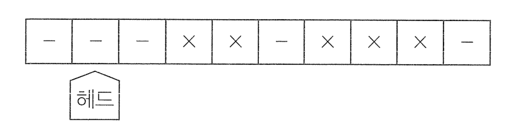
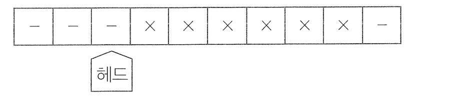

# 출제방향

## 1. 출제의 기본방향

추리논증 문항은 적합한 제시문을 활용하여 법학적성의 중요한 기준인 추리와 논증 능력을 평가하는 데 그 의의가 있다. 이러한 취지를 반영하기 위해, 이번 시험에서도 종전 시험과 마찬가지로 제시문의 제재나 문항의 구조, 질문의 방식 등을 다양화하고 수험생의 이해 능력, 추리 능력, 비판 능력을 골고루 측정하는 완성도 있는 문항을 제시하여 학생들의 추리 및 논증 능력을 평가하고자 하였다. 이번 출제의 기본 방향을 요약하면 다음과 같다.

첫째, 추리 능력을 측정하는 문항과 논증 분석ㆍ평가 능력을 측정하는 문항을 규범, 인문, 사회, 과학기술 등 각 영역에서 다양한 소재를 활용하여 균형 있게 출제하였다. 제재의 측면에서 전 학문 분야 및 일상적ㆍ실천적 영역에 걸친 다양한 소재를 활용하였고, 학부 전공에 따른 유ㆍ불리를 최소화하고자 하였다. 단순히 논리 구조만 파악하여 문제를 푸는 글이 아니라 교양이 될 만한 소재를 활용하는 한편, 고도의 생각을 요구하는 내용의 글은 가능한 한 일상적인 맥락으로 풀어서 학생들이 친숙하게 접근하도록 하였다.

둘째, 문항 풀이 과정에서 제시문의 의미, 상황, 함의를 논리적으로 분석하고 핵심 정보를 체계적으로 취합하여 종합적으로 사고할 수 있어야 문항의 정답을 고를 수 있도록 하였다. 또한 제시문의 내용이나 영역에 관한 선지식이 문제 해결에 끼치는 영향을 없애고 사교육에 의존하지 않고 대학에서 정상적인 학업과 폭넓은 독서 생활을 통해 사고력을 함양한 사람이라면 충분히 해결할 수 있는 문항을 만들고자 하였다. 그러면서도 법학적성을 평가하는 데 있어 중요하면서도 새로운 소재를 활용하여 참신한 문항이 되도록 하였다.

셋째, 제시문에서 불필요한 내용을 배제하고 제시문을 명료하게 작성함으로써 가독성을 높였다. 단순히 어려운 계산을 요구하여 난이도만 높이는 문항은 배제하는 한편, 지나치게 글자 수가 많아 결과적으로 난이도가 높게 되는 점을 지양하기 위해 거의 모든 문항에 있어 글자 수를 줄여 수험생이 문제를 읽는 부담을 덜도록 하였다. 그러면서도 난이도에 있어 법학적성을 측정하는 데 적정한 정도의 수준을 유지하도록 하였다.

## 2. 출제 범위 및 문항 구성

규범, 인문, 사회, 과학기술과 같은 학문 영역별 문항 수는 예년과 큰 차이가 없이 균형 있게 출제되었다. 규범 영역의 문항은 법학지식을 측정하지 않되 헌법, 민법, 형법, 행정법, 소비자법, 민사소송법, 형사소송법, 노동법, 국제법 등과 관련된 내용을 소재로 하면서도 매스컴 등을 통해 한 번쯤 들어보았을 만한 시사적 내용 등을 활용하여 소재를 다양화하였다. 아울러 종래 출제되지 않았지만 법학을 전공할 사람이 알아야 할 중요한 내용으로 출제하였다. 인문 영역의 문항은 인식론, 윤리학, 과학철학 등의 주제를 담고 있으며, 법학을 전공하는 데 있어 필요한 논리적인 글을 읽을 수 있는 능력을 파악할 수 있는 소재를 활용하였다. 사회과학 영역에서는 경제학, 사회학, 연구방법론 등의 글이 활용되었다. 과학 영역은 생물학, 물리학 등의 소재를 활용하여 문항의 내용이 한쪽으로 치우치지 않도록 하였다. 전체 문항에서 추리 문항과 논증 문항은 비슷한 분량으로 구성되었다.

## 3. 난이도

제시문의 이해도를 높이기 위해서 전문적인 용어는 순화하여 전공 여부에 상관없이 내용에 접근하고 이해할 수 있도록 하였다. 문제를 해결하기 위해 거쳐야 할 추리나 비판 및 평가의 단계도 지나치게 복잡해지지 않도록 하였고, 문제풀이와 관계없는 자료는 최대한 줄여 불필요한 독해의 부담이나 함정으로 난이도가 상승하는 일이 없도록 하였다. 특히 작년과 마찬가지로 전체 글자 수를 줄임으로써 읽기에 소비되는 시간을 줄이고 좀 더 논리적 구조에 집중할 수 있도록 했다. 아울러 지나치게 난이도를 높여 변별력에 의미가 없게 되는 점을 지양하고 문항 간 난이도에서 큰 차이가 없도록 노력하였다.

## 4. 출제 시 유의점

* 추리 문항과 논증 문항을 균형 있게 출제하고 문항별 성격을 명료하게 하여, 문항별로 측정하고자 하는 능력을 정확히 평가할 수 있도록 하였다.

* 법학적성을 측정할 수 있는 중요하고 새로운 소재를 발굴하면서도 시사성 높은 소재를 통해 학생들이 친숙하게 접할 수 있는 문항이 되도록 하였다.

* 선지식으로 문제를 풀거나 전공에 따른 유ㆍ불리가 분명한 제시문의 선택이나 문항의 출제는 지양하였다.

* 제시문을 분석하고 평가하는 데 충분한 시간을 사용할 수 있도록 글자 수를 줄이는 등 제시문의 독해부담을 줄였다.

* 제시문이 전달하고자 하는 내용을 효과적으로 전달할 수 있도록 전반적으로 가독성을 높이고, 문두와 선지의 내용을 최대한 명료하게 만들었다.

* 법학적성 능력을 평가하기 위하여 법학의 기본 원리를 응용한 내용을 소재로 하면서도, 문항에 나오는 개념, 진술, 논리구조, 함의 등을 이해하는 데 법학지식이 요구되지 않도록 하여 법학지식 평가를 배제하였다.

* 출제의 의도를 감추거나 오해하게 하는 질문을 피하고, 문항 및 선택지 간의 간섭을 최소화함으로써, 문항의 의도에 충실한 변별이 이루어지도록 하였다.

---

# 문항별 해설
## 01
### 문항구분
* 문항 성격 : 언어 추리

* 평가 목표 : 이 문항은 개인의 행동을 통제하는 방식에 관한 글로부터 올바르게 추론할 수 있는 능력을 평가하는 문항이다.
### 제시문 해설
* 정답 : (2)
직접통제는 통제대상자의 행동을 통제하기 위해 법규범을 통해 통제대상자의 행동 그 자체를 제한(금지 내지 의무부과)하는 방식이고, 간접통제는 통제대상자의 행동 통제를 위하여 법규범 또는 그 외의 수단을 통해 통제대상자 이외의 대상에게 영향력을 행사함으로써 종국적으로 통제대상자의 행동을 유도하거나 제한하는 방식을 말한다.

### <보기> 해설
ㄱ. 통제대상자는 임신부이고, 통제대상행위는 임신부의 낙태행위이다. 낙태행위를 하려는 임신부를 통제하기 위해, 낙태시술비용에 대해서 의료보험혜택을 받지 못하도록 하는 방식은 통제대상자(임신부)의 대상행위(낙태행위) 자체를 금지하지 않고 의료보험혜택을 통해 간접적으로 행위를 유도한다는 점에서 간접통제에 해당한다. 한편 낙태행위를 하려는 임신부를 통제하기 위해, 낙태시술을 한 산부인과 의사를 형법으로 처벌하는 방식은 통제대상자(임신부)의 통제대상행위(낙태행위) 그 자체를 통제하지 않고, 그 외의 자(산부인과 의사)에게 형벌을 부과함으로써 통제 목표를 달성하고자 한다는 점에서 이는 직접통제가 아니라 간접통제에 해당한다. 따라서 ㄱ은 옳지 않은 추론이다.

ㄴ. 갑이 간접통제 중 법규범을 활용한 방식보다는 사회적 의미를 활용한 방식을 중시하는 이유는 후자가 전자보다 '개인의 행동을 통제하는 더 효과적인 수단'이 될 수 있기 때문이다(통제대상자의 행동선택권 자체의 제한 여부는 직접통제와 간접통제의 구별기준이다.). 따라서 ㄴ은 옳지 않은 추론이다.

ㄷ. 통제대상자는 매수인이고 통제대상행위는 계약체결행위이다. 이를 통제하기 위해 법을 수단으로 통제대상자가 아닌 매도인에게 표준계약서 고지의무를 부과하고 있으므로, 이는 간접통제에 해당한다. 따라서 ㄷ은 옳은 추론이다.

<보기>의 ㄷ만이 옳은 추론이므로 정답은 (2)이다.

## 02
### 문항구분
* 문항 성격 : 언어 추리

* 평가 목표 : 이 문항은 군인이 군복무와 관련하여 사망한 경우 순직 인정 범위를 정하는 법안에 관한 글로부터 올바르게 추론할 수 있는 능력을 평가하는 문항이다.
### 제시문 해설
* 정답 : (3)
제시된 3개의 법안은 모두 의무복무군인의 순직 인정 범위를 넓히는 것을 목표로 하므로 의무복무군인만을 적용대상으로 한다. 이는 법문에서 의무복무자라는 표현으로도 명백하다. 직업군인 의 경우에는 기존과 같이 군복무 중 군복무와 관련한 사망의 경우에만 순직을 인정하고, 순직자 또는 일반사망자로 나누어 판정한다. 각 법안의 내용을 정리하면 다음과 같다 (법안 ?은 의무복무군인이 복무기간 중 사망한 경우 순직으로 간주하는 규정이다. 법안 2는 의무복무군인이 복무기간 중 사망한 경우 순직으로 간주하는 점은 <법안 1)과 동일 하지만, 여기에서 더 나이가 전역 후에 사망한 경우 예외적으로 군복무와 밀접한 관련성이 인정 되는 때에는 순직자로 판정되도록 하고 있다. 제시된 법안 중에서 의무복무군인의 순직 인정 범 위를 가장 넓게 인정한다. 법안 9)은 의무복무군인이 군복무 중 사망한 경우 순직으로 간주하는 점은 다른 법안과 같다. 다만 "자신의 고의 또는 중과실로 인한 위법행위로 사망한 경우에 해당하여 사망이 군복무와 관 련성이 없다고 인정되는 경우 순직심사위원회는 해당 군인을 일반사망자로 판정할 수 있다"고 하여 순직 인정의 원칙에 예외사유를 명시한 점에 특색이 있다. 제시된 법안 중에서 의무복무군 , 인의 순직 인정 범위를 가장 좁게 인정한다.

### <보기> 해설
ㄱ. (법안 !과 <법안 2)에 따르면 군복무 중 사망한 의무복무군인은 순직자가 되고 일반사망자로 판정될 수 없다. X국의 군인에는 직업군인과 의무복무군인의 2종 류가 있으므로 이 법안 중 하나가 통과된 이후 사망한 군인이 일반사망자로 판정되었다면, 그 군인은 직업군인일 것이나. 반면, <법안 3>이 통과된 경우에는 , 단서의 사유에 해당할 때 예외적으로 의무복무군인도 일반사망자로 판정될 수 있으므로 이 법안의 통과 이후 사망한 군인이 일반사망자로 판정되었다면 그 군인은 의무복무군인일 수도 있다. 따라서 ㄱ은 옳은 추론이다.

ㄴ. X국의 군인은 직업군인과 의무복무군인이 있다. 에서 언급되는 군인이 직업 군인인지 의무복무군인인지 알 수 없다. 직업군인의 경우, 복무기간 중 군복무와 관련한 사망의 경우에만 순직자로 판정되므로, 전역 후 사망한 경우에는 순직자로 판정될 수 없다. 따라서 ㄴ에서 언급되는 군인이 직업군인일 수 있으므 로, "군인이 군복무로 인하여 질병을 얻고 전역 후 그 질병이 직접 원인이 되어 사망한 경우, (법안 2>에 따르면 순직자가 된다.'는 추론될 수 없다. ㄴ은 옳지 않은 추론이다.

ㄷ. 군인의 휴가는 군복무 중에 부여받은 것이므로 군인의 휴가기간은 복무기간에 속한다. 따라서 의무복무자인 군인이 휴가 중 사망한다면 복무기간 중에 사망 한 사례이므로, <법안 1과 <법안 2>에 따르면 해당 군인은 순직자가 된다. 반면, <법안 3>에 따르면 의무복무군인인 경우에도 단서의 사유에 해당하는 때에는 일반사망자로 판정할 수 있다. 따라서 의무복무자인 군인이 휴가 중 교통사고로 사망한 경우. 교통사고가 "자신의 고의 또는 중과실로 인한 위법행위"에 해당한 다면 해당 군인을 일반사망자로 판정할 수 있다. 따라서 ㄷ은 옳은 추론이다. <보기>의 ㄱ, ㄷ만이 옳은 추론이므로 정답은 (3)이다.

## 03
### 문항구분
* 문항 성격 : 언어 추리

* 평가 목표 : 이 문항은 정책 판단기준과 산아제한정책에 관한 2가지 입법례에 관한 글로부터 올바르게 추론할 수 있는 능력을 평가하는 문항이다.
### 제시문 해설
* 정답 : (2)
제시문에서 효율성은 선택에 따른 이득은 최대화하고 비용은 최소화하는 것을 의미하며, 형평성 은 경제적 조건에 구애됨 없이 자신의 합법적 선택을 실현할 수단을 동등하게 획득할 수 있음을 의미하며, 자율성은 선택을 후회하는 자에게 달리 선택할 기회가 주어지는 경우를 의미한다.

### <보기> 해설
ㄱ. 효율성 기준은 선택에 따른 비용 또는 이익의-발생 여부를 기준으로 한다. 출산 을 원하지 않는 자의 입장에서 평가할 때, (고정할당제[에서는 자녀 1명 출산 권의 거래 자체가 불가하므로, 이로 인한 이익이나 비용도 발생하지 않는 반면. )(출산허가증 거래제/에서는 출산을 원하지 않으면, 허가증을 거래하여 금전적 이익을 얻을 수 있다. 따라서 효율성 기준에 비추어 볼 때, 출산을 원하지 않는 자에게는 2이 보다 효율성이 높다. 따라서 ㄱ은 옳지 않은 추론이다.

ㄴ. @의 '형평성 기준'은 정책의 적용대상자 간에 "정책의 적용을 받는 모두가 경 제적 조건에 구애됨 없이 자신의 합법적 선택을 실현할 수단을 동등하게 획득 할 수 있는지"를 판단한다. 여기서의 형평성은 어디까지나 합법적 선택 범위 내에서의 (그 정책을 적용받는 대상자 간의) 형평성'을 의미한다. 이에 따르면, @(고정할당제)에서는, 2명을 출산하려는 자에게 이 정책하에서 허용된 합법적 선택은 1명의 자녀를 출산하는 것뿐이며, 이 합법적 선택 범위 내에서 이를 실 현할 수단은 경제적 조건에 구애됨 없이 모두에게 동등하게 주어져 있다. 반면. 출산허가증 거래제)에서는, 2명을 출산하려는 자에게는 2명의 출산은 '합법 적 선택'에 해당하고, 이를 실현할 수단으로서 허가증의 거래가 인정된다. 다만 실현할 수단의 획득 가능성은 경제적 조건에 따라 달라진다. 예컨대, 부유한 갑 과 가난한 을이 각자 자녀 2명을 출산하고자 하는 경우를 상정했을 때, 고정할 당제에서는 갑과 을은 합법적 선택 범위 안에서 !명의 자녀만을 출산할 수 있고 그 수단은 동등하게 주어져 있기 때문에 '형평적'인 반면, 출산허가증 거래제에 서는 합법적으로 2명의 출산이 실현가능하지만 그 실현 수단이 금전적 거래를 통해 이루어지기 때문에 경제적 조건에 구애된다는 점에서 '형평적'이지는 않 다. 따라서 2명을 출산하려는 지를 기준으로 각 정책의 형평성을 비교했을 때. (출산허가증 거래제)의 형평성이 @(고정할당제)의 형평성보다 클 수는 없다. 그러므로 ㄴ은 옳지 않은 추론이다. =. 자율성 기준은 선택을 번복할 기회의 유무를 기준으로 한다. 출산을 포기했다가 이를 번복하고 출산하려는 자의 입장에서 평가할 때. @(고정할당제)에서는 첫 째 출산을 포기하였다가 번복하고 출산하려는 경우. !명의 자녀를 출산할 권리 는 그대로 가지고 있으므로. 언제든지 이를 번복하고 출산하는 것이 가능하다.

반면, 69/출산허가증 거래제)에서는 첫째 출신을 포기하고 허가증을 판매한 사 람의 경우, 다시 허가증을 구매하는 것은 불가능하고 허가증 없이 자녀를 출산 할 방법은 없으드로. 이 사람이 다시 출산을 선택할 기회 자체가 없다. 따라서 자율성 기준에 비추어 볼 때. 출산을 포기했다가 이를 번복히고 출산하려는 자 에게는 0| 보다 자율성이 높다. 따라서 ㄷ은 옳은 추론이다. <보기>의 ㄷ만이 옳은 추론이므로 정답은 (2)이다.

## 04
### 문항구분
* 문항 성격 : 논쟁 및 반론

* 평가 목표 : 이 문항은 올림픽 출전 불허결정에 대한 국제올림픽위원회(IOC)의 논거를 분석하여 그 논거에 대한 반박 논거로 적절한 것을 판단할 수 있는 능력을 평가하는 문항이다.
### 제시문 해설
* 정답 : (5)
갑의 올림픽 출전 불허결정에 대한 IOC의 첫 번째 논거는 올림픽에 출전하는 선수는 일정 수준의 기록을 가지고 있어야 하고 그 기록은 '올림픽 수준의 세계대회'에서 달성한 것이어야 하는데, 갑이 제시한 기록이 '올림픽 수준의 세계대회'에서 달성한 기록이 아니라는 점이다. IOC의 이 논거는 장애인육상세계선수권대회가 권위 있는 대회가 아니라거나 갑의 기록이 우수한지의 여부를 근거로 삼은 것이 아니다.

두 번째 논거는 “출전선수가 보조장치를 사용하는 경우에는 해당 장치를 사용하지 않는 선수에 비해 '전체적인 경쟁 우위'를 제공하지 않아야 한다.”는 규정이 있고, 따라서 장애선수가 사용하는 보조장치가 해당 장애가 없었을 때보다 더 나은 성과를 내게 하는 것이라면 사용할 수 없는데, 갑이 사용하는 의족은 장애가 없었을 때보다 더 우월한 육상능력을 제공하는 것으로 판단되기 때문에 이 의족을 사용하는 갑의 출전을 허용할 수 없다는 것이다. 즉 의족의 사용 자체가 문제가 아니라 선수의 본래 능력보다 더 나은 성과를 내게 하는 의족을 사용한다는 것을 불허결정의 논거로 삼고 있다.

세 번째 논거는 출전자격 심사위원회의 판단에 불복하는 선수는 해당 장치가 전체적인 경쟁 우위를 제공하지 않는다는 점을 스스로 증명해야 한다는 규정에 따라 두 번째 논거를 뒤집기 위해서는 갑이 자신의 의족이 전체적인 경쟁 우위를 제공하지 않는다는 점을 스스로 증명하여야 하는데, 갑은 이를 증명하지 않았다는 점이다.

### 선택지별 해설
(1) IOC의 논거 중 하나는 의족의 사용이 허용되지 않는다는 것이 아니라 전체적인 경쟁 우위를 제공하는 의족의 사용이 허용되지 않는다는 것이므로, 의족 자체의 사용의 불가피성을 들어 반박하는 것은 적절한 반박 논거가 아니다.

(2) IOC의 논거 중 하나는 장애인육상세계선수권대회는 올림픽 수준의 대회가 아니라는 것이고, 장애인대회로서 장애인육상세계선수권대회의 권위를 부정하는 것이 아니므로 적절한 반박 논거가 아니다.

(3) IOC의 논거 중 하나는 갑의 기록이 '올림픽 수준의 세계대회'에서 달성한 기록이 아니라는 것이지 갑의 기록 자체가 부족한 기록이라는 것이 아니므로 적절한 반박 논거가 아니다.

(4) 이 사례는 도핑테스트에 걸린 선수가 금지약물 사용의 고의성이 없었음을 스스로 증명하여 올림픽 출전이 허용된 사례이므로, 출전자격 심사위원회의 판단에 불복하는 선수는 해당 장치가 전체적인 경쟁 우위를 제공하지 않는다는 점을 스스로 증명해야 하는데, 갑은 스스로 증명하지 못하였다는 IOC의 논거에 대한 적절한 반박 논거가 아니다.

(5) 선수의 본인 기록보다 향상된 기록을 내게 하는 최첨단 수영복은 이를 착용한 선수에게 이를 착용하지 않는 선수에 비하여 전체적인 경쟁 우위를 제공한다. 이러한 수영복의 착용이 허용되어 전체적인 경쟁 우위를 제공하는 것의 사용이 올림픽에서 허용되는 것은 IOC의 두 번째 논거를 적절하게 반박한다.

## 05
### 문항구분
* 문항 성격 : 논증 평가 및 문제해결

* 평가 목표 : 이 문항은 '피해자에 대한 보복 우려'를 새로운 구속사유로 도입할 것인지 여부에 관한 논쟁의 내용을 이해하여 주어진 정보에 따라 각 견해가 강화 또는 약화되는지 판단할 수 있는 능력을 평가하는 문항이다.
### 제시문 해설
* 정답 : (3)
X국에서는 불구속 상태의 피의자가 피해자에게 보복하는 사건들이 많이 발생하자, 이미 법률에 구속사유가 명시되어 있음에도 불구하고, '피해자에 대한 보복 우려를 추가로 신설할 것인가가 디투어지고 있다 < 견하>는 '피해자에 대한 보복 우려'를 새로운 구속사유로 도입하자는 입장임에 반하여 <3 견해>는 이를 독자적 구속사유로 신설하는 것을 반대하면서 그 대신에 일정한 조건(주거 또는 이 동 제한, 피해자에 대한 접촉 제한, 특정 행위의 금지, 여권 제출. 공공기관에의 정기적 출석 등)을 부과히여 피의자를 통제함으로써 피해자에 대한 보복 방지의 목적을 달성할 수 있다는 입장이다.

### <보기> 해설
ㄱ. >국의 인권기구가 “피해자에 대한 보복 우려가 구속사유로 규정되어 있는지를 불문하고 그 사유만으로 피의자를 구속하는 것 자체가 인권침해"리고 판단하고 있어서 현재에도 '피해자에 대한 보복 우려'만을 이유로 하여 구속히는 것뿐만 아니라, 향후 이를 독자적 구속사유로 도입하여 이 사유만으로 구속하는 것도 인 권침해라고 판단하고 있다. 따라서 X국의 인권기구의 판단은 '피해자에 대한 보 복 우려'를 명시적인 구속사유로 도입하자는 의 입장을 약화한다. 따라서 ㄱ은 옳은 평가이다.

ㄴ. 조건부 불구속 제도가 도입되더라도 대부분의 판사가 피해자에 대한 보복 범죄 가 발생할 경우 직면하게 될 사회적 비난을 피하기 위해 불구속보다는 구속으로 결정할 것이라는 연구 결과가 있다면, 조건부 불구속 제도의 도입에도 불구하고 판사들이 이 제도의 활용을 기피하여 이 제도가 제대로 활용되지 않을 가능성이 높아진다. 따라서 이러한 연구 결과는 조건부 불구속 제도를 도입하고자 하는 B 의 입장을 강화하지 않는다. 따라서 ㄴ은 옳지 않은 평가이다.

ㄷ. 와 B 모두 현재의 제도로는 위법 소지에 대한 비판을 감수하고 인신을 구속하 지 않는 한, 피해자에 대한 보복 우려를 해소할 수 없다는 점을 인정한다. 왜냐 하면 이러한 인식을 토대로 는 독자적인 구속사유로 '피해자에 대한 보복 우 려'를 추가하자는 입장이고. C는 독자적인 구속사유로 신설하는 것은 반대하 면서 그 대안으로 조건부 불구속 제도를 도입하자는 것이기 때문이다. 따라서 ㄷ은 옳은 평가이다. <보기>의 ㄱ, ㄷ만이 옳은 평가이므로 정답은 (3)이다.

## 06
### 문항구분
* 문항 성격 : 언어 추리

* 평가 목표 : 이 문항은 구금형을 받은 사람에 대하여 구금 기간 중 교정의 정도에 따라 석방 여부를 결정하는 제도의 두 가지 유형에 관한 글로부터 올바르게 추론할 수 있는 능력을 평가하는 문항이다.
### 제시문 해설
* 정답 : (2)
<4조치>와 <2조치>는 모두 최초의 구금형 판결 이후 다시 판결을 선고하는 방식으로 이루어지는 데, 두 조치 모두 “구금 기간 중 교정의 정도"를 고려할 때 “재범 가능성"이 있는지를 기준으로 <4조치>는 경미한 범죄를 처음 저지르고 유죄판결을 선고받는 사람에 대해 구금형을 선고하는 경우에 선고한다. 법원은 형기의 1/2 시점에 구금 기간 중 교정의 정도를 고려하여 대상자가 재범 가능성이 낫다고 판단하면 잔여 형기의 집행을 중단하는 조치를 선고한다. 집행 중단으로 석방되 면 잔여 형기 동안 교정기관의 감독을 받는데, 이 감독규정을 위반한 경우에는 다시 구금되고 잔 여 형기가 집행된다. 8조치)는 중대한 범죄를 저지른 자로서 재범 가능성이 현저히 높은 사람을 대상으로 선고한 다 법원은 대상자에게 유죄판결을 할 때 "선고된 형기의 종료 시점에 재범 가능성을 평가하여 그 형기를 연장할 수 있다."라는 내용을 포함하여 선고한다. 형기의 종료 시점에 법원은 대상자가 재범 가능성이 현저히 높다고 판단하면 앞서 선고된 형기의 1/2 범위에서 구금형을 연장하는 조 치를 선고한다.

### <보기> 해설
ㄱ. <조치>에서 법원은 형기의 1/2 시점에 구금 기간 중 교정의 정도를 고려하여 대상자가 재범 가능성이 낮은지 판단한다. 반면, <8조치>에서 법원은 최초 판결 선고 시에 재범 가능성이 현저히 높은 사람을 대상으로 유죄판결에 부수하여 형기 종료 시점에 재범 가능성을 평가하여 그 형기를 연장할 수 있음을 미리 선 고해 둔다. <8조치>는 처음 구금형을 선고할 때 대상자가 재범 가능성이 있는지 판단하지만 <4조치>는 형기의 1/2 시점에 대상자가 재범 가능성이 있는지 판단 한다. 따라서 ㄱ은 옳지 않은 추론이다.

ㄴ. 2년의 구금형과 <#조치>가 선고된 사람은 형기의 1/2 시점에 잔여 형기의 집행 이 중단되어 석방되지만, 잔여 형기인 1년의 기간 중에 교정기관의 감독규정을 위반한 경우에는 다시 구금되어 잔여 형기가 집행된다. 따라서 전체적으로 합 산하면 집행 종료일은 구금일부터 최대 3년째 되는 날까지 늦어질 수 있다(예컨 대, 교정기관의 감독규정의 위반으로 잔여 형기인 :년의 말일에 다시 구금된 경 우에는 그 다음날부터 잔여 형기가 집행되므로 집행 종료일은 구금일부터 3년 째 되는 날이다). 반면, 2년의 구금형과 함께 <3조치>가 선고된 경우에는 2년의 : - 구금형 이후 최대 1년의 구금형이 추가된다. 최대 1년의 구금형이 선고될 수 잎 다는 것으로, 1년보다 짧은 기간이 선고될 수도 있다. 따라서 2년의 구금형과 <& 조치>가 선고된 사람이 2년의 구금형과 <3조치>가 선고된 사람보다 집행 종료 일이 늦어지는 경우가 있다. ㄴ은 옳은 추론이다.

ㄷ. "형사처벌로 범죄자가 구금된 기간은 이미 저지른 범죄행위에 상응해야 한다는 원칙"에 비추어볼 때, 문제에서 이에 부합하는 구금 기간은 범죄자가 과거 이미 저지른 범죄행위를 대상으로 하여 최초의 판결에서 선고한 기간이 될 것이다. <#조치>는 형기의 1/2 시점에 "구금 기간 중 교정의 정도"리는 범죄행위 이후의 사정을 바탕으로 장래의 재범 가능성을 판단하여 석방 여부를 결정한다. 이는 하지 않는다. 따라서 ㄷ은 옳지 않은 추론이다. 한편 <8조치>의 경우 형기의 종 료 시점에 "구금 기간 중 교정의 정도"를 참작하여 장래의 재범 가능성을 판단 하여 그 형기의 연장 여부를 선고한다. 이 역시 "이미 저지른 범죄행위"를 판단 대상으로 하지 않으므로 위 원칙에 부합하지 않는다. <보기>의 ㄴ만이 옳은 추론이므로 정답은 (2)이다.

## 07
### 문항구분
* 문항 성격 : 언어 추리

* 평가 목표 : 이 문항은 '이득액' 개념에 대한 두 견해를 정확히 이해하고, 견해에 따라 사례를 올바르게 판단할 수 있는 능력을 평가하는 문항이다.
### 제시문 해설
* 정답 : (1)
/를 따를 때, <사례 1>에서 갑의 이득액은 취득한 토지 그 자체의 가액이므로, 토지의 시가인 16 억 4.600만 원이고, <사례 2>에서도 취득한 토지의 시가인 15억 3.000만 원이다.

반면, B에 따르면, <사례 "에서는 갑의 이득액은 취득한 토지 그 지체의 가액06억 4.600만 원에서 구입비용으로 지출한 일부 대금00억 2600만 원을 공제한 6억 2.000만 원이고, <사례 2>에서는 토지 그 자체의 가액5억 3.000만 원)에서 구입비용10억 2.000만 원)을 공제한 5억 1.000만 원이다.

### <보기> 해설
ㄱ. 시가 100만 원인 물건을 소유자를 속여서 대가를 전혀 지급하지 않고 소유권 을 취득한 경우, A에 따르면 이득액은 100만 원이고, B에 따르더라도 이득액은 100만 원이다. 이쳐럼 이득액이 동일한 사건도 존재하기 때문에 모든 사건에서 언제나 에 따른 이득액이 801 띠른 이득액보다 더 크게 산정되는 것은 아니다.

따라서 ㄱ은 옳지 않은 판단이다.

ㄴ. B에 따를 때, 갑이 <사례 1>에서 얻은 이득액(6억 2000만 원)과 <사례 2>에서 얻 은 이득액(5억 1.000만 원)의 치이는 1억 1000만 원이다. 따라서 ㄴ은 옳은 판단이다.

ㄷ. 2에 따르면 이득액은 취득한 토지 그 자체의 가액이다. 따라서 시가가 15억 3.000만 원인 경우에는 이득액은 16억 3.000만 원, 시가가 10억 2000만 원으 로 하락했을 경우에는 10억 2.000만 원이 노어 동일하시 않다. B에 따르면 이득 액은 토지 그 지체의 기액에서 지급 대가를 공제한 것이므로, 하락하지 않았을 경우에는 5억 1000만 원(=15억 3.000만 원-10억 2.000만 원). 하락했을 경우 에는 0원(=10억 2.000만 원-10억 2.000만 웰으로 역시 달라진다. 결국 4에 서도, B에서도 이득액이 달라진다. 따라서 ㄷ은 옳지 않은 판단이다. <보기>의 ㄴ만이 옳은 판단이므로 정답은 (1)이다.

## 08
### 문항구분
* 문항 성격 : 논증 분석

* 평가 목표 : 이 문항은 고령화로 인한 노인돌봄인력의 부족 상황과 그 해소 방안으로 제시된 A, B, C 주장 간의 공통점과 차이점을 정확하게 파악할 수 있는 능력을 평가하는 문항이다.
### 제시문 해설
* 정답 : (4)
A, B, C는 고령화로 인한 노인돌봄인력의 부족 상황과 이를 해소하기 위한 대책에 대해 각자 자 신의 생각을 개별적으로 주장하고 있다. 는 고령화의 빠른 진행으로 노인돌봄현장의 인력 부족 상황이 더욱 악화될 것이드로, 의욕적 으로 일하는 외국인 인력을 노인돌봄현장에 유입하여야 한다고 주장하고, 이를 위해서는 비자제 도 개선이 필요하다고 주장한다. C는 노인돌봄현장에 그나마 불경기로 인해 인력의 유입이 다소 있었으나 노인돌봄노동에 대한 열악한 처우 때문에 이탈이 많아 안정적인 인력 공급을 기대하기 어렵고, 따라서 공적자금 투입 을 통한 노인돌봄노동에 대한 처우 개선을 대책으로 내세운다. 또한 X국은 이민정책에 매우 소극 적이어서 외국인 인력 공급으로 노인돌봄현장의 인력 부족을 해소하는 것은 시간이 걸리는 대책 이라고 주장한다 0는 와 같이 노인돌봄현장에 인력의 유입이 다소 있었던 점은 인정하지만 고령화의 추세가 더 기팔라 노인돌봄인력이 부족하다고 생각하고, 이를 위해서 두 가지 대책을 내세우는더, 하나 는 저임금으로도 의욕적으로 일하는 외국인 인력의 유입이고, 하나는 돌봄노동을 분담할 공공로 봇을 개발하여 보급하는 것이다.

### 선택지별 해설
정답 해설 @ /는 외국인 인력 확보를 위해 비자제도의 개선을, C는 노인돌봄인력의 처우 개 선을 위해 공적자금의 투입을, (는 돌봄노동을 분담할 공공로봇의 개발 보급을 주장하고 있어 4, C, 0 모두 공적 개입을 노인돌봄인력의 부족 상황에 대한 대 책으로 주장하고 있다. 따라서 노인돌봄현장의 인력 부족 상황은 시장에만 맡겨 서는 해결되지 않는다는 점에 대해 A, C, C의 견해는 같다

오답 해설 00 돌봄노동 종사자에 대한 처우가 개선되어야 한다는 점은 8만 주장하고 있다.

2 와 는 외국인 돌봄노동인력이 의욕적으로 일한다는 점에 대해 같은 의견이지 만 우수하다고 견해를 밝힌 바는 없다. (@ 와 는 외국인 돌봄노동인력 수의 증가에 대해 견해를 밝히지 않았기 때문에. B와 (가 이에 대해 견해가 다르다고 말할 수 없다. @ 노인돌봄시설로 인력이 유입된 부분은 B와 (가 인정하지만, 불황이 계속되면 노인돌봄현장의 노동 인력 공급이 인정된다는 견해는 없다.

## 09
### 문항구분
* 문항 성격 : 언어 추리

* 평가 목표 : 이 문항은 교통사고의 피해자가 손해배상을 받는 방법에 관한 글로부터 올바르게 추론할 수 있는 능력을 평가하는 문항이다.
### 제시문 해설
* 정답 : (5)
X국의 교통사고 피해자가 그 피해를 배상받음에 있어서 소송의 방법에 의할 것인지 아니면 제3 자의 주도하에 합의를 할 것인지 파악할 수 있어야 한다. 제3자의 주도하에 합의를 할 경우, 사고 상무는 가해자 택시 회사 소속 직원이므로 가해자 측을 위해 비교적 적은 금액을 제시하고 합의 하려 하고, 사건브로커는 판결로 받을 수 있는 객관적인 정보를 피해자에게 제시하고 피해자 측 에서 가급적 많은 합의금을 받으려고 노력한다. 다만 사건브로커는 피해자가 지급받은 합의금에 서 교정 비율의 돈을 수수료 명목으로 챙기므로 단순히 피해자가 지급받은 합의금의 많고 적음 만을 따질 게 아니라 사건브로커의 수수료까지 따져봐야 한다.

### 선택지별 해설
정답 해설 C 사고상무 병은 회사 소속이므로 갑이 소송을 통해 받을 수 있는 돈보다 적은 돈을 건네고 합의를 유도할 것이다. 그런데 사건브로커 정은 피해자 갑이 지급 받는 합의금에서 고정 비율의 돈을 수수료 명목으로 받으므로, 정이 받는 수수 료 액수가 많다는 것은 정이 김에게 합의금을 많이 받아준다는 것을 의미한다. 제시문에서 피해자에게 금전적으로 가장 유리한 조건을 제시한 제3자의 주도하 에 합의가 이루어질 가능성이 높다고 하였고, 정이 받는 수수료 액수가 많으면 많을수록 갑에게 많은 합의금이 지급될 것이므로, 합의는 정의 주도하에 이루어 질 가능성이 높다. 따라서 @는 옳지 않은 판단이다.

오답 해설 (0 제시문에서 피해자에게 금전적으로 가장 유리한 조건을 제시한 제3자의 주도하 에 합의가 이루어질 가능성이 높다고 하였다. 따라서 병이 제시하는 위로금과 합의금을 합한 금액이 정을 통해서 받을 합의금에서 수수료를 공제한 금액보다 큰 경우에는, 합의가 이루어진다면 그것은 병의 주도하에 이루어질 가능성이 높 다. 따라서 은 옳은 판단이다. @ 병과 정이 제시한 금액이 소송으로 받을 수 있는 돈보다 많다면 같은 합의를 할 것인데, 병과 정이 같은 금액을 제시했다면, 정은 그 금액에서 수수료를 공제할 것이므로 갑은 정보다는 병의 주도하에 합의를 하는 것이 낫다. 따라서 합의는 병의 주도하에 이루어질 가능성이 높으므로, @는 옳은 판단이다. 방법을 택하지 않고 합의를 하려 할 것이므로, @은 옳은 판단이다. @ 같이 최대한 빨리 합의금을 받아야 할 사정이 있다면 소송으로 가기보다 합의를 하는 편이 낫다. 그런데 본문에서 갑의 사정이 급박할수록 사고상무의 활약은 두드러진다 하였고, 이러한 갑의 급박한 시정, 즉 갑이 최대한 빨리 합의금을 받 이야 할 사정을 을과 가 알고 있으므로, 을은 사건브로커 정이 사고상무 병보 다 더 높은 금액을 제시하며 합의를 유도하려 한다면 이에 응하지 않을 것이다.

따라서 이 경우 사고상무 병의 주도하에 합의가 이루어질 가능성이 높다. @는 옳은 판단이다.

## 10
### 문항구분
* 문항 성격 : 언어 추리

* 평가 목표 : 이 문항은 제시된 A, B, C의 견해를 정확히 이해한 뒤 사례에 적용하여 올바른 결론을 도출할 수 있는 능력을 평가하는 문항이다.
### 제시문 해설
* 정답 : (2)
온라인중개플랫폼에서 상품이 거래된 경우, 판매자와 플랫폼 운영자 중 누가 계약당사자인지에 대해 세 견해가 제시되고 있다. ㅅ 견해 : 판매자와 플랫폼 중에서는 계약의 내용을 실질적으로 결정한 자를 계약당사자로 보는 견해이다. 따라서 플랫폼이 단순한 중개를 넘어 계약조건을 실질적으로 결정한다면, 그 플랫폼을 계약당사자로 보이야 한다는 입장이다.

1 견해 : 매도인인 계약당사자가 누구인지는 플랫폼에서 상품을 구매한 소비자의 인식을 기준으 로 판단한다는 견해이다. 소비자는 자신이 지급한 대금을 직접 수령하는 지를 당시지로 인식하는데, 대금을 직접 수령하는 자란 소비자가 환불의 주체로 생각하는 자이기 때문 에, 결국 소비자가 환불의 주체로 생각하는 자가 계약당사자라는 견해이다.

C 견해 : 계약당사자는 계약에 관하여 법에서 책임을 지도록 규정한 자가 계약당사자가 된다는 <사려>에서 <떠나요라는 숙박예약 플랫폼의 운영자는 갑이고, 을은 그 플랫폼에서 자신의 숙박상품과 가격 등 판매조건을 등록하고 판매한 판매자이다.

### <보기> 해설
ㄱ. <떠나요>에서 소비자가 갑에게 환불을 요청한다면, 소비자는 환불의 주체가 갑이라고 생각하고 있다. 따라서 B에 따르면 계약당사자는 갑이므로, 사용금지가 계약당사자가 되고 숙박상품과 가격 등 판매조건을 게시한 을이 계약 내 용을 실질적으로 결정했을 가능성이 있으므로, A에 따르면 을이 계약당사자일 가능성이 있다. 따라서 에 따르면 갑에게 사용금지를 명령할 수 있다는 것은 옳지 않은 판단이다. ㄱ은 옳지 않은 판단이다.

ㄴ. X국의 법이 계약에 따른 손해배상책임은 플랫폼이 지도록 정하고 있을 경우. 범 에서 책임을 지도록 규정한 자를 계약당사자로 보는 0에 따르면 갑이 계약당사 ' 자이고 따라서 갑에게 사용금지를 명령할 수 있다. ㄴ에서 “B와 ㅇ 중 어디에 따 르든 을에게만 사용금지를 명령할 수 있다."고 하였으드로, ㄴ은 옳지 않은 판단 이다. (또한 소비자가 환불의 주체로 인식하는 자를 계약당사자로 보는 B에 따 르면, 소비자가 갑, 을 중 누구를 환불의 주체로 생각하는지 알 수 없으므로 B 에 따르면 을에게만 사용금지를 명령할 수 있다는 것도 옳지 않은 판단이다)

ㄷ. 플랫폼 운영자인 갑이 판매조건과 약관을 결정하였고, 을은 이를 따를 수밖에 없었다. 따라서 플랫폼에 게시된 계약의 조건과 환불불가 약관은 실질적으로 감 이 정한 것이다. 계약의 조건이나 내용을 실질적으로 결정한 자를 계약당사자 로 본다는 에 따르면. 갑이 계약당사자이고 을은 계약당사자가 아니다. 따라서 /에 따르면 갑에게 사용금지를 명령할 수 있으나 을에게는 사용금지를 명령할 수 없다. ㄷ은 옳은 판단이다. :_. <보기>의 ㄷ만이 옳은 판단이므로 정답은 (2)이다.

## 11
### 문항구분
* 문항 성격 : 논증 평가 및 문제해결

* 평가 목표 : 이 문항은 권리자만이 자신의 권리를 행사할 수 있는가, 아니면 제3자도 권리자의 권리를 대신 행사할 수 있는가에 대한 견해를 적절히 분석하고 평가할 수 있는 능력을 측정하기 위한 문항이다.
### 제시문 해설
* 정답 : (1)
이 문제는 의무자에 대한 직접적인 권리가 없는 제3자도 일정한 경우에는 의무자의 권리를 대신 행사할 수 있어야 한다는 '채권자대위권'을 소재로 하여 출제된 문제이다. 각 견해의 요지는 다음 과 같다. A : 권리자만이 자신의 권리를 행사할 수 있다. 다만, 제3자가 권리자의 권리를 넘겨받거나 의무 자의 의무를 떠맡기로 약성한 경우 권리를 행사하거나 의무를 이행할 수 있으나, 이는 제3자 의 지위에서 하는 것이 아니라 그 스스로 당사자가 되었기 때문이다.

B : 제시문의 예시에서 권리자만 자신의 권리를 행사할 수 있다고 본다면 의무자는 반사적 이익 을 얻기 때문에 부당하다. 따라서 일정한 경우 직접적 권리가 없는 제3자도 의무자를 상대로 권리를 행사할 수 있다.

### <보기> 해설
ㄱ. 에게 쓰레기를 치우라고 할 권리는 집주인 3에게 있는데. 제3자 6가 C를 대신 하여 그 권리를 행사하는 것이 인정된 사례이다. 가 B의 동의 없이 B의 권리를 대신 행사한 것이므로, 가 B의 권리를 넘겨받기로 약성하였다고 볼 수 없으므 로, A에서 말하는 단서의 사정을 적용할 수도 없다. 따라서 의 주상은 약화된 다. ㄱ은 옳은 평가이다.

ㄴ. 의무자 C의 의무를 제3자 6가 대신 이행하기로 권리자 !와 약속한 사안에서, 1으 C에 대한 청구를 법원이 인정한 사례이다. 6가 C의 채무를 갖아주기로 [와 약속 하여 C는 의무자로서 당사자가 된 사례이므로, [의 C에 대한 청구가 법원에서 인 정되더라도 이는 제3자의 의무를 대신 이행하는 것이 아니라 당사자로서 자신으 의무를 이행하는 것이다. 그런데 B는 직접적 권리가 없는 제3자도(당사자가 0 닌 제3자의 지위에서) 의무자를 상대로 권리를 행사할 수 있는지 여부에 대해서 만 기술하고 있으므로, ㄴ의 사례와 무관하다. 따라서 ㄴ은 옳지 않은 평가이다.

ㄷ. 가해자 9에 대한 권리는 피해자 에게 있는데, 제3자 |가 그 권리를 대신 행사ㅎ 는 것이 인정되지 않은 사례이다. 『가 의식불명에 빠졌으므로 「의 9에 대한 교 통사고에 따른 손해배상청구를 할 수 있는 권리를 가 넘겨받기로 약정하여 당 사자로서 행사하였다고 볼 수도 없다. 따라서 제3자의 권리행사가 허용되지 않 는다는 의 주장이 강화되고, 제3자의 권리행사가 일정한 경우 가능하다는 B의 주장은 약화된다. 따라서 ㄷ은 옳지 않은 평가이다. <보기>의 ㄱ만이 옳은 평가이므로 정답은 (1)이다.

## 12
### 문항구분
* 문항 성격 : 언어 추리

* 평가 목표 : 이 문항은 X국에서 사용하고 있던 토지의 면적 단위를 정확하게 이해하여 주어진 정보에 따라 대소를 비교할 수 있는 능력을 평가하는 문항이다.
### 제시문 해설
* 정답 : (3)
X국의 밭이나 임야에서 사용하던 '정단무보'의 단위를 이해하고 이를 '평'으로, 그리고 '로 환 산할 수 있어야 하고, 본문의 주어진 정보로부터 밭이랑 200개에 해당하는 면적이 6,000평에 해 당한다는 점, 지역에 상관없이 면적당 같은 등기비용이 부과되지만 단위면적당 등기비용은 논0

2 노트 = 느ㄱㅇ = ㄴㄴ 밭ㆍ임야의 2배라는 점, 논의 고유한 면적 단위로 『? 및 @지방에서 사용하는 '계'가 쌀의 수확량을 기준으로 논의 면적을 말한 것이라는 점, 『지방과 @지방에서 1계가 가리키는 면적이 각 100평괴 300평으로 달랐다는 점을 파악할 수 있어야 한다.

### <보기> 해설
ㄱ. 1타아르의 논 는 10,000이고, 밭이랑 200개에 해당하는 면적의 임야 B는 6,000평, 즉 19,834.8이다. 임야 B의 면적이 논 ^보다 넓지만 2배를 넘지는 못하는데, 본문에서 단위면적당 등기비용은 논이 임야의 2배라고 하였으므로, 결국 등기비용은 논 ^가 임야 8보다 더 든다. 따라서 ㄱ은 옳은 추론이다. L. 2정 3단 1무 10보의 토지의 면적을 평으로 환산하면 6940평(=6,000+900+30+10)이고 이는 본문의 주어진 정보에 의하면 22,942.252㎡(=6,940×3.3058)이다. 그런데 등기부에는 22,900㎡로 기재되었으므로, 실제 면적보다 등기부에 작게 기재된 것이다. 따라서 ㄴ은 옳은 추론이다.

ㄷ. 제시문에서 논의 쌀 수확량을 기준으로 한 면적 단위는 '계'인데, 수확량이 같다 고 했으므로 논 0와 논 2는 같은 계이다. 그런데 『와 @지방에서 1계의 면적이 ㅁ지방은 100평이고 @지방은 300평이므로, 결국 『시방의 논 의 면적보다 0지 방의 논 ㅁ의 면적이 3배 넓다. 따라서 ㄷ은 옳지 않은 추론이다. <보기>의 ㄱ과 ㄴ만이 옳은 추론이므로 정답은 (3)이다.

## 13
### 문항구분
* 문항 성격 : 논쟁 및 반론

* 평가 목표 : 이 문항은 사형선고에 있어서 편견의 요소의 개입이 처벌을 정의롭지 않게 만드는가에 관련된 논쟁을 통해, 논쟁의 요소를 분석하고 평가할 수 있는 능력을 측정하는 문항이다.
### 제시문 해설
* 정답 : (1)
미국 대법원의 1972년 퍼먼 대 조지야『40780. 06098) 판례에서, 사형제도가 반헌법적이라 고 판결한 바 있는데, 여기서 중요한 역할을 했던 것이 "자의성의 문제"이다. 인종이나 소득 같은. 익행과는 무관한 요소가 실제로 사형선고에 영향을 미치고 있는 것이 현실이기 때문어, 사형제도 는 정의롭지 못하다는 것이 그 골자이다. 이 생각은 제시문에서 갑이 대변하고 있다. 그러나 이에 대한 반론도 만만치 않은데, 반론의 핵심은 사형선고가 내려지는 사람들은 자신의 범죄에 대해서 마땅히 받아야 할 쳐벌을 받고 있는 것이기 때문에. 마땅히 처벌받이야 하는 사람들이 모두 균등 하게 처벌받는지와는 무관하거, 정의롭다는 것이다. 이는 을이 대변하고 있다. 을은 특히 음주운 전 처벌 같은 것에 있어 이런 종류의 자의성은 어느 정도 불가피하고, 게다가 직관적으로도 문제 가 되지 않음을 들어 자신의 논증을 강화한다.

### <보기> 해설
ㄱ. 갑의 핵심 주장은 판사의 사회적 편견으로 인해 사형선고에 있어 인종 편향이 발생하고 있으며 이는 범죄와는 무관한 요소이기 때문에. X국의 현행 제도하에 서 사형선고는 정의로운 처벌이 되지 못한다는 것이다. 판사의 자량을 최소회하 고 공통의 기준을 사용하는 것은 판사의 사회적 편견의 개입을 막는 방범이 될 수 있기 때문에. ㄱ은 옳은 분석이다.

ㄴ. 을에 따르면 정의가 온전히 실현된다면. 마땅히 사형을 받아야 할 모든 사람들. 그리고 그런 사람들만 사형선고를 받게 될 것이다. 만약 살인을 저지른 흉악범 이 모두 사형을 받아 마땅한 사람이라면, 정의가 실현될 경우 그들은 모두 사형 선고를 받아야 할 것이므로, 사형선고 비율은 오히려 늘어날 것이다. 따라서 정 의가 실현될 경우 사형선고 비율이 줄어든다는 주장은 옳지 않다. 더 나아가 을 이 '살인을 저지른 흉악범이 모두 사형을 받아 마땅한 사람이다.'를 참으로 생각 하는지 알 수 없다고 하더라도. 그의 관점에서는 처벌의 정의가 온전히 실현될 경우 사형선고를 받는 사람의 비율이 줄어든다고 단정할 수 없다. 따라서 ㄴ은 옳지 않은 판단이다.

ㄷ. 2010년 이후 10년간의 사형선고 기록을 추가 조사한 결과 ㅅ인종에의 편향이 더 심화되었다고 해서 그것만으로 을의 입장이 약화되는 것은 아니다. 을의 관점에 , 서는, 설령 특정 인종의 비율이 더 높아지는 결과가 나타났더라도, 그것이 판사 의 의도적 선별의 결과가 아니라면, 각 사형선고는 정의로운 처벌이라고 볼 수 있기 때문이다. ㄷ은 을의 입장이 약화된다고 단정하고 있으드로 옳지 않은 판 보기>의 ㄱ만이 옳은 분석이므로 정답은 (1)이다.

## 14
### 문항구분
* 문항 성격 : 논증 분석

* 평가 목표 : 이 문항은 심리학과 행동경제학에서 논의되는 '프레이밍 효과'를 소재로 삼아, 여기에 전제된 일반적인 원칙과 프레이밍 효과의 범위 사이의 관계를 추론할 수 있는 능력을 평가하는 문항이다.
### 제시문 해설
* 정답 : (5)
제시문은 심리학과 행동경제학에서 논의되는 “프레이밍 효과"를 논리학의 '외연성 원리"와 연결 시킨다. 프레이밍 효과란 동일한 결과가 어떻게 기술되느냐에 따라 사람들의 선호가 달라지는 현 상으로, 심리학과 행동경제학 실혐에서 광범위하게 임증된 것으로 생각된다. 그러나 프레이밍 효 과의 정확한 범위, 그리고 그 함축에 대해서는 의견이 분분하다. 어떤 경제학자는 프레이밍 효 과를 외면성 원리(지문의 '원리 "와 관련지었으나, 철학자들은 외연성 원리에 예외가 존재한다 고 본다. 특히 "~을 믿는다", "~을 원한다", "~이| 필연적이다”와 같은 내포적 맥락에서는 외연 :. 성 원리가 성립하지 않는다는 것이다. 흥미로운 것은, 프레이밍 효괴가 문제 삼고 있는 선호는 바 로 내포적 맥락으로 보는 것이 합당하다는 점이다. /는 프레이밍 효과와 외연성 원리를 연결하 여, 기술 방식에 따라 선호가 달라지는 모든 사례가 선호의 비합리성을 보인다고 주장한다. 반면. B는 "~를 선호한다"가 내포적 맥락임을 지적하면서, 기술 방식에 따라 선호가 달라지는 사례들 중 일부만이 선호의 비합리성을 보인다고 주장한다.

### <보기> 해설
-. 원리 ㅁ외연성 원리)가 사람들이 위반할 수 있는 규범적인 원칙이 아니라, 논리 적으로 반드시 참인 원리라면, “와 '6가 동일한 대상을 지칭한다."가 참일 때 “6가 를 선후한다."가 참이면서 동시에 “83가 를 선호한다."가 거짓일 수는 없 다. 따라서 한 사람이 두 선택지에 대해서 다른 선후를 보인다면, 이는 던순한 기술상의 치이가 아니라 실제로 서로 다른 선택지라는 것을 의미한다. 따라서 ㄱ은 옳은 분석이다.

ㄴ. '잭'과 '런던의 연쇄 살인마"가 같은 사람을 지칭함에도 불구하고, "제인은 런 던의 연쇄 살인마가 체포되는 것을 선호한다."는 참이고 '제인은 잭이 체포되 는 것을 선호한다."가 거짓이라면, 이는 원리 『를 위반하는 사례이다. ㅅ는 원리 001 대한 위반에서 선호의 비합리성이 나온다고 보기 때문에. /는 이를 제인 의 선호가 비합리적임을 보이는 사례로 간주할 것이다. 따라서 ㄴ은 옳은 분석

ㄷ. 4에 따르면 동일 대싱을 가리키는 두 표현 사이에서 선호 차이가 발생한다면 이는 원리 『의 위반이며, 곧 선호의 비합리성을 보여주는 사례가 된다. 따라서 12/3가 비어있는 물병'과 '1/30| 채워져 있는 물병'이 내포적 의미까지 동일하다 는 것을 이는 사람들이 이 둘에 대해 다른 선호를 보인다면 ㅅ는 이를 선호의 비 합리성을 보여주는 사려로 볼 것이다. B는 두 표현이 단순히 지칭의 동일성만으 로는 부족하며, 내포적 의미까지 동일해야만 '~를 선호한다'가 포함된 문장에 서 대체 가능한다고 본다. 따라서 위 두 표현의 내포적 의미가 같다면. '~를 선 호한다 "가 포함된 문장에서 둘은 진리치 변화를 만들어 내서는 안 된다. 그럼에 도 불구하고 어떤 사람이 이 둘에 대해서 다른 선호를 보인다면, C는 이를 선호 의 비합리성을 보여주는 사례로 볼 것이다. 따라서 ㄷ은 옳은 분석이다. <보기>의 ㄱ, ㄴ, ㄷ 모두 옳은 분석이므로 정답은 (5)이다.

## 15
### 문항구분
* 문항 성격 : 논증 분석

* 평가 목표 : 이 문항은 후회의 합리성을 둘러싼 상반된 견해를 이해하고, 이를 분석할 수 있는 능력을 평가하는 문항이다.
### 제시문 해설
* 정답 : (1)
제시문은 후회가 합리적인지를 논의하는 두 가지 견해를 담고 있다. A에 따르면, 후회는 잘못된 행동을 했다는 판단과 그것에 대한 괴로움이라는 두 요소로 구성된다. 이 중 판단의 요소는 미리 노노 의 행동을 교정하는 데 도움이 되지만, 감정의 요소는 “비참함에 비참함을 더하는" 것에 불과ㅎ 기 때문에 쓸모없는 것이고, 결국 후회 전체가 합리적이지 않다고 주장한다. 반면 는 후회의 감 정을 무언가에 가치를 두는 태도에서 나오는 것으로 본다. 사람은 가치를 두는 것을 잃거나 저버 으르 너 는 행동을 할 때 괴로움을 느끼기 때문에, 어떤 것에 가치를 두는 것이 우리 삶에서 중요한 요 소인 한, 과거 행동에 대해 괴로움을 느끼는 것에도 합리적이지 않을 것이 없다는 것이 B의 핵심 주장이다

### <보기> 해설
ㄱ. 는 후회를 판단과 감정이라는 두 요소로 구분한다. 그러나 감정이 사실상 판 단과 다르지 않다면, 감정(=판단)이 쓸모없다는 &의 주장은 성립하지 않으므로 약화된다. 따라서 ㄱ은 옳은 분석이다.

ㄴ. B는 후회에 수반되는 감정이 가치를 돔에서 비롯되므로 비합리적일 것이 없다 고 주장하는 방식으로 를 비판하고 있다. 그러나 괴로움의 감정이 미래 행동에 이롭다는 주장은 이로부터 함축되지 않는다. 따라서 ㄴ은 옳지 않은 분석이다.

ㄷ. 와 C는 후회가 괴로움(감정)의 요소를 포함한다는 점에는 의견이 같다. 반면에 후회가 판단의 요소를 갖는지에 대해 는 명시적으로 인정하는 반면에, B는 감 정만을 논의할 뿐 판단 요소에 대해 입장을 밝히지 않고 있다. 따라서 두 입장 이 판단 요소에 대해서 다르다고 던정할 수 없으므로, ㄷ은 옳지 않은 분석이다. <보기>의 ㄱ만이 옳은 분석이므로 정답은 (1)이다.

## 16
### 문항구분
* 문항 성격 : 언어 추리

* 평가 목표 : 이 문항은 호칭 대명사 사용이 지위와 유대에 따라 달라지는 원리와 그 시대적 변화를 이해하고, 이로부터 올바르게 추론할 수 있는 능력을 평가하는 문항이다.
### 제시문 해설
* 정답 : (3)
제시문은 의사소통 과정에서 상대방을 부를 때 사용하는 대명사 가운데 경징어와 평징어를 구문 하여 사용하는 원리를 설명하고 있다. 제시문에 의하면, 경칭어와 평칭어의 사용을 구분할 때 기 준이 되는 두 요인은 지위와 유대로서, 시기에 따라 두 원리의 작동 방식은 변화하였고, 특히 20 세기 중반 이후에는 지위의 차이보다 유대의 두터움 정도가 경칭어와 평칭어의 선택에 더 중요한 요인으로 작용하게 되었다.

### 선택지별 해설
정답 해설  (3) 제시문에 의하면 20세기 중반 이후에는 유대가 지위보다 더 중요한 요인으로 부상한다. 20세기 중반 이전에 하위자가 상위자에게 \를, 상위자는 하위자에게 1를 사용하던 양상 중, 20세기 중반 이후에는 유대의 두터움에 따라 서로 \를 사용하거나 서로 1를 사용하는 양상이 크게 콕대되었음을 제시눈으모부터 알 수 있다. 따라서, “20세기 중반 이후에는 서양에서 한쪽은 \를 사용히고 다른 한 쪽은 1를 사용하며 대화하는 양상이 그 이전보다 출어들었다."는 제시문으로부 터 추론할 수 있다.

오답 해설 0 제시문에 의하면 20세기 중반 이후에는 '고객과 점원'의 사례처럼 상대가 하위 자라 할지라도 유대가 얄으면 \를 사용할 수 있다. 따라서 갑이 을에게 \를 사 용할 경우 을이 김보다 지위에서 하위자일 수도 있다. 그러므로 "시대와 상관없 이 서양에서 갑이 을에게 \를 사용한다면, 적어도 을이 감보다 지위에서 하위자 는 아니다."는 제시문으로부터 추론할 수 없다.

(2 제시문만으로는 지위가 동등한 사람들끼리 ㅣ를 사용하는 경우와, 유대가 깊은 사람들끼리 ㅣ를 사용하는 경우의 빈도를 비교할 수 없다. 따라서 "시대와 상관 없이 서양에서 지위가 동등한 자들끼리 |를 사용하는 경우보다 유대가 깊은 자 늘끼리 |를 사용하는 경우가 더 많다.'는 제시문으로부터 추론할 수 없다. (@ 제시문에 의하면 서로 를 사용하다가 친분이 쌓여 서로 1를 사용하자는 제안 은 하위자가 상위자에게 할 수는 없지만, 두 사람이 동등한 지위일 때에는 가능 하다. 따라서 '갑이 을보다 지위에서 상위자이다.”는 제시문으로부터 추론할 수 없다.

(9 제시문에 의하면 20세기 중반 이전에는 지위가 강하게 작동했으므로, 갑의 지위 가 상승하면 갑은 를 을은 \/를 사욕하는 약상0| 나탑나다 따간시 “260세기 그 즈

1 이미 버드 !2, 룬드 근 시흥의2 여비 니디펀더. 따타시 <0시기 중 바 0!|저에는 간규 을)! 서코 \/르 /[요=\ㅠ[7 가이 지위가 상승했을 때 연저히 더 비다비2 변기 즐비 시포 을 시증의너7| 넌커 시커 성흔 떼, 너선이 '/를 사용하는 경우가 그 이후보다 많았다.'는 제시문으로부터 추론할 수 없다.

## 17
### 문항구분
* 문항 성격 : 논증 평가 및 문제해결

* 평가 목표 : 이 문항은 논증 구조와 실험 설계를 정확히 이해하고, 추가로 확보한 증거들이 실험을 통해 얻은 결론을 강화하는지, 약화하는지를 올바로 판단하는 능력을 평가하는 문항이다.
### 제시문 해설
* 정답 : (5)
제시문은 인간이 원활한 의사소통을 하기 위한 근본 조건과 관련하여 이른바 '마음 이론 능력에 관한 내용을 다루고 있다. 제시문에 따르면 세 가지 조건의 충족을 요구하는 마음 이론 능력은 4 세 무렴에 형성된다. 이를 입증하기 위해서 실혐자는 유아를 대상으로 '틀린 믿음 과제를 실시하 였고, 그 결과 4세 이상과 그 미만의 유아 사이에서 마음 이론 능력의 차이가 나타난다고 결론지 (분 해설 ㄱ. 틀린 믿음 과제를 올바르게 수행하려면 제시문에서 저시한 세 가지 능력(표상 형성, 메타 표상, 기상 놀이 능력)만으로 충분하다고 전제된다. 그러나 만약 여 기에 더하여 '옳은 믿음으로 받아들일 수 있는 것과 그렇지 않은 것을 구분하는 별도의 사고 능력'이 필요하다고 인정된다면, 유아가 과제를 해결하지 못하는 이유가 단순히 마음 이론 능력 부족 때문이라고 단정할 수 없게 된다. 즉, 과제 실패의 원인이 추가적 사고 능력의 결여 때문일 수도 있으므로, “4세경에 '마음 이론 능력'을 갖춘다.”는 의 주장은 약화된다. ㄴ-. 사탕 봉지 안에서 연필을 발견하는 상황은, 유이가 자신의 현재 지식과 타인의 지식이 다를 수 있음을 이해하는지를 확인하는 과제이다. 4세 미만 유아가 “연 필"이라고 답하는 것은 자신의 경험을 그대로 투시한 것으로, 타인의 관점을 표 상하지 못한 결과이다. 반면 4세 이상 유아가 "사탕”이라고 답하는 것은, 다른 아이가 사탕 봉지 안을 보지 못했기 때문에 여전히 시탕이 들어 있다고 믿을 것 이라는 타인의 믿음을 이해하는 능력, 즉 마음 이론 능력을 보여준다. 따라서 이 와 같은 실험 결과는 유아가 “4세경에 '마음 이론 능력'을 갖춘다."는 ㅇ의 주장 과는, 유아가 상황에 따라 행동을 달리할 수 있음을 보여주는 것이다. 그러나 이 실험은 타인의 잘못된 믿음을 이해하는지를 확인하는 '틀린 믿음 과제외는 성 격이 다르므로. 마음 이론 능력을 검증하지는 않는다. 따라서 이러한 결과는 0 을 강화하지도 약화하지도 않는다. <보기>의 7, ㄴ, ㄷ 모두 옳은 평가이므로 정답은 (5)이다.

## 18
### 문항구분
* 문항 성격 : 논쟁 및 반론

* 평가 목표 : 이 문항은 거짓말의 정의에 대한 서로 다른 견해를 이해하여, 이를 사례에 옳게 적용할 수 있는 능력을 평가하는 문항이다.
### 제시문 해설
* 정답 : (2)
제시문의 A. B, = 거짓말의 정의에 관한 세 가지 다른 입장이다. 각 입장의 핵심적인 내용은 다 음과 같다 ㅅ: 명제 『가 실제로 거짓이고, 그것을 이는데도 불구하고 상대가 『를 참이라고 믿게 하려고 를 말할 때 그것이 거짓말이다. B: 명제 『가 거짓이라고 믿고 있음에도 불구하고 상대가 『를 참이라고 믿게 하려고 『를 말할 때 그것이 거짓말이다. C: 명제 『를 참이라 믿지 않으면서. 상대로 하여금 내가 『를 참이라 믿는다고 믿게 하려고 『를 말할 때 그것이 거짓말이다. 에 따르면, 갑, 을, 병의 진술은 모두 거짓말이 아니다. 갑의 경우, 아버지가 실제로 뒷산에 숨 어 있었으므로 거짓말이 아니다. 을의 경우, 돌쇠에게 그의 조직에 경찰 정보원은 없다고 믿게 하 려고 진술한 것이 아니기에 거짓말이 아니대(만약 조직에 실제로 정보원이 없다면 을의 발화 의 도와 상관없이 거짓말은 아니다.) 병의 경우 그가 폭력을 목격하지 않았다고 믿게 하려 진술한 것이 아니므로 거짓말이 아니다. B에 따르면 갑의 진술은 거짓말이지만, 을과 병의 진술은 거짓말이 아니다. 갑의 경우 자신이 , 거짓이라 믿는 것을 상대가 믿게끔 하기 위해 진술하고 있으므로 거짓말이 된다 을의 경우 돌쇠 에게 그의 조직에 경찰 정보원은 없다고 믿게 하려고 진술한 것이 아니기에 거짓말이 아니다. 병 의 경우 그가 폭력을 목격한 적이 없다고 믿게 하려고 진술한 것이 아니기에 거짓말이 아니다. C에 따르면 을의 진술은 거짓말이지만 병의 진술은 거짓말이 아니다. 갑의 경우는 주어진 설 멍만으로는 판단하기 어렵다. 을의 경우, 자신의 소직에 경찰 정보원이 없다고 믿지 않지만 그렇 게 믿는다고 믿게끔 하기 위해 진술하고 있으드로 거짓말이 된다. 병의 경우, 그가 폭력을 목격한 적이 없음을 믿는다고 믿게 하려고 진술한 것이 아니기에 거짓말이 아니다(적어도, 주어진 서술 만으로는 상대로 하여금 그러한 믿음을 갖게 하려고 진술한 것이라고 판단하기 어렵다

### <보기> 해설
ㄱ. /에 따르면 갑의 진술은 거짓말이 아니지만, B에 따르면 거짓말이다. 따라서 ㄱ은 적절하지 않은 분석이다.

ㄴ. 0에 따르면 을의 진술은 거짓말이지만, 에 따르면 거짓말이 아니다. 따라서 ㄴ은 적절한 분석이다.

ㄷ. 에 따르든 에 따르든, 병의 진술은 거짓말이 아니다. 따라서 ㄷ은 적절하지 않은 분석이다. <보기>의 ㄴ만이 적절한 분석이므로 정답은 (2)이다.

## 19
### 문항구분
* 문항 성격 : 논증 평가 및 문제해결

* 평가 목표 : 이 문항은 도덕 실재론자와 진화론자 사이의 입장 차이를 보여주는 논증을 이해하고, 주어진 새로운 정보가 논증을 약화하거나 강화하는지 옳게 판단할 수 있는 능력을 평가하는 문항이다.
### 제시문 해설
* 정답 : (2)
이 문제는 우리의 의견이나 태도와는 독립적인 도덕적 참이 존재하고 우리가 그것을 알 수 있다 는 도덕 실재론자의 주장과 우리에게는 그러한 심적 능력이 없으며 도덕에 관계된 개념과 성향은 자연선택의 결과라고 주장하는 진화론자의 주장을 소재로 하여 출제된 문제이다. 두 진영의 핵심 적인 주장은 다음과 같다. 도덕 실재론자인 갑에 따르면, 우리의 의견이나 태도와는 독립된 도덕적 참이 있다. 어떠한 행 동의 옮고 그름이 우리가 가진 의견이나 선호에 따라 결정되는 것이 아니다. 갑은 우리에게 이러 한 도덕적 참을 알 수 있는 심적 능력이 있다고 주장한다. 또미 2 로 벼 [00 ㅅㅅ 머7 2 ㅋㄱ 한편, 진화론자 을은 갑이 말하는 도덕적 침을 알 수 있는 심적 능력이 인간에게 없다고 주장 한다. 을에 따르면, 심적 능력은 자연선택의 결과로 생긴 것이다. 그렇다면 인간은 어떻게 도덕에 관계된 개념

### <보기> 해설
과 성향을 가지게 되었는가? 을은 이것 역시도 자연선택의 결과라고 주장한다.

ㄱ. 도덕적 참을 발견하기 위해 노력했다는 시실만으로는 독립적인 도덕적 참의 존 재나 그것을 알 수 있는 심적 능력이 있음을 보장하지 않는다. 오히려 다양한 이론의 존재는 도덕적 참의 인식이 사람들의 견해나 태도에 의존했을 가능성을 보여준다. 결국 사람들이 도덕적 참을 발견하기 위해 노력한 결과 도덕적 침에 대한 다양한 이론을 가지게 되었다는 것은 갑의 견해를 강화하지 못한다. ㄱ은 적절하지 않은 평가이다.

ㄴ. 을에 따르면, 생존과 번식에 유리하다면 긍정적이는 부정적이는 도덕에 관련된 다양한 심적 성향이 자연선택의 결과로 형성될 수 있다. 따라서 성 차별주의나 외국인 혐우증이 생존ㆍ번식에 도움이 되어 발생한 것이라면, 이는 우히려 을의 견해를 강화한다. 그러므로 ㄴ은 적절하지 않은 평가이다.

ㄷ. 인간이 자신의 심적 능력으로 자신의 견해나 태도에 의존하지 않는 도덕적 참 을 실제로 발견했다면, 이는 곧 독립적인 도덕적 참의 존재와 우리에게는 그것 을 인식할 능력이 있다고 보는 갑의 견하를 직접적으로 뒷받침한다. 반면, 을은 로 노ㄱ르 0000 -0때 인간의 심적 능력은 자연선택의 산둘일 뿐 독립적인 도덕적 참을 인식할 수 없 다고 주장하므로, 이러한 발견은 을의 견해를 약화한다. 따라서 ㄷ은 적절한 평 가이다. <보기>의 ㄷ만이 적절한 평가이므로 정답은 (2)이다.

## 20
### 문항구분
* 문항 성격 : 논증 평가 및 문제해결

* 평가 목표 : 이 문항은 관점 전환을 통한 타인 이해와 도덕적 삶에 대한 주장을 비교ㆍ분석하고 평가할 수 있는 능력을 측정하는 문항이다.
### 제시문 해설
* 정답 : (3)
캄과 을은 모두 '관점 전환이 타인 이해를 위해 필수적이고 타인 이해가 도덕적인 삶을 위해 필 수적'이라는 점에 동의한다. 하지만 둘은 관점 전환에 대한 다른 견해를 가진다. 갑은 '타인 지향 적 관점 전환' 즉 실제로 타인이 되어 보는 것을 강조한다. 반면, 을은 타인이 되는 것은 불가능 하기 때문에 '현실적 관점 전환', 즉 타인의 입장에 있다고 상상하는 것이 최선이라고 본다. 병은 관점 전환을 통해 타인을 이해하는 것이 도덕적인 삶을 사는 데 방해가 된다고 주장한다. 관점 전 환이 적절한 도덕적 비난을 방해하는 원인이 될 수 있기 때문이다.

### <보기> 해설
ㄱ. 같은 도덕적인 삶을 위해 타인 이해가 필요하고, 이를 위해서는 '타인 지향적 관 점 전환", 즉 실제로 타인이 되어 보는 것이 필요하다고 본다. 따라서 이러한 관 점 전환이 선한 행위를 할 가능성을 높인다면 갑의 주장은 강화된다. 한편, 을은 타인 이해와 도덕적인 삶의 관계에 대해선 동의하지만 관점 전환의 방식으로는 스스로를 타인이 처한 상황에 있다고 상상하는 '현실적 관점 전환'을 제시한다.

그러나 만약 이 방식이 오히려 악한 행위를 할 가능성을 높인다면, 을의 주장은 약화된다. 따라서 ㄱ은 적절한 평가이다.

ㄴ. 갑과 을은 모두 타인 이해를 위해 관점 전환이 필수적이며. 타인 이해 없이는 도덕적 삶을 살 수 없다고 본다. 그러나 만약 관점 전환 없이도 타인을 이해할 수 있고 이를 바탕으로 도덕적 삶을 살 수 있다면, 갑과 을의 주장은 모두 약화 된다. 따라서 ㄴ은 적절하지 않은 평가이다.

ㄷ. 병은 관점 전환이 타인의 입장을 무비판적으로 수용하게 만들어 적절한 도덕적 비난을 가로막고, 따라서 도덕적 삶을 방해한다고 주장한다. 그러나 타인이 처 한 상황에 있다고 상상하는 '현실적 관점 전환을 통해서도 그 타인에게 적절한 도덕적 비넌을 가할 수 있다면, 이는 관점 전환이 오히려 도덕적 삶에 도움이 : - 될 수 있음을 보여준다. 따라서 병의 주장은 약화된다. 은 적절한 평가이다. <보기>의 ㄱ, ㄷ만이 적절한 평가이므로 정답은 (3)이다.

## 21
### 문항구분
* 문항 성격 : 논증 분석

* 평가 목표 : 이 문항은 상대방이 나와 다른 믿음을 가지고 있음을 알게 되었을 때, 자신의 믿음을 어떻게 수정해야 할지에 관한 논쟁을 이해하고 분석할 수 있는 능력을 평가하는 문항이다.
### 제시문 해설
* 정답 : (1)
주어진 가설 "에 대해 신뢰할 만한 동료가 나와 다른 믿음을 가지고 있다는 시실을 알게 되었을 때, 내가 그 가설을 믿는 정도를 어떻게 수정해야 할지에 대해 &, B, C의 의견은 다음과 같다 에 따르면, 내가 『를 믿는 정도와 신뢰할 만한 동료가 『를 믿는 정도 모두 합리적이라 생각한 다면, 그 둘의 평균 정도로 『를 믿는 것이 합리적이다. B에 따르면, '증거가 가설을 뒷받침하지 못 한다.는 신뢰할 만한 동료의 생각은 내가 가설을 믿는 정도를 낮추지만, '증거가 가설을 뒷받침한 다.는 신뢰할 만한 동료의 생각은 내가 가설을 믿는 정도를 높인다. 0에 따르면, 신뢰할 만한 동 료가 『를 믿는 정도가 나와 다르다고 해서 그것이 곧 내가 『를 믿는 정도를 수정해야 함을 의미 하진 않는다. 나와 동료 모두 나름대로 합리적일 수 있기 때문이다.

### <보기> 해설
ㄱ. ㅅ에 따르면, 을이 ㅁ를 0.15 정도로 믿는다는 시실을 알게 된 갑은 0.92와 015의 평균 값의 정도로 『를 믿어야 한다. B에 따르면, 갑은 을이 '증거가 가설을 뒷받 침하지 않는다:'고 생각한다는 사실을 알게 되었으므로, 『를 믿는 정도를 낮춰 야 한다. 따라서 -은 적절한 분석이다.

ㄴ. 갑과 을이 『를 서로 디른 정도로 믿고 있음을 알게 되었고, 을 역시 갑을 신뢰 할 만한 동료라고 믿는다면, A에 따르면, 두 사람은 『를 서로의 믿음의 평균 값 의 정도로 믿어야 한다. 즉, 결국 같은 정도로 믿게 된다는 것이다. 그러나 B 나 C의 견해는 이러한 함촉을 가지지 않는다. 따라서 ㄴ은 적절하지 않은 분석

ㄷ. 에 따르면, 갑은 (0.92와 0.90의 평균인) 0.0의 정도로 『를 믿어야 한다. B에 따르면. 동료가 0.90으로 높게 믿고 있으므로 0.92보다 큰 값으로 믿어야 한다. 에 의하면, 기손처럼 0.92 정도로 믿어야 한다. 따라서 가 주장하는 값이 C의 것보다는 작으므로, ㄷ은 적절하지 않은 분석이다. <보기>의 ㄱ만이 적절한 분석이므로 정답은 (1)이다.

## 22
### 문항구분
* 문항 성격 : 언어 추리

* 평가 목표 : 이 문항은 확률에 반영되는 증거의 특징에 관한 내용을 파악하고 그 내용에 근거하여 올바르게 추론할 수 있는 능력을 평가하는 문항이다.
### 제시문 해설
* 정답 : (1)
이다. 다 는 ㅇ 나는, 증거의 무게로서 증거가 가신 정보의 양이다. 어떤 확률에 대한 증거의 무게 가 커질수록 추가 증거에 의해 그 확률이 변화하는 정도는 작아진다. 그리고 증거의 기울기가 커 진다고 하더라도 증거의 무게가 커지는 것은 아니다.

### <보기> 해설
ㄱ. 제시문으로부터, 터과 62는 기울기는 같지만 무게는 다르다는 점을 파악할 수 있다. 따라서 두 증거의 기울기가 같더라도 그 두 증거의 무게는 다를 수 있다. ㄱ은 옳은 추론이다. 노 26

ㄴ. 제시문으로부터, 증거의 기울기와 증거가 가진 정보의 양(증거의 무게)은 비례 관계가 성립하지 않는다는 점을 파악할 수 있다. 예를 들어, 동전 던지기에서 '다음번 동전 던지기에서 앞면이 나온다.'라는 명제에 대한 두 증거 ㄷ3과 64가 다음이라고 생각해 보자. 63 : 90번의 동전 던지기에서 60번 앞면이 나왔다. 64 : 3번의 동전 던지기에서 2번 앞면이 나왔다.

이 경우 63이 64보다 더 많은 정보를 가지고 있다. 그러나 해당 명제에 대한 6ㄷ3과 64의 기울기는 2/3로 같다. 따라서 더 많은 정보를 가신 증거의 기울기가 더 크다는 ㄴ은 옳지 않은 추론이다.

ㄷ. 제시문으로부터, 어떤 명제에 대한 기존 증거의 무게가 클수록 확률(기울기/의 변 화를 위해 추가적으로 필요한 정보의 양은 많아진다는 것을 추론할 수 있다. 따 라서 확률 변화를 위해 필요한 추가 정보의 양과 기존 증거의 무게는 반비례 관 계일 수 없다. 구체적인 예로, 동전 던지기에서 '다음번 동전 던지기에서 앞면0 나온다.'라는 병제에 대한 기존 증거가 ㅁ5인 경우와 66인 경우를 비교해 보사. 65 : 5번의 동전 던지기에서 3번 앞면이 나왔다. 『ㄷC : 10번의 동전 던지기에서 6번 앞면이 나왔다. ㄷ5와 66의 기울기는 3/5으로 같고, 무게는 66이 ㅁ5보다 크다. 55의 경우 기울 기가 4/5로 커지기 위해 최소한으로 필요한 증거는 5번의 동전 던지기에서 모 두 앞면이 나온다.'(8/10)는 것이다. 66의 경우 기울기 4/5로 커지기 위해 최소 한으로 필요한 증거는 10번의 동전 던지기에서 모두 앞면이 나온다'(16/20)는 것이다. 따라서 66의 경우가 65의 경우보다 필요한 추가 증거의 정보의 양이 더 많다. 결과적으로 증거의 기울기(확률)가 3/5에서 4/5로 커지는 데 최소한으 로 필요한 추가 증거의 정보의 양이 기존 증거의 무게에 반비례한다는 ㄷ은 옮 지 않은 추론이다. <보기>의 ㄱ만이 옳은 추론이므로 정답은 (1)이다.

## 23
### 문항구분
* 문항 성격 : 논증 분석

* 평가 목표 : 이 문항은 인공지능 로봇의 자유의지에 대한 논증의 구조를 정확히 분석하는 능력을 평가하는 문항이다.
### 제시문 해설
* 정답 : (5)
제시문의 논증을 체계적으로 정리하면 다음과 같다. (0 (0+6@) ㅡ @ (2과 60| 결합해 @0| 도출된다) 0 인공지능 로봇은 외부 환경을 인식하고 독립적으로 사고할 수 있을 뿐만 아니라 주어진 상

(C 인부 환경을 인식하고 스스로 사고하며 선택할 수 있는 존재는 자유의지를 가진 존재라고 보아야 한다. @ 인공지능 로봇은 자유의지를 가진 존재로 간주해야 한다. (과 @으로부터) (21 @ ㅡ@, (3ㅜ6) ㅡ @ (@로부터 @이 나오고, 과 @6이 결합해 @이 도출된다.) @ 인공지능 로봇이 어떠한 선택을 할지 정확히 예측하는 것은 불가능하지만 단순한 결정론적 시스템에 대해서는 그러한 예측이 기능하다.

C 인공지능 로봇은 던순한 결정론적 시스템이라고 할 수 없다. (@로부터)

C 인공지능 로봇은 자유의지를 기진 존재이거나 단순한 결정론적 시스템이다. @ 인공지능 로봇은 자유의지를 가진 존재로 간주해야 한다. (과 으로부터) (91 0 ㅡ 6@, (9 +6) ㅡ @, @ - @ (@으로부터 @이 나오고, @과 @이 결합해 &이 도출된다. 이 @은 다시 최종 결론 @을 지지한다)

C 오부 환경을 인식하고, 사고하고, 선택하는 데 중요한 역할을 하는 인간의 두뇌도 물리적 시스템이기 때문이다. @ 인공지능 로봇이 물리적 시스템이라는 점에 근거하여 인공지능 로봇에게 자유의지가 없다 고 한다면 인간 역시 자유의지를 가진 존재라고 할 수 없다. (으로부터)

C 인간이 자유의지를 가진다는 것을 부정할 수는 없다. - @ 인공지능 로봇이 물리적 시스템이라는 점을 받아들여도 인공지능 로봇의 자유의지를 부정 할수 없다 (8과 @으로부테 @ 인공지능 로봇은 자유의지를 가진 존재로 간주해야 한다. (@으로부터) 이러한 전체적인 논증 구조를 정확히 표현한 선택지는 6이다.

### 선택지별 해설
정답 해설 00~C의 선택지 중에 논증의 구조를 적절하게 분석한 것은 6@이며, 나머지는 적절 : - 하지 않은 분석이다. 따라서 정답은 (5)이다.

## 24
### 문항구분
* 문항 성격 : 언어 추리

* 평가 목표 : 이 문항은 편익과 비용 간 절연의 개념을 이해하고 그 개념의 적용 사례를 옳게 파악하는 능력을 평가하는 문항이다.
### 제시문 해설
* 정답 : (2)
해지는 소수이고 비용 부담자는 디수인 경우에 수해자 집단의 조직적 행위로 인해 경제적 비효율 이 야기도는 상황에 해당한다. 거시절연은 수혜자는 다수이고 비용 부담지는 소수인 경우에 투표 권을 갖는 다수가 소수를 이용함으로써 발생하는 비&율의 문제를 말한다. 미시절연은 소수 수혜 자의 로비에 의해 강화되며, 거시절연은 인기 영합적인 정책으로 이어질 우려가 있다.

### <보기> 해설
ㄱ. 총기 규제 미실시의 경우, 다수가 부담을 지고 소수가 이이을 얻는 상황에 해당 한다 이는 소수가 조직적으로 결함해 자신의 이익을 지키는 사례이므로 거시절 연이 아닌 미시절연에 해당한다. 따라서 ㄱ은 적절하지 않은 분석이다. …. 로니는 주로 소수 집단이 조직적으로 수행한다. 따라서 로비 활동을 규제하면. 미시절연의 경우 소수 수혜자의 영항력이 약화되어 경제적 비효율이 완화된다.

따라서 ㄴ은 적절한 분석이다. =. 107의 발달로 정부 정책에 대한 정보 취득이 쉬워지면 미시절연의 경우 다수의 비용 부담자가 목소리를 높일 것이므로 문제가 개선될 가능성이 높다. 그러나 거시절연의 경우에는 투표권을 갖는 더수의 수혜자, 곧 투표권자의 압력을 강화 해 비효윤을 완화하지 못하고 심화시킬 우려가 있다. 따라서 ㄷ은 적절하지 않 은 분석이다 <보기>의 ㄴ만이 적절한 분석이므로 정답은 (2)이다.

## 25
### 문항구분
* 문항 성격 : 언어 추리

* 평가 목표 : 이 문항은 전략적 상황에서 균형 개념을 적용하여, 제시된 사례가 균형에 해당하는지를 옳게 판단하는 능력을 평가하는 문항이다.
### 제시문 해설
* 정답 : (4)
상황을 평가하고, 균형 여부름 핀정하는 것이 핵심이다. <사려>의 경우, 3명의 목격자 모두 신고를 하지 않거나 2명만 신고하는 상황이 균형이다. 모두 신고하지 않는 경우, 어느 한 목격자가 독자적으로 신고하면 보수가 0에서 -2로 감소하므로 이 탈 유인이 없다. 2명만 신고하는 경우, 신고한 목격자는 신고하지 않음으로써 보수가 3에서 0으 로 감소하므로 이탈 유인이 없고, 신고하지 않는 목격자는 신고하면 보수가 5에서 3으로 감소하 므로 역시 이탈 유인이 없다. 목격자의 수가 늘어나더라고 경찰 출동 조건에 변화가 없는 한 이러 :ㅣ 한 균형은 유지된다. 하지만 경찰 출동 조건이 완화되면 균형도 변한다. 명의 신고만으로도 경찰이 출동한다면, 모 두 신고하지 않거나 2명만 신고하는 상황은 더 이상 균형이 아니다. 이 경우, 명만 신고하는 것 이 유일한 균형이 된다. 모두 신고하지 않는 경우, 어떤 목격자가 신고하면 자신의 보수가 0에서 3으로 증가하드로 이탈 유인이 있다. 반면 !명만 신고하는 경우, 신고한 목격지는 신고하지 않음 으로써 보수가 3에서 0으로 감소하므로 이탈 유인이 없다. 또한 신고하지 않는 목격자는 신고함 으로써 보수가 5에서 3으로 감소하므로 역시 이탈 유인이 없다.

### <보기> 해설
ㄱ. 3명 모두 신고하는 경우. 각 목격자는 신고하지 않음으로써 자신의 보수가 3에 서 5로 증가하므로 이탈 유인이 있다. 곧 균형이 아니다. 따라서 ㄱ은 옳지 않은 판단이다.

ㄴ. 목격자의 수가 6명으로 늘어나더라도 균형의 성격은 달라지지 않는다. 이 경우 2명만 신고하고 나머지 4명이 신고하지 않는 상황을 보자. 신고한 사람은 만약 신고를 취소하면 경찰 출동 요건이 충족되지 않아 자신의 보수가 3에서 0으로 줄어들게 된다. 따라서 이탈할 유인이 없다. 반대로 신고하지 않은 시림은 새로 신고를 하더라도 경찰은 이미 출동하므로 자신의 보수가 5에서 3으로 줄어들 뿐이다. 이 역시 이탈 유인이 없다. 그러므로 2명만 신고하는 상황은 여전히 균 형이라고 할 수 있다. 따라서 ㄴ은 옳은 판단이다.

ㄷ. 경찰 출동 조건이 안화되어 1명의 신고만으로도 출동이 가능하다면, 균형의 양 상은 달라진다. 이 경우 1명만 신고하는 상황을 살펴보면, 신고한 시람은 만약 신고를 취소하면 경찰이 출동하지 않아 자신의 보수가 3에서 0으로 줄어들게 되므로 이탈할 유인이 없다. 한편 신고하지 않은 사람이 새로 신고를 한다면 출 동 여부에는 변함이 없으면서 자신의 보수가 5에서 으로 줄어들게 된다. 따라 서 이 역시 이탈 유인이 없다. 따라서 1명만 신고하는 상황은 균형에 해당한다.

따라서 ㄷ은 옳은 판단이다. <보기>의 ㄴ, ㄷ만이 옳은 판단이므로 정답은 (4)이다.

## 26
### 문항구분
* 문항 성격 : 언어 추리

* 평가 목표 : 이 문항은 소비자의 구매 행위를 관찰한 결과로 소비자의 선호체계와 간접선호체계를 정의하고 그 둘 사이의 관계를 파악하는 능력을 평가하는 문항이다.
### 제시문 해설
* 정답 : (4)
제시문은 소비자의 선택을 통해 선호를 드러내는 '현시선호 이론'을 간략히 소개하고 있다. 뜨 ㅋㄱ 두 소비묶음이 모두 구매 가능할 때 특정 소비묶음을 구매했다는 관찰이 있다면, 그 묶음을 더 선호한다고 본다. 만약 이후 상황에서 반대로 다른 묶음을 선택한다면 '선호 역전'"이 발생한 것으 로, 이는 비일관적 소비 행동이므로 합리적 분석에서 제외한다. 이를 확장해 직접적인 선호 관계 를 관찰하지 못하더라도, 간접적인 연결을 관찰할 수 있다면 '간접선호' 관계가 정의된다. 이 경우 에도 '간접선호 역전'을 보이는 소비자는 비일관적이라 보고 분석에서 제외된다. 예를 들어, (사과, 배, 감)의 시장가격이 (20원, 20원, 20원)일 때, 한 소비자가 ×=(3개, 2개, 1개) 를 =(2개, 1개, 2개)보다 선호했다. 재화들의 시장가격이 달라졌을 때, 이번에는 이 소비자가 를 ×보다 선호하는 관찰을 얻어 선호의 역전을 보였다. 그렇다면, 이 소비자는 새 시장가격에서 ㅁㄴ 니근2 드 와 × 모두 구매 가능하고 를 구매했다. 소비묶음 A, B에 대해, A와 B 사이에 선호 역전이 일어나면 간접선호 역전도 일어나는가? &,

B 간에 선호 역전이 일어났다는 말은 를 ㅁ보다 선호하면서 C를 ^보다 선호한다는 말과 동치0 다. ㅅ를 8보다 선호하면 제시문의 설명과 같이 A를 8보다 간접선호한다. 따라서 C를 보다 선호 하면 C를 보다 간접선호한다. 따라서 선호 역전은 간접선호 역전의 충분조건이다. 그러나 세 2 지 소비묶음 A, B, ㅇ 사이에서, ㅅ를 8보다 선호하고 ㅁ를 (:보다 선호하며 동시에 (:를 보다 선호 하는 상황이 있을 수 있다. 이 경우 직접적인 선호의 역전은 발생하지 않았지만, 간섭석인 선호의 역전은 발생한다. 따라서 선호의 역전이 간접선호 억전의 필요조건은 아니다.

2 그 22

### 선택지별 해설
정답 해설 새 시장가격에서는 뿐 아니라 ×도 구매 가능해야 한다. (20원, 20원, 50원)에서 의 비용은 160원(=20×2+20×1+50×2), ×의 비용은 150원(=20>×3+20× 2+50×1)이다. 소비자가 +를 선택했으므로 소득은 160원이며, 이 소득으로 ×도 살 수 있었는데 +를 선택했으니 선호 역전이 성립한다. 또한 선호 역전은 간접 선호 역전의 충분조건이므로, 옳게 나열되어 있다.

오답 해설 (1) 새 시장가격이 (30원, 20원, 10원)일 경우, 를 구매한 이 소비자의 소득은 100원 (=30×2+20×1+10×2)이다. × 구매에 140원(=30×3+20×2+10×10이 필요 하므로 +를 구매했더라도 두 묶음의 선호 관계를 판단할 수 없다. 또한, 선호 역 전은 간접선호 역전의 필요조건이 아니다. 따라서 옳지 않은 나열이다.

(3 새 시장가격이 적절하지 않으므로, 옮시 않은 나열이다.

(C 선호 역전은 간접선호 역전의 필요조건이 아니므로, 옳지 않은 나열이다. @ 새 시장가격이 (30원, 30원, 30원)일 경우, *를 구매한 이 소비자의 소득은 150 원(=30×2+30×1+30×2)이다. × 구매에 180원(=30>×3+30>×2+30×1)이 필요하므로 \를 구매했더라도 두 묶음의 선호 관계를 판단할 수 없다. 또한, 선 호 역전은 간접선호 역전의 필요조건이 아니므로 옳지 않은 나열이다.

## 27
### 문항구분
* 문항 성격 : 언어 추리

* 평가 목표 : 이 문항은 미취학 시기 인터넷 게임 노출과 학업 성적에 관한 자료로부터 어떻게 인과적 영향을 추정할 수 있는지 판단하는 능력을 평가하는 문항이다.
### 제시문 해설
* 정답 : (3)
제시문은 미취학 시기 인터넷 게임 노출 여부가 취학 후 학업 성적에 미치는 영향을 추정하기 위 한 방법을 설명한다. 도시별로 중학교 1학년과 초등학교 3학년의 인터넷 게임 노출 여부와 표준 학업능력 평균 성적을 표로 나타내면 다음과 같다. 이때 %-2는 '인터넷 게임 노출의 영향+도시 간 교육 환경 차이의 영향을 반영하고 있으며. (4-21는 '인터넷 게임 노출의 영향+학년 간 차이의 영향'을 반영하고 있다. 한편 (/-는 같은 학년 간 비교이므로 '도시 간 교육 환경 차이의 영향'만을 반영하고 있다. 따라서 인터넷 게임 노 출의 영향만을 반영한 값은 '인터넷 게임 노출의 영향+도시 간 교육 환경 차이의 영향'을 반영한 (<-2/에서 '도시 간 교육 환경 차이 영향'을 반영한 (/-'\)를 뻔 값이 되어야 한다. 따라서 정답은 6-2)-(/-\이다.

### 선택지별 해설
정답 해설 C 전체 해설 참조

## 28
### 문항구분
* 문항 성격 : 언어 추리

* 평가 목표 : 이 문항은 시민들의 인식에 따른 부모-자녀 소득 순위 관계선과 실제 자료에 기초한 관계선을 비교ㆍ해석하는 능력을 평가하는 문항이다.
### 제시문 해설
* 정답 : (3)
구조로 되어 있다. 소득 순위 연관성은 부모의 소득 수준이 자녀의 소득 수준에 미치는 영향을 의 미하며, 이는 부모-자녀 소득 순위 관계선의 기울기를 통해 측정된다. 기울기가 클수록 소득 순 위 연관성이 높고, 기울기가 작을수록 소득 순위 연관성이 낫다는 의미이다. 연구진은 시민들에 게 가상의 부모 소득 순위를 제시하고 자녀의 예상 소득 순위를 추정하도록 했으며, 이를 실제 행 정자료와 비교하여 시민들의 인식과 현실 간의 차이를 분석했다. 문제에서는 두 관계선의 의미 와, 두 그래프의 차이가 가지는 사회적 의미를 파악할 수 있는지를 평가한다.

### <보기> 해설
ㄱ. 관계선의 기울기가 클수록 부모-자녀 소득 순위의 연관성이 크다. 부모와 자녀 의 소득 연관성이 크면, 사회의 유동성이 작으며 기회의 평등이 잘 보장되지 않 는 사회로 평가된다. 따라서 예측선의 기울기가 실제선보다 크다면, 시민들은 실제보다 기회의 평등 수준을 낮게 인식하고 있다고 볼 수 있다. 따라서 ㄱ은 적절한 평가이다.

ㄴ. 예측선의 기울기가 실제선보다 작고 두 직선이 *축 중간에서 교치한다면, 교차 점 이젠(저소득층 구간에서는 예측선이 실제선보다 위에 있게 되고, 이는 시민 들이 저소득층 자녀의 소득 순위를 실제보다 높게 전망한다는 것이다. 교차점 이후에는 실제선이 예측선보다 위에 있게 되며, 이는 시민들이 고소득층 자녀의 소득 순위를 실제보다 낮게 전망한 것이다. 따라서 ㄴ은 적절한 평가이다.

ㄷ. '예측선이 실제선보다 부모의 소득 순위 전체에서 모두 위에 있다는 것은 시민 들이 모든 자녀의 소득 순위를 실제보다 높게 전망한다는 의미이다. 또 '예측선 과 실제선의 기울기가 동일하다는 것은 부모의 소득 수준이 자녀의 소득 수준 에 미치는 영향이 같다는 것으로, 시민들은 부모와 자녀의 소득 연관성을 실제 와 동일하게 인식하고 있는 것이다. 따라서 '부모와 자녀의 소득 순위 연관성을 실제보다 작게 인식하고 있다.는 부분은 잘못된 것이다. 그러므로 ㄷ은 적절하 지 않은 평가이다. <보기>의 ㄱ, ㄴ만이 적절한 평가이므로 정답은 (3)이다.

## 29
### 문항구분
* 문항 성격 : 논증 평가 및 문제해결

* 평가 목표 : 이 문항은 결혼과 사망률의 관계를 설명하는 두 가지 이론을 이해하고, 세 가지 가설적인 비교 상황을 통해 어떠한 이론이 강화되고 약화되는지를 판단하는 능력을 평가하는 문항이다.
### 제시문 해설
* 정답 : (2)
결혼과 수명의 관계에 관한 일반적 관찰을 제시하고 이 관찰을 설명하기 위한 두 이론이 수개되 : - 고 있다. 보호 가설(은 결혼이 다양한 층위의 건강 보호 메커니즘을 통해 결혼 당사자들의 건강 을 증진하는 효과가 있다고 본다. 이에 반해. 선택 가설(3!은 원래 건강한 사람이 결훈할 가능성 이 높고, 건강하지 못한 사람은 결훈을 할 가능성이 낮디고 본다. 따라서 결혼한 사림들의 낮은 사망률은 결혼 이후의 효과가 아니라 결혼 이전부터 존재한 개인적 특성 때문이라고 설명한다.

### <보기> 해설
ㄱ. 혼인상태별 금연율을 조사해보니 배우자가 있는 사람들의 금연율이 가장 놓았 다.'라는 것은 보호 가설) 중 '결혼은 가족에 대한 부양책임 등으로 건강을 해 치는 습관이나 위험한 행동을 자제하게 할 가능성이 크다.'와 조응하는 관찰로 서 보호 효과의 예에 해당한다. 따라서 를 강화한다. 하지만. (선택 가설)의 측 면에서는. 결혼 이전의 건강 상태에 대한 정보가 없으므로 금연율 차이만으로는 이론의 설명력에 대해 판단할 수 없다. 선택 효과를 넓게 해석하면. 금연할 기능 성이 큰 사람들이 더 많이 결혼했을 수 있으므로. 8가 약화된디고 볼 근거가 없 다. 따라서 ㄱ은 적절하지 않은 분석이다.

ㄴ. 부부관계가 좋다는 것은 연대갑이 강하다거나 여타의 관계 측면에서 서로에게 더 강한 보호 효과를 제공할 수 있음을 의미한다. 따라서 보호 가설에 따르 면. 부부관계가 좋은 사람들은 그렇지 않은 사람들보다 사망률이 낮이야 한다.

그러나 두 집단 간 차이가 없다면 /는 익화된다. 한편, 이는 결혼한 사람들 내 부의 비교 결과이므로, 결혼 이전의 건강 상태 차이를 전제로 하는 8(선택 가설) 와 직접적인 관련이 없다. 일부는 8(선택 효과'에 따르면 건강한 사람들만 결혼 했기 때문에 부부관계가 좋은 사람과 좋지 못한 사람들 모두 건강하고 이로부 터 두 집단 간 사망률의 차이가 없다는 것이 추론되므로, B는 강화된다고 생각 할 수도 있지만, 이것은 잘못된 추론이다. 예컨대, 극단적으로 건강하지 않은 사 람들만이 결혼했을 경우에도 두 집단 모두 사망률이 높아 치이가 없을 수 있기 때문이다. 따라서 ㄴ에서 'C는 강화된다.'는 틀린 진술로, ㄴ은 적절하지 않은 평 가이다

ㄷ. 이 집단의 사람들은 모두 20대에는 미혼이었고, 일부는 30세에 결혼했으며 나 머지는 계속 미혼으로 남았다. 8(선택 가설에 따르면, 건강한 사람들이 결혼할 가능성이 크므로 결혼 집단의 미혼 시기 건강상태가 더 좋아야 한다. 그러나 실 제로는 결혼 집단의 건강상태가 더 나썼으므로 (선택 가설|는 약화된다. 반면, 결혼 후 결혼 집단의 건강이 향상되어 40대에는 두 집단 간 차이가 사라졌다면 이는 결혼의 보호 효과()를 뒷받침하는 결과이므로 A는 강화된다. 따라서 ㄷ은 적절한 평가이다. <보기>의 ㄷ만이 적절한 평가이므로 정답은 (2)이다.

## 30
### 문항구분
* 문항 성격 : 논증 평가 및 문제해결

* 평가 목표 : 이 문항은 이주민에 대한 태도를 설명하는 두 이론을 이해하고, 주어진 조사 결과가 각 이론을 강화 또는 약화하는지 판단하는 능력을 평가하는 문항이다.
### 제시문 해설
* 정답 : (2)
제시문에서는 내집단 유사성이 높을수록 이주민 수용 태도가 긍정적이며, 경제적 위협이 클수록 부정적 태도를 보인다는 두 가지 이론이 소개된다. 또한 % 2, 1" 4개국 이주민들의 특징이 민 족적 유사성과 일자리 경쟁 여부라는 두 차원에서 제시되고 있다.

### <보기> 해설
*ㄱ. X국은 내집단에 가깜지만 경제적 위협이 있고, +북은 내집단과의 거리가 멀지 만 경제적 위협이 없다. 따라서 >국은 / 이론에 따라 긍정적 평가를 받고 B 이 론에 따라 부정적 평가를 받을 가능성이 크다. 반면, *국은 정반대의 평가를 받 : - 을 것이다. 만약. 두 이론이 모두 작동한다면 두 효과가 서로 상쇄되어 유입 찬 성 정도에 치이가 없을 수도 있다. 그러나 두 이론이 전혀 작동히지 않거나. 혹 은 예상과 달리 반대로 작동해도 나타날 수 있는 결과이다. 따라서 와 3 모두 강화된다.'라는 ㄱ은 적절하지 않은 평가이다.

ㄴ. 2국은 내집단에 가깝고 경제적 위현이 없으며, >국은 내집단에 가깝지만 경제 적 위협이 있다. ㅅ 이론 측면에서는 두 집단 모두 내집단에 속하드로 찬성도의 차이를 설명하기 어렵다. 반면, B 이론 측면에서는 경제적 위협이 작은 2국 이 주민에 대한 유입 찬성 정도가 더 높을 것으로 예측된다. 따라서 7국 이주민 유 입에 대한 찬성 정도가 X국보다 크다.'는 정보는 0름 깅화하며, '^뉴 강화되고 3 는 약화된다는 ㄴ은 적절하지 않은 평가이다.

ㄷ. 2국은 내집단에 가깝고 경제적 위협이 없으며, \국은 다른 민족이며 경제적 위 협이 없고, 묵은 다른 민족이며 경제적 위협이 있다. 먼저, 7국과 *국을 비교 해 보면, 두 집단은 B 이론 측면에서는 조건이 유사하므로 차이를 설명하기 어 렵다. 그러나 ㅅ 이론 측면에서는 내집단에 가까운 2국 이주민 유입에 대한 찬성 정도가 더 높을 것으로 예측할 수 있다(>. 두 번짜로, \국과 \국을 비교해 보면, A 이론 측면에서는 조건이 같아 구별할 수 없으나, C 이론 측면에서는 경 제적 위협이 작은 *국 이주민 유입에 대한 찬성 정도가 더 높을 것으로 예측할 수 있다(>). 마지막으로, 2국과 \국을 비교해 보면, 7국은 내집단에 더 가깝 고 경제적 위협도 더 작으므로 2국 이주민 유입에 대한 찬성 정도가 더 높을 것 으로 예측할 수 있다(』>\\). 따라서 '이주민 유입에 대한 찬성 정도가 C,. 2국 순으로 커진다면 와 B 모두 강화된다.'라는 ㄷ은 적절한 평가이다. <보기>의 ㄷ만이 적절한 평가이므로 정답은 (2)이다.

## 31
### 문항구분
* 문항 성격 : 언어 추리

* 평가 목표 : 이 문항은 튜링기계의 작동 원리를 이해하고 그 원리를 두 정수의 합을 구하는 사례에 적용하는 능력을 평가하는 문항이다.
### 제시문 해설
* 정답 : (1)
제시문에 제시된 튜링기계의 초기 상태는 다음과 같다.

기계표에 따르면 이 튜링기계는 다음과 같이 작동할 것이라고 추론할 수 있다.

(1) 헤드가 상태1에서 ‘-’를 읽고 있기 때문에 ‘변경없음/오른쪽/1’이라는 명령에 따라 기호를 변경하지 않고 오른쪽으로 한 칸 이동하고(왼쪽에서 세 번째 칸으로 가고) 상태1에 머물 것이다.

(2) 왼쪽에서 세 번째 칸에서 헤드는 상태1에서 ‘-’를 읽고 있기 때문에 ‘변경없음/오른쪽/1’이라는 명령에 따라 기호를 변경하지 않고 오른쪽으로 한 칸 이동하고(왼쪽에서 네 번째 칸으로 가고) 상태1에 머물 것이다.

(3) 왼쪽에서 네 번째 칸에서 헤드는 상태1에서 ‘×’를 읽고 있기 때문에 ‘변경없음/오른쪽/2’라는 명령에 따라 기호를 변경하지 않고 오른쪽으로 한 칸 이동하고(왼쪽에서 다섯 번째 칸으로 가고) 상태2로 전환할 것이다.

(4) 왼쪽에서 다섯 번째 칸에서 헤드는 상태2에서 ‘×’를 읽고 있기 때문에 ‘변경없음/오른쪽/2’라는 명령에 따라 기호를 변경하지 않고 오른쪽으로 한 칸 이동하고(왼쪽에서 여섯 번째 칸으로 가고) 상태2에 머물 것이다.

(5) 왼쪽에서 여섯 번째 칸에서 헤드는 상태2에서 ‘-’를 읽고 있기 때문에 ‘×/왼쪽/3’이라는 명령에 따라 기호를 ‘×’로 변경하고 왼쪽으로 한 칸 이동하고(왼쪽에서 다섯 번째 칸으로 가고) 상태3으로 전환할 것이다.

(6) 왼쪽에서 다섯 번째 칸에서 헤드는 상태3에서 ‘×’를 읽고 있기 때문에 ‘변경없음/왼쪽/3’이라는 명령에 따라 기호를 변경하지 않고 왼쪽으로 한 칸 이동하고(왼쪽에서 네 번째 칸으로 가고) 상태3에 머물 것이다.

(7) 왼쪽에서 네 번째 칸에서 헤드는 상태3에서 ‘×’를 읽고 있기 때문에 ‘변경없음/왼쪽/3’이라는 명령에 따라 기호를 변경하지 않고 왼쪽으로 한 칸 이동하고(왼쪽에서 세 번째 칸으로 가고) 상태3에 머물 것이다.

지금까지의 결과는 다음과 같다.

현재 튜링기계는 ‘×’가 6개로 6을 표상하고 있다는 것을 알 수 있고, 헤드는 상태3에서 ‘-’를 읽고 있다는 것을 알 수 있다. 따라서 헤드는 ㉠의 명령을 따라야 한다. 이제 5를 표상하기 위해서는 오른쪽에 있는 ‘×’ 하나를 지워야 하므로, ㉠에는 ‘변경없음’이 포함되어야 한다는 것을 추론할 수 있다. 또한 ×의 수를 줄이기 위해서는 오른쪽으로 한 칸 이동해야 한다는 것을 추론할 수 있다. 또한 오른쪽으로 한 칸 이동한 뒤, 상태4에서 ×를 -로 변경하고 정지하려면 ‘상태4’로의 전환이 필요하다는 것도 추론할 수 있다. 따라서 ㉠의 명령어는 ‘변경없음/오른쪽/4’라는 것을 추론할 수 있다. 결국 정답은 (1)이다.

### 선택지별 해설
정답 해설 위의 해설을 참조하면 (1)이 정답이라는 것을 알 수 있다.

## 32
### 문항구분
* 문항 성격 : 모형 추리

* 평가 목표 : 이 문항은 수리적 계산과 논리적 추론을 통해 주어진 조건으로부터 옳게 추론할 수 있는 능력을 평가하는 문항이다.
### 제시문 해설
* 정답 : (4)
갑, 을, 병, 정, 무의 법학적성시험점수는 {80, 85, 90, 95, 100}이며, 면접점수는 {70, 75, 80, 85, 90}이다. 조건은 다음과 같다.

(1) 을은 면접점수가 법학적성시험점수보다 높다.

(2) 면접점수가 75점인 학생은 법학적성시험점수가 95점이다.

(3) 병의 두 점수의 평균은 85점이 아니다.

(4) 정의 두 점수의 평균은 80점이다.

(5) 면접점수가 85점인 학생은 법학적성시험점수가 90점이다.

여기서 갑, 을, 병, 정, 무의 법학적성시험점수는 모두 다르고, 그들의 면접점수도 모두 다르므로, (2)로부터 “법학적성시험점수가 95점인 학생은 면접점수가 75점이다.”가 추론되며, (5)로부터 “법학적성시험점수가 90점인 학생은 면접점수가 85점이다.”가 추론된다는 것에 주목할 필요가 있다.

(가) 정의 점수

(4)에 의해 평균이 80이므로, (법학적성시험점수, 면접점수)의 가능한 조합은 (80, 80), (85, 75), (90, 70)이다. 그러나 (85, 75)는 조건 (2)와 모순되며, (90, 70)은 조건 (5)와 모순된다. 따라서 정의 점수 조합은 (80, 80)이다.

(나) 을의 점수

을의 가능한 조합은 (1)에 의해 (80, 90), (85, 90), (80, 85)이다. 이 중 (80, 85)는 (5)와 모순되며, (80, 90)은 정의 점수(80, 80)와 충돌하므로 불가능하다. 따라서 을의 조합은 (85, 90)이다.

지금까지 추론한 정과 을의 조합을 표로 정리하면 (표 1)과 같다.

(표 1)

| . | 갑 | 을 | 병 | 정 | 무 |
|---|---:|---:|---:|---:|---:|
| 법학적성시험점수 | . | 85 | . | 80 | . |
| 면접점수 | . | 90 | . | 80 | . |

(다) 갑ㆍ병ㆍ무의 점수

(2)에 의해 갑, 병, 무 중 1명은 (95, 75)의 조합을 가져야 한다. 그러나 (3)에 의해 병은 (95, 75)의 점수 조합을 가질 수 없다. 따라서 (95, 75)의 조합은 갑이 가지거나(경우1), 무가 가진다(경우2).

(경우1) 갑이 (95, 75)의 조합을 가지는 경우

(표 2)

| . | 갑 | 을 | 병 | 정 | 무 |
|---|---:|---:|---:|---:|---:|
| 법학적성시험점수 | 95 | 85 | . | 80 | . |
| 면접점수 | 75 | 90 | . | 80 | . |

병의 가능한 조합은 (90, 70), (90, 85), (100, 70), (100, 85)이다. 그러나 (90, 70)과 (100, 85)는 (5)와 모순되며, (100, 70)은 (3)과 모순된다. 따라서 병의 조합은 (90, 85)이다. 갑, 을, 병, 정의 조합이 결정되었으므로 남은 무의 조합은 (100, 70)으로 결정된다. 이것을 표로 나타내면 (표 3)과 같다.

(표 3)

| . | 갑 | 을 | 병 | 정 | 무 |
|---|---:|---:|---:|---:|---:|
| 법학적성시험점수 | 95 | 85 | 90 | 80 | 100 |
| 면접점수 | 75 | 90 | 85 | 80 | 70 |

(경우2) 무가 (95, 75)의 조합을 가지는 경우

(표 4)

| . | 갑 | 을 | 병 | 정 | 무 |
|---|---:|---:|---:|---:|---:|
| 법학적성시험점수 | . | 85 | . | 80 | 95 |
| 면접점수 | . | 90 | . | 80 | 75 |

병의 가능한 조합은 (90, 70), (90, 85), (100, 70), (100, 85)이다. 그러나 (90, 70)과 (100, 85)는 (5)와 모순되며, (100, 70)은 (3)과 모순된다. 따라서 병의 조합은 (90, 85)이다. 을, 병, 정, 무의 조합이 결정되었으므로 남은 갑의 조합은 (100, 70)으로 결정된다. 이것을 표로 나타내면 (표 5)와 같다.

(표 5)

| . | 갑 | 을 | 병 | 정 | 무 |
|---|---:|---:|---:|---:|---:|
| 법학적성시험점수 | 100 | 85 | 90 | 80 | 95 |
| 면접점수 | 70 | 90 | 85 | 80 | 75 |

따라서 갑, 을, 병, 정, 무의 가능한 조합은 (표 3) 또는 (표 5)이다.

### 선택지별 해설
(1) (표 3)과 (표 5)에서, 갑의 법학적성시험점수는 면접점수보다 20점 또는 30점이 높으므로 (1)은 옳은 추론이다.

(2) (표 3)과 (표 5)에서, 을과 병의 두 점수 평균은 87.5로 같으므로, (2)는 옳은 추론이다.

(3) (표 3)과 (표 5)에서, 정의 법학적성시험점수는 80점이므로, (3)은 옳은 추론이다.

(4) (표 3)과 (표 5)에서 보듯이, 무의 법학적성시험점수는 갑의 법학적성시험점수보다 높을 수도 있고, 낮을 수도 있다. 따라서 (4)는 옳지 않은 추론으로 정답이다.

(5) (표 3)과 (표 5)에서, 갑과 무의 두 점수의 평균은 둘 다 85점이므로, 두 사람은 P법학전문대학원에 최종 합격한다. 따라서 (5)는 옳은 추론이다.

## 33
### 문항구분
* 문항 성격 : 모형 추리

* 평가 목표 : 이 문항은 주어진 정보로부터 옳게 추론할 수 있는 능력을 평가하는 문항이다.
### 제시문 해설
* 정답 : (4)
P기관의 자문위원회 참석자에 대해 성립하는 조건을 간단히 표현하면 다음과 같다(참석하지 않은 경우, 학자 앞에 ~로 표시한다).

(1) 천문학자 → ~철학자

(2) 통계학자 → ~경제학자

(3) (~철학자 or ~심리학자) → (수학자 & 법학자)

(4) ~통계학자 → (수학자와 법학자 중 꼭 한 사람만 참석)

그리고 다음 두 명제의 논리적 동치 관계가 성립한다.

(5) (P → Q) ↔ (~P or Q)

### 선택지별 해설
(1) 다음 추론을 통해 (1)은 옳은 추론이라는 것을 알 수 있다.

1. 천문학자 → ~철학자 ((1)에 의해)
2. ~철학자 → (수학자 & 법학자) ((3)으로부터 추론됨)
3. ~철학자 → 수학자 (2로부터 추론됨)
4. 천문학자 → 수학자 (1과 3으로부터 추론됨)
5. ~수학자 → ~천문학자 (4로부터 추론됨)

(2) 다음 추론을 통해 (2)는 옳은 추론이라는 것을 알 수 있다.

1. ~(철학자 & 심리학자) → (수학자 & 법학자) ((3)에 의해 추론됨)
2. ~(철학자 & 심리학자) → 법학자 (1로부터 추론됨)
3. (철학자 & 심리학자) or 법학자 ((5)와 2로부터 추론됨)

(3) 다음 추론을 통해 (3)은 옳은 추론이라는 것을 알 수 있다.

1. ~심리학자 (가정)
2. 수학자 & 법학자 ((3)과 1로부터 추론됨)
3. 통계학자 ((4)와 2로부터 추론됨)
4. ~경제학자 ((2)와 3으로부터 추론됨)

(4) 다음 추론에 의해, (4)는 추론될 수 없다는 것을 알 수 있다.

1. 심리학자 & 천문학자 (가정)
2. 천문학자 (1로부터 추론됨)
3. ~철학자 ((1)과 2로부터 추론됨)
4. 수학자 & 법학자 ((3)과 3으로부터 추론됨)
5. 통계학자 ((4)와 4로부터 추론됨)
6. ~경제학자 ((2)와 5로부터 추론됨)

이 추론에 의해, 수학자, 법학자, 통계학자, 심리학자, 천문학자가 참석했지만, 철학자와 경제학자는 참석하지 않았으므로 참석한 자문위원은 총 5명이라는 것을 알 수 있다. 따라서 (4)는 옳지 않은 추론으로 정답이다.

(5) 다음 추론을 통해 (5)는 옳은 추론이라는 것을 알 수 있다.

1. 경제학자 & ~수학자 (가정)
2. 경제학자 (가정으로부터)
3. ~통계학자 ((2)와 2로부터 추론됨)
4. 수학자와 법학자 중 꼭 한 사람만 참석 ((4)와 3으로부터 추론됨)
5. ~수학자 (가정으로부터)
6. 법학자 (4와 5로부터 추론됨)
7. (~수학자 or ~법학자) → (철학자 & 심리학자) ((3)으로부터 추론됨)
8. 철학자 & 심리학자 (5와 7로부터 추론됨)
9. 철학자 (8로부터 추론됨)
10. ~천문학자 ((1)과 9로부터 추론됨)
11. 법학자 & ~천문학자 (6과 10으로부터 추론됨)

## 34
### 문항구분
* 문항 성격 : 모형 추리

* 평가 목표 : 이 문항은 주어진 조건으로부터 <보기>의 진술이 옳게 추론되는지 판단하는 능력을 평가하는 문항이다.
### 제시문 해설
* 정답 : (3)
제시문에서 주어진 조건과 정보는 다음과 같이 혐의 개수, 참ㆍ거짓 규칙 및 (표 1)로 정리할 수 있다.

[혐의 개수]

갑, 을, 병, 정의 혐의 개수는 모두 1개 이상이며, 그들의 혐의 개수를 모두 더하면 10개이다.

[참ㆍ거짓 규칙]

혐의 개수가 2개이면 그 사람의 진술은 거짓이며, 2개가 아니면 참이다.

(표 1)

| . | 갑 | 을 | 병 | 정 |
|---|---|---|---|---|
| 말의 내용 | 을+병=5 | 병+정=5 | 갑+정=5 | 갑+을=4 |
| 말의 진위 | . | . | . | . |
| 혐의 개수 | . | . | . | . |

먼저, 네 용의자들(갑, 을, 병, 정)의 혐의 개수를 모두 더하면 10이므로, 다음과 같이 두 가지 경우가 가능하다.

(경우1) 을과 병의 혐의 개수의 합계가 5개라면(을+병=5), 갑과 정의 혐의 개수의 합계도 5개이다(갑+정=5).

(경우2) 을과 병의 혐의 개수의 합계가 5개가 아니라면(을+병≠5), 갑과 정의 혐의 개수의 합도 5개가 아니다(갑+정≠5).

각각의 경우에 대해 추론하면 다음과 같다.

(경우1) 을+병=5, 갑+정=5

이 경우 갑의 말과 병의 말은 참이다. 따라서 갑의 혐의 개수는 2개가 아니고(갑≠2), 병의 혐의 개수도 2개가 아니다(병≠2). 그리고 병의 말(갑+정=5)이 참이고 갑의 혐의 개수가 2개가 아니므로, 정의 혐의 개수는 3개가 아니다(정≠3). 이 정보를 표로 나타내면 (표 2)와 같다.

(표 2)

| . | 갑 | 을 | 병 | 정 |
|---|---|---|---|---|
| 말의 내용 | 을+병=5 | 병+정=5 | 갑+정=5 | 갑+을=4 |
| 말의 진위 | 참 | . | 참 | . |
| 혐의 개수 | 갑≠2 | . | 병≠2 | 정≠3 |

이제 (경우1)을 을의 말(병+정=5)이 참인 경우(경우1-1)와 을의 말이 거짓인 경우(경우1-2)로 나누어서 생각해 보자.

(경우1-1) 을의 말(병+정=5)이 참인 경우

을의 말이 참이므로 을의 혐의 개수는 2개가 아니다(을≠2). 그리고 병+정=5이므로 갑+을=5이다. 이때 정의 말이 거짓이 되며, 따라서 정의 혐의 개수는 2개이다(정=2). 병+정=5이고 정의 혐의 개수가 2개이므로, 병의 혐의 개수는 3개가 된다(병=3). 병의 혐의 개수는 3개이고, 을의 혐의 개수는 2개가 아니므로, 을+병≠5이다. 따라서 갑의 말(을+병=5)은 거짓이 된다. 초기에 (경우1)에서 갑의 말을 참으로 가정했으므로, 모순이 발생한다. 따라서 (경우1-1)은 불가능하다.

(경우1-2) 을의 말(병+정=5)이 거짓인 경우

을의 말이 거짓이므로, 을의 혐의 개수는 2개이다. 갑의 혐의 개수는 2개가 아니기 때문에, 갑과 을의 혐의 개수의 합계는 4개가 아니므로(갑+을≠4), 정의 말(갑+을=4)은 거짓이다. 따라서 정의 혐의 개수는 2개이다(정=2). 갑의 말(을+병=5)이 참이고 을의 혐의 개수가 2개이므로, 병의 혐의 개수는 3이다(병=3). 이때 병과 정의 혐의 개수의 합계는 5개가 되어(병+정=5) 을의 말(병+정=5)은 참이 되는데, 을의 말이 거짓이라는 것과 모순이 발생한다. 따라서 (경우1-2)도 불가능하다.

결국 (경우1)의 하위 경우인 (경우1-1)과 (경우1-2) 모두 불가능하므로 (경우1) 자체는 불가능하다.

(경우2) 을+병≠5, 갑+정≠5

이 경우 갑의 말(을+병=5)과 병의 말(갑+정=5)이 거짓이므로, 갑의 혐의 개수는 2개, 병의 혐의 개수 또한 2개이다. 갑의 혐의 개수가 2개이고 갑+정≠5로부터 정의 혐의 개수는 3개가 아니고, 이때 병과 정의 혐의 개수의 합계는 5개가 아니게 된다(병+정≠5). 따라서 을의 말(병+정=5)도 거짓이다. 을의 혐의 개수는 2개이고, 남은 정의 혐의 개수는 4개이다. 이 정보를 표로 정리하면 (표 3)과 같다.

(표 3)

| . | 갑 | 을 | 병 | 정 |
|---|---|---|---|---|
| 말의 내용 | 을+병=5 | 병+정=5 | 갑+정=5 | 갑+을=4 |
| 말의 진위 | 거짓 | 거짓 | 거짓 | 참 |
| 혐의 개수 | 갑=2 | 을=2 | 병=2 | 정=4 |

(경우1)과 (경우2) 중 (경우2)만이 성립한다. 따라서 갑, 을, 병의 혐의 개수는 각각 2개이고, 정의 혐의 개수는 4개이며, 갑ㆍ을ㆍ병의 말은 모두 거짓이며 정의 말은 참이라는 것을 추론할 수 있다.

### <보기> 해설
ㄱ. (표 3)에서 을의 혐의 개수는 2개이므로, ㄱ은 옳은 추론이다.

ㄴ. (표 3)에서 병의 혐의 개수는 2개이고, 정의 혐의 개수는 4개이므로, ㄴ은 옳지 않은 추론이다.

ㄷ. (표 3)에서 거짓을 말한 용의자는 3명, 참을 말한 용의자는 1명이므로, ㄷ은 옳은 추론이다.

<보기>의 ㄱ, ㄷ만이 옳은 추론이므로 정답은 (3)이다.

## 35
### 문항구분
* 문항 성격 : 언어 추리

* 평가 목표 : 이 문항은 인간의 X 염색체 불활성화를 설명하는 라이온 가설로부터 함축되는 의미와 귀결되는 정보를 판단할 수 있는 능력을 평가하는 문항이다.
### 제시문 해설
* 정답 : (2)
제시문은 XX와 XY를 각각 여성과 남성의 성염색체로 가지는 인간에서, X 염색체의 수 차이에서 오는 유전자량의 불균형을 맞추기 위한 보정 메커니즘을 설명하고 있다. 정상 여성은 두 개의 X 염색체 중 하나가 불활성화되며, 이 불활성화된 X 염색체를 바소체라고 한다. 두 개 이상의 X 염색체를 가지는 체세포에서는 한 개를 제외한 나머지 X 염색체가 불활성화되어 바소체 형태로 존재한다. 라이온 가설은 배아 발생 초기 어느 시점의 체세포들에서 두 X 염색체 중 하나의 X 염색체가 무작위로 불활성화되고, 이후 그 자손 세포들은 같은 X 염색체를 불활성화한다는 것이다.

### <보기> 해설
ㄱ. 라이온 가설에 따르면, 이 여성의 배아 발생 초기 어느 시점의 체세포들에서 둘 중 하나의 X 염색체가 무작위적으로 불활성화되고, 이후 그 자손 세포들은 같은 X 염색체를 불활성화시킨다. 한 쌍의 X 염색체에 두 대립유전자 A와 a를 하나씩 갖는 정상 여성의 염색체는 $X^A X^a$로 나타낼 수 있다. 배아 발생 초기의 체세포에서는 $X^A X^a$ 중에서 $X^A$가 불활성화되거나 $X^a$가 불활성화된다. 이후 자손 세포들은 같은 염색체를 불활성화하게 되어 $X^A$가 불활성화된 상태인 체세포를 갖게 되거나 $X^a$가 불활성화된 상태인 체세포를 갖게 된다. 그러나 개별 체세포의 수준에서, 불활성화된 $X^A$를 갖는 체세포에서는 활성화된 $X^a$로부터 a만을 발현하고, 불활성화된 $X^a$를 갖는 체세포에서는 활성화된 $X^A$로부터 A만을 발현한다. 이에, X 염색체 불활성화가 일어난 정상 여성의 경우 한 개의 체세포에서는 A 또는 a 중 하나만 발현된다. 따라서 ㄱ은 옳지 않은 추론이다.

ㄴ. 두 개 이상의 X 염색체를 가지는 체세포에서는 한 개의 X 염색체를 제외한 나머지가 불활성화된다. 따라서 XXY인 클라인펠터 증후군의 체세포에서는 한 개의 X 염색체가 불활성화되고, XXX인 삼중-X 증후군에서는 두 개의 X 염색체가 불활성화된다. 즉, 클라인펠터 증후군과 삼중-X 증후군에서 관찰되는 바소체의 개수는 각각 한 개와 두 개이다. 따라서 ㄴ은 옳지 않은 추론이다.

ㄷ. 인간의 유전자량 보정 메커니즘에 따르면, 정상 여자와 터너증후군 여성의 체세포 모두 하나의 X 염색체만 활성화되어 있는 상태이기 때문에 X 염색체상에 존재하는 유전자의 발현양이 같을 것으로 예상된다. 그러나 정상 여성의 불활성화된 X 염색체에서도 일부 유전자의 발현이 일어난다면, 정상 여성과 터너증후군 여성에서 X 염색체에 위치한 유전자의 발현량 차이가 생기게 되므로 터너증후군 여성의 표현형이 정상 여성과 다르게 나타나는 이유를 설명할 수 있다. 따라서, ㄷ은 옳은 추론이다.

<보기>의 ㄷ만이 옳은 추론이므로 정답은 (2)이다.

## 36
### 문항구분
* 문항 성격 : 언어 추리

* 평가 목표 : 이 문항은 주어진 과학적 진술들로부터 옳게 추론되는 정보를 판단할 수 있는 능력을 평가하는 문항이다.
### 제시문 해설
* 정답 : (5)
인공신경망의 기초가 되는 물리학 이론에 관한 글이다. 인공신경세포로 구성된 연결망의 구조가 작동하는 원리를 이해하는 것이 목표이다. 특히 신경세포들 사이의 시냅스를 통한 상호작용을 통계물리학의 이징모형(A 모형)을 통해 모델링하고, 이 모델링을 통해 인공신경망의 패턴 학습의 원리를 이해한다. 시냅스 연결, 즉 두 신경세포들 사이의 상호작용은 자극의 빈도에 따라 그 강도가 달라지는데, 이렇게 서로 다른 강도의 시냅스 구조가 형성되는 것이 학습과 기억의 미시적인 메커니즘이 된다. 이러한 인공신경세포의 연결망 구조가 이징모형의 스핀 정렬구조와 수학적으로 같다는 사실에서 이징모형의 수학적인 해를 통해 인공신경망이 학습하는 과정을 구현할 수 있다. 아래 표는 사람의 뇌와 이징모형, 인공신경망에서 서로 대응되는 개념을 정리한 것이다. 제시문을 통해 아래 대응되는 개념에 대해 이해할 수 있다.

| 뇌 | 이징모형(A 모형) | 인공신경망 |
|---|---|---|
| 신경세포 | 스핀 | 화소 |
| 자극/비자극 | 스핀의 상태(up or down) | 화소의 상태(0 or 1) |
| 시냅스 | 상호작용 | 시냅스 연결 |
| 시냅스 연결강도 | 상호작용 에너지 | 연결망 가중치 |

### <보기> 해설
ㄱ. 제시문에서 홉필드 인공신경망의 화소는 A 모형의 스핀에 해당함을 알 수 있다. A 모형의 각 스핀이 ‘업(1)’ 또는 ‘다운(0)’ 상태를 가지듯, 홉필드 인공신경망의 각 화소(인공신경세포)도 ‘활성(1)’ 또는 ‘비활성(0)’ 상태를 가진다. 따라서 홉필드 인공신경망의 개별 화소 상태는 A 모형의 스핀 상태에 해당한다. ㄱ은 적절한 분석이다.

ㄴ. 제시문에 따르면, 학습 과정은 사람의 뇌에서 시냅스 연결강도가 변하는 기작(헵의 규칙)으로 설명된다. 홉필드 인공신경망 역시 신경세포 간 연결강도를 조정함으로써 학습을 수행한다. 헵의 규칙을 적용해 이웃하는 두 화소가 (1, 1)이나 (0, 0)처럼 같은 상태일 때는 시냅스 연결에 +1을 부여하고, (1, 0)이나 (0, 1)처럼 다른 상태일 때는 -1을 부여한다. 이는 학습 과정에서 각 연결망의 가중치가 변화함을 의미한다. 즉, 인공신경망이 새로운 패턴을 학습할수록 개별 연결망 가중치가 달라지는 것이다. 따라서 ㄴ은 적절한 분석이다.

ㄷ. A 모형에서 안정된 스핀 정렬은 전체 에너지가 가장 낮은 에너지 상태일 때 형성된다. 초기에는 높은 에너지 상태에서 시작하지만, 스핀 정렬이 안정되면서 전체 에너지는 점차 낮아진다. 이러한 원리는 인공신경망에도 동일하게 적용되어, 연결망의 상태가 전체 에너지를 낮추는 방향으로 변화하는 과정이 곧 오류를 교정하는 과정이 된다. 즉, 인공신경망이 가장 낮은 에너지 상태에 도달했을 때 정확한 정보가 생성된다. 따라서 ㄷ은 적절한 분석이다.

<보기>의 ㄱ, ㄴ, ㄷ 모두 적절한 분석이므로 정답은 (5)이다.

## 37
### 문항구분
* 문항 성격 : 논증 평가 및 문제해결

* 평가 목표 : 이 문항은 식물과 곤충의 상호작용을 통한 개화시기 조절에 관한 가설을 이해하고, 새로운 정보가 제시되었을 때 해당 가설이 강화 또는 약화되는지 판단할 수 있는 능력을 평가하는 문항이다.
### 제시문 해설
* 정답 : (5)
이 글은 꽃가루를 먹이로 섭취하는 호박벌이 꽃이 피지 않는 토마토 잎에 구멍을 뚫게 되면 토마토의 개화시기가 앞당겨진다는 실험 결과를 바탕으로, 그 원인을 밝히기 위한 세 가지 가설(㉠, ㉡, ㉢)의 검증 과정을 제시하고 있다. ㉠은 호박벌이 잎에 구멍을 뚫는 목적은 꽃을 빨리 피우게 해 꽃가루를 얻기 위함이라는 가설이며, ㉡은 잎의 물리적 상처로 인한 스트레스가 개화를 유도한다는 가설이며, ㉢은 호박벌 타액의 특정 물질이 개화를 유도한다는 가설이다.

### <보기> 해설
ㄱ. ㉠은 호박벌이 꽃가루를 중요한 단백질 공급원으로 섭취하기 때문에, 꽃이 피지 않아 꽃가루가 없을 경우 꽃을 빨리 피게 하기 위해 잎에 구멍을 낸다는 것이다. 꽃가루를 먹은 호박벌보다 먹지 못한 호박벌이 잎 구멍내기를 더 활발하게 한 것은, 꽃가루를 얻지 못한 호박벌이 먹이를 확보하려는 행동으로 볼 수 있으므로 ㉠은 강화된다. 따라서 ㄱ은 적절한 평가이다.

ㄴ. ㉡은 토마토 잎에 가해진 물리적 상처로 인한 스트레스가 꽃을 피우도록 유도한다는 것이다. 호박벌이 물어뜯은 상처와는 다른 모양이라도, 면도날로 잎에 구멍을 뚫었다면 물리적 상처에 의한 스트레스가 발생한 것이다. 따라서 이렇게 상처를 유발했음에도 개화시기가 빨라지지 않았다면 ㉡은 약화된다. 따라서 ㄴ은 적절한 평가이다.

ㄷ. 면도날로 잎에 구멍만 뚫은 실험에서는 개화시기가 변하지 않았지만, 잎에 구멍을 뚫고 호박벌의 타액 추출물을 처리했을 때 개화시기가 빨라졌다면, 이는 호박벌 타액에 존재하는 어떤 물질이 잎에 생긴 상처를 통해 토마토 잎 안으로 주입되어 개화를 유도한 것으로 볼 수 있다. 따라서 ㉢은 강화되며, ㄷ은 적절한 평가이다.

<보기>의 ㄱ, ㄴ, ㄷ 모두 적절한 평가이므로 정답은 (5)이다.

## 38
### 문항구분
* 문항 성격 : 논증 평가 및 문제해결

* 평가 목표 : 이 문항은 고추류 식물이 캡사이시노이드를 합성하는 이유를 설명하는 가설을 이해하고, 새로운 정보가 제시되었을 때 해당 가설이 강화 또는 약화되는지 판단할 수 있는 능력을 평가하는 문항이다.
### 제시문 해설
* 정답 : (3)
제시문은 고추류 식물이 포유류에게 매운맛을 느끼게 하는 캡사이시노이드를 합성하는 이유에 대해 두 가지 가설을 제시하고 있다. ㉠은 고추류 식물이 캡사이시노이드와 결합하는 통증 수용체를 가진 포유류를 회피하고 그러한 수용체가 없는 조류를 선택하기 위해 캡사이시노이드를 합성해 왔다는 가설이다. 조류와 달리 포유류는 고추씨를 소화시켜 번식에 방해가 되기 때문에, 고추류 식물은 포유류가 고추를 먹지 않도록 하기 위해 캡사이시노이드를 만들어 포유류를 회피한다고 본다. 반면, ㉡은 고추가 캡사이시노이드를 합성하는 이유가 항균 효과를 통해 곰팡이에 대한 저항성을 높이기 위한 진화의 결과이고, 조류와의 관계는 고추가 캡사이시노이드를 합성한 이후 부수적으로 생겨난 것이라고 보는 가설이다.

### <보기> 해설
ㄱ. ㉠은 조류와 달리 포유류가 고추를 먹으면 씨앗이 손상되어 고추류 식물의 번식에 불리하게 되므로, 포유류에게 통증을 유발하는 캡사이시노이드를 만들어 포유류가 고추를 먹지 않도록 한다는 가설이다. 만약 캡사이시노이드의 매운맛을 잘 느끼면서도 고추를 즐겨 먹는 다수의 포유류가 새롭게 발견되었다면, 이는 고추가 캡사이시노이드를 합성해도 포유류를 회피하지 못한다는 것을 의미한다. 따라서 고추가 캡사이시노이드를 합성하는 이유가 포유류를 회피하기 위한 진화적 선택이라는 가설 ㉠이 약화된다. 따라서 ㄱ은 적절한 평가이다.

ㄴ. ㉡은 습한 토양에서 번식하기 쉬운 곰팡이에 대한 저항성을 높이기 위해, 고추가 캡사이시노이드를 가지는 식물로 진화했다는 가설이다. 곰팡이는 습한 토양에서 번식하기 쉽기 때문에, 이 가설이 옳다면 고추는 건조한 토양보다 습한 토양에서 자랄 때 곰팡이에 대한 저항성을 높이기 위해 더 많은 캡사이시노이드를 합성하여 매운맛이 강해질 것이다. 따라서 습한 토양에서 자란 고추가 건조한 토양에서 자란 고추보다 매운맛이 강해진다면, ㉡은 강화된다. 따라서 ㄴ은 적절한 평가이다.

ㄷ. 조류인 앵무새와 포유류인 선인장쥐가 고추를 먹은 후, 이들의 배설물에서 발아할 수 있는 온전한 고추씨의 비율이 앵무새에서 더 높았다면, 이는 포유류가 고추를 먹을 경우 씨앗의 손상 비율이 높고, 조류가 고추를 먹을 경우 씨앗이 덜 손상된다는 것을 의미한다. 따라서 고추가 번식의 성공률을 높이기 위해 씨앗을 퍼뜨리는 매개체로 포유류를 회피하고 조류를 선택했다는 ㉠이 강화된다. 한편 ㉡은 고추가 캡사이시노이드를 합성하는 이유가 곰팡이에 대한 저항성을 갖기 위함이며, 조류와의 관계는 고추가 캡사이시노이드를 축적한 후 부수적으로 생긴 것이라고 설명하고 있다. 따라서 선인장쥐의 배설물보다 앵무새의 배설물에서 발아할 수 있는 온전한 고추씨의 비율이 더 높았다는 사실은 고추가 자란 환경이나 곰팡이에 대한 저항성과 관련이 없으므로, ㉡을 강화하지도 약화하지도 않는다. 따라서 ㄷ은 적절하지 않은 평가이다.

<보기>의 ㄱ, ㄴ만이 적절한 평가이므로 정답은 (3)이다.

## 39
### 문항구분
* 문항 성격 : 언어 추리

* 평가 목표 : 이 문항은 주어진 과학적 진술들로부터 옳게 추론되는 정보를 판단할 수 있는 능력을 평가하는 문항이다.
### 제시문 해설
* 정답 : (5)
우주 공간에서 인공중력을 만들기 위해 알려진 방법 중 하나는 원통형 구조체를 회전시키는 것이다. 축을 중심으로 회전하는 원통형의 구조를 상상하고, 이때 회전에 의해 내벽에 붙어 함께 원운동하는 물체가 어떤 크기의 원심력을 받으며, 이 원심력이 어떻게 인공중력의 역할을 하는지를 이해해야 한다. 원통형 구조의 반지름과 회전하는 각속력에 의해 결정되는 원심력의 크기를 이해하고, 이를 바탕으로 인공중력의 크기를 계산하거나 비교할 수 있어야 한다.

### <보기> 해설
ㄱ. 회전하는 원통 안쪽 벽에 붙어서 원운동하는 물체는 원심력을 받으며 이 원심력의 크기는 구심력과 같다. 이때 구심가속도의 크기 $a$는 인공중력으로 인한 중력가속도의 크기와 같으며, 제시문에 따르면 그 크기는 $R\omega^2$이고 $v^2/R$로도 표현될 수 있다. $R\omega^2=v^2/R$이므로 $v^2=R^2\omega^2$이며, 따라서 $v=R\omega$가 된다. 이 식에서 $\omega$가 동일하다면 $R$과 $v$는 정비례 관계가 있으므로, 원통의 반지름이 커질수록 선속력도 그에 비례하여 커진다. 따라서 ㄱ은 옳은 추론이다.

ㄴ. 제시문에 따르면, 지름이 20,000m인 원통형 구조체에서 지구와 같은 크기의 중력, 즉 중력가속도 $10\mathrm{m/s^2}$을 구현하려면, 반지름은 10,000m이므로, $10=10{,}000\times\omega_1^2$으로부터 $\omega_1$은 약 $0.03\mathrm{rad/s}$이다. 지름이 절반인 10,000m인 원통형 구조체에서 동일한 중력을 구현하려면, 반지름이 5,000m이므로, $10=5{,}000\times\omega_2^2$로부터 $\omega_2$는 $\omega_1$보다 커야 하며, 따라서 $0.03\mathrm{rad/s}$보다 더 빠르게 회전해야 한다. 따라서 ㄴ은 옳은 추론이다.

ㄷ. 회전하는 속이 빈 원통의 안쪽 벽 표면에서 출발한 사람이 원통의 회전축을 향해 사다리를 타고 움직인다면, 다른 조건이 동일한 상태에서 $R$의 크기가 줄어드는 것으로 볼 수 있다. $\omega$ 값이 일정할 때 $R$이 작아지면 $a=R\omega^2$ 역시 작아지므로, 인공중력은 점차 감소한다. 따라서 ㄷ은 옳은 추론이다.

<보기>의 ㄱ, ㄴ, ㄷ 모두 옳은 추론이므로 정답은 (5)이다.

## 40
### 문항구분
* 문항 성격 : 논증 평가 및 문제해결

* 평가 목표 : 이 문항은 여러 종류의 원소로 이루어진 고체 물질에서 전하중성 조건이 성립한다는 정보를 기반으로 각 이온의 전자가를 파악할 수 있는 능력을 평가하는 문항이다.
### 제시문 해설
* 정답 : (4)
전이금속 산화물 $\mathrm{SrTiO}_3$와 $\mathrm{LaAlO}_3$는 모두 부도체이다. 이때 각각의 이온 전자가는 다음과 같다 : $\mathrm{Sr}^{2+}\mathrm{Ti}^{4+}\mathrm{O}^{2-}_3$, $\mathrm{La}^{3+}\mathrm{Al}^{3+}\mathrm{O}^{2-}_3$. 이들은 모두 전하중성 조건을 만족하는데, 이를 숫자로 표현하면 $\mathrm{SrTiO}_3$의 경우 $2+4+3\times(-2)=0$이 되고 $\mathrm{LaAlO}_3$의 경우에는 $3+3+3\times(-2)=0$이 된다. 즉, 두 물질 모두 모든 이온의 전자가를 더하면 0이 된다. 이온의 종류가 바뀌면 전자가도 같이 바뀔 수 있는데, $\mathrm{Ti}$의 전자가가 기존의 $4+$에서 $3+$가 된다면, 자유전자가 형성되어 계면의 금속성을 설명할 수 있게 된다. $\mathrm{SrTiO}_3$에서 $\mathrm{Sr}^{2+}$가 $\mathrm{La}^{3+}$로 치환되거나($\mathrm{La}^{3+}_{x}\mathrm{Sr}^{2+}_{1-x}\mathrm{Ti}^{3+}_{x}\mathrm{Ti}^{4+}_{1-x}\mathrm{O}^{2-}_{3}$) 또는 산소 결핍이 일어나면($\mathrm{Sr}^{2+}\mathrm{Ti}^{3+}_{2x}\mathrm{Ti}^{4+}_{1-2x}\mathrm{O}^{2-}_{3-x}$), $x$의 값이 0보다 크기 때문에, $\mathrm{SrTiO}_3$의 일부 $\mathrm{Ti}^{4+}$ 전자가 상태가 $\mathrm{Ti}^{3+}$ 전자가 상태로 전환될 수 있음을 알 수 있다. 이러한 전자 상태 변화는 자유전자를 유도하므로, 계면에서의 높은 전도성을 설명할 수 있다.

### <보기> 해설
ㄱ. $\mathrm{SrTiO}_3$와 $\mathrm{LaAlO}_3$ 계면 근처의 $\mathrm{SrTiO}_3$ 쪽에서 일부 $\mathrm{Sr}$이 $\mathrm{La}$로 치환될 경우, 기존 $2+$ 전자가의 $\mathrm{Sr}$이 보다 높은 $3+$ 전자가의 $\mathrm{La}$로 대체되기 때문에 전하중성 조건을 유지하기 위해 $\mathrm{Ti}$의 전자가는 낮아져야 한다. 이 상황은 다음과 같은 화학식으로 나타낼 수 있다 :

$$\mathrm{La}^{3+}_{x}\mathrm{Sr}^{2+}_{1-x}\mathrm{Ti}^{3+}_{x}\mathrm{Ti}^{4+}_{1-x}\mathrm{O}^{2-}_{3}$$

$\mathrm{Sr}$ 대신 치환되는 $\mathrm{La}$의 양($0<x<0.1$)에 따라 물질 내 존재하는 $\mathrm{Ti}^{3+}$ 전자가 이온이 많아지게 되며, 이는 ㉠을 뒷받침하는 실험 결과이다. 따라서 ㄱ은 적절한 평가이다.

ㄴ. $\mathrm{SrTiO}_3$와 $\mathrm{LaAlO}_3$ 계면 근처의 $\mathrm{SrTiO}_3$ 쪽에서 일부 $\mathrm{Ti}$가 $\mathrm{Al}$로 치환될 경우, 기존 $4+$ 전자가의 $\mathrm{Ti}$가 더 낮은 $3+$ 전자가의 $\mathrm{Al}$로 대체되므로, 전하중성 조건을 유지하기 위해 $\mathrm{Ti}$의 전자가는 낮아지는 것이 아니라 오히려 높아져야 한다. 이 상황은 다음과 같은 화학식으로 나타낼 수 있다 :

$$\mathrm{Sr}^{2+}\mathrm{Al}^{3+}_{x}\mathrm{Ti}^{4+}_{1-x}\mathrm{Ti}^{5+}_{x/5}\mathrm{O}^{2-}_{3}$$

이 경우 자유전자가 추가로 유도될 수 없으므로, ㉠을 설명할 수 없다. 따라서 ㄴ은 적절하지 않은 평가이다.

ㄷ. $\mathrm{SrTiO}_3$와 $\mathrm{LaAlO}_3$ 계면 근처의 $\mathrm{SrTiO}_3$ 쪽에서 산소의 결핍이 발견되는 경우, 음의 전자가를 갖는 이온이 부족해지므로 전하중성 조건을 유지하기 위해 양의 전자가도 낮아져야 한다. 전자가가 변할 수 있는 이온은 $\mathrm{Ti}$뿐이므로, $\mathrm{Ti}^{4+}$의 일부가 $\mathrm{Ti}^{3+}$가 되어야 한다. 이 상황은 다음과 같은 화학식으로 표현될 수 있다 :

$$\mathrm{Sr}^{2+}\mathrm{Ti}^{3+}_{2x}\mathrm{Ti}^{4+}_{1-2x}\mathrm{O}^{2-}_{3-x}$$

이때 $x$는 산소의 결핍량을 의미하며, 결핍의 양($0<x<0.1$)이 증가할수록 물질 내 존재하는 $\mathrm{Ti}^{3+}$ 이온의 비율이 커진다. 따라서 ㄷ은 적절한 평가이다.

<보기>의 ㄱ, ㄷ만이 적절한 평가이므로 정답은 (4)이다.
