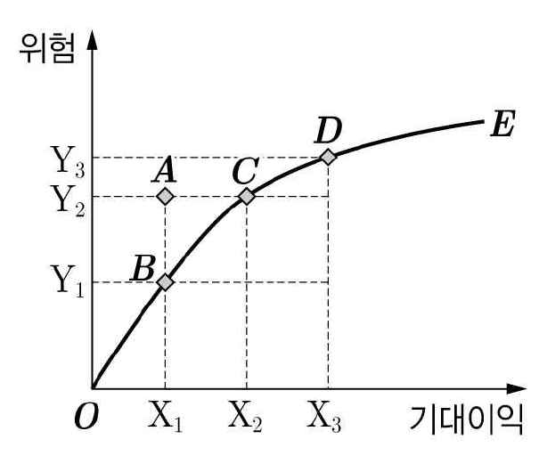
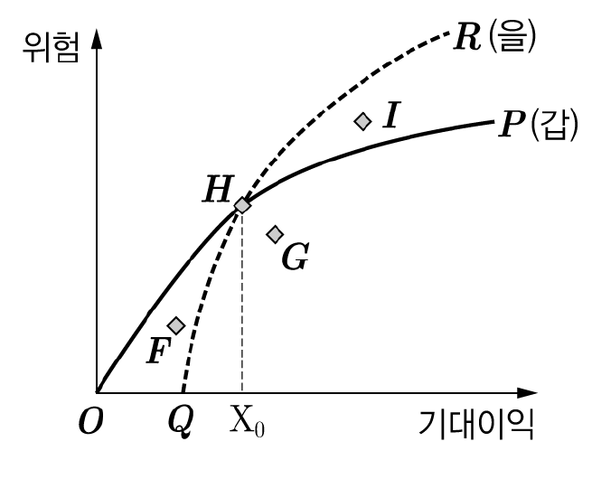

# 01 - RA (2013)

다음 글에 비추어 판단한 것으로 옳지 않은 것은?

## 제시문

<상황>

민주주의를 채택하고 있는 A국은 다수결 원칙에 따른 직접 선거로 입법부, 행정부(대통령), 사법부를 구성한다. 문서화된 헌법을 보유하고 있으며 입법부에 대한 견제의 일환으로 사법부 외에 별도의 헌법재판기관을 두어 법률이 헌법에 합치하는지를 심사하도록 하고 있다. 헌법재판기관의 구성원은 국민에 의하여 직접 선출되지 않으며 대통령의 결정에 따라 임명되는데 종신직위를 보장받는다. 최근 A국에서는 선거를 통하여 입법부와 행정부에 있어 정권교체가 이루어졌고 이후 새로운 입법부가 다수의 개혁 법안을 통과시켰다. 하지만 구(舊)정권에 의하여 임명된 헌법재판기관의 구성원들은 이러한 법률들이 위헌이라는 결정들을 내렸다. 이에 다음과 같은 비판이 헌법재판기관에 제기되었다.

<비판>

(가) A국의 헌법재판기관의 구성은 민주주의 체제에 부합하지 않는다. 헌법재판기관이 민주적 정당성을 갖추려면 그 구성에 있어 국민의 의사가 반영되어야 한다. 정기적인 선거를 통하여 국민이 직접 헌법재판기관을 구성하고 그 구성원에 정치적 책임을 추궁할 수 있어야 헌법재판기관은 민주적 정당성을 갖출 수 있다.

(나) A국의 헌법재판기관은 구성뿐만 아니라 활동도 민주주의 체제에 부합하지 않는다. 헌법재판기관의 심사대상은 국민이 직접 선출한 입법부의 결정인 법률이다. 국민들이 선출한 대표들의 결정이기 때문에 법률은 당연히 국민 의사의 반영이다. 이에 대하여 위헌결정을 내리는 경우 헌법재판기관은 입법부에 반영된 국민의 의사에 반대하게 되어 민주적 정당성을 갖추지 못한다.

## 선택지

(1) 헌법재판기관 구성원의 선출 방식을 직선제로 변경하는 것으로 (가)는 해소된다.

(2) 헌법재판기관이 법률들에 대하여 합헌 결정을 내렸더라도 (가)는 해소되지 않는다.

(3) (나)에 따라 헌법재판 제도 자체가 입법부에 대한 견제 수단으로 적절하지 않다고 주장할 수 있다.

(4) (나)에서는 헌법재판기관 구성과 관련된 대통령의 결정이 국민 의사의 반영이라고 이해하지 않는다.

(5) (가), (나) 모두 ‘국민의 의사’라는 용어를 다수결로 정해진 국민의 의사라는 의미로 사용하고 있다.

# 02 - RA (2013)

다음 글에 비추어 바르게 판단한 것만을 <보기>에서 있는 대로 고른 것은?

## 제시문

P국에서는 권력형 비리에 대한 검찰수사의 정치적 중립성에 관한 국민들의 불신이 팽배해짐에 따라, 검찰과는 별도로 정치적으로 민감한 사건, 권력형 범죄․비리사건에 대해 위법 혐의가 드러났을 때, 기소하기까지 독자적인 수사를 할 수 있는 독립 수사기구를 두는 제도로서 특별검사제도(특검)를 도입하여 대처하기 위한 논의가 진행되고 있다. P국에서 고려되고 있는 특검에는 특별검사의 임명방식과 특검의 대상 등을 미리 법정해 놓고 이에 해당하면 자동적으로 특검이 작동하는 상설특검과 사안별로 법률을 제정해야 하는 사안별 개별특검이 있다.

A : 특검을 도입해야 한다. 상설특검을 도입하면 정치적 의혹이 있는 사건이 있을 때 사안별로 특검법을 제정하지 않고 간편한 절차에 의해 신속하게 특검이 작동될 수 있다. 이에 반해 개별특검은 매번 특별한 법안을 만들어 실시해야 하므로 더 많은 비용과 시간이 소요된다. 상설특검이 도입되면 사안의 규모가 작아도 특검이 작동될 수 있다.

B : 특검의 필요성은 인정하지만, 특검은 검찰에 대해 정치적 중립성을 기대하기 어려운 경우에 한정하여 사안별로 실시하여야 한다. 따라서 특검의 본질상 이를 상설화하는 것은 제도의 취지에 어긋난다. 구성절차나 운영에서 상설특검이 개별특검에 비해 상대적으로 비용이 적게 들고 신속하게 이루어질 수 있음은 인정한다. 하지만 정치인이 연루된 작은 사건에 대하여 검찰이 수사를 개시하는 경우 특정 정파가 수사의 불공정성을 주장하며 검찰을 압박하기 위하여 수시로 상설특검을 사용하게 되면 중립적이어야 할 특검이 정치적으로 변질될 우려가 있다.

## 보기

ㄱ. 특별검사의 권한남용에 대한 적절한 통제수단이 없다면 A와 B는 모두 약화된다.

ㄴ. 특검이 쉽게 작동되는 경우 오히려 정치적 투쟁의 도구로 남용될 가능성이 있다면 A는 강화되고 B는 약화된다.

ㄷ. 기존의 검찰이 권력형 범죄․비리를 제대로 수사하지 못하여 발생하는 사회적 비용이 개별특검에 소요되는 비용보다 크다면 A는 약화되고 B는 강화된다.

## 선택지

(1) ㄱ

(2) ㄴ

(3) ㄱ, ㄷ

(4) ㄴ, ㄷ

(5) ㄱ, ㄴ, ㄷ

# 03 - RA (2013)

다음 글로부터 바르게 판단한 것만을 <보기>에서 있는 대로 고른 것은?

## 제시문

Z국은 A, B, C 세 인종으로 구성되어 있는데 전체 인구의 절반 가까이를 차지하여 온 A인종이 사회의 주류 세력으로서 타 인종들에 대한 배타적인 정책을 실시해 왔다. 교육에서도 A인종만의 입학을 허용하는 교육기관, 그 외의 인종만의 입학을 허용하는 교육기관, 그리고 모든 인종의 입학이 허용되는 교육기관을 분리하여 설치․운영하였다. 이후 인종 간의 통합이 강조되면서 재학생 중 A인종의 비율이 60%를 초과하는 교육기관을 대상으로 A인종의 비율이 60%를 넘지 못하도록 하는 정책을 시행하였다. 이러한 정책이 지나치게 일률적이라는 반발이 거세지자 정부는 교육기관마다 선별적으로 정책을 집행하기로 하고, 그 정책 적용의 제한기준에 대하여 법률가 갑, 을, 병에게 자문을 구하였다. 이들은 각각 아래와 같은 원칙을 제시하였다.

갑 : 이 정책은 특정 인종에 유리하도록 학생을 선발해 온 교육기관에 적용되어야 한다.

을 : 이 정책은 교육기관에 재학 중인 각 인종 학생들 모두의 학업성취도를 향상시키는 데 이바지하여야 한다.

병 : 이 정책은 교육기관에 보다 다양한 인종의 학생들이 다니는 결과를 낳아야 한다.

## 보기

ㄱ. 교육기관 P의 입학생 중 A인종의 비율이 매년 평균 78%로 유지되고 있었다. 교육기관 P가 A인종이 다른 인종에 비하여 언어능력시험성적이 높다는 사실을 발견하고 이를 학생선발에 적극적으로 활용해 왔다면, 갑의 원칙에 따를 때 교육기관 P에 위 정책이 적용된다.

ㄴ. 교육기관 Q에는 A인종만이 재학하고 있는데 B, C인종의 학생들이 전학해 올 경우 그 학생들의 학업성취도는 이전 학교에서보다 상당히 상승할 것으로 예측된다. 을의 원칙에 따르면 교육기관 Q에 위 정책이 적용된다.

ㄷ. 교육기관 R은 B, C인종의 낙후된 교육수준을 높이기 위하여 설립되어 나름대로 훌륭한 교사진과 시설을 갖추고 인종을 기준으로 B, C인종의 학생들만 선발하여 왔다. 병의 원칙에도 불구하고 교육기관 R에는 위 정책이 적용되지 않는다.

## 선택지

(1) ㄱ

(2) ㄴ

(3) ㄱ, ㄷ

(4) ㄴ, ㄷ

(5) ㄱ, ㄴ, ㄷ

# 04 - RA (2013)

다음 대화로부터 추론한 것으로 적절하지 않은 것은?

## 제시문

갑 : 아무리 권리자라고 하더라도 몇 십 년의 시간이 흐른 후에야 비로소 권리를 행사하는 것까지 허용할 수는 없어.

을 : 하지만 어쩔 수 없이 권리를 행사하지 못한 사람들도 있는데, 이러한 경우에도 오랜 시간이 지났다는 이유만으로 권리를 행사할 수 없게 하는 것은 부당하지 않아?

갑 : 물론 권리를 행사하는 것이 법률상 불가능했던 사람들에게까지 권리행사를 못하도록 하여서는 안 되겠지. 하지만 권리행사가 법률상 가능했던 사람들에게는 오랜 시간 동안 권리를 행사하지 않았고, 그동안 이러한 상황을 토대로 많은 사람들이 관련되어 우리의 사회생활이 형성되어 왔다는 점을 고려하면, 그 권리행사를 제한할 수 있다고 봐.

을 : 권리를 행사하는 것이 법률상 가능했던 경우라도 마찬가지야. 권리가 존재한다는 것 자체를 알지 못했다거나, 권리가 존재한다는 것을 알았더라도 그것을 행사하는 것이 사실상 불가능한 상태에 놓여 있었던 사람들의 권리는 보호할 필요가 있다고.

## 선택지

(1) 갑의 주장에 따르면, 인접 지역에 고층빌딩이 건축됨으로써 일조권을 침해당하게 된 사람은 아무런 권리주장 없이 일정 기간이 지나면 고층빌딩 소유자를 상대로 손해배상청구권을 행사할 수 없을 것이다.

(2) 을의 주장에 따르면, 불법구금상태에서 고문을 당한 후 정치․사회적 상황상 수십 년간 국가를 상대로 손해배상을 청구하지 않던 사람이 과거사정리위원회의 진실규명결정을 받은 후에 비로소 손해배상을 청구하는 경우 이를 인정할 수 있을 것이다.

(3) 을의 주장에 따르면, 교통사고로 인해 혼수상태에 빠진 사람은, 스스로 손해배상청구권을 행사할 수 없고 법정대리인도 없었던 경우 자신을 대신하여 손해배상청구권을 행사해 줄 법정대리인을 선임해 달라고 청구할 수도 없으므로, 실제로 법정대리인이 선임되기까지 오랜 시간이 지났더라도 그 권리를 행사할 수 있도록 해야 할 것이다.

(4) 갑의 주장에 따르더라도, 국가에 의해 자신의 재산권이 침해당하였으나 오랜 시간 동안 보상에 관한 법규정이 없어 보상을 받지 못한 사람은 이러한 법규정의 흠결이 재산권을 보장하고 있는 헌법에 합치되지 않는다는 헌법재판소의 결정이 있은 이후에는 보상청구권을 행사할 수 있을 것이다.

(5) 을의 주장에 따르더라도, AIDS가 발병한 후 자신의 병이 20년 전 투여 받은 HIV 감염 혈액제제 때문이라는 것을 알게 된 사람은 위 혈액제제를 투여한 의사 또는 위 혈액제제를 제조․공급한 자를 상대로 손해배상청구권을 행사할 수 없을 것이다.

# 05 - RA (2013)

<C국 법원의 판단>의 근거로 가장 적절한 것은?

## 제시문

<사안>

A국의 국민 X는 배우자 Y와 B국에 주소를 두고 생활하던 중 사망하였다. X의 상속재산으로는 C국 소재 부동산이 있었다. Z는 자신도 X의 상속인임을 주장하면서 C국 법원에 Y를 상대로 상속인 지위의 확인을 구하는 취지의 소를 제기하였다.

A, B, C국 모두에서 고려되어야 할 법률은 <당해 재판에 적용할 법률>과 상속법이며, <당해 재판에 적용할 법률>은 상속법에 우선하여 적용된다.

각국의 <당해 재판에 적용할 법률> 규정

A국 : 상속에 관하여는 사망자의 최후 주소지의 법률에 따른다.

B국 : 상속에 관하여는 상속재산 소재지의 법률에 따른다.

C국 : 상속에 관하여는 사망자의 본국의 법률에 따른다.

<C국 법원의 판단>

이 사건 재판에 A국의 상속법이 적용되어야 한다.

## 선택지

(1) C국의 <당해 재판에 적용할 법률>이 다른 나라의 <당해 재판에 적용할 법률>에 따르도록 하는 경우 그 다른 나라는 자국의 법률을 따라야 한다.

(2) C국은 자국의 <당해 재판에 적용할 법률>은 물론 A국, B국의 <당해 재판에 적용할 법률>에 따라 적용할 법률을 결정해야 한다.

(3) C국의 <당해 재판에 적용할 법률>에서 언급되고 있는 법률에는 다른 나라의 <당해 재판에 적용할 법률> 자체는 포함되지 않는다고 해석해야 한다.

(4) C국의 <당해 재판에 적용할 법률>이 다른 나라의 <당해 재판에 적용할 법률>에 따르도록 하는 경우 재판을 하는 C국 법원은 그 다른 나라의 <당해 재판에 적용할 법률>을 따라야 한다.

(5) C국의 <당해 재판에 적용할 법률>에 따른 결과가 다시 C국의 법률을 적용하도록 명하는 경우 C국의 <당해 재판에 적용할 법률>은 적용하지 않는 것이 타당하다.

# 06 - RA (2013)

다음으로부터 바르게 추론한 것만을 <보기>에서 있는 대로 고른 것은?

## 제시문

<사실관계>

A국과 B국은 지역안보조약을 체결하면서 지역 내 C국과 D국에도 안보적 지원을 하되 약소국인 C국이 요청하는 경우 무상으로 지원을 제공하는 조항(a조항)과 자원 부국인 D국이 그 비용의 일부를 부담하도록 하는 조항(b조항)을 규정하였다. 이 과정에서 C국은 명시적으로는 동의하지 않았으나 해당 조약의 내용은 인지하고 있었다. 그리고 D국은 C국에 대한 지원 비용을 A, B, D 3국 간에 균등하게 분배하는 것을 내용으로 하는 b조항에 서면으로 동의하였다.

<조약에 관한 법적용을 규정하는 협약>

제35조 (제3국의 의무 또는 권리의 발생)

1. 조약은 원칙적으로 조약 당사국이 아닌 제3국에 대해서는 그 국가의 동의 없이 의무 또는 권리를 창설하지 아니한다.

2. 조약 당사국이 조약을 통해 제3국에게 의무를 설정하고, 해당 제3국이 서면으로 그 의무를 명시적으로 수락하는 경우에는 해당 제3국에게 의무가 발생한다.

3. 조약 당사국이 조약을 통해 제3국에게 권리를 부여하고, 해당 제3국이 이에 동의하는 경우에는 해당 제3국에게 권리가 발생한다. 다만, 제3국의 동의는 반대의 표시가 없는 동안 있은 것으로 추정된다.

제37조 (제3국의 의무 또는 권리의 취소 또는 변경)

1. 제35조에 따라 제3국에게 의무가 발생된 때에는 그 의무는 조약 당사국과 제3국의 동의를 얻는 경우에만 취소 또는 변경될 수 있다.

2. 제35조에 따라 제3국에게 권리가 발생된 때에는 그 권리는 제3국의 동의 없이도 조약 당사국에 의하여 취소 또는 변경될 수 있다.

## 보기

ㄱ. 조약의 b조항은 D국에게 의무를 창설한다.

ㄴ. 조약 체결 당시 C국이 조약의 a조항에 반대의 의사표시를 하더라도 조약의 a조항은 유효하다.

ㄷ. C국의 동의가 없어도 조약의 a조항에 따라 발생된 권리는 조약 당사국에 의해 변경될 수 있다.

ㄹ. D국의 동의가 없어도 조약의 b조항에 따라 발생된 의무는 조약 당사국에 의해 취소될 수 있다.

## 선택지

(1) ㄱ, ㄴ

(2) ㄱ, ㄷ

(3) ㄴ, ㄹ

(4) ㄱ, ㄷ, ㄹ

(5) ㄴ, ㄷ, ㄹ

# 07 - RA (2013)

다음으로부터 추론한 것으로 옳지 않은 것은?

## 제시문

형사소송절차에서 특정인을 피고인으로 인식한 검사의 의사 이외에 그 특정인이 제3자의 이름을 도용해 공소장에 기재토록 하거나 특정인을 대신해 제3자가 법정에 위장 출석하는 경우 등 피고인을 정할 요소가 복수로 발생하는 경우가 있다. 이런 경우 A, B, C국은 다음 원칙에 의해 한 명만을 피고인으로 인정한다.

<A, B, C국 법원의 피고인 인정 절차의 원칙>

(가) A, B, C 각국은 세 가지의 피고인 인정 요소(특정인을 피고인으로 인식한 검사의 의사, 공소장에 기재된 이름, 실제 소송에서 법정에 출석한 자) 중 두 가지 요소만을 고려하며, 두 가지 요소 중 우선순위가 높은 요소 한 가지만을 사용하여 피고인으로 인정한다.

(나) A, B, C 각국은 우선순위가 높은 요소에 해당하는 자가 복수이거나 없을 경우, 차순위 요소에 해당하는 자를 피고인으로 인정한다.

(다) A, B, C 각국이 고려하지 않는 한 가지 요소는 세 나라가 모두 다르다.

<A, B, C국 법원의 처리 결과>

(1) 검사가 갑을 피고인으로 인식하였으나 공소장에는 을의 이름이 기재되어 있고 법정에는 병만 출석한 경우, A국에서는 병을 피고인으로 인정하였다.

(2) 검사가 갑을 피고인으로 인식하였으나 공소장에는 을의 이름이 기재되어 있고 법정에는 아무도 출석하지 않은 경우, A국과 B국에서는 을을 피고인으로 인정하였다.

(3) 검사가 갑을 피고인으로 인식하고 공소장에도 갑의 이름이 기재되었으나 법정에는 을만 출석한 경우, C국에서는 갑을 피고인으로 인정하였다.

## 선택지

(1) B국에서는 ‘법정에 출석한 자’를 피고인 인정 요소로 삼지 않을 것이다.

(2) 검사가 피고인으로 인식한 갑과 공소장에 기재된 을이 모두 법정에 출석한 경우, A국에서는 을을 피고인으로 인정할 것이다.

(3) 검사가 피고인으로 인식한 갑과 공소장에 기재된 을이 모두 법정에 출석하지 않고 대신 병이 출석한 경우, C국에서는 갑을 피고인으로 인정할 것이다.

(4) 검사가 피고인으로 인식한 갑과 공소장에 기재된 을이 모두 법정에 출석한 경우, C국에서는 을을 피고인으로 인정할 것이다.

(5) 검사가 갑을 피고인으로 인식하였으나 공소장에는 을의 이름이 기재되었고 법정에는 을만 출석한 경우, A국에서는 을을 피고인으로 인정할 것이다.

# 08 - RA (2013)

다음으로부터 바르게 추론한 것만을 <보기>에서 있는 대로 고른 것은?

## 제시문

<사실관계>

500여 년 전 X국에서 조전남은 본처 김씨와의 사이에 장남 조방림, 차남 조부림을, 첩과의 사이에 아들 조서자, 딸 조서녀를 두었는데, 장남 조방림에게 제사를 받들게 하고 사망하였다. 장남 조방림은 본처와의 사이에 아들 조적자, 첩과의 사이에 아들 조복해를 차례로 두고 있었는데, 조적자가 사고로 갑자기 죽자 조복해로 하여금 제사를 받들게 하고 사망하였다. 그러나 조방림의 아우 조부림은 자신의 부 조전남의 제사를 받들 권한이 조복해가 아니라 자신에게 있다고 주장하면서 조복해로부터 제사와 관련된 집과 땅을 빼앗아 갔다.

<관련규정>

본처 소생 장남이 가계를 승계하여 제사를 받든다. 본처 소생 장남이 없으면 장남 이외의 아들이, 그도 없으면 첩 소생 아들이 제사를 받들어야 한다.

## 보기

ㄱ. <관련규정>만으로는 조부림이 조방림의 제사를 받들 근거가 되지 못할 것이다.

ㄴ. <관련규정>의 ‘본처 소생 장남’이 조적자를 가리킨다면, 조부림의 행동은 정당화될 수 없을 것이다.

ㄷ. <관련규정>에 근거해서 조부림을 옹호하려는 편은 <관련규정>의 ‘장남 이외의 아들’이 조부림이라고 주장할 것이다.

## 선택지

(1) ㄱ

(2) ㄷ

(3) ㄱ, ㄴ

(4) ㄴ, ㄷ

(5) ㄱ, ㄴ, ㄷ

# 09 - RA (2013)

다음으로부터 바르게 추론한 것은?

## 제시문

<상황>

평민 A, B와 관리 C가 금주기간에 술을 마신 혐의를 받고 있었는데 각자 자백이 있어야 처벌이 가능하였다. 수사를 하기 위해 포도청 소속 X가 이들을 포박하려던 중 A가 X를 폭행하여 장출혈을 야기하였다. 수사과정에서 수사관 Y가 모두에게 “술을 마셨는지 마시지 않았는지 숨김없이 말해라!”라고 명령하자 A와 C는 술을 마셨다고 자백하였다. 하지만 나름대로 적용법률과 형량을 모두 따져 자신이 자백을 하면 『일반 형사령』 제10조에 따라 처벌될 것이라 생각한 B는 차라리 ㉡대를 맞을 것을 작심하고 아무런 말도 하지 않아 『일반 형사령』 제50조 공무집행방해죄를 범하였다. 이에 국왕은 아래 <사법관리들간의 논의>를 토대로 판단을 내리려 하고 있다.

<관련법률>

『금주에 관한 왕령』 금주기간에 술을 마신 자는 곤장 ㉠대에 처한다.

『일반 형사령』

제10조(왕령위반죄) 왕령을 위반하였을 경우 곤장 60대에 처한다.

제50조(공무집행방해죄) 공무를 담당하는 자의 명령에 저항하여 복종하지 아니하거나 파견된 사람을 폭행한 경우에는 곤장 ㉡대에 처한다. 폭행의 정도가 심하여 상해에 이르렀을 경우 20대를 가중한다.

제91조(2개의 죄) 2개의 죄를 저질렀을 경우 형을 합산하여 처벌한다.

제92조(곤장형) 곤장형은 가중 또는 감경 전 기준으로 최하 40대부터 최고 120대까지이며 10대 단위로 부과한다.

<사법관리들의 논의>

갑 : 관리와 달리 평민이 금주기간에 술을 마셨다면 『금주에 관한 왕령』에 따라 처벌해야 합니다.

을 : 아닙니다. 금주기간에 술을 마신 경우 어떻든 왕령을 위반했으니 평민, 관리 모두 『일반 형사령』 제10조 왕령위반죄에 따라 처벌해야 합니다.

갑 : 『일반 형사령』 제10조부터 제19조까지는 체계상 ‘제3장 관리들의 죄’에 포함된 조문입니다. 전에는 이를 잘못 적용하여 평민에게도 적용했기 때문에 모든 평민들이 왕령 위반시 제10조에 따라 60대를 맞는 줄 오해하고 있지만, 이제부터는 관리에게만 적용해야 합니다.

을 : 하지만 왕령위반죄 조문 어디에도 ‘관리’라는 단어가 나오지 않으므로 그러한 해석은 불가능합니다. 왕령 위반의 경우 관리뿐만 아니라 평민에게도 『일반 형사령』 제10조가 적용되어야 합니다.

갑 : 그러한 잘못된 해석으로 인하여 평민들이 어리석은 판단을 내리는 것입니다. B의 경우만 하더라도 만약 술을 마셨다고 자백했다면, 공무집행방해죄에 의해 처벌받는 것보다 유리하였을 것입니다.

## 선택지

(1) 국왕이 갑의 판단을 따르는 경우, C는 A보다 곤장을 더 많이 맞을 것이다.

(2) 국왕이 갑의 판단을 따르는 경우, B가 처음부터 술을 마셨다고 자백했다면 C와 같은 대수의 곤장을 맞을 것이다.

(3) 국왕이 을의 판단을 따르는 경우, B가 처음부터 술을 마셨다고 자백했다면 B는 C보다 곤장을 더 적게 맞을 것이다.

(4) 국왕이 을의 판단보다 갑의 판단을 따르는 경우가 A에게는 유리할 것이다.

(5) 국왕이 을의 판단보다 갑의 판단을 따르는 경우가 C에게는 유리할 것이다.

# 10 - RA (2013)

다음 논증에 대한 분석으로 옳지 않은 것은?

## 제시문

ⓐ 다른 지식에서 추론됨으로써 정당화되는 지식이 있다.

ⓑ 이러한 지식을 ‘추론적 지식’이라고 하고, 추론적 지식이 아닌 지식을 ‘비추론적 지식’이라고 하자.

ⓒ 모든 지식이 추론적 지식이라고 가정해 보자.

ⓓ 어떤 추론적 지식을 $G_1$이라고 하면, $G_1$을 추론적으로 정당화하는 다른 지식이 있다.

ⓔ 그중 어떤 것을 $G_2$라고 하면, $G_2$는 추론적 지식이다.

ⓕ $G_2$를 추론적으로 정당화하는 다른 지식이 있고, 그중 하나를 $G_3$이라고 하면 $G_3$도 추론적 지식이다.

ⓖ 이런 과정은 무한히 계속될 것이다.

ⓗ 정당화의 과정이 무한히 이어질 수는 없다.

ⓘ 정당화의 과정이 끝나려면 다른 지식을 정당화하는 어떤 지식은 비추론적 지식이어야 한다.

ⓙ 그러므로 비추론적 지식이 존재한다.

## 선택지

(1) ⓔ는 ⓒ와 ⓓ로부터 도출된다.

(2) ⓒ～ⓖ는, ⓒ의 ‘가정’이 주어지는 한, 지식을 정당화하는 과정이 끝나지 않는다는 것을 보여준다.

(3) ⓖ의 ‘과정’이 순환적일 가능성을 배제할 수 없으므로, ⓖ가 참이기 위해 무한히 많은 추론적 지식이 존재할 필요는 없다.

(4) ⓖ와 ⓗ가 충돌하므로 ⓐ도 부정되고 ⓒ의 ‘가정’도 부정된다.

(5) 이 논증이 타당하다면 ‘비추론적 지식이 없으면 추론적 지식도 있을 수 없다’는 것이 증명된다.

# 11 - RA (2013)

다음 논증의 결함을 가장 적절하게 지적한 것은?

## 제시문

우리 눈앞에 서 있는 이 피고인이 얼마 전 일어난 여성 살해 사건의 진범이라는 점은 물증과 정황을 통해서 명백히 드러났습니다. 하지만 과연 이 사람이 죽인 사람이 그 여성 한 명뿐일까요? 이 피고인이 우리가 찾던 바로 그 연쇄살인범은 아닐까요? 비록 피고인은 살인을 한 적이 단 한 번뿐이라고 말하고 있지만 말이죠. 우리 모두가 목격했듯이 피고인은 자기가 연쇄적으로 살인을 했다는 것을 아무런 감정적 동요 없이 단호하게 부인하고 있습니다. 거짓말 탐지기 앞에서도 그는 다른 피해자들을 알지 못한다고 말하면서 아무런 감정적 동요를 보이지 않았지만, ㉠ 거짓말 탐지기는 그가 거짓말을 하고 있다는 반응을 보였습니다. ㉡ 거짓말 탐지기의 결과에 전적으로 의존할 수는 없습니다. 하지만 피고인이 거짓말을 하고 있다고 거짓말 탐지기가 반응한다면 실제로 거짓말을 하고 있을 가능성이 있지요. 만약 피고인이 연쇄적으로 살인을 저지른 것이 확실한데도 자기가 연쇄살인범이라는 것을 아무런 감정적 동요 없이 단호하게 부인한다면, ㉢ 그는 극단적 유형의 사이코패스에 속한다고 보아야 합니다. 사이코패스는 일반적인 살인자와 달리 살인을 저지르는 동안에 오히려 심리적으로 안정되고 심장 박동이 느려지기까지 한다는 점이 여러 사례에서 밝혀진 바 있습니다. 살인을 경험한 극단적 유형의 사이코패스는 전혀 죄책감을 느끼지 않죠. ㉣ 피고인처럼 당연히 감정적 동요도 느끼지 않습니다. 살인을 경험한 극단적 유형의 사이코패스는 연쇄적으로 살인을 저지르기 마련입니다. 그러므로 ㉤ 피고인은 연쇄적으로 살인을 저지른 것이 분명합니다.

## 선택지

(1) ㉠과 모순되는 전제를 포함하고 있다.

(2) ㉡을 불충분한 수의 사례들로부터 일반화하여 도출하고 있다.

(3) ㉢에 인신공격적 내용을 포함하고 있다.

(4) ㉣을 입증하지 못한 채 전제로 받아들이고 있다.

(5) ㉤을 암묵적 전제로 요구하는 동시에 결론으로 도출하고 있다.

# 12 - RA (2013)

한국화학회는 <시상규칙>에 따라 학술상을 수여한다. 어느 해 같은 계절에 유기화학과 무기화학 분야에 상을 수여하였다면, 그해의 시상에 대한 진술 중 참일 수 없는 것은?

## 제시문

<시상규칙>

◦ 매년 물리화학, 유기화학, 분석화학, 무기화학의 네 분야에 대해서만 수여한다.

◦ 봄, 여름, 가을, 겨울에 수여하며 매 계절 적어도 한 분야에 수여한다.

◦ 각각의 분야에 매년 적어도 한 번 상을 수여한다.

◦ 매년 최대 여섯 개까지 상을 수여한다.

◦ 한 계절에 같은 분야에 두 개 이상의 상을 수여하지 않는다.

◦ 두 계절 연속으로 같은 분야에 상을 수여하지 않는다.

◦ 물리화학 분야에는 매년 두 개의 상을 수여한다.

◦ 여름에 유기화학 분야에 상을 수여한다.

## 선택지

(1) 봄에 분석화학 분야에 수여한다.

(2) 여름에 분석화학 분야에 수여한다.

(3) 여름에 물리화학 분야에 수여한다.

(4) 가을에 무기화학 분야에 수여한다.

(5) 겨울에 유기화학 분야에 수여한다.

# 13 - RA (2013)

다음으로부터 바르게 추론한 것만을 <보기>에서 있는 대로 고른 것은?

## 제시문

(가)～(마)팀이 현재 수행하고 있는 과제의 수는 다음과 같다.

(가)팀 : 0

(나)팀 : 1

(다)팀 : 2

(라)팀 : 2

(마)팀 : 3

이 과제에 추가하여 8개의 새로운 과제 a, b, c, d, e, f, g, h를 다음 <지침>에 따라 (가)～(마)팀에 배정한다.

<지침>

◦ 어느 팀이든 새로운 과제를 적어도 하나는 맡아야 한다.

◦ 기존에 수행하던 과제를 포함해서 한 팀이 맡을 수 있는 과제는 최대 4개이다.

◦ 기존에 수행하던 과제를 포함해서 4개 과제를 맡는 팀은 둘이다.

◦ a, b는 한 팀이 맡아야 한다.

◦ c, d, e는 한 팀이 맡아야 한다.

## 보기

ㄱ. a를 (나)팀이 맡을 수 없다.

ㄴ. f를 (가)팀이 맡을 수 있다.

ㄷ. 기존에 수행하던 과제를 포함해서 2개 과제를 맡는 팀이 반드시 있다.

## 선택지

(1) ㄱ

(2) ㄴ

(3) ㄱ, ㄷ

(4) ㄴ, ㄷ

(5) ㄱ, ㄴ, ㄷ

# 14 - RA (2013)

다음으로부터 바르게 추론한 것은?

## 제시문

이번 학기에 4개의 강좌 <수학사>, <정수론>, <위상수학>, <조합수학>이 새로 개설된다. 수학과장은 강의 지원자 A, B, C, D, E 중 4명에게 각 한 강좌씩 맡기려 한다. 배정 결과를 궁금해 하는 A～E는 다음과 같이 예측했다.

A : “B가 <수학사> 강좌를 담당하고 C는 강좌를 맡지 않을 것이다.”

B : “C가 <정수론> 강좌를 담당하고 D의 말은 참일 것이다.”

C : “D는 <조합수학>이 아닌 다른 강좌를 담당할 것이다.”

D : “E가 <조합수학> 강좌를 담당할 것이다.”

E : “B의 말은 거짓일 것이다.”

배정 결과를 보니 이 중 한 명의 진술만 거짓이고, 나머지는 참임이 드러났다.

## 선택지

(1) A는 <수학사>를 담당한다.

(2) B는 <위상수학>을 담당한다.

(3) C는 강좌를 맡지 않는다.

(4) D는 <조합수학>을 담당한다.

(5) E는 <정수론>을 담당한다.

# 15 - RA (2013)

다음으로부터 바르게 추론한 것만을 <보기>에서 있는 대로 고른 것은?

## 제시문

신입사원 선발에서 어학능력, 적성시험, 학점, 전공적합성을 각각 상, 중, 하로 평가하여 총점이 높은 사람부터 선발하기로 하였다. 합격선에 있는 동점자는 모두 선발하기로 하고, 상은 3점, 중은 2점, 하는 1점을 부여하였다. 지원자 A, C, D의 평가 결과는 다음과 같았다.

|  | 어학능력 | 적성시험 | 학점 | 전공적합성 |
|---|---|---|---|---|
| A | 중 | 상 | 중 | 상 |
| C | 상 | 중 | 상 | 상 |
| D | 하 | 하 | 상 | 상 |

문서 전달의 실수로 인사 담당자에게 B의 평가 결과가 알려지지 않았다. 그 대신에 다음 사실이 알려졌다.

◦ B가 선발되지 않고 C가 선발된다면, A는 선발된다.

◦ D가 선발되지 않을 경우, 나머지 세 명의 지원자는 선발된다.

## 보기

ㄱ. A와 C는 반드시 선발된다.

ㄴ. 두 명을 선발하는 경우가 있다.

ㄷ. B는 상, 중, 하로 평가 받은 영역이 최소한 하나씩은 있다.

## 선택지

(1) ㄱ

(2) ㄴ

(3) ㄱ, ㄷ

(4) ㄴ, ㄷ

(5) ㄱ, ㄴ, ㄷ

# 16 - RA (2013)

다음으로부터 바르게 추론한 것만을 <보기>에서 있는 대로 고른 것은?

## 제시문

4개의 부서 A, B, C, D의 업무 역량을 평가하기 위해서 두 부서끼리 빠짐없이 한 번씩 서로 비교하려 한다. 이 업무 역량 평가는 매 평가마다 서로 다른 요인을 평가하기 때문에 평가 결과끼리는 서로 영향을 주지 않는다. 예를 들어, A가 B보다 우월하고 B가 C보다 우월하더라도 A가 C보다 반드시 우월하다고 할 수 없다. 두 부서의 업무 역량에 우열이 드러나면, 업무 역량이 더 나은 부서에 5점, 상대 부서에 0점을 부여한다. 두 부서의 업무 역량이 서로 동등하다고 평가되면, 두 부서 모두에 2점씩 부여한다. 평가 결과는 다음과 같았다.

A : 7점

B : 7점

C : 4점

D : 10점

## 보기

ㄱ. A와 C의 비교에서 두 부서는 동등하다고 평가되었다.

ㄴ. B와 D의 비교에서 B가 더 나은 평가를 받았다.

ㄷ. A와 B의 비교에서 A가 더 나은 평가를 받았다는 정보를 추가하면 우열 관계에 대한 나머지 모든 결과를 알 수 있다.

## 선택지

(1) ㄱ

(2) ㄴ

(3) ㄱ, ㄷ

(4) ㄴ, ㄷ

(5) ㄱ, ㄴ, ㄷ

# 17 - RA (2013)

<주장>과 <상황>으로부터 바르게 추론한 것만을 <보기>에서 있는 대로 고른 것은?

## 제시문

<주장>

A : 최소한 체험적 이익(experiential interest)을 기대할 수 있다면 생명은 존중되어야 한다. 체험적 이익이란 어떤 행위를 통하여 느끼는 좋음이나 얻게 되는 만족을 말한다. 예컨대 먹거나 자거나 음악을 듣거나 숲을 산책하면서 느끼는, 경험에서 오는 만족이나 즐거움 등이 이에 속한다.

B : 생명가치의 존중은 자기결정권을 바탕으로 이루어져야 한다. 그런데 자기결정권을 행사할 수 없는 환자의 경우에는, 환자의 평소 가치관이나 신념들에 비추어 자기결정권 행사가 가능했었다면 그가 하였을 의사결정을 추정하여 대리 의사 결정자가 환자의 자기결정권을 대신 행사할 수 있다. 만일 환자의 의사를 추정할 수 없다면 타인은 환자의 죽음을 앞당기는 결정을 해서는 안 된다.

C : 생명을 무조건 보존하는 것이 곧 생명에 대한 존중이라고 생각하는 것은 잘못이다. 생명은 인간 존엄성과 관련된 결정적 이익(critical interest)이 있거나 이를 기대할 수 있는 경우에 한하여 보호할 가치가 있다. 인간 존엄성은 개인의 정체성이나 삶의 정합성과 깊은 관련이 있다. 우리는 좋은 삶의 모습이 어떤 것인지에 대한 신념과 함께 그것을 이루고자 하는 소망을 가지고 있다. 우리는 자신의 삶이 그러한 신념들과 일관된 경험이나 성취들로 채워지기를 원하며, 그것들과 어긋나는 방식으로 삶이 끝나기를 원하지 않는다. 결정적 이익은 환자의 인격에서 비롯되므로 타인은 환자의 결정적 이익을 새롭게 만들어 낼 수 없으며, 이미 존재하는 결정적 이익이 있을 경우 이를 보호하는 결정을 내릴 수 있을 뿐이다.

<상황>

(1) 갑은 비정상적으로 뇌가 작고 뇌에 액체가 지나치게 많으며 척추가 심하게 튀어나오는 등 많은 신체적 결함을 가지고 태어났다. 즉시 수술을 하지 않으면 생명이 유지될 수 없다. 수술을 받으면 20대까지 생존할 가능성은 있다. 자각적 인지 능력은 기대할 수 없지만, 기초적인 쾌ㆍ불쾌만을 느끼며 타인에 의존하여 살아가는 것은 가능하다.

(2) 을은 알츠하이머 병 진단을 받고, 치매가 심각해지면 폐렴 등의 진단을 받더라도 어떤 치료도 받지 않겠다는 사전의료지시서를 남겼다. 그 후 을은 병세가 악화되어 가족도 알아볼 수 없는 지경에 이르러 애초의 희망과 달리 “배고프다.”, “목마르다.”라고 말하며 생에 대한 애착을 보였다. 그런데 을은 갑작스러운 교통사고로 현재는 혼수상태에 있지만, 수술을 하면 생명 유지와 의식 회복은 가능한 상태이다.

## 보기

ㄱ. A와 B는 상황(2)에서 수술 여부에 대하여 다르게 판단할 것이다.

ㄴ. B와 C는 상황(1)에서 수술 여부에 대하여 동일하게 판단할 것이다.

ㄷ. C는 상황(1)과 상황(2)에서 수술 여부에 대하여 동일하게 판단할 것이다.

## 선택지

(1) ㄱ

(2) ㄴ

(3) ㄱ, ㄷ

(4) ㄴ, ㄷ

(5) ㄱ, ㄴ, ㄷ

# 18 - RA (2013)

<판단>과 <원칙>에 대한 진술로 옳은 것만을 <보기>에서 있는 대로 고른 것은?

## 제시문

<판단>

A : 암환자의 극심한 고통을 감소시킨다는 좋은 결과를 위해 모르핀을 투여하는 행위는 기대수명을 단축하는 나쁜 결과를 낳을 수 있다. 다른 진통제의 효과가 없는 상황에서 암환자가 죽음이 임박한 상태라면 모르핀 투여 행위가 도덕적으로 허용될 수 있지만, 완치 확률이 높은 상태라면 도덕적으로 허용될 수 없다.

B : 생명을 구한다는 좋은 결과를 위해 신체 일부를 절단하는 행위는 불구가 된다는 나쁜 결과를 낳는다. 신체 일부를 절단하지 않으면 죽음에 이르게 될 확률이 대단히 높은 상황에서 신체 일부를 절단하는 행위는 도덕적으로 허용될 수 있지만, 약물치료를 통해 죽음을 피할 확률이 신체 일부를 절단해서 죽음을 피할 확률과 비슷하다면 도덕적으로 허용될 수 없다.

C : 어린이를 구하기 위해 달리는 자동차 앞으로 뛰어드는 행위는 어린이의 생명을 구한다는 좋은 결과를 의도한 행위이지만, 자신이 부상을 입거나 목숨을 잃는다는 나쁜 결과의 가능성도 있다. 급박한 상황에서 어린이를 구하기 위해 달리는 자동차 앞으로 뛰어드는 행위는 도덕적으로 허용될 수 있지만, 동일한 상황에서 어린이가 아니라 유기견을 구하기 위해 뛰어드는 행위는 도덕적으로 허용될 수 없다.

<원칙>

$p$ : 의도된 좋은 결과가 일어날 확률이 예상되는 나쁜 결과가 일어날 확률보다 높아야 도덕적으로 허용될 수 있다.

$q$ : 의도된 좋은 결과를 달성하면서 예상되는 나쁜 결과를 피할 수 있는 대안이 없어야 도덕적으로 허용될 수 있다.

$r$ : 의도된 좋은 결과가 예상되는 나쁜 결과를 감수할 정도로 더 높은 가치를 가져야 도덕적으로 허용될 수 있다.

## 보기

ㄱ. A에서 도덕적 허용 가능성의 차이를 낳는 원칙은 $r$이다.

ㄴ. B에서 원칙 $p$는 적용되지 않았다.

ㄷ. C에서 도덕적 허용 가능성의 차이를 낳는 원칙은 $q$이다.

## 선택지

(1) ㄱ

(2) ㄷ

(3) ㄱ, ㄴ

(4) ㄴ, ㄷ

(5) ㄱ, ㄴ, ㄷ

# 19 - RA (2013)

다음 논쟁에 대한 평가로 적절하지 않은 것은?

## 제시문

갑 : 법은 사회계약의 산물이다. 그런데 누가 자신의 생명을 빼앗을 수 있는 법에 동의하겠는가? 그 누구도 사형 받기를 의도하지 않는다. 사회계약은 각자가 자유의 최소한을 양도하여 법적 강제력을 형성하는 것인데, 사형은 자유의 최대한을 내놓으라고 강제하는 것이다. 그런 이유로 사회계약에 사형을 포함하는 것은 모순이다. 따라서 사형은 법에 의해 정당화될 수 없다.

을 : 사형 받기를 의도했기 때문이 아니라 의도적으로 사형 당할 만한 행위를 실행했기 때문에 사형을 당하는 것이다. 법을 규정하는 공동입법자로서의 나는 그 법에 따라 처벌받는 나와 구별되어야 한다. 그래서 범죄자로서의 개별적 나는 비록 처벌받기를 원치 않는다 하더라도 공동입법자로서의 나, 즉 보편적 인간성으로서의 나는 처벌을 명해야 한다. 처벌은 범죄자가 갖고 있는 보편적 인간성에 대한 존중이기 때문이다.

병 : 사형을 통해 죽는 것은 범죄자 개인뿐만 아니라 범죄자 안에서 처벌을 명하는 범죄자의 보편적 인간성이기도 하다. 보편적 인간성을 존중하는 일이 동시에 그것을 죽이는 것이라면 이는 모순이다. 범죄자의 보편적 인간성은 희생되어서는 안 되고 오히려 도덕적 자기반성을 위해 유지되어야 한다.

## 선택지

(1) “사회계약에 참여하는 사람들은 자신이 사형당할 만한 죄를 저지를 가능성을 염두에 두지 않는다.”라는 주장은 갑의 논지를 강화한다.

(2) “살인범이 살인을 통해 자신의 인격도 침해되었다는 것을 깨닫는다면 그는 명예롭게 사형을 택할 것이다.”라는 주장은 갑의 논지를 약화한다.

(3) “살인을 함으로써 보편적 인간성을 희생시킨 범죄자는 자신의 보편적 인간성도 이미 죽인 것이다.”라는 주장은 병의 논지를 약화한다.

(4) “신체의 소멸을 통해서 보편적 인간성을 회복할 수 있다.”라는 주장은 을의 논지를 강화하고 병의 논지를 약화한다.

(5) “개별적 인간들에 공통적으로 귀속되는 것으로 여겨지는 보편적 인간성이란 허구일 뿐이다.”라는 주장은 을과 병의 논지를 모두 약화한다.

# 20 - RA (2013)

글쓴이의 시각에서 <갑의 주장>을 비판한 진술로 가장 적절한 것은?

## 제시문

전족이란 여성의 발을 옥죄어 기형적으로 작게 만드는 관습으로 10세기 후반 중국에서 시작되어 20세기 초까지 존속했다. 일부 지배층에서 시작된 전족은 시간이 흐를수록 서민층에도 파급되었다. 이러한 현상을 이해하기 위해서는 전족을 당시 여성문화의 문제로 위치시키고 전족을 경험했던 사람들의 시선, 즉 내부자의 시선에서 바라볼 필요도 있다. 이때 여성이라 함은 남녀의 생리적 차이를 말하는 성(sex)이 아니라 특정한 역사적 국면에서 사회문화적으로 구성되는 역할인 젠더(gender)로서의 여성을 말한다. 전족 관습이 남아 있던 시절 남성은 전족의 아름다움을 찬미하고 여성의 성적인 매력을 높여 준다는 점에서 전족을 찬양했다. 이는 여성을 생활의 동반자가 아닌 쾌락의 제공자 내지 관상물로 인식했음을 의미한다. 19세기 후반 서양 선교사나 서구 문물의 영향을 받은 남성 지식인들이 전족을 미개의 상징이자 가부장적 사회의 봉건적 악습으로 비판했지만, 이 역시 외부자의 시선에서 전족을 보았다는 점에서는 동일하다. 당시 여성의 입장에서 전족은 생산 노동으로부터의 자유를 의미하였고, 도시의 세련됨과 부유한 생활의 상징이었다. 본인의 인내력과 정숙도, 그리고 가정교육의 정도를 반영해주는 것으로 여겨졌으며, 전족 경연대회가 말해주듯 전족은 당시 여성이 동경하던 이상이었다. 상류층의 여성들은 전족을 완성한 후에 전족을 하지 않는 여성들 위에 군림했다. 전족이 쇠퇴의 운명에 처하게 되었을 때 전족한 여성들은 주어진 ‘해방’을 기쁘게 받아들이지만은 않았고 자신의 ‘낙오된 발’에 절망하기도 했다. 전족에 관한 한 그 당시 여성은 피해자이면서 적극적인 행위자이기도 했던 셈이다.

<갑의 주장>

최근의 드라마나 쇼에는 작고 갸름한 얼굴, 잘록한 허리, 가는 팔과 긴 다리를 가진 젊은 여성이 짧은 치마와 하이힐 차림으로 등장한다. 많은 여성들이 이러한 모습을 닮기 위하여 고통스러운 다이어트를 감내하고 성형수술도 받는다. 그러나 여성들이 추구하는 이러한 아름다움에는 여성을 성적 대상으로 치부하는 남성의 시선이 투영되어 있으며, 그 이면에는 성을 상품화하는 문화산업의 자본 논리가 작동하고 있다. 이는 자연스러운 아름다움에 대한 건강한 인식을 왜곡한다.

## 선택지

(1) 자연스러운 아름다움을 여성이 추구해야 할 또 다른 이상으로 제시하는 것에 불과하므로 적절하지 않다.

(2) 왜곡된 남성의 시선이 아니라 오히려 그 피해자인 여성을 문제 삼고 있으므로 적절하지 않다.

(3) 가냘픈 외모가 여성이 자신을 실현하는 하나의 방식임을 간과하고 있으므로 적절하지 않다.

(4) 여성을 바라보는 남성의 시선이 왜곡되었음을 전제하고 있으므로 적절하지 않다.

(5) 젠더가 아닌 성의 구분으로서의 여성에 관한 것이므로 적절하지 않다.

# 21 - RA (2013)

(가)～(다)의 분석으로 옳지 않은 것은?

## 제시문

(가)

소크라테스 : 라케스여! 용기는 무엇인가요?

라케스 : <u>㉠ 용기는 영혼의 끈기입니다.</u>

소 : 당신은 용기가 아름다운 것들 가운데 하나라고 생각하시지요?

라 : 가장 아름다운 것들 중의 하나라고 생각합니다.

소 : 그런데 똑똑한 끈기가 아름답고 훌륭하지 않을까요?

라 : 그야 물론입니다.

소 : 똑똑하지 못한 끈기는 어떨까요? 앞의 것과 반대로 나쁜 결과를 낳고 해롭지 않을까요?

라 : 네.

소 : 그러면 당신은 나쁜 결과를 낳고 해로운 것이 아름답다고 말하시렵니까?

라 : 아뇨, 그것은 옳은 말이 아닙니다.

소 : 그렇다면 적어도 그런 종류의 끈기가 용기라고는 동의하시지 않겠네요? 용기는 아름다우니까요.

라 : 맞는 말씀입니다.

소 : 따라서 당신 말에 따르면 <u>㉡ 용기는 똑똑한 끈기가 되겠네요.</u>

라 : 그럴 것 같네요.

(나)

소 : 그럼 봅시다. 돈을 투자함으로써 돈을 더 많이 벌게 되리라는 것을 알기에 똑똑한 방식으로 끈기 있게 계속 투자를 하는 사람은 어떤가요? 이 자를 용감한 사람이라고 당신은 부르나요?

라 : 맙소사! 절대로 그렇게 부르지 않죠.

소 : 환자가 먹을 것을 달라고 간청하지만, 의사는 지금 주면 건강에 해롭다는 것을 알고 있기에 굽히지 않고 끈기 있게 거절합니다.

라 : 이것도 역시 결코 용기가 아니죠.

(다)

소 : 이제 다른 경우를 봅시다. 두 사람의 군인이 있습니다. 한 사람은 똑똑한 계산 하에서, 즉 자신의 부대에 지원군이 올 것이라는 점 그리고 지금 자신의 군대가 더 유리한 지형을 점하고 있다는 것을 알면서 끈기 있게 버팁니다. 반면에 다른 한 사람은 반대편 군대에서 머물며 온갖 어려움 속에서 끈기 있게 버티면서 싸우고자 합니다. 누가 더 용감한가요?

라 : 소크라테스여! 후자가 더 용감합니다.

소 : 그렇지만 후자의 끈기는 전자의 끈기에 비교할 때 어리석은 것입니다.

라 : 맞습니다.

- 플라톤, 『라케스』 -

## 선택지

(1) (가)에서 용기에 대한 라케스의 정의는 ㉠에서 ㉡으로 가면서 외연이 줄어들었다.

(2) (나)에서 소크라테스는 ㉡에 대한 반례를 제시하고 있다.

(3) (나)에서 라케스가 동의한 내용에 따라 용기를 다시 정의한다면 그 정의는 ㉡보다 외연이 줄어들 것이다.

(4) (다)에서 라케스가 대답한 내용은 ㉠과 양립할 수 없다.

(5) (다)에서 라케스가 동의한 내용은 ㉡과 충돌한다.

# 22 - RA (2013)

(가)～(바)의 분석으로 옳지 않은 것은?

## 제시문

(가)

그대가 다음 실수를 피하기를 나는 진심으로 바라노라.
즉 우리 눈은 보기 위해 창조된 것이며
또 우리 다리는 직립보행을 하도록
그렇게 생긴 것이라고 그대가 생각하지 말기를.

(나)

사람들이 내세우는 이런 주장들은
모두가 뒤집힌 추론으로 인해 앞뒤가 뒤바뀌어 있다.
왜냐하면 우리 몸에서 사용을 목적으로 생겨난 것은
아무것도 없고, 생겨난 그것이 용도를 창출하기 때문이다.

(다)

눈이 생겨나기 전에는 본다는 것은 없었고,
혀가 생기기 전에는 단어로써 말한다는 것은 없었다.
오히려 혀의 시초가 말보다 훨씬 앞서 있으며,
소리가 들리기 오래 전에 귀가 생겨났고,
내 생각으로는 우리의 모든 신체적 지체가
그 사용보다 먼저 있었도다.
따라서 이것들은 사용되기 위해 생겨난 것일 수 없다.

(라)

빛나는 창들이 날아가기 오래 전에 이미 전투에서 맨손으로 싸웠으며,
또 잔이 생기기 훨씬 전부터 갈증을 해소해 오지 않았던가.
따라서 삶과 사용의 필요로부터 나온 것들은 모두
사용을 위해 발명된 것으로 믿을 수 있다.

(마)

그러나 자신이 홀로 먼저 생겨나고
나중에 사용에 관한 개념을 낳은 것들은
이것들과는 완전히 다른 부류에 속한다.

(바)

따라서 반복하노니, 우리의 감각기관들과 지체들이
그 사용을 위해서 창조되었다고
그대가 믿을 만한 이유가 전혀 없도다.

- 루크레티우스, 『사물의 본성에 관하여』 -

## 선택지

(1) (가)는 논증이 비판하고자 하는 견해를 제시하고 있다.

(2) (나)는 논증이 비판하고자 하는 견해가 인과 관계를 잘못 파악하고 있음을 지적하고 자신이 논증할 견해를 제시하고 있다.

(3) (다)는 발생과 사용의 시간적 선후 관계를 이용해서 논증하고 있다.

(4) (라)는 논증이 비판하고자 하는 견해가 설득력을 갖는 대상 영역을 제시하고 있다.

(5) (마)는 (다)와 (라)가 양립할 수 없음을 지적함으로써 (바)가 옳음을 논증하고 있다.

# 23 - RA (2013)

A～D에 대한 진술로 옳지 않은 것은?

## 제시문

A : 강한 네트워크란 서로 간에 자주 만나며 많은 정보를 교환하고 정서적으로 친밀한 소수의 집단을 지칭한다. 대표적으로 가족, 친한 친구 등을 예로 들 수 있다. 강한 네트워크는 사람들의 삶에 많은 영향을 미치며, 취업 등과 같은 경우에도 실질적인 도움이 된다.

B : 취업동아리에 소속된 대학생들은 자주 만나 외국어 시험, 학점 취득, 취업 시험 등을 위해 함께 공부하고 많은 양의 취업 관련 정보를 공유함으로써 취업 준비의 효율성을 높여 취업 가능성을 높인다. 이들은 취업 준비라는 공식적인 목표를 위해 만났지만 신뢰관계가 형성되어 서로 정서적으로도 의존하는 가까운 사이가 되는 경향이 있다.

C : 취업동아리 회원들이 많은 정보를 공유하고 회원들 간에 친밀한 관계가 형성된다는 것은 인정한다. 하지만 학생 신분으로는 취업 기회를 얻는 데 실질적으로 도움이 될 만한 구인 정보를 특정 업계나 회사로부터 얻기 어렵다. 취업동아리가 공유하는 정보는 일반에게 공개된 정보를 재정리한 정도의 것이므로 취업 기회를 찾는 것과 거리가 있다. 또한 같은 분야를 희망하는 학생들이 모인 취업동아리의 경우, 그들이 공통으로 희망하는 기업체의 구인 정보를 접하는 순간 그들의 관계는 경쟁적으로 돌변하기도 한다. 오히려 어쩌다 한 번 방문할 뿐이지만 다양한 회사의 구인 정보를 가지고 있는 대학의 취업지원센터에서 자신의 희망과 상황에 맞는 회사들의 취업 정보 등을 얻는 경우가 많다.

D : 친한 친구는 이미 서로 잘 알고 있기 때문에 취업의 상황에서는 더 이상 실질적인 도움을 주고받지 못한다. 오히려 취업 기회를 찾는 데는 강한 네트워크보다 약한 네트워크가 더 큰 도움이 된다. 약한 네트워크는 접촉의 빈도가 낮고 정보의 교환도 많지 않지만, 느슨한 관계를 통해서 여러 집단을 연결하거나 확산시키는 위치에 있기 때문에 정보의 취득에 강점을 지닌다.

## 선택지

(1) A와 C는 강한 네트워크가 취업에 도움이 되는 정도에 대해서 다른 주장을 하고 있다.

(2) “병(病) 자랑은 하여라.”라는 속담의 취지는 A보다 D에 더 적합하다.

(3) B와 C는 취업동아리에서 얻는 취업 정보의 내용과 질에 대해 다르게 판단한다.

(4) 객관적이고 투명한 공채 시험만으로 취업할 수 있는 분야를 준비하는 취업동아리의 사례는 C보다 B에 더 적합하다.

(5) 가끔 만나는 먼 지인을 통해 취직이 성사되는 사례가 많다는 사실은 D를 강화하고 C를 약화한다.

# 24 - RA (2013)

A, B에 공통으로 필요한 전제만을 <보기>에서 있는 대로 고른 것은?

## 제시문

A : 많은 범죄예방 프로그램은 구체적인 목적을 가지고 특정한 대상(지역, 범죄유형, 시간대 등)에 한정하여 시행되며, 그 대상의 범죄감소를 목표로 한다. 하지만 범죄예방 프로그램들은 의도한 효과와 더불어 의도하지 않은 결과를 초래하기도 한다. 예를 들어, 어떤 지역에 적용된 범죄예방 프로그램으로 인해 그 지역의 범죄는 줄어들지만 동시에 그로 인해 다른 지역의 범죄가 증가하기도 한다. 야간 주거침입절도를 줄이기 위한 프로그램이 시행됨에 따라 낮 시간의 주거침입절도가 증가하기도 하며, 침입경보기를 설치하는 주택이 늘어나면 이를 설치하지 않은 주택의 범죄피해가 증가하기도 한다. 이처럼 특정 범죄예방 프로그램의 시행은 다른 지역이나 다른 표적, 혹은 다른 시간에 의도하지 않게 범죄의 증가를 가져오기도 한다. 범죄 발생이 범죄예방 활동에 반응하여 단순히 이동할 뿐이라면 전체적인 수준에서의 범죄율의 변화는 나타나지 않을 것이다.

B : 범죄자를 교도소에 구금하는 정책이 범죄자의 출소 후 재범을 막기는 어려울 수도 있지만, 적어도 교도소에 구금되어 있는 동안 그가 사회를 대상으로 범죄를 저지르는 것을 제한할 수는 있다. 나이가 많아지면 범죄를 더 이상 저지르지 않는 경우가 많기 때문에 대부분의 사람들의 범죄경력 기간은 제한된다. 따라서 한창 때의 범죄자를 교도소에 가둬 둘 경우 범죄기회를 줄일 수 있다. 범죄기회가 주어지는 기간이 짧을수록 그 기간만큼 범죄를 덜 저지르게 되고, 따라서 전체적인 범죄는 그들이 구금되지 않았다면 발생했을 만큼 감소할 것이다. 예를 들어 마약 남용자 200명이 1년 동안 교도소에 구금된다면 그들이 상당수의 범죄를 저지를 수 없어 1천 건의 노상강도, 4천 건의 주거침입절도, 1만 건의 상점절도, 3천 건 이상의 다른 범죄가 감소할 것이다.

## 보기

ㄱ. 범죄자는 필요한 정보를 사용하여 자유의지에 의해 범죄 행동을 선택할 수 있는 합리적 행위자이다.

ㄴ. 어떤 범죄자의 범행이 좌절되거나 억제되었을 때 다른 범죄자가 그 자리를 채워 범행을 하지 않는다.

ㄷ. 범죄자의 범행욕구는 비탄력적이어서 범죄자는 일정 기간 동안 일정한 정도의 범죄를 저지르도록 동기부여되어 있다.

## 선택지

(1) ㄱ

(2) ㄷ

(3) ㄱ, ㄴ

(4) ㄴ, ㄷ

(5) ㄱ, ㄴ, ㄷ

# 25 - RA (2013)

A, B와 <조건>으로부터 바르게 추론한 것만을 <보기>에서 있는 대로 고른 것은?

## 제시문

A : 표적의 매력성이란 범죄자가 범행대상(표적)을 원하는 정도, 그 대상을 가치 있다고 생각하는 정도를 의미한다. 이는 범행가능성과 범행거리(범죄자의 거주지와 범행 현장 간의 거리)를 결정할 때 고려하는 이익요소이다. 범죄자는 매력 있는 표적에 가치를 두기 때문에 그러한 표적이 있는 지역으로 이동하게 될 것이다. 범죄자가 표적의 매력성을 중시하는 정도가 강할수록 범행할 가능성이 높고, 범행을 위해서 더 먼 거리를 이동하는 경향이 있다. 매력성을 중시하는 경향은 범행의 계획성이 높을수록 그리고 전과가 많을수록 강해진다.

B : 검거위험성이란 범죄자가 범행을 결정할 때 고려하는 손해요소로서 범행가능성과 범행거리에 영향을 미친다. 범죄자들은 범행을 위해 자신의 집에서 비교적 가까운 거리를 이동하려고 하는 특성을 가지고 있지만, 자신의 집으로부터 아주 가까운 지역에서는 범행을 피하려 한다. 자신을 알아보는 사람들이 많아 범행이 발각될 가능성을 우려하기 때문이다. 따라서 범행을 가장 많이 하는 지역은 주로 범죄자의 집에서 약간 떨어진 곳에 위치하며, 범죄자의 거주지로부터 이 지점에 이를 때까지 범행의 빈도는 거리가 늘어남에 따라 증가하지만 이 지점을 넘어선 다음부터는 거리가 늘어남에 따라 범행빈도가 감소한다. 또한 범죄자는 나이가 들수록 검거위험성을 표적의 매력성에 비해 더 많이 고려하는 경향이 있으며, 검거위험성을 매우 중시하면 검거위험성이 높다고 생각하는 곳에서는 표적의 매력성이 높더라도 범행을 하지 않는다.

<조건>

◦ 다른 조건들이 동일할 때, 같은 유형의 범죄에서는 범행을 위한 이동 거리가 같다.

◦ 재산범죄는 폭력범죄보다 계획성이 높다.

◦ 범죄자는 자신의 거주지 근처의 지형에 대해 잘 알고 있다.

## 보기

ㄱ. 젊은 절도범은 같은 동네에 거주하는 나이 든 성폭행범보다 범행거리가 더 길 것이다.

ㄴ. 현재 주거지에 오래 거주한 강도범의 범행거리는 다른 동네에서 갓 이사 온 강도범의 범행거리보다 더 길 것이다.

ㄷ. 검거위험성을 매우 중시하는 두 명의 강도범 중 전과가 많은 쪽이 전과가 적은 쪽보다 보안시스템이 아주 잘 된 은행을 대상으로 범행을 저지를 가능성이 높을 것이다.

## 선택지

(1) ㄴ

(2) ㄷ

(3) ㄱ, ㄴ

(4) ㄱ, ㄷ

(5) ㄱ, ㄴ, ㄷ

# 26 - RA (2013)

다음 글에 비추어 바르게 판단한 것만을 <보기>에서 있는 대로 고른 것은?

## 제시문

우리가 의사결정을 할 때 선택의 결과가 미래에 나타나는 경우에는 선택에 따른 이익을 미리 정확히 아는 것이 불가능하다. 이때 실제로 실현된 이익이 기대했던 이익보다 작을수록 선택의 위험은 커진다. 이처럼 미래의 결과를 미리 알 수 없을 때는 기대이익과 위험을 동시에 고려해 의사결정을 해야 한다.

<그림 1>은 어떤 사람이 이러한 상황에서 여러 대안들을 놓고 어떤 선호관계를 갖는지를 보여준다. <그림 1>에서 곡선 $OE$는 위험과 기대이익의 수준이 다르더라도 이 사람이 선호의 차이가 없다고 판단하는 대안들을 연결한 선이다. 따라서 이 사람에게 $B$와 $C$는 차이가 없는 대안들이 된다. 그리고 $A$와 $B$의 관계에서는 두 대안의 기대이익은 같지만 $B$의 경우 위험이 더 작으므로 $B$가 $A$보다 선호되며, $A$와 $C$의 관계에서는 두 대안의 위험은 같지만 $C$의 경우 기대이익이 더 크므로 $C$가 $A$보다 선호된다. 따라서 어느 대안이 다른 대안에 비해 더 큰 기대이익과 더 작은 위험을 동시에 갖는다면 이 대안은 그 다른 대안보다 선호된다. 한편 곡선 $OE$는 위험에 대한 이 사람의 태도도 알려준다. 이 사람은 기대이익을 $X_2 - X_1$만큼 늘리려 할 때는 $Y_2 - Y_1$의 추가적인 위험을 감수할 의사가 있다. 그리고 이 상태에서 동일한 크기의 기대이익($X_3 - X_2$)을 추가로 늘리기 위해 감수할 의사가 있는 추가적인 위험의 크기($Y_3 - Y_2$)는 이전에 비해 작다. 이처럼 기대이익의 크기가 커질수록 감수하려는 추가적인 위험의 크기가 줄어든다는 것은 이 사람이 위험을 기피하는 정도가 커짐을 의미한다.

<그림 2>는 위험에 대한 태도가 상이한 갑과 을 두 사람이 갖고 있는 기대이익과 위험 사이의 선호관계를 동시에 나타낸 것이다. 곡선 $OP$(실선)와 $QR$(점선)은 각각 갑과 을 두 사람이 차이가 없다고 판단하는 대안들을 연결한 선이다.

<그림 1>

<그림 2>

## 보기

ㄱ. 갑은 $G$보다 $I$를 선호한다.

ㄴ. 을은 $F$보다 $H$를 선호한다.

ㄷ. 기대이익이 $X_0$보다 큰 영역에서 갑보다 을이 더 위험기피적 태도를 보인다.

## 선택지

(1) ㄱ

(2) ㄴ

(3) ㄱ, ㄷ

(4) ㄴ, ㄷ

(5) ㄱ, ㄴ, ㄷ

# 27 - RA (2013)

다음 글에 비추어 <표>를 바르게 해석한 것만을 <보기>에서 있는 대로 고른 것은?

## 제시문

K국에는 농산물 안전 관리를 위해 우수인증, 저농약인증, 유기농인증 제도가 있다. 우수인증은 농약, 중금속 등 위해 요소들이 기준치를 넘지 않게 관리한 농산물에, 저농약인증은 농약과 화학비료를 기준치의 절반 이하로 사용한 농산물에, 유기농인증은 농약과 화학비료를 전혀 쓰지 않은 농산물에 부여하는 인증이다.

아래의 <표>는 농산물 유통에 참여하는 각 주체들을 대상으로 그들이 각 유통 단계별로 거래 현장에서 실제 접하는 현재 가격과 그들이 적절하다고 생각하는 적정가격을 조사한 것인데, 숫자들은 각 유통 단계별로 일반 농산물 가격을 100으로 했을 때의 환산가격이다. 예를 들어 생산농의 경우 일반 농산물의 현재 판매가격이 2만원이고 우수인증 농산물의 현재 판매가격이 2만2천원이라면, 일반 농산물의 환산가격은 100, 우수인증 농산물의 환산가격은 110이 된다. <표>를 통해 생산농은 인증 농산물들이 적정한 가격을 받지 못하고 있다고 보며, 우수인증 농산물의 현재 판매가격에 불만이 가장 크다는 것을 알 수 있다.

<표>

<table>
  <tr>
    <th>유통 참여 주체</th>
    <th>가격</th>
    <th>일반 농산물</th>
    <th>우수인증 농산물</th>
    <th>저농약인증 농산물</th>
    <th>유기농인증 농산물</th>
  </tr>
  <tr>
    <td rowspan="2">생산농</td>
    <td>현재 판매가격</td>
    <td>100</td>
    <td>110</td>
    <td>115</td>
    <td>125</td>
  </tr>
  <tr>
    <td>적정 판매가격</td>
    <td>100</td>
    <td>122</td>
    <td>124</td>
    <td>130</td>
  </tr>
  <tr>
    <td rowspan="2">도매상</td>
    <td>현재 판매가격</td>
    <td>100</td>
    <td>105</td>
    <td>105</td>
    <td>131</td>
  </tr>
  <tr>
    <td>적정 판매가격</td>
    <td>100</td>
    <td>(가)</td>
    <td>120</td>
    <td>138</td>
  </tr>
  <tr>
    <td rowspan="2">소매상</td>
    <td>현재 판매가격</td>
    <td>100</td>
    <td>110</td>
    <td>113</td>
    <td>135</td>
  </tr>
  <tr>
    <td>적정 판매가격</td>
    <td>100</td>
    <td>112</td>
    <td>126</td>
    <td>140</td>
  </tr>
  <tr>
    <td rowspan="2">소비자</td>
    <td>현재 구매가격</td>
    <td>100</td>
    <td>110</td>
    <td>113</td>
    <td>135</td>
  </tr>
  <tr>
    <td>적정 구매가격</td>
    <td>100</td>
    <td>110</td>
    <td>112</td>
    <td>130</td>
  </tr>
</table>

## 보기

ㄱ. 소매상은 인증 농산물 중 우수인증 농산물의 현재 판매가격에 불만이 가장 크다.

ㄴ. 저농약인증 농산물과 유기농인증 농산물의 현재 가격 수준이 낮다는 데에 모든 유통 참여 주체들이 인식을 공유하고 있다.

ㄷ. 모든 유통 참여 주체들이 인증 농산물간 적정가격 서열에 대해 동일하게 판단하고 있다면 (가)에 들어갈 수 있는 숫자에 105가 포함된다.

## 선택지

(1) ㄱ

(2) ㄷ

(3) ㄱ, ㄴ

(4) ㄴ, ㄷ

(5) ㄱ, ㄴ, ㄷ

# 28 - RA (2013)

다음 글에 비추어 판단한 것으로 적절하지 않은 것은?

## 제시문

과거 영국은 파운드화의 가치를 금에 고정시키는 금본위제를 운영했다. 원하는 사람에게 은행권을 금화로 교환해주어야 할 의무가 있었던 잉글랜드은행은 파운드화 가치의 안정을 위해 은행권의 발행량을 금보유량에 원칙적으로 연계시켰다. 그런데 1797년 가뜩이나 어려운 경제상황에 프랑스 군대의 본토 침공이 임박했다는 소문까지 겹치면서 은행권을 금화로 바꿔줄 것을 요구하는 사람들이 늘어났고, 중앙은행인 잉글랜드은행은 결국 ㉠ 금태환의 한시적 정지를 선언하였다.

이후 금화가 아닌 순수한 금, 곧 지금(地金)의 시장가격과 물가가 상승함에 따라 영국 의회는 조사위원회를 구성해 그 원인을 규명하려 했다. 이때 물가상승의 원인을 금태환의 정지에서 찾았던 ‘지금파’는 ‘금보유량에 비례하는 은행권 발행’이라는 규율원리가 깨짐으로써 잉글랜드은행이 은행권을 초과발행하게 되었고 이로 인해 물가가 올라갔다는 주장을 펼쳤다. 그러나 ‘반지금파’는 은행권의 경우 상거래 과정에서 사용된 우량어음을 매입해 주거나 이들 어음을 담보로 대출해 주는 방식으로 발행되므로 모든 은행권 발행의 배후에는 상거래와 실물경제 활동이 대응된다며, 은행권의 초과발행이란 있을 수 없다고 반박했다.

그런데 논쟁 과정에서 가장 돋보였던 사람은 헨리 손턴이었다. 그는 통화정책의 우선순위를 어디에 둘 것이며, 정책목표를 어떻게 달성할 것인가에 대한 체계적인 인식을 제공함으로써 물가상승의 원인을 놓고 벌어졌던 이 논쟁을 한 차원 높게 발전시켰다. 그는 파운드화 가치 안정에만 초점을 맞춘 정책에 비판적이었고 물가상승의 원인이 통화량 증가가 아닌 다른 것일 수 있음을 인정했던 점에서는 반지금파와 입장을 같이 했다. 하지만 그는 은행에 제시된 어음의 경우 과거 생산활동의 결과는 물론 미래의 수익성에 대한 사업가들의 기대에도 좌우되므로, 호황으로 기대가 낙관적인 상황에서 모든 우량어음에 대해 은행권을 제공하는 것은 미래의 추가적인 물가상승과 경기의 팽창으로 이어질 수 있다며 규율원리의 필요성을 인정했는데, 이 점에서는 지금파로 분류될 수도 있다. 하지만 그는 불황일 때는 중앙은행이 재량권을 가지고 경기 악화에 능동적으로 대응할 수 있어야 한다는 점도 함께 강조함으로써 지금파의 일면적 인식을 뛰어넘을 수 있었다.

## 선택지

(1) ㉠에 대한 손턴의 입장은 ‘지금파’보다 ‘반지금파’에 가까웠을 것이다.

(2) 당시에 극심한 흉년으로 곡물가가 상승했다면, ‘지금파’의 논지는 약화되고 ‘반지금파’와 손턴의 논지는 강화될 것이다.

(3) 재산을 금융자산으로 보유한 사람들은 ‘지금파’를, 농산물을 판매해야 할 사람들은 ‘반지금파’의 주장을 지지했을 것이다.

(4) 은행권 발행에 관한 중앙은행의 결정을 엄격한 원리에 의해 제약할 필요성은 ‘지금파’가 가장 강하게 인정하고, 다음으로 손턴, ‘반지금파’의 순서일 것이다.

(5) 실물경제 활동이 부진한 상황에서 불황의 심화를 우려해 은행권을 사용하지 않고 보관하는 사업가들이 늘어났다면, 손턴의 논지는 약화되고 ‘지금파’의 논지는 강화될 것이다.

# 29 - RA (2013)

다음 논증에 대한 분석으로 가장 적절한 것은?

## 제시문

“‘과학의 힘’이란 사실상 ‘주술의 효력’과 비슷한 수준에서 평가될 수 있는 표현”이라고 주장하는 이들이 있다. 주술도 과학도 모두 특정 사회와 문화의 산물이라는 이유에서다. 그들은 아리스토텔레스의 운동이론보다 뉴턴의 운동이론을, 또는 창조론보다 다윈의 이론을 선호해야 할 이유를 자연 자체에서는 찾을 수 없다고 본다. 중세 유럽인이나 오스트레일리아 원주민의 자연관과 마찬가지로 과학이 제공하는 이론들도 특정 사회의 정치적, 경제적 목적과 결부된 문화적 산물일 뿐만 아니라 과학이론에 대한 평가 역시 특정한 사회적 배경의 제약을 벗어날 수 없다는 것이다. 그러나 과학과 사회의 관계에 관한 이런 주장은 두 가지 점에서 타당하지 않다. 먼저, 문학이나 예술과 마찬가지로 과학 역시 특정한 사회적 환경 속에 존재하는 개인이나 집단에 의해 산출되지만, 과학은 그런 개인의 특성이나 사회 환경에 의해 속박되지 않는다. 『햄릿』이나 ｢B단조 미사｣는 셰익스피어와 바흐가 없었더라면 영원히 존재하지 않았겠지만 과학은 이와 다르다. 뉴턴이 어려서 죽는 바람에 1687년에 『프린키피아』가 저술되지 않았다고 해도 필시 다른 누군가가 몇 년 혹은 늦어도 몇 십 년 뒤에 그 책에 담긴 역학의 핵심 내용, 즉 보편중력의 법칙과 운동 3법칙에 해당하는 것을 발표했을 것이다. 여러 명의 과학자가 같은 시기에 서로 독립적으로 동일한 과학적 발견에 도달하는 동시발견의 사례들이 이를 간접적으로 입증한다. 또 과학적 발견을 성취해 낸 과학자가 지닌 고유한 품성은 설령 그것이 그 발견에 중요한 역할을 한 경우라 해도 그 성과물이 일단 그의 손을 떠나고 난 뒤에는 과학자들의 연구 활동에 아무런 영향도 미치지 않는다. 둘째로, 근대 이후 과학이 확산된 모습을 보라. 16세기 이후 최근에 이르기까지 실질적으로 모든 과학적 발견은 유럽 문명의 울타리 안에서 이루어졌지만 그 열매인 과학 이론은 전 세계에 확산되어 활용되고 있다. 모든 문화권이 이렇게 과학을 수용한 것과 대조적으로 유럽의 정치체제나 종교나 예술이 그처럼 보편적으로 수용된 것은 아니다. 과학은 특정한 개인들이 특정한 문화 속에서 만든 것이지만 이처럼 개인과 문화를 초월하는 보편적인 것이다. 과학 이외에 이런 특성을 지니는 것은 없는 듯하다.

## 선택지

(1) 뉴턴의 과학적 성과가 역학의 몇몇 핵심 법칙에 국한되지 않고 『프린키피아』에 나타난 문체와 탐구정신 같은 요소들까지 포함한다고 보면 논증의 설득력은 커진다.

(2) 글쓴이는 과학과 사회적 배경의 관계를 평가할 때 과학 이론이 탄생하는 과정보다 그 이론이 수용되고 사용되는 맥락이 더 중요하다고 전제하고 있다.

(3) 유럽의 정치체제나 사회사상이 유럽의 과학보다 먼저 세계의 다른 지역에 전파된 경우가 확인된다면 논증의 설득력은 약화된다.

(4) 글쓴이는 과학적 업적의 탄생 과정에 과학자의 개인적 특성이나 문화적 환경은 영향을 미치지 않는다고 전제하고 있다.

(5) 과학에서 동시발견이 이루어진 사례들이 특정 문화권에 국한되어 있음이 입증되는 경우 논증의 설득력은 커진다.

# 30 - RA (2013)

(가), (나)에 대한 평가로 적절하지 않은 것은?

## 제시문

(가) 법원이 허용할 수 있는 과학적 증거는 관련 과학자 집단 내에서 일반적으로 승인된 것이어야 한다. 특정 과학적 주장이 승인될 만한 것인지의 여부는 관련 과학자 집단의 논의를 거쳐서만 올바르게 평가될 수 있다. 과학자들은 특정 주장을 사실로 인정할 것인지 여부를 오랜 시간 비판적으로 검토하면서 자연스럽게 가능한 모든 반론을 따져 보게 된다. 이 과정에서 나중에 법정에서 원고와 피고 양측이 제기할 수 있는 쟁점이 효과적으로 미리 검토될 수 있다. 그러므로 법원은 과학적 증거의 채택 기준에 있어 관련 과학자 집단의 판단을 따름으로써 기준의 일관성과 증거의 신뢰성을 확보할 수 있다.

(나) 특정 사실 주장이 과학적 타당성을 갖는지 여부는 그것이 관련 과학자 집단에서 합의된 과학적 방법을 올바르게 적용하여 얻어졌는지에 의해 결정된다. 그러므로 법관은 법정에 제출된 사실 주장의 과학적 타당성을 과학적 방법의 기준을 적용하여 스스로 결정할 수 있다. 그런 다음 법원은 과학적 타당성을 갖는 것으로 판단한 사실 중에서 당해 사건의 실체적 진실 규명과 법적 판단에 도움을 줄 수 있는 것만을 과학적 증거로 채택하면 된다. 이는 과학적 증거의 승인 여부에 대한 법원의 판단이 관련 과학자 집단의 의견에 의해 좌우되지 않도록 보장함으로써 법적 판단의 독립성을 확보하는 데 도움을 준다.

## 선택지

(1) 법원이 관련 과학자 집단과 독립적으로 사실 주장의 과학적 타당성을 평가하여 확정하는 일은 법관에게 과중한 책임을 부과한다고 보는 견해는 (가)에 유리하다.

(2) 특정 약물이 기형아 출산을 일으킬 수 있는지 여부에 대한 관련 과학자 집단의 의견이 어떤 과학자 집단을 기준으로 판단하는지에 따라 달라질 수 있다는 견해는 (가)에 불리하다.

(3) 특정 사실 주장이 법정에서 증거로 수용될지 여부에 대한 판단에서 제출된 사실의 과학적 타당성에 대한 판단과 그것의 사건 관련성에 대한 판단 모두 법원이 수행하는 것이 효율적이라는 견해는 (나)에 유리하다.

(4) STR(Short-Tandem Repeats)을 활용한 유전자 감식 기법의 과학적 타당성이 관련 과학자 집단에서 수용되고 있더라도 법원은 기법이 올바로 적용되었는지 여부와 미숙련자에 의해 분석이 수행되었는지 여부도 판단해야 한다는 견해는 (나)에 불리하다.

(5) 연탄 공장 인근에 사는 주민이 공장에서 날아온 분진 때문에 진폐증에 걸렸다는 점을 관련 과학자 집단이 모두 만족스럽게 여길 정도로 입증할 수 없더라도 제출된 과학적 증거가 주민의 진폐증을 다른 대안에 비해 더 잘 설명한다고 법원이 판단하면 연탄 공장의 손해배상책임을 인정할 수 있다는 견해는 (나)에 유리하다.

# 31 - RA (2013)

다음 논증의 설득력을 약화하는 논거로 가장 효과적인 것은?

## 제시문

인간 복제 연구는 적극적으로 장려되어야 할 과제다. 그런데도 이 과제를 통해 인류에게 큰 혜택을 제공하게 될 이들이 자신들의 목적은 단지 연구용 줄기세포를 생산하는 것일 뿐 인간 복제의 의도가 없다고 둘러대고 있어 아쉽다. 그러다 보면 연구의 방향성과 추동력을 상실하고 고귀한 성취의 희망을 스스로 무산시키게 될 가능성이 있기 때문이다. 복제 연구를 훼방하는 최대 요소는 복제에 대한 그릇된 혐오와 그 효용에 대한 인식의 부족이다. 따지고 보면 인간 복제는 누군가의 쌍둥이 형제나 자매를 낳는 것과 다를 바 없는 일이다. 형제나 자매가 태어나도록 하는 일을 부자연스럽다거나 악하다고 할 이유가 없다. 다음 경우를 보면 판단은 분명해진다. 남편의 불임증 때문에 아이를 가질 수 없는 부부의 경우, 모르는 남성의 정자를 아내에게 인공수정하여 아이를 가지는 것과 부부 스스로의 힘으로, 즉 아내나 남편을 복제하여 아이를 가지는 것, 둘 중 어느 편이 나은가? 전자의 방식으로 태어난 아이는 훗날 자신의 ‘생물학적 부친’이 누군지 궁금해 할 것이고, 이 방식의 해결이 함축하는 가족 내부의 유전적 이질성은 결국 가정의 내적 결속을 와해할 가능성이 크다. 그러나 복제를 통해 태어난 아이는 모든 유전적 특성을 아내 혹은 남편으로부터 고스란히 물려받았기 때문에 이런 위험이 존재하지 않는다. 자녀 갖기를 포기하거나 다른 부모가 낳은 아이를 입양할 수도 있지만, 부부 스스로의 힘으로 자녀를 낳은 경우와 견줄 수는 없을 것이다. 불임 가정의 고통을 해소할 최선의 길을 열어준다는 점에서 인간 복제 연구는 우리 사회의 미래를 밝히는 중요한 희망이다.

## 선택지

(1) 가정의 결속을 위협할 것은 유전적 이질성이 아니라 복제로 태어난 아이가 부부 중 한 사람의 쌍둥이 형제이기도 한 까닭에 겪게 될 정체성 갈등이다.

(2) 연구개발 과정에서 희생되는 숱한 실험동물의 생명을 고려할 때 복제 연구를 비롯한 모든 의학 연구는 인간만을 위한 종(種)이기주의적 행위에 불과하다.

(3) 고유하고 독립적인 인격을 지닌 개체라는 점을 고려하면 복제인간도 사회적, 법적 차원에서 보통 인간과 동등하게 존엄성을 지닌 존재로 취급되어야 할 것이다.

(4) 사회 전체의 이익이라는 관점에서는 가정을 이룬 부부가 자녀 갖기를 거부하거나 포기하는 편보다 어떤 방식으로든 자녀를 갖는 편을 선택하도록 유도하는 것이 옳다.

(5) 연구 과정에서 최초에 의도하지 않았던 과학적 업적이 이루어지는 일이 다반사라고 해도 연구목적을 명료하게 설정하는 것이 연구 효율성의 전제조건이라는 사실은 부정되지 않는다.

# 32 - RA (2013)

다음 글로부터 추론한 것으로 옳은 것은?

## 제시문

제자리에서 높이뛰기를 하는 것보다 도움닫기를 한 후 높이뛰기를 할 경우 훨씬 더 높이 뛰어오를 수 있다. 그 이유를 물리학적으로 설명하면, 제자리높이뛰기를 하는 경우 우리 몸의 근육에 저장되어 있는 에너지가 위치에너지로 변환되지만, 도움닫기를 하는 경우에는 추가적으로 도움닫기 과정의 운동에너지가 위치에너지로 변환되기 때문이다. 이때 우리 몸의 질량, 도움닫기 시 달리는 속도, 중력가속도 및 뛰어오르는 높이를 사용하여 물리학적으로 물체의 운동에너지와 위치에너지를 정의할 수 있는데, 운동에너지는 질량에 속도 제곱을 곱한 양의 절반으로 정의되며, 위치에너지는 질량과 중력가속도, 그리고 높이의 곱으로 정의된다. 이상적인 상황에서 물체의 운동에너지가 모두 위치에너지로 변환된다면, 물체의 높이는 속도 제곱의 절반을 중력가속도인 $10\,\mathrm{m/s^2}$로 나눈 값으로 나타낼 수 있다. 예를 들어 $10\,\mathrm{m/s}$의 속도를 가진 물체의 운동에너지가 위치에너지로 변환될 경우 물체의 높이는 $5\,\mathrm{m}$가 된다.

실제 상황에서는 운동에너지를 모두 위치에너지로 변환시킬 만큼 우리 몸의 근육과 뼈가 충분한 탄성과 강도를 지니고 있지 않고, 또한 마찰 등에 의한 에너지 손실이 있기 때문에 도움닫기로 얻어진 모든 운동에너지가 위치에너지로 변환되는 것은 아니다. 하지만 장대높이뛰기에서처럼 장대를 사용하게 되면 운동에너지를 위치에너지로 효율적으로 변환시킬 수 있기 때문에 같은 도움닫기를 하더라도 다리의 근육과 뼈를 이용한 일반적인 높이뛰기보다 더 높이 뛰는 것이 가능하다. 현재 장대높이뛰기의 세계기록은 $6.14\,\mathrm{m}$이며 17명만이 $6\,\mathrm{m}$ 이상의 기록을 보유하고 있다고 알려져 있다.

## 선택지

(1) 같은 양의 운동에너지가 위치에너지로 변환된다면, 다른 모든 조건이 동일한 경우 중력가속도가 클수록 더 높이 뛸 수 있을 것이다.

(2) 뛰어오르기 직전의 달리기 속도가 $10\,\mathrm{m/s}$ 이하인 경우, 근육으로부터 나오는 에너지의 양이 얼마든 상관없이 장대높이뛰기 세계기록은 갱신될 수 없을 것이다.

(3) 높이뛰기에 사용되는 에너지가 오로지 도움닫기에 의한 운동에너지뿐이라면, 다른 모든 조건이 동일한 경우 질량이 작을수록 더 높이 뛸 수 있을 것이다.

(4) 두 장대높이뛰기 선수의 도움닫기 속도 및 근육으로부터 나오는 에너지의 총량이 각각 서로 같다면, 다른 모든 조건이 동일한 경우 질량이 작은 선수가 뛸 수 있는 높이는 질량이 큰 선수가 뛸 수 있는 높이 이상일 것이다.

(5) 도움닫기와 장대의 도움이 있어도 키 높이의 $3\sim4$배 정도만 뛰어 오를 수 있는 인간과 달리 일부 곤충이 도움닫기 없이도 자신의 몸 크기의 수십 배 이상을 뛰어오를 수 있는 이유는 이들 곤충의 질량이 인간보다 작기 때문이다.

# 33 - RA (2013)

다음 글의 논지를 약화하는 것으로 가장 적절한 것은?

## 제시문

큰 눈은 긴 초점거리를 가지고 있기 때문에 망막에 상이 크게 맺힌다. 큰 상이 작은 상보다 더 많은 시각세포에 의해 처리되므로 눈이 클수록 예민한 시력을 가진다. 예민한 시력을 가지면 보다 짧은 시간에 장애물을 발견하고 회피할 수 있다. 장애물을 회피하지 못하면 치명적인 충돌사고로 이어진다. 따라서 최대 속도가 빠른 동물일수록 각종 장애물을 보다 짧은 시간에 효과적으로 회피하기 위해 큰 눈을 가진다.

## 선택지

(1) 먹이를 찾을 때는 다른 새들에 비해 느리게 날지만 먹이를 사냥하는 순간에는 장애물이 많은 곳이라도 순간적으로 아주 빠르게 나는 매의 경우, 비슷한 몸 크기를 가진 다른 새들에 비해 눈이 크다.

(2) 일반적으로 새를 포함하는 척추동물의 경우 몸이 클수록 더 큰 눈을 가지고 또한 이동속도도 빠르지만, 성장의 법칙에 따라 몸이 큰 척추동물일수록 눈의 크기는 몸 크기에 비해 상대적으로 작다.

(3) 눈이 작으면 몸의 크기도 작아서 먼 거리를 이동할 때 에너지가 적게 들고, 이 때문에 눈의 크기가 작은 철새들이 눈의 크기가 큰 철새들보다 더 빠른 평균 이동속도로 먼 거리를 이동한다.

(4) 날지 못하는 쪽으로 진화한 새들은 비슷한 몸 크기의 다른 새들에 비해 눈 크기가 작지만, 장애물이 많은 곳에서 빨리 달릴 수 있는 타조 같이 큰 눈을 가진 새들도 있다.

(5) 매보다 최대 속도가 느린 새들 중에 눈이 매보다 더 큰 새들이 있지만, 상이 맺히는 망막 부분에 존재하는 시각세포는 이 새들보다 매가 더 많다.

# 34 - RA (2013)

다음 글에 비추어 <보기> A의 다리 감각을 검사한 결과로 가장 적절한 것은?

## 제시문

척수는 31개의 분절로 이루어져 있으며, 각 분절에서 좌우 한 쌍의 척수신경이 뻗어 나간다. 척수는 뇌의 기저부에서 시작하여 아래로 내려가면서 차례로 목척수, 가슴척수, 허리척수, 천골척수로 구분된다. 팔과 다리의 감각 신호는 척수를 따라 위쪽으로 이동하면서 최종적으로 뇌로 전달되는데, 팔에서 발생한 감각 신호는 목척수로, 다리에서 오는 신호는 주로 허리척수를 통해 뇌로 전달된다. 또 왼쪽 팔과 다리에서 발생한 신호는 오른쪽 뇌에서, 오른쪽 팔과 다리에서 발생한 신호는 왼쪽 뇌에서 인식된다. 이를 감각의 좌우교차라고 한다.

좌우교차는 어떤 종류의 감각이냐에 따라 교차되는 위치가 다르다. 팔과 다리의 피부를 통해 감지된 촉각은 척수로 입력되어 같은 쪽의 척수를 타고 뇌에 입력된 후 좌우교차가 일어나는 반면, 통증과 차가운 온도 감각은 입력되는 척수에서 좌우교차가 먼저 일어난 후 척수를 타고 뇌에 전달된다. 예를 들어 왼쪽 팔에 통증이나 차가운 온도에 해당하는 감각 신호가 주어지는 경우, 이 신호는 척수에 입력되는 부위인 목척수에서 좌우가 교차하여 오른쪽 척수를 타고 뇌로 전달된다. 반면, 왼쪽 팔에 가볍게 만지는 촉각 신호가 주어지는 경우, 감각 신호는 왼쪽 척수를 타고 올라가 뇌로 입력되고 뇌 안에서 좌우가 교차되어 인식된다.

## 보기

A는 교통사고로 척수가 손상되었다. A는 사고 당시 의식을 잃지 않았으나 사고 직후 다리를 움직이지 못하였다. A의 척수 손상 위치를 확인하기 위해 MRI 검사를 시행한 결과 오른쪽 가슴척수가 절단되었음이 밝혀졌다. 그러나 왼쪽 척수는 전혀 손상되지 않았다.

## 선택지

(1) 왼쪽 다리를 핀으로 찌르자 아프다는 느낌이 있다.

(2) 왼쪽 다리를 얼음으로 문지르자 만지고 있다는 느낌이 있다.

(3) 오른쪽 다리를 핀으로 찔러도 아프다는 느낌이 없다.

(4) 오른쪽 다리를 얼음으로 문질러도 차갑다는 느낌이 없다.

(5) 오른쪽 다리를 부드러운 솔로 문지르자 만지고 있다는 느낌이 있다.

# 35 - RA (2013)

다음 글로부터 바르게 추론한 것만을 <보기>에서 있는 대로 고른 것은?

## 제시문

1860년대에 새로운 이론으로 널리 알려진 기체 운동 이론에 따라 클라우지우스가 계산한 바에 따르면, 상온에서 기체 입자들은 평균적으로 초속 수백 미터의 순간 속도로 움직인다. 하지만, 이 속도는 우리의 경험적 사실과는 맞지 않는다. 예를 들어, 방의 한 쪽 구석에서 향수병의 뚜껑을 열면, 향기가 방의 다른 쪽 구석까지 전달되는 데는 기체 입자들의 순간 속도로 계산한 것보다 훨씬 더 오랜 시간이 걸린다.

클라우지우스는 이를 다음과 같이 설명했다. 기체 입자들은 다른 기체 입자들과 빈번하게 충돌해서 방향을 바꿔가며 이동한다. 이로 인해 기체 입자들이 이동해야 하는 거리가 늘어나게 되므로 기체 입자들이 이동하는 데 더 많은 시간이 걸리게 된다. 이때 평균적으로 기체 입자들이 한 번 충돌하고 나서 다음 번 충돌할 때까지 움직이는 거리를 평균 자유이동거리라고 한다. 만일 기체 입자들의 크기가 유클리드의 점과 같이 0이라면 서로 충돌하지 않을 것이므로, 평균 자유이동거리라는 개념에는 기체 입자가 유한한 크기를 갖는다는 중요한 가정이 들어 있다. 결국 클라우지우스의 설명에 따르면 기체 입자는 크기를 가진 존재이며, 그 크기에 따라 기체 입자의 충돌 횟수와 평균 자유이동거리가 변하게 되는 것이다.

## 보기

ㄱ. 다른 모든 조건이 동일하다면, 기체 입자들의 크기가 클수록 기체 입자들의 순간 속도의 평균은 클 것이다.

ㄴ. 다른 모든 조건이 동일하다면, 기체 입자들의 크기가 클수록 기체 입자들의 평균 자유이동거리는 짧을 것이다.

ㄷ. 다른 모든 조건이 동일하다면, 기체 입자들의 수가 많을수록 기체 입자들의 평균 자유이동거리는 길 것이다.

## 선택지

(1) ㄴ

(2) ㄷ

(3) ㄱ, ㄴ

(4) ㄱ, ㄷ

(5) ㄱ, ㄴ, ㄷ
