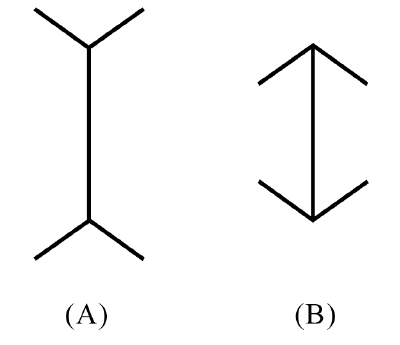
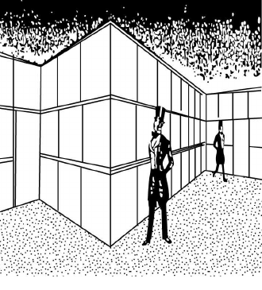

# 01 - RA (2014)

A∼C에 대한 진술로 옳은 것을 <보기>에서 고른 것은?

## 제시문

P : 법문(法文)은 ‘의미의 폭’을 보유하고 있습니다. 예컨대, “음란한 문서를 반포, 판매 또는 임대한 자는 1년 이하의 징역에 처한다.”라는 법률 규정에서 ‘음란한’ 문서가 무엇을 의미하는지에 대해서는 사람마다 다른 표상(表象)을 가질 수 있습니다. 이런 경우 법문의 의미를 바르게 한정하는 것이 법률가가 행해야 하는 법해석의 과제입니다. 문제는 법해석 시 누구의 표상을 기준으로 삼을 것인가 입니다.

A : 법문의 의미 해석은 입법자의 의도가 최우선의 기준일 수밖에 없습니다. 법의 적용은 법률의 기초자(起草者)가 법률과 결부하려고 했던 표상을 기준으로 삼는 것이 옳습니다.

P : 시간이 흐르면서 입법자가 표상했던 것이 시대적 적실성을 잃을 수도 있지 않을까요?

B : 법문의 해석이 문제시되는 상황과 시점에서 법 공동체 구성원의 대다수가 표상하는 바를 법문의 의미로 보는 것이 옳다고 생각합니다. 이 규정과 관련해서는 변화된 사회 상황에서 사람들 대다수가 무엇을 ‘음란한’ 문서로 간주하고 있는가를 알아내야 합니다.

P : 다수의 견해가 항상 옳다고 할 수 있나요?

C : 다수의 표상보다는 당대의 시대정신을 구현하는 표상이 법문의 의미를 결정하는 기준이 되어야 합니다. 시대정신은 결코 머릿수의 문제가 아닙니다.

## 보기

ㄱ. A는 법률가가 법문의 의미를 알아내기 위해 국회 속기록과 입법 이유서를 검토하는 것이 중요하다고 볼 것이다.

ㄴ. B의 주장에 대해 A는 법문의 해석에서 시점과 상황 변화를 고려하는 것은 법의 불확실성을 초래한다고 반박할 수 있다.

ㄷ. 인간은 누구나 이성을 갖고 있고 시대정신은 시대적 상황에 부합되게 이성에 의해 파악된 것이라고 한다면, B와 C 사이의 차별성이 분명해진다.

ㄹ. B와 C는 법문의 의미가 내재적으로 고정되어 있으며 이를 발견하는 것이 법률가가 행해야 할 법해석 작업이라고 본다.

## 선택지

(1) ㄱ, ㄴ

(2) ㄱ, ㄷ

(3) ㄱ, ㄹ

(4) ㄴ, ㄷ

(5) ㄷ, ㄹ

# 02 - RA (2014)

<규정>을 적용한 것으로 옳지 않은 것은?

## 제시문

<규정>

혼인무효의 소는 다음 각 호에 해당하는 가정법원에 제기하여야 한다.

1. 부부가 같은 가정법원의 관할구역 내에 주소지가 있을 때에는 그 가정법원
2. 부부가 최후의 공통의 주소지를 가졌던 가정법원의 관할구역 내에 부부 중 일방의 주소지가 있을 때에는 그 가정법원
3. 위 1 및 2에 해당하지 아니하는 경우로서 부부의 일방이 타방을 상대로 하는 때에는 상대방의 주소지, 제3자가 부부의 쌍방을 상대로 하는 때에는 부부 중 일방의 주소지의 가정법원
4. 부부의 일방이 사망한 경우에는 생존한 타방의 주소지의 가정법원
5. 부부 쌍방이 사망한 경우에는 부부 중 일방의 최후 주소지의 가정법원

## 선택지

(1) A-B 부부가 서울에 주소지를 두고 있던 중 A가 B를 상대로 혼인무효의 소를 제기하고자 할 때에는 서울가정법원에 제기하여야 한다.

(2) 서울에 주소지를 두고 있던 A-B 부부 중 A가 홀로 부산으로 이사하여 자신의 주소지를 변경한 후 A가 B를 상대로 혼인무효의 소를 제기하고자 할 때에는 서울가정법원에 제기하여야 한다.

(3) 서울에 주소지를 두고 있던 A-B 부부 중 A가 홀로 부산으로 이사하여 자신의 주소지를 변경하였고, 그 후 B가 A를 상대로 혼인무효의 소를 제기하고자 할 때에는 부산가정법원에 제기하여야 한다.

(4) 서울에 주소지를 두고 있던 A-B 부부 중 A는 부산으로, B는 광주로 이사하여 각각 자신의 주소지를 변경하였고, 그 후 A의 모친(대구에 주소지를 두고 있음)이 A와 B를 상대로 혼인무효의 소를 제기하고자 할 때에는 부산가정법원에 제기할 수 있다.

(5) 서울에 주소지를 두고 있던 A-B 부부 중 A가 홀로 부산으로 이사하여 자신의 주소지를 변경한 후 A가 사망한 상태에서 B가 혼인무효의 소를 제기하고자 할 때에는 서울가정법원에 제기하여야 한다.

# 03 - RA (2014)

<원칙>을 적용한 것으로 옳은 것을 <보기>에서 고른 것은?

## 제시문

<원칙>

자신의 권리를 주장하는 자는 그 권리의 발생에 필요한 사실을 증명할 책임이 있다. 권리가 발생하였으나 사후에 소멸하였다고 주장하는 자는 권리의 소멸에 관한 사실을 증명할 책임이 있다. 분쟁 당사자 사이에 이러한 권리 발생의 주장이나 그 사후 소멸에 관한 주장에 관한 다툼이 없으면 권리의 발생이나 그 소멸을 주장하는 자는 그 주장이 진실하다는 것을 증명할 필요가 없다.

## 보기

ㄱ. 갑이 을에게 “당신이 빌려 간 100만원을 돌려 달라.”라고 주장하였다. 을은 “돈이 생기면 갚겠다.”라고 주장하였다. 이 경우에 갑이 을에게 100만원을 빌려 주었다는 사실을 증명할 책임이 갑에게 없다.

ㄴ. 갑이 을에게 “당신이 빌려 간 100만원을 돌려 달라.”라고 주장하였다. 을은 “빌렸지만 그 후에 갚았다.”라고 주장하였다. 이 경우에 갑으로부터 빌린 돈을 을이 갚았다는 사실을 증명할 책임이 을에게 있다.

ㄷ. 갑이 을에게 “당신이 빌려 간 100만원을 돌려 달라.”라고 주장하였다. 을은 “당신으로부터 100만원을 빌린 적이 없다.”라고 주장하였다. 이 경우에 갑이 을에게 100만원을 빌려 주었다는 사실을 증명할 책임이 갑에게 없다.

ㄹ. 갑이 을에게 “당신이 빌려 간 100만원을 돌려 달라.”라고 주장하였다. 을은 “100만원을 받기는 하였지만 그것은 당신이 빌려 준 게 아니라 그냥 준 것이다.”라고 주장하였다. 이 경우에 갑이 을에게 100만원을 빌려 주었다는 사실을 증명할 책임이 갑에게 없다.

## 선택지

(1) ㄱ, ㄴ

(2) ㄱ, ㄷ

(3) ㄱ, ㄹ

(4) ㄴ, ㄹ

(5) ㄷ, ㄹ

# 04 - RA (2014)

X국 Z법률의 <규정>과 <사실관계>로부터 추론한 것으로 옳은 것을 <보기>에서 고른 것은?

## 제시문

<규정>

군인․경찰관 기타 공무원의 직무상 불법행위로 손해를 받은 사람은 국가에 손해배상을 청구할 수 있다. 다만 군인․경찰관이 전투․훈련과 관련된 직무집행과 관련하여 받은 손해에 대하여 다른 법률에 따라 보상금을 지급 받을 수 있는 경우에는 국가에 대해 손해배상을 청구할 수 없다.

<사실관계>

회사원 A는 동료인 B를 태우고 자기 아버지 C 소유의 승용차를 운전하던 중, 육군 하사인 D가 운전하던 오토바이와 충돌하였다. 당시 그 오토바이 뒷좌석에는 육군 중사인 E가 타고 있었고 D와 E는 직무를 집행하던 중이었다. 위 교통사고는 D가 운전 중 졸음을 이기지 못하고 전방을 제대로 주시하지 못하여 발생한 것이었다. 이 사고로 인하여 B와 E는 각각 약 8주간의 치료를 필요로 하는 우슬관절내측부인대파열 및 전방십자인대파열 등의 상해를 입었다.

## 보기

ㄱ. D의 직무상 불법행위가 인정되고 A도 상해를 입었다면 A는 국가에 대해 손해배상을 청구할 수 있을 것이다.

ㄴ. D의 직무상 불법행위가 인정되더라도 사고 당시 D의 직무집행행위가 전투․훈련과 무관한 것이라면 B는 국가에 대해 손해배상을 청구할 수 없을 것이다.

ㄷ. D의 직무상 불법행위가 인정되고 그로 인해 C의 자동차가 파손되었더라도 C는 그 피해의 배상을 국가에 청구할 수 없을 것이다.

ㄹ. D의 직무상 불법행위가 인정되고 사고 당시 D와 E의 직무가 전투․훈련과 무관한 것이라면 E는 국가에 대해 손해배상을 청구할 수 있을 것이다.

## 선택지

(1) ㄱ, ㄴ

(2) ㄱ, ㄹ

(3) ㄴ, ㄷ

(4) ㄴ, ㄹ

(5) ㄷ, ㄹ

# 05 - RA (2014)

을의 입장에 대한 분석으로 옳은 것만을 <보기>에서 있는 대로 고른 것은?

## 제시문

갑 : 민사소송에서의 확인소송은 원고의 법적 지위가 불안하거나 위험할 때 확인판결을 받는 것이 그러한 불안이나 위험을 제거하기 위하여 실효적인 경우에만 인정되고, 다른 소송방법에 의하여 효과적인 권리구제가 가능한 경우에는 인정되지 않는다는 보충성의 원칙이 요구된다. 예컨대, 특정한 의무의 이행을 직접적으로 청구하는 소송을 할 수 있는데도 불구하고 그러한 방법에 의하지 않고, 단지 확인만을 구하는 소송을 하는 것은 분쟁의 종국적인 해결방법이 아니어서 소송을 할 이익이 없다. 행정소송에서의 무효확인소송도 확인소송의 성질을 가지므로, 민사소송에서처럼 보충성의 원칙이 요구된다.

을 : 행정소송은 행정청의 위법한 처분 등을 취소하거나 그 효력 유무 등을 확인함으로써 국민의 권리 또는 이익의 침해를 구제하는 것을 목적으로 하므로, 대등한 주체 사이의 사법상(私法上) 생활관계에 관한 분쟁을 심판대상으로 하는 민사소송과는 목적, 취지 및 기능 등을 달리한다. 또한 행정소송법은 무효확인소송의 판결의 효력에 있어서 그 자체만으로도 권리구제의 실효성을 담보할 수 있는 여러 특수한 효력을 추가적으로 인정하고 있기 때문에 권리구제방법으로서 효과적인 다른 소송수단이 있다 하더라도 무효확인소송을 제기할 수 있다.

## 보기

ㄱ. 을은 민사소송에서의 확인소송은 보충성의 원칙이 요구되지 않는다는 것을 전제하고 있다.

ㄴ. 을은 행정소송에서의 무효확인소송의 성질이 확인소송임을 부인하고 있다.

ㄷ. 을은 확인소송의 보충성의 원칙을 민사소송에만 한정하고자 한다.

## 선택지

(1) ㄱ

(2) ㄴ

(3) ㄷ

(4) ㄴ, ㄷ

(5) ㄱ, ㄴ, ㄷ

# 06 - RA (2014)

다음 설명이 적용될 수 있는 예를 <보기>에서 고른 것은?

## 제시문

X국의 형법 B조의 구성요건은 형법 A조의 구성요건의 모든 요소를 포함하고 그 이외의 다른 요소를 구비한다. B조에 해당하는 모든 경우는 A조에도 해당되지만, 이 경우 법원은 A조를 적용하지 않고 B조를 적용한다. A조는 “사람의 신체에 대하여 폭행을 가한 자는 2년 이하의 징역 또는 500만원 이하의 벌금에 처한다.”라고 규정하고 있다. B조는 “단체 또는 다중의 위력을 보이거나 위험한 물건을 휴대하여 사람의 신체에 대하여 폭행을 가한 자는 5년 이하의 징역에 처한다.”라고 규정하고 있다. 일방이 상대방의 신체에 대하여 폭행을 가한 경우에는 A조가 적용되지만, 일방이 위험한 물건을 휴대하여 상대방의 신체에 대하여 폭행을 가한 경우에는 B조가 적용될 것이다.

## 보기

ㄱ.

◦ 타인의 재물을 절취한 자는 6년 이하의 징역 또는 1,000만원 이하의 벌금에 처한다.

◦ 야간에 사람의 주거, 간수하는 저택, 건조물이나 선박 또는 점유하는 방실에 침입하여 타인의 재물을 절취한 자는 10년 이하의 징역에 처한다.

ㄴ.

◦ 미성년자를 약취 또는 유인한 자는 10년 이하의 징역에 처한다.

◦ 추행, 간음 또는 영리의 목적으로 사람을 약취 또는 유인한 자는 1년 이상 30년 이하의 징역에 처한다.

ㄷ.

◦ 부녀의 촉탁 또는 승낙을 받아 낙태하게 한 자는 1년 이하의 징역 또는 200만원 이하의 벌금에 처한다.

◦ 의사, 한의사, 조산사, 약제사 또는 약종상이 부녀의 촉탁 또는 승낙을 받아 낙태하게 한 때에는 2년 이하의 징역에 처한다.

ㄹ.

◦ 사람의 궁박한 상태를 이용하여 현저하게 부당한 이익을 취득한 자는 3년 이하의 징역 또는 1,000만원 이하의 벌금에 처한다.

◦ 사람을 공갈하여 재물의 교부를 받거나 재산상의 이익을 취득한 자는 10년 이하의 징역 또는 2,000만원 이하의 벌금에 처한다.

## 선택지

(1) ㄱ, ㄴ

(2) ㄱ, ㄷ

(3) ㄴ, ㄷ

(4) ㄴ, ㄹ

(5) ㄷ, ㄹ

# 07 - RA (2014)

<사안>, <주장>, <사실>과 관련하여 진술한 것으로 옳지 않은 것은?

## 제시문

<사안>

A는 교제 중이던 B가 임신하자 낙태를 강요한 뒤 헤어졌다. B는 괴로움을 이기지 못하고 유서를 남기고 자살했다. B의 어머니는 딸의 미니홈피에 유서 전문과 장문의 글을 올렸다. 이후 네티즌 사이에 A의 개인 정보가 노출되고 인신공격적 댓글이 이어졌다. 또 포털 사이트에 관련 뉴스가 게재되고 블로그, 커뮤니티 등에 기사가 스크랩되자, A(원고)는 포털 사업자(피고)를 상대로 명예훼손을 이유로 손해배상 청구소송을 제기했다.

위 포털 사업자에게 명예훼손으로 인한 손해배상책임을 물을 수 있는지를 두고 다음과 같은 쟁점이 특히 문제되었다.

쟁점(1) : 포털이 사이트에 올린 기사에 편집권을 행사한 것으로 볼 수 있는지 여부

쟁점(2) : 명예훼손적 게시물에 대해 피해자의 명시적 삭제 요구가 없더라도 포털의 삭제 의무가 발생하는지 여부

<주장>

(가) 포털이 내용 수정 없이 원문을 그대로 전재하는 경우라 하더라도 자신의 제공 서비스 화면에 오르게 하는 것은 실제적 의미에서 지적인 전파 내지 재공표를 행한 것에 해당할 수 있다.

(나) 뉴스 서비스 초기 화면에 기사를 예시적으로 게재하기 위해 일부 기사들을 적절히 배치하거나 긴 기사 제목의 일부를 말줄임표로 간결하게 요약해 보여 주는 것은 링크 제목의 수정일 뿐 원문의 수정이 아니다.

(다) 하루에 수만 건씩 쏟아지는 게시물의 내용을 포털이 다 알고 통제할 수 있는 지위에 있다고 보기 어렵다.

(라) 포털에 게시물 감시 및 삭제 의무를 부과한다면 명예훼손이라는 개인의 이익보다 더 큰 공익이 침해될 것이다.

<사실>

(마) 명예훼손적 게시물을 피해자의 명시적 요구 없이도 삭제할 의무를 포털에게 지우는 법률 조항이 없다.

## 선택지

(1) 원고 측이 (가)를 쟁점(1)과 관련하여 자신의 입장을 옹호하는 논거로 사용하려면, 원문을 포털에 그대로 전재하는 경우도 편집권의 행사에 해당한다는 전제가 필요하다.

(2) 피고 측이 (나)를 쟁점(1)과 관련하여 자신의 입장을 옹호하는 논거로 사용하려면, 포털이 행한 원문 기사의 배치나 제목의 간결한 요약은 편집권의 행사가 아니라는 전제가 필요하다.

(3) 피고 측이 (다)를 쟁점(2)와 관련하여 자신의 입장을 옹호하는 논거로 사용하려면, 게시물의 존재와 내용에 대한 인식이 피고의 책임을 구성하는 요건이라는 전제가 필요하다.

(4) 피고 측이 (라)를 쟁점(2)와 관련하여 자신의 입장을 옹호하는 논거로 사용하려면, 개인의 이익이 공익보다 우선한다는 전제가 필요하다.

(5) (마)가 쟁점(2)와 관련하여 피고의 입장을 옹호하는 논거로 사용될 수 없다고 원고 측이 주장한다면, 원고는 명문의 법률규정이 없는 의무가 있을 수 있음을 전제하고 있다.

# 08 - RA (2014)

갑과 을의 논쟁에 대한 평가로 옳지 않은 것은?

## 제시문

<법안>

만 16세 미만인 사람에게 성폭력 범죄를 저지른 소아 성기호증 환자로 재범의 위험성이 있다고 인정되는 19세 이상의 사람에게 성충동 억제 약물요법을 시행한다. 약물 투여 명령을 받은 자는 출소 후 3개월에 1회씩 최장 15년 동안 약물 투여를 받도록 한다.

갑과 을은 <법안>을 도입할지를 두고 논쟁을 벌였다.

$\text{갑}_1$ : 이미 처벌을 받은 자에게 신체 훼손을 가져오는 약물 투여를 최장 15년 동안 강제하는 것은 이중 처벌로서 위헌적이다.

$\text{을}_1$ : 약물요법은 일종의 치료이다. 약물요법을 중지하면 신체 기능이 정상 상태로 복귀하므로 신체 기능의 훼손은 없다. 약물요법은 재범의 위험성이 높은 자의 재범률을 낮추므로 오히려 당사자의 이익을 위한 것이고, 따라서 처벌이 아니다.

$\text{갑}_2$ : ‘재범의 위험성’에 대한 판단은 인간의 미래 행위에 대한 판단이다. 인간의 미래 행위가 위험성이 높다고 예측된다고 해서 화학적 거세를 실시하는 것은 부당한 일이다.

$\text{을}_2$ : 당신은 우리 사회가 얼마나 많은 위험성 예측을 근거로 작동하고 있는지 모르는가? 우리는 기상 예보에 근거하여 하루 일과를 결정하고 한 해의 농사 계획을 짠다.

$\text{갑}_3$ : 약물요법의 시행은 비용 대비 효율성의 관점에서도 온당치 않다. 약물요법을 포함한 각종 성폭력 방지책에 투입할 수 있는 예산은 한정되어 있다. 성충동 억제 약물은 현재 매우 고가이고, 약물요법 시행에는 막대한 예산 투입이 요구된다.

$\text{을}_3$ : 약물요법은 재범률 감소에 효과적이다. 성폭력범을 대상으로 한 실험 통계 A에 따르면, 약물투여자의 재범률은 $5\%$로 비투여자의 재범률 $20 \sim 40\%$보다 낮다. 성폭력은 피해자에게 장기적으로 심각한 트라우마를 남기며 미성년자인 경우에는 더욱 그렇다. 약물요법이 비록 고비용이라고 해도 실효성 있는 방지책이라면, 이를 시행하는 것이 국가의 책무이다.

## 선택지

(1) 신체 기능을 잠정적으로 제한하는 것도 ‘신체 기능의 훼손’에 해당된다면, $\text{을}_1$은 약화된다.

(2) 갑은 $\text{을}_1$에 대해 ‘약물요법이 당사자의 이익을 위한 것이므로 처벌이 아니라고 한다면 징역형도 당사자의 교화를 돕는다는 점에서 처벌이 아니게 된다’고 반박할 수 있다.

(3) 인간의 미래 행위에 대한 예측이 더욱 정확해진다면, $\text{을}_2$는 강화된다.

(4) 갑은 $\text{을}_3$의 실험 통계 A를 받아들여 약물요법의 효과를 인정하면서도 여전히 $\text{갑}_3$을 고수할 수 있다.

(5) 실험 통계 A에서 약물 투여자는 대부분 초범이었고 비투여자는 대부분 재범이었다면, $\text{을}_3$은 강화된다.

# 09 - RA (2014)

A∼D의 입장을 적용한 것으로 옳은 것만을 <보기>에서 있는 대로 고른 것은?

## 제시문

정조 11년(1787) 김성백과 문정추가 황해도 황주의 계 모임에서 만났다. 말다툼 중에 김성백이 주먹으로 문정추의 얼굴을 때렸다. 문정추는 맞은 데 화가 나서 술을 많이 마시고 집으로 돌아가던 중, 술기운에 냇물에서 넘어져 결국 얼어 죽었다. 김성백이 문정추의 죽음에 대하여 책임을 져야 하는지에 관하여 다음과 같은 주장들이 제기되었다.

A : 김성백이 문정추를 구타하지 않았다면 문정추가 화가 나서 술을 많이 마시지 않았을 것이다. 문정추가 술을 많이 마시지 않았다면 술기운에 냇물에 빠졌을 리가 없다. 김성백의 구타가 문정추의 죽음의 원인이 된 것이므로 김성백을 처벌해야 한다.

B : 문정추의 죽음을 야기한 직접적 원인에 대해서만 죄책을 물을 수 있다. 어떤 행위가 피해 결과의 직접적 원인인지 여부는 행위자의 의도를 고려해 판단해야 한다. 문정추의 죽음은 술기운에 물에 빠진 것이 원인이 된 사고사이므로 김성백을 처벌할 수 없다.

C : 그 행위가 발생된 결과를 일으키는 전형적인 원인이라고 일반 사람들이 평가할 때 그 결과에 대하여 책임을 물을 수 있다. 일반 사람들이 김성백의 구타 행위가 문정추가 물에 빠져 얼어 죽은 결과의 전형적인 원인이라고 평가하지 않기 때문에 김성백을 처벌할 수 없다.

D : 그 행위가 없었다면 결과가 발생하지 않았다고 볼 수 있는 경우 그 행위자는 그 결과에 대하여 책임이 있다. 그러나 피해자의 노력으로 그 피해 결과를 회피할 수 있었던 경우에는 가해자에게 피해 결과에 대한 책임을 지울 수 없다. 문정추가 스스로 술을 많이 마셨고 그 때문에 냇물에 넘어진 것이므로 김성백을 처벌할 수 없다.

## 보기

ㄱ. 의사 갑이 독약 관리를 제대로 하지 않은 틈을 타서 간호사 을이 독약을 빼돌려 변심한 애인을 죽였다. A와 B는 갑이 독살 당한 자의 죽음에 대한 책임이 없다고 할 것이다.

ㄴ. 갑이 을을 때려 다리를 부러뜨렸다. 을이 구급차에 실려 병원으로 옮겨지던 중 교통사고가 발생하여 즉사하였다. B와 C는 갑이 을의 죽음에 대한 책임이 없다고 할 것이다.

ㄷ. 갑이 을을 절벽에서 밀어 떨어뜨려 죽이기 위하여 산책을 권유하였다. 절벽 쪽으로 걸어가던 중 을이 번개를 맞아 죽었다. C와 D는 갑이 을의 죽음에 책임이 있다고 할 것이다.

ㄹ. 갑이 을을 독살하려고 하였으나 독약이 치사량에 미치지 못하여 질병을 얻게 하는 데 그쳤다. 의사는 완치 전에 술을 마시면 위험하다고 경고를 하였으나, 을은 이를 무시하고 술을 많이 마셨고 병이 악화되어 사망하였다. A와 D는 갑이 을의 죽음에 책임이 있다고 할 것이다.

## 선택지

(1) ㄱ

(2) ㄴ

(3) ㄱ, ㄷ

(4) ㄴ, ㄹ

(5) ㄷ, ㄹ

# 10 - RA (2014)

A∼C 모두와 양립할 수 있는 것만을 <보기>에서 있는 대로 고른 것은?

## 제시문

A : 오늘날 인류가 지니는 양심은 사회적 감정으로서 타인의 고통과 쾌락에 대한 공감의 감정이 역사적으로 학습된 결과, 즉 인류가 공유하는 습관화된 동정심이다. 타인의 쾌락을 증진시키고 고통을 감소시키는 데 기여하지 않는 양심은 잘못된 양심일 뿐이다. 우리는 양심에서 비롯된 잘못된 행위의 많은 사례들을 실제로 인류 역사에서 확인할 수 있다.

B : 양심은 취득될 수 있는 것이 아니며 양심을 구비해야 할 의무란 없다. 모든 사람은 근원적으로 양심을 자기 내에 가지고 있다. ‘이 사람은 양심이 없다’고 말하는 것은 그가 양심의 요구를 외면하고 있음을 의미하지, 그가 실제로 양심을 결여하고 있음을 의미하지 않는다. 양심이란 개인적 욕구로부터 독립적인 보편타당한 도덕 판단을 하는 실천이성에 다름 아니다. 어떤 사람이 종교적 이단 처형을 ‘신의 계시에 따른 내적 확신에서 비롯된 순수한 양심’을 통하여 정당화한다면, 이때의 ‘양심’은 실은 양심이 아니다.

C : 양심이란 부모의 권위가 내면화된 초자아의 기능이다. 어린이는 특정 시기를 지나면서 부모라는 대상을 향한 성적 욕구를 포기하고, 이러한 포기에 대한 보상으로서 부모와의 동일시를 강화하게 된다. 아이의 초자아는 부모의 초자아에 따라 형성되며 따라서 초자아는 이런 식으로 세대를 넘어 이어진 가치의 계승자가 된다. 많은 신경증적 증후들은 초자아가 지나치게 강한 결과, 즉 양심이 과도하게 열등감이나 죄의식으로 자아를 벌한 결과이다.

## 보기

ㄱ. 양심 없는 인간이 있을 수 있다.

ㄴ. 양심의 명령에 따르는 행동이 비도덕적일 수 있다.

ㄷ. 나의 행동이 양심이 명령하는 바와 일치하지 않을 수 있다.

## 선택지

(1) ㄴ

(2) ㄷ

(3) ㄱ, ㄴ

(4) ㄱ, ㄷ

(5) ㄱ, ㄴ, ㄷ

# 11 - RA (2014)

다음 논증의 구조를 분석한 것으로 옳지 않은 것은?

## 제시문

아담 스미스는 자본이 증가하면 자본의 경쟁도 심화되기 때문에 이윤은 낮아진다고 주장하였다. 『국부론』의 「자본의 이윤」에서 그는 이렇게 말한다. “<u>ⓐ 많은 부유한 상인들이 한 업종에 투자하게 되면 그들 간의 상호 경쟁 때문에 이윤은 자연스럽게 낮아지는 경향이 있다.</u> <u>ⓑ 한 사회 안에서 모든 업종에 걸쳐 투자액이 증가한다면, 그 모든 업종에서 같은 경쟁 때문에 동일한 효과가 발생할 수밖에 없다.</u>” 이 대목에서 아담 스미스는 <u>ⓒ 자본의 경쟁이 이윤을 낮추는 것은 가격을 낮추기 때문</u>이라고 생각하는 것 같다. 어떤 특정 업종에서 자본 투자가 증가하기 때문에 그 업종에서 이윤율이 낮아지는 것은 보통 가격의 하락에 기인하기 때문이다. 그러나 이것이 그가 뜻한 바라면, <u>ⓓ 가격 하락이 한 상품에만 국한되는 경우에는 실제로 생산자의 이윤을 축소시키지만 모든 상품에 함께 일어나는 경우에는 그런 효과가 없어진다는 점</u>을 그는 놓친 것이다. <u>ⓔ 모든 물건의 가격이 내린다면 실질적으로는 어떤 물건도 가격이 내리지 않는 것과 마찬가지이기 때문</u>이다. 화폐로 계산해 보아도 모든 생산자에게 매출이 줄어든 만큼 생산비도 줄어든다. <u>ⓕ 모든 다른 물건들은 가격이 하락하는데 노동만이 가격이 하락하지 않는 유일한 상품이라면 실질 이윤은 감소할 것</u>이지만, 그런 경우에 실제로 일어난 일은 임금 상승이다. 이 경우에 자본의 이윤을 낮춘 것은 가격 하락이 아니라 임금 상승이라고 해야 맞다.

- 존 스튜어트 밀, 『정치경제학 원리』 -

## 선택지

(1) 글쓴이는 ⓐ의 타당성을 인정하고 있다.

(2) ⓓ는 ⓑ를 비판하고 있다.

(3) ⓔ는 ⓓ의 근거이다.

(4) ⓕ는 ⓒ를 비판하고 있다.

(5) ⓕ는 ⓔ의 근거이다.

# 12 - RA (2014)

<가정>과 <상황>으로부터 추론한 것으로 옳은 것만을 <보기>에서 있는 대로 고른 것은?

## 제시문

법률이나 정책 등을 바꾸려면 ‘거부권 행사자’라 불리는 일정 수의 개인 또는 집합적 행위자들의 동의가 필요하다. 거부권 행사자는 헌법에 의거한 ‘제도적’ 거부권 행사자와 정치체제에 의거한 ‘당파적’ 거부권 행사자로 나뉜다.

대통령중심제 국가이면서 양원제를 채택하고 있는 미국에서는 법률이나 정책을 바꾸려고 할 때 대통령, 상원, 하원의 동의를 필요로 하며 이때 제도적 거부권 행사자의 수는 셋이 된다. 의원내각제 국가의 경우에는 행정부가 입법부와 긴밀히 연계되어 있어서 행정부를 별도의 거부권 행사자로 보기 어렵다.

다른 한편, 의원내각제 국가의 경우에는 정치 체제의 특성상 대통령중심제와 달리 당파적 거부권 행사자가 존재한다. 말하자면, 정부를 구성하는 정당들 하나하나가 별도의 거부권 행사자가 되는데, 연립정부는 단일정당정부에 비해 더 많은 수의 당파적 거부권 행사자를 갖게 된다. 국회의원 선거제도에는 소선거구제와 비례대표제가 있다.

<가정>

◦ 거부권 행사자의 수가 많을수록 정책안정성은 높아진다.

◦ 소선거구제에서는 양당제가, 비례대표제에서는 다당제가 출현한다.

◦ 의원내각제 하에서 다당제가 출현하면 연립정부가 출범한다.

<상황>

◦ A국은 대통령중심제, 비례대표제, 단원제 국가이다.

◦ B국은 대통령중심제, 소선거구제, 양원제 국가이다.

◦ C국은 의원내각제, 소선거구제, 단원제 국가이다.

◦ D국은 의원내각제, 비례대표제, 양원제 국가이다.

## 보기

ㄱ. A국이 B국보다 정책안정성이 높을 것이다.

ㄴ. D국이 A국보다 정책안정성이 높을 것이다.

ㄷ. D국이 C국보다 정책안정성이 높을 것이다.

## 선택지

(1) ㄱ

(2) ㄷ

(3) ㄱ, ㄴ

(4) ㄴ, ㄷ

(5) ㄱ, ㄴ, ㄷ

# 13 - RA (2014)

다음 글로부터 추론한 것으로 옳은 것만을 <보기>에서 있는 대로 고른 것은?

## 제시문

사람들은 흡연자이거나 비흡연자이고, 또 폐암에 걸리거나 걸리지 않는다. 흡연자가 폐암에 걸리는 확률이 비흡연자가 폐암에 걸리는 확률보다 높을 때, 다시 말해서 흡연자 중 폐암 발생자의 비율이 비흡연자 중 폐암 발생자의 비율보다 클 때 흡연은 폐암과 긍정적으로 상관되어 있다고 말한다. 가령 흡연자 중 폐암 발생자의 비율이 $2\%$이고 비흡연자 중 폐암 발생자의 비율이 $0.5\%$라면, 흡연과 폐암은 긍정적으로 상관된다.

역으로 흡연자가 폐암에 걸리는 확률이 비흡연자가 폐암에 걸리는 확률보다 낮을 때 흡연은 폐암과 부정적으로 상관되어 있다고 말한다. 상관관계는 대칭적이어서, 흡연이 폐암과 긍정적으로 상관되어 있으면, 역으로 폐암도 흡연과 긍정적으로 상관된다.

두 사건 사이에 직접적인 인과관계가 없을 때에도 그 둘은 상관관계를 가질 수 있다. 가령 그것들이 하나의 공통 원인의 결과일 때 그런 일이 있을 수 있다. 다른 한편, 두 사건 사이에 인과 관계가 있어도 이들 사이에 긍정적 상관관계가 없을 수도 있다. 예를 들어, 흡연은 심장 발작을 촉진하지만, 흡연자들은 비흡연자들보다 저염식 식단을 선호하는 성향이 있다고 하자. 이런 경우 흡연이 심장 발작을 일으키는 성향은 흡연이 흡연자로 하여금 심장 발작을 방지하는 음식을 선호하게 만드는 성향과 상쇄되어 흡연과 심장 발작 사이에는 상관관계가 없을 수 있으며, 심지어는 부정적 상관관계가 있을 수도 있다.

## 보기

ㄱ. 흡연이 비만과 부정적으로 상관되어 있다면, 비만인 사람 중 흡연자의 비율이 비만이 아닌 사람 중 흡연자의 비율보다 작다.

ㄴ. 흡연과 비만 사이에 긍정적 상관관계가 있다면, 비만인 사람 중 흡연자의 수가 비흡연자의 수보다 많다.

ㄷ. 흡연이 고혈압의 원인이고 고혈압이 심장 발작과 긍정적 상관관계를 갖는다면, 흡연은 심장 발작과 긍정적 상관관계를 갖는다.

## 선택지

(1) ㄱ

(2) ㄷ

(3) ㄱ, ㄴ

(4) ㄱ, ㄷ

(5) ㄴ, ㄷ

# 14 - RA (2014)

‘압력 조절실’에 대해 추론한 것으로 옳은 것은?

## 제시문

기체의 용해도는 기체가 액체에 녹는 정도를 말하는데 압력이 높을수록 높아진다. 주변 기압에 적응된 인체의 혈액에도 일정량의 공기가 녹아 있는데, 갑작스러운 주변 기압의 변화로 인해 이 공기의 용해도가 급격하게 변화될 수 있다. 따라서 심해나 우주처럼 일반적인 대기압 조건과 다른 곳을 왕래하는 경우, 혈액 내 공기 용해도의 급격한 변화에 의해 인체가 해를 입을 수 있다. 일반적으로 잠수부가 물속으로 잠수해 들어가는 것은 큰 문제가 되지 않는데 비해, 물속에서 수면으로 빠르게 올라오면 혈액에 녹아 있던 질소가 기체 상태로 변하면서 혈류를 막아 심각한 위험을 초래할 수 있다.

아폴로-소유즈 실험 계획은 미국과 소련 간 최초의 국제 공동 유인 우주 비행 실험으로, 그 임무 중 하나는 장래의 미-소 우주선의 도킹 시스템을 점검하는 것이었다. 이 계획의 실행 당시 소련 우주선인 소유즈 내에는 지상의 공기와 기체 구성비 및 기압이 동일한 공기가 공급되었지만, 미국 우주선인 아폴로 내에는 지상의 공기에서 질소 등의 다른 대기 성분을 뺀 순수 산소만이 대기압보다 낮은 압력으로 공급되었다. 도킹할 때마다 두 우주선 전체의 압력을 같게 만드는 것은 현실성이 없었기에, 두 우주선 중간에 압력 조절실을 따로 두고 우주인이 이를 통과하면서 자신의 신체가 두 우주선 사이의 압력 차이에 천천히 적응할 수 있도록 했다.

## 선택지

(1) 압력 조절실을 통과하는 과정에서 우주인 혈액 내의 기체 용해도는 변화하지 않을 것이다.

(2) 아폴로 우주선에 산소 외에 다른 기체를 섞어 대기압과 같게 되도록 공급하더라도 압력 조절실은 여전히 필요할 것이다.

(3) 압력 조절실 없이 미국 우주인이 소유즈 우주선으로 이동하는 상황은 잠수부가 수면으로 급격히 상승하는 상황과 유사할 것이다.

(4) 압력 조절실 없이 소련 우주인이 아폴로 우주선으로 바로 이동할 경우 소련 우주인의 혈액 속의 질소가 기체 상태로 바뀔 것이다.

(5) 압력 조절실을 통해 이동할 경우, 소련 우주인이 아폴로 우주선으로 이동할 때보다 미국 우주인이 소유즈 우주선으로 이동할 때가 더 위험할 것이다.

# 15 - RA (2014)

다음 글로부터 추론한 것으로 옳은 것만을 <보기>에서 있는 대로 고른 것은?

## 제시문

콜레스테롤은 지용성 분자로 동물 세포에서 발견된다. 콜레스테롤은 세포막을 구성하는 주요 성분으로, 세포막을 통한 물질 이동과 관련된 세포막 유동성(fluidity)을 조절한다고 알려져 있다. 세포막 유동성은 일반적으로 온도가 올라갈수록 증가한다. 그런데 저온에서는 콜레스테롤이 있는 경우가 없는 경우보다 세포막 유동성이 크고, 고온에서는 콜레스테롤이 있는 경우가 없는 경우보다 세포막 유동성이 작다.

에르고스테롤은 진균의 세포막에 존재하는 물질로 세포막 유동성과 관련하여 콜레스테롤과 같은 기능을 한다. 다만 콜레스테롤과는 구조적인 차이가 있어서 이를 활용한 항진균제 개발이 가능하다. 대표적인 항진균제인 케토코나졸은 에르고스테롤의 생체 내 합성을 방해함으로써 세포막 유동성을 변화시켜 진균의 성장을 억제한다. 반면 또 다른 항진균제인 암포테리신-B는 세포막 유동성에는 거의 영향을 주지 않지만, 에르고스테롤과 결합하여 진균 세포막에 구멍이 나게 함으로써 진균의 성장을 억제한다.

## 보기

ㄱ. 진균의 세포막 유동성은 케토코나졸로 처리하면 증가할 것이다.

ㄴ. 암포테리신-B로 처리한 진균의 세포막 유동성은 고온보다 저온에서 더 클 것이다.

ㄷ. 암포테리신-B로만 처리할 때보다 케토코나졸과 암포테리신-B로 동시에 처리할 때, 진균 세포막에 구멍이 나는 정도가 줄어들 것이다.

## 선택지

(1) ㄴ

(2) ㄷ

(3) ㄱ, ㄴ

(4) ㄱ, ㄷ

(5) ㄴ, ㄷ

# 16 - RA (2014)

다음 글로부터 그레이브스병 환자에 대해 추론한 것으로 옳은 것만을 <보기>에서 있는 대로 고른 것은?

## 제시문

갑상선 호르몬의 일종인 티록신은 포도당의 분해를 증가시키고 체온을 높이는 등 신체의 물질대사를 촉진하는 기능을 한다. 정상적인 신체는 체내의 티록신 농도를 일정하게 조절하여 항상성을 유지한다. 이를 위해 간뇌의 시상 하부에는 티록신 농도를 감지하는 조직이 있어, 티록신이 부족하면 이곳에서 ‘갑상선 자극 호르몬 방출 호르몬’(TRH)이 분비된다. TRH는 다시 뇌하수체 전엽에서 ‘갑상선 자극 호르몬’(TSH)의 분비를 촉진하고, TSH는 갑상선 세포 표면에 있는 TSH-수용체에 결합하여 티록신의 분비를 촉진한다. 이 신호를 받아 갑상선에서 티록신이 더 많이 생산되고 티록신의 혈중 농도가 높아지면, 시상 하부의 TRH 분비량이 줄어들며 이에 따라 TSH의 분비량과 티록신 합성량이 차례로 줄어들어 티록신 농도를 정상 수준으로 조절한다.

그레이브스병은 티록신 농도가 정상보다 높은 수준으로 유지되는 질병이다. 이 병의 특이한 증상은 환자의 체중이 왕성한 식욕에도 불구하고 감소하는 것이다. 그레이브스병은 신진대사 속도에 영향을 주는 자가면역 질환의 일종이다. 이 병은 TSH-수용체에, TSH를 대신하여 결합하는 항체가 생성되는 것이 그 원인이라고 알려져 있다. 이 항체가 TSH-수용체에 결합하면 TSH 농도와 무관하게 티록신 합성이 촉진된다.

## 보기

ㄱ. TRH와 TSH의 분비량이 정상인에 비해 적을 것이다.

ㄴ. TSH를 감소시키는 약물을 주사하면 티록신의 분비가 감소할 것이다.

ㄷ. TSH-수용체가 부족해지거나 파괴된 경우에도 유사한 증상을 보일 것이다.

## 선택지

(1) ㄱ

(2) ㄴ

(3) ㄷ

(4) ㄱ, ㄴ

(5) ㄱ, ㄷ

# 17 - RA (2014)

다음 글로부터 추론한 것으로 옳은 것만을 <보기>에서 있는 대로 고른 것은?

## 제시문

대칭적 암호체계를 이용한 비밀 통신의 원리는 간단하다. 즉 송신자와 수신자 둘만이 공유하고 있는 하나의 열쇠를 이용해 송신자가 메시지를 암호화하여 보내면 수신자는 공유하고 있는 동일한 열쇠를 이용해서 암호화된 메시지를 해독하는 것이다.

그러나 동일한 열쇠를 오랜 기간 동안 반복해서 사용하게 되면, 외부에 열쇠가 노출될 위험이 커지는 문제가 발생한다. 오랜 기간 사용한 열쇠를 ‘장기열쇠’라고 한다. 장기열쇠가 노출되는 위험을 피하기 위해서 통신을 할 때 장기열쇠 외에 단기적으로 사용하는 열쇠, 즉 ‘단기열쇠’를 따로 설정해서 메시지를 암호화하게 된다.

채은과 유진 두 사람이 대칭적 암호체계를 이용해서 비밀 통신을 한다고 하자. 채은과 유진은 두 사람이 모두 동일한 장기열쇠와 단기열쇠를 공유하고 있는지를 확인할 필요가 있고 동시에 제3자가 단기열쇠를 알아채지 못하게 해야 할 필요가 있다. 이를 위해서 두 사람은 다음과 같은 단계들을 거쳐야 한다.

단계(1) : 채은은 자신이 만든 임의의 메시지 $M$과 자신의 아이디(ID)를 유진에게 보낸다.

단계(2) : 유진은 자신이 갖고 있는 장기열쇠를 이용하여 $M$과 자신이 임의로 지정한 단기열쇠 $S$를 암호화한 후 이를 채은에게 보내고, 채은은 자신이 갖고 있는 장기열쇠를 이용하여 이를 해독한 후 해독한 메시지에 $M$이 있는지 확인한다.

단계(3) : 채은은 유진이 보낸 $S$를 이용하여 $M$을 암호화한 후 이를 보내고, 유진은 이를 해독한 메시지가 $M$과 동일한지 확인한다.

## 보기

ㄱ. 단계(2)가 완료되었을 때 유진은 자신과 채은이 $S$를 공유하게 되었음을 알 수 있다.

ㄴ. 단계(2)에서 채은이 해독한 메시지에 $M$이 없다면, 채은은 자신과 유진이 장기열쇠를 공유한다고 확신할 수 없다.

ㄷ. $M$과 유진이 사용한 장기열쇠를 알고 있는 제3자가 단계(2)에서 유진이 채은에게 전송한 메시지를 가로챈다면 그는 $S$를 알 수 있다.

## 선택지

(1) ㄱ

(2) ㄴ

(3) ㄱ, ㄷ

(4) ㄴ, ㄷ

(5) ㄱ, ㄴ, ㄷ

# 18 - RA (2014)

다음 글로부터 추론한 것으로 옳은 것만을 <보기>에서 있는 대로 고른 것은?

## 제시문

17세기 중국의 사상가 황종희는 국가 재정이 넉넉해지려면 지금 국가가 지고 있는 군대 부양(扶養)의 부담을 줄여야 하는데, 이를 위해서는 직업 군인제 대신 병농 일치의 군사 제도를 채택해야 한다고 주장하였다. 그는 구체적으로 다음과 같은 방안을 제안했다.

(1) 병사는 마땅히 구(口)에서 취해야 하고, 병사 부양은 마땅히 호(戶)에서 취해야 한다. 구에서 취한다는 말은 50인마다 훈련병 1인과 복무병 1인을 차출한다는 것이다. 호에서 취한다는 말은 10호마다 1인의 복무병을 부양토록 한다는 것이다. 지금 천하 호구(戶口)의 숫자를 보면 구가 약 6,000만 인, 호가 약 1,000만 호이니, 충분한 병력을 확보하면서도 백성의 부담은 무겁지 않게 할 수 있다. 병역을 지는 남자는 만 20세에 의무를 시작하여 만 30년 동안 의무를 지고, 훈련병의 훈련은 생업에 지장이 없게 실시하여 따로 부양할 필요가 없도록 한다.

(2) 궁성 수비는 수도가 위치한 강남 지방의 군현에 거주하는 병역 의무자 중에서 차출하여 충당한다. 먼저 강남 지방의 병역 의무자 전원을 복무병 2개 조, 훈련병 2개 조로 나누고, 각 조의 병력 수를 같도록 한다. 이 중 복무병의 첫 번째 조 10만 명은 각자 소속된 군현을 지키게 하고, 두 번째 조 10만 명은 궁성을 수비하게 한다. 이듬해에는 군현을 지키던 자로 궁성을 지키게 하고, 궁성을 수비하던 자는 돌아가서 군현을 지키게 한다. 그 다음 해에는 훈련병을 동원하여 복무하게 하고, 복무병은 귀가하여 훈련만 받게 한다.

## 보기

ㄱ. 17세기 중국의 인구 중 약 6분의 1이 강남 지방에 거주하고 있었다.

ㄴ. 국가 재정의 부담 없이 유지할 수 있는 복무병은 최대 100만 명이다.

ㄷ. 강남 지방의 병역 의무자가 일생 동안 궁성 수비를 맡는 기간은 최대 5년이다.

## 선택지

(1) ㄴ

(2) ㄱ, ㄴ

(3) ㄱ, ㄷ

(4) ㄴ, ㄷ

(5) ㄱ, ㄴ, ㄷ

# 19 - RA (2014)

다음 글로부터 추론한 것으로 옳은 것만을 <보기>에서 있는 대로 고른 것은?

## 제시문

주상께서는 오제 가운데 저희 왕조를 낳아 주신 신께 남교에서 제사를 올려야 합니다. 오제는 적제, 흑제, 청제, 백제, 황제를 말하는데, 각기 오행(화, 수, 목, 금, 토)을 상징하는 신들입니다. 역대 각 왕조는 오덕종시설(五德終始說) 즉 오행의 상생 또는 상극의 순환 순서에 따라서 왕조 교체가 규칙적으로 이루어진다는 주장을 받아들여, 오덕 중 자신의 덕에 맞는 신에게 제사를 올렸던 것입니다. 그러나 상극설과 상생설에 따른 오행의 순환 순서에는 차이가 있습니다. 예를 들어 상극설에서는 화 다음에 수가 이어지지만, 상생설에서는 금 다음에 수가 이어집니다.

상생설과 상극설에 따른 오행의 순환 순서가 논란이 되자, 한(漢)왕조는 우선 자신을 중심으로 상생설과 상극설의 순환 순서를 결정하였습니다. 만약 한왕조가 상극설에 따라 토덕(土德)을 받들고 이후 여러 왕조에서 모두 상극설을 따랐다면, 저희 왕조는 한왕조가 망한 뒤 여섯 번째에 들어선 왕조이므로 목덕(木德)을 받들어야 했을 것입니다. 그러나 한왕조는 상생설에 따라서 화덕(火德)을 받들었고, 이후 여러 왕조에서는 모두 상생설을 따랐습니다. 한의 다다음 왕조는 금덕(金德)을 받들었는데, 한과 그 이후 왕조가 계속 상극설을 따랐어도 이는 마찬가지였을 것입니다. 저희 왕조도 한왕조 이후의 전례에 따라 상생설을 따르는 것이 좋으니, 원컨대 주상께서는 토덕을 받들어 황제(黃帝)께 제사 드리기를 바라옵니다.

## 보기

ㄱ. 현 왕조의 직전 왕조는 한왕조와 마찬가지로 화덕을 받들었을 것이다.

ㄴ. 한왕조부터 상극설이 채택되어 계속 유지되었다면 현 왕조의 전전 왕조는 황제에게 제사 지냈을 것이다.

ㄷ. 상생설과 상극설 중 한왕조가 어떤 설을 선택하든 그 설이 이후 왕조에서 계속 유지된다면, 현 왕조의 다음 왕조는 백제에게 제사 지낼 것이다.

## 선택지

(1) ㄱ

(2) ㄴ

(3) ㄱ, ㄷ

(4) ㄴ, ㄷ

(5) ㄱ, ㄴ, ㄷ

# 20 - RA (2014)

‘결정적 정보’에 해당하는 것은?

## 제시문

A∼E의 증언에 대해서 다음과 같은 <관계>가 성립한다는 것이 알려졌다.

<관계>

◦ A, B, C 가운데 적어도 한 사람의 증언은 참이다.

◦ D와 E 가운데 적어도 한 사람의 증언은 참이다.

◦ A의 증언이 참이면, C의 증언도 참이고 D의 증언도 참이다.

◦ B의 증언이 참이면, E의 증언은 참이 아니다.

<관계>만으로는 5명의 증언이 각각 참인지 아닌지가 결정되지 않지만, 어떤 정보가 추가된다면 이들의 증언이 각각 참인지 아닌지가 완전히 결정될 수 있다. 5명의 증언이 각각 참인지 아닌지를 완전히 결정하게 만드는 추가 정보를 ‘결정적 정보’라고 하자.

## 선택지

(1) A의 증언은 참이다.

(2) B의 증언은 참이다.

(3) C의 증언은 참이다.

(4) D의 증언은 참이 아니다.

(5) E의 증언은 참이 아니다.

# 21 - RA (2014)

다음으로부터 추론한 것으로 옳은 것만을 <보기>에서 있는 대로 고른 것은?

## 제시문

6명의 선수 A, B, C, D, E, F가 참가하는 어떤 게임은 다음 조건을 만족한다고 한다. 이 게임에서 선수 X가 선수 Y에게 우세하면 선수 Y는 선수 X에게 열세인 것으로 본다.

◦ A, B, C 각각은 D, E, F 중 정확히 2명에게만 우세하다.

◦ D, E, F 각각은 A, B, C 중 정확히 2명에게만 열세이다.

◦ A는 D와 E에게 우세하다.

## 보기

ㄱ. C는 E에게 우세하다.

ㄴ. F는 B와 C에게 열세이다.

ㄷ. B가 E에게 우세하면 C는 D에게 우세하다.

## 선택지

(1) ㄱ

(2) ㄴ

(3) ㄷ

(4) ㄱ, ㄷ

(5) ㄴ, ㄷ

# 22 - RA (2014)

‘도덕적으로 훌륭하지만 미적으로는 열등한 예술 작품이 있을 수 있다’는 주장에 동의할 사람만을 있는 대로 고른 것은?

## 제시문

갑 : 예술 작품은 모두 도덕적 성질을 갖고 있을 뿐 아니라, 예술 작품의 미적 성질과 도덕적 성질 사이에는 내재적인 관계가 있다. 도덕적으로 나쁜 작품은 바로 그 이유 때문에 미적으로도 열등하며, 도덕적으로 훌륭한 작품은 바로 그 이유 때문에 미적으로 뛰어나다. 나아가 두 작품 중에서 도덕적으로 더 나쁜 작품은 바로 그 이유 때문에 다른 작품보다 미적으로 더 열등하다.

을 : 예술 작품에 대해서 도덕적 평가를 할 수는 있지만 그 작품의 미적 성질은 도덕적 성질과 내재적인 관계를 갖지 않는다. 예를 들어, 수치심을 불러일으키기 때문에 어떤 작품을 도덕적으로 나쁘다고 평가하는 것이 정당하더라도, 그런 도덕적 평가가 그 작품에 대한 미적 평가는 아니다.

병 : 도덕적 평가를 내리는 것이 적절한 예술 작품들이 있고, 도덕적 평가를 내리는 것이 부적절한 예술 작품들이 있다. 순수한 형식미를 추구하는 음악을 듣고 도덕적 평가를 내리는 것은 적절치 않다. 도덕적 평가를 내리는 것이 적절한 예술 작품의 경우에도 도덕적 성질이 그 작품의 미적인 성질에 영향을 주는 경우는 부정적인 사례에만 국한된다. 즉 도덕적으로 나쁜 작품은 바로 그 이유 때문에 미적으로도 열등하다. 긍정적인 사례에는 이와 같은 영향 관계가 없다.

정 : 도덕적으로 나쁜 작품이 있을 수 있을 뿐 아니라 도덕적으로 나쁘다는 점이 바로 미적 장점이 되는 예술 작품이 있다. 다시 말해서 어떤 작품의 경우, 그 작품이 도덕적으로 부정적인 성질을 갖는다는 것이 그 작품을 미적으로 뛰어나게 만들 수 있다. 반대로 도덕적으로 훌륭한 가치를 드러낸다는 점은 인정할 수 있지만 바로 그 도덕적 메시지 때문에 미적으로는 형편없게 되는 예술 작품도 있다.

## 선택지

(1) 갑, 을

(2) 갑, 병

(3) 을, 정

(4) 갑, 병, 정

(5) 을, 병, 정

# 23 - RA (2014)

ⓐ∼ⓒ에 관한 진술로 옳은 것만을 <보기>에서 있는 대로 고른 것은?

## 제시문

필로누스 : 우리가 감각을 통해 뜨거움이나 차가움을 지각할 때, 그 뜨거움이나 차가움은 우리 마음 바깥의 사물에 있는 것일까, 아니면 그것들은 우리의 마음에 의해 지각되는 것으로만 존재하는 것일까? 자네는 뜨거움이나 차가움에 관해서 어떻게 생각하는가?

하일라스 : 강렬한 뜨거움이나 차가움은 통증으로 지각되네. 통증이란 지독한 불쾌감의 일종이므로, 강렬한 뜨거움과 강렬한 차가움은 지독한 불쾌감에 불과하네. <u>ⓐ 그러므로 강렬한 뜨거움과 강렬한 차가움은 사물에 있는 것이 아니네.</u> 그러나 그보다 덜한 정도의 뜨거움이나 차가움은 통증과는 무관한 것이네. 우리는 그것들을 뜨거움이나 차가움으로 지각할 뿐 아니라 ‘더 뜨거운 것’과 ‘덜 뜨거운 것’ 등을 구별하여 지각하네. <u>ⓑ 그러므로 이런 정도의 뜨거움은 사물에 있다고 여겨지네.</u>

필로누스 : 우리 모두가 인정하듯이, 어떤 것이 동시에 차기도 하고 뜨겁기도 할 수는 없네. 그러면 이제 자네의 한 손은 뜨겁고 다른 한 손은 차다고 가정해 보세. 그리고 두 손을 모두 한꺼번에 미지근한 물에 넣었다고 해 보세. 그러면 뜨겁던 손에는 그 물이 차갑게 느껴지고 차갑던 다른 한쪽 손에는 뜨겁게 느껴질 것이야. 그 물에서 자네의 한 손은 뜨거움을 느끼고 다른 한 손은 차가움을 느끼는 것이네. <u>ⓒ 그러므로 자네의 손이 느끼는 뜨거움과 차가움이 그 물에 있다고 말할 수는 없네.</u>

## 보기

ㄱ. ⓐ의 추리는 “쾌감이나 불쾌감은 그것들을 지각하는 주체에만 존재하는 것이다.”라는 것을 전제하고 있다.

ㄴ. ⓑ의 추리는 “사물의 성질 중에 인간이 지각할 수 없는 것이 있다.”라는 것을 전제하고 있다.

ㄷ. ⓒ의 추리는 “어떤 주장이 불합리한 귀결을 갖는다면 그 주장은 참일 수 없다.”는 원리를 이용하고 있다.

## 선택지

(1) ㄴ

(2) ㄷ

(3) ㄱ, ㄴ

(4) ㄱ, ㄷ

(5) ㄱ, ㄴ, ㄷ

# 24 - RA (2014)

A, B 간의 논쟁에 대한 분석으로 옳은 것은?

## 제시문

$A_1$ : 경제 발전을 위해서는 대중의 지식수준을 높여야 한다. 그런 점에서 대중 교육이 중요하다. 전 국민의 교육 수준이 높기로 유명한 동아시아 국가들의 경제적 성공과 세계에서 가장 학력이 낮은 사하라 이남 아프리카 국가들의 경제 침체를 비교해 보면 이 문제는 더 이상 논란의 여지가 없어 보인다.

$B_1$ : 대만은 1960년 당시 문맹률이 $46\%$나 되었지만 가히 기록적인 경제 성장률을 보였다. 반면, 같은 시기에 소득 수준이 대만과 비슷했던 필리핀의 문맹률은 $28\%$로 대만에 비해 대중의 교육 수준이 높았음에도 불구하고 오늘날 평균 국민소득은 대만의 $\frac{1}{10}$에 불과하다.

$A_2$ : 그렇지만 문맹률보다 대중 교육의 수준을 더 잘 대표하는 잣대인 고등학교 진학률을 따져본다면 대만이 필리핀보다 더 높았다는 사실을 간과해서는 안 된다.

$B_2$ : 경제 성장에 직접적인 도움을 주는 교육은 대중 교육이 아니다. 학교에서 행해지는 교육은 경제 성장에 직접적인 도움을 주지 못하거나, 실제 산업 생산성과 관련이 있을 것으로 기대되는 교육도 생산성 향상에 크게 도움이 되지 못한다는 지적이 많다. 특히 오늘날과 같은 지식기반 사회에서 경제 발전을 위해 필요한 것은 일반 대중이 보편적으로 가지고 있는 지식이 아니라 소수의 전문가 집단이 보유한 전문적 지식이다. 그런 점에서 대중을 위한 보편적 교육이 불필요한 것은 아니지만, 그보다는 전문 지식인을 육성하기 위한 엘리트 교육에 관심을 가져야 한다.

$A_3$ : 평범한 노동자라도 생산성을 높이기 위해서는 알아야 할 지식의 양이 크게 늘어났다는 점 자체를 부인할 수는 없을 것이다. 또 전문 지식인이 사회에서 필요한 정도로 공급되기 위해서는 대중 교육을 통해서 국민의 전반적인 지식수준을 향상하는 것이 선행되어야 한다. 그러므로 대중 교육이 중요하다는 점은 여전히 분명하다.

## 선택지

(1) $B_1$은 대중 교육을 확대해도 대중의 교육 수준이 높아지지 않는다고 전제한다.

(2) B는 1980년에서 2000년 사이에 사하라 이남 국가의 문맹률은 $60\%$에서 $39\%$로 현저하게 감소되었지만 경제 성장은 미미했다는 사실을 들어 $A_2$를 반박할 수 있다.

(3) $B_2$는 경제 발전을 위한 전문적 지식이 보편적인 대중 교육의 확대를 통해서 얻어지기 어렵다고 전제한다.

(4) $A_3$는 한 사회가 생산성 향상에 필요한 전문 지식을 갖추기 위하여 대중 교육만으로 충분하다고 주장하고 있다.

(5) A와 B는 경제 발전을 위해서 전문 지식인이 필요한지에 대해서 이견을 보이고 있다.

# 25 - RA (2014)

(가)와 (나)에 대한 평가로 옳지 않은 것은?

## 제시문

(가) 저출산은 장기적으로 경제 활동 인구를 감소시켜 국가의 경제력을 낮추고 국민 전체의 삶의 질을 떨어뜨리게 된다. 또한 고령화와 함께 발생하면 젊은 세대의 부양 부담이 지나치게 커져서 세대 간 갈등도 증가할 수 있다. 그러므로 국가 경제력의 유지를 위해 출산율을 높이는 것이 급선무이다. 출산율이 낮아진 데에는 무엇보다 사회적 환경이 가장 큰 요인으로 작용한다. 젊은 세대는 결혼을 하더라도 아이를 낳아 기르는 데 경제적 부담을 느끼는 경우가 많다. 설사 아이를 낳더라도 직업 활동과 육아를 함께 할 수 있는 적당한 사회적 환경이 마련되어 있지도 않다. 이러한 문제들이 개선되어야 출산율이 높아질 수 있다. 출산율이 높아져야 장기적으로 경제 활동 인구가 늘어나고 고령화 문제와 삶의 질의 문제 해결도 쉬워진다. 장기적으로 경제 활동 인구를 늘려야 노인을 포함한 전체 인구에 대한 사회적 부양 비용을 충당할 수 있기 때문이다.

(나) 현대는 더 이상 인간의 육체 노동이 경제 활동을 주도하는 시대가 아니다. 기술적 진보에 기반을 둔 높은 제조업 생산력, 그리고 서비스 노동과 정신 노동이 중요해진 지식정보 사회가 도래했다. 그래서 더 이상 인구수가 국가 경제력을 결정하지 않기에, 저출산을 국가 경제력을 위협하는 가장 큰 문제로 생각하는 주장은 근거가 약하다. 저출산이 고령화와 함께 발생하면서 젊은 세대의 경제적 부양 부담이 커져 세대 간 갈등을 낳을 수는 있다. 기술 발전과 기계․사무 자동화로 인해 직업이 줄어들고 청년 실업이 늘어날 여지도 없지 않다. 하지만 이런 문제들은 과학 기술에 의해 얼마든지 극복 가능하다. 정보 혁명과 기술적 진보는 사회적 생산력의 증대를 낳아 일자리로부터 배제된 잉여 인구를 충분히 먹여 살릴 수 있게 될 것이다.

## 선택지

(1) 양육 수당과 무상 교육의 확대로 국가 경제력이 높아진다는 사실이 밝혀진다면, (가)의 설득력은 높아진다.

(2) 저출산이 장기화되더라도 사회적 생산력은 감소되지 않는다는 사실이 밝혀진다면, (나)의 설득력은 높아진다.

(3) 고령화 문제의 효과적인 해결책이 노인에게 적합한 일자리를 많이 만드는 것이라고 밝혀진다면, (가)의 설득력은 낮아진다.

(4) 인구가 감소해도 과학 기술 혁신을 통해 인구 전체의 삶의 질이 향상된다는 사실이 밝혀진다면, (나)의 설득력은 낮아진다.

(5) 국가 경제력 향상이 부양 부담에 따른 세대 간 갈등을 완화한다는 사실이 밝혀지더라도, (가)와 (나)의 설득력은 낮아지지 않는다.

# 26 - RA (2014)

사형 찬성론자들이 <표>의 결과를 자신들의 입장에 불리하지 않게 해석한 것으로 옳은 것만을 <보기>에서 있는 대로 고른 것은?

## 제시문

사형을 지지하는 사람들은 사형 집행의 위협이 잠재적 살인자의 살인 행위를 억제할 수 있다고 주장한다. 사형을 반대하는 사람들은 이러한 효과가 없다고 주장한다. 사형 제도가 실제로 살인을 억제하는 효과가 있다면, 사형 제도가 있는 지역이 그렇지 않은 지역보다 낮은 살인 범죄율을 보일 것이라고 기대된다. <표>는 연방 국가인 A국의 사형 제도가 있는 지역과 사형 제도가 없는 지역 간 1급 및 2급 살인 범죄율을 제시한 것이다. 이 <표>에 근거하여 사형 제도가 살인과 같은 중범죄를 억제할 수 있는가에 대한 논쟁이 제기되고 있다.

<표> 사형 제도가 없는 주(州)와 사형 제도가 있는 주의 살인 범죄율

<table>
  <tr>
    <th rowspan="2">구 분</th>
    <th colspan="2">사형 제도가 없는 주</th>
    <th colspan="2">사형 제도가 있는 주</th>
  </tr>
  <tr>
    <th>1967년</th>
    <th>1968년</th>
    <th>1967년</th>
    <th>1968년</th>
  </tr>
  <tr>
    <td>1급 살인</td>
    <td>0.18</td>
    <td>0.21</td>
    <td>0.47</td>
    <td>0.59</td>
  </tr>
  <tr>
    <td>2급 살인</td>
    <td>0.30</td>
    <td>0.43</td>
    <td>0.92</td>
    <td>0.99</td>
  </tr>
  <tr>
    <td>계</td>
    <td>0.48</td>
    <td>0.64</td>
    <td>1.39</td>
    <td>1.58</td>
  </tr>
</table>

※ 살인 범죄율 $= \left(\frac{\text{살인 범죄 발생 건수}}{\text{인구수}}\right)\times 100{,}000$

## 보기

ㄱ. <표>는 제도적으로는 사형 제도를 도입했지만 실제로는 사형을 집행하지 않았기 때문에 나타난 결과일 수 있다.

ㄴ. <표>는 사형 제도 이외의 다른 사회적 요소가 각 지역별 살인 범죄율의 차이를 만들었으며 사형 제도의 억제 효과를 압도했기 때문에 나타난 결과일 수 있다.

ㄷ. 사형 제도가 폐지되었다고 하더라도 그 효과는 당분간 지속될 수 있으므로, <표>의 사형 제도가 없는 주의 경우 1967년 이전까지 사형 제도가 있었는지 살펴보아야 한다.

## 선택지

(1) ㄱ

(2) ㄴ

(3) ㄱ, ㄷ

(4) ㄴ, ㄷ

(5) ㄱ, ㄴ, ㄷ

# 27 - RA (2014)

<이론>에 대한 평가로 옳지 않은 것은?

## 제시문

<이론>

모든 사람은 행위로부터 얻어지는 잠재적 쾌락과 고통을 합리적으로 계산하여 법을 준수하거나 위반한다. 만일 그들이 범죄로부터 얻는 이득보다 처벌로부터 받는 고통이 더 크다고 생각한다면 범죄를 저지르지 않을 것이다. 다음에 설명하는 형벌의 확실성, 엄격성, 신속성이 범죄를 억제하는 세 가지 요소로 알려져 있다.

‘확실성’은 범죄자가 체포되거나 처벌 받을 가능성을 말한다. 검거될 확률이 매우 낮을 때는 억제 효과가 발생하지 않는다. 처벌의 확실성은 엄격성과 신속성보다 범죄를 억제하는 데 더 효과적이다.

‘엄격성’은 강력하게 처벌함으로써 범죄를 억제하려는 것이다. 엄격성은 범죄의 성격상 합리적인 판단이 많이 개입하는 유형에 더 효과적이다.

‘신속성’은 범행 후에 얼마나 빨리 처벌되는가를 의미한다. 범행과 처벌 사이의 시간적 간격이 짧을수록 범죄 억제에 효과적이다. 신속성은 재산 범죄로 재물을 취득한 범죄자가 그것으로부터 이득을 취할 기회를 감소시킴으로써 범죄를 억제하는 효과가 있다.

## 선택지

(1) 사람들이 공식적인 제재를 알지 못하거나 범죄를 저지르더라도 처벌의 가능성이 희박하다고 믿을 경우 처벌의 억제 효과가 거의 없다고 한다면, <이론>은 약화된다.

(2) 집중적인 수사와 형사절차의 간소화를 통해 형사 제재까지 소요되는 시간을 단축하는 것이 사기 범죄의 발생률을 낮춘다면, <이론>은 강화된다.

(3) 형량이 높아질수록 은행 강도 발생률은 크게 낮아지나 우발적인 살인 사건 발생률은 미세한 감소만을 보인다면, <이론>은 강화된다.

(4) 폭력 범죄를 방지하는 데 공소 제기 기간을 단축하는 것이 검거율을 높이는 것보다 더 효과적이라면, <이론>은 약화된다.

(5) 음주 단속을 강화하는 것이 형량을 높이는 것보다 음주 운전의 예방에 더 효과적이라면, <이론>은 강화된다.

# 28 - RA (2014)

갑의 추론이 설득력을 갖기 위해 전제되어야 하는 것만을 <보기>에서 있는 대로 고른 것은?

## 제시문

A국 범죄학자 갑은 형사 사법 기관이 작성한 공식 범죄 통계를 이용하여 전체 범죄 및 범죄 유형별 발생 건수의 추이를 분석하였다. 그는 범죄 유형별 범죄 신고율을 과학적으로 밝혀내기가 매우 어렵다고 판단하여, 그 비율을 이용하여 공식 범죄 통계로부터 실제 범죄 발생 건수를 계산하지는 않았다. 대신 공식 범죄 통계의 추이로부터 직접적으로 전체 범죄 건수와 범죄 유형별 범죄 건수의 추이를 추정하였다. 공식 범죄 통계를 분석한 결과, 2009년 대비 2010년의 성폭력 범죄 발생 건수는 $2\%$ 증가했으나 2010년 대비 2011년의 성폭력 발생 건수는 $30\%$ 증가한 것으로 나타났다. 갑은 이런 분석 결과를 기초로 2010년과 2011년 사이에 A국의 성폭력 범죄가 폭발적으로 증가했다고 주장하였다.

하지만 이런 갑의 주장에는 문제가 있다. 일반적으로 공식 범죄 통계는 경찰 혹은 검찰이 직접 인지하거나 범죄 피해자 혹은 목격자가 신고한 사건을 기초로 하여 작성된다. 그렇지만 공식 범죄 통계는 암수(暗數) 범죄, 즉 실제 발생하기는 했지만 통계의 집계에서 누락된 범죄를 포착하지 못한다. 사람들이 사건을 신고하지 않거나, 신고하더라도 이를 경찰이 통계에 포함하지 않는다면 암수 범죄의 문제가 발생한다. 이 문제를 고려하지 않은 갑의 주장을 신뢰하기는 어렵다.

## 보기

ㄱ. 암수 범죄의 전년 대비 증가율은 매년 일정하다.

ㄴ. 발생한 범죄 사건 중 신고된 사건의 비율은 범죄 유형별로 매년 일정하다.

ㄷ. 형사 사법 기관이 신고를 받거나 인지한 사건들을 범죄 통계에 반영하는 기준과 방식에 일관성이 있다.

## 선택지

(1) ㄴ

(2) ㄷ

(3) ㄱ, ㄴ

(4) ㄱ, ㄷ

(5) ㄴ, ㄷ

# 29 - RA (2014)

<가설>을 강화하는 것은?

## 제시문

<그림 1>

<그림 2>

<그림 1>에서 수직으로 그어진 두 선분의 길이는 서로 같다. 그러나 (A)의 선분이 (B)의 선분보다 길어 보이는데, 이러한 현상을 ‘뮐러-라이어(Müller-Lyer) 착시’라고 부른다.

<가설>

뮐러-라이어 착시는 입체적 시각 경험이 배경 지식으로 작용하여 평면적 형태의 지각에 영향을 끼치기 때문에 발생한다. <그림 1>의 (A)는 <그림 2>의 벽면에서 안으로 오목하게 들어간 모서리에 해당하고, (B)는 벽면에서 앞으로 볼록하게 나온 모서리에 해당한다. 우리는 일상에서 입체적 모서리를 자주 경험하게 되고 이러한 경험이 누적되면, 우리의 인지체계는 <그림 1>의 두 선분을 볼 때에 볼록한 모서리를 닮은 (B)가 오목한 모서리를 닮은 (A)보다 우리에게 더 가까이 있다고 가정하게 된다. 그런데 우리의 망막에 맺힌 두 선분의 상의 길이는 같다. 그래서 우리의 인지체계는 더 멀리 있는 (A)의 선분 길이가 실제로는 더 길다고 판단하게 되며, 그 영향 때문에 우리는 같은 길이의 두 선분을 다른 길이의 선분으로 경험한다.

## 선택지

(1) 3차원 형태를 지각하는 방식이 우리와 다른 꿀벌에게도 뮐러-라이어 착시가 발생한다는 것이 알려졌다.

(2) 선분의 양 끝에 있는 화살표 모양을 둥근 곡선 모양으로 대체하여도 뮐러-라이어 착시는 똑같이 나타난다.

(3) 자로 두 선분의 길이를 재서 서로 같음을 확인하고 난 뒤에도 뮐러-라이어 착시는 여전히 사라지지 않는다.

(4) 모서리를 가진 직선형 건물이나 사물에 대한 경험이 없는 원주민 부족은 뮐러-라이어 착시를 거의 경험하지 않는다.

(5) 비슷한 크기의 두 정육면체가 서로 다른 거리에 놓여 있는 경우 우리는 두 입체의 실제 크기를 쉽게 판단하지 못한다.

# 30 - RA (2014)

(가)와 (나)에 대한 분석으로 적절한 것은?

## 제시문

(가) 분류학자들은 생물 종을 분류하기 위해, 종을 규정하는 형태가 종을 구성하는 개체들 사이에서 충분히 일정하게 유지되고 다른 종의 형태와 분명히 확인될 수 있을 만한 차이를 보이는지 여부와, 만약 그런 차이가 있다면 새로운 종으로 이름을 부여할 만큼 그 차이가 충분히 중요한 것인지 여부만을 결정하면 된다. 후자의 결정은 현재 받아들여지고 있는 것보다 종 지위 결정에 있어서 훨씬 더 본질적인 사안이 될 것이다. 왜냐하면 그 둘을 연결해 주는 중간 형태가 없다면, 두 형태 사이의 차이가 아무리 사소하더라도 대부분의 분류학자들은 두 형태 각각에 종의 지위를 부여하는 것이 마땅하다고 생각할 것이기 때문이다. 그러므로 우리는 한 종과 그 종과는 뚜렷이 구별되는 변종을 식별하는 유일한 기준은, 변종은 현 상태에서 중간 형태를 통해 특정 종과 연결된다고 알려져 있거나 믿어지는 데 반해, 서로 다른 종들 사이에는 그러한 방식의 연결이 오직 과거에만 있었다는 점임을 인정해야만 한다.

(나) 종이라는 용어가 서로 닮은 개체들의 집합에 대해 편의상 임의적으로 붙인 것이라는 점, 그리고 종이라는 용어가 변종이라는 용어와 본질적으로 다른 것이 아니라는 점은 이제 분명하다. 단지 변종에 속하는 개체는 같은 종에 속한다고 보기에는 다른 개체와의 차이가 큰 형태이면서도, 종으로 분류하기에는 그 차이의 정도가 좀 덜 분명한 것일 뿐이다. 그런 점에서 종과 변종을 구별하는 차이는 같은 종에 속하는 개체들 사이의 차이와 비교할 때 편의상 임의적으로 구별한 것에 불과하다. 이런 생각은 분류학자들에게 기분 좋은 소식이 아닐 것이다. 하지만 우리는 이 견해를 따름으로써, 적어도 아직 발견되지 않은 그리고 발견될 수 없을 종의 본질을 헛되이 찾는 일로부터는 자유롭게 될 것이다.

- 찰스 다윈, 『종의 기원』 -

## 선택지

(1) (가)는 종이란 분류의 편리함을 위해 임의적으로 이름 붙인 것에 불과하다고 주장하고 있다.

(2) (나)는 종과 변종의 차이는 그 둘 사이의 연결 고리가 현재 존재하는지의 여부라고 주장하고 있다.

(3) (가)와 (나)는 종의 본질을 찾는 노력이 헛된 일이라는 견해를 받아들이지 않을 것이다.

(4) (가)와 (나)는 종이 다른 종들과 구별될 수 있는 불변하는 속성을 가지고 있다는 견해를 받아들이지 않을 것이다.

(5) (가)와 (나)는 종과 변종 사이의 차이가 개체들 사이의 차이보다 그 정도가 큰 것일 뿐이라는 견해를 받아들이지 않을 것이다.

# 31 - RA (2014)

다음 글로부터 추론한 것으로 옳은 것만을 <보기>에서 있는 대로 고른 것은?

## 제시문

대통력(大統曆)은 한 해를 12개월, 한 달을 큰달(대, 30일) 혹은 작은달(소, 29일)로 하되, 19년 중 7년은 윤달을 추가하여 1년을 13개월로 하였다. 윤달의 이름은 다음과 같이 정했다. 예를 들어 어느 해의 넷째 달을 윤달로 정하면 그 달은 ‘윤3월’로 불렀다. 윤달을 어떤 달에 넣을 것인지의 결정은 절기와 깊은 관계가 있었다.

절기(節氣)란 동지점을 기점으로 태양이 지나는 황도(黃道)를 15도 간격으로 24개의 기준점으로 나눈 것인데, 12개의 ‘중기(中氣)’와 12개의 나머지 절기로 구분된다. 달의 이름이 무엇이 될지는 ‘중기’의 포함 여부와 어떤 ‘중기’가 포함되는지에 따라 결정되었다. 예를 들어 ‘중기’ 중 하나인 동지를 포함한 달은 11월이 되는 식이었다.

11월　　　　12월　　　　정월　　　　2월　　　　3월

… **동지** - 소한 - **대한** - 입춘 - **우수** - 경칩 - **춘분** - 청명 - **곡우** …

(굵은 글씨는 각 달의 ‘중기’)

대통력에서는 ‘중기’ 간의 시간 간격이 태양년의 1년을 12로 나눈, 약 30.4일로 일정하다고 간주하였다. 이 간격은 30일보다 컸으므로, 간혹 어떤 달의 끝에 ‘중기’가 오고 다음 ‘중기’가 한 달을 건너뛰어 다다음 달의 처음에 오는 일이 생긴다. 이런 경우 ‘중기’가 없는 달을 윤달로 삼는데, 이를 무중치윤법(無中置閏法)이라고 한다.

효종(孝宗) 초년 조선에서는 대통력을 썼는데, 효종 1년(경인년)에서 효종 2년(신묘년)에 걸쳐 윤달의 위치와 달의 대소는 다음과 같았다.

경인년 : 10월(대), 11월(소), 윤11월(소), 12월(대)

신묘년 : 정월(소), 2월(대)

## 보기

ㄱ. 대통력에서는 같은 달에 24절기 중 3개의 절기가 함께 들어 있을 수 없다.

ㄴ. 경인년 윤11월에는 24절기 중 소한만 들어 있을 것이다.

ㄷ. 신묘년 2월에는 24절기 중 경칩과 춘분이 들어 있을 것이다.

## 선택지

(1) ㄱ

(2) ㄷ

(3) ㄱ, ㄴ

(4) ㄴ, ㄷ

(5) ㄱ, ㄴ, ㄷ

# 32 - RA (2014)

다음 글로부터 추론한 것으로 옳은 것만을 <보기>에서 있는 대로 고른 것은?

## 제시문

당(唐)의 수도 장안은 사각형의 성벽으로 둘러싸인, 마치 바둑판과 같은 형태의 도성이었다. 그 내부 구조를 자세히 묘사하면 다음과 같다.

(1) 도성은 황궁, 시장, 일반인 거주지인 방(坊)으로 이루어져 있었고, 남북으로 뻗은 주작대로를 중심으로 좌우 대칭이었다. 황궁, 시장, 방은 사면이 모두 도로에 둘러싸인 구역이었다. 황궁은 1곳, 시장은 동시와 서시 2곳, 방은 110개로 그 크기가 일률적이지 않았다.

(2) 동서로는 14개의 도로가, 남북으로는 11개의 도로가 있었는데, 성벽의 바로 안쪽부터 도로가 나 있었다. 도로가 황궁과 시장을 관통할 수 없어서 도로가 이어지지 않는 경우도 있었다.

(3) 황궁의 위치는 가장 북쪽에 있는 1번째 동서 도로부터 5번째 도로인 동서대가까지, 그리고 남북 도로 중 서쪽에서 4번째에서 8번째 도로까지의 구역을 차지하고 있었다. 황궁의 정남향에는 오로지 방만 존재하였다.

(4) 시장인 동시와 서시는 주작대로를 중심으로 대칭적 위치에 있었다. 서시는 북쪽으로는 동서대가에, 남쪽으로는 7번째 동서 도로에 접해 있었으며, 남북 도로 중 서쪽부터 2번째 도로에 접해 있었다.

## 보기

ㄱ. 황궁의 정서쪽에 있는 방은 모두 12개이다.

ㄴ. 동시의 정동쪽에 있는 방은 모두 4개이다.

ㄷ. 동시와 서시 사이의 남북 도로는 모두 4개이다.

## 선택지

(1) ㄱ

(2) ㄷ

(3) ㄱ, ㄴ

(4) ㄴ, ㄷ

(5) ㄱ, ㄴ, ㄷ

# 33 - RA (2014)

다음으로부터 추론한 것으로 옳은 것만을 <보기>에서 있는 대로 고른 것은?

## 제시문

한 아파트에서 발생한 범죄 사건의 용의자로 유석, 소연, 진우가 경찰에서 조사를 받았다. 사건이 발생한 아파트에서 피해자와 같은 층에 사는 사람은 이 세 사람뿐인데, 이들은 각각 다음과 같이 차례로 진술하였다. 이 중 진우의 두 진술 ⓔ와 ⓕ는 모두 참이거나 또는 모두 거짓이다.

<table>
  <tr>
    <td>유석</td>
    <td>ⓐ : “범행 현장에서 발견된 칼은 진우의 것이다.” ⓑ : “나는 피해자를 만나본 적이 있다.”</td>
  </tr>
  <tr>
    <td>소연</td>
    <td>ⓒ : “피해자와 같은 층에 사는 사람은 모두 피해자를 만난 적이 있다.” ⓓ : “피해자와 같은 층에 사는 사람 중에서 출근이 가장 늦은 사람은 유석이다.”</td>
  </tr>
  <tr>
    <td>진우</td>
    <td>ⓔ : “유석의 두 진술은 모두 거짓이다.” ⓕ : “소연의 두 진술은 모두 참이다.”</td>
  </tr>
</table>

## 보기

ㄱ. ⓑ가 거짓이면, 범행 현장에서 발견된 칼은 진우의 것이다.

ㄴ. ⓒ가 참이면, 범행 현장에서 발견된 칼은 진우의 것이다.

ㄷ. ⓐ가 거짓이고 ⓓ가 참이면, 소연과 진우 중 적어도 한 사람은 피해자를 만난 적이 없다.

## 선택지

(1) ㄱ

(2) ㄴ

(3) ㄱ, ㄷ

(4) ㄴ, ㄷ

(5) ㄱ, ㄴ, ㄷ

# 34 - RA (2014)

다음으로부터 추론한 것으로 옳은 것만을 <보기>에서 있는 대로 고른 것은?

## 제시문

어떤 경비업체는 보안 점검을 위탁받은 한 건물 내에서 20개의 점검 지점을 지정하여 관리하고 있다. 보안 담당자는 다음 <규칙>에 따라서 20개 점검 지점을 방문하여 이상 여부를 기록한다.

<규칙>

◦ 첫 번째 점검에서는 1번 지점에서 출발하여 20번 지점까지 차례로 모든 지점을 방문한다.

◦ 두 번째 점검에서는 2번 지점에서 출발하여 한 개 지점씩 건너뛰고 점검한다. 즉 2번 지점, 4번 지점, $\cdots$, 20번 지점까지 방문한다. 또한 세 번째 점검에서는 3번 지점에서 출발하여 두 개 지점씩 건너뛰고 점검한다. 즉 3번 지점, 6번 지점, $\cdots$, 18번 지점까지 방문한다.

◦ 이런 식으로 방문이 이루어지다가 20번째 점검에서 모든 점검이 완료된다.

## 보기

ㄱ. 20번 지점은 총 6회 방문하게 된다.

ㄴ. 2회만 방문한 지점은 총 8개이다.

ㄷ. 한 지점을 최대 8회 방문할 수 있다.

## 선택지

(1) ㄱ

(2) ㄷ

(3) ㄱ, ㄴ

(4) ㄴ, ㄷ

(5) ㄱ, ㄴ, ㄷ

# 35 - RA (2014)

다음으로부터 추론한 것으로 옳은 것만을 <보기>에서 있는 대로 고른 것은?

## 제시문

A, B, C, D 네 팀이 서로 한 번씩 상대하여 총 6번 경기를 치르는 축구 리그전에서 각 팀이 2번씩 경기를 치렀다. 각 팀은 다음 <규칙>에 따라 승점을 얻는다.

<규칙>

◦ 이기면 승점 3점, 비기면 승점 1점, 지면 승점 0점을 얻는다.

◦ 승부차기는 없다.

4번의 경기를 치른 결과가 다음과 같다.

| 팀 | 승점 | 득점 | 실점 |
|---|---:|---:|---:|
| A | 4 | 3 | 2 |
| B | 4 | 2 | 1 |
| C | 3 | 3 | 2 |
| D | 0 | 0 | 3 |

## 보기

ㄱ. A와 B는 0 : 0으로 비겼다.

ㄴ. B는 C와 아직 경기를 하지 않았다.

ㄷ. C는 D에 2 : 0으로 이겼다.

## 선택지

(1) ㄱ

(2) ㄴ

(3) ㄱ, ㄷ

(4) ㄴ, ㄷ

(5) ㄱ, ㄴ, ㄷ
