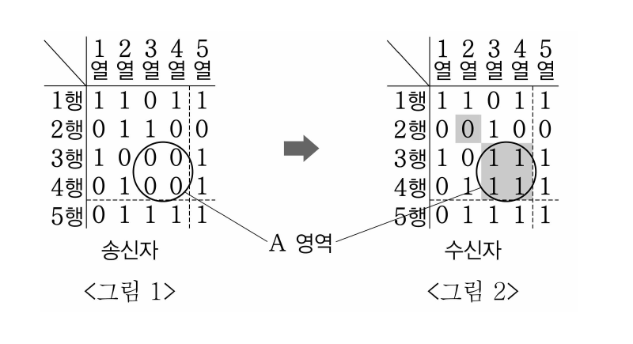
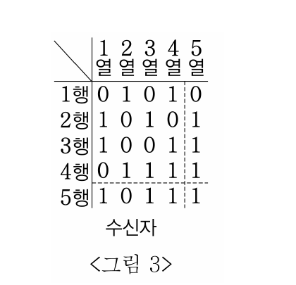
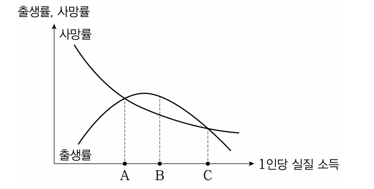

# 01 - RA (2015)

다음 글로부터 추론한 것으로 옳은 것만을 <보기>에서 있는 대로 고른 것은?

## 제시문

우리 헌법은 국가가 개인이 가지는 불가침의 기본적 인권을 확인하고 이를 보장할 의무를 진다고 규정함으로써, 소극적으로 국가가 국민의 기본권을 침해하는 것을 금지하는 데 그치지 않고 적극적으로 국민의 기본권을 타인의 침해로부터 보호할 의무를 부과하고 있다. 국가가 소극적 방어권으로서의 기본권을 제한하는 경우, 자유와 권리의 본질적 내용을 침해할 수는 없으며 침해 범위도 필요 최소한도에 그쳐야 한다. 그러나 국가가 적극적으로 국민의 기본권을 보호해야 하는 경우에는 설사 그 보호의 정도가 국민이 바라는 이상적인 수준에 미치지 못한다고 해서 헌법 위반으로 보기는 어렵다. 국가가 기본권 보호의무를 어떻게, 어느 정도로 이행할지는 국가의 정치․경제․사회․문화적인 제반 여건을 고려하여 정책적으로 판단해야 하는 재량의 범위에 속하기 때문이다. 따라서 헌법재판소는 이러한 재량을 존중하는 취지에서 소위 과소보호금지원칙을 적용하여 국가의 기본권 보호의무 위반 여부를 판단한다. 이 원칙에 따르면 국가는 국민의 기본권 보호를 위하여 적절하고 효율적인 최소한의 보호조치를 취해야 하고, 이에 미치지 못하는 경우에만 기본권 보호의무를 위반한 것으로 판단된다.

## 보기

ㄱ. 건축 공사장의 먼지로 주변 주민들의 주거권이라는 기본권이 침해된다고 인정된다. 그런데 국가가 건축 경기 활성화를 이유로 아무 규제 조치도 취하지 않는다면 이는 주거권 보호의무 위반이다.

ㄴ. 농어촌 지역에 약국이 부족해서 주민들의 건강권이라는 기본권이 침해된다고 인정된다. 이에 주민 수와 상관없이 일정한 면적마다 약국을 설치하는 것이 적절하고 효율적인 최소한의 조치로 평가되는데, 제시된 면적보다 10배 이상 넓은 면적 단위마다 약국을 설치하도록 국가가 조치했다면 이는 건강권 보호의무 위반이다.

ㄷ. 확성장치 사용에 의한 소음으로 환경권이라는 기본권이 침해된다고 인정된다. 이에 확성장치의 ‘전면적 사용 금지’, ‘특정 시간대별 사용제한’, ‘사용 대수 제한’ 등이 적절하고 효율적인 조치로 평가받고 있는데 국가가 그중 효율성이 중간 정도라 평가받는 ‘사용 대수 제한’ 조치를 취했다면 이는 환경권 보호의무 위반이다.

## 선택지

(1) ㄴ

(2) ㄷ

(3) ㄱ, ㄴ

(4) ㄱ, ㄷ

(5) ㄱ, ㄴ, ㄷ

# 02 - RA (2015)

다음 글로부터 추론한 것으로 옳은 것만을 <보기>에서 있는 대로 고른 것은?

## 제시문

형사법은 형법과 형사소송법 등으로 구성된다. 형법은 범죄와 형벌에 관한 내용을, 형사소송법은 범죄의 수사, 공소의 제기, 공판절차, 유․무죄의 선고 등 형사절차를 규정하고 있다.

형법의 경우 원칙적으로 범죄와 형벌은 행위자가 행위할 당시의 법규정에 의해서만 결정되어야 한다. 행위할 당시 범죄가 되지 않았던 행위를 이후에 법을 제정 또는 개정하여 처벌하거나, 범죄를 저지를 당시에 규정되었던 처벌의 범위를 넘어서 나중에 중하게 처벌한다면, 어떠한 국민도 자유롭게 자신의 삶을 살아갈 수 없게 된다. 그러나 이러한 원칙은 국가 형벌권이 국민에게 불이익을 줄 경우에만 해당할 뿐, 만약 과거의 국가 형벌권이 남용되었다는 반성에 근거하여 형을 감경 또는 면제할 때에는 적용되지 않는다.

그런데 형사소송법의 경우에도 형법상의 원칙이 적용되어야 하는지에 대해서는 견해가 대립되고 있다. A견해는 형사소송법이 국가 형벌권을 실현하는 절차를 규율할 뿐 범죄와 형벌 그 자체를 정하는 것은 아니기 때문에 형법상 원칙이 적용될 필요는 없다는 입장이다. 반면, B견해는 형사소송법이 절차에 관한 규정이지만 이것을 새롭게 만들거나 바꾸는 것이 국가 형벌권을 이용하여 국민에게 불이익을 주는 경우와 실질적으로 다르지 않다면, 행위자가 행위를 할 당시의 규정이 적용되어야 한다는 입장이다.

## 보기

ㄱ. 헌법재판소의 위헌결정으로 인하여 형벌에 관한 법률이 소급하여 효력을 상실하였다면, 당해 법률조항이 적용되어 공소가 제기된 사건에 대해 무죄판결이 선고되어야 한다.

ㄴ. 형사소송법상 친고죄는 고소기간 내에 고소가 있어야 검사가 공소를 제기할 수 있다. 만약 행위자가 친고죄에 해당하는 범죄를 저지른 후 고소기간이 경과되지 않은 상태에서 법률이 개정되어 친고죄의 고소기간이 연장되었다면, A견해에 의할 경우 개정된 법률은 당해 행위자에게 적용된다.

ㄷ. 행위자가 범죄를 저지른 후 외국에 도피해 있는 동안 공소시효가 완성되었음에도 불구하고, 만약 행위자가 외국에 있는 기간 동안은 공소시효가 정지되는 것으로 형사소송법이 개정되었다면, B견해에 의할 경우 행위자가 귀국하여 그에 대한 공소제기 여부를 판단할 때 외국에 도피해 있던 기간은 제외하고 공소시효 기간을 계산해야 한다.

## 선택지

(1) ㄱ

(2) ㄴ

(3) ㄷ

(4) ㄱ, ㄴ

(5) ㄱ, ㄷ

# 03 - RA (2015)

다음 글로부터 추론한 것으로 옳은 것만을 <보기>에서 있는 대로 고른 것은?

## 제시문

법은 여러 종류의 규칙들이 결합하여 이루어지는 체계이고, 그 기저에는 ‘무엇이 법인가’에 대한 규칙인 ‘승인규칙’이 자리한다. 승인규칙은 ‘사회적 규칙’의 일종이다. 사회적 규칙은 어떤 집단에서 구성원 대부분이 어떤 행위를 반복적으로 할 때 존재한다는 점에서 집단적인 습관과 비슷하지만, 그에 대한 준수의 압력이 있고, 그로부터의 일탈은 잘못된 것으로 비판받으며, 그래서 적어도 일부 구성원들이 그 행동을 집단 전체가 따라야 하는 일반적인 기준으로 보는 반성적이고 비판적 태도를 가진다는 점에서 습관과 구별된다. 사회적 규칙에 대하여 사회구성원 다수는 그것을 행동의 기준이나 이유로 받아들이고 사람들의 행위에 대한 비판적인 태도를 정당화하는 근거로 여기는 ‘내적 관점’을 취한다.

승인규칙은 법관들과 공직자들 및 시민들이 일정한 기준에 비추어서 법을 확인하는 관행 또는 실행으로 존재한다. 그럴 때 그들은 그 규칙에 대하여 내적 관점을 가지고 있다. 그 체계의 다른 규칙들에 대한 효력기준을 제공하는 궁극적인 규칙이기 때문에, 승인규칙에 대하여는 다시 효력을 물을 수는 없고, 과연 그것이 실제와 부합하는지, 그런 승인규칙을 가진 법체계가 없는 것보다 나은지, 그것을 지지할 타산적 근거나 도덕적 의무가 있는지 등의 문제가 제기될 수 있을 뿐이다. 어딘가에 법이 있다고 할 수 있기 위해서는 법관들이 그 규칙을 내적 관점에서 올바른 판결의 공적이고 공통된 기준으로 여겨야 한다. 이는 법체계 존재의 필수조건이다. 통일적이고 계속적이지 않다면 법체계가 존재한다고 할 수 없고, 법체계의 통일성과 계속성은 법관들이 법적 효력에 대한 공통의 기준을 수용하는 데 달려 있기 때문이다.

## 보기

ㄱ. 어떤 사회에 소수의 채식주의자가 있다면, “육식을 하면 안 된다.”는 것이 그 사회의 사회적 규칙이다.

ㄴ. 법으로 음주를 금지하지 않는 나라의 국민이 법으로 음주를 금지하는 나라의 이야기를 하면서 “그 나라에서는 술을 마시면 안 된다.”고 할 때, 그는 ‘내적 관점’을 취하고 있다.

ㄷ. 군주가 법을 제정하는 나라와 의회에서 법을 제정하는 나라의 승인규칙은 다르다.

## 선택지

(1) ㄱ

(2) ㄷ

(3) ㄱ, ㄴ

(4) ㄴ, ㄷ

(5) ㄱ, ㄴ, ㄷ

# 04 - RA (2015)

다음 글로부터 추론한 것으로 옳은 것을 <보기>에서 고른 것은?

## 제시문

A : 특허법은 발명을 장려하여 기술 발전을 촉진해야 한다. 발명가가 혁신적인 기술을 만들려면 상당한 노동이 요구된다. 하지만 노동의 산물로부터 이익을 얻을 수 없다면, 어느 누구도 노동을 하려 하지 않을 것이다. 때문에 국가는 당해 기술이 최초로 공개된 신규의 것으로서 산업상 이용 가능할 정도로 충분히 개발이 완료된 것이라면, 발명가에게 독점적 특허권을 부여함으로써 독점적 이익을 얻을 수 있게 해야 한다. 그러나 독점적 특허권은 기술의 사회적 이용을 가로막아 사회 전체의 효율성을 감소시킬 수 있다. 때문에 국가는 발명가가 당해 기술의 내용을 구체적으로 공개하고, 제한된 기간 동안에만 독점권을 행사할 수 있게 해야 한다.

B : 특허법은 기술 발전을 촉진하여 사회적 이익을 증대하기 때문에 반드시 요구되지만, 그로 인해 발생하는 사회적 손실을 최소화할 필요가 있다. 독점적 특허권을 통해 발명가가 얻을 수 있는 막대한 이익은 치열한 특허 경쟁과 과도한 중복 투자를 유발하는데, 이때 경쟁에 탈락한 사람들의 투자 비용은 모두 사회적 손실이 된다. 특히 특허법이 개발이 충분히 완료된 기술이어야 함을 요구한다면 특허 경쟁은 오랫동안 지속될 수밖에 없고 그에 비례하여 사회적 손실은 커지게 된다. 이러한 이유로 국가는 아직 기술 개발이 완료되지 않았어도 장래 혁신적인 것으로 개발될 가능성이 있는 발명에 대해 독점적 특허권을 부여함으로써 중복 투자가 발생할 수 있는 기간을 단축시켜야 한다. 또한 개선 단계에서의 경쟁을 제한하기 위해 발명가에게 앞으로 개발될 수 있는 기술의 구체적 개선 과정들을 조정할 수 있는 광범위한 권한을 부여해야 한다. 더불어 발명가가 개발 가능한 기술을 상업화하여 독점적 이익을 얻으려면 더 오랜 기간이 필요하기 때문에 특허권의 보호 기간도 연장해야 한다.

## 보기

ㄱ. A는 특허법의 목적이 기술 발전을 통한 사회적 효율성의 증대라고 보는 반면, B는 그렇지 않다.

ㄴ. A는 ‘만약 B에 따라 특허법을 제정한다면 최초 발명가는 특허권을 통해 보다 큰 독점적 이익을 얻을 수 있으므로 특허 경쟁은 더 치열해져 결국 B가 우려하는 사회적 비용은 줄지 않을 것이다’라고 반박할 수 있다.

ㄷ. 신약 개발 과정에서 최초의 아이디어가 상업화 단계에 이르기 위해서는 너무 오랜 시간과 많은 비용이 든다면 B의 설득력은 높아진다.

ㄹ. 수많은 기존 발명에 근거하여 혁신적 연구가 이루어져야만 신제품을 개발할 수 있는 생명공학 분야에서, 발명가의 조정 권한을 광범위하게 인정할 경우 혁신적 신제품이 시장에 등장하는 속도가 늦어진다면, B의 설득력은 높아진다.

## 선택지

(1) ㄱ, ㄴ

(2) ㄱ, ㄷ

(3) ㄴ, ㄷ

(4) ㄴ, ㄹ

(5) ㄷ, ㄹ

# 05 - RA (2015)

<사례>별로 그것의 정당성을 인정하는 <주장>들을 모두 골라 바르게 배열한 것은?

## 제시문

대통령의 특권인 사면에는 일반 사면과 특별 사면이 있다. 일반 사면은 죄의 종류를 지정하여 이에 해당하는 모든 죄인에 대해 형의 선고의 효력을 소멸시키며 형의 선고를 받지 않은 자에 대해서는 공소권을 소멸시키는 것을 말한다. 특별 사면은 형의 선고를 받은 특정인에 대해 형의 집행을 면하는 것을 말한다. 대통령의 사면권은 사법부 결정을 무효화한다는 점에서 남용에 대한 우려가 제기되어 왔고 그 행사에는 일정한 제한이 필요하다는 논의가 있다.

<주장>

갑 : 일반 사면이든 특별 사면이든 정권에 대립하는 정적을 포용하는 대승적 차원에서만 그 행사가 정당화될 것입니다.

을 : 일반 사면이든 특별 사면이든 폭넓게 인정될 필요가 있지만, 정적이나 측근에 대한 특별 사면은 대통령의 사면권 남용의 적나라한 모습이므로 정당화될 수 없습니다.

병 : 특정인만을 대상으로 하지 않는 일반 사면은 대통령에 의하여 남용될 가능성이 낮아 큰 문제가 없지만, 특별 사면은 그렇지 않아 일정한 제한이 필요합니다. 헌정 질서를 파괴 또는 교란하는 행위를 한 자나 뇌물 수수를 한 범죄자의 경우에 한해서는 특별 사면을 허용하지 않도록 해야 합니다.

정 : 다들 사면권 행사의 절차적 정당성은 고려하지 않는군요. 대통령의 사면권 행사에는 전면적인 재량을 인정할 필요가 있지만 권력분립 원칙상 이에 대한 절차적 견제 장치는 필요합니다. 일반 사면이나 특별 사면 모두 관련 심의 기관의 심의 과정을 거치고 국회의 동의도 받아야 정당화될 것입니다.

<사례>

(가) 헌정 질서를 교란한 죄로 징역형을 선고받고 대통령과 정치적으로 대립 중인 야당 대표 A에 대하여 대통령은 야당과의 연립정부를 구성하기 위하여 관련 심의 기관의 심의를 거치고 국회의 동의를 받아 사면을 내렸다.

(나) 대통령의 최측근인 B가 간통죄로 기소되어 벌금형을 선고받았는데 그의 정치적 복귀를 돕고자 대통령은 관련 심의 기관의 심의를 거쳤지만 국회의 동의를 받지는 않고 B에 대하여 사면을 내렸다.

(다) 소비자보호법을 위반하여 300만 원 이하의 벌금형을 받은 자 모두에 대하여, 경기 활성화 차원에서 대통령은 관련 심의 기관 심의를 거치고 국회의 동의를 받아 형의 선고의 효력을 소멸시키는 사면을 내렸다.

## 선택지

|  | (가) | (나) | (다) |
|---|---|---|---|
| (1) | 갑 | 병, 정 | 을, 정 |
| (2) | 정 | 갑, 병 | 을, 병, 정 |
| (3) | 갑, 정 | 병 | 을, 정 |
| (4) | 갑, 정 | 병, 정 | 병, 정 |
| (5) | 갑, 정 | 병 | 을, 병, 정 |

# 06 - RA (2015)

<규정>으로부터 추론한 것으로 옳은 것만을 <보기>에서 있는 대로 고른 것은?

## 제시문

<규정>

(가) A법은 상시 사용하는 근로자 수가 5명 이상인 모든 사업장에 적용한다. 다만, 사용자가 그와 동거하는 친족만을 사용하는 사업장에 대하여는 적용하지 아니한다.

(나) (가)에서의 ‘상시 사용하는 근로자 수’는, 해당 사업장에서 법 적용 사유 발생일 전 1개월 동안 사용한 근로자의 ‘연인원’을 같은 기간 중의 ‘가동일수’로 나누어 산정한다. 여기서 ‘연인원’이라 함은 특정 업무를 위해 일정한 기간 동안 동원된 총 인원수를 말하는데, 예를 들면 열흘 동안 매일 다섯 사람이 근로하여 완성한 일의 연인원은 50명이다. 그리고 ‘가동일수’는 실제 사업장이 운영된 일수를 말한다.

(다) 위 (나)에 따라 해당 사업장에서 상시 사용하는 근로자 수를 산정한 결과 법 적용 사업장에 해당하는 경우에도, 가동일수의 일별로 근로자 수를 파악하였을 때 법 적용 기준에 미달한 일수가 가동일수의 2분의 1 이상인 경우, A법이 적용되지 않는다.

(라) 연인원의 산정 시, 사용자에게 고용되어 있지 않은 파견근로자는 제외되지만 해당 사업장의 사용자에 고용된 단시간 근로자(하루 중 일부 시간만 근무하는 근로자)는 포함된다.

## 보기

ㄱ. 법 적용 사유 발생일 전 1개월 동안, 가동일수가 20일이며, 처음 10일은 6명, 나중 10일은 4명이 사용자에게 고용되어 근무하였다면 당해 사업장에 A법은 적용된다.

ㄴ. 법 적용 사유 발생일 전 1개월 동안, 사용자에게 고용된 4명의 근로자가 오전 중 3시간을 매일 근무하고, 사용자에게 고용된 또 다른 4명의 근로자가 오후 중 3시간을 매일 근무한 사업장에 A법은 적용된다.

ㄷ. 법 적용 사유 발생일 전 1개월 동안, 동거하는 친족 3명과 단시간 근로자 2명이 당해 사업장에서 사용자에게 고용되어 고정적으로 매일 근무하였고 이에 더하여 사용자에게 고용되어 있지 않은 파견근로자 2명이 함께 매일 근무하였다면 당해 사업장에 A법은 적용되지 않는다.

## 선택지

(1) ㄱ

(2) ㄴ

(3) ㄱ, ㄷ

(4) ㄴ, ㄷ

(5) ㄱ, ㄴ, ㄷ

# 07 - RA (2015)

다음 글로부터 추론한 것으로 옳지 않은 것은?

## 제시문

민사소송에서는 원칙적으로 당사자가 절차의 개시와 종결을 주도하고, 심판의 대상과 범위를 정한다. 그리하여 법원은 당사자가 판결을 신청한 사항에 대하여 그 신청 범위 내에서만 판단하여야 한다. 따라서 당사자가 신청한 사항과 별개의 사항에 대해서 판결하여서는 안 된다. 예컨대, 원고가 불법행위를 이유로 손해배상을 청구한 경우에 계약불이행과 같이 그와 다른 이유를 근거로 하여 손해배상을 명할 수는 없다. 또, 당사자가 신청한 것보다 적게 판결하는 것은 허용되지만, 신청의 범위를 넘어서 판결하여서는 안 된다.

이와 관련하여, 신체상해로 인한 손해배상을 청구하는 경우에 심판대상을 어떻게 볼지 견해가 엇갈린다. A견해는 치료비 등의 적극적인 손해와 치료기간 동안 얻지 못한 수입 등의 소극적인 손해, 그리고 정신적 손해를 구별하여 서로 다른 세 개의 심판대상으로 보고, B견해는 그 전체가 하나의 심판대상이라고 본다.

<사례>

◦ 갑은 을에게 1,000만 원을 빌려주었다.

◦ 병은 정의 잘못으로 교통사고를 당하였고, 정에게 치료비 2,000만 원, 치료기간 동안 얻지 못한 임금 7,000만 원, 정신적 손해 1,000만 원의 손해에 대한 배상을 청구하였다. 법원은 병이 입은 손해를 치료비 3,000만 원, 치료기간 동안 얻지 못한 임금 4,000만 원, 정신적 손해 3,000만 원으로 평가하였다.

## 선택지

(1) 갑은 을에게 빌려준 돈 1,000만 원을 지급하라고 청구하였지만 법원이 판단하기에 빌려준 돈은 500만 원이고 을에게 받을 매매대금이 500만 원이라면, 법원은 500만 원을 한도로 하여 갑의 청구를 받아들이는 판결을 할 수 있다.

(2) 갑이 을에게 빌려준 돈 500만 원을 지급하라고 청구하였다면, 법원이 판단하기에 빌려준 돈이 1,000만 원이라도 법원은 500만 원을 한도로 하여 갑의 청구를 받아들이는 판결을 할 수 있다.

(3) A견해에 따르면, 법원은 치료비의 경우 2,000만 원을 한도로 하여 병의 청구를 받아들이는 판결을 할 수 있다.

(4) B견해에 따르면, 법원은 1억 원을 한도로 하여 병의 청구를 받아들이는 판결을 할 수 있다.

(5) 어떤 견해에 따르든, 원고가 신청한 교통사고 손해배상액의 총액이 법원이 인정한 손해배상액의 총액보다 적은 경우에 원고가 신청한 액수보다 적은 금액을 배상하라고 판결할 수는 없다.

# 08 - RA (2015)

Y의 소유권자에 대하여 A와 B의 판단이 일치하지 않는 경우는?

## 제시문

<사건 개요>

갑은 을 소유의 소 X를 훔쳐 병에게 팔았다. 갑은 이러한 사실을 병에게 말하지 않았기 때문에 병은 매수할 당시 X가 도둑맞은 소임을 알지 못했다. X는 병의 농장에서 송아지 Y를 출산하였다. 그 후 을은 병의 농장에서 X를 찾게 되었고, 병에게 X와 Y를 모두 자기에게 반환하라고 요구하고 있다.

<법률>

원래의 소유권자는 도둑맞은 물건(도품)을 매수한 사람에게 자신의 소유물을 반환하라고 요구할 수 있다. 그러나 매수자가 그 물건을 매수하였을 당시에 도품인 것을 알지 못한 상태에서 2년 동안 보유하였을 때에는 도품에 대한 소유권을 갖게 된다.

<논쟁>

A : Y는 X의 일부로 보아 판단해야 해. <법률>에 따라 아직 일정한 기간이 지나지 않았기 때문에 병이 X를 소유할 수 없다고 판단된다면 그 경우에 Y도 을의 것이어야 해. 이 경우 X가 Y를 을의 농장에서 수태하였든 병의 농장에서 수태하였든 그것은 고려할 필요가 없어. 또한 <법률>이 정한 기간이 지나 병이 X의 소유권을 갖게 되면 병은 Y도 소유하게 돼.

B : 항상 Y를 X의 일부로 판단할 수는 없어. 물론 병이 X를 소유할 수 있을 정도로 <법률>이 정한 기간이 지났다면 Y도 병의 소유가 된다는 점은 당연해. 하지만 그러한 기간이 지나지 않은 경우에도 병이 X를 매수한 다음에 Y가 수태되었고, Y가 태어날 때까지 X가 도품인 줄 병이 몰랐다면, 병은 Y를 가질 자격이 있어. 이 경우만은 X와 Y의 소유를 별개로 생각해야 해.

## 선택지

(1) X가 Y를 수태한 것이 도난되기 전이었고, Y의 출산 이후 X가 도품임을 병이 알았는데 그 시점이 매수 이후 2년이 지나기 전인 경우

(2) X가 Y를 수태한 것이 도난되기 전이었고, Y의 출산 이후 X가 도품임을 병이 알았는데 그 시점이 매수 이후 2년이 지난 뒤인 경우

(3) X가 Y를 수태한 것이 매수 이후이었고, Y의 출산 이후 X가 도품임을 병이 알았는데 그 시점이 매수 이후 2년이 지나기 전인 경우

(4) X가 Y를 수태한 것이 매수 이후이었고, Y의 출산 이후 X가 도품임을 병이 알았는데 그 시점이 매수 이후 2년이 지난 뒤인 경우

(5) X가 Y를 수태한 것이 매수 이후이었고, Y의 출산 이전에 X가 도품임을 병이 알았는데 그 시점이 매수 이후 2년이 지나기 전인 경우

# 09 - RA (2015)

갑～병의 견해에 대한 판단으로 옳은 것만을 <보기>에서 있는 대로 고른 것은?

## 제시문

갑 : 오늘 흥미로운 사건의 재판이 있었어. 피고인은 피해자를 칼로 찔렀다는 점을 인정했지만 자신이 피해자를 살해하지는 않았다고 주장했지. 이 사건이 흥미로운 점은 피해자가 나타나지 않는다는 거야. 사건 발생 이후로 피해자를 목격했다는 사람도 없고 피해자의 시체도 발견되지 않았어. 하지만 피고인이 인정했듯이 피해자는 많은 피를 흘렸어. 일반적으로 사람은 혈액량의 $30\%$를 잃으면 사망할 확률이 높은데, 경찰 수사에 따르면 피해자는 혈액량의 $40\%$에 해당하는 피를 현장에서 쏟은 것으로 추정된다고 해. 피고인의 진술과 주변 사람들의 증언을 고려할 때, 피해자가 사망했을 것은 확실해. 나는 피고인이 피해자를 살해한 범인이라고 판결을 내리는 것이 옳다고 생각해.

을 : 여러 증거를 종합할 때, 누군가 피해자를 살해했다면, 피고인이 그런 일을 저질렀다는 점은 분명하지. 하지만 시체의 발견 여부는 다른 증거와는 차원이 다른 중대한 문제라는 걸 염두에 두어야 해. 피해자의 혈흔을 지우기 위해서 근처 해안가에서 바닷물을 떠다가 자동차 좌석을 씻었다는 피고인의 주장이 참일 수 있지 않을까? 만약 그렇다면 피고인이 주장하고 있듯이 피해자가 혈액량의 $40\%$를 잃었다는 추정은 잘못일 가능성이 있어. 피고인이 피해자를 살해했을 가능성을 부정하지는 않지만, 피고인이 피해자를 살해하지 않았다고 합리적으로 의심할 여지는 여전히 있다고 보여.

병 : 물론 여러 가지를 의심해 볼 수 있지. 심지어 피해자가 자신의 혈액을 평소 조금씩 모으고 있었고 이를 자동차 좌석에 부어서 자신이 죽은 것처럼 위장한 후 잠적했을 가능성도 있지. 하지만 여러 정황을 고려할 때, 그런 의심을 ‘합리적’이라고 여길 수는 없어. 모든 증거는 피고인이 살인을 저지른 자가 분명함을 말하고 있어. 하지만 문제는 살인 사건이 성립하기 위한 조건이야. 이 사건은 시체를 발견하지 못한 사건이야. 시체를 발견하지 못했다면, 살인 사건은 성립할 수 없어.

## 보기

ㄱ. ‘피해자가 사망했다는 것은 확실하다’는 견해에 갑과 병은 동의할 것이다.

ㄴ. ‘피고인이 살인 사건의 범인이라고 판결을 내리는 것이 옳다’는 견해에 을은 동의하지 않지만 병은 동의할 것이다.

ㄷ. ‘피해자가 살해된 시체로 발견된다면 피고인이 살인범이라는 점은 확실하다’는 견해에 갑, 을, 병 모두 동의할 것이다.

## 선택지

(1) ㄱ

(2) ㄴ

(3) ㄱ, ㄷ

(4) ㄴ, ㄷ

(5) ㄱ, ㄴ, ㄷ

# 10 - RA (2015)

(A)에 들어갈 두 진술로 적절한 것을 <보기>에서 고른 것은?

## 제시문

인간 다수의 이익을 위해서 영장류를 포함한 동물 소수에게 고통을 가하는 동물 실험은 도덕적으로 정당화될 수 있는가? 인간이 아닌 동물은 도덕적 고려의 대상이 될 수 없다는 주장은 논외로 하겠다. 도덕적 고려의 대상이 되어야 하는지는 고통을 느끼는 감각 능력이 있는지에 달려 있기 때문이다. 어떤 종에 속하는지에 상관없이 고통을 느낄 수 있는 개체들의 이익은 서로 동등하게 고려되어야 한다.

동물 실험을 크게 두 가지 경우로 나눠 생각할 수 있다. 하나는 인간의 사소한 이익을 위해서 동물이 상당한 고통을 겪는 경우이고, 다른 하나는 인간의 상당한 이익을 위해서 동물이 상당한 고통을 겪는 경우이다. 화장품이나 식용 색소와 같은 제품을 개발하기 위해서 하는 동물 실험이 전자에 속한다. 이를 통해서 생기는 이익은 동물에게서 박탈되는 이익에 비해 사소하기에 이런 동물 실험은 도덕적으로 정당화될 수 없다. 그렇다면 후자의 경우는 어떤가? 나는 후자의 동물 실험도 도덕적으로 정당화될 수 없다고 생각한다. 동물은 대개의 인간과는 달리 자신의 먼 미래를 계획할 수 없다는 이유에서 인간의 이익이 동물의 이익보다 더 크지만, 그렇다고 해도 동물 실험을 통해서 동물에게 고통을 줌으로써 그 이익을 박탈할 수는 없다.

다음 두 진술을 함께 받아들임으로써 나의 주장은 정당화된다.

(A)

## 보기

(가) 갓난아기는 자신의 먼 미래를 계획할 수 없다.

(나) 갓난아기는 누린 이익이 없으므로 박탈될 이익도 없다.

(다) 다른 인간의 이익을 위해서 갓난아기의 이익을 박탈할 수 없다.

(라) 동물 실험을 통해서 얻게 될 인간의 상당한 이익과 그 실험에서 박탈될 동물의 이익은 상쇄된다.

(마) 이익을 포기하는 것이 도덕적으로 정당한 행위라고 해서 다른 사람에게 이를 하라고 명령할 수는 없다.

## 선택지

(1) (가)와 (다)

(2) (가)와 (라)

(3) (나)와 (다)

(4) (나)와 (마)

(5) (라)와 (마)

# 11 - RA (2015)

갑～병에 대한 판단으로 옳지 않은 것은?

## 제시문

갑 : 금욕이 인간을 자유롭게 만든다. 고통을 견디는 것을 습관화하고 쾌락의 추구를 삼가도록 습관화하라. 우리 삶의 궁극 목표는 일체의 필요와 외적 가치로부터의 자유, 즉 자족성이다. 온갖 욕망들로부터 내적으로 자유로워지고 어떠한 정념에도 휘둘리지 않는 부동심이 자족적 삶의 특징이다. 금욕의 훈련에 의해 슬픔이나 기쁨에도 전혀 무관심한 부동심의 경지에 이를 수 있다.

을 : 금욕주의는 숨겨진 쾌락주의다. 자유를 지향하는 금욕도 결국은 고도의 정신적 기쁨을 지향한다는 점에서 소극적 쾌락주의와 다름없다. 금욕주의자들이 버린 것은 순수하지 않은 것, 즉 육체의 쾌락이나 그로부터 파생되는 쾌락일 뿐, 그들조차도 순수한 것은 함양하였다. 그 이름이야 어떠하든 이 순수한 것 또한 쾌락과 다름없으며, 쾌락이야말로 쾌락 이외의 그 무엇인가를 위한 것이 아닌 유일무이의 본래적 가치이다. 그런 점에서 금욕을 위한 금욕은 어리석다.

병 : 금욕을 위한 금욕은 어리석다기보다는 도덕의 명령에 대한 은밀한 혐오를 감추고 있다. 자신에게 잘못이 없는데도 스스로를 고통으로 몰아넣기 때문이다. 고통의 추구가 아니라 오히려 쾌락의 추구가 의무이다. 욕구가 충족되지 않은 자신의 처지에 대한 불만족의 누적은 더 중요한 의무들을 위반하게 하는 커다란 유혹이 될 수 있기 때문이다. 그런 점에서 쾌락의 추구는 간접 의무이다. 즉, 의무 수행에 장애가 되지 않을 만큼은 쾌락을 추구해야 한다는 것이다.

## 선택지

(1) 쾌락은 추구할 만하다는 것에 을은 동의하고, 갑은 동의하지 않을 것이다.

(2) 욕망을 절제하여 도달한 상태도 쾌락의 상태라는 것에 갑과 을은 동의할 것이다.

(3) 일체의 욕망 추구를 금지하는 것에 갑은 동의하고, 을과 병은 동의하지 않을 것이다.

(4) 쾌락보다 상위의 가치가 있다는 것에 갑과 병은 동의하고, 을은 동의하지 않을 것이다.

(5) 쾌락 추구의 허용 근거가 쾌락 자체에 있다는 것에 을은 동의하고, 병은 동의하지 않을 것이다.

# 12 - RA (2015)

다음 대화를 분석한 것으로 옳지 않은 것은?

## 제시문

소크라테스 : 자네 생각으로는 어떤 이는 좋은 것을 원하지만 Ⓐ 어떤 이는 나쁜 것을 원한다는 건가?

메논 : 네.

소크라테스 : 나쁜 것을 원하는 자는 ㉠ 나쁜 것을 좋은 것인 줄로 여기고서 원하는 자인가, 아니면 나쁜 것인 줄 알면서도 원하는 자인가?

메논 : 양쪽 다 있습니다.

소크라테스 : 나쁜 것인 줄 알면서도 원하는 자는 ㉡ 그 나쁜 것이 자신에게 이로울 줄로 여기고서 원하는 자인가, 아니면 해로울 줄 알고서 원하는 자인가?

메논 : 두 부류 다 있습니다.

소크라테스 : 또한 그 나쁜 것이 자신에게 이로울 것으로 여기는 자들은 그 나쁜 것이 나쁜 줄을 아는 자일까?

메논 : 적어도 그건 전혀 아닐 것입니다.

소크라테스 : 그렇다면 그는 나쁜 것을 원하는 자는 아니네. 나쁜 줄 몰라서 그게 좋은 줄로 여긴 거니까 실상 그런 사람은 ㉢ 좋은 것을 원하는 자임이 명백하네.

메논 : 적어도 그들은 그런 것 같습니다.

소크라테스 : 한편 자네 주장처럼, ㉣ 나쁜 것이 해로울 줄로 여기면서도 그 나쁜 것을 원하는 자는, 그것으로 해서 자신이 해로움을 당할 것임을 알고 있을까?

메논 : 그야 물론입니다.

소크라테스 : 그러나 이들은 해로움을 당하는 자를 비참한 자로 간주하겠지?

메논 : 그것 또한 필연적입니다.

소크라테스 : 하지만 ㉤ 비참하기를 원하는 자가 있을까?

메논 : 없을 것으로 생각됩니다.

소크라테스 : 그렇다면 Ⓑ 아무도 나쁜 것을 원하지는 않네.

메논 : 참으로 맞는 말씀입니다.

- 플라톤, 「메논」 -

## 선택지

(1) 메논은 Ⓐ에 대한 견해를 바꾸었다.

(2) 메논은 나쁜 것이 나쁜 줄을 아는 자에 ㉠이 포함되지 않는다고 인정하였다.

(3) 소크라테스는 ㉠과 ㉡을 모두 ㉢에 포함시켰다.

(4) 메논은 ㉣이 있을 수 있다는 견해를 유지하였다.

(5) ㉤이 있다면 메논은 Ⓑ에 동의할 필요가 없다.

# 13 - RA (2015)

다음 글을 분석한 것으로 옳지 않은 것은?

## 제시문

가장 강한 자라고 하더라도 자기의 힘을 권리로, 복종을 의무로 바꾸지 않고서는 언제나 지배자 노릇을 할 수 있을 만큼 강하지는 않다. 따라서 ‘강자의 권리’라는 구절이 언뜻 반어적인 의미를 가진 것으로 보이면서도 실제로 하나의 근본 원리인 것처럼 여겨지는 것에 대하여 뭔가 설명이 필요하다. ⓐ 힘이란 물리력인데, 물리력이 어떻게 도덕적 결과를 가져올 수 있는지 나는 이해할 수 없다. ⓑ 힘에 굴복하는 것은 어쩔 수 없어서 하는 행동이요 기껏해야 분별심에서 나온 행동이지 의무에서 나온 행동은 아니다.

ⓒ 만일 강자의 권리라는 것이 있어서, 힘이 권리를 만들어낸다고 해보자. 그렇다면, 원인이 바뀜에 따라 결과도 달라지므로, 최초의 힘보다 더 강한 힘은 최초의 힘에서 생긴 권리까지도 차지해 버릴 것이다. 힘이 있어서 불복한다면 그 불복종은 정당한 것이 되며 강자는 언제나 정당할 터이므로 오직 중요한 점은 강자가 되는 것뿐이다. ⓓ 힘이 없어질 때 더불어 없어지고 마는 권리란 도대체 무엇인가? ⓔ 강도가 덮쳤을 때 내가 강제로 지갑을 내주어야 할 뿐만 아니라 지갑을 잘 감출 수 있을 때에도 강도의 권총이 권력이랍시고 양심에 따라 지갑을 내줄 의무가 있는 것은 아니다. ⓕ 어쩔 수 없어서 복종해야 한다면 의무 때문에 복종할 필요는 없으며 복종을 강요받지 않을 경우에는 복종할 의무도 없다. 권리에 복종하라는 말이 만약 힘에 복종하라는 말이라면, 이는 좋은 교훈일지는 몰라도 하나마나한 말로서, ⓖ 나는 그러한 교훈이 지켜지지 않는 일은 결코 없으리라고 장담할 수 있다. ⓗ ‘강자의 권리’라는 말에서 ‘권리’는 ‘힘’에 덧붙이는 것이 없으며, 따라서 공허한 말이다.

- 루소, 「사회계약론」 -

## 선택지

(1) ⓑ가 ⓐ를 뒷받침하려면 ‘물리적인 것’과 ‘도덕적인 것’의 구별이 전제되어야 한다.

(2) ⓒ～ⓗ에서 글쓴이는 ‘강자의 권리’라는 구절로부터 불합리한 귀결이 나옴을 보임으로써 ‘강자의 권리’를 부정하는 논증을 펴고 있다.

(3) ⓔ는 ⓑ의 예시이다.

(4) ⓖ에서 글쓴이가 ‘장담’하는 근거는 ⓕ이다.

(5) ⓓ와 ⓗ는 둘 다 힘에서 나오는 ‘권리’라는 것은 무의미한 말임을 지적하고 있다.

# 14 - RA (2015)

다음 글로부터 추론한 것으로 옳은 것만을 <보기>에서 있는 대로 고른 것은?

## 제시문

옛날 주나라는 정전제를 실시하여 토지를 분배하였다. 요즘 학자들은 그렇게 분배할 만큼 토지가 풍족하지 않다거나 전국 사유지의 소유권을 모두 바꿀 수는 없다는 이유로 정전제의 부활이 불가능하다고 말한다. 그러나 지금 군호(軍戶)를 상대로 실시하고 있는 둔전제의 원리를 전국에 확대하면 정전제의 부활도 불가능하지 않다.

둔전제에서는 군호마다 토지 50무(畝)를 경작하는데, 전국의 둔전은 약 70만 경(頃)으로 전국 토지 면적 약 700만 경의 10분의 1이나 된다. 이를 나머지 10분의 9의 토지에 확대하는 개혁은 결코 불가능한 일이 아니다. 또한 전국적으로 둔전이 아닌 일반 토지 가운데 3분의 1은 국유지이므로, 사유지의 소유권을 건드리지 않고도 많은 민호(民戶)에게 토지를 분배할 수 있다. 물론 지금 전국의 민호는 약 1,000만 호를 헤아리니, 1호마다 50무씩 지급하려면 국유지만으로는 토지가 부족하다. 그렇다고 하더라도 모든 사유지의 소유권을 죄다 바꿀 필요는 없다. 1호마다 50무씩 분배한 뒤에도 1억 3천만 무에 달하는 사유지가 남기 때문이다.

## 보기

ㄱ. 군호는 약 140만 호일 것이다.

ㄴ. 둔전이 아닌 전국의 국유지는 약 420만 경일 것이다.

ㄷ. 개혁의 실시로 소유권 변동이 일어날 수 있는 사유지는 전국 사유지 면적의 절반을 넘지 않을 것이다.

## 선택지

(1) ㄱ

(2) ㄷ

(3) ㄱ, ㄴ

(4) ㄱ, ㄷ

(5) ㄴ, ㄷ

# 15 - RA (2015)

다음 글로부터 추론한 것으로 옳은 것만을 <보기>에서 있는 대로 고른 것은?

## 제시문

고대 아테네의 클레이스테네스는 지연과 혈연에 따른 참주의 출현을 방지하기 위해 다음과 같이 행정을 개편하였다. 모든 아테네인들을 총 139개의 데모스에 등록하게 한 다음, 아테네를 세 지역(도시, 해안, 내륙)으로 나누어 각 지역에 데모스를 할당하였다. 그 방식은 우선 각 지역에 균등하게 데모스를 할당하되, 남는 데모스는 도시 지역에 포함시키는 것이었다. 다음으로 각 지역마다 10개씩의 트리튀스를 만들고, 그 안에 데모스를 할당하였다. 그 방식은 우선 각 트리튀스에 균등하게 데모스를 할당하되, 남는 데모스는 1개의 트리튀스에 포함시키는 것이었다.

그런 다음 추첨으로 각 지역마다 트리튀스 1개씩을 뽑아 3개의 트리튀스로 1개의 필레를 구성하였다. 그리고 각 필레에서 추첨으로 50명씩 뽑아 평의회를 구성하였다. 역사가 A는 필레에 포함된 데모스 1개의 정원을 100명으로 가정할 경우, 각 지역에 거주하는 아테네인이 평의회에 뽑힐 확률을 분석하였다.

## 보기

ㄱ. 트리튀스는 최소 4개의 데모스를 포함한다.

ㄴ. 필레는 최대 31개의 데모스를 포함한다.

ㄷ. A의 가정에 따르면, 평의회에 뽑힐 확률이 가장 낮은 사람은 도시 지역 거주자이다.

## 선택지

(1) ㄱ

(2) ㄷ

(3) ㄱ, ㄴ

(4) ㄴ, ㄷ

(5) ㄱ, ㄴ, ㄷ

# 16 - RA (2015)

다음 글로부터 추론한 것으로 옳은 것만을 <보기>에서 있는 대로 고른 것은?

## 제시문

고대 로마 공화정에서는 전투 단위인 켄투리아가 민회를 구성하는 역할도 하였다. 민회에서 1켄투리아는 1표를 행사하였다. 켄투리아의 수는 최고 등급인 기병이 18개였고, 보병은 재산 등급에 따라 1등급 80개, 2등급 20개, 3등급 20개, 4등급 20개, 5등급 30개였으며, 재산이 기준에 미달하는 최하 등급이 5개로 편제되어, 총 투표수는 193표였다. 투표는 높은 등급인 기병부터 등급 순서대로 찬반 투표를 시행하였다. 각 등급의 투표는 한꺼번에 이루어졌는데, 그 결과 찬성표나 반대표가 과반을 넘는 순간 투표는 중지되었다. 그러다가 기원전 241년 경, 켄투리아의 개편이 단행되었다. 개편 이후, 기병 켄투리아와 최하 등급 켄투리아의 수는 이전과 동일하였으나, 1등급부터 5등급까지는 70개씩의 켄투리아를 두게 되었다.

역사가 A와 B는 켄투리아의 개편 이후 민회의 투표 방식을 추론하는 데에 이견을 보였다. A는 개편 이후에도 이전처럼 1켄투리아가 1표를 행사하는 방식으로 투표하였다고 가정하였다. 반면 B는 개편에도 불구하고 총 투표수는 개편 이전과 마찬가지로 193표였고, 개편 이후 2등급에서 4등급의 투표수는 과거와 같았지만 1등급 중 10표가 줄고 이 10표가 5등급에 가산되었다고 보았다.

## 보기

ㄱ. 개편 이전에 2등급 켄투리아는 투표하지 못할 수도 있었다.

ㄴ. A의 가정에 따를 경우, 3등급 켄투리아는 투표하지 못할 수도 있었다.

ㄷ. B의 가정에 따를 경우, 3등급 켄투리아는 투표하지 못할 수도 있었다.

## 선택지

(1) ㄱ

(2) ㄷ

(3) ㄱ, ㄴ

(4) ㄱ, ㄷ

(5) ㄴ, ㄷ

# 17 - RA (2015)

다음으로부터 추론한 것으로 옳은 것만을 <보기>에서 있는 대로 고른 것은?

## 제시문

디지털 통신에서 0과 1로 구성된 데이터 비트들을 전송하다 보면 오류로 인해 일부 데이터가 0에서 1로 혹은 1에서 0으로 바뀌어 전달될 수 있다. 송신자(sender)는 수신자(receiver) 쪽에서 오류를 탐지하는 데 도움을 주고자 부가 비트를 붙여 전송한다. <그림 1>에서 행렬의 5행과 5열이 부가 비트에 해당하고, 그 이외의 비트는 데이터 비트에 해당한다. 송신자는 데이터의 각 행과 각 열에서 1의 개수를 세어 1의 개수가 홀수이면 1을, 짝수이면 0을 부가 비트로 부여한다. 이렇게 만들어진 부가 비트를 데이터 비트들과 함께 전송하면 수신자는 부가 비트를 포함하여 각 행과 열의 1의 개수를 세어 짝수이면 정상 수신, 홀수이면 오류로 간주한다. <그림 2>와 같이 2행 2열의 데이터 비트가 전송 중 1에서 0으로 변경되면 수신자 측에서는 2행과 2열에서 1의 개수가 홀수가 되어 오류가 났음을 알 수 있다. 그러나 행과 열 각각에서 짝수 개의 데이터 비트들이 변경될 경우 부가 비트를 사용하더라도 수신자 측에서 오류를 탐지해 내지 못한다. <그림 2>의 A 영역에 있는 4개의 데이터 비트가 모두 0에서 1로 바뀌는 경우에는 3행, 4행, 3열, 4열에서 각각 1의 개수가 짝수이므로 오류를 탐지해 내지 못한다.

수신자가 <그림 3>과 같은 정보를 수신하였고 부가 비트에는 오류가 없다고 가정하자.

## 보기

ㄱ. <그림 3>의 2행과 3행에서 오류가 발생하였다.

ㄴ. <그림 3>의 2열과 4열에서는 오류가 발생하지 않았다.

ㄷ. <그림 3>에서 오류가 발생한 데이터 비트는 4개 이상이다.

## 선택지

(1) ㄱ

(2) ㄴ

(3) ㄷ

(4) ㄱ, ㄷ

(5) ㄴ, ㄷ

# 18 - RA (2015)

다음으로부터 추론한 것으로 옳은 것만을 <보기>에서 있는 대로 고른 것은?

## 제시문

수리 센터에서 A, B, C, D, E 5가지 부품의 불량에 대해 조사한 결과 다음 사실이 밝혀졌다.

◦ A가 불량인 제품은 B, D, E도 불량이다.

◦ C와 D가 함께 불량인 제품은 없다.

◦ E가 불량이 아닌 제품은 B나 D도 불량이 아니다.

## 보기

ㄱ. E가 불량인 제품은 C도 불량이다.

ㄴ. C가 불량인 제품 중에 A도 불량인 제품은 없다.

ㄷ. D는 불량이 아니면서 B가 불량인 제품은, C도 불량이다.

## 선택지

(1) ㄱ

(2) ㄴ

(3) ㄱ, ㄷ

(4) ㄴ, ㄷ

(5) ㄱ, ㄴ, ㄷ

# 19 - RA (2015)

다음으로부터 추론한 것으로 옳은 것은?

## 제시문

동물 애호가 A, B, C, D가 키우는 동물의 종류에 대해서 다음 사실이 알려져 있다.

◦ A는 개, C는 고양이, D는 닭을 키운다.

◦ B는 토끼를 키우지 않는다.

◦ A가 키우는 동물은 B도 키운다.

◦ A와 C는 같은 동물을 키우지 않는다.

◦ A, B, C, D 각각은 2종류 이상의 동물을 키운다.

◦ A, B, C, D는 개, 고양이, 토끼, 닭 외의 동물은 키우지 않는다.

## 선택지

(1) B는 개를 키우지 않는다.

(2) B와 C가 공통으로 키우는 동물이 있다.

(3) C는 키우지 않지만 D가 키우는 동물이 있다.

(4) 3명이 공통으로 키우는 동물은 없다.

(5) 3종류의 동물을 키우는 사람은 없다.

# 20 - RA (2015)

다음으로부터 추론한 것으로 옳은 것은?

## 제시문

어떤 회사가 A, B, C, D 네 부서에 한 명씩 신입 사원을 선발하였다. 지원자는 총 5명이었으며, 선발 결과에 대해 다음과 같이 진술하였다. 이중 1명의 진술만 거짓으로 밝혀졌다.

지원자 1 : 지원자 2가 A 부서에 선발되었다.

지원자 2 : 지원자 3은 A 또는 D 부서에 선발되었다.

지원자 3 : 지원자 4는 C 부서가 아닌 다른 부서에 선발되었다.

지원자 4 : 지원자 5는 D 부서에 선발되었다.

지원자 5 : 나는 D 부서에 선발되었는데, 지원자 1은 선발되지 않았다.

## 선택지

(1) 지원자 1은 B 부서에 선발되었다.

(2) 지원자 2는 A 부서에 선발되었다.

(3) 지원자 3은 D 부서에 선발되었다.

(4) 지원자 4는 B 부서에 선발되었다.

(5) 지원자 5는 C 부서에 선발되었다.

# 21 - RA (2015)

다음 글로부터 추론한 것으로 옳은 것은?

## 제시문

과학자가 자신이 수행한 연구 결과의 우선권을 인정받기 위해 만족해야 할 조건으로 다음을 고려할 수 있다.

F-조건: 연구 결과는 산출 당시 관련 학문의 지식에 비추어 최초의 것이어야 한다.

I-조건 : 연구 결과는 다른 사람의 연구 내용을 그대로 가져온 것이 아닌, 독립적으로 성취한 것이어야 한다.

P-조건 : 연구 결과가 동료 연구자에게 학술지, 저서 등을 통해 공개되어야 한다.

◦ 16세기 초 델 페로는 3차 방정식의 한 형태인 ‘약화된’ 3차 방정식의 해법을 최초로 발견하였으나 이를 학계에 공개하지 않고 죽었다. 동시대의 타르탈리아는 독자적으로 ‘약화된’ 3차 방정식을 포함한 3차 방정식의 일반 해법을 최초로 발견하였지만 이를 다른 사람에게 공개하지 않았다. 이 소식을 들은 카르다노는 타르탈리아를 설득하여 이 해법을 알게 되었지만 타르탈리아의 허락 없이는 해법을 공개하지 않겠다는 약속을 했기에 그 내용을 출판할 수 없었다. 그러다가 카르다노는 델 페로가 타르탈리아보다 먼저 ‘약화된’ 3차 방정식의 해법을 발견했다는 사실을 알게 되었고, 이를 근거로 3차 방정식의 일반 해법을 1545년「위대한 기예」라는 저서에서 발표하였다.

◦ 뉴턴은 미적분법을 누구보다 먼저 1666년부터 연구해 왔지만 완성된 전체 내용을 공식적으로 출판하지는 않고 있었다. 그 후 라이프니츠는 1675년부터 미적분법에 대한 독자적 연구를 수행하였고, 완성된 내용을 정리하여 1684년 논문으로 출판하였다. 뉴턴은 1687년에야 자신의 미적분법 연구를「프린키피아」를 통해 처음으로 공식 발표하였다.

## 선택지

(1) F-조건만을 적용하면, 델 페로는 3차 방정식의 일반 해법에 대한 우선권을 가진다.

(2) I-조건만을 적용하면, 타르탈리아가 아니라 카르다노만이 3차 방정식의 일반 해법에 대한 우선권을 가진다.

(3) F-조건과 I-조건을 모두 적용하면, 타르탈리아와 뉴턴 모두 우선권을 가진다.

(4) 세 조건을 모두 적용하면, 우선권을 가지는 사람은 아무도 없다.

(5) ‘약화된’ 3차 방정식의 해법에 대해 델 페로와 타르탈리아 모두 우선권을 가지도록 허용하는 조건만을 적용하면, 미적분법에 대해 라이프니츠만 우선권을 가진다.

# 22 - RA (2015)

가설 A, B를 평가한 것으로 옳은 것은?

## 제시문

조류가 군집을 이루어 생활하는 경우가 많다는 사실은 큰 집단을 이루어 살기 위해 치러야 하는 비용이 많다는 점을 고려할 때 설명하기 쉽지 않다. 집단 내의 개체수가 많을수록 둥지를 마련하고 짝을 쟁취하기 위한 경쟁이 치열해진다. 게다가 모여 사는 새떼에는 전염성 질병과 기생충이 퍼질 가능성도 높다. 이러한 잠재적 비용에도 불구하고 새들이 군집 생활을 하는 현상을 설명하기 위해 다음 두 가설이 제안되었다.

A : 새들이 군집을 형성하는 이유는 집단에 합류함으로써 개체가 얻는 이익이 홀로 생활할 때에 비해 크기 때문이다. 예를 들어, 포식자에 공동으로 대응해서 잡아먹힐 위험을 줄일 수 있고, 먹이를 찾거나 환경에 효율적으로 대응하기 위한 정보를 보다 쉽게 얻을 수 있다.

B : 새들의 군집 생활은 단지 모든 개체가 서식지와 배우자를 선택할 때 본능적으로 동일한 ‘규칙’을 적용하기 때문에 나타나는 부산물에 불과하다. 예를 들어, 각 개체는 먹이가 풍부하고 포식자가 적은 서식지를 선호하며, 일반적으로 암컷은 강하거나 새끼에게 헌신적인 수컷을 선호한다.

## 선택지

(1) 네브래스카의 벼랑제비 둥지에서 제비벌레 등을 제거하기 위해 순한 살충제로 훈증하면 그러지 않았을 경우에 비해 새끼들의 생존율이 증가한다는 사실은 A의 설득력을 높인다.

(2) 아이오와의 둑방제비는 먹이를 얻기 위해 군집을 떠날 때 많은 먹이를 물고 온 다른 제비를 따라가지 않고 사방으로 흩어져 날아간다는 사실은 A의 설득력을 높인다.

(3) 뉴질랜드의 동박새 수컷들은 새벽에 경쟁적으로 노래를 부르는데, 영양 상태가 좋을수록 더 오랫동안 복잡한 노래를 부르고 대다수의 암컷들이 복잡한 노래를 길게 부른 수컷을 선호한다는 사실은 B의 설득력을 높인다.

(4) 혹독한 추위를 견뎌야 하는 남극의 수컷 펭귄은 암컷이 먹이를 구하러 간 사이에 서로 몸을 붙여 체온을 유지하며 바깥쪽과 안쪽 자리를 서로 번갈아 바꾼다는 사실은 B의 설득력을 높인다.

(5) 1950년대 영국의 군집 생활을 하는 푸른박새들 사이에서 문간에 놓아둔 우유병 뚜껑에 구멍을 내고 크림을 마시는 새로운 행동이 순식간에 퍼졌다는 사실은 B의 설득력을 높인다.

# 23 - RA (2015)

㉠에 대한 분석으로 옳은 것은?

## 제시문

고생대 오르도비스기가 시작될 때 지구는 해수 온도가 $45^\circ\mathrm{C}$에 이를 정도로 뜨거웠을 것으로 추정된다. 하지만 오르도비스기 후반기로 갈수록 지구는 차츰 냉각되어 실루리아기로 넘어설 즈음에는 빙하기가 시작되었다. 과학자들은 오르도비스기 초기의 지구 대기에 현재 수준의 $14 \sim 22$배에 이를 것으로 추정되는 풍부한 양의 이산화탄소가 있었음에도 불구하고 빙하기가 시작되었다는 사실을 설명하는 데 어려움을 겪어 왔다. 오르도비스기의 기후 조건에서는 이산화탄소 농도가 최소한 현재 수준의 8배 이하로 떨어져야만 빙하기가 시작될 수 있다고 여겨지는데, 이런 극적인 이산화탄소 감소를 설명해 줄 수 있는 인과 작용을 찾기 어려웠던 것이다.

이산화탄소 감소의 원인에 대한 가장 유력한 이론은 당시 활발해진 화산 활동을 통해 만들어진 많은 양의 광물이 풍화 과정에서 대기 중의 이산화탄소를 흡수했다는 것이다. 하지만 최근의 추산에 따르면 이 지구화학적 과정만으로는 오르도비스기 말기에 빙하기가 시작되기 위해 필요한 이산화탄소 농도 감소를 완전히 설명하기 어렵다. 그래서 일부 과학자들이 추가적으로 고려하는 원인이 최초의 육상 식물인 이끼다. 오르도비스기 중반에 등장한 이끼는 유기산을 분비하여 암석으로부터 막대한 양의 칼슘과 마그네슘을 분리했다. 이것들이 대기 중의 이산화탄소와 결합하여 엄청난 양의 석회암이 만들어졌다. 또한 이끼에 의한 풍화로 바다에 유입된 무기물 중에는 인과 철도 있었는데, 이것들은 바다에서 해조류가 번성하는 데 필수적인 요소였다. 덕분에 급속하게 늘어난 해조류는 많은 양의 이산화탄소를 대기로부터 흡수했다. ㉠ 지구 최초의 육상 식물은 지구를 차츰 냉각시켜 결국 빙하기가 시작되는 데 중요한 역할을 담당했던 것이다.

## 선택지

(1) 오르도비스기에는 이산화탄소가 온실 기체로 기능하지 않았다고 ㉠은 전제하고 있다.

(2) 오르도비스기에 대기 중 이산화탄소 양이 급격히 감소한 것은 지구가 급격히 냉각되었기 때문이라고 ㉠은 전제하고 있다.

(3) 오르도비스기 해조류의 생장 과정에서 방출되는 물질에 이끼의 번성을 억제하는 성분이 포함되어 있었다면 ㉠의 설득력은 강화된다.

(4) 오르도비스기의 이끼가 호흡과 대사 과정에서 방출하는 이산화탄소의 양이 석회암의 형성 과정에서 흡수되는 이산화탄소의 양보다 많다면 ㉠의 설득력은 약화된다.

(5) ㉠에 대해 이 글에서 제시된 논거를 활용하면, 오늘날 대기 중 이산화탄소의 양이 오르도비스기 말 빙하기가 시작되기 직전보다 훨씬 적은데도 현재가 빙하기가 아닌 이유를 설명할 수 있다.

# 24 - RA (2015)

<이론>을 반박하는 관찰 결과만을 <보기>에서 있는 대로 고른 것은?

## 제시문

증후군 A는 손가락이 굳는 증상에서 시작하여 피부가 딱딱해져서 끝내는 몸 전체가 굳는 증상을 보이는 희귀 질환이다. 이 질환은 대개 45세에서 55세 사이에 발병하는데, 심한 경우 혈관과 폐까지 경화가 진행되어 사망한다. 이 질환의 정확한 발병 원인이 알려져 있지 않다. 최근 한 연구팀은 증후군 A에 걸린 여성의 혈액을 조사하였다. 이 여성은 27년 전 출산한 적이 있는데, 임신 당시 태아에서 유래한 세포(‘태아 유래 세포’)가 27년이 지난 시점에도 이 여성의 혈액에 잔존하고 있었다. 이를 발견한 연구 팀은 다음 <이론>을 제시하였다.

<이론>

여성이 임신을 하게 되면 면역 체계가 태아 유래 세포를 외부 침입자로 인식하여 제거하지만, 산모의 세포와 태아 유래 세포가 유사할 경우 태아 유래 세포 중 일부가 면역 체계에 의하여 제거되지 않고 남아 있을 수 있다. 이 경우 이 세포들은 산모의 혈액 속을 떠돌다가 다양한 세포로 분화하는데 이 과정에서 면역 체계는 더 이상 이 태아 유래 세포를 외부 침입자로 여기지 않는다. 시간이 흘러 원인 불명의 계기로 산모의 면역 체계에 특정한 변화가 생기는 경우가 있을 수 있는데, 이 경우 면역 체계가 이 세포들을 외부 침입자로 인식하여 공격하게 되면 증후군 A가 발병한다. 현재까지 알려진 증거로 볼 때 증후군 A는 이와 같은 경로 이외로는 발병할 수 없다.

## 보기

ㄱ. 임신 경험이 있는 증후군 A 환자의 혈액에서 태아 유래 세포가 발견되지 않았다.

ㄴ. 임신 경험은 있지만 증후군 A의 증상은 없는 여성의 혈액에서 태아 유래 세포가 발견되었다.

ㄷ. 임신 경험이 있고 면역 체계에 문제가 있는 여성에게서 증후군 A의 증상이 나타나지 않았다.

## 선택지

(1) ㄱ

(2) ㄴ

(3) ㄱ, ㄷ

(4) ㄴ, ㄷ

(5) ㄱ, ㄴ, ㄷ

# 25 - RA (2015)

다음 글로부터 추론한 것으로 옳은 것만을 <보기>에서 있는 대로 고른 것은?

## 제시문

한 경제의 노동량을 계산하는 것은 그 자체로 중요한 문제일 뿐 아니라 노동량의 변화 추이를 파악하거나 국가 간 노동량 비교를 위해서도 필요하다. 경제 전체의 노동량을 계산하기 위해서는 숙련도가 다른 노동을 적절한 비율로 환산할 필요가 있다. 숙련노동 1시간과 미숙련노동 1시간을 동일하게 취급할 수는 없기 때문이다. 숙련도가 다른 두 노동이 동일한 상품을 협업 없이 독립적으로 생산한다고 하자. 이 두 노동 간 환산에 관해 다음과 같은 제안이 있다. 단, 하나의 상품은 하나의 가격을 갖는다.

A : 각 노동의 단위 시간당 보수를 계산하여 그 비율을 환산율로 삼는다.

B : 각 노동의 단위 시간당 생산물의 시장 가치를 계산하여 그 비율을 환산율로 삼는다. ($\text{시장 가치} = \text{생산량} \times \text{가격}$)

## 보기

ㄱ. A와 B에 따른 환산율이 동일할 수 있다.

ㄴ. 생산물 가격이 변동하면 B에 따른 환산율도 변한다.

ㄷ. 설비 증가에 따라 노동의 단위 시간당 생산량이 같은 비율로 증가할 때 그에 따른 잉여 증가분을 설비 소유자가 모두 가져간다면, A는 숙련도가 다른 두 노동 간의 숙련도 차이를 반영하지 못한다.

## 선택지

(1) ㄱ

(2) ㄴ

(3) ㄷ

(4) ㄱ, ㄴ

(5) ㄱ, ㄴ, ㄷ

# 26 - RA (2015)

다음으로부터 추론한 것으로 옳은 것만을 <보기>에서 있는 대로 고른 것은?

## 제시문

아래 그림은 Z국의 1인당 실질 소득과 사망률 및 출생률을 나타낸다. Z국의 1인당 실질 소득은 꾸준히 증가했으며, 사망률은 꾸준히 감소했고 출생률은 처음에는 증가하다가 나중에는 감소하는 추세를 보였다. $B$는 출생률에서 사망률을 뺀 값이 가장 큰 점이다. 단, 인구의 유출입은 없었다.

## 보기

ㄱ. 인구는 $B$에서 최대가 되었다.

ㄴ. $A \sim C$ 구간에서 인구는 꾸준히 증가했다.

ㄷ. Z국 전체의 실질 소득은 꾸준히 증가했다.

## 선택지

(1) ㄱ

(2) ㄴ

(3) ㄷ

(4) ㄱ, ㄷ

(5) ㄴ, ㄷ

# 27 - RA (2015)

(가)와 (나)를 모두 설명할 수 있는 가설로 가장 적절한 것은?

## 제시문

(가) 정가가 1,900만 원인 자동차가 인기가 높아져 물량이 달리자 자동차 회사에서 가격을 2,000만 원으로 인상했다. 이에 대해 소비자의 $29\%$는 납득할 수 있다고 답한 반면 $71\%$는 불공정하다고 답했다. 반면, 정가가 2,000만 원이지만 100만 원을 할인해 1,900만 원에 팔다가 인기가 높아져 물량이 달리자 자동차 회사에서 가격을 2,000만 원으로 환원한 경우에 대해서는 소비자의 $58\%$가 납득한다고 답하고 $42\%$가 불공정하다고 답했다.

(나) 어느 수업에서 학생들 중 반을 무작위로 골라 학교 로고를 새긴 머그잔을 나눠준 후 머그잔을 받은 학생과 받지 못한 학생을 한 명씩 무작위로 짝지어 머그잔을 거래하도록 했다. 그런데 머그잔을 가진 학생이 최소한 받아야겠다고 생각하는 금액이 머그잔을 사려 하는 학생이 제시하는 금액보다 훨씬 높은 경우가 많아서 거래가 잘 이루어지지 않았다.

## 선택지

(1) 사람들은 이득이나 손실의 크기가 작을 때는 변화에 매우 민감하지만 이득이나 손실의 크기가 커지면 변화에 덜 민감해진다.

(2) 사람들이 물건에 부여하는 가치는 자신이 현재 그 물건을 소유하고 있는지 여부에 따라 달라진다.

(3) 사람들은 이득에 관해서는 모험적인 선택을 하지만 손실에 관해서는 안정적인 선택을 한다.

(4) 사람들은 명시적으로 지불하지 않는 암묵적 비용에 대해 훨씬 덜 민감하게 반응한다.

(5) 사람들의 태도는 어떤 것을 초기 상황으로 인식하는지에 따라 달라진다.

# 28 - RA (2015)

A와 B에 대한 판단으로 적절하지 않은 것은?

## 제시문

A : 어떤 사람이 자기가 한 일에 따르는 기쁨 때문에 자선 행위를 한다면, 비록 그것이 나쁘다고 말할 수는 없어도 그 행위에 도덕적 가치는 없다. 왜냐하면 이 행위는 옳은 일을 해야 한다는 ‘의무감’ 때문에 행해진 것은 아니기 때문이다. 의무란 보편타당한 도덕적 명령으로서 감정이 아니라 이성에 의해 파악된다.

B : 하지만 어떻게 의무에 따라 행위하는 인간으로 성장시킬 것인가의 문제는 별도로 고려해야 한다. 습관을 통해 선행을 기뻐하도록 미리 준비되어 있어야만 의무도 잘 받아들일 수 있다. 선행을 기뻐하지 않는 사람은 의무를 말해 주어도 잘 실천하지 못할 것이다. 마땅히 기뻐해야 할 것에 기뻐하고 마땅히 괴로워해야 할 것에 괴로워하도록 훈련시키는 것이 올바른 도덕 교육이다.

A : 도덕 교육에서 더 중요한 것은 기쁨이 동반되지 않더라도 자신이 옳다고 생각하는 원칙에 따라 행위하는 것에 능숙해지도록 가르치는 것이다. 이는 모든 사람에게 보편적으로 적용될 수 있는 행위 원칙이 무엇인가에 대해 생각하기를 배우는 과정이다.

B : 하지만 도덕적으로 행위하는 것에서 고통만을 계속 느낀다면 그 누구도 감당할 수 없을 것이다. 어린이를 도덕적 인간으로 키우려면 ‘상이 주는 기쁨에 대한 기대’나 ‘벌이 주는 고통에 대한 두려움’에 의존해야 한다.

A : 벌을 통한 교육은 악행에 대한 벌이라는 행위의 결과를 염두에 두고 행위하는 인간을 양성할 뿐이다. 이러한 인간은 상황에 따라 얼마든지 악해질 수 있다. 악행을 했을 때 도덕 교육의 수단은 존중받고 싶은 아이의 바람을 거부함으로써 수치심을 유발하는 냉담한 태도이어야 한다.

## 선택지

(1) A는 ‘도덕 교육의 수단으로 감정을 활용할 수 있다’는 주장에 동의할 것이다.

(2) A는 ‘타인을 돕는 데서 그 어떤 기쁨을 느끼지 못하는 사람도 도덕적 인간일 수 있다’는 주장에 동의할 것이다.

(3) A는 ‘어떤 일을 올바른 일이라 스스로 생각하고 판단할 수 없는 인간은 도덕적 인간일 수 없다’는 주장에 동의할 것이다.

(4) B는 ‘어떤 행위에 따르는 결과의 좋고 나쁨에 의해서 그 행위의 올바름 여부가 결정된다’는 주장에 동의할 것이다.

(5) B는 ‘도덕 교육에서 옳은 행위를 잘 실천하도록 만드는 것이 왜 그 행위가 옳은지의 이유를 가르치는 것보다 더 중요하다’는 주장에 동의할 것이다.

# 29 - RA (2015)

다음 논증에 대한 반론이 될 수 있는 것만을 <보기>에서 있는 대로 고른 것은?

## 제시문

신경학적 불균형이나 외상 때문에 뇌 기능이 잘못될 수 있고, 이것이 폭력 행위나 범죄 행위의 원인이라고 설명할 수도 있다. 이 경우 사람들은 그러한 원인 때문에 특정 행동을 한 사람에게 책임을 지울 수 없게 될지 우려한다. 그런데 이러한 우려는 보통 사람들의 경우에도 마찬가지로 적용된다. 신경 과학은 우리가 어떤 결정을 내리는 것을 의식적으로 자각할 때, 그때는 이미 뇌가 그것이 발생하도록 만든 후라는 사실을 알려준다. 이는 다음의 질문을 제기하도록 만든다. 내 스스로의 의도적인 선택에 의해 자유롭게 행동한다는 것은 환상이며, 우리는 개인적 책임이라는 개념을 포기해야 하는가? 나는 그렇지 않다고 생각한다. 사람과 뇌는 구분될 수 있다. 뇌는 결정되어 있지만, 책임 개념은 뇌에 적용될 수 있는 것이 아니다. 뇌와 달리 사람들은 자유롭고, 따라서 그들의 행위에 책임이 있다.

신경 과학을 통해서 어떤 행동의 원인을 궁극적으로 뇌 기능의 차원에서 설명할 수 있게 될 것이다. 그렇다고 하더라도, 어떤 행동을 한 사람의 책임이 면제되는 것은 아니다. 나는 최신의 신경 과학적 지식과 법적 개념이 갖고 있는 가정들에 기반을 두고서 다음의 원칙을 믿는다. 뇌는 자동적이고 법칙 종속적이며 결정론적 도구인 반면, 사람들은 자유롭게 행동하는 행위자들이다. 교통 상황이 물리적으로 결정된 자동차들이 상호작용을 할 때에 발생하는 것처럼, 책임은 사람들이 상호작용을 할 때에 비로소 발생한다. 책임이란 사회적 차원에서 존재하는 것이지 개인 안에 존재하는 것이 아니다. 만약 당신이 지구에 존재하는 유일한 사람이라면 책임이라는 개념은 존재하지 않을 것이다. 책임이란 당신이 타인의 행동에 대해 그리고 타인이 당신의 행동에 대해 부과하는 개념이다. 사람들이 함께 생활할 때 규칙을 따르도록 만드는 상호작용으로부터 행동의 자유라는 개념이 발생한다.

## 보기

ㄱ. 우리의 선택이나 그에 따른 행위는 미시적인 차원에 속하는 뇌의 작용에서 비롯된다. 미시적 요소들을 완전히 이해하더라도, 그것으로부터 거시적인 차원에서 어떤 행동이 발생할지 아는 것은 원리적으로 불가능하다.

ㄴ. 나는 나의 육체와 구별되지 않는다. 뇌가 결정론적으로 작동한다면 나의 행동 역시 결정되어 있다고 보아야 한다. 만약 모든 이의 행동이 각기 결정되어 있다면, 물리적 세계 속에서 일어나는 그것들의 상호작용 또한 결정되어 있을 것이므로, 우리 모두는 달리 행동할 여지를 갖지 않는다.

ㄷ. 사람들의 행동에 책임을 부과하는 것은 관행에 불과하며, 그런 사회적 관행은 인간이 자유롭다는 것을 전제하고 있을 뿐, 인간이 실제로 자유롭다는 것을 보여주지는 않는다.

## 선택지

(1) ㄱ

(2) ㄷ

(3) ㄱ, ㄴ

(4) ㄴ, ㄷ

(5) ㄱ, ㄴ, ㄷ

# 30 - RA (2015)

A와 B의 논쟁에 대한 판단으로 옳지 않은 것은?

## 제시문

$A_1$ : 유기체란 특정 유전자가 더 많은 복제본을 만들어 내는 영속적인 과업을 위해 이용하고 버리는 꼭두각시이다. 유기체는 유전자로 알려진 ‘이기적’ 분자들을 보존하기 위해 프로그램된 생존 기계에 불과하기 때문이다.

$B_1$ : 우리는 누구나 ‘이기적’이라는 말이 부정적인 의미의 용어임을 잘 알고 있다. 바이러스도 유전자와 마찬가지로 자기 복제의 경향을 강하게 지니고 있다. 그러면 바이러스도 이기적인가? 유전자가 이기적이라는 것은 바이러스가 부끄러움을 많이 탄다고 말하는 것과 같은 말장난에 지나지 않는다.

$A_2$ : 유전자가 심성을 지닌 목적 지향적 존재라는 것은 아니다. 내가 의도한 바는, 유기체란 유전자가 자기 복제본의 수를 늘리는 과정의 한 부분으로서 기획, 구축, 조작하는 수단이자 도구라는 것이다. 만약 개코원숭이의 어떤 행동이 자신의 생존 및 번식 가능성을 낮추고 다른 존재의 생존 기회를 증진하는 결과를 낳았다면, 그 행동을 이타적이라 말할 수 있을 것이다. ‘이기적인’이라는 말도 마찬가지 방식으로 이해될 수 있다.

$B_2$ : 이기적이라는 말을 그렇게 이해한다고 하자. 그런데 과학자인 내가 나 자신의 복제본을 만들어 냈다고 가정해 보자. 이때 내 복제본은 ‘내 이기심’이 귀속되는 대상이 아니다. 그것은 나에게 만족감은 줄지 모르지만, 자기 복제를 하는 주체인 나의 수명은 단 1초도 늘려주지 못한다.

$A_3$ : 여기서 내가 말하는 이기적 유전자란 DNA의 한 특수한 물리적 조각이 아니라 그것의 ‘모든 복제’를 통칭한다. 특정의 물리적 DNA 분자는 생명이 매우 짧지만, 자신의 복사본 형태로는 1억 년을 생존하는 것도 가능하다.

$B_3$ : 그렇다면 같은 논리로, 예컨대 마이클 잭슨과 똑같은 복제 마이클 잭슨을 만들 수 있다면, 마이클 잭슨이 지금도 생존하고 있다고 말할 수 있는가? 만약 그렇다면, 우리는 자신을 복제한 존재를 계속 만들어 냄으로써 영생을 누릴 수 있을 것인가? 이는 ‘생존’이라는 말의 의미 또한 바꾸자는 소리이다.

## 선택지

(1) $B_1$은 유전자와 바이러스의 유비를 통하여 유기체가 유전자의 꼭두각시라는 주장을 비판하고 있다.

(2) $A_2$는 ‘이기적’의 개념을 재정의함으로써 $B_1$에 대응하고 있다.

(3) $B_2$는 $A_1$이 특정 유전자와 그것의 복제 유전자는 서로 구분되는 독립적인 존재라는 사실을 무시하고 있음을 비판하고 있다.

(4) $A_3$은 ‘이기적임’의 성질이 적용되는 대상의 수준이 유기체의 경우와 유전자의 경우에 서로 다름을 들어서 $B_2$에 대응하고 있다.

(5) $B_3$은 $A_1$의 주장과 반대로 유전자가 유기체의 꼭두각시일 수 있음을 주장하고 있다.

# 31 - RA (2015)

을이 갑을 비판하는 근거로 적절한 것만을 <보기>에서 있는 대로 고른 것은?

## 제시문

X시는 A, B 두 인종으로 이루어져 있으며, A인종의 비율이 더 높다. 갑과 을은 X시 성인들을 대상으로 시민권에 대한 태도를 묻는 설문조사를 실시한 후 그 자료를 분석하여 다음과 같이 주장하였다. (분석에 사용된 X시 설문조사 자료는 대표성이 있으며, 자료의 인종 및 계급 분포는 X시 성인 전체의 인종 및 계급 분포와 동일하다.)

갑 : 설문조사 자료를 분석하면 <표 1>을 얻을 수 있는데, <표 1>은 X시의 경우 하층계급이 중간계급보다 시민권에 대해 더 긍정적인 태도를 가진다는 것을 보여준다.

을 : 동일한 자료를 분석하면 <표 2>를 얻을 수 있으므로 <표 1>만 놓고 갑과 같은 결론을 내려서는 안 된다. <표 2>는 중간계급이 하층계급보다 시민권에 대해 더 긍정적인 태도를 가진다는 것을 보여준다.

<표 1> 사회계급에 따른 시민권에 대한 태도

| 시민권에 대한 태도 | 긍정적 | 부정적 | 계 |
|---|---:|---:|---:|
| 중간계급 | $37\%$ | $63\%$ | $100\%$ |
| 하층계급 | $45\%$ | $55\%$ | $100\%$ |

<표 2> 사회계급과 인종에 따른 시민권에 대한 태도

<table>
  <thead>
    <tr>
      <th>시민권에 대한 태도</th>
      <th></th>
      <th>긍정적</th>
      <th>부정적</th>
      <th>계</th>
    </tr>
  </thead>
  <tbody>
    <tr>
      <td rowspan="2">중간계급</td>
      <td>A인종</td>
      <td>$70\%$</td>
      <td>$30\%$</td>
      <td>$100\%$</td>
    </tr>
    <tr>
      <td>B인종</td>
      <td>$30\%$</td>
      <td>$70\%$</td>
      <td>$100\%$</td>
    </tr>
    <tr>
      <td rowspan="2">하층계급</td>
      <td>A인종</td>
      <td>$50\%$</td>
      <td>$50\%$</td>
      <td>$100\%$</td>
    </tr>
    <tr>
      <td>B인종</td>
      <td>$20\%$</td>
      <td>$80\%$</td>
      <td>$100\%$</td>
    </tr>
  </tbody>
</table>

## 보기

ㄱ. 중간계급 중 A인종이 더 많기 때문에 <표 1>은 X시 성인들의 시민권에 대한 태도를 제대로 드러내지 않는다.

ㄴ. 하층계급 중 A인종이 더 많기 때문에 <표 1>은 X시 성인들의 시민권에 대한 태도를 제대로 드러내지 않는다.

ㄷ. B인종 중 하층계급이 더 많기 때문에 <표 1>은 X시 성인들의 시민권에 대한 태도를 제대로 드러내지 않는다.

## 선택지

(1) ㄱ

(2) ㄴ

(3) ㄷ

(4) ㄱ, ㄴ

(5) ㄱ, ㄷ

# 32 - RA (2015)

갑～병의 논쟁에 대한 분석으로 옳지 않은 것은?

## 제시문

갑 : 민주주의에서 자발적 결사체의 역할은 중요하다. 비정치적인 자발적 결사체도 궁극적으로 민주주의를 향상시킨다. 자발적 결사체 구성원들은 서로 다른 입장과 목적을 가지고 있지만 상호작용을 통해 서로를 이해하게 되고 시민적 덕목인 관용과 타협의 정신을 익힌다. 이 과정에서 사람들은 모두를 위해 이로운 것이 무엇인가를 깨닫고 공적인 사안에의 참여, 즉 정치 참여에 적극적이게 된다. 생각과 배경이 다른 사람들이 공적인 사안에 대해 다양한 목소리를 낸다면, 정부가 어느 한 쪽만을 옹호하거나 불투명하게 정책 결정을 하는 일도 줄어들 것이다.

을 : 자발적 결사체는 추구하는 바가 비슷한 사람들이 모인 집단이다. 같은 입장과 목적을 가진 사람들이 함께 활동한다고 시민적 덕목이 길러지지는 않는다. 오히려 동질적 가치관이 강화되고 다른 집단에 대한 배타적 태도가 심화된다. 자발적 결사체는 특정 집단만을 위해 존재하는 당파일 뿐이다. 사람들이 자발적 결사체를 통해 공적인 사안에 더 참여하게 되는 것도 알고 보면 자신들의 이익을 보다 조직적으로 취하기 위함이다. 그 행위가 다른 집단의 권리를 침해할 수 있다는 점은 그들에게 고려 대상이 아니다. 자발적 결사체가 활발했던 곳에서 비민주적 정치체제가 발흥했던 경우들을 역사에서 종종 접할 수 있는 것도 같은 맥락에서 이해 가능하다.

병 : 구성원들의 입장과 목적이 동질적이든 이질적이든 다양한 종류의 자발적 결사체가 자꾸 생겨나는 것이 가장 중요하다. 이는 민주주의의 토양이 단단해지기 위해서는 가능하면 다양한 집단들이 공적 결정 과정에 참여해야 하기 때문이다. 이들의 정치참여는 정부로 하여금 보다 공명정대하게 결정하도록 강제한다. 사람들은 자발적 결사체에서 활동하면서 자신의 능력만으로는 얻을 수 없는 정보와 기회를 갖게 되는데, 그 과정에서 정치에 참여할 수 있는 통로가 확보된다. 민주주의에 원래부터 이롭거나 해로운 자발적 결사체는 없다. 특권층이 주도하는 결사체만 존재한다면 문제가 있지만, 사회적 약자들도 자발적 결사체를 조직해 자신의 목소리를 낼 수 있다.

## 선택지

(1) ‘자발적 결사체가 민주적 시민으로서의 자질을 함양한다’는 견해에 갑은 동의하나 을은 동의하지 않을 것이다.

(2) ‘자발적 결사체는 정부의 정책 결정 과정에 다양한 목소리들이 반영되도록 한다’는 견해에 갑과 병은 동의할 것이다.

(3) ‘사람들은 자발적 결사체를 통해 정치 참여의 기회를 얻는다’는 견해에 을은 동의하지 않으나 병은 동의할 것이다.

(4) ‘사람들이 자발적 결사체를 통해 활발하게 정치에 참여하면 정부의 정책 결정 과정에서 투명성이 높아진다’는 견해에 갑과 병은 동의할 것이다.

(5) ‘동질적 배경을 가진 사람들의 자발적 결사체는 민주주의에 부정적 영향을 준다’는 견해에 을은 동의하나 병은 동의하지 않을 것이다.

# 33 - RA (2015)

㉠에 대한 대답으로 적절한 것만을 <보기>에서 있는 대로 고른 것은?

## 제시문

타인에 대한 신뢰의 형태는 크게 두 가지로 구분된다. 좁은 범위의 친숙하고 가까운 타인들에 대한 특수한 신뢰와 넓은 범위의 잘 알지 못하는 타인들에 대한 일반적 신뢰가 그것이다. 통상적으로 신뢰는 후자인 일반적 신뢰를 지칭한다. 사회학자들은 일반적 신뢰를 조사를 통해 측정해 왔다. 일반적 신뢰를 묻는 질문의 의도는 가깝고 익숙한 사람들이 아닌 멀고 낯선 사람들에 대한 신뢰를 측정하는 것이다. 기존 설문조사는 일반적 신뢰를 측정하기 위해 “귀하는 일반적으로 대부분의 사람들을 신뢰할 수 있다고 생각하십니까, 아니면 조심해야 한다고 생각하십니까?”라는 질문을 사용한다.

한편, 사회학자 A는 한 사회의 지배적 문화에서 나타나는 신뢰의 범위가 저신뢰 사회와 고신뢰 사회를 구분하는 기준이라고 주장한다. 그에 따르면, 신뢰의 범위가 가족이나 잘 아는 친구에 머무는지 아니면 잘 모르는 사람에게까지 확장되는지가 중요하다. 그는 아시아에 위치한 Z국처럼 연줄을 중시하고 특수한 관계에 기초한 좁은 범위의 신뢰만을 허용하는 문화는 저신뢰 사회로 흐를 가능성이 높고, 서구 선진국들처럼 보편주의의 원칙에 입각한 넓은 범위의 신뢰가 지배적인 문화는 고신뢰 사회가 될 가능성이 높다고 주장한다. 그럼에도 불구하고, 다수의 국제 비교 조사는 Z국의 일반적 신뢰 수준이 최상위권에 위치하고 있음을 보여준다. ㉠ Z국의 일반적 신뢰 수준이 최상위권이라는 조사 결과와 Z국이 저신뢰 사회라는 주장을 어떻게 동시에 받아들일 수 있을까?

## 보기

ㄱ. Z국 사람들은 이동이 어려웠던 국토의 특성상 지역 단위 경제권을 발달시켜 살았던 역사가 있기 때문에 같은 지역 출신 지인들만을 신뢰하는 경향이 강하기 때문이다.

ㄴ. Z국 사람들은 타인에 대한 불신을 다른 사람에게 밝히는 것을 꺼려 하는 경향이 강하기 때문이다.

ㄷ. Z국 사람들은 ‘대부분의 사람들’에 해당하는 사람을 떠올릴 때 자신의 신뢰 범위 내에 있는 사람들 중에서 찾는 경향이 강하기 때문이다.

## 선택지

(1) ㄱ

(2) ㄷ

(3) ㄱ, ㄴ

(4) ㄱ, ㄷ

(5) ㄴ, ㄷ

# 34 - RA (2015)

다음으로부터 추론한 것으로 옳은 것만을 <보기>에서 있는 대로 고른 것은?

## 제시문

심사단 100명이 가수 A, B, C, D의 경연을 보고 이중 제일 잘했다고 생각하는 한 명에게 투표한다. 각 심사자는 1표를 행사하며 기권은 없다. 이런 경연을 2번 실시한 뒤 2번의 투표 결과를 합산하여 최종 순위가 결정되고, 최하위자는 탈락한다. 1차와 2차 경연에 대해 다음 사실이 알려져 있다.

◦ 1차 경연 결과 순위는 A, B, C, D 순이고, A는 30표, C는 25표를 얻었다.

◦ 2차 경연 결과 1등은 C이고 2등은 B이며, B는 30표, 4등은 15표를 얻었다.

◦ 각 경연에서 동점자는 없었다.

## 보기

ㄱ. 탈락자는 D이다.

ㄴ. A의 최종 순위는 3등이다.

ㄷ. 2차 경연에서 C가 얻은 표는 35표를 넘을 수 없다.

## 선택지

(1) ㄱ

(2) ㄷ

(3) ㄱ, ㄴ

(4) ㄴ, ㄷ

(5) ㄱ, ㄴ, ㄷ

# 35 - RA (2015)

다음으로부터 추론한 것으로 옳은 것만을 <보기>에서 있는 대로 고른 것은?

## 제시문

A, B, C가 추리논증 영역 35문항을 풀었다. 세 명이 모두 25문항씩 정답을 맞혔으며 아무도 정답을 맞히지 못한 문항은 없었다. 한 명만 정답을 맞힌 문항을 ‘어려운 문항’, 세 명 모두 정답을 맞힌 문항을 ‘쉬운 문항’이라 한다.

## 보기

ㄱ. 쉬운 문항이 어려운 문항보다 5개 더 많다.

ㄴ. 어려운 문항의 개수는 최대 10개이다.

ㄷ. 두 명만 정답을 맞힌 문항의 개수는 최소 2개이다.

## 선택지

(1) ㄱ

(2) ㄴ

(3) ㄱ, ㄷ

(4) ㄴ, ㄷ

(5) ㄱ, ㄴ, ㄷ
