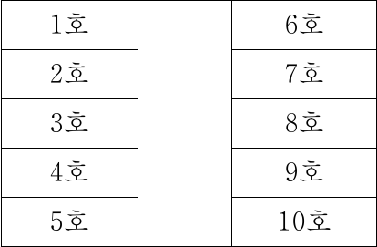

# 01 - RA (2017)

다음 글에 대한 평가로 옳지 않은 것은?

## 제시문

X국 헌법에 따르면 정당의 목적이나 활동이 민주적 기본질서에 위배될 때, 정부는 헌법재판소에 그 해산을 제소할 수 있고, 정당은 헌법재판소의 심판에 의하여 해산된다. 이는 정당존립의 특권을 보장하기 위해, 법령으로 해산되는 일반 결사와는 달리 헌법재판소의 판단으로 해산 여부가 결정되도록 한 것이다. 강제 해산의 대상이 되는 정당은 정당으로서의 등록을 완료한 기성(旣成) 정당에 한한다. 정당이 설립한 연구소와 같은 방계조직 등은 일반 결사에 속할 뿐이다. 그런데 중앙선거관리위원회에 창당신고를 하였으나 아직 정당으로서 등록을 완료하지 않은 창당준비위원회를 기성 정당과 동일하게 볼 수 있는지에 대하여 견해가 대립한다.

A: 창당준비위원회는 정치적 목적을 가진 일반 결사일 뿐이다. 그 해산 여부는 정당 해산의 헌법상 사유와 절차가 요구되지 않고 일반 결사의 해산 방식으로 결정해야 한다.

B : 창당준비위원회는 정당에 준하는 것이다. 그 해산 여부는 기성 정당과 같이 헌법상의 사유와 절차가 요구된다.

C : 정당설립의 실질적 요건을 기준으로, 아직 이를 갖추지 못한 창당준비위원회는 일반 결사와 동일하게 보고, 이미 이를 완비하였지만 현재 등록절차를 진행하고 있는 창당준비위원회는 정당에 준하는 것으로 보아야 한다.

## 선택지

(1) 창당준비위원회는 등록기간 안에 등록신청을 하지 아니하면 X국 ‘정당법’에 따라 특별한 절차 없이 자동 소멸된다는 주장이 옳다면, 이는 A의 설득력을 높인다.

(2) 집권 여당과 정부가 그 목적이나 활동이 민주적 기본질서에 반하지 않는 반대당의 성립을 등록 이전에 손쉽게 봉쇄할 수 있다는 주장이 옳다면, 이는 A의 설득력을 낮춘다.

(3) 창당준비위원회는 앞으로 설립될 정당의 주요 당헌과 당규를 실질적으로 입안한다는 주장이 옳다면, 이는 B의 설득력을 높인다.

(4) 정당설립의 실질적 요건을 갖춘 창당준비위원회에게 정당등록은 지극히 통과의례의 과정이라는 주장이 옳다면, 이는 C의 설득력을 낮춘다.

(5) 정당설립의 실질적 요건을 강화할수록 C는 A와 비슷한 결론을 내릴 것이다.

# 02 - RA (2017)

다음 글로부터 추론할 수 있는 A국 법원의 입장으로 옳은 것은?

## 제시문

1940년대 말 이후부터 A국은 제2차 세계대전의 패배에 따른 여러 가지 법적 청산 작업을 진행하였다. 이때 나치 체제에 협력하였던 나치주의자들은 형사상 책임을 졌을 뿐만 아니라 회사로부터도 해고되었다. 더 나아가 당시에는 회사의 사용자가 나치 체제에 동조한 ‘혐의’가 있는 근로자에 대하여도 해고하는 일이 자주 있었고, 이러한 해고의 유효 여부의 다툼에서 A국 법원은 혐의가 있다는 것만으로도 해고의 정당한 이유가 있다고 보았다. 그런데 당시 A국 Y사의 기능공이었던 갑은 1951년 3월 나치 체제에 동조한 사실이 있다는 혐의로 A국 검찰에 소환 조사를 받고 형사재판을 기다리고 있었는데, 이러한 일이 발생하자 Y사의 사용자 을은 갑에게 해고 통고를 하였다. 갑이 이 해고의 무효를 주장하였지만 A국 법원은 1951년 12월 을의 해고는 정당한 이유 있는 해고라고 판시하였다. 그런데 그 후 1954년 갑은 나치 체제에 동조한 사실이 없었던 것으로 최종 밝혀졌다. 이에 갑은 1955년 법원을 상대로 자신의 해고가 잘못된 것임을 주장하면서 해고 무효를 구했으나, 법원은 당시 해고가 무효는 아니라고 했다. 근로 계약의 양 당사자에게 중요한 것은 ‘신뢰’로서 사용자가 근로자에 대하여 인간적 신뢰를 잃게 되면 근로 관계를 지속하게 하는 것을 기대할 수 없기 때문이라는 것이 그 이유이다. 하지만 갑의 사정을 고려하여 특이한 청구권을 갑에게 인정하는 판결을 내렸다. 즉, 갑에게 Y사 사용자 을로 하여금 자신을 신규로 고용해 줄 것을 요구할 수 있는 청구권을 인정하였던 것이다. 그리고 이러한 청구권을 행사할 경우, 을은 갑을 고용할 의무가 발생한다고 판결하였다.

## 선택지

(1) 갑의 해고 결정은 무죄 판결에 의해 소급적으로 소멸한다.

(2) 갑의 해고에 대한 정당성의 판단 기준 시점은 해고 통고 시이다.

(3) 해고의 정당한 사유나 원인이 없는 경우라도 갑의 해고는 적법하다.

(4) 해고와 달리 갑의 신규 고용 여부를 정당화하는 사유에서는 신뢰 관계가 고려되지 않는다.

(5) 무죄 추정의 원칙에 따라 갑에게 범죄 혐의가 있다는 사실만 가지고는 근로 관계 지속을 위한 신뢰가 깨진다고 볼 수 없다.

# 03 - RA (2017)

다음 글로부터 추론한 것으로 옳은 것은?

## 제시문

친자 관계는 자연적 출산 또는 입양에 의해 성립한다. 이에 따를 경우 보조 생식 의료를 통해 태어난 아이는 누구의 아이인가? ‘보조 생식 의료’라 함은 시험관 아기 시술, 배아이식 및 인공 수정을 가능하게 하는 임상적․생물학적 시술 및 이와 동일한 효과를 갖는 시술로, 자연적 과정 외의 생식을 가능하게 하는 모든 의료 기술을 말한다.

A국에서는 자신의 체내에 생식세포가 주입되거나 배아가 이식된 결과 아이를 출산하면 출산한 여성이 아이의 모(母)로 확정된다. 그리고 부(父)의 결정에 있어 가장 중요한 요건은 보조 생식 의료에 동의하였는지 여부인데, 법이 정한 동의의 요건만 갖추면 자녀와의 혈연 관계와 여성과의 혼인 관계라는 요건이 없어도 법적 부의 지위가 인정된다. 더구나 남성뿐만 아니라 여성이라도 이 동의라는 요건만 갖추면 혼인 여부와 상관없이 부가 될 수 있다. 한편 대리모 계약을 금지하고 있지는 않지만 그 계약을 강제 이행할 수는 없는 것으로 하고 있다.

B국에서는 보조 생식 의료에 있어서 “사람은 생식 가능한 남녀로부터 태어난다.”라고 하는 자연적 섭리를 중시한다. 따라서 보조 생식이 행해질 수 있는 경우는 ‘질병의 치료’라고 하는 목적에 의해 제한된다. B국에서 난자 또는 정자를 제3자로부터 받는 등 보조 생식 의료를 행하기 위해서는 남녀 모두 자연적으로 생식 가능하다고 간주되는 연령에 있고, 혼인 관계에 있어야 한다. 또한 시술 시점에 의뢰한 남녀가 함께 생존하고 시술에 동의해야 한다. 출산한 사람만이 모로 되고 이 여성과의 혼인 관계에 따라 부가 확정된다. B국에서는 대리모 계약을 선량한 풍속에 반한다고 하여 무효로 하고 있다.

## 선택지

(1) A국에서는 여성도 다른 여성의 보조 생식 의료에 동의할 경우 그 출산한 여성과 부부로 인정된다.

(2) A국에서 대리모에게 난자를 제공한 의뢰인이 모가 되기 위해서는 그 출생한 자를 입양하는 방법밖에 없다.

(3) B국에서는 자연적으로 생식이 불가능한 모든 자가 보조 생식 의료를 통해 합법적으로 자녀를 가질 수 있게 되었다.

(4) B국에서 아이를 갖기 위한 여성이 남편의 동의를 얻어 보조 생식 의료를 통해 다른 남성의 정자를 제공받아 출산하면 그 아이의 부는 정자를 제공한 자이다.

(5) A국과 B국 모두 ‘제3자를 위해 출산을 하는 계약은 무효’라는 내용의 법규정을 가지고 있다.

# 04 - RA (2017)

갑과 을의 주장에 대한 판단으로 옳은 것만을 <보기>에서 있는 대로 고른 것은?

## 제시문

갑 : 범죄의 불법성을 판단하는 척도가 범죄를 행하는 자의 의사에 있다고 믿는 것은 잘못이다. 범죄의 의사는 사람마다 다르고 심지어 한 사람에 있어서도 그 사상, 감정, 상황의 변화에 따라 시시각각 달라질 수 있기 때문이다. 범죄의 척도를 의사에서 찾는다면 개인 의사의 경중에 따른 별도의 법을 만들어야 할 것이다. 따라서 처벌은 의사가 아닌 손해의 경중을 기준으로 차등을 두어야 한다.

을 : 갑은 범죄자의 ‘의사’를 객관화할 수 없다고 전제하고 있다. 그러나 범죄자의 ‘의사’를 몇 가지 기준에 의해서 유형화한다면 의사 자체의 경중도 판단할 수 있다. 우선, 의도한 범죄의 경중을 기준으로 삼는 경우, 더 중한 결과를 발생시키는 범죄를 행하려는 의사가 더 경한 결과를 발생시키는 범죄를 행하려는 의사보다 중하다. 다음으로 의욕의 정도를 기준으로 삼는 경우, 결과 발생을 의도한 범죄자의 의사가 결과 발생을 의도하지 않고 단지 부주의로 손해를 발생시킨 범죄자의 의사보다 중하다. 따라서 처벌은 손해뿐만 아니라 범죄자의 의사의 경중 또한 고려하여 차등을 두어야 한다.

## 보기

ㄱ. 살인의 의사를 가지고 가격하였으나 상해의 결과가 발생한 경우와 폭행의 의사를 가지고 가격하였으나 사망의 결과가 발생한 경우를 동일하게 처벌한 법원의 태도는 갑의 주장에 부합한다.

ㄴ. 강도의 의사로 행위를 하였으나 강도는 실패하고 중(重)상해의 결과를 발생시킨 경우와 살인의 의사로 행위를 하였으나 역시 중상해의 결과를 초래한 경우에 있어서 전자를 중하게 처벌한 법원의 태도는 갑과 을의 주장 모두에 부합하지 않는다.

ㄷ. 살인의 의사가 있었으나 그 행위에 나아가지 않은 경우와 부주의로 사람을 다치게 한 경우에 있어서 전자를 처벌하지 않고 후자만 처벌한 법원의 태도는 갑과 을의 주장 모두에 부합한다.

## 선택지

(1) ㄱ

(2) ㄷ

(3) ㄱ, ㄴ

(4) ㄴ, ㄷ

(5) ㄱ, ㄴ, ㄷ

# 05 - RA (2017)

다음 글에 대한 평가로 옳은 것만을 <보기>에서 있는 대로 고른 것은?

## 제시문

K국 형법은 “미성년자를 약취(略取)한 사람은 10년 이하의 징역에 처한다.”라고 하여 ‘미성년자약취죄’를 규정하고 있다. 이 규정에서 ‘약취’라고 하는 것은 폭행․협박을 행사하거나 정당한 권한 없이 사실상의 힘을 사용하여 미성년자를 생활관계 또는 보호관계로부터 약취행위자나 제3자의 지배하에 옮기는 행위를 의미한다. 그런데 ‘정당한 권한 없이 사실상의 힘을 사용하여’의 해석에 관해서는 아래와 같이 견해가 나뉜다.

<견해 1>

미성년자약취죄가 보호하고자 하는 법익(法益)은 미성년자의 평온․안전이다. 따라서 미성년자의 평온․안전을 해치지 않는 한 부모 일방이 다른 일방의 동의 없이 미성년자의 거소를 옮기는 행위만으로는 정당한 권한 없이 사실상의 힘을 사용한 것에 해당하지 않는다.

<견해 2>

미성년자약취죄가 보호하고자 하는 법익은 미성년자의 자유와 보호자의 보호․양육권이다. 따라서 부모 일방이 다른 일방의 동의 없이 미성년자의 거소를 옮기는 행위는 정당한 권한 없이 사실상의 힘을 사용한 것에 해당한다.

## 보기

ㄱ. 부모가 이혼하였거나 별거하는 상황에서 미성년의 자녀를 부모의 일방이 평온하게 보호․양육하고 있는데, 부모 중 다른 일방이 폭행․협박을 행사하여 그 보호․양육 상태를 깨뜨리고 자녀를 탈취하여 자기 또는 제3자의 사실상 지배하에 옮긴 경우라면, 위의 어떠한 견해에 따르더라도 미성년자약취죄에 해당한다.

ㄴ. 부모가 함께 동거하면서 미성년의 자녀를 보호․양육하여 오던 중 부(父)가 모(母)나 그 자녀에게 어떠한 폭행․협박을 행사하지 않고 그 자녀를 데리고 종전의 거소를 벗어나 다른 곳으로 옮겨 자녀에 대한 보호․양육을 적절히 한 경우, <견해 1>에 따르면 미성년자약취죄에 해당하지 않는다.

ㄷ. 보호․양육하던 미성년자를 종전에 거주하던 K국 거주지에서 부의 동의 없이 모가 국외로 이전하는 행위로 인해, K국 국적을 가진 자녀가 생활환경 등이 전혀 다른 외국에서 부의 보호․양육이 배제된 채 정신적․심리적 충격을 겪는 경우, <견해 1>에 따르면 미성년자약취죄에 해당하지 않지만 <견해 2>에 따르면 미성년자약취죄에 해당한다.

## 선택지

(1) ㄱ

(2) ㄷ

(3) ㄱ, ㄴ

(4) ㄴ, ㄷ

(5) ㄱ, ㄴ, ㄷ

# 06 - RA (2017)

고대 국가 R의 상속법 <원칙>에 근거해서 <판단>을 평가할 때, 옳은 것만을 <보기>에서 있는 대로 고른 것은?

## 제시문

<원칙>

상속은 가장(家長)의 유언에 따라야 한다. 유언으로 정한 대로 상속이 이루어질 수 없으면, 법이 정한 방법에 따라 상속이 이루어져야 한다. 법정상속은 직계비속이 균분으로, 직계비속이 없을 경우 직계존속이 균분으로, 직계존속이 없으면 배우자의 순으로 이루어진다. 태아는 상속인의 지위를 갖는다. 가장은 배우자 및 직계비속 중 상속인에서 제외하려는 자가 있을 경우 반드시 유언으로 그를 지정해야 한다. 만약 상속인으로 지정되지도 제외되지도 않은 직계비속이 있을 경우 가장의 유언은 무효이다. 상속인의 지위를 상실하게 할 수 있는 조건을 부가하여 상속인을 지정한 가장의 유언은 무효이다.

<판단>

아직 자녀가 없는 가장 A는 아내가 임신한 상태에서 “태아와 아내만을 상속인으로 지정한다. 만약 아들이 태어나면, 그가 내 재산의 $\frac{2}{3}$를 상속받고 나머지는 내 아내가 상속받는다. 그러나 만약 아들이 아니라 딸이 태어나면, 그녀가 내 재산의 $\frac{1}{3}$을 상속받고 나머지는 아내가 상속받는다.”와 같은 유언을 남기고 사망하였다. 그런데 아내는 A의 예상과 달리 아들 1명과 딸 1명의 쌍둥이를 출산하였다. 이에 대해 법률가 X는 “유언자의 의사에 따라 유산을 7등분하여 아들이 4, 아내가 2, 딸이 1을 갖도록 하는 것이 올바르다.”고 판단하였다.

## 보기

ㄱ. X는 “아들과 딸은 각각 $\frac{1}{2}$씩 상속을 받아야 하며 아내는 상속을 받을 수 없다.”고 판단해야 했다.

ㄴ. X는 “‘만약 ……이 태어나면’이라는 조건을 부가하여 상속인을 지정하고 있기 때문에 A의 유언은 처음부터 무효이다.”고 판단해야 했다.

ㄷ. X는 “A가 아들 또는 딸이 출생하는 경우에 대하여 유언을 한 것이지 아들과 딸이 동시에 출생하는 경우에 대하여 한 것은 아니었다.”고 판단해야 했다.

## 선택지

(1) ㄴ

(2) ㄷ

(3) ㄱ, ㄴ

(4) ㄱ, ㄷ

(5) ㄱ, ㄴ, ㄷ

# 07 - RA (2017)

19세기 X국의 저작권법 개정 논쟁에 대한 평가로 옳은 것만을 <보기>에서 있는 대로 고른 것은?

## 제시문

A: 지금까지 작가와 출판가는 작품을 적은 부수만 출간하여 일반 대중의 1개월분 급여 정도의 높은 가격으로 판매해 왔다. 이 때문에 일반 대중은 뛰어난 작품들을 접하기 어려웠다. 이러한 문제는 작가에게 수십 년 동안 독점적 출판권을 부여하는 현행 저작권법에 의해 비롯되었다. 국가는 새로운 작품의 공급이 감소되지 않도록 작가에게 창작의 유인책을 줄 필요가 있지만, 그것은 창작 비용을 회수할 수 있을 정도에 그쳐야 한다. 현재 작가는 최초 출판 후 1년 내에 창작 비용을 충분히 회수할 수 있다. 저작권법은 독점적 출판권을 1년으로 제한하고, 그 이후에는 모든 출판가들이 소매가의 $5\%$를 로열티로 작가에게 지불하고 자유롭게 출판할 수 있도록 개정되어야 한다. 대중도 저렴한 가격으로 뛰어난 작품을 접할 수 있을 것이다. 사실 독점적 권리는 희소한 재화에 대해서만 인정되는 권리다. 일단 출간된 작품은 인쇄비용 문제를 제외하면 무한정 출판될 수 있다. 아무리 소비해도 줄지 않는 재화는 모든 사람이 자유롭게 향유해야 한다.

B : 고급작품은 고상한 학문과 예술을 다루지만, 저급작품은 선정적 내용만 다룬다. 책 가격이 떨어져도 대중이 고급작품을 구매하려 할 것인가? 그들은 교육을 받지 않았기에 선정적 작품만을 읽으려 한다. 반면 고급작품을 높게 평가하는 교양인은 아무리 책 가격이 높더라도 구매하려 한다. 작가는 자신의 책을 높은 가격에 판매함으로써 합당한 대우를 받을 자격이 있다. 즉, 그는 자신이 원하는 방식과 기간으로 출판 조건을 결정하고, 이 조건에 부합하는 출판사와 자유롭게 계약을 체결할 자연적 권리를 가진다. 국가는 작가의 이러한 자연적 권리를 보호해야 할 의무가 있다.

## 보기

ㄱ. 작가마다 작품을 창작하는 데 들인 비용은 천차만별이어서 국가가 작가의 창작 비용 회수기간을 일률적으로 정할 수 없다는 주장이 옳다면, 이는 A의 설득력을 낮춘다.

ㄴ. 특정한 원인에 의해 재화의 공급이 제한될 경우, 그 재화에 대한 독점적 권리를 인정할 수 있다는 주장이 옳다면, 이는 A의 설득력을 낮춘다.

ㄷ. 계약을 누구와 어떻게 체결할 것인지는 당사자가 결정해야 한다는 주장이 옳다면, 이는 B의 설득력을 낮춘다.

## 선택지

(1) ㄱ

(2) ㄷ

(3) ㄱ, ㄴ

(4) ㄴ, ㄷ

(5) ㄱ, ㄴ, ㄷ

# 08 - RA (2017)

<사실 관계>의 (가)와 (나)에 들어갈 방법으로 옳은 것은?

## 제시문

채무자가 채무를 이행할 수 있는데도 하지 않을 경우, 채권자가 직접 돈을 뺏어오거나 할 수 없고 법원에 신청하여 강제적으로 채무를 이행하게 할 수밖에 없다. 이렇게 강제로 이행하게 하는 방법은 상황에 따라 다른데, K국에서 법으로 인정하고 있는 방법은 세 가지이다. ‘A방법’은 채무자가 어떤 행위를 하여야 하는데 하지 않는 경우, 채무자의 비용으로 채권자 또는 제3자에게 하도록 하여 채권의 내용을 실현하는 방법이다. ‘B방법’은 목적물을 채무자로부터 빼앗아 채권자에게 주거나 채무자의 재산을 경매하여 그 대금을 채권자에게 주는 것과 같이, 국가 기관이 직접 실력을 행사해서 채권의 내용을 실현하는 방법이다. 이 방법은 금전․물건 등을 주어야 하는 채무에서 인정되며, 어떤 행위를 해야 하는 채무에 대하여는 인정되지 않는다. ‘C방법’은 채무자만이 채무를 이행할 수 있는데 하지 않을 경우에 손해배상을 명하거나 벌금을 과하는 등의 수단을 써서 채무자를 심리적으로 압박하여 채무를 강제로 이행하도록 만드는 방법이다. ‘C방법’은 채무자를 강제하여 자유의사에 반하는 결과에 이르게 하는 것이므로 다른 강제 수단이 없는 경우에 인정되는 최후의 수단이다.

<사실 관계>

◦ K국은 통신회사가 X회사 하나였는데 최근 통신서비스 시장 개방에 따라 다수의 다른 통신회사가 설립되어 공급을 개시하였다.

◦ K국의 X회사는 소비자 Y에게 계약에 따라 통신서비스를 제공할 의무가 있는데 요금 인상을 주장하며 이행하지 않았다. Y가 X회사의 강제 이행을 실현할 수 있는 방법은 통신서비스 시장 개방 전에는 (가) 방법, 시장 개방 후에는 (나) 방법이다.

## 선택지

|   | (가) | (나) |
|---|---|---|
| (1) | A | C |
| (2) | B | A |
| (3) | B | B |
| (4) | C | A |
| (5) | C | C |

# 09 - RA (2017)

다음 글로부터 추론한 것으로 옳은 것만을 <보기>에서 있는 대로 고른 것은?

## 제시문

A국은 각 지방자치단체에 대한 재정적 지원제도인 교부금제도를 시행하고 있다. 각 지방자치단체의 수입은 국가로부터의 교부금과 지방자치단체의 자체수입금으로 구성된다. 국가는 지방자치단체가 제출한 자체수입예상액과 지출예상액을 고려하여 국가가 판단한 총지출규모를 수립한 후 필요한 교부금을 지급한다. A국은 아래의 교부금 중 하나를 선택하여 모든 지방자치단체에 지급할 수 있다.

∙ 동액교부금 : 모든 지방자치단체에 대해 획일적으로 동일한 금액이 지급되는 교부금

∙ 동률교부금 : 각 지방자치단체의 자체수입금에 비례하는 금액이 지급되는 교부금

∙ 보통교부금 : 각 지방자치단체의 자체수입금이 국가가 수립한 총지출규모를 충당하지 못하는 경우 국가가 그 재정부족분만큼 지급하는 교부금. 다만 자체수입금이 풍부하여 재정부족분이 발생하지 않는 지방자치단체에 대해서는 보통교부금이 지급되지 않음(이를 ‘불교부단체’라 함).

## 보기

ㄱ. A국이 보통교부금을 지급할 경우, 불교부단체를 제외한 모든 지방자치단체는 자체수입금 증대를 위한 최대의 재정적 노력을 기울일 것이다.

ㄴ. 국가가 수립한 각 지방자치단체의 총지출규모가 동일한 상황에서 재정부족분이 많이 발생하는 지방자치단체(갑)와 상대적으로 적게 발생하는 지방자치단체(을)가 있다면, 보통교부금을 지급받을 때에는 갑이 을에 비해, 동률교부금을 지급받을 때에는 을이 갑에 비해 언제나 많이 받는다.

ㄷ. 국가가 수립한 각 지방자치단체의 총지출규모가 같고 각 지방자치단체의 자체수입금액이 같다면, 어떠한 교부금에 의하더라도 각 지방자치단체가 지급받는 교부금의 액수는 동일하다.

## 선택지

(1) ㄱ

(2) ㄷ

(3) ㄱ, ㄴ

(4) ㄴ, ㄷ

(5) ㄱ, ㄴ, ㄷ

# 10 - RA (2017)

다음 논쟁에 대한 분석으로 옳은 것만을 <보기>에서 있는 대로 고른 것은?

## 제시문

남성 우월주의를 표방하는 단체에 소속된 회원 백여 명이 도심에 모여 나체로 행진하는 시위를 하겠다는 계획을 밝혔다. 이를 두고 다음과 같은 논쟁이 벌어졌다.

갑 : 다른 사람에게 직접적인 물리적 위해를 줄 것이 분명히 예상되는 경우를 제외한다면, 어떤 행위도 할 수 있는 권리가 보장되어야 해. 자신의 의사를 밝히는 행위 자체가 다른 사람에게 물리적 위해를 준다고는 볼 수 없지.

을 : 그렇다면 예를 들어 인종차별을 옹호하는 단체가 시위를 하겠다는 것도 허용해야 할까? 공동체 구성원의 다수가 비도덕적이라고 여기는 가치를 떠받드는 행위를 금지하는 것은 당연해.

병 : 인종차별이 정당하다고 주장하면서 시위를 하면 많은 사람들로부터 공격을 받기 쉽지 않을까?

갑 : 그런 경우라면 시위자를 공격하는 사람의 행위를 막아야지, 시위 자체를 막아서는 안 되지.

을 : 물리적 충돌이 생기는 건 불행한 일이지만 문제의 핵심은 아니야. 왜 그런 일이 생겨나겠어? 결국 대다수 사람들이 보기에 비도덕적인 견해를 공공연하게 지지하니까 직접적인 물리적 위해를 서로 주고받게 되는 거지.

병 : 직접적인 물리적 위해가 중요한 게 아니란 점에는 동의해. 하지만 내가 보기에 한 사람의 행동이 다른 사람들에게 불쾌하게 받아들여지는지가 중요하지. 그들의 주장이 옳다 해도 이 시위를 막아야 하는 것은 그 행위가 충분히 불쾌하게 받아들여지기 때문이야. 만약 사람들의 눈에 잘 띄지 않는 장소와 시간에 시위를 한다면 다른 이야기가 되겠지.

## 보기

ㄱ. 시위대가 시민들로부터 물리적 위해를 받을 가능성이 시위 허용 여부를 결정하는 데 중요한 요소인지에 대해서 갑과 을은 의견을 달리한다.

ㄴ. 시위대의 주장이 대다수 시민의 윤리적 판단에 부합하는지가 시위 허용 여부를 결정하는 데 중요한 요소인지에 대해서 을과 병은 의견을 달리한다.

ㄷ. 나체 시위를 불쾌하게 여길 사람이 시위를 회피할 수 있을 가능성이 시위 허용 여부를 결정하는 데 중요한 요소인지에 대해서 갑과 병은 의견을 달리한다.

## 선택지

(1) ㄱ

(2) ㄴ

(3) ㄱ, ㄷ

(4) ㄴ, ㄷ

(5) ㄱ, ㄴ, ㄷ

# 11 - RA (2017)

A～C에 대한 분석으로 옳은 것만을 <보기>에서 있는 대로 고른 것은?

## 제시문

A: 유용성의 원리가 의미하는 바는, 한 행위가 그것과 관련되는 사람들의 행복을 증가시키느냐 아니면 감소시키느냐에 따라서 그 행위를 용인하거나 부인한다는 점이다. 오직 유용성의 원리만이 구체적이고, 관찰 가능하며, 검증 가능한 옳은 행위의 개념을 산출할 수 있다. 어떤 범위와 기간까지 고려하여 유용성을 평가할 것인지도 각 행위가 행해지는 상황을 통해 충분히 결정 가능하다. 따라서 행위자의 개별 행위에 직접 적용되는 유용성의 원리만이 도덕적 고려의 대상이 되어야 한다.

B : 유용성의 원리는 개별 행위보다는 행위 규칙과 연관되어야 한다. 한 행위가 아니라, “거짓말을 하지 말라.”와 같은 행위 규칙이 유용한지 아닌지를 물어야 한다. 거짓말을 허용하는 것보다 허용하지 않는 규칙이 장기적인 관점에서 더 많은 유용성을 산출한다면, 당장 거짓말하는 행위가 유용하다 할지라도 이를 금하고 그 규칙을 따르도록 해야 한다. 유용성이 입증된 행위 규칙들이 마련되면, 행위자는 매 행위의 유용성을 일일이 계산할 필요 없이 그 규칙에 부합하는 행위를 하는 것만으로 옳은 행위를 수행할 수 있다.

C : 유용성의 원리는 하나의 통일적 삶, 즉 하나의 전체로서 파악하고 평가할 수 있는 삶 속에서만 판단되고 적용되어야 한다. 인간은 그가 만들어내는 허구 속에서 뿐만 아니라 자신의 행위와 실천에 있어서도 ‘이야기하는 존재’이다. “나는 무엇을 해야만 하는가?”라는 물음은 이에 선행하는 물음, 즉 “나는 어떤 이야기의 부분인가?”라는 물음에 답할 수 있을 때에만 제대로 답변될 수 있다. 나는 나의 가족, 나의 도시, 나의 부족, 나의 민족으로부터 다양한 부채와 유산, 기대와 책무들을 물려받는다. 이런 것들은 나의 삶에 주어진 사실일 뿐만 아니라, 나의 행위가 도덕적이기 위해 부응해야 할 요소이기도 하다.

## 보기

ㄱ. A와 B에 따르면, 한 명의 전우를 적진에서 구하기 위해 두 명의 전우가 죽음을 무릅쓰는 행위가 도덕적일 수 있다.

ㄴ. A와 C에 따르면, 거짓말을 하는 것이 상황에 따라 옳을 수 있다.

ㄷ. A, B, C 모두 유용성의 원리를 도덕적 판단의 기준으로 고려한다.

## 선택지

(1) ㄱ

(2) ㄷ

(3) ㄱ, ㄴ

(4) ㄴ, ㄷ

(5) ㄱ, ㄴ, ㄷ

# 12 - RA (2017)

㉠에 대한 반론으로 적절한 것만을 <보기>에서 있는 대로 고른 것은?

## 제시문

인간은 생각하고, 대화하는 등의 ‘인지 기능’도 하고, 음식을 소화시키고, 이리저리 움직이는 등의 ‘신체 기능’도 한다. 이 두 기능 모두 인간의 몸이 하는 기능이다. 인간에게 죽음이란 인간의 몸이 하는 기능이 멈추는 사건이다. 그런데 사람에 따라서는 인지 기능은 멈추었지만 신체 기능은 멈추지 않은 시점을 맞기도 한다. 이 시점의 인간은 죽은 것인가? 인간의 몸이 가진 두 기능 중 죽음의 시점을 정하는 데 결정적인 기능은 무엇인가?

죽음의 시점을 정하는 데 결정적인 요소는 인지 기능이라는 견해를 취해 보자. 이 견해에 따르면 죽음은 인지 기능의 정지이다. 하지만 예를 들어 어젯밤 당신은 아무런 인지 작용도 없는 상태에서 꿈도 꾸지 않는 깊은 잠에 빠져 있었다고 해보자. 죽음이 인지 기능의 정지라면, 당신은 어젯밤에 죽어 있었다고 해야 한다. 하지만 당신은 오늘 여전히 살아 있다. 이런 반례를 피하기 위해서 이 견해를 수정할 필요가 있다. 즉, 죽음은 인지 기능이 일시적으로 정지하는 것이 아니라 영구히 정지하는 것이다. 이 <u>㉠ 수정된 견해</u>에 따르면 당신은 어젯밤 죽은 상태에 있지 않았다. 왜냐하면 오늘 당신은 살아 있기 때문이다.

## 보기

ㄱ. 철수는 어제 새벽 2시부터 3시까지 꿈 없는 잠을 자고 있다가, 3시에 심장마비로 사망했다. 3시부터 철수는 인지 기능과 함께 신체 기능도 멈추게 된 것이다. ㉠에 따르면 철수는 어제 새벽 2시부터 이미 죽어 있었다. 하지만 이때 철수는 분명 살아 있었다고 해야 한다. 그때 철수를 깨웠다면 그는 일어났을 것이기 때문이다.

ㄴ. ‘부활’은 모순적인 개념이 아니다. 죽었던 철수가 부활했다고 상상해 보자. 부활한 철수는 다시 인지 기능을 갖게 될 것이다. ㉠에 따르면, 철수는 부활 이전에도 죽어 있던 것이 아니라고 해야 한다. 하지만 철수는 부활 이전에 죽어 있었다. 그렇지 않았다면 철수가 ‘죽음에서 부활했다’고 말할 수조차 없고 ‘부활’은 모순적인 개념이 되고 만다.

ㄷ. 철수가 주문에 걸려서 인지 기능이 작동하지 않은 상태로 잠을 자게 되었다고 해보자. 그런데 이 주문은 영희가 철수에게 입맞춤을 하면서 풀려 버렸다. ㉠에 따르면, 철수는 주문에 걸려 있던 동안 죽은 것이다. 하지만 잠에 빠져든 후에도 철수는 분명 살아 있다고 해야 한다. 영희의 입맞춤으로 철수는 깨어났기 때문이다.

## 선택지

(1) ㄱ

(2) ㄷ

(3) ㄱ, ㄴ

(4) ㄴ, ㄷ

(5) ㄱ, ㄴ, ㄷ

# 13 - RA (2017)

다음으로부터 추론한 것으로 옳지 않은 것은?

## 제시문

존재하는 것 중에는 ‘좋은 것’도 있고, ‘나쁜 것’도 있으며, ‘좋지도 나쁘지도 않은 것’도 있다. 덕, 예컨대 분별력과 정의는 좋은 것이다. 이것의 반대, 즉 우매함과 부정의는 나쁜 것이다. 반면에 유익하지도 해롭지도 않은 것은 덕도 아니며 덕의 반대도 아니다. 건강, 즐거움, 재물, 명예, 그리고 이것들의 반대인 질병, 고통, 가난, 불명예가 바로 그런 것이다. 이것들은 선호되거나 선호되지 않을 수는 있어도, 좋은 것도 아니고 나쁜 것도 아니다. 오히려 이것들은 차이가 없는 것이다. 여기서 ‘차이가 없는 것’은 행복에 대해서도, 불행에 대해서도 어떤 기여도 하지 않는 것을 의미한다. 왜냐하면 이런 것이 없어도 행복할 수 있기 때문이다. 이런 것을 얻는 과정에서 행복하거나 불행할 수는 있을지라도 말이다. 차갑게 만드는 것이 아니라 뜨겁게 만드는 것이 뜨거운 것의 고유한 속성인 것처럼, 해를 끼치는 것이 아니라 유익하게 하는 것이 좋은 것의 고유한 속성이다. 그런데 건강과 재물은 해를 끼치지도 않고 유익하게 하는 것도 아니다. 건강과 재물은 좋게 사용될 수도 또한 나쁘게 사용될 수도 있다. 좋게 사용될 수도 있고 나쁘게 사용될 수도 있는 것은 좋은 것이 아니다.

- 디오게네스, 『철학자 열전』 -

## 선택지

(1) 건강의 반대, 즉 질병은 좋은 것이 아니다.

(2) 재물을 얻는 과정에서 행복할 수 있다.

(3) 나쁜 것이 아닌 것은 좋은 것이다.

(4) 건강과 재물은 좋은 것이 아니다.

(5) 분별력은 나쁘게 사용될 수 없다.

# 14 - RA (2017)

다음 글에 대한 분석으로 옳은 것만을 <보기>에서 있는 대로 고른 것은?

## 제시문

우리 행위가 우리 자신의 자유로운 선택의 결과일 때에만 우리는 그 행위에 도덕적 책임을 진다. 그러나 만약 인간 행위가 결정론적 인과 법칙에 의해 전적으로 지배된다면, 어떻게 내 행위가 자유로운 행위였다 할 수 있는지의 질문이 제기될 수 있다. 이에 대해 “우리가 자유 의지를 가지고 있고 자유롭게 행위한다는 것을 우리는 누구보다 잘 알고 있습니다. 여기에는 아무 문제가 없습니다.”라고 주장하는 것은 문제의 해결이 아니다. 만약 우리가 우리의 의지가 자유롭다는 것을 정말로 안다면, 우리의 의지가 자유롭다는 것은 참일 수밖에 없다. 사실이 아닌 어떤 것을 알 수는 없기 때문이다. 그러나 “우리의 의지는 자유롭지 않으므로 어느 누구도 우리 의지가 자유롭다는 것을 알지 못한다.”는 주장 역시 가능하다. 사람들이 자신들이 자유롭게 행위한다고 믿는다는 것은 분명한 사실이다. 그러나 자유롭게 행위한다고 느낀다는 것이 우리가 실제로 자유롭다는 점을 입증하지는 못한다. 그것은 단지 우리가 행위의 원인에 대해 인식하고 있지 못함을 보여줄 뿐이다.

## 보기

ㄱ. 이 글에 따르면, 자유로운 선택에 의한 것이지만 도덕적 책임을 지지 않는 행위는 있을 수 없다.

ㄴ. 이 글에 따르면, 우리가 무언가를 안다는 것은 그것이 참임을 함축한다.

ㄷ. 우리가 자유롭게 행했다고 여기는 많은 행위들을 인과 법칙적으로 설명할 수 있다면, 이 글의 논지는 약화된다.

## 선택지

(1) ㄴ

(2) ㄷ

(3) ㄱ, ㄴ

(4) ㄱ, ㄷ

(5) ㄱ, ㄴ, ㄷ

# 15 - RA (2017)

다음 글에 대한 분석으로 옳은 것만을 <보기>에서 있는 대로 고른 것은?

## 제시문

<u>㉠ 내가 이전에 먹었던 빵은 나에게 영양분을 제공하였다.</u> 과거에 경험한 이런 한결같은 사실을 근거로, <u>㉡ 미래에 먹을 빵도 반드시 나에게 영양분을 제공할 것</u>이라고 결론 내릴 수 있을까?

어떤 사람들은 미래에 관한 이런 명제가 과거에 관한 명제로부터 올바르게 추리된다고 주장한다. 즉 전제가 참이면 결론도 반드시 참이라는 의미에서, 미래에 관한 명제가 과거에 관한 명제로부터 추리된다고 말한다. 하지만 그들이 말하는 그 추리가 <u>연역적으로 타당하게 이끌어진 추리</u>가 아니라는 점은 명백하다. 왜냐하면 그 경우 전제가 참이더라도 결론이 거짓일 수 있기 때문이다. 그렇다면 그 추리는 어떤 성질을 지닌 추리인가?

만약 어떤 사람이 그 추리가 <u>경험에 근거해서 결론이 필연적으로 따라나오는 추리</u>라고 주장한다면, 그 사람은 논점 선취의 오류를 범하는 것이다. 왜냐하면 경험에 근거해서 결론이 필연적으로 따라나오는 추리가 되려면, <u>㉢ 미래가 과거와 똑같다는 것</u>을 기본 전제로 가정해야 하기 때문이다. 만일 자연의 진행 과정이 변할 수도 있다고 생각할 수 있다면, 모든 경험은 소용이 없게 될 것이며 아무런 추리도 할 수 없게 되거나 아무런 결론도 내릴 수 없게 될 것이다. 따라서 경험을 근거로 하는 어떠한 논증도 미래가 과거와 똑같을 것이라는 점을 증명할 수는 없다. 왜냐하면 그런 논증은 모두 미래가 과거와 똑같을 것이라는 그 가정에 근거해 있기 때문이다.

## 보기

ㄱ. ㉢을 참이라고 가정하면 ㉠으로부터 ㉡을 추리할 수 있다.

ㄴ. ㉢이 거짓이라면 ㉡의 참을 확신할 수 없다.

ㄷ. ㉢을 정당화할 수 있는, 경험에 근거한 추리란 없다.

## 선택지

(1) ㄱ

(2) ㄷ

(3) ㄱ, ㄴ

(4) ㄴ, ㄷ

(5) ㄱ, ㄴ, ㄷ

# 16 - RA (2017)

다음 논쟁에 대한 분석으로 옳은 것만을 <보기>에서 있는 대로 고른 것은?

## 제시문

설거지를 하던 철수는 수지로부터의 전화벨 소리에 깜짝 놀라고 접시를 깨뜨린다. 접시를 깬 이유가 무언지 생각해본 철수는 ‘수지가 자신에게 전화를 건 사건’이 ‘자신이 깜짝 놀란 사건’의 원인이며, ‘자신이 깜짝 놀란 사건’이 ‘자신이 접시를 깬 사건’의 원인이라고 추론한다. 왜냐하면 철수는 다음의 원리를 받아들이기 때문이다.

원리A : 임의의 사건 $a$, $b$에 대하여, $a$가 $b$의 원인이라는 것은 $a$가 발생하지 않았더라면 $b$가 발생하지 않았다는 것이다.

이어서 철수는 다음의 원리를 통해 ‘수지가 전화를 건 사건’이 ‘자신이 접시를 깬 사건’의 원인이라고 결론 내린다.

원리B : 임의의 사건 $a$, $b$, $c$에 대하여, $a$가 $b$의 원인이고 $b$가 $c$의 원인이라면, $a$는 $c$의 원인이다.

철수는 자신이 접시를 깬 것은 수지 때문이라며 수지를 원망한다. 이에 수지는 다음의 사례를 들어 반박한다. 사실 어젯밤 철수의 집에 누군가 몰래 침입하여 폭탄을 설치하였다. 오늘 아침 수지가 다행히 폭탄을 발견하였고 이를 제거하였다. 철수는 무사히 출근할 수 있었다. 수지는 다음과 같이 말한다.

“‘만약 누군가가 폭탄을 설치하지 않았더라면, 내가 폭탄을 제거할 일이 없었을 것’이라는 점은 당연하지. 그렇다면 원리A에 의해 ‘누군가 폭탄을 설치한 사건’이 ‘내가 그 폭탄을 제거한 사건’의 원인이라 해야 할 거야. 마찬가지 방식으로 ‘내가 폭탄을 제거한 사건’이 ‘네가 출근한 사건’의 원인이라고 해야 하겠지. 그런데 원리B에 의하면, ‘누군가 폭탄을 설치한 사건’이 ‘네가 출근한 사건’의 원인이라고 말해야 할 거야. 누군가 폭탄을 설치했기 때문에 네가 출근할 수 있었다는 게 말이 된다고 생각하니?”

## 보기

ㄱ. ‘철수가 접시를 구입하지 않았더라면, 철수는 접시를 깨지 않았을 것’이라는 것은 당연하다. 하지만 ‘철수가 접시를 구입한 것’이 ‘철수가 접시를 깬 사건’의 원인이라고 말하는 것은 부적절해 보인다. 그렇다면 이는 원리A를 약화한다.

ㄴ. 철수의 추론은 ‘수지가 자신에게 전화 걸지 않았더라면, 자신은 접시를 깨지 않았을 것’이라는 전제를 사용한다.

ㄷ. 수지의 추론은 ‘자신이 폭탄을 제거하지 않았더라면, 철수는 출근하지 못했을 것’이라는 전제를 사용한다.

## 선택지

(1) ㄱ

(2) ㄴ

(3) ㄱ, ㄷ

(4) ㄴ, ㄷ

(5) ㄱ, ㄴ, ㄷ

# 17 - RA (2017)

다음 논쟁에 대한 평가로 적절한 것만을 <보기>에서 있는 대로 고른 것은?

## 제시문

갑 : 당신 진열장이 마음에 들어 내가 어제 당신이 요구한 대로 100만원을 주고 구입했는데, 왜 물품을 인도하지 않습니까?

을 : 그 100만원 외에 그 진열장을 이루고 있는 부품 가격으로 100만원을 더 지불해야합니다. 진열장을 사려면 부품들도 함께 구입해야 하는데, 그 금액을 아직 받지 못했습니다.

갑 : 진열장과 그 부품들이 따로따로라고요? 도대체 무슨 근거로 그 둘이 다르다는 겁니까?

을 : 진열장과 그 부품들은 성질이 다릅니다. 진열장은 세련된 조형미를 갖추고 있지만 그 부품들엔 그런 것이 없습니다. 또 진열장을 분해하면 진열장은 더 이상 존재하지 않지만 그 부품들은 여전히 존재합니다. 따라서 둘은 별개의 사물입니다.

갑 : 당신은 마치 가구 판매자로서의 당신과 가구 제작자로서의 당신이 별개의 사람인 듯이 이야기하는군요. 그건 관념적인 구별이고 실제 당신은 하나가 아닙니까? 진열장은 특정한 형태로 조합된 부품들일 뿐입니다. 둘은 다르지 않습니다. 나는 특정한 형태로 조합되어 진열장을 만드는 부품들을 구매했고, 따라서 그 부품들은 자동으로 따라오는 것입니다. 당신은 분해된 부품들이 아니라 특정한 형태로 조합된 부품들을 저에게 건네주기만 하면 됩니다.

## 보기

ㄱ. 을은 ‘서로 다른 성질을 지녔다면 서로 다른 사물’이라고 가정하고 있다.

ㄴ. 부품이 진열장으로 조립․가공되면서 창출되는 가치의 대가가 처음 지불한 100만원에 이미 포함되어 있다면 을의 주장은 강화된다.

ㄷ. 을의 논리에 따르면 부품 역시 부분들로, 또 그것들을 더 작은 부분들로 나눌 수 있으므로, 부분들에도 값이 있다면 진열장을 받기 위해 거의 무한대의 비용을 지불해야 할 수도 있다.

## 선택지

(1) ㄴ

(2) ㄷ

(3) ㄱ, ㄴ

(4) ㄱ, ㄷ

(5) ㄱ, ㄴ, ㄷ

# 18 - RA (2017)

A～C를 분석한 것으로 적절하지 않은 것은?

## 제시문

A: 개인의 어떤 행동이 자신에게만 영향을 주고 다른 사람에게는 아무런 손해도 입히지 않는다면, 그런 행동에 대한 국가의 간섭은 정당화되지 않는다. 다만 다른 사람의 이익을 침해하는 행동에 대해서는 침해 당사자가 당연히 책임을 져야 하며, 사회 전체의 이익을 보호하기 위해 국가는 다른 사람의 이익 침해 행동에 대해 처벌을 가할 수 있다.

B : 다른 사람에게 손해를 입힐 때만 국가의 간섭이 정당화되기는 하지만, 그렇다고 그런 간섭이 언제나 정당화될 수 있다고 생각해서는 안 된다. 사람이 살다 보면 합법적인 목표를 추구하는 과정에서 불가피하게 다른 사람에게 아픔이나 상실감을 줄 수도 있다. 원하는 대상을 놓고 서로 경쟁한 결과 실패한 사람은 어떤 의미에서 손해를 입었다고 할 수 있지만 그렇다고 해서 그런 경쟁을 국가가 나서서 꼭 막아야 하는 것은 아니다.

C : 다른 사람에게 손해를 입히거나 또는 손해를 입힐 가능성이 있을 때는 국가의 간섭이 정당화된다. 그래서 때로는 국가가 사후에 범죄 행위를 적발하고 그 범죄자를 처벌하는 것뿐만 아니라 사전에 확실한 예방 조치를 취해야 할 경우도 있다. 어떤 사람이 분명히 범죄를 저지를 것이라는 판단이 서면, 국가가 실제 그런 일이 일어날 때까지 아무런 조치도 취하지 않은 채 그냥 방관만 해서는 안 되고 그것을 막기 위해 어떤 식으로든 개입해야 한다.

## 선택지

(1) A는 B보다 국가가 간섭할 수 있는 행동의 범위를 넓게 잡고 있다.

(2) C는 A보다 국가가 간섭할 수 있는 행동의 범위를 넓게 잡고 있다.

(3) 오직 자신에게만 영향을 주는 행동은 있을 수 없다면 A와 B는 사실상 같은 견해이다.

(4) A와 B에 따르면, 국가가 어떤 행동을 간섭했다면 그 행동은 다른 사람에게 손해를 입힌 행위이다.

(5) A와 C에 따르면, 다른 사람에게 손해를 입힌 행동 가운데는 국가의 간섭 대상이 아닌 것은 없다.

# 19 - RA (2017)

다음 논증의 지지 관계를 분석한 것으로 적절하지 않은 것은?

## 제시문

<u>㉠ 자연권이란 개개인이 자신의 생명을 보존하기 위해 원할 때는 언제나 자신의 힘을 사용할 수 있는 자유를 의미하는 것으로, 모든 사람에게 동등하게 보장된 것이다.</u> 반면 <u>㉡ 자연법이란 이성에 의해 발견된 계율 또는 일반규칙으로서, 그러한 규칙의 하나에 따르면 인간은 자신의 생명을 보존하는 수단을 박탈하거나, 자신의 생명 보존에 가장 적합하다고 생각되는 행위를 포기하는 것이 금지된다.</u> 권리는 자유를 주는 반면, 법은 자유를 구속한다.

<u>㉢ 인간의 자연 상태는 만인에 대한 만인의 전쟁 상태이며,</u> <u>㉣ 이 상태에서 모든 이성적 인간은 적에 맞서 자신의 생명을 보존하는 데 도움이 되는 것은 어떤 것이든 사용할 수 있다.</u> 따라서 <u>㉤ 그런 상태에서는 모든 사람은 모든 것에 대해, 심지어는 상대의 신체에 대해서도 권리를 갖게 된다.</u> <u>㉥ 상대의 신체에 대한 권리는 그 신체를 훼손할 권리까지 포함하므로,</u> <u>㉦ 모든 것에 대한 이러한 자연적 권리가 유지되는 한 인간은 누구도 안전할 수 없다.</u> 그런데 자연법은 생명의 안전한 보존에 가장 적합하다고 생각되는 행위를 결코 포기해서는 안 된다고 명하고 있으므로, <u>㉧ 모든 사람은 평화를 이룰 희망이 있는 한 그것을 얻기 위해 노력하지 않으면 안 된다.</u> 그렇다면 이성이 우리에게 명하는 또 하나의 계율은 이렇게 요약될 수 있다. <u>㉨ 평화와 자기 방어에 필요하다고 생각하는 한 우리는 모든 사물에 대한 자연적 권리를 기꺼이 포기하고, 우리가 다른 사람에게 허용한 만큼의 자유에 스스로도 만족해야 한다.</u>

## 선택지

(1) ㉠이 ㉣의 근거로 제시되고 있다.

(2) ㉢과 ㉣이 ㉤의 근거로 제시되고 있다.

(3) ㉤이 ㉥의 근거로, 그리고 이 ㉥이 다시 ㉦의 근거로 제시되고 있다.

(4) ㉡이 ㉧의 근거로 제시되고 있다.

(5) ㉦과 ㉧이 ㉨의 근거로 제시되고 있다.

# 20 - RA (2017)

다음으로부터 추론한 것으로 옳지 않은 것은?

## 제시문

어느 회사가 새로 충원한 경력 사원들에 대해 다음과 같은 정보가 알려져 있다.

◦ 변호사나 회계사는 모두 경영학 전공자이다.

◦ 경영학 전공자 중 남자는 모두 변호사이다.

◦ 경영학 전공자 중 여자는 아무도 회계사가 아니다.

◦ 회계사이면서 변호사인 사람이 적어도 한 명 있다.

## 선택지

(1) 여자 회계사는 없다.

(2) 회계사 중 남자가 있다.

(3) 회계사는 모두 변호사이다.

(4) 회계사이면서 변호사인 사람은 모두 남자이다.

(5) 경영학을 전공한 남자는 회계사이면서 변호사이다.

# 21 - RA (2017)

다음으로부터 추론한 것으로 옳지 않은 것은?

## 제시문

아래 배치도에 나와 있는 10개의 방을 A, B, C, D, E, F, G 7명에게 하나씩 배정하고, 3개의 방은 비워두었다. 다음 <정보>가 알려져 있다.

<정보>

◦ 빈 방은 마주 보고 있지 않다.

◦ 5호와 10호는 비어 있지 않다.

◦ A의 방 양옆에는 B와 C의 방이 있다.

◦ B와 마주 보는 방은 비어 있다.

◦ C의 옆방 가운데 하나는 비어 있다.

◦ D의 방은 E의 방과 마주 보고 있다.

◦ G의 방은 6호이고 그 옆방은 비어 있다.

## 선택지

(1) 1호는 비어 있다.

(2) A의 방은 F의 방과 마주 보고 있다.

(3) B의 방은 4호이다.

(4) C와 마주 보는 방은 비어 있다.

(5) D의 방은 10호이다.

# 22 - RA (2017)

다음으로부터 추론한 것으로 옳은 것만을 <보기>에서 있는 대로 고른 것은?

## 제시문

대형 전시실 3개와 소형 전시실 2개를 가진 어느 미술관에서 각 전시실 별로 동양화, 서양화, 사진, 조각, 기획전시 중 하나의 주제로 작품을 전시하기로 계획하였다. 설치 작업은 월요일부터 금요일까지 <작업 계획>에 따라 하루에 한 전시실씩 진행한다.

<작업 계획>

◦ 동양화 작품은 금요일 이전에 설치한다.

◦ 수요일과 금요일에는 대형 전시실에 작품을 설치한다.

◦ 조각 작품을 설치한 다음다음날에 소형 전시실에 사진 작품을 설치한다.

◦ 기획전시 작품을 설치한 다음다음날에 대형 전시실에 작품을 설치하는데, 그 옆 전시실에는 서양화가 전시된다.

## 보기

ㄱ. 서양화 작품은 수요일에 설치한다.

ㄴ. 동양화 전시실과 서양화 전시실은 옆에 있지 않다.

ㄷ. 기획전시가 소형 전시실이면 조각은 대형 전시실이다.

## 선택지

(1) ㄴ

(2) ㄷ

(3) ㄱ, ㄴ

(4) ㄱ, ㄷ

(5) ㄱ, ㄴ, ㄷ

# 23 - RA (2017)

가설 A～C에 대한 평가로 옳은 것만을 <보기>에서 있는 대로 고른 것은?

## 제시문

A : 기온과 공격성 사이에는 정($+$)의 상관관계가 있다. 기온이 높아지면 공격적인 행동이 증가한다.

B : 기온과 공격성의 관계는 역 U자 형태를 나타낸다. 집단과 개인의 공격성은 매우 덥거나 매우 추울 때보다도 중간 정도의 기온에서 두드러진다.

C : 기온과 공격 행동 간에 유의미한 관계가 나타난다고 하더라도 기온이 공격 행동을 유발한다고 볼 수는 없다. 기온과 공격성 간의 관계는 단지 공격 행동의 기회가 기온에 따라 달라지기 때문에 나타나는 효과일 뿐이다.

## 보기

ㄱ. 섭씨 30도가 넘는 무더운 여름 날 신호등이 주행 신호로 바뀌어도 계속 정지해 있는 차량이 있을 때, 운전자들이 신경질적으로 경적을 누르는 횟수와 경적을 계속 누르고 있는 시간이 증가했고 이런 행동은 에어컨이 없는 차량의 운전자들에게서 특히 강하게 나타났다는 실험 연구 결과는 A를 강화한다.

ㄴ. 한여름 낮 시간에 실내 온도가 섭씨 30도 이상으로 올라갈 때 냉방 장치가 없는 장소보다 냉방 장치가 가동되는 장소에서 폭력 범죄가 더 많이 발생한다는 연구 결과는 B를 약화한다.

ㄷ. 한여름에 같은 심야 시간대일지라도 유흥가가 한적해지는 주중보다 유흥가가 북적거리는 주말에 폭력 범죄가 훨씬 더 많이 발생한다는 사실은 C를 약화한다.

## 선택지

(1) ㄱ

(2) ㄴ

(3) ㄱ, ㄷ

(4) ㄴ, ㄷ

(5) ㄱ, ㄴ, ㄷ

# 24 - RA (2017)

다음 글에 대한 분석으로 옳은 것만을 <보기>에서 있는 대로 고른 것은?

## 제시문

일반적으로 과학적 탐구는 관찰과 관찰한 것(자료)의 해석으로 압축된다. 특히 자료의 해석은 객관적이고 올바르며 엄밀해야 한다. 그런데 간혹 훈련받은 연구자들조차 사회 현상을 해석할 때 분석 단위를 혼동하거나 고정관념, 속단 등으로 인해 오류를 범하기도 한다. 예를 들어 집단, 무리, 체제 등 개인보다 큰 생태학적 단위의 속성에 대한 판단으로부터 그 단위를 구성하는 개인들의 속성에 대한 판단을 도출하는 경우(A 오류), 편견이나 선입견에 사로잡혀 특정 집단에 특정 성향을 섣불리 연결하는 경우(B 오류), 집단의 규모를 고려하지 않고, 어떤 집단이 다른 집단보다 특정 행위의 발생 건수가 많다는 점으로부터 그 집단은 다른 집단보다 그 행위 성향이 강할 것이라고 속단하는 경우(C 오류) 등이 이에 해당한다. 이와 같은 오류들로 인해 과학적 탐구 결과가 왜곡될 수 있으므로 주의가 필요하다.

## 보기

ㄱ. 상대적으로 젊은 유권자가 많은 선거구가 나이 든 유권자가 많은 선거구보다 여성 후보에게 더 많은 비율로 투표했다는 사실로부터 젊은 사람이 나이 든 사람보다 여성 후보를 더 지지한다고 결론을 내린다면, A 오류를 범하게 된다.

ㄴ. 외국인과 내국인 사이에 발생한 범죄가 증가하고 있다는 자료로부터 가해자가 외국인이고 피해자가 내국인인 범죄가 증가한다고 결론을 내린다면, B 오류를 범하게 된다.

ㄷ. 자살자 수가 가장 많은 연령대는 1,490명을 기록한 $50 \sim 54$세라는 통계로부터 $50 \sim 54$세의 중년층은 다른 연령대보다 자살 위험성이 가장 크다고 결론을 내린다면, C 오류를 범하게 된다.

## 선택지

(1) ㄴ

(2) ㄷ

(3) ㄱ, ㄴ

(4) ㄱ, ㄷ

(5) ㄱ, ㄴ, ㄷ

# 25 - RA (2017)

다음 글에 대한 평가로 옳은 것만을 <보기>에서 있는 대로 고른 것은?

## 제시문

특정 학생이 공부를 잘할 것이라거나 못할 것이라는 교사의 기대와 그 학생의 실제 성적 간에는 유의미한 관계가 나타난다. A와 B는 그 관계를 설명하는 견해이다.

A : 교사가 공부를 잘할 것이라 믿는 학생의 성적은 향상되지만 공부를 못할 것이라 믿는 학생의 성적은 떨어진다. 교사의 기대 효과는 교사와 학생 간 상호작용을 통해 실현된다. 예를 들어 성적이 좋아질 것이라고 생각되는 학생에게 질문 기회를 더 많이 주고 칭찬과 격려를 아끼지 않는 등 긍정적으로 반응하는 것은 그 기대에 부응하고자 하는 학생의 노력을 유도함으로써 성적 향상으로 이어진다. 반대로 성적이 좋지 않을 것이라고 생각되는 학생에게는 긍정적인 반응을 적게 하고 부정적인 반응을 많이 함으로써 해당 학생의 학업에 대한 관심은 낮아지고 이는 성적 하락으로 귀결된다.

B : 교사의 기대가 높은 학생의 성적이 높게 나타나는 것은 교사의 예측 능력이 뛰어나기 때문이다. 교사는 특정 학생에 대한 정보나 상징적 상호작용을 통해 학업에 대한 기대를 형성하는데, 과거의 교육 경험에 기반을 둔 이러한 기대는 매우 예측력이 높다. 따라서 교사의 기대 효과는 존재하지 않으며, 교사의 기대가 높은 학생의 성적이 높고 기대가 낮은 학생의 성적이 낮은 것은 학생의 지적 능력에 대한 교사의 정확한 예측을 반영하는 것일 뿐이다.

## 보기

ㄱ. 질병으로 휴직한 담임교사 후임으로 새로운 교사가 부임해 옴에 따라 이전만큼 담임교사로부터 높은 기대와 관심을 받지 못하게 된 학생들의 성적이 크게 하락했다면, A는 강화된다.

ㄴ. 학생에 대한 교사의 기대 수준과 학생의 실제 성적을 비교하였을 때 그 값의 편차가 교육 경험이 없는 새내기 교사보다 경험이 매우 많은 교사에게서 더 크게 나타났다면, B는 강화된다.

ㄷ. 교사가 학생들에 대해 가지고 있는 기대치와 학생들의 실제 성적을 동일 시점에서 측정하여 비교하였을 때 기대치가 높은 학생들의 성적은 높았고 기대치가 낮은 학생들의 성적은 낮았다면, A는 강화되고 B는 약화된다.

## 선택지

(1) ㄱ

(2) ㄴ

(3) ㄱ, ㄷ

(4) ㄴ, ㄷ

(5) ㄱ, ㄴ, ㄷ

# 26 - RA (2017)

<비판>에 대한 분석으로 옳은 것만을 <보기>에서 있는 대로 고른 것은?

## 제시문

덕 윤리학에 의하면 올바른 행동이란 덕을 갖춘 사람이 할 법한 행동을 말한다. 여기서 덕을 갖춘 사람이란 좋은 삶을 영위하기 위해 필요한 어떤 특정한 성격 특성을 가진 사람을 말한다. 이러한 성격 특성은 단순하고 일시적인 경향성이 아니라 다른 특성 및 성향들과 지속적으로 긴밀하게 결합되어 있는 어떤 복합적인 심리적 경향성이다. 예를 들어, 정직한 사람이 된다는 것은 “가능한 한 정직한 사람들과 함께 일하고, 자식도 정직한 사람으로 기르려고 하며, 부정직함을 싫어하고 개탄한다.”와 같은 복합적 경향성을 가진 특정 유형의 사람이 된다는 의미이다.

<실험 결과>

쇼핑몰 내 공중전화 박스 밖에서 서류를 떨어뜨린 후 얼마나 많은 사람들이 서류 줍는 일을 도와주는지 살펴본 결과, 공중전화의 동전 반환구에서 운 좋게 동전을 주운 사람들은 그렇지 않은 사람들보다 서류 줍는 일을 도와줄 확률이 훨씬 높았다.

<비판>

우리는 보통 사람들의 행동이 그의 성격에서 기인한다고 생각하지만, <실험 결과>는 사람들이 처한 상황이 그들의 행동에 영향을 미친다는 것을 보여 준다. 특히 이는 타인을 돕는 행위가 여러 상황에서 일관적으로 발휘되지 않음을 보여 준다. 이것은 덕 윤리학이 주장하는 성격 특성이란 존재하지 않음을 보여 준다. 따라서 덕 윤리학은 올바른 윤리 이론일 수 없다.

## 보기

ㄱ. <비판>은 ‘어떤 이론이 가정하고 있는 중심 요소가 실제로 존재하지 않는 것으로 판명된다면 그 이론에는 심각한 문제가 있다’는 원리에 의존하고 있다.

ㄴ. <비판>은 ‘우리의 행동 성향이 일시적이고 상황에 크게 좌우된다면 우리는 좋은 삶을 영위할 수 없다’고 가정하고 있다.

ㄷ. <비판>은 ‘덕 윤리학이 주장하는 친절함의 덕을 지닌 사람이라면 여러 상황 하에서 일관되게 친절한 행동을 하는 성향을 가질 것’이라 가정하고 있다.

## 선택지

(1) ㄱ

(2) ㄴ

(3) ㄱ, ㄷ

(4) ㄴ, ㄷ

(5) ㄱ, ㄴ, ㄷ

# 27 - RA (2017)

다음 논쟁에 대한 평가로 옳은 것만을 <보기>에서 있는 대로 고른 것은?

## 제시문

A : 인간은 이기적인 존재다. 인간은 주어진 상황에서 자신의 이익을 극대화하려고 노력한다. 다음과 같은 가상적 상황을 생각해 보자. 1천 원을 갑과 을이 나눠 가져야 한다. 먼저 갑이 각자의 몫을 정해 을에게 제안한다. 을이 이 제안을 받아들이면 그 제안대로 상황은 종료된다. 하지만 만약 을이 이 제안을 받아들이지 않으면 갑과 을 모두 한 푼도 받지 못하고 상황은 종료된다. 인간이 이기적이라면, 을은 제안을 거절해서 한 푼도 받지 못하는 것보다 돈을 조금이라도 받는 것을 선호할 것이므로 갑이 아무리 적은 돈을 제안해도 받아들일 것이다. 이를 예상한 갑은 당연히 을에게 최소한의 돈만 제안할 것이다. 따라서 갑은 허용되는 최소한의 액수, 예를 들어 10원만을 을에게 주고 나머지 990원을 자신이 가질 것이다.

B : 인간은 이기적인 존재만은 아니다. 위와 같은 이기적인 결과를 실제 실험에서는 거의 찾아보기 힘들다. 갑의 역할을 하는 사람이 돈을 거의 전부 차지하겠다고 제안하는 사례는 극히 드물었다. 많은 경우 상대방에게 $40\%$ 이상의 몫을 제안하는 관대함을 보였다.

C : 이제 조금 <u>㉠ 변형된 실험</u>을 고려해 보자. 위와 같이 갑이 먼저 제안하지만 을은 이 제안을 거부할 수 없으며 이를 갑이 알고 있다. 이때 갑의 제안 금액이 달라지는지를 관찰하였다.

## 보기

ㄱ. 만약 ㉠에서 갑이 10원만을 제안한다면 B의 주장이 약화된다.

ㄴ. 만약 갑이 을을 이기적인 사람이라고 확신한다면 ㉠에서 10원만을 제안할 것이다.

ㄷ. ㉠의 결과를 통해 B에서 갑의 관대한 행동의 원인이 을의 거부 가능성에 영향을 받는지 알아볼 수 있다.

## 선택지

(1) ㄱ

(2) ㄴ

(3) ㄱ, ㄷ

(4) ㄴ, ㄷ

(5) ㄱ, ㄴ, ㄷ

# 28 - RA (2017)

다음 글로부터 추론한 것으로 옳은 것만을 <보기>에서 있는 대로 고른 것은?

## 제시문

시장에 나온 상품의 양이 유효수요를 초과하는 경우, 그 상품 가격의 구성부분들(지대, 임금, 이윤) 중 일부는 그 자연율 이하의 대가를 받을 수밖에 없다. 만약 그것이 지대라면, 토지 소유자의 이해관계는 즉시 그의 토지의 일부를 그 사업으로부터 거둬들이도록 할 것이고, 만약 그것이 임금 또는 이윤이라면 노동자 또는 고용주의 이해관계는 그들의 노동 또는 자본의 일부를 그 사업으로부터 줄이도록 할 것이다. 이리하여 시장에 나오는 상품의 양은 겨우 유효수요를 만족시키는 데 충분한 수준이 될 것이다. 따라서 상품가격의 모든 구성부분들은 그들의 자연율로 상승할 것이고, 상품의 가격은 자연가격으로 상승할 것이다.

이와는 반대로, 시장에 나오는 상품의 양이 유효수요보다 적다면, 상품가격의 구성부분들 중 일부는 그 자연율을 웃도는 대가를 받게 될 것이다. 만약 그것이 지대라면, 여타의 토지 소유자의 이해관계는 당연히 이 상품의 제조에 더 많은 토지를 제공하게 만들 것이고, 그것이 임금 또는 이윤이라면, 여타의 모든 노동자와 제조업자들의 이해관계는 그 상품을 제조하여 시장에 내보내는 데 더 많은 노동과 자본을 사용하게 만들 것이다. 그리하여 시장에 나오는 상품의 양은 곧 유효수요를 만족시키는 데 충분하게 될 것이다. 따라서 가격의 모든 구성부분들은 곧 그들의 자연율 수준으로 하락할 것이며, 전체 가격은 자연가격으로 하락할 것이다.

- 애덤 스미스, 『국부론』 -

## 보기

ㄱ. 궁극적으로 모든 토지의 소유주들이 얻는 지대는 그 자연율을 향해 움직이는 경향을 보인다.

ㄴ. 노동자들이 노동의 자연율 수준을 안다면, 이 수준을 자신의 노동을 어디에 투입할 것인지를 결정하는 하나의 준거로 삼을 수 있다.

ㄷ. 자동차 가격과 그 중간재인 철강 가격이 동시에 자연가격 이하로 떨어지는 경우, 자동차 산업의 자본 소유주는 자신의 자본을 자동차 산업에서 회수할 것이다.

## 선택지

(1) ㄱ

(2) ㄷ

(3) ㄱ, ㄴ

(4) ㄴ, ㄷ

(5) ㄱ, ㄴ, ㄷ

# 29 - RA (2017)

다음 글로부터 추론한 것으로 옳은 것만을 <보기>에서 있는 대로 고른 것은?

## 제시문

세 명의 위원 갑, 을, 병으로 구성된 위원회에서 세 명의 후보 $a_1$, $a_2$, $b$ 중 한 사람을 선발하는 상황을 고려해 보자. $a_1$과 $a_2$는 동일한 A당(黨)에 속한 사람이고, $b$는 다른 B당 사람이다. 각 위원의 후보에 대한 선호는 다음과 같이 알려져 있다. (예를 들어, $a_1 > b$는 $a_1$을 $b$보다 선호한다는 의미다.)

| 위원 | 선호 |
|---|---|
| 갑 | $a_1 > a_2 > b$ |
| 을 | $a_2 > a_1 > b$ |
| 병 | $b > a_1 > a_2$ |

위원회의 결정은 다수결 투표에 따른다. 각 위원은 자신의 선호에 따라 정직하게 투표에 임할 수도 있고, 전략적으로 투표에 임할 수도 있다. 전략적 투표란 자신이 더 선호하는 후보가 선발되게 만들기 위해 정직하지 않게 투표를 하는 행위다. 예를 들어, 위원 갑이 $a_1$이 최종 선발될 가능성이 없다고 판단하여 자신이 가장 싫어하는 $b$가 당선되는 경우를 막기 위해 $a_2$에게 투표하는 것이 이에 해당한다.

## 보기

ㄱ. 1차 투표에서 후보 세 명을 대상으로 투표한 후 만약 승자가 없다면 갑이 최종 결정한다고 하자. 이 경우 전략적 투표를 허용하더라도 정직하게 투표한 결과와 같다.

ㄴ. A당의 두 후보 중 한 사람을 1차 선발하고, 그 승자를 $b$와 결선하여 최종 승자를 결정하는 방식을 고려하자. 이 경우 위원 을은 전략적 투표를 할 유인이 있다.

ㄷ. A당과 B당 중 하나를 1차 투표로 결정하고, 만약 A당이 선택되면 $a_1$과 $a_2$의 결선의 승자를, 만약 B당이 선택되면 $b$를 최종 승자로 결정하는 방식을 고려하자. 이 경우 전략적 투표를 허용하면 $b$가 선발될 것이다.

## 선택지

(1) ㄱ

(2) ㄷ

(3) ㄱ, ㄴ

(4) ㄴ, ㄷ

(5) ㄱ, ㄴ, ㄷ

# 30 - RA (2017)

다음 글로부터 추론한 것으로 옳지 않은 것은?

## 제시문

우리는 다양한 사건을 관찰하여 여러 정보를 획득한다. 이때 우리가 획득하는 정보의 양은 해당 사건의 관찰과 관련된 우리 상태에 따라 달라진다. 특히 어떤 관찰 이후 우리가 획득하는 정보의 양은 해당 관찰에 대해 느끼는 놀라움에 정도에 비례한다. 우리는 검은 까마귀를 관찰했을 때보다 흰 까마귀를 관찰했을 때 더 많이 놀란다. 이런 경우에 우리는 검은 까마귀를 관찰했을 때보다 흰 까마귀를 관찰했을 때 더 많은 정보를 획득한다. 여기서 말하는 놀라움의 정도는 예측의 정도와 반비례한다. 좀처럼 예측되기 어려운 사건이 일어나면 더 놀라움을 느끼고, 쉽게 예측되는 사건이 일어나면 덜 놀라움을 느낀다. 그럼 이 예측의 정도는 어떻게 측정할 수 있는가? 한 가지 방법은 확률을 이용하는 것이다. 즉 어떤 사건을 관찰하기 전에 우리가 그 사건에 부여하고 있었던 확률이 작으면 작을수록 예측의 정도는 더 작아진다. 저 앞에 있는 까마귀의 색을 확인하기 전이라고 해보자. 분명 우리는 그 까마귀가 검은 색이라는 것보다 흰색이라는 것에 더 작은 확률을 부여한다. 바로 이런 확률의 차이를 통해 우리가 검은 까마귀의 관찰보다 흰 까마귀의 관찰을 더 약하게 예측한다는 것을 드러낼 수 있다.

## 선택지

(1) 서로 다른 두 사람이 무언가를 관찰한 후에 획득한 정보의 양이 서로 같다고 하더라도 그들이 관찰한 사건은 다를 수 있다.

(2) 어떤 사람이 서로 다른 두 사건을 관찰했을 때 느끼는 놀라움의 정도의 차이는 그 사람이 관찰 이전에 두 사건에 부여했던 확률의 차이에 반비례한다.

(3) 어떤 사건이 발생했다는 것을 관찰했을 때 획득되는 정보의 양은 그 사건이 발생하지 않았다는 것을 관찰했을 때 획득되는 정보의 양과 서로 반비례한다.

(4) 어떤 사건이 반드시 일어날 수밖에 없다고 생각하는 사람이 그 사건이 일어나는 것을 관찰했을 때 획득하는 정보의 양은 그 어떤 정보의 양보다 크지 않다.

(5) 주사위를 던져서 나올 결과들에 대해 서로 다른 확률을 부여하는 사람이 있다면, 해당 주사위 던지기의 결과 중 무엇을 관찰하든 그가 느끼는 놀라움의 정도는 서로 다르다.

# 31 - RA (2017)

다음 글로부터 추론한 것으로 옳지 않은 것은?

## 제시문

증거는 가설을 입증하기도 하고 반증하기도 한다. 물론, 어떤 증거는 가설에 중립적이기도 하다. 이렇게 증거와 가설 사이에는 입증․반증․중립이라는 세 가지 관계만이 성립하며, 이 외의 다른 관계는 성립하지 않는다. 그럼 이런 세 관계는 어떻게 규정될 수 있을까? 몇몇 학자들은 이 관계들을 엄격한 논리적인 방식으로 규정한다. 이 방식에 따르면, 어떤 가설 $H$가 증거 $E$를 논리적으로 함축한다면 $E$는 $H$를 입증한다. 또한 $H$가 $E$의 부정을 논리적으로 함축한다면 $E$는 $H$를 반증한다. 물론 $H$가 $E$를 함축하지 않고 $E$의 부정도 함축하지 않는다면, $E$는 $H$에 대해서 중립적이다. 이런 증거와 가설 사이의 관계는 ‘논리적 입증․반증․중립’이라고 불린다.

그러나 증거와 가설 사이의 관계는 확률을 이용해 규정될 수도 있다. 가령 우리는 “$E$가 가설 $H$의 확률을 증가시킨다면 $E$는 $H$를 입증한다.”고 말하기도 한다. 이와 비슷하게 우리는 “$E$가 $H$의 확률을 감소시킨다면 $E$는 $H$를 반증한다.”고 말한다. 물론 $E$가 $H$의 확률을 변화시키지 않는다면 $E$는 $H$에 중립적이라고 하는 것이 자연스럽다. 이런 증거와 가설 사이의 관계에 대한 규정은 ‘확률적 입증․반증․중립’이라고 불린다.

그렇다면 논리적 입증과 확률적 입증은 어떤 관계가 있을까? 흥미롭게도 $H$가 $E$를 논리적으로 함축한다면 $E$가 $H$의 확률을 증가시킨다는 것이 밝혀졌다. 반면에 그 역은 성립하지 않는다. 우리는 이 점을 이용해 입증에 대한 두 규정들 사이의 관계를 추적할 수 있다.

## 선택지

(1) $E$가 $H$를 논리적으로 반증하지 않고 $H$에 논리적으로 중립적이지도 않다면, $E$는 $H$에 확률적으로 중립적이지 않다.

(2) $E$가 $H$를 논리적으로 입증한다면 $E$의 부정은 $H$를 논리적으로 반증한다.

(3) $E$가 $H$를 논리적으로 반증한다면 $E$의 부정은 $H$를 확률적으로 입증한다.

(4) $E$가 $H$에 확률적으로 중립적이라면 $E$는 $H$를 논리적으로 입증하지 않는다.

(5) $E$가 $H$를 확률적으로 입증하지 않는다면 $E$는 $H$를 논리적으로 반증한다.

# 32 - RA (2017)

다음 글로부터 추론한 것으로 옳은 것만을 <보기>에서 있는 대로 고른 것은?

## 제시문

과학자들은 “속성 $C$는 속성 $E$를 야기한다.”와 같은 인과 가설을 어떻게 입증하는가? 다른 종류의 가설들과 마찬가지로 인과 가설 역시 다양한 사례들에 의해 입증된다. 예를 들어 과학자들은 ‘폐암에 걸린 흡연자의 사례’와 ‘폐암에 걸리지 않은 비흡연자의 사례’가 “흡연이 폐암을 야기한다.”는 인과 가설을 입증한다고 생각한다. ‘$C$와 $E$를 모두 가진 사례’와 ‘$C$와 $E$를 모두 결여한 사례’가 “$C$가 $E$를 야기한다.”를 입증한다는 것이다. 여기서 문제의 두 사례들이 해당 인과 가설을 입증하기 위해서는 두 사례 중 하나는 다른 사례의 ‘대조 사례’여야 한다. 물론, $C$와 $E$를 모두 가진 사례와 $C$와 $E$를 모두 결여한 사례들이 언제나 서로에 대한 대조 사례가 되는 것은 아니며, 다음 조건들을 만족해야만 “$C$가 $E$를 야기한다.”를 입증하는 대조 사례라 할 수 있다.

∙ 두 사례는 속성 $C$의 존재 여부를 제외한 거의 모든 측면에서 유사하다.

∙ 속성 $E$를 가진다는 것을 설명할 때, 속성 $C$를 가진다는 것보다 더 잘 설명하는 다른 속성 $P$가 존재하지 않는다.

∙ 속성 $E$의 결여를 설명할 때, 속성 $C$의 결여보다 더 잘 설명하는 다른 속성 $Q$가 존재하지 않는다.

예를 들어, 오랫동안 흡연한 60대 폐암 환자 갑과 담배에 전혀 노출되지 않고 폐암에도 걸리지 않은 신생아 을은 “흡연이 폐암을 야기한다.”를 입증하는 좋은 대조 사례가 아니다. 갑과 을은 흡연 이외에도 많은 차이가 있으며, 흡연을 하지 않았다는 것보다 신생아라는 것이 을이 폐암에 걸리지 않았다는 것을 보다 잘 설명하기 때문이다.

## 보기

ㄱ. 전혀 다른 가정에 입양되어 자란 일란성 쌍둥이 갑과 을이 모두 조현병에 걸렸다면 갑과 을은 “유전자가 조현병을 야기한다.”는 인과 가설을 입증하는 대조 사례이다.

ㄴ. $\beta$형 모기에 물린 이후 말라리아에 걸린 갑과 $\beta$형 모기에 물리지 않고 말라리아에 걸리지 않은 을이 “$\beta$형 모기에 물린 것이 말라리아를 야기한다.”는 인과 가설을 입증하는 대조 사례가 되기 위해서는 적어도 말라리아에 대한 선천적 저항력과 관련해 갑과 을 사이에는 별 차이가 없다는 것이 밝혀져야 한다.

ㄷ. 총 식사량을 줄이면서 저탄수화물 식단을 시작한 이후 체중이 줄어든 갑과 총 식사량을 줄이지 않고 일반적인 식단을 유지하여 체중 변화가 없었던 을이 “저탄수화물 식단이 체중 감소를 야기한다.”는 인과 가설을 입증하는 대조 사례가 되기 위해서는 적어도 갑의 체중 감소가 저탄수화물 식단보다 총 식사량의 감소에 의해서 더 잘 설명되지 않아야 한다.

## 선택지

(1) ㄱ

(2) ㄴ

(3) ㄱ, ㄴ

(4) ㄴ, ㄷ

(5) ㄱ, ㄴ, ㄷ

# 33 - RA (2017)

다음 글로부터 추론한 것으로 옳은 것만을 <보기>에서 있는 대로 고른 것은?

## 제시문

모든 생명체는 탄수화물, 지질, 단백질, 핵산 등의 유기물로 이루어진 유기체이다. 유기물이란 탄소에 수소, 산소, 질소, 인 등이 결합한 탄소화합물이다.

생명체는 자신의 몸을 구성하는 탄소를 얻는 방식에 따라 독립영양생물과 종속영양생물로 분류된다. 독립영양생물은 탄소가 산화된 형태인 이산화탄소로부터 탄소를 얻고, 종속영양생물은 독립영양생물 혹은 다른 종속영양생물로부터 유래된 유기물로부터 탄소를 얻는다.

또한 생명체가 살아가기 위해서는 몸을 구성하는 유기물 성분뿐 아니라, 에너지도 필요하다. 에너지를 얻는 방식에 따라 생명체는 광영양생물과 화학영양생물로 분류된다. 광영양생물은 광합성을 통해 에너지를 빛으로부터 얻고, 화학영양생물은 화학반응을 통해 에너지를 화합물로부터 얻는다.

따라서 모든 생명체는 에너지를 얻는 방식과 탄소를 얻는 방식에 따라 광독립영양생물, 광종속영양생물, 화학독립영양생물, 화학종속영양생물 중 하나로 분류되며, 지구에는 각각의 그룹에 해당되는 생명체들이 존재한다.

## 보기

ㄱ. 화성에서 광독립영양생물이 발견된다면 화학종속영양생물도 존재할 것이다.

ㄴ. 지구에서 식물을 포함하는 모든 광독립영양생물이 사라진다면 화학종속영양생물인 모든 동물 또한 사라질 것이다.

ㄷ. 빛이 닿지 않는 바다 속 10 km에서 살면서, 해저 화산으로부터 나오는 무기물인 황화수소를 산화시켜 에너지를 얻고, 이 에너지를 이용해 이산화탄소로부터 유기물을 합성하여 살아가는 박테리아는 화학독립영양생물이다.

## 선택지

(1) ㄱ

(2) ㄷ

(3) ㄱ, ㄴ

(4) ㄴ, ㄷ

(5) ㄱ, ㄴ, ㄷ

# 34 - RA (2017)

(A)와 (B)에 대한 평가로 옳은 것만을 <보기>에서 있는 대로 고른 것은?

## 제시문

대부분의 포유동물은 다섯 가지 기본적인 맛인 단맛, 쓴맛, 신맛, 짠맛 그리고 감칠맛을 느낄 수 있으며, 이 맛들은 미각세포에 존재하는 맛 수용체에 의해 감지된다. 많은 포유동물들은 단맛과 감칠맛을 선호하는데, 일반적으로 단맛은 과일을 포함한 식물성 먹이에 대한 정보를 제공하고, 감칠맛은 단백질 성분의 먹이에 대한 정보를 제공한다. 단맛과 감칠맛과는 달리, 쓴맛은 몸에 좋지 않은 먹이에 대한 정보를 제공한다.

사람과 달리 고양이는 단맛을 가진 음식을 선호하지 않는데, 고양이의 유전자 분석 결과 단맛 수용체 유전자에 돌연변이가 일어나 기능을 할 수 없다는 사실이 밝혀졌다. 육식동물로 진화한 고양이는 단맛 수용체 유전자가 작동하지 않아도 사는 데 지장이 없기 때문이라는 진화론적 설명이 가능하다. 즉, <u>(A) 생명체는 게놈의 경제학을 통해 유전자가 필요 없을 경우 미련 없이 버린다는 것이다.</u>

이후 연구자들이 진화적으로 가깝지 않은 서로 다른 종에 속하는 육식 포유동물들의 단맛 수용체 유전자를 연구한 결과, 단맛 수용체 유전자에 돌연변이가 일어나 단맛 수용체가 정상적으로 기능을 할 수 없음을 확인하였다. 단맛 수용체 유전자의 돌연변이가 일어난 자리는 종마다 달랐는데, 이는 서로 다른 종의 동물들이 육식에만 전적으로 의지하는 동물로 진화해 가는 과정에서 독립적으로 유전자 변이가 일어났음을 의미한다. 즉, 단맛 수용체 유전자의 고장은 수렴진화의 예로서, <u>(B) 진화적으로 가깝지 않은 서로 다른 종의 생물이 적응의 결과, 유사한 형질이나 형태를 보이는 모습으로 진화했다는 것이다.</u>

## 보기

ㄱ. 진화적으로 서로 가깝지 않은 다른 종의 잡식동물인 집돼지와 불곰은 쓴맛 수용체 유전자의 개수가 줄어든 결과로 보다 강한 비위와 왕성한 식욕을 가지게 되었다는 사실이 밝혀졌다. 이는 (A)를 약화하고 (B)를 강화한다.

ㄴ. 진화적으로 서로 가깝지 않은 다른 종의 육식동물인 큰돌고래와 바다사자는 먹이를 씹지 않고 통째로 삼키는 형태로 진화한 결과로 단맛 수용체 유전자뿐 아니라 감칠맛 수용체 유전자에도 돌연변이가 일어나 기능을 할 수 없게 되었다는 사실이 밝혀졌다. 이는 (A)와 (B) 모두를 강화한다.

ㄷ. 사람과 오랑우탄의 공동조상은 과일 등을 통해 충분한 양의 비타민C를 섭취할 수 있도록 진화한 결과로 비타민C 합성 유전자에 돌연변이가 일어나 기능을 할 수 없게 되었으며, 이로 인해 진화적으로 서로 가까운 사람과 오랑우탄이 비타민C를 합성하지 못한다는 사실이 밝혀졌다. 이는 (A)를 강화하고 (B)를 약화한다.

## 선택지

(1) ㄱ

(2) ㄴ

(3) ㄱ, ㄷ

(4) ㄴ, ㄷ

(5) ㄱ, ㄴ, ㄷ

# 35 - RA (2017)

다음 글로부터 추론한 것으로 옳은 것만을 <보기>에서 있는 대로 고른 것은?

## 제시문

세포 내에는 수천 가지 이상의 서로 다른 단백질들이 존재하는데, 이들은 서로 간의 작용, 즉 상호작용을 통해 다양한 생명현상에 관여한다. 단백질의 상호작용 중 가장 대표적인 것은 2개 이상의 서로 다른 단백질이 결합을 통해 상호작용하는 것이다. 이때 2개의 단백질이 서로 결합하는 경우 두 단백질은 직접적으로 결합하지만, 3개 이상의 서로 다른 단백질이 결합하여 상호작용하는 경우에는 이 중 두 단백질 사이에 직접적인 결합이 존재하지 않을 수 있다.

세포 내에 존재하는 어떤 단백질을 분리하기 위해 가장 널리 사용되는 방법 중 하나는 단백질과 결합할 수 있는 능력을 가진 항체를 이용하는 것이다. 단백질 A를 분리할 경우, 단백질 A에 결합할 수 있는 항체 X와, 자성(磁性)을 가지면서 항체 X에 결합할 수 있는 항체 Y를 이용한다. 먼저, 항체 X와 항체 Y를 단백질 A가 들어있는 용액에 첨가하여 결합 반응을 유도한다. 이후 자성을 가진 물질이 금속에 붙는 성질을 이용하여 자성을 가진 항체 Y를 금속을 이용해 용액에서 분리하면, 항체 X뿐 아니라 항체 X에 결합된 단백질 A도 함께 분리할 수 있다.

<실험 및 결과>

단백질 A와 상호작용하는 세포 내 단백질이 무엇인지 알아보기 위해서 위의 항체 X와 항체 Y를 이용하여 실험을 수행한다. 실험군으로 세포 내의 모든 단백질을 포함하고 있는 세포추출물에 항체 X와 항체 Y를 첨가하여 결합 반응을 유도한 후, 금속을 이용해서 항체 Y를 분리하고 이와 함께 분리된 모든 단백질의 종류를 분석한다. 항체 X와의 결합이 아니라 금속 또는 항체 Y와의 결합으로 분리되는 단백질을 파악하기 위해, 대조군으로는 동일한 세포추출물에 항체 Y만 첨가하여 결합 반응을 유도한 후 실험군과 동일한 분리 및 분석을 수행한다.

실험 결과, 실험군에서는 항체 X 및 항체 Y와 더불어 단백질 A, B, C, D가 검출되었고, 대조군에서는 항체 Y와 단백질 B만 검출되었다. 항체 X와 단백질 사이의 결합을 분석한 결과, 항체 X는 단백질 A뿐 아니라 B에도 직접 결합했으며, 단백질 C와 D에는 직접 결합할 수 없었다.

## 보기

ㄱ. 단백질 A, C, D는 자성을 갖지 않는다.

ㄴ. 단백질 B가 대조군에서 검출된 이유는 자성을 갖기 때문이다.

ㄷ. 단백질 C와 단백질 D 둘 다 단백질 A와 직접 결합하는 단백질이다.

## 선택지

(1) ㄱ

(2) ㄷ

(3) ㄱ, ㄴ

(4) ㄴ, ㄷ

(5) ㄱ, ㄴ, ㄷ
