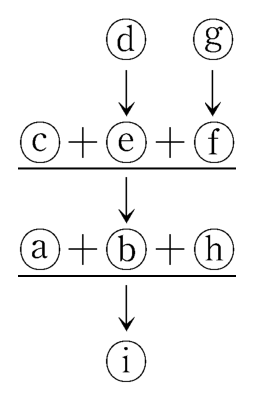
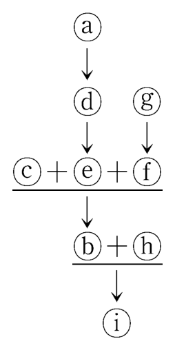
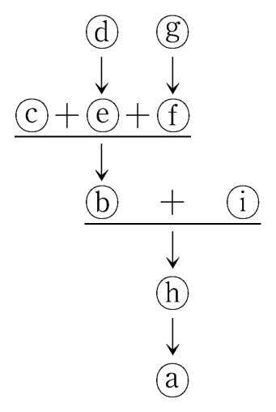
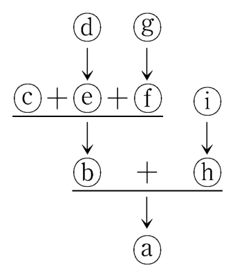
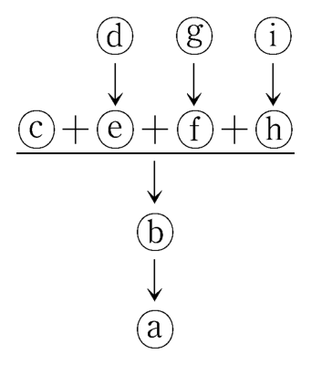
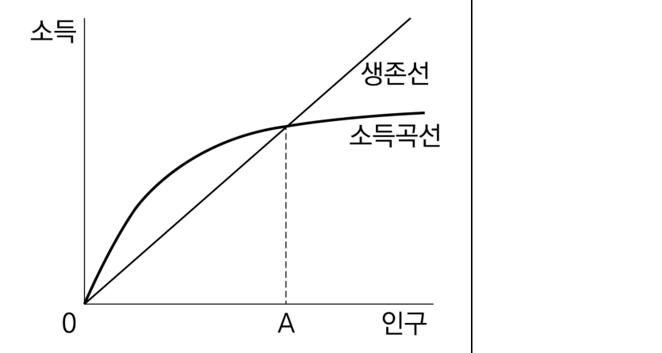

# 01 - RA (2019)

다음으로부터 추론한 것으로 옳은 것만을 <보기>에서 있는 대로 고른 것은?

## 제시문

국가는 국민의 기본권을 보장할 의무가 있다. 이를 위하여 국가는 입법·사법·행정의 활동을 행한다. 그중 행정은 법률에 근거해서 국민의 기본권을 적극적으로 실현하고, 때로는 다수 국민의 안전, 질서 유지, 공공복리를 위하여 국민의 권리를 제한하기도 한다. 그러나 원칙적으로 행정의 역할은 국민의 기본권을 실현하는 것이므로, 여하한 이유로 국민의 기본권을 제한함에 있어서는 선행 조건을 갖춰야 한다. 즉 행정으로 인하여 직접적으로 기본권을 제한받는 당사자 본인에게는 사전에 그 행정이 필요한 이유와 내용 및 근거를 알려야 한다.

행정은 다양하고 복합적인 형태로 이루어진다. 행정은 한 개인에게 권리를 갖게 하거나 권리를 제한하기도 하고, 한 개인을 대상으로 권리를 갖게 하는 동시에 일정 권리를 제한하기도 한다. 또한 행정은 국민 사이에 이해관계의 대립을 초래하기도 한다. 예컨대 신발회사가 공장설치 허가를 신청하고 행정청이 허가하는 경우에, 회사 측과 공장이 설치되는 인근 지역의 주민들은 대립할 수 있다. 회사는 공장설치 허가를 통해 영업의 자유라는 기본권을 실현하게 되는 반면, 주민들 입장에서는 환경권·건강권 등의 침해를 주장할 수 있다. 이러한 경우에도 행정 활동을 함에 있어 갖춰야 할 선행 조건은 엄격하게 요구된다.

## 보기

ㄱ. 주유소 운영자 갑에게 주유소와 접하는 도로의 일부에 대해 행정청으로부터 점용 허가 처분과 점용료 납부 명령이 예정된 경우, 행정청은 사전에 갑에게 점용 허가 처분 및 점용료 납부 명령 각각의 이유와 내용 및 근거를 알려야 한다.

ㄴ. 행정청이 을 법인에게 원자로시설부지의 사전승인을 할 때 환경권·건강권의 침해를 직접 받게 되는 인근 주민 병이 있는 경우, 행정청은 원자로시설부지의 사전승인에 앞서 병에게 그 사전승인의 이유와 내용 및 근거를 알려야 하지만, 을 법인에게는 사전승인에 앞서 알릴 필요가 없다.

ㄷ. 대리운전기사 정이 음주운전으로 적발되어 행정청이 정의 운전면허를 취소하려는 경우, 행정청은 사전에 정과 그 가족에게 운전면허취소의 이유와 내용 및 근거를 알려야 한다.

## 선택지

(1) ㄱ

(2) ㄴ

(3) ㄱ, ㄷ

(4) ㄴ, ㄷ

(5) ㄱ, ㄴ, ㄷ

# 02 - RA (2019)

다음 논쟁에 대한 평가로 적절한 것만을 <보기>에서 있는 대로 고른 것은?

## 제시문

A국은 마약류(마약·향정신성의약품 및 대마를 통칭함)로 인한 사회적 폐해를 방지하기 위하여 마약류의 제조 및 판매에 관한 '유통범죄'뿐 아니라 마약류의 단순 '사용범죄'까지도 형벌을 부과하는 정책을 시행하고 있다.

갑과 을은 이러한 자국의 마약류 정책에 대하여 다음과 같은 논쟁을 벌였다.

갑1 : B국을 여행했는데 B국은 대마초 흡연이 합법이라 깜짝 놀랐어. 대마초의 성분은 중추신경에 영향을 주어 기분을 좋게 하고, 일단 이를 접한 사람은 끊을 수 없게 만드는 중독성이 있잖아. 이러한 폐해를 야기하는 대마초 흡연은 처벌하는 것이 맞아.

을1 : 어떤 개인이 자신에게만 피해를 주는 행위를 했다는 이유로 처벌을 받아야 한다는 것이 이해가 되지 않아. 인간은 타인에게 피해를 주지 않는 한 자신의 생명과 신체, 건강에 대해서 스스로 결정할 자기 결정권을 가지고 있는데 그 권리 행사를 처벌하는 것은 최후의 수단이 되어야 할 형벌의 역할에 맞지 않아.

갑2 : 그건 아니지. 마약을 사용하는 것은 스스로를 해치는 행위이기도 하지만, 마약을 사용한 상태에서는 살인, 강간 등의 다른 범죄를 저지를 가능성이 높아져. 타인에게 위해를 가할 위험성을 방지하기 위한 형벌은 필요해.

을2 : 그 위험성을 인정하더라도 그런 행위는 타인을 위해할 목적으로 일어난 것이 아니라 중독 상태에서 발생하는 것이잖아. 중독은 치료와 예방의 대상이지 처벌의 대상이어서는 안 된다고 생각해.

갑3 : 중독은 사회 전체의 건전한 근로 의식을 저해하기 때문에 공공복리를 위해서라도 형벌로 예방할 필요가 있어.

## 보기

ㄱ. 전쟁 중 병역 기피 목적으로 자신의 신체를 손상한 사람을 병역법 위반으로 형사처벌하는 A국 정책이 타당성을 인정받는다면 을1의 주장은 약화된다.

ㄴ. 자해행위에 대한 형사처벌은 그 행위가 타인에게 직접 위해를 가하는 경우에만 정당화될 수 있고 위해의 가능성만으로 정당화되어서는 안 된다는 견해가 타당성을 인정받는다면 갑2의 주장은 약화된다.

ㄷ. 인터넷 중독과 관련하여 예방교육과 홍보활동을 강조하며 형벌을 가하지 않는 A국 정책이 타당성을 인정받는다면 을2의 주장은 약화된다.

## 선택지

(1) ㄴ

(2) ㄷ

(3) ㄱ, ㄴ

(4) ㄱ, ㄷ

(5) ㄱ, ㄴ, ㄷ

# 03 - RA (2019)

<논쟁>에 대한 분석으로 옳은 것만을 <보기>에서 있는 대로 고른 것은?

## 제시문

<X법>

제1조(형벌) 형벌은 경중(輕重)에 따라 태형, 장형, 유배형, 교형, 참형의 5등급으로 한다.

제2조(속죄금) 70세 이상이거나 15세 이하인 자가 유배형 이하에 해당하는 죄를 지으면 속죄금만을 징수한다.

제3조(감경) 형벌에 대한 감경의 횟수는 제한하지 않는다.

제4조(밀매) 외국에 금지 물품을 몰래 판매한 자는 장형에 처하고, 금지 물품이 금, 은, 기타 보석 및 무기 등인 경우에는 교형에 처한다.

<논쟁>

신하 A : 중국 사신과 동행하던 71세 장사신이 은 10냥을 소지하고 있다가 압록강을 건너기 직전에 적발되었습니다. 최근 중국에 은을 팔면 몇 배의 시세 차익을 얻을 수 있기 때문에 이러한 행위가 만연하고 있습니다. 몰래 소지한 것은 몰래 판매한 것과 다르지 않습니다. ㉠ <u>장사신을 교형으로 처벌해야 합니다.</u>

신하 B : 은 10냥을 몰래 소지하고 강을 건너는 것은 판매를 위해 준비하는 것일 뿐입니다. 역적을 처벌하는 모반죄(謀叛罪)는 모반을 준비하는 자에 대해서 형벌을 감경하여 처벌하는 규정을 두고 있기 때문에 모반의 준비 행위를 처벌할 수 있지만, 밀매죄는 이러한 규정을 두고 있지 않습니다. 법이 이와 같다면 장사신을 교형에 처할 수는 없습니다. 다만 사안에 대한 규정이 없더라도, ㉡ <u>사안에 들어맞는 유사한 사례를 다룬 판결이</u> 있다면 그 판결을 유추해서 적용해야 할 것입니다.

신하 C : 이전 판결을 유추해서 적용하는 것은 유사한지 여부를 판단해야 하는 문제가 발생하니, 차라리 '금지 물품을 몰래 소지하고 외국으로 가다가 국경을 넘기 전에 적발된 자는 밀매죄의 형에서 1단계 감경한다'는 규정을 신설하여 처벌하는 것이 옳습니다.

국 왕 : 신하 C가 말한 대로 규정을 추가로 신설하여 이를 장사신에게 적용하라.

## 보기

ㄱ. '범죄를 준비한 자를 처벌하기 위해서는 법에 정한 바가 있어야 한다'는 논거에 의하면, ㉠은 약화된다.

ㄴ. 모반을 도운 자를 모반을 행한 자와 같이 모반죄로 처벌한 판결은 ㉡에 해당된다.

ㄷ. 국왕의 명령에 의하면, 장사신은 유배형에 처해진다.

## 선택지

(1) ㄱ

(2) ㄴ

(3) ㄱ, ㄷ

(4) ㄴ, ㄷ

(5) ㄱ, ㄴ, ㄷ

# 04 - RA (2019)

다음 글에 대한 분석으로 옳은 것만을 <보기>에서 있는 대로 고른 것은?

## 제시문

A는 B가 뒤따라오고 있다는 것을 알면서도 출입문을 세게 닫아 B의 손가락이 절단되는 사건이 발생하였다. A가 B의 손가락을 절단하려 했는지가 밝혀지지 않은 상황에서, 갑, 을, 병은 A를 상해죄로 처벌할 수 있는지에 대해서 대화를 나누고 있다.

갑 : B의 손가락이 절단된 결과에 대해서 A를 처벌할 수는 없어. A는 자신의 행위로 인해 B의 손가락이 잘리는 것까지 의도한 것은 아니니까. A가 자신의 행위로 인해 B의 손가락이 잘리는 것까지 의도했을 때만 처벌해야지.

을 : A에게 B의 손가락을 절단하려는 의도는 없었어. 하지만 A는 어쨌든 자신의 행위가 B의 손가락을 절단할 수도 있다는 것을 몰랐을 리 없어. A는 B의 손가락이 절단된 결과에 대해서 처벌을 받아야 해.

병 : A가 자신의 행동으로 인해 B의 손가락이 절단될 수도 있다는 것을 알고 있었다고 인정하지는 못하겠어. 그래도 A는 B의 손가락이 절단된 결과에 대해서 처벌을 받아야 해. 어쨌든 A는 B의 신체에 조금이라도 해를 입힐 의도는 있었으니까.

## 보기

ㄱ. 갑과 을은 A의 처벌 여부에 대해서는 다른 의견이나, A의 의도에 대해서는 같은 의견이다.

ㄴ. 을과 병은 A의 처벌 여부에 대해서는 같은 의견이나, A의 인식에 대해서는 다른 의견이다.

ㄷ. 갑의 견해에서 상해죄의 처벌 대상이 되는 행위는 병의 견해에서도 모두 처벌의 대상이 된다.

ㄹ. 을의 견해에서 상해죄의 처벌 대상이 되는 행위는 병의 견해에서도 모두 처벌의 대상이 된다.

## 선택지

(1) ㄱ, ㄴ

(2) ㄱ, ㄹ

(3) ㄷ, ㄹ

(4) ㄱ, ㄴ, ㄷ

(5) ㄴ, ㄷ, ㄹ

# 05 - RA (2019)

다음 글에 대한 분석으로 옳은 것만을 <보기>에서 있는 대로 고른 것은?

## 제시문

F국의 박물관에서 보석으로 장식된 여신상을 도난당하였다. 조사 결과 G국의 절도단이 이 여신상을 훔쳐 본국으로 밀반출한 것으로 밝혀졌다. G국 경찰은 절도단을 체포하고 해당 여신상을 압수하였다. G국 정부는 F국 정부의 요청에 따라 여신상을 F국에 반환하려고 하였다. 그런데 G국의 A시가 여신상에 대한 소유권을 주장하며 F국으로 반환하지 말 것을 요청하였다. A시가 제출한 기록에 의하면 해당 여신상은 원래 약 2000년 전에 시민들이 모금하여 제작한 것으로, A시 중앙에 위치한 신전 내에 봉헌되었다. 여신상이 신전에서 언제, 어떻게 없어졌는지 그 경위는 불확실하다. A시는 과거 긴 전쟁, 전후 혼란기 등의 시기에 F국 군인들이 G국의 문화재를 약탈한 사례가 많이 있었기 때문에, 해당 여신상도 같은 경위로 F국으로 반출되었을 것이라고 주장하였다. 이에 관하여 아래와 같은 두 가지 의견이 있다.

갑 : A시가 여신상을 소유하고 있었다는 확실한 기록이 있어. 그리고 역사적으로 F국은 G국의 문화재를 탈취해 왔지. 여신상의 적법한 반출 경위를 확인할 수 없다면, 마찬가지로 약탈당한 것으로 봐야 하지 않을까. 비록 해당 여신상이 불법적인 방법에 의해 G국에 반입되었지만, 원래의 정당한 소유자라는 증거가 있는 A시에 돌려주는 것이 옳은 것 같아.

을 : 기록을 보면 A시의 신전에 여신상이 안치되어 있던 것은 사실인 것 같아. 하지만 그 사실이 인정된다고 하더라도 해당 여신상의 약탈 여부는 알 수 없잖아. A시가 친선의 목적으로 여신상을 F국 유력자에게 선물하였거나, 매도했을 수도 있지. 그런 합법적 경로를 통하여 F국으로 반출되었을 가능성도 분명히 있기 때문에, 불법적인 방법으로 여신상을 G국으로 가져오는 것은 문제가 있어. 여신상은 F국에 돌려주는 것이 맞아.

## 보기

ㄱ. '여신상이 G국에서 F국으로 불법적으로 반출되었을 가능성이 매우 높더라도 G국은 밀반입된 여신상을 F국에 돌려주어야 한다'는 견해에 갑은 동의하지 않지만, 을은 동의한다.

ㄴ. 'A시가 여신상을 반환받기 위하여, 해당 여신상이 F국으로 불법적으로 반출되었다는 것이 먼저 증명되어야 한다'는 견해에 갑은 동의하지 않지만, 을은 동의한다.

ㄷ. '여신상을 A시로 반환할지의 여부를 결정하기 위한 전제로서 A시의 신전이 그 여신상을 소유하였다는 사실이 인정되어야 한다'는 견해에는 갑, 을 모두 동의한다.

## 선택지

(1) ㄱ

(2) ㄴ

(3) ㄱ, ㄷ

(4) ㄴ, ㄷ

(5) ㄱ, ㄴ, ㄷ

# 06 - RA (2019)

<사실관계>에서 국제법원의 판정 이후 A국이 <규정>에 합치하도록 취할 수 있는 조치로 옳은 것만을 <보기>에서 있는 대로 고른 것은?

## 제시문

<사실관계>

참치는 천적인 상어를 막아 주는 돌고래 주변에서 주로 이동한다. 참치가 많이 잡히는 열대성 동태평양 수역에서 작업을 하는 여러 국가의 어부들은 초대형 선예망(超大型旋曳網)으로 어업을 한다. 이때 참치뿐 아니라 주변의 돌고래까지 함께 어획되어 매년 만 마리 이상의 돌고래가 죽는 문제가 발생하였다. 지속적으로 돌고래 보호 운동을 펼쳐 온 A국의 한 환경 단체는 정부를 압박하여, 논의 끝에 A국 내에서 유통되는 참치 제품 중 초대형 선예망으로 잡지 않은 제품에 '돌고래 세이프 라벨'을 부착하는 규정이 상표법에 추가되었다. B국 어민들은 주로 열대성 동태평양 수역에서 어업을 하여 A국에 수출하고 있었고, A국의 상표법 개정으로 인하여 B국 어민 제품의 수출량은 급격히 감소하였다. B국 정부는 초대형 선예망을 사용하지 않는 어선도 돌고래를 위협하고 있다고 주장하며, A국에서 '돌고래 세이프 라벨'을 초대형 선예망으로 작업하는 자국 어선의 제품에 부착하지 못하도록 하는 것은 차별이라는 이유로 A국을 국제법원에 제소하였다. 이에 대하여 국제법원은 다음과 같이 판정하였다.
"A국이 B국의 제품에 행하고 있는 라벨 규제는 차별적인 조치에 해당하므로 아래의 <규정>에 합치하지 않는다."

<규정>

국가는 다른 국가로부터 수입되는 물품이 국내에서 생산된 동종 물품 또는 그 외의 다른 국가에서 생산된 동종 물품보다 불리한 취급을 받지 아니할 것을 보장하여야 한다.

## 보기

ㄱ. A국은 상표법에 있는 '돌고래 세이프 라벨' 조항을 철폐하였다.

ㄴ. A국은 열대성 동태평양 수역 내 B국 어선의 제품에 대해서만 라벨 규정을 완화하였다.

ㄷ. A국은 모든 어업 방식에 적용될 수 있도록 상표법의 라벨 규정을 강화하였다.

## 선택지

(1) ㄱ

(2) ㄴ

(3) ㄱ, ㄷ

(4) ㄴ, ㄷ

(5) ㄱ, ㄴ, ㄷ

# 07 - RA (2019)

원님 갑이 재판에서 채택할 진술을 <사례>에서 있는 대로 고른 것은?

## 제시문

원님 갑은 고을에서 일어나는 범죄에 대한 모든 재판을 담당하였다. 재판에서 증거로 받아들이기 어려운 진술들이 많이 제출되어 재판이 지연되자, 갑은 일정한 요건을 갖춘 증거들만 제출할 수 있도록 제한하였다. 그리하여 갑은 용의자의 평소 행실에 관한 진술은 재판에서 채택하지 않기로 하였다.

그러나 갑은 증인의 평소 언행의 진실성에 대한 진술은 들을 필요가 있다고 생각하였고, 이러한 진술의 채택 요건을 아래와 같이 제한하여 예외적으로 받아들였다.

첫째, 증인의 평소 언행의 진실성에 대해서 진술하는 것은 평소 고을에서의 평판에만 한정하고, 과거에 특정한 행위를 한 적이 있다는 진술은 채택하지 않는다.

둘째, 증인이 예전에 재판에서 허위 진술을 하여 처벌을 받은 적이 있다는 것은 중요하기 때문에 이에 대한 진술은 채택하기로 한다.

셋째, 증인의 평소 언행의 진실성을 모든 사건에서 다 확인할 필요는 없기 때문에 '증인이 진실하다'는 진술은 다른 사람이 '증인이 진실하지 못하다'고 진술하거나 '증인이 예전에 재판에서 허위 진술을 하여 처벌을 받은 적이 있다'고 진술을 한 때에 비로소 채택한다.

<사례>

현재 갑이 담당하고 있는 재판에서 갑돌이는 <혐의 1> 갑순이 집 앞에서 담배를 피우다 버려 갑순이 집의 외양간을 태웠고, <혐의 2> 그 사실이 소문나면 주인마님에게 혼날까 봐 무서워 불이 나던 날 밤 '을돌이가 갑순이 집 앞에서 담배를 피우는 것을 보았다'는 거짓 소문을 냈다는 두 가지 혐의를 받고 있다. <혐의 1>과 관련하여 갑이 갑돌이에게 그날의 행적에 대하여 묻자, 갑돌이는 ㉠ <u>"저는 주변에서 매우 조심성 있는 사람이라는 평을 듣습니다."</u>라고 진술하였다. 다음으로 <혐의 2>와 관련하여 갑돌이의 친구 마당쇠가 증인으로 나와 "갑돌이는 거짓말을 안 하는 진실한 놈이라는 평판이 자자합니다."라고 진술하였다. 그러자 대장장이가 증인으로 나와 ㉡ <u>"예전에 마당쇠가 을순이에게 거짓말을 해서 을순이 아버지에게 크게 혼난 일이 있었지요."</u>라고 진술하였다. 갑이 을돌이를 증인으로 불러 그날의 행적에 대하여 진술하게 하자 을돌이는 "그날 저는 집에 있었습니다."라고 진술하였다. 이에 다음 증인 병돌이는 ㉢ <u>"예전에 을돌이가 아랫동네 살인 사건 재판에서 거짓말을 하여 곤장 다섯 대를 맞은 적이 있습니다."</u>라고 진술하였다. 이에 다른 증인 방물장수는 ㉣ <u>"을돌이가 매우 진실하다는 소문이 윗마을까지 나 있습니다."</u>라고 진술하였다.

## 선택지

(1) ㉠, ㉡

(2) ㉠, ㉣

(3) ㉢, ㉣

(4) ㉠, ㉡, ㉢

(5) ㉡, ㉢, ㉣

# 08 - RA (2019)

<규정>을 근거로 <사실관계>에 대하여 옳은 판단을 하는 변호사는?

## 제시문

<규정>

종업원은 직무와 관련하여 한 발명에 대하여 기여도에 따라 다음과 같이 보상을 받을 권리를 가진다.

(1) 회사가 직무발명에 대한 특허출원을 할 경우 출원보상을 한다. 보상금은 그 중요도에 따라 건당 10만 원에서 30만 원을 지급하며, 나머지는 회사 내에 설치된 직무발명심의위원회의 결정 심사 후에 지급한다.

(2) 회사 명의로 등록된 특허권을 매도 또는 임대하였을 때 처분보상을 한다. 특허권을 타인에게 유상으로 임대한 경우에는 특허임대수익의 $5\sim10\%$에 해당하는 금액을 발명자에게 보상금으로 지급한다.

(3) 단, 특허임대수익의 산정은 수령하였거나 수령할 총 임대료에서 개발비용, 영업비용을 제외한다.

<사실관계>

X는 Y사에 직무발명에 대한 정당한 보상금의 지급을 요청하는 소송을 하기 위해 법무법인에 찾아갔다. X는 Y사에서 2007년부터 4년 4개월 동안 연구원으로 근무하였다. X는 Y사의 다른 연구원들과 함께 A사가 독점하고 있는 의약품과 동등하면서도 제조원가 대비 $38\%$로 생산 가능한 방법을 48억 원의 비용을 들여 발명하였다. 해당 발명에 관여한 연구원들은 Y사에게 직무발명에 관한 특허 받을 권리를 이전하였고, Y사는 자사명의로 특허출원을 하였다. 이와 관련된 특허발명에서 X의 기여도는 $\frac{1}{3}$로 인정받았고 출원보상은 상여금 명목으로 5천만 원을 지급받았다. 한편 Y사는 2010년도에 A사와 특허권 임대계약을 체결하기 위해 42억 원의 비용을 소요하였다. 그 계약에 의해 A사로부터 초회 대금 45억 원, 중간 정산대금 23억 원을 지급받음과 동시에 40개월 간의 임대료로 요율 $3\sim5\%$에 의해 산정된 금액 24억 원을 수령하였다. 계약기간인 2030년까지 추가적으로 수령할 Y사의 임대료는 약 28억 원으로 추정된다.

## 선택지

(1) 갑 : 특허임대수익의 $5\sim10\%$에 해당하는 금액이 이미 지급받은 출원보상금 5천만 원을 넘지는 않을 것 같습니다.

(2) 을 : 회사가 타인에게 특허권을 유상으로 임대했기 때문에 임대료 수익을 받을 수 있겠군요. 최대 1억 원은 청구 가능할 것 같아요.

(3) 병 : Y사가 해당 특허로 수령할 총 임대료는 120억 원이군요. 따라서 당신은 최대 4억 원의 보상금을 받을 수 있습니다.

(4) 정 : 본 특허로 얻을 Y사의 임대료 수익은 임대료 명목으로 지급받은 52억 원입니다. 따라서 최소 2억 6천만 원의 보상금을 청구할 수 있어요.

(5) 무 : 임대료 수익은 실제 발생한 금액만 가지고 산정하여야 합니다. 미래의 시장 상황까지는 고려할 수 없어요. 따라서 92억 원을 특허임대수익으로 봐야 해요.

# 09 - RA (2019)

다음으로부터 <사례>를 판단한 것으로 옳은 것은?

## 제시문

지방자치단체의 구역변경이나 설치·폐지·분할 또는 합병이 있는 때에는 다음과 같이 당해 지방의회의 의원정수를 조정하고 의원의 소속을 정한다.

첫째, 지방자치단체의 구역변경으로 선거구에 해당하는 구역의 전부가 다른 지방자치단체에 편입된 때에는 그 편입된 선거구에서 선출된 의원은 종전의 지방의회의원의 자격을 상실하고 새로운 지방의회의원의 자격을 취득하되, 그 임기는 종전의 지방의회의원의 잔임기간으로 하며, 해당 의회의 의원정수는 재직하고 있는 의원수로 한다.

둘째, 선거구에 해당하는 구역의 일부가 다른 지방자치단체에 편입된 때에는 그 편입된 구역이 속해 있던 선거구에서 선출되었던 의원은 자신이 속할 지방의회를 선택한다. 그 선택한 지방의회가 종전의 지방의회가 아닌 때에는 종전의 지방의회의원의 자격을 상실하고 새로운 지방의회의원의 자격을 취득하되, 그 임기는 종전의 지방의회의원의 잔임기간으로 하며, 해당되는 의회 각각의 의원정수는 재직하고 있는 의원수로 한다.

셋째, 두 개 이상의 지방자치단체가 합병하여 새로운 지방자치단체가 설치된 때에는 종전의 지방의회의원은 새로운 지방자치단체의 지방의회의원으로 되어 잔임기간 재임하며, 그 잔임기간의 합병된 의회의 의원정수는 재직하고 있는 의원수로 한다.

넷째, 하나의 지방자치단체가 분할되어 두 개 이상의 지방자치단체가 설치된 때에는 종전의 지방의회의원은 후보자등록 당시의 선거구를 관할하게 되는 지방자치단체의 지방의회의원으로 되어 잔임기간 재임하며, 그 잔임기간의 분할된 의회의 의원정수는 재직하고 있는 의원수로 한다. 이 경우 비례대표의원은 자신이 속할 지방의회를 선택한다.

<사례>

○ 지방자치단체인 A구 의회의 선거구는 a1, a2, a3, a4로 구성되어 있다. 각 선거구에서 2명의 지역구의원이 선출되며, 비례대표의원은 2명으로 의원 정수는 10명이다.

○ 지방자치단체인 B구 의회의 선거구는 b1, b2, b3으로 구성되어 있다. 각 선거구에서 2명의 지역구의원이 선출되며, 비례대표의원은 2명으로 의원 정수는 8명이다.

## 선택지

(1) A구와 B구가 합병된다면, 합병된 지방의회의 잔임기간 의원정수는 16명이다.

(2) A구 선거구 a1이 B구로 편입된다면, a1에서 선출된 A구 의회 의원은 A구 의회 소속을 유지한다.

(3) A구 선거구 a2의 일부 구역이 B구로 편입된다면, a2에서 선출된 A구 의회의원은 B구 의회로 소속이 변경된다.

(4) B구가 2개의 지방자치단체 B1(b1)구와 B2(b2+b3)구로 분할된다면, B1구 지방의회의 잔임기간 최대 의원정수는 4명이다.

(5) 지방자치단체의 구역변경·합병·분할 중, 지방의회의원의 잔임기간이 경과한 후 해당 지방의회 의원정수가 조정될 가능성이 있는 것은 구역변경과 분할이다.

# 10 - RA (2019)

다음 글에 대한 분석으로 옳은 것만을 <보기>에서 있는 대로 고른 것은?

## 제시문

A국 형법에는 높은 것부터 사형, 국적박탈형, 채찍형, 회초리형으로 4등급의 주된 형벌이 있다. 그리고 범죄에 따라 주된 형벌에 문신형을 부가할 수 있다. A국에서 장애인 갑이 쌀을 훔치다 현장에서 체포되어 법정에 섰다.

검사 : 형법에는 타인의 물건을 훔친 자를 채찍형에 처하고 문신형을 부가하도록 하고 있습니다. 이에 따라 갑을 채찍형과 문신형으로 처벌함이 마땅하나, '장애인이 국적박탈형 이하를 받게 되는 경우에는 사회봉사로 대체한다'는 규정이 있습니다. 따라서 장애인 갑은 사회봉사를 하게 하고 문신형을 부가해야 합니다.

변호인 : 이의 있습니다! 왜 문신형은 사회봉사로 대체하지 않습니까? 문신형이 국적박탈형 이하인지 아닌지를 정한 규정이 없으므로, ㉠ <u>'의심스러울 때에는 가볍게 처벌한다'는 원칙</u>을 이 경우에 적용해야 합니다.

검사 : 갑은 타인의 물건을 훔친 것이 명백합니다. 의심스러울 때에 가볍게 처벌한다는 원칙을 이 경우에까지 적용할 수 있나요? 변호인의 주장은 억지입니다.

판사 : 선고하겠습니다. "법률에 관련 규정이 없으면, 국민의 고통을 줄이는 방향으로 형벌을 부과하는 것이 헌법의 원칙에 합치한다. 따라서 문신형도 사회봉사로 대체한다."

## 보기

ㄱ. 만약 증거물이나 알리바이 등 범죄 성립 여부와 관련된 사항에만 ㉠을 적용하여야 한다는 주장이 옳다면 이는 검사의 견해를 강화한다.

ㄴ. A국 형법에 '범죄행위시점과 형벌부과시점 사이에 장애의 유무로 형벌의 변경이 있는 경우에는 그 중 범죄자에게 가장 유리한 것을 부과한다'고 규정하고 있는 경우, 갑이 선고 전 수술을 통해 그 장애가 없어졌더라도, 판사의 결론은 같을 것이다.

ㄷ. 만약 A국 형법에 '손아랫사람이 손위 어른을 대상으로 행한 친족 간의 범죄는 친족관계가 없는 자를 대상으로 행한 범죄에 비해 주된 형벌에 1등급을 높인다'고 규정하고 있고 갑이 훔친 쌀이 큰아버지의 것이라면, 문신형에 관한 검사의 주장과 판사의 결론 중 적어도 하나는 달라질 것이다.

## 선택지

(1) ㄱ

(2) ㄷ

(3) ㄱ, ㄴ

(4) ㄴ, ㄷ

(5) ㄱ, ㄴ, ㄷ

# 11 - RA (2019)

<규정>과 <견해>로부터 추론한 것으로 옳은 것만을 <보기>에서 있는 대로 고른 것은?

## 제시문

<규정>

(1) CCTV란 일정한 공간에 지속적으로 설치되어 사람 또는 사물의 영상을 촬영하는 장치이다.

(2) 누구든지 CCTV를 설치·운영할 수 있으나, 공개된 장소에서의 설치·운영은 범죄의 예방 및 수사를 위하여 필요한 경우에만 가능하다.

(3) CCTV를 설치·운영하는 자는 CCTV를 설치하여 운영하고 있다는 내용을 알리는 CCTV 설치·운영 안내판을 설치하여야 한다.

<견해>

갑 : 택시 안은 공개된 장소가 아니다.

을 : 일정한 공간에 지속적으로 설치되어 사람의 영상을 촬영하는 휴대전화 카메라는 CCTV에 해당한다.

병 : 비공개된 자동차 내부에 설치·운영되며, 외부를 촬영하고 있는 블랙박스도 CCTV에 해당한다.

## 보기

ㄱ. 갑에 따르면, 택시 안에서는 CCTV 설치·운영 안내판을 설치하기만 하면 언제든지 CCTV를 설치·운영할 수 있다.

ㄴ. 을에 따르면, 비공개된 자신의 서재에 휴대전화 카메라를 지속적으로 설치하여 촬영할 경우에 CCTV 설치·운영 안내판을 설치하여야 한다.

ㄷ. 병에 따르면, 범죄의 예방 및 수사를 위하여 필요한 경우에만 블랙박스를 설치·운영할 수 있다.

## 선택지

(1) ㄱ

(2) ㄷ

(3) ㄱ, ㄴ

(4) ㄴ, ㄷ

(5) ㄱ, ㄴ, ㄷ

# 12 - RA (2019)

<규정>에 따라 <사례>를 판단한 것으로 옳은 것만을 <보기>에서 있는 대로 고른 것은?

## 제시문

<규정>

(1) 회사가 새로이 발행하는 주식의 취득을 50인 이상의 투자자에게 권유하기 위해서는 사전에 신고서를 금융감독청에 제출해야 한다.

(2) 위 (1)에서 50인을 산정함에 있어 투자자에게 주식의 취득을 권유하는 날로부터 그 이전 6개월 이내에 50인 미만에게 주식 취득을 권유한 적이 있다면 이를 합산한다.

(3) 다만, 위 (1)에서 50인 이상의 투자자에게 취득을 권유하는 경우에도 주식 발행 금액이 10억 원 미만인 경우에는 신고서의 제출 의무가 면제된다.

(4) 위 (3)에서 10억 원을 산정함에 있어 투자자에게 주식의 취득을 권유하는 날로부터 그 이전 1년 이내에 신고서를 제출하지 아니하고 발행한 주식 금액을 합산한다.

<사례>

A회사는 아래 표와 같은 순으로 주식을 새로이 발행하였다.

| 회차 | 주식 발행일 | 주식 발행 금액 | 취득 권유일 | 취득을 권유받은 투자자 수 |
|---|---|---|---|---|
| 1 | 2017년 3월 10일 | 7억 원 | 2017년 3월 3일 | 70명 |
| 2 | 2017년 10월 4일 | 9억 원 | 2017년 9월 27일 | 40명 |
| 3 | 2018년 3월 27일 | 8억 원 | 2018년 3월 20일 | 10명 |

## 보기

ㄱ. 1회차에는 신고서를 제출하지 않아도 된다.

ㄴ. 2회차에는 신고서를 제출해야 한다.

ㄷ. 3회차에는 신고서를 제출해야 한다.

## 선택지

(1) ㄱ

(2) ㄴ

(3) ㄱ, ㄷ

(4) ㄴ, ㄷ

(5) ㄱ, ㄴ, ㄷ

# 13 - RA (2019)

<비행기준>에 따를 때, 신고와 비행승인이 모두 없어도 비행이 허용되는 경우만을 <보기>에서 있는 대로 고른 것은?

## 제시문

<비행기준>

1. 무인비행장치는 사람이 탑승하지 아니하는 것으로 연료의 중량을 제외한 자체 중량(이하 '자체 중량')이 150 kg 이하인 무인비행기와 자체 중량이 180 kg 이하이고 길이가 20 m 이하인 무인비행선을 말한다.

2. 무인비행장치를 소유한 자는 무인비행장치의 종류, 용도, 소유자의 성명 등을 행정청에 신고하여야 한다. 다만 군사 목적으로 사용되는 무인비행장치와 자체 중량이 18 kg 이하인 무인비행기는 제외한다.

3. 오후 7시부터 이튿날 오전 6시 사이에 무인비행장치를 비행하려는 자는 미리 행정청의 비행승인을 받아야 한다.

4. 무인비행장치를 사용하여 비행장 및 이착륙장으로부터 반경 3 ㎞ 이내, 고도 150 m 이내인 범위에서 비행하려는 사람은 미리 행정청의 비행승인을 받아야 한다. 다만 군사목적으로 사용되는 무인비행장치와 자체 중량이 10 kg 이하인 무인비행기는 제외한다.

## 보기

ㄱ. 자체 중량이 120 kg인 공군 소속 무인비행기를 공군 비행장 내 고도 100 m 이내에서 오전 10시부터 오후 2시까지 군수 물자 수송을 위하여 비행하려는 경우

ㄴ. 택배회사가 영업을 위하여 새로 구입한 자체 중량 160 kg, 길이 15 m인 무인비행선을 오후 4시부터 오후 5시 사이에 대학병원 헬기 이착륙장 반경 200 m에 있는 사무실로 물품 배달을 위하여 비행하려는 경우

ㄷ. 육군 항공대가 자체 중량이 15 kg인 농업용 무인비행기를 빌려서 군사훈련 보조용으로 공군 비행장 반경 2 ㎞ 이내에서 오후 2시부터 오후 3시까지 고도 100 m로 비행하려는 경우

ㄹ. 대학생들이 자체 중량이 8 kg인 무인비행기를 김포공항 경계선 2 ㎞ 지점에서 15 m 이내의 높이로 오후 8시부터 30분 동안 취미로 비행하려는 경우

## 선택지

(1) ㄱ, ㄷ

(2) ㄱ, ㄹ

(3) ㄴ, ㄹ

(4) ㄱ, ㄴ, ㄷ

(5) ㄴ, ㄷ, ㄹ

# 14 - RA (2019)

다음으로부터 추론한 것으로 옳은 것만을 <보기>에서 있는 대로 고른 것은?

## 제시문

X국의 보험약관법에는 다음과 같이 보험사의 손해배상책임을 면제하는 약관조항을 금지하는 규정이 있다. (1) 보험사의 고의 또는 중대한 과실로 인한 손해배상책임을 면제하는 약관조항은 금지된다. (2) 보험사나 보험계약자의 잘못이 아닌 제3자의 잘못으로 보험계약자에게 발생한 손해에 대한 보험사의 책임을 타당한 이유 없이 면제하는 약관조항은 금지된다. 이러한 손해를 제3자 대신 보험사가 배상하는 것이 보험계약의 핵심이기 때문이다. 이들 금지규정에 위반되는 약관은 무효이다.

위 규정 (1)과 관련하여, ㉠ <u>보험사의 고의, 중대한 과실, 경미한 과실 여하에 대한 아무런 언급이 없이 보험사의 모든 책임을 면제하는 내용의 약관조항</u>을 생각해 보자. 이 조항은 경우에 따라 무효가 될 수도 있고 유효가 될 수도 있다. 이러한 약관조항 전체를 무효로 보게 되면 이를 다시 만들어야 하므로, 무효인 경우를 제거하고 유효가 될 수 있는 경우에만 약관이 적용되도록 함으로써 그 약관조항을 유지할 수 있다. 이를 약관의 효력 유지적 축소 해석이라고 한다.

이런 축소 해석의 방법을 위 규정 (2)와 관련되는 약관조항에 적용해 보자. 예를 들어 ㉡ <u>"무면허운전은 누가 운전을 하더라도 보험사는 아무런 책임이 없습니다."</u>라는 자동차보험 약관조항은 무효가 될 수 있다. 무면허인 차량 절도범이 사고를 냈다면 차량 주인인 ㉢ <u>보험계약자의 지배와 관리가 불가능하였으므로</u>, 보험사의 책임을 면제하는 것은 타당한 이유가 없기 때문이다. 그러나 차량 주인의 자녀가 운전면허 없이 운전하다 사고를 냈다면 보험계약자의 지배와 관리가 가능하였으므로 보험사의 책임을 면제하는 것이 약관의 효력을 유지하는 축소 해석이다.

## 보기

ㄱ. ㉠에 대해 효력을 유지하면서 축소 해석을 하면, 보험사의 경미한 과실로 인한 손해배상책임은 면제될 것이다.

ㄴ. ㉢의 경우에 ㉡이 보험사의 책임을 면제한다면, ㉡은 보험약관법에 위반될 것이다.

ㄷ. 약관조항 전체를 무효로 하는 경우에 비하여 약관조항의 효력을 유지하는 방향으로 축소 해석을 하면, 보험사로 하여금 규정 (1), (2)에 부합하는 약관조항을 만들게 하는 유인이 약해질 것이다.

## 선택지

(1) ㄴ

(2) ㄷ

(3) ㄱ, ㄴ

(4) ㄱ, ㄷ

(5) ㄱ, ㄴ, ㄷ

# 15 - RA (2019)

다음으로부터 추론한 것으로 옳은 것만을 <보기>에서 있는 대로 고른 것은?

## 제시문

'죽이는 것'과 '죽게 내버려 두는 것'의 실제 적용 기준에 대해 다음 주장들이 제안되었다.

갑 : '죽이는 것'은 죽음에 이르는 사건 연쇄를 시작하는 것이고, '죽게 내버려 두는 것'은 죽음에 이르는 사건 연쇄의 진행을 막지 않거나, 죽음에 이르는 사건 연쇄의 진행을 막는 장애물을 제거하는 것이다.

을 : '죽이는 것'은 죽음에 이르는 사건 연쇄를 시작하거나, 죽음에 이르는 사건 연쇄의 진행을 막는 장애물을 제거하는 것이다. 반면에 '죽게 내버려 두는 것'은 죽음에 이르는 사건 연쇄의 진행을 막지 않는 것이다.

병 : 죽음에 이르는 사건 연쇄를 시작하는 경우 '죽이는 것'이며, 죽음에 이르는 사건 연쇄의 진행을 막지 않는 경우 '죽게 내버려 두는 것'이다. 죽음에 이르게 되는 사건 연쇄의 진행을 막는 장애물을 제거할 경우, 그 장애물이 자신이 제공한 것이라면 '죽게 내버려 두는 것'이고 다른 사람이 제공한 것이라면 '죽이는 것'이다.

<사례>

(가) A는 수영장에서 물에 빠져 허우적거리는 아이를 발견하였다. A가 구조 요원에게 이 사실을 알렸더라면 그 아이는 죽지 않았을 것이다. A는 ㉠ 구조 요원에게 알리지 않았고 그 아이는 죽었다.

(나) 어떤 환자가 심각한 병에 걸려 의사가 제공한 생명 유지 장치의 도움으로 생명을 유지하고 있었다. 그 장치의 도움이 없었다면 환자는 곧 죽었을 것이다. 그런데 B가 의사 몰래 병실에 들어와 ㉡ 장치를 꺼 버렸고 그 환자는 죽었다.

(다) 어떤 사람이 생명 유지에 필요한 특정한 물질을 투입받지 못할 경우 죽게 되는 심각한 병에 걸렸다. 그 물질을 자신이 가지고 있음을 알게 된 C는 자신의 몸과 그 환자의 몸을 튜브로 연결하여 그 물질을 전달하였다. 며칠 동안 그 물질을 전달하고 있던 C는 마음이 변하여 ㉢ 튜브를 제거하였고, 그 직후에 그 환자는 죽었다.

## 보기

ㄱ. ㉠ 행위는 갑과 을에 따르면 '죽게 내버려 두는 것'이고 병에 따르면 '죽이는 것'이다.

ㄴ. ㉡ 행위는 갑에 따르면 '죽게 내버려 두는 것'이고 을과 병에 따르면 '죽이는 것'이다.

ㄷ. ㉢ 행위는 갑과 병에 따르면 '죽게 내버려 두는 것'이고 을에 따르면 '죽이는 것'이다.

## 선택지

(1) ㄱ

(2) ㄷ

(3) ㄱ, ㄴ

(4) ㄴ, ㄷ

(5) ㄱ, ㄴ, ㄷ

# 16 - RA (2019)

다음 논쟁에 대한 분석으로 옳은 것만을 <보기>에서 있는 대로 고른 것은?

## 제시문

수정란으로부터 태아를 거쳐 유아로의 발달은 점진적이고 연속적인 과정이다. 수정 이후 어느 시점부터 인간이라 할 수 있겠는가? 갑, 을, 병은 아래와 같이 주장한다.

갑 : 출생이 기준이 된다고 해 보자. 그렇다면 7개월 만에 태어난 조산아는 인간인데, 그보다 더 발달한 9개월 된 임신 말기 태아는 인간이 아니게 된다. 이는 말이 되지 않는다. 출생만으로는 인간인지 여부의 기준이 될 수 없다.

을 : 의식과 감각의 존재 여부가 중요한 기준이다. 일반적으로 태아의 두뇌는 18주부터 25주 사이에 충분히 발달하여 신경 전달이 가능하게 되는 수준에 이른다. 수정란은 의식을 갖지 않고 고통도 느끼지 않겠지만, 충분히 발달한 태아가 의식과 감각 능력을 갖게 된다면 인간으로 간주해야 한다.

병 : 태아가 발달 과정의 어느 시점엔가 의식과 감각을 갖게 된다는 것은 분명하다. 그러나 언제부터 태아가 의식을 가지며 고통을 느끼기 시작하는지에 대한 직접적 증거는 원리적으로, 적어도 현재 기술로는 찾을 수 없다. 과학자들은 고통과 같은 감각의 생리학적 상관 현상으로서 두뇌 피질이나 행동을 관찰할 뿐, 고통을 직접 관찰하는 것이 아니다.

## 보기

ㄱ. 갑에 따르면, 태아가 인간인지의 여부는 태아가 얼마나 발달했는지와 무관하다.

ㄴ. 을에 따르면, 아무런 의식이나 감각을 갖지 않는 임신 초기의 태아는 인간으로서의 지위를 갖지 않는다.

ㄷ. 병에 따르면, 의식이나 감각의 존재 여부는 인간인지의 여부와 무관하다.

## 선택지

(1) ㄴ

(2) ㄷ

(3) ㄱ, ㄴ

(4) ㄱ, ㄷ

(5) ㄱ, ㄴ, ㄷ

# 17 - RA (2019)

다음 가설과 실험에 대한 평가로 옳은 것만을 <보기>에서 있는 대로 고른 것은?

## 제시문

우리는 어떤 도덕적 판단이 다른 도덕적 판단보다 더 객관적이라고 생각한다. 예를 들어 '살인은 나쁘다'는 판단은 '노약자에게 자리를 양보하는 것은 옳다'는 판단보다 더 객관적인 것으로 보인다. 그렇다면 왜 이런 차이가 생기는 것일까? 이를 알아보기 위해 다음 가설과 실험이 제시되었다.

가설 1: 사람들은 다른 사람의 신체에 직접 물리적인 해를 끼치는 행위에 대한 도덕적 판단이 그렇지 않은 행위에 대한 도덕적 판단보다 더 객관적이라고 생각한다.

가설 2: 사람들은 어떤 행위가 나쁘다는 도덕적 판단이 어떤 행위가 옳다는 도덕적 판단보다 더 객관적이라고 생각한다.

<실험>

실험 참가자들에게 갑, 을, 병의 다음 행위에 대한 이야기를 들려주었다.

갑의 행위: 술집에서 자신에게 모욕을 준 사람에게 직접 물리적 폭력을 가함.

을의 행위: 친구들에게 과시하고자 무명용사의 추모비를 발로 차서 깨뜨림.

병의 행위: 자신의 월급의 $10\%$를 매달 복지 단체에 익명으로 기부함.

그리고 참가자들에게 '갑의 행위가 나쁘다는 판단이 전혀 객관적이지 않다면 0, 매우 객관적이라면 5를 부여하고, 그 정도를 0과 5 사이의 점수로 표현하라'고 요청하였다. 을의 행위가 나쁘다는 판단과 병의 행위가 옳다는 판단의 객관성에 대해서도 동일한 요청을 하였다.

## 보기

ㄱ. 참가자들 모두가 갑의 행위와 을의 행위에 비슷하게 높은 점수를 부여하였다면, 이 사실은 가설 1을 약화한다.

ㄴ. 참가자들 모두가 병의 행위보다 갑의 행위에 더 높은 점수를 부여하였다면, 이 사실은 가설 2를 약화한다.

ㄷ. 참가자들 모두가 을의 행위보다 병의 행위에 더 높은 점수를 부여하였다면, 이 사실은 가설 1을 강화하고 가설 2를 약화한다.

## 선택지

(1) ㄱ

(2) ㄴ

(3) ㄱ, ㄷ

(4) ㄴ, ㄷ

(5) ㄱ, ㄴ, ㄷ

# 18 - RA (2019)

가설 A, B에 대한 평가로 옳은 것만을 <보기>에서 있는 대로 고른 것은?

## 제시문

사람들은 고난에 빠진 사람을 볼 때 종종 그 사람을 돕는 행동을 한다. 왜 사람들은 그런 행동을 하게 되는가?

가설 A에 따르면, 사람들은 불쌍한 사람을 보면 공감하게 되고, 공감을 느끼는 것이 이타적인 욕구를 일으켜 돕는 행동을 하게 된다. 이 가설에 따르면 불쌍한 사람에게 더 많이 공감할수록 이타적인 욕구가 강해지고, 따라서 그 사람을 돕는 행동을 할 가능성이 높아진다. 한편 이 가설과 달리, 불쌍한 사람을 보고도 돕지 않는다는 것이 알려진다면 나쁜 사람으로 평가되어 사회적 제재나 벌을 받을 것이라고 두려워하기 때문에 돕는다는 견해가 있다. 그러나 이 견해는 가설 A와 달리 공감의 역할을 적절히 반영하지 못한다. 이를 보완하기 위해 제시된 가설 B에 따르면, 불쌍한 사람에게 더 많이 공감할수록, 그를 돕지 않는 것이 알려질 경우 사회적 비난이 더 커질 것이라고 두려워하고, 따라서 사회적 비난을 피하기 위해 돕는 행동을 할 가능성이 더 높아진다.

## 보기

ㄱ. 불쌍한 X를 돕지 않는 것이 알려지지 않을 것이라고 믿더라도 X에 대해 공감하는 정도가 높아질수록 X를 도울 가능성이 높아지는 것으로 밝혀지면, 가설 A는 약화되지 않는다.

ㄴ. 불쌍한 X를 돕지 않는 것이 알려진다고 믿는지 여부와 상관없이 X를 돕는 행동을 할 가능성에 큰 차이가 없는 것으로 밝혀지면, 가설 B는 강화된다.

ㄷ. 불쌍한 X를 돕지 않는 것이 알려지지 않을 것이라고 믿을 때 X에 대해 공감하는 정도가 높아짐에도 불구하고 X를 도울 가능성이 높아지지 않는 것으로 밝혀지면, 가설 B는 약화된다.

## 선택지

(1) ㄱ

(2) ㄴ

(3) ㄱ, ㄷ

(4) ㄴ, ㄷ

(5) ㄱ, ㄴ, ㄷ

# 19 - RA (2019)

A와 B의 논쟁에 대한 분석으로 옳은 것만을 <보기>에서 있는 대로 고른 것은?

## 제시문

A1 : 많은 사람들이 마음과 뇌를 동일시하는데, 왜 그렇게 잘못된 생각이 퍼져 있는지 모르겠어.

B1 : 카페인을 섭취하면 각성 효과가 나타나고 우리가 통증을 느낄 때마다 뇌의 특정 영역의 신경세포가 활성화되듯, 마음과 뇌 작용 사이에 체계적 상관관계가 성립한다는 것은 잘 알려진 사실이야. 마음과 뇌가 동일하다는 가설을 받아들이면 이 사실이 잘 설명되잖아.

A2 : 한 가설이 어떤 사실을 잘 설명한다고 해서 그 가설을 무작정 받아들일 수는 없어. 천동설은 화성의 역행 운동을 잘 설명하지만 그렇다고 천동설을 받아들이는 사람은 없잖아.

B2 : 천동설과 내 가설의 경우는 전혀 달라. 천동설이 화성의 역행 운동은 잘 설명할지 몰라도 천동설로는 설명되지 않는 중요한 천문 현상들이 많아.

A3 : 너의 가설도 똑같은 문제가 있어. 내가 통증을 느낀다는 것을 나는 잘 알지만, 나는 내 뇌의 신경상태에 대해서는 아무것도 몰라. 너의 가설이 맞다면 어떻게 이런 일이 가능하겠니?

B3 : 그건 얼마든지 가능해. 물이 액체라는 것은 알면서 $H_2O$가 액체라는 것은 얼마든지 모를 수 있어. 그렇다고 물과 $H_2O$가 다른 것은 아니잖아.

## 보기

ㄱ. A2가 B1을 반박하는 근거는 '마음과 뇌가 동일하다는 가설이 마음과 뇌 작용 사이의 상관관계를 설명하지 못한다'는 것이다.

ㄴ. B2는 '설명하지 못하는 중요한 현상이 많은 가설은 거부해야 한다'는 데에 동의한다.

ㄷ. B3은 '$X$에 대해 잘 알면서 $Y$에 대해 모른다면, $X$와 $Y$는 동일한 것일 수 없다'는 가정을 반박함으로써 A3을 비판하고 있다.

## 선택지

(1) ㄱ

(2) ㄷ

(3) ㄱ, ㄴ

(4) ㄴ, ㄷ

(5) ㄱ, ㄴ, ㄷ

# 20 - RA (2019)

다음 논증의 구조를 가장 적절하게 분석한 것은?

## 제시문

ⓐ 행복을 추구하는 인간의 성향도, 자비심과 같은 도덕적 감정도 보편적 윤리의 토대가 될 수 없다. ⓑ 행복 추구의 동기가 올바른 삶을 살아야 하는 당위의 근거가 될 수는 없다. ⓒ 우선 윤리적으로 살면 언제나 행복해진다는 것은 참이 아니다. ⓓ 더욱이 행복한 삶을 산다는 것과 올바른 삶, 선한 삶을 산다는 것은 완전히 다른 것이기에, ⓔ 옳고 그름의 근거를 구할 때 자기 행복의 원칙이 기여할 부분은 없다. ⓕ 가장 중요한 점은 행복 추구의 동기가 오히려 도덕성을 훼손하고 윤리의 숭고함을 파괴해 버린다는 것이다. ⓖ 자기 행복의 원칙에 따라 행하라는 명법은 이해타산에 밝아지는 법을 가르칠 뿐 옳고 그름의 기준과 그것의 보편성을 완전히 없애버리니 말이다. ⓗ 인간 특유의 도덕적 감정은 자기 행복의 원칙보다는 윤리의 존엄성에 더 가까이 있긴 하지만 여전히 도덕의 기초로서 미흡하다. ⓘ 개인에 따라 무한한 차이가 있는 인간의 감정을 옳고 그름의 보편적 잣대로 삼을 수는 없다.

## 선택지

(1)

(2)

(3)

(4)

(5)

# 21 - RA (2019)

다음으로부터 추론한 것으로 옳은 것만을 <보기>에서 있는 대로 고른 것은?

## 제시문

우리에게 미래 세대의 행복을 극대화해야 할 책임이 있다고 할 때, 우리는 행복 총량의 증대를 추구해야 할까, 아니면 행복 평균의 증대를 추구해야 할까? 인구가 고정되어 있다면 어느 쪽을 채택하든 결과가 같기 때문에 고민할 필요가 없다. 하지만 미래 인구의 변동을 고려해야 하는 상황이라면, 행복 총량과 행복 평균의 구분이 중요해진다.

먼저, 행복 총량 견해를 선택한다고 해 보자. 행복 총량을 증대하려면 가능한 한 많은 미래 세대를 낳아야 할 것이다. 사람들마다 누리는 행복의 크기는 다르겠지만, 적어도 전혀 행복을 누리지 못하는 사람들만 늘어나는 것이 아닌 한, 인구가 증가하면 어쨌든 행복 총량은 조금이라도 증대될 것이다. 하지만 이것은 행복 총량이 늘어나기만 하면, ㉠ 행복보다 고통이 더 큰 사람들이 무수히 많아지는 상황을 야기해도 상관없음을 함의한다. 한편, 행복 평균 견해를 선택해도 역시 당혹스러운 결론에 도달한다. 이 선택에 따르면 생활환경이 열악한 지역의 미래 세대는 행복 평균 증대에 도움이 안 될 개연성이 크므로 그런 곳의 인구 증가는 바람직하지 않다. 결국, 생활수준이 높은 지역만이 출산의 당위성을 확보하게 되고 ㉡ 낙후 지역의 출산율은 인위적으로 통제되는 상황이 이어질 수도 있다.

## 보기

ㄱ. 인구가 감소하면 행복 총량은 감소하고 행복 평균은 증대한다.

ㄴ. 만약 행복 총량 견해가 행복 총량에서 고통 총량을 뺀 소위 '순(純)행복' 총량의 극대화를 목표로 한다면, ㉠이 야기될 가능성이 낮아진다.

ㄷ. 먼저 행복 총량 견해를 선택하고 한 세대가 지난 후 행복 평균 견해로 변경하는 경우, 처음부터 행복 평균 견해만 선택하는 경우보다 ㉡의 확대 가능성이 더 낮아진다.

## 선택지

(1) ㄱ

(2) ㄴ

(3) ㄱ, ㄷ

(4) ㄴ, ㄷ

(5) ㄱ, ㄴ, ㄷ

# 22 - RA (2019)

A, B에 대한 평가로 옳은 것만을 <보기>에서 있는 대로 고른 것은?

## 제시문

사람들의 미적 감각이 결코 우열을 가릴 대상이 아님을 당연시하는 오늘날의 상식은 흔히 ㉠ <u>미적 취향의 보편적 기준을 부정하고 모든 이의 미적 취향을 동등하게 인정하는 태도</u>로 이어지곤 한다. 하지만 때로는 상식이 정반대의 견해를 옹호하는 것처럼 보이기도 한다. 우리는 흔히 예술가의 우열 구분에 쉽게 동의하곤 하는데, 미켈란젤로가 위대한 예술가라는 믿음은 실제로 상식이 아닌가. 이럴 때는 마치 상식이 미적 취향의 보편적 기준을 인정하는 것처럼 보인다. 그렇다면 상식은 한편으로는 미적 취향의 보편적 기준은 없다고 판단하면서 다른 한편으로는 그런 보편적 기준이 있다고 판단하는 셈이다.

A : 인간의 자연 본성에는 미적 취향과 관련하여 고정된 공통 감정이란 것이 있다. 편견이나 선입견 때문에 나쁜 작품이 일정 기간 명성을 얻을 수 있으나 그런 현상이 결코 지속될 수 없는 것도 바로 이 공통 감정 때문이다. 편견이나 선입견은 결국 인간의 올바른 감정의 힘에 굴복하게 되어 있다.

B : 사회 지배층이 자신들의 탁월성을 드러내고 피지배자들과의 차별성을 부각하는 과정에서 미적 취향의 기준이 생성된다. 미적 취향은 이런 사회적 관계가 체화된 것일 뿐 인간의 자연 본성에 근거한 것이 아니다. 사회적 관계가 늘 변할 수 있듯이 그런 미적 취향의 기준도 항상 변화할 수 있다.

## 보기

ㄱ. A는 ㉠을 거부한다.

ㄴ. B는 '사회를 구성하는 모든 이의 미적 취향을 동등하게 인정해야 한다'는 주장에 동의한다.

ㄷ. A도 B도 '피카소가 위대한 예술가라는 현재의 평가가 미래에는 달라질 수 있다'는 주장과 모순되지 않는다.

## 선택지

(1) ㄱ

(2) ㄴ

(3) ㄱ, ㄷ

(4) ㄴ, ㄷ

(5) ㄱ, ㄴ, ㄷ

# 23 - RA (2019)

㉠에 대한 평가로 옳은 것만을 <보기>에서 있는 대로 고른 것은?

## 제시문

의회 의원 선거제도는 선거구 크기와 당선 결정 방식이라는 두 가지 요소에 의해 A제도와 B제도로 구분된다. 선거구 크기($M$)는 한 선거구에서 선출하는 대표의 수를 의미하며, 한 선거구에서 1명의 의원을 선출하면 $M = 1$로 표시한다. 당선 결정 방식은 다른 후보보다 한 표라도 더 얻은 후보가 당선되는 방식과 정당 득표율에 비례해서 정당별로 의석을 배분하는 방식, 이렇게 두 가지가 있다. A제도는 한 선거구에서 1명의 대표를 선출하되, 다른 후보보다 한 표라도 더 얻은 후보를 당선자로 결정하는 방식이다. B제도는 한 선거구에서 2명 이상의 대표를 선출하되, 정당 득표율에 따라 정당별로 의석을 배분하는 방식이다. A제도에서는 선거구 크기와 당선 결정 방식의 특징상 군소 정당이 의석을 획득하는 것이 어렵다. 이 제도에서 유권자는 군소 정당에 투표하면 자신의 표가 사표가 될 가능성이 크다는 것을 잘 알고 있으며, 따라서 당선 가능성이 높은 차선호 후보에게 전략적으로 투표한다. 그 결과 군소 정당 후보는 더 불리해진다. 반면 B제도에서 유권자는 자신의 표가 사표가 될 가능성이 낮기 때문에 전략적 투표를 할 필요가 없으며, 자신의 선호에 따라 투표한다. 이러한 이유로 특정 국가에서 의회 의석을 점유한 정당의 수를 의미하는 ㉠정당 체제는 그 국가의 선거제도에 의해 결정된다. 즉 A제도는 양당 체제를, B제도는 다당 체제를 형성할 것이다.

<사례>

X국과 Y국은 A, B제도 중 하나를 택하고 있다. X국의 경우 10개의 정당이 선거에서 경쟁하나 의회 의석은 2개 정당이 점유하고 있다. 반면 Y국의 경우 10개의 정당이 선거에서 경쟁하며, 의회 의석은 8개의 정당이 비슷한 비율로 점유하고 있다.

## 보기

ㄱ. X국 선거제도에서 $M = 1$이라면, X국 사례는 ㉠을 강화한다.

ㄴ. Y국 선거제도에서 $M > 1$이라면, Y국 사례는 ㉠을 약화한다.

ㄷ. Y국 선거제도가 다른 후보보다 많은 표를 얻은 후보를 당선자로 결정하는 방식이라면, Y국 사례는 ㉠을 약화한다.

ㄹ. 전략적 투표 현상이 Y국보다 X국에서 많이 일어난다면, 이 현상은 ㉠을 강화한다.

## 선택지

(1) ㄱ, ㄴ

(2) ㄱ, ㄹ

(3) ㄴ, ㄷ

(4) ㄱ, ㄷ, ㄹ

(5) ㄴ, ㄷ, ㄹ

# 24 - RA (2019)

이론 A~C에 대한 분석으로 옳은 것은?

## 제시문

A: 범죄를 저지르는 사람은 주류 사회가 받아들이지 않는 일련의 기준을 따르는 사람이다. 인간의 다른 모든 행동과 마찬가지로 범죄도 학습된다. 그래서 범죄에 친화적인 생각, 태도, 행동을 학습하여 그러한 행동을 하게 된다고 봐야 한다. 물론 범죄에 부정적인 생각, 태도, 행동도 학습되며, 이는 주류 사회의 일반적 규범을 내면화하는 것이다. 하지만 이보다 범죄에 친화적인 생각, 태도, 행동을 더 많이 접촉하고 학습하면 범죄를 저지르게 된다. 따라서 어떤 규범을 얼마나 내면화했는가가 행동을 결정한다. 결국 인간은 자신이 사회화한 문화의 가치와 규범에 따라 행동하기 마련이다.

B: 모든 인간은 사회의 구성원으로서 사회화 과정을 통해 그 사회의 공통 규범을 공유한다. 하지만 개인에 따라 규범을 사회화하는 정도는 차이가 있기 때문에 도덕성의 정도가 사람에 따라 다를 수 있다. 그리고 규범의 사회화 정도는 사회에 대한 개인의 유대 정도와 깊은 관계가 있다. 사회에 대한 유대가 약한 사람들은 규범을 어기는 행위를 비교적 자유롭게 하게 된다. 따라서 범죄의 원인은 사회 유대의 결여 내지는 약화이다.

C: 인간은 사회의 공통 규범을 따르며 사회가 규정하는 가치를 추구하려고 한다. 하지만 규범에 순응해서는 이러한 가치 추구의 정당한 욕망이 충족될 수 없을 때, 범죄를 저지르게 된다. 누구나 성공을 욕망하지만 모든 사람이 성공하는 것은 아니다. 사회에는 엄연히 불평등 구조가 존재하기 때문이다. 어떤 사람들은 규범에 순응하면서도 성공을 하지만, 많은 사람들은 합법적인 방법으로는 목표를 달성하지 못한다. 이는 내적 긴장 상황을 야기하고 이로 인한 좌절과 절박함은 사람들로 하여금 규범을 어겨서라도 목표를 달성하려고 하게 만든다.

## 선택지

(1) A는 인간 본성이 어떤지에 대한 가정을 하지만, C는 그러한 가정을 하지 않는다.

(2) B는 사회 구성원들이 사회의 공통 규범을 내면화한다고 가정하지만, C는 그렇지 않다.

(3) B는 범죄를 저지르게 하는 외부적 동기나 압력을 중시하지만, A와 C는 그렇지 않다.

(4) B는 개인에 따라 규범을 내면화하는 정도에 차이가 있다고 가정하지만, A는 그렇지 않다.

(5) A는 한 사회에서 서로 다른 문화가 갈등한다고 가정하지만, B는 서로 갈등하는 다른 문화의 존재를 고려하지 않는다.

# 25 - RA (2019)

다음 주장에 대한 반론이 될 수 있는 것만을 <보기>에서 있는 대로 고른 것은?

## 제시문

모든 인간은 인류 진화의 결과로 고착된 일체의 생물학적 특성과 자질이 동일한 상태로 태어난다. 그래서 아기들은 어디에서 태어나든 기본적인 특성과 자질 면에서 모두 같다. 하지만 성인들은 행동적·정신적 조직화(패턴화된 행동, 지식 등) 면에서 상당히 다르다는 사실이 일관되게 관찰된다. 성인에게서 발견되는 행동적·정신적 조직화의 내용은 유아에게 결여되어 있으므로, 유아는 성장 과정에서 그것을 외부로부터 획득할 수밖에 없다. 그 외부 원천은 사회문화적 환경이다. 인간 생활의 내용을 복잡하게 조직화하고 풍부하게 형성하는 것은 바로 이 사회문화적 환경인 것이다. 복잡한 사회질서를 만드는 것은 인간 본성이나 진화된 심리처럼 선천적으로 주어진 그 무엇이 아니라 개인의 외부에 있는 사회 세계이다. 결국 인간 본성과 같이 선천적으로 주어진 생물학적 특성과 자질은 인간 생활의 조직화에 아무런 중요한 역할을 못하는 빈 그릇과 같다. 인간 정신은 사회문화적 환경에 따라 거의 무한정하게 늘어나는 신축적인 특성을 지니기 때문이다.

## 보기

ㄱ. 갓 태어났을 때는 치아가 없지만 성숙하면서 사람마다 다른 형태로 생겨나는 것처럼, 진화된 심리적 기제가 동일 사회문화적 환경에서도 각자 복잡하고 다양한 형태의 행동적·정신적 조직화로 발현된다.

ㄴ. 사회현상의 원인으로서 생물학적 요인과 사회환경적 요인은 서로 배타적이지 않다. 인간의 진화된 심리적 구조를 고려하지 않고 사회현상을 설명하려고 할 때 오류에 빠질 가능성이 늘 존재한다.

ㄷ. 태어나자마자 떨어져 서로 다른 문화권에서 자란 일란성 쌍둥이가 성인이 된 이후에도 매우 유사한 행동적·정신적 특성을 갖는 경우가 많은데, 그 이유는 태어날 때부터 동일한 생물학적 특성과 자질을 공유하기 때문이다.

## 선택지

(1) ㄱ

(2) ㄷ

(3) ㄱ, ㄴ

(4) ㄴ, ㄷ

(5) ㄱ, ㄴ, ㄷ

# 26 - RA (2019)

다음으로부터 추론한 것으로 옳지 않은 것은?

## 제시문

<제도>

온실가스 배출권 거래 제도는 정부가 온실가스 배출 총량을 정해 온실가스를 배출하는 사업장에 연 단위 배출권을 할당하고, 사업장이 할당 범위 안에서 온실가스를 배출하거나 과부족 분량을 다른 사업장과 거래할 수 있도록 한 제도이다. 총량 설정을 통해 온실가스 배출량을 줄이되 거래 제도를 이용하여 효율성을 극대화한 것이 이 제도의 특징이다.

<사례>

갑국에는 온실가스를 연간 5단위씩 배출해 오던 기업 A와 B가 있는데 정부가 연간 배출권을 각각 2단위씩 할당했다. 즉 A와 B가 할당된 배출권대로 온실가스를 감축하면 각각 3단위씩 감축해야 한다. A와 B는 온실가스 배출량을 감축하는 설비를 갖추고 있고, 온실가스 배출량 한 단위를 감축하는 비용은 감축량에 정비례한다. A의 경우 첫째 단위 감축 비용은 2가 들지만 둘째 단위 감축 비용은 4가 들어, 단위가 늘어날 때 단위당 감축 비용은 2씩 증가한다. B의 경우 첫째 단위 감축 비용은 4가 들지만 둘째 단위 감축 비용은 8이 들어 4씩 증가한다. A, B 모두 감축 비용이 소요됨에도 불구하고 조업 수준은 유지하고자 한다. 배출권 거래는 한 번에 한 단위씩 A, B 사이에서만 가능하다고 하자. 거래가 성립하려면 A와 B 모두에게 이득이 될 수준에서 가격이 형성되어야 한다. 예컨대, A는 배출권 한 단위의 거래 가격이 배출량을 한 단위 더 감축하는 비용보다 높으면 파는 것이 이득이 되고, B는 구입한 배출권 덕분에 감축하지 않아도 되는 한 단위의 감축 비용보다 거래 가격이 낮으면 사는 것이 이득이 된다.

## 선택지

(1) 할당된 배출권대로 감축할 때 최종 단위 감축 비용은 A가 6, B가 12이다.

(2) 배출권 거래 가격이 10이라면 1단위 거래가 성립할 수 있다.

(3) 배출권은 결과적으로 1단위만 거래될 것이다.

(4) 거래가 종료된 결과 A의 총 감축 비용과 B의 총 감축 비용의 합은 34이다.

(5) A, B 중 단위당 감축 비용이 더 낮은 기업이 온실가스 배출량을 더 많이 감축하게 된다.

# 27 - RA (2019)

<논쟁>에 대한 평가로 옳은 것만을 <보기>에서 있는 대로 고른 것은?

## 제시문

정부는 대부업자 및 여신금융회사의 법정 최고 금리를 $35\%$에서 $28\%$로 인하하기로 발표하였다. 이 정책에 대해 A와 B가 다음과 같은 논쟁을 벌였다.

<논쟁>

A1 : 이번 조치의 결과 최대 3백만 명에게 7천억 원 규모의 이자 부담이 경감될 것으로 예상된다. 이는 신용도가 높지 않은 서민의 부담을 덜어 주는 효과가 있을 것이다.

B1 : 지나치게 낙관적인 예상이다. 이는 현재 $28\%$를 초과하는 금리를 적용받는 모든 사람들이 $28\%$ 이하의 금리로 대출을 받을 수 있다는 가정에 기반하고 있다. 하지만 금리는 대출 받는 사람의 상환 불이행 위험을 반영하기 때문에, 금리가 강제로 인하되면 기존에는 대부업자나 여신금융회사에서 대출을 받았지만 이후에는 받을 수 없게 되는 사람이 늘어날 것이다.

A2 : 그렇지 않을 수 있다. 금리가 인하되면 이전에 비해 대부업자 등이 거두는 이자 수입이 감소할 것이고 이를 보전하기 위해 대출 규모를 확대하려 할 것이기 때문이다.

B2 : 대출 규모가 확대되더라도 법정 최고 금리가 $35\%$일 때 대출을 받을 수 없던 사람들까지 대출을 받게 되지는 않을 것이다. 그들은 이번 조치에 전혀 혜택을 받지 못하고 있다.

A3 : 그렇다 하더라도 많은 사람들이 이자 부담을 덜게 되는 것은 사실이다. 계산해 보면 최대 3백만 명이 1년에 1인당 21만 원 정도의 이자를 덜 내도 된다.

B3 : 대출을 받을 수 있는 사람들이 이자 부담을 덜게 되는 장점이 신용도가 낮은 사람들이 대출을 받을 수 없게 되는 단점보다 클지 불분명하다.

## 보기

ㄱ. 정책 시행 후, 대출 규모가 증가함과 동시에 기존에는 대출을 받았는데 대출을 받을 수 없게 된 사람 수가 증가한 데이터는 A2를 약화한다.

ㄴ. 법정 최고 금리가 $35\%$를 초과하던 시기에 $35\%$ 초과 금리가 적용되는 대상자가 거의 없었다는 데이터는 B2를 강화한다.

ㄷ. 정책에 대해 A3이 주장한 장점을 B3은 인정하지 않고 있다.

## 선택지

(1) ㄱ

(2) ㄴ

(3) ㄱ, ㄷ

(4) ㄴ, ㄷ

(5) ㄱ, ㄴ, ㄷ

# 28 - RA (2019)

다음으로부터 추론한 것으로 옳은 것만을 <보기>에서 있는 대로 고른 것은?

## 제시문

소득곡선과 생존선을 함께 나타낸 그래프를 이용하면 경제 성장의 역사를 간단하게 설명할 수 있다. 소득곡선은 인구가 생산에 투입되어 얻을 수 있는 소득을 보이는 것으로, 인구와 소득을 각각 가로축과 세로축에 표시한 평면에 나타내면 그림과 같다.

생존선은 주어진 인구가 생존하기 위해 필요한 최소한의 소득을 나타낸 것이다. 소득에 기여하는 요소는 인구, 자본, 기술이 있는데, 이 중 인구와 자본은 한계소득체감의 법칙을 따른다. 이 법칙은 다른 요소가 일정할 때 해당 요소가 증가할수록 소득이 증가하지만 소득의 증가 정도는 점점 줄어드는 법칙이다. 소득을 인구로 나눈 1인당 소득은 인구가 증가할수록 감소하는 것을 그림에서 알 수 있다. 기술은 한계소득체감의 법칙을 따르지 않는다.

두 선이 교차할 때의 인구 수준 $A$를 기준으로 인구가 적을 때는 소득곡선이 생존선 위에 있고 인구가 많을 경우에는 반대가 된다. 학자 M은 한 사회의 소득 수준이 생존 수준을 상회하면 인구가 늘어나고 하회하면 인구가 감소하는 경향이 있기 때문에 $A$를 중심으로 인구가 주기적으로 늘거나 주는 움직임이 반복된다고 주장했다. 이를 'M의 덫'이라고 하며, 자본과 기술이 일정할 때 일어나는 전근대적 현상이라 볼 수 있다. 이와 대조적으로 학자 K는 '근대적 경제성장'의 시기에는 인구와 소득이 함께 늘어날 수 있다고 설파했다. 이것은 소득곡선의 이동으로 설명할 수 있다. 예를 들어 자본이 축적되면 소득곡선이 위로 이동하여 생존선과 교차하는 점이 오른쪽 위로 바뀌고 소득과 인구가 동시에 증가하는 것이 가능해진다.

## 보기

ㄱ. 'M의 덫'에 빠져 있을 때 인구와 1인당 소득 사이에는 양($+$)의 상관관계가 나타날 것이다.

ㄴ. 다른 요소가 일정할 때 자본이 축적될수록 추가되는 자본 단위당 소득곡선이 위로 이동하는 정도는 점점 줄어들 것이다.

ㄷ. 인구의 증가만으로는 K의 '근대적 경제성장'을 이룰 수 없을 것이다.

## 선택지

(1) ㄱ

(2) ㄴ

(3) ㄱ, ㄷ

(4) ㄴ, ㄷ

(5) ㄱ, ㄴ, ㄷ

# 29 - RA (2019)

<원리>에 따라 추론한 것으로 옳은 것만을 <보기>에서 있는 대로 고른 것은?

## 제시문

수십 명의 직원이 근무하는 정보국에는 A, B, C 세 부서가 있고, 각 부서에 1명 이상이 소속되어 있다. 둘 이상의 부서에 소속된 직원은 없다. 이들 직원의 감시와 관련하여 세 가지 사실이 알려져 있다.

(1) A의 모든 직원은 B의 어떤 직원을 감시한다. 이는 A 부서에 속한 직원은 누구나 B 부서 소속의 직원을 1명 이상 감시하고 있음을 의미한다.

(2) B의 모든 직원이 감시하는 C의 직원이 있다. 이는 C 부서의 직원 가운데 적어도 한 사람은 B 부서 모든 직원의 감시 대상임을 의미한다.

(3) C의 어떤 직원은 A의 모든 직원을 감시한다. 이는 C 부서에 속한 직원 가운데 적어도 한 사람은 A 부서의 모든 직원을 감시 대상으로 삼고 있음을 의미한다.

<원리>

갑이 을을 감시하고 을이 병을 감시하면, 갑은 병을 감시하는 것이다.

## 보기

ㄱ. A의 모든 직원은 C의 직원 가운데 적어도 한 사람을 감시하고 있다.

ㄴ. B의 어떤 직원은 A의 모든 직원을 감시하고 있다.

ㄷ. C의 어떤 직원은 B의 직원 가운데 적어도 한 사람을 감시하고 있다.

## 선택지

(1) ㄱ

(2) ㄴ

(3) ㄱ, ㄷ

(4) ㄴ, ㄷ

(5) ㄱ, ㄴ, ㄷ

# 30 - RA (2019)

다음으로부터 추론한 것으로 옳은 것만을 <보기>에서 있는 대로 고른 것은?

## 제시문

다음과 같이 10개의 숫자가 사각형 안에 적혀 있다.

| 1 | 2 | 3 |
|---|---|---|
| 4 | 5 | 6 |
| 7 | 8 | 9 |
|  | 0 |  |

숫자가 적혀 있는 두 사각형이 한 변을 서로 공유할 때 두 숫자가 '인접'한다고 하자. 서로 다른 6개의 숫자를 한 번씩만 사용하여 만든 암호에 대하여 다음 정보가 알려져 있다.

○ 4와 인접한 숫자 중 두 개가 사용되었다.

○ 6이 사용되었다면 9도 사용되었다.

○ 8과 인접한 숫자 중 한 개만 사용되었다.

## 보기

ㄱ. 8이 사용되었다.

ㄴ. 2와 3은 모두 사용되었다.

ㄷ. 5, 6, 7 중에 사용된 숫자는 한 개이다.

## 선택지

(1) ㄱ

(2) ㄴ

(3) ㄱ, ㄷ

(4) ㄴ, ㄷ

(5) ㄱ, ㄴ, ㄷ

# 31 - RA (2019)

다음으로부터 추론한 것으로 옳은 것만을 <보기>에서 있는 대로 고른 것은?

## 제시문

8개의 축구팀 A, B, C, D, E, F, G, H가 다음 단계 1~3에 따라 경기하였다.

단계 1 : 8개의 팀을 두 팀씩 1, 2, 3, 4조로 나눈 후, 각 조마다 같은 조에 속한 두 팀이 경기를 하여 이긴 팀은 준결승전에 진출한다.

단계 2 : 1조와 2조에서 준결승전에 진출한 팀끼리 경기를 하여 이긴 팀이 결승전에 진출하고, 3조와 4조에서 준결승전에 진출한 팀끼리 경기를 하여 이긴 팀이 결승전에 진출한다.

단계 3 : 결승전에 진출한 두 팀이 경기를 하여 이긴 팀이 우승한다.

무승부 없이 단계 3까지 마친 경기 결과에 대하여 갑, 을, 병, 정이 아래와 같이 진술하였다.

갑 : A는 2승 1패였다.

을 : E는 1승 1패였다.

병 : C는 준결승전에서 B에 패했다.

정 : H가 우승하였다.

그런데 이 중에서 한 명만 거짓말을 한 것으로 밝혀졌다.

## 보기

ㄱ. 을의 진술은 참이다.

ㄴ. 갑이 거짓말을 하였으면 H는 준결승전에서 E를 이겼다.

ㄷ. H가 1승이라도 했다면 갑 또는 병이 거짓말을 하였다.

## 선택지

(1) ㄴ

(2) ㄷ

(3) ㄱ, ㄴ

(4) ㄱ, ㄷ

(5) ㄱ, ㄴ, ㄷ

# 32 - RA (2019)

다음으로부터 추론한 것으로 옳은 것만을 <보기>에서 있는 대로 고른 것은?

## 제시문

사회관계망 서비스(SNS)는 온라인에서 사용자를 연결해 주는 기능을 제공한다. 두 사용자가 다른 사용자를 거치지 않고 연결되어 있는 경우 '직접 연결'되어 있다고 한다. 어느 SNS를 이용하는 일곱 명의 사용자 A, B, C, D, E, F, G는 다음과 같이 연결되어 있다.

○ A와 직접 연결되어 있는 사용자는 D, E를 포함하여 세 명이다.

○ B와 직접 연결되어 있지 않은 사용자는 D를 포함하여 두 명이다.

○ C와 직접 연결되어 있는 사용자는 F를 포함하여 세 명이다.

○ A와 C 둘 다에게 직접 연결된 사용자는 G뿐이다.

○ D와 직접 연결된 사용자는 한 명이다.

○ E와 직접 연결된 사용자는 두 명이고, F와 직접 연결된 사용자는 세 명이다.

## 보기

ㄱ. A와 F는 직접 연결되어 있지 않다.

ㄴ. C와 D 둘 다에게 직접 연결된 다른 사용자가 있다.

ㄷ. 팀의 구성원들 각자가 나머지 구성원들 모두와 직접 연결되어 있도록 팀을 만들 때, 가능한 팀의 최대 인원은 4명이다.

## 선택지

(1) ㄱ

(2) ㄴ

(3) ㄱ, ㄷ

(4) ㄴ, ㄷ

(5) ㄱ, ㄴ, ㄷ

# 33 - RA (2019)

A, B에 대한 평가로 옳은 것만을 <보기>에서 있는 대로 고른 것은?

## 제시문

로버트 밀리컨은 전하의 기본단위를 측정한 업적으로 노벨상을 받은 미국 물리학자이다. 그는 원통형 실린더 내부에 작은 기름 방울들을 분사하고, 여기에 전기장을 걸어 주어 기름방울이 전하를 띠게 한 후 중력과 전기력의 영향으로 나타나는 기름방울의 운동을 관찰함으로써 전하의 값을 알아냈다. 노벨상을 받는 데 결정적인 역할을 한 1913년 논문에서 밀리컨은 58개의 기름방울에 대한 자료를 제시했다. 하지만 이후 밀리컨의 실험 노트를 분석한 결과에 따르면, 그는 1911년 10월부터 1912년 4월까지 100개 이상의 기름방울에 대한 실험을 수행하였고, 기름방울 실험에 대해 '아름다움', '뭔가 잘못됨', '최고의 결과' 등의 논평을 달아 놓은 것으로 밝혀졌다.

A：밀리컨은 자신의 이론에 맞는 좋은 데이터만 남기고 이론에 잘 들어맞지 않는 나머지는 버리는 방식으로 '데이터 요리'를 저질렀기 때문에, 이는 명백히 의도적인 연구 부정행위에 해당한다.

B：밀리컨이 일부 데이터를 버린 것은 사실이지만, 자신의 이론에 불리해서가 아니라 실험의 여러 가지 조건들이 최적으로 맞춰지지 않은 상태에서 얻은 데이터여서 버린 것이기 때문에, 이는 통상적인 과학 활동의 일부이다.

## 보기

ㄱ. 논문에 포함되지 않은 대부분의 기름방울에 대해서는 단순히 관찰만 이루어졌고 전하량의 계산과 같은 추가적인 분석이 이루어지지 않았을 경우, A는 강화된다.

ㄴ. 논문에 포함된 58개 기름방울의 데이터를 이용했을 때와 실험 노트에 기록된 모든 기름방울의 데이터를 이용했을 때 단위 전하량의 계산 결과가 서로 많이 달랐다면, A는 약화된다.

ㄷ. 논문에 포함되지 않은 데이터 대부분이 기름방울의 크기가 크거나 측정 오차가 큰 경우 등 실험 조건이 완벽하지 못한 것들이었다면, B는 강화된다.

## 선택지

(1) ㄱ

(2) ㄷ

(3) ㄱ, ㄴ

(4) ㄴ, ㄷ

(5) ㄱ, ㄴ, ㄷ

# 34 - RA (2019)

다음 논쟁에 대한 분석으로 옳은 것만을 <보기>에서 있는 대로 고른 것은?

## 제시문

(가) 저탄수화물 식단은 저지방 식단보다 체중 감량 효과가 뛰어나다. W 연구팀은 과체중이지만 건강한 지원자 51명을 대상으로 실험을 실시했다. 피실험자들은 원하는 만큼 음식을 섭취할 수 있었다. 하지만 그 음식에 포함된 탄수화물은 극도로 제한되었다. 실험 결과, 6개월 뒤 피실험자들의 체중은 약 $10\%$ 감소했다. W 연구팀은 후속 연구를 통해서 과체중 환자들을 저지방 식단 그룹과 저탄수화물 식단 그룹으로 나누고 비교했다. 이 연구에 따르면 저지방 식단 그룹의 체중은 6개월 동안 평균 $6.7\%$ 감소한 반면, 저탄수화물 식단 그룹의 체중은 평균 $12.9\%$ 감소했다.

(나) (가)의 주장은 저탄수화물 다이어트에 대한 오해를 야기한다. 그 주장은 음식 섭취량에 상관없이 탄수화물만 적게 먹으면 살을 뺄 수 있다는 것처럼 들린다. 하지만 이는 잘못이다. W 연구팀의 논문에서도 언급되었듯이 체중이 감소한 것은 근본적으로 피실험자들의 섭취 칼로리가 적었기 때문이다. 즉 저탄수화물 식단이 식욕을 억제함으로써 피실험자들의 음식 섭취량을 줄였다고 볼 수 있다.

(다) L 연구팀은 W 연구팀과 비슷한 방식으로 저탄수화물 식단과 저지방 식단이 피실험자에게 미치는 영향을 12개월 동안 추적했지만, 두 그룹 간 체중 감소량에 큰 차이를 발견하지 못했다. 하지만 첫 6개월 동안의 체중 감소량에는 큰 차이가 있었다. 저탄수화물 식단 그룹은 첫 6개월 동안 체중이 감소한 뒤 그 체중을 유지한 반면 저지방 식단 그룹은 12개월에 걸쳐 체중이 계속 감소했다. 따라서 저탄수화물 식단에 식욕 억제 효과가 있다고 하더라도 그 효과가 나타나는 기간은 제한적일 것이다.

## 보기

ㄱ. (가), (나), (다)는 모두 저탄수화물 식단이 체중을 감소시키는 효과가 있다는 것에 동의한다.

ㄴ. (다)가 언급한 실험 결과는 W 연구팀의 실험 데이터에 오류가 있었음을 증명한다.

ㄷ. W 연구팀의 실험에서 저탄수화물 식단 그룹과 저지방 식단 그룹에 속한 피실험자들이 섭취한 칼로리가 동일하게 감소했다면, (가)에 대한 (나)의 비판은 약화된다.

## 선택지

(1) ㄱ

(2) ㄴ

(3) ㄱ, ㄷ

(4) ㄴ, ㄷ

(5) ㄱ, ㄴ, ㄷ

# 35 - RA (2019)

다음으로부터 추론한 것으로 옳은 것만을 <보기>에서 있는 대로 고른 것은?

## 제시문

가설과 증거 사이에는 다양한 관계가 성립한다. 증거는 가설을 강화하기도 하고 약화하기도 하며 그 정도는 다양하다. '구리를 가열했더니 팽창했다'는 증거가 '모든 금속은 가열하면 팽창한다'는 가설을 강화하는 정도는 그 증거가 '어떤 금속은 가열하면 팽창한다'는 가설을 강화하는 정도와 다르다.

어떤 이론가들은 이런 강화 및 약화의 정도 사이에 다음과 같은 대칭성이 성립한다고 주장한다.

○ 증거－대칭성 : 증거 $E$가 가설 $H$를 강화하는 정도와 증거 $E$의 부정이 가설 $H$를 약화하는 정도는 같다.

한편, 이런 강화 및 약화의 정도에는 최댓값이 있다. 주어진 배경 지식과 함께 증거 $E$가 가설 $H$를 논리적으로 함축하면 증거 $E$는 가설 $H$를 최대로 강화한다. 마찬가지로 주어진 배경 지식과 함께 증거 $E$가 가설 $H$의 부정을 논리적으로 함축하면 증거 $E$는 가설 $H$를 최대로 약화한다. 그리고 증거 $E$가 가설 $H$를 최대로 강화하고 $E$의 부정이 $H$를 최대로 약화하면, $E$가 $H$를 강화하는 정도와 $E$의 부정이 $H$를 약화하는 정도는 같다.

<배경 지식>

이번 살인 사건의 용의자는 갑, 을, 병 세 사람이다. 그리고 이 중 한 사람만 범인이다.

## 보기

ㄱ. '갑이 범인이다'라는 증거는 '을이 범인이 아니다'라는 가설을 최대로 강화하지만, '갑이 범인이 아니다'라는 증거는 '을이 범인이 아니다'라는 가설을 최대로 강화하지 않는다.

ㄴ. 병이 범인이 아니라는 사실이 <배경 지식>에 추가된다면, '갑이 범인이다'라는 증거는 '을이 범인이다'라는 가설을 최대로 약화하고, '갑이 범인이 아니다'라는 증거는 '을이 범인이 아니다'라는 가설을 최대로 약화한다.

ㄷ. 병이 범인이 아니라는 사실이 <배경 지식>에 추가된다면, '갑이 범인이다'라는 증거와 '을이 범인이 아니다'라는 가설 사이에는 증거－대칭성이 성립한다.

## 선택지

(1) ㄱ

(2) ㄴ

(3) ㄱ, ㄷ

(4) ㄴ, ㄷ

(5) ㄱ, ㄴ, ㄷ

# 36 - RA (2019)

다음으로부터 추론한 것으로 옳은 것만을 <보기>에서 있는 대로 고른 것은?

## 제시문

질병의 원인을 어떻게 추정할 수 있을까? 19세기 과학자 K가 제안한 단순한 초기 가설에 따르면, 어떤 병원균의 보균 상태가 아님에도 어떤 질병이 발병하거나 그 병원균의 보균 상태임에도 그 질병이 발병하지 않는다면, 그 병원균은 그 질병의 원인이 아니다. 이를테면 결핵 환자들 중에 어떤 병원균의 보균자인 사람도 있고 아닌 사람도 있다면 그 병원균을 결핵의 원인으로 추정할 수 없으며, 어떤 병원균의 보균자들 중에 결핵을 앓고 있는 사람도 있고 아닌 사람도 있다면 그 병원균 역시 결핵의 원인으로 추정할 수 없다는 것이다. 이를 엄밀하게 표현하면 아래와 같다.

다음 두 조건을 모두 만족하는 경우에, 병원균 $X$를 질병 $Y$의 원인으로 추정할 수 있다.

조건 1: $Y$를 앓는 모든 환자가 $X$의 보균자이다.
조건 2: 누구든 $X$의 보균자가 되면 그 때 반드시 $Y$가 발병한다.

## 보기

ㄱ. 질병 $D$를 앓는 모든 환자들이 병원균 $\alpha$와 $\beta$ 둘 다의 보균자이고, 누구든 $\alpha$와 $\beta$ 둘 다의 보균자가 되면 그 때 반드시 $D$가 발병하는 경우, $\alpha$도 조건 2를 만족하고 $\beta$도 조건 2를 만족한다.

ㄴ. 질병 $D$를 앓는 환자에게서 병원균 $\alpha$와 $\beta$가 함께 검출되는 경우가 없다면, $\alpha$와 $\beta$ 중 기껏해야 하나만 위 두 조건을 모두 만족할 수 있다.

ㄷ. 질병 $D$를 앓는 모든 환자에게서 병원균 $\alpha$와 $\beta$ 중 적어도 하나가 검출된다면, $\alpha$와 $\beta$ 중 적어도 하나는 조건 1을 만족한다.

## 선택지

(1) ㄱ

(2) ㄴ

(3) ㄱ, ㄷ

(4) ㄴ, ㄷ

(5) ㄱ, ㄴ, ㄷ

# 37 - RA (2019)

다음으로부터 추론한 것으로 옳은 것만을 <보기>에서 있는 대로 고른 것은?

## 제시문

인체에서 에너지는 주로 미토콘드리아의 전자전달계와 ATP 합성효소에 의해 생성된다. 전자전달계는 영양소를 분해할 때 생긴 전자가 단백질 복합체를 거쳐 최종적으로 산소에 전달되는 체계이다. 산소가 전자를 받으면 물이 되므로 전자전달계가 활성화되면 산소 소모량이 증가하게 된다. 1961년 미첼 박사는 전자전달계가 어떻게 ATP 합성과 연결되어 있는지에 대한 이론을 발표하였다. 이 이론에 따르면 전자전달계가 전자를 전달하는 동안 수소이온이 미토콘드리아 내막 바깥으로 투과되어 수소이온 전위차가 형성된다. 이 수소이온은 미토콘드리아 내막에 존재하는 ATP 합성효소를 통과하여 내막 안쪽으로 다시 들어온다. 이로써 전위차가 해소되고 효소가 활성화되어 ATP가 합성된다. 이처럼 전자전달계와 ATP 합성은 전위차를 통해 서로 연결되어 있다. 즉 전자전달이 일어나지 않으면 전위차가 형성되지 않아 ATP 합성이 일어날 수 없으며, 반면에 ATP 합성이 억제되면 전위차 해소가 일어날 수 없기 때문에 전자전달도 중지된다. 전위차가 해소되어야 지속적인 전자전달과 산소 소모가 이루어질 수 있기 때문이다.

이러한 이론은 전자전달계를 억제하는 약물 X 또는 ATP 합성효소 활성을 억제하는 약물 Y를 이용하여 다음과 같이 검증할 수 있다. 미토콘드리아를 분리하여 시험관에 넣은 후 반응을 일으키면 전자전달과 ATP 합성이 시작되어 산소 소모량과 ATP 합성량이 증가하게 된다. 일정 시간 경과 후에 약물 X 또는 약물 Y를 처리하여 변화를 관찰한다. 또한 약물 X 또는 약물 Y를 처리한 후 약물 Z를 처리하고 변화를 관찰한다. 약물 Z는 미토콘드리아 내막의 수소이온 투과도를 높임으로써 전자전달에 의한 전위차를 ATP 합성효소에 의하지 않고 급격하게 해소할 수 있는 약물이다. 약물 X, Y, Z는 모두 독립적으로 작용한다.

## 보기

ㄱ. 약물 X만 처리한 경우 ATP 합성에는 영향을 주지 못한다.

ㄴ. 약물 Y만 처리한 경우 산소 소모량은 감소한다.

ㄷ. 약물 Y에 이어 약물 Z를 처리한 경우, 약물 Y만 처리한 때에 비해 산소 소모량이 증가한다.

## 선택지

(1) ㄱ

(2) ㄴ

(3) ㄱ, ㄷ

(4) ㄴ, ㄷ

(5) ㄱ, ㄴ, ㄷ

# 38 - RA (2019)

다음으로부터 추론한 것으로 옳은 것만을 <보기>에서 있는 대로 고른 것은?

## 제시문

B형 간염 바이러스는 바이러스 DNA와 그것을 둘러싼 단백질들로 되어 있다. 이 바이러스 단백질들은 체내 면역시스템에 대한 항원으로 작용하여 바이러스에 감염된 사람은 이에 대한 항체를 만들게 된다. 단백질 항원은 바이러스 DNA로부터 만들어지며, 바이러스 DNA가 체내에서 완전히 사라지면 항원도 결국 사라지게 된다. B형 간염 바이러스는 HBs 항원과 HBc 항원을 가지고 있다. HBs 항원은 바이러스 감염 시 1~10주 이내에 혈중에 나타나며 회복되는 경우 4~6개월 후 사라진다. 6개월 이후에도 증상이 지속되고 HBs 항원이 양성이면 '만성 B형 간염'으로 진단한다. HBs 항원이 양성이지만 간의 염증 등 다른 증상이 나타나지 않는 경우는 'B형 간염 보유자'로 정의한다. HBs 항원이 소실되면서 HBs 항체가 양성이 되는데, 이는 인체에서 지속적으로 방어 항체로서 기능한다.

HBc 항원은 감염된 간세포 내에 존재하여 혈중에서는 검출되지 않는다. 반면 이에 대한 항체인 HBc 항체는 혈중에서 감염 직후부터 나타나며, M형과 G형 항체로 구분된다. M형 항체는 바이러스 복제가 활발한 시기에 나타나고, G형 항체는 급성, 만성기는 물론 회복기를 거쳐 평생 동안 지속된다. B형 간염을 예방하기 위한 백신은 HBs 항원만을 분리하여 제조한다. 이를 주사할 경우 간염 바이러스 없이 HBs 항체를 생성하여 바이러스의 감염을 방어하게 된다.

## 보기

ㄱ. HBs 항체가 양성이면서 HBc 항체가 음성이면 B형 간염 백신을 맞은 사람이다.

ㄴ. HBs 항체가 양성이면서 G형 HBc 항체가 양성인 사람은 과거에 B형 간염 바이러스에 감염된 적이 있다.

ㄷ. 만성 B형 간염 환자와 B형 간염 보유자의 차이는 체내 바이러스 DNA의 존재 유무이다.

## 선택지

(1) ㄱ

(2) ㄷ

(3) ㄱ, ㄴ

(4) ㄴ, ㄷ

(5) ㄱ, ㄴ, ㄷ

# 39 - RA (2019)

㉠에 대한 평가로 옳은 것만을 <보기>에서 있는 대로 고른 것은?

## 제시문

초파리의 장에는 많은 종류의 세균이 존재하는데, 이들 세균은 초파리를 죽이는 병독균, 병독균의 성장을 저해하여 초파리에게 도움을 주는 유익균, 그 외의 일반균으로 구분된다. 이들 세균의 성장은 초파리의 장세포가 분비하는 활성산소에 의해 조절되며, 활성산소의 분비는 세균이 분비하는 물질에 의해 조절된다. 활성산소가 적정량 분비될 때는 초파리에게 해를 끼치지 않지만 다량 분비될 때는 초파리의 장세포에 염증을 일으킨다. 초파리 장내세균의 종류와 이를 조절하는 메커니즘을 알기 위해 장내 세균이 전혀 없는 무균 초파리에 4종류의 세균 A～D 혹은 이들 세균이 분비하는 물질 X를 주입하여 다음과 같은 실험 결과를 얻었다. 단, 세균 B와 D는 물질 X를 분비한다.

| 장내 주입물 | 활성산소 분비 | 초파리 생존 |
|---|---|---|
| 물질 X | 분비됨 | 건강하게 생존 |
| 세균 A | 분비되지 않음 | 건강하게 생존 |
| 세균 B | 적정량 분비됨 | 건강하게 생존 |
| 세균 C | 분비되지 않음 | 죽음 |
| 세균 D | 다량 분비됨 | 생존했으나 만성 염증 |
| 세균 A $+$ 세균 C | 분비되지 않음 | 죽음 |
| 세균 B $+$ 세균 C | 적정량 분비됨 | 건강하게 생존 |

이 실험 결과로부터 ㉠ <u>'초파리의 장세포가 분비하는 활성산소는 병독균의 성장을 저해한다'는 가설</u>을 도출하고 추가 실험을 실시하였다.

## 보기

ㄱ. 세균 A와 세균 B를 주입했을 때 활성산소가 적정량 분비되고 초파리는 건강하게 생존했다는 추가 실험 결과는 ㉠을 강화한다.

ㄴ. 물질 X와 세균 C를 주입했을 때 활성산소가 적정량 분비되고 초파리는 건강하게 생존했다는 추가 실험 결과는 ㉠을 강화한다.

ㄷ. 세균 C와 세균 D를 주입했을 때 활성산소가 다량 분비되고 초파리는 생존했지만 만성 염증이 발생했다는 추가 실험 결과는 ㉠을 강화한다.

## 선택지

(1) ㄱ

(2) ㄴ

(3) ㄱ, ㄷ

(4) ㄴ, ㄷ

(5) ㄱ, ㄴ, ㄷ

# 40 - RA (2019)

다음으로부터 추론한 것으로 옳은 것만을 <보기>에서 있는 대로 고른 것은?

## 제시문

대부분의 세포는 생명 활동을 위해 금속인 철을 필요로 한다. 세포 내에 철이 부족할 경우 철을 필수적으로 사용하는 효소들이 제대로 기능을 할 수 없고, 철이 많을 경우 세포를 손상시키기 때문에 세포는 적당한 수준의 세포 내 철 농도를 유지하는 것이 필요하다. 세포 내에 철이 부족할 경우, 세포 외부로부터 철을 세포 내로 수송하는 단백질 A는 생산되지만 세포 내에서 철과 결합해 철 농도를 낮추는 단백질 B는 생산되지 않는다. 반대로 세포 내에 철이 많을 경우, 단백질 A는 생산되지 않고 단백질 B는 생산된다. 전사인자 T는 철이 많을 경우 철과 결합하고 철이 부족할 경우 철과 결합하지 않는 단백질로서, 다음 (가)~(다) 단계를 거쳐 단백질 A와 B의 생산을 조절한다.

단계 (가) : 전사인자 T와 DNA의 결합 여부는 다음 중 하나로 결정된다.

ⓐ 철과 결합한 T는 DNA와 결합하고, 철과 결합하지 않은 T는 DNA와 결합하지 않는다.

ⓑ 철과 결합한 T는 DNA와 결합하지 않고, 철과 결합하지 않은 T는 DNA와 결합한다.

단계 (나) : RNA C는 T가 DNA와 결합하면 생산되고, 결합하지 않으면 생산되지 않는다.

단계 (다) : 단백질 A와 B 각각의 생산 여부는 다음 중 하나로 결정된다.

ⓒ RNA C가 있으면 생산되고, 없으면 생산되지 않는다.

ⓓ RNA C가 있으면 생산되지 않고, 없으면 생산된다.

## 보기

ㄱ. 단백질 A의 생산 조절이 (가)의 ⓐ를 거칠 경우, (다)의 ⓓ를 거칠 것이다.

ㄴ. 단백질 B의 생산 조절이 (가)의 ⓐ를 거칠 경우, (다)의 ⓒ를 거칠 것이다.

ㄷ. 단백질 B의 생산 조절이 (다)의 ⓒ를 거칠 경우, T를 만드는 유전자를 제거한 돌연변이 세포 내에서는 철이 많은 경우라도 B는 생산되지 않을 것이다.

## 선택지

(1) ㄱ

(2) ㄷ

(3) ㄱ, ㄴ

(4) ㄴ, ㄷ

(5) ㄱ, ㄴ, ㄷ
