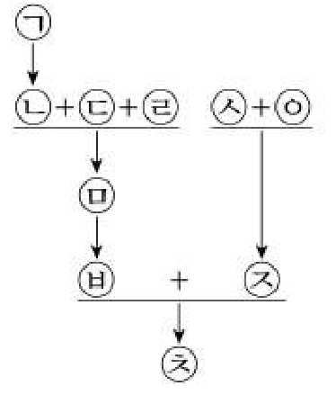
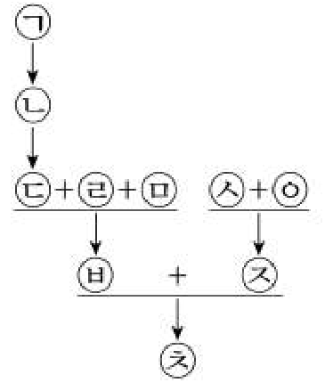
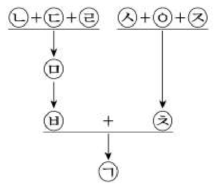
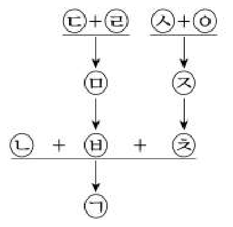
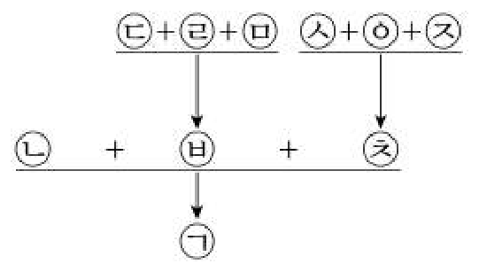

# 01 - RA (2020)

<견해>에 대한 분석으로 옳은 것만을 <보기>에서 있는 대로 고른 것은?

## 제시문

<사례>

X국에서 다음의 사건이 발생하였다. 甲은 자신을 놀린 乙에게 복수하기로 하였다. 甲의 부탁을 받은 丙은 乙을 때려 상해를 입혔다. X국 법률에는 “사람의 신체를 상해한 자는 5년 이하의 징역에 처한다”고 상해죄가 규정되어 있다. 丙이 상해죄로 처벌되는 것 이외에 甲도 상해죄로 처벌할 수 있는지에 대해서 다음과 같은 견해가 있다.

<견해>

A : 甲이 乙에 대한 상해를 유발했다고 甲을 상해죄로 처벌해서는 안 돼. 甲이 직접 乙을 상해한 것은 아니잖아. 丙이 甲의 부탁을 거절할 수 없는 상황이었어야만 甲을 상해죄로 처벌할 수 있어.

B : 甲이 乙에 대한 상해를 유발했다는 사실만으로는 甲을 상해죄로 처벌할 수는 없어. 하지만 丙을 상해죄의 범죄자로 만들었으니까 甲을 처벌해야지. 甲의 부탁이 없었다면 丙은 상해죄의 범죄자가 되지 않았을 거야. 상해를 유발한 것보다 타인을 범죄자로 만든 것이 더 중한 범죄잖아.

C : 丙을 상해죄의 범죄자로 만들었다는 이유로는 甲을 처벌할 수 없어. 타인을 범죄자로 만든 것을 처벌하는 법이 없기 때문이야. 그렇지만 甲을 상해죄로는 처벌해야 해. 왜냐하면 상해죄의 법규정이 상해 행위를 직접 하는 경우로 한정하고 있지 않기 때문이야.

## 보기

ㄱ. A와 C는 타인을 이용하여 상해를 유발한 자가 처벌을 받는 경우에 직접 폭력을 행사하여 상해를 입힌 자와 같은 죄목의 범죄로 처벌받을 수 있다고 본다.

ㄴ. 甲이 丙에게 부탁을 하였고 丙이 甲의 부탁을 거절할 수 있는 상황임에도 불구하고 丙이 乙에게 상해를 입힌 경우, A와 C는 甲을 상해죄로 처벌할 수 있는지 여부에 대해 견해가 일치하지 않는다.

ㄷ. A, B, C는 모두 甲이 처벌받지 않을 수 있음을 인정한다.

## 선택지

(1) ㄱ

(2) ㄷ

(3) ㄱ, ㄴ

(4) ㄴ, ㄷ

(5) ㄱ, ㄴ, ㄷ

# 02 - RA (2020)

다음으로부터 추론한 것으로 옳은 것만을 <보기>에서 있는 대로 고른 것은?

## 제시문

<사례>

X국에서는 장애아동보호법에 “장애아동은 각자의 능력과 필요에 따라 적절한 공교육을 무상으로 받을 권리를 가진다”고 규정하고 있다. 적절한 공교육의 범위에 관해 다음과 같이 견해가 나뉜다.

<견해>

甲 : 잠재능력을 발현할 수 있도록 장애아동에게 제공되는 기회는 비장애아동에게 주어진 기회와 상응하는 수준이어야 한다. 이를 위해 공교육이 실시되기 전에 장애아동과 비장애아동의 잠재능력을 측정하고, 공교육의 결과 장애아동과 비장애아동이 잠재능력을 어느 정도 발현하고 있는지 확인해야 한다. 그런 다음 장애아동과 비장애아동이 각각 자신의 잠재능력에 비례하는 성과를 내는 데 차이가 나지 않도록 개별 장애아동에게 필요한 추가적인 학습 과정과 지원 서비스를 무상으로 제공해야 한다.

乙 : 공교육이 적절하다는 것은 어떤 특별한 교육적 수준의 보장이나 능력에 관계없는 절대적 교육 기회의 평등을 의미하기보다는 장애아동에게 기본적 수준의 교육 기회에 평등하게 접근할 수 있도록 공교육을 무상으로 제공하는 것을 의미한다. 장애아동이 수업을 이수하고 과목별 합격 점수를 받아 상급 학년으로 진급하는 학업 성취 결과가 나왔다면 그러한 평등이 실현된 것으로 볼 수 있다.

## 보기

ㄱ. 청각장애가 갑자기 생겨 성적이 떨어졌지만 상급 학년으로 진급하는 데에는 어려움이 없는 아동에게 부모가 자비로 수화 통역사를 제공하였더니 종전의 성적을 회복한 경우, 공교육이 그 아동에게 수화 통역사를 무상으로 제공해야 하는지 여부에 대하여 甲과 乙의 견해가 일치한다.

ㄴ. 乙의 견해에 따르면, 청각장애아동들이 공교육의 수업을 이수하고 과목별 합격 점수를 받아 중학교 1학년 과정에서 2학년 과정으로 모두 진급하는 데 성공하는 경우, 공교육 기관은 그 중학교 1학년 과정에 이전까지는 제공되지 않았던 학습 과정과 지원 서비스를 요청하는 청각장애아동의 요구를 받아들이지 않아도 된다.

ㄷ. 공교육 기관은 장애아동이 공교육에서 배제되지 않도록 하면 되고 공교육을 통한 장애아동의 학업 성취 결과까지는 고려하지 않아도 된다는 주장을 甲은 받아들이지 않고 乙은 받아들인다.

## 선택지

(1) ㄱ

(2) ㄴ

(3) ㄱ, ㄷ

(4) ㄴ, ㄷ

(5) ㄱ, ㄴ, ㄷ

# 03 - RA (2020)

다음 논쟁에 대한 평가로 옳은 것만을 <보기>에서 있는 대로 고른 것은?

## 제시문

X국에서 甲은 불법 도박장을 운영하면서 乙, 丙, 丁을 종업원으로 고용하였다. 甲은 乙이 열심히 일하자 乙을 지배인으로 승진시켜 丙, 丁을 관리하게 하였다. 그러던 중 甲은 경찰의 단속을 피해 해외로 도주하였고 乙, 丙, 丁은 체포되었다. 검사는 乙, 丙, 丁 중 乙만 기소하고 丙, 丁은 기소하지 않았다. 검사의 기소와 관련하여 다음과 같은 논쟁이 전개되었다.

A : 乙만 기소하고 丙과 丁을 기소하지 않았다면, 이것은 차별적 기소로 검사가 권한을 남용한 것이야.

B : 범죄의 혐의가 있더라도 검사는 재량으로 기소하지 않을 수 있어. 경미한 범죄를 저지른 사람은 기소하지 않을 수 있게 해 주면, 법관이 중요한 사건의 재판에 전념할 수 있게 되어 사회 전체적으로 더 이득이 될 수 있어.

C : 기소에 있어서 검사의 재량을 인정하면, 검사는 권한을 독선적으로 사용하게 되고, 누군가가 검사에 대해서 압력을 행사하는 것을 배제할 수 없어.

D : 인권을 생각해 봐. 기소의 필요성이 적은 사람이 기소되지 않으면, 재판 절차를 거치지 않고서 빨리 자유롭게 생활할 수 있어. 그런 점에서 검사의 기소에 대한 재량을 인정하는 것이 인권 보호에 유리해.

E : 지금 인권이 보호된다고 말하는데, 내가 말하고 싶은 것은 기소된 乙의 입장이야. 乙도 인권이 있는데, 검사의 권한 남용으로 乙만 혼자 기소되면 乙의 인권은 충분히 보호받지 못하잖아.

F : 검사가 범죄 혐의자들을 차별적으로 기소했다고 바로 권한 남용이라고 볼 수는 없지. 검사가 최소한 어떤 부당한 의도를 가지고 차별적으로 기소한 경우에만 권한 남용이라고 해야 하는데 이 사안에서는 그런 의도를 찾을 수가 없어.

## 보기

ㄱ. 乙은 범행에 가담한 정도가 크지만 丙과 丁은 그렇지 않다는 사실을 검사가 기소 여부의 근거로 삼았다면, A를 강화하고 F를 약화한다.

ㄴ. 외부 압력에 의해 중한 범죄 혐의자도 기소하지 않은 경우가 많았고 그로 인해 검찰에 대한 국민들의 신뢰도가 낮아졌다는 조사 결과는 B를 약화하고 C를 강화한다.

ㄷ. D와 E는 모두 범죄 혐의자의 인권 보호에 대해 언급하고 있지만, 각 주장이 보호하고자 하는 구체적 대상이 다르다.

## 선택지

(1) ㄱ

(2) ㄴ

(3) ㄱ, ㄷ

(4) ㄴ, ㄷ

(5) ㄱ, ㄴ, ㄷ

# 04 - RA (2020)

다음 논쟁에 대한 분석으로 옳은 것만을 <보기>에서 있는 대로 고른 것은?

## 제시문

X국에서는 유전자 검사를 통해 건강하고 재능 있는 자녀를 출산하려는 ‘선택적 출산’이 우려되었다. 이에 X국은 법률을 개정하여 의료인이 태아의 유전적 우열성 판별을 목적으로 임신 여성을 진찰하거나 검사하는 것을 금지하고, 의료인이 태아의 유전적 우열성을 알게 된 경우에도 태아의 부모 또는 다른 사람에게 알릴 수 없도록 하였다. 甲, 乙, 丙은 이 법률의 존속 여부에 대해 논쟁을 벌이고 있다.

甲 : 무분별한 선택적 출산을 막을 필요는 있다고 생각하지만, 의료인이 임신 여성에게 태아의 상태나 유전적 질환 등을 무조건 알려 주지 못하게 한 것은 임신 여성의 알 권리를 침해할 소지가 커.

乙 : 낙태를 할 경우 임신 여성의 생명이나 건강에 중대한 위험을 초래하여 낙태가 거의 불가능하게 되는 시기가 있어. 그러한 시기에는 태아의 유전적 소질을 부모에게 알려 줘도 무방하다고 생각해.

丙 : 태아의 유전적 우열성에 따른 낙태가 계속된다면 생명과 인간의 존엄성이 경시될 수 있어. 이를 방지하기 위해서는 임신 여성이 태아의 유전적 소질에 대해 궁금하더라도 출산할 때까지 참아야 해. 태아의 유전적 소질에 관한 정보를 임신 여성에게 알려 주는 경우, 어떤 시기라 하더라도 낙태의 가능성이 완전히 사라지는 것은 아니야.

## 보기

ㄱ. 甲은 유전적 질환의 발생이 염려되어 진료 목적상 태아 상태의 고지가 필요한 경우 이를 고지할 수 있어야 한다고 본다.

ㄴ. 임신 말기로 갈수록 낙태 건수가 현저히 줄어든다는 통계는 乙의 견해를 강화한다.

ㄷ. 장래 가족의 일원이 될 태아의 유전적 우열성에 대해 미리 알고 싶은 인간의 본능에 가까운 호기심의 충족은 태아의 생명에 비해 중시될 이익이 아니라는 주장은 丙의 견해를 지지하지 않는다.

## 선택지

(1) ㄱ

(2) ㄷ

(3) ㄱ, ㄴ

(4) ㄴ, ㄷ

(5) ㄱ, ㄴ, ㄷ

# 05 - RA (2020)

<견해>에 대한 평가로 옳은 것만을 <보기>에서 있는 대로 고른 것은?

## 제시문

X국에서는 개명을 할 때 법원의 허가를 받도록 법으로 규정하고 있다. 그러나 법원의 개명 허가 기준에 관한 세부 규정이나 지침이 없어 다음과 같이 견해가 나뉘고 있다.

<견해>

A : 이름을 변경할 권리는 보호되어야 해. 자신의 의사와 상관없이 부모 등에 의해 일방적으로 결정되는 이름에 불만이 있는데도 그 이름으로 살아갈 것을 강요하는 것은 정당화될 수 없어. 개명 신청이 있으면, 법원은 과거의 범죄행위를 은폐하여 새로운 범죄행위를 할 위험이 있는 경우를 제외하고는 모두 허가해 주는 것이 마땅해.

B : 이름을 바꾸는 것은 이름을 짓는 것과 달라서 사회적 질서나 신뢰에 영향을 주어 혼란을 초래할 수 있어. 개명은 개인의 자유로운 의사에 맡기면 범죄를 은폐하는 수단으로 활용될 수도 있어. 그러니 개명은 독립된 사회생활의 주체라 할 수 없는 아동에 대해서만 제한적으로 허용해야 해.

C : 글쎄... A와 B 모두 일면 타당한 점이 있어. 다만 개명 허가 여부를 법관의 재량에 맡겨 두면 법관 개인의 기준에 따라 결과가 달라질 소지가 있기 때문에 현재로서는 어떻게든 구체적인 기준을 마련하여 이에 따라 허용 여부를 결정하는 것이 시급해.

## 보기

ㄱ. 이름을 결정할 권리는 자기 고유의 권리이나 출생 시점에는 예외적으로 부모가 대신 행사하는 것일 뿐이라고 보는 견해는 A를 지지한다.

ㄴ. 수사 과정에서 범죄자의 동일성 식별에 이름 대신 주민등록 번호가 사용된다는 사실은 B를 약화한다.

ㄷ. 개명을 원하는 초등학생이 바꾸려는 이름과 이유를 기재한 개명 신청서를 법원에 제출하기만 하면 범죄에 악용될 우려가 없는 한 개명을 허용하게 하는 ‘초등학생 개명허가처리지침’을 시행하는 것에는 A는 반대하고 B와 C는 찬성할 것이다.

## 선택지

(1) ㄴ

(2) ㄷ

(3) ㄱ, ㄴ

(4) ㄱ, ㄷ

(5) ㄱ, ㄴ, ㄷ

# 06 - RA (2020)

다음으로부터 추론한 것으로 옳은 것만을 <보기>에서 있는 대로 고른 것은?

## 제시문

P회사에 근무하던 甲은 상습절도를 한 혐의로 수사를 받게 되었다. 甲은 혐의를 완강하게 부인하였고 명확한 증거는 없었다. 불구속수사가 원칙임에도 불구하고 검사는 甲의 혐의를 인정하고 구속기소하였다. 그러자 P회사는 이를 이유로 甲을 해고하였다. 이에 P회사의 직원들은 甲의 구속기소와 해고를 둘러싸고 논쟁을 하게 되었다.

乙 : 평소에 甲의 행동이 수상하다고 생각했어. 우리 급여 수준에 비해 씀씀이가 지나치게 컸어. 우리 물건이 없어질 수도 있었는데 회사의 적절한 대응이었다고 생각해.

丙 : 법에는 “누구든지 유죄의 판결이 확정될 때까지는 무죄로 추정된다”는 원칙이 있다고 들었어. 甲이 절도를 했다는 명확한 증거가 없는 상태에서 구속기소까지 한 것은 무죄추정의 원칙에 위배돼.

丁 : 무죄추정의 원칙은 재판 과정에서 검사가 피고인의 유죄를 증명하지 못하는 한 피고인을 처벌할 수 없다는 의미일 뿐이고 다른 의미는 없어. 그러니까 수사 과정에서 유죄가 의심되면 구속기소해도 무방해.

乙 : 무죄추정의 원칙은 수사 절차에서 재판 절차에 이르기까지 형사 절차의 전 과정에서 구속 등 어떠한 형사 절차상 불이익도 입지 않아야 한다는 것만을 말해. 회사에서 직원을 해고하는 것은 무죄추정의 원칙과 상관없어.

丙 : 무죄추정의 원칙은 이를 실현하는 구체적인 규정이 있을 때 오직 그 경우에만 인정되는 거야. 형사 절차와 관련해서는 무죄추정에 관한 구체적인 규정이 있지만, 회사의 해고와 관련해서는 규정이 없어.

## 보기

ㄱ. 丙은 甲의 해고가 무죄추정의 원칙에 위배되는지 여부에 대하여 乙과 결론을 같이한다.

ㄴ. 丁은 수사기관이 수사를 행하면서 알게 된 피의 사실을 재판 전에 공개하여 마치 유죄인 것처럼 여론을 형성하는 것이 무죄추정의 원칙에 위배되지 않는다고 주장할 것이다.

ㄷ. 상습절도의 재판에서 절도하지 않았음을 스스로 증명하지 못하는 피고인은 처벌을 받도록 하는 특별법이 무죄추정의 원칙에 위배된다는 주장에 대해 乙과 丁은 입장을 달리한다.

## 선택지

(1) ㄱ

(2) ㄷ

(3) ㄱ, ㄴ

(4) ㄴ, ㄷ

(5) ㄱ, ㄴ, ㄷ

# 07 - RA (2020)

다음으로부터 추론한 것으로 옳은 것만을 <보기>에서 있는 대로 고른 것은?

## 제시문

X협회는 전국의 소상공인들이 결성한 단체로서, 회원총회와 대의원회를 두고 있다. 회원총회는 X협회의 재적회원 전원으로 구성된다. 대의원회는 소관 전문위원회와 전원위원회를 둔다. 전문위원회는 대의원회의 의장이 필요하다고 인정하거나 전문위원회 재적위원 4분의 1 이상의 요구가 있을 때에만 개최될 수 있다. 전문위원회는 재적위원 과반수의 출석과 출석위원 과반수의 찬성으로 의결한다.

대의원회는 전문위원회의 심사를 거친 안건 중 협회 구성, 회비 책정, 회칙 변경, 회원 징계, 협회 해산 등 주요 사항의 심사를 위하여 대의원회 재적의원 4분의 1 이상이 요구할 때에만 대의원 전원으로 구성되는 전원위원회를 개최할 수 있다. 전원위원회는 재적위원 4분의 1 이상의 출석과 출석위원 과반수의 찬성으로 의결한다. 회칙의 변경, 회원의 징계, 협회의 해산에 관한 사항은 대의원회 전원위원회를 거쳐서만 회원총회에 상정된다. 회원총회는 재적회원 과반수의 출석과 출석회원 과반수의 찬성으로 의결한다.

<사례>

X협회는 재적회원이 10,000명이다. 대의원회는 재적의원이 300명이고, 각 전문위원회는 재적위원이 20명이다. 대의원회 재적의원의 종사 업종 비율은 A업종 $40\%$, B업종 $35\%$, C업종 $15\%$, D업종 $10\%$이다. 이 협회의 재적회원 및 각 전문위원회의 재적위원의 종사 업종 비율도 위와 동일하다. 단, 각 회원, 의원, 위원은 하나의 업종에만 종사하고 있다. 회칙의 변경을 위한 안건(이하 안건이라 한다)이 대의원회 소관 전문위원회에서 의결된 후 전원위원회를 거쳐 회원총회에 상정되었다. 각 회의의 표결 결과 무효표나 기권표는 없는 것으로 한다.

## 보기

ㄱ. 회비 인상에 대한 사항이 소관 전문위원회의 심사를 거친 때에는 대의원회의 의장이 필요하다고 인정하면 그 사항을 심사하기 위한 전원위원회가 개최될 수 있다.

ㄴ. A업종 종사 전문위원들만 안건 심사를 위한 전문위원회의 개최를 요구하고 다른 업종 종사 전문위원들이 그에 반대한다면, 전문위원회는 열리지 못한다.

ㄷ. 전문위원회에서 A업종 종사 전문위원 전원과 B업종 종사 전문위원 전원만 출석하여 투표하고 A업종 종사 전문위원 전원이 안건에 찬성한다면, 안건은 가결된다.

ㄹ. 회원총회에서 재적회원 전원이 출석하여 투표하고 A업종에 종사하는 회원 전원과 D업종에 종사하는 회원 전원만 안건에 찬성한다면, 안건은 부결된다.

## 선택지

(1) ㄱ, ㄴ

(2) ㄱ, ㄹ

(3) ㄴ, ㄷ

(4) ㄴ, ㄹ

(5) ㄷ, ㄹ

# 08 - RA (2020)

다음으로부터 <사례>를 판단한 것으로 옳은 것만을 <보기>에서 있는 대로 고른 것은?

## 제시문

X국은 출산과 관련된 산모의 비밀 유지를 보장하고 신생아의 생명과 신체의 안전을 보장하기 위하여 익명출산제를 시행하기로 하였다. 이에 따라 의료기관의 적극적인 협조를 포함하는 다음의 <규정>이 제정되었다.

<규정>

제1조 ① 익명출산을 하고자 하는 자(이하 신청자라 한다)로부터 익명출산 신청을 받은 의료기관은 의료기록부에 신청자의 이름을 가명으로 기재한다.

② 신청자는 자녀가 출생한 때로부터 7일 내에 다음 사항을 포함하는 신상정보서를 작성하여 출산한 의료기관에 제출한다.

(1) 자녀의 이름을 정한 경우 그 이름, 성별, 출생 일시, 출생 장소 등 자녀에 관한 사항

(2) 신청자의 이름 및 주소, 익명출산을 하게 된 사정 등 자녀의 부모에 관한 사항

제2조 신청자는 신상정보서를 작성한 때로부터 2개월이 경과한 때 자녀에 관한 모든 권리를 상실한다.

제3조 국가심의회는 성년에 이른 자녀(자녀가 사망한 경우에는 성년에 이른 그의 직계 후손)의 청구가 있으면 제1조 ②의 신상정보서의 사항을 열람하게 한다.

제4조 제3조에도 불구하고 제1조 ② (2)의 사항은 신청자의 동의를 받은 때에만 열람하게 한다. 그러나 신청자가 신상정보서 작성 시 자신이 사망한 이후에 이를 공개하는 것에 대하여 명시적으로 반대하지 않으면, 신청자가 사망한 이후에는 청구에 따라 언제든지 열람할 수 있게 한다.

<사례>

X국에 살고 있는 甲(여)은 乙(남)과의 사이에 丙을 임신하였고, 甲은 익명출산을 신청하였다.

## 보기

ㄱ. 甲과 乙이 혼인관계에 있다면, 乙이 甲의 출산 사실 및 丙에 대한 신상정보의 열람을 청구한 경우, 국가심의회는 甲의 동의를 받아 열람을 허용한다.

ㄴ. 성인이 된 丙이 신상정보서상 자신의 혈연에 관한 정보, 출생 당시의 정황에 관한 정보의 공개를 청구한 경우, 甲의 사망 사실이 확인되는 이상 국가심의회는 해당 정보를 열람할 수 있게 허용하여야 한다.

ㄷ. 丙이 사망한 후 그의 딸 丁(23세)이, 丙이 출생할 당시 甲이 丙에게 지어 준 이름, 丙의 출생 일시, 출생 장소에 관한 정보의 열람을 청구한 경우, 국가심의회는 甲의 명시적인 반대의 의사에도 불구하고 해당 정보를 열람하게 할 수 있다.

## 선택지

(1) ㄱ

(2) ㄷ

(3) ㄱ, ㄴ

(4) ㄴ, ㄷ

(5) ㄱ, ㄴ, ㄷ

# 09 - RA (2020)

다음으로부터 <사례>를 판단한 것으로 옳지 않은 것은?

## 제시문

X국의 법에 의하면, 누구나 유언을 통하여 한 사람 또는 여러 사람의 상속인을 지정할 수 있다. 그리고 임의로 각 상속분도 정할 수 있다. 상속인을 지정하는 유언이 없는 경우에는 일정한 범위의 혈연관계 내지 가족관계에 있는 자들이 상속인 지위를 얻어 상속재산을 취득하는데, 자녀, 손자 같은 직계비속 및 배우자가 1순위 상속인이고, 부모, 조부모와 같은 직계존속이 2순위 상속인이며, 형제, 자매 같은 방계의 친족이 3순위를 이룬다. 선순위의 상속인이 상속을 받으면 후순위의 상속인은 상속을 받을 수 없다. 같은 순위의 공동상속인 사이의 상속분은 균등하다.

혈연관계 내지 가족관계에 있지 않은 사람도 유언을 통하여 상속인으로 지정될 수 있고, 직계존비속을 포함한 친족을 상속인으로 지정하지 않는 유언도 유효하다. 그렇지만 친족이면서도 상속인으로 지정되지 않아 상속에서 배제된 자가 사정에 따라서는 유언한 자의 사후에 경제적으로 매우 곤궁한 상태에 처하게 될 우려도 있다. 이와 같은 경우에 X국에서는 법이 정하고 있는 상속 순위에 있는 자 중 상속에서 배제된 자에 한하여 그 유언이 윤리에 반한다고 주장하면서 해당 유언의 무효를 선언해 줄 것을 요구하는 소(이하 반윤리의 소라 한다)를 제기할 수 있다. 판사가 유언의 반윤리성 여부를 심사할 때에는 그 상속 사안에서 상속 순위에 있는 친족들에게 존재하는 사정만을 판단의 근거로 삼을 수 있다. 유언의 반윤리성이 인정되어 유언이 효력을 잃으면 유언이 없는 것과 같은 상태가 된다.

<사례>

X국에 사는 甲에게는 혈연관계 내지 가족관계에 있는 사람으로는 자녀 乙과 동생 丙만 있고, 평소 친하게 지내는 친구 丁이 있다.

## 선택지

(1) 甲이 유언으로 丙과 丁만을 상속인으로 지정하였다면, 이때 乙이 반윤리의 소를 제기하여 승소하지 않는 한 乙은 상속에서 배제된다.

(2) 甲은 유언으로 乙과 丁만을 상속인으로 지정하면서 상속분을 균등하게 정할 수 있다.

(3) 甲이 유언으로 丁을 유일한 상속인으로 지정하였고 이에 대해 乙이 반윤리의 소를 제기한 경우, 판사는 丁이 甲의 생전에 甲을 부양해 왔다는 丁의 주장을 반윤리성 판단의 근거로 삼을 수 없다.

(4) 甲이 유언으로 乙과 丁만을 상속인으로 지정하면서 丁에게 더 많은 상속분을 정한 경우, 乙은 반윤리의 소를 제기할 수 있다.

(5) 甲이 유언으로 丁을 유일한 상속인으로 지정한 경우, 丙이 제기한 반윤리의 소에 대하여 승소 판결이 내려지면 乙이 단독으로 상속재산을 취득한다.

# 10 - RA (2020)

다음으로부터 추론한 것으로 옳은 것만을 <보기>에서 있는 대로 고른 것은?

## 제시문

인터넷이나 모바일 등에서 거래를 중개하는 사업 모델 중 포털사이트나 가격비교사이트는 판매 정보를 제공하고 판매자의 사이트로 연결하는 통로의 역할만 한다. 이에 비해 오픈마켓 형태의 모델은 사이버몰을 열어 놓고 다수의 판매자가 그 사이버 공간에서 물건을 판매하도록 한다. 후자의 모델은 중개자가 거래 공간을 제공할 뿐만 아니라 계약 체결이나 대금 결제의 일부에 참여하기도 하여 소비자가 중개자를 거래 당사자로 오인할 가능성이 크다. 이러한 판매 중개와 관련하여 X국의 법률은 다음과 같이 규정하고 있다.

(1) ‘사이버몰판매’란 판매자가 소비자와 직접 대면하지 않고 사이버몰(컴퓨터, 모바일을 이용하여 재화를 거래할 수 있도록 설정된 가상의 영업장을 말한다)을 이용하고 계좌이체 등을 이용하는 방법으로 소비자의 청약을 받아 재화를 판매하는 것이다.

(2) ‘사이버몰판매중개’란 사이버몰의 이용을 허락하거나 중개자 자신의 명의로 사이버몰판매를 위한 광고수단을 제공하거나 청약의 접수 등 사이버몰판매의 일부를 수행하는 방법으로 거래 당사자 간의 사이버몰판매를 알선하는 행위이다.

(3) 사이버몰판매중개자는 사이버몰 웹페이지의 첫 화면에 자신이 사이버몰판매의 당사자가 아니라는 사실을 고지하면 판매자가 판매하는 상품에 관한 손해배상책임을 지지 않는다. 다만, 사이버몰판매중개자가 청약의 접수를 받거나 상품의 대금을 지급받는 경우 사이버몰판매자가 거래상 의무를 이행하지 않을 때에는 이를 대신하여 이행해야 한다.

## 보기

ㄱ. P는 인터넷에서 주문을 받아 배달하는 전문 업체로서, 유명 식당에 P의 직원이 직접 가서 주문자 대신 특정 메뉴를 주문하고 결제하여 주문자가 원하는 곳으로 배달까지 해 주는 서비스를 제공한다. 이 경우 P는 사이버몰판매중개자가 아니다.

ㄴ. Q는 모바일 어플리케이션을 이용하여 원룸과 오피스텔의 임대차를 전문적으로 중개하는 사업자이다. 이 경우 Q는 사이버몰판매중개자이다.

ㄷ. R는 인터넷에서 테마파크의 할인쿠폰을 판매하는 업체이다. R는 인터넷 쇼핑몰 웹페이지에 자신이 사이버몰판매의 당사자가 아니라고 고지한 경우 상품에 관한 손해배상책임에서 면제된다.

## 선택지

(1) ㄱ

(2) ㄷ

(3) ㄱ, ㄴ

(4) ㄴ, ㄷ

(5) ㄱ, ㄴ, ㄷ

# 11 - RA (2020)

다음으로부터 추론한 것으로 옳은 것만을 <보기>에서 있는 대로 고른 것은?

## 제시문

여러 상품들을 취급하는 기업의 입장에서는 각 상품을 개별 단위로 판매하기보다 여러 조합으로 묶어서 판매하는 것이 비용 절감이나 시장 공략 측면에서 효과적인 전략일 수 있다. 휴대전화+집전화+초고속인터넷+IPTV 등 여러 상품을 묶어서 판매하는 경우가 자주 등장하는 이유도 그 때문이다. 예컨대 상품 A와 상품 B의 묶음상품 판매 방식은 다음 세 가지로 나눌 수 있다.

판매 방식 1 : A와 B를 묶어서 가격을 할인하여 판매하고 개별 상품은 별도로 판매하지 않는 방식

판매 방식 2 : A와 B를 묶거나 개별적으로 판매하는 방식. 다만 묶어서 판매하는 경우 가격을 할인

판매 방식 3 : A를 구입하려면 B도 반드시 구입해야 하는 방식. 다만 B만 구입하는 것은 가능

하지만 이와 같이 상품을 묶어서 판매하는 것은 소비자의 선택권을 제한하거나 다른 기업에 불리한 경쟁 환경을 조성하는 결과를 초래할 수 있기 때문에 법적 규제의 대상이 된다. 다만 묶어서 판매하는 방식에 가격 할인이 뒤따르는 경우에는 그로 인해 기대되는 소비자의 경제상 이익이나 가격 경쟁 촉진 효과 등을 종합적으로 고려하여 법 위반 여부를 결정하게 된다. 형식적으로는 소비자에게 선택권을 주고 있으나 개별 상품 가격의 총합이 묶음상품의 가격에 비해 현저히 높아서 소비자들이 개별 구매할 가능성이 낮은 경우나 가격 할인이 과도해서 효율적인 경쟁자를 배제하는 경우는 규제 대상에 포함된다.

## 보기

ㄱ. A, B를 개별적으로 모두 구매하려는 소비자는 판매 방식 2를 판매 방식 3보다 선호한다.

ㄴ. 소비자의 선택권을 선택지의 개수로만 판단하면 판매 방식 3이 선택권을 가장 크게 제한한다.

ㄷ. 두 상품을 묶어서 판매하는 가격이 단일 상품만 취급하는 기업의 단일 상품 가격보다도 낮은 경우에는 규제 대상에 포함될 수 있다.

## 선택지

(1) ㄱ

(2) ㄴ

(3) ㄱ, ㄷ

(4) ㄴ, ㄷ

(5) ㄱ, ㄴ, ㄷ

# 12 - RA (2020)

다음으로부터 추론한 것으로 옳은 것만을 <보기>에서 있는 대로 고른 것은?

## 제시문

X국 코인거래소에서는 A, B, C 3개 종류의 코인이 24시간 거래되고 있다.

| 구분 | A 코인 | B 코인 | C 코인 |
|---|---:|---:|---:|
| 가격 | 1,000원 | 2,000원 | 2,500원 |

코인거래소는 코인의 구매 및 사용에 대해 다음과 같은 <규정>을 두고 있다.

<규정>

(1) 코인은 원화 또는 다른 종류의 코인으로 구매할 수 있다. 코인의 최소 거래단위는 1개이다.

(2) 원화로 구매할 수 있는 코인의 1개월간 총한도는 1인당 1,000만 원(이하 구매한도액이라 한다)을 초과할 수 없다.

(3) 코인을 다른 코인으로 구매할 경우 거래자 1명이 1회의 거래에서 그 지급대가로 사용할 수 있는 코인 개수는 구매한도액으로 취득할 수 있는 최대 코인 개수의 10분의 1을 초과할 수 없다. 단, 이때의 최대 코인 개수는 코인 종류별로 구매한도액 내에서 취득할 수 있는 최대 코인 개수를 비교하여 그중 최저치로 한다. 이 기준은 (4)에도 적용된다.

(4) 거래자 1명이 코인을 구매하거나 지급에 사용한 결과, 1일 동안(같은 날 0시부터 24시 사이를 말한다) 그 거래자의 총보유량이 같은 날 0시 총보유량과 비교하여 구매한도액으로 취득할 수 있는 최대 코인 개수의 5분의 1을 초과해서 감소한 경우 그 시점부터 24시간 동안 거래가 정지된다.

## 보기

ㄱ. 1명의 거래자가 2개의 코인 계정을 가지고 1개월간 원화로 각각 600만 원의 코인을 구매하는 것은 허용된다.

ㄴ. 2019년 6월 26일 19시에 코인 1,000개를 보유한 채 그날의 거래를 시작한 자가 첫 거래에서 현금으로 200개를 구매하고 이후 3번의 거래에서 코인을 지급에 사용한 결과 마지막 거래의 종료 시점인 같은 날 20시에 총보유량이 300개가 된 경우 그 시점부터 24시간 동안 코인 사용이 정지된다.

ㄷ. 거래자가 1회의 거래에서 코인 구매에 사용할 수 있는 코인은 400개를 초과할 수 없다.

ㄹ. 2019년 6월 26일 23시 40분에 코인 1,500개를 보유한 채 그날의 거래를 시작한 자가 자정 전까지 몇 차례의 거래로 600개를 지급에 사용하고 자정 이후 300개를 추가로 지급에 사용하더라도, 그 시점에 코인 사용은 정지되지 않는다.

## 선택지

(1) ㄱ, ㄴ

(2) ㄱ, ㄷ

(3) ㄴ, ㄷ

(4) ㄴ, ㄹ

(5) ㄷ, ㄹ

# 13 - RA (2020)

다음으로부터 추론한 것으로 옳은 것만을 <보기>에서 있는 대로 고른 것은?

## 제시문

규칙을 제정할 때는 항상 그 규칙을 정당화하는 목적이 있어야 한다. 그런데 규칙의 적용이 그 목적의 관점에서 정당화되지 않는 경우들이 존재한다. 규칙이 그 목적의 관점에서 볼 때 어떤 사례를 포함하지 않아도 되는데도 포함하는 경우 이 사례를 ‘과다포함’한다고 하고, 어떤 사례를 포함해야 하는데도 포함하지 않는 경우 이 사례를 ‘과소포함’한다고 한다. 예를 들어 ‘시속 80 km 초과 금지’라는 규칙이 있다고 하면, 그 목적은 ‘운전의 안전성 확보’가 된다. 하지만 운전자들이 시속 80 km 초과의 속도로 운전하지 않아야 안전하다는 것이 대부분의 경우 사실이라 하더라도, 시속 80 km 초과로 달려도 안전한 경우가 있다. 이때 이 규칙은 시속 80 km 초과로 달려도 안전한 사례를 ‘과다포함’한다고 한다. 반면 ‘시속 80 km 초과 금지’라는 규칙은 안개가 심한 날 위험한데도 시속 80 km로 달리는 차량을 금지하지 않게 되어 그 목적을 달성하지 못할 수 있다. 이 경우 규칙이 해당 사례를 ‘과소포함’한다고 한다.

<사례>

X동물원에서는 동물원 내 차량 진입 금지 규칙의 도입을 검토하고 있다. 이 규칙의 목적은 ㉠동물원 이용자의 안전 확보, ㉡차량으로 인한 동물원 내의 불필요한 소음 방지의 두 가지이다. 도입될 규칙의 후보로 다음의 세 가지가 제시되었다.

규칙 1 : 동물원 내에는 어떠한 경우에도 차량이 진입할 수 없다.

규칙 2 : 동물원 내에는 동물원에 의해 사전 허가를 받은 차량 외에 다른 차량은 진입할 수 없다.

규칙 3 : 동물원 내에는 긴급사태로 인해 소방차, 구급차가 진입하는 경우 외에 다른 차량은 진입할 수 없다.

## 보기

ㄱ. 목적 ㉠의 관점에서 본다면, 규칙 1은 ‘동물원 내 무단 진입한 차량이 질주하여 이용자의 안전을 위협하자 이를 막기 위해 경찰차가 사전 허가 없이 진입하는 경우’를 ‘과다포함’한다.

ㄴ. 목적 ㉡의 관점에서 본다면, 규칙 2는 ‘불필요한 소음을 발생시키는 핫도그 판매 차량이 사전 허가를 받아 동물원에 진입하는 경우’를 ‘과소포함’한다.

ㄷ. 목적 ㉠, ㉡ 모두의 관점에서 본다면, 규칙 3은 ‘불필요한 소음을 발생시키지 않는 구급차가 동물원 이용자를 구조하기 위해 동물원 내로 진입하는 경우’를 ‘과다포함’하지도 않고 ‘과소포함’하지도 않는다.

## 선택지

(1) ㄱ

(2) ㄴ

(3) ㄱ, ㄷ

(4) ㄴ, ㄷ

(5) ㄱ, ㄴ, ㄷ

# 14 - RA (2020)

다음으로부터 추론한 것으로 옳은 것만을 <보기>에서 있는 대로 고른 것은?

## 제시문

<이론>

각 사람의 행복을 극대화하는 행동이 올바른 행동이다. 이를 판단하기 위해서 다음의 네 가지 원리가 있다. 단, $X$와 $Y$는 가능한 상황을, $p$와 $q$는 사람을 나타낸다.

원리 1 : $p$가 상황 $X$에서 누리는 행복보다 더 많은 행복을 누리게 될 다른 가능한 상황이 없다면, $p$는 $X$에서 나쁘게 대우받는 것은 아니다.

원리 2 : $p$가 $X$에서 존재하고 $X$에서보다 더 많은 행복을 누리게 되는 가능한 상황 $Y$가 존재하는 경우, $Y$에서 존재하는 사람 중에 $Y$보다 $X$에서 더 많은 행복을 누리게 되는 $q$가 존재하지 않는다면 $p$는 $X$에서 나쁘게 대우받는 것이고, 그러한 $q$가 존재한다면 $p$는 $X$에서 나쁘게 대우받는 것이 아니다.

원리 3 : $p$가 $X$에서 존재하지 않는다면, $p$가 존재하여 더 많은 행복을 누리게 될 가능한 상황이 있더라도 $p$가 $X$에서 나쁘게 대우받는 것은 아니다.

원리 4 : 원리 1~3에 따라 $X$에서 누구도 나쁘게 대우받지 않는 경우에만 $X$는 도덕적으로 허용될 수 있다.

<사례>

남편인 甲과 아내인 乙에게 자녀 丙이 있다. 이 부부가 둘째 아이를 낳으면 甲의 행복도는 그대로인 반면 乙은 건강이 나빠져 행복도가 떨어지지만, 丙의 행복도는 알려져 있지 않다. A는 이 부부가 둘째 아이를 낳지 않는 상황이고, B는 이 부부가 둘째 아이 丁을 낳는 상황이다. 아래 표는 각각의 상황에서 甲, 乙, 丙, 丁의 행복도를 나타낸다. 단, 가능한 상황은 A와 B뿐이며, 甲, 乙, 丙, 丁 외에 다른 사람은 존재하지 않고, 상황 A에서 丁은 존재하지 않으므로 행복도는 0이라고 가정한다.

| 사람 | A | B |
|---|---:|---:|
| 甲 | 5 | 5 |
| 乙 | 5 | 3 |
| 丙 | 5 | $\alpha$ |
| 丁 | 0 | 5 |

## 보기

ㄱ. A에서 甲~丁 중 누군가 나쁘게 대우받는 것이 가능하다.

ㄴ. B에서 甲~丁 중 한 사람만 나쁘게 대우받고 있다면 $\alpha$는 5보다 작다.

ㄷ. A, B가 모두 도덕적으로 허용 가능하다면 $\alpha$는 5보다 크다.

## 선택지

(1) ㄱ

(2) ㄷ

(3) ㄱ, ㄴ

(4) ㄴ, ㄷ

(5) ㄱ, ㄴ, ㄷ

# 15 - RA (2020)

다음으로부터 추론한 것으로 옳은 것만을 <보기>에서 있는 대로 고른 것은?

## 제시문

연민은 이성에 앞서는 것으로 인간에게 보편적인 자연적 감정이다. 연민은 동물들에게도 뚜렷이 나타난다. 동물이 새끼에 대해 애정을 품고 같은 종의 죽음에 대해 불안감을 느낀다는 사실이 이를 보여 준다. 이 감정은 모든 이성적 반성에 앞서는 자연의 충동이며, 교육이나 풍속에 의해서도 파괴하기 어려운 자연적인 힘이다. 연민은, 본성에 의해서 우리에게 새겨진 또 다른 감정인 자기애가 자연이 설정한 범위를 넘어서 과도하게 작용되는 것을 방지하여 종 전체의 존속에 기여한다. 남이 고통 받는 모습을 보고 깊이 생각할 여지도 없이 도와주러 나서게 되는 것도 연민 때문이다. 하지만 연민이 자기희생을 의미하는 것은 아니다. 연민은 굶주리고 있는 인간에게까지 약한 어린이나 노인이 힘겹게 획득한 식량을 빼앗지 말라고 하지는 않는다. “남이 해 주길 바라는 대로 남에게 행하라”는 이성의 원리에 앞서 “타인의 불행을 되도록 적게 하라”라는 생각을 먼저 품게 하는 것이 연민이다. 인간이 고통을 당하는 것을 보거나 인간이 악을 행했을 때 느끼는 혐오감의 원인도 정교한 이성적 논거가 아니라 이 연민이라는 자연의 감정 속에서 그 근원을 발견할 수 있다. 만일 인류의 생존이 인류 구성원들의 이성적 추론에만 달려 있었다면 인류는 벌써 지상에서 자취를 감추었을 것이다.

## 보기

ㄱ. 연민은 이성적 반성 없이는 작동되지 않는다.

ㄴ. 혐오감과 자기애는 모두 연민의 감정에서 비롯된다.

ㄷ. 타인에 대한 연민의 감정은 자기애와 양립 가능하다.

## 선택지

(1) ㄱ

(2) ㄷ

(3) ㄱ, ㄴ

(4) ㄴ, ㄷ

(5) ㄱ, ㄴ, ㄷ

# 16 - RA (2020)

다음으로부터 추론한 것으로 옳은 것만을 <보기>에서 있는 대로 고른 것은?

## 제시문

甲, 乙, 丙 세 사람 모두 약속 위반이 잘못된 행위이며 특별한 사정이 없는 한 그런 행위자를 도덕적으로 비난할 수 있다고 생각한다. 이들이 인정하는 특별한 사정이란 “당위는 능력을 함축한다”라는 근본적인 도덕 원리와 관련된 것으로서, 만약 약속을 지킬 수 있는 능력이 없는 경우라면 약속 위반자를 도덕적으로 비난하지 않겠다는 것이다. 이와 더불어 세 사람은 모두 행위자가 물리력을 행사하여 수행할 수 있는 범위 내에 있는 행위라면 ‘그 행위자에게 그 행위를 할 수 있는 능력이 있는 것’으로 간주한다. 하지만 행위 능력이 있더라도 행위자가 그 능력을 인지하는지 여부에 따라 추가로 특별한 사정이 생길 수 있다는 ㉠ 입장과 그런 여부와 상관없이 특별한 사정은 생기지 않는다는 ㉡ 입장이 갈릴 수 있다.

<사례>

丁은 오늘 정오에 戊를 공항까지 태워 주기로 약속했지만 끝내 제시간에 약속 장소에 나타나지 않았다. 밝혀진 바에 따르면, 丁은 약속을 분명히 기억하고 있었고 시간을 착각한 것도 아니면서 제때 방에서 나오지 않았다. 하지만 약속 위반자인 丁에게 특별한 사정이 있었을 수도 있다. 이제 다음 세 가지 상황을 고려해 보자.

<상황>

(1) 丁은 집주인이 방문을 잠가 놓았다는 사실을 알게 되었다. 밖에서 방문을 열어 주지 않는 한 그가 나갈 수 있는 방법은 전혀 없었고 외부와의 연락 수단도 없었다.

(2) 丁은 집주인이 방문을 잠가 놓았다는 사실을 알게 되었다. 밖에서 열어 주지 않는 한 방문을 열 수 있는 방법은 전혀 없었고 외부와의 연락 수단도 없었다. 하지만 방 안에는 丁이 전혀 모르는 버튼이 있는데, 그 버튼을 누르면 비밀 문이 열린다. 버튼을 누르는 일은 丁이 물리력을 행사하여 수행할 수 있는 범위 내에 있었다.

(3) 집주인이 방문을 잠가 놓았고 밖에서 방문을 열어 주지 않는 한 丁이 방에서 나갈 수 있는 방법은 전혀 없었다. 방에는 외부와의 연락 수단도 없었다. 하지만 丁은 귀찮아서 방을 나가려 하지 않았고 방문이 잠겨 있다는 사실을 전혀 몰랐다.

## 보기

ㄱ. 甲이 (1)과 (3)의 상황에서 丁에 대한 도덕적 판단이 서로 달라야 할 이유가 없다고 생각한다면, 甲은 ㉡을 채택한 것이다.

ㄴ. ㉡을 채택한 乙은 (2)의 상황에서 丁을 도덕적으로 비난하지 않을 것이다.

ㄷ. 丙은 ㉠을 채택하든 ㉡을 채택하든 (3)의 상황에서 丁이 도덕적 비난의 대상이 될 수 있다는 것을 설명할 수 없다.

## 선택지

(1) ㄱ

(2) ㄷ

(3) ㄱ, ㄴ

(4) ㄴ, ㄷ

(5) ㄱ, ㄴ, ㄷ

# 17 - RA (2020)

다음으로부터 평가한 것으로 옳은 것만을 <보기>에서 있는 대로 고른 것은?

## 제시문

사람들의 행위 동기를 연구하기 위해 다음 실험이 수행되었다.

<실험>

보상이 기대되는 긍정적인 업무와 아무런 보상도 기대할 수 없는 중립적 업무가 참가자에게 각각 하나씩 제시된다. 참가자에게 참가자가 아닌 익명의 타인이 한 명씩 배정되고, 참가자는 두 개의 업무를 그 타인과 본인에게 하나씩 할당해야 한다. 할당 방식에는 두 가지가 있다. A방식은 참가자 본인의 임의적 결정으로 업무를 할당하는 것이며, B방식은 참가자가 동전 던지기를 통해 업무를 할당하는 것이다. 참가자는 둘 중 하나의 방식을 공개적으로 선택하지만, 선택이 끝난 후 업무를 할당하기까지의 전 과정은 공개되지 않는다.

<결과>

40명의 참가자를 대상으로 실험한 결과, 20명의 참가자가 A방식을 선택하였고 이들 중 17명이 긍정적 업무를 자신에게 할당하였다. 긍정적 업무를 타인에게 할당한 참가자는 3명이었다. 한편 나머지 20명의 참가자는 B방식을 선택했는데, 이들 중 18명이 자신에게 긍정적 업무를 할당하였고 타인에게 긍정적 업무를 할당한 참가자는 2명이었다.

동전 던지기에서 통상적으로 기대되는 결과와 비교할 때 B방식에 따른 이런 할당 결과는 매우 이례적인 것이어서 이를 설명하기 위해 다음 가설들이 제시되었다.

가설 1 : B방식을 택한 대부분의 사람들은 원래는 공정하게 업무를 할당할 의도가 있었지만, 실제로 동전을 던져서 자신에게 불리한 결과가 나왔을 때 이기적인 동기가 원래의 공정한 의도를 압도하면서 결과를 조작한 것이다.

가설 2 : B방식을 택한 대부분의 사람들은 원래부터 공정하게 업무를 할당할 의도가 없었으며, 단지 결과 조작을 통해 업무 할당의 이득을 안전하게 확보할 수 있고 사람들에게 공정한 사람처럼 보일 수 있는 추가 이득까지 얻을 수 있기 때문에 이 방식을 택한 것뿐이다.

## 보기

ㄱ. B방식을 택한 참가자들 대부분이 A방식도 B방식만큼 공정하다고 사람들이 생각하리라 믿었다면, 가설 2는 약화된다.

ㄴ. B방식을 택한 참가자들 중 결과를 조작한 사람들 대부분이 자신의 업무 할당이 공정하지 않았음을 인정한다면, 가설 1은 약화되고 가설 2는 강화된다.

ㄷ. B방식에서 동전 던지기를 통한 업무 할당 과정이 공개되도록 실험 내용을 수정하여 동일한 수의 새로운 참가자들을 대상으로 실험한 후에도 B방식을 선택하는 참가자의 수에 큰 변화가 없다면, 가설 1은 강화되고 가설 2는 약화된다.

## 선택지

(1) ㄱ

(2) ㄴ

(3) ㄱ, ㄷ

(4) ㄴ, ㄷ

(5) ㄱ, ㄴ, ㄷ

# 18 - RA (2020)

다음으로부터 추론한 것으로 옳은 것만을 <보기>에서 있는 대로 고른 것은?

## 제시문

甲 : 신은 완전한 존재이다. 이는 첫째로 신이 전능함을 함축한다. 따라서 신은 자신이 원한다면 무슨 일이든지 할 수 있을 것이다. 기적을 일으켜 자연법칙을 거스를 수도 있고 이미 지나가 버린 과거를 바꿀 수도 있다. 둘째로 신의 완전함은, 신이 이 세상을 완벽하게 창조했으며 자신이 계획한 그대로 역사를 진행시킨다는 것을 함축한다. 신의 이러한 계획에 개입할 수 있는 존재는 없다.

乙 : 甲의 주장에는 문제가 있다. 우선 甲의 두 주장은 서로 상충한다. 신이 완벽하게 과거 현재 미래를 이미 결정한 채 역사를 진행시키고 있다는 것이 사실이라면, 신이 그렇게 진행되어 온 과거를 결코 바꾸지 않을 것이다. 게다가 각 주장도 거짓이라 볼 이유가 있다. 첫째, 신은 엄청난 능력을 가지고 있기는 하나 무엇이든지 다 할 수 있다고 보는 것은 문제가 있다. 신은 아직 결정되지 않은, 장차 벌어질 사건들에서는 무한한 능력을 발휘할 수 있다. 하지만 신조차도 시간의 흐름만은 통제할 수 없기에, 과거로 거슬러 올라가 이미 벌어진 사건을 바꿀 수는 없다. 둘째, 만일 신이 자신이 계획한 대로 역사를 진행시킨다면, 우리가 신에게 기도하는 현상을 설명할 수 없다. 우리는 기도를 통해 우리가 신의 계획에 영향을 줄 수 있다고 믿는다. 이 믿음이 옳다면, 신이 세상을 계획에 따라 창조했더라도 신의 계획은 변경될 수 있을 것이다.

## 보기

ㄱ. 甲과 乙은 둘 다 기적이 있을 수 있다고 믿는다.

ㄴ. 甲과 乙은 신이 역사를 진행시키는 방식에 대한 견해가 다르다.

ㄷ. 乙은 신이 과거를 바꾼다는 것은 신의 계획이 완전하지 않음을 의미한다고 여긴다.

## 선택지

(1) ㄱ

(2) ㄴ

(3) ㄱ, ㄷ

(4) ㄴ, ㄷ

(5) ㄱ, ㄴ, ㄷ

# 19 - RA (2020)

다음 논쟁에 대한 평가로 옳은 것만을 <보기>에서 있는 대로 고른 것은?

## 제시문

공포 영화의 중요한 특징은 영화 속의 공포의 존재가 우리에게 두려움과 역겨움의 반응을 유발하고 그로 인해 우리가 고통이나 불쾌감을 느끼게 된다는 것이다. 쾌락의 추구와 고통의 회피가 인간의 보편적인 성향임을 고려할 때, 어떻게 많은 사람들이 그런 공포 영화를 즐길 수 있는 것인지 의아해진다. 이를 설명하기 위해 다음과 같은 두 개의 주장이 제시되었다.

A : 우리가 공포 영화를 즐길 수 있는 이유는 결국은 고통이나 불쾌감을 상쇄하고도 남을 충분한 보상을 얻을 수 있기 때문이다. 그런 영화에 전형적으로 등장하는 미지의 대상은 두려움과 역겨움을 유발하기도 하지만 그만큼 그 대상의 정체를 알아내고 싶은 우리의 호기심을 자극하기도 한다. 우리는 영화를 보면서 그 대상의 정체를 파악하기 위해 가설을 세우고, 증거를 찾고, 추리를 하고, 검증을 하려 애쓴다. 그러다가 영화가 끝날 때쯤 그 대상의 정체가 밝혀지고 얽히고 설킨 모든 문제가 해소되는 순간 우리는 ㉠ 엄청난 쾌감을 느끼게 되는 것이다.

B : 영화는 영화일 뿐이다. 정말로 눈앞에 괴물이 나타난다면 누구나 허겁지겁 도망치겠지만, 영화 속 괴물을 보고 그렇게 반응하는 사람은 거의 없다. 공포 영화에 아무리 두렵고 역겨운 대상이 등장하더라도 그로 인해 발생하는 고통이나 불쾌감은 충분히 통제할 만한 것이다. 그 정도의 고통이나 불쾌감을 상쇄하기 위해 ㉠까지 필요치는 않으며, 대부분 판에 박힌 플롯의 공포 영화가 그런 쾌감을 제공할 수도 없다. 우리가 공포 영화를 즐기는 이유는 통제 가능한 수준의 고통이나 불쾌감은 오히려 적절한 자극제가 되어 정신 건강에 유익하기 때문일 뿐이다.

## 보기

ㄱ. 소설을 원작으로 한 공포 영화 관객 대부분이 소설을 먼저 읽어 본 사람들이었던 것으로 밝혀진다면 A는 약화된다.

ㄴ. 고통이나 불쾌감의 강도는 사람마다 다른 것이라면 A는 약화되고 B는 강화된다.

ㄷ. 호기심을 일으킬 만한 미지의 대상이 전혀 등장하지 않으면서 ㉠과 같은 수준의 엄청난 쾌감을 보상하는 공포 영화가 다수 존재한다면, A는 약화되고 B는 강화된다.

## 선택지

(1) ㄱ

(2) ㄴ

(3) ㄱ, ㄷ

(4) ㄴ, ㄷ

(5) ㄱ, ㄴ, ㄷ

# 20 - RA (2020)

다음 논증의 구조를 가장 적절하게 파악한 것은?

## 제시문

㉠ 선(善)을 정의하려는 시도는 성공할 수 없다. ㉡ 선을 정의할 수 있으려면 그것을 자연적 속성과 동일시하거나, 아니면 형이상학적 속성과 동일시해야 한다. ㉢ 선을 쾌락이라는 자연적 속성과 동일시하여 “선은 쾌락이다”라고 정의를 내릴 수 있다고 한다면, “선은 쾌락인가?”라는 물음은 “선은 선인가?”라는 물음과 마찬가지로 동어반복으로서 무의미한 것이 되어야 한다. ㉣ 그러나 “선은 쾌락인가?”라는 물음은 무의미하지 않다. ㉤ 쾌락 대신에 어떠한 자연적 속성을 대입하더라도 결과는 마찬가지이므로, ㉥ 선을 자연적 속성과 동일시하는 모든 정의는 오류이다. ㉦ 선을 형이상학적 속성과 동일시하는 정의들은 사실 명제로부터 당위 명제를 추론한다. ㉧ 즉 어떠한 형이상학적 질서가 존재한다는 사실로부터 “선은 무엇이다”라는 정의를 이끌어 낸다. ㉨ 그런데 당위는 당위로부터만 도출되기 때문에 사실로부터 당위를 끌어내는 것은 가능하지 않다. ㉩ 따라서 선을 형이상학적 속성과 동일시하는 정의들은 모두 오류이다.

## 선택지

(1)

(2)

(3)

(4)

(5)

# 21 - RA (2020)

다음 글에 대한 분석으로 옳은 것만을 <보기>에서 있는 대로 고른 것은?

## 제시문

한 명제가 다른 명제를 필연적으로 함축한다면 전자가 참일 가능성은 후자가 참일 가능성을 필연적으로 함축한다. 예를 들어 지구에 행성이 충돌하는 것이 인간이 멸종하는 것을 필연적으로 함축한다면, 지구에 행성이 충돌할 가능성은 인간이 멸종할 가능성을 필연적으로 함축한다. 왜 그럴까?

㉠ <u>지구에 행성이 충돌한다는 것이 인간 멸종을 필연적으로 함축하지만, 그런 충돌 가능성이 있는데도 인간 멸종의 가능성은 없다고 가정해 보자.</u> 사람들은 지구에 행성이 충돌하는 일이 실제로 일어나겠느냐고 의심할지 모르지만, 그런 충돌이 가능하다고 가정했기 때문에, 그런 일이 실제로 일어나는 상황이 있다고 해도 아무런 모순이 없다. 그리고 그런 일이 실제로 일어난다는 것은 인간 멸종을 필연적으로 함축하므로, 그 상황에서는 인간이 멸종한다. 그런데 인간이 멸종하는 상황은 없다고 가정했으므로 모순이 발생한다. 그러므로 ㉡ <u>지구에 행성이 충돌한다는 것이 인간 멸종을 필연적으로 함축한다면, 행성 충돌의 가능성은 인간 멸종의 가능성을 필연적으로 함축한다.</u>

## 보기

ㄱ. ㉡을 도출하는 과정에서 인간 멸종이 가능하지 않다는 것과 인간이 멸종하는 상황이 없다는 것을 동일한 의미로 간주하고 있다.

ㄴ. 지구에 행성이 충돌할 가능성이 실제로는 없다고 밝혀지더라도, ㉠으로부터 ㉡을 추론하는 과정에 아무런 문제가 없다.

ㄷ. ㉠으로부터 ㉡으로의 추론은, 어떤 가정으로부터 모순이 도출된다면 그 가정의 부정은 참이라는 원리를 이용한다.

## 선택지

(1) ㄱ

(2) ㄴ

(3) ㄱ, ㄷ

(4) ㄴ, ㄷ

(5) ㄱ, ㄴ, ㄷ

# 22 - RA (2020)

다음 논증에 대한 평가로 옳은 것만을 <보기>에서 있는 대로 고른 것은?

## 제시문

인간의 마음을 연구하는 많은 학자들은 정신적인 현상이 물리적인 현상에 다름 아니라는 물리주의의 입장을 받아들인다. 물리주의는 다음과 같은 원리들을 받아들일 때 자연스럽게 따라나온다고 생각된다. 첫 번째 원리는 모든 정신적인 현상은 물리적 결과를 야기한다는 원리이다. 이는 지극히 상식적이며 우리 자신에 대한 이해의 근간을 이루는 생각이다. 가령 내가 고통을 느끼는 정신적인 현상은 내가 “아아!”라고 외치는 물리적 사건을 야기한다. 두 번째 원리는 만약 어떤 물리적 사건이 원인을 갖는다면 그것은 반드시 물리적인 원인을 갖는다는 원리이다. 다시 말해 물리적인 현상을 설명하기 위해서 물리 세계 밖으로 나갈 필요가 없다는 것이다. 세 번째 원리는 한 가지 현상에 대한 두 가지 다른 원인이 있을 수 없다는 원리이다. 이제 이 세 가지 원리가 어떻게 물리주의를 지지하는지 다음과 같은 예를 통해서 살펴보자. 내가 TV 뉴스를 봐야겠다고 생각한다고 하자. 첫 번째 원리에 의해 이는 물리적인 결과를 갖는다. 가령 나는 TV 리모컨을 들고 전원 버튼을 누를 것이다. 이 물리적 결과는 원인을 가지고 있으므로, 두 번째 원리에 의해 이에 대한 물리적 원인 또한 있다는 것이 따라 나온다. 결국 내가 리모컨 버튼을 누른 데에는 정신적 원인과 물리적 원인이 모두 있게 되는 것이다. 정신적 원인과 물리적 원인이 서로 다른 것이라면, 세 번째 원리에 의해 이는 불가능한 상황이 된다. 따라서 정신적인 원인은 물리적인 원인에 다름 아니라는 결론이 따라 나온다.

## 보기

ㄱ. 어떤 물리적 결과도 야기하지 않는 정신적인 현상이 존재한다면, 이 논증은 이런 정신적 현상이 물리적 현상에 다름 아니라는 것을 보여 주지 못한다.

ㄴ. 아무 원인 없이 일어나는 물리적 사건이 있다면, 위의 세 원리 중 하나는 부정된다.

ㄷ. 행동과 같은 물리적인 결과와 결심이나 의도와 같은 정신적인 현상을 동시에 야기하는 정신적 현상이 존재한다면, 이 논증이 의도한 결론은 따라 나오지 않는다.

## 선택지

(1) ㄱ

(2) ㄷ

(3) ㄱ, ㄴ

(4) ㄴ, ㄷ

(5) ㄱ, ㄴ, ㄷ

# 23 - RA (2020)

다음으로부터 추론한 것으로 옳은 것만을 <보기>에서 있는 대로 고른 것은?

## 제시문

형사사건에서는 검사의 입증이 ‘합리적 의심’의 수준을 넘어서야 한다. 정의의 관점에서 무고한 사람을 처벌하는 것이 범죄를 저지른 사람을 풀어 주는 것에 비해 훨씬 더 나쁘기 때문이다. 왜 그런지 보기 위해 유죄 입증 수준을 수치화할 수 있다고 해 보자. 가령 판사는 $95\%$ 이상으로 유죄를 확신할 수 있을 때만 유죄를 선고한다고 가정하자. 10명의 피고인이 있고 그들 각각이 $90\%$의 확률로 범죄자일 가능성이 있다고 생각해 보자. 검사는 이 확률로 각 피고인에 대해 유죄를 확신할 수 있는 증거를 확보하였다. 이때 판사가 자신의 역할을 제대로 수행한다면 모든 피고인이 처벌받지 않을 것이다. 검사가 $95\%$라는 유죄 입증 수준을 충족하지 못한 셈이기 때문이다. 하지만 10명의 피고인 각각이 범죄를 실제로 저질렀을 확률이 $90\%$이므로, 피고인 10명 중 9명이 실제로는 범죄를 저질렀지만 처벌받지 않은 것이라고 생각할 수 있다. 이는 정의롭지 못한 것이 틀림없으나 중요한 것은 그중 무고한 1명이 처벌받을 가능성을 없앨 수 있다는 점이다.

같은 계산을 구체적인 상황에 적용해 보자. 유죄 입증 수준을 다르게 설정한 A상황, B상황은 다음과 같다. 단, 각 상황에서 피고인의 수는 300명이며, 검사는 각 피고인이 실제 범죄자일 확률로 증거를 확보하였다.

| 상황 | 유죄 입증 수준 | 피고인의 수, 각 피고인이 실제 범죄자일 확률 | 유죄가 선고되는 피고인의 수 | 무죄가 선고되는 피고인의 수 | 범죄자인데도 처벌받지 않은 피고인의 수 | 범죄자가 아닌데도 처벌받은 피고인의 수 |
|---|---|---|---:|---:|---:|---:|
| A | $90\%$ | 100, $95\%$ | 100 | 0 | 0 | 5 |
| A | $90\%$ | 100, $80\%$ | 0 | 100 | 80 | 0 |
| A | $90\%$ | 100, $65\%$ | 0 | 100 | 65 | 0 |
| B | $75\%$ | 100, $95\%$ | 100 | 0 | 0 | 5 |
| B | $75\%$ | 100, $80\%$ | 100 | 0 | 0 | 20 |
| B | $75\%$ | 100, $65\%$ | 0 | 100 | 65 | 0 |

가령 범죄자인데도 처벌받지 않은 피고인이 1명 있을 경우 나쁨의 값을 1, 범죄자가 아닌데도 처벌받은 피고인이 1명 있을 경우 나쁨의 값을 10이라고 한다면, A상황에서보다 B상황에서 나쁨의 값의 총합이 더 크기 때문에 A상황보다 B상황이 더 나쁘다고 할 수 있다.

## 보기

ㄱ. 한 사람의 무고한 피고인을 처벌하는 것이 세 사람의 범죄자를 방면하는 것과 똑같은 정도로 나쁘다고 가정한다면, A상황이 B상황보다 더 나쁘다.

ㄴ. B상황에서 피고인들이 실제로 범죄를 저질렀을 확률이 $10\%\mathrm{p}$ 낮아져 각각 $85\%$, $70\%$, $55\%$라면, 유죄 입증 수준을 $65\%$로 낮추어도 무고하게 처벌받은 사람의 수는 변하지 않는다.

ㄷ. A상황에서 유죄 입증 수준을 $95\%$로 높인다면, 무고하게 처벌받는 사람의 수를 줄일 수 있다.

## 선택지

(1) ㄱ

(2) ㄴ

(3) ㄱ, ㄷ

(4) ㄴ, ㄷ

(5) ㄱ, ㄴ, ㄷ

# 24 - RA (2020)

다음 글에 대한 분석으로 옳은 것만을 <보기>에서 있는 대로 고른 것은?

## 제시문

A : 자기기만이란 문자 그대로 자기 자신을 속이는 행위이다. 그것은 타인을 속이는 행위와 동일한 방식으로 이해된다. 甲이 乙로 하여금 무언가를 사실로 믿도록 속인다는 것은 甲이 의도를 갖고서 자신은 그 무언가가 사실이 아니라고 믿으면서 乙이 그것을 사실로 믿도록 하는 것이다. 이 결과 甲이 자신의 믿음을 유지하면서 乙이 그 무언가가 사실이라고 믿으면 甲이 乙을 속이는 데 성공한 것이다. 자기기만을 이와 같은 방식으로 이해한다는 것은 ‘乙’의 자리에 단순히 ‘甲’을 대입하여 甲이 甲을 속이는 것과 같은 것으로 이해한다는 것이다. 자기기만에 의해 자기 자신을 속이는 것은 실제로 성공 가능하며 따라서 적어도 일부의 사람들은 자기기만에 의해 형성된 믿음들을 가지고 있다.

B : 자기기만이란 선택적이고 편향적인 정보 수집에 의한 믿음 형성이다. 가령 다음과 같은 사례가 자기기만의 전형적인 사례이다. 대부분의 엄마들은 자신의 아이가 머리가 좋다고 생각하는데, 이는 엄마들은 대부분 아이가 머리가 좋기를 희망하기 때문이다. 이 희망에 이끌려 자신도 모르게 아이가 머리가 좋다는 것을 보여 주는 일부 정보들에만 편향적으로 주의를 집중하게 된다. 즉 아이의 지적 우수성을 보여 주는 정보들만 아이 엄마에게 주어지는 것과 같은 일이 의도치 않게 벌어진다. 그리고 그 결과 자연스럽게 아이의 지적 능력에 관해 편향적인 믿음, 즉 자신의 아이가 머리가 좋다는 믿음을 형성하게 된다.

C : 사람은 때로 거짓된 믿음을 가질 수 있다. 예를 들어 대부분의 사람들은 지구가 둥글다고 믿겠지만, 어떤 사람들은 지구가 둥글지 않다고 믿는다. 하지만 그 누구도 지구가 둥글다고 믿으면서 동시에 둥글지 않다고 믿을 수는 없다. 모순된 믿음을 가지는 것은 불가능한 일이기 때문이다.

## 보기

ㄱ. C는 A와 양립 불가능하지만 B와는 양립 가능하다.

ㄴ. 자기 자신의 지적 능력이 남들보다 뛰어나다고 자기기만하는 사람의 사례는 B로는 설명 가능하지만 A로는 그렇지 않다.

ㄷ. 진술 “甲이 乙을 속이려고 할 때, 乙을 속이려는 甲의 의도가 만일 乙에게 알려진다면 乙은 甲에게 속지 않을 것이다”와 “자신의 의도를 자신이 모를 수 없다”가 참이라면, A는 약화된다.

## 선택지

(1) ㄱ

(2) ㄴ

(3) ㄱ, ㄷ

(4) ㄴ, ㄷ

(5) ㄱ, ㄴ, ㄷ

# 25 - RA (2020)

A～D에 대한 평가로 옳은 것만을 <보기>에서 있는 대로 고른 것은?

## 제시문

<연구 목적>

X국에서 차량 과속 단속에 걸린 운전자 중 특정 인종의 비율이 높은 것으로 나타났다. 甲은 그러한 현상이 특정 인종이 실제 과속을 많이 하기 때문인지 아니면 경찰이 과속한 차량을 모두 단속하지 않고 인종적 편견에 따라 차별적으로 일부 차량만 단속했기 때문인지 궁금해졌다. 이에 甲은 “경찰이 과속하는 차량들 중 어떤 차는 세워 단속하고 어떤 차는 무시할지를 결정하는 데 운전자의 인종이 중요한 요인으로 작용한다”라는 ㉠ 가설을 세우고 이를 검증하고자 한다.

<연구 설계>

甲은 경찰의 과속 단속에서 어떤 인종 차별도 개입하지 않을 때 기대되는 특정 인종 집단에 대한 단속률과 경찰에 의해 실제 단속이 행해진 특정 인종 집단에 대한 단속률을 비교한다. 구체적인 연구 설계는 다음과 같다.

A : 고속도로 요금소를 통과하는 운전자 모집단 중 특정 인종 비율과 고속도로에서 과속으로 경찰에 의해 단속된 운전자들 중 특정 인종의 비율을 비교한다.

B : 주간과 야간의 과속 단속 결과에서 단속된 운전자의 인종별 비율을 비교한다.

C : 경찰의 6개월간 과속 운전자 단속 자료의 인종 분포를 같은 기간 동일한 조건(시간대, 장소 등)에서 甲이 객관적으로 직접 관찰한 과속 운전자의 인종 분포와 비교한다.

D : 관할 구역 거주민 모집단에서 특정 인종이 차지하는 비율과 경찰에 의해 단속된 운전자들 중에서 특정 인종이 차지하는 비율을 비교한다.

## 보기

ㄱ. A는 ㉠의 타당성을 검증하지 못한다.

ㄴ. B를 통해 ㉠의 타당성을 검증하려면, 운전자의 인종을 구별할 수 있는 외양적 특징이 주·야간에 다르게 드러난다는 조건이 충족되어야 한다.

ㄷ. C에서 경찰 단속 결과에 나타난 과속 운전자의 인종 비율과 甲의 관찰 결과에 나타난 과속 운전자의 인종 비율이 유사하다면, 이는 ㉠을 약화한다.

ㄹ. D에서 만약 관할 구역 거주민 모집단 중 특정 인종 비율이 $15\%$이고 단속된 운전자들 가운데 특정 인종 비율이 $25\%$였다면, 이는 ㉠의 타당성을 뒷받침하는 논거가 된다.

## 선택지

(1) ㄱ, ㄹ

(2) ㄴ, ㄷ

(3) ㄴ, ㄹ

(4) ㄱ, ㄴ, ㄷ

(5) ㄱ, ㄷ, ㄹ

# 26 - RA (2020)

다음으로부터 추론한 것으로 옳지 않은 것은?

## 제시문

인터넷 신문에 배치되어 있는 배너 광고들의 효과가 크지 않다는 연구 결과가 있다. 이 결과의 가장 근본적인 원인은 배너 광고가 독자들이 수행하고자 하는 과제(인터넷 신문 기사를 읽는 것)와 관련되지 않는 일종의 방해 자극이기 때문이다. 우리의 지각 시스템은 어떤 과제를 보다 잘 수행하기 위해 과제와 관련된 자극의 정보는 더 정교하고 빠르게 처리하는 반면, 관련 없는 자극은 방해 자극으로 간주하여 처리되지 않도록 억제하는데, 이를 주의 통제 기제라고 한다.

하지만 몇몇 연구들에 따르면 방해 자극의 정보도 처리되는 경우가 있다고 한다. 예를 들어 학자 甲은 방해 자극의 선명도에 따라 방해 자극의 정보가 처리되는 정도가 달라지며 그 결과 과제 수행이 영향을 받는다고 주장하였다. 甲은 연구 대상자들로 하여금 빠르게 제시되는 영어 알파벳 안에 숨겨져 있는 두 개의 숫자를 보고하도록 하면서 주변에 방해 자극을 주어 그것이 과제 수행을 방해하는 정도를 측정하였다. 그 결과, 방해 자극이 쉽게 지각될 수 있을 정도로 선명하면 과제 수행에 영향을 끼치지 못하지만, 방해 자극이 쉽게 지각되지 않는 역치하(subliminal) 수준일 때는 과제 수행을 효과적으로 방해하였다. 甲은 이 결과 또한 주의 통제 기제의 작용으로 설명하였다. 방해 자극의 선명도가 높을 경우 방해 자극에 주의가 가게 되어 방해 자극의 정보 처리가 효과적으로 억제됨으로써 과제 수행이 저하되지 않지만, 그 정도로 선명하지 않은 방해 자극인 경우에는 방해 자극에 주의를 기울일 수가 없어서 과제 수행이 저하될 수 있다는 것이다. 한편, 과제의 난이도를 높일수록 선명한 방해 자극의 정보가 처리될 가능성이 높아진다.

## 선택지

(1) 방해 자극의 지각 정도와 방해 자극이 과제 수행을 방해하는 정도는 역의 상관관계를 보인다.

(2) 만일 甲의 실험에서 과제의 난이도를 높이면, 선명한 방해 자극은 과제 수행을 방해할 것이다.

(3) 방해 자극의 선명도를 매우 높게 해서 아주 쉽게 지각되도록 하면, 그 방해 자극의 정보는 처리될 것이다.

(4) 방해 자극이 과제의 수행과 연관성이 높아 보여 방해 자극으로 보이지 않게 되면, 그 방해 자극의 정보는 처리될 것이다.

(5) 방해 자극의 선명도를 역치하 수준으로 낮게 해도 방해 자극 자체에 의도적으로 주의를 가게 하면, 그 방해 자극의 정보 처리가 억제될 것이다.

# 27 - RA (2020)

<주장>에 대한 평가로 옳은 것은?

## 제시문

<주장>

A : 지역 간 경제적 격차는 시장 논리에 따라 자연히 완화될 수 있다. 노동이나 자본은 수익률이 높은 곳으로 움직이는데 그 결과 노동이나 자본의 경쟁이 심화되어 수익률이 하락하게 된다. 이러한 경쟁을 방해하는 국가의 개입은 오히려 지역 간 균등화를 방해한다.

B : 지역 간 경제적 격차는 심화되는 경향이 있다. 경제 발전의 핵심은 혁신이다. 혁신은 다양한 인재가 모여 일어난다. 인재는 물리적, 문화적 인프라가 있는 곳에 몰린다. 따라서 자본과 노동은 발전된 곳을 쉽게 떠나려고 하지 않는다. 지역의 인프라를 무시하고 자본과 노동을 이동시키려는 국가 정책은 대부분 실패한다.

C : 지역 간 경제적 격차는 국가의 경제 발전 전략으로 생겨난다. 국가가 정치적 이해관계, 산업 정책 등을 이유로 특정한 발전 전략을 수행하면, 어떤 지역은 특권화되어 발전하나 다른 지역은 소외될 수 있다. 이렇게 해서 생긴 지역 간 격차는 국가가 개입함으로써 해소된다.

<자료>

ㄱ. 세계적으로 자본과 노동은 주로 북미, 서유럽, 동북아시아에서 움직인다. 남미와 아프리카는 배제되어 있다. 국내적으로도 자본과 노동은 산업화된 지역에 집중된다. 개별 국가나 지방 자치단체의 노력으로 이러한 불균등이 시정된 경우는 거의 없다.

ㄴ. 예술 대학이 근처에 있고 임대료가 저렴하여 창의적인 인재와 산업이 모인 결과 X지역은 소비문화가 번성하고 사람과 돈이 몰려들었다. 그러나 X지역의 성장을 이끌었던 인재와 산업은 높아진 부동산 가격을 견디지 못하고 다른 곳으로 밀려났다. 국가는 그 지역의 쇠퇴를 지연할 수 있었지만 막을 수는 없었다.

ㄷ. 1980년대 Y국 정부는 금융과 서비스 산업 성장을 추진하는 동시에 노동조합의 약화를 꾀했다. 그 결과로 노동조합 근거지의 경제는 상대적으로 침체되고 실업이 크게 증가하였다. 1990년대 후반부터 Y국 정부는 지역 정책을 통해 외국 자본을 유치하여 쇠퇴된 지역의 경제를 회복하려 노력했지만 성공하지 못했다.

## 선택지

(1) ㄱ은 A를 강화한다.

(2) ㄱ은 B를 약화하고 C를 강화한다.

(3) ㄴ은 B를 강화한다.

(4) ㄴ은 A와 C를 강화한다.

(5) ㄷ은 C를 약화한다.

# 28 - RA (2020)

다음 글에 대한 분석으로 옳은 것만을 <보기>에서 있는 대로 고른 것은?

## 제시문

甲, 乙, 丙 세 사람이 상품 A, B, C를 소유한 사회를 고려하자. 세 사람이 각자 현재 소유한 상품과 가장 선호하는 상품은 다음과 같다.

| 사람 | 현재 소유한 상품 | 가장 선호하는 상품 |
|---|---|---|
| 甲 | A | C |
| 乙 | B | A |
| 丙 | C | B |

각 사람은 자신이 가장 선호하는 상품을 가질 때까지 다른 사람과 교환하며, 가장 선호하는 상품을 소유하면 더 이상 교환하지 않는다. 각 사람이 가장 선호하는 상품을 갖기 위해 다른 사람과 교환하여 잠시 보유하게 되는 상품은 그 사람에게 교환의 매개 도구 즉 화폐로 사용되는 것이다.

## 보기

ㄱ. 모든 상품이 화폐가 될 수 있다.

ㄴ. 甲이 화폐로 사용할 수 있는 상품은 B뿐이다.

ㄷ. 이 사회에서는 세 번의 교환이 발생할 수 없다.

ㄹ. 상품 A가 화폐로 사용된다면 乙과 丙이 가장 먼저 교환해야 한다.

## 선택지

(1) ㄱ, ㄴ

(2) ㄴ, ㄹ

(3) ㄷ, ㄹ

(4) ㄱ, ㄴ, ㄷ

(5) ㄱ, ㄷ, ㄹ

# 29 - RA (2020)

<사실>을 근거로 <사례>를 분석한 것으로 옳은 것만을 <보기>에서 있는 대로 고른 것은?

## 제시문

<사실>

순보험료란 과거에 발생한 보험금 지급 자료에 근거해 계산한 것으로, 보험사가 약정한 사안의 발생으로 가입자에게 지급하게 될 보험금의 기댓값에 상응하는 보험료를 뜻한다. 이를 기반으로 산정된 보험료 대비 실제 지급된 보험금을 나타내는 손해율은 보험사가 예상한 범위에서 벗어날 수 있다. 특히 과거 자료가 부족한 경우 손해율의 변동성은 커지게 된다.

<사례>

X국의 보험통계기관은 최근까지 축적된 각 보험사의 자료를 통합하여 반려동물보험(펫보험)에 대한 순보험료를 계산해 발표했다. 펫보험은 매년 손해율이 들쭉날쭉해 보험사들이 상품 출시에 소극적이었으나, 최근 반려동물 개체 수가 급증하면서 수요가 커졌다. 발표에 따르면 네 살 반려견을 기준으로 연간 25만 원의 순보험료라면 건수 상관없이 동물병원에서 총 200만 원 한도의 치료를 받을 수 있다고 한다. 반려묘에 대해 같은 수준의 보장을 받으려면 연간 20만 원의 순보험료가 필요한 것으로 계산되었다. ㉠ <u>반려동물 주인이 치료 비용의 일정 비율을 보험으로 보장받고 나머지는 본인이 부담하는 보험 상품이 출시될 수도 있다.</u> 예를 들어 보장률이 $70\%$인 상품이면 $30\%$는 반려동물 주인이 부담한다. ㉡ <u>반려동물 주인이 일정 금액까지 치료비를 우선적으로 부담하고 나머지를 보험금으로 전액 충당하는 보험 상품도 나올 것으로 전망된다.</u>

## 보기

ㄱ. 반려묘의 보험금 수령 건수는 네 살 반려견의 보험금 수령 건수의 $80\%$이다.

ㄴ. 보험통계기관의 순보험료 발표로 개별 보험사의 펫보험 손해율의 변동성이 작아질 것으로 기대된다.

ㄷ. ㉡에 가입하면 ㉠에 비해 진료비가 비싸질수록 진료비에 대한 보험 가입자의 부담이 커진다.

## 선택지

(1) ㄱ

(2) ㄴ

(3) ㄱ, ㄷ

(4) ㄴ, ㄷ

(5) ㄱ, ㄴ, ㄷ

# 30 - RA (2020)

다음 글에 대한 분석으로 옳은 것만을 <보기>에서 있는 대로 고른 것은?

## 제시문

이동통신 사업자들이 서로 경쟁하는 수단에는 단말기 보조금(이하 보조금이라 한다)과 통신 서비스 요금(이하 요금이라 한다)이 있다. 현재 정부는 이동통신 사업자들이 설정된 상한을 넘겨 보조금을 지급하지 못하도록 보조금상한제를 실시하고 있다. 보조금상한제가 요금 인하에 미치는 영향에 대해 다음과 같은 논쟁이 있다.

甲 : 사업자들은 통신 서비스 가입자를 유치하는 경쟁에서 높은 보조금을 이용한다. 보조금이 높으면 소비자가 더 쉽게 사업자를 전환할 수 있기 때문이다. 그런데 높은 보조금에 끌려 소비자가 통신 사업자를 전환할지 고려하다 보면 요금에 대한 소비자의 반응도 더 민감해질 수 있다. 그 결과 사업자 간 요금 경쟁이 더욱 활발해질 것이다.

乙 : 경쟁이 보조금과 요금 중 어느 하나에 집중되면 다른 하나의 경쟁은 약화된다. 또한 한 영역의 경쟁을 제한하면 경쟁은 다른 쪽으로 옮겨 간다. 보조금 경쟁이 과열될수록 요금 경쟁이 약화될 것이므로, 정부가 법으로써 보조금 수준을 제한하면 요금 경쟁이 활성화되어 요금이 낮아질 것이다.

丙 : 더 많은 가입자를 유치하기 위해 높은 보조금을 지급하는 것이 사업자에게는 전반적인 비용 상승 요인이 된다. 이를 보전하기 위해 요금은 높아질 것이다.

## 보기

ㄱ. 보조금상한제 시행 후 소비자가 통신 사업자를 전환하는 비율이 증가했다는 사실은 甲의 주장을 강화한다.

ㄴ. 乙의 주장은 정부가 요금 인하를 위해 보조금상한을 낮추는 정책의 근거가 될 수 있다.

ㄷ. 요금 인하 효과의 측면에서 甲은 보조금상한제를 반대하고 丙은 찬성할 것이다.

## 선택지

(1) ㄱ

(2) ㄴ

(3) ㄱ, ㄷ

(4) ㄴ, ㄷ

(5) ㄱ, ㄴ, ㄷ

# 31 - RA (2020)

<성적 산출 기준>으로부터 추론한 것으로 옳지 않은 것은?

## 제시문

어떤 교수가 수업 시간에 문제 1과 문제 2의 두 문제로 구성된 쪽지 시험을 실시하고 그 채점 결과로 성적을 산출한다. 각 문제의 채점 결과는 정답, 오답, 무답 중 하나만 가능하다. 정답, 오답, 무답에 따른 다음의 <성적 산출 기준>을 반영하여 각 학생에게 A, B, C, D 중 하나의 성적을 부여하고자 한다.

<성적 산출 기준>

○ 문제 1과 문제 2의 채점 결과가 모두 정답이면 A를 부여한다.

○ 문제 1의 채점 결과가 정답이 아니고 문제 2의 채점 결과도 정답이 아닌 경우 D를 부여한다. 단, 이때 문제 1과 문제 2의 채점 결과 중 적어도 하나가 무답이 아니면 풀이 내용에 따라 C를 부여할 수도 있다.

## 선택지

(1) 甲이 C를 받을 가능성이 없다면 B를 받을 수 없다.

(2) 乙이 두 문제 모두 무답으로 제출한 경우 반드시 D를 받는다.

(3) 丙이 B를 받았다면 두 문제의 채점 결과 중 반드시 어느 한 쪽이 정답이어야 한다.

(4) 丁의 답안지에서 문제 1의 채점 결과가 오답, 문제 2의 채점 결과가 정답이면 C를 받을 수 없다.

(5) 戊가 문제 2를 무답으로 제출한 경우, 문제 1의 채점 결과가 정답이 아닌 한 B를 받을 수 없다.

# 32 - RA (2020)

다음으로부터 추론한 것으로 옳지 않은 것은?

## 제시문

네 명의 피의자 甲, 乙, 丙, 丁은 다음과 같이 진술하였다. 단, 이 네 명 이외에 범인이 존재할 가능성은 없다.

甲 : 丙이 범인이다.

乙 : 나는 범인이 아니다.

丙 : 丁이 범인이다.

丁 : 丙의 진술은 거짓이다.

## 선택지

(1) 범인이 두 명이면 범인 중 적어도 한 명의 진술은 거짓이다.

(2) 거짓인 진술을 한 사람이 세 명이면 乙은 범인이다.

(3) 범인이 세 명이면 두 명 이상의 진술이 거짓이다.

(4) 丙과 丁 중에 적어도 한 명의 진술은 거짓이다.

(5) 乙이 범인이 아니면 두 명 이상의 진술이 참이다.

# 33 - RA (2020)

다음으로부터 추론한 것으로 옳은 것은?

## 제시문

어떤 교수가 피아노 연주회에서 자신이 지도하는 6명의 학생 甲, 乙, 丙, 丁, 戊, 己의 연주 순서를 정하는 데 다음 <조건>을 적용하고자 한다.

<조건>

○ 각자 한 번만 연주하며 두 명 이상이 동시에 연주할 수 없다.

○ 丙은 戊보다 먼저 연주해야 한다.

○ 丁은 甲과 乙보다 먼저 연주해야 한다.

○ 戊는 甲 직전 또는 직후에 연주해야 한다.

○ 己는 乙 직전에 연주해야 한다.

## 선택지

(1) 甲이 己 직전에 연주하면 丙과 丁의 순서가 결정된다.

(2) 乙이 丙 직전에 연주하면 甲과 戊의 순서가 결정된다.

(3) 丙이 戊 직전에 연주하면 甲과 乙의 순서가 결정된다.

(4) 丁이 甲 직전에 연주하면 丙과 己의 순서가 결정된다.

(5) 戊가 己 직전에 연주하면 丙과 丁의 순서가 결정된다.

# 34 - RA (2020)

다음으로부터 평가한 것으로 옳은 것만을 <보기>에서 있는 대로 고른 것은?

## 제시문

A이론은 과학적 연구가 가능하기 위해서는 ‘중력’과 같은 과학 용어의 정확한 의미, 즉 개념이 먼저 정의되어야 한다고 주장한다. “개념부터 정의해야 한다”가 이들의 핵심 구호이다. 그러나 甲은 다음 두 가지 이유에서 A이론은 과학의 실제 모습과 충돌한다고 비판한다.

첫째, A이론이 참이라면 과학자들은 과학 연구에 앞서 과학 용어의 완벽한 정의를 먼저 추구할 것이다. 하지만 실제 과학자들은 세계를 연구하기 전에 어떤 용어를 어떻게 정의할 것인지 거의 논쟁하지 않는다. 예를 들어 대학의 생물학과나 생물학 연구소에서는 ‘생명’의 정의를 논의하지 않으며, 생물학자들은 자신들의 연구가 정확한 정의의 부재 때문에 방해받는다고 생각하지 않는다. 과학 용어의 의미는 용어의 정의에 의해 주어지는 것이 아니라 자료와 이론의 상호 작용에 의해 주어지기 때문이다.

둘째, 실제 과학에서 용어의 정의는 연구가 진행됨에 따라 끊임없이 변화한다. 뉴턴 역학에서 중력은 질량을 가진 두 물체 사이의 잡아당기는 힘으로 정의되었으나, 아인슈타인의 일반상대성 이론에서 중력 개념은 뒤틀려 있는 시공간의 기하학적 구조의 발현으로 사용된다. A이론은 과학의 발전에 따른 이러한 변화를 제대로 해명하지 못한다.

## 보기

ㄱ. 과학의 역사에서 결정적인 실험은 그 실험의 배경 이론에 포함된 용어의 정의보다 앞서 실행된 경우가 많다는 사실은 A이론을 약화한다.

ㄴ. 개념에 대한 정의를 내리는 활동과 그 개념에 관련된 과학 연구 활동은 원칙적으로 구별될 수 없다는 사실은 A이론을 강화한다.

ㄷ. 과학자들이 ‘중력’의 개념을 뉴턴 역학뿐만 아니라 일반상대성 이론에서의 개념과도 다르게 사용한다면 甲의 주장은 약화된다.

## 선택지

(1) ㄱ

(2) ㄴ

(3) ㄱ, ㄷ

(4) ㄴ, ㄷ

(5) ㄱ, ㄴ, ㄷ

# 35 - RA (2020)

다음으로부터 추론한 것으로 옳은 것은?

## 제시문

어떤 데이터를 사전에 성공적으로 예측한 가설과 그 데이터를 사후에 설명하기 위해 도입된 가설이 있다고 하자. 이 데이터가 두 가설들을 입증했다고 말할 수 있을까? 입증에 관한 <이론>은 다음과 같이 대답한다.

<이론>

가설은 시험을 통과함으로써만 입증 정도가 높아지며, 통과하지 못함으로써만 입증 정도가 낮아진다. 그리고 가설은 예측 성공이나 실패를 통해서만 시험을 통과하거나 통과하지 못한다. 예측의 경우 가설이 먼저 만들어져 앞으로 어떤 일이 일어날지를 이야기하기에 실제로는 그런 일이 일어나지 않았음이 밝혀질 위험을 감수한다. 그러나 사후 설명은 그런 위험을 전혀 감수하지 않는다. 사후 설명의 절차를 통해서는 가설이 틀렸음이 밝혀질 수 없는데, 왜냐하면 그 가설은 애초부터 알려진 자료와 일치하도록 구성되었기 때문이다.

<사례>

지난 99일간의 날씨에 대해 甲은 강우 현상에 관한 과학적 이론인 A가설에 따라 매번 그다음 날에 비가 올지 안 올지에 대해 예측하였고, 그러한 甲의 예측은 매번 성공적이었다. 甲이 예측에 성공한 99번의 강우 현상들을 C증거라고 부르자. 이제 甲은 99일째인 오늘 A가설에 따라 내일 비가 온다고 예측한다. 甲과 달리 乙은 내일 비가 오지 않는다고 예측한다. 乙의 예측은 강우 현상에 관한 또 다른 과학적 이론인 B가설에 따른 것이다. 그런데 이 가설은 지난 99일의 날씨가 관측된 이후에 만들어졌다. 따라서 이 가설은 99일 시점까지 어떤 예측도 한 적이 없고, 이에 당연히 예측에 성공한 적도 없다. 그러나 B가설은 C증거에 대한 좋은 설명을 제시한다. C증거는 甲의 A가설과 乙의 B가설을 비교할 수 있는 경험적 증거의 전부이다.

## 선택지

(1) 두 가설이 같은 증거들을 가지고 있다면 그 가설들이 내놓는 예측은 서로 다를 수 없다.

(2) <이론>에 따르면, 100일째에 비가 오지 않았다는 증거는 A가설의 입증 정도에 영향을 주지 않는다.

(3) <이론>에 따르면, 100일째에 비가 오지 않았다고 하더라도 B가설의 입증 정도는 올라가지 않는다.

(4) <이론>에 따르면, 99일째의 시점에서 볼 때 B가설은 입증되기는 하였으나 그 정도는 A가설보다 낮다.

(5) <이론>에 따르면, B가설이 아직 구성되지 않은 어떤 시점에서 A가설은 이미 어느 정도 입증되었다.

# 36 - RA (2020)

다음으로부터 평가한 것으로 옳은 것만을 <보기>에서 있는 대로 고른 것은?

## 제시문

특정 병인에 의하여 발생하고 원인과 결과가 명확히 대응하는 ‘특이성 질환’과 달리, ‘비특이성 질환’은 그 질환의 발생 원인과 기전이 복잡하고 다양하며, 유전·체질 등 선천적 요인 및 개인의 생활 습관, 직업적·환경적 요인 등 후천적 요인이 복합적으로 작용하여 발생하는 질환이다.

역학조사를 통해 어떤 사람에게서 특정 위험인자와 비특이성 질환 사이에 역학적 상관관계가 인정된다고 하자. 이러한 경우 비특이성 질환의 원인을 밝히기 위해서는 추가적으로 그 위험 인자에 노출된 집단과 노출되지 않은 다른 일반 집단을 대조하여 역학조사를 해야 한다. 그뿐만 아니라, 그 집단에 속한 개인이 위험인자에 노출된 시기와 정도, 발병 시기, 그 위험인자에 노출되기 전의 건강 상태, 생활 습관 등을 면밀히 살펴 특정 위험 인자에 의하여 그 비특이성 질환이 유발되었을 개연성을 확실히 증명하여야 한다.

폐암은 비특이성 질환이다. 폐암은 조직형에 따라 크게 소세포암과 비소세포암으로 나뉜다. 비소세포암은 특정한 유형의 암을 지칭하는 것이 아니라 소세포암이 아닌 모든 유형의 암을 통틀어 지칭하는 것이다. 여기에는 흡연과 관련성이 전혀 없거나 현저하게 낮은 유형의 폐암도 포함되어 있다. 의학계에서는 일반적으로 흡연과 관련성이 높은 폐암은 소세포암이고, 비소세포암 중에서는 편평세포암과 선암이 흡연과 관련성이 높다고 보고하고 있다. 세기관지 폐포세포암은 선암의 일종이지만 결핵, 폐렴, 바이러스, 대기 오염 물질 등에 의해 발생한다는 보고가 있으며 흡연과의 관련성이 현저히 낮다고 알려져 있다.

<사례>

甲은 30년의 흡연력을 가지고 있으며 최근 폐암 진단을 받았다. 甲은 하루에 한 갑씩 담배를 피웠고, 이 때문에 폐암이 발생하였다고 주장하며 자신이 피우던 담배의 제조사 P를 상대로 소송을 제기하였다. 하지만 P는 甲의 폐암은 흡연에 의해 유발되었을 개연성이 낮다고 주장하였다.

## 보기

ㄱ. 흡연에 노출되지 않은 집단에서 폐암이 발병할 확률이 甲이 포함된 흡연자 집단에서 폐암이 발병할 확률보다 낮은 것으로 확인되었다면 P의 주장이 강화된다.

ㄴ. 甲의 부친은 만성 폐렴으로 오래동안 고생한 후 폐암으로 사망하였으며 甲 또한 청년기부터 폐렴을 앓아 왔고 조직검사 결과 甲의 폐암은 비소세포암으로 판명되었다면 P의 주장이 약화된다.

ㄷ. 조직검사 결과 甲의 폐암이 소세포암으로 판명되었다면 甲의 주장이 강화된다.

## 선택지

(1) ㄱ

(2) ㄷ

(3) ㄱ, ㄴ

(4) ㄴ, ㄷ

(5) ㄱ, ㄴ, ㄷ

# 37 - RA (2020)

㉠과 ㉡에 대한 판단으로 옳은 것만을 <보기>에서 있는 대로 고른 것은?

## 제시문

의태란 한 종의 생물이 다른 종의 생물과 유사한 형태를 띠는 것이다. 의태 중에서 가장 잘 알려진 것 중 하나는 베이츠 의태로, 이는 독이 없는 의태자가 독이 있는 모델과 유사한 경고색 혹은 형태를 가짐으로써 포식자에게 잡아먹히는 것을 피하는 것이다. 서로 형태가 유사하지만 독성이 서로 다른 2종의 모델, 즉 약한 독성을 가진 모델 A와 강한 독성을 가진 모델 B가 동시에 존재하는 경우에 의태자 C가 어떻게 의태할지에 대해서는 여러 가지 가설이 제시되었다. 그중 ㉠ <u>C가 A보다 B의 형태로 진화하는 것이 생존에 유리하다는 가설</u>이 지배적이었다.

하지만 최근에 ‘자극의 일반화’라는 현상을 기반으로 ㉡ <u>C가 B보다 A의 형태로 진화하는 것이 생존에 유리할 것이라는 가설</u>이 제시되었다. 자극의 일반화란 자신에게 좋지 않은 약한 자극에 노출된 경우에는 포식자가 이후에 이와 동일한 자극만 회피하려고 하지만, 자신에게 좋지 않은 강력한 자극에 노출된 경우에는 포식자가 이후에 이 자극과 동일 종류의 자극뿐 아니라 유사한 종류의 자극도 회피하려고 한다는 것이다. 이로 인해 C가 A를 의태할 경우에는 A 또는 B에 대한 학습 경험이 있는 포식자 모두로부터 잡아먹히지 않지만, B를 의태할 경우에는 B에 대한 학습 경험만 있는 포식자로부터만 잡아먹히지 않는다는 것이다.

## 보기

ㄱ. 독에 대한 경험이 없던 닭들이 개구리의 형태로 독성을 판단하여 강한 독을 가진 개구리는 잡아먹으려고 시도하지 않지만 약한 독을 가진 개구리는 잡아먹으려고 시도한다는 사실은 ㉠을 강화하고, ㉡을 약화한다.

ㄴ. 독에 대한 경험이 없던 닭들 중 강한 독이 있는 나방을 잡아먹은 닭들은 모두 죽었으나, 약한 독이 있는 나방을 잡아먹은 닭들은 죽지 않고 이후에 약한 독이 있는 나방과 동일하게 생긴 독이 없는 나방을 잡아먹지 않으려고 한다는 사실은 ㉠과 ㉡ 모두를 약화한다.

ㄷ. 독에 대한 경험이 없던 닭들이 아주 강력한 독이 있는 나방을 잡아먹은 이후에 이와 유사하게 생긴 독이 없는 나방은 잡아먹으려 하지 않지만, 전혀 다르게 생긴 독이 있는 개구리는 잡아먹으려고 시도한다는 사실은 ㉡을 약화한다.

## 선택지

(1) ㄱ

(2) ㄷ

(3) ㄱ, ㄴ

(4) ㄴ, ㄷ

(5) ㄱ, ㄴ, ㄷ

# 38 - RA (2020)

<실험>에 대한 평가로 옳은 것만을 <보기>에서 있는 대로 고른 것은?

## 제시문

췌장은 고농도의 중탄산 이온($\mathrm{HCO}_3^{-}$)을 분비하여 위산을 중화시킨다. 췌장의 고농도 $\mathrm{HCO}_3^{-}$ 분비 기전을 알기 위해, 실험으로 다음 가설을 평가하였다.

<가설>

췌장에 존재하는 CFTR는 염소 이온($\mathrm{Cl}^{-}$)을 수송하는 이온 통로이나 특정 조건에서는 $\mathrm{HCO}_3^{-}$도 수송한다. 췌장 세포에는 A단백질과 B단백질이 존재하는데, 세포 내 $\mathrm{Cl}^{-}$ 농도가 변화하면 CFTR와 직접 결합하여 CFTR의 기능을 변화시킨다.

<실험>

A단백질과 B단백질을 발현시키는 유전자를 제거한 췌장 세포를 이용하여 CFTR를 통해 이동하는 이온의 종류를 실시간으로 측정해 보았다. 이 세포에 A단백질, B단백질을 각각 또는 동시에 세포 내로 주입한 뒤 세포 내 $\mathrm{Cl}^{-}$ 농도 변화에 따라 CFTR를 통해 이동하는 이온 종류가 어떻게 변화하는지 시간별로 측정하고 이를 A단백질, B단백질을 주입하지 않은 경우와 비교하였다. 단, 췌장에는 A단백질, B단백질 외에 CFTR의 기능을 변화시킬 수 있는 단백질은 없다고 가정한다.

<결과>

| 세포 내 $\mathrm{Cl}^{-}$ 농도 | A 단백질 | B 단백질 | 1분 후 | 5분 후 | 10분 후 |
|---|---|---|---|---|---|
| 낮음 | × | × | $\mathrm{Cl}^{-}$ | $\mathrm{Cl}^{-}$ | $\mathrm{Cl}^{-}$ |
| 높음 | × | × | $\mathrm{Cl}^{-}$ | $\mathrm{Cl}^{-}$ | $\mathrm{Cl}^{-}$ |
| 낮음 | ○ | × | $\mathrm{HCO}_3^{-}$ | $\mathrm{Cl}^{-}$, $\mathrm{HCO}_3^{-}$ | $\mathrm{Cl}^{-}$ |
| 높음 | ○ | × | $\mathrm{Cl}^{-}$ | $\mathrm{Cl}^{-}$ | $\mathrm{Cl}^{-}$ |
| 낮음 | × | ○ | $\mathrm{Cl}^{-}$ | $\mathrm{Cl}^{-}$ | $\mathrm{Cl}^{-}$ |
| 높음 | × | ○ | $\mathrm{Cl}^{-}$ | $\mathrm{Cl}^{-}$ | $\mathrm{Cl}^{-}$ |
| 낮음 | ○ | ○ | $\mathrm{HCO}_3^{-}$ | $\mathrm{HCO}_3^{-}$ | $\mathrm{HCO}_3^{-}$ |
| 높음 | ○ | ○ | $\mathrm{Cl}^{-}$ | $\mathrm{Cl}^{-}$ | $\mathrm{Cl}^{-}$ |

○: 있음, ×: 없음

## 보기

ㄱ. CFTR의 기능이 $\mathrm{Cl}^{-}$ 수송에서 $\mathrm{HCO}_3^{-}$ 수송으로 전환되는 데 A단백질이 있어야 한다.

ㄴ. 세포 내 $\mathrm{Cl}^{-}$ 농도는 A단백질이 CFTR의 기능을 변화시키는 데 중요한 변수이다.

ㄷ. 세포 내 $\mathrm{Cl}^{-}$ 농도가 낮은 상황에서 A단백질이 존재할 때, B단백질은 CFTR의 $\mathrm{HCO}_3^{-}$ 수송 기능을 유지하는 데 중요하다.

## 선택지

(1) ㄱ

(2) ㄷ

(3) ㄱ, ㄴ

(4) ㄴ, ㄷ

(5) ㄱ, ㄴ, ㄷ

# 39 - RA (2020)

다음으로부터 추론한 것으로 옳은 것만을 <보기>에서 있는 대로 고른 것은?

## 제시문

단백질의 전하량은 각 단백질에 고유한 단백질의 $\mathrm{pI}$와 이 단백질이 들어 있는 완충용액의 $\mathrm{pH}$에 따라 결정된다. 단백질의 $\mathrm{pI}$는 단백질의 전하량이 0이 되도록 하는 완충용액의 $\mathrm{pH}$를 측정함으로써 알 수 있다. 완충용액의 $\mathrm{pH}$가 단백질의 $\mathrm{pI}$보다 낮아질수록 단백질은 양전하를 더 많이 가지게 되고, 높아질수록 음전하를 더 많이 가지게 된다.

이온교환 크로마토그래피는 단백질의 전하량 차이를 이용하여 단백질을 분리하는 방법이다. 이는 음전하를 가진 양이온교환수지를 사용하는 양이온교환 크로마토그래피와 양전하를 가진 음이온교환수지를 사용하는 음이온교환 크로마토그래피로 구분된다. 이온교환 크로마토그래피로 단백질을 분리하기 위해서는, 먼저 적절한 $\mathrm{pH}$의 완충용액을 이용하여 분리하고자 하는 단백질을 이 단백질과 상반되는 전하를 가진 이온교환수지에 결합시키고 이온교환수지와 결합하지 않은 단백질은 씻어 낸다. 이후 완충용액 속의 $\mathrm{NaCl}$ 농도를 증가시키면 $\mathrm{Na}^{+}$ 혹은 $\mathrm{Cl}^{-}$가 이온교환수지에 결합해 있는 단백질과 교환됨으로써 단백질이 흘러나오게 된다. 단백질이 가진 전하량이 클수록 이온교환수지와의 결합력이 강해지기 때문에, 더 큰 전하량을 가진 단백질이 더 높은 농도의 $\mathrm{NaCl}$에서 흘러나오게 된다.

## 보기

ㄱ. $\mathrm{pI}$가 7인 단백질은 $\mathrm{pH}$ 8인 완충용액에서 양이온교환수지보다 음이온교환수지와 더 잘 결합한다.

ㄴ. $\mathrm{pI}$가 9인 단백질은 $\mathrm{pH}$ 7인 완충용액보다 $\mathrm{pH}$ 8인 완충용액에서 양이온교환수지와 더 잘 결합한다.

ㄷ. $\mathrm{pH}$ 8인 완충용액을 이용하여 $\mathrm{pI}$가 6인 단백질과 $\mathrm{pI}$가 7인 단백질을 분리하고자 할 경우, 음이온교환 크로마토그래피보다 양이온교환 크로마토그래피를 사용하면 이 두 단백질을 서로 더 잘 분리할 수 있다.

## 선택지

(1) ㄱ

(2) ㄷ

(3) ㄱ, ㄴ

(4) ㄴ, ㄷ

(5) ㄱ, ㄴ, ㄷ

# 40 - RA (2020)

다음으로부터 추론한 것으로 옳은 것만을 <보기>에서 있는 대로 고른 것은?

## 제시문

갈바니 전지는 금속의 물리화학적 변화를 이용하여 전자를 이동시킴으로써 전기를 생산한다. 예컨대 황산아연 수용액에 들어 있는 아연 전극과 황산구리 수용액에 들어 있는 구리 전극을 이용할 경우, 아연 전극에서는 금속 아연($\mathrm{Zn}$)이 전자를 잃어 아연 이온($\mathrm{Zn}^{2+}$)으로 변하는 산화 반응이 일어나서 아연 전극의 질량이 감소하고, 구리 전극에서는 구리 이온($\mathrm{Cu}^{2+}$)이 전자를 얻어 금속 구리($\mathrm{Cu}$)로 변하는 환원 반응이 일어나서 구리 전극의 질량이 증가한다.

각 전극에서 일어나는 반응은 ‘표준환원전위’를 이용하면 알 수 있는데, 이 값이 큰 물질일수록 그 물질은 환원되려는 경향이 크다. $\mathrm{Zn}^{2+} \rightleftharpoons \mathrm{Zn}$의 표준환원전위는 $-0.76\,\mathrm{V}$이고, $\mathrm{Cu}^{2+} \rightleftharpoons \mathrm{Cu}$의 표준환원전위는 $+0.34\,\mathrm{V}$이므로 위와 같은 반응이 일어난다.

표준 조건에서 전지를 구성하는 두 전극의 전위차를 ‘표준전지전위’라 하며, 이 값은 환원 전극의 표준환원전위 값에서 산화 전극의 표준환원전위 값을 빼서 얻는다. 따라서 구리-아연 전지의 표준전지전위는 $1.10\,\mathrm{V}$가 된다.

표준 조건에서 금속 A, B, C, D를 이용하여 다양한 종류의 갈바니 전지를 구성했을 때, 다음과 같은 사실이 알려졌다. 단, 각 전극에서 각 금속 원자 및 이온이 잃거나 얻는 전자의 수는 동일하다.

○ A～D에 대한 금속이온 $\rightleftharpoons$ 금속의 표준환원전위는 모두 $+1.20\,\mathrm{V}$ 이하이다.

○ A에 대한 금속이온 $\rightleftharpoons$ 금속의 표준환원전위는 $+0.92\,\mathrm{V}$이다.

○ C와 A를 이용한 전지에서 환원 반응은 C 전극에서 일어났다.

○ A와 B를 이용한 전지에서 양쪽 전극의 전위차는 $1.05\,\mathrm{V}$이다.

○ C와 D를 이용한 전지에서 양쪽 전극의 전위차는 $1.95\,\mathrm{V}$이다.

## 보기

ㄱ. D 전극의 질량이 증가하는 갈바니 전지 구성이 적어도 하나 존재한다.

ㄴ. 가장 큰 표준전지전위를 갖는 갈바니 전지는 C와 D로 만든 전지이다.

ㄷ. A와 C를 이용한 전지의 표준전지전위는 B와 D를 이용한 전지의 표준전지전위보다 크다.

## 선택지

(1) ㄱ

(2) ㄴ

(3) ㄱ, ㄷ

(4) ㄴ, ㄷ

(5) ㄱ, ㄴ, ㄷ
