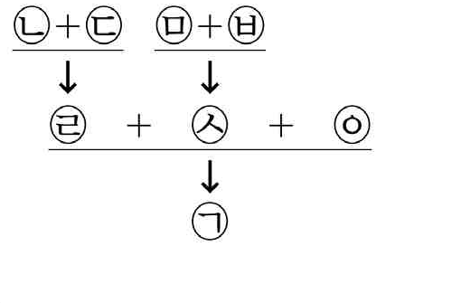
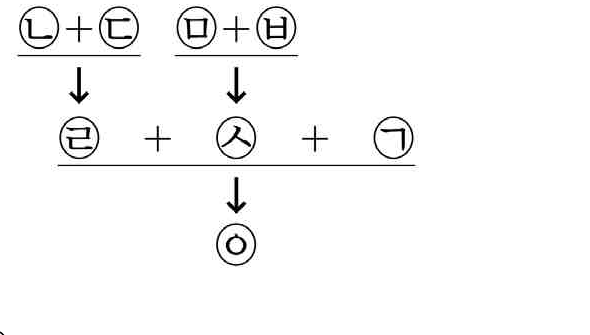
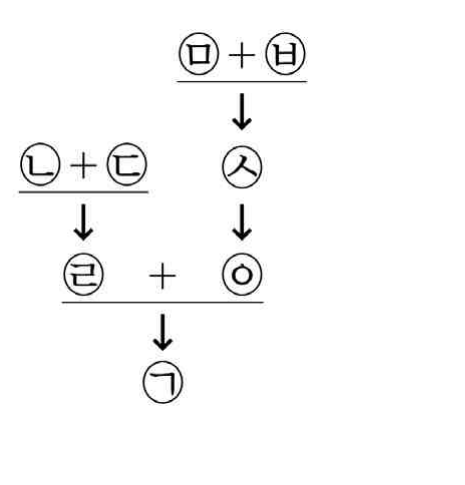
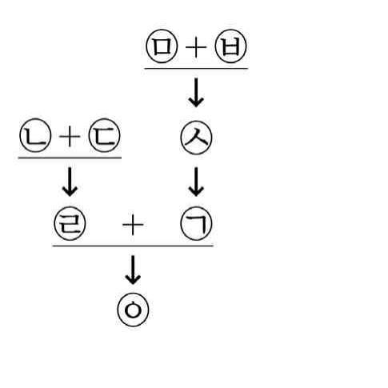
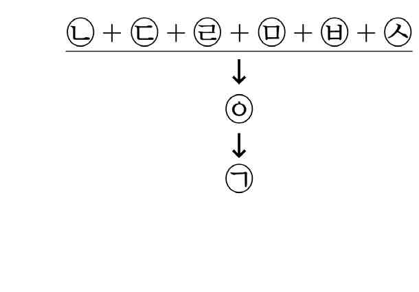

# 01 - RA (2022)

다음 글에 대한 평가로 옳은 것만을 <보기>에서 있는 대로 고른 것은?

## 제시문

머지않은 미래에 신경과학이 모든 행동의 원인을 뇌 안에서 찾아내게 된다면 법적 책임을 묻고 처벌하는 관행이 근본적으로 달라질 것이라고 생각하는 사람들이 있다. 어떤 사람의 범죄 행동이 두뇌에 있는 원인에 의해 결정된 것이어서 자유의지에서 비롯된 것이 아니라면, 그 사람에게 죄를 묻고 처벌할 수 없다는 것이 이들의 생각이다. 그러나 이는 법에 대한 오해에서 비롯된 착각이다. 법은 사람들이 일반적으로 합리적 선택을 할 수 있는 능력을 가지고 있다고 가정한다. 법률상 책임이 면제되려면 '피고인에게 합리적 행위 능력이 결여되어 있다는 사실'이 입증되어야 한다는 점에 대해서는 일반적으로 동의한다. 여기서 말하는 합리적 행위 능력이란 자신의 믿음에 입각해서 자신의 욕구를 달성하는 행동을 수행할 수 있는 능력을 의미한다. 범행을 저지른 사람이 범행 당시에 합리적이었는지 아닌지를 결정하는 데 신경과학이 도움을 줄 수는 있다. 그러나 사람들이 이러한 최소한의 합리성 기준을 일반적으로 충족하지 못한다는 것을 신경과학이 보여 주지 않는 한, 그것은 책임에 관한 법의 접근 방식의 근본적인 변화를 정당화하지 못한다. 법은 형이상학적 의미의 자유의지를 사람들이 갖고 있는지 그렇지 않은지에 대해서는 관심을 두지 않는다. 법이 관심을 두는 것은 오직 사람들이 최소한의 합리성 기준을 충족하는가이다.

## 보기

ㄱ. 인간의 믿음이나 욕구 같은 것이 행동을 발생시키는 데 아무런 역할을 하지 못한다는 것을 신경과학이 밝혀낸다면, 이 글의 논지는 약화된다.

ㄴ. 인간이 가진 합리적 행위 능력 자체가 특정 방식으로 진화한 두뇌의 생물학적 특성에서 기인한다는 것을 신경과학이 밝혀낸다면, 이 글의 논지는 약화된다.

ㄷ. 범죄를 저지른 사람들 중 상당수가 범죄 유발의 신경적 기제를 공통적으로 지니고 있다는 것을 신경과학이 밝혀낸다면, 이 글의 논지는 강화된다.

## 선택지

(1) ㄱ

(2) ㄷ

(3) ㄱ, ㄴ

(4) ㄴ, ㄷ

(5) ㄱ, ㄴ, ㄷ

# 02 - RA (2022)

다음으로부터 <견해>를 분석한 것으로 옳은 것만을 <보기>에서 있는 대로 고른 것은?

## 제시문

특정한 사안에 적용할 법을 획득하는 방법에는 '법의 발견'과 '법의 형성'이 있다. 전자는 '법률 문언(文言)의 가능한 의미' 안에서 법률로부터 해당 사안에 적용할 법을 발견하는 작업인 반면에, 후자는 해당 사안에 적용할 법적 기준이 존재하지 않는 법률의 흠결을 '법률 문언의 가능한 의미'의 제한을 받지 않는 법적 판단을 통하여 보충하는 작업이다. 후자는 법률 문언에 반하지만 법률의 목적을 실현하기 위한 법 획득 방법이다. 양자의 차이는 적극적 후보, 중립적 후보, 소극적 후보라는 개념으로 설명할 수 있다. 적극적 후보란 어느 단어가 명백히 적용될 수 있는 대상을 말하고, 소극적 후보란 어느 단어가 명백히 적용될 수 없는 대상을 말하며, 중립적 후보란 앞의 둘에 속하지 않는 대상을 말한다. '법의 발견' 중 하나인 '축소해석'은 법률 문언의 적용범위를 중립적 후보에서 적극적 후보로 좁히는 것인 반면에, '법의 형성' 중 하나인 '목적론적 축소'는 그 경계가 확실한 '법률 문언의 가능한 의미'에 포함되는 어느 적극적 후보를 해당 법률의 목적에 따라 소극적 후보로 만들어 그 적용범위에서 제외하는 것이다.

<견해>

X국에서 '차'는 동력장치가 있는 이동수단을 의미하고, 승용차, 버스 등이 그에 해당하는데, 동력장치가 있는 자전거가 그에 해당하는지는 명확하지 않다. '차'라는 법률 문언의 적용범위에 대해 다음과 같이 견해가 나뉜다.

갑 : '차'라는 법률 문언의 적용범위에는 동력장치가 없는 자전거도 포함된다.

을 : '차'라는 법률 문언의 적용범위에는 승용차만 포함되고 버스는 포함되지 않는다.

병 : '차'라는 법률 문언의 적용범위에는 동력장치가 있는 자전거가 포함되지 않는다.

## 보기

ㄱ. 갑의 견해는 법률 문언에 반하여 법률의 목적을 실현할 필요가 있어야 정당화되고, 을의 견해는 그렇지 않더라도 정당화된다.

ㄴ. 병의 견해는 동력장치가 있는 자전거를 중립적 후보에서 소극적 후보로 만들어 법을 형성하고자 한 것이다.

ㄷ. 주차공간을 확보하기 위하여 집 앞에 설치하는 '주차금지' 팻말의 '차'의 적용범위에서 자기 소유의 승용차를 제외하는 것은, 을이 법을 획득하기 위하여 사용한 방법과 같다.

## 선택지

(1) ㄴ

(2) ㄷ

(3) ㄱ, ㄴ

(4) ㄱ, ㄷ

(5) ㄱ, ㄴ, ㄷ

# 03 - RA (2022)

다음으로부터 <상황>을 판단한 것으로 옳은 것만을 <보기>에서 있는 대로 고른 것은?

## 제시문

헌법은 국가의 기본적 가치를 규정한 최상위법으로 법률이 헌법을 위반하면 그 법률은 무효이다. 여기서 법률의 어떤 측면이 위헌판단의 근거를 제공하는지가 문제된다. 단순히 법률문장의 문자적 의미가 바로 위헌판단의 근거가 되는 법률의 핵심 측면이라고 할 수도 있겠으나, 헌법이 차별을 금지하는데 법률이 '차별하라'는 의미를 노골적으로 담고 있는 단어나 문장을 사용하는 경우는 거의 없을 것이다.

기본적으로 위헌판단이 되는 법률의 측면은 ㉠ 해당 법률을 표상하는 법률문장을 구체적 사안에 적용할 때 예상되는 직접적인 결과이다. 간통한 사람을 처벌하는 내용을 담고 있는 법률문장 A가 표상하는 법률의 위헌 여부를 결정짓는 측면은 간통한 사람에게 A의 적용에 따라 가해지는 처벌이라는 결과이다. 어떤 이들은 ㉡ 해당 법률이 시행됨으로써 사회 전체 구성원에게 미치는 영향을 살펴야 한다고 생각한다. 특정 집단에 대해 채용시 가산점을 부여하도록 하는 법률이 차별적이어서 위헌인지 여부는 가산점 부여행위가 그 사회의 다른 이들에게 미치는 영향까지 관찰해야만 알 수 있다고 한다. 다른 한편에서는 위헌판단의 결정적인 측면을 여전히 법률문장의 의미에서 찾으면서도 그 법률문장의 의미는 ㉢ 해당 사회의 역사와의 관련 속에서 그 법률문장이 전달하는 맥락적 의미라고 주장한다. 여성 전용 교육기관을 설립한다는 내용의 법률문장으로 표상되는 법률이 차별을 금지하는 헌법에 위반되는지 여부는, 여성 전용 교육기관을 설립하는 것이 그 국가에서 여성의 낮은 권익을 향상하기 위한 맥락을 가지는가, 아니면 여성을 분리·차별하기 위한 역사적 맥락을 가지는가에 따라 다르게 평가된다는 것이다.

<상황>

X국에서는 수차례 전쟁을 거치면서 국기가 국가 존립의 상징이 되어 국기 소각이 국가의 권위를 해하는 행위로서 헌법질서에 반하는 범죄행위로 평가받기에 충분하다. 그런데 X국 국회가 국기의 권위와 존엄을 보호하기 위해서 국기를 소각한 자를 처벌한다는 내용을 담고 있는 법률문장 R로 표상되는 법률 L을 입법하자, 이에 반대하는 사람들이 시위를 하면서 그간 거의 존재하지 않았던 국기 소각 행위가 빈번하게 일어났고 소각행위에 동조하는 사람들도 많아졌다.

## 보기

ㄱ. ㉠을 위헌판단의 근거를 제공하는 핵심 측면으로 판단하면, X국에서 L은 위헌이다.

ㄴ. L이 가진 ㉡의 측면은 R로 표상되는 L의 입법 목적과 합치하지 않는다.

ㄷ. ㉢을 위헌판단의 근거를 제공하는 핵심 측면으로 판단하면, X국에서 L은 위헌이다.

## 선택지

(1) ㄱ

(2) ㄴ

(3) ㄱ, ㄷ

(4) ㄴ, ㄷ

(5) ㄱ, ㄴ, ㄷ

# 04 - RA (2022)

[규정]에 따라 <사실관계>를 판단할 때 갑의 운전면허는 최종적으로 언제까지 정지되는가?

## 제시문

[규정]

제1조(정의) ① '벌점'은 교통법규위반에 대하여 그 위반의 경중에 따라 위반행위자에게 배점되는 점수를 말한다.

② '처분벌점'은 교통법규위반시 배점된 벌점을 누적하여 합산한 점수에서 기간경과로 소멸한 벌점 점수와 운전면허 정지처분으로 집행된 벌점을 뺀 점수를 말한다.

제2조(벌점의 배점 등) ① 속도위반을 제외한 교통법규위반에 대하여 배점되는 벌점은 아래 표와 같다.

| 사유 | 벌점 | 사유 | 벌점 |
| --- | --- | --- | --- |
| 신호위반 | 15점 | 정지선위반 | 18점 |
| 앞지르기금지위반 | 20점 | 갓길통행 | 25점 |

② 속도위반에 대하여 배점되는 벌점은 아래 표와 같다.

| 초과된 속도 | $20\ \mathrm{km/h}$ 초과 $40\ \mathrm{km/h}$ 이하 | $40\ \mathrm{km/h}$ 초과 |
| --- | --- | --- |
| 벌점 | 15점 | 40점 |

③ 벌점은 해당 교통법규위반일로부터 3년이 지나면 소멸하고, 30점 미만인 처분벌점은 최종 교통법규위반일로부터 교통법규위반 없이 1년이 지나면 소멸한다.

제3조(운전면허정지처분 등) ① 처분벌점이 40점 이상이 되면 운전면허정지처분을 하되, 최종 교통법규위반일 다음날부터 운전면허가 정지되며 처분벌점 1점을 정지일수 1일로 계산하여 집행한다.

② 운전면허정지 중에 범한 교통법규위반행위에 대해서는 벌점을 2배로 배점한다.

③ 운전면허정지 중에 새로운 운전면허정지처분을 추가로 받는 경우, 추가된 운전면허정지처분은 집행 중인 운전면허정지처분의 기간이 종료한 다음날부터 집행한다.

<사실관계>

갑은 그 이전까지는 교통법규위반 전력이 없었는데, 2017. 5. 1.에 신호위반을 하고, 2020. 7. 1.에 정지선위반을 하고, 2021. 3. 1.에 갓길통행을 하고, 2021. 4. 1.에 규정속도를 $45\ \mathrm{km/h}$ 초과하여 속도위반을 하였다. 갑은 위 모든 교통법규위반행위들에 대해 위반일자에 [규정]에 따른 벌점 또는 운전면허정지처분을 받았다.

## 선택지

(1) 2021. 5. 23.

(2) 2021. 6. 7.

(3) 2021. 6. 14.

(4) 2021. 7. 2.

(5) 2021. 7. 17.

# 05 - RA (2022)

다음 논쟁에 대한 분석으로 옳은 것만을 <보기>에서 있는 대로 고른 것은?

## 제시문

80년 전 K섬이 국가에 의해 무단으로 점유되어 원주민 A가 K섬에서 강제로 쫓겨나 타지에서 어렵게 살게 되었다. A가 살아 있다면 국가가 저지른 잘못에 대해서 A에게 배상이 이루어져야 하겠지만 A는 이미 사망하였다. A의 현재 살아 있는 자녀 B에게 배상이 이루어져야 할지에 대해서 다음과 같은 논쟁이 벌어졌다.

갑 : 배상은 어떤 잘못에 의해서 영향받은 사람에게 이루어져야 하는데, ㉠ 잘못된 것 X에 대해 사람 S에게 배상을 한다는 것은, X가 일어나지 않았더라면 S가 누렸을 만한 삶의 수준이 되도록 S에게 혜택을 제공하는 것이다. 피해자의 삶의 수준을 악화시킨 경우 그리고 그런 경우에만 배상이 이루어져야 한다. 따라서 80년 전 K섬의 무단 점유가 없었더라면 B가 누렸을 삶의 수준이 되도록 B에게 혜택을 제공하는 배상이 이루어져야 한다.

을 : 갑의 주장에는 심각한 문제가 있다. K섬의 무단 점유가 없었더라면 B의 아버지는 B의 어머니가 아니라 다른 여인을 만나 다른 아이가 태어났을 것이고 B는 아예 존재하지 않았을 것이다. 따라서 그 섬의 무단 점유가 없었더라면 B가 더 높은 수준의 삶을 누렸을 것이라고 말하는 것은 옳지 않으며, 그런 상황에서 B가 누렸을 삶의 수준이 어느 정도인지의 질문에 대해 애초에 어떤 답도 없다.

병 : B의 배상 원인이 되는 잘못은 80년 전 발생한 K섬의 무단 점유가 아니라, B가 태어난 후 어느 시점에서 K섬의 무단 점유에 대해 A에게 배상이 이루어지지 않았다는 사실이다. 만약 그런 사실이 없었더라면, 다시 말해 B가 태어난 후 K섬의 무단 점유에 대해 A에게 배상이 이루어졌더라면, A는 B에게 더 나은 교육 기회와 자원을 제공하였을 것이고 B는 더 나은 삶을 살았을 것이다. 그러나 과거에 그런 배상이 이루어지지 않았기 때문에 B에게 배상이 이루어져야 하는 것이다.

## 보기

ㄱ. 갑이 "80년 전 K섬의 무단 점유가 없었더라면, A는 그가 실제로 누렸던 것보다 훨씬 더 높은 수준의 삶을 누렸겠지만 B는 오히려 더 낮은 수준의 삶을 누렸을 것이다."라는 것을 받아들이게 된다면, 갑은 B에게 배상이 이루어져야 한다는 주장에 동의하지 않을 것이다.

ㄴ. 을이 ㉠의 원리를 받아들인다면, 그는 80년 전 K섬의 무단 점유에 대해 B에게 배상이 이루어져야 한다는 주장에 동의할 것이다.

ㄷ. 병은 ㉠의 원리에 동의하지 않지만, B에게 배상이 이루어져야 한다는 것에 대해서는 갑과 의견을 같이한다.

## 선택지

(1) ㄱ

(2) ㄴ

(3) ㄱ, ㄷ

(4) ㄴ, ㄷ

(5) ㄱ, ㄴ, ㄷ

# 06 - RA (2022)

[규정]과 <사례>를 근거로 판단할 때 <보기>에서 [규정]을 준수한 것만을 있는 대로 고른 것은?

## 제시문

[규정]

제1조 ① '개인정보처리자'란 업무를 목적으로 개인정보를 처리하는 자를 말한다.

② '업무수탁자'란 개인정보처리자가 본래의 개인정보 수집·이용 목적과 관련된 업무를 위탁한 경우 위탁자의 이익을 위해 개인정보를 처리하는 자를 말한다.

③ '제3자'란 개인정보처리자와 업무수탁자를 제외한 모든 자를 말한다.

제2조 ① 개인정보처리자는 정보주체의 동의를 받은 경우에 한하여 개인정보를 수집할 수 있으며 그 수집 목적의 범위에서 이용할 수 있다.

② 전항의 개인정보처리자는 수집 목적 범위에서 개인정보를 제3자에게 제공(공유를 포함)할 수 있다. 다만 제공 후 1주일 이내에 제공사실을 정보주체에게 알려야 한다.

③ 개인정보처리자는 정보주체의 이익을 부당하게 침해할 우려가 없는 경우에 한하여 정보주체로부터 별도의 동의를 받아 개인정보를 수집 목적 이외의 용도로 이용하거나 이를 제3자에게 제공할 수 있다.

④ 개인정보처리자는 개인정보 처리업무를 위탁하는 경우에 위탁 후 위탁사실을 정보주체에게 알려야 하고, 정보주체가 확인할 수 있도록 공개하여야 한다.

<사례>

숙박예약 전문사이트를 운영하는 P사는 숙박예약 및 이벤트 행사를 위한 목적으로 회원가입시 이용자의 동의를 받아 개인정보를 수집하였다.

## 보기

ㄱ. P사는 회원들로부터 별도의 동의 없이 숙박시설 운영자 Q에게 해당 숙박시설을 예약한 회원의 정보를 제공하고 즉시 그 회원에게 제공사실을 알려주었다.

ㄴ. P사는 여행사 S사와 사업제휴를 맺고 회원들로부터 별도의 동의 없이 S사가 S사의 여행상품을 홍보할 수 있도록 회원정보를 공유하였다.

ㄷ. P사는 항공권 경품이벤트를 알리기 위해 홍보업체 R사와 이벤트안내 메일발송업무에 관한 위탁계약을 체결하고 회원정보를 R사에게 제공한 후, 10일이 경과한 후에 제공사실을 회원들에게 알리고 공개하였다.

ㄹ. P사는 인터넷 불법도박사이트 운영업체 T사가 불법도박을 홍보할 수 있도록, 회원들로부터 별도의 동의를 받아 T사에게 회원정보를 유료로 제공하였다.

## 선택지

(1) ㄱ, ㄷ

(2) ㄱ, ㄹ

(3) ㄴ, ㄹ

(4) ㄱ, ㄴ, ㄷ

(5) ㄴ, ㄷ, ㄹ

# 07 - RA (2022)

다음으로부터 추론한 것으로 옳은 것만을 <보기>에서 있는 대로 고른 것은?

## 제시문

X국은 "교통사고 당시 운전자의 혈중알코올농도가 $0.03\%$ 이상인 것이 확인되면 면허를 취소한다."는 규정을 두고 있다. 그런데 교통사고 시점으로부터 일정 시간이 경과한 이후에 음주 측정이 이루어진 경우에는 교통사고 시점의 혈중알코올농도를 직접 확인할 수 없다. 이런 경우에 대비하여 X국 법원은 사고 후에 측정한 혈중알코올농도를 근거로 교통사고 시점의 혈중알코올농도를 추정하는 A공식을 도입하여 면허취소 여부를 판단하고자 한다.

A공식은 섭취 후 일정 시간 동안은 알코올이 소화기관에 의하여 혈액에 일정량 흡수되어 혈중알코올농도가 증가(상승기)하지만 최고치에 이른 시점 이후부터는 분해작용에 따라 서서히 감소(하강기)한다는 점에 착안한 것이다. A공식은 측정한 혈중알코올농도에 시간의 흐름만큼 감소한 혈중알코올농도를 더하는 방식이므로 교통사고가 혈중알코올농도 하강기에 발생한 경우에만 적용될 수 있다.

A공식 : $C = r + b \times t$

($C$ : 확인하고자 하는 시점의 혈중알코올농도, $r$ : 실측 혈중알코올농도, $b$ : 시간당 알코올 분해율, $t$ : 경과시간)

A공식에서 $b$는 시간당 $0.008\%\sim0.03\%$로 사람마다 다른데 X국 법원은 개인별 차이를 고려하지 않고 위 범위에서 측정대상자에게 가장 유리한 값을 대입한다. 또한 $t$는 확인하고자 하는 시점부터 실제 측정한 시간까지의 경과시간을 시간 단위($h$)로 대입한다. 한편 혈중알코올농도가 증가하는 '상승기 시간'은 음주종료시점부터 30분에서 1시간 30분까지로 사람마다 다른데 X국 법원은 역시 개인별 차이는 고려하지 않고 일괄적으로 음주종료시부터 1시간 30분 후에 최고 혈중알코올농도에 이르는 것으로 본다.

## 보기

ㄱ. 20:00까지 술을 마신 후 운전을 하다 21:00에 교통사고를 냈고 같은 날 21:30에 측정한 혈중알코올농도가 $0.031\%$인 사람은 면허가 취소된다.

ㄴ. 20:00까지 술을 마신 후 운전을 하다 교통사고를 냈고(시간 미상), 같은 날 23:30에 측정한 혈중알코올농도가 $0.012\%$인 사람은 이후 사고시간이 밝혀지더라도 면허가 취소되지 않는다.

ㄷ. 20:00까지 술을 마신 직후 자가측정한 혈중알코올농도가 $0.05\%$이었고 이후 운전을 하다 22:30에 교통사고를 냈으며 같은 날 23:30에 측정한 혈중알코올농도가 $0.021\%$인 사람의 면허는 취소되지 않는다.

## 선택지

(1) ㄱ

(2) ㄴ

(3) ㄱ, ㄷ

(4) ㄴ, ㄷ

(5) ㄱ, ㄴ, ㄷ

# 08 - RA (2022)

[규정]의 <검토의견>에 대한 평가로 옳은 것만을 <보기>에서 있는 대로 고른 것은?

## 제시문

[규정]

제1조(정의) '아동'은 미성년자를 말한다.

제2조(신체적 아동학대) 누구든지 아동을 폭행하거나 신체건강 및 발달에 해를 끼치는 신체적 학대행위를 한 때에는 5년 이하의 징역에 처한다.

제3조(성적 아동학대) 누구든지 아동을 대상으로 성적 수치심을 야기하는 성적 학대행위를 한 때에는 6년 이하의 징역에 처한다.

<검토의견>

A : 아동학대범죄는 일반폭력범죄와 달리 보호의무자가 보호 대상자에게 해를 끼치는 데 특징이 있다. 따라서 보호대상자인 아동은 제2조, 제3조의 행위주체에서 제외하고 행위주체를 보호의무자인 '성인'으로 한정하여야 한다.

B : [규정]은 학대가해자를 철저히 처벌하여 학대피해자인 아동을 각종 학대행위로부터 두텁게 보호하고자 하는 데에 목적이 있다. 따라서 제2조, 제3조의 행위주체는 현행과 같이 '누구든지'로 유지되어야 한다.

C : 성적 행위와 관련하여 아동피해자를 성적 자기결정능력이 있는 성인피해자와 동일하게 취급할 수 없다. 따라서 제3조에서 '성적 수치심을 야기하는'이라는 표현은 삭제하는 것이 타당하다.

## 보기

ㄱ. "최근 미성년자가 다른 미성년자의 보호·감독자가 되는 사회적 관계 유형이 증가하고 있다."는 연구 결과는 A를 뒷받침한다.

ㄴ. "아동학대의 가해자 상당수가 어린 시절 아동학대를 경험한 피해자이므로 아동학대에서 피해자와 가해자를 이분법적으로 나눌 수 없다."는 연구 결과는 B를 뒷받침한다.

ㄷ. "최근 미성년자 간에 성적 요구를 하여 영상 등을 촬영하는 사례가 늘고 있으며 이러한 요구에 대하여 아무 부끄러움이나 불쾌감 없이 응한 경험이 이후 부정적 자기정체성이나 왜곡된 성 인식을 형성하는 데에 결정적 영향을 미치므로, 미성년자 간의 성적 요구행위 역시 학대로 보아 처벌할 필요성이 크다."는 연구 결과는 B, C 모두를 뒷받침한다.

## 선택지

(1) ㄱ

(2) ㄷ

(3) ㄱ, ㄴ

(4) ㄴ, ㄷ

(5) ㄱ, ㄴ, ㄷ

# 09 - RA (2022)

[규정]에 따라 <사례>를 판단한 것으로 옳은 것만을 <보기>에서 있는 대로 고른 것은?

## 제시문

[규정]

제1조 ① 타인의 동의를 얻어 그의 물건을 원재료로 사용하여 새로운 물건을 제작한 경우 새로운 물건은 원재료 소유자가 소유한다.

② 제1항에도 불구하고 새로운 물건의 가격이 원재료 가액을 초과한 경우에는 새로운 물건을 제작한 자가 소유한다. 이 경우 원재료 소유자는 새로운 물건을 제작한 자에게 원재료 가액의 지급을 청구할 수 있다.

③ 제2항에서 제작행위를 한 자가 여럿이면 그 제작행위를 한 자가 새로운 물건을 공동으로 소유한다.

제2조 타인의 동의 없이 그의 물건을 원재료로 사용하여 새로운 물건을 제작한 경우 원재료 소유자는 다음의 권리를 가진다.

1. 새로운 물건의 가격이 원재료 가액을 초과한 경우에는 새로운 물건을 소유한다.

2. 새로운 물건의 가격이 원재료 가액과 동일하거나 미달하는 경우에는 우선 새로운 물건을 제작한 자에게 원재료 가액의 지급을 청구하여야 하고, 새로운 물건을 제작한 자가 이를 지급하지 않는 경우에 한하여 새로운 물건을 소유한다.

제3조 제1조 및 제2조에도 불구하고 새로운 물건을 쉽게 원재료로 환원할 수 있고 원재료 소유자가 이를 원할 경우에는 새로운 물건을 제작한 자는 원재료 소유자에게 원상대로 원재료를 반환하여야 한다.

<사례>

가죽 유통업자 갑은 장당 50만 원인 소가죽 50장을 소유·보관하고 있다. 구두장인 을은 갑의 소가죽 3장을 가져가 한 장은 손쉽게 제거 가능한 광택을 넣어 가격이 50만 원인 ㉠ 광택 나는 새로운 소가죽을 제작하였고, 다른 한 장으로는 ㉡ 구두를 제작하는 한편, 나머지 한 장은 소파제작자 병에게 보내 소파를 제작하게 하였다. 병은 이를 재단하여 100만 원인 ㉢ 소파를 제작하였는데, 소파 제작에 사용된 목재는 병이 50만 원에 구입한 것이다.

## 보기

ㄱ. 을이 갑의 사용동의 없이 소가죽을 가져가 ㉠을 제작한 경우, 갑은 을에게 원상대로 소가죽을 반환할 것을 청구할 수 있다.

ㄴ. ㉡이 30만 원이고 소가죽에 대한 갑의 사용동의가 없는 경우, ㉡은 갑의 소유이다.

ㄷ. ㉢을 제작하는 데 있어서 만약 소가죽에 대한 갑의 사용동의가 있다면 ㉢의 소유자는 을이 되지만, 만약 갑의 사용동의가 없다면 ㉢은 갑의 소유가 된다.

## 선택지

(1) ㄱ

(2) ㄷ

(3) ㄱ, ㄴ

(4) ㄴ, ㄷ

(5) ㄱ, ㄴ, ㄷ

# 10 - RA (2022)

입법안 <1안>, <2안>, <3안>에 대한 분석으로 옳지 않은 것은?

## 제시문

<1안>

① 성적 의도로 다른 사람의 신체를 그 의사에 반하여 촬영한 자는 4년 이하의 징역에 처한다.

② 제1항에 따른 촬영물 또는 그 복제물을 유포한 자는 6년 이하의 징역에 처한다.

③ 영리를 목적으로 제1항의 촬영물 또는 그 복제물을 정보통신망을 이용하여 유포한 자는 10년 이하의 징역에 처한다.

<2안>

① 성적 의도로 다른 사람의 신체를 그 의사에 반하여 촬영하거나 그 촬영물 또는 그 복제물을 유포한 자는 5년 이하의 징역에 처한다.

② 제1항의 촬영이 촬영 당시에는 촬영대상자의 의사에 반하지 아니한 경우에도 촬영 후에 그 의사에 반하여 촬영물 또는 그 복제물을 유포한 자는 3년 이하의 징역에 처한다.

③ 영리를 목적으로 제1항 또는 제2항의 촬영물 또는 그 복제물을 정보통신망을 이용하여 유포한 자는 7년 이하의 징역에 처한다.

<3안>

① 성적 의도로 사람의 신체를 촬영대상자의 의사에 반하여 촬영한 자는 5년 이하의 징역에 처한다.

② 제1항에 따른 촬영물 또는 그 복제물을 유포한 자는 7년 이하의 징역에 처한다. 제1항의 촬영이 촬영 당시에는 촬영대상자의 의사에 반하지 아니한 경우에도 그 촬영물 또는 그 복제물을 촬영대상자의 의사에 반하여 유포한 자는 7년 이하의 징역에 처한다.

③ 영리를 목적으로 정보통신망을 이용하여 제2항의 죄를 범한 자는 8년 이하의 징역에 처한다.

④ 제1항 또는 제2항의 촬영물 또는 그 복제물을 소지·구입·저장 또는 시청한 자는 1년 이하의 징역에 처한다.

※ 유포 : 1인 이상의 타인에게 반포·판매·임대·제공하거나 타인이 볼 수 있는 방법으로 전시·상영하는 행위를 포함하여 촬영물이나 그 복제물을 퍼뜨리는 행위

## 선택지

(1) <1안>과 <3안>은 성적 의도로 타인의 신체를 그의 의사에 반하여 촬영하는 행위보다 그 촬영물을 유포하는 행위가 더 중한 범죄인 것으로 보고 있다.

(2) 성적 의도로 타인의 신체를 그의 의사에 반하여 촬영한 동영상을 인터넷에서 다운로드 받아 개인 PC에 저장하는 행위는 <3안>에서만 처벌대상이다.

(3) 성적 의도로 촬영대상자의 허락을 받아 촬영한 나체사진을 그의 의사에 반하여 다른 사람에게 이메일로 전송하는 행위는 <2안>과 <3안>에서만 처벌대상이다.

(4) <3안>에 의하면 촬영자가 성적 의도로 촬영자 자신의 나체를 촬영하여 SNS로 보내온 사진을 그 촬영자의 의사에 반하여 다른 사람들에게 SNS로 보낸 행위도 처벌대상이다.

(5) 타인의 의사에 반하여 그의 신체를 성적 의도로 촬영한 사진을 한적한 도로변 가판대에서 유상 판매하는 행위에 대해 가장 중한 처벌을 규정한 입법안은 <1안>이다.

# 11 - RA (2022)

X국, Y국 법원이 자국 규정에 따라 재판할 때 <사례>의 갑, 을, 병에게 선고되는 형 중 최저 형량과 최고 형량을 옳게 짝지은 것은?

## 제시문

[X국 규정]

제1조 ① 강간한 사람은 징역 7년형에 처한다.

② 전항은 X국 영역 내에서 죄를 범한 내국인과 외국인에게 적용한다.

제2조 ① 해상에서 강도한 사람은 징역 8년형에 처한다.

② 전항은 X국 영역 내에서 죄를 범한 내국인과 외국인 및 X국 영역 외에서 죄를 범한 내국인에게 적용한다.

제3조 X국의 국적만 가진 사람을 내국인으로 본다.

제4조 처벌대상이 되는 동종 또는 이종의 범죄가 수회 범해진 경우, 개별 범죄에서 정한 형을 전부 합산하여 하나의 형을 선고한다. 이때 한 행위자가 동종의 범죄를 범한 경우, 1회의 범죄를 1개의 범죄로 본다.

[Y국 규정]

제1조 ① 강간한 사람은 징역 6년형에 처한다.

② 전항은 Y국 영역 내에서 죄를 범한 내국인과 외국인 및 Y국 영역 외에서 죄를 범한 내국인에게 적용한다.

제2조 ① 해상에서 강도한 사람은 징역 9년형에 처한다.

② 전항은 Y국 영역 내·외에서 죄를 범한 내국인과 외국인에게 적용한다.

제3조 Y국의 국적을 가진 사람을 내국인으로 본다.

제4조 ① 처벌대상이 되는 동종 또는 이종의 범죄가 2회 범해진 경우에는 개별 범죄에서 정한 형 중 중한 형을 선택하여 그 형에 그 2분의 1을 더한 형만 선고하고, 3회 이상 범해진 경우에는 개별 범죄에서 정한 형 중 가장 중한 형을 선택하여 그 형에 그 3분의 2를 더한 형만 선고한다.

② 전항에서 한 행위자가 동종의 범죄를 범한 경우, 1회의 범죄를 1개의 범죄로 본다.

<사례>

○ X국 국적의 갑이 X국에서 1회 강간을 하고 1회 해상강도를 한 후 Y국에서 다시 1회 해상강도를 하였다. 갑은 Y국에서 재판을 받는다.

○ Y국 국적의 을이 Y국에서 2회 강간을 하고 X국에 가서 1회 강간을 하였다. 본국으로 강제 송환된 을은 Y국에서 재판을 받는다.

○ X국과 Y국의 국적을 모두 가진 병이 Y국에서 1회 해상강도를 한 후 X국에서 2회 강간을 하였다. 병은 X국에서 재판을 받는다.

## 선택지

(1) 10년 - 13년 6개월

(2) 10년 - 14년

(3) 10년 - 15년

(4) 12년 - 13년 6개월

(5) 12년 - 14년

# 12 - RA (2022)

다음 논쟁에 대한 분석으로 옳은 것만을 <보기>에서 있는 대로 고른 것은?

## 제시문

X국 형법은 타인의 재물을 훔친 자를 절도죄로 처벌한다. 형법상 '재물'의 의미와 관련하여 갑, 을, 병이 아래와 같이 논쟁을 하고 있다.

갑 : 재물이란 '재산적 가치가 있는 물건'을 말하고, 여기서 '재산적 가치'란 순수한 경제적 가치, 즉 금전적 가치를 의미하기 때문에, 형법상 재물은 물건의 소유 및 거래의 적법성 여부와는 상관없다고 생각합니다.

을 : 재물이 반드시 적법하게 소유되거나 거래된 것일 필요가 없다는 점에 대해서는 갑의 견해에 동의합니다. 하지만 재물의 개념요소인 '재산적 가치'는 소유자가 주관적으로 부여하는 것이기 때문에, 금전적 교환가치가 있든 없든 소유자의 소유 의사가 표출되어 있는 이상 해당 물건을 형법상 재물로 보는 것이 타당합니다.

병 : 재물의 개념요소인 '재산적 가치'가 인정되려면 금전적 교환 가치가 있어야 합니다. 하지만 그것은 필요조건이지 충분 조건은 아니라고 생각합니다. 형법상 재물이 되기 위해서는 금전적 교환가치가 있어야 할 뿐만 아니라 소유 및 거래의 적법성이 인정되는 것이어야 합니다.

## 보기

ㄱ. 갑은 마약밀매상이 가지고 있는 법적으로 소유가 금지된 마약을 형법상 재물로 본다.

ㄴ. 을은 마약밀매상이 가지고 있는 법적으로 소유가 금지된 마약과 연예인이 소중히 보관하고 있지만 거래는 되지 않는 팬레터를 모두 형법상 재물로 본다.

ㄷ. 병은 연예인이 소중히 보관하고 있지만 거래는 되지 않는 팬레터를 형법상 재물로 보지만, 마약밀매상이 가지고 있는 법적으로 소유가 금지된 마약은 형법상 재물로 보지 않는다.

## 선택지

(1) ㄱ

(2) ㄷ

(3) ㄱ, ㄴ

(4) ㄴ, ㄷ

(5) ㄱ, ㄴ, ㄷ

# 13 - RA (2022)

[규정]을 <사례>에 적용한 것으로 옳은 것만을 <보기>에서 있는 대로 고른 것은?

## 제시문

혼인하려는 당사자들은 혼인의 성립을 가능하게 하는 요건을 모두 충족하고 혼인의 성립을 불가능하게 하는 요건에 하나도 해당하지 않아야 혼인할 수 있다. 같은 국적을 가진 당사자들에게는 그들이 국적을 가진 국가의 규정을 적용하면 충분하나, 서로 다른 국적을 가진 당사자들에게는 어느 국가의 규정을 적용할지가 문제된다. 서로 다른 국적을 가진 당사자들이 X국에서 혼인할 수 있는지를 판단하려면, 혼인 적령(適齡)은 각 당사자가 자신의 국적을 가진 국가에서 정한 요건만 검토하면 충분하고, 중혼(重婚)·동성혼(同性婚)은 쌍방 당사자가 국적을 가진 각 국가에서 정한 요건을 모두 검토해야 한다.

[규정]

X국 : 18세에 이르면 혼인할 수 있다. 기혼자도 중복으로 혼인할 수 있다. 같은 성별 간에도 혼인할 수 있다.

Y국 : 남성은 16세, 여성은 18세에 이르면 혼인할 수 있다. 남성은 기혼자도 중복으로 혼인할 수 있다. 같은 성별 간에는 혼인할 수 없다.

Z국 : 여성은 16세, 남성은 18세에 이르면 혼인할 수 있다. 쌍방 당사자 모두 미혼이어야 혼인할 수 있다. 같은 성별 간에도 혼인할 수 있다.

<사례>

갑 : X국 국적의 19세 미혼 여성이다.

을 : Y국 국적의 17세 기혼 남성이다.

병 : Z국 국적의 17세 미혼 여성이다.

## 보기

ㄱ. 갑과 을은 X국에서 혼인할 수 있다.

ㄴ. 갑과 병은 X국에서 혼인할 수 있다.

ㄷ. 을과 병은 X국에서 혼인할 수 있다.

## 선택지

(1) ㄴ

(2) ㄷ

(3) ㄱ, ㄴ

(4) ㄱ, ㄷ

(5) ㄱ, ㄴ, ㄷ

# 14 - RA (2022)

[규정]에 따라 <사례>를 판단한 것으로 옳지 않은 것은?

## 제시문

X국에서 유행성 독감이 급격히 확산하자 마스크 품귀 현상이 발생하였고 마스크 판매가격이 급등하였다. 이에 마스크 생산회사를 인수하여 마스크 공급을 독점하려는 동태가 감지되자 X국 정부는 [규정]을 제정하였다.

[규정]

제1조(지분 보유 제한) 자연인 또는 법인(회사를 포함한다)은 단독으로 또는 제2조에 규정된 '사실상 동일인'과 합하여 마스크 생산회사 지분을 50%까지만 보유할 수 있다.

제2조(사실상 동일인) '사실상 동일인'이란 다음 각호 중 어느 하나에 해당하는 자를 말한다.

1. 해당 자연인의 부모, 배우자, 자녀

2. 해당 자연인이 50% 이상 지분을 보유하고 있는 법인

3. 해당 자연인이 제1호에 규정된 자와 합하여 50% 이상 지분을 보유하고 있는 법인

<사례>

X국에서 마스크를 생산하는 P회사 지분은 갑이 15%, 마스크 생산과 무관한 Q회사가 20%를 보유하고 있고, 나머지는 제3자들이 나누어 보유하고 있다. Q회사 지분은 을, 병, 정이 각각 10%, 40%, 50%를 보유하고 있다. 병은 을의 남편이다.

## 선택지

(1) 병은 제3자들로부터 P회사 지분 30%를 취득할 수 있다.

(2) 을이 갑의 딸인 경우, 갑은 제3자들로부터 P회사 지분 35%를 취득할 수 있다.

(3) 정이 갑의 딸인 경우, 정은 제3자들로부터 P회사 지분 15%를 취득할 수 있다.

(4) 정이 병으로부터 Q회사 지분 10%를 취득하는 경우, 병은 제3자들로부터 P회사 지분 50%를 취득할 수 있다.

(5) 갑이 정으로부터 Q회사 지분 50%를 취득하는 경우, 갑은 제3자들로부터 P회사 지분 35%를 취득할 수 있다.

# 15 - RA (2022)

다음으로부터 추론한 것으로 옳은 것만을 <보기>에서 있는 대로 고른 것은?

## 제시문

A : "미처 몰랐어."라는 말은 나쁜 행위에 대한 변명이 될 수 있고 비난의 여지를 줄여줄 수 있다. 가령 내가 친구의 커피에 설탕인 줄 알고 타 준 것이 독약이었다고 하자. 이는 분명 나쁜 행위이지만, 내가 그것을 몰랐다는 사실은 나에 대한 비난가능성을 줄여줄 것이다. 사실에 대한 무지가 도덕적 비난가능성을 줄일 수 있다면, 도덕에 대한 무지라고 다를 리 없다. 가령 어떤 사람이 노예제도가 도덕적으로 옳지 않다는 것을 모른 채 노예 착취에 동참했다고 해 보자. 이런 무지는 노예를 착취한 행위에 대해서 그 사람을 비난할 가능성을 줄여준다. 어떤 사람이 전쟁에서 적군을 잔인하게 죽이는 것이 옳다고 강하게 믿고 의무감에서 적군을 잔인하게 죽였다면, 그런 행위로 인해 그 사람은 심지어 칭찬받을 여지도 생길 수 있다.

B : 도덕적 무지가 나쁜 행위의 비난가능성을 줄일 수 있다면, 극악무도한 행위에 대해서도 "도덕적으로 그른 일인지 몰랐어."라는 변명이 통할 것이다. 그러나 이는 불합리하다. 어떤 행위를 한 사람이 칭찬받을 만한지 비난받을 만한지는 그 사람이 가진 옳고 그름에 대한 믿음에 따라 결정되는 것이 아니라, 행위가 드러내는 그 사람의 도덕적 성품에 따라 결정되어야 할 문제이다. 도덕적으로 선한 성품을 가진 사람은 그가 가진 도덕적 믿음에 상관없이 나쁜 것에 거부감을 느끼고 좋은 일에 이끌리기 마련이고, 그런 성품의 결과로 나온 행동은 칭찬받을 만하다. 사실 극단적인 형태의 도덕적 무지는 악한 성품에서 생겨나는 것이라 볼 수밖에 없다. 잘못된 도덕적 믿음과 의무감으로 인해 잔인하게 사람들을 죽이는 사람이 비난받아 마땅한 이유이다.

## 보기

ㄱ. 노예제도가 당연시되던 시대에 살던 갑은 노예를 돕는 행위가 도덕적으로 옳지 않다고 믿음에도 불구하고 곤경에 빠진 노예를 돕는다. A에 따르면 갑은 이 행위로 인해 비난받을 만하고, B에 따르더라도 그러하다.

ㄴ. 을은 고양이를 학대하는 것이 도덕적으로 나쁘지 않다고 믿고 있다. 이 때문에 그는 거리낌 없이 고양이를 잔인하게 학대한다. A에 따르면 을의 도덕적 무지는 그에 대한 비난가능성을 낮추지만, B에 따르면 그렇지 않다.

ㄷ. 병은 식당에서 나오는 길에 다른 사람의 비싼 신발을 자기 것으로 착각하고 신고 가버렸다. A에 따르면 병의 착각은 그에 대한 비난가능성을 낮춘다.

## 선택지

(1) ㄱ

(2) ㄷ

(3) ㄱ, ㄴ

(4) ㄴ, ㄷ

(5) ㄱ, ㄴ, ㄷ

# 16 - RA (2022)

다음 대화에 대한 분석으로 옳은 것만을 <보기>에서 있는 대로 고른 것은?

## 제시문

소크라테스 : 어떤 대상에 대해서 우리는 그것을 알거나 알지 못하거나 둘 중 하나 아니겠나? 그렇다면 판단을 하는 사람은 아는 것에 대해 판단하거나 아니면 알지 못하는 것에 대해 판단하는 게 필연적이겠지?

테아이테토스 : 필연적입니다.

소크라테스 : 그리고 어떤 대상을 알면서 동시에 알지 못한다거나, 알지 못하면서 동시에 안다는 건 불가능한 일이네.

테아이테토스 : 그렇습니다.

소크라테스 : 그럼 거짓된 판단을 하는 자가 판단의 대상을 알고 있는 경우라면, 그는 자기가 아는 것을 그것 자체라고 생각하지 않고 자기가 아는 다른 어떤 것이라고 생각하는 것인가? 그래서 그는 양쪽 다 알면서도 다시금 양쪽 다를 모르는 것인가?

테아이테토스 : 그건 불가능합니다.

소크라테스 : 만일 거짓된 판단을 하는 자가 판단의 대상을 알지 못하는 경우라면, 그는 자기가 알지 못하는 것을 자기가 알지 못하는 다른 어떤 것이라고 여기는 것인가? 그래서 자네와 나를 알지 못하는 자가 '소크라테스는 테아이테토스다' 또는 '테아이테토스는 소크라테스다'라는 생각에 이르게 되는 일이 있을 수 있는가?

테아이테토스 : 어찌 그럴 수 있겠습니까?

소크라테스 : 아무렴, 자기가 아는 것을 알지 못하는 것이라고 여기는 경우는 없으며, 또한 알지 못하는 것을 아는 것이라고 여기는 경우도 확실히 없네. 그러니 어떻게 거짓된 판단을 할 수 있겠는가? 왜냐하면 우리는 대상에 대해 알든가 아니면 알지 못하든가 할 뿐인데 이들 경우에 거짓된 판단을 하는 것은 결코 가능해 보이지 않으니까.

## 보기

ㄱ. 소크라테스에 따르면, $a$만 알고 $b$를 모르더라도 '$a$는 $b$이다'라는 참된 판단을 내릴 수 있다.

ㄴ. 소크라테스에 따르면, $a$와 $b$를 둘 다 모르는 경우 '$a$는 $b$이다'라는 거짓된 판단도 할 수 없다.

ㄷ. $a$와 $b$를 둘 다 알면서 '$a$는 $b$이다'라는 거짓 판단을 내리는 것이 실제로 가능하다면, 소크라테스의 주장은 설득력을 잃는다.

## 선택지

(1) ㄱ

(2) ㄷ

(3) ㄱ, ㄴ

(4) ㄴ, ㄷ

(5) ㄱ, ㄴ, ㄷ

# 17 - RA (2022)

A, B에 대한 평가로 옳은 것만을 <보기>에서 있는 대로 고른 것은?

## 제시문

A : 악(惡)이 존재가 아니라 결여에 불과하다고 주장하는 사람들이 있다. 그런데 결여에 대해서는 더함과 덜함을 말할 수 없다. '이것이 빠져 있다'라는 진술과 '이것이 빠져 있지 않다'라는 진술은 모순 관계에 있기 때문이다. 모순 관계에서는 중간의 어떤 것이 허용되지 않는다. 반면, 존재에 대해서는 더함과 덜함을 말할 수 있다. 존재에는 완전함의 정도 차이가 있을 수 있기 때문이다. 그렇다면 악은 어떤가? 악한 것들 중에서 어떤 것은 다른 것보다 더 악하다.

B : 우리가 어떤 것이 다른 것보다 더 악하거나 덜 악하다고 말할 때, 우리는 그것들이 선(善)으로부터 얼마나 떨어져 있는가를 말하는 것이다. 이런 의미에서, 예컨대 '비동등성'과 '비유사성'처럼 결여를 내포하는 개념에 대해서도 더함과 덜함을 말할 수 있다. 즉, 동등성에서 더 멀리 떨어져 있는 것에 대해서 우리는 '더 비동등하다'라고 말하고, 유사성에서 더 떨어져 나온 것은 '더 비유사하다'라고 말한다. 따라서 선을 더 많이 결여한 것은, 마치 선에서 더 멀리 떨어져 있는 것처럼 '더 악하다'라고 말할 수 있다. 결여는 결여를 일으키는 원인의 증가 또는 감소에 의해서 더해지거나 덜해질 뿐 그 자체로 존재하는 어떤 성질이 아니다. 어둠은 그 자체로 존재하거나 그 자체로 강화되는 것이 아니다. 다만, 빛이 더 많이 차단될수록 더 어두워지고 밝음에서 더 멀어지게 되는 것이다.

## 보기

ㄱ. B는 A와 달리 악이 결여라고 주장한다.

ㄴ. A는 악에 정도의 차이가 있다는 것을 인정하고 B도 그것에 동의한다.

ㄷ. 악 없이 존재하는 선은 가능해도 선 없이 존재하는 악은 불가능하다는 관점은 A보다 B에 의해 더 잘 지지된다.

## 선택지

(1) ㄱ

(2) ㄷ

(3) ㄱ, ㄴ

(4) ㄴ, ㄷ

(5) ㄱ, ㄴ, ㄷ

# 18 - RA (2022)

다음 논쟁에 대한 분석으로 옳은 것만을 <보기>에서 있는 대로 고른 것은?

## 제시문

갑 : 애야. 내일이 시험인데 왜 공부를 하지 않니?

을 : 어머니, 좋은 질문이네요. 저는 공부를 하지 않기로 선택했어요.

갑 : 왜 그런 놀라운 선택을 했는지 납득이 되도록 설명해 주지 않으련?

을 : 제가 볼 시험은 1등부터 꼴등까지 응시생들의 순위를 매기도록 고안되어 있습니다. 다른 응시생들은 조금이라도 등수가 오르면 기뻐한다는 사실을 저는 발견했어요. 하지만 저는 등수가 오르는 것이 전혀 기쁘지 않습니다. 그리고 저는 더 많은 사람들이 기쁨을 누릴 수 있기를 원합니다. 그러니 제가 공부를 하지 않는 것이 다른 응시생을 기쁘게 만들지 않겠습니까? 제가 공부를 하지 않으면 더 많은 응시생들의 등수가 오르거든요. 따라서 저는 공부를 하지 않는 것이 정당합니다.

갑 : 넌 공부를 하지 않을 뿐인데 그게 어떻게 다른 사람들의 기쁨의 원인이 될 수 있다는 말이냐? 내가 보기에 너는 아무것도 안 하면서 남들을 기쁘게 할 수 있다는 놀라운 주장을 하는구나. 다른 사람들이 자신의 등수 때문에 기뻐한다면 그건 그들이 공부를 했기 때문이 아니겠니? 네가 뭘 하지 않는 것과는 상관이 없어.

을 : 아니죠, 어머니. 제가 만일 공부를 한다면 제가 공부를 하지 않았을 때보다 더 많은 사람들이 저보다 낮은 점수를 받게 되겠죠. 그 경우 저의 노력으로 인해 사람들이 기쁨을 느낄 기회를 잃게 되지 않겠어요?

## 보기

ㄱ. 무언가를 원한다고 해서 그것을 획득하는 모든 수단이 정당화되지는 않는다면, 을의 논증은 약화된다.

ㄴ. 을이 공부를 할 경우 공부를 하지 않을 경우에 비해서 을의 점수가 오른다는 것이 참이라면, 을이 공부를 하지 않을 경우 더 많은 응시생들의 등수가 오른다는 을의 전제도 참이다.

ㄷ. 공부를 하지 않는 것이 타인으로 하여금 기쁨을 누리게 하는 원인이 될 수 없다는 갑의 주장이 참이려면, 무언가를 하지 않는 것이 다른 것의 원인이 될 수 없다는 가정이 참이어야 한다.

## 선택지

(1) ㄱ

(2) ㄴ

(3) ㄱ, ㄷ

(4) ㄴ, ㄷ

(5) ㄱ, ㄴ, ㄷ

# 19 - RA (2022)

다음 글에 대한 평가로 옳은 것만을 <보기>에서 있는 대로 고른 것은?

## 제시문

연구팀은 철학자 집단과 일반인 집단을 대상으로 다음 세 문장에 대한 동의 여부를 조사하였다.

(가) 어떤 주장이 누군가에게 참이라면, 그것은 모든 사람에게 참이다.

(나) 모든 사람이 어떤 주장에 동의한다면, 그 주장은 참이다.

(다) 어떤 주장이 참이라면, 그것은 사실을 나타낸다.

두 집단 모두에서 (다)에 대해 '동의함'의 비율이 80%를 웃돌았다. (나)에 대해서는 두 집단 모두에서 '동의하지 않음'의 비율이 훨씬 우세했고 '동의함'의 비율은 철학자에서 더 높았다. 흥미로운 것은 (가)이다. 철학자는 83%가 (가)에 동의한 반면, 일반인은 그 비율이 40%를 약간 넘었고 동의하지 않는다는 응답의 비율이 오히려 더 높았다. (가)를 둘러싼 이 차이는 어디서 비롯되었을까? 연구팀에 따르면, (가)는 다음 둘 중 하나로 읽힌다.

[독해 1] 어떤 주장이 참임이 결정되었다면, 그것의 참임은 객관적이다.

[독해 2] 만약 누군가가 어떤 주장이 참이라고 생각한다면, 모두가 그에게 동의할 것이다.

주장의 참임이 객관적이라는 것은, 그것의 참이 각자의 관점에 상대적이지 않다는 뜻이다. 연구팀은 "<u>㉠ 일반인에게서 (가)에 동의하는 의견의 비율이 철학자에 비해 현격히 낮았던 이유는, 철학자는 (가)를 [독해 1]로, 일반인은 [독해 2]로 읽는 경향이 있기 때문이다.</u>"라고 말한다. 연구팀은 이 차이에도 불구하고 <u>㉡ 참임의 객관성에 대해서는 일반인과 철학자의 의견이 일치한다고 생각한다.</u> 왜냐하면 (가)와 (다)는 참임의 객관성을 긍정, (나)는 부정하는 문장인데, (다)에 대해 일반인과 철학자의 '동의함' 의견의 비율이 비슷하게 높았고, (나)에 동의하지 않는 비율도 철학자와 일반인이 비슷하게 높았기 때문이다.

## 보기

ㄱ. 추가 조사 결과 철학자 대다수가 [독해 2]에 대해 '동의하지 않음'으로 응답했다면, ㉠은 강화된다.

ㄴ. 추가 조사 결과 일반인 대다수가 [독해 1]에 대해 '동의함'으로 응답했다면, ㉡은 강화된다.

ㄷ. (나)에 대해 동의하는 응답의 비율에서 일반인과 철학자 사이에 차이가 있는 것으로 나타난 이유가, '동의하지 않음' 의견을 지닌 일부 철학자가 '동의함'으로 잘못 응답한 실수 때문이었음이 밝혀진다면, ㉡은 강화된다.

## 선택지

(1) ㄱ

(2) ㄴ

(3) ㄱ, ㄷ

(4) ㄴ, ㄷ

(5) ㄱ, ㄴ, ㄷ

# 20 - RA (2022)

다음으로부터 추론한 것으로 가장 적절한 것은?

## 제시문

'지금', '여기', '오늘', '어제'와 같은 단어들을 지표사라고 부른다. 내가 어느 날 "오늘 비가 온다."라고 말한다고 하자. 다음 날도 "오늘 비가 온다."라고 말하면 어제 한 말과 같은 말을 한 것인가? "오늘 비가 온다."라고 한 날이 화요일이었다고 해보자. 그러면 이때 '오늘'은 화요일을 가리킨다. 그런데 다음 날 내가 "오늘 비가 온다."라고 말한다면 여기서 '오늘'은 수요일을 가리킬 것이며, 따라서 어제와 같은 말을 한 것이 아니다. 첫 번째 발화의 경우 '오늘'은 화요일을 가리키나 두 번째 발화에서는 같은 단어가 수요일을 가리킨다. 우리는 '오늘'이라는 표현을 이틀 연속 사용해서 같은 날을 가리킬 수 없다.

내가 화요일에 한 말과 같은 말을 수요일에도 하려면 "어제 비가 왔다."라고 말해야 한다. 하지만 '오늘'과 '어제'라는 두 단어는 같은 날을 가리킬 때조차 언어적으로 다른 의미를 지닌다. 그런데도 화요일에 "오늘 비가 온다."라고 말하고 다음 날인 수요일에 "어제 비가 왔다."라고 말했을 때 두 문장이 같은 말이라는 것은 직관적으로 분명하다. 따라서 두 문장이 언어적 의미가 같아서 같은 말이 된 것은 아니다.

확실히 "오늘 비가 온다."와 "어제 비가 왔다."라는 문장은 언어적으로 같은 의미를 갖지 않는다. '오늘'과 '어제'가 두 문장에서 같은 대상을 가리킨다는 점이 중요하지만, 두 표현이 가리키는 대상이 같다고 해서 두 표현을 바꿔 쓴 문장이 같은 말을 하는 문장임이 보장되는 것은 아니다. 같은 대상을 가리키는 '세종의 장남'과 '세조의 형'이라는 두 표현을 고려해 보자. 누군가가 "세종의 장남은 총명하다."라고 말한 것을 세조의 형은 총명하다고 말했다고 다른 사람이 보고한다면 다른 말을 전하는 셈이 될 것이다. '세종의 장남'과 '세조의 형'은 언어적 의미가 다르기 때문이다. 하지만 날짜와 관련한 지표사의 경우, 같은 말을 하려면 먼저 사용한 단어인 '오늘'과 언어적 의미가 다른 단어인 '어제'를 사용해야 한다.

## 선택지

(1) 다른 말을 하는 두 문장에 사용된 표현은 같은 대상을 가리킬 수 없다.

(2) 한 문장에 사용된 어떤 단어를, 가리키는 대상은 같지만 언어적 의미가 다른 단어로 바꿔 쓰더라도, 여전히 같은 말을 할 수 있다.

(3) 한 문장에 사용된 어떤 단어를 다른 단어로 바꿔 써서 발화자의 맥락에 따라 같은 말을 했다면, 그 두 단어의 언어적 의미는 같다.

(4) 한 문장에 사용된 어떤 단어를, 가리키는 대상은 다르지만 언어적으로 의미가 같은 다른 단어로 바꿔 쓰더라도, 여전히 같은 말을 할 수 있다.

(5) 한 문장에 사용된 어떤 단어를, 가리키는 대상도 같고 언어적 의미도 같은 단어로 바꿔 쓰더라도, 발화자의 맥락에 따라 다른 말을 할 수 있다.

# 21 - RA (2022)

다음 글에 대한 분석으로 옳은 것만을 <보기>에서 있는 대로 고른 것은?

## 제시문

일상에서 역사적 인물의 이름인 '나폴레옹'을 사용할 때, 이 이름은 실존 인물 나폴레옹을 지칭한다. 그런데 나폴레옹이 등장 인물로 나오는 소설『전쟁과 평화』와 같은 허구 작품에서 사용된 이름 '나폴레옹' 역시 실존 인물 나폴레옹을 지칭하는가? 우리는 그렇다는 자연스러운 직관을 갖는다.

하지만 나폴레옹이 아메리카노로 등장하여, 커피 친구들과 모험을 하는 극단적인 허구 작품을 상상해 보자. 여기에 등장하는 나폴레옹은 실존 인물 나폴레옹과 전혀 유사하지 않으므로 이 작품에서 사용되는 '나폴레옹'은 단지 허구 속에 나타나는 등장인물을 지칭하는 것이지, 실존 인물을 지칭하는 것은 아니라고 결론 내릴 수 있다.

이처럼 적어도 어떤 허구 작품들에서 사용되는 '나폴레옹'은 실존 인물을 지칭하지 않는다는 주장을 받아들인다면, 우리는 다음 둘 중 하나를 받아들여야 한다.

(1) 어떤 허구 작품들에서 사용되는 '나폴레옹'은 실존 인물을 지칭하지 않지만, 어떤 다른 허구 작품들에서 사용되는 '나폴레옹'은 실존 인물을 지칭한다.

(2) 모든 허구 작품들에서 사용되는 '나폴레옹'은 실존 인물을 지칭하지 않는다.

여기에서 이론의 단순성과 통일성을 고려한다면 (2)의 견해에 어떤 심각한 문제점이 나타나지 않는 이상 우리는 (1) 대신 (2)를 취해야만 할 것이다. 『전쟁과 평화』에서 사용되는 '나폴레옹'이 실존 인물 나폴레옹을 지칭한다는 직관이 (2)와 상충하여 문제된다고 생각할 수 있겠지만, 이는 다음과 같이 설명할 수 있다. 『전쟁과 평화』에서 사용되는 '나폴레옹' 역시 허구 속의 등장인물 나폴레옹을 지칭하며, 이 허구 속의 등장인물 나폴레옹이 실존 인물 나폴레옹과 유사한 특징을 가졌기에, 우리는 그 이름이 실존 인물을 지칭하는 것이라는 잘못된 직관을 갖는 것이다.

## 보기

ㄱ. 이 글에 따르면, 만일 누군가의 글 속에서 사용된 어떤 이름 '$N$'이 실존 인물을 지칭하는 경우, 그 글은 허구 작품이 아니다.

ㄴ. 만일 모든 허구 작품들에서 사용되는 '나폴레옹'이 실존 인물을 지칭한다는 견해에 어떤 문제점도 없다면, 이 글의 논증은 약화된다.

ㄷ. 이 글의 논증은, "허구 작품에서 사용되는 등장인물의 이름이 실존 인물을 지칭하지 않는다면, 그 등장인물과 실존 인물은 어떤 유사성도 갖지 않는다."가 참이라 가정하고 있다.

## 선택지

(1) ㄱ

(2) ㄷ

(3) ㄱ, ㄴ

(4) ㄴ, ㄷ

(5) ㄱ, ㄴ, ㄷ

# 22 - RA (2022)

다음 논쟁에 대한 분석으로 옳은 것만을 <보기>에서 있는 대로 고른 것은?

## 제시문

'맛있다' 혹은 '재밌다'와 같은 사람들의 취향과 관련된 술어를 취향 술어라고 한다. 취향 술어를 포함한 문장에 관하여 갑과 을이 다음과 같이 논쟁하였다.

갑 : "곱창은 맛있다."라는 문장은 사실 '$x$에게'라는 숨겨진 표현을 언제나 문법적으로 포함한다. 이때 '$x$'는 변항으로서, 특정 맥락의 발화자가 그 값으로 채워진다. 예를 들어, 곱창을 맛있어 하는 지우가 "곱창은 맛있다."라고 말한다면, 지우의 진술은 <곱창은 지우에게 맛있다>라는 명제를 표현하는 참인 진술이 된다. 반면, 곱창을 맛없어 하는 영호가 동일한 문장을 말한다면, 영호의 진술은 <곱창은 영호에게 맛있다>라는 다른 명제를 표현하는 거짓인 진술이 된다.

을 : 지우가 "곱창은 맛있다."라고 말하는 경우, 영호는 "아니, 곱창은 맛이 없어!"라고 반박할 수 있고, 그렇다면 둘은 이에 대해 논쟁하기 시작할 것이다. 하지만 만일 갑의 견해가 맞다면, 지우는 단지 <곱창은 지우에게 맛있다>라는 명제를 표현하고, 영호는 그와는 다른 명제의 부정을 표현하는 것이므로, 이 둘은 진정한 논쟁을 하는 것이 아니다. 그러나 분명히 두 사람은 이러한 상황에서 진정한 논쟁을 할 수 있으며, 이는 갑의 견해에 심각한 문제가 있음을 보여 주는 것이다. 이를 해결하기 위해서는, "곱창은 맛있다."라는 문장은, 누가 말하든지 <곱창은 맛있다>라는 명제를 표현한다고 간주해야 한다.

## 보기

ㄱ. 갑에 따르면, 곱창을 맛있어 하는 사람들의 진술 "곱창은 맛있다."는 모두 같은 명제를 표현하지만, 이는 곱창을 맛없어 하는 사람들의 진술 "곱창은 맛있다."가 표현하는 명제와는 다르다.

ㄴ. 영호가 곱창을 맛없어 하는 경우, 영호의 진술 "곱창은 맛있다."는, 갑에 따르면 참이 될 수 없지만 을에 따르면 참이 될 수 있다.

ㄷ. 을의 논증은, 같은 명제에 대해 두 사람의 견해가 불일치한다는 사실이 그들의 논쟁이 진정한 논쟁이 되기 위한 필요조건임을 가정하고 있다.

## 선택지

(1) ㄱ

(2) ㄴ

(3) ㄱ, ㄷ

(4) ㄴ, ㄷ

(5) ㄱ, ㄴ, ㄷ

# 23 - RA (2022)

다음으로부터 추론한 것으로 옳은 것만을 <보기>에서 있는 대로 고른 것은?

## 제시문

인용 부호(작은따옴표)를 사용하면, 언어 표현 자체에 대해 언급할 수 있다. 예를 들어, 다음의 문장 (1)은 돼지라는 동물에 대해 언급하는 거짓인 문장인 반면, 인용 부호가 사용된 문장 (2)는 언어 표현 '돼지'에 대해 언급하는 참인 문장이고, 따라서 두 문장은 다른 의미를 표현한다.

(1) 돼지는 두 음절로 이루어져 있다.

(2) '돼지'는 두 음절로 이루어져 있다.

이때 문장 (2)의 영어 번역에는 다음 세 가지 후보가 있다.

(3) '돼지' has two syllables.

(4) 'Pig' has one syllable.

(5) 'Pig' has two syllables.

(2)는 참인 문장이지만 (5)는 거짓인 문장이므로, 우선 (5)는 올바른 번역에서 제외된다. 남은 (3)과 (4)는 모두 참인 문장이지만, (4)는 (2)의 올바른 번역이라고 볼 수 없다. 왜냐하면 번역에서는 두 문장의 의미가 엄격하게 보존되어야 하는데, (2)의 '두 음절'과 (4)의 'one syllable'은 명백히 다른 의미를 표현하고, 또한 (2)는 한국어 단어 '돼지'에 대해 말하는 문장인 반면, (4)는 영어 단어 'Pig'에 대해 말하는 문장이기 때문이다. 결국 (4)가 의미하는 것은 영어 단어 'Pig'가 한 음절이라는 것인데, 이는 (2)가 의미하는 것과는 완전히 다르므로, 올바른 번역이 될 수 없다. 따라서 (2)의 올바른 영어 번역은 한국어 단어 '돼지'가 두 음절이라는 동일한 의미를 표현하는 문장 (3)이다. 즉 어떤 언어에 속한 문장의 정확한 의미를 보존하는 다른 언어 문장으로의 올바른 번역은, 인용 부호 안의 표현 자체를 그대로 남겨 두는 것이 되어야만 한다.

그렇다면 다음 문장들을 고려해 보자.

(6) '돼지'는 글자 '돼'로 시작한다.

(7) 'Pig' starts with the letter 'P'.

(8) '돼지'는 동물이다.

(9) '돼지' is an animal.

## 보기

ㄱ. (6)을 (7)로 번역하는 것은 올바른 번역이 아니다.

ㄴ. (8)을 (9)로 번역하는 것은 올바른 번역이 아니다.

ㄷ. 서로 다른 언어에 속한 두 문장의 진리값이 다르다는 사실은, 한 문장이 다른 문장의 올바른 번역이 아니라는 것을 보이기 위한 충분조건이긴 하지만, 필요조건은 아니다.

## 선택지

(1) ㄴ

(2) ㄷ

(3) ㄱ, ㄴ

(4) ㄱ, ㄷ

(5) ㄱ, ㄴ, ㄷ

# 24 - RA (2022)

<사례>에 대한 분석으로 옳지 않은 것은?

## 제시문

행위는 인식과 목적 두 측면에서 합리적인 것으로 평가받을 수 있어야 진정으로 합리적이며, 그렇지 않으면 비합리적이다. 두 측면을 이해하는 방식에는 각각 논란이 있다. 행위의 인식 측면에서는, 행위자가 개인적으로 믿고 있는 정보를 기준으로 목적을 달성할 수 있는 행위를 수행한 경우 합리적이라고 평가된다는 입장과 실제로 참인 정보를 토대로 해야 합리적으로 평가된다는 입장이 대립한다. 전자를 '주관적' 입장, 후자를 '객관적' 입장이라고 하자. 행위의 목적 측면에서는, 행위를 수행하는 목적이 행위자 자신에 대한 직접적 해악과 무관하다면 합리적이라고 평가된다는 입장과 그 목적이 비판적으로 정당화되는 도덕이론의 관점에서 부당하지 않은 경우에만 합리적으로 평가된다는 입장이 대립한다. 전자를 '내재주의', 후자를 '외재주의'라고 하자. 이를 조합하면 행위는 '주관적 내재주의', '주관적 외재주의', '객관적 내재주의', '객관적 외재주의'의 네 가지 입장에서 평가할 수 있다.

<사례>

○ A는 수분을 섭취하기 위해 병에 담겨 있는 액체를 이온음료라고 믿고 마셨지만 그것은 실제로는 벤젠이었고 그 결과 A는 심각한 상해를 입게 되었다.

○ B는 이웃돕기 성금을 마련하기 위해 중고 거래 사이트에 허위 매물을 올렸다. 그는 이 사이트의 거래 수단이 선입금 구매자의 보호에 취약하다는 사실을 잘 알고 있었다. 이 점을 이용하여 B는 판매 대금만 수령하고 물건은 보내지 않는 방식으로 이웃돕기 성금을 마련할 수 있었다.

○ C는 금품 편취를 목적으로 동료에게 이메일을 보냈으나 이메일 주소를 잘못 알고 있었기에 그는 C에게 금품을 편취당하지 않았다.

## 선택지

(1) A와 C의 행위를 모두 비합리적이라고 평가하는 입장은 1개이다.

(2) 주관적 내재주의는 A와 B의 행위를 모두 합리적이라고 평가한다.

(3) A의 행위의 합리성에 대한 주관적 외재주의와 주관적 내재주의의 평가는 일치한다.

(4) 동료가 C에게 이메일 주소를 일부러 거짓으로 알려주었다 하더라도, C의 행위에 대한 합리성 평가는 어떤 입장에 따르더라도 변경되지 않는다.

(5) 만약 외재주의가 행위의 목적뿐만 아니라 수단의 도덕성을 함께 고려하는 입장이라면, 주관적 외재주의와 객관적 외재주의는 B의 행위를 비합리적이라고 평가한다.

# 25 - RA (2022)

<상황>에 대한 분석으로 옳은 것만을 <보기>에서 있는 대로 고른 것은?

## 제시문

정부는 소위 '부드러운 간섭'을 사용함으로써 사람들이 최선의 이익이 되는 선택을 할 가능성을 높일 수 있다. 부드러운 간섭이란 정책 설계자가 선택지를 줄이거나 행위를 직접 금지 또는 허용하지 않고, 선택지가 제시되는 순서나 배치만을 변경함으로써 사람들의 결정에 영향을 끼치는 것을 말한다. 그런데 부드러운 간섭 정책은 사람들의 비합리성을 이용하는 것이므로 개인의 합리성을 존중하지 못한다는 비판이 존재한다. 이 비판은 주로 <u>㉠ 합리성을 '이상적 합리성'으로 이해하는 견해</u>에 토대를 두고 있다. 이 관점에서 개인이 합리성을 발현한다는 것은 최선의 이익을 가져다주는 항목이나 우선순위를 찾아 주는 최선의 절차를 발견하고 이에 따르는 것이다. 그런데 사람들은 가능한 선택지 중에서 부주의한 습관에 따르거나 눈에 잘 띠는 것을 고르는 등, 비합리적 성향에 따라 자신의 이익과 관련된 결정을 수행하기도 한다. 이때 공동체 구성원의 이익을 위해 부드러운 간섭을 수행하는 정부는 이와 같은 인간의 비합리적 성향에 맞추어 선택지의 설계를 조정함으로써 구성원이 최선의 이익이 되는 선택을 하도록 유인한다. 최선의 이익을 성취하는 이런 과정에서 정부는 구성원을 비합리적인 존재로 취급하게 된다.

그러나 <u>㉡ 합리성을 '환경적 합리성'으로 바라보는 견해</u>는 부드러운 간섭을 보다 관용적으로 평가한다. 이 견해는 어떤 결정이 합리적 결정이 되는지 여부를 저마다의 상이한 여건에 따라 상대적으로 고려한다. 사람들은 정보의 제약, 긴급한 사정과 같은 이상적 결정을 내릴 수 없는 저마다의 환경에 처해 있지만, 이와 같은 환경적 제약에 의한 이상적이지 않은 결정도 충분히 합리적이라고 평가할 수 있다. 정부의 부드러운 간섭이 선택 과정에서의 불리한 환경적 제약을 극복하려는 범위에서 이루어지는 한, 이는 구성원의 합리적 선택을 방해하는 것이 아니다.

<상황>

선택지 $x$, $y$, $z$가 있고 최선의 이익에 가까운 순서는 $x-y-z$이다.

## 보기

ㄱ. ㉡에 따르면, $z$를 선택하는 행위도 합리적일 수 있다.

ㄴ. ㉠에 따르면, 어떤 사람이 부드러운 간섭 때문에 $y$를 선택한다면 그 사람은 자신의 비합리적 성향에 따라 결정한 것이다.

ㄷ. ㉠에 따르면, 어떤 사람이 최선의 이익에 가까운 순서를 $y-z-x$라고 판단하는 경우, $x-y-z$의 순서로 선택하도록 조장하는 부드러운 간섭은 그 사람의 합리성을 존중하고 있는 것이다.

## 선택지

(1) ㄱ

(2) ㄷ

(3) ㄱ, ㄴ

(4) ㄴ, ㄷ

(5) ㄱ, ㄴ, ㄷ

# 26 - RA (2022)

다음 논쟁에 대한 분석으로 적절한 것만을 <보기>에서 있는 대로 고른 것은?

## 제시문

어떤 사람 P가 육식 행위 A와 동물보호단체에 기부하는 행위 B를 각각 수행하거나 수행하지 않을 능력이 있으며, 편의상 다른 행위를 할 가능성은 없다고 하자. A의 수행 여부와 B의 수행 여부 사이의 상호적 영향을 고려하지 않고 각각의 결과만을 고려하는 경우, A를 수행하면 나쁜 결과($-80$)가 발생하고 B를 수행하면 좋은 결과($+100$)가 발생한다. A와 B를 수행하지 않는 경우의 결과는 각각 $0$이다. 이때, P가 하거나 하지 않을 수 있는 행위들로 구성된 '행위조합'은 4개가 될 것이다. 각 행위조합 역시 독자적인 결과값을 가지게 되는데 이는 행위조합을 구성하고 있는 행위들의 결과값을 모두 더한 것이다. 예를 들어, P가 A를 수행하면서도 B를 수행하지 않는 경우의 행위조합의 결과값은 4개의 행위조합 중 최솟값인 $-80$이다. 일정한 조건을 충족하는 경우 해당 행위조합에 속하는 행위는 모두 용인되기 때문에 단독으로는 음의 결과값을 가지는 A도 용인될 수 있다. 행위조합에 속한 행위가 용인되는 이 조건에 대해 갑, 을, 병은 각각 다음과 같이 주장하고 있다.

갑 : 한 사람의 행위는 자신의 능력에 따라 가능한 행위들로 구성된 행위조합들 중에서 최대의 결과값을 산출하는 조합에 속하는 경우, 그리고 오직 그 경우에만 용인된다.

을 : 한 사람의 행위는 그가 현실에서 하려고 할 행위조합들 중에서 최대의 결과값을 산출하는 조합에 속하는 경우, 그리고 오직 그 경우에만 용인된다. 그런데 P에게 A의 수행 여부와 B의 수행 여부를 각각 선택할 능력이 있는 것은 사실이지만, A를 하지 않으면서 B를 수행하는 행위조합은 결코 P가 현실에서 선택하려고 할 조합은 아니다.

병 : 한 사람의 행위는 자신의 능력에 따라 가능한 행위들로 구성된 행위조합들 중에서 결과값이 $0$이거나 양의 값을 가지는 조합에 속하는 경우, 그리고 오직 그 경우에만 용인된다.

## 보기

ㄱ. 갑과 을에 따르면 P의 A는 어떤 경우에도 용인될 수 없다.

ㄴ. 병에 따르면 P의 A는 용인될 수 있다.

ㄷ. 병에 따르면 용인될 수 있는 P의 행위조합은 2개이다.

## 선택지

(1) ㄱ

(2) ㄴ

(3) ㄱ, ㄷ

(4) ㄴ, ㄷ

(5) ㄱ, ㄴ, ㄷ

# 27 - RA (2022)

다음으로부터 추론한 것으로 옳은 것만을 <보기>에서 있는 대로 고른 것은?

## 제시문

어떤 지역에 특정 범죄 예방 프로그램을 시행할 경우, 그 지역의 범죄는 줄어드는 대신 다른 지역의 범죄가 증가하기도 한다. 이런 현상을 '범죄전이'라 한다. 반면 어떤 지역을 겨냥한 범죄 예방 프로그램의 범죄 감소 효과가 이웃 지역에까지 미치기도 하는데, 이를 '혜택확산'이라 한다. 범죄전이지수($\mathrm{WDQ}$)는 특정 지역에 적용한 범죄 예방 프로그램의 긍정적 효과가 인근 지역으로까지 확산되는지 아니면 인근 지역에 범죄전이를 유발하는지를 파악하기 위한 지수이다. $\mathrm{WDQ}$를 설명하기 위해서는 3개의 지역 설정이 필요하다. $A$는 범죄 예방 프로그램이 시행되는 실험 지역이고, $B$는 $A$를 둘러싸고 있으면서 $A$의 범죄 예방 프로그램으로 인해 범죄전이나 혜택확산이 나타날 것으로 예상되는 완충 지역이며, $C$는 $A$나 $B$에서 발생하는 변화에 영향을 받지 않는 통제 지역이다. $\mathrm{WDQ}$는 $C$를 기준으로 한, $A$ 대비 $B$의 범죄율 증감을 나타내며, 공식은 아래와 같다.

$$
\mathrm{WDQ} = \frac{\frac{B_1}{C_1} - \frac{B_0}{C_0}}{\frac{A_1}{C_1} - \frac{A_0}{C_0}}
$$

($A_0$, $B_0$, $C_0$은 범죄 예방 프로그램 실시 전 $A$, $B$, $C$의 범죄율이며, $A_1$, $B_1$, $C_1$은 범죄 예방 프로그램 실시 후 $A$, $B$, $C$의 범죄율이다.)

$A$～$C$에서 다음과 같은 사실이 관찰되었다.

○ $A$에서 범죄 예방 프로그램을 실시한 결과 범죄 감소 효과가 나타났다.

○ $B$에 나타나는 범죄전이나 혜택확산 효과는 $A$에서 범죄 예방 프로그램을 시행한 결과이다.

○ 범죄 예방 프로그램 실시 이전 $A$～$C$ 각 지역의 범죄율과 그 변화 추이는 동일했다.

○ 범죄 예방 프로그램이 $A$에서 시행되는 동안 범죄 예방 프로그램을 제외하고 범죄율에 영향을 미칠 수 있는 요인들의 변화는 $A$～$C$ 어느 곳에서도 나타나지 않았다.

## 보기

ㄱ. $\mathrm{WDQ}$가 $1$보다 크면, $A$의 범죄 감소 효과보다 $B$로의 혜택확산 효과가 크다.

ㄴ. $\mathrm{WDQ}$가 $-1$보다 크고 $0$보다 작으면, $B$로의 범죄전이 효과는 $A$의 범죄 감소 효과보다 작다.

ㄷ. $\mathrm{WDQ}$가 $-1$에 근접하면, $A$의 범죄 감소 효과와 $B$로의 혜택확산 효과가 거의 동일하다.

## 선택지

(1) ㄱ

(2) ㄷ

(3) ㄱ, ㄴ

(4) ㄴ, ㄷ

(5) ㄱ, ㄴ, ㄷ

# 28 - RA (2022)

다음 글에 대한 평가로 옳은 것만을 <보기>에서 있는 대로 고른 것은?

## 제시문

피해자 영향 진술(VIS) 제도는 재판의 양형 단계에서 피해자에게 범죄로부터 받은 영향을 표현할 수 있도록 기회를 제공한다. 그런데 VIS가 없는 경우보다 있는 경우에 형량이 더 무거운 경향이 있는데, 그 이유와 관련하여 두 가지 견해가 제시된다. A 견해에서는 VIS의 유무가 아니라 피해의 심각성이 무거운 형량을 유도한다고 본다. 이에 따르면, 피해가 심각할수록 형량이 무거워지는데, 주로 심각한 피해를 입은 피해자들이 공소장에 적시된 피해 내용을 부각하기 위해 VIS를 제시하고 피해가 심각하지 않은 피해자들은 VIS를 제시하지 않으므로, VIS와 양형 간에 유의미한 관계가 있는 것처럼 보인다는 것이다. B 견해에서는 판사나 배심원들이 피해자가 VIS를 통해 부각하고자 하는 피해 내용에 의해 영향을 받을 뿐만 아니라 피해자가 VIS를 통해 표출하는 강한 감정으로부터도 영향을 받기 때문에, VIS가 무거운 형량을 유도한다고 주장한다. 각 견해의 타당성을 검증하기 위해 연구 방법 P, Q를 구상하였다.

P : 무작위로 추출된 모의 배심원을 세 집단으로 구분한 뒤 사건에 대한 객관적 정보를 제공한다. [집단 1]에는 일반적인 기대를 뛰어넘는 심각한 내용의 정서적 상해가 기술된 VIS를 제공하고, [집단 2]에는 일반적인 기대에 미치지 않는 정서적 상해가 기술된 VIS를 제공하며, [집단 3]에는 VIS를 제공하지 않는다. 이후 각 집단이 제시한 평균 형량을 비교한다.

Q : 무작위로 추출된 모의 배심원을 세 집단으로 구분한 뒤 사건에 대한 객관적 정보를 제공한다. [집단 1]에는 피해자가 감정적으로 매우 고조된 상태로 심각한 내용의 VIS를 낭독하는 재판 영상을 제공하고, [집단 2]에는 동일한 내용의 VIS를 피해자가 차분하게 낭독하는 재판 영상을 제공하며, [집단 3]에는 앞의 경우보다 덜 심각한 내용의 VIS를 피해자가 차분하게 낭독하는 재판 영상을 제공한다. 이후 각 집단이 제시한 평균 형량을 비교한다.

## 보기

ㄱ. P에서 [집단 1]의 평균 형량이 [집단 2]의 평균 형량보다 유의미하게 높고 [집단 2]의 평균 형량이 [집단 3]의 평균 형량보다 유의미하게 높으면, A 견해는 강화된다.

ㄴ. Q에서 [집단 1]의 평균 형량이 [집단 2]의 평균 형량보다 유의미하게 높고 [집단 2]의 평균 형량이 [집단 3]의 평균 형량보다 유의미하게 높으면, B 견해는 강화된다.

ㄷ. Q에서 연구 방법을 수정하여 [집단 1]과 [집단 2]만을 비교할 경우, 두 집단의 평균 형량에 유의미한 차이가 없다면, A 견해는 약화된다.

## 선택지

(1) ㄱ

(2) ㄴ

(3) ㄱ, ㄷ

(4) ㄴ, ㄷ

(5) ㄱ, ㄴ, ㄷ

# 29 - RA (2022)

다음 글에 대한 평가로 옳은 것만을 <보기>에서 있는 대로 고른 것은?

## 제시문

미국에서 1960년대 이래 폭발적으로 증가해 왔던 폭력 범죄와 재산 범죄는 1990년대 초반 이후로 급격한 감소 추세에 들어섰다. 1991년부터 2012년 사이에 폭력 범죄는 49%, 재산 범죄는 44% 감소하였다. 더욱이 이런 감소 현상은 모든 지역과 모든 인구 집단에서 나타났으며, 그 추이는 2020년 현재까지 지속되고 있다. 이와 관련하여 <u>㉠ 미국의 범죄 감소가 납과 밀접한 관련이 있다는 주장</u>이 있다. 이에 따르면, 제2차 세계대전 후부터 1970년대 초반까지 자동차의 납 배출이 증가하면서 폭력 범죄가 뒤따랐다. 하지만 1970년대에 휘발유에서 납이 제거되기 시작하면서 이후 폭력 범죄는 감소하였다. 사에틸납(tetraethyl lead)은 가솔린 기관의 노킹 방지를 위해 1920년대에 개발되었는데, 전후 시기부터 자동차 열풍과 함께 그 사용이 폭발적으로 증가하였다. 폭력과 재산 범죄율은 10대 후반에서 20대 초반에 가장 높은데, 청소년이나 성인과 달리 아동의 경우에는 납에 노출되는 것이 뇌 발달과 미래의 범죄 가능성에 영향을 미친다. 특히 납은 공격성과 충동성 등의 증가를 유발하는 것으로 알려져 있다.

## 보기

ㄱ. 미국의 1～5세 아동의 2000년 평균 혈중 납 농도가 1990년의 절반 수준으로 낮아졌다는 사실은 ㉠을 강화한다.

ㄴ. 미국의 폭력 범죄가 급격하게 감소하기 시작하는 시기가 1970년대가 아닌 1990년대라는 사실은 ㉠을 약화한다.

ㄷ. 미국에서 범죄를 저지른 청소년이 그렇지 않은 청소년보다 뼈 안의 납 농도가 4배 높다는 연구 결과는 ㉠을 강화한다.

## 선택지

(1) ㄱ

(2) ㄴ

(3) ㄱ, ㄷ

(4) ㄴ, ㄷ

(5) ㄱ, ㄴ, ㄷ

# 30 - RA (2022)

다음 논쟁에 대한 평가로 옳은 것만을 <보기>에서 있는 대로 고른 것은?

## 제시문

A : 디지털 전환 등 미래 기술 변화로 인해 일자리를 통한 소득 기회가 감소할 수 있으므로 이에 대비하기 위해서는 국민 누구에게나 개별적으로 조건 없이 동일한 금액을 지급하는 기본소득제도의 도입이 필요하다. 사회적 위험에 빠진 사람을 선별해 복지 혜택을 집중하더라도 사각지대가 남을 수 있고 또한 선별에 따른 마찰도 적지 않다. 보편 지급은 이러한 문제점들을 완화하여 사각지대 없이 모든 사람들에게 실질적 도움이 될 수 있다.

B : 기본소득은 모든 사람에게 일정 금액을 제공하기 때문에 빈곤층을 해소하는 것처럼 보이지만, 재정 여건이 허락하는 범위에서 지급하는 기본소득은 그 급여 수준이 너무 낮아 사각지대 해소에 실효성이 없다.

C : 기존의 복지제도를 정리하고 공공 부문을 개혁하면 기본소득의 재원 확보가 가능하다. 모든 사람이 일정 급여를 받게 되면 양극화가 완화될 것이다. 이에 따라 조세 저항은 낮아지고 재분배 정책의 지지도가 상승함으로써 복지 재원의 총량도 늘리는 선순환이 기대된다.

D : 빈곤층의 생계를 지원하는 기초생활보장제도나 실직에 따른 소득 상실을 보전하는 고용보험 등 기존의 사회안전망을 더 강화하는 것이 기본소득보다 양극화 문제에 더 효과적인 대안이다.

## 보기

ㄱ. 4차 산업 발달에 따른 인공지능의 보급으로 신규로 창출될 일자리보다 사라질 일자리가 많다는 연구 결과는 A를 약화한다.

ㄴ. 국가적 재난으로 인해 고통을 겪은 국민을 지원하기 위해 일시적으로 지급된 전국민재난지원금이 자영업자 폐업률에 영향을 미치지 않았다는 조사 결과가 나온다면, B는 약화된다.

ㄷ. 기존 복지제도를 통합하여 확보한 재원으로 기본소득을 지급할 때 소득 최하위 분위의 소득 점유율 대비 소득 최상위 분위의 소득 점유율이 유의미하게 감소한다면, C는 강화되고 D는 약화된다.

## 선택지

(1) ㄱ

(2) ㄷ

(3) ㄱ, ㄴ

(4) ㄴ, ㄷ

(5) ㄱ, ㄴ, ㄷ

# 31 - RA (2022)

다음 글에 대한 평가로 옳은 것만을 <보기>에서 있는 대로 고른 것은?

## 제시문

이기적 인간은 자신의 소비를 통한 효용만을 고려한다. 그렇다면 기부 행위는 왜 존재하는가? 자신의 기부를 받을 수혜자의 효용까지도 함께 고려하는 이타심 때문이다. 인간은 자신의 소비를 통한 효용뿐 아니라 수혜자의 효용까지 고려한다는 주장을 ㉠ 순수이타주의 가설이라 한다. 이 가설에서 기부자는 수혜자가 필요한 총 기부액을 우선 결정한다. 만약 수혜자가 다른 기부자로부터 일정 금액의 기부를 받는 것을 알게 되면, 기부자는 정확히 그 금액만큼 기부액을 줄이게 된다. 한편, 기부 행위 자체를 통해 얻는 감정적 효용도 기부 행위에서 중요한 역할을 한다는 주장이 있다. 이를 ㉡ 비순수이타주의 가설이라 한다. 비순수이타주의 가설에서는 순수이타주의 가설에서 고려하는 기부자의 효용과 수혜자의 효용에 더하여 기부자 자신의 감정적 효용까지도 모두 고려한다.

위 두 가설을 검증하기 위해 다음과 같은 실험을 다수의 참가자에게 독립적으로 실시한다.

<실험>

각 참가자는 아래 표를 제공받아 $a$～$f$를 모두 결정한다. 이후, 각 참가자는 A～F 중 임의로 선택된 한 상황에서 해당하는 소득을 실제로 제공받고 결정했던 만큼의 기부를 한다.

| 상황 | 참가자의 소득 | 참가자의 기부액 | 자선 단체의 기부액 |
| --- | --- | --- | --- |
| A | 40 | $a$ | 4 |
| B | 40 | $b$ | 10 |
| C | 40 | $c$ | 28 |
| D | 40 | $d$ | 34 |
| E | 46 | $e$ | 4 |
| F | 46 | $f$ | 28 |

## 보기

ㄱ. 참가자 대부분에서 $b = e - 6$이면, ㉡을 강화한다.

ㄴ. 참가자 대부분에서 $e - a < f - c$이면, ㉠을 강화한다.

ㄷ. 참가자 대부분에서 $0 < a - 30 < b - 24 < c - 6 < d$이면, ㉡을 강화한다.

## 선택지

(1) ㄱ

(2) ㄷ

(3) ㄱ, ㄴ

(4) ㄴ, ㄷ

(5) ㄱ, ㄴ, ㄷ

# 32 - RA (2022)

다음으로부터 추론한 것으로 옳은 것만을 <보기>에서 있는 대로 고른 것은?

## 제시문

오래 전에 바다에 침몰했던 배에서 총 6개의 유물 A, B, C, D, E, F가 발견되었다. 이 유물들은 각각 고구려, 백제, 신라 중 한 나라에서 만들었다고 한다. 역사학자들은 이 6개의 유물을 정밀 조사하여 다음과 같은 사실을 밝혀냈다.

○ C와 E는 같은 나라에서 만들었다.

○ A와 C는 다른 나라에서 만들었다.

○ 신라에서 만든 유물의 수는 백제에서 만든 유물의 수보다 크다.

○ B는 고구려에서 만들었고 F는 백제에서 만들었다.

## 보기

ㄱ. A는 백제에서 만든 유물이 아니다.

ㄴ. C가 고구려에서 만든 유물이면 D는 신라에서 만든 유물이다.

ㄷ. E를 만든 나라의 유물이 가장 많다.

## 선택지

(1) ㄱ

(2) ㄴ

(3) ㄱ, ㄷ

(4) ㄴ, ㄷ

(5) ㄱ, ㄴ, ㄷ

# 33 - RA (2022)

다음으로부터 추론한 것으로 옳지 않은 것은?

## 제시문

이웃한 네 국가 A, B, C, D는 지구 온난화로 발생하는 환경 문제를 개선하고자 2,000억 달러의 기금을 조성하기로 하였다. 1차와 2차로 나누어 각각 1,000억 달러의 기금을 만들기로 하였으며 경제 규모와 환경 개선 기여도를 고려하여 국가별 분담금을 정하였다. 합의된 내용 중 알려진 사실은 다음과 같다.

○ 국가별 1차 분담금은 A, B, C, D의 순서대로 많고, B는 260억 달러, D는 200억 달러를 부담한다.

○ 국가별 2차 분담금은 B가 가장 적고, 250억 달러를 부담하는 C가 그 다음으로 적고, 가장 많은 금액을 부담하는 국가의 분담금은 300억 달러이다.

## 선택지

(1) 가장 많은 분담금을 부담하는 국가는 A이다.

(2) B의 분담금은 460억 달러 이하이다.

(3) A의 분담금이 570억 달러이면, D의 분담금은 500억 달러이다.

(4) C의 분담금과 D의 분담금의 차이는 50억 달러 이하이다.

(5) 어떤 국가의 1차 분담금과 2차 분담금이 같으면, A의 분담금은 600억 달러 이하이다.

# 34 - RA (2022)

다음으로부터 추론한 것으로 옳은 것만을 <보기>에서 있는 대로 고른 것은?

## 제시문

어떤 사건에 대하여 네 명의 용의자 갑, 을, 병, 정에게 물었더니 다음과 같이 각각 대답하였다.

갑 : "병은 범인이다. 범인은 두 명이다."

을 : "내가 범인이다. 정은 범인이 아니다."

병 : "나는 범인이다. 범인은 나를 포함하여 세 명이다."

정 : "나는 범인이 아니다. 갑은 범인이다."

각각 두 문장으로 구성된 갑, 을, 병, 정 네 사람 각자의 대답에서 한 문장은 참이고 다른 한 문장은 거짓이라고 한다.

## 보기

ㄱ. 갑의 대답 중 "범인은 두 명이다."는 거짓이다.

ㄴ. 을은 범인이다.

ㄷ. 병과 정 중에서 한 명만 범인이면 갑은 범인이 아니다.

## 선택지

(1) ㄱ

(2) ㄴ

(3) ㄱ, ㄷ

(4) ㄴ, ㄷ

(5) ㄱ, ㄴ, ㄷ

# 35 - RA (2022)

다음으로부터 추론한 것으로 옳은 것만을 <보기>에서 있는 대로 고른 것은?

## 제시문

신호탐지이론은 외부 세계를 신호와 잡음 두 상태로 나누고 그 상태에 따라 어떤 반응을 보여야 가장 좋은 효과를 얻을 수 있는가를 결정하는 이론이다. 레이더 기지에 새롭게 배치된 관측병 갑의 임무는 물체 $X$가 레이더에 나타났을 때 버튼을 눌러 아군 전투기를 출동시킬지 아니면 버튼을 누르지 않을지 결정하는 것이다. $X$가 사전에 신고되지 않은 비행기인 경우를 신호라 하고, $X$가 기타 물체, 예컨대 독수리인 경우를 잡음이라 하자. 신고된 비행기는 $X$와 다른 방식으로 레이더에 표시되므로 고려 대상이 아니다. 버튼을 눌렀을 때 신호이면 '적중'이고 잡음이면 '오경보'다. 버튼을 누르지 않았을 때 신호이면 '누락'이고 잡음이면 '정기각'이다. 버튼을 누르거나 누르지 않는 것에 따른 갑의 득실은 아래와 같다.

|  | 신호 | 잡음 |
| --- | --- | --- |
| 버튼 누름 | $3$ | $-3$ |
| 버튼 누르지 않음 | $-3$ | $2$ |

기존의 데이터에 따르면 $X$가 신호일 확률은 $0.8$이다. 갑은 $X$에 관한 기존의 데이터에 따른 확률에 득실을 곱하여 $X$를 관측한다면 버튼을 누를지 말지 결정하려 한다. 예컨대, 적중의 기댓값은 $2.4$이다. 버튼을 눌렀을 때 기댓값의 합계가 버튼을 누르지 않았을 때 기댓값의 합계보다 크거나 같다면, 갑은 $X$를 관측했을 때 버튼을 누를 것이다.

## 보기

ㄱ. $X$가 신호일 확률이 $0.1$일 경우, 갑은 $X$가 레이더에 나타나면 버튼을 누르지 않을 것이다.

ㄴ. 누락의 득실만 $-3$에서 $0$으로 변경될 경우, 갑은 $X$가 레이더에 나타나면 버튼을 누를 것이다.

ㄷ. 오경보의 득실만 $-3$에서 $-2$로 변경될 경우, 갑은 $X$가 레이더에 나타나면 버튼을 누를 것이다.

## 선택지

(1) ㄴ

(2) ㄷ

(3) ㄱ, ㄴ

(4) ㄱ, ㄷ

(5) ㄱ, ㄴ, ㄷ

# 36 - RA (2022)

다음 논증의 구조를 가장 적절하게 분석한 것은?

## 제시문

㉠ 사람들은 종종 마치 로봇이 사람인 것처럼 대하는데, 이와 같은 현상에는 동서양의 차이가 존재하며 그러한 차이는 문화 또는 문화적 요인을 통해 이루어지는 진화, 즉 문화선택에 의한 것으로 보인다. ㉡ 한 연구 결과에 따르면, 사람의 행동에 반응하여 로봇 개 아이보가 꼬리를 살랑거리며 빙글빙글 도는 모습을 피실험자에게 보여 주었을 때, 서양인 피실험자보다 한국인 피실험자가 더 강한 정도로 사람과 로봇이 친구가 될 수 있다고 답하였다. ㉢ 어린이가 아이보의 꼬리를 부러뜨리려는 장면을 피실험자에게 보여 주고 그 어린이에게 아이보를 괴롭히지 말라는 도덕 명령을 내릴 것이냐고 물었을 때에도, 서양인 피실험자보다 한국인 피실험자가 더 강한 긍정적인 답을 내놓았다. ㉣ 이는 로봇을 마치 사람처럼 대하는 현상이 서양인보다 한국인에게서 더 강하게 나타난다는 것을 보여 준다. ㉤ 묵가에 의하면, 우정 같은 감정은 대상이 나에게 실질적인 이득을 가져다 줄 것이라는 판단을 내렸을 때에만 발생할 수 있다. ㉥ 유가에 의하면, 도덕 판단의 근거는 판단 주체에게 내재한 모종의 원칙이 아닌 대상과의 감정적 관계에 있다. ㉦ 묵가와 유가 이론을 사람과 로봇 관계에 적용한다면, 사람들은 아이보가 자신에게 즐거움을 준다고 판단할 때 아이보를 친구로 여길 수 있게 되고 아이보를 불쌍하다고 느낄 때 아이보를 도덕 판단의 대상으로 여길 수 있게 된다. ㉧ 한국 사회 전반에서 묵가와 유가 전통을 통한 문화선택이 발생했으며, 그에 따라 한국인 일반의 감정과 도덕성에 관한 사회적 측면이 부분적으로 결정되었다는 연구 결과가 있다.

## 선택지

(1)

(2)

(3)

(4)

(5)

# 37 - RA (2022)

다음으로부터 추론한 것으로 옳은 것은?

## 제시문

사건들은 서로 간에 양 또는 음의 상관관계가 성립할 수 있으며, 어떤 상관관계도 없이 서로 독립적일 수도 있다. 이런 상관관계는 주어진 조건에 따라서 달라진다. 특히 상관관계 성립 여부는 사건들이 어떤 인과적 구조에 있느냐에 의존한다.

예를 들어 보자. 비가 와서 땅이 젖었으며, 땅이 젖게 되어 그 땅을 딛고 있는 나의 발이 젖었다고 해 보자. 비가 온 것은 땅이 젖은 것의 원인이며, 땅이 젖은 것은 나의 발이 젖은 것의 원인이다. 비가 온다는 것과 발이 젖는다는 것 이외에 어떤 것도 고려하지 않는다면, 우리는 이 두 사건 사이에 상관관계가 성립한다고 말해야 한다. 하지만 그 두 사건을 연결하는 매개 사건, 즉 땅이 젖는다는 조건 아래에서는 비가 온 것과 발이 젖은 것은 서로 독립적인 사건이 된다. 왜냐하면 땅이 젖기만 한다면 비가 오든 오지 않든 발이 젖을 것이기 때문이다. 이렇듯 두 사건 사이를 인과적으로 매개하는 사건은 그들 사이의 상관관계를 지운다.

다른 예도 있다. 비가 와서 땅이 젖고 강물도 범람했다고 하자. 비가 온 것은 땅이 젖은 것의 원인이기도 하며, 강물이 범람한 것의 원인이기도 하다. 이 경우, 땅이 젖은 것과 강물이 범람한 것 이외에 어떤 것도 고려하지 않는다면, 우리는 땅이 젖은 것과 강물이 범람한 것 사이에 상관관계가 성립한다고 말해야 한다. 하지만 두 사건의 공통 원인에 해당하는 사건, 즉 비가 온다는 조건 아래에서는 땅이 젖은 것과 강물이 범람한 것은 서로 독립적인 사건이 된다. 왜냐하면 비가 오기만 했다면, 강물이 범람하든 하지 않든 땅이 젖을 것이기 때문이다. 이렇듯 두 사건의 공통 원인인 사건은 그 두 사건 사이의 상관관계를 지운다.

우리는 이런 두 가지 사례를 모두 포괄하는 방식으로 인과관계와 상관관계 사이의 관계를 다음과 같이 규정할 수 있다. 사건 $X$의 원인은 사건 $X$와 이 $X$의 결과가 아닌 사건 사이에 성립하는 상관관계를 지운다.

## 선택지

(1) 사건 $X$를 원인으로 하는 사건이 하나밖에 없다면, $X$가 지우는 상관관계는 존재하지 않는다.

(2) 사건 $X$와 사건 $Y$ 사이에 성립하는 상관관계를 지우는 사건이 있다면, $X$와 $Y$ 모두의 원인인 사건이 있다.

(3) 사건 $X$가 사건 $Y$의 원인이고 $Y$는 사건 $Z$의 원인이라면, $X$라는 조건 아래에서 $Y$와 $Z$는 서로 독립적인 사건이 된다.

(4) 사건 $X$의 원인은 사건 $Y$이기도 하고 사건 $Z$이기도 하다면, $X$라는 조건 아래에서 $Y$와 $Z$는 서로 독립적인 사건이 된다.

(5) 사건 $X$가 사건 $Y$와 사건 $Z$의 유일한 원인이고 $Y$는 사건 $W$의 원인이지만 $Z$는 $W$의 원인이 아니라면, $X$는 $Z$와 $W$ 사이에 성립하는 상관관계를 지운다.

# 38 - RA (2022)

다음 글을 평가한 것으로 적절한 것만을 <보기>에서 있는 대로 고른 것은?

## 제시문

아이에게 생기는 자폐증의 주요한 원인 중 하나는 임신 중 엄마의 비정상적인 면역 활성화로 여겨지고 있다. 엄마의 장에 존재하는 수지상 세포(dendritic cell, DC)는 체내에 바이러스가 감염되면 활성화된다. 이 DC는 장에 존재하는 $T_{H17}$ 면역 세포를 활성화시키는데, 이때 $T_{H17}$에서 분비되는 IL-17 단백질이 태아에 전달되어 뇌 발달을 저해한다는 것이다. 최근 <u>㉠엄마의 장에 공생하는 특정 장내 세균의 존재 유무가 이러한 비정상적 면역 활성화에 중요하다는 가설</u>이 제기되었다. 장내 세균의 명확한 역할은 알 수 없지만, 엄마에게 특정 장내 세균이 없을 때에는 위와 같은 면역 활성화가 일어나지 않는다는 것이다. 이를 검증하기 위해 다음 실험을 계획하였다.

<실험>

○ 다음과 같이 네 종류의 임신한 생쥐 군($X_1$, $X_2$, $Y_1$, $Y_2$)을 준비하였다.

| 생쥐 군 | 장내 특정 공생 세균 | 바이러스 감염 여부 |
| --- | --- | --- |
| $X_1$ | 있음 | 감염됨 |
| $X_2$ | 있음 | 감염되지 않음 |
| $Y_1$ | 없음 | 감염됨 |
| $Y_2$ | 없음 | 감염되지 않음 |

○ 일정 시간 후 각 생쥐의 장에서 DC와 $T_{H17}$ 세포를 분리하였다. 각 세포에는 바이러스나 세균이 섞이지 않도록 하였다. 분리된 각 DC와 $T_{H17}$을 섞어 배양한 후 IL-17의 분비량을 측정하였다.

○ 각 생쥐에서 태어난 새끼들의 자폐 성향을 분석하였다.

## 보기

ㄱ. $X_1$의 DC를 $X_2$의 $T_{H17}$과 배양했을 때 IL-17이 생산되고 $X_1$의 DC를 $Y_2$의 $T_{H17}$과 배양했을 때 IL-17이 생산되지 않는다면, ㉠이 강화된다.

ㄴ. $X_1$의 DC를 $Y_2$의 $T_{H17}$과 배양했을 때 IL-17이 생산되고 $Y_1$의 DC를 $Y_2$의 $T_{H17}$과 배양했을 때 IL-17이 생산되지 않는다면, ㉠이 강화된다.

ㄷ. $X_1$에서 태어난 새끼들은 자폐 성향을 보이고 $Y_2$에서 태어난 새끼들은 자폐 성향을 보이지 않는다면, ㉠이 강화된다.

## 선택지

(1) ㄱ

(2) ㄷ

(3) ㄱ, ㄴ

(4) ㄴ, ㄷ

(5) ㄱ, ㄴ, ㄷ

# 39 - RA (2022)

다음 글을 평가한 것으로 옳은 것만을 <보기>에서 있는 대로 고른 것은?

## 제시문

70년대 미국의 연구진은 위에서 소장으로 우회로를 만드는 수술법이 체중 감소와 더불어 혈당 조절 효과가 있음을 알게 되었다. 연구진은 608명의 고도 비만 환자에게 이러한 수술(비만 수술)을 시행하였는데, 당뇨병을 동반한 고도 비만 환자 중 83%에서 혈당이 개선되는 것을 관찰하였다. 그리고 이런 혈당 개선은 체중 감소가 일어난 후 이차적으로 나타나는 것이 아니라 수술 후 수일 만에 일어나는 것이었다.

어떻게 이런 작용이 일어나는가를 이해하기 위해서는 인크레틴의 작용을 이해해야 한다. 인크레틴은 음식을 먹으면 소장에서 분비되어 췌장에 인슐린 분비 신호를 주는 물질이다. 따라서 식후에 인크레틴이 정상적으로 분비되면 인슐린에 의해 혈당이 잘 조절된다. 루비노는 ㉠ 비만 수술 후 혈당 조절 능력이 개선되는 것은 인크레틴의 효과를 방해하는 물질이 생체 내에 존재하기 때문이라는 가설을 주장하였다. 섭취한 음식물은 소장의 세 부위인 십이지장, 공장, 회장을 순서대로 거쳐 대장으로 들어가는데, 루비노는 실험용 쥐를 이용해서 위를 공장으로 바로 연결하는 비만 수술을 시행한 결과 체중이나 식이량의 감소 없이 혈당이 개선됨을 관찰하였다. 따라서 그는 음식물이 십이지장을 우회하는 것이 당뇨병 치료에 효과가 있을 것이라고 주장하며, 인크레틴의 효과를 방해하는 '항인크레틴'이 존재할 것이라는 추정을 했다.

## 보기

ㄱ. 십이지장에서 분비되는 물질이 인크레틴에 의한 인슐린 분비를 감소시킨다면, ㉠이 강화된다.

ㄴ. 위를 절제하고 식도와 십이지장을 직접 연결하는 수술에서 혈당 개선이 된다면, ㉠이 강화된다.

ㄷ. 루비노의 비만 수술 이후 재수술을 통해 공장으로 넘어간 음식물을 십이지장으로 다시 가게 하였을 때 혈당 개선 효과가 사라진다면, ㉠이 약화된다.

## 선택지

(1) ㄱ

(2) ㄷ

(3) ㄱ, ㄴ

(4) ㄴ, ㄷ

(5) ㄱ, ㄴ, ㄷ

# 40 - RA (2022)

다음으로부터 추론한 것으로 옳은 것만을 <보기>에서 있는 대로 고른 것은?

## 제시문

최근에는 생쥐의 특정 유전자를 인위적으로 조작할 수 있게 되었다. 과학자들은 세포에 A라는 효소가 발현되어야만 특정 유전자가 조작될 수 있는 장치를 고안하였으며, 이를 이용하여 다음과 같이 조건적으로 유전자를 조작할 수 있게 되었다. 첫째는 조직별 조작 시스템으로, A 효소 유전자 앞에 특정 조직에서만 작동하는 프로모터를 넣어 두면 이 프로모터가 작동하는 특정 조직에서만 A 효소가 발현되어 목적한 유전자가 조작되며, 프로모터가 작동하지 않는 그 이외 조직에서는 유전자가 조작되지 않는다. 둘째는 시기별 조작 시스템으로, 보통 A 효소 유전자 앞 프로모터가 어떤 약물이 있어야만 작동하게 설계한다. 이렇게 하면 약물을 투여하는 동안에만 A 효소가 발현되어 비로소 목적한 유전자가 조작된다. 이러한 유전자 조작을 이용하여 동물 모델에서 지방 세포의 수와 크기의 증가를 관찰하기 위해 다음 실험을 디자인하였다.

<실험>

생쥐를 적당히 조작하여 특정 프로모터에 의해 A 효소가 발현되도록 했으며, 이 프로모터가 X 약물이 있는 상황에서만 작동하도록 하였다. 또한 A 효소가 작동하면 유전자가 조작되어 세포는 파란색이 되며, 한번 파란색이 된 세포는 죽지 않으며 색깔도 잃지 않는다. 이 생쥐에 X 약물을 일정 기간 동안 처리한 후 약물을 중단하고 고지방 식이로 비만을 유도하여 변화를 관찰한 실험 결과는 다음과 같다.

<실험 결과>

<table>
  <tr>
    <th rowspan="2">세포 종류</th>
    <th colspan="2">X 약물 처리 후</th>
    <th colspan="2">고지방 식이 후</th>
  </tr>
  <tr>
    <th>파란 세포 수</th>
    <th>세포의 크기</th>
    <th>파란 세포 수</th>
    <th>세포의 크기</th>
  </tr>
  <tr>
    <td>내장 지방 세포</td>
    <td>100</td>
    <td>정상</td>
    <td>20</td>
    <td>증가</td>
  </tr>
  <tr>
    <td>피하 지방 세포</td>
    <td>100</td>
    <td>정상</td>
    <td>100</td>
    <td>증가</td>
  </tr>
  <tr>
    <td>근육 세포</td>
    <td>0</td>
    <td>정상</td>
    <td>0</td>
    <td>정상</td>
  </tr>
</table>

\* 파란 세포 수 : 임의의 세포 100개당 파란 세포의 수

## 보기

ㄱ. 고지방 식이를 하면 내장 지방 세포는 새로 만들어지지만 피하 지방 세포는 그렇지 않다.

ㄴ. 고지방 식이를 하면 체내 내장 지방의 부피는 증가하지만 피하 지방의 부피는 증가하지 않는다.

ㄷ. X 약물을 처리한 경우 A 효소는 내장 지방 세포와 피하 지방 세포에 발현되지만 근육 세포에서는 발현되지 않는다.

## 선택지

(1) ㄱ

(2) ㄴ

(3) ㄱ, ㄷ

(4) ㄴ, ㄷ

(5) ㄱ, ㄴ, ㄷ
