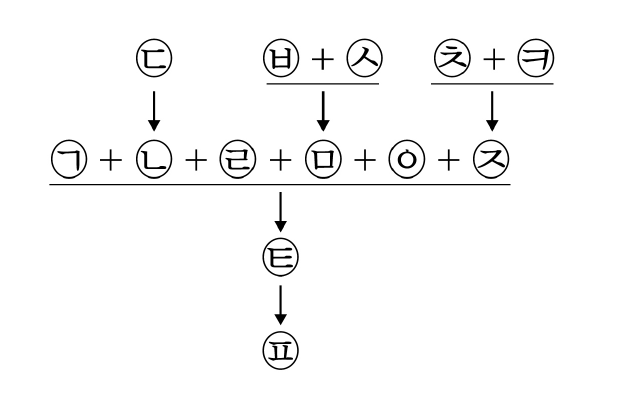
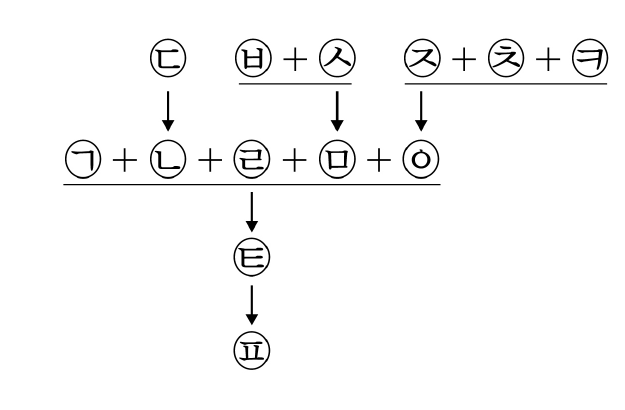
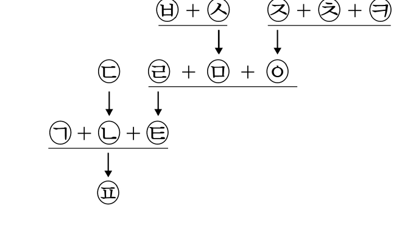
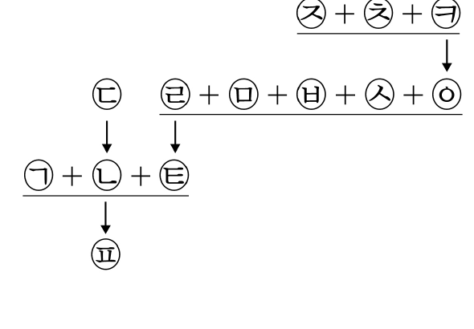
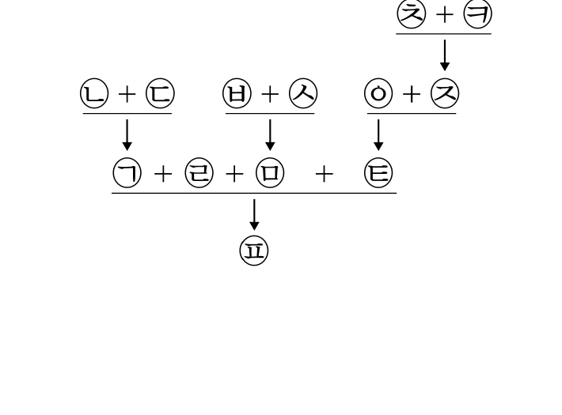
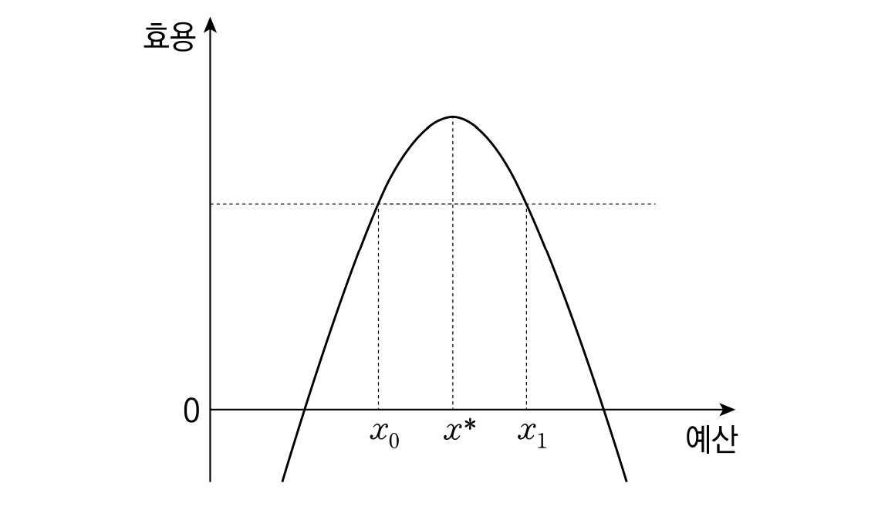
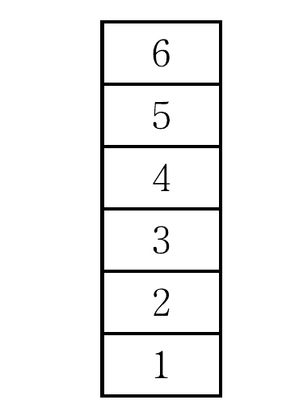
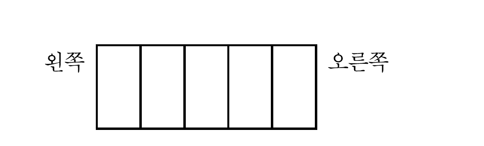

# 01 - RA (2023)

다음으로부터 추론한 것으로 옳은 것만을 <보기>에서 있는 대로 고른 것은?

## 제시문

X국의 A법 제2조 제1항은 "'근로자'라 함은 직업의 종류를 불문하고 임금·급료 기타 이에 준하는 수입에 의하여 생활하는 자를 말한다."라고 규정하고, 같은 법 제2조 제4항은 "근로자가 아니면 노동조합에 가입할 수 없다."라고 규정한다.

A법에서 말하는 '근로자'의 범위에 대하여 다음과 같이 서로 다른 견해가 제시된다.

갑 : A법에서 말하는 '근로자'는 사용자와 계약을 맺고, 그 사용자로부터 근로의 대가로 계속적·정기적인 금품을 받는 자이다.

을 : A법에서 말하는 '근로자'는 사용자와 계약을 맺고, 그 사용자로부터 근로의 대가로 계속적·정기적인 금품을 받는 자 또는 성과에 따른 수수료(인센티브)를 받는 자이다.

병 : 일시적으로 실업 상태에 있는 자나 구직 중인 자도 노동3권(단결권·단체교섭권·단체행동권)을 보장할 필요성이 있는 한 A법에서 말하는 '근로자'에 포함된다.

## 보기

ㄱ. 헬스장 사업자와 계약을 맺고 헬스장 회원들의 요청이 있으면 개인 레슨을 제공하고 회원들로부터 수수료를 받아 생활하는 자는, 갑에 따르면 노동조합에 가입할 수 있으나, 병에 따르면 가입할 수 없다.

ㄴ. 원격영어학원으로부터 근로의 대가로 계속적·정기적인 금품을 받지는 않으나 학원과 계약을 맺고 수강생 모집 실적에 따라 그 학원으로부터 수수료를 받아 생활하는 자는, 갑에 따르면 노동조합에 가입할 수 없으나, 을에 따르면 가입할 수 있다.

ㄷ. 원치 않는 해고를 당한 자는 을에 따르든 병에 따르든 노동조합에 가입할 수 없다.

## 선택지

(1) ㄴ

(2) ㄷ

(3) ㄱ, ㄴ

(4) ㄱ, ㄷ

(5) ㄱ, ㄴ, ㄷ

# 02 - RA (2023)

<주장>에 대한 반대 논거가 될 수 있는 것만을 <보기>에서 있는 대로 고른 것은?

## 제시문

[A법]

제1조 3심제의 최종심인 상고심은 대법원이 담당한다.

제2조 대법원은 상고 신청의 이유가 적절하지 않다고 인정되는 때에는 재판을 열지 않고 판결로 상고를 기각한다.

제3조 제2조에 따라 상고를 기각하는 판결에는 이유를 기재하지 않을 수 있다.

<주장>

A법 제2조는 대법원에 상고가 남용되는 상황을 예방하고 사건에 대한 신속한 처리를 통하여 적절한 신청 이유를 가진 당사자의 재판 받을 권리를 충실히 보장하기 위한 규정으로서 입법 취지 및 규정 내용 등에 비추어 그 합리성이 충분히 인정된다. A법 제3조는 제2조를 실현하기 위해 요구되는 절차적 규정이다. 즉 상고기각 판결에 이유를 기재하는 것은 대법원에 불필요한 부담만 가중하고 정작 재판이 필요한 사건에 할애해야 할 시간을 낭비하는 것이기 때문에 제3조의 취지 또한 정당화된다. 일반적으로 판결에 이유 기재를 요구하는 목적은 당사자에게 법원의 판단 과정을 납득시키고 불복수단을 강구하도록 하려는 것이나, 소송금액이 적은 사건처럼 경미한 사건을 신속하게 처리하기 위하여 판결이유를 생략하는 것이 인정되는 것과 같이, 이유 기재는 판결의 필수적인 요소가 아니라 법원이 그 여부를 선택할 수 있는 사항이다. 게다가 대법원이 존재한다고 하여 모든 사건에 대해 대법원에서 재판받을 기회가 보장되어야 하는 것은 아니기 때문에, 판결이유 기재를 비롯한 대법원의 재판에 대한 구체적인 제도의 내용은 대법원의 재량범위에 속한다.

## 보기

ㄱ. 재판을 받을 권리는 재판이라는 국가적 행위를 청구하는 권리이고, 청구권에는 청구에 상응하는 상대방의 의무가 반드시 결부되며 그 의무에는 청구에 응할 의무와 성실히 답할 의무가 포함된다.

ㄴ. 재판을 받을 권리는 재판절차에의 접근성 보장과 절차의 공정성 보장 등을 주된 내용으로 하는 기회 보장적 성격을 가지며, 법원의 판결의 정당성은 그 판결에 대한 근거제시에 의해 좌우된다.

ㄷ. 대법원의 판결은 국민이 유사한 사안을 해석하고 규범적 평가를 내리는 사실상의 판단기준으로서 기능하며, 판결의 결론뿐만 아니라 그 논증 과정 역시 동일한 기능을 수행한다.

## 선택지

(1) ㄱ

(2) ㄴ

(3) ㄱ, ㄷ

(4) ㄴ, ㄷ

(5) ㄱ, ㄴ, ㄷ

# 03 - RA (2023)

다음 논쟁에 대한 분석으로 옳은 것만을 <보기>에서 있는 대로 고른 것은?

## 제시문

갑 : 형사절차에서 추구해야 할 진실은 사건의 진상, 즉 '객관적 진실'이다. 그리고 객관적 진실을 발견하기 위해서 사건 당사자(피고인, 검사) 못지않게 판사의 적극적인 진실발견의 활동과 개입이 필요하다. 따라서 진실발견을 위해 필요한 경우, 중대한 절차 위반이 없다면 판사가 사건 당사자의 주장이나 청구에 제약을 받지 않고 직접 증거를 수집하거나 조사하는 것도 가능하다.

을 : '사건의 진상' 또는 '객관적 진실'은 오직 신(神)만이 알 수 있다. 사건 당사자들이 주장하는 사실과 제출된 증거들을 통해 판사가 내리는 결론도 엄밀히 말하면 판사의 주관적 진실에 불과하다. 다만 판사의 주관적 진실을 '판결'이라는 이름으로 신뢰하고 규범력까지 인정하는 이유는 그것이 단순히 한 개인의 주관적인 진실이 아니라, 공정한 형사절차를 통해 도출된 결론이기 때문이다. 따라서 형사절차에서 추구해야 하는 것은 '절차를 통한 진실'이고, 이를 위해 사건 당사자들이 법정에서 진실을 다툴 수 있는 공정한 기회가 보장되어야 한다. 이때 판사의 역할도 진실을 담보해 내기 위해 절차를 공정하고 엄격하게 해석·적용·준수하는 것이어야 한다. 즉 판사는 정해진 절차 속에서 행해지는 사건 당사자들의 주장과 입증을 토대로 중립적인 제3자의 지위에서 판단자의 역할을 수행해야 한다.

병 : 객관적 진실은 존재하고, 형사절차는 그러한 객관적 진실에 최대한 가까이 접근하고자 마련된 절차이다. 따라서 형사절차에서 사건의 진상을 명백히 밝힘으로써 객관적 진실을 추구해야 한다는 것에는 기본적으로 동의한다. 하지만 객관적 진실의 발견은 전적으로 사건 당사자들의 증거제출과 입증에 맡겨야 하고, 이러한 진실발견의 과정에 판사가 직접적·적극적으로 개입하는 것은 바람직하지 않다. 따라서 판사는 원칙적으로 제3자의 입장에서 중립적인 판단자의 역할을 수행하되, 인권침해를 통해서 얻어낸 객관적 진실은 정당성을 획득할 수 없으므로 판사는 형사절차의 진행 과정에서 인권침해가 발생하지 않도록 감시하고, 인권침해가 발생했을 경우에는 이를 바로잡는 역할과 의무도 함께 부담한다.

## 보기

ㄱ. 범죄를 조사하기 위해 구속기간 연장의 횟수 제한을 없애는 법률개정안에 대해 갑과 병은 찬성할 것이다.

ㄴ. '법이 정한 적법한 절차를 위반하여 수집된 증거는 설사 그것이 유죄를 입증할 유일하고 명백한 증거라 하더라도 예외 없이 유죄의 증거로 사용할 수 없다'는 법원칙에 대해 을은 찬성하지만, 갑은 반대할 것이다.

ㄷ. '피고인이 재판에 출석하지 아니한 때에는 특별한 규정이 없으면 재판을 진행하지 못한다'는 법원칙에 대해 을과 병은 찬성할 것이다.

## 선택지

(1) ㄱ

(2) ㄴ

(3) ㄱ, ㄷ

(4) ㄴ, ㄷ

(5) ㄱ, ㄴ, ㄷ

# 04 - RA (2023)

다음으로부터 추론한 것으로 옳은 것만을 <보기>에서 있는 대로 고른 것은?

## 제시문

X국은 지방정부의 공정한 업무 처리를 위하여 다음과 같이 감사청구제도 및 시민소송제도를 도입하였다.

○ 감사청구제도 개요

지방정부의 장의 업무 처리가 법률을 위반하거나 공익을 현저히 해친다고 인정되면 해당 지방의 18세 이상 시민은 해당 지방의 18세 이상 시민 100명 이상의 연대서명을 거쳐 행정부장관에게 감사를 청구할 수 있다. 감사 청구된 사항에 대하여 행정부장관은 감사를 한 후, 그 결과를 감사청구인과 해당 지방정부의 장에게 서면으로 알려야 한다. 행정부장관은 감사결과에 따라 필요한 경우 해당 지방정부의 장에게 필요한 조치를 요구할 수 있으며, 조치 요구를 받은 지방정부의 장은 이를 성실히 이행하고, 그 조치 결과를 해당 지방의회와 행정부장관에게 보고하여야 한다.

○ 시민소송제도 개요

지방정부의 장의 공금 지출에 관한 사항, 재산의 취득에 관한 사항 또는 지방세 부과·징수를 게을리한 사항에 대하여 감사청구를 한 시민은 그 감사청구의 결과에 따라 해당 지방정부의 장이 행정부장관의 조치 요구를 성실히 이행하지 아니한 경우, 그 감사 청구한 사항과 관련이 있는 위법한 행위나 업무를 게을리한 사실에 대하여 해당 지방정부의 장을 상대로 시민소송을 제기할 수 있다. 이 시민소송이 계속되는 중에 소송을 제기한 시민이 사망한 경우 소송의 절차는 중단되나, 시민소송 전에 이뤄진 감사청구의 연대서명자가 있는 경우 해당 연대서명자는 이 시민소송절차를 이어받을 수 있다.

## 보기

ㄱ. Y지방정부의 장이 Y지방정부의 재산 취득 시 법률을 위반하자, Y지방 시민 갑은 Y지방 시민 을 등의 연대 서명을 거친 후 단독으로 적법하게 감사청구를 하였고 행정부장관은 감사결과에 따른 조치 요구를 하였으나 Y지방정부의 장이 이를 이행하지 않았다. 이 경우 을은 Y지방정부의 장을 상대로 시민소송을 제기할 수 있다.

ㄴ. V지방의 시민 병이 V지방정부의 장의 공금 지출에 관한 사무처리가 공익을 현저히 해쳐 적법하게 감사청구를 하였고, 행정부장관은 감사결과에 따른 조치 요구를 하였으나 V지방정부의 장이 이를 이행하지 않았다. 이 경우 병은 V지방정부의 장을 상대로 공금 지출이 공익을 현저히 해쳤다는 이유로 시민소송을 제기할 수 있다.

ㄷ. W지방정부의 장이 지방세 부과를 게을리한 부분이 법률에 위반되어 W지방의 시민 정이 적법하게 감사청구를 하였고 감사결과에 따른 행정부장관의 조치 요구가 있었음에도 W지방정부의 장은 이를 이행하지 않았다. 이 경우 정은 감사 청구한 사항과 관련이 있는 위법한 행위에 대해서도 W지방정부의 장을 상대로 시민소송을 제기할 수 있다.

## 선택지

(1) ㄱ

(2) ㄷ

(3) ㄱ, ㄴ

(4) ㄴ, ㄷ

(5) ㄱ, ㄴ, ㄷ

# 05 - RA (2023)

[규정]의 적용으로 옳은 것만을 <보기>에서 있는 대로 고른 것은?

## 제시문

[규정]

제1조 행정청은 무도장업자의 위반사항에 대하여 아래의 <처분기준표 및 적용 방법>에 따라 처분한다.

제2조 무도장업자가 그 영업을 양도하는 경우에는 행정청에 신고하여야 하며, 양수인은 그 신고일부터 종전 영업자의 지위를 이어받는다. 종전 영업자에게 행한 제재처분의 효과는 그 제재처분일부터 1년간 양수인에게 미치고, 제재처분을 하기 위한 절차가 진행 중인 경우 그 절차는 양수인에 대하여 계속하여 진행한다. 다만, 양수인이 양수할 당시에 종전 영업자의 위반사실을 알지 못한 경우에는 그 절차를 계속하여 진행할 수 없다.

<처분기준표 및 적용 방법>

<table>
  <thead>
    <tr><th rowspan="2">위반사항</th><th colspan="3">처분기준</th></tr>
    <tr><th>1차위반</th><th>2차위반</th><th>3차위반</th></tr>
  </thead>
  <tbody>
    <tr><td>주류판매</td><td>영업정지 1개월</td><td>영업정지 3개월</td><td>영업정지 5개월</td></tr>
    <tr><td>접대부 고용</td><td>영업정지 2개월</td><td>영업정지 5개월</td><td>등록취소</td></tr>
    <tr><td>호객행위</td><td>시정명령</td><td>영업정지 10일</td><td>영업정지 20일</td></tr>
  </tbody>
</table>

가. 위반사항이 서로 다른 둘 이상인 경우(어떤 위반행위에 대하여 제재처분을 하기 위한 절차가 진행되는 기간 중에 추가로 다른 위반행위가 있는 경우 포함)로서 그에 해당하는 각각의 처분기준이 다른 경우에는 전체 위반사항 또는 전체 위반행위에 대하여 하나의 제재처분을 하되 각 위반행위에 해당하는 제재처분 중 가장 무거운 것 하나를 택한다.

나. 어떤 위반행위에 대하여 제재처분을 하기 위한 절차가 진행되는 기간 중에 위반사항이 동일한 위반행위를 반복하여 한 경우로서 처분기준이 영업정지인 때에는 각 위반행위에 대한 제재처분마다 처분기준의 2분의 1씩을 더한 다음 이를 모두 합산하여 처분한다.

다. 위반행위의 차수는 최근 1년간 같은 위반행위로 제재처분을 받은 횟수의 순서에 따르고, 이 경우 기간의 계산은 위반행위에 대하여 제재처분을 받은 날과 그 처분 후 같은 위반행위를 하여 적발된 날을 기준으로 한다.

## 보기

ㄱ. 무도장업자 갑이 주류판매로 2019. 6. 20. 영업정지 1개월을 받은 후, 이를 알고 있는 을에게 2020. 6. 30. 그 영업을 양도하고 신고를 마쳤는데, 을이 2020. 7. 25. 접대부 고용과 주류판매로 적발되었다면, 행정청은 을에게 영업정지 3개월의 처분을 한다.

ㄴ. 호객행위로 2020. 3. 15. 시정명령을 받은 무도장업자 병이 2020. 5. 15. 호객행위로 적발되었고 제재처분 전인 2020. 5. 30. 또 호객행위로 적발되었다면, 이 두 위반행위에 대하여 행정청이 병에게 처분할 영업정지 기간의 합은 45일이 된다.

ㄷ. 주류판매로 2019. 5. 10. 영업정지 5개월을 받은 무도장업자 정은 2020. 5. 5. 접대부 고용으로 적발된 후 그 제재처분을 받기 전에 이를 모르는 무에게 2020. 5. 7. 이 무도장을 양도하고 신고를 마쳤다. 무가 이 무도장 운영 중 2020. 5. 15. 주류판매로 적발되었다면, 행정청은 무에게 영업정지 2개월의 처분을 한다.

## 선택지

(1) ㄱ

(2) ㄴ

(3) ㄱ, ㄷ

(4) ㄴ, ㄷ

(5) ㄱ, ㄴ, ㄷ

# 06 - RA (2023)

<상황>에 대한 판단으로 옳은 것만을 <보기>에서 있는 대로 고른 것은?

## 제시문

[학칙]

제1조(학생의 징계) ① 학생이 학내에서 학생으로서의 품위를 손상하거나 학교의 명예를 실추시키는 등의 행위를 한 경우 학교장은 교육을 위하여 학생을 징계할 수 있다.

② 학교장은 학생을 징계하려면 교사를 참여시켜야 하고, 학생이나 보호자에게 의견을 진술할 기회를 주는 등 적정한 절차를 거쳐야 한다.

<상황>

P중학교 학생 갑은 집에서 실시간 원격수업을 받던 중 시민의 알권리를 위해 자신의 학교에서 조사 중인 체벌 사건의 내용을 SNS에 게시하여 사회적 파장을 일으켰다. P중학교는 이에 대하여 [학칙]에 따라 갑을 징계하려고 한다.

## 보기

ㄱ. [학칙]에 규정된 '학내'는 학교의 물리적 공간으로 보아야 한다는 주장은 징계를 반대하는 논거가 된다.

ㄴ. 공익을 위한 학생의 표현의 자유는 제한 없이 보장되어야 한다는 주장은 징계를 반대하는 논거가 된다.

ㄷ. 수업시간 동안의 학생의 모든 활동을 학내 활동으로 간주해야 한다는 주장은 징계를 찬성하는 논거가 된다.

## 선택지

(1) ㄱ

(2) ㄴ

(3) ㄱ, ㄷ

(4) ㄴ, ㄷ

(5) ㄱ, ㄴ, ㄷ

# 07 - RA (2023)

<견해>에 따라 <사례>에서 갑에게 부과되는 형의 범위로 옳은 것은?

## 제시문

[규정]

「범죄처벌법」제1조(절도죄) 타인의 물건을 훔친 자는 6년 이하의 징역에 처한다.

제2조(반복범) 징역 이상의 형을 받아 그 집행을 종료하거나 면제를 받은 후 2년 이내에 징역 이상에 해당하는 죄를 범한 자의 형의 기간 상한은 그 죄의 형의 기간 상한의 1.5배로 한다.

「절도범죄처벌특별법」제1조(절도반복범) 절도죄로 두 번 이상의 징역형을 받은 자가 다시 절도죄를 범한 경우에는 2년 이상 20년 이하의 징역에 처한다.

<견해>

견해1 :「범죄처벌법」에서 '형의 집행을 종료한 후'란 형의 집행 종료일 이후를 의미한다고 해석하여야 하므로 반복범의 기간 2년을 계산하는 시작점은 형의 집행 종료일 다음날이 되어야 한다.

견해2 :「범죄처벌법」에서 '형의 집행을 종료한 후'란 문언 그대로 형의 집행이 종료된 출소 이후를 의미한다고 해석하여야 하므로 반복범의 기간 2년을 계산하는 시작점은 형의 집행 종료 당일이 되어 종료 당일도 2년의 기간에 포함된다.

견해A :「절도범죄처벌특별법」제1조는「범죄처벌법」제2조와 별개의 규정이므로 절도반복범에 해당하는 경우,「절도범죄처벌특별법」이 따로 규정한 형벌의 범위 내에서만 형이 부과되어야 한다.

견해B :「절도범죄처벌특별법」의 절도반복범은 절도범에 대한 가중처벌이므로 이 법에 따라 처벌하고, 이어「범죄처벌법」의 반복범에도 해당하면 그 법에 따라 다시 가중처벌해야 한다.

<사례>

갑은 절도죄로 징역 6월을 선고받아 2014. 3. 15. 형집행이 종료되었고 이후 다시 저지른 절도죄로 징역 1년을 선고받아 2017. 9. 17. 형집행이 종료되었는데 다시 2019. 9. 17. 정오 무렵에 절도를 저질렀다(기간 계산에 있어서 시작일은 하루로 계산한다).

## 선택지

(1) 견해1과 견해A에 따르면, 징역 2년 이상 30년 이하

(2) 견해1과 견해B에 따르면, 징역 2년 이상 30년 이하

(3) 견해2와 견해A에 따르면, 징역 2년 이상 30년 이하

(4) 견해2와 견해A에 따르면, 징역 9년 이하

(5) 견해2와 견해B에 따르면, 징역 2년 이상 30년 이하

# 08 - RA (2023)

갑, 을, 병이 언급한 모든 사항을 충족하는 A 조항의 내용으로 가장 적절한 것은?

## 제시문

'알선'이란 어떤 사람과 그 상대방 간에 일정한 사항을 중개하여 편의를 도모하는 것을 의미한다. X국「범죄법」A 조항은 특정한 알선행위를 처벌하고 있다.

갑 : 공무원 신분을 가지지 않은 사람도 학연, 지연 등 개인의 영향력을 이용하여 공무원의 직무에 영향을 미칠 수 있으므로, A 조항은 이러한 사람의 알선행위도 처벌한다.

을 : 공무원의 직무집행에 대한 사회적 신뢰 보호가 중요하므로, A 조항은 실제로 알선행위를 하였는지와 상관없이 공무원의 직무에 관하여 알선 명목으로 자신의 이익을 추구하는 행위를 처벌한다.

병 : 선의의 알선행위를 금지할 필요는 없으므로, A 조항은 자신의 이익을 취득하기 위한 공무원의 직무에 관한 알선행위를 금지한다. 이때 A 조항은 일정한 예방 효과를 거두기 위해서 알선에 관련하여 취득된 재산을 보유하지 못하도록 강제하고 있다.

## 선택지

(1) 공무원의 직무에 속한 사항의 알선에 관련하여 금품이나 이익을 받거나 받기로 약속한 사람은 5년 이하의 징역 또는 1천만 원 이하의 벌금에 처한다.

(2) 금품이나 이익을 받거나 받기로 약속하고 공무원의 직무에 속한 사항에 관하여 알선한 사람은 5년 이하의 징역에 처하고, 이로 인하여 취득한 재산은 몰수한다.

(3) 공무원이 그 지위를 이용하여 다른 공무원의 직무에 속한 사항의 알선에 관련하여 금품이나 이익을 받거나 받기로 약속한 사람은 5년 이하의 징역 또는 1천만 원 이하의 벌금에 처한다.

(4) 공무원의 직무에 속한 사항의 알선에 관련하여 금품이나 이익을 받거나 받기로 약속한 사람은 5년 이하의 징역 또는 1천만 원 이하의 벌금에 처하고, 이로 인하여 취득한 재산은 몰수한다.

(5) 공무원의 직무에 속한 사항의 알선에 관련하여 금품이나 이익을 제공하거나 제공의 의사를 표시한 사람은 5년 이하의 징역 또는 7년 이하의 자격정지에 처하고, 이로 인하여 취득한 재산은 몰수한다.

# 09 - RA (2023)

<견해>에 대한 평가로 옳은 것만을 <보기>에서 있는 대로 고른 것은?

## 제시문

[규정]

제1조(정의) '약사(藥事)'란 의약품·의약외품의 제조·조제·보관·수입·판매[수여(授與)를 포함]와 그 밖의 약학 기술에 관련된 사항을 말한다.

제2조(의약품 판매) 약국 개설자가 아니면 의약품을 판매하거나 판매할 목적으로 취득할 수 없다. 다만, 의약품의 제조업 허가를 받은 자가 제조한 의약품을, 의약품 제조업 또는 판매업의 허가를 받은 자에게 판매하는 경우에는 그러하지 아니하다.

<사례>

P회사는 의약품 제조업의 허가와 의약품 판매업의 허가를 각각 받아 의약품 제조업자와 의약품 도매상의 지위를 동시에 가지고 있다. P회사는 의약품취급방법 위반으로 제조업자의 지위에서 의약품 판매 정지 처분을 받았다. 이와 관련하여 P회사가 의약품 제조업자의 지위에서는 의약품을 출고하고, 의약품 도매상의 지위에서는 그 의약품을 입고한 경우가 이 규정에 따른 '판매'에 해당하는지에 대해 다음과 같이 견해가 대립한다.

<견해>

견해1 : 제2조는 엄격한 관리를 통하여 의약품이 비정상적으로 거래되는 것을 막으려는 취지이다. 의약품 회사가 제조업과 도매상 허가를 모두 취득하였더라도 의약품이 제조업자로부터 도매상으로 이동한 경우는 그 지위가 구분되는 상대방과의 거래로 볼 수 있으므로, '판매'에 해당한다.

견해2 : 일반적으로 판매란 값을 받고 물건 등을 남에게 넘기는 것을 의미하는 것으로 물건 등을 넘기는 자와 받는 자를 전제하는 개념이다. 의약품 회사가 제조업의 허가와 도매상의 허가를 모두 취득하였더라도 제조업자로서 제조한 의약품을 도매상의 지위에서 입고하여 관리하는 것은 동일한 회사 내에서의 이동일 뿐이고, 독립한 거래 상대방이 존재하는 것이 아니므로 '판매'에 해당하지 않는다.

## 보기

ㄱ. [규정]에서 의약품 도매상이 되려는 자는 시장·군수·구청장의 허가를 받아야 하고, 제조업자가 되려는 자는 식품의약청장의 허가를 받아야 한다는 별도의 규정이 있다면 견해1은 약화된다.

ㄴ. 제1조의 판매에 포함되는 '수여(授與)'의 개념에 거래 상대방과 관계없이 물건 자체의 이전(移轉)도 포함된다면 견해2는 강화된다.

ㄷ. 제2조의 입법취지에 따른 판매 개념이 일반 대중에게 의약품이 유통되는 것을 의미하는 것이라면 견해2는 강화된다.

## 선택지

(1) ㄴ

(2) ㄷ

(3) ㄱ, ㄴ

(4) ㄱ, ㄷ

(5) ㄱ, ㄴ, ㄷ

# 10 - RA (2023)

[규정]을 <사례>에 적용한 것으로 옳은 것만을 <보기>에서 있는 대로 고른 것은?

## 제시문

주식시장에서는 [규정]에 의하여 체결 가격(이하 가격이라 한다)을 결정한다.

[규정]

제1조 가격은 10분마다 결정한다.

제2조 직전 가격 결정 후 10분간의 매도·매수주문에 따라 새로운 가격을 결정한다.

제3조 호가(매도·매수하려는 사람이 표시하는 가격) 중 체결가능 수량이 가장 많은 호가를 가격으로 결정하여 거래가 체결된다. 이때 체결가능수량은 다음 ①과 ② 중에서 적은 것으로 한다.

① 해당 호가 이상의 매수주문 주식 수의 총합
② 해당 호가 이하의 매도주문 주식 수의 총합

제4조 가격이 결정되면 해당 가격의 체결가능수량은 그 가격에 전량 체결된다. 이때 그 체결가능수량이 매도주문 수량이면 해당 가격보다 높은 호가의 매수 수량부터, 매수주문 수량이면 해당 가격보다 낮은 호가의 매도 수량부터 먼저 체결된다.

<사례>

특정 시점에 A주식에 대한 주문은 다음과 같다. 이후 가격 결정 시점까지 갑 이외의 사람은 추가로 주문을 내지 않으며, 이미 낸 주문을 철회하지도 않는다(A주식의 호가별 차이는 50원이다).

<table>
  <thead>
    <tr><th>매도·매수 호가</th><th>매도주문 수량(주)</th><th>매수주문 수량(주)</th></tr>
  </thead>
  <tbody>
    <tr><td>10,550원 이상</td><td>0</td><td>0</td></tr>
    <tr><td>10,500원</td><td>20,000</td><td>8,400</td></tr>
    <tr><td>10,450원</td><td>14,000</td><td>（ ㉠ ）</td></tr>
    <tr><td>10,400원 이하</td><td>0</td><td>0</td></tr>
  </tbody>
</table>

## 보기

ㄱ. ㉠이 17,000이고 갑이 만약 10,500원에 4,000주 추가 매수주문을 내면 10,500원에 12,400주 전량이 체결된다.

ㄴ. 갑이 만약 10,500원에 8,000주 추가 매수주문을 내면 ㉠과 관계없이 10,500원에 16,400주 전량이 체결된다.

ㄷ. 갑이 만약 10,450원에 10,000주 추가 매도주문을 내고 10,450원에 매도주문된 24,000주 전량이 체결되었다면, ㉠은 15,700이 될 수 있다.

## 선택지

(1) ㄱ

(2) ㄴ

(3) ㄱ, ㄷ

(4) ㄴ, ㄷ

(5) ㄱ, ㄴ, ㄷ

# 11 - RA (2023)

다음 글에 대한 분석으로 옳은 것만을 <보기>에서 있는 대로 고른 것은?

## 제시문

[X국 세법의 부동산보유세율]

| 부동산 가격 | 세율 |
|---|---|
| 5억 원 이하 | $0.5\%$ |
| 5억 원 초과 10억 원 이하 | $1.5\%$ |
| 10억 원 초과 20억 원 이하 | $2.5\%$ |
| 20억 원 초과 | $3.5\%$ |

<상황>

회사 갑과 회사 을은 P그룹에 속하고, 회사 병과 회사 정은 Q일가의 가족이 운영하고 있다. P는 기업등록부에 그룹으로 등록되어 있으며, Q는 그룹으로 등록되어 있지 않다. X국의 현행 세법에 따르면 각 회사별로 보유하고 있는 부동산에 대하여 개별 과세한다. (P와 Q 자체는 부동산을 보유하고 있지 않다.)

<견해>

견해1 : 과세는 경제공동체 단위로 이루어져야 한다. 기업등록부에 등록된 하나의 그룹 내 속한 회사들은 경제공동체로 볼 수 있다. 예컨대 P그룹에 속한 회사 중 갑만이 10억 원의 부동산을 소유하는 경우의 총과세액과 갑, 을 각각 5억 원의 부동산을 소유하는 경우의 총과세액이 현행 세법에 따르면 달라지는데 이는 경제공동체라는 점이 반영되지 않으므로 부당하다. P그룹 내 각 회사의 부동산 소유 개별 가격에 관계 없이 합산 부동산 가격에 대해 과세해야 경제공동체라는 점이 반영된다. 즉, P그룹 내 회사들의 소유 부동산에 대해 합산과세하여야 한다.

견해2 : 과세는 경제공동체 단위로 이루어지는 것이 바람직하지만, 기업등록부에 등록된 그룹에 대해서만 부동산보유세 합산과세를 하는 경우에는 다음과 같은 문제점이 생긴다. 예컨대 Q일가가 운영하는 병과 정은 기업등록부에 그룹으로 등록된 회사가 아니므로 병과 정의 보유 부동산 가액은 과세 시 합산되지 않는다. P와 Q에 속한 각 회사들의 부동산 가액의 합이 같은 경우에는, P와 Q 모두 실질적으로 경제공동체의 속성을 가지고 있음에도 불구하고 P가 Q보다 세금을 더 내게 되어 불공평한 결과를 초래한다. 따라서 차라리 현행 세법에 따라 그룹 등록 여부와 무관하게 각 회사별로 개별과세하는 것이 옳다.

## 보기

ㄱ. P에 속한 회사들의 부동산 합산 가격이 5억 원 이하라면, 견해1에 의하여 과세하든 견해2에 의하여 과세하든 과세 총액이 달라지지 않는다.

ㄴ. P에 속한 회사들의 부동산 합산 가격이 20억 원을 초과한다면, 견해1에 의하여 과세하는 경우와 견해2에 의하여 과세하는 경우에 각 과세 총액이 같아지는 경우는 없다.

ㄷ. Q 등의 실질적인 경제공동체를 기업등록부에 등록된 그룹으로 보는 세법 개정이 이루어진다면, 견해2는 P에 대한 부동산보유세 합산과세에 반대하지 않을 것이다.

## 선택지

(1) ㄱ

(2) ㄴ

(3) ㄱ, ㄷ

(4) ㄴ, ㄷ

(5) ㄱ, ㄴ, ㄷ

# 12 - RA (2023)

다음으로부터 <사례>를 판단한 것으로 옳은 것만을 <보기>에서 있는 대로 고른 것은?

## 제시문

$X$를 하겠다고 약속하는 경우 일반적으로 $X$를 해야 할 도덕적 의무가 생겨난다. 하지만 이에 대한 예외가 있는데 그것은 $X$가 도덕적으로 옳지 않은 경우이다. 이 예외를 어떻게 설명할지에 대해서 갑과 을이 논쟁하였다.

갑: $X$를 하는 것이 도덕적으로 옳지 않을 때 $X$를 하겠다고 약속하는 것은 도덕적으로 옳지 않다. 예를 들어 어떤 사람을 살해하겠다는 약속이 옳지 않은 이유는, 살인 행위 자체가 도덕적으로 잘못되었기 때문이다. 일반적으로 약속을 한 사람은 그 약속을 지켜야 할 의무가 있지만, 그것이 도덕적으로 옳지 않은 약속일 경우에 그리고 그런 경우에만 그 약속을 지킬 의무가 생겨나지 않는다. 살인 약속은 살인 자체가 나쁘기 때문에 그 약속을 지켜야 할 의무가 없는 것이다.

을: $X$를 하기로 약속했다고 할 때 $X$를 하는 것이 나쁘다고 해서 $X$를 하기로 한 약속 역시 도덕적으로 나쁘다고 볼 수 없다. 우리는 약속을 하는 것과 그 약속을 지키는 것을 구별할 필요가 있다. 예를 들어 사람을 살해하는 것과 같이 $X$를 하는 것이 도덕적으로 옳지 않다고 하더라도, $X$를 하기로 한 약속을 수단으로 사용해서 선한 결과를 얻는다면 그 약속 자체는 오히려 도덕적으로 옳다고 볼 수 있다. 일반적으로 약속은 그 약속을 지켜야 할 의무를 부과하지만, 살인과 같이 $X$가 도덕적으로 옳지 않고 $X$를 하지 않을 의무가 $X$를 하기로 한 약속을 지키는 의무보다 더 강할 때 그 약속을 지켜야 할 의무가 사라지는 것이다.

<사례>

범죄 조직에 신분을 숨기고 잠입한 경찰관 A는 그 조직 내에서 신뢰를 얻게 되었다. A는 조직 두목인 B에게 접근하여 "현금 1억 원을 준다면 경쟁 조직의 두목을 살해하겠다."는 약속을 했다. 그 약속을 믿은 B는 A의 계좌로 1억 원을 송금했고, A는 계좌 추적을 통해서 B를 구속하고 범죄 조직을 일망타진했다.

## 보기

ㄱ. A가 B에게 한 약속이 도덕적으로 나쁜지에 대해 갑과 을은 의견을 달리할 것이다.

ㄴ. A가 B에게 한 약속을 지킬 의무가 있는지에 대해서 갑과 을은 의견을 달리할 것이다.

ㄷ. 만약 A의 약속이 "현금 1억 원을 준다면 내가 물구나무를 서겠다."라는 것이었다면, A가 이 약속을 지킬 의무가 있는지에 대해서 갑과 을은 의견을 달리할 것이다.

## 선택지

(1) ㄱ

(2) ㄷ

(3) ㄱ, ㄴ

(4) ㄴ, ㄷ

(5) ㄱ, ㄴ, ㄷ

# 13 - RA (2023)

다음 논쟁에 대한 분석으로 옳은 것만을 <보기>에서 있는 대로 고른 것은?

## 제시문

위험은 현실화될 때도 있고 안 그럴 때도 있다. 주식 투자에는 원금 손실의 위험이 따르며 실제로 위험이 현실화되어 원금 손실이 발생할 때도 있고 안 그럴 때도 있는 것이다. 후자처럼 현실화되지 않은 위험을 '순(純)위험'이라고 하는데, 타인에게 순위험만 안긴 행위도 도덕적으로 그른지를 놓고 갑～정이 논쟁을 벌였다.

갑: 타인에게 위험을 안긴 행위는 위험의 현실화 여부와 상관없이 당연히 그 자체로 도덕적으로 그른 거야. 누구든 위험을 떠안으면 그로 인해 그 사람은 일단 해악을 입게 되는 거야. 정비 부실로 추락 사고의 위험이 있는 비행기에 탑승한 승객을 생각해 봐. 비록 추락 위험이 현실화되지 않았고 그런 위험을 당사자가 몰랐다고 하더라도, 생명의 위협에 장시간 노출되었다는 사실 그 자체로 그 승객은 해악을 입었다고 말할 수 있지.

을: 하지만 순위험을 안긴 행위를 무작정 도덕적으로 비난하는 것은 잘못이야. 순위험을 안긴 행위가 도덕적으로 그르다 할 수 있는 경우는 그런 위험이 있다는 것을 알았다면 당사자의 자율적 행위 선택이 바뀔 수도 있는 경우로 한정하는 것이 옳아.

병: 그건 아니지. 만약 그런 식으로 범위를 한정하면, 직관에 어긋나는 사례가 많이 생겨날 거야. 혼수상태에 빠진 사람이나 갓난아기에게 순위험을 안긴 행위도 도덕적으로 잘못일 때가 있잖아. 하지만 그런 사람들은 애초에 자율적 선택 능력이 없으니 선택이 바뀔 일도 없지 않겠어?

정: 내 생각은 달라. 어떤 자동차가 신호 위반을 했는데 길을 건너던 행인이 간신히 피했다고 해 봐. 비록 교통사고의 위험이 현실화되지는 않았지만, 그 행인이 상당한 정신적 충격을 입었을 수 있어. 순위험의 경우에는 이처럼 어떤 부수적인 해악이 실제로 발생했을 때만 도덕적으로 그르다고 해야 한다고 생각해.

## 보기

ㄱ. 갑과 병은 혼수상태에 빠진 사람에게 순위험을 안긴 행위가 도덕적으로 그를 수 있다는 것을 인정한다.

ㄴ. 순위험을 안긴 어떤 행위에 대해 을이나 정이 도덕적으로 그르다고 판단했다면, 갑도 그렇게 판단할 것이다.

ㄷ. 순위험을 안긴 행위가 타인의 자율적 선택을 침해했을 때 그 행위가 도덕적으로 그른지에 대해 을과 병의 의견이 다르다.

## 선택지

(1) ㄱ

(2) ㄷ

(3) ㄱ, ㄴ

(4) ㄴ, ㄷ

(5) ㄱ, ㄴ, ㄷ

# 14 - RA (2023)

다음 대화에 대한 분석으로 옳은 것만을 <보기>에서 있는 대로 고른 것은?

## 제시문

갑: 죽은 사람이 물리적으로 해를 입을 수는 없지만, 여전히 그에게 무언가 이롭거나 해로운 일을 할 수 있다고 잘못 생각하는 경우가 있어. 죽은 사람에 관해 거짓 소문을 비열하게 퍼뜨리는 것이 그에게 실제로 해를 끼치지는 않아. 다만 그와 관련된 살아 있는 사람들, 즉 그의 자손이나 그를 존경하는 다른 사람들의 마음에는 상처가 될 수 있지.

을: 하지만 살아 있는 사람들이 왜 마음에 상처를 입겠니? 비열한 소문이 고인에게도 해를 끼쳤다고 그들은 생각할 거야. 가령, 어떤 어머니가 생전에 자신이 살던 집을 절대 팔지 않겠다고 단언했고, 자신이 죽고 난 후에도 그럴 일이 없기를 희망했다고 해 보자. 어머니가 돌아가신 후 집을 상속받은 딸이 어머니의 뜻에 따라 집을 매각할 생각이 전혀 없다면, 그 이유는 그렇게 하면 어머니가 좋아하지 않는다고 생각하기 때문일 거야. 이 경우, 딸의 행동은 어머니가 생전에 갖고 있었지만 현존하지 않는 욕구를 실현한 거야. 어떤 사람의 욕구 충족을 돕는 일은 그 사람의 생사와 무관하게 그에게 이로운 일이 아닐까?

갑: 그렇지 않을 거야. 과거에 있었던 것이든 미래에 있을 것이든, 현존하지 않는 욕구는 언제 충족되더라도 그 사람에게 이로울 리 없어. 딸의 행동은 돌아가신 어머니에게 이롭지도 해롭지도 않다고 보아야 하는 게 맞지.

을: 그럼 이런 사례는 어떨까? 부모가 스무 살 아들에게 앞날을 대비하여 전문직 자격증을 따라고 권하지만, 아들은 지금 돈에 대한 욕구는 전혀 없고 봉사활동을 하고 싶어 해. 부모는 몇 년 안에 아들의 마음이 분명히 바뀌어 돈을 원하게 될 것이라고 예측하면서, 그때 가면 자격증을 따지 않은 것을 후회하게 될 것이라고 말하지. 고민 끝에 아들은, 여전히 돈에 대한 욕구는 없지만, ㉠ 부모의 예측에 동의하면서 지금 자신이 해야 할 일은 자격증을 따는 것이라고 판단하지.

## 보기

ㄱ. ㉠이 합리적이라고 인정된다면, 갑의 주장은 약화된다.

ㄴ. 시신을 훼손하는 행위가 죽은 당사자에게 해를 입히는 행위인지에 대해 갑과 을의 견해는 같다.

ㄷ. 을은 어떤 사람에게 이롭거나 해로운 일이 그 사람의 욕구 충족과 관련이 있다고 주장하지만, 갑은 이 주장에 동의하지 않는다.

## 선택지

(1) ㄱ

(2) ㄴ

(3) ㄱ, ㄷ

(4) ㄴ, ㄷ

(5) ㄱ, ㄴ, ㄷ

# 15 - RA (2023)

다음 논쟁에 대한 분석으로 옳은 것만을 <보기>에서 있는 대로 고른 것은?

## 제시문

인간의 행동을 예측하는 인공지능 로봇을 설계하기 위해 어떤 방법을 택해야 하는지에 대해서 논쟁이 있다.

갑: 사람들은 인간의 내면적 상태에 대한 이해를 통해 인간의 행동을 성공적으로 예측할 수 있다고 믿는다. 하지만 직접 관찰되지 않는 내면적 상태를 이해하는 데 어떠한 방식이 필요한지 정확히 알 수 없다. 따라서 인간의 내면적 상태에 대한 이해를 배제하고 행동을 예측하는 방식이 필요하다. 이때 우리가 취할 수 있는 방식은 인공지능 로봇이 빅데이터를 활용하여 인간이 주어진 상황에서 어떠한 행동을 하는지에 대한 정교한 패턴을 스스로 찾아내도록 설계하는 것이다.

을: 갑의 방식은 인간의 행동을 성공적으로 예측할 수 있다고 보기 어렵다. '만일 ～라면'이라는 수많은 가정에 입각해 이루어지는 인간의 행동을 정확하게 예측하기 위해서는 다른 접근이 필요하다. 예측의 성공률을 높이기 위해서는 주어진 상황에서 가능한 행동을 사전에 입력해 주어야 한다. 모든 인간은 불이익을 피하기 위해 사회에서 정해진 규범에 따라 행동하는 경향이 있다. 따라서 인공지능 로봇을 설계할 때 인간의 가능한 행동을 제한하는 규범에 대한 정보를 입력하면 인간의 행동에 대한 예측의 성공률을 더 높일 수 있다.

병: 갑과 을의 방식을 따르더라도 인간의 행동을 성공적으로 예측하기 어렵다. 인간의 행동은 여러 내면적 상태가 원인이 되어 나타난다. 따라서 갑과 을의 방식을 모두 적용하더라도 예측이 틀릴 수 있다. 인간은 자신에게 불이익이 일어날 행동이 무엇인지 알면서도 더 큰 욕구에 의해 규범을 지키지 않는 경우가 있다. 따라서 설계의 과정이 복잡하고 비효율적이더라도 규범에 대한 정보뿐만 아니라 의도나 욕구와 같은 내면적 상태까지 고려하여 인간의 행동을 예측하도록 설계해야 한다.

## 보기

ㄱ. 인공지능 로봇이 인간의 내면적 상태를 이해하지 못한다면 인간의 행동을 예측할 수 없다는 것에 대해 갑은 동의하지만 병은 동의하지 않는다.

ㄴ. 특정 상황에서 인간의 행동에 패턴이 존재한다는 것에 대해 갑과 을은 동의한다.

ㄷ. 인간의 행동을 예측하는 데에는 규범에 대한 정보를 고려하는 것이 필요하다는 것에 대해 을과 병은 동의한다.

## 선택지

(1) ㄱ

(2) ㄴ

(3) ㄱ, ㄷ

(4) ㄴ, ㄷ

(5) ㄱ, ㄴ, ㄷ

# 16 - RA (2023)

다음으로부터 추론한 것으로 옳은 것만을 <보기>에서 있는 대로 고른 것은?

## 제시문

조건문 "만일 $P$라면 $Q$일 것이다."에서 전건 $P$가 실제 사실이 아닌 거짓인 조건문을 반사실문이라고 한다. 예를 들어 다음의 조건문 (1)은 억만장자가 아닌 내가 억만장자인 상황을 가정하기 때문에 반사실문이다.

(1) 만일 내가 억만장자라면 나는 가장 비싼 스포츠카를 구입할 것이다.

(1)은 '가능세계' 개념을 통해서 분석될 수 있는데, 가능세계는 세계가 현실과 다르게 될 수 있는 가능한 방식을 말한다. 이에 따르면, 내가 억만장자인 수많은 가능세계 중 현실 세계와 가장 유사한 가능세계(즉, 현실 세계처럼 스포츠카를 판매하는 사람이 있는 등)에서, 내가 가장 비싼 스포츠카를 구입한다면 (1)은 참이고, 그렇지 않다면 거짓이다.

하지만 다음 반사실문을 보자.

(2) 만일 철수가 둥근 사각형을 그린다면 기하학자들은 놀랄 것이다.

개념적으로는 가능한 (1)의 전건과 달리, (2)의 전건은 개념적으로 불가능한 상황을 나타내고 있다. 이러한 반사실문은 반가능문이라고 한다. 반가능문의 경우 전건이 성립하는 가능세계란 존재하지 않기에, 가능세계를 통한 분석을 적용할 수 없다. 하지만 여전히 (2)가 참이라는 직관이 있으며, 이를 설명할 수 있는 개념적 도구가 필요하다.

이를 설명하기 위해 '불가능세계'라는 개념이 제안되었다. 불가능세계는 세계가 개념적으로 불가능하게 될 수 있는 방식을 말한다. 그 방식은 다양할 수 있다. 예를 들어 총각인 철수가 여자인 것과 철수가 둥근 사각형을 그리는 것은 모두 개념적으로 불가능하지만, 이 둘은 다른 불가능한 상황들이며, 이에 따라 각각이 성립하는 서로 다른 불가능세계가 있을 수 있다. 이때, 철수가 둥근 사각형을 그리는 수많은 불가능세계 중 현실 세계와 가장 유사한 불가능세계에서 기하학자들이 놀란다면 (2)는 참이고, 그렇지 않다면 거짓이다.

## 보기

ㄱ. 스포츠카를 판매하는 사람이 있는 불가능세계도 있다.

ㄴ. (2)가 참이라면, 철수가 둥근 사각형을 그리는 모든 불가능세계에서 기하학자들이 놀란다.

ㄷ. "만일 대한민국의 수도가 서울이라면 나는 억만장자일 것이다."는 반사실문에 속하지만 반가능문에 속하지는 않는다.

## 선택지

(1) ㄱ

(2) ㄴ

(3) ㄱ, ㄷ

(4) ㄴ, ㄷ

(5) ㄱ, ㄴ, ㄷ

# 17 - RA (2023)

다음 글에 대한 분석으로 옳은 것만을 <보기>에서 있는 대로 고른 것은?

## 제시문

어떤 학자들은 한국어 연결사 '또는'이 두 가지 다른 종류의 의미를 표현하는 데 사용되는 애매한 용어라고 주장한다. <u>㉠ 이러한 입장</u>에 따르면, 다음 두 문장에서 사용되는 '또는'의 문자적 의미는 다르다.

(1) 철수는 노트북 또는 핸드폰을 가지고 있다.
(2) 후식으로 커피 또는 녹차를 드립니다.

(1)의 경우 '또는'이 철수가 노트북과 핸드폰을 모두 가지고 있는 경우에도 참이 되는 포괄적 의미로 사용된 반면, (2)의 경우 '또는'은 후식으로 커피와 녹차를 모두 주는 경우 문장이 거짓이 되는 배타적 의미로 사용되었기 때문이다.

하지만 이는 <u>㉡ 문자적 의미와 함의를 구분하지 못한 주장</u>이며, 이를 구분하면 '또는'이 애매한 용어가 아니라는 이론을 구성할 수 있다. 다음 문장을 보자.

(3) 어떤 회원들은 파티에 참석할 수 있다.

문장 (3)이 문자적 의미로서 표현하는 내용은 <어떤 회원들은 파티에 참석할 수 있다>이다. 그런데 (3)을 사용하는 많은 경우, '어떤'이란 단어를 사용하는 화자의 의도는 <모든 회원들이 파티에 참석할 수 있는 것은 아니다>라는 내용 역시 청자에게 전달하는 것이다. 하지만 이는 문자적 의미가 아니라 함의로서 전달되는 것이다. 왜냐하면 문자적 의미와 달리 특정 맥락에서 전달된 함의의 경우, 그 함의된 내용의 부정을 표현하는 문장을 원래 문장 뒤에 나열해도 두 문장 사이에서 어떤 논리적 모순도 발생하지 않기 때문이다. 즉, "어떤 회원들은 파티에 참석할 수 있다. 물론 모든 회원들이 파티에 참석할 수도 있다."에서는 어떤 모순도 발생하지 않는다.

마찬가지로 ㉢ '또는'의 문자적 의미는 포괄적 의미일 뿐, 배타적 의미는 함의로서 전달되는 것이라는 진단이 가능하다. 즉, "후식으로 커피 또는 녹차를 드립니다. 물론 둘 다 드릴 수도 있습니다."에서는 어떤 모순도 나타나지 않고, 따라서 우리는 (2)의 사용을 통해 전달된 내용 <커피와 녹차를 모두 드릴 수는 없다>가 원래 문장의 문자적 의미가 아니라 함의였다고 결론 내릴 수 있다.

## 보기

ㄱ. "$p$, $q$, $r$, $s$가 모두 참인 문장일 때, 문장 '$p$ 또는 $q$'는 참이지만 문장 '$r$ 또는 $s$'는 거짓이라면, 전자와 후자의 문장에서 사용된 '또는'이 다른 의미를 나타낸다."라는 것은 ㉠과 상충하지 않는다.

ㄴ. ㉡에 대한 필자의 설명에 따르면, "철수는 밥과 빵을 먹었다."라는 문장을 사용하여 <철수는 빵을 먹었다>라는 내용을 함의로서 전달할 수는 없다.

ㄷ. ㉢에 따르면, <후식으로 커피와 녹차 모두를 드릴 수 있다>라는 내용은 (2)의 문자적 의미에 포함되는 것이 아니라 함의로서 전달되는 것이다.

## 선택지

(1) ㄱ

(2) ㄷ

(3) ㄱ, ㄴ

(4) ㄴ, ㄷ

(5) ㄱ, ㄴ, ㄷ

# 18 - RA (2023)

다음 논쟁에 대한 분석으로 옳은 것만을 <보기>에서 있는 대로 고른 것은?

## 제시문

갑: 소설 『주홍색 연구』에서 "홈즈는 탐정이다."라는 진술이 명시적으로 나타나며, 따라서 <홈즈는 탐정이다>는 이 소설에서 명시적으로 참인 명제이다. 그런데 『주홍색 연구』의 어디에도 홈즈의 콧구멍 개수에 대한 명시적인 진술은 나타나지 않는다. 하지만 작품 내에서 홈즈는 사람이며, 사람은 보통 두 개의 콧구멍을 가지고 있다는 것은 상식이므로, <홈즈의 콧구멍은 두 개다>와 같은 명제 역시 『주홍색 연구』에서 참이 된다. 사실, 명시적인 진술로 표현되지 않았지만, <지구는 둥글다>, <모든 사람은 죽는다>와 같은, 『주홍색 연구』에서 암묵적으로 참인 명제들은 많이 있다.

을: 허구에서 암묵적으로 참이 되는 명제가 있다는 것을 받아들이는 것은 불합리한 귀결을 낳는다. 우선 허구 작품들의 속편이 나타날 수 있다는 것에 주목해 보자. 속편은 전작에 명시되지 않은 것들의 참을 결정하는 힘을 갖는다. 예를 들어, 소설 『호빗』에서는 빌보가 소유한 반지가 무엇인지 명시되지 않지만, 그 속편들인 반지의 제왕 시리즈에서 그 반지가 절대 반지라는 것이 명시된다. 이 경우 빌보가 소유한 반지가 절대 반지라는 것은 『호빗』에서도 참이라고 보는 것이 합당하다. 이제 다음을 가정해 보자. 코난 도일은 『주홍색 연구』의 속편 『빨간색 연구』를 썼으며, 그 소설에서는 "사실 태어날 때부터 세 개의 콧구멍을 가졌던 홈즈는 냄새를 잘 맡을 수 있었다."라는 명시적 진술이 나타난다. 이때, <홈즈의 콧구멍은 세 개다>라는 명제가 『빨간색 연구』뿐만 아니라 『주홍색 연구』에서도 명시적 참이라고 보는 것이 합당할 것이다. 하지만 만일 <홈즈의 콧구멍은 두 개다>가 『주홍색 연구』에서 암묵적으로 참이라면, 『주홍색 연구』에서 홈즈의 콧구멍 개수는 두 개인 동시에 세 개가 되어야만 할 것이다. 이는 명백히 불합리한 귀결이다. 따라서 허구에서 명시적 참 이외에 암묵적 참과 같은 것은 없다고 결론 내릴 수 있다.

## 보기

ㄱ. 갑은, 어떤 명제도 특정 허구에서 참이거나 거짓 둘 중 하나여야 한다는 것을 전제하고 있다.

ㄴ. 을에 따르면, 명제 <홈즈의 콧구멍은 두 개다>는 『주홍색 연구』에서 참이었다가 나중에 거짓으로 바뀔 수도 있다.

ㄷ. 을에 따르면, "지구는 둥글다."라는 진술이 『주홍색 연구』에 명시되지 않은 경우에도, 명제 <지구는 둥글다>가 『주홍색 연구』에서 참이 되는 상황이 있을 수 있다.

## 선택지

(1) ㄱ

(2) ㄷ

(3) ㄱ, ㄴ

(4) ㄴ, ㄷ

(5) ㄱ, ㄴ, ㄷ

# 19 - RA (2023)

다음 논증의 구조를 가장 적절하게 분석한 것은?

## 제시문

㉠ 철학에서 중요한 문제로 다루어져 온 자의식이 유용하다면, 그것은 그 자체로 유용한 것이거나 유용한 다른 뭔가를 낳는 것이다. ㉡ 알고 보면 자의식은 그 자체로는 전혀 유용하지 않다. ㉢ 자의식은 그 자체로는 번민만 일으키기 때문이다. ㉣ 자의식이 자신과 다른 유용한 것을 낳는다면, 자의식이 낳는 유용한 것은 마음 안에 있거나 마음 밖에 있다. ㉤ 자의식은 마음 밖에 있는 어떤 유용한 것도 낳지 못한다. ㉥ 자의식이 마음 밖에 뭔가를 낳을 수 있다면, 자의식이 인과적 영향을 미칠 수 있는 것이 마음 밖에 있어야 한다. 하지만 ㉦ 자의식이 인과적 영향을 미칠 수 있는 것은 모두 마음 안에 있다. 게다가 ㉧ 자의식이 마음 안에 낳는 유용한 것이란 존재하지 않는다. ㉨ 마음 안에 있는 유용한 것이란 결국 마음 안의 좋은 상태와 다르지 않다. ㉩ 이런 상태들이 생겨나기 위해서는 자의식이 필요치 않다. ㉪ 어떤 것이 생겨나기 위해서 자의식이 필요치 않다면 그것은 자의식이 낳는 것이 아니다. 결국 ㉫ 자의식은 유용한 다른 어떤 것도 낳지 않는다. 그러니까 ㉬ 자의식은 전혀 유용하지 않은 것이다.

## 선택지

(1)

(2)

(3)

(4)

(5)

# 20 - RA (2023)

다음 대화에 대한 분석으로 옳은 것만을 <보기>에서 있는 대로 고른 것은?

## 제시문

갑 : 거짓말이란 거짓을 상대방이 참이라고 믿게 하려는 의도를 가진 말이지. 이에 비해, 참이지만 듣는 사람이 오해하기 쉬운 말을 '오도적인 말'이라고 하지. 이 오도적인 말이 거짓이 아니라 참이라고 해서 거짓말보다 도덕적으로 덜 비난받아야 할까?

을 : 그렇지 않아. 왜냐하면 거짓말은 상대방을 속이려는 의도가 없는 경우도 있기 때문이지. 예를 들어, 모든 사람이 A가 살인범이라는 것을 알고 있고 A 역시 모든 사람이 그렇게 생각한다는 걸 알고 있지만, A는 '나는 살인범이 아니다'라고 뻔뻔하게 잡아떼는 경우도 있지.

갑 : 실제로 B를 살해한 A가 '나는 B를 죽이지 않았습니다'라고 거짓말을 한 경우와 '나는 내 목숨을 걸고 B를 두 번이나 구한 적이 있습니다'라고 오도적인 말을 한 경우를 비교해 보자. A가 두 경우 모두에서 듣는 사람이 A를 살인자가 아니라고 믿기를 의도했으므로, 거짓을 믿게 하려 했다는 점에서는 똑같잖아. 그래서 나는 오도적인 말과 거짓말이 동일한 정도로 나쁘다고 생각해.

을 : 진실을 말하면서 상대방을 기만하려고 한다는 점에서 오도적인 말은 항상 나쁘지만, 거짓말은 그렇지 않을 수 있어. 어떤 사람이 한 말이 거짓으로 드러난 사실 자체가 도덕적으로 비난받아야 한다면, 과학자는 나쁜 일을 하고 있다고 말해야 할지도 몰라. 과학자의 예측 중에는 나중에 틀렸다고 밝혀지는 것이 있기 때문이지. 하지만 과학자가 애초에 진심으로 어떤 것을 말했다면, 그것이 나중에 거짓으로 드러난다고 해서 도덕적으로 비난받을 수는 없을 거야.

## 보기

ㄱ. 거짓말에는 상대방을 속이려는 의도가 있어야 한다는 점에 대해 갑은 동의하지만, 을은 동의하지 않는다.

ㄴ. 참으로 드러난 말 중에 도덕적으로 비난할 수 있는 것이 있다는 점에 대해 갑과 을은 동의한다.

ㄷ. 오도적인 말과 거짓말은 도덕적으로 나쁜 정도가 다르다는 점에 대해 갑과 을은 동의한다.

## 선택지

(1) ㄱ

(2) ㄷ

(3) ㄱ, ㄴ

(4) ㄴ, ㄷ

(5) ㄱ, ㄴ, ㄷ

# 21 - RA (2023)

다음 글에 대한 평가로 옳은 것만을 <보기>에서 있는 대로 고른 것은?

## 제시문

결정론은 인간의 마음 상태와 행위를 포함해 모든 사건이 이전 사건들에 의해 완전히 결정된다는 견해이다. 결정론하에서도 행위자가 한 일에 대해 도덕적 책임을 부과할 수 있을까? 그럴 수 없다고 주장하는 견해가 양립 불가론이다. 결정론을 받아들이면 자유의지가 존재할 여지가 없기 때문이다. 반면, 결정론을 받아들여도 누군가에게 도덕적 책임을 부과할 수 있다고 주장하는 견해가 양립론이다. 행위자의 마음 상태가 행위 발생의 원인이기만 하면, 어쨌거나 행위의 발생에 영향을 미쳤다고 말할 수 있고, 그러면 도덕적 책임을 부과하기에 충분하다는 것이다.

양립론자 갑은 사람들이 바로 그 점을 이해하지 못해 양립 불가론을 주장하는 것으로 판단하였다. 이에 갑은 다음 가설을 제시했다.

<가설>

결정론적 세계에서도 행위자의 마음 상태가 행위 발생에 영향을 미칠 수 있다는 사실을 인정하면, 양립론을 받아들일 가능성이 크다.

갑은 이 가설을 검증하기 위해 100명의 실험 대상자에게 아래 시나리오에 등장하는 우주가 실제로 존재한다고 가정할 때 [진술1]과 [진술2]에 대해 각각 동의하는지 동의하지 않는지 둘 중 하나로만 답하게 했다.

<시나리오>

생성소멸의 전 과정이 되풀이되는 우주가 있다. 이 우주에서는 과정이 되풀이될 때마다 모든 사건이 똑같이 발생하게끔 결정돼 있다. 이 우주에서 톰이라는 사람이 특정 시각에 특정 반지를 훔치기로 결심하고 실제로 훔친다. 과정이 되풀이될 때마다 톰은 똑같이 결심하고 똑같이 행동한다.

[진술1] 반지를 훔치겠다는 톰의 결심은 반지를 훔친 그의 행위에 영향을 미친다.

[진술2] 반지를 훔친 톰에게 도덕적 책임이 있다.

## 보기

ㄱ. [진술1]에 동의하지 않는 사람은 모두 양립 불가론자이며, [진술2]에 동의하는 사람은 모두 양립론자이다.

ㄴ. [진술1]과 [진술2]에 모두 동의하는 실험 대상자가 두 진술 중 어느 것에도 동의하지 않는 실험 대상자보다 훨씬 더 많다면, <가설>은 강화된다.

ㄷ. [진술2]에 동의하지 않은 실험 대상자 50명 중 거의 전부가 [진술1]에 동의하고, [진술2]에 동의한 실험 대상자 50명 중 거의 전부가 [진술1]에 동의하지 않는다면, <가설>은 약화된다.

## 선택지

(1) ㄱ

(2) ㄷ

(3) ㄱ, ㄴ

(4) ㄴ, ㄷ

(5) ㄱ, ㄴ, ㄷ

# 22 - RA (2023)

다음 글에 대한 평가로 옳지 않은 것은?

## 제시문

<u>㉠ 개념 역할 의미론</u>에 따르면, 단어의 의미 이해는 그 단어의 사용 규칙을 따를 줄 아는 능력에 의존한다. 단어의 사용 규칙을 따른다는 것은 단지 그 규칙대로 단어를 사용한다기보다 그 규칙에 대한 이해를 기반으로 사용한다는 것을 의미한다. 그렇다면, 단어의 사용 규칙을 이해하지 못하고 있다는 것은 곧 그 단어의 의미를 이해하지 못한다는 말이 된다.

하지만 이 이론을 반박하기 위해 <u>㉡ 다음 논증</u>이 제기되었다. 가령 '뾰족하다'라는 단어의 의미를 이해하려 한다고 해 보자. 이 이론에 근거할 때, 그 단어의 의미를 이해하려면 그 단어의 사용 규칙을 이해해야 한다. 그런데 그런 이해가 성립하려면, 우선 그 규칙이, 이를테면, <u>㉢ "'뾰족하다'는 무언가를 뚫을 수 있는 끝이 매우 가느다란 사물에 적용하라"</u>와 같이 언어적으로 명료하게 표현되어야 할 것이다. 하지만 문제는 이 규칙을 표현하는 데에도 여러 개의 단어가 사용되었다는 것이다. 이 규칙을 이해하려면 그런 여러 단어의 의미를 모두 이해해야 할 것이며, 예를 들어, 이 규칙에 들어 있는 '뚫다'의 의미를 이해하지 못한다면 이 규칙을 이해할 수 없을 것이다. 그렇다면 '뚫다'의 의미를 이해하기 위해 무엇이 필요한가? 바로 그 단어의 사용 규칙에 대한 이해이다. 그런데 '뚫다'라는 단어의 사용 규칙도 여러 단어로 구성되어 있을 것이고, 그 규칙을 이해하기 위해서는 그 규칙을 표현하는 데 사용된 단어들의 의미를 또 이해해야 할 것이며, 이런 식의 퇴행은 무한히 거듭될 것이다. 이런 퇴행이 일어난다는 것은 궁극적으로 우리가 '뾰족하다'라는 단어의 의미를 이해하지 못한다는 뜻이며, 그런 문제는 다른 모든 단어에 똑같이 발생할 것이다. 따라서 개념 역할 의미론을 받아들이면, 우리가 사용하는 그 어떤 단어에 대해서도 그 의미를 이해하는 사람은 아무도 없다는 매우 불합리한 결론을 얻게 된다.

## 선택지

(1) 한국인 못지않게 한국어를 완벽히 구사하는 인공지능이 등장하더라도, ㉠은 약화되지 않는다.

(2) 단어의 사용 규칙이 반드시 언어적으로 표현되어야 하는 것이 아니라면, ㉡은 약화된다.

(3) ㉢에 들어 있는 모든 단어의 의미를 이해하고 있는 사람이 실제로 있다면, ㉠은 강화된다.

(4) 어떤 진술 안에 의미를 이해하지 못하는 단어가 포함되어 있어도 그 진술의 의미를 이해하는 것이 가능하다면, ㉡은 약화된다.

(5) 어떤 단어의 의미를 이해하지 못하는 행위자가 그 단어를 사용 규칙대로 쓰고 있는 모습이 관찰되더라도, ㉠은 약화되지 않는다.

# 23 - RA (2023)

다음 글에 대한 분석으로 가장 적절한 것은?

## 제시문

즐거움에 대한 이론 A에 따르면, 즐거움이란 우리가 좋아하는 어떤 느낌, 즉 쾌감 자체이고, 고통이란 우리가 싫어하는 불쾌한 느낌이다. 한편, 이론 B에 따르면, 즐거움은 우리가 느끼는 쾌감과 상관이 없으며, 주체의 능력과 제반 조건이 그 능력이 발휘되는 대상과 서로 잘 맞을 때 생겨난다. 즉, 즐겁게 행위한다는 것은 주체가 좋은 조건에서 자기 능력에 걸맞은 일을 탁월하게 하는 것을 말한다. 반면, 고통은 주체의 능력과 조건이 능력 발휘의 대상과 서로 잘 맞지 않을 때 생겨난다. A는 즐거움과 고통에 동반되는 느낌에 호소한다는 점에서 직관적인 설득력을 지닌다. 하지만 B는 즐거움이나 고통은 느낌이 아니라 즐겁거나 고통스러운 활동을 특징짓는 적합성에 의해 설명되어야 한다고 주장한다. 최근 한 인터뷰에서 수학계의 오랜 난제를 해결한 탁월한 수학자 갑, 을, 병은 수학의 즐거움에 관해 다음과 같이 말했다.

갑 : 저는 이 해묵은 난제를 풀기 위해 오랫동안 준비해 왔습니다. 계획적으로 집중력을 기울여 매진했지요. 물론 숱한 어려움이 있었고 좌절도 있었죠. 때로는 고통스러웠어요. 하지만 자신을 믿고서 그 문제를 해결하는 과정은 정말 즐거운 경험이었습니다.

을 : 다년간의 집중적인 노력으로 결국 이 난제를 풀었습니다. 그 순간 짜릿하긴 했지요. 정말 고생했으니까요. 그러나 순간의 쾌감보다 갈피를 잡지 못하는 동안의 고통이 더 크게 느껴졌습니다. 차라리 저는 집중력이 필요 없는 쉬운 문제를 여럿 해결할 때 더 큰 쾌감을 느낍니다.

병 : 수학이 즐겁냐고요? 공부가 좋아서 하는 학생이 없듯이, 저에게 수학은 그저 업일 따름입니다. 특히 어려운 문제로 고민할 때는 고통스러웠죠. 의무감으로 열심히 하다 보니 수학을 잘하게 되었고 결국 집중적인 노력으로 그 난제를 해결할 수 있었습니다.

## 선택지

(1) A에 따르면, 어려운 문제를 집중하여 풀어낸 경험에서 을과 병은 모두 즐거움을 느끼지 못했다.

(2) B에 따르면, 을이 쉬운 문제를 풀 때의 즐거움은 갑의 즐거움에 못지않다.

(3) A와 B에 따르면, 을이 경험했다고 말하는 고통은 즐거움이다.

(4) A와 B에 따르면, 을이 쉬운 문제를 풀어낸 경험은 즐거운 것이다.

(5) A에 따르면, 병에게 수학은 즐겁지 않지만, B에 따르면, 병에게 수학은 즐거운 작업이다.

# 24 - RA (2023)

다음으로부터 추론한 것으로 가장 적절한 것은?

## 제시문

우리는 세상에 대해 여러 믿음을 갖는다. 믿음은 참일 수도, 거짓일 수도 있다. 거짓인 믿음은 지식이 될 수 없지만, 참인 믿음이라고 모두 지식은 아니다. 믿음이 형성된 경로와 참이 된 경로가 적절할 때만 지식이 된다. 고장이 나서 3시에 멈춘 시계를 보고 '지금 3시'라고 믿는다고 하자. 우연히 그때가 3시였더라도, 이 믿음은 지식이 아니고 운 좋은 참일 뿐이다. 그렇다면 믿음이 참인지 아닌지, 그리고 그것이 지식인지 아닌지가 그 믿음에 기반한 행동이 단순 행동이 아니라 '행위'인지 여부를 결정할 수 있을까? 이에 대해 세 견해 A, B, C가 있다.

A : 믿음이 참인지 거짓인지가 매우 중요하다. 이와 상관이 없는 행동은 행위일 수 없다. 갑이 '브레이크가 정상적으로 작동한다'고 믿고서 페달을 밟았다고 하자. 이 믿음이 참이라면 차가 설 것이지만, 거짓이라면 갑은 차를 세우지 못할 것이다. 이때 갑의 믿음이 정당한지를 따지기 전에 갑의 믿음이 참이기만 하면 차는 설 것이다. 참인 믿음으로부터 차를 세운 것만이 행위가 된다.

B : 무엇인가를 행위로 보느냐에서 중요한 것은 믿음이 있느냐 없느냐일 뿐 그 믿음이 참인지 아닌지는 아무 상관이 없다. 을은 오랫동안 차를 정비하지 않았다. 여러 주요 부품이 고장 난 것을 알고 있음에도 그는 '브레이크가 정상적으로 작동할 것'이라고 믿는다. 을은 갑자기 등장한 장애물을 보고서 브레이크 페달을 밟는다. 이때, 중요한 것은 을이 브레이크가 정상이라고 믿는다는 점이다. 을의 믿음이 참인지 여부는 페달을 밟는 것이 행위인지 아닌지와 상관이 없다. 브레이크가 실제로는 고장이 났더라도 을은 페달을 밟을 것이다.

C : 믿음이 지식인지 아닌지는 무엇이 행위인지 아닌지에 영향을 준다. 병은 브레이크가 고장난 차를 수리점에 맡겼다. 그런데 수리점 직원은 브레이크 페달과 연결된 선을 연료 펌프에 연결하여 페달을 밟으면 연료가 차단되게 하였다. 이를 모르는 병은 '페달을 밟으면 차가 설 것'이라고 믿는다. 하지만 이 믿음은 지식일 수 없다. 그가 아는 브레이크 작동 원리는 실제와 일치하지 않는다. 페달을 밟아 차가 멈췄더라도 그는 과연 차를 세운 행위를 한 것일까? 결국 지식에 근거하여 차를 세운 것만이 행위이다.

## 선택지

(1) 차를 정비한 직후 갑이 브레이크 페달을 밟았을 때 정상적으로 작동하지 않았더라도 C는 이를 행위라고 판단할 것이다.

(2) 을이 브레이크 페달을 밟은 것이 행위인지에 관해 B와 C는 견해가 같을 것이다.

(3) 병이 브레이크 페달을 밟아도 차가 서지 않았다면, 그가 페달을 밟는 것이 행위인지에 관해 A와 B는 견해가 같을 것이다.

(4) C가 행위라고 여기는 것은 A도 행위로 여길 것이다.

(5) C가 행위라고 여기지 않는 것은 B도 행위로 여기지 않을 것이다.

# 25 - RA (2023)

다음 글에 대한 분석으로 옳은 것만을 <보기>에서 있는 대로 고른 것은?

## 제시문

기능주의자에 따르면, 우리는 상식 심리학을 통해 타인에게 심적 상태를 귀속시킴으로써 인간의 마음을 성공적으로 이해해 왔다. 상식 심리학은 '믿음', '욕구' 등의 심적 용어로 이루어지는 이론 체계를 말한다. 우리는 대다수의 운전자가 빨간불에서 차를 세울 것이라고 예측한다. 대다수의 합리적 운전자는 빨간불에서 정지해야 한다고 믿기 때문이다. 따라서 기능주의자에게 심적 상태의 존재는 당연하다.

그런데 제거주의자는 상식 심리학을 추방해야 한다고 주장한다. 과학적인 설명력과 예측력이 없는 이론은 사라져 왔다. 이때, 이론이 가정하는 존재와 이 존재에 관한 용어는 아예 제거되었다. 일반적으로, 어떤 이론이 옳은지 그른지는 그 이론이 주어진 현상을 성공적으로 예측하느냐에 달려 있다. 그런데 우리는 타인을 얼마나 자주 오해하는가! 화학에서는 연금술이 완전히 실패함으로써 금의 씨앗으로 여겨졌던 현자의 돌의 존재가 부정되었으며 '현자의 돌'이라는 용어도 사라졌다. 마찬가지로 실패한 이론이 전제하는 마음의 존재뿐만 아니라 '믿음'과 '욕구' 같은 심적 용어조차 제거되어야 한다는 것이다.

도구주의자는 심적 상태의 존재를 가정함으로써 우리의 행동을 예측할 수 있다고 주장한다. 체스 컴퓨터의 비유를 살펴보자. 확실히 컴퓨터는 믿음과 욕구 같은 심적 상태가 없다. 그러나 체스를 두는 컴퓨터에게 "컴퓨터가 퀸을 잡아야 한다고 믿는군"이나 "컴퓨터가 킹을 살리길 원하는군"과 같이 믿음이나 욕구를 귀속시키면 우리는 컴퓨터의 다음 수를 효율적으로 예측할 수 있다. 이와 마찬가지로, 인간에게 심적 상태를 귀속시켜 말한다면 이는 인간의 행동을 예측하는 데 큰 도움이 된다. 그럼에도 도구주의자는 우리가 도구로서 가정하는 심적 상태에 대응하는 마음속 대상은 존재하지 않는다고 생각한다.

## 보기

ㄱ. 심적 상태의 존재에 관해 기능주의자와 도구주의자는 서로 다른 견해를 가지지만, 심적 용어의 유용성에 관해서는 견해가 같다.

ㄴ. 제거주의자와 도구주의자 모두 심적 용어의 필요성을 인정한다.

ㄷ. 심적 상태가 존재하지 않는다는 주장을 뒷받침하기 위해 제거주의자와 도구주의자는 같은 이유를 제시한다.

## 선택지

(1) ㄱ

(2) ㄴ

(3) ㄱ, ㄷ

(4) ㄴ, ㄷ

(5) ㄱ, ㄴ, ㄷ

# 26 - RA (2023)

다음 글에 대한 분석으로 옳은 것만을 <보기>에서 있는 대로 고른 것은?

## 제시문

투표소 출구조사는 유권자가 아니라 실제 투표자를 조사함으로써 투표 결과 예측의 정확도를 높이는 방법이다. 선거구 안에서 조사 대상 투표구를 어떻게 선정하느냐가 출구조사에서 중요하다. 투표구가 선정되면 해당 투표구에 속한 투표소에서 조사가 이루어진다. 출구조사 방법으로 A, B, C가 있다.

A：직전 선거에서 해당 선거구의 전체 개표 결과와 각 투표구별 개표 결과를 비교하여, 그 차이가 가장 작은 투표구의 투표소를 대상으로 조사한다.

B：직전 선거에서 정당별 투표 결과가 유사한 투표구들을 층위가 있는 몇 개의 집단으로 묶어 구분하고, 각 층의 유권자 비율에 따라 일정 수의 투표구를 무작위로 선정하여, 해당 투표구의 투표소를 대상으로 조사한다.

C：투표구를 미리 정하여 그곳에서 투표 시간 내에 조사하는 것이 아니라, 선거구 내 투표구를 모두 순회하면서 조사한다. 한 투표구에서 일정 시간 조사한 후 다음 투표구로 이동하여 일정 시간 조사하는 방식으로 투표구들을 순회하는 것이다. 투표구별 표본 크기는 유권자의 수에 비례하여 결정된다.

## 보기

ㄱ. 직전 선거 이후 투표구의 인구 사회적 특성에 심한 변화가 있을 경우, A는 활용하기 어렵다.

ㄴ. B는 유권자의 정치적 성향 측면에서 동일 선거구 내 투표구들은 대체로 동질적일 것이라고 가정하고 있다.

ㄷ. C에는 해당 선거구의 투표구별 직전 선거 득표 자료가 필수적이다.

## 선택지

(1) ㄱ

(2) ㄷ

(3) ㄱ, ㄴ

(4) ㄴ, ㄷ

(5) ㄱ, ㄴ, ㄷ

# 27 - RA (2023)

다음 논증에 대한 평가로 옳은 것만을 <보기>에서 있는 대로 고른 것은?

## 제시문

2020년 1월부터 유행하기 시작한 COVID-19로 인해 출생률이 감소할 것이라는 주장이 있다. 그 근거는 다음과 같다.

첫째, 강력한 사회적 거리두기로 인해 자유로운 만남과 연애가 상대적으로 어려워졌다. 다중시설 이용과 출입국에 큰 제약이 생김으로써 결혼을 미루거나 포기하는 경우가 많아졌다.

둘째, 특히 상대적으로 출생률이 높은 저소득 계층과 청년층에서 취업률이 하락하고 소득이 줄어들면서 경제적 어려움이 커졌다. 출산과 양육의 경제적 부담이 큰 만큼 소득의 감소는 출산의 감소로 이어질 것이다.

셋째, 비대면 노동과 재택근무의 확산으로 일과 가정의 구분이 애매해져 많은 노동자가 스트레스를 호소하고 있다. 게다가 학교나 유치원, 어린이집 같은 보육 시설이 폐쇄되거나 제한적으로 운영되면서 자녀 양육이 더 어려워졌다. 어린 자녀를 키우고 있는 가정뿐만 아니라 아직 자녀가 없는 가정에서도 이러한 보육과 양육의 문제로 인해 출산 계획을 미루거나 포기할 것이다.

## 보기

ㄱ. 전체 영유아 인구는 2019년 7월보다 2022년 7월에 감소했지만 1세 이하 인구에는 차이가 없었다면, 이 논증은 강화된다.

ㄴ. 2019년의 1인당 국내총생산은 31,929천 원이었으며 2020년의 1인당 국내총생산은 31,637천 원으로 별 차이가 없었다면, 이 논증은 약화된다.

ㄷ. 2019년 8월 현재 임신 중이라고 답한 비율이 경제활동 여성과 비경제활동 여성에서 $10\%$로 동일했으며, 2021년 8월에 이루어진 같은 조사에서도 그 비율 수치에 거의 변화가 없었다면, 이 논증은 약화된다.

## 선택지

(1) ㄴ

(2) ㄷ

(3) ㄱ, ㄴ

(4) ㄱ, ㄷ

(5) ㄱ, ㄴ, ㄷ

# 28 - RA (2023)

다음 글에 대한 평가로 옳은 것만을 <보기>에서 있는 대로 고른 것은?

## 제시문

노동조합이 없는 회사보다 있는 회사에 다니는 노동자들의 임금이 더 높은 것으로 알려져 있다. 이를 노동조합의 임금 프리미엄이라고 한다. 이 현상을 설명하기 위해 노동조합이 없는 직장에서 일하는 노동자(무조합원), 노동조합이 있으나 가입하지 않은 노동자(비조합원), 노동조합에 가입한 노동자(조합원) 사이의 임금 격차에 관해 주장 A와 B가 있다.

A : 노동조합은 독점적 노동 공급원이다. 노동조합은 조합원의 수 이내에서 기업에 노동 공급의 독점력을 행사할 수 있기 때문에 비조합원이나 무조합원의 노동력이 거래되는 경쟁 시장보다 높은 임금을 이끌어낼 수 있다. 이때 형성된 높은 임금으로 인해, 노동조합의 독점력이 없었다면 고용될 수 있었던 노동력이 경쟁 시장으로 몰리고 이는 다시 경쟁 시장의 임금을 낮춰 임금 프리미엄을 키우는 파급 효과를 가져온다.

B : 노동조합은 노동자들의 집합적 목소리를 대표하는 의사 대표 제도이다. 노동조합은 사측에 동일노동－동일임금 원칙, 작업장의 안전성 제고 등을 요구함으로써 직장 내 모든 노동자의 만족도를 높이고 이직률을 낮춘다. 나아가 노동조건의 임의적 변경을 막고 협의를 통한 작업 재배치와 자본 투자 제고를 촉진한다. 또한 노동조합은 소수자의 이해를 대변함으로써 이들을 지지하고 배려한다. 노동조합의 이런 활동들이 노동자의 생산성을 높이고 이는 자연스럽게 기업 전반의 임금 수준을 높일 것이다.

## 보기

ㄱ. 직종과 숙련도에서 유사한 노동자들을 비교한 조사에서, 조합원의 임금이 비조합원의 임금보다 높고 비조합원과 무조합원 사이에는 임금 차이가 없다는 결과는 A를 강화하고 B를 약화한다.

ㄴ. 직종과 숙련도에서 유사한 남녀 사이의 임금 격차에 관한 조사에서, 조합원들의 남녀 임금 격차가 비조합원들의 남녀 임금 격차보다 적다는 결과는 A를 약화한다.

ㄷ. 노동조합이 있는 회사의 노동자들을 대상으로 진행한 조사에서, 조합원들의 임금이 직종과 숙련도에서 유사한 비조합원들의 임금과 유사하다는 결과는 B를 약화한다.

## 선택지

(1) ㄱ

(2) ㄷ

(3) ㄱ, ㄴ

(4) ㄴ, ㄷ

(5) ㄱ, ㄴ, ㄷ

# 29 - RA (2023)

다음 글에 대한 평가로 옳은 것만을 <보기>에서 있는 대로 고른 것은?

## 제시문

주인이 대리인을 통해 일을 처리할 때, 주인이 대리인의 행동을 완벽하게 관찰하지 못하는 경우 대리인은 자신의 이익을 극대화하기 위해 주인의 이익과 상충하는 행동을 취할 수 있다. 이를 주인－대리인 문제라 한다. <u>㉠ 부동산 중개인을 통해 집을 파는 집주인에게도 주인－대리인 문제가 발생한다는 주장이 있다.</u> 미국에서 중개인은 보통 집값의 $6\%$를 수수료로 받지만, 다른 거래 참가자들의 몫을 제하면 실질적으론 집값의 $1.5\%$만 남는다. 수수료가 집값에 연동되어 있으므로 중개인이 최대한 높은 가격에 집을 팔 유인이 제공되는 것처럼 보인다. 하지만 이는 제한된 범위에서만 타당하다. 예를 들어 집값을 10,000달러 높이면 중개인은 150달러를 더 받는 데 그친다. 그런데 집값을 높여 받기 위해서는 매물을 시장에 오래 내놓아야 하며 그 기간에 광고를 하고 잠재적 구매자에게 집을 보여 주는 등의 비용이 발생한다. 따라서 중개인은 150달러를 더 받기 위해 많은 비용을 지불하기보다는 적당한 가격에 집을 팔려고 하는 유인이 있다. 집주인은 자신의 집 시세나 판매 가능성에 대한 정보가 중개인보다 훨씬 적기 때문에 낮은 가격을 받아들이라는 중개인의 제안에 넘어가기 쉽다.

## 보기

ㄱ. 중개인이 타인 소유의 집보다 자신 소유의 집을 팔 때 매물이 더 오래 시장에 머물렀다는 조사 결과는 ㉠을 강화한다.

ㄴ. 집값에 연동된 실질적인 수수료율을 $1.5\%$에서 $3.5\%$로 높이자 매물이 시장에 머무는 기간이 짧아졌다는 조사 결과는 ㉠을 강화한다.

ㄷ. 정보통신기술 발달로 주택 시세 정보를 과거보다 쉽고 정확하게 얻게 됨에 따라 매물이 시장에 머무는 기간이 짧아졌다는 조사 결과는 ㉠을 강화한다.

## 선택지

(1) ㄱ

(2) ㄴ

(3) ㄱ, ㄷ

(4) ㄴ, ㄷ

(5) ㄱ, ㄴ, ㄷ

# 30 - RA (2023)

다음으로부터 추론한 것으로 옳은 것만을 <보기>에서 있는 대로 고른 것은?

## 제시문

선출직과 임명직 공무원의 정책 결정 과정이 다른 경우는 흔하다. 선출직의 경우 장래 선거를 고려하여 <u>㉠ 주민 효용 극대화</u>를, 임명직의 경우 조직의 확대를 고려하여 <u>㉡ 예산 극대화</u>를 추구한다. 다음 상황을 생각해 보자.

공무원 갑은 다음 해 예산을 결정하기 위해 신규 예산안을 제출한다. 신규 예산 수준이 기존 예산 수준과 같으면 주민 투표 없이 제출된 안이 확정되고, 다르면 찬반 투표에 부쳐야 한다. 신규 예산안이 주민의 과반수 찬성을 얻어 통과되면 확정 예산이 되고, 부결되면 기존 예산이 확정 예산이 된다. 신규 예산안이 기존 예산보다 더 낮은 효용을 주지 않는 한 주민들은 찬성표를 던진다.

예산에 따른 주민의 효용은 아래 그림과 같다. 이를 알고 있는 갑은 어떻게 행동할까? 예를 들어, 기존 예산이 $x_0$라고 하자. 갑이 주민 효용 극대화를 추구한다면, 갑은 $x^*$를 제안하고 이 안은 주민 투표를 거쳐 확정될 것이다. 만약 갑이 예산 극대화를 추구한다면, 갑은 $x_1$을 제안함으로써 예산 확대를 꾀할 것이다.

## 보기

ㄱ. 갑이 ㉠을 추구하고 기존 예산이 $x_1$이면, 신규 예산안은 주민 투표에서 통과될 것이다.

ㄴ. 갑이 ㉡을 추구하고 기존 예산이 $x^*$보다 크다면, 주민 투표에 부쳐진 신규 예산안은 항상 부결될 것이다.

ㄷ. 기존 예산이 $x^*$가 아니라면, 확정 예산은 갑이 ㉠을 추구할 때가 ㉡을 추구할 때보다 항상 작다.

## 선택지

(1) ㄱ

(2) ㄴ

(3) ㄱ, ㄷ

(4) ㄴ, ㄷ

(5) ㄱ, ㄴ, ㄷ

# 31 - RA (2023)

<상황>에 대해 추론한 것으로 옳은 것은?

## 제시문

정부의 정책 선택은 사회 구성원 개인의 효용에 영향을 미친다. 정부는 정책이 사회 구성원에게 미치는 영향을 종합적으로 평가해 정책을 선택해야 한다. 다음 평가 기준 A, B, C를 생각해 보자.

A : 사회 구성원 중 어떤 사람의 효용도 현재보다 낮추지 않으면서 적어도 한 사람의 효용을 높일 수 있다면 '개선'이다. 더 이상 '개선'을 이룰 수 없는 정책만 수용가능하다.

B : 사회 구성원 효용의 산술평균값이 가장 큰 정책이 바람직한 정책이다.

C : 사회 구성원 중 효용이 가장 낮은 사람의 효용이 가장 큰 정책이 바람직한 정책이다.

<상황>

두 집단 1과 2로 구성된 사회가 있다. 전체 인구에서 집단 1이 차지하는 비율은 $\alpha$이고 집단 2가 차지하는 비율은 $1-\alpha$이다. (단, $0<\alpha<1$) 이 사회에서 선택 가능한 정책은 X, Y, Z만 있으며 각 정책에 따른 집단 구성원의 개인 효용은 다음과 같다. (단, $y>0$)

<table>
  <thead>
    <tr><th rowspan="2"></th><th colspan="3">개인 효용</th></tr>
    <tr><th>X</th><th>Y</th><th>Z</th></tr>
  </thead>
  <tbody>
    <tr><td>집단 1</td><td>1</td><td>$y$</td><td>3</td></tr>
    <tr><td>집단 2</td><td>5</td><td>$2y$</td><td>2</td></tr>
  </tbody>
</table>

## 선택지

(1) $y=2$인 경우, C에 따른 바람직한 정책은 하나뿐이다.

(2) A에 따른 정책의 수용가능 여부는 $\alpha$값에 따라 달라진다.

(3) $y=2$인 경우, B에 따라 X가 바람직한 정책이라면 $\alpha=0.5$이어야 한다.

(4) 집단 1과 2의 인구가 같을 경우, B와 C에 따른 바람직한 정책은 같다.

(5) 집단 1과 2의 인구가 같을 경우, B에 따른 바람직한 정책은 A에 따라 항상 수용가능하다.

# 32 - RA (2023)

다음으로부터 추론한 것으로 옳은 것은?

## 제시문

가장 아래에서부터 위로 1부터 6까지 차례로 번호가 부여된 여섯 개의 상자가 쌓여 있다. 이 상자들에 대하여 다음이 성립한다.

○ 상자는 빨간 상자, 파란 상자, 하얀 상자 중의 하나이다.

○ 빨간 상자의 개수는 하얀 상자의 개수보다 많다.

○ 어떤 파란 상자는 모든 빨간 상자보다 아래에 있다.

○ 어떤 파란 상자 바로 아래에는 하얀 상자가 있다.

○ 상자 4는 빨간 상자이고, 상자 5와 상자 6의 색깔은 같다.

## 선택지

(1) 상자 1은 하얀 상자이다.

(2) 상자 2의 색깔과 상자 5의 색깔은 서로 다르다.

(3) 상자 3이 빨간 상자이면 파란 상자는 1개이다.

(4) 파란 상자의 개수는 하얀 상자의 개수보다 많다.

(5) 하얀 상자 아래 파란 상자가 있으면 빨간 상자는 3개이다.

# 33 - RA (2023)

다음으로부터 추론한 것으로 옳은 것만을 <보기>에서 있는 대로 고른 것은?

## 제시문

P회사는 연말에 각 직원의 실적을 A, B, C, D 중의 하나의 등급으로 평가한 후, 다음과 같이 성과급을 지급한다.

| A등급 | B등급 | C등급 | D등급 |
|---|---|---|---|
| 2,000만 원 | 1,500만 원 | 1,000만 원 | 500만 원 |

연말에 재무팀의 직원 갑, 을, 병, 정과 홍보팀의 직원 무, 기, 경, 신의 실적을 평가하였더니 다음과 같았다. (단, 재무팀과 홍보팀의 직원은 갑, 을, 병, 정, 무, 기, 경, 신 8명뿐이다.)

○ 재무팀에서 A등급을 받은 사람은 많아야 1명이고 정은 D등급을 받았다.

○ 홍보팀에서 D등급을 받은 사람은 없고 A등급을 받은 사람은 무뿐이다.

○ 재무팀에 지급한 성과급의 총액과 홍보팀에 지급한 성과급의 총액은 같다.

## 보기

ㄱ. 홍보팀에 지급한 성과급의 총액은 5,000만 원이다.

ㄴ. 재무팀에서 갑이 C등급을 받았다면 홍보팀의 기, 경, 신이 받은 등급은 모두 같다.

ㄷ. 재무팀과 홍보팀의 직원 8명 중에서 B등급을 받은 사람의 수와 C등급을 받은 사람의 수는 다르다.

## 선택지

(1) ㄱ

(2) ㄴ

(3) ㄱ, ㄷ

(4) ㄴ, ㄷ

(5) ㄱ, ㄴ, ㄷ

# 34 - RA (2023)

다음으로부터 추론한 것으로 옳은 것만을 <보기>에서 있는 대로 고른 것은?

## 제시문

다음과 같이 다섯 대를 주차할 수 있도록 선이 그어져 있는 주차장 칸에 갑, 을, 병, 정, 무는 각각 자신의 차를 한 대씩 주차하였다.

다음 진술 중 세 개는 참이고 한 개는 거짓이다.

갑 : "내 차는 왼쪽에서 두 번째 칸에 주차되어 있다."

을 : "내 차의 바로 옆 칸에는 정의 차가 주차되어 있다."

병 : "내 차는 가장 오른쪽 칸에 주차되어 있다."

정 : "내 차의 바로 양 옆 칸에는 갑의 차와 무의 차가 각각 주차되어 있다."

## 보기

ㄱ. 갑의 차 바로 옆 칸에 정의 차가 주차되어 있다면 정의 진술은 참이다.

ㄴ. 을과 병 중 한 명의 진술이 거짓이라면 을의 차는 가장 왼쪽 칸에 주차되어 있다.

ㄷ. 거짓을 진술한 사람의 차와 무의 차 사이에는 두 대의 차가 주차되어 있다.

## 선택지

(1) ㄱ

(2) ㄴ

(3) ㄱ, ㄷ

(4) ㄴ, ㄷ

(5) ㄱ, ㄴ, ㄷ

# 35 - RA (2023)

다음으로부터 추론한 것으로 옳은 것만을 <보기>에서 있는 대로 고른 것은?

## 제시문

일상적인 한국어 대화를 할 수 있는 프로그램 X가 개발되었다. 갑, 을, 병은 X의 한국어 능력과 한국어 원어민의 한국어 능력에 근본적인 차이가 있는지 논쟁 중이다.

갑 : 들은 것 모두를 기억할 수 있는 영국인 로이가 있다고 하자. 한국어를 전혀 모르는 로이에게 X가 구사할 수 있는 모든 한국어 대화를 들려 줬다. 이제 로이는 일상적 대화 중 등장하는 한국어 단어나 문장이 연속적으로 관계할 수 있는 거의 모든 조합을 암기하였다. 로이와 대화를 나누는 평범한 한국인은 로이의 한국어가 유창하다고 생각할 것이다. 하지만 로이는 한국어의 의미는 이해하지 못한다. X와 로이의 한국어 능력은 유사하므로, X와 한국어 원어민은 한국어 능력에서 근본적인 차이가 있다.

을 : 뇌과학자 민수가 자신의 뇌에 신경 프로그램을 이식했다고 가정하자. 이 신경 프로그램은 숫자와 연산자 같은 수학 기호를 사용하여 다양한 방정식의 해를 구하도록 설계되었으며, 민수가 그저 수식을 바라보기만 하면 그 해가 의식에 떠오르는 방식으로 작동한다. 민수가 신경 프로그램에 의존하지 않고 방정식의 해를 구하는 것과 신경 프로그램이 해를 구하는 것 사이에는 본질적으로 차이가 없다. 하지만 민수와 달리 신경 프로그램은 수학 기호의 의미, 예컨대 숫자 0의 의미를 이해하지 못한다. 그런데 X가 한국어를 구사하는 방식도 신경 프로그램이 수학 방정식을 푸는 방식과 원리상 다를 바 없기에 X의 한국어 능력과 신경 프로그램의 수학적 능력은 유사하다. 그러므로 X와 한국어 원어민은 한국어 능력에서 근본적으로 같다.

병 : 물론 X 자체는 한국어의 의미를 이해하지 못한다. 하지만 다양한 감각 센서를 통해 세계를 지각하고 그에 따라 행동할 수 있는 장치에 X를 설치한 로봇 R를 생각해 보자. 이 경우, 예컨대, R가 실제 고구마를 본다면 R의 전자두뇌에서 '고구마'라는 기호가 활성화될 것이다. R는 일상적인 한국어 대화를 할 수 있을 뿐만 아니라 한국어 단어나 문장이 지시하는 실제 사물이나 현상에 적절히 반응할 수 있다. 한국어의 의미를 이해한다는 것은 이와 다르지 않은 것 같다.

## 보기

ㄱ. 갑에 따르면, 로이와 R가 실제 감자를 본다면 둘 다 '감자'라는 기호를 떠올릴 것이다.

ㄴ. 을은, R와 한국어 원어민이 한국어 능력에서 근본적인 차이가 없다는 데 동의할 것이다.

ㄷ. 갑과 을은 X가 한국어의 의미를 이해하지 못한다는 데 동의할 것이다.

## 선택지

(1) ㄱ

(2) ㄷ

(3) ㄱ, ㄴ

(4) ㄴ, ㄷ

(5) ㄱ, ㄴ, ㄷ

# 36 - RA (2023)

다음으로부터 추론한 것으로 옳은 것만을 <보기>에서 있는 대로 고른 것은?

## 제시문

DNA 분석에서는 특정 인구 집단에서 DNA가 우연히 일치할 확률을 고려하는데, 이러한 확률은 일부 사람의 DNA 분석만을 근거로 한 것이어서 범죄현장의 DNA가 용의자의 것일 가능성을 정확하게 반영하지 못한다. 이에 대한 <u>보완책</u>으로 다음의 방식을 생각해 볼 수 있다. 범죄현장에 남겨진 범인의 DNA와 용의자의 DNA가 일치할 때 그 용의자가 범인일 가능정도는 '용의자가 범인이 아닐 때 DNA가 일치할 확률($Q$)'에 대한 '용의자가 범인일 때 DNA가 일치할 확률($R$)'의 비로 나타낸다. 이때 범죄현장에 남겨진 범인의 DNA가 용의자의 것임을 전제로 하여 $R$를 1로 보게 된다면 그 가능정도는 ㉠ $\underline{\frac{1}{Q}}$이며, $Q$가 $\frac{1}{1,000}$이면 $\frac{1}{Q}=1,000$이다. 흔히 <u>이런 계산만으로</u> '용의자가 범인일 확률이 아닐 확률의 1,000배'라고 말하지만, 이는 범죄현장의 DNA가 용의자의 것이라는 전제하에 얻은 결과이므로 이처럼 단정할 수 없다. 그러므로 이를 보정하기 위해서 ㉡ <u>'사전가능정도'</u>를 알아야 한다. 이는 DNA 분석 이외의 범죄 정보에 따라 '용의자가 범인이 아닐 확률'에 대한 '용의자가 범인일 확률'의 비이며, DNA 분석 결과 이외의 수사에 따른 용의자의 범죄혐의 정도를 말한다. 사전가능정도를 반영하여 용의자가 범인일 가능정도를 계산한 것을 '사후가능정도'라고 한다. 이 사후가능정도는 'DNA 분석 결과를 반영한 용의자가 범인이 아닐 확률'에 대한 'DNA 분석 결과를 반영한 용의자가 범인일 확률'의 비로 나타내고, ㉠과 ㉡의 값을 곱하여 그 값을 얻을 수 있다.

## 보기

ㄱ. $Q$가 $\frac{1}{10,000}$일 때, 범죄현장에 남겨진 범인의 DNA와 용의자의 DNA가 일치한다면 그 범죄현장의 DNA가 용의자의 것일 확률은 용의자의 것이 아닐 확률의 10,000배이다.

ㄴ. 범죄현장에 남겨진 범인의 DNA가 용의자의 것과 일치해도 범행 시각에 용의자가 범행 장소가 아닌 다른 장소에 있었다는 사실이 입증되면 사후가능정도가 $0$이 될 수 있다.

ㄷ. 범죄현장에 남겨진 범인의 DNA와 용의자의 DNA가 일치하는 상황에서 $Q$가 $\frac{1}{1,000}$이고 사전가능정도가 $\frac{1}{100}$인 경우, 이를 근거로 '용의자가 범인일 확률은 범인이 아닐 확률의 10배이다'라고 말할 수 있다.

## 선택지

(1) ㄱ

(2) ㄷ

(3) ㄱ, ㄴ

(4) ㄴ, ㄷ

(5) ㄱ, ㄴ, ㄷ

# 37 - RA (2023)

다음 논증에 대한 평가로 옳은 것만을 <보기>에서 있는 대로 고른 것은?

## 제시문

단어 '잡아먹다'는 입과 소화기관이 있는 동물에 대해서만 사용해야 한다는 직관이 이 단어의 의미를 결정하는 좋은 근거인지는 의심스럽다. 이 단어를 입도 소화기관도 없는 대상에 대해서도 사용할 수 있다는 과학적 근거가 있다. 다음 수학 모형 $M$은 그 근거를 설명한다.

(1)
$$
\frac{dP}{dt}=b(aV)P-mP
$$

(2)
$$
\frac{dV}{dt}=rV-(aV)P
$$

수학 모형은 실제에 제대로 적용될 때 의미를 획득할 수 있다. $M$은 특정 지역에 사는 상어와 대구의 개체군 크기 변화 관계를 예측하기 위해 만들어졌으며, 실제로 이 예측은 성공적이었다. (1)은 시간에 따른 상어 개체군의 크기 변화를, (2)는 시간에 따른 대구 개체군의 크기 변화를 각각 나타낸다. (1)에서 $b(aV)P$의 의미는 '상어에게 잡아먹히는 대구의 수에 비례해서 증가하는 상어 개체군'으로 해석된다. 최근 식물학자들은 $M$으로 기생식물인 겨우살이와 참나무의 개체군 크기 변화 관계를 성공적으로 예측했다. 그렇다면 상어와 대구 사이의 관계에 대한 해석은 겨우살이와 참나무 사이의 관계에도 일관되게 적용되어야 한다. 겨우살이와 참나무의 관계에 $M$을 적용하면, $b(aV)P$는 '겨우살이에게 잡아먹히는 참나무의 수에 비례해서 증가하는 겨우살이 개체군'을 의미한다. $M$의 적용이 상어 사례에서 겨우살이 사례로 확장된다는 사실은 단어 '잡아먹다'의 의미를 확장할 수 있다는 과학적 근거이다.

## 보기

ㄱ. 입 없이 먹이를 몸 안으로 흡수하는 생물의 행동에 대한 일상적 설명에는 단어 '잡아먹다'가 잘 쓰이지 않는다는 사실은 이 논증을 약화한다.

ㄴ. 동물의 입과 소화기관과 유사한 구조를 가진 식충식물에 대해서는 '잡아먹다'라는 표현이 일상적으로 사용된다는 사실은 이 논증을 약화한다.

ㄷ. 질병을 일으키는 박테리아와 사람 사이의 관계에 $M$이 잘 적용되어, "크기가 작은 박테리아가 사람을 잡아먹는다"는 진술이 생물학자들 사이에 일반적으로 사용되기 시작한다면, 이 논증은 강화된다.

## 선택지

(1) ㄱ

(2) ㄷ

(3) ㄱ, ㄴ

(4) ㄴ, ㄷ

(5) ㄱ, ㄴ, ㄷ

# 38 - RA (2023)

다음으로부터 추론한 것으로 옳은 것만을 <보기>에서 있는 대로 고른 것은?

## 제시문

물질들은 내부 에너지를 축적하는 능력이 서로 다르다. 시간당 물질이 흡수하는 열량이 같다는 가정하에 여러 물질의 온도를 높이는 다음 경우를 생각해 보자. 상온과 상압에서 물이 끓기 시작할 때까지 약 16분이 걸린다면 같은 질량의 철을 같은 온도만큼 높이는 데는 2분 정도밖에 걸리지 않는다. 은이라면 1분이 채 걸리지 않는다. 이렇게 정해진 질량의 물질을 같은 온도만큼 높이는 데 필요한 열량은 물질마다 다르다. 물질에 흡수된 에너지는 물질을 구성하는 원자나 분자에 여러 가지 방식으로 영향을 미치는데, 흡수된 에너지가 원자나 분자의 운동에너지를 증가시킬 때 물질의 온도가 올라간다. 어떤 물질 $1\,\mathrm{g}$의 온도를 $1\,^\circ\mathrm{C}$ 높이는 데 필요한 열량을 비열이라고 하며, 어떤 물체의 온도를 $1\,^\circ\mathrm{C}$ 높이는 데 필요한 열량을 열용량이라고 한다. 여기서 물질과 물체는 다른 개념인데, 예를 들어 철 $100\,\mathrm{g}$의 공과 철 $200\,\mathrm{g}$의 공은 같은 물질로 된 두 물체이다.

## 보기

ㄱ. $10\,^\circ\mathrm{C}$의 물질을 채워 만든 주머니로 사람의 체온을 낮추고자 할 때, 다른 조건이 같다면 비열이 더 작은 물질을 채워 만든 주머니가 체온을 더 낮출 것이다.

ㄴ. $1\,\mathrm{kg}$의 물, 철, 은 각각을 $20\,^\circ\mathrm{C}$에서 가열하여 $30\,^\circ\mathrm{C}$에 이르렀을 때, 공급된 열량이 가장 적은 것부터 순서대로 나열하면 은, 철, 물이 된다.

ㄷ. 물 $100\,\mathrm{g}$과 은 $1.5\,\mathrm{kg}$을 비교했을 때 비열과 열용량 모두 은보다 물이 더 크다.

## 선택지

(1) ㄱ

(2) ㄷ

(3) ㄱ, ㄴ

(4) ㄴ, ㄷ

(5) ㄱ, ㄴ, ㄷ

# 39 - RA (2023)

다음으로부터 추론한 것으로 옳은 것만을 <보기>에서 있는 대로 고른 것은?

## 제시문

이 방에서 뭔가 다른 감각이 느껴진다. 나는 근처의 시험관을 잡고 허공에 던져 본다. 시험관은 당연히 위로 올라갔다가 떨어진다. 하지만 왠지 신경이 거슬린다. 지금 이 순간에도 물체가 떨어지는 모습이 거슬린다. 이유를 알고 싶다.

뭘 가지고 알아보면 될까? 이 방에는 실험실이 있고, 나는 그 실험실을 사용할 줄 안다. 나는 줄자를 집어 들고 살펴본다. 눈금은 미터 단위로 되어 있다. 줄자를 사용해 실험대 높이를 잰다. 실험대는 바닥과 $1\,\mathrm{m}$ 떨어져 있다. 시험관을 실험대에 올려놓고 스톱워치를 준비한다. 한 손으로 실험대에서 시험관을 밀치며 다른 손으로 스톱워치를 작동시킨다. 시험관이 땅에 떨어질 때까지의 시간을 잰다. $0.4$초다! 아무리 해 봐도 $0.4$초다. 거리는 가속도의 2분의 1에 시간의 제곱을 곱한 값이다. 숫자를 계산해 보고 얻은 결과가 마음에 들지 않는다. 원래 지구의 중력가속도는 $9.8\,\mathrm{m}/\mathrm{s}^2$이어야 하는데! 낙하하는 물체가 다르게 느껴지는 이유를 이제 알겠다.

## 보기

ㄱ. 만약 실험대와 바닥이 $2\,\mathrm{m}$ 떨어져 있었다면, 시험관이 땅에 떨어질 때까지의 시간은 $0.8$초로 측정됐을 것이다.

ㄴ. 만약 '이 방'이 지구 표면에 정지해 있다면, $1\,\mathrm{m}$ 높이에서 시험관을 떨어뜨리는 동일한 실험을 했을 때 $0.4$초보다 큰 값을 얻게 된다.

ㄷ. 지구 표면에 정지한 상태로 용수철저울을 사용하여 '나'의 몸무게를 쟀을 때 눈금이 '$60\,\mathrm{kg}$'으로 읽혔다면, '이 방'에서 같은 저울을 사용하여 몸무게를 재면 같은 값으로 읽힌다.

## 선택지

(1) ㄴ

(2) ㄷ

(3) ㄱ, ㄴ

(4) ㄱ, ㄷ

(5) ㄱ, ㄴ, ㄷ

# 40 - RA (2023)

다음으로부터 추론한 것으로 옳은 것만을 <보기>에서 있는 대로 고른 것은?

## 제시문

투명전극은 투명 디스플레이와 태양광 전지를 포함해 많은 전자 및 에너지 소자에 필수적인 소재이다. 투명전극으로 사용할 수 있는 물질은 가시광선 영역의 빛을 일정량 투과시켜야 하며, 이와 동시에 전기가 잘 흐르는 전도체의 성질을 가져야 한다. 투명 전극의 성능지수 $\Phi$는 $T^{10}$을 $R_S$로 나눈 값이며, 여기에서 $T$는 가시광선 영역의 빛의 평균 투과율, $R_S$는 면(面)저항을 의미한다. 불투명한 물질은 $T$가 0이며, 부도체는 $R_S$가 매우 크다. 전도체에서 전기가 잘 흐르는 이유는 전도체 안에 많은 자유전자가 있기 때문이다. 자유전자의 개수가 많아지면 $R_S$는 줄어들며, 이렇게 많은 자유전자는 가시광선 영역의 빛을 흡수하게 되어 $T$가 줄어들기 때문에, $T$와 $R_S$는 서로 양의 상관관계를 갖는다. 한편 이러한 상관관계는 단일 물질로 이루어진 투명전극의 두께 변화에 따른 $T$와 $R_S$ 값들을 관찰해 보면 잘 확인할 수 있다. 투명전극의 두께가 두꺼워질수록 $T$가 지속적으로 줄어들며, 일정 두께 이상일 경우 0이 된다. 아래는 다양한 투명전극 후보 물질 M1～M4의 두께($\mathrm{nm}$)에 따른 $T$와 $R_S$의 측정 결과로부터 성능지수 $\Phi(\times 10^{-4})$를 정리한 표이다.

<table>
  <thead>
    <tr><th colspan="2">M1</th><th colspan="2">M2</th><th colspan="2">M3</th><th colspan="2">M4</th></tr>
    <tr><th>두께</th><th>$\Phi$</th><th>두께</th><th>$\Phi$</th><th>두께</th><th>$\Phi$</th><th>두께</th><th>$\Phi$</th></tr>
  </thead>
  <tbody>
    <tr><td>8</td><td>6</td><td>4</td><td>5</td><td>4</td><td>25</td><td>32</td><td>11</td></tr>
    <tr><td>9</td><td>11</td><td>5</td><td>10</td><td>9</td><td>35</td><td>45</td><td>181</td></tr>
    <tr><td>10</td><td>9</td><td>6</td><td>11</td><td>14</td><td>24</td><td>58</td><td>504</td></tr>
    <tr><td>11</td><td>8</td><td>7</td><td>6</td><td>18</td><td>16</td><td>70</td><td>362</td></tr>
    <tr><td>12</td><td>3</td><td>9</td><td>3</td><td>38</td><td>3</td><td>84</td><td>49</td></tr>
  </tbody>
</table>

## 보기

ㄱ. $\Phi$가 0이 아닐 때, 투명전극의 두께가 얇아지면 $R_S$는 커진다.

ㄴ. 만약 두께가 $9\,\mathrm{nm}$로 동일한 M1과 M2가 같은 값의 $T$를 갖는다면, 이때 M2가 M1보다 전기가 잘 통한다.

ㄷ. 표의 측정값에 한정하여 가장 성능 좋은 투명전극 물질을 찾을 경우, 두께 $30\,\mathrm{nm}$ 미만에서는 M3를 선택할 것이고, $30\,\mathrm{nm}$ 이상에서는 M4를 선택할 것이다.

## 선택지

(1) ㄱ

(2) ㄴ

(3) ㄱ, ㄷ

(4) ㄴ, ㄷ

(5) ㄱ, ㄴ, ㄷ
