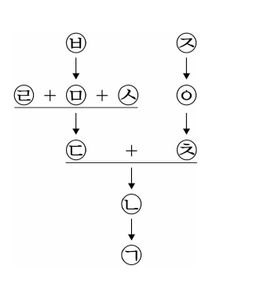
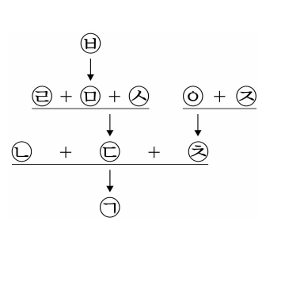
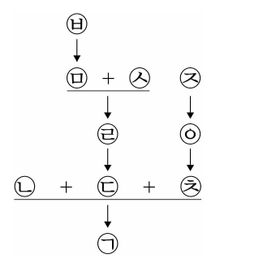
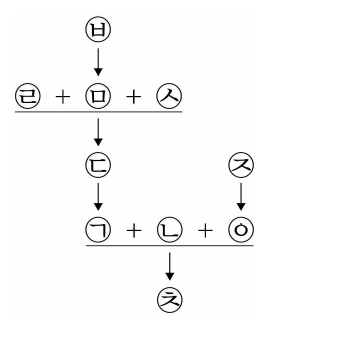
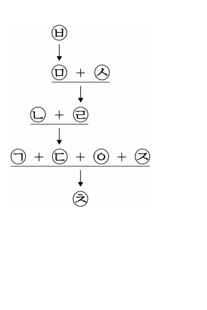

# 01 - RA (2025)

다음 논쟁에 대한 분석으로 옳은 것만을 <보기>에서 있는 대로 고른 것은?

## 제시문

의무복무제를 운영하는 X국의 ｢병역법｣은 병역의무를 이행해야 하는 자의 의무복무기간을 사병은 3년, 부사관은 7년, 장교는 10년으로 정하고 있다. 최근 X국 국회에는 부사관과 장교의 의무복무기간을 사병과 동일한 수준으로 단축하는 내용의 ｢병역법｣ 개정안이 제출되었다. 다음은 이를 둘러싼 갑과 을의 논쟁이다.

갑 : 나는 개정안에 반대해. 장교나 부사관의 의무복무기간이 사병보다 긴 이유는 이들이 그 계급에 맞는 직무역량을 갖추기 위해 국가의 비용으로 장기간 훈련을 거쳐서 임용되기 때문이야. 예컨대 공군 조종사나 기술적 전문성을 요하는 부사관은 고가의 전문장비에 대한 장기간 교육을 받아야 해. 지금의 의무복무기간은 국가가 장교와 부사관의 직무역량을 충분히 활용하기 위한 최소한의 기간이야.

을 : 나는 생각이 달라. 장교와 부사관의 의무복무에는 헌법상 국방의 의무를 수행하는 성격과 헌법상 직업의 자유를 실현하는 성격이 모두 있어. 사병과 같은 3년의 기간은 국방의 의무를 수행한다는 성격이 더 강하지만, 그 기간을 초과하는 복무기간은 직업활동으로서의 성격이 더 강하다고 생각해. 3년을 넘어 복무하게 하는 것은 장교와 부사관의 직업의 자유와 행복추구권을 과도하게 침해하는 것 같아.

## 보기

ㄱ. 정보기술의 발달로 군의 자동화 및 첨단화가 빠르게 진행되어 직무역량 강화를 위한 시간과 비용이 예전보다 대폭 절감되었다면, 갑의 견해는 약화된다.

ㄴ. X국의 ｢병역법｣에 따르면 의무복무의 이행방식은 본인의 의사에 따라 사병, 부사관, 장교 중에서 선택할 수 있고 장교와 부사관은 지원자 중 적격자만 선발된다는 사실은 을의 견해를 강화한다.

ㄷ. 사병의 의무복무기간을 3년으로 정한 ｢병역법｣ 규정이 헌법에 반하지 않는다고 X국의 헌법재판소가 판단하였다면, 갑의 견해는 강화되고 을의 견해는 약화된다.

## 선택지

(1) ㄱ

(2) ㄴ

(3) ㄱ, ㄷ

(4) ㄴ, ㄷ

(5) ㄱ, ㄴ, ㄷ

# 02 - RA (2025)

<견해>에 대한 분석으로 옳은 것만을 <보기>에서 있는 대로 고른 것은?

## 제시문

학교폭력 피해가 날로 심각해지는 현실에서도 현행 규정이 피해 학생의 보호와 신속한 권리구제에 미흡하다는 여론이 높아지자 개정안이 국회에 제출되었다.

<table>
<thead>
<tr><th>현행</th><th>개정안</th></tr>
</thead>
<tbody>
<tr>
<td>제○조(가해학생의 재심청구) 자치위원회가 내린 가해학생에 대한 모든 조치에 대하여 이의가 있는 가해학생 또는 그 보호자는 그 조치를 받은 날부터 15일 이내에 시․도학생징계조정위원회에 재심을 청구할 수 있다.</td>
<td>제○조(가해학생의 재심청구) 자치위원회가 내린 가해학생에 대한 조치 중 전학 또는 퇴학 조치에 대하여 이의가 있는 가해학생 또는 그 보호자는 그 조치를 받은 날부터 15일 이내에 시․도학생징계조정위원회에 재심을 청구할 수 있다.</td>
</tr>
</tbody>
</table>

이에 대해 다음과 같은 <견해>가 제시되었다.

<견해>

부모는 미성년 자녀의 교육 과정에 참여할 권리가 있으므로 학교가 학생에게 불리한 조치를 할 경우 이에 대한 의견을 제시할 권리도 갖는다. 개정안은 전학 및 퇴학의 경우를 제외하고는 재심을 허용하지 않음으로써 ㉠ <u>학부모의 이러한 권리를 침해한다</u>. 또한 전학 또는 퇴학 조치를 받은 가해학생에게만 재심을 허용하고 있어 ㉡ <u>그 밖의 조치를 받은 가해학생과 그 보호자를 부당하게 차별하는 결과를 초래한다</u>. 그러므로 현행 규정을 유지하여야 한다.

## 보기

ㄱ. 재심이 허용되지 않는 조치에 대해 다른 방법을 통한 법적 구제가 가능하다면, ㉠은 강화된다.

ㄴ. 가해학생에게 내려진 전학 또는 퇴학 조치는 다른 조치와 달리 추후 별도의 소송을 통해 번복되더라도 그 조치에 따른 가해학생의 피해가 회복 불가능하다면, ㉡은 약화된다.

ㄷ. 모든 가해학생에게 재심 기회를 부여하여 모범적인 사회인으로 성장할 수 있도록 하는 것이 학교와 사회의 책임이라면, ㉠은 약화되고 ㉡은 강화된다.

## 선택지

(1) ㄴ

(2) ㄷ

(3) ㄱ, ㄴ

(4) ㄱ, ㄷ

(5) ㄱ, ㄴ, ㄷ

# 03 - RA (2025)

다음으로부터 추론한 것으로 옳은 것만을 <보기>에서 있는 대로 고른 것은?

## 제시문

X국 정부는 담합 등 경쟁을 제한하는 위법한 행위를 규제한다. 위법성 여부는 시장 규모, 경쟁 정도, 규제를 통해 보호되는 법익, 담합을 규제하는 경우에 발생하는 역효과 등 모든 상황을 종합적으로 고려하여 판단한다. X국 정부는 담합에 대한 위법성 평가의 기준을 제시하면서, 시장 환경의 변화에 따라 서비스업에서 종전에 비하여 경쟁이 심해진 경우, 서비스의 질적 저하를 막기 위해 가격을 담합한 경우, 그리고 담합을 규제한 결과로 이용자가 부담하는 가격이 상승하여 이용자에게 더 불리하게 작용하는 경우 등은 위법성의 정도가 낮은 것으로 평가하겠다고 공표하였다.

변호사업과 같은 지식 서비스업에서 경쟁이 심화되면 서비스 이용가격은 계속 내려갈 수밖에 없다. 이러한 이유에서 X국 변호사들은 변호사회를 결성하여 ㉠ <u>의뢰인이 승소 여부와 관계없이 부담하는 최저수임료를 정하는 규정</u> 및 ㉡ <u>의뢰인이 승소한 경우에는 성공보수를 지급하도록 하고 그 최저보수를 정하는 규정</u>을 두었다. 그러자 ㉠과 ㉡이 변호사들의 가격 담합에 해당한다는 고발이 증가하였다.

## 보기

ㄱ. ㉠의 최저수임료 이하로 수임료가 낮아지는 경우에 서비스의 질적 하락이 가격의 하락보다 더 큰 폭으로 발생한다면, X국 정부는 ㉠에 의한 담합은 위법성의 정도가 낮다고 평가할 것이다.

ㄴ. 변호사들의 성공보수약정 담합을 규제하는 경우 그 약정금액이 승소와 관계없이 의뢰인이 부담하는 수임료로 전부 전가된다면, X국 정부는 ㉡에 의한 담합은 위법성의 정도가 낮다고 평가할 것이다.

ㄷ. X국 정부가 종전의 제도를 변경하여 변리사도 관련 업무에 대한 국내 소송사건을 수임할 수 있게 한다면, X국 정부는 ㉠과 ㉡에 의한 담합은 모두 위법성의 정도가 낮다고 평가할 것이다.

## 선택지

(1) ㄱ

(2) ㄷ

(3) ㄱ, ㄴ

(4) ㄴ, ㄷ

(5) ㄱ, ㄴ, ㄷ

# 04 - RA (2025)

[규칙]을 <사례>에 적용한 것으로 옳은 것은?

## 제시문

[규칙]

(1) 내란죄 또는 살인죄를 범한 죄인은 사형에 처하고 그 배우자는 유배한다.

(2) 강도죄를 범한 죄인은 유배형에 처하고 그 배우자가 자원하면 함께 유배한다.

(3) 사형에 처한 죄인은 사면이 선포되면 유배형에 처하고 그 배우자가 자원하면 함께 유배한다. 다만, 내란죄를 범한 죄인의 배우자는 자원하지 않더라도 죄인과 함께 유배한다.

(4) 죄인과 그 배우자를 함께 유배하는 경우에는 같은 곳에 유배한다.

(5) 유배지로 이송되던 죄인이 도망하더라도 함께 이송되던 배우자는 계속 이송한다.

(6) 유배형에 처한 죄인은 사면이 선포되면 석방한다. 그 죄인이 유배지로 이송되던 중이면 함께 이송되던 배우자도 석방한다. 다만, 유배지로 이송되던 중 도망한 죄인에 대하여 선포된 사면은 죄인과 그 배우자에게 효력이 없다.

(7) 사면이 선포되기 전에 유배지로 이송되던 중 도망한 죄인이 사면이 선포된 후에 사망한 것으로 확인되는 경우 자원하여 유배된 배우자는 석방한다.

<사례>

갑은 내란죄로 사형, 을과 병은 살인죄로 사형, 정과 무는 강도죄로 유배형에 각각 처해졌다. 갑, 을, 병에게 사형이 집행되기 전에 갑, 을, 병, 정, 무 모두에 대하여 사면이 선포되었다. 이후 병이 유배지로 이송되던 중 병에 대하여 추가로 사면이 선포되었다. 정과 무는 사면이 선포되기 전에 유배지로 이송되던 중 도망하였는데, 사면이 선포된 후 정은 체포되었고 무는 사망한 것으로 확인되었다.

## 선택지

(1) 갑의 배우자는 자원하지 않으면 갑과 함께 유배되지 않는다.

(2) 을의 배우자는 자원하지 않더라도 을과 같은 곳에 유배된다.

(3) 병의 배우자는 병과 함께 유배지로 이송되던 중이었다면 석방된다.

(4) 정의 배우자는 자원하여 정과 함께 유배되었다면 석방된다.

(5) 무의 배우자는 무와 함께 유배되었더라도 석방되지 않는다.

# 05 - RA (2025)

<주장>에 대한 평가로 옳은 것만을 <보기>에서 있는 대로 고른 것은?

## 제시문

당사자의 자유로운 의사결정에 의해 체결된 계약을 통제하기 위해서는 정당화 사유가 있어야 한다. 그것이 정보비대칭으로 발생한 <u>시장실패의 교정</u>에 있다는 주장 A와 <u>역학적 불균형으로부터의 보호</u>에 있다는 주장 B가 존재한다.

<주장>

A : 정보비대칭은 계약체결시 계약의 체결과 내용에 의미가 있는 제반 사정이 당사자에게 불평등하게 분배되는 상황을 초래하여 시장실패를 발생시킨다. 시장실패가 불러온 제품의 질적 저하라는 위험은 계약당사자 중 정보의 열위에 있는 자가 모두 부담한다. 정보비대칭으로 인한 시장실패를 교정하기 위해 계약은 통제되어야 한다. 정보비대칭은 관련 정보를 상대방에게 제공하기만 하면 해소된다. 상대방이 알고 있는 정보나 시장에서 형성된 가격과 같은 정보는 이미 제공된 것으로 본다.

B : 계약은 강자의 손에서는 강력한 무기가 되고 약자의 손에서는 무딘 도구가 된다. 계약에서의 자기결정권은 당사자가 대등한 교섭력을 가지는 경우에만 보장된다. 당사자 일방은 미성년자이고 상대방은 성년자인 경우나 당사자 일방만이 국가인 경우처럼 역학적 불균형 상태에서 체결된 계약은 당사자 일방의 자기결정권만 보장하므로 통제되어야 한다.

## 보기

ㄱ. 성년자 갑이 자기 소유의 물건에 관한 모든 정보가 적힌 설명서를 대학을 졸업한 미성년자 을에게 교부한 후 을과 매매계약을 체결한 경우, 이 계약에 대한 통제는 A에 의해서는 정당화되지 않고 B에 의해서는 정당화된다.

ㄴ. 미성년자 병이 온라인 중개 플랫폼을 통해 일면식도 없는 성년자 정에게 자신이 소유한 자전거를 시장가격보다 훨씬 낮은 가격으로 매도한 경우, 이 계약에 대한 통제는 A에 의해서는 정당화되고 B에 의해서는 정당화되지 않는다.

ㄷ. 성년자 무와 국가 X가 어떤 토지에 관한 모든 정보를 알고 그 토지에 대한 매매계약을 체결한 경우, 이 계약에 대한 통제는 A에 의해서든 B에 의해서든 정당화되지 않는다.

## 선택지

(1) ㄱ

(2) ㄷ

(3) ㄱ, ㄴ

(4) ㄴ, ㄷ

(5) ㄱ, ㄴ, ㄷ

# 06 - RA (2025)

다음으로부터 추론한 것으로 옳은 것만을 <보기>에서 있는 대로 고른 것은?

## 제시문

X국의 법에 의하면 의료인이 그 의료행위에서 주의의무를 다하지 못하여 사고가 발생한 경우에는 의료인 자신이 그 피해에 대한 배상책임을 부담한다. 그러나 의료인이 주의의무를 다하였으나 불가항력으로 인하여 사고가 발생한 경우에는 배상책임이 없다.

또한 의료사고가 발생한 경우 일반인으로서는 의료인의 주의의무 위반을 밝혀내기 극히 어렵고, 주의의무 위반이 밝혀지더라도 배상에 시간이 오래 소요된다. 따라서 의료사고 피해자를 보호해 주기 위하여 국가가 피해를 보상하는 법안이 다음과 같이 제출되었다.

<1안>

제○조 의료인이 주의의무를 다하였으나 불가항력으로 인한 의료사고로 피해가 발생한 경우 그 피해는 국가가 보상한다.

<2안>

제○조 의료사고로 피해가 발생한 경우 의료인이 주의의무를 다하였는지 여부를 묻지 아니하고 그 피해는 국가가 보상한다. 국가는 보상 후 의료인이 주의의무를 다하지 못한 경우에 한하여 그에게 보상액을 청구할 수 있다.

<3안>

제○조 의료인이 주의의무를 다하지 못하여 의료사고로 피해가 발생한 경우 그 피해는 국가가 보상한다. 국가는 보상 후 그 의료인에게 보상액을 청구할 수 있다.

## 보기

ㄱ. 의료인이 주의의무를 다하였으나 불가항력으로 인하여 의료사고가 발생한 경우에는 <1안>에 따르든 <2안>에 따르든 환자는 국가로부터 피해의 보상을 받을 수 있다.

ㄴ. 의료인이 주의의무를 다하지 못하여 의료사고가 발생한 경우에는 <2안>에 따르든 <3안>에 따르든 환자는 국가로부터 피해의 보상을 받을 수 있다.

ㄷ. 의료인이 주의의무를 다한 경우에는 <1안>, <2안>, <3안> 중 어느 것에 따르더라도 국가는 의료인에게 보상액을 청구할 수 없다.

## 선택지

(1) ㄱ

(2) ㄷ

(3) ㄱ, ㄴ

(4) ㄴ, ㄷ

(5) ㄱ, ㄴ, ㄷ

# 07 - RA (2025)

[규정]을 <사례>에 적용한 것으로 옳지 않은 것은?

## 제시문

혼인과 상속에 관한 고대 X국의 [규정]은 다음과 같다.

[규정]

제○조 ① 혼인하면서 처(妻)가 가져온 재산(이하 ‘지참재산’)은 부(夫)가 소유권을 취득한다.

② 부(夫)의 귀책사유로 이혼하는 경우에만 처(妻)에게 지참재산의 소유권이 회복된다.

③ 부(夫)가 이혼 후 사망한 경우에 상속인이 없다면 그 지참재산의 소유권은 이혼 전의 처(妻)에게 회복된다.

제○조 ① 상속은 유언이 있으면 유언에 따른다.

② 유언이 없으면 상속은 다음에 따른다.

1. 부부 상호 간에는 상속받을 수 없다.

2. 자녀는 그 부(父)로부터만 재산을 상속받을 수 있다.

3. 상속인은 사망한 자(이하 ‘피상속인’)의 상속재산에 대한 소유권을 취득한다. 이때 피상속인이 생전에 부여한 상속재산에 대한 사용권은 피상속인의 사망시 소멸한다.

③ 상속인이 상속을 포기하면 상속받을 수 없다.

<사례>

갑과 을이 혼인할 때 처(妻) 을은 소를 지참재산으로 가져왔다. 그 후 갑과 을은 자녀 없이 이혼하였다. 이혼 후 갑은 집 한 채를 구매하였고 병과 혼인하여 자녀 정을 두었다. 갑이 사망 전에 자신의 말에 대한 사용권을 병에게 부여하여 병이 말을 사용하고 있다. 이후 갑은 사망하였고, 갑의 유언장에는 “정이 말을 상속받고, 말에 대한 병의 사용권은 유지되어야 한다.”라는 내용이 기재되어 있었다.

## 선택지

(1) 갑과 을의 이혼이 갑의 귀책사유 때문이라면 을에게 소의 소유권이 회복된다.

(2) 갑과 을의 이혼이 을의 귀책사유 때문이라면 정은 소를 상속받지 못한다.

(3) 정은 갑의 집을 상속받는다.

(4) 병이 말의 사용권을 포기하지 않더라도 정은 말을 상속받는다.

(5) 정이 상속을 포기하면 을에게 소의 소유권이 회복된다.

# 08 - RA (2025)

<견해>에 대한 분석으로 옳은 것만을 <보기>에서 있는 대로 고른 것은?

## 제시문

공공재는 공중이 공동으로 이용할 수 있는 재화로서 그 소유권은 국민이 가진다. 공공재는 누구나 그것에 접근하여 이용할 수 있고 누구도 그것의 이용을 금지시킬 수 없다. 그런데 공공재는 관리가 안 되면 필연적으로 그 가치가 감소하게 된다. 이러한 편익감소를 막기 위해 국가가 ‘행정’이라는 이름으로 공공재를 관리한다. 그러나 이러한 경우에는 효율성이 떨어지는 문제가 있어 국가가 공공재를 관리하는 방법에 관하여 다음과 같은 <견해>가 제기되었다.

<견해>

A : 국민이 공공재에 대한 관리를 전적으로 국가에 위임하였으므로 국가는 공공재를 직접 관리하거나 제3자에게 관리하게 할 수 있다. 국가는 효율적으로 공공재를 관리하여 이용가격에 합당한 서비스 품질을 보장하기 위해 공공재의 관리를 민영화할 필요가 있다. 다만 국민은 공공재를 국가가 직접 관리하는 경우에 자기가 부담하는 비용을 초과하여 부담하지 않는 것을 조건으로 국가에 관리방법의 재량을 부여한 것이다. 국가는 이 조건을 충족시켜야 한다.

B : 민영화는 영리성을 고려할 수밖에 없으므로 종전에 국가가 관리하던 공공재 서비스 이용가격이 종국적으로 인상되거나 종전 가격 대비 서비스의 질적 하락을 가져온다. 따라서 국가는 민영화의 대안으로 ‘협치’를 채택하여야 한다. 국가는 편익감소를 막아야 하는 경우를 제외하고는 공공재의 관리에 직접 관여해서는 안 되며, 공공재를 이용하는 사회 구성원들이 그에 의해 발생하는 문제를 자치적으로 해결할 수 있도록 해야 한다. 시민사회의 협치가 실패하면 공공재가 관리되지 않는 상태가 된다. 따라서 사회 구성원들은 협치가 실패하지 않도록 노력해야 한다.

## 보기

ㄱ. A에 의하면, 공공재 X의 민영화 이후 이용가격이 국가가 직접 관리하였다면 국민이 부담하였을 이용가격보다 오른 경우, 국가는 초과된 부분을 국민이 부담하게 할 수 없다.

ㄴ. B에 의하면, 사회 구성원들에 의한 협치가 실패한 경우에는 국가는 공공재의 관리에 직접 관여할 수 있다.

ㄷ. 민영화를 하는 경우에 국가가 공공재 이용가격을 통제하면서 서비스의 질적 저하를 막을 수 있다는 연구 결과는 A를 강화하고 B를 약화한다.

## 선택지

(1) ㄱ

(2) ㄴ

(3) ㄱ, ㄷ

(4) ㄴ, ㄷ

(5) ㄱ, ㄴ, ㄷ

# 09 - RA (2025)

<이론>에 따라 <사례>를 판단한 것으로 옳은 것만을 <보기>에서 있는 대로 고른 것은?

## 제시문

<이론>

온라인 콘텐츠를 통한 명예훼손이 가능해지면서 가해자와 피해자가 서로 다른 나라에 거주하는 경우와 피해자에게 여러 나라에서 손해가 발생하는 경우가 많아졌다. 이때 피해자의 명예가 훼손된 나라의 법원은 피해자가 가해자를 상대로 손해배상청구의 소를 제기하는 경우 그 소에 대하여 재판권을 행사할 수 있다. 피해자의 명예가 훼손된 나라로서 그 나라의 법원이 재판권을 행사할 수 있는 나라는 ㉠ <u>피해자가 거주하는 나라</u>라는 견해와 ㉡ <u>가해자가 그곳에서 피해자의 명예가 훼손되기를 의도하였던 나라</u>라는 견해가 대립한다. 후자에서 가해자의 의도는 콘텐츠가 작성된 언어와 콘텐츠에 접근할 수 있는 나라의 공용어가 같고 다름을 기준으로 판단한다.

한 나라의 법원이 재판권을 행사할 수 있는 경우, 재판권 행사의 범위에 관하여는 ㉢ <u>피해자가 그 법원이 있는 나라에서 입은 손해</u>에 한정하는 견해와 ㉣ <u>피해자가 여러 나라에서 입은 모든 손해</u>라는 견해가 대립하고, 손해배상의 성립 여부와 금액을 판단하는 기준에 관하여는 ㉤ <u>피해자가 거주하는 나라의 법을 적용하여야 한다는 견해</u>, ㉥ <u>가해자가 거주하는 나라의 법을 적용하여야 한다는 견해</u>, ㉦ <u>손해가 발생한 국가별로 각국에서 발생한 손해에 대하여 각국의 법을 적용하여야 한다는 견해</u>가 대립한다.

<사례>

X국에 거주하는 갑은 Y국에 거주하는 을을 비난하는 콘텐츠를 인터넷에 게시하였고, 이는 X국, Y국, Z국에서만 접근할 수 있다. 그 콘텐츠는 진실한 사실을 적시하고 있으나, Y국 공용어인 A언어가 아니라 X국과 Z국 공용어인 B언어로 작성되었다. 갑의 행위로 을이 입은 손해는 X국에서 50, Y국에서 30, Z국에서 20이다. 명예훼손으로 손해가 발생하더라도 X국법은 허위의 사실을 적시한 행위에 대하여만 손해배상책임을 인정하고 Y국법, Z국법은 진실한 사실이든 허위의 사실이든 이를 적시한 행위에 대하여 손해배상책임을 인정한다. 을은 Y국 법원에서 갑을 상대로 손해배상청구의 소를 제기하였다.

## 보기

ㄱ. Y국 법원이 ㉡을 적용하여 판단하면 을은 갑으로부터 손해배상을 받을 수 없다.

ㄴ. Y국 법원이 ㉠, ㉢, ㉥의 순서로 적용하여 판단하든 ㉠, ㉣, ㉥의 순서로 적용하여 판단하든 을은 갑으로부터 손해배상을 받을 수 없다.

ㄷ. Y국 법원이 ㉠, ㉣, ㉤의 순서로 적용하여 판단하든 ㉠, ㉣, ㉦의 순서로 적용하여 판단하든 을은 X국, Y국, Z국에서 발생한 모든 손해에 대하여 갑으로부터 손해배상을 받을 수 있다.

## 선택지

(1) ㄴ

(2) ㄷ

(3) ㄱ, ㄴ

(4) ㄱ, ㄷ

(5) ㄱ, ㄴ, ㄷ

# 10 - RA (2025)

다음으로부터 추론한 것으로 옳은 것만을 <보기>에서 있는 대로 고른 것은?

## 제시문

P사는 2023. 8. 1. 출시한 제품 A를 2023. 8. 1.부터 2023. 8. 31.까지는 정가 15,000원에 판매하다가, 할인율을 표시하지 않고 2023. 9. 1.부터 2023. 9. 10.까지는 14,500원, 2023. 9. 11.부터 2023. 9. 20.까지는 13,500원, 2023. 9. 21.부터 2023. 9. 30.까지는 11,000원에 판매하였다. P사는 2023. 10. 1.부터 6개월간 신문 및 전단을 통하여 A에 대한 ‘$1 + 1$ 행사’를 한다고 광고하면서 A의 1개 판매가격을 15,000원으로 기재하였다. 규제기관 Q는 2024. 2. 1. P사의 ‘$1 + 1$ 행사’ 광고가 [규정]을 위반하였다는 이유로 과태료를 부과하였다. Q는 ㉠ <u>판매방식과 관계없이 소비자들은 종전거래가격에 대비하여 $50\%$ 할인된 가격으로 구매한다고 생각하므로 ‘$1 + 1$ 행사’는 할인판매에 해당한다</u>고 본 것이다.

[규정]

제○조(할인판매) ① 사업자가 상품의 할인판매를 하는 경우 할인율을 표시하고 광고 개시 직전 30일간의 종전거래가격을 기재한다. 다만, 30일간의 가격이 계속 변동된 경우에는 ‘30일간의 가격의 평균’과 ‘30일간의 가격 중 최저가격과 최고가격의 평균’ 중 낮은 가격을 종전거래가격으로 기재한다.

② 제1항에도 불구하고 서로 다른 조건으로 연달아 할인판매를 하는 경우에는 최초의 할인판매 직전 30일간의 종전거래가격을 기재한다.

③ 제1항 또는 제2항을 위반한 경우에는 3,000만 원 이하의 과태료를 부과한다.

## 보기

ㄱ. P사의 ‘$1 + 1$ 행사’는 할인율을 직접 표시하지 않았으므로 15,000원을 판매가격으로 기재한 행위가 증정판매를 위한 것에 불과하다는 해석은 ㉠을 약화한다.

ㄴ. Q에 따르면, P사는 A의 판매가격을 13,000원으로 기재했어야 한다.

ㄷ. 할인율을 표시하지 않고 할인하여 판매한 경우도 할인판매로 본다면, P사의 ‘$1 + 1$ 행사’가 할인판매로 인정되더라도 P사가 이 행사에서 15,000원을 판매가격으로 기재한 것은 [규정] 위반이 아니다.

## 선택지

(1) ㄱ

(2) ㄴ

(3) ㄱ, ㄷ

(4) ㄴ, ㄷ

(5) ㄱ, ㄴ, ㄷ

# 11 - RA (2025)

[규정]에 따라 <사례>를 분석한 것으로 옳은 것만을 <보기>에서 있는 대로 고른 것은?

## 제시문

[규정]

제1조(개발사업 시행자) ① 국가는 개발구역의 전부 또는 일부에 대한 개발사업을 위하여 지방자치단체 또는 개발조합 중에서 시행자를 지정한다.

② 국가는 개발사업 시행 전에 시행자를 변경할 수 있다. 다만, 기존 시행자가 선택한 개발사업 시행방식은 제3조에 따라 변경되지 않는 한 변경될 수 없다.

③ 제1항 및 제2항에도 불구하고 개발구역 전부에 대하여 제2조 제1호의 방식으로 개발사업을 시행하는 것은 시행자가 지방자치단체인 경우에 한한다. 이는 시행자 또는 시행방식의 변경으로 인한 경우에도 같다.

제2조(개발사업 시행방식) 시행자는 다음 중 어느 하나의 방식을 선택하여 개발구역의 전부 또는 일부에 대한 개발사업을 시행한다. 다만, 개발구역 일부의 시행자 또는 시행방식이 변경되는 경우에 다음 중 둘 이상의 방식이 개발구역 전부에 대하여 혼용되는 때에는 제3호를 선택한 것으로 본다.

1. 토지 소유권 취득 후 보상금 지급 방식

2. 대체 토지 소유권 이전 방식

3. 제1호와 제2호를 혼용하는 방식

제3조(개발사업 시행방식의 변경) 시행자는 다음 중 어느 하나에 해당하는 경우에만 개발사업 시행방식을 변경할 수 있다.

1. 지방자치단체가 개발구역의 전부 또는 일부에 대하여 개발사업 시행방식을 제2조 제2호 또는 제3호에서 제2조 제1호로 변경하는 경우

2. 개발조합이 개발구역의 전부 또는 일부에 대하여 개발사업 시행방식을 제2조 제3호에서 제2조 제1호 또는 제2호로 변경하는 경우

<사례>

A토지, B토지로만 구성된 X개발구역에 대한 개발사업 시행자로 A토지는 P지방자치단체, B토지는 Q개발조합이 지정되었다. P지방자치단체는 제2조 제1호, Q개발조합은 제2조 제3호의 방식을 선택하여 개발사업을 시행하기로 하였다.

## 보기

ㄱ. Q개발조합은 B토지 개발사업 시행방식을 제2조 제1호로 변경하여 개발사업을 시행할 수 있다.

ㄴ. A토지 개발사업 시행자가 Q개발조합으로 변경되는 경우 Q개발조합은 X개발구역 전부에 대한 개발사업 시행방식을 제2조 제2호로 변경하여 개발사업을 시행할 수 있다.

ㄷ. B토지 개발사업 시행자가 P지방자치단체로 변경되는 경우 P지방자치단체는 B토지에 대한 개발사업 시행방식을 제2조 제1호로 변경하여 개발사업을 시행할 수 있다.

## 선택지

(1) ㄱ

(2) ㄴ

(3) ㄱ, ㄷ

(4) ㄴ, ㄷ

(5) ㄱ, ㄴ, ㄷ

# 12 - RA (2025)

다음으로부터 추론한 것으로 옳은 것만을 <보기>에서 있는 대로 고른 것은?

## 제시문

P사 주주는 12명이고 각 주주의 지분은 동일하다. 갑은 2022. 3. 1. P사 대표이사로 선임되었고 임기는 2022. 3. 1.부터 2024. 2. 29.까지였다. P사 [정관] 제1조 제2항에 따라 갑이 주주총회를 소집하고 주주총회 의안을 제안하면, 모든 주주가 출석하여 갑이 제안한 의안을 당일 의결하였다. 2023. 6. 30.까지는 9명, 2023. 7. 1.부터는 8명의 주주가 갑이 제안한 주주총회 의안에 찬성하였다. 갑은 임기 중 서로 다른 날에 <의안 1>, <의안 2>, <의안 3>을 주주총회에 각 1회 제안하여 P사 [정관]을 개정함으로써 대표이사를 연임하였다.

[정관]

제1조 ① 대표이사 임기는 2년이고 연임할 수 없다.

② 대표이사는 주주총회를 소집할 수 있고 주주총회 의안을 제안할 수 있다.

제2조 정관 개정은 주주총회에서 전체 지분의 4분의 3 이상의 동의에 의한다.

제3조 ① 주주총회에서 정관 개정이 의결되면 그때부터 개정된 정관이 효력을 갖는다.

② 제1조 제1항은 개정되더라도 개정 당시 대표이사에게는 개정의 효력이 없다.

③ 제3조 제2항이 삭제되기 전에 제1조 제1항이 개정되더라도 개정 당시 대표이사에게는 제1조 제1항 개정의 효력이 없다.

<의안 1> [정관] 제1조 제1항의 ‘없다’를 ‘있다’로 개정한다.

<의안 2> [정관] 제2조의 ‘4분의 3’을 ‘3분의 2’로 개정한다.

<의안 3> [정관] 제3조 제2항을 삭제한다.

## 보기

ㄱ. <의안 1>과 <의안 3>이 2023. 7. 1. 이후에 제안되었다면, <의안2>는 2023. 6. 30. 이전에 제안되었을 것이다.

ㄴ. <의안2>가 2023. 7. 1. 이후에 제안되었다면, <의안1>과 <의안 3>은 2023. 6. 30. 이전에 <의안3>, <의안1>의 순서로 제안되었을 것이다.

ㄷ. <의안3>이 2023. 6. 30. 이전에 제안되었고 <의안1>이 2023. 7. 1. 이후에 제안되었다면, <의안2>는 2023. 7. 1. 이후에 <의안 1>보다 먼저 제안되었을 것이다.

## 선택지

(1) ㄴ

(2) ㄷ

(3) ㄱ, ㄴ

(4) ㄱ, ㄷ

(5) ㄱ, ㄴ, ㄷ

# 13 - RA (2025)

<견해>에 대한 분석으로 옳은 것만을 <보기>에서 있는 대로 고른 것은?

## 제시문

갑과 을은 각자 누군가를 살해할 악한 의도로 치밀한 계획을 세워 살해를 시도했으나, 갑은 살인에 성공했고 을은 살인에 실패했다. 이 경우 갑이 훨씬 더 무겁게 처벌된다. 이는 정당화될 수 있을까? 이에 대해 다음과 같은 <견해>가 있다.

<견해>

A : 갑과 을 모두 살해 의도를 가지고 있었음에도 갑의 시도가 성공하고 을의 시도가 실패한 것은 ‘운’이 작용한 탓이다. 자신이 어찌할 수 없는 운에 의한 결과에 따라 둘에 대한 처벌의 경중이 달라지는 것은 정당화될 수 없다. 왜냐하면 그렇게 처벌의 경중이 달라지는 것은 둘을 동등하게 대우하는 것이 아니기 때문이다. 따라서 갑과 을을 다르게 처벌해서는 안 된다.

B : 처벌의 경중은 범죄자에게 얼마나 악한 의도가 있었느냐에 따라 결정되어야 하지만 그것을 정확히 파악하기는 어렵다. 이런 상황에서 살해의 성공 여부는 그 의도의 악랄함의 정도를 보여주는 좋은 지표가 된다. 의도가 악랄할수록 더 용의주도하게 살인을 계획할 것이고 성공할 확률이 높을 것이기 때문이다. 그러므로 성공한 살인을 실패한 살인보다 더 무겁게 처벌해야 한다.

C : 갑을 을보다 더 무겁게 처벌하는 것은 ‘운에 의한 처벌’이라고 할 수 있으며 이런 처벌은 동등한 대우를 실현하는 길일 수 있다. 예를 들어, 고대에는 반역자들을 처벌할 때 제비뽑기를 통해 ‘운이 없는’ 몇 사람만을 처벌하였다. 모든 반역자에 대해서 같은 승률의 제비뽑기를 통해 처벌 여부를 결정했기 때문에 이는 반역자들을 동등하게 대우했다고 할 수 있다. 이와 마찬가지로 살해 성공이라는 ‘제비뽑기’에 따라 갑과 을을 다르게 처벌하는 것은 동등한 대우를 실현하는 길이다.

## 보기

ㄱ. A에 따르면, 누군가를 죽일 의도는 없었으나 난폭운전을 해서 행인을 죽인 사람과 누군가를 죽일 의도로 난폭운전을 해서 행인을 다치게 한 사람을 동일하게 처벌해야 한다.

ㄴ. 의도가 악랄할수록 감정에 휩쓸려 판단력이 떨어진다는 것과 판단력이 떨어질수록 계획의 성공 가능성이 낮아진다는 것이 모두 사실이라면, B의 입장은 약화된다.

ㄷ. A와 C는 갑과 을을 동등하게 대우하여 처벌해야 한다는 것에는 동의하지만 어떤 처벌을 해야 하는지에 대해서는 의견을 달리한다.

## 선택지

(1) ㄱ

(2) ㄴ

(3) ㄱ, ㄷ

(4) ㄴ, ㄷ

(5) ㄱ, ㄴ, ㄷ

# 14 - RA (2025)

다음으로부터 <사례>를 판단한 것으로 옳은 것만을 <보기>에서 있는 대로 고른 것은?

## 제시문

많은 철학자들은 “증거의 부재는 부재의 증거가 아니다.”를 일반적인 ㉠ <u>격률</u>로 받아들인다. 그러나 언제나 이 격률이 성립하는 것은 아니다. 어떤 사람이 천장에서 나는 소리를 들으려고 애썼지만 어떤 소리도 들리지 않는 경우를 생각해보자. 그는 천장에 쥐가 있다는 어떤 증거도 발견하지 못한다. 이 경우, 증거의 부재가 “천장에 쥐가 없다.”는 부재 가설의 증거가 된다. 철학자 A는 다음의 두 조건이 모두 만족되면 증거의 부재가 부재 가설의 증거가 되며, 따라서 위 격률이 성립하지 않게 된다고 주장한다.

◦ 조건 1 : 부재 가설이 참일 확률은 $100\%$보다 작아야 한다.

◦ 조건 2 : 부재 가설이 참일 때 ‘부재 가설이 거짓이라는 증거’를 획득할 확률은 부재 가설이 거짓일 때 ‘부재 가설이 거짓이라는 증거’를 획득할 확률보다 작아야 한다.

<사례>

X산으로 등산을 떠난 갑은 혹시 X산에 멧돼지가 있을까 걱정했다. 하지만 X산에서 멧돼지 발자국을 찾아볼 수 없었다. 이를 바탕으로 갑은 X산에는 멧돼지가 없다고 추론하였다. (단, 멧돼지 유무의 증거는 발자국뿐이라고 가정한다.)

## 보기

ㄱ. A에 따르면, X산에 멧돼지가 존재할 확률이 $0\%$일 때 갑의 추론에서 ㉠은 성립하지 않는다.

ㄴ. 갑이 등산하기 전에 누군가 먼저 X산을 깨끗이 정돈하여 모든 동물 발자국을 지워 놓았다면, 갑의 추론은 조건 1도 조건 2도 만족하지 않는다.

ㄷ. X산에 멧돼지가 있을 때 멧돼지 발자국이 발견될 확률이 X산에 멧돼지가 없을 때 멧돼지 발자국이 발견될 확률보다 더 큰 경우, 갑의 추론은 조건 2를 만족한다.

## 선택지

(1) ㄱ

(2) ㄷ

(3) ㄱ, ㄴ

(4) ㄴ, ㄷ

(5) ㄱ, ㄴ, ㄷ

# 15 - RA (2025)

다음으로부터 <사례 1>과 <사례 2>를 판단한 것으로 옳은 것만을 <보기>에서 있는 대로 고른 것은?

## 제시문

위선과 비난에 대해 다음과 같은 [원리]가 있다.

[원리] 어떤 사람 $X$가 어떤 규범 $N$의 위반에 대하여 위선자가 아닐 경우, 그리고 그 경우에만 $N$을 위반한 어떤 다른 사람 $Y$를 비난할 자격이 있다.

그런데 [원리]에서 위선자를 어떻게 정의할지에 대해 다음과 같은 주장이 있다.

A : $X$가 $N$을 위반했고 $N$을 위반한 다른 사람을 비난했을 경우, 그리고 그 경우에만 $X$는 $N$의 위반에 대하여 위선자이다.

B : $X$가 $N$을 위반했고 $N$을 위반한 자신을 비난하지 않지만 $N$을 위반한 다른 사람을 비난했을 경우, 그리고 그 경우에만 $X$는 $N$의 위반에 대하여 위선자이다.

C : $X$가 $N$을 위반했고 $X$에게는 자신을 제외하고 다른 사람만 비난하는 성향이 있어 그 성향 때문에 $X$가 $N$을 위반한 다른 사람을 비난하고 자신을 비난하지 않는 경우, 그리고 그 경우에만 $X$는 $N$의 위반에 대하여 위선자이다.

<사례 1>

갑과 을은 1년 전에 각자 거짓말을 하였다. 당시 갑은 거짓말을 한 자신을 비난하지 않았지만 거짓말을 한 을을 비난하였다. 이후 갑은 잘못된 행위에 대해서는 자신이든 다른 사람이든 비난하는 성향을 가지게 되었다. 최근 갑과 을이 각자 거짓말을 하였다. 갑은 거짓말을 한 자신을 비난하고 거짓말을 한 을을 비난하고 있는데, 이는 모두 자신이 가진 그 성향 때문이다.

<사례 2>

병과 정은 지난 1년간 시험 볼 때마다 유혹을 이기지 못하고 부정행위를 했으며 이를 서로 알고 있다. 병은 부정행위를 한 자신을 매번 비난했고 부정행위를 한 정을 매번 비난했다. 정은 부정행위를 한 병을 비난했지만 부정행위를 한 자신을 비난하지 않았는데, 이는 모두 자신이 가진 성향 때문이다.

## 보기

ㄱ. A에 따르면 1년 전 상황에서 갑은 을을 비난할 자격이 없고, C에 따르면 현재 상황에서 갑은 을을 비난할 자격이 없다.

ㄴ. B에 따르면 병은 정을 비난할 자격이 있지만, C에 따르면 병은 정을 비난할 자격이 없다.

ㄷ. A에 따르든 B에 따르든 정은 병을 비난할 자격이 없다.

## 선택지

(1) ㄴ

(2) ㄷ

(3) ㄱ, ㄴ

(4) ㄱ, ㄷ

(5) ㄱ, ㄴ, ㄷ

# 16 - RA (2025)

다음 글의 ㉠과 ㉡에 대한 평가로 옳은 것만을 <보기>에서 있는 대로 고른 것은?

## 제시문

누군가가 길거리에서 어려움에 빠져 도움이 필요한 상황에서 어떤 행인은 그 사람을 돕는 친사회적인 행동을 하고 어떤 행인은 그냥 지나친다. 도움에 관한 행인의 행동을 예측하려면 무엇을 파악해야 할까? 그 행인의 성격이 너그러운지 아니면 쌀쌀맞은지를 알아야 할까? 아니면 성격 이외의 외부적인 다른 요소를 파악해야 할까?

심리학자 갑이 이를 알아보기 위해 다음과 같은 실험을 수행하였다. 갑은 피실험자 중 $50\%$의 사람들이 길을 걸어가는 중 빵 냄새를 맡아 기분이 좋아지게 했고, 나머지 $50\%$의 사람들에게는 빵 냄새를 맡게 하지 않았다. 그런 직후 행인 역할을 맡은 조수에게 피실험자 앞에서 서류철을 떨어뜨리게 하였다. 그 결과 빵 냄새를 맡은 사람들의 $87.5\%$가 그 행인을 도와주었고, 그렇지 않은 사람들의 $4\%$가 그 행인을 도와주었다. 이로써 갑은 다음과 같이 결론짓게 되었다. 사람의 성격과 상관없이, 빵 냄새를 맡았는지 여부가 그 사람의 행동을 결정하게 된다. 즉, 사람들의 행동을 예측하는 근거는 성격이 아닌 상황적 요소에 있다. 갑은 이 메커니즘을 설명하기 위해서 ㉠ <u>사람의 행동을 좌우하는 결정적 요인은 성격보다는 상황적 요소라는 가설</u>을 세웠다. 이 가설에 따르면, 빵 냄새를 맡았다는 상황적 요소가 피실험자의 기분을 좋게 만들었고 이에 따라 피실험자는 타인을 돕고자 하는 동기를 가지게 되었다. 예기치 않은 작은 행운이 그 사람을 너그럽게 만들었다는 것이다. 갑은 위 실험을 근거로 ‘친사회적 행동’과 ‘상황적 요소’ 사이에 상관성이 있다고 주장하였다. 성격이 아닌 상황적 요소가 행동을 결정하는 요인이라는 것도 놀랍지만 더 놀라운 것은 ㉡ <u>친사회적 행동을 유발한 요인이 아주 사소하거나 하찮은 것일 수도 있다는 것</u>이다.

## 보기

ㄱ. 갑의 실험에서 행인을 도와주지 않은 사람 중 대부분이 평소에도 이기적으로 행동한다고 알려진 사람들이었다는 것이 밝혀지면, ㉠은 강화된다.

ㄴ. 갑의 실험에 참여한 사람 가운데 평소 이타적인 성격을 지녔다고 알려진 사람이 그렇지 않은 사람보다 압도적으로 많은 것으로 밝혀지면, ㉠은 약화된다.

ㄷ. 빵 냄새를 맡게 하는 대신에 피실험자 중 $50\%$는 고가의 경품에 당첨되도록 하고 나머지 $50\%$는 아무것도 당첨되지 않도록 실험의 설정을 변경하였음에도 도움을 주는 사람들의 비율이 갑의 빵 냄새 실험에서 나타난 비율과 유사하다면, ㉠은 강화되나 ㉡은 약화되지 않는다.

## 선택지

(1) ㄱ

(2) ㄷ

(3) ㄱ, ㄴ

(4) ㄴ, ㄷ

(5) ㄱ, ㄴ, ㄷ

# 17 - RA (2025)

다음 글에 대한 분석으로 옳은 것만을 <보기>에서 있는 대로 고른 것은?

## 제시문

내기 참가자에게 1불과 10불 중 하나를 선택하여 가지되 후회할 선택을 해보라고 하자. 후회할 선택을 하는 경우에만 100불이 추가로 지급된다는 것을 참가자에게 미리 알려준다. 더 많은 돈을 얻는 선택이 합리적인 선택이며, 이런 선택에 대해서는 후회하지 않고, 그렇지 않은 선택에 대해서는 후회한다고 하자. 얼핏 보면 ㉠ <u>이 내기에서 합리적인 선택은 1불을 선택하는 것이다</u>. 10불을 마다하고 1불을 갖는 것은 후회할 선택이므로 100불이 지급될 것이기 때문이다. 하지만 그렇게 되면 1불을 선택한 행위는 후회할 선택이 아니게 되고, 그러므로 100불은 지급되지 않을 것이다. 선택은 한 번 이루어졌지만 그것이 후회할 선택인지 여부는 계속 변하며, 100불은 지급과 미지급 사이를 끝없이 오가게 된다. 10불을 선택해도 결과는 마찬가지이다. 1불 대신 10불을 선택한 것은 후회할 선택이 아니므로 100불이 지급되지 않는다. 그러면 그 선택은 후회할 선택이 되므로 100불은 지급될 것이다. 하지만 그러면 다시 10불의 선택이 후회할 선택이 아니게 된다. 이번에도 100불은 지급과 미지급 사이를 끝없이 오가게 된다. 이 내기에서 무엇이 합리적 선택인지 말할 수 없는 것이다.

이 내기의 구조를, 어떤 선택을 할지 고민하는 시점0부터 자신의 선택을 돌아보는 시점2까지의 흐름에서 살펴보자. 1불 또는 10불의 선택이 이루어지는 시점은 시점0과 2 사이인 시점 1이다. 그 선택의 의도는 시점 2에서 후회를 하는 것이다. 의도의 대상은 아직 일어나지 않은 미래이다. 반면에 후회의 대상은 이미 일어난 과거이다. 내기의 참가자는 자신이 시점 1에서 한 선택을 시점 2에서 후회할 것을 시점 0에서 의도했다. 하지만 그 의도가 실현되었다는 바로 그 이유로 시점 1에서 자신이 했던 후회할 선택은 후회하지 않을 선택이 된다. 그리고 이 과정은 끝없이 반복된다. ㉡ <u>시점 0에서 시점 2를 바라볼 때의 의도</u>와 ㉢ <u>시점 2에서 시점 1을 바라볼 때의 후회</u>가 역설적인 결과를 도출한 것이다.

## 보기

ㄱ. 참가자가 1불과 10불 중 어느 쪽을 선택하더라도 100불을 추가로 지급하는 것으로 내기의 규칙을 바꾼다면, 후회할 선택을 하는 것은 불가능하다.

ㄴ. 자신의 선택을 후회하지 않는 경우에만 100불을 추가로 지급하는 것으로 내기의 규칙을 바꾼다면, ㉠은 10불을 선택하는 것이다.

ㄷ. 내기에서 1불을 선택하는 경우의 ㉡과 10불을 선택하는 경우의 ㉡은, 둘 다 ㉢을 발생시키려는 것이라는 점에서 차이가 없다.

## 선택지

(1) ㄱ

(2) ㄴ

(3) ㄱ, ㄷ

(4) ㄴ, ㄷ

(5) ㄱ, ㄴ, ㄷ

# 18 - RA (2025)

다음 글에 대한 분석으로 옳은 것만을 <보기>에서 있는 대로 고른 것은?

## 제시문

A 마을의 대표들 중 한 명이 B 마을 사람들에게 무차별적으로 오물을 투척하였다. 이에 대한 보복으로 B 마을의 대표들 중 한 명인 갑은 A 마을 사람들에게 무차별적으로 오물을 투척하였고, B 마을의 대표들 중 또 다른 한 명인 을은 A 마을의 대표들에게만 오물을 투척하였다.

아래는 한 집단이 다른 집단에 의해 피해를 받았을 때 피해를 받은 집단이 피해를 가한 집단에게 어떻게 대응해야 하는가라는 질문에 대한 답으로 가능한 원칙들이다.

P1 : 만약 집단 $X$의 누군가가 집단 $Y$를 먼저 무차별적으로 공격하거나 피해를 입혔다면, 집단 $Y$에 속한 사람 누구나 집단 $X$에 속한 누구에게라도 그에 상응하는 보복을 할 도덕적 권리를 가진다.

P2 : 만약 집단 $X$의 대표 중 누군가가 집단 $Y$를 먼저 무차별적으로 공격하거나 피해를 입혔다면, 집단 $Y$의 대표 누구나 집단 $X$에 속한 누구에게라도 그에 상응하는 보복을 할 도덕적 권리를 가진다.

P3 : 만약 집단 $X$의 대표 중 누군가가 집단 $Y$를 먼저 무차별적으로 공격하거나 피해를 입혔다면, 집단 $Y$의 대표 누구나 집단 $X$의 대표들에게 그리고 오직 그들에게만 그에 상응하는 보복을 할 도덕적 권리를 가진다.

## 보기

ㄱ. 세 원칙 모두 갑과 을의 행동에 대해 같은 도덕적 판정을 내린다.

ㄴ. 갑의 행동을 정당화하기 위해서는 세 원칙 가운데 P1이나 P2에 의존해야 한다.

ㄷ. 을의 행동을 정당화하기 위해 세 원칙 가운데 반드시 P3에 의존할 필요는 없다.

## 선택지

(1) ㄱ

(2) ㄴ

(3) ㄱ, ㄷ

(4) ㄴ, ㄷ

(5) ㄱ, ㄴ, ㄷ

# 19 - RA (2025)

다음 글에 대한 분석으로 옳은 것만을 <보기>에서 있는 대로 고른 것은?

## 제시문

어떤 행위를 하지 않을 도덕적 의무가 있는지에 관해 다음 원리가 제안되었다.

A : 특정 행위로 타인이 해를 입거나 세상이 더 나빠진다면, 그 행위를 하지 않을 도덕적 의무가 있다.

B : 모든 사람이 특정 행위를 할 경우 타인이 해를 입거나 세상이 더 나빠진다면, 그 행위를 하지 않을 도덕적 의무가 있다.

C : 특정 행위가 모든 사람에게 허용될 경우 타인이 해를 입거나 세상이 더 나빠진다면, 그 행위를 하지 않을 도덕적 의무가 있다.

다음 사례를 보자.

<사례 1>

많은 사람이 운전을 즐기고 있다. 이는 지구 온난화를 가속시키며 결국 개발도상국의 취약 계층에게 큰 피해를 준다. 그러나 한 사람의 운전만으로는 지구 온난화에 영향을 미치지 않는다. 갑은 ㉠ <u>스포츠카 운전을 즐기기로 했다</u>.

<사례 2>

지정된 흡연 구간에서 담배를 피는 행위는 타인에게 별 해를 입히지 않는다. 그러나 아파트에서의 실내 흡연은 이웃에게 피해를 준다. 아파트 20층에 사는 을은 평소 실내에서는 흡연을 하지 않지만 엘리베이터가 고장이 나자 ㉡ <u>실내 흡연을 하기로 했다</u>.

<사례 3>

병은 아이가 없지만 영구 불임수술을 받을 계획이다. 그런데 모든 사람이 아이를 낳기 전 영구 불임수술을 받으면, 사회적 재앙이 될 것이다. 하지만 영구 불임수술이 허용되고 있음에도 불구하고 실제로 수술을 받는 사람은 많지 않아 세상은 나빠지지 않았다. 병은 ㉢ <u>영구 불임수술을 받기로 했다</u>.

## 보기

ㄱ. A를 적용하면 갑은 ㉠을 하지 않을 도덕적 의무가 있다고 할 수 없지만, B를 적용하면 ㉠을 하지 않을 도덕적 의무가 있다.

ㄴ. A를 적용하든 B를 적용하든 을은 ㉡을 하지 않을 도덕적 의무가 있다.

ㄷ. B를 적용하면 병은 ㉢을 받지 않을 도덕적 의무가 있지만, C를 적용하면 그렇지 않다.

## 선택지

(1) ㄱ

(2) ㄴ

(3) ㄱ, ㄷ

(4) ㄴ, ㄷ

(5) ㄱ, ㄴ, ㄷ

# 20 - RA (2025)

다음으로부터 추론한 것으로 옳은 것만을 <보기>에서 있는 대로 고른 것은?

## 제시문

도덕적 악행의 피해자가 가해자를 용서한다는 것은 무엇일까? 단순히 분노가 사라진다고 해서 진정한 의미에서 용서가 일어난다고 할 수는 없다. 용서가 되려면, 피해자의 분노는 적어도 다음의 세 가지 조건이 만족된 상태에서 없어져야 한다.

첫째, 피해자는 가해자의 행위가 도덕적으로 나쁘다는 판단을 수정하지 않는 방식으로 분노를 버려야 한다. 만약 가해자의 행위에 대한 도덕적 판단을 수정함으로써 분노를 버린다면 피해자는 그 행위가 나쁜 행위가 아니라는 것을 인정하는 것이므로, 이런 경우는 용서한 것이 아니라 그 행위에 정당성을 부여하는 것이 된다.

둘째, 피해자는 가해자가 그 자신의 행위에 대해 합리적인 도덕적 판단을 내릴 수 있는 행위자라는 사실 또한 반드시 받아들여야 한다. 즉, 가해자의 도덕적 책임 가능성에 대한 판단이 수정되지 않는 방식으로 분노가 없어질 때 용서라 할 수 있다. 가령 가해자가 모종의 이유로 정상적인 사리 판단을 할 수 없는 상태에 있었다는 이유로 인해 행위의 책임이 그에게 있지 않았다는 판단을 하게 된다면, 이 상황에서 분노를 버리는 것은 용서가 아니라 면책해 주는 것에 불과하다.

셋째, 피해자의 자기 존중이 훼손되지 않아야 한다. 피해자는 부당한 상황에 대해서 분노함으로써 자신의 인격적, 도덕적 가치를 보호하는 것이다. 만약 이런 상황에서 분노하지 않거나, 또는 아무런 이유 없이 분노를 쉽게 버린다면, 피해자가 자기 자신을 도덕적, 인격적으로 가치 있게 생각하지 않는다는 것을 시사한다.

## 보기

ㄱ. 자신의 차를 허락 없이 사용한 이웃에게 분노했던 사람이, 호흡이 멈춘 갓난아이를 병원에 데려가기 위해서였음을 깨닫고 그 이웃에 대한 분노가 풀렸다면, 이는 용서라고 볼 수 없다.

ㄴ. 아버지에게 어린 시절 가정 폭력을 당한 사람이, 성인이 된 후 아버지가 말기 암 진단을 받았다는 것을 듣고 아버지에 대한 분노가 사라졌다면, 이는 용서라고 볼 수 없다.

ㄷ. 아이 친구의 실수로 아이가 다친 것을 알게 된 부모가, 그 친구가 사리 분별이 가능한 나이가 아님을 깨닫고 그 친구에 대한 분노가 사라졌다면, 이는 용서라고 볼 수 없다.

## 선택지

(1) ㄴ

(2) ㄷ

(3) ㄱ, ㄴ

(4) ㄱ, ㄷ

(5) ㄱ, ㄴ, ㄷ

# 21 - RA (2025)

다음 논증의 구조를 분석한 것으로 가장 적절한 것은?

## 제시문

㉠ 인간과 사회 현상을 탐구하는 사회과학은 자연현상을 다루는 자연과학과 같다고 할 수 없다. ㉡ 둘의 설명 논리에서 차이가 없거나 방법론에서 차이가 없다면, 사회과학도 과학이므로 자연과학과 별 차이가 없을 것이다. ㉢ 의도와 목적을 가진 능동적 주체의 행동에 대한 설명 논리는 자연현상의 설명 논리와 분명히 다르다. ㉣ 우리는 이유를 들어 사람의 행위를 설명한다. ㉤ 이유에 의한 행위 설명의 중요한 특징은 정당화 차원을 가진다는 것이다. 가령 ㉥ 철수가 왜 창문을 열었는지를 신선한 공기를 원했다는 이유를 들어 설명할 때, 이는 그 상황에서 해야 마땅한 행위였음을 드러낸다. ㉦ 행위 설명의 규범적 차원은 기체 팽창을 온도 상승을 통해 설명하는 것과 같은 인과적 설명에서는 찾을 수 없다. ㉧ 만약 모든 인간 행동과 사회 현상이 일종의 물리 현상일 뿐이라면, 사회과학과 자연과학은 방법론에서 유사하다고 볼 수 있다. ㉨ 이 세계의 다양한 현상이 모두 물리 현상으로 환원된다는 주장은 설득력이 없다. 따라서 ㉩ 사회과학과 자연과학의 방법론 사이에 차이가 없다고 볼 이유는 없다.

## 선택지

(1)

(2)

(3)

(4)

(5)

# 22 - RA (2025)

다음으로부터 추론한 것으로 옳은 것만을 <보기>에서 있는 대로 고른 것은?

## 제시문

갑, 을, 병 세 사람이 ‘삼신기’라는 댄스 그룹을 결성하였다. 다음은 그룹의 존재에 대한 논의이다.

A : 그룹 같은 것은 존재하지 않는다. 존재하는 것은 그룹의 구성원들뿐이다. 예를 들어 “삼신기가 공연했다”라는 말은 성립하지 않고, “갑, 을, 병이 함께 공연했다”라고 말해야 한다.

B : 삼신기는 세 사람 각각과는 구분되는 새로운 존재자로, 갑, 을, 병 세 사람을 단순히 모은 것과 동일하다. 갑, 을, 병의 모음인 삼신기는 갑, 을, 병을 부분으로 가지며, 특정한 공간을 차지한다.

C : 삼신기는 구성원이 변하더라도 존속할 수 있는 종류의 대상이다. 세 사람이 그룹을 결성했을 때 삼신기는 비로소 존재하기 시작하지만, 각각의 구성원이나 그들의 모음과는 다르다. 삼신기는 어떤 특정한 공간을 차지하는 대상이 아니라 추상적 존재자로 보아야 한다.

## 보기

ㄱ. 갑, 을, 병 세 사람만 존재할 뿐, 삼신기라는 그룹은 존재하지 않는다는 것에 대해 A와 B 모두 동의한다.

ㄴ. 삼신기 결성 이후 갑, 을, 병이 장기에 흥미를 가지고 ‘외통수’라는 장기 동아리를 결성했다고 하자. 삼신기와 외통수가 동일하다는 것에 대해 B는 동의하지만, C는 동의하지 않는다.

ㄷ. 갑이 새로운 멤버로 교체되어도 삼신기는 존재한다는 것에 대해 A와 C 모두 동의한다.

## 선택지

(1) ㄱ

(2) ㄴ

(3) ㄱ, ㄷ

(4) ㄴ, ㄷ

(5) ㄱ, ㄴ, ㄷ

# 23 - RA (2025)

다음으로부터 추론한 것으로 옳은 것만을 <보기>에서 있는 대로 고른 것은?

## 제시문

문장이 가지고 있는 의미를 흔히 ‘명제’라고 부른다. 다음은 명제란 무엇인가에 대한 서로 다른 두 견해이다.

갑 : 문장이 표현하는 명제는 곧 그 문장이 참인 가능세계들의 집합이다. 예를 들어, “수철이는 키가 크다”라는 문장과 “수철이는 학생이다”라는 문장은 서로 다른 명제를 표현하는데 이는 수철이가 키가 큰 가능세계들의 집합과 수철이가 학생인 가능세계들의 집합이 서로 다른 집합이기 때문이다. 만약 어떤 문장이 모든 가능세계에서 참이라면, 그 문장이 표현하는 명제는 모든 가능세계들의 집합이다. 가령, “3은 홀수이거나 홀수가 아니다”라는 문장이 표현하는 명제는 모든 가능세계들의 집합이다.

을 : 명제는 일종의 순서쌍이다. 예를 들어, “3은 홀수이다”라는 문장이 표현하는 명제는 ‘3’이 가리키는 대상과, ‘홀수이다’가 가리키는 속성으로 구성된 순서쌍으로 이해될 수 있다. ‘3’이 가리키는 대상을 $m$, ‘홀수이다’가 가리키는 속성을 $F$라고 할 때, “3은 홀수이다”가 표현하는 명제는 $\langle m, F\rangle$이다. 또 다른 사례로 “수철이는 희영이를 사랑한다”라는 문장이 표현하는 명제는 ‘수철’이 가리키는 대상과, ‘희영’이 가리키는 대상, ‘사랑한다’가 가리키는 2항 관계로 구성된 순서쌍으로 이해될 수 있다. ‘수철’이 가리키는 대상을 $a$, ‘희영’이 가리키는 대상을 $b$, ‘사랑한다’가 가리키는 2항 관계를 $R$이라고 한다면, “수철이는 희영이를 사랑한다”라는 문장이 표현하는 명제는 $\langle a, b, R\rangle$이다.

## 보기

ㄱ. 갑과 을은, ‘수철’과 ‘희영’이 서로 다른 대상을 가리킨다고 할 때, “수철이는 희영이를 사랑한다”라는 문장과 “희영이는 수철이를 사랑한다”라는 문장이 서로 다른 명제를 표현한다는 데 동의한다.

ㄴ. “둥근 사각형은 존재한다”라는 문장과 “3은 홀수이면서 홀수가 아니다”라는 문장이 서로 다른 의미를 가지고 있다고 믿는 사람은 갑의 견해에 반대할 것이다.

ㄷ. ‘샛별’과 ‘개밥바라기’가 같은 대상을 가리킨다고 할 때, “샛별은 아름답다”라는 문장과 “개밥바라기는 아름답다”라는 문장이 서로 다른 의미를 가지고 있다고 믿는 사람은 을의 견해에 반대할 것이다.

## 선택지

(1) ㄴ

(2) ㄷ

(3) ㄱ, ㄴ

(4) ㄱ, ㄷ

(5) ㄱ, ㄴ, ㄷ

# 24 - RA (2025)

다음 논쟁에 대한 분석으로 옳은 것만을 <보기>에서 있는 대로 고른 것은?

## 제시문

갑 : 예술에 있어서 허구와 비허구는 그 내용이 꾸며낸 것인지, 아니면 사실인지를 통해 구분될 수 있다. 가령 『홍길동전』이 허구인 이유는 그 내용이 실제 일어났던 일이 아닌 저자에 의해 꾸며낸 것이기 때문이다. 반면 『조선왕조실록』의 내용은 실제 일어났던 일이며, 따라서 『조선왕조실록』은 비허구이다.

을 : 허구라는 용어가 일반적으로 ‘꾸며낸 것’을 가리킨다는 것은 옳다. 그러나 이것은 적어도 예술적 허구에 대한 만족스러운 정의는 아니다. 왜냐하면 허구적 예술작품은 일반적으로 꾸며낸 것과 사실인 것의 혼합체이기 때문이다. 예술작품을 감상하는 우리의 관행을 고려할 때, 예술에서의 허구와 비허구는 그 내용이 얼마나 사실과 같거나 다른지가 아니라 그 내용에 대해 어떠한 심적 태도를 갖는 것이 그것에 대한 적절한 감상인지를 고려함으로써 구분될 수 있다. 허구를 적절하게 감상하기 위해서는 그것이 제시하는 내용에 대한 상상에 참여해야만 하고, 비허구를 적절하게 감상하기 위해서는 그것이 제시하는 내용에 대한 믿음을 가져야만 한다. 『홍길동전』을 적절하게 감상하기 위해서는 가령, “홍길동은 율도국을 건설했다”라는 내용의 상상에 참여해야만 한다. 만일 『홍길동전』이 비허구작품이었다면, 우리는 그러한 내용을 상상하는 대신, 그에 상응하는 내용의 믿음을 가지는 것이 그것에 대한 적절한 감상이라고 여겼을 것이다.

병 : 비허구작품을 감상하면서 그 작품의 내용에 대한 믿음을 가지는 것은 물론 적절하다. 그렇다고 해서 비허구작품을 감상하면서 그 내용에 대한 상상에 참여하는 것이 부적절하다는 결론이 따라나오는 것은 아니다. 우리는 전쟁의 실상을 다룬 다큐멘터리와 같은 비허구작품을 감상하면서도 그 안에서 일어난 참혹한 일들을 머릿속에서 생생하게 상상할 수 있으며, 그렇게 하는 것이 그 작품을 적절하게 감상하는 것이다.

## 보기

ㄱ. 『조선왕조실록』을 읽으면서 우리가 상상에 참여하는 것이 적절하다면 갑의 주장은 강화되는 반면 을의 주장은 약화된다.

ㄴ. 비허구작품의 내용에 대한 믿음을 갖는 것이 그 작품을 적절하게 감상하는 것이라는 주장에 대하여 을과 병 모두 동의한다.

ㄷ. 병에 따르면, 허구작품 중 상상에 참여하는 것이 부적절한 감상인 작품이 있다.

## 선택지

(1) ㄱ

(2) ㄴ

(3) ㄱ, ㄷ

(4) ㄴ, ㄷ

(5) ㄱ, ㄴ, ㄷ

# 25 - RA (2025)

다음 논쟁에 대한 분석으로 옳은 것만을 <보기>에서 있는 대로 고른 것은?

## 제시문

한 예술가가 한 변이 약 1미터 길이인 투명한 정육면체 아크릴 상자에 정교하게 제작한 조화 한 송이를 넣고 한 면에 형광등을 설치한 미술작품을 만들었다. 그는 ⓐ‘두 종류의 영속(永續)’이라고 명명한 그 작품을 한 미술관에 판매했다. 그는 미술관 측에 이 작품은 항상 전원을 연결해 두되, 언젠가 형광등이 그 수명을 다하면 교체하지 말고 그대로 둘 것을 지시했다. 수년이 지나 형광등이 마침내 수명을 다하였는데, 미술관 측은 처음 모습을 그대로 보여 주는 것이 중요하다고 판단해 그 예술가에게 형광등이 고장 날 때마다 새것으로 교체하여 전시할 것을 제안했다. 예술가는 강하게 반대했지만, 미술관 측의 요청을 거절할 경우 향후 작품의 전시와 판매가 어려워질 것을 우려해 결국 형광등 교체를 승인했다. 이러한 예술가의 승인 행위가 작품의 정체성과 의미에 어떠한 효력을 미치는지에 관하여 비평가들 사이에서 다음과 같은 논쟁이 벌어졌다.

갑 : 형광등의 교체가 예술가의 승인에 따른 것이므로, 이러한 변화는 이 작품의 정체성을 변화시키지 않는다. 다만 이 변화는 작품의 중요한 속성의 변화이기 때문에 이 작품은 이전과는 달리 피상적인 의미를 가진다고 보아야 한다.

을 : 작가는 미술관 측의 강요에 의해 어쩔 수 없이 작품의 물리적 속성의 변경을 승인한 것이다. 이 승인 행위에는 작가의 실제 의도가 반영되어 있다고 볼 수 없다. 작품의 정체성은 작가의 실제 의도에 달려 있으므로, 이 작품의 물리적 속성이 변화하였다고 하더라도, 이 작품의 정체성은 이전과 다를 바 없으며, 따라서 그 의미 역시 변하지 않았다.

병 : 이 작품은 공적으로 발표되는 순간 완성되었으며, 그 이후에 일어난 승인 행위는 이 작품의 정체성을 바꾸지 못한다. 설령 예술가의 승인이 그의 실제 의도에 따른 것이라고 할지라도 말이다.

## 보기

ㄱ. 갑에 따르면, 작품의 어떤 물리적 속성의 변화는 작품의 의미를 변화시킬 수 있다.

ㄴ. 병에 따르면, 창작자의 사후 승인 행위는 작품이 창작되던 당시 작가의 물리적 제작 행위와 동등한 효력을 지니고 있다.

ㄷ. 미술관이 창작자 몰래 ⓐ의 형광등을 새것으로 교체할 경우, ⓐ의 의미가 변화할 수 있다는 것에 을과 병은 모두 동의한다.

## 선택지

(1) ㄱ

(2) ㄷ

(3) ㄱ, ㄴ

(4) ㄴ, ㄷ

(5) ㄱ, ㄴ, ㄷ

# 26 - RA (2025)

다음 글에 대한 분석으로 옳은 것만을 <보기>에서 있는 대로 고른 것은?

## 제시문

코마에서 회복한 뇌 손상 환자가 정상 기능을 회복하기 위해 필요한 최소한의 기능상태를 최소의식이라 한다. 최소의식은 하향 인지조작 능력 유무를 통해 진단할 수 있다. 하향 인지조작 능력이란 특정 목적을 가지고 정보를 처리하여 행동할 때 사용하는 인지능력이다. 뇌 손상 환자가 “왼쪽 검지를 움직이세요”라는 지시를 이해해서 지시된 바를 수행한다면 그 환자는 최소의식상태에 있다고 할 수 있다. 그러나 최소의식상태에 있음에도 불구하고 마비로 인해 행동 반응을 보이지 못할 수 있다.

자기 신체를 실제로 움직일 때와 마찬가지로 심적 행동, 즉 자신의 움직임을 상상하는 것만으로도 보조운동피질이 반응한다는 ㉠<u>가설</u>을 적용해, 갑은 행동 반응이 없는 뇌 손상 환자 A와 B를 대상으로 최소의식상태를 확인하려고 했다. 갑은 A에게 “양발 발가락을 오므렸다 펴는 상상을 하세요”라고 지시했다. 그러자 A의 보조운동피질이 반응했다. 갑은 A가 최소의식상태에 있다고 결론을 내렸다. 갑은 B에게 같은 실험을 진행했지만 보조운동피질은 반응하지 않았다. 갑은 B가 최소의식상태에 있지 않다는 결론을 내렸다.

<실험>

뇌 손상을 입지 않은 실험 참가자에게 다음과 같은 과제를 수행하게 하였다. 먼저 “양발 발가락을 오므렸다가 펴세요”라고 지시하고, 발가락이 움직이는 것을 확인했다. 다음으로 “양발 발가락을 오므렸다가 펴는 행동을 상상만 하세요”라고 지시했다. 이어 “탁구를 하는 상상을 하세요”라고 지시했다.

## 보기

ㄱ. <실험>에서 세 경우 모두 보조운동피질이 반응했다면, A에 대한 갑의 결론은 강화된다.

ㄴ. <실험>에서 실제로 움직이라고 한 경우와는 달리 움직이는 상상만 하라고 했을 때 보조운동피질의 반응이 없었다면, B에 대한 갑의 결론은 강화된다.

ㄷ. <실험>에서 탁구를 하는 상상을 하라는 지시를 받았을 때 보조운동피질 반응이 없었지만 실험 참가자가 다른 사람이 탁구하는 모습을 상상한 것이었음이 밝혀졌다면, ㉠은 강화된다.

## 선택지

(1) ㄱ

(2) ㄴ

(3) ㄱ, ㄷ

(4) ㄴ, ㄷ

(5) ㄱ, ㄴ, ㄷ

# 27 - RA (2025)

다음으로부터 추론한 것으로 옳은 것만을 <보기>에서 있는 대로 고른 것은?

## 제시문

부탁의 거절에 관한 연구들은 독립적 문화 성향을 가진 사람들과 상호의존적 문화 성향을 가진 사람들 사이에 부탁을 거절할 때의 기준이 다르며, 이로 인하여 거절 행동이 상이하게 나타난다는 것을 발견했다. 독립적 문화 성향을 가진 사람은 부탁의 수용과 거절을 개인 내적 기준에 비춰보아 합당한 부탁인지, 그 부탁의 수용이 개인의 독립성 및 자율성, 그리고 권리 향유를 저해하는지 여부에 따라 결정한다.

반면, 상호의존적 문화 성향을 가진 사람은 대인관계의 원만한 지속에 가치를 부여한다. 상호의존적 문화 성향이 강한 사람은 사회적 관계를 중요하게 여기기 때문에, 대인관계에서 긴장을 초래하지 않기를 원한다. 따라서 부탁의 거절이 상대방에게 끼칠 부정적인 영향을 실제보다 과대 추정할 가능성이 크다.

한편, 개인의 문화 성향에 따라 거절 행동이 달라질 뿐 아니라, 다른 사람의 관점에 서서 그의 감정, 사고, 역할, 동기 등을 이해하고 추론하는 능력을 뜻하는 조망 수용(perspective-taking) 정도에 따라서도 거절 행동이 달라진다. 조망 수용은 개인의 고정 관념적 편향을 줄이며 친사회적 도덕 추론과 동정심을 촉진하기 때문에 어려운 부탁에 대한 수용 가능성을 높인다.

## 보기

ㄱ. 조교 일을 하는 대학원생이 수업의 학점을 올려 달라는 부정청탁을 할 경우, 상호의존적 문화 성향을 가진 교수가 독립적 문화 성향을 가진 교수보다 부탁을 거절할 가능성이 더 크다.

ㄴ. 자신이 누군가의 부탁을 거절할 경우, 상호의존적 문화 성향이 강한 사람은 그 성향이 약한 사람에 비해 상대방에게 끼칠 부정적 영향을 보다 크게 여길 것이다.

ㄷ. 자신이 누군가의 부탁을 거절할 경우, 조망 수용을 하면 조망 수용을 하지 않았을 때보다 자신에게 거절당하는 상대방에 대한 미안한 마음이 더 클 것이다.

## 선택지

(1) ㄱ

(2) ㄴ

(3) ㄱ, ㄷ

(4) ㄴ, ㄷ

(5) ㄱ, ㄴ, ㄷ

# 28 - RA (2025)

다음 글에 대한 평가로 옳은 것만을 <보기>에서 있는 대로 고른 것은?

## 제시문

얼굴에 나타난 정서 표정의 차이가 기억에 주는 효과를 검증하는 경험적 연구들은, 연구 대상자들에게 화내거나 우는 등의 부정적 표정이나 무표정한 중성적 표정의 사진을 학습시키고 일정한 시간이 지난 후에 여러 사람들의 사진들 중 이전에 본 사람의 얼굴을 찾는 방식으로 이루어진다. 이때 학습 시의 사진 속 표정과 기억 검사 시의 사진 속 표정 사이의 차이로 인해 기억률의 차이가 발생할 수 있다. 따라서 정서 표정이 얼굴 기억에 미치는 효과를 검토하기 위해서는 학습 단계와 검사 단계에서의 정서 표정의 차이에 따른 기억률의 변화를 고려해야 한다. 이에 다음과 같은 <가설>을 검증하기 위한 <실험>을 구성하였다.

<가설>

A : 부정적 표정을 지닌 얼굴에 대한 기억률이 중성적 표정에 대한 기억률보다 높다.

B : 부정적, 중성적 표정의 차이보다, 학습 시와 검사 시 표정의 일치 여부가 기억률에 미치는 영향이 더 크다.

<실험>

실험 1 : 참가자들은 무작위로 두 집단으로 나뉘어 한 집단은 부정적 표정의 얼굴을, 다른 집단은 중성적 표정의 얼굴을 학습한 후 검사 단계에서 학습 단계와 동일한 표정으로 기억 검사를 받았다.

실험 2 : 참가자들은 모두 부정적 표정의 얼굴을 학습한 후 검사 단계에서 무작위로 두 집단으로 나뉘어 각각 부정적 표정과 중성적 표정으로 기억 검사를 받았다.

## 보기

ㄱ. 실험 1의 결과, 두 집단의 기억률이 유사하다면 A는 약화된다.

ㄴ. 실험 2의 결과, 두 집단의 기억률이 유사하다면 A는 약화된다.

ㄷ. 실험 1의 결과, 두 집단의 기억률이 유사하고, 실험 2의 결과, 검사 시 부정적 표정을 본 집단의 기억률이 검사 시 중성적 표정을 본 집단의 기억률보다 높다면 B는 강화된다.

## 선택지

(1) ㄱ

(2) ㄴ

(3) ㄱ, ㄷ

(4) ㄴ, ㄷ

(5) ㄱ, ㄴ, ㄷ

# 29 - RA (2025)

<실험>에 대한 평가로 옳은 것만을 <보기>에서 있는 대로 고른 것은?

## 제시문

남성 비율이 큰 작업장 내 성별 불평등에 관한 다양한 연구들은 여성이 실제 능력과 성과에 비해 남성보다 상대적으로 적은 기회를 얻고 낮은 평가를 받는다는 것을 보여 준다. 여성이 처한 이러한 구조적 상황은 창조성이 요구되는 프로젝트를 공동으로 수행하는 팀에서 능력 발휘를 어렵게 한다. 창조적 프로젝트는 팀원들이 함께 모여 활발한 상호작용을 함으로써 시너지를 발휘한다. 하지만 팀 활동 중에 여성이 창조성을 발휘할 기회가 제한되거나 창조성의 표현 자체가 평가절하된다면, 여성들은 팀 활동에서 역량을 충분히 발휘하지 못할 것이다. 이러한 맥락에서 ㉠ <u>여성은 남성들과 함께 모여서 작업하는 환경에서보다, 남성들과는 따로 작업하는 환경에서 창조성을 더 잘 발휘할 것이다</u>. 이를 검증하기 위해 다음과 같은 <실험>을 하였다.

<실험>

남성 가수와 여성 가수 각각 40명을 섭외해서, 남성 가수 한 명과 여성 가수 한 명을 무작위로 짝을 지어 40쌍의 듀엣을 결성하였다. 40쌍의 듀엣 중 20쌍은 무작위로 통제집단으로 배정되어 각 쌍은 연주자들과 같이 녹음실에서 합주하여 동일한 노래를 녹음하였다. 나머지 20쌍은 실험집단으로 배정되어 각 쌍의 남성 가수는 녹음실에서 연주자들과 합주하여 통제집단과 같은 노래를 녹음하였고, 여성 가수는 혼자 녹음실에서 남성 가수와 연주자들의 녹음본을 들으며 자신이 맡은 부분을 녹음하여 곡을 완성하였다. 연주자는 5명으로 모두 남성이었으며, 40쌍의 듀엣에서 연주자는 같았다. 녹음이 끝난 곡을 남녀 동수의 전문가들에게 들려준 후, 남녀 가수들의 창조적 표현을 점수로 평가하게 하였다.

## 보기

ㄱ. 여성 가수의 점수가 통제집단보다 실험집단에서 높았다면 ㉠은 강화된다.

ㄴ. 여성 가수 전체 점수의 합이 남성 가수 전체 점수의 합보다 높았다면 ㉠은 강화된다.

ㄷ. 통제집단에서 여성 가수의 점수가 남성 가수에 비해 약간 낮았으나 실험집단에서 여성 가수의 점수가 남성 가수에 비해 높았다면 ㉠은 약화된다.

## 선택지

(1) ㄱ

(2) ㄷ

(3) ㄱ, ㄴ

(4) ㄴ, ㄷ

(5) ㄱ, ㄴ, ㄷ

# 30 - RA (2025)

다음으로부터 추론한 것으로 옳은 것만을 <보기>에서 있는 대로 고른 것은?

## 제시문

선거에서 투표자의 선택에 영향을 미치는 여러 요인을 크게 ‘정책 요인’과 ‘후보 특성 요인’으로 나눌 수 있다. 정책 요인은 투표자의 정책 선호도 또는 이념 성향과 관련된 요인이다. 진보적 투표자는 진보 정당에, 보수적 투표자는 보수 정당에 투표하는 경향이 있는데 이는 정책 요인에 따른 것이다. 후보 특성 요인은 정책 요인과 무관한 학력, 경력, 외모 등의 개인적 특성과 관련된다. 자신이 선호하는 정당의 후보가 후보 특성 요인에서도 우월하다면 투표자의 선택은 자명하다. 하지만 두 요인이 상반되게 작용할 경우, 진보적 투표자가 보수 정당 후보에 표를 던지거나 반대로 보수적 투표자가 진보 정당 후보에 표를 던지는 일이 발생할 수도 있다. 정책 요인과 후보 특성 요인의 상대적 영향력과 관련해 다음과 같은 가설이 있다.

<가설>

정책에 미치는 영향이 더 큰 선거일수록 후보 특성 요인보다 정책 요인의 상대적 영향력이 더 크다.

이 가설을 검증하기 위해, 개별 정당 지지자들을 대상으로 ㉠ <u>자신이 지지하지 않는 당의 후보가 지지하는 당의 후보보다 개인적 특성이 우월하다고 답한 사람 중 실제로 그 우월한 후보에게 투표한 사람의 비율</u>을 조사했다. 일반적으로 대통령의 정책 영향력이 개별 국회의원보다 크다.

## 보기

ㄱ. 대통령 선거와 국회의원 선거가 동시에 실시되었을 때, 대통령 선거보다 국회의원 선거에서 ㉠이 더 높았다면 <가설>은 강화된다.

ㄴ. 국회의원 선거에서 대통령이 진보 정당 소속일 때보다 보수 정당 소속일 때 진보 정당 지지자의 ㉠이 더 낮았다면 <가설>은 약화된다.

ㄷ. 국회의원 선거에서 국회 다수당이 달라지는 경우보다 그렇지 않은 경우에 ㉠이 더 낮았다면 <가설>은 강화된다.

## 선택지

(1) ㄱ

(2) ㄴ

(3) ㄱ, ㄷ

(4) ㄴ, ㄷ

(5) ㄱ, ㄴ, ㄷ

# 31 - RA (2025)

다음 글에 대한 분석으로 옳은 것만을 <보기>에서 있는 대로 고른 것은?

## 제시문

중앙정부가 지방정부에 제공하는 재정 지원인 교부금은 무조건부교부금과 조건부교부금으로 나눌 수 있다. 무조건부교부금은 중앙정부가 지방정부와 세입을 공유한다는 입장에서 아무런 조건 없이 제공하고, 지방정부는 이를 주민들의 조세 경감을 포함해 원하는 어떤 방식으로든 사용할 수 있다.

이와 달리 조건부교부금은 특정한 조건을 달아 제공하는 교부금이다. 조건부교부금은 중앙정부가 지방정부의 특정 활동을 장려하기 위해 제공하는 경우가 많고, 구체적인 지급 형식에 따라 대응교부금과 비대응교부금으로 나눌 수 있다. 지방정부가 어떤 사업을 수행할 때, 대응교부금은 중앙정부가 비용의 일정 비율을 부담하는 방식으로 지급되며 사업 수행 시 직면하는 가격을 낮추는 효과가 있다. 비대응교부금은 특정 공공서비스 공급에 써야 한다는 조건을 붙이는 경우이다. 대응교부금이 가격보조라면 비대응교부금은 소득보조로, 상대가격은 유지되지만 지방정부의 소득을 인상시키는 효과가 있다. 비대응교부금은 소득보조 형태를 띤다는 점에서 무조건부교부금과 유사하지만 용도가 지정되어 있고 주민들의 조세 경감에 쓰일 수 없다는 점에서 차이가 있다.

교부금이 소득보조 형식으로 지급되면 주민들의 소득이 증가되는 것과 마찬가지이다. 따라서 주민들의 의사가 제대로 반영된다면, 이론적으로 이러한 형태의 교부금 지급이 해당 지역의 공공서비스 공급량에 미치는 영향은 주민 전체 소득이 교부금만큼 증가한 경우의 영향과 같아야 한다. 그런데 연구 결과에 따르면 이러한 이론적 예측은 잘 맞지 않는 것으로 나타난다. 일반적으로 ㉠ <u>공공서비스의 생산에 사용되는 부분의 비중은 주민 전체 소득이 증가한 경우보다 소득보조 형태로 교부금을 얻은 경우에 더 높게 나타난다</u>.

## 보기

ㄱ. 무조건부교부금과 대응교부금은 모두 사업 수행 시 지방정부가 직면하는 가격을 인하하는 효과를 갖는다.

ㄴ. 지방정부 관료가 주민들의 선호를 반영하기보다는 그가 담당하는 정책의 예산 규모를 늘리는 데 관심이 있다면, ㉠ 현상이 심화될 것이다.

ㄷ. 올해 받을 무조건부교부금 규모가 전년도 무조건부교부금 중 공공서비스 생산에 사용된 비중에 비례한다면, ㉠ 현상이 심화될 것이다.

## 선택지

(1) ㄱ

(2) ㄴ

(3) ㄱ, ㄷ

(4) ㄴ, ㄷ

(5) ㄱ, ㄴ, ㄷ

# 32 - RA (2025)

<상황>에 대한 추론으로 옳은 것만을 <보기>에서 있는 대로 고른 것은?

## 제시문

국가 간 거래가 급증하고 있는 상황에서 한 나라의 경제 활동을 나타내는 주요 지표로 무역수지와 무역의존도가 있다. 무역수지는 수출액에서 수입액을 뺀 값으로 양($+$)이면 흑자, 음($-$)이면 적자, 같으면 균형이다. 무역의존도는 국내총생산(GDP)에서 차지하는 무역액($\text{수출액} + \text{수입액}$)의 비중을 나타내며, 무역액 대신 수출액을 넣으면 수출의존도, 수입액을 넣으면 수입의존도가 된다.

일반적으로 내수 기반이 취약하거나 부존자원이 부족한 국가들은 무역을 강화해 왔다. 하지만 이는 무역의존도를 높여 경제 안정성의 훼손 가능성을 높인다.

<상황>

갑국, 을국, 병국만 존재하는 상황에서 갑국과 을국 사이에는 교역이 존재하지 않는다. 표는 2023년과 2024년 갑국과 을국의 GDP, 수출의존도, 수입의존도를 나타낸다. 또한 병국의 2023년 GDP는 100억 달러이고 2024년 수출의존도는 $35\%$이다.

<table>
<thead>
<tr><th rowspan="2">구분 (단위)</th><th colspan="2">갑국</th><th colspan="2">을국</th></tr>
<tr><th>2023년</th><th>2024년</th><th>2023년</th><th>2024년</th></tr>
</thead>
<tbody>
<tr><td>GDP (억 달러)</td><td>100</td><td>200</td><td>100</td><td>200</td></tr>
<tr><td>수출의존도 ($\%$)</td><td>10</td><td>20</td><td>20</td><td>10</td></tr>
<tr><td>수입의존도 ($\%$)</td><td>30</td><td>20</td><td>5</td><td>15</td></tr>
</tbody>
</table>

## 보기

ㄱ. 병국의 2024년 무역수지는 흑자이다.

ㄴ. 병국의 2024년 GDP는 200억 달러이다.

ㄷ. 무역의존도 기준으로 세 국가 모두 2024년에 전년 대비 경제 안정성의 훼손 가능성은 변화가 없다.

## 선택지

(1) ㄱ

(2) ㄷ

(3) ㄱ, ㄴ

(4) ㄴ, ㄷ

(5) ㄱ, ㄴ, ㄷ

# 33 - RA (2025)

다음으로부터 추론한 것으로 옳은 것만을 <보기>에서 있는 대로 고른 것은?

## 제시문

갑, 을, 병, 정 네 사람은 2024. 7. 6.부터 2024. 7. 9.까지 각각 다른 날 구치소에 구금되었고, 2024. 7. 10.부터 2024. 7. 13.까지 각각 다른 날 석방되었다. 여기서 네 사람의 구금 및 석방 일자와 구금 일수에 관하여 다음과 같은 사실이 알려졌다. (단, 구금 일수는 구금 일자부터 석방 일자까지의 일수로 한다. 예를 들어, 구금된 다음 날 석방되면 구금 일수는 2일이다.)

◦ 네 사람 중 갑의 구금 일수가 가장 적고 정의 구금 일수가 가장 많다.

◦ 을과 병의 구금 일수는 같고, 이 두 사람만 구금 일수가 같다.

◦ 정의 석방 일자는 2024. 7. 13.이 아니다.

◦ 정이 구금된 날, 병은 이미 구금되어 있었다.

## 보기

ㄱ. 을의 구금 일수는 5일이다.

ㄴ. 정은 2024. 7. 8.에 구금되었다.

ㄷ. 갑이 병보다 먼저 석방되었다.

## 선택지

(1) ㄱ

(2) ㄴ

(3) ㄱ, ㄷ

(4) ㄴ, ㄷ

(5) ㄱ, ㄴ, ㄷ

# 34 - RA (2025)

다음으로부터 추론한 것으로 옳은 것만을 <보기>에서 있는 대로 고른 것은?

## 제시문

갑, 을, 병, 정 네 사람이 각자 사과를 가지고 있었는데, 그 개수는 4개 이상 7개 이하로 각각 달랐다. 네 사람은 자신이 가지고 있는 사과를 1개 또는 2개 먹었고, 각자에게 남은 사과의 개수는 각각 달랐다. 이들은 사과를 먹은 후 다음과 같이 말했는데, 이 중 사과를 1개 먹은 사람이 한 말은 참, 2개 먹은 사람이 한 말은 거짓으로 밝혀졌다.

갑 : 정이 먹은 사과는 1개야.

을 : 갑에게는 4개의 사과가 남아있어.

병 : 내가 먹은 사과의 개수와 정이 먹은 사과의 개수를 합하면 3개야.

정 : 을은 사과를 2개 먹었어.

## 보기

ㄱ. 갑이 처음에 가지고 있던 사과는 5개이다.

ㄴ. 을에게 남은 사과는 6개이다.

ㄷ. 병이 먹은 사과의 개수와 정이 먹은 사과의 개수는 같다.

## 선택지

(1) ㄱ

(2) ㄴ

(3) ㄱ, ㄷ

(4) ㄴ, ㄷ

(5) ㄱ, ㄴ, ㄷ

# 35 - RA (2025)

다음으로부터 추론한 것으로 옳은 것만을 <보기>에서 있는 대로 고른 것은?

## 제시문

4개 법무법인 P, Q, R, S의 공동 프로젝트 수행을 위해, P는 5명, Q는 4명, R는 4명, S는 2명의 소속 변호사를 각각 파견하고, 이들을 A팀, B팀, C팀으로 나누어 배정하려고 한다. 그 배정 조건은 다음과 같다.

◦ 어느 팀에도 배정되지 않는 변호사는 없고, 둘 이상의 팀에 배정되는 변호사도 없다.

◦ 각 팀에는 최소 3개 법무법인의 변호사를 배정한다.

◦ P의 변호사 중 3명을 C팀에 배정한다.

◦ S의 변호사를 배정하는 팀에는 R의 변호사를 배정하지 않는다.

◦ S의 변호사를 배정하는 팀에는 P의 변호사를 최소 2명 배정한다.

## 보기

ㄱ. S의 변호사는 서로 다른 팀에 배정된다.

ㄴ. P, Q, R의 변호사로 구성된 총원 7명인 팀은 없다.

ㄷ. A팀에 배정된 변호사가 6명이라면 B팀에 배정된 변호사는 3명이다.

## 선택지

(1) ㄱ

(2) ㄴ

(3) ㄱ, ㄷ

(4) ㄴ, ㄷ

(5) ㄱ, ㄴ, ㄷ

# 36 - RA (2025)

다음으로부터 추론한 것으로 옳은 것만을 <보기>에서 있는 대로 고른 것은?

## 제시문

오늘날 기후 위기는 최근 급격하게 배출량이 늘고 있는 메테인($\mathrm{CH}_4$)과 이산화탄소($\mathrm{CO}_2$) 등의 온실기체의 영향이 크다. 특히 메테인은 대기 중 농도가 이산화탄소의 $0.5\%$에 불과하지만 온실효과에 대한 기여도는 이산화탄소의 3분의 1에 달한다.

이산화탄소와 메테인 같은 기체와 온실효과 사이의 관계를 이해하기 위해서는 지구에 공급되는 태양의 복사 에너지가 어떤 경로로 나누어지고 저장되고 다시 우주로 돌아가는지를 살펴봐야 한다. 온도를 가진 물체는 그 온도에 해당하는 스펙트럼의 전자기파를 방출하며, 온도가 높을수록 많은 에너지를 방출한다. 지구는 태양에서 받는 에너지와 외부로 방출하는 에너지가 같은 상태가 되어 열적 평형 상태를 달성한다. 한편 태양은 자외선, 가시광선, 적외선을 포함한 다양한 스펙트럼의 전자기파를 우주로 보낸다. 지구에 도달한 태양의 전자기파 중 절반 정도가 대기를 통과해 표면에 도착한 후 흡수되어 지구의 온도를 일정하게 유지시킨다.

대기권을 구성하는 특정 분자들은 가시광선은 그대로 통과시키면서 지표면에서 방출되는 적외선은 매우 잘 흡수한다. 기체 분자들은 분자 구조에 따라 고유한 진동수로 진동한다. 즉, 에너지를 받아 들뜨면서 자신만의 고유한 춤을 추는 것이다. 지표면이 방출하는 적외선 에너지를 흡수해 그 장단에 맞춰 춤출 수 있는 기체가 바로 이산화탄소, 메테인과 같은 기체이다. 적외선을 흡수해 진동하는 분자들은 흡수한 적외선을 다시 사방으로 방출하는데, 일부는 지표면으로 향하고 나머지는 우주로 빠져나간다. 즉, 온실기체는 지구 밖을 향해 방출되어야 할 에너지의 일부를 붙잡아 다시 지구로 돌려보낸다. 지구로 되돌려진 만큼의 에너지는 결국에는 방출되어 지구는 열적 평형 상태에 도달한다. 이때 지구의 온도는 온실효과가 없을 때보다 높아진 상태로 유지된다.

## 보기

ㄱ. 지구 대기 중의 분자당 적외선 흡수량은 이산화탄소가 메테인보다 크다.

ㄴ. 지구의 현재 대기의 양과 구성 성분 비율이 고정된다면 지구의 온도는 점차 높아진다.

ㄷ. 다른 조건이 같을 때, 지구 대기에서 메테인이 완전히 사라진다면 온실효과는 완화된다.

## 선택지

(1) ㄱ

(2) ㄷ

(3) ㄱ, ㄴ

(4) ㄴ, ㄷ

(5) ㄱ, ㄴ, ㄷ

# 37 - RA (2025)

다음으로부터 추론한 것으로 옳은 것만을 <보기>에서 있는 대로 고른 것은?

## 제시문

표준환원전위($E_0$)는 전자를 받아서 환원되려고 하는 물질의 경향성을 수치화하여 나타낸 것이다. $E_0$가 큰 물질일수록 전자를 받아 환원되려는 경향성이 크므로 $E_0$가 작은 물질로부터 큰 물질로 전자가 이동한다. 이때 나오는 에너지의 크기는 두 물질의 $E_0$ 차이에 의해 결정되며 그 차이가 클수록 더 많은 에너지가 나온다.

사람과 대장균은 포도당에서 나온 전자를 $\mathrm{NAD}^{+}$ 혹은 FAD를 거쳐 최종적으로 산소로 이동시켜 산소에 전자가 저장된 형태인 물을 생성하는 과정, 즉 산소의 환원 과정을 통해 에너지 저장 물질인 ATP를 생성할 수 있다. 포도당에서 나온 일부 전자는 $\mathrm{NAD}^{+}$로 이동하여 $\mathrm{NAD}^{+}$에 전자가 저장된 형태인 NADH를 생성하고, 일부는 FAD로 이동하여 FAD에 전자가 저장된 형태인 $\mathrm{FADH}_2$를 생성한다. 이후 NADH와 $\mathrm{FADH}_2$에 있던 전자들이 최종적으로 산소로 이동하면서 ATP가 합성된다. 예를 들어, $\mathrm{NAD}^{+}$의 $E_0$는 $-0.32\,\mathrm{V}$이고 산소의 $E_0$는 $+0.82\,\mathrm{V}$이므로, 이들의 $E_0$ 차이인 $1.14\,\mathrm{V}$에 의해 NADH 1분자당 3분자의 ATP가 합성된다. 하지만 이 과정에서 $\mathrm{FADH}_2$는 1분자당 2분자만의 ATP를 생성할 수 있다.

사람과 달리, 대장균은 무산소 호흡을 통해 에너지를 생산할 수 있다. 대장균은 산소가 있으면 산소를 최종 전자수용체로 이용하지만, 산소가 없으면 NADH나 $\mathrm{FADH}_2$의 전자를 산소가 아닌 다른 물질로 최종적으로 이동시켜 에너지를 얻을 수 있다. 이러한 물질에는 질산염($E_0 = +0.42\,\mathrm{V}$)과 푸마르산($E_0 = +0.03\,\mathrm{V}$)이 있다.

## 보기

ㄱ. $E_0$가 작은 물질일수록 전자를 잃을 경향성이 크다.

ㄴ. FAD의 $E_0$는 $-0.32\,\mathrm{V}$보다 더 클 것이다.

ㄷ. 산소가 없고 질산염과 푸마르산이 있는 경우, 대장균은 포도당으로부터 더 많은 에너지를 얻기 위해 최종 전자수용체로 푸마르산을 이용할 것이다.

## 선택지

(1) ㄱ

(2) ㄷ

(3) ㄱ, ㄴ

(4) ㄴ, ㄷ

(5) ㄱ, ㄴ, ㄷ

# 38 - RA (2025)

<상황>에 대한 추론으로 옳은 것만을 <보기>에서 있는 대로 고른 것은?

## 제시문

물체가 움직일 때 물체의 질량과 속도를 곱한 물리량을 운동량이라고 한다. 하나 혹은 그 이상의 물체들로 구성된 어떤 계의 모든 물체의 운동량 합은 외부와의 상호작용이 없을 때 항상 보존된다. 에너지는 어떤 물체나 계가 일을 할 수 있는 능력 혹은 가능성으로, 일을 통해 다른 형태의 에너지로 전환될 수 있다. 다양한 형태의 에너지 중, 물체의 역학적 에너지는 운동에너지와 퍼텐셜에너지의 합으로 정의되며, 마찰이나 공기의 저항 등에 의한 에너지 손실이 없는 경우 역학적 에너지는 보존된다.

물체의 운동에너지는 운동량 크기의 제곱을 질량으로 나눈 값의 절반으로 정의된다. 퍼텐셜에너지는 위치 변화에 따르는 일을 할 수 있는 능력으로, 중력에 의한 퍼텐셜에너지, 용수철이 늘어나거나 압축될 때 원래의 위치로 돌아가려는 탄성력에 의한 퍼텐셜에너지 등이 있다. 중력에 의한 물체의 퍼텐셜에너지는 물체의 질량과 지표면에서의 높이 변화, 그리고 중력가속도($g$)를 모두 곱한 값으로 정의된다.

<상황>

지표면과 평행한 평면에 질량이 각각 $m_A$와 $m_B$인 두 물체 A와 B 사이에 질량을 무시할 수 있는 용수철을 넣은 후 두 물체를 근접시켜 용수철을 압축시킨다. 처음 정지 상태에 있던 두 물체를 동시에 가만히 놓으면, 탄성력에 의한 퍼텐셜에너지가 운동에너지로 전환되어 서로 반대 방향으로 움직인다. 이때 A와 B의 속력이 각각 $v_A$와 $v_B$라면 운동에너지는 각각 $\frac{m_A v_A^2}{2}$와 $\frac{m_B v_B^2}{2}$이다. 평면을 따라 움직이던 두 물체는, 평면의 양 끝에서 오르막 빗면을 오르게 된다. 물체와 평면, 물체와 빗면 사이의 마찰과 공기에 의한 저항 등은 무시할 정도로 작다. 물체가 출발한 평면 위의 지점을 기준으로 A와 B가 도달한 최고점의 높이는 각각 $h_A$와 $h_B$가 되는데, 이때 역학적 에너지 보존으로부터 $m_A g h_A = \frac{m_A v_A^2}{2}$과 $m_B g h_B = \frac{m_B v_B^2}{2}$이 각각 성립한다.

## 보기

ㄱ. $h_A$와 $h_B$의 비율은 용수철이 처음 압축된 정도와 무관하다.

ㄴ. $m_A$와 $m_B$의 비가 $1:2$라면, 분리된 순간 A와 B의 운동량 크기의 비는 $1:2$이다.

ㄷ. 두 물체를 놓기 직전의 탄성력에 의한 퍼텐셜에너지는 A와 B가 최고점에 올라갔을 때의 A, B의 중력에 의한 퍼텐셜에너지의 합과 같다.

## 선택지

(1) ㄱ

(2) ㄴ

(3) ㄱ, ㄷ

(4) ㄴ, ㄷ

(5) ㄱ, ㄴ, ㄷ

# 39 - RA (2025)

다음 글에 대한 분석으로 옳은 것만을 <보기>에서 있는 대로 고른 것은?

## 제시문

종(species)은 생명체를 분류하는 기본 단위이다. 종의 정의 중 하나는 ㉠ <u>종이란 다른 집단과는 생식적으로 격리되어, 집단 내 상호교배가 가능한 개체군의 집단</u>이라는 것이다. 다윈의 진화론에 따르면 자연선택에 의한 진화 과정에서 변이가 축적되어 생식적 격리가 발생하고 이로 인해 종분화, 즉 종의 형성이 일어난다. 이러한 종의 정의는 유성생식을 하는 동물에는 비교적 잘 적용되지만, 무성생식을 하거나 멸종한 생명체에는 적용되지 않는다. 또한, 식물의 경우에는, 동물이라면 발생이 진행되지 않을 비정상적인 염색체 수를 가지더라도 정상적으로 발생이 진행되어 부모와는 다른 종을 형성하는 경우도 있다.

우장춘 박사는 서로 다른 종이 교배를 통해 새로운 종으로 진화할 수 있다는 종의 합성 이론을 제안하였다. 우 박사는 배추속에 속하는 배추, 양배추, 흑겨자, 유채, 갓, 에티오피아 겨자 사이의 유전학적 관계를 ㉡ <u>우의 삼각형 모델</u>로 설명하였다. 이에 따르면 배추속에 속하는 다른 두 종간의 자연적 교배를 통해 한 종의 염색체에 다른 종의 염색체가 추가되어 두 종의 염색체를 모두 가지는 또 다른 종이 생성된다. 예를 들어, 배추($n = 10$)와 양배추($n = 9$)가 교배되어 유채($n = 19$)가 만들어지고, 배추와 흑겨자($n = 8$)가 교배되어 갓($n = 18$)이 만들어지며, 흑겨자와 양배추가 교배되어 에티오피아 겨자가 만들어진다.

## 보기

ㄱ. 에티오피아 겨자의 염색체 수($n$)는 흑겨자의 염색체 수($n$)보다 크다.

ㄴ. ㉠에 따르면 배추와 양배추는 다른 종으로 볼 수 없고, ㉡에 따르면 흑겨자와 갓은 다른 종으로 볼 수 있다.

ㄷ. ㉠이 같은 종으로 분류하는 말티즈($n = 39$)와 푸들($n = 39$) 사이에서 말티푸($n = 39$)가 태어났을 때, ㉡에 사용된 종의 합성 이론은 푸들과 말티푸를 다른 종으로 분류한다.

## 선택지

(1) ㄱ

(2) ㄷ

(3) ㄱ, ㄴ

(4) ㄴ, ㄷ

(5) ㄱ, ㄴ, ㄷ

# 40 - RA (2025)

다음 글을 분석한 것으로 옳은 것만을 <보기>에서 있는 대로 고른 것은?

## 제시문

한 조직에서 합성되어 다른 조직으로 이동해 그 조직의 생리활성을 조절하는 호르몬은 펩타이드계와 스테로이드계로 구분할 수 있다. 대부분의 스테로이드계 호르몬은 극성도가 낮아 세포막을 쉽게 투과하여 세포 내부에서 직접적으로 신호전달 물질로 작용하지만, 대부분의 펩타이드계 호르몬은 극성도가 높아 세포막을 투과하지 못한다. 따라서 세포막을 투과하지 못하는 펩타이드계 호르몬은 세포 표면에 존재하는 수용체에 결합하고, 이로 인한 수용체의 구조적 변화를 통해 세포 내부의 신호전달 단백질을 활성화시키는 메커니즘을 사용한다.

동물 스테로이드계 호르몬은 세포막을 쉽게 투과하지만, 식물의 생장을 촉진하는 식물 스테로이드계 호르몬인 브라시노라이드(BR)는 동물 세포와 식물 세포의 세포막에 큰 차이가 없음에도 불구하고 세포막을 쉽게 투과하지 못하는 것으로 알려져 있다.

<실험>은 BR이 펩타이드계 호르몬과 유사하게 세포 표면 수용체 및 신호전달 단백질을 이용하는 메커니즘을 규명한 연구의 일부이다.

<실험>

BR 생합성 유전자와 BR 수용체 유전자 중 하나에만 손상이 있는 애기장대 돌연변이 A와 돌연변이 B를 선별하였다. 둘 모두 야생형과 비교하여 생장이 저해된 표현형을 나타내었다. BR을 처리했을 때, A는 저해된 생장이 회복되지 않았지만, B는 회복되었다. BR 수용체의 구조적 변화를 인식하는 신호전달 단백질 유전자에만 돌연변이가 일어나 생장이 저해된 표현형을 가지는 애기장대 돌연변이 C를 선별하여, BR 처리 후의 표현형 변화를 관찰하였다.

## 보기

ㄱ. 동물과 식물 스테로이드계 호르몬의 세포막 투과도 차이가 극성에 의해서만 결정된다면, BR은 동물 스테로이드계 호르몬보다 극성도가 높을 것이다.

ㄴ. <실험>은 “A는 BR을 합성하지 못하고, B는 BR 수용체에 이상이 있다”라는 가설을 강화한다.

ㄷ. BR 처리 후, B와 C는 유사한 표현형을 나타낼 것이다.

## 선택지

(1) ㄱ

(2) ㄷ

(3) ㄱ, ㄴ

(4) ㄴ, ㄷ

(5) ㄱ, ㄴ, ㄷ
