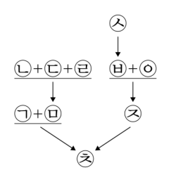
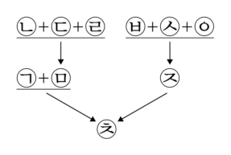
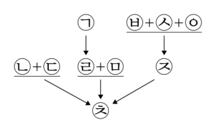
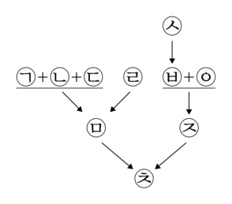
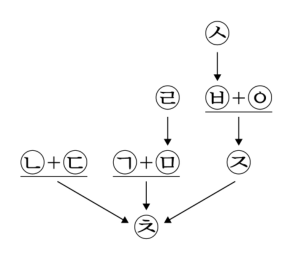
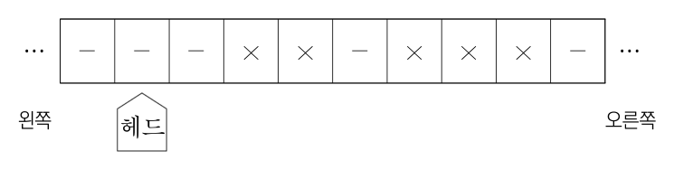

# 01 - RA (2026)

다음으로부터 추론한 것으로 옳은 것만을 <보기>에서 있는 대로 고른 것은?

## 제시문

사회학자 갑은 국가가 개인의 행동을 통제하는 방식을 통제수단의 종류, 통제대상자에게 통제수단이 영향력을 미치는 방식, 통제대상자의 행동선택권 자체에 대한 제한의 유무 등을 고려하여 두 가지로 구분한다. 하나는 법규범을 수단으로 통제대상자의 행동을 직접적으로 금지하거나 의무를 부여하는 ‘직접통제’이다. 다른 하나는 법규범 또는 그 밖의 방법을 수단으로 통제대상자 이외의 대상에게 영향력을 행사함으로써, 종국적으로는 통제대상자의 행동을 유도하거나 제한하는 ‘간접통제’이다.

갑은 직접통제보다는 간접통제를, 간접통제 중에서도 법규범을 활용한 방식보다 ‘사회적 의미’를 활용한 방식을 더 중시한다. 여기서 사회적 의미란 특정 행동에 대하여 사회공동체가 내리는 평가를 말한다. 이러한 주장은 사람들이 사회 내에서 가능한 한 좋은 평가를 받기 위해 또는 가능한 한 나쁜 평가를 받지 않기 위해 행동하며, 이로 인해 법규범보다 사회적 의미가 개인의 행동을 통제하는 더 효과적인 수단이 될 수 있다는 점에 기반한다.

## 보기

ㄱ. 낙태행위를 하려는 임신부를 통제하기 위해, 낙태시술비용에 대해서 의료보험혜택을 받지 못하도록 하는 것은 간접통제인 반면 낙태시술을 한 산부인과 의사를 형법으로 처벌하는 것은 직접통제이다.

ㄴ. 갑이 법규범을 활용한 간접통제보다 사회적 의미를 활용한 간접통제를 중시하는 이유는 후자가 전자보다 통제대상자의 행동선택권 자체를 덜 제한하기 때문이다.

ㄷ. 표준계약서와 다른 계약을 체결하고자 하는 매도인에게 해당 계약이 표준계약서와 다르다는 점을 고지하도록 법으로 정함으로써 매수인이 해당 계약과 표준계약서를 비교하여 계약을 체결하도록 하였다면, 이는 매수인의 계약체결행위에 대한 간접통제이다.

## 선택지

(1) ㄱ

(2) ㄷ

(3) ㄱ, ㄴ

(4) ㄴ, ㄷ

(5) ㄱ, ㄴ, ㄷ

# 02 - RA (2026)

다음으로부터 추론한 것으로 옳은 것만을 <보기>에서 있는 대로 고른 것은?

## 제시문

X국의 군인은 직업군인과 의무복무군인 두 종류가 있다. 현재는 두 종류의 군인 모두 군복무 중 사망한 경우, 순직심사위원회가 군복무와 관련하여 사망하였는지 여부를 기준으로 순직자 또는 일반사망자로 판정하고 있다. 의무복무군인이 국방의 의무를 수행하기 위하여 소집되었다는 특수성을 고려하여, 의무복무군인의 순직 인정 범위를 넓히기 위해 다음 3개의 법안이 발의되었다.

<법안 1> “의무복무자로서 복무기간 중 사망한 군인은 순직자로 본다.”

<법안 2> “의무복무자로서 복무기간 중 사망한 군인은 순직자로 본다. 의무복무자가 전역 후 군복무와 밀접한 관련성이 있는 사유로 인하여 사망한 경우도 같다.”

<법안 3> “의무복무자로서 복무기간 중 사망한 군인은 순직자로 본다. 다만, 자신의 고의 또는 중과실로 인한 위법행위로 사망한 경우에 해당하여 사망이 군복무와 관련성이 없다고 인정되는 경우 순직심사위원회는 해당 군인을 일반사망자로 판정할 수 있다.”

## 보기

ㄱ. 만약 <법안 1> 또는 <법안 2>가 통과되었다면 복무기간 중 사망한 군인이 일반사망자로 판정된 경우 해당 군인은 직업군인일 것이고, 만약 통과된 법안이 <법안 3>이라면 해당 군인은 직업군인이 아닐 수도 있다.

ㄴ. 군인이 군복무로 인하여 질병을 얻고 전역 후 그 질병이 직접 원인이 되어 사망한 경우, <법안 1>과 <법안 3> 중 어디에 따르든 그 사람은 순직자가 되지 않지만, <법안 2>에 따르면 순직자가 된다.

ㄷ. 의무복무자인 군인이 휴가 중 교통사고로 사망한 경우, 해당 군인은 <법안 1>과 <법안 2> 중 어디에 따르든 순직자가 되지만, <법안 3>에 따르면 순직자가 되지 않을 수 있다.

## 선택지

(1) ㄱ

(2) ㄴ

(3) ㄱ, ㄷ

(4) ㄴ, ㄷ

(5) ㄱ, ㄴ, ㄷ

# 03 - RA (2026)

다음으로부터 추론한 것으로 옳은 것만을 <보기>에서 있는 대로 고른 것은?

## 제시문

X국은 산아제한정책을 도입하고자 아래의 3가지 [정책 판단기준]에 따라 [외국의 정책례]를 비교․검토 중이다.

[정책 판단기준]

ⓐ 효율성 기준 : 정책은 적용대상자에게 효율성이 있어야 한다. 효율성이란 이득은 최대화하고 비용은 최소화하는 것을 의미한다. 이때 이득이나 비용은 금전적으로 평가할 수 있는 것만을 말한다.

ⓑ 형평성 기준 : 정책은 적용대상자 간의 형평성을 고려하여야 한다. 형평성이란 정책의 적용을 받는 모두가 경제적 조건에 구애됨 없이 자신의 합법적 선택을 실현할 수단을 동등하게 획득할 수 있음을 말한다.

ⓒ 자율성 기준 : 정책은 적용대상자에게 자율성을 부여하여야 한다. 예컨대 선택을 후회하는 자에게 달리 선택할 기회가 주어지는 경우는 그렇지 않은 경우보다 자율성이 더 높다.

[외국의 정책례]

Y국은 여성에게 평생 자녀 한 명만 출산하게 하는 <u>㉠ ‘고정 할당제’</u>를 운영한다. 이에 따르면 Y국 여성이 2명 이상을 낳으면 국가는 둘째부터 1명당 사회초년생의 2년치 연봉 수준의 벌금을 부과한다. 부유층은 벌금형을 감수하고 자녀를 2명 이상 출산하는 반면 저소득층은 이 정책을 준수한다.

Z국은 여성에게 자녀를 한 명만 출산할 수 있는 허가증을 발행해 주는 <u>㉡ ‘출산허가증 거래제’</u>를 운영한다. 이에 따르면 여성은 허가증을 사용할 수도 있고 판매할 수도 있다. 허가증의 판매금액은 당사자들이 자유롭게 정할 수 있으며 허가증을 판매한 자는 그 누구에게로부터도 허가증을 구매할 수 없다. 여성이 허가증 없이 자녀를 출산할 방법은 없다.

## 보기

ㄱ. ⓐ에 의하면, 출산을 원하지 않는 자에게는 ㉠이 ㉡보다 효율성이 높다.

ㄴ. ⓑ에 의하면, 2명을 출산하려는 자에게는 ㉡이 ㉠보다 형평성이 크다.

ㄷ. ⓒ에 의하면, 출산을 포기했다가 이를 번복하고 출산하려는 자에게는 ㉠이 ㉡보다 자율성이 높다.

## 선택지

(1) ㄱ

(2) ㄷ

(3) ㄱ, ㄴ

(4) ㄴ, ㄷ

(5) ㄱ, ㄴ, ㄷ

# 04 - RA (2026)

㉠의 논거로 가장 적절한 것은?

## 제시문

의족을 착용하고 2024년 장애인육상세계선수권대회 멀리뛰기 종목에서 $8.60\,\mathrm{m}$라는 우수한 기록을 수립한 갑은 2025년 올림픽에 출전하고자 하였으나, 국제올림픽위원회(IOC)는 다음 논거를 들어 갑의 올림픽 출전 불허결정을 내렸다.

첫째, 올림픽 출전자격에 관한 IOC 규정에 따르면, 올림픽에 출전하는 선수는 해당 종목에서 일정 수준 이상의 기록을 가지고 있어야 하고, 그 기록은 ‘올림픽 수준의 세계대회’에서 달성된 것이어야 한다. 갑이 $8.60\,\mathrm{m}$의 기록을 달성한 장애인육상세계선수권대회는 장애인대회여서 올림픽과 같은 수준의 대회라고 볼 수 없다. 둘째, 같은 규정에 따르면, 출전선수가 보조장치를 사용하는 경우에는 해당 장치를 사용하지 않는 선수에 비해 ‘전체적인 경쟁 우위’를 제공하지 않아야 한다. 따라서 장애선수가 사용하는 보조장치가 해당 장애가 없었을 때보다 더 나은 성과를 내게 하는 것이라면 그 보조장치는 사용할 수 없다. IOC 출전자격 심사위원회는 갑이 사용하는 의족이 장애가 없었을 때보다 더 우월한 육상능력을 제공한다고 판단하였다. 셋째, 같은 규정에 따르면, 출전자격 심사위원회의 판단에 불복하는 선수는 해당 장치가 전체적인 경쟁 우위를 제공하지 않는다는 점을 스스로 증명하여야 하는데, 갑은 자신의 의족이 전체적인 경쟁 우위를 제공하지 않는다는 점을 증명하지 못하였다.

갑은 위 결정의 논거를 <u>㉠ 반박</u>하면서 스포츠중재재판소에 제소하였다.

## 선택지

(1) 갑은 의족을 착용하지 않으면 육상 자체를 할 수 없다.

(2) 장애인육상세계선수권대회는 장애인이 참가할 수 있는 권위 있는 육상대회 중 하나이다.

(3) 갑이 수립한 $8.60\,\mathrm{m}$의 기록은 2024년도에 개최된 모든 육상대회에서 나온 멀리뛰기 기록 중 10위에 해당한다.

(4) 도핑테스트에 걸린 선수가 고의로 금지약물을 사용한 것이 아님을 스스로 증명하여 올림픽 출전이 허용되었다.

(5) 본인 기록보다 향상된 기록을 내게 하는 최첨단 수영복이 일부 국가 선수들만 착용할 수 있음에도 올림픽에서 허용되었다.

# 05 - RA (2026)

다음 글에 대한 평가로 옳은 것만을 <보기>에서 있는 대로 고른 것은?

## 제시문

X국에서 피의자가 불구속 상태에서 피해자에게 보복하는 사건들이 많이 발생하였다. 이에 ‘피해자에 대한 보복 우려’를 새로운 구속사유로 추가해야 하는지 여부를 두고 다음과 같은 <견해>가 제시되었다.

<견해>

A : 보복의 우려가 있는 경우 지금까지 법원은 기존 구속사유를 억지로 적용하여 구속하거나 구속사유가 없다는 이유로 구속하지 않았다. 전자의 경우에는 위법한 인신구속이라는 비판이 제기되었고, 후자의 경우에는 보복 범죄를 막을 수 없다는 지적이 있었다. 이런 문제를 해결하기 위해서는 ‘피해자에 대한 보복 우려’를 명시적인 구속사유로 도입하는 것이 바람직하다.

B : 보복의 우려로 인해 피해자 보호가 필요한 경우에 현행 구속제도는 구속과 불구속 중 양자택일해야 한다는 한계가 있다. 하지만 이를 해결하기 위해 새로운 구속사유를 추가하기보다는 제3의 방법을 도입할 필요가 있다. 기존의 구속사유에 해당하지 않지만 보복의 우려가 인정되는 경우, 법원이 피의자의 불구속 상태를 유지하면서 주거 또는 이동 제한, 피해자에 대한 접촉 제한, 특정 행위의 금지, 여권 제출, 공공기관에의 정기적 출석 등의 조건을 피의자에게 부과하는 이른바 ‘조건부 불구속 제도’를 도입하면 충분하다.

## 보기

ㄱ. 피해자에 대한 보복 우려가 구속사유로 규정되어 있는지를 불문하고 그 사유만으로 피의자를 구속하는 것 자체가 인권침해라고 X국의 인권기구가 판단하였다면, 이는 A의 입장을 약화한다.

ㄴ. 조건부 불구속 제도가 도입되더라도 대부분의 판사가 피해자에 대한 보복 범죄가 발생할 경우 직면하게 될 사회적 비난을 피하기 위해 불구속보다는 구속으로 결정할 것이라는 연구 결과가 있다면, 이는 B의 입장을 강화한다.

ㄷ. A와 B 모두 현재의 제도로는 위법 소지에 대한 비판을 감수하고 인신을 구속하지 않는 한, 피해자에 대한 보복 우려를 해소할 수 없다는 점을 인정한다.

## 선택지

(1) ㄱ

(2) ㄴ

(3) ㄱ, ㄷ

(4) ㄴ, ㄷ

(5) ㄱ, ㄴ, ㄷ

# 06 - RA (2026)

다음으로부터 추론한 것으로 옳은 것만을 <보기>에서 있는 대로 고른 것은?

## 제시문

X국 법원은 구금형을 받은 범죄자에게 재범 가능성을 고려하여 <A조치> 또는 <B조치>를 취할 수 있다.

<A조치>

이 조치는 경미한 범죄를 처음 저지르고 유죄판결을 선고받아 구금형의 집행을 받는 사람을 대상으로 한다. 법원은 형기의 $\frac{1}{2}$ 시점에 구금 기간 중 교정의 정도를 고려하여 대상자가 재범 가능성이 낮다고 판단되면 남은 형기(이하 ‘잔여 형기’)의 집행을 중단하는 조치를 선고한다. 집행이 중단되어 석방되면, 잔여 형기 동안 대상자는 교정기관의 감독을 받는다. 교정기관의 감독에 잘 따른 경우 잔여 형기가 만료하는 시점에 선고된 형의 집행이 종료된 것으로 본다. 다만, 교정기관의 감독규정을 위반한 경우에는 다시 구금되고 잔여 형기가 집행된다.

<B조치>

이 조치는 살인 등 중대한 범죄를 저지른 자로서 재범 가능성이 현저히 높은 사람을 대상으로 한다. 법원은 대상자에게 유죄판결을 하면서 “선고된 형기의 종료 시점에 재범 가능성을 평가하여 그 형기를 연장할 수 있다.”라는 내용을 포함하여 선고한다. 형기의 종료 시점에 법원은 구금 기간 중 교정의 정도를 고려하여 대상자가 재범 가능성이 현저히 높다고 판단되면 앞서 선고된 형기의 $\frac{1}{2}$ 범위에서 구금형을 연장하는 조치를 선고한다.

## 보기

ㄱ. <A조치>와 <B조치> 모두 처음 구금형을 선고할 때 대상자가 재범 가능성이 있는지를 판단한다.

ㄴ. 2년의 구금형과 <A조치>가 선고된 사람이 2년의 구금형과 <B조치>가 선고된 사람보다 집행 종료일이 늦어지는 경우가 있다.

ㄷ. 형사처벌로 범죄자가 구금된 기간은 이미 저지른 범죄행위에 상응해야 한다는 원칙에 <A조치>는 부합하지만 <B조치>는 부합하지 않는다.

## 선택지

(1) ㄱ

(2) ㄴ

(3) ㄱ, ㄷ

(4) ㄴ, ㄷ

(5) ㄱ, ㄴ, ㄷ

# 07 - RA (2026)

<견해>로부터 <사례>를 판단한 것으로 옳은 것만을 <보기>에서 있는 대로 고른 것은?

## 제시문

X국의 법은 사기범죄를 통해 취득한 ‘재물이나 재산상 이익’의 가액을 ‘이득액’으로 규정하고, 이를 기준으로 차등하여 처벌한다. 여기서 이득액이 무엇인지에 관해서는 다음과 같이 <견해>가 대립한다.

<견해>

A : 범죄자가 사기행위로 얻은 것은 ‘재물이나 재산상 이익’ 그 자체이기 때문에, 이득액도 그 자체의 가액 전부로 보아야 한다.

B : 이득액은 범죄자가 실질적으로 취득한 이득이다. 즉 이득액은 사기행위를 통해 취득한 ‘재물이나 재산상 이익’ 그 자체의 가액에서, 범죄자가 거래를 위하여 현실적으로 상대방에게 지불한 대가를 공제한 것이다.

<사례 1>

갑은 을에게 토지를 시가 16억 4,600만 원에 매수하기로 하고 대금의 일부인 10억 2,600만 원을 지급하면서 토지의 소유권을 넘겨주면 이후에 나머지 금액을 변제하겠다고 속여 을로부터 위 토지의 소유권을 이전받았으나 나머지 금액을 지급하지 않았다.

<사례 2>

갑은 을로부터 시가 15억 3,000만 원의 토지를 구입하려고 시도하였으나 을은 절대 팔지 않겠다고 하였다. 이에 갑은 을의 토지가 공시지가 8억 1,000만 원에 헐값으로 국가에 수용될 것이라고 을을 속이고 위 시가의 토지를 10억 2,000만 원에 구입하였다.

## 보기

ㄱ. <사례 1>과 <사례 2>를 포함하여 그 어떤 사건에서든 A에 따르는 것이 B에 따르는 것보다 이득액이 더 크게 산정된다.

ㄴ. B에 따르면, <사례 1>에서의 이득액과 <사례 2>에서의 이득액 차이는 1억 1,000만 원이다.

ㄷ. <사례 2>에서 갑이 토지를 취득한 시점에 토지의 시가가 10억 2,000만 원으로 하락하였다면, 하락하지 않았을 경우와 비교하여 A에 따르면 이득액이 동일하지만 B에 따르면 이득액이 달라진다.

## 선택지

(1) ㄴ

(2) ㄷ

(3) ㄱ, ㄴ

(4) ㄱ, ㄷ

(5) ㄱ, ㄴ, ㄷ

# 08 - RA (2026)

다음 글에 대한 분석으로 옳은 것은?

## 제시문

A : X국은 빠른 속도로 고령화가 진행되고 있으나, 노인돌봄을 위한 인력과 시설이 턱없이 부족합니다. 이미 초고령사회에 진입한 만큼 노인돌봄현장은 점점 심각한 상황에 빠지게 될 것입니다. 노인돌봄을 위한 인력을 확보하는 것이 가장 급선무이고, 이를 위해서는 비자제도 개선을 통해 외국인 인력의 유입을 적극 검토해야 합니다. 그들은 매우 의욕적으로 일할 겁니다.

B : 불경기로 취업이 어려워 노인돌봄현장으로 인력이 유입되면서 그나마 노인돌봄현장의 고용상황이 개선되었지만, 노동강도에 비해 보수 수준이 낮아 인력 이탈이 많이 일어나 필요한 인력을 확보하기는 여전히 어렵습니다. 공적자금 투입을 통한 처우 개선 없이 이 상황은 변하지 않을 것입니다. 청년층이 기피하는 노인돌봄현장에 외국인 인력을 받아들이는 것도 방법이지만, X국은 이민정책에 매우 소극적이어서 전국 각지의 돌봄현장에서 외국인 인력을 충분히 확보하기까지는 상당한 시간이 걸릴 것입니다.

C : 노인돌봄시설로의 노동인구 유입이 증가한 것은 사실이지만 이 정도의 증가로는 고령화의 추세에 대응하기에 부족합니다. 따라서 외국인 인력의 유입을 적극 추진해야 합니다. 이들은 적은 임금에도 의욕적으로 일하므로 X국의 경제수준으로 볼 때 조금만 임금이 향상되면 더욱 우수한 외국인 인력이 유입될 것입니다. 더 나아가 외국인 인력이 유입된다고 하더라도 인력은 여전히 부족할 것이므로 돌봄노동을 분담할 공공로봇을 개발하여 노인돌봄시설에 보급해야 할 것입니다.

## 선택지

(1) 돌봄노동 종사자에 대한 처우가 개선되어야 한다는 점에 대해 A와 B의 견해는 같다.

(2) 외국인 돌봄노동인력이 우수하고 의욕적으로 일한다는 점에 대해 A와 C의 견해는 같다.

(3) 외국인 돌봄노동인력의 수가 증가하고 있다는 점에 대해 B와 C의 견해는 다르다.

(4) 노인돌봄현장의 인력 부족 상황은 시장에만 맡겨서는 해결되지 않는다는 점에 대해 A, B, C의 견해는 같다.

(5) 불황이 계속되면 노인돌봄시설로 노동인구가 유입되어 노인돌봄현장의 노동 인력 공급이 안정된다는 점에 대해 A, B, C의 견해는 같다.

# 09 - RA (2026)

다음으로부터 <사례>를 판단한 것으로 옳지 않은 것은?

## 제시문

X국에서는 교통사고가 발생한 경우 가해자와 피해자가 직접 합의하는 것이 현실적으로 어려우므로 일반적으로 제3자가 주도하여 합의를 이끌어 낸다. 이때 피해자에게 금전적으로 가장 유리한 조건을 제시한 제3자의 주도하에 합의가 이루어질 가능성이 높다.

영업용 택시가 교통사고를 내면 과거에는 사고차량 회사의 해결 전담자인 ‘사고상무’가 나타나 다음과 같은 수습 노력을 하였다. 우선 사고상무는 피해자가 입원해 있는 병원으로 찾아가 약간의 위로금을 전달하며 피해자에게 정중하게 사과와 위로의 뜻을 표해 분노의 감정을 누그러뜨린다. 그 후 또 병문안을 가면서 우는 아이를 업은 사고 운전기사의 배우자를 대동하여 우리 가족을 한 번만 살려 달라고 읍소를 하게 한다. 이렇게 피해자의 마음을 움직여 결국 피해자가 소송을 통해 받을 수 있는 돈보다 적은 돈을 건네고 합의를 이끌어 낸다. 피해자가 법적으로 받을 수 있는 돈의 액수를 모를수록, 피해자의 권리의식이 낮을수록, 피해자의 사정이 급박할수록 사고상무의 활약이 더 두드러진다. 그러나 최근에는 교통사고 손해산정이 객관화되면서 사고상무의 역할이 많이 줄어 들었다. 오히려 교통사고의 정보를 입수한 ‘사건브로커’가 나타나 판결로 받아낼 수 있는 배상금을 계산하여 제시하며 자기가 합의를 이끌어 내겠다고 피해자를 유도한다. 합의를 이끌어 낸 사건브로커는 피해자가 지급받은 합의금에서 고정 비율의 돈을 수수료 명목으로 챙긴다.

<사례>

갑은 2025년 6월 22일 횡단보도를 건너던 중 택시회사 A에 소속된 기사 을이 운전하는 택시에 치여 골절상을 입고 병원에 입원했다. A에는 사고상무 병이 있다. 사건브로커 정이 현재 갑을 접촉한 상황이다.

## 선택지

(1) 병이 제시하는 위로금과 합의금을 합한 금액이 정을 통해서 받을 합의금에서 수수료를 공제한 금액보다 크면, 합의는 병의 주도하에 이루어질 가능성이 높다.

(2) 병과 정이 합의금으로 같은 금액을 제시하였는데 그 금액이 소송으로 받을 수 있는 돈보다는 많은 경우라면, 합의는 병의 주도하에 이루어질 가능성이 높다.

(3) 판결을 통해 얻을 수 있는 배상액보다 소송비용이 더 많이 든다면, 소송으로 가기보다는 병 또는 정의 주도하에 합의가 이루어질 가능성이 높다.

(4) 갑은 최대한 빨리 합의금을 받아야 할 사정이 있고 을과 A가 이러한 사정을 알고 있다면, 병의 주도하에 합의가 이루어질 가능성이 높다.

(5) 정이 받는 수수료 액수가 많으면 많을수록, 합의는 병의 주도하에 이루어질 가능성이 높다.

# 10 - RA (2026)

<견해>로부터 <사례>를 판단한 것으로 옳은 것만을 <보기>에서 있는 대로 고른 것은?

## 제시문

온라인중개플랫폼(이하 ‘플랫폼’)에서 상품이 거래된 경우, 판매자와 플랫폼 운영자 중 누가 소비자와 거래를 한 매도인으로서 계약당사자인지를 두고 <견해>가 나뉜다.

<견해>

A : 계약당사자는 계약의 내용을 실질적으로 결정한 자이다. 플랫폼에 게시된 계약의 조건이나 내용을 실질적으로 결정한 자가 당사자가 된다.

B : 계약당사자는 소비자의 인식을 기준으로 판단하여야 한다. 소비자는 자신이 지급한 대금을 직접 수령하는 자를 당사자로 인식하는데, 대금을 직접 수령하는 자란 소비자가 환불의 주체로 생각하는 자이다.

C : 계약당사자는 계약에 관하여 책임을 지도록 법에서 규정한 자이다. 소비자에게 손해가 발생하였을 때 그에 대해 책임을 지는 자가 당사자가 된다.

<사례>

X국의 갑은 숙박예약 플랫폼인 ≪떠나요≫를 운영하는 사업자이다. 소비자는 ≪떠나요≫에서 여러 숙박업체의 숙소를 검색하여 예약할 수 있고, 예약 시 신용결제의 방법으로 숙박대금을 지불해야 한다. ≪떠나요≫에 숙박상품과 가격 등 판매조건을 등록한 을이 게시한 약관에는 고객이 예약을 취소할 경우 취소 시점과 상관없이 미리 결제한 숙박대금을 일절 환불받지 못한다는 조항이 있다. X국 당국은 이 조항이 소비자에게 불리하다고 보고, 이 조항의 사용금지를 계약당사자인 매도인에게 명령하려고 한다.

## 보기

ㄱ. ≪떠나요≫에서 숙박상품 예약 시 신용결제를 받는 사업자가 갑이며 소비자가 갑에게 환불을 요청한 경우, A와 B 중 어디에 따르든 갑에게 사용금지를 명령할 수 있다.

ㄴ. X국 법이 플랫폼을 통해 이루어진 판매계약과 관련하여 매수인에게 손해가 발생한 경우 계약에 따른 손해배상책임은 플랫폼이 지도록 정하고 있다면, B와 C 중 어디에 따르든 을에게만 사용금지를 명령할 수 있다.

ㄷ. 갑이 결정한 판매조건 및 약관을 따라야만 ≪떠나요≫를 이용할 수 있어 을이 ≪떠나요≫에서 결정한 내용만으로 숙박상품을 판매하였다고 가정할 때, A에 따르면 갑에게 사용금지를 명령할 수 있으나 을에게는 사용금지를 명령할 수 없다.

## 선택지

(1) ㄱ

(2) ㄷ

(3) ㄱ, ㄴ

(4) ㄴ, ㄷ

(5) ㄱ, ㄴ, ㄷ

# 11 - RA (2026)

<견해>에 대한 평가로 옳은 것만을 <보기>에서 있는 대로 고른 것은?

## 제시문

갑은 을이 빌린 돈을 갚지 않자 을에게 갚으라고 하였다. 을은 돈이 없다며 갚지 않았고, 갑이 알아보니 을은 병에게서 받을 돈이 있음에도 받아내지 않고 있었다. 이러한 상황에서 갑이 병을 상대로 을에게 돈을 지급하라고 할 권리가 있는지에 대해 다음과 같은 <견해>가 있다.

<견해>

A : 권리자만이 권리를 행사할 수 있고, 의무자는 권리자가 주장한 경우에 한하여 의무를 이행해야 한다. 권리자가 그 권리를 행사할 것인지 여부는 전적으로 권리자의 자유인데, 이를 제3자가 행사하는 것은 권리자의 자기결정권을 침해한다. 다만, 제3자가 권리자의 권리를 넘겨받기로 약정하거나 의무자의 의무를 떠맡기로 약정하였다면 그 스스로 권리 또는 의무의 당사자가 되었기 때문에 더는 제3자가 아니다.

B : 을은 병에게서 돈을 받더라도 어차피 갑에게 갚아야 할 것이므로 구태여 시간과 비용을 들여 병에게 권리행사를 하지 않을 것이다. 만약 이때 직접적인 권리자만이 권리를 행사할 수 있다고 본다면 결국 병은 누구에게도 돈을 지급하지 않게 되는 반사적 이익을 누리게 되고, 갑이 을에게서 돈을 받을 수 없는 상황은 계속된다. 이러한 이유에서 권리자 및 의무자의 상황, 제3자와 권리자의 관계, 제3자의 권리보장의 필요성을 고려하여 직접적인 권리가 없는 제3자도 의무자를 상대로 권리를 행사할 수 있다.

## 보기

ㄱ. a가 장기간 유럽 여행을 갔는데 옆집 b가 a의 집안에 쓰레기를 버리자 이를 본 c가 a의 동의를 얻지 않고 a를 대신하여 b에게 그 쓰레기를 치우라며 제기한 주장을 법원이 인정한 사례는 A를 약화한다.

ㄴ. d의 아버지인 e가 의무자 d의 채무를 대신 갚아주기로 권리자 f와 약속한 경우, 법원이 e에 대한 f의 청구를 인정한 사례는 B를 강화한다.

ㄷ. g가 일으킨 교통사고로 h가 의식불명에 빠졌는데 h의 아들 i가 g에 대한 h의 권리를 대신 행사한 것을 법원이 인정하지 않은 사례는 A를 약화하고 B를 강화한다.

## 선택지

(1) ㄱ

(2) ㄷ

(3) ㄱ, ㄴ

(4) ㄴ, ㄷ

(5) ㄱ, ㄴ, ㄷ

# 12 - RA (2026)

다음으로부터 추론한 것으로 옳은 것만을 <보기>에서 있는 대로 고른 것은?

## 제시문

X국의 등기부나 토지대장 등의 공적장부(이하 ‘공부’)에서는 면적 단위로 제곱미터($\mathrm{m}^2$)를 쓰고, 일반적인 거래 실무에서는 제곱미터와 평(坪)을 혼용하고 있다. 1평은 $3.3058\,\mathrm{m}^2$이고, $1\,\mathrm{m}^2$는 0.3025평에 해당한다. 토지의 면적은 등기비용을 산정하는 데 중요한 기준이 되는데, 지역과 관계없이 면적당 같은 등기비용이 부과되지만, 단위면적당 등기비용은 논이 밭이나 임야의 2배이다.

한편 X국의 오래된 공부에는 ‘정단무보(町段畝步)’로 면적이 표기되어 있는 경우도 있다. 이 ‘정단무보’는 1900년대에 공부를 처음 만들 때부터 쓰던 토지의 면적 단위이다. 1정은 밭두둑을 의미하고, 1단은 물에 흙이 쓸려 내려간 단층 면적을 의미하며, 1무는 밭이랑 면적만큼을 나타내고, 1보는 사람의 한 걸음만큼의 면적을 나타낸다. 이를 평으로 환산하면, 1정은 3,000평, 1단은 300평, 1무는 30평, 1보는 1평에 해당한다. 이 ‘정단무보’는 임야나 밭의 면적 단위에 사용하였다. 토지의 면적에 대해 오늘날 법령에서 종종 사용하는 단위로, 아르(a)와 헥타아르($\mathrm{ha}$)도 있다. 1아르는 가로세로가 모두 $10\,\mathrm{m}$인 정사각형의 면적이고, 1헥타아르는 가로세로가 모두 $100\,\mathrm{m}$인 정사각형의 면적을 의미한다. 한편 P와 Q지방에서는 논의 고유한 면적 단위로 ‘계(界)’를 사용했다. 1계는 쌀 1톤의 수확량을 얻기 위해 필요한 논의 면적을 말한다. 1계의 면적은 P와 Q지방에서 달랐는데 P지방에서는 100평을 1계로 불렀고, Q지방에서는 300평을 1계로 불렀다.

## 보기

ㄱ. P지방의 ‘1헥타아르의 논 A’와 Q지방의 ‘밭이랑 200개에 해당하는 면적의 임야 B’를 상속한 을이 자기 앞으로 등기를 이전하는 경우에, 을은 B보다 A의 등기비용을 더 지출하게 된다.

ㄴ. 갑이 등기소에 2정 3단 1무 10보의 토지를 등기신청하였는데, 등기공무원이 등기부에 $22,900\,\mathrm{m}^2$로 기재하였다면, 실제 면적보다 등기부에 작게 기재된 것이다.

ㄷ. P지방의 논 C에서 얻을 수 있는 쌀 수확량과 Q지방의 논 D에서 얻을 수 있는 쌀 수확량이 같다면 C 면적이 D 면적의 3배이다.

## 선택지

(1) ㄱ

(2) ㄷ

(3) ㄱ, ㄴ

(4) ㄴ, ㄷ

(5) ㄱ, ㄴ, ㄷ

# 13 - RA (2026)

다음 논쟁에 대한 분석으로 옳은 것만을 <보기>에서 있는 대로 고른 것은?

## 제시문

X국에서는 살인을 저지른 흉악범 중 판사가 양심에 따라 특별히 극악무도한 범죄를 저질렀다고 판단하는 사람에게만 사형선고를 내린다. 그러나 1991년부터 2010년까지의 통계자료를 검토한 결과, 사형선고를 받은 사람 중 A인종의 비율이, 살인을 저지른 흉악범 중 A인종의 비율에 비해 월등히 높은 것으로 드러났다.

갑 : 통계자료에서 드러난 바는 판사가 가진 사회적 편견이 사형선고에 암암리에 영향을 미치고 있음을 의미한다. 범죄와 무관한 요소가 처벌에 영향을 미친다면, 이는 정의로운 처벌이 될 수 없다. 따라서 현행 제도에서 사형선고를 받는 사람은 정의롭지 않은 처벌을 받고 있는 것이다.

을 : 정의란 범죄자들을, 설령 일부만 처벌할 수 있더라도, 가능한 한 많이 처벌할 것을 요구한다. 모두를 똑같이 정의롭지 못하게 처우하는 것이, 적어도 일부에게라도 정의를 실현하는 것보다 나은 선택일 수는 없다. 사형이 흉악범 중 일부에게만 차별적으로 적용된다고 해도, 그것이 그들의 죄에 마땅한 처벌인 한, 적용된 각 경우에서 여전히 정의로운 형벌이다. 음주운전자 중 단속에 적발된 극히 일부만 처벌하는 것이 정의의 관점에서 문제가 되지 않는 것과 같은 이치이다.

갑 : 만약 음주운전자 중 소득이 일정 수준 이하인 사람만 골라서 처벌한다면 어떨까? 아무리 음주운전자가 마땅히 받아야 할 처벌이라고 하더라도, 범죄와 무관한 요소가 처벌에 영향을 주고 있다면 정의로운 처벌이 될 수 없다.

을 : 음주운전자 중 어떤 부류의 사람들을 의도적으로 골라서 처벌한다면, 그런 처벌은 분명 정의롭지 않을 것이다. 그러나 그런 의도가 없는 한, 결과적으로 처벌받은 사람 중 특정 부류 사람들의 비율이 높다고 해서, 범죄와 무관한 요소가 처벌에 영향을 미쳤다고 볼 수는 없다.

## 보기

ㄱ. 갑의 관점에 따르면, 판사의 재량을 최소화하고 공통의 기준을 마련하여 그에 따라 사형선고를 하도록 하는 것은, 처벌의 정의라는 관점에서 현행 제도를 개선하는 방안이 될 수 있다.

ㄴ. 을의 관점에 따르면, 처벌의 정의가 온전히 실현될 경우 살인을 저지른 흉악범 중 사형선고를 받는 사람의 비율은 줄어들 것이다.

ㄷ. 2010년 이후 10년간의 사형선고 기록을 추가 조사한 결과 A인종에의 편향이 증가했다면, 갑의 입장은 강화되고 을의 입장은 약화될 것이다.

## 선택지

(1) ㄱ

(2) ㄴ

(3) ㄱ, ㄷ

(4) ㄴ, ㄷ

(5) ㄱ, ㄴ, ㄷ

# 14 - RA (2026)

다음 글에 대한 분석으로 옳은 것만을 <보기>에서 있는 대로 고른 것은?

## 제시문

A : 동일한 선택지임에도 불구하고 그것이 어떻게 기술되느냐에 따라 선택자의 선호가 달라지는 현상이 있다. 예를 들어, 두 사람이 2개의 사과와 1개의 망고 중 하나만 선택할 수 있는 상황에서, “망고를 먹을래?”에 그러겠다고 답하는 사람이 “다른 사람이 망고를 고르지 못하게 할래?”에는 그러지 않겠다고 답할 수 있다. 이 현상은 사람들의 선호에 비합리성이 있다는 것을 보여준다. 그 이유는 이 현상이, “ ‘$a$’와 ‘$b$’가 같은 것을 지칭하는 다른 기술일 때, ‘$a$’가 들어간 어떤 문장에 ‘$a$’ 대신 ‘$b$’를 대입하여도 그 문장의 참, 거짓이 바뀌지 않는다.”라는 원리 $P$를 위반하기 때문이다. 이 원리에 따르면, ‘$a$’와 ‘$b$’가 같은 것을 지칭할 때 “$S$가 $a$를 다른 것보다 선호한다.”가 참이면 “$S$가 $b$를 다른 것보다 선호한다.”도 참이어야 한다.

B : 원리 $P$가 항상 성립하는 것은 아니다. 예를 들어, <u>㉠ ‘잭’과 ‘런던의 연쇄 살인마’</u>가 같은 사람을 지칭한다고 하더라도, “제인은 잭과 밤을 함께 보내길 원한다.”가 참이면서 “제인은 런던의 연쇄 살인마와 밤을 함께 보내길 원한다.”는 거짓일 수 있다. 원리 $P$는 ‘∼를 원한다’와 같은 표현이 사용된 문장에서는 성립하지 않는다. 이런 문장에서 ‘$a$’와 ‘$b$’를 바꾸어 써도 진리치가 바뀌지 않으려면, ‘$a$’와 ‘$b$’가 같은 것을 지칭할 뿐만 아니라 그 내포적 의미도 동일해야 한다. ‘∼를 선호한다’도 이런 점에서 다르지 않다. 따라서 기술에 따른 선호 변화가 선호의 비합리성을 보여주는지 여부는 이런 엄격한 조건에 따라 판단되어야 한다.

## 보기

ㄱ. 원리 $P$가 사람들이 위반할 수 있는 규범적인 원칙이 아니라 절대로 거짓이 될 수 없는 논리적 원칙이라면, 한 사람이 두 선택지에 대해서 다른 선호를 갖고 있는 경우 그 두 선택지는 기술에서뿐만 아니라 실제로도 서로 다른 선택지이다.

ㄴ. ㉠이 참일 때, 제인이 런던의 연쇄 살인마가 체포되는 것을 선호하지만 잭이 체포되는 것은 선호하지 않는다면, A는 제인의 선호가 비합리적이라고 볼 것이다.

ㄷ. ‘$\frac{2}{3}$가 비어있는 물병’과 ‘$\frac{1}{3}$이 채워져 있는 물병’이 내포적 의미가 동일함을 아는 사람들도 둘에 대해 다른 선호를 보인다면, A와 B 모두 이를 선호의 비합리성을 보여주는 사례로 볼 것이다.

## 선택지

(1) ㄱ

(2) ㄷ

(3) ㄱ, ㄴ

(4) ㄴ, ㄷ

(5) ㄱ, ㄴ, ㄷ

# 15 - RA (2026)

다음 글에 대한 분석으로 옳은 것만을 <보기>에서 있는 대로 고른 것은?

## 제시문

A : 과거의 행동에 대해서 후회하는 사람은 자신이 잘못된 행동을 했다고, 그래서 그것을 하지 말았어야 했다고 판단한다. 이런 판단은 후회의 본질적인 요소이긴 하지만, 그것 자체로 과거 행동에 대한 후회가 되는 것은 아니다. 과거의 행동에 대한 후회는 그것에 대한 괴로움의 감정 역시 포함한다. 이렇게 보았을 때, 후회가 합리적일 수 있을까? 내가 잘못된 행동을 했고 그것을 하지 말았어야 했다고 판단하는 것은 나에게 이로울 수 있다. 행동의 수정으로 이끌어 궁극적으로 미래의 나에게 좋은 영향을 미칠 수 있기 때문이다. 그러나 괴로움의 감정은 어떤가? 안 그래도 안 좋은 일을 했는데 안 좋은 감정까지 느낀다면, 이는 비참함에 비참함을 더하는 것과 다르지 않을 것이다. 미래의 행동을 고치기 위해서는 과거에 잘못된 행동을 했다고 판단하는 것으로 충분하므로 그것에 대해 괴로워하는 것은 쓸모없는 일이다. 결국 후회는 합리적이지 않다는 결론에 이른다.

B : 후회에 들어 있는 괴로움의 감정에 비합리적인 것은 아무것도 없다. 사람들은 어떤 물건, 사람, 원칙에 가치를 두고, 그것에서 삶의 의미를 얻는다. 어떤 것에 가치를 둔다는 것은 무엇을 의미할까? 어떤 것에 가치를 두는 사람은 그것을 획득하고자 하고, 지속해서 그것을 마음속에 떠올리는 성향이 있다. 그러나 그것이 전부일 리 없다. 어떤 것에 가치를 둔다는 것은 감정적인 요소도 포함한다. 가치를 둔 것을 잃거나 저버리면 슬퍼하고, 그것을 잃거나 저버리는 행동을 하면 괴로움의 감정을 느낀다. 후회할 때 느끼는 괴로움의 감정은 어떤 것에 가치를 둔다는 것으로부터 필연적으로 파생하는 것이다.

## 보기

ㄱ. ‘자신의 행동에 대한 괴로움의 감정’이 사실은 자신이 잘못된 행동을 했다는 판단을 일컫는 다른 말에 불과하다면, A의 입장은 약화된다.

ㄴ. B는 과거 행동에 대한 괴로움의 감정이 미래 행동에 이로움을 줄 수 있음을 지적하여 A를 반박하고 있다.

ㄷ. A와 B는 후회가 감정의 요소를 가지는지에 대해서는 의견이 같지만, 판단의 요소를 가지는지에 대해서는 의견이 다르다.

## 선택지

(1) ㄱ

(2) ㄴ

(3) ㄱ, ㄷ

(4) ㄴ, ㄷ

(5) ㄱ, ㄴ, ㄷ

# 16 - RA (2026)

다음으로부터 추론한 것으로 옳은 것은?

## 제시문

상대방을 경어법으로 대우하는 절차는 호칭 대명사에서 간명하게 체계화된다. 예컨대, 라틴어 2인칭 대명사가 평칭어 ‘tu’와 경칭어 ‘vos’로 양분되듯이, 대다수 서양어의 2인칭 대명사는 평칭어(T)와 경칭어(V)로 양분된다. 이들 대명사의 사용은 우선 지위에 의해 결정된다. 연장자와 연하자, 부모와 자녀, 고용주와 고용인, 귀족과 평민, 장교와 사병 사이에는 지위의 차이가 있고, 상위자는 하위자에게 T를, 하위자는 상위자에게 V를 사용한다. 만일 지위가 동등하다면 서로 V를 사용하거나 서로 T를 사용하는데, V의 생성과정상 초기에 귀족층은 V를, 평민층은 T를 사용하였다.

이들 대명사의 선택을 결정하는 요인으로는 지위 이외에 유대(혹은 친근도)도 있다. 가족, 동향, 동지 등과 같은 어떤 공통 바탕에 따라 유대의 두터움 정도가 사람마다 다른데, 그러한 가까움의 정도가 지위 못지않은 요인으로 작용한다. 예를 들어, 지위가 동등하더라도 가까운 사이가 아니라면 서로 V를, 가까운 사이라면 서로 T를 쓴다. 지위의 차이가 있을 때는 한쪽은 V를 다른 한쪽은 T를 쓰고, 지위가 동등할 경우는 친근도에 따라 서로 T를 주고받거나 서로 V를 주고받는다.

20세기 중반 이후 점차 유대가 지위보다 더 중요한 요인으로 부상한다. 가령, 고객은 점원보다 지위에서 더 높다고 볼 수도 있으나 둘은 전혀 모르는 사이다. 지위의 차이만 고려하면 고객이 점원에게 T를 써야 하나 실제로는 그러기 어렵다. 지위만 고려하면 자식은 부모에게 V를 써야 하지만, 워낙 친근한 사이라서 T를 쓰는 일이 흔하다. 이는 지위의 차이와 상관없이 친근한 사이에서는 서로 T를, 그렇지 않은 사이에서는 서로 V를 사용하는 양상이 크게 확대되었음을 말해준다. 그렇지만 서로 V를 주고받다가 친해지면서 서로 T를 사용하자고 제안할 때 그 제안자가 하위자일 수는 없다는 점에서, 여전히 지위의 고하가 명맥을 유지하고 있다.

## 선택지

(1) 시대와 상관없이 서양에서 갑이 을에게 V를 사용한다면, 적어도 을이 갑보다 지위에서 하위자는 아니다.

(2) 시대와 상관없이 서양에서 지위가 동등한 자들끼리 T를 사용하는 경우보다 유대가 깊은 자들끼리 T를 사용하는 경우가 더 많다.

(3) 20세기 중반 이후에는 서양에서 한쪽은 V를 사용하고 다른 한쪽은 T를 사용하며 서로 대화하는 양상이 그 이전보다 줄어들었다.

(4) 20세기 중반 이후 서양에서 갑과 을이 서로 V를 사용하다가 서로 친분이 쌓이면서 갑의 제안으로 서로 T를 쓰게 되었다면, 갑이 을보다 지위에서 상위자이다.

(5) 20세기 중반 이전에는 서양에서 갑과 을이 서로 V를 사용하다가 갑의 지위가 상승하여 상위자가 되었을 때, 갑과 을이 여전히 V를 사용하게 되는 경우가 그 이후보다 많았다.

# 17 - RA (2026)

㉡에 대한 평가로 옳은 것만을 <보기>에서 있는 대로 고른 것은?

## 제시문

‘마음 이론 능력’이란 자신과 타인의 마음을 의식하고 이해하는 능력을 가리키는데, 유아가 이 능력을 갖추려면 <u>㉠ 세 가지 능력</u>이 발달해야 한다. 첫째, 사물에 대한 표상과 자신의 심성 상태에 대한 표상을 형성할 수 있어야 한다. 둘째, 표상에 대한 표상인 메타 표상을 형성할 수 있어야 하며, 특히 자신처럼 타인도 무언가를 표상할 수 있음을 인식하고 그 타인의 표상을 표상할 수 있어야 한다. 셋째, 메타 표상 능력을 이용하여 가상과 실재를 구분하는 ‘가상 놀이’를 할 수 있어야 한다.

유아가 ‘마음 이론 능력’을 획득했는지 평가하는 실험에서 활용하는 방법인 ‘틀린 믿음 과제’는 다음과 같다. 유아에게 어떤 상황을 말없이 보여준 후, 등장인물이 어떤 행동을 할지에 대해 추측해 보라는 질문을 한다. 예컨대, 갑이 방에 들어와 초콜릿을 둥근 바구니에 숨기고 퇴장한 후 곧이어 을이 그 방에 나타나 둥근 바구니에서 초콜릿을 꺼내 네모상자에 넣는 장면을 유아에게 보여준다. 그런 다음 “갑이 방으로 돌아오면 초콜릿을 어디에서 찾을까?”라고 질문한다. 이 과제에 참여한 유아 가운데 4세 이상은 대부분 갑이 초콜릿을 둥근 바구니에서 찾을 것이라고 답변한 반면, 4세 미만은 대부분 갑이 초콜릿을 네모상자에서 찾을 것이라고 답변했다. 이와 유사한 반복실험 결과를 근거로 일부 심리학자들은 <u>㉡ 4세경에 ‘마음 이론 능력’을 갖춘다</u>고 주장한다.

## 보기

ㄱ. ‘틀린 믿음 과제’에서 적절한 답변을 하기 위해, ㉠ 외에 옳은 믿음으로 받아들일 수 있는 것과 그렇지 않은 것을 구분하는 별도의 사고 능력이 필요하다는 점이 인정된다면, ㉡은 약화된다.

ㄴ. 사탕 봉지 안에서 연필을 발견하고 깜짝 놀란 유아에게 “이 봉지 안을 아직 보지 못한 아이는 봉지 안에 무엇이 있다고 생각할까?”라고 물었을 때, 4세 미만은 연필이라고 답변하지만 4세 이상은 사탕이라고 답변하는 경우가 많다면, ㉡은 강화된다.

ㄷ. 유아가 매우 좋아할 장난감을 선반 꼭대기에 올려놓고 4세 미만에게 보여준 후 장난감이 어디에 있는지 잊었다고 말하면서 실험자가 장난감의 소재를 물었을 때, 양육자가 유아를 곁에서 가만히 지켜볼 때보다 양육자가 현장에 없을 때 장난감을 가리키는 경우가 더 많다는 실험 결과는 ㉡을 강화하지도 약화하지도 않는다.

## 선택지

(1) ㄱ

(2) ㄷ

(3) ㄱ, ㄴ

(4) ㄴ, ㄷ

(5) ㄱ, ㄴ, ㄷ

# 18 - RA (2026)

다음 논쟁에 대한 분석으로 적절한 것만을 <보기>에서 있는 대로 고른 것은?

## 제시문

A : 거짓을 말한다고 해서 곧 거짓말이 되는 것은 아니다. 다른 사람을 속일 의도로 거짓을 말하는 것이 거짓말이다. 즉, 명제 $P$가 거짓이고 그것을 아는데도 불구하고 상대로 하여금 $P$가 참이라고 믿게 하려고 $P$를 말하는 것이 거짓말이다.

B : 실제로 거짓을 말해야 거짓말이 되는 것은 아니다. 자신이 거짓이라고 믿는 명제를 다른 사람이 참이라고 믿게끔 하기 위해 진술한다면 거짓말이 된다. 즉, $P$가 거짓이라 믿음에도 불구하고 상대로 하여금 $P$가 참이라고 믿게 하려고 $P$를 말하는 것이 거짓말이다.

C : 거짓이라 믿는 명제를 속일 의도로 말한다고 해서 다 거짓말이 되는 것은 아니다. 내가 어떤 명제를 믿지 않음에도 그것을 믿는 척 속이려 한다면 거짓말이 된다. 즉, $P$를 참이라 믿지 않음에도 상대로 하여금 내가 $P$를 참이라 믿는다고 믿게 하려고 $P$를 말하는 것이 거짓말이다.

<사례>

◦ 범죄 혐의자인 아버지를 숨겨 주고 있는 갑은 아버지의 행방을 묻는 경찰에게 “아버지는 뒷산에 숨어 있어요.”라고 대답한다. 갑이 모르는 사이 아버지는 실제로 뒷산에 숨어 있었다.

◦ 범죄 조직의 두목인 을은 그의 부하 돌쇠가 경찰 정보원이라고 확신하고 있다. 돌쇠와 대화를 하던 중 을은 그를 안심시키기 위해 “내 조직에 경찰 정보원은 없다.”라고 말한다.

◦ 폭력 범죄를 목격한 병은 폭력 가해자로부터 거짓 증언을 해 달라는 살해 협박에 시달리고 있다. 자신이 범죄를 목격했다는 것을 모든 국민이 알고 있다고 생각함에도 불구하고, 살해당할 것을 두려워한 병은 “폭력을 목격한 적이 없다.”라고 법정에서 진술한다.

## 보기

ㄱ. 갑의 진술이 거짓말이라는 것에 A도 B도 동의하지 않는다.

ㄴ. 을의 진술이 거짓말이라는 것에 C는 동의하지만 A는 동의하지 않는다.

ㄷ. 병의 진술이 거짓말이라는 것에 B와 C 모두 동의한다.

## 선택지

(1) ㄴ

(2) ㄷ

(3) ㄱ, ㄴ

(4) ㄱ, ㄷ

(5) ㄱ, ㄴ, ㄷ

# 19 - RA (2026)

다음 글에 대한 평가로 적절한 것만을 <보기>에서 있는 대로 고른 것은?

## 제시문

도덕 실재론자 갑은 옳고 그름을 평가하는 우리의 의견이나 태도와는 독립적인 도덕적 참이 있으며 우리에게는 이러한 도덕적 참을 알 수 있는 심적 능력이 있다고 주장한다. 예컨대, 특정한 인종이나 성이라는 것 때문에 사람을 차별해서는 안 된다는 것은 도덕적 참이며 우리는 이것을 알 수 있는 심적 능력이 있다는 것이다.

하지만 진화론자 을에 따르면, 인간의 심적 능력은 자연선택의 산물이다. 이 능력은 환경에의 적응과 유전자의 증식 극대화를 위해 생긴 것이다. 우리의 평가적 태도와 독립적인 도덕적 참이 존재한다고 해도, 자연선택은 인간에게 그러한 도덕적 참을 알 수 있는 심적 능력을 부여하지 않았다. 어떤 행위가 생물학적 적응에 도움이 된다면 그 행위가 갑이 말하는 도덕적 참과 상충한다 해도, 자연선택은 그러한 행위나 이를 유발하는 심적 능력을 선호한다. 그렇다면 갑이 말하는 도덕적 참을 알 수 있는 심적 능력이 없는 인간이 어떻게 공평함, 속임, 관대함 등과 같은 도덕에 관계된 개념과 성향을 갖게 되었는가? 을은 이것 역시도 자연선택의 산물이며 인간의 생물학적 적응을 강화하기 때문에 발생했다고 주장한다. 도덕에 관계된 개념과 성향을 갖고 사는 것이 생존에 유리했다는 것이다. 갑이 말하는 도덕적 참은 우리의 도덕에 관계된 개념과 성향을 설명하는 데 어떤 역할도 하지 못한다고 을은 주장한다.

## 보기

ㄱ. 사람들이 도덕적 참을 발견하기 위해 노력한 결과 도덕적 참에 대한 다양한 이론을 갖게 되었다면, 갑의 견해는 강화된다.

ㄴ. 생존과 번식에 도움이 되기 때문에 성 차별주의, 외국인 혐오증과 같은 성향을 갖게 되었다면, 을의 견해는 약화된다.

ㄷ. 인간이 자신의 견해나 태도에 의존하지 않는 도덕적 참을 심적 능력으로 발견했다면, 갑의 견해는 강화되고 을의 견해는 약화된다.

## 선택지

(1) ㄱ

(2) ㄷ

(3) ㄱ, ㄴ

(4) ㄴ, ㄷ

(5) ㄱ, ㄴ, ㄷ

# 20 - RA (2026)

다음 논쟁에 대한 평가로 적절한 것만을 <보기>에서 있는 대로 고른 것은?

## 제시문

갑 : 타인을 이해하는 것은 도덕적 삶을 살기 위한 필수적 요소다. 타인을 이해하려면 타인의 관점을 가질 수 있어야 한다. 나의 입장에서 타인의 관점을 상상하는 것만으로는 타인을 제대로 이해할 수 없다. 인간은 자기중심적인 편견에 기반을 두고 타인의 관점을 상상하기 때문에 그러한 상상은 왜곡될 수밖에 없다. 타인을 제대로 이해하려면 ‘타인 지향적 관점 전환’을 해야 한다. 이러한 관점 전환은 이해의 대상인 타인이 되어 보는 것이다. 이해의 대상인 타인이 된다는 것은 그 사람의 생각과 느낌을 갖는 것이다.

을 : 타인을 이해하지 못하면 도덕적 삶을 살 수 없기 때문에 타인을 이해할 수 있는 현실적인 길을 추구해야 한다. 이해의 대상인 타인이 되는 것은 현실적으로 불가능하다. 인간이 타인을 이해할 때 자신의 믿음이나 성향에서 완전히 벗어날 수는 없기 때문이다. 타인을 이해하려면 스스로를 타인이 처한 상황에 있다고 상상하는 것이 최선이다. 이것이 우리가 희망할 수 있는 ‘현실적 관점 전환’이다. 이런 관점 전환은 완벽한 타인 이해를 보장하지는 않지만 타인에 대한 왜곡된 이해를 초래하진 않는다.

병 : 그런 관점 전환을 통해 타인을 이해하는 것은 도덕적인 삶을 사는 데 방해가 될 수 있다. 도덕적인 삶을 위해선 도덕적 칭찬과 비난이 적절하게 주어져야 한다. 도덕적으로 잘못된 행위를 한 사람을 관점 전환을 통해 이해할 경우, 그 사람의 자기 정당화를 무비판적으로 받아들일 수 있다. 이런 경우 적절한 도덕적 비난을 하지 못한다. 도덕적인 삶을 위해 필요한 것은 무엇이 적절한 도덕적인 원칙이 될 수 있는가를 이해하고 그것에 맞는 삶을 사는지를 점검하는 것이다.

## 보기

ㄱ. 이해의 대상인 타인이 되는 것은 선한 행위를 할 가능성을 높이지만, 타인이 처한 상황에 있다고 상상하는 것은 악한 행위를 할 가능성을 높인다면, 갑의 주장은 강화되고 을의 주장은 약화된다.

ㄴ. 관점의 전환 없이 타인을 이해할 수 있고 이를 바탕으로 도덕적 삶을 살 수 있다면, 갑의 주장은 약화되고 을의 주장은 강화된다.

ㄷ. 타인이 처한 상황에 있다고 상상함으로써 그 타인에게 적절한 도덕적 비난을 가할 수 있다면, 병의 주장은 약화된다.

## 선택지

(1) ㄱ

(2) ㄴ

(3) ㄱ, ㄷ

(4) ㄴ, ㄷ

(5) ㄱ, ㄴ, ㄷ

# 21 - RA (2026)

다음 논쟁에 대한 분석으로 적절한 것만을 <보기>에서 있는 대로 고른 것은?

## 제시문

갑은 의사이다. 그는 여러 증거를 바탕으로 ‘신약 X가 췌장암 치료에 효과가 있다’라는 가설 $P$를 $0.92$의 정도로 믿고 있다. 그러던 중 갑은 신뢰할 만한 동료 을에게 자신이 가진 증거를 보여주며 자문을 구했다. 그 결과, 을은 ‘$P$를 $0.90$의 정도로 믿는다’라고 말해 주었다. 이 경우 갑이 $P$를 믿는 정도를 어떻게 수정해야 할지에 대해 다음과 같은 논쟁이 있다.

A : 갑은 을을 신뢰할 만한 동료로 생각하기 때문에 자신이 $P$를 믿는 정도와 을이 $P$를 믿는 정도 모두 합리적이라고 생각할 것이다. 따라서 갑은 그 둘을 결합할 필요가 있고, 그 방법은 둘의 평균을 취하는 것이다.

B : 증거가 가설을 뒷받침하는지에 대한 신뢰할 만한 동료의 생각은 나의 판단에 영향을 준다. ‘증거가 가설을 뒷받침하지 못한다’라는 동료의 생각은 내가 가설을 믿는 정도를 낮추지만, ‘증거가 가설을 뒷받침한다’라는 동료의 생각은 내가 가설을 믿는 정도를 높인다. 누군가 $P$를 믿는 정도가 $0.50$보다 크다는 것은 그가 ‘증거가 $P$를 뒷받침한다’라고 생각한다는 것을, 그보다 작다는 것은 ‘증거가 $P$를 뒷받침하지 못한다’라고 생각한다는 것을 보여준다. 따라서 을이 $P$를 믿는 정도가 $0.90$이라는 것을 알게 된 갑은 $P$를 믿는 정도를 수정해야 한다.

C : 갑이 $P$를 믿는 정도는 ‘그가 가진 증거’와 ‘그 증거가 $P$를 뒷받침하는 정도에 대한 갑 자신의 판단’에 의해서 오롯이 결정된다. 이 둘에 특별한 문제가 발견되지 않는 한, 갑은 자신이 $P$를 믿는 정도를 수정할 필요는 없다. 을이 $P$를 믿는 정도가 자신과 다르다는 사실은 그 둘에 특별한 문제가 있다는 것을 보여주지 못한다. 증거가 가설을 뒷받침하는 정도에 대한 합리적인 판단은 여럿일 수 있기 때문이다.

## 보기

ㄱ. 만일 을이 $P$를 믿는 정도가 $0.15$이고 이를 갑이 알게 되었다면, 갑이 $P$를 믿는 정도를 낮춰야 한다는 것에 A와 B 모두 동의한다.

ㄴ. 갑과 을이 $P$를 서로 다른 정도로 믿고 있음을 각자 알게 된 후에는 그 둘이 $P$를 동일한 정도로 믿어야 한다는 것에 B와 C 모두 동의한다.

ㄷ. 갑이 $P$를 어느 정도로 믿어야 하는지에 대해서 A가 주장하는 값은 B의 것보다 작지만 C의 것보다는 크다.

## 선택지

(1) ㄱ

(2) ㄴ

(3) ㄱ, ㄷ

(4) ㄴ, ㄷ

(5) ㄱ, ㄴ, ㄷ

# 22 - RA (2026)

다음으로부터 추론한 것으로 옳은 것만을 <보기>에서 있는 대로 고른 것은?

## 제시문

무언가를 믿는 정도는 확률로 나타낼 수 있고, 그 확률은 증거가 가진 특징들을 반영하고 있다. 동전 던지기를 생각해 보자. 동전에 대한 아무런 정보도 없는 경우 우리는 동전을 여러 번 던져 얻은 빈도를 증거로 삼아 확률을 결정하곤 한다. 가령 4번의 동전 던지기 중 3번 앞면이 나왔다고 해 보자. 빈도를 이용한 결정법에 따르면, 다음번 동전 던지기에서 앞면이 나올 확률은 $\frac{3}{4}$이다. 이는 증거가 ‘다음번 동전 던지기에서 뒷면이 나온다’라는 명제보다 ‘다음번 동전 던지기에서 앞면이 나온다’라는 명제에 기울어져 있다는 것을 말해 준다. 다시 말해, 확률 $\frac{3}{4}$에는 그 기울어짐의 정도 즉 ‘증거의 기울기’가 반영되어 있는 것이다.

확률에는 증거의 다른 특징도 반영되어 있다. ‘4번의 동전 던지기에서 3번 앞면이 나왔다’라는 증거 $E_1$과 ‘100번의 동전 던지기에서 75번 앞면이 나왔다’라는 증거 $E_2$를 비교해 보자. 이 두 증거의 기울기는 같다. 하지만 증거 $E_2$는 증거 $E_1$보다 더 많은 정보를 가지고 있다. 이렇게 증거가 가진 정보의 양은 ‘증거의 무게’라고 불리고, 정보의 양이 많을수록 증거의 무게는 증가한다.

그렇다면, 증거의 무게는 확률에 어떻게 반영되는가? 증거 $E_1$을 획득한 이후 5번째 동전 던지기에서 뒷면이 나왔다고 하자. 이 경우, ‘다음번 동전 던지기에서 앞면이 나온다’라는 명제의 확률은 $\frac{3}{5}$이 된다. 이제 증거 $E_2$를 획득한 이후 101번째 동전 던지기에서 뒷면이 나왔다고 하자. 이 경우에는 ‘다음번 동전 던지기에서 앞면이 나온다’라는 명제의 확률이 $\frac{75}{101}$가 된다. 따라서 동일한 추가 증거에 의해서 이 명제의 확률이 감소하는 정도는 증거 $E_2$의 경우가 증거 $E_1$의 경우보다 작다.

## 보기

ㄱ. 어떤 명제에 대한 서로 다른 두 증거의 기울기가 같더라도 그 두 증거의 무게는 서로 다를 수 있다.

ㄴ. 어떤 명제에 대한 두 증거 $E_3$과 $E_4$ 중 $E_3$이 $E_4$보다 더 많은 정보를 가지고 있다면 $E_3$은 $E_4$보다 그 명제에 더 기울어져 있다.

ㄷ. 어떤 명제에 대한 증거의 기울기가 $\frac{3}{5}$에서 $\frac{4}{5}$로 커지는 데 최소한으로 필요한 추가 증거의 정보의 양은 그 명제에 대한 기존 증거의 무게에 반비례한다.

## 선택지

(1) ㄱ

(2) ㄴ

(3) ㄱ, ㄷ

(4) ㄴ, ㄷ

(5) ㄱ, ㄴ, ㄷ

# 23 - RA (2026)

다음 논증의 구조를 분석한 것으로 가장 적절한 것은?

## 제시문

㉠ 인공지능 로봇은 자유의지를 가진 존재이거나 단순한 결정론적 시스템이다. ㉡ 인공지능 로봇은 외부 환경을 인식하고 독립적으로 사고할 수 있을 뿐만 아니라 주어진 상황에서 여러 선택지 중 하나를 결정할 수 있다. ㉢ 외부 환경을 인식하고 스스로 사고하며 선택할 수 있는 존재는 자유의지를 가진 존재라고 보아야 한다. 또한 ㉣ 인공지능 로봇이 어떠한 선택을 할지 정확히 예측하는 것은 불가능하지만 단순한 결정론적 시스템에 대해서는 그러한 예측이 가능하다. 따라서 ㉤ 인공지능 로봇은 단순한 결정론적 시스템이라고 할 수 없다. 더욱이 ㉥ 인공지능 로봇이 물리적 시스템이라는 점에 근거하여 인공지능 로봇에게 자유의지가 없다고 한다면, 인간 역시 자유의지를 가진 존재라고 할 수 없다. ㉦ 외부 환경을 인식하고, 사고하고, 선택하는 데 중요한 역할을 하는 인간의 두뇌도 물리적 시스템이기 때문이다. 그러나 ㉧ 인간이 자유의지를 가진다는 것을 부정할 수는 없다. 따라서 ㉨ 인공지능 로봇이 물리적 시스템이라는 점을 받아들여도 인공지능 로봇의 자유의지를 부정할 수 없다. 이러한 점들을 고려하면, ㉩ 인공지능 로봇은 자유의지를 가진 존재로 간주해야 한다.

## 선택지

(1)

(2)

(3)

(4)

(5)

# 24 - RA (2026)

다음 글에 대한 분석으로 적절한 것만을 <보기>에서 있는 대로 고른 것은?

## 제시문

정부 정책에 따른 편익을 누리는 집단과 비용을 부담하는 집단이 상이한 것을 편익과 비용 간 절연이라고 한다. 이로 인해 정치적 논리가 경제적 비효율성을 발생시키는 문제가 나타난다.

절연에는 미시절연과 거시절연이 있다. 미시절연은 정부 사업으로부터 나오는 편익은 특정 집단에 집중되지만 비용 부담은 납세자나 일반 대중에게 널리 퍼져 있는 경우를 가리킨다. 이때 소수의 수혜자는 정부 사업을 유지 또는 확장하기 위해 로비 활동과 같은 조직된 노력을 기울일 유인이 있는 반면, 비용 부담자들은 각자의 비용이 크지 않고 조직화가 쉽지 않은 경우가 대부분이므로 효과적으로 대처하지 못한다. 한편, 거시절연은 정부 사업으로부터 나오는 편익은 다수에게 돌아가지만 비용은 소수의 납세자가 부담하는 경우를 가리킨다. 정부와 정치인은 권력의 획득과 유지를 위해 소수의 과도한 비용 부담에도 불구하고 투표권을 갖는 다수의 정치적 영향력에 따라 인기에 영합하는 정책을 펼 유인이 있다.

편익과 비용 간 절연은 정부의 적극적 사업 수행뿐 아니라 비개입도 설명할 수 있다. 미국의 경우 총기를 규제하면 다수가 혜택을 볼 것으로 알려져 있으나, 총기 규제에 반대하는 소수의 집단은 정치·경제적으로 잘 조직되어 있다. 이러한 소수의 저항을 극복할 만큼 다수 국민의 유인이 충분히 잘 조직되지 않았기 때문에, 총기 규제에 따른 사회적 편익이 그에 따른 소수의 비용보다 크더라도 정부의 개입이 일어나지 않는 것이다.

## 보기

ㄱ. 미국에서 총기 규제 정책이 실행되지 않는 것은 거시절연의 사례에 해당한다.

ㄴ. 로비 활동에 대한 규제를 강화하면 미시절연으로 야기되는 비효율은 완화될 것이다.

ㄷ. 정보 통신 기술의 발달로 정부 정책의 편익과 비용에 대한 정보 유통이 활발해지면 거시절연으로 야기되는 비효율은 완화될 것이다.

## 선택지

(1) ㄱ

(2) ㄴ

(3) ㄱ, ㄷ

(4) ㄴ, ㄷ

(5) ㄱ, ㄴ, ㄷ

# 25 - RA (2026)

다음으로부터 <사례>를 판단한 것으로 옳은 것만을 <보기>에서 있는 대로 고른 것은?

## 제시문

전략적 상황에서 ‘균형’을 이용하여 결과를 예측할 수 있다. 균형에서는 누구도 자신의 선택으로부터 혼자서 이탈하여 득을 볼 수 없게 된다.

다음 게임을 생각해 보자. 3명이 왼손과 오른손 중 하나를 동시에 들어야 한다. 만약 모두 왼손을 든다면 각자 2의 보수를 받고, 모두 오른손을 든다면 각자 1의 보수를 받는다. 반면 왼손과 오른손이 섞여 있으면 각자의 보수는 0이 된다. 이 경우 모두 왼손을 든 상황이 균형이다. 다른 사람들이 왼손을 든 상황에서 한 사람만 오른손으로 바꾸면 그의 보수는 2에서 0으로 줄어들기 때문이다. 비슷한 논리로 모두가 오른손을 든 상황도 균형이다.

<사례>

3명이 어떤 범법 행위를 목격하였다. 각자는 경찰에 신고하거나 신고하지 않는 둘 중 하나를 동시에 선택해야 한다. 신고하는 행위에는 2의 비용이 든다. 경찰은 2명 이상의 신고를 받아야 출동한다. 경찰이 출동하면 문제가 해결되어 각자 5의 편익을 얻고, 출동하지 않으면 각자 0의 편익을 얻는다. 이때 각 사람의 보수는 편익에서 비용을 뺀 값이다.

## 보기

ㄱ. 3명 모두 신고하는 상황은 균형이다.

ㄴ. 만일 목격자 수가 6명인 조건이라면, 2명만 신고하는 상황은 균형이다.

ㄷ. 만일 1명의 신고만으로도 경찰이 출동한다는 조건이라면, 1명만 신고하는 상황은 균형이다.

## 선택지

(1) ㄱ

(2) ㄷ

(3) ㄱ, ㄴ

(4) ㄴ, ㄷ

(5) ㄱ, ㄴ, ㄷ

# 26 - RA (2026)

㉠과 ㉡에 들어갈 적절한 내용을 옳게 나열한 것은?

## 제시문

경제적 합리성을 판단하기 위해서는 소비자의 구매 행위가 일관성을 띠고 있는지 살펴봐야 한다. 일정 기간 동안 소비의 대상이 되는 재화들의 묶음을 소비묶음이라고 한다. 한 소비자가 자신의 소득으로 구매할 수 있는 소비묶음 $A$, $B$ 중 $A$를 구매했다면, 이 소비자는 “$A$를 $B$보다 선호한다.”라고 말한다. 이때 ‘소득’이란 $A$를 구매하는 것에 이 소비자가 지출한 금액이다. 서로 다른 소비묶음 $A$, $B$에 대해 $A$를 $B$보다 선호했던 소비자가 $B$를 $A$보다 선호한다면, ‘선호 역전’이 일어난 것이고, 이런 비일관적 소비자의 행동은 분석 대상으로 삼기 어렵다. 예를 들어, (사과, 배, 감)으로 구성된 소비묶음 $X=(\text{3개}, \text{2개}, \text{1개})$와 $Y=(\text{2개}, \text{1개}, \text{2개})$를 고려하자. (사과, 배, 감)의 시장가격이 $(\text{20원}, \text{20원}, \text{20원})$일 때 어떤 소비자가 $X$를 구매하였다. 이 경우 그의 소득은 120원이며, 그는 $Y$도 구매할 수 있었으나 $X$를 구매했으므로 $X$를 $Y$보다 선호한 것이다. 이후 (사과, 배, 감)의 시장가격이 ㉠ 일 때 그가 $Y$를 구매했다면, 이 소비자는 선호 역전을 보인 것이다.

무수히 많은 소비묶음에 대해 한 소비자의 선호 관계를 모두 파악하기는 힘들다. 소비묶음 $A$를 $B$보다 선호하고, $B$를 $C$보다 선호하지만, $A$와 $C$ 간에는 선호 관계를 직접적으로 알 수 없는 경우를 생각해 보자. 그 둘 사이에는 간접적인 연결 관계가 있으므로, “$A$를 $C$보다 간접선호한다.”라고 말한다. 서로 다른 소비묶음 $A$, $B$에 대해 $A$를 $B$보다 간접선호했던 소비자가 $B$를 $A$보다 간접선호한다면, ‘간접선호 역전’이 일어난 것이고, 이 또한 비일관적 행동으로 분석의 대상으로 삼기 어렵다.

소비묶음 $A$를 $B$보다 선호한다면 $A$를 $B$보다 간접선호한다고 말할 수 있을까? 어떤 소비묶음 $A$에 대해서도 $A$를 $A$보다 선호한다고 볼 수 있으므로, $A$를 $B$보다 선호하면 당연히 간접선호하기도 한다. 그렇다면, ‘선호 역전’은 ‘간접선호 역전’의 ㉡ 조건이 된다.

## 선택지

|  | ㉠ | ㉡ |
|---|---|---|
| (1) | $(\text{30원}, \text{20원}, \text{10원})$ | 필요 |
| (2) | $(\text{30원}, \text{20원}, \text{10원})$ | 충분 |
| (3) | $(\text{20원}, \text{20원}, \text{50원})$ | 필요 |
| (4) | $(\text{20원}, \text{20원}, \text{50원})$ | 충분 |
| (5) | $(\text{30원}, \text{30원}, \text{30원})$ | 필요 |

# 27 - RA (2026)

㉠에 들어갈 내용으로 옳은 것은?

## 제시문

미취학 시기 아이들이 인터넷 게임에 노출되는 것이 취학 후 성적에 부정적인 영향을 미칠까? 이를 확인하기 위해 중학교 1학년, 초등학교 3학년의 표준학업능력 자료를 활용하여 인터넷 보급 시기가 다른 두 도시 A와 B를 비교하였다. A시는 B시보다 인터넷이 먼저 보급되었다. A시의 중학교 1학년 학생과 초등학교 3학년 학생은 모두 미취학 시기 인터넷 게임에 노출되었다는 것이 확인되었다. 한편 B시의 중학교 1학년 학생은 미취학 시기 인터넷 게임에 노출되지 않았지만, 초등학교 3학년 학생은 노출되었다는 것이 밝혀졌다. 표준학업능력 자료를 확인한 결과 학생들의 평균 성적은 다음과 같았다.

|  | 중학교 1학년 | 초등학교 3학년 |
|---|---|---|
| A시 | $x$ | $y$ |
| B시 | $z$ | $w$ |

$(x-z)$는 중학교 1학년 학생들 사이에서 미취학 시기 인터넷 게임 노출 여부와 학업 성적 사이의 관계를 반영하는 값으로 이해할 수 있다. 그러나 이 값은 학업 성적에 대한 인터넷 게임 노출의 영향만을 반영하고 있다고 말할 수 없다. 도시 간 교육 환경 차이가 성적의 차이에 영향을 주었을 수 있기 때문이다. 즉 $(x-z)$는 미취학 시기 인터넷 게임 노출과 더불어 도시 간 차이의 영향도 반영하고 있다. 그럼 $(w-z)$는 어떤가? 이 값은 미취학 시기 인터넷 게임 노출과 더불어 학년 간 차이의 영향도 반영하고 있다. 따라서 미취학 시기 인터넷 게임 노출이 중학교 1학년 학생들의 학업 성적에 미친 영향만을 측정하기 위해서는 ㉠ 을 계산해야 한다. 물론, 이런 계산에는 도시 간 차이가 성적에 미치는 영향이 학령에 따라서 바뀌지 않는다는 것과 인터넷 게임 노출이 성적에 미치는 영향은 모든 도시에서 동일하다는 것 등이 가정되어 있다.

## 선택지

(1) $(x-y) - (y-w)$

(2) $(x-y) - (x-w)$

(3) $(x-z) - (y-w)$

(4) $(x-z) - (w-z)$

(5) $(x-w) - (y-z)$

# 28 - RA (2026)

다음 글에 대한 평가로 적절한 것만을 <보기>에서 있는 대로 고른 것은?

## 제시문

X국에서 부모와 자녀의 세대 간 소득 순위 연관성에 관한 연구가 수행되었다. 세대 간 소득 순위 연관성은 부모의 소득 수준에 따라 자식의 소득 수준이 결정되는 정도를 의미한다. 연구진은 설문 조사를 통해 부모의 소득 10분위 순위를 무작위로 제시하고, 그 부모의 자녀가 성인이 되었을 때의 소득 10분위 순위를 예측하도록 하였다. 세대 간 소득 순위 연관성의 현실과 인식 간의 차이를 분석하기 위해, 시민들의 설문에 기초한 부모-자녀 소득 순위 관계선(이하 ‘예측선’)과 실제 소득 행정 자료에 기초한 부모-자녀 소득 순위 관계선(이하 ‘실제선’)을 구하였다. 각 관계선은 통계 처리 후 부모-자녀 소득 순위의 연관성을 직선으로 나타낸 것이다. $x$축과 $y$축은 각각 부모 10분위 소득 순위와 자녀 10분위 소득 순위이다. 두 직선의 기울기는 각각 0과 1사이에 있으며 부모의 소득이 커질수록 자녀의 소득도 커진다.

여기서 두 관계선의 기울기는 부모의 소득 수준이 자녀의 소득 수준에 미치는 영향을 나타낸다. 부모와 자녀의 소득 연관성이 크면, 사회의 유동성이 작으며 기회의 평등이 잘 보장되지 않는 사회로 평가된다.

## 보기

ㄱ. 예측선의 기울기가 실제선보다 크다면, 시민들은 실제에 비해 기회의 평등 수준을 낮게 인식하고 있다.

ㄴ. 예측선의 기울기가 실제선보다 작고 두 직선이 $x$축 중간에서 교차한다면, 시민들은 저소득층 자녀의 소득 순위를 실제보다 높게 전망하고, 고소득층 자녀의 소득 순위를 실제보다 낮게 전망하고 있다.

ㄷ. 예측선이 실제선보다 부모의 소득 순위 전체에서 모두 위에 있고 두 직선의 기울기가 동일하다면, 시민들은 모든 자녀들의 소득 순위를 실제보다 높게 전망하고 부모와 자녀의 소득 순위 연관성을 실제보다 작게 인식하고 있다.

## 선택지

(1) ㄱ

(2) ㄷ

(3) ㄱ, ㄴ

(4) ㄴ, ㄷ

(5) ㄱ, ㄴ, ㄷ

# 29 - RA (2026)

다음 글에 대한 평가로 적절한 것만을 <보기>에서 있는 대로 고른 것은?

## 제시문

많은 연구에서 배우자가 있는 사람들이 미혼, 이혼, 사별로 배우자가 없는 사람들에 비해 오래 산다는 결과가 보고되었다. 이러한 혼인상태별 사망력의 차이와 관련된 다음 두 이론이 있다.

A : 결혼은 다양한 측면에서 보호 효과를 가지고 있다. 결혼은 배우자와의 연대감 형성을 통해 스트레스를 감소시킨다. 결혼한 사람들은 질병에 걸렸을 때도 배우자가 보살펴주기 때문에 회복과 치료가 빠르며 자원통합을 통해 서로에게 경제적 복지를 제공할 수 있다. 또한, 결혼은 가족에 대한 부양 책임 등으로 건강을 해치는 습관이나 위험한 행동을 자제하게 만들 가능성이 높다.

B : 결혼한 사람들이 오래 사는 것은 원래 오래 살만한 사람들이 결혼하기 때문이다. 이를 선택 효과라고 한다. 건강 상태가 좋고 건전한 삶의 양식을 영위하는 사람들은 배우자를 구할 확률이 높다. 이에 반해, 건강이 좋지 못하거나 위험한 생활양식을 가진 사람들은 결혼할 확률이 낮다.

## 보기

ㄱ. 혼인상태별 금연율을 조사해보니 배우자가 있는 사람들의 금연율이 가장 높았다면, A는 강화되고 B는 약화된다.

ㄴ. 결혼한 사람들 중 부부 관계가 좋은 사람들과 좋지 못한 사람들 간 사망률의 차이가 없었다면, A는 약화되고 B는 강화된다.

ㄷ. 나이가 동일한 20대 집단을 장기간 관찰한 결과, 일부만 30세에 결혼을 했고 나머지는 계속 미혼으로 남았다. 20대 때의 건강 수준을 비교해 보니 결혼 그룹의 건강상태가 미혼 그룹에 비해 나빴고, 40대에서는 결혼 그룹의 건강상태가 향상되어 두 그룹 간 차이가 없어졌다면, A는 강화되고 B는 약화된다.

## 선택지

(1) ㄱ

(2) ㄷ

(3) ㄱ, ㄴ

(4) ㄴ, ㄷ

(5) ㄱ, ㄴ, ㄷ

# 30 - RA (2026)

다음 글에 대한 평가로 적절한 것만을 <보기>에서 있는 대로 고른 것은?

## 제시문

이주민에 대한 태도를 설명하는 두 이론이 있다.

A : 사람들은 이주민 집단이 자신들과 가까운 집단일수록 긍정적 태도를 보인다. 예를 들어, 언어나 문화적 배경이 유사한 이주민 집단은 긍정적 평가를 받는다.

B : 이주민의 유입이 경제적 위협으로 인식될 경우 사람들은 이주민에 대해 적대적 태도를 갖는다. 내국인들과의 일자리 경쟁이 심해지거나 이주민의 규모가 커지면 적대적 태도는 강해진다.

두 이론의 타당성을 검증하기 위해 K국 2,000여 명의 시민들을 대상으로 이주민 유입에 대한 찬성 정도를 묻는 조사를 하였다. K국 시민들은 X, Y, Z, W국 이주민에 관한 다음 사실을 알고 있다.

◦ X국 이주민은 K국의 동포이며, 규모가 크고 K국 시민들과 일자리를 두고 경쟁한다.

◦ Y국 이주민은 K국과 다른 민족이며, K국 시민들이 선호하지 않는 일들을 주로 한다.

◦ Z국 이주민은 K국의 동포이며, 규모가 매우 작은 편이다.

◦ W국 이주민은 K국과 다른 민족이며, K국의 주요 일자리에 대규모로 유입되었다.

## 보기

ㄱ. X국과 Y국 이주민 유입에 대한 찬성 정도에 차이가 없다면, A와 B 모두 강화된다.

ㄴ. Z국 이주민 유입에 대한 찬성 정도가 X국보다 크다면, A는 강화되고 B는 약화된다.

ㄷ. 이주민 유입에 대한 찬성 정도가 W, Y, Z국 순으로 커진다면, A와 B 모두 강화된다.

## 선택지

(1) ㄴ

(2) ㄷ

(3) ㄱ, ㄴ

(4) ㄱ, ㄷ

(5) ㄱ, ㄴ, ㄷ

# 31 - RA (2026)

㉠에 들어갈 내용으로 옳은 것은?

## 제시문

튜링기계는 수학적으로 정의된 계산 기계로서 세 부분으로 이루어진다. 첫째, 칸으로 나뉜, 양방향으로 끝이 없는 테이프가 있다. 그 칸 각각에는 특정 기호가 기재될 수 있다. 둘째, 주어진 시점에 칸들 중 한 곳에 위치해 있는 헤드가 있다. 셋째, 헤드가 수행해야 하는 작업을 지시하는 기계표가 있다.

양의 정수 2와 3을 더한다고 해 보자. 테이프와 헤드는 다음과 같은 그림으로 표현할 수 있다.

여기서 $-$는 해당 칸이 비어 있다는 것을 의미한다. 연속하여 배열된 두 개의 $\times$는 정수 2를 나타내고, 연속하여 배열된 세 개의 $\times$는 정수 3을 나타낸다. 해당 칸에 있는 기호를 읽은 헤드는 그것을 다른 기호로 대체하거나, 왼쪽이나 오른쪽으로 한 칸 이동하거나, 정지하는 등의 작업을 수행한다.

현재 위 그림의 헤드는 상태 1이고 다음 기계표에 따라 작업을 수행한다.

|  | 입력값 : $\times$ | 입력값 : $-$ |
|---|---|---|
| 상태 1 | 변경없음 / 오른쪽 / 2 | 변경없음 / 오른쪽 / 1 |
| 상태 2 | 변경없음 / 오른쪽 / 2 | $\times$ / 왼쪽 / 3 |
| 상태 3 | 변경없음 / 왼쪽 / 3 | ㉠ |
| 상태 4 | $-$ / 정지 |  |

이 기계표에는 헤드가 특정 상태에서 $\times$나 $-$를 읽을 때 수행할 작업 명령이 담겨 있다. 예를 들어, 헤드가 상태1에서 $-$를 읽을 때, ‘변경없음 / 오른쪽 / 1’은 ‘기호를 변경하지 말고, 오른쪽으로 한 칸 이동하고, 상태1을 유지하라’라는 명령이다. 헤드가 상태2에서 $-$를 읽을 때, ‘$\times$ / 왼쪽 / 3’은 ‘기호를 $\times$로 변경하고, 왼쪽으로 한 칸 이동하고, 상태 3으로 전환하라’라는 명령이다. 헤드가 상태 4에서 $\times$를 읽을 때, ‘$-$ / 정지’는 ‘기호를 $-$로 변경하고, 정지하라’라는 명령이다. 이러한 기계표에 따라 헤드의 작업이 이루어지면 연속하여 배열된 다섯 개의 $\times$만 최종적으로 남게 된다. 결국, 이 튜링기계는 2와 3의 합이 5라는 것을 계산한 셈이다.

## 선택지

(1) 변경없음 / 오른쪽 / 4

(2) 변경없음 / 왼쪽 / 4

(3) $\times$ / 오른쪽 / 4

(4) $\times$ / 왼쪽 / 4

(5) $-$ / 왼쪽 / 4

# 32 - RA (2026)

다음으로부터 추론한 것으로 옳지 않은 것은?

## 제시문

P 법학전문대학원에 지원한 갑, 을, 병, 정, 무 5명의 법학적성시험점수와 면접점수를 나열하면 다음과 같다.

◦ 법학적성시험점수 : 80, 85, 90, 95, 100

◦ 면접점수 : 70, 75, 80, 85, 90

두 점수의 평균이 85점 이상이면 최종 합격하며 이들의 점수와 관련하여 알려진 사실은 다음과 같다.

◦ 을은 면접점수가 법학적성시험점수보다 높다.

◦ 면접점수가 75점인 학생은 법학적성시험점수가 95점이다.

◦ 병의 두 점수의 평균은 85점이 아니다.

◦ 정의 두 점수의 평균은 80점이다.

◦ 면접점수가 85점인 학생은 법학적성시험점수가 90점이다.

## 선택지

(1) 갑은 법학적성시험점수가 면접점수보다 20점 이상 높다.

(2) 을의 두 점수의 평균과 병의 두 점수의 평균은 같다.

(3) 정의 법학적성시험점수는 80점이다.

(4) 무의 법학적성시험점수는 갑의 법학적성시험점수보다 높다.

(5) 갑과 무는 P 법학전문대학원에 최종 합격한다.

# 33 - RA (2026)

다음으로부터 추론한 것으로 옳지 않은 것은?

## 제시문

P 기관은 연구 프로젝트를 수행하기 위해 수학자, 철학자, 법학자, 경제학자, 통계학자, 천문학자, 심리학자 각 1인을 자문위원으로 위촉하여 총 7명으로 구성된 자문위원회를 발족했다. 자문위원회를 개최했는데, 다음과 같은 사실이 알려졌다.

◦ 천문학자가 참석했다면, 철학자는 참석하지 않았다.

◦ 통계학자가 참석했다면, 경제학자는 참석하지 않았다.

◦ 철학자나 심리학자가 참석하지 않았다면, 수학자와 법학자 둘 다 참석했다.

◦ 통계학자가 참석하지 않았다면, 수학자와 법학자 중에서는 한 사람만 참석했다.

## 선택지

(1) 수학자가 참석했거나, 천문학자가 참석하지 않았다.

(2) 철학자와 심리학자가 참석했거나, 법학자가 참석했다.

(3) 심리학자가 참석하지 않았다면, 경제학자도 참석하지 않았다.

(4) 심리학자와 천문학자가 참석했다면, 참석한 자문위원은 총 4명이다.

(5) 경제학자가 참석했고 수학자가 참석하지 않았다면, 법학자는 참석했지만 천문학자는 참석하지 않았다.

# 34 - RA (2026)

다음으로부터 추론한 것으로 옳은 것만을 <보기>에서 있는 대로 고른 것은?

## 제시문

갑, 을, 병, 정 4명의 용의자의 혐의 개수는 각자 1개 이상이며, 그들의 혐의 개수를 모두 더하면 10개이다. 각 용의자는 다음과 같이 말했는데, 이 중 혐의 개수가 2개인 용의자의 말은 거짓이고, 혐의 개수가 2개가 아닌 용의자의 말은 참이다.

갑: 을과 병의 혐의 개수를 더하면 5개이다.

을: 병과 정의 혐의 개수를 더하면 5개이다.

병: 갑과 정의 혐의 개수를 더하면 5개이다.

정: 갑과 을의 혐의 개수를 더하면 4개이다.

## 보기

ㄱ. 을의 혐의 개수는 2개이다.

ㄴ. 병의 혐의 개수는 정의 혐의 개수보다 많다.

ㄷ. 거짓을 말한 용의자가 참을 말한 용의자보다 많다.

## 선택지

(1) ㄱ

(2) ㄴ

(3) ㄱ, ㄷ

(4) ㄴ, ㄷ

(5) ㄱ, ㄴ, ㄷ

# 35 - RA (2026)

다음으로부터 추론한 것으로 옳은 것만을 <보기>에서 있는 대로 고른 것은?

## 제시문

인간은 X와 Y 염색체를 성염색체로 가지며 X 염색체는 Y 염색체보다 세 배 정도 크다. X 염색체는 1,000여 개의 유전자를 포함하고 있지만 Y 염색체는 100여 개의 유전자만을 가지고 있다. 따라서, 정상 여성의 체세포에 존재하는 두 개의 X 염색체와 정상 남성의 체세포에 존재하는 한 개의 X 염색체를 고려하면, 여성과 남성은 유전자 수에서 불균형을 보인다. 이론적으로 여성은 X 염색체에 존재하는 유전자를 남성보다 두 배로 발현할 능력이 있다. 그러나 인간은 이러한 X 염색체 수의 차이에서 발생하는 유전자 발현량의 불균형을 조절하기 위한 유전자량 보정 메커니즘을 가진다. 여성의 두 X 염색체 중 하나가 불활성화되어 X 염색체상에 존재하는 유전자의 발현량이 남성과 동등하게 맞춰진다. 불활성화된 X 염색체는 DNA가 응축되었기 때문에 현미경에서 어둡게 보이는 소체 형태로 관찰되는데, 이를 바소체라고 한다. 두 개 이상의 X 염색체를 가지는 체세포에는 한 개의 X 염색체를 제외한 나머지가 불활성화된다. 체세포에 한 개의 X 염색체만을 가지는 터너증후군 여성에서는 X 염색체 불활성화가 일어나지 않아 바소체가 관찰되지 않는다.

한편, 여성이 가지는 두 개의 X 염색체 중에서 어떤 X 염색체가 불활성화되는지는 <u>㉠ 라이온 가설</u>로 설명된다. 이 가설에 따르면, X 염색체 불활성화는 배아 발생 초기 어떤 시점의 체세포들에서 둘 중 하나의 X 염색체에 무작위로 일어나고, 불활성화가 일어난 뒤 그 자손 세포들은 같은 X 염색체를 불활성화시킨다.

## 보기

ㄱ. ㉠에 따르면, 한 쌍의 X 염색체에 대립유전자 $A$와 $a$를 하나씩 갖는 정상 여성의 경우, 한 개의 체세포에서 유전자 $A$와 $a$의 발현이 모두 일어날 것이다.

ㄴ. 성염색체를 XXY로 갖는 클라인펠터 증후군 남성의 체세포 한 개와 XXX로 갖는 삼중-X 증후군 여성의 체세포 한 개에서 관찰되는 바소체의 개수는 동일할 것이다.

ㄷ. ‘정상 여성의 불활성화된 X 염색체에서 일부 유전자의 발현이 일어난다’라는 추가 연구 결과는 터너증후군 여성의 표현형이 정상 여성과 다르게 나타나는 이유를 설명할 수 있다.

## 선택지

(1) ㄴ

(2) ㄷ

(3) ㄱ, ㄴ

(4) ㄱ, ㄷ

(5) ㄱ, ㄴ, ㄷ

# 36 - RA (2026)

다음 글에 대한 분석으로 적절한 것만을 <보기>에서 있는 대로 고른 것은?

## 제시문

사람의 뇌에서 개별 신경세포는 이웃하는 다른 신경세포와 시냅스를 통해 연결된다. 하나의 신경세포가 자극을 받으면 그 신호가 시냅스를 거쳐 이웃하는 신경세포에 전달되는데, 같은 신호가 전달되어도 이웃하는 신경세포는 시냅스의 연결 강도에 따라서 자극을 받을 수도, 그렇지 않을 수도 있다. 외부의 자극이 전달되어 시냅스로 연결된 두 신경세포가 함께 자극받는 빈도가 변하면 시냅스 연결 강도가 변한다는 원리가 헵의 규칙이며, 이는 학습의 미시적인 메커니즘이다.

많은 인공신경세포를 연결망 구조로 구현한 것이 홉필드의 인공신경망이다. 홉필드는 물리학에서 강자성체를 설명하는 A 모형에 주목했다. A 모형은 ‘업’과 ‘다운’ 중 하나의 상태를 갖는 스핀들이 상호작용하는 방식을 기술한다. 이웃하는 각 스핀의 방향에 따라 상호작용 에너지가 결정되는데, 시스템의 안정된 상태는 전체 에너지가 가장 낮은 상태에 도달했을 때 이루어진다. 홉필드는 헵의 규칙을 이용해 A 모형에서 스핀들의 상호작용을 기술하는 행렬 요소를 재정의하고, A 모형의 에너지와 수학적으로 같은 형태로 인공신경망의 에너지를 구현했다. 예를 들어, 평면에 여러 화소로 구성된 이미지 ‘ㅊ’을 떠올려 보자. 각각의 화소를 인공신경세포로 간주하고, ‘ㅊ’ 모양에서 검은색 화소의 상태를 $1$, 흰색 화소의 상태를 $0$이라 하자. 헵의 규칙을 적용해 이웃하는 두 화소가 $(1, 1)$이나 $(0, 0)$처럼 같은 상태일 때는 그 두 인공신경세포 사이를 연결하는 시냅스 연결에 $+1$을 부여하고, $(1, 0)$이나 $(0, 1)$처럼 두 화소 상태가 다를 때는 시냅스 연결에 $-1$을 부여한다. 이처럼 학습시키고자 하는 다양한 패턴은 연결망 가중치로 표현될 수 있다.

홉필드 인공신경망이 다양한 형태의 ‘ㅊ’을 충분히 학습하고 나면, 정확한 ‘ㅊ’ 모양이 아니라 약간의 오류가 있는 이미지를 입력해도 전체의 에너지가 줄어드는 방향으로 연결망의 상태를 변화시켜, 결국 제대로 된 ‘ㅊ’을 생성한다.

## 보기

ㄱ. 홉필드 인공신경망의 개별 화소 상태는 A 모형의 스핀 상태에 해당한다.

ㄴ. 홉필드 인공신경망은 학습 과정에서 개별 연결망 가중치를 변화시킨다.

ㄷ. 오류를 교정해 정확한 정보를 생성하는 것은 홉필드 인공신경망의 에너지를 점차 낮추는 과정이다.

## 선택지

(1) ㄱ

(2) ㄴ

(3) ㄱ, ㄷ

(4) ㄴ, ㄷ

(5) ㄱ, ㄴ, ㄷ

# 37 - RA (2026)

다음 글에 대한 평가로 적절한 것만을 <보기>에서 있는 대로 고른 것은?

## 제시문

식물의 개화시기 조절은 유성생식을 통해 유전적 다양성을 확보하면서 번식과 생존 전략을 극대화하기 위한 진화적 적응과 관련이 있다. 생태학적 관점에서 식물의 개화시기는 군집 내 상호작용에 영향을 많이 받는다. 다음 <실험>은 식물과 호박벌의 상호작용에 의한 개화시기 조절에 관한 연구의 일부이다.

<실험>

◦ 호박벌을 꽃이 피지 않은 토마토와 함께 두었더니 토마토 잎을 물어뜯어 $5\sim 10$개의 구멍을 내었다. 호박벌에 의해 잎에 구멍이 난 토마토는 그렇지 않은 토마토보다 평균 30일 일찍 꽃을 피웠다.

◦ 다른 식물에서도 호박벌의 잎 구멍내기 행동이 관찰되었고 식물 종에 따라 정도의 차이는 다소 있으나 호박벌에 의해 잎에 구멍이 난 식물은 개화시기가 빨라졌다.

실험 결과를 바탕으로 연구진은 추가 연구를 위해, ‘꽃가루를 중요한 단백질 공급원으로 섭취하는 호박벌이 잎에 구멍을 뚫는 목적은 꽃을 빨리 피우게 해 꽃가루를 얻기 위한 것이다’라는 <u>㉠ 가설</u>을 세웠다. 또한, 호박벌의 잎 구멍내기가 어떻게 식물의 개화를 촉진하는지 검증하기 위해, ‘꽃이 피지 않은 토마토 잎에 가해진 물리적 상처로 유발된 스트레스가 개화를 유도한다’라는 <u>㉡ 가설</u>과 ‘호박벌 타액에 존재하는 특정 물질이 토마토 잎 안으로 주입되어 개화를 유도한다’라는 <u>㉢ 가설</u>을 세웠다.

## 보기

ㄱ. 꽃가루를 먹은 호박벌보다 꽃가루를 먹지 못한 호박벌이 잎 구멍내기를 더 활발하게 했다면, ㉠은 강화된다.

ㄴ. 호박벌이 물어뜯은 상처와는 다른 모양으로 토마토 잎에 면도날로 구멍을 뚫었더니 개화시기가 빨라지지 않았다면, ㉡은 약화된다.

ㄷ. 토마토 잎에 면도날로 구멍을 뚫었더니 개화시기가 빨라지지 않았지만, 면도날로 잎에 구멍을 뚫고 호박벌의 타액 추출물을 처리하였더니 개화시기가 크게 앞당겨졌다면, ㉢은 강화된다.

## 선택지

(1) ㄱ

(2) ㄴ

(3) ㄱ, ㄷ

(4) ㄴ, ㄷ

(5) ㄱ, ㄴ, ㄷ

# 38 - RA (2026)

다음 글에 대한 평가로 적절한 것만을 <보기>에서 있는 대로 고른 것은?

## 제시문

캡사이시노이드는 고추류 식물에 존재하는 알칼로이드성 방향족 화합물로서 포유류의 통증 수용체 단백질인 TRPV1과 결합하여 강한 열감에 의한 통증 신호를 발생시킨다. 캡사이시노이드에 의한 통증은 미각 수용체가 아니라 촉각 수용체에 의해 감지되므로, 엄밀한 의미에서는 맛이 아님에도 불구하고 일반적으로 이를 매운맛이라고 칭한다.

매운맛을 별미로 여기는 인간을 제외한 대부분의 포유류는 캡사이시노이드가 함유된 먹이를 피하는 것으로 알려져 있다. 반면, 포유류와 달리 조류는 캡사이시노이드가 결합하는 통증 수용체 단백질이 존재하지 않아서 매운맛을 느끼지 못한다고 알려져 있다. 이와 관련해 ‘고추류 식물이 캡사이시노이드를 합성하는 것은 캡사이시노이드를 활용하여 포유류를 회피하고 조류를 선택한 공진화의 결과이다’라는 <u>㉠ 가설</u>이 있다. 먹이를 씹어 먹고 소화계가 발달한 포유류와 달리 조류는 먹이를 씹지 않고 삼키며 장의 길이가 짧다. 조류 역시 자신만의 먹이 영역을 확보하기 위해 매운맛을 느끼지 않도록 진화한 것으로 여겨진다. 한편, 캡사이시노이드가 항균 효과를 가진다는 연구 결과로부터 ‘습한 토양에서 번식하기 쉬운 곰팡이에 대한 저항성을 높이기 위해 캡사이시노이드를 가지는 식물이 진화했다’라는 <u>㉡ 가설</u>도 있다. 이에 따르면, 조류와의 관계는 고추류 식물이 캡사이시노이드를 축적한 후 부수적으로 생겨난 것이다.

## 보기

ㄱ. 캡사이시노이드의 매운맛을 잘 느끼지만 고추를 즐겨 먹는 다수의 포유류가 새롭게 발견되었다면, ㉠은 약화된다.

ㄴ. 습한 토양에서 자란 고추가 건조한 토양에서 자란 고추보다 매운맛이 강해진다면, ㉡은 강화된다.

ㄷ. 앵무새와 TRPV1이 결핍된 선인장쥐에게 습한 토양에서 자란 고추를 먹인 후 배설물을 조사했을 때, 발아할 수 있는 온전한 고추씨의 비율이 앵무새의 배설물에서 더 높았다면, ㉠은 강화되고 ㉡은 약화된다.

## 선택지

(1) ㄴ

(2) ㄷ

(3) ㄱ, ㄴ

(4) ㄱ, ㄷ

(5) ㄱ, ㄴ, ㄷ

# 39 - RA (2026)

다음으로부터 추론한 것으로 옳은 것만을 <보기>에서 있는 대로 고른 것은?

## 제시문

속이 빈 원통형 구조체를 생각해 보자. (단, 원통의 두께는 무시한다.) 그 구조체가 원통 윗면의 중심과 밑면의 중심을 관통하는 직선을 축으로 일정하게 회전하면, 그 옆면의 안쪽 벽에 인공중력이 만들어진다. 다른 외력이 없을 때 이 안쪽 벽에 붙어 원통과 함께 회전하는 물체는 원운동을 하게 되며, 이때 작용하는 원심력을 중력으로 생각할 수 있다. 원통의 안쪽 벽이 물체를 지지하는 힘은 구심력 역할을 하며, 안쪽 벽의 표면은 지표면과 같은 역할을 한다. 이렇게 인공적으로 만들어진 중력가속도의 크기 $a$는 $R\omega^2$이 되는데, 이때 $R$은 원통의 반지름이고, $\omega$는 원통의 회전 각속력, 즉 단위 시간당 회전하는 각도이다. 이 중력가속도의 크기는 $\frac{v^2}{R}$로도 표현할 수 있으며, 이때 $v$는 물체가 원의 접선 방향으로 움직이는 선속력이다. 예를 들어, 지름 $20,000\,\mathrm{m}$인 원통형 구조체에서 지구와 같은 크기의 중력, 즉 중력가속도 $10\,\mathrm{m}/\mathrm{s}^2$을 구현한다고 해 보자. $10 = 10,000 \times \omega^2$으로부터 $\omega$는 약 $0.03\,\mathrm{rad/s}$임을 알 수 있다. 이는 구조체가 1초에 약 $2^\circ$를 회전해야 한다는 것이다.

## 보기

ㄱ. 각속력이 동일하다면 원통의 반지름이 커질수록 선속력은 이와 정비례해서 커진다.

ㄴ. 지름 $10,000\,\mathrm{m}$인 원통형 구조체에서 지구와 같은 크기의 중력을 구현하려면 각속력은 $0.03\,\mathrm{rad/s}$보다 커야 한다.

ㄷ. 일정하게 회전하는 위 구조체 옆면의 안쪽 벽 표면에서 출발한 사람이 고정된 사다리를 타고 원통의 회전축을 향해 움직인다면, 이 사람에게 작용하는 인공중력은 점차 감소한다.

## 선택지

(1) ㄱ

(2) ㄴ

(3) ㄱ, ㄷ

(4) ㄴ, ㄷ

(5) ㄱ, ㄴ, ㄷ

# 40 - RA (2026)

<실험>에 대한 평가로 적절한 것만을 <보기>에서 있는 대로 고른 것은?

## 제시문

$\mathrm{SrTiO}_3$와 $\mathrm{LaAlO}_3$의 두 고체 물질은 아보가드로수만큼 많은 원자로 구성되며, 각 물질에서 개별 원소 비율은 위 화학식처럼 표현된다. 두 물질은 모두 부도체이지만, 놀랍게도 이 둘을 접합시키면 그 계면에서 높은 전기전도도가 나타난다. 두 물질 사이 계면의 전도성을 이해하기 위해서는 $\mathrm{SrTiO}_3$에서 Ti의 전자구조를 살펴볼 필요가 있다. Ti 원자는 $\mathrm{SrTiO}_3$에서 이온화되어 $\mathrm{Ti}^{4+}$ 전자가 상태가 되지만, $\mathrm{SrTiO}_3$의 구성 원소 비율이 변하거나 구성 원소의 일부가 다른 원소로 치환됨에 따라 이보다 낮은 전자가 상태인 $\mathrm{Ti}^{3+}$가 될 수 있다. $\mathrm{Ti}^{4+}$ 전자가 상태에서 Ti 이온의 모든 전자는 강하게 구속되어 자유전자를 내놓기가 어렵다. 하지만 Ti 이온들 중 일부라도 $\mathrm{Ti}^{3+}$ 전자가 상태가 되면, Ti 이온당 전자 하나의 구속이 약해지고 자유전자가 유도되어 물질의 전도성이 발현한다.

한편 $\mathrm{SrTiO}_3$와 $\mathrm{LaAlO}_3$ 등의 물질들은 거시적인 상태에서 전하중성 조건을 만족한다. 즉, 물질에서 모든 이온의 전자가를 더하면 0이다. 또 위의 물질을 구성하는 원소 중에서 Ti만 전자가 상태가 변할 수 있고, Sr은 $\mathrm{Sr}^{2+}$, O는 $\mathrm{O}^{2-}$, La는 $\mathrm{La}^{3+}$, Al은 $\mathrm{Al}^{3+}$의 전자가 상태만을 갖는다고 하자. 그러면 $\mathrm{H}_2\mathrm{O}$가 $\mathrm{H}_2^{+}\mathrm{O}^{2-}$로 $2 \times (+1) + (-2) = 0$이듯이, $\mathrm{SrTiO}_3$는 $\mathrm{Sr}^{2+}\mathrm{Ti}^{4+}\mathrm{O}_3^{2-}$로 $2 + 4 + 3 \times (-2) = 0$이 되어 전하중성 조건을 만족한다.

<실험>

$\mathrm{SrTiO}_3$와 $\mathrm{LaAlO}_3$의 계면에서 전도성이 발현하는 이유를 확인하기 위해 계면 근처의 $\mathrm{SrTiO}_3$ 부분을 투과전자현미경으로 조사하였다. 이를 바탕으로 계면 근처에서 $\mathrm{Ti}^{3+}$ 전자가 상태가 유도되었다는 <u>㉠ 가설</u>을 수립하였다.

## 보기

ㄱ. 일부 Sr이 La으로 치환된 $\mathrm{Sr}_{1-x}\mathrm{La}_x\mathrm{TiO}_3$가 관찰된다면 ㉠이 강화된다.

ㄴ. 일부 Ti이 Al으로 치환된 $\mathrm{Sr}\mathrm{Ti}_{1-x}\mathrm{Al}_x\mathrm{O}_3$가 관찰된다면 ㉠이 강화된다.

ㄷ. 일부 O가 결핍된 $\mathrm{SrTiO}_{3-x}$가 관찰된다면 ㉠이 강화된다.

※ 단, $0 < x < 0.1$이다.

## 선택지

(1) ㄴ

(2) ㄷ

(3) ㄱ, ㄴ

(4) ㄱ, ㄷ

(5) ㄱ, ㄴ, ㄷ
