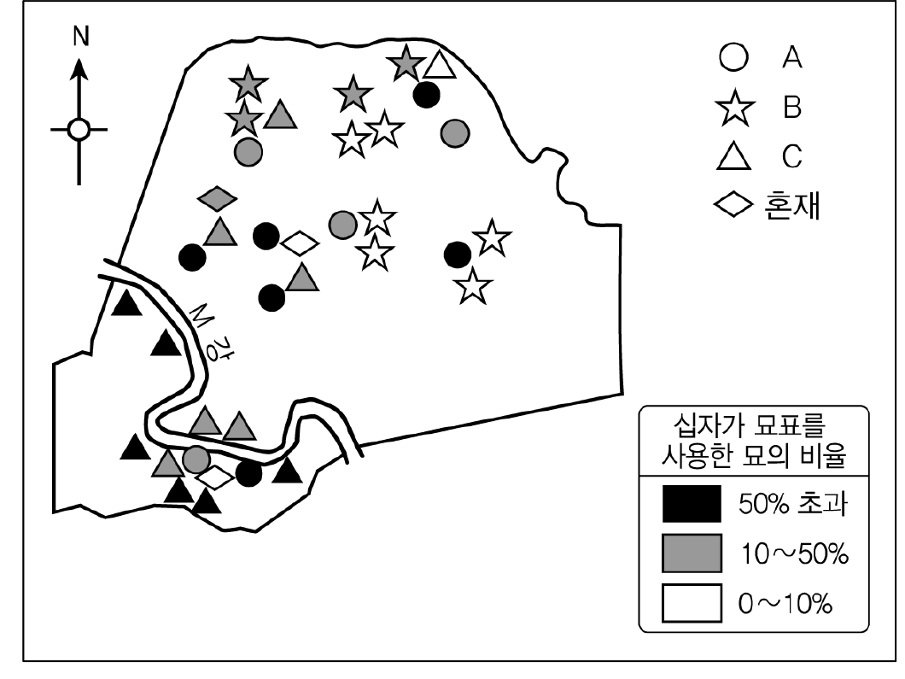
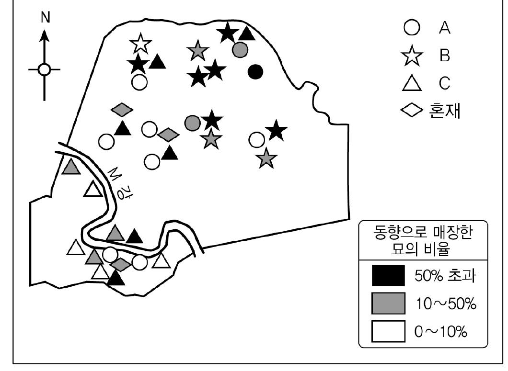
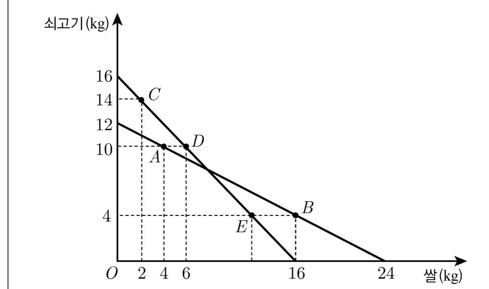
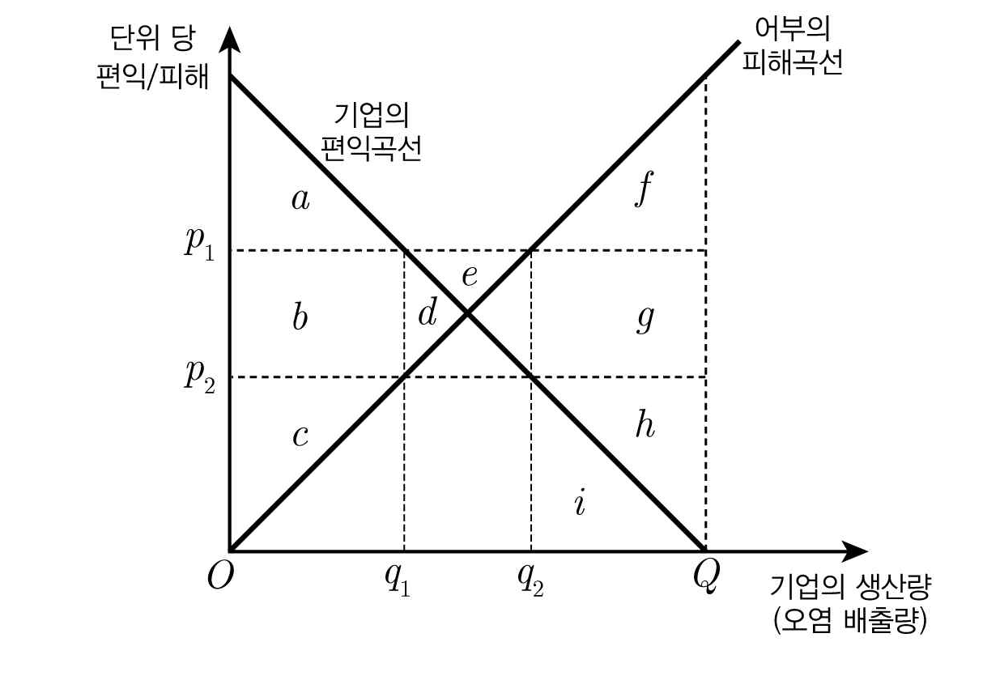

# 01 - RA (2012)

다음 논쟁에 대한 진술로 옳지 않은 것은?

## 제시문

갑 : 법적 추론의 목적은 결론을 정당화하는 것이다. 어떤 판단은 그러한 결론을 내리게 된 근거가 법에 있을 때 법적으로 정당화된다.

을 : 법적 추론의 더 중요한 목적은 결과에 대한 예측이다. 사람들이 추론을 통해 알고 싶은 것은, 자기와 다투는 사람이 소송을 할지, 소송에서 어떤 주장을 펼칠지, 특히 법관이 어떤 판결을 내릴지와 같은 문제이기 때문이다.

갑 : 사람들이 원하는 것은 예측 가능한 판결이 아니라 법에 비추어 올바른 판결이다. 판단이 옳다는 점은 정당화를 통해서만 드러나므로, 법률가는 자신의 결론이 관련된 모든 법을 고려해 추론했을 때 가장 잘 정당화된 것이라고 생각할 근거를 제시해야 한다.

을 : 그러나 사람들의 예측과 다른 판결이 내려진다면, 사람들은 판결 전까지 법이 무엇인지 알 수 없게 된다. 따라서 판결과 다양한 사회적․심리적 배경 사이의 인과 관계도 법적 추론의 대상으로 받아들임으로써, 판결을 더 과학적으로 예측할 필요가 있다.

갑 : 법률가들은 대부분의 경우 법적 정당화 관계를 추론함으로써 결론을 쉽게 예측할 수 있다.

## 선택지

(1) 갑은 법률가들이 정당화 관계를 추론함으로써 동일한 사안에 대해서는 대체로 동일한 결론에 도달한다고 전제한다.

(2) 을은 판결이 사회적․심리적 요인에 의해 영향을 받는 경우가 있다고 전제한다.

(3) 정당화가 어렵지만 결론을 예측하기는 쉬운 판결이 있다면, 을의 주장은 설득력을 갖는다.

(4) 을은 법적 정당화 여부가 판사의 결정에 인과적 영향을 미치더라도, 예측을 위해 정당화 관계를 고려할 필요가 없다고 볼 것이다.

(5) 갑이 전제하는 법적 추론의 주체는 문제에 대해 최선의 답을 찾으려는 판사에 가깝고, 을이 전제하는 법적 추론의 주체는 의뢰인의 이익을 우선시하는 변호사에 가깝다.

# 02 - RA (2012)

갑과 을의 주장에 대한 분석으로 옳은 것만을 <보기>에서 있는 대로 고른 것은?

## 제시문

갑 : 단어들이 맥락에 따라 변하지 않는 의미의 ‘중심’을 갖지 않는다면 효과적 의사소통이 불가능하다. 법에서도 마찬가지다. 식당에 ‘애완동물’을 데려오는 것을 금지하는 규정에서 ‘애완견’처럼 단어의 중심사례가 문제가 될 때, 법관은 어떠한 창조적 역할도 맡지 않으며 어려움 없이 법을 있는 그대로 적용할 뿐이다.

단어는 맥락에 따라 의미가 달라지는 ‘주변’ 영역도 갖기 마련이다. 시각장애인의 ‘안내견’처럼 ‘애완동물’의 주변 사례가 문제되는 경우, 법관은 규정의 목적을 고려하기 시작한다. 이때 법관은 규정을 어떻게 적용해야 할지에 대해 자신의 판단에 의존하기 때문에 창조적 역할을 감당할 수밖에 없다.

을 : (가) 애완동물 금지 규정이 어떤 사례에 쉽게 적용되는 것처럼 보이는 까닭은 규정의 목적을 쉽게 알 수 있기 때문이다. 목적이 안전이든 정숙이든 간에 사납게 짖는 개가 금지되는 것은 분명하다. 하지만 위생을 염려한 어떤 손님이 위 규정을 근거로 다른 손님이 온순하고 조용한 개를 데리고 오는 것도 반대한다고 해 보자. 이 개는 중심에 속하는가, 주변에 속하는가?

(나) 위 애완동물 금지 규정을 들은 사람은 곧장 사나운 투견이 금지된다고 생각할 것이다. ‘투견’은 법적용이 쉬운 사례이겠지만, 의미의 중심사례와는 거리가 멀다. ‘투견’과 호주머니 안의 ‘애완 생쥐’ 중에 무엇이 갑이 말하는 중심사례인가? 법관이 이 질문을 생략한 채 투견을 금지하고 생쥐를 허용한다고 해서, 법에 따라 판결하지 않은 것이라고 할 수 없다.

## 보기

ㄱ. 갑과 을은 법적용이 쉽거나 어려울 수 있다는 점에 대해서는 견해를 같이한다.

ㄴ. 을의 (가)는 법을 적용할 때 쉬운 사례에서도 법의 목적이 고려된다고 주장함으로써 갑을 비판한다.

ㄷ. 을의 (나)는 목적을 고려하는 법적용도 창조적인 것이 아니라 법에 따른 것이라고 주장함으로써 갑을 비판한다.

## 선택지

(1) ㄱ

(2) ㄴ

(3) ㄱ, ㄷ

(4) ㄴ, ㄷ

(5) ㄱ, ㄴ, ㄷ

# 03 - RA (2012)

<사실 관계>에 대한 <추리 내용>을 평가한 것으로 적절하지 않은 것은?

## 제시문

<사실 관계>

병마영 밖에 사는 김 소사는 콩죽을 팔아 겨우 살아갔다. 어느 날 장에 가면서 열 살 난 아들에게 집을 보라 하였는데, 돌아와 보니 아들이 죽어 있었다. 목에 죔을 당한 자국이 있고, 아이 곁에 목을 조를 때 쓰인 줄이 끌러져 놓여 있었다. 세간을 점검해 보니 잃어버린 것이 호미 등 사소한 물건 몇 가지뿐이었다. ㉠ 이 일이 있기 전에 이웃 사는 백 소사가 이잣돈 두 꾸러미를 김 소사에게 꾸어 주었는데, 김 소사는 본전만 갚고 이자는 갚지 않았다. ㉡ 아이가 죽기 전날 백 소사가 김 소사의 집을 샅샅이 뒤져 집 안에 얼마 남지 않은 쌀을 모두 찾아내 가져 간 일이 있었으니, 혐의를 받을 자는 이 한 사람뿐이었다.

이에 김 소사는 백 소사를 고소하면서 “㉢ 백 소사의 딸이 코에 병을 얻어 보기에도 더럽다. 죽은 아이가 살았을 때 그 딸을 보고 비웃은 일이 있다. 이 사실도 원한을 맺을 꼬투리이다.”라고 하였다.

<추리 내용>

백 소사가 진범이라면 원한이나 재물과 같은 범행 동기가 있었을 것이다. (A) 백 소사가 ㉠ 때문에 분함을 가지게 되었을 수는 있다. 그러나 그런 정도의 분함이라면 ㉡에 의해 해소되었을 것이다. (B) 재물을 동기로 볼 경우, 백 소사가 ㉡과 같은 행동을 한 일이 있으므로 백 소사가 김 소사 집에 재차 침입하여 호미 등을 가져가지는 않았을 것이다. (C) ㉢이 사실이라 해도 아이를 죽일 원한이 되지 못할 것이다. (D) 줄로 아이를 목 졸라 죽이려 한 범인이 그 줄을 끌러 아이 옆에 놓았다면, 그것은 범인이 재물을 목적으로 침입하여 줄로 아이의 목을 감아 죄어 놓고 재물을 뒤지다가 특별히 값나가는 물건이 없자 일이 맹랑하게 되었음을 깨닫고 뒤늦게 아이가 불쌍해져 죽지 않기를 바라고 목에 감긴 줄을 끌러 놓았기 때문일 것이다. (E) 범인은 아이가 살아날 경우 자신이 범인으로 지목되지 않게 할 대응책도 가진 자일 것이다.

- 정약용,『흠흠신서』-

## 선택지

(1) (A)가 타당한지 확인하려면 김 소사와 백 소사 사이의 평소 인간관계나 금전 거래 관계를 조사해 볼 필요가 있을 것이다.

(2) (B)는 “누구든 가져갈 것이 없음을 알고 있는 집에 도둑질하러 들어가지는 않을 것이다.”라는 취지의 암묵적인 전제에 의존하고 있다.

(3) (C)의 숨은 전제를 “비웃음을 당하였다고 살인까지 하지는 않을 것이다.”로 볼 경우, 이것은 백 소사가 관대한 사람이었다는 평판에 의해 반박될 수 있다.

(4) 김 소사가 남몰래 집 안에 귀중품을 감추어 두고 있었다는 사실이 사건 후에 새로 밝혀졌다 해도 범인이 그 사실을 알지 못하였다면 (D)는 약화되지 않는다.

(5) (E)로부터 백 소사가 범인이 아님을 단정할 수 없지만, 죽은 아이가 모르는 사람이 범인일 가능성이 있다고 추리할 수 있다.

# 04 - RA (2012)

다음 글에 비추어 판단한 것으로 옳지 않은 것은?

## 제시문

피고인은 아래 교통사고와 관련한 범죄혐의로 기소되었다. 검사와 피고인의 주장은 다음과 같고, 확인된 사실은 (가)～(바)와 같다.

검 사 : 피고인은 이 사건 당시에 가해 트럭을 운전하였다.

피고인 : 나는 2010년 9월경 사고차량인 트럭을 도난당했고, 사고 당시에 가해 트럭을 운전한 사실이 없다.

(가) 2010년 11월 6일 06 : 00경 ○○시의 시내 교차로에서 L이 운전하던 택시를 트럭이 뒤에서 들이받는 교통사고가 발생하였다. 신원불명의 트럭 운전자는 사고 직후 도주하였다.

(나) 피고인은 사고를 낸 트럭의 소유자이지만 도난신고를 한 일은 없었다.

(다) 피고인은 2010년 8월 이후 자동차운전면허가 없었고 다른 범죄혐의로 경찰의 추적을 받고 있었다.

(라) 사고 직후 트럭 안에서 휴대전화 1개, 피고인 앞으로 발부된 범칙금납부고지서가 발견되었지만, 그 외에 운전자의 신원을 짐작할 수 있는 물건은 발견되지 않았다.

(마) 위 휴대전화의 발신번호 및 통화내역을 조회해 본 결과, 사고 당일 01 : 30경부터 01 : 33경까지 K의 휴대전화로 5차례 발신된 사실이 있다.

(바) L은 교통사고 당시 피고인과 비슷한 사람이 운전한 것을 목격한 것 같다고 진술하였고, K는 자신이 피고인의 선배이며 (마)의 발신인이 피고인이었다고 진술하였다.

## 선택지

(1) (가)에서 교통사고가 발생하였다는 사실은 검사 주장의 전제는 되지만 그 사실만으로 피고인 주장의 참․거짓을 판단할 수는 없다.

(2) 피고인이 운전자라고 주장하는 검사는 (다)를 피고인이 사고 후 도주한 이유에 대한 설명으로 제시할 수 있다.

(3) (라)의 범칙금납부고지서가 2010년 8월 10일에 발급된 것으로 확인되었을 경우, 이 사실만으로는 검사와 피고인 주장의 참․거짓을 판단할 수 없다.

(4) (바)에서의 L과 K의 진술을 모두 신뢰할 수 있다면, L과 K의 진술은 검사 주장을 강화하는 데 사용할 수 있다.

(5) 검사와 피고인 주장이 동시에 참일 수 없으며, (가)～(마)가 모두 사실인 경우 두 사람의 주장은 동시에 거짓일 수도 없다.

# 05 - RA (2012)

다음은 특허 부여에 대하여 회원국이 지켜야 할 최소한의 기준을 규정하고 있는 T협정 및 각국의 관련 규정에 대한 설명이다. (가)～(다)국과 A～C국을 바르게 짝지은 것은?

## 제시문

<T협정 제27조(특허 대상)>

제1항 제2항을 조건으로, 모든 기술 분야에서 물건 또는 방법에 관한 어떠한 발명도 신규성, 진보성 및 산업상 이용 가능성이 있으면 특허 획득이 가능하다.

제2항 각 회원국은 인간 또는 동물에 대한 치료, 진단 및 수술하는 방법을 특허의 보호 대상에서 제외할 수 있다.

<(가)～(다)국의 관련 규정에 대한 설명>

(가)국 : 의료행위는 인간 또는 동물의 존엄과 생존에 깊이 관련되어 있으므로, 인간 또는 동물을 대상으로 치료, 진단 및 수술하는 방법의 신규성, 진보성 및 산업상 이용가능성이 인정되는 경우에도 이러한 방법에 대해서는 특허가 부여되지 않는다.

(나)국 : 치료, 진단 및 수술하는 방법을 포함하여 새롭고 유용한 방법, 기계, 제조물, 합성물 또는 이들의 유용한 개량을 발명한 자에게 특허가 부여된다.

(다)국 : 인간의 질병을 치료, 진단 및 수술하는 방법을 사용하는 의료행위에 관한 발명은 산업에 이용될 수 있는 발명으로 인정되지 않는다. 그러나 동물을 대상으로 치료, 진단 및 수술하는 방법에 대해서는 특허가 부여된다.

<특허 부여에 대한 판단>

◦ A～C국의 관련 규정은 모두 T협정에 부합한다.

◦ 동물의 치료를 위해 동물로부터 채취한 혈액을 정제한 후 다시 주입하는 방법은 A국과 B국에서 특허를 받을 수 있다.

◦ 인간 유전자의 발현을 변화시킴으로써 질병을 치료, 예방하는 유전자 치료 방법은 B국과 C국에서 서로 다른 이유로 특허를 받을 수 없다.

## 선택지

(1) (가) A  (나) B  (다) C

(2) (가) A  (나) C  (다) B

(3) (가) B  (나) A  (다) C

(4) (가) C  (나) A  (다) B

(5) (가) C  (나) B  (다) A

# 06 - RA (2012)

A국은 <규정>에 따라 오락 프로그램 편성 비율을 규제하는 정책을 취하고 있다. 이 규제 정책을 둘러싼 <찬반 논거>에 관한 판단으로 옳지 않은 것은?

## 제시문

<규정>

종합편성을 행하는 방송사업자는 보도, 교양, 오락에 관한 방송 프로그램이 상호 간에 조화를 이루도록 편성하되, 오락에 관한 방송 프로그램을 당해 채널의 매월 전체 텔레비전 방송 프로그램 및 라디오 방송 프로그램 각 방송 시간의 100분의 50 이하로 편성하여야 한다.

<찬반 논거>

(가) 종합편성 방송사가 광고 수익의 증대를 위해 시청률을 의식하여 프로그램을 편중되게 편성함으로써 방송의 오락화․상업화가 심화될 수 있다.

(나) 방송에서 교양과 오락의 경계가 모호한 프로그램이 많아져서 오늘날 오락의 개념을 구체적으로 정의하는 것이 현실적으로 불가능하다.

(다) 여가생활의 다양화, 오락 형식을 이용한 정보 전달의 효율성 등 오락 프로그램의 긍정적 측면을 무시할 수 없다.

(라) 방송 프로그램의 장르 간 균형성과 다양성의 확보가 필요하다.

(마) 종합편성 방송사의 영향력을 고려할 때, 청소년 보호를 위해 프로그램의 장르별 비율 규제가 필요하다.

## 선택지

(1) (가), (라)는 위 규제 정책에 찬성하는 논거로 사용될 수 있다.

(2) (나)는 위 규제 정책에 반대하는 논거로 사용될 수 있다.

(3) (나)를 근거로 비교적 장르 구분이 분명한 보도 부문에 대한 편성 비율의 하한만을 규정하면 된다고 주장하면, 위 규제 정책에 대한 반대 논거를 강화한다.

(4) 교양과 오락이 결합된 프로그램이 증가하고 있다는 사실은 (다)와 결합하여 위 규제 정책에 대한 반대 논거를 강화한다.

(5) 프로그램의 내용에 대한 질적 규제로 청소년 보호 문제에 대처할 수 있다는 주장은 (마)와 결합하여 위 규제 정책에 대한 반대 논거를 강화한다.

# 07 - RA (2012)

다음 법적 판단에 대한 진술로 가장 적절한 것은?

## 제시문

(가) A법률에서 “미성년자가 혼인을 할 때에는 부모의 동의를 얻어야 한다.”라는 규정은, 성년자의 혼인에 대해서는 부모의 동의 여부에 관한 특별한 규정이 없다 하더라도 부모의 동의를 요하지 않는다는 취지로 해석된다.

(나) B법률은 개발제한구역 내에 설치할 수 있는 시설로서 ‘경찰기동대’와 ‘전투경찰대’의 훈련 시설만을 규정하고 있으므로, ‘경찰기마대’의 훈련 시설은 이에 포함되는 것으로 볼 수 없다.

(다) C법률이 금지하고 있는 ‘경품제공행위’에는 경품을 실제 교부․지급하는 경우 이외에도, 경품을 교부․지급하겠다는 의사를 표시한 후 ‘진열․전시’한 경우도 포함한다고 보는 것이 입법취지에 비추어 타당하다.

(라) 최근 개정된 D법률에서 종전의 ‘제5항’을 ‘제6항’으로 항의 숫자를 바꾸어야 함에도 불구하고 이를 그대로 둔 것은 법률 개정 과정상의 실수에서 비롯된 것임이 분명하므로, 현행 개정 법률의 조문에 쓰인 ‘제5항’을 ‘제6항’으로 바로잡아 적용해야 한다.

(마) E법률에서 노래연습장업자가 ‘접대부’를 고용․알선하는 행위를 금지한 것은 노래연습장에서의 퇴폐행위를 방지하는 데 그 취지가 있다. 당시 입법자의 의도를 고려할 때 접대부란 여성을 의미하는 것이었다 하더라도, 영업 형태가 다양화되는 시대 상황에 맞게 여성과 남성 모두 이에 포함되는 것으로 관련 규정을 적용할 수 있다.

## 선택지

(1) (가)와 (라)는 법령 규정의 문자․용어를 일반적으로 사용되는 의미보다 좁게 해석할 필요가 있다고 판단하고 있다.

(2) (가)와 (마)는 법령의 규정 내용과 반대의 경우에는 반대의 효과가 생기는 취지의 규정까지도 포함하는 것으로 해석할 필요가 있다고 판단하고 있다.

(3) (나)는 법령의 문구로부터 상당히 벗어나게 되는 경우가 생기더라도, 그 문구의 본래 의미를 대체하여 다른 의미로 해석할 필요가 있다고 판단하고 있다.

(4) (다)와 (라)는 법령에 명시적으로 규정되지 않은 사항에 대해서는 그와 충분히 비슷한 사안에 대한 규정을 적용할 수 있다고 판단하고 있다.

(5) (마)는 법령의 문자․용어가 그것이 제정된 당시의 의미와 다르게 해석될 수 있다고 판단하고 있다.

# 08 - RA (2012)

A국의 생명윤리법 규정 및 관련 논의에 대한 설명으로 옳지 않은 것은?

## 제시문

인간 배아의 법적 지위와 관련하여, 제1견해는 인간의 생명은 수정된 때부터 시작되므로 배아를 완전한 인간으로 인정해야 한다고 본다. 제2견해는 배아는 단순한 세포덩어리로서 인간성을 인정할 수 없으며, 물질로서 소유자의 이용과 처분에 따르게 된다고 본다. 제3견해는 배아는 성장하면서 점차 도덕적 지위를 얻게 되며, 배아를 인간과 완전히 동등한 존재 내지 생명권의 주체로서 인격을 지니는 존재라고 볼 수 없다고 본다. 이처럼 배아의 법적 지위에 대해 다양한 견해가 존재하고 있는 상황에서, A국의 생명윤리법 규정은 “임신 목적으로 생성된 배아의 보존기간은 5년으로 하고, 보존기간이 경과한 잔여 배아는 폐기하여야 한다. 다만 잔여 배아는 발생학적으로 원시선이 나타나기 전까지에 한하여 체외에서 동의권자의 동의를 전제로 연구 목적으로 이용할 수 있다.”라고 규정하고 있다.

위 규정이 정자 및 난자 제공자인 배아생성자의 권리를 침해하여 헌법을 위반하는지의 여부에 대해, A국의 헌법재판소는 다음과 같은 취지로 결정하였다.

배아에 대한 배아생성자의 결정권은 명문으로 규정되어 있지는 않지만 헌법으로부터 도출되는 권리이다. 다만 출생 전 형성 중에 있는 생명인 배아의 법적 보호를 위하여, 공공복리 및 사회윤리라는 측면에서 배아생성자의 권리는 그 본질적 내용을 침해하지 않는 범위에서 법률로 제한하는 것이 가능하다. 배아에 대한 부적절한 이용가능성을 방지하여야 할 공익적 필요성의 정도가 배아생성자의 자기결정권이 제한됨으로 인한 불이익의 정도에 비해 작다고 볼 수 없으므로, 생명윤리법 규정이 헌법에 위반된다고 볼 수 없다.

## 선택지

(1) A국의 헌법재판소는 배아에 대한 배아생성자의 권리와 배아가 부적절한 연구 목적으로 부당하게 사용되는 것을 방지해야 할 공익을 서로 비교하고 있다.

(2) A국의 생명윤리법에 따르면, 발생학적으로 원시선이 나타나기 전까지의 잔여 배아는 연구자가 임의로 처분할 수 있는 연구의 대상이 아니다.

(3) A국의 헌법재판소는 배아생성자의 권리보다 배아의 권리가 보호할 만한 가치가 크다는 것을 전제로 판단하고 있다.

(4) 착상 전 배아에 손상을 주는 연구는 제1견해에 따르면 원칙적으로 금지된다.

(5) A국의 헌법재판소 결정은 제3견해와 부합한다.

# 09 - RA (2012)

두 진영 A, B 간의 논쟁에 대한 분석으로 옳지 않은 것은?

## 제시문

$A_1$ : 후쿠시마 원전 폭발에서 보듯 원전의 위험은 가공할 만한 것입니다. 이제는 원자력에 의존하는 정책을 전환해야 할 시점입니다.

$B_1$ : 후쿠시마 사태는 강도 9의 지진에서 발생한 것입니다. 세상에 위험하지 않은 것은 없습니다. 위험하다고 자동차 안타는 사람이 있습니까? 위험을 다소간 감수하면서 얻는 이득도 생각해야 합니다.

$A_2$ : 원자력 발전은 핵폐기물을 남기고, 이로 인해 미래 세대는 수만 년 동안 위험을 떠안게 됩니다. 이것을 옳다고 볼 수는 없습니다. 이런 이유에서 지금 선진국들은 원자력 발전 정책을 재고하고 있습니다.

$B_2$ : 선진국들이 다 그런 것은 아닙니다. 프랑스는 여전히 원전 정책을 고수하고 있는데, 이는 원자력이 무엇보다 경제적이기 때문입니다.

$A_3$ : 원자력 발전이 반드시 경제적이라고 볼 수는 없습니다. 먼 미래까지 지불해야 하는 핵폐기물 관리 비용을 포함하여 고려하면, 원자력이 경제성이 있다는 주장은 잘못된 것입니다.

$B_3$ : 하지만 우리나라가 현재 원전을 건설하고 수출하면서 경제가 더 풍요로워지고 있는 것도 사실입니다.

$A_4$ : 그것은 어디까지나 고용 없는 성장입니다. 엄청난 금액을 투자하여 건설한 원전이 창출하는 고용 효과는 미미합니다. 그 대신 바이오에탄올을 생산할 수 있는 옥수수를 재배하면 환경도 살리고 훨씬 더 큰 고용 효과를 창출할 수 있습니다.

$B_4$ : 현재로서는 바이오에탄올이 언제 경제성을 가질지 알 수 없습니다. 이런 상황에서 바이오에탄올 사업을 육성하려면 막대한 정부보조금이 필요한데, 이를 충당하기 위한 세금을 과연 감당할 수 있을까요?

$A_5$ : __________________________

## 선택지

(1) $A_2$는 현 세대의 위험편익분석 문제를 현 세대와 미래 세대 사이의 정의(正義) 문제로 쟁점을 전환하는 전략을 취한다.

(2) $A_2$에 대해 $B_2$가 핵폐기물 처리 기술의 발전으로 미래의 위험 부담을 줄일 수 있다는 점을 보인다 해도 B의 논지가 강화되지 않을 것이다.

(3) $A_3$에 대해 $B_3$이 미래에 경제가 성장함에 따라 비용에 대한 미래 세대의 부담감은 줄어들 것이라는 점을 추가한다면, B의 논지는 강화될 것이다.

(4) $B_4$는 $A_4$의 대안이 현실성의 측면에서 $B_3$에 대한 비판으로 적절하지 않음을 지적하고 있다.

(5) $A_5$가 환경과 고용에 대한 국민들의 관심과 비용지불의사를 보여 주는 통계 자료를 제시한다면, A의 논지가 강화될 것이다.

# 10 - RA (2012)

인간(A)과 숲(B)의 가상 논쟁에 대한 분석으로 옳지 않은 것은?

## 제시문

$A_1$ : 민주주의가 실현되어야 해. 환경이 파괴되는 것도 다 민주주의가 실현되지 않은 탓이야.

$B_1$ : 민주주의가 실현된다 하더라도 생태문제는 해결이 안 돼. 지금 지방자치가 발전하면서 오히려 생태문제가 더 악화되고 있어. 골프장 짓는다고 우리를 훼손하고 있잖아.

$A_2$ : 지방자치가 되면서 생태문제가 악화된 것은 사실이지만, 그것은 지방자치가 소수에 의해 좌우되었기 때문이야.

$B_2$ : 꼭 그렇지도 않아. 그린벨트에 서민 아파트를 짓는다고 하면, 지역 주민들은 다 찬성해.

$A_3$ : 우리가 생각하는 민주주의는 현 세대뿐 아니라 미래 세대의 이익까지 고려하는 것이야. 그렇다면 그린벨트를 훼손할 수 없어.

$B_3$ : 과연 너희의 미래 세대가 우리를 원할까? 요즘 사람들도 자연적인 것보다 인공적인 것을 더 좋아하는데, 미래에는 더 그럴 거야.

$A_4$ : 우리가 생각하는 민주주의는 사람들이 실제로 가지고 있는 선호를 추구하는 것이 아니야. 그것은 바람직한 삶과 공동체의 의미에 대한 성찰을 통해 타인과 자연까지 생각하게 해 주는 것이야. 이 과정에서 우리는 숲의 소중함을 깨닫고 숲을 배려하는 후원자의 역할을 할 수 있어.

$B_4$ : 그것은 어디까지나 너희 인간들이 생각하는 숲이지, 우리가 실제로 원하는 것은 아니야.

## 선택지

(1) $B_1$은 구체적인 반례를 들어 $A_1$을 비판하고, $A_2$는 $B_1$의 반례가 민주주의 이념이 제대로 실현되지 않았기 때문에 발생한 것이라고 대응한다.

(2) $B_2$는 $A_2$의 지적을 피하는 반례를 제시함으로써 $A_1$을 비판하지만, $A_3$은 민주적 주체의 범위를 인간을 넘어서까지 확장함으로써 대응한다.

(3) $B_3$은 미래 세대의 선호에 대해 비관적으로 전망함으로써 $A_3$의 예측이 잘못될 수 있음을 지적한다.

(4) $A_4$는 민주주의의 새로운 방향을 제시함으로써 $B_3$의 비판을 우회한다.

(5) $B_4$의 $A_4$에 대한 비판은 “미성년자의 이익과 그의 부모인 법정대리인의 이익이 다를 수 있다.”라는 비판과 유사하다.

# 11 - RA (2012)

다음 글에 따라 <상황>을 분석한 것으로 옳지 않은 것은?

## 제시문

우리가 말하는 문장은 사실의 기술(記述) 이외에도 많은 기능을 수행할 수 있다. 하나의 문장은 단순히 발화(發話)되기도 하지만, 그것을 넘어 정보를 전달하는 행위, 무엇을 물어보는 질문, 무엇을 지시하는 명령 등에도 사용된다. 발화된 문장이 어떤 기능을 수행하는지는 화자의 의도 및 발화의 맥락에 주로 의존한다.

(1) 어느 겨울 날 혼자 길을 걷던 갑순이 전광판에 표시된 기온을 확인하고 “날씨가 춥다.”라고 말했다면, 이때 이 문장은 특정한 기상 상황을 기술하는 기능을 수행한 것이다. (2) 갑순이 갑돌에게 날씨 정보를 전달하려는 의도에서 “날씨가 춥다.”라고 말했다면 이는 사실의 기술을 넘어 정보 전달 기능을 수행한 것이다. 그런데 (3) 만약 갑순이 갑돌로 하여금 어떤 비언어적 행동을 일으킬 의도, 예컨대 목도리를 풀어 달라는 의도로 그 문장을 말한 것이라면, 이는 사실의 기술 및 정보 전달 기능뿐 아니라 갑돌로 하여금 어떤 행위를 하도록 유발하는 기능을 수행한 것이다.

이때 발화된 문장은 (1)에서는 사실을 기술하는 문자 그대로의 의미, 즉 ‘문장 의미’만을 지니는 반면, (2)에서는 날씨가 춥다는 것을 알리려는 화자의 의도가 포함된 의미, 즉 ‘화자 의미’를 지닌다. 또한 (3)에서도 목도리를 풀어 달라는 화자의 의도가 포함된 화자 의미를 지닌다. 그런데 (3)에서는 “문 좀 닫아 주실래요?”처럼 문장 의미와 화자 의미가 가까운 경우도 있는 반면, 문을 닫게 할 의도로 “바람이 차네요.”라고 말하는 경우처럼 문장 의미와 화자 의미의 거리가 더 먼 경우도 있다.

<상황>

㉠ “<u>플로렌스의 추억, 차이코프스키.</u>”라고 중얼거리면서, 큰 테이블 곁에 혼자 서서 예나는 멜로디를 흥얼거렸다. 멀리서 현악기의 소리가 은은히 들렸고, 사람들은 행복해 보였다. “클래식 음악 좋아하시나 봐요? ㉡ <u>저편으로 가셔서 신랑 신부에게 인사하시지요.</u>” 석하가 다가오며 말을 건넸다. ㉢ “<u>다른 하객 분들도 거기 모여 계십니다.</u>”라는 석하의 말에 예나는 그 자리를 떠나고 싶지 않아 말했다. ㉣ “<u>이 자리에 있으면 안 되나요?</u>” 이 말을 더 이상 귀찮게 하지 말라는 의도로 이해한 석하는 씁쓸한 표정으로 저편에 있는 사람들에게 돌아갔다.

## 선택지

(1) ㉠이 대화 상황에서 말해졌다면, (2)는 ㉠이 수행하는 기능 중의 하나일 것이다.

(2) (3)은 ㉡이 수행하는 기능 중의 하나이다.

(3) (2)는 ㉢이 수행하는 기능 중의 하나이다.

(4) 화자의 의도를 고려할 때, ㉢은 ㉡보다 문장 의미와 화자 의미의 거리가 멀다.

(5) ㉣의 경우, 석하가 이해한 문장 의미와 화자 의미의 거리는 예나가 의도한 문장 의미와 화자 의미의 거리보다 가깝다.

# 12 - RA (2012)

<그림 1>과 <그림 2>의 A, B, C로 가장 적절한 것은?

## 제시문

<이미지 포함됨>

여러 종교와 인종의 사람들이 섞여 사는 미국 남부의 묘지를 살펴보면, 가톨릭교 묘지는 개신교 묘지에 비해 십자가 묘표를 사용한 묘의 비율이 높다. 또한 가톨릭교 묘지에 비해 개신교 묘지는 그리스도의 재림을 기대하는 상징으로 묘를 동향으로 쓰는 비율이 높다.

<그림 1>과 <그림 2>는 미국 남부 L 주(州)에 속한 K군(郡)의 묘지를 1984년에 조사한 결과이다. 이 조사는 20세기 이후에 조성된 공동묘지를 대상으로 하였다. 프랑스인이 군 서부의 M 강(江) 연안 지역부터 농경지를 개간한 K 군은 원래 가톨릭교도가 많은 지역이었다. 개발 초기에 농장의 흑인 노예들은 백인인 주인을 따라 가톨릭교회에 다니는 경우가 많았는데, 1860년대 노예해방과 함께 점차 군 전체로 고르게 퍼져 나갔다. 한편 1880년대에 철도가 개통되면서 앵글로색슨계 백인들이 북동부 주들에서 군의 동부로 많이 이주해 왔고, 이들과의 접촉을 통해 개신교로 개종하는 흑인이 늘어났다. 그런데 M 강 연안 지역에 거주하는 흑인 개신교도들은 타 지역 흑인 개신교도와 달리, 이 지역의 가톨릭 관습을 종교적인 특징으로 생각하기보다는 지역적 전통으로 여기는 경향이 있었다.

<그림 1>

<그림 2>

## 선택지

(1) A 가톨릭교  B 백인 개신교  C 흑인 개신교

(2) A 가톨릭교  B 흑인 개신교  C 백인 개신교

(3) A 백인 개신교  B 가톨릭교  C 흑인 개신교

(4) A 흑인 개신교  B 가톨릭교  C 백인 개신교

(5) A 흑인 개신교  B 백인 개신교  C 가톨릭교

# 13 - RA (2012)

다음 글로부터 추론한 것으로 옳은 것만을 <보기>에서 있는 대로 고른 것은?

## 제시문

일반적으로 업적 평가는 다음 세 가지 방법을 사용한다.

(가) 요소별 등급 평가법은 평가 요소마다 별도로 등급을 매기는 방법이다. 정량화된 결과만으로 우열을 판단하는 것이 부적절할 때 많이 사용된다. 평가 요소 선정의 합리성과 각 요소 간 독립성 유지가 그 적용을 위한 선행 조건이다. 평가 요소에 대한 평가자의 주관적 선호가 개입될 위험이 있다.

(나) 강제 배분법은 평가 대상자들에 대한 평가 결과의 등급 비율을 미리 정해 놓는 방법으로 평가가 지나치게 어느 한 쪽으로 집중되는 경향을 배제할 수 있다. 평가 대상자들의 능력과 실적이 유사한 경우에 작은 성과 차이가 큰 등급 차이로 나타날 수 있어 평가 결과를 신뢰하기 힘든 경우도 발생한다.

(다) 산출 평가법은 계량적으로 측정 가능한 요소들만 평가 대상으로 삼는다. 성과 달성에 소요되는 통상적인 단위 시간을 결정할 수 있는 경우에 효과적이나, 작업의 질처럼 양적 측정이 어렵거나 작업 능률에 영향을 미치는 책임성 같은 주관적 요소를 평가하는 데 한계가 있다.

## 보기

ㄱ. 신입사원 선발 전형에서 정량 평가를 마친 후 면접을 통해 성실성과 창의성에 대한 질적 평가를 덧붙이고자 한다. 평가 대상자에 대한 정보가 부족하여 한 요소에 대한 평가가 다른 요소들의 평가에 영향을 끼칠 수 있으며, 평가자가 높거나 낮은 점수를 피하여 중간대의 점수만을 부여할 우려가 있다. 이 경우 (나)보다 (가)가 적절하다.

ㄴ. 대학에서 학문적 업적이 뛰어난 학자를 채용하려고 평가위원회를 구성하였다. 평가자와 평가 대상자들 사이의 친소 관계를 배제할 수 없으며, 연구의 우수성에 대한 판단 기준이 평가자마다 상이하다. 이 상황에서 공정성을 유지하려면 (가)보다 (다)가 적절하다.

ㄷ. 우수한 직원들이 특정 부서에 편중되어 있는 상황에서, 부서별이 아니라 직원 전체를 대상으로 업무 성과만을 고려하여 상여금을 지급하고자 한다. 부서에 따른 업무 난이도 차이가 적고 업무의 내용이 표준화되어 있는 상황에서, 평가는 부서 단위로 하되 가능한 한 업무 성과가 우수한 직원들이 상여금을 받도록 하려면 (나)보다 (다)가 적절하다.

## 선택지

(1) ㄱ

(2) ㄴ

(3) ㄱ, ㄷ

(4) ㄴ, ㄷ

(5) ㄱ, ㄴ, ㄷ

# 14 - RA (2012)

<설명>과 <상황>으로부터 추론한 것으로 가장 적절한 것은?

## 제시문

한 심리학자가 사람들이 남을 속이는 다양한 상황을 조사해서 이때 개입하는 전형적인 감정을 연구하였다. 그 감정들 중 주요한 것은 수치심, 발각의 두려움, 안도감, 죄책감, 쾌감이다. 감정 A, B, C는 그중 세 가지이다.

<설명>

◦ 감정 A는 상대방이 속이기 어려운 사람이라는 평판이 있을 때, 상대방이 의심하기 시작할 때, 속여 본 경험이 별로 없을 때, 속임수의 대가가 클 때 강하게 나타난다. 이 감정은 적당히 있을 때 실수를 줄여 주는 역할을 한다.

◦ 감정 B는 다른 사람의 인지 여부와 관계없이 느끼는 감정으로, 상대방이 손해를 보게 될 때, 상대방과 친할 때, 속이는 사람이 평소에 상대방의 신뢰를 얻기 위해 노력해 왔을 때 강하게 느낀다. 이 감정을 줄이기 위해서 속이는 행위를 정당화할 방법을 찾는다.

◦ 감정 C는 속임수가 성공한 후에 주로 느끼는 감정으로, 상대방이 속이기 어렵다는 평판을 가지고 있을 때, 속여야 할 내용 때문에 성공하기 어려울 때, 다른 사람들이 속이는 사람을 주시할 때, 속이는 능력을 남들로부터 인정받을 때 강하게 느낀다.

아래 각각의 상황에서는 감정 A, B, C 중 주로 두 가지만 느끼는 사람들이 가장 많았다.

<상황>

(가) 친구들과 포커 게임을 할 때 나쁜 패를 들고 그렇지 않은 것처럼 허세를 부리는데, 판돈이 커지고 친구들이 속아 넘어가는 상황

(나) 학생이 참고서를 산다고 거짓말을 하고 부모에게 돈을 타내는 상황

(다) 청소년 몇 명이 재미로 모자 가게에서 모자를 훔치는데, 한 명이 먼저 모자를 훔쳐 오면 다음 사람이 그것을 쓰고 가서 다른 것으로 계속 바꾸어 훔쳐 오는 상황

## 보기

ㄱ. (가), (나) 모두에서 감정 A가 나타날 것이다.

ㄴ. (가), (다)에서 나타난 두 감정은 같을 것이다.

ㄷ. (나), (다) 모두에서 감정 B가 나타날 것이다.

## 선택지

(1) ㄱ

(2) ㄴ

(3) ㄷ

(4) ㄱ, ㄴ

(5) ㄱ, ㄷ

# 15 - RA (2012)

<관찰>을 토대로 <이론>을 평가한 것으로 옳은 것은?

## 제시문

<이론>

미국의 ‘경찰 하위문화(subculture)’는 ‘업무 수행 및 구성원들과의 인간관계와 관련하여 경찰관 사이에 공유되는 비공식적 규범’으로, 경찰관들의 고립적이고 위험한 생활방식에 대한 반응으로서 발전한 것이다. 남성중심주의와 남자다움의 숭배, 범죄에 대한 강경 대응을 강조하는 통제 지향적 태도, ‘우리’와 ‘그들’을 구분하는 배타주의, 변화에 대한 저항 등이 경찰 하위문화의 대표적 속성들이다. 경찰 하위문화의 속성들은 서로 밀접한 관련이 있어, 한 속성을 받아들이면 나머지 속성들도 모두 받아들이는 특징이 있다. 경찰 하위문화를 많이 받아들일수록 업무로부터 야기되는 직무 스트레스나 심리적 소진(과업 수행과 관련된 동기와 헌신의 상실)은 더 많이 감소한다.

<관찰>

◦ 경찰 하위문화의 수용 정도는 남자는 중간계급이 가장 높고, 여자는 계급이 높을수록 높다.

◦ 경찰 하위문화 수용 정도가 상위계급에서는 여자가 남자보다 높지만, 하위계급에서는 성별에 따른 차이가 없다.

◦ 성별과 계급이 동일할 경우, 수사부서 경찰관이 대민부서 경찰관보다 범죄에 대한 통제 지향적인 태도를 더 많이 보인다.

* 경찰 하위문화를 고려하지 않을 때의 직무 스트레스나 심리적 소진의 정도는 모든 경찰관이 동일하다고 가정한다.

## 선택지

(1) 대민부서에 근무하는 상위계급 여자 경찰관이 수사부서에 근무하는 중간계급 남자 경찰관보다 심리적 소진의 정도가 높다면 <이론>은 약화될 것이다.

(2) 수사부서에 근무하는 중간계급 여자 경찰관이 대민부서에 근무하는 하위계급 남자 경찰관보다 직무 스트레스가 낮다면 <이론>은 약화될 것이다.

(3) 수사부서에 근무하는 중간계급 남자 경찰관이 대민부서에 근무하는 상위계급 남자 경찰관보다 직무 스트레스가 낮다면 <이론>은 약화될 것이다.

(4) 중간계급 남자 경찰관이 같은 부서의 하위계급 여자 경찰관보다 심리적 소진의 정도가 높다면 <이론>은 약화될 것이다.

(5) 하위계급 남자 경찰관이 같은 부서의 상위계급 여자 경찰관보다 직무 스트레스가 높다면 <이론>은 약화될 것이다.

# 16 - RA (2012)

알코올과 공격 행동의 관계를 진술하는 다음 가설들에 대한 분석으로 옳은 것만을 <보기>에서 있는 대로 고른 것은?

## 제시문

(가) 알코올은 공격 행동을 제어하는 뇌 부위에 생리적 영향을 미친다. 취하면 누구나 자신의 행동을 제어할 수 없게 된다.

(나) 알코올이 비폭력적인 사람으로 하여금 폭력적인 행동을 하게 한다고 볼 수는 없다. 알코올은 개인의 평소 성향을 강화하는 효과를 가질 뿐이다. 공격적인 성향을 가진 사람은 알코올의 영향을 받으면 이런 성향이 더욱 잘 드러난다.

(다) 공격적인 성향을 지닌 사람이 공격 행동을 하게 되려면 알코올의 영향만으로는 부족하고 상황적 요인이 추가되어야 한다. 무언가 또는 누군가가 취한 사람을 화나게 하거나 위협하거나 기타 방법으로 자극해야만 공격 행동이 나타난다.

(라) 알코올보다는 알코올에 대한 개인의 기대나 인식이 그 개인의 취중 행동에 더 큰 영향을 미친다. 어떤 집단에서는 음주를 일상으로부터의 휴식으로 생각하며, 취중의 일탈 행위가 어느 정도 용인된다. 음주 시의 사회적 행동 변화는 그 사회를 지배하는 음주 문화의 영향을 받는다.

## 보기

ㄱ. (다)는 (가)의 설명 중 알코올이 공격 행동에 영향을 미친다는 점은 인정하면서, 추가 요인을 제시하여 알코올과 공격 행동의 관계를 설명한다.

ㄴ. 공격 성향을 가진 사람이 취중에 모욕을 당한 경우 (다)는 그의 공격 행동을 예측하지만 (나)는 그렇게 예측하지 않는다.

ㄷ. 회식자리에서 술에 취해 공격 행동을 보인 사람이 술이 깬 후 “어쩔 수 없었다.”라거나 “취하면 그렇게 된다.”라고 변명하는 것이 통한다는 사실을 (가)와 (라) 모두 설명할 수 있다.

## 선택지

(1) ㄱ

(2) ㄴ

(3) ㄱ, ㄷ

(4) ㄴ, ㄷ

(5) ㄱ, ㄴ, ㄷ

# 17 - RA (2012)

다음 글로부터 추론한 것으로 옳은 것만을 <보기>에서 있는 대로 고른 것은?

## 제시문

업무는 분석 가능성과 다양성을 기준으로 구분할 수 있다. 분석 가능성이란 업무를 표준화된 절차에 따라 과정별로 나누어 수행을 용이하게 할 수 있는 정도를 뜻한다. 다양성이란 업무 중에 예측하지 못한 새로운 일이 생기는 정도를 뜻한다. 이에 따라 아래의 표를 만들고, 여러 가지 직업의 특성을 고려하여 $P_1$～$P_4$에 몇 가지 직업을 채워 보았다.

<table>
<tr><td colspan="2"></td><td colspan="2">$B$</td></tr>
<tr><td colspan="2"></td><td>(다)</td><td>(라)</td></tr>
<tr><td rowspan="2">$A$</td><td>(가)</td><td>$P_1$</td><td>$P_2$</td></tr>
<tr><td>(나)</td><td>$P_3$</td><td>$P_4$</td></tr>
</table>

◦ $P_1$에는 많은 정보에 대한 분석 기술을 가지고 일정한 절차와 기법 등에 따라 예외 상황을 해결할 수 있는 직업군으로 회계사, 토목기사 등이 속하였다.

◦ $P_2$에는 업무 예외 상황의 발생 가능성이 낮고 단순 정보에 대한 분석 기술로 업무를 처리할 수 있는 직업군으로 은행 창구 직원, 생산직 근로자 등이 속하였다.

◦ $P_3$에는 새로운 상황이 많이 발생하며 업무와 관련된 정보가 복잡하여 경험과 넓은 시각 및 통찰력과 직관력이 필요한 직업군이 속하였다.

## 보기

ㄱ. (가)는 분석 가능성이 낮은 유형이다.

ㄴ. (다)는 다양성이 낮은 유형이다.

ㄷ. 작곡가, 피아니스트와 같은 직업은 $P_4$에 속할 것이다.

## 선택지

(1) ㄱ

(2) ㄷ

(3) ㄱ, ㄴ

(4) ㄴ, ㄷ

(5) ㄱ, ㄴ, ㄷ

# 18 - RA (2012)

다음 논증에 대한 분석으로 옳지 않은 것은?

## 제시문

정의가 없는 왕국이란 거대한 강도떼가 아니고 무엇인가? 강도떼도 나름대로는 작은 왕국이 아닌가? 강도떼도 사람들로 구성되어 있다. 그 집단도 두목 한 사람의 지배를 받고, 공동체의 규약에 의해 조직되며, 약탈물을 일정한 원칙에 따라 분배한다. 만약 어느 악당이 무뢰한들을 거두어 모아 거대한 무리를 이루어서 일정한 지역을 확보하고 거주지를 정하거나, 도성을 장악하고 국민을 굴복시킬 지경이 된다면 아주 간편하게 왕국이라는 이름을 얻게 된다. 그런 집단은 야욕을 억제해서가 아니라 야욕을 부리고서도 아무런 처벌을 받지 않는다는 사실만으로도 당당하게 왕국이라는 명칭과 실체를 얻는 것이다. 사실 알렉산드로스 대왕의 손에 사로잡힌 어느 해적이 대왕에게 한 답변에서 이런 현실이 적나라하게 드러났다. 해적에게 무슨 생각으로 바다에서 남을 괴롭히는 짓을 저지르고 다니느냐고 문초하자, 해적은 알렉산드로스 대왕에게 거침없이 이렇게 대꾸했다고 한다. “그것은 폐하께서 전 세계를 괴롭히시는 생각과 똑같습니다. 단지 저는 작은 배 한 척으로 그 일을 하는 까닭에 해적이라 불리고, 폐하께서는 대함대를 거느리고 다니면서 그 일을 하시는 까닭에 대왕이라고 불리시는 점이 다를 뿐입니다!”

- 아우구스티누스,『신국론』-

## 선택지

(1) 정의가 없는 왕국과 강도떼의 차이를 명칭과 규모의 관점에서 설명하고 있다.

(2) 정의가 없는 왕국과 강도떼가 야욕과 처벌의 측면에서 동일하다고 설명하고 있다.

(3) 정의가 없는 왕국과 강도떼의 공통점을 지배 체제와 공동체의 조직 원리에서 찾고 있다.

(4) 강도떼가 발전하여 정의가 없는 왕국이 될 가능성을 제시하여 둘의 차이를 좁히는 전략을 쓰고 있다.

(5) 알렉산드로스 대왕과 해적의 대화를 통해 정의가 없는 왕국과 강도떼의 유비(類比)의 설득력을 높이는 전략을 쓰고 있다.

# 19 - RA (2012)

다음 글로부터 추론한 것으로 옳지 않은 것은?

## 제시문

어떤 회사의 직원은 A∼G 7명이다. 그들은 다음과 같은 방법으로만 연락한다.

◦ 바로 아래 하급 직원으로부터 연락받으면 자신의 바로 위 상급 직원 한 명에게만 연락한다.

◦ 바로 위 상급 직원으로부터 연락받으면 자신과 같은 직급의 모든 직원에게 연락한다.

◦ 같은 직급의 직원으로부터 연락받으면 같은 직급의 다른 직원 한 명에게만 연락한다.

다음과 같은 사실이 알려져 있다.

◦ B는 D보다 직급이 한 등급 높다.

◦ D가 B에게 연락하자 B는 A에게만 연락했다.

◦ G가 C에게 연락하자 C는 B에게만 연락했다.

◦ C가 F에게 연락하자 F는 D와 E에게 연락했다.

## 선택지

(1) C와 G가 같은 직급이고 D가 E에게 연락하면, E는 F에게만 연락할 수 있다.

(2) C와 G가 같은 직급이고 E가 C에게 연락하면, C는 A에게만 연락할 수 있다.

(3) C와 G가 같은 직급이고 F가 G에게 연락하면, G는 A에게만 연락할 수 있다.

(4) C와 G가 다른 직급이고 A가 B에게 연락하면, B는 C에게만 연락할 수 있다.

(5) C와 G가 다른 직급이고 D가 C에게 연락하면, C는 G에게만 연락할 수 있다.

# 20 - RA (2012)

(가)～(라)에 대한 평가로 옳은 것만을 <보기>에서 있는 대로 고른 것은?

## 제시문

(가) 중퇴는 미래의 성공 기회를 제약하는 요인이다. 중퇴로 인해 발생하는 좌절 경험이 청소년의 비행을 유발한다.

(나) 부모와의 유대는 비행의 발생을 통제하는 사회적 끈이다. 유대가 약해질 때 청소년은 비행을 저지르게 되며, 유대가 약할수록 비행을 많이 저지른다. 중퇴는 부모와의 유대를 점점 더 약화시키는 원인으로 작용한다.

(다) 청소년이 학교에서 경험하는 학교 부적응, 낮은 학업 성적 등의 요인이 청소년으로 하여금 비행을 저지르게 하는데, 중퇴는 이러한 요인의 영향에서 벗어나게 한다.

(라) 중퇴와 비행 사이에는 높은 상관관계가 있는데, 이는 어떤 공통 원인이 비행도 저지르게 하고 중퇴도 하게 하기 때문이다. 이것이 중퇴가 비행의 원인인 것처럼 보이는 이유이다.

## 보기

ㄱ. 중퇴 이후의 비행률이 중퇴 이유에 따라서 상반된 방향으로 변화했다면, 이는 (가), (다) 중 어느 한 주장만으로는 설명할 수 없을 것이다.

ㄴ. 중퇴 전에 비행을 하지 않던 청소년이 중퇴 이후에도 비행을 하지 않았다면, 이는 (가)를 약화하고 (라)를 강화할 것이다.

ㄷ. 중퇴생의 비행이 중퇴 이후 시간이 지남에 따라 점차 증가하였다면, 이는 (나)를 강화하고 (다)를 약화할 것이다.

## 선택지

(1) ㄱ

(2) ㄴ

(3) ㄱ, ㄷ

(4) ㄴ, ㄷ

(5) ㄱ, ㄴ, ㄷ

# 21 - RA (2012)

다음 실험 결과로부터 알 수 있는 것만을 <보기>에서 있는 대로 고른 것은?

## 제시문

공작나비는 평소에는 날개를 접고 있다가 포식자인 박새가 접근하면 날개를 접고 펴는 동작을 반복하여 소리를 내는 동시에 날개 위쪽에 있는 무늬를 보여 준다. 공작나비가 내는 소리와 날개의 무늬가 어떤 역할을 하는지 알아보기 위해 날개의 무늬를 지워 없애는 방법과 날개에서 소리를 내는 부분을 제거하는 방법을 조합하여 실험하였다.

공작나비를 박새의 먹이로 사용한 실험 결과는 다음과 같다.

◦ 날개무늬가 있고 소리를 내는 공작나비는 $100\%$ 살아남았다.

◦ 날개무늬가 있고 소리를 내지 못하는 공작나비는 $100\%$ 살아남았다.

◦ 날개무늬가 없고 소리를 내는 공작나비는 $50\%$ 살아남았다.

◦ 날개무늬가 없고 소리를 내지 못하는 공작나비는 $20\%$ 살아남았다.

◦ 박새가 접근했을 때 날개를 접고 펴는 빈도는 날개무늬가 있는 공작나비보다 날개무늬가 없는 공작나비가 더 높았다.

## 보기

ㄱ. 박새의 포식을 피해 공작나비가 살아남는 데에는 소리를 내는 것보다 날개무늬가 있는 것이 더 효과적이다.

ㄴ. 날개무늬가 없는 공작나비가 박새에게 더 많이 잡아먹힌 이유는 날개를 접고 펴는 빈도가 높을수록 소리가 커지기 때문이다.

ㄷ. 박새의 포식을 피해 공작나비가 살아남는 데에는 날개무늬만 있는 것보다 날개무늬도 있고 소리도 내는 것이 더 효과적이다.

## 선택지

(1) ㄱ

(2) ㄴ

(3) ㄱ, ㄷ

(4) ㄴ, ㄷ

(5) ㄱ, ㄴ, ㄷ

# 22 - RA (2012)

다음 글로부터 <실험>의 결과를 추론한 것으로 옳은 것만을 <보기>에서 있는 대로 고른 것은?

## 제시문

세균 A는 과산화수소 등의 활성산소를 감지하여 분해하는 시스템을 가지고 있다. 이 시스템은 조절단백질 X와 효소 Y로 이루어져 있는데, X는 과산화수소를 감지하여 Y의 발현을 조절하는 기능을 하고 Y는 과산화수소를 분해하여 그 독성을 제거하는 기능을 한다. X는 다음 두 가지 메커니즘 중 하나를 이용하여 Y의 발현을 조절한다.

◦ 메커니즘 (가) : 과산화수소를 감지하지 않은 X는 DNA에 결합하지 않지만, 과산화수소를 감지한 X는 DNA에 결합한다. Y는 DNA에 결합한 X가 없으면 발현되지 않지만, DNA에 결합한 X가 있으면 발현된다.

◦ 메커니즘 (나) : 과산화수소를 감지하지 않은 X는 DNA에 결합하지만, 과산화수소를 감지한 X는 DNA에 결합하지 않는다. Y는 DNA에 결합한 X가 있으면 발현되지 않지만, DNA에 결합한 X가 없으면 발현된다.

<실험>

조절단백질 X와 효소 Y의 기능을 알아보기 위해, 세균 A로부터 X를 만드는 유전자를 제거한 돌연변이 세균 B를, A로부터 Y를 만드는 유전자를 제거한 돌연변이 세균 C를, A로부터 X를 만드는 유전자와 Y를 만드는 유전자를 모두 제거한 돌연변이 세균 D를 제조한 후, A∼D의 특성을 조사한다.

## 보기

ㄱ. X가 메커니즘 (가)를 이용한다면 B는 A보다 과산화수소의 독성을 더 잘 제거할 것이다.

ㄴ. X가 메커니즘 (나)를 이용한다면 B는 C보다 과산화수소의 독성을 더 잘 제거할 것이다.

ㄷ. X의 메커니즘에 관계없이 C는 D보다 과산화수소의 독성을 더 잘 제거할 것이다.

## 선택지

(1) ㄴ

(2) ㄷ

(3) ㄱ, ㄴ

(4) ㄱ, ㄷ

(5) ㄴ, ㄷ

# 23 - RA (2012)

다음 글에 나타난 입장을 비판하는 논거로 적절하지 않은 것은?

## 제시문

가설 A는 $D_1$을 증거로 확보한 후 $D_2$를 성공적으로 예측했다. 반면 가설 B는 $D_1$과 $D_2$ 모두를 증거로 확보한 후에 구성됐다. B는 $D_1$과 $D_2$에 대한 사후 설명을 제시한 것이다. 이제 두 가설 모두 증거 $D_1$과 $D_2$를 근거로 하고 있어, 확보된 증거는 동등하다. 이 경우 사람들은 가설 A가 더 좋다는 입장을 취한다. 즉 같은 증거라도 그 증거가 사전에 성공적으로 예측된 경우가 사후에 설명되는 경우보다 가설을 지지하는 힘이 더 크다는 것이다. 다음 과학사의 사례는 이 입장을 뒷받침한다.

멘델레예프는 60개의 화학원소들을 원자의 무게에 따라 배열할 때 원자가 등의 성질이 주기적으로 반복된다는 점을 알아내 주기율표를 창안하고, 그 표의 빈 칸을 채우는 세 원소의 존재를 예측했다. 당시 학계는 주기율표가 단지 사후 설명을 제시하는 것으로 보고 평가를 보류하고 있다가 그의 예측대로 두 원소가 발견되자 놀라움을 표하며 세 번째 원소가 발견되기도 전에 데비 메달을 수여하였다.

## 선택지

(1) 예측에 성공한 주체는 과학자이지 가설이 아니며, 예측의 성공이 과학자들에게 끼치는 심리적 효과는 가설을 지지하는 증거의 힘과는 무관한 문제이다.

(2) 멘델레예프의 예측은 우연의 결과일 수도 있고, 과학사에서 보면 그러한 예측의 우연적 성공마저도 더 좋은 다른 이론에 의해 적절히 설명되는 경우가 많다.

(3) 예측에 성공했다는 것 자체가 그 가설의 구성 과정이 과학적으로 신뢰할 만하다는 좋은 증거인 반면, 사후 설명은 가설 구성 과정의 신뢰성에 대한 적절한 증거가 아니다.

(4) 증거가 가설을 지지하는 힘은 오직 가설과 증거 사이에 성립하는 논리적 관계에 따라 평가되어야 하며, 가설을 창안한 과학자가 그 증거를 알게 된 시점과는 무관한 문제이다.

(5) 과학의 실제 현장에서는 방대하고 다양한 증거들을 적절히 설명하는 가설을 찾는 일 자체가 어렵고, 예측에 성공했다는 사실이 가설이 옳다는 결정적 증거가 되지 못하는 경우가 많다.

# 24 - RA (2012)

다음 글에 대한 분석으로 옳은 것만을 <보기>에서 있는 대로 고른 것은?

## 제시문

영민은 아래의 <설명>을 보고 처음에는 ⓐ “$S_1$의 낙하가 $S_2$ 낙하의 원인이다.”라는 직관적 판단을 했지만, <인과 이론>을 배운 후에는 ⓑ “$S_2$의 낙하가 $S_1$ 낙하의 원인이다.”라는 판단도 가능하다고 생각하게 되었다.

<설명>

실린더 속에 금속판 $S_1$과 $S_2$가 접해 있다. 위쪽의 $S_1$은 줄에 매달려 있고, 아래쪽의 $S_2$는 양 옆에 칠한 강한 접착제에 의해서 지탱되고 있다. 만약 접착제에 의하여 $S_2$가 지탱되지 않는다면, $S_2$는 중력에 의해서 낙하할 것이다.

<인과 이론>

집중호우가 산사태의 원인이라는 것은 “만약 집중호우가 발생하지 않았다면 산사태가 발생하지 않았을 것이다.”로 분석할 수 있다. 즉 사건 $A$가 $B$의 원인이라는 것은 $A$가 발생하지 않으면 $B$도 발생하지 않는다는 의미이다.

이 이론에 따라 영민은 <설명>을 다음과 같이 분석했다. 어떤 시점에 $S_1$이 매달려 있던 줄이 끊어지고, 그에 따라 자유낙하를 하고자 하는 $S_1$이 아래 방향의 힘을 $S_2$에 가하여 접착제가 부서지고, $S_2$와 $S_1$이 낙하하게 된다. 영민은 $S_2$가 $S_1$보다 먼저 떨어진다고 생각했다. 그래서 영민은 만약 $S_2$가 낙하하지 않으면 $S_1$ 역시 낙하하지 않을 것이므로, “$S_2$의 낙하가 $S_1$의 낙하의 원인이다.”라고 판단했다.

## 보기

ㄱ. “$S_1$이 낙하하지 않았다면 $S_2$ 역시 낙하하지 않았을 것이다.”라는 판단이 참이라면, 판단 ⓐ는 <인과 이론>에 의해서 지지될 수 있다.

ㄴ. 원인은 결과보다 시간적으로 앞선다고 할 때, 영민이 생각한 대로 $S_2$의 낙하가 $S_1$의 낙하에 시간적으로 앞선다면 판단 ⓑ는 설득력을 갖는다.

ㄷ. $S_1$이 아래 방향으로 힘을 가하는 사건과 $S_1$이 낙하하는 사건을 구분해서, $S_1$이 아래 방향으로 힘을 가하여 $S_2$가 낙하하고, 그래서 $S_1$이 낙하한다고 생각하면, 판단 ⓐ는 옳지만 판단 ⓑ는 옳지 않다.

## 선택지

(1) ㄱ

(2) ㄷ

(3) ㄱ, ㄴ

(4) ㄴ, ㄷ

(5) ㄱ, ㄴ, ㄷ

# 25 - RA (2012)

<사실 및 추정>에 비추어 두 가설을 평가한 것으로 옳은 것은?

## 제시문

<사실 및 추정>

얼굴이나 음성의 인식 및 감정과 관련한 신경 체계는 다음처럼 작동한다. 대뇌 측두엽에는 얼굴과 사물의 인식에 특화된 영역이 존재한다. 이 영역에 손상을 입은 환자는 친밀한 사람의 얼굴을 알아보지 못한다. 측두엽에서 인식된 얼굴 정보는 감정 반응을 만드는 변연계로 보내진다. 변연계 입구인 편도가 인식된 정보의 감정적 의미를 먼저 분별하고, 이를 감정 반응을 일으키는 변연계의 감정중추로 중계한다. 음성 인식 영역에서 인식된 정보는 시각 정보와는 다른 경로로 편도에 도달하지만 편도 이후의 경로는 동일하다. 변연계 감정중추의 작용에 의해서 우리는 비로소 분별된 감정 정보에 어울리는 친숙함, 사랑, 두려움 등의 감정을 느끼게 된다. 손바닥에 나는 땀을 이용하여 변연계에서 일어나는 감정적 반응을 측정하는 GSR(피부전도반응) 시험에서, 정상인은 가족사진을 보면 높은 GSR을 보이지만 낯선 얼굴을 보면 아무 반응도 보이지 않는다.

자동차 사고를 당한 A가 사고 전과 달리 자신과 가까운 인물들을 가짜라고 여기는 망상증을 보였다. 그는 아버지를 보고, “저 남자는 내 아버지와 똑같이 생겼지만, 진짜가 아닌 가짜입니다.”라고 말한다. 이러한 현상은 A가 부모 얼굴은 알아보지만 부모와 연관된 정서적 감정을 느끼지 못하기 때문에 일어나는 것으로 추정된다. 이런 추정과 관련하여 두 가지 가설을 세우고 몇 가지 사례를 통하여 이들을 각각 평가해 보았다.

<가설 1> A의 증상은 시각 인식 영역과 편도 사이의 연결 경로가 손상되었기 때문이다.

<가설 2> A의 증상은 변연계 감정중추가 손상되어 감정 능력에 혼란이 생겼기 때문이다.

## 선택지

(1) A가 오바마나 아인슈타인 같은 유명인의 얼굴을 알아본다는 사실은 <가설 1>은 강화하고 <가설 2>는 약화한다.

(2) A가 부모 얼굴에 대한 GSR 시험에 아무 반응을 보이지 않는다는 사실은 <가설 1>은 약화하고 <가설 2>는 강화한다.

(3) A가 농담에 웃고 자신의 처지에 대한 좌절이나 두려움 등의 정상적 감정을 보인다는 사실은 <가설 1>과 <가설 2> 모두를 약화한다.

(4) A가 낯은 익지만 별다른 감정을 느낄 이유가 없는 사람에 대해서는 가짜라고 말하지 않는다는 사실은 <가설 1>은 약화하고 <가설 2>는 강화한다.

(5) A가 부모와 전화로 이야기하는 동안에는 부모를 가짜라고 주장하지 않고 정상적인 친근감을 보인다는 사실은 <가설 1>은 강화하고 <가설 2>는 약화한다.

# 26 - RA (2012)

다음 글로부터 추론한 것으로 옳은 것만을 <보기>에서 있는 대로 고른 것은?

## 제시문

가정부 로봇에 대한 갑, 을, 병의 판단을 기준으로 하여, 몇 가지 가상 사례들에 대하여 동일성 여부를 판단해 보았다.

철수는 시점 $t_1$에 가정부 로봇을 하나 구입하였다. 인공지능 회로에 고장이 나서 $t_2$에 같은 종류의 새 부품으로 교체하였으며, $t_3$에 새로운 소프트웨어로 로봇을 업그레이드하였고, $t_4$에 로봇의 외형을 새로운 모습으로 바꾸었다. 화재로 $t_4$의 로봇이 망가지자 철수는 $t_4$ 시점의 로봇을 복제한 새 로봇을 $t_5$에 구입하였다. 시점 $t_1$에서 $t_5$에 이르는 로봇의 동일성 여부에 대하여 갑, 을, 병은 각기 다른 기준에 따라 다음과 같이 판단하였다.

갑 : 시점 $t_1$과 $t_4$의 로봇은 동일하지만, $t_5$의 로봇은 이들과 동일하지 않다.

을 : 시점 $t_2$와 $t_3$의 로봇은 동일하지만, $t_1$의 로봇은 이들과 동일하지 않다.

병 : 시점 $t_3$과 $t_5$의 로봇은 동일하지만, $t_2$의 로봇은 이들과 동일하지 않다.

우리는 인간의 신체와 정신의 관계에 대하여 다음 가정을 받아들이기로 한다.

◦ 신체와 정신의 관계는 하드웨어와 소프트웨어의 관계와 같다. 두뇌를 포함한 인간의 신체가 하드웨어라면, 정신은 신체를 제어하는 소프트웨어이다.

◦ 만약 두뇌가 복제되면, 정신도 함께 복제된다.

## 보기

ㄱ. 왕자와 거지의 심신이 뒤바뀌어서 왕자의 정신과 거지의 몸이 결합된 사람을 을은 거지라고, 병은 왕자라고 판단할 것이다.

ㄴ. 사고로 두뇌와 신체를 크게 다친 철수는 첨단 기술의 도움으로 인간과 기계가 결합된 사이보그가 되었다. 갑과 을은 둘 다 원래의 철수와 사이보그가 된 철수를 다른 사람이라고 판단할 것이다.

ㄷ. 한 개인의 신체에 관한 모든 정보를 다른 장소로 원격 전송한 다음에, 인근에 있는 분자를 이용하여 그 정보에 따라 신체를 똑같이 조합하였다. 원래의 존재와 조합된 존재를 갑은 다르다고, 병은 같다고 판단할 것이다.

## 선택지

(1) ㄱ

(2) ㄴ

(3) ㄱ, ㄷ

(4) ㄴ, ㄷ

(5) ㄱ, ㄴ, ㄷ

# 27 - RA (2012)

다음 논증에 대한 평가로 옳지 않은 것은?

## 제시문

사람들은 기후의 불순한 변화를 경험할 때마다 지구온난화 때문이라고 쉽게 말하지만, 지구온난화가 실제로 발생하고 있는지 여부조차 판단하기 어렵다. 지구온난화의 발생 여부를 판단하려면 우선 지구의 평균 기온과 그것의 장기적 추세를 판단해야 하는데, 이는 대단히 어려운 문제이다.

(가) 기상관측소의 대부분이 북반구의 선진국에 집중되어 있고, 해상, 사막 등 관측소가 없는 지역이 많다. 이렇게 제한된 관측 자료로는 지구의 평균 기온을 제대로 파악할 수 없다.

(나) 기온 관측이 이루어진 것은 150년에 불과하다. 이 자료를 근거로 해서 불규칙한 주기로 일어나는 기후의 변화를 판단하는 것은 불가능하다. 그것은 마치 항해 중인 배의 사진 한 장을 보고 긴 항로를 예측하는 것만큼 무리한 일이다.

(다) 지구 역사상 대기 중 온실가스 농도는 증감을 되풀이하였고, 그에 상응하여 기온의 상승과 하강(1천 년에 약 $0.1^\circ\mathrm{C}$ 정도)이 있었다. 지구온난화론 지지자들은 이러한 자료에 근거하여, 온실가스 농도 증가가 기온 상승을 초래한다고 주장한다. 하지만 어떤 원인으로 기온과 해수온도가 먼저 상승하고 그 결과로 해수의 온실가스 용해도가 낮아져서 해수에서 대기로 온실가스가 유출되어 온실가스 농도가 높아진 것인지, 아니면 대기 중 온실가스 농도가 상승하고 그 결과로 온도 상승이 유발된 것인지 불명확하다.

(라) 지구온난화는 온실가스가 장파복사에너지를 흡수한 결과로 나타난 온도 상승만을 의미하기 때문에, 지상 기온의 상승을 근거로 지구온난화를 주장할 수는 없다. 왜냐하면 지상 기온은 지표면 변화의 영향을 크게 받기 때문이다.

## 선택지

(1) 위성 관측 기술의 발달로 전 지구의 온도 분포를 파악할 수 있게 되었다는 사실은 (가)의 주장을 약화한다.

(2) 기상 관측 기술의 발달로 오늘날 기상 자료의 신뢰도가 매우 높아졌다는 사실은 (나)의 주장을 약화한다.

(3) 오늘날의 기온 상승 속도가 지구 역사에서 전례 없이 매우 빠르다는 사실은 (다)의 주장을 약화한다.

(4) 산업혁명 이래 대기로 배출된 온실가스 중 절반 가까이가 해수로 녹아들고 있다는 사실은 (다)의 주장을 약화한다.

(5) 장파복사에너지 흡수 효과가 지상 기온 상승에 크게 기여한다는 것이 컴퓨터 수치 실험의 발달로 입증되었다는 사실은 (라)의 주장을 약화한다.

# 28 - RA (2012)

다음 글로부터 추론한 것으로 옳은 것만을 <보기>에서 있는 대로 고른 것은?

## 제시문

겨울철 지상의 기압 변화는 지상온도에 의해 결정되는데, 지상온도가 낮으면 고기압이, 높으면 저기압이 잘 생성된다. 그래서 겨울철 북반구 지상에는 지상온도가 낮은 북극권에 고기압이, 상대적으로 온도가 높은 중위도 지역에는 저기압이 나타나며, 이 두 지역 간의 기압 차이는 두 지역 간 지상기온의 차이가 클수록 커진다. 두 지역 간 기압 차이가 크면 북극권의 찬 공기는 중위도 지역으로 내려오지 못하고 기압 차이가 작으면 중위도의 일부 지역으로 내려오는데, 찬 공기가 남하한 중위도 지역에는 한파가 발생한다. 지난해 겨울 우리나라에 발생한 한파도 이런 사례에 해당한다.

중위도의 겨울 기후는 북극권 찬 공기의 흐름 변화에 의존하는데, 이것은 북극진동, 태평양진동, 엘니뇨와 같은 자연적 주기현상들의 작용에 의한 기압계 변화에 원인이 있다.

북극진동은 북극권과 중위도 지역의 기압차가 증감을 반복하는 현상이다. ⓐ 북극권이 중위도 지역보다 지상기온이 더욱 낮아지고 지상기압은 더욱 높아지는 모드와 ⓑ 그 반대의 모드가 대략 수십 년의 주기로 바뀐다.

태평양진동은 태평양의 중위도 서쪽에 있는 큰 규모의 해역과 동부 열대 태평양의 작은 규모의 해역이 수십 년의 주기로 상반된 온도 변화를 보이는 현상이다. ⓒ 동아시아가 포함된 중위도 서부 해역의 수온이 더욱 높아지고 동부 열대 태평양의 수온이 더욱 낮아지는 모드와 ⓓ 그 반대의 모드가 불규칙한 주기로 바뀐다.

태평양 적도 부근에는 북동풍이 불어 통상적으로 해수가 동쪽에서 서쪽으로 흐르고 있다. 그런데 수년에 한 번씩 북동풍이 약화되어 서쪽의 해수가 동쪽으로 역류하여 서쪽의 해수온도가 낮아지고 반대로 동쪽의 해수온도가 높아지는데, 이를 엘니뇨라고 한다. 엘니뇨가 발생하면 대체로 중위도 동아시아 지역에는 이상고온의 겨울이 된다.

## 보기

ㄱ. 북극진동, 태평양진동, 엘니뇨의 영향으로 중위도 동아시아 지역의 겨울 지상기압이 가장 높은 경우는 엘니뇨가 발생하고 ⓐ와 ⓒ가 공존할 때이다.

ㄴ. 북극진동과 태평양진동의 작용으로 중위도 동아시아 지역에 겨울 한파가 발생할 가능성이 가장 높은 경우는 ⓑ와 ⓓ가 공존할 때이다.

ㄷ. 엘니뇨의 해에 ⓓ가 발생하면 엘니뇨의 해에 나타나는 적도 태평양 동부 해역의 기온 변화 특성은 약화된다.

## 선택지

(1) ㄱ

(2) ㄴ

(3) ㄷ

(4) ㄱ, ㄴ

(5) ㄴ, ㄷ

# 29 - RA (2012)

다음 글로부터 추론한 것으로 옳은 것만을 <보기>에서 있는 대로 고른 것은?

## 제시문

번역사 P는 고객 A, B, C로부터 문서를 의뢰받아 번역 일을 한다. P는 하루에 10쪽씩 번역한다. 모든 번역 의뢰는 매일 아침 업무 시작 전에 접수되며, A, B, C가 의뢰를 처음 시작하는 날짜는 동일하다. 고객들은 다음과 같이 일정한 주기로 일정한 분량을 의뢰하고, 모든 문서에는 각각 작업 기한이 있다.

◦ A는 3일 주기로 10쪽의 문서를 의뢰하고, 기한은 3일이다.

◦ B는 4일 주기로 20쪽의 문서를 의뢰하고, 기한은 4일이다.

◦ C는 5일 주기로 10쪽의 문서를 의뢰하고, 기한은 5일이다.

P는 다음 원칙에 따라 번역한다.

◦ 남은 기한이 짧은 문서를 우선 번역한다.

◦ 남은 기한이 같으면 먼저 의뢰받은 문서를 우선 번역한다.

◦ 우선순위가 더 높은 문서가 들어오면 현재 번역 중인 문서는 보류하고 우선순위가 높은 문서를 먼저 번역한다.

## 보기

ㄱ. P는 5일째 되는 날 A의 두 번째 문서를 번역한다.

ㄴ. P는 8일째 되는 날 C의 문서를 번역한다.

ㄷ. P는 60일째 되는 날, 그날까지 의뢰받은 A, B, C의 모든 문서를 번역할 수 있다.

## 선택지

(1) ㄱ

(2) ㄴ

(3) ㄱ, ㄴ

(4) ㄱ, ㄷ

(5) ㄴ, ㄷ

# 30 - RA (2012)

상자 A, B, C에 금화 13개가 나뉘어 들어 있다. 금화는 상자 A에 가장 적게 있고, 상자 C에 가장 많이 있다. 각 상자에는 금화가 하나 이상 있으며, 개수는 서로 다르다. 이 사실을 알고 있는 갑, 을, 병이 아래와 같은 순서로 각 상자를 열어 본 후 말하였다. 이들의 말이 모두 참일 때 상자 A와 C에 있는 금화의 총 개수는?

## 제시문

갑이 상자 A를 열어 본 후 말하였다.

“B와 C에 금화가 각각 몇 개 있는지 알 수 없어.”

을은 갑의 말을 듣고 상자 C를 열어 본 후 말하였다.

“A와 B에 금화가 각각 몇 개 있는지 알 수 없어.”

병은 갑과 을의 말을 듣고 상자 B를 열어 본 후 말하였다.

“A와 C에 금화가 각각 몇 개 있는지 알 수 없어.”

## 선택지

(1) 10

(2) 9

(3) 8

(4) 7

(5) 6

# 31 - RA (2012)

다음 글로부터 추론한 것으로 옳은 것만을 <보기>에서 있는 대로 고른 것은?

## 제시문

컴퓨터 운영체제는 메모리를 여러 개의 영역으로 나누어서 관리한다. 메모리가 4개의 영역으로 구성된 컴퓨터가 있다고 하자. 운영체제는 표를 이용하여 각 영역이 사용되는 순서를 다음의 방법으로 기록한다.

◦ 표를 하나 만들어 초기 상태를 <표 1>과 같이 설정한다.

◦ 영역 $k$가 사용되면 표의 $k$번째 행의 모든 값을 1로 바꾼 후, $k$번째 열의 모든 값을 0으로 바꾼다($k$는 1, 2, 3, 4 중 하나이다). 예를 들어 <표 1> 이후 영역 1, 2, 3이 순서대로 사용되었다면, 표는 <표 2>, <표 3>, <표 4>와 같이 순서대로 변한다.

<table>
<tr><td>0</td><td>0</td><td>0</td><td>0</td></tr>
<tr><td>1</td><td>0</td><td>0</td><td>0</td></tr>
<tr><td>1</td><td>1</td><td>0</td><td>0</td></tr>
<tr><td>1</td><td>1</td><td>1</td><td>0</td></tr>
</table>

<표 1>

<table>
<tr><td>0</td><td>1</td><td>1</td><td>1</td></tr>
<tr><td>0</td><td>0</td><td>0</td><td>0</td></tr>
<tr><td>0</td><td>1</td><td>0</td><td>0</td></tr>
<tr><td>0</td><td>1</td><td>1</td><td>0</td></tr>
</table>

<표 2>

<table>
<tr><td>0</td><td>0</td><td>1</td><td>1</td></tr>
<tr><td>1</td><td>0</td><td>1</td><td>1</td></tr>
<tr><td>0</td><td>0</td><td>0</td><td>0</td></tr>
<tr><td>0</td><td>0</td><td>1</td><td>0</td></tr>
</table>

<표 3>

<table>
<tr><td>0</td><td>0</td><td>0</td><td>1</td></tr>
<tr><td>1</td><td>0</td><td>0</td><td>1</td></tr>
<tr><td>1</td><td>1</td><td>0</td><td>1</td></tr>
<tr><td>0</td><td>0</td><td>0</td><td>0</td></tr>
</table>

<표 4>

## 보기

ㄱ. <표 4> 이후에 영역 4, 1, 3이 순서대로 사용되었다면 결과는 <표 5>와 같다.

<table>
<tr><td>0</td><td>1</td><td>0</td><td>1</td></tr>
<tr><td>0</td><td>0</td><td>0</td><td>0</td></tr>
<tr><td>1</td><td>1</td><td>0</td><td>1</td></tr>
<tr><td>0</td><td>1</td><td>0</td><td>0</td></tr>
</table>

<표 5>

ㄴ. 모든 영역이 한 번 이상 사용된 이후의 결과가 <표 6>과 같다면 가장 최근에 사용된 것은 영역 3이다.

<table>
<tr><td>0</td><td>0</td><td>0</td><td>1</td></tr>
<tr><td>1</td><td>0</td><td>1</td><td>1</td></tr>
<tr><td>1</td><td>0</td><td>0</td><td>1</td></tr>
<tr><td>0</td><td>0</td><td>0</td><td>0</td></tr>
</table>

<표 6>

ㄷ. 모든 영역이 한 번 이상 사용된 이후의 결과가 <표 7>과 같다면 $X$의 값은 0이다.

<table>
<tr><td>0</td><td>1</td><td>0</td><td>$X$</td></tr>
<tr><td>0</td><td>0</td><td>0</td><td>0</td></tr>
<tr><td>1</td><td>1</td><td>0</td><td>1</td></tr>
<tr><td>1</td><td>1</td><td>0</td><td>0</td></tr>
</table>

<표 7>

## 선택지

(1) ㄱ

(2) ㄴ

(3) ㄷ

(4) ㄱ, ㄷ

(5) ㄴ, ㄷ

# 32 - RA (2012)

다음 글로부터 추론한 것으로 옳은 것만을 <보기>에서 있는 대로 고른 것은?

## 제시문

다음은 갑과 을이 A∼D 4개국에 대해 각자 조사한 결과와 그로부터 추리한 내용이다.

<갑의 조사 결과와 추리 내용>

◦ 조사 결과 : GDP가 2만 달러 이상인 국가는 모두 국제노동기구에 가입했다. GDP가 2만 달러 미만이거나 인구가 7천만 명 이상인 국가는 모두 사형제 폐지 국가가 아니다. 국제노동기구에 가입하고 GDP가 2만 달러 이상인 국가는 모두 사형제 폐지 국가가 아니다. 세계무역기구 회원국이면서 집단학살방지 협약에 가입한 국가는 모두 사형제 폐지 국가이다. A국은 국제노동기구에 가입하지 않았다. B국은 집단학살방지 협약에 가입했다.

◦ 추리 내용 : A국은 사형제 폐지 국가가 아닐 것이다.

<을의 조사 결과와 추리 내용>

◦ 조사 결과 : 모든 국가는 세계무역기구 회원국이거나 국제노동기구에 가입했다. 국제노동기구에 가입하지 않은 국가는 모두 GDP가 2만 달러 미만이다. 국제노동기구에 가입하고 집단학살방지 협약에 가입한 국가는 모두 사형제 폐지 국가이다. C국의 GDP는 2만 달러 이상이다. D국의 인구는 7천만 명 이상이다.

◦ 추리 내용 : C국은 사형제 폐지 국가일 것이다.

## 보기

ㄱ. 갑의 추리는 옳고 을의 추리는 옳지 않다.

ㄴ. 갑과 을의 조사 결과가 모두 옳다면, B국은 사형제 폐지 국가이다.

ㄷ. 갑과 을의 조사 결과가 모두 옳다면, D국은 집단학살방지 협약에 가입하지 않았다.

## 선택지

(1) ㄱ

(2) ㄷ

(3) ㄱ, ㄴ

(4) ㄴ, ㄷ

(5) ㄱ, ㄴ, ㄷ

# 33 - RA (2012)

다음 글로부터 추론한 것으로 옳은 것만을 <보기>에서 있는 대로 고른 것은?

## 제시문

<이미지 포함됨>

소비자가 자신의 구매 행위를 통해 만족을 극대화하는 과정을 분석하기 위해서는 우선 그의 선호체계를 파악해야 한다. 다양한 조건에서 관찰되는 구매 행위를 통해 상품의 어떤 조합을 다른 조합보다 선호하는지 비교할 수 있다면, 소비자의 선호체계에 대한 정보를 얻을 수 있다.

다음은 준희라는 합리적 소비자의 선호체계에 대한 정보를 얻기 위해 관찰한 사례이다. 준희는 다음과 같은 구매 원칙을 지키며, 그에 따라 상품 조합들 간의 선호가 결정된다.

원칙 □1 쌀이든 쇠고기든 각각 더 많은 것을 좋아한다.

원칙 □2 가진 돈으로 구매할 수 있는 조합 중에서 언제나 더 좋아하는 쪽을 구매한다.

원칙 □3 $X$보다 $Y$를 더 좋아하고 $Y$보다 $Z$를 더 좋아하면, $X$보다 $Z$를 더 좋아한다.

원칙 □4 $X$보다 $Y$를 더 좋아했다면 결코 $Y$보다 $X$를 더 좋아하지 않는다.

kg당 쌀은 2만원, 쇠고기는 4만원인 시점 1에서 준희는 48만원으로 아래 그림의 조합 $A$(쌀 $4\,\mathrm{kg}$, 쇠고기 $10\,\mathrm{kg}$) 또는 조합 $B$(쌀 $16\,\mathrm{kg}$, 쇠고기 $4\,\mathrm{kg}$)를 구매할 수 있다. 이때 준희는 $A$를 구매했다. 그렇다면 준희는 $B$보다 $A$를 더 좋아함을 알 수 있다. 왜냐하면 준희는 원칙 □2에 따라 언제나 더 좋아하는 쪽을 구매하기 때문이다.

kg당 가격이 쌀은 3만원, 쇠고기는 3만원으로 바뀐 시점 2에서는 준희가 48만원으로 조합 $C$(쌀 $2\,\mathrm{kg}$, 쇠고기 $14\,\mathrm{kg}$) 또는 조합 $D$(쌀 $6\,\mathrm{kg}$, 쇠고기 $10\,\mathrm{kg}$)를 구매할 수 있다. 이때 준희는 $C$를 구매했다. 그렇다면 준희는 원칙 □2에 의해 $D$보다 $C$를 더 좋아함을 알 수 있다.

한편 조합 $A$(쌀 $4\,\mathrm{kg}$, 쇠고기 $10\,\mathrm{kg}$)와 조합 $D$(쌀 $6\,\mathrm{kg}$, 쇠고기 $10\,\mathrm{kg}$)는 쇠고기의 양은 같지만 쌀의 양은 $D$가 더 많으므로, 원칙 □1에 따라 준희가 $A$보다 $D$를 더 좋아함을 알 수 있다.

<시점 1과 시점 2에서 준희가 고려하는 쌀과 쇠고기의 조합>

## 보기

ㄱ. 준희는 $E$보다 $B$를 더 좋아함을 알 수 있다.

ㄴ. 준희는 $A$보다 $C$를 더 좋아하고, $E$보다 $A$를 더 좋아함을 알 수 있다.

ㄷ. 준희가 시점 1에서 $A$ 대신에 $B$를 구매하고 시점 2에서 $C$를 구매하였다면, 준희가 $B$와 $C$ 중 어떤 것을 더 좋아하는지 알 수 없다.

## 선택지

(1) ㄱ

(2) ㄷ

(3) ㄱ, ㄴ

(4) ㄴ, ㄷ

(5) ㄱ, ㄴ, ㄷ

# 34 - RA (2012)

다음 글로부터 추론한 것으로 옳은 것만을 <보기>에서 있는 대로 고른 것은?

## 제시문

<이미지 포함됨>

다음은 오염 물질을 방류하는 기업과 어로 행위를 하는 어부와 관련된 그림이다. 가로축은 기업의 생산량을 나타내며, 생산량이 증가함에 따라 오염 배출량도 증가한다. 기업의 편익곡선은 기업이 생산량을 증가시킴에 따라 추가로 얻는 편익을, 어부의 피해곡선은 오염 배출량이 증가할 때마다 어부가 추가로 입는 피해를 나타낸다. 기업에게 배출권이 있으면 어부의 규제권은 인정되지 않으며, 기업의 생산량은 $Q$가 된다. 반대로 어부에게 규제권이 있으면 기업의 배출권은 인정되지 않으며, 기업의 생산량은 $0$이 된다.

그런데 권리가 있는 쪽이 없는 쪽으로부터 보상을 받는 대가로 권리 행사를 제한하기로 한다면, 서로에게 이득이 되기도 한다. 보상 가격은 권리가 없는 쪽에서 제안하며 생산량은 권리가 있는 쪽에서 결정한다.

예컨대, 기업에게 배출권이 있는 경우 어부가 먼저 생산량 감축에 대한 보상 가격 $p_2$를 제시하면, 기업은 그 가격에서 최선인 $q_2$까지의 생산량 감축을 제안한다. 이때 양자가 합의하면 어부는 기업에게 $h + i$를 지불하지만 $f + g + h + i$만큼 피해가 감소하므로 $f + g$만큼 이득을 얻게 되며, 기업은 어부로부터 $h + i$만큼 받으므로 생산량 감축에 따른 편익 감소분 $i$를 빼고도 $h$만큼 이득을 얻는다. 어부에게 규제권이 있는 경우는 기업이 먼저 보상 가격을 제시하고 어부는 그 가격에서 최선인 허용 생산량을 제안하며, 기업은 제시한 보상 가격과 허용 생산량을 곱한 금액을 어부에게 지급한다.

협상 시 기업과 어부는 각기 자신의 편익 또는 피해 정보만 알고 있으며, 상대방의 피해나 편익 및 기타 비용은 고려하지 않는다.

## 보기

ㄱ. 어부에게 규제권이 있고 기업이 제안한 $p_1$을 어부가 받아들여 합의한 경우, 어부는 $b + c + d + e$만큼 이득이다.

ㄴ. 기업에게 배출권이 있고 어부가 제안한 $p_1$을 기업이 받아들여 합의한 경우, 어부는 $f - d - e$만큼 이득이다.

ㄷ. 어부에게 규제권이 있고 기업이 제안한 $p_2$를 어부가 받아들여 합의한 경우, 기업은 $a + b$만큼, 어부는 $c$만큼 이득이다.

## 선택지

(1) ㄱ

(2) ㄴ

(3) ㄱ, ㄷ

(4) ㄴ, ㄷ

(5) ㄱ, ㄴ, ㄷ

# 35 - RA (2012)

<자료>와 <사실>로부터 추론한 것으로 옳은 것만을 <보기>에서 있는 대로 고른 것은?

## 제시문

<자료>

산수(汕水)는 금강산 절경인 만폭동 서북쪽에 있는 말휘령에서 발원하여 서쪽으로 110리를 흘러 보리진에 이른다. 말휘령에서 만폭동까지는 육로로 50리 떨어져 있다.

산수는 보리진에서 다시 남쪽으로 60리를 흘러 다경진에 이르며, 다경진 앞에서 북동쪽에서 흘러온 통구수(通溝水)와 합류한다. 통구수의 발원지는 금강산 가는 길목에 있는 단발령이다. 통구수의 길이는 70리이며, 단발령에서 만폭동까지는 육로로 40리이다.

산수는 다경진에서 다시 동남쪽으로 50리를 흘러 합관진에 이르러, 만폭동에서 발원하여 120리를 흘러온 만폭수(萬瀑水)를 받아들인다. 만폭수는 경사가 급하고 여울이 많아 배가 다니지 못하며, 대신 물길을 따라 육로가 나 있다.

<사실>

경신년 가을, 선비 갑과 을은 각기 다른 길로 금강산 만폭동을 유람하였다. 보리진에 사는 갑은 배를 타고 말휘령까지 간 뒤, 육로로 만폭동에 갔으며 같은 길로 되돌아왔다. 합관진에 사는 을은 배를 타고 다경진과 통구수를 거쳐 단발령까지 간 뒤 육로로 만폭동에 갔으며, 가장 시간이 적게 걸리는 길로 합관진으로 귀가하였다.

이동 시간은 상류에서 내려올 때는 수로가 육로의 절반, 상류로 거슬러 올라갈 때는 수로가 육로의 두 배이다.

## 보기

ㄱ. 갑의 이동 거리가 을보다 길었을 것이다.

ㄴ. 을의 이동 시간이 갑보다 더 걸렸을 것이다.

ㄷ. 을은 귀가할 때 육로만 이용하였을 것이다.

## 선택지

(1) ㄴ

(2) ㄷ

(3) ㄱ, ㄴ

(4) ㄱ, ㄷ

(5) ㄱ, ㄴ, ㄷ
