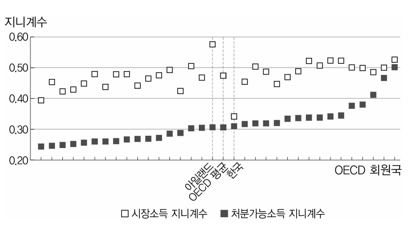
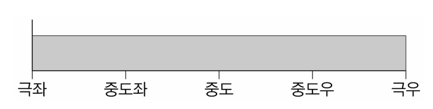
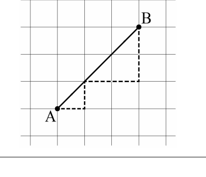
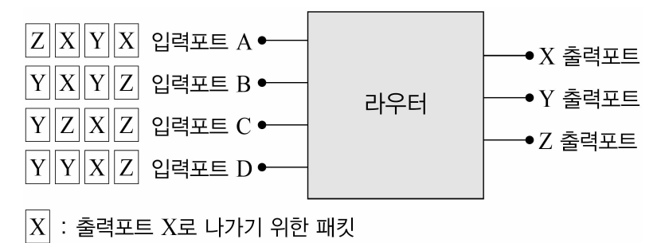

# 01 - RA (2016)

다음 견해들에 대한 평가로 옳은 것만을 <보기>에서 있는 대로 고른 것은?

## 제시문

A : 보편적 도덕으로서의 인권이념은 강대국이 약소국을 침략하기 위한 이데올로기였다. 16세기 스페인의 아메리카 대륙 침략은 비도덕적인 관습으로 핍박받는 원주민 보호 등, 보편적 도덕 가치의 전파라는 명분으로 이루어졌다. 그러나 스페인의 인도적 개입은 자국의 이익을 도모하였던 것에 불과하였다. 인도적 군사개입은 주권국가의 자율성을 짓밟는 것으로서 정당화될 수 없다.

B : 인권은 개별국가 각각의 정치적 맥락 속에서 이룩한 구체적인 산물이다. 주권국가는 고유의 문화적․도덕적 가치에 따라 인권의 구체적 모습을 발전시킬 권한을 갖는다. 그러나 이를 인정하더라도 모든 주권국가들이 보호해야 하는 최소한의 도덕적 인권조차 부정한다면 인종청소와 대량학살과 같은 사태를 막을 수 없을 것이다. 국제사회는 개별국가의 고유한 인권을 존중해야 할 의무가 있지만, 최소한의 도덕적 인권을 지키기 위해 인도적 군사개입을 할 권한을 갖는다.

C : 특정 가치가 특정 국가의 자의에 따라 보편적 권리로 간주되었던 역사를 부정할 수는 없다. 그러나 역사적으로 보편적 인권이 확장되어 왔으며 법을 통해 규범성을 갖게 되었음도 인정해야 한다. 오늘날 대부분의 나라들은 ‘세계인권선언’에 동참하고 인권 규약을 비준하는 등 인권 이념을 국제법적으로 승인하고 있다. 인권은 보편적인 법적 권리인 것이다. 따라서 인도적 군사개입은 국제법으로 정한 요건과 한계를 준수하였을 때에만 인정될 수 있다.

## 보기

ㄱ. A와 B는 보편적 인권을 부정하지만 C는 인정한다.

ㄴ. 만약 “어떠한 국가도 다른 규정에 정한 바가 없을 경우 무력을 사용하여 다른 주권국가를 침략할 수 없다.”라는 국제법 규정이 있다면, 이러한 규정은 C를 약화한다.

ㄷ. B와 C는 어떤 국가가 종교적 가치에 따라 사상․표현의 자유를 억압하고 있다는 근거만으로는 인도적 군사개입을 인정할 수 없다고 본다.

## 선택지

(1) ㄱ

(2) ㄷ

(3) ㄱ, ㄴ

(4) ㄱ, ㄷ

(5) ㄴ, ㄷ

# 02 - RA (2016)

다음 견해들에 대한 평가로 옳지 않은 것은?

## 제시문

X국 헌법 제34조는 “모든 국민은 인간다운 생활을 할 권리를 가진다.”라고 정하고 있는데, 이 조항의 해석으로 여러 견해가 제시되고 있다.

A : 법적 권리는 그 내용이 구체적이고 의미가 명확해야 한다. 그런데 ‘인간다운 생활’이라는 말은 매우 추상적이고, 사람마다 그 의미를 다르게 해석할 수 있는 여지를 광범위하게 제공한다. 따라서 위 조항은 국민에게 법적 권리를 부여하는 것이 아니라 모든 국민이 인간다운 생활을 할 수 있도록 노력하라고 하는 법률 제정의 방침을 제시하고 있을 뿐이며, 그것을 재판의 기준으로 삼을 수는 없다.

B : 위 조항은 국민에게 법적 권리를 부여하고 있다. 하지만 그 자체로는 아직 추상적인 권리에 불과하기 때문에 그에 근거하여 국가기관을 상대로 구체적인 요구를 할 수는 없고, 입법부가 그 권리의 내용을 법률로 구체화한 다음에라야 비로소 국민은 국가기관에 주장하여 실현할 수 있는 구체적인 법적 권리를 가지게 된다.

C : 위 조항은 국민에게 법적 권리를 부여하지만, 그 권리의 구체적인 내용은 잠정적이다. 그 권리의 확정적인 내용은 국민이나 국가기관이 구체적인 사태에서 다른 권리나 의무와 충돌하지는 않는지, 충돌할 경우 어느 것이 우선하는지, 그 권리를 실현하는 데 재정상황 등 사실적인 장애는 없는지 등 여러 요소를 고려하여 판단한다. 국민은 이렇게 확정된 권리를 국가기관에 주장하여 실현할 수 있다.

D : 위 조항에 규정된 ‘인간다운 생활’의 수준은 최소한의 물질적인 생존 조건에서부터 문화생활에 이르기까지 여러 층위로 나누어 생각할 수 있다. 위 조항은 그중에서 적어도 최소한의 물질적인 생존 조건이 충족되는 상태에 대하여는 어떤 경우에도 구체적인 법적 권리를 인정하는 것이며, 사회의 여건에 따라서는 이를 넘어서는 상태에 대한 구체적인 법적 권리도 바로 인정할 수 있다.

## 선택지

(1) A에 대하여는, 헌법 제34조의 문언에 반하는 해석을 하고 있다는 비판을 할 수 있다.

(2) B에 의하면, 국가가 그 권리의 구체적인 내용을 법률로 정하지 않을 경우 국민은 자신의 권리를 실현할 수 없다.

(3) C에 대하여는, 헌법 제34조의 구체적인 내용을 사람마다 달리 이해할 수 있어서 권리의 내용이 불안정하게 된다고 비판할 수 있다.

(4) D가 인정하는 구체적인 법적 권리가 실현될 수 있을지는 사회 여건에 따라 다를 수 있다.

(5) A, B, C는 국가의 다른 조치가 없다면 헌법 제34조를 근거로 법원에 구체적인 권리 주장을 할 수 없다는 점에 견해를 같이한다.

# 03 - RA (2016)

A, B 주장에 대한 분석으로 옳은 것만을 <보기>에서 있는 대로 고른 것은?

## 제시문

P국의 민사소송에서 당사자란 자기의 이름으로 국가의 권리 보호를 요구하는 자와 그 상대방을 말한다. 당사자가 적법하게 소송을 수행할 수 있으려면 당사자능력, 당사자적격, 소송능력 등의 당사자자격을 갖추어야 한다. 당사자능력은 소송의 주체가 될 수 있는 일반적인 능력을 말한다. 대표적으로 살아있는 사람이라면 누구나 민사소송의 주체가 될 수 있다. 당사자적격이란 특정한 소송사건에서 정당한 당사자로서 소송을 수행하고 판결을 받기에 적합한 자격이다. 이는 무의미한 소송을 막고 남의 권리에 대하여 아무나 나서서 소송하는 것을 막는 장치이기도 하다. 소송능력이란 당사자로서 유효하게 소송상의 행위를 하거나 받기 위해 갖추어야 할 능력을 말한다.

A : 인간이 아닌 자연물인 올빼미는 적법하게 소송을 수행할 수 없다. 왜냐하면 소송의 주체가 될 수 있는 당사자능력을 현행법은 사람이나 일정한 단체에만 인정하고 있기 때문이다. 그리고 어떤 존재에게 당사자능력을 인정할지는 소송사건의 성질이나 내용과는 관계없이 일반적으로 정해져야 법과 재판의 안정성을 확보할 수 있다. 따라서 법에서 명시적으로 인정하는 자 이외에는 당사자능력을 추가로 인정할 수 없다.

B : 적법하게 소송을 수행할 수 있는 자격을 누군가에게 인정할지 여부는 그에게 법으로 보호할 이익이 있는지에 따라서 판단해야 한다. 만약 어떤 사람이 살고 있는 곳의 환경이 대규모 공사로 심각하게 훼손될 위험에 처하였다면, 우리는 그 사람에게 이익침해가 있다고 보아 법으로 보호받을 수 있는 자격과 기회를 인정하여야 한다. 민사소송의 당사자가 갖추어야 할 여러 가지 자격이란 이를 구체화한 것일 뿐이다. 그렇다면 자기가 살고 있는 숲이 파괴될 위험에 처한 올빼미에게 법으로 보호받을 자격과 기회를 부정할 이유는 없다. 다만 원활한 소송 진행을 위하여 시민단체가 올빼미를 대리하여 소송을 수행할 수 있을 것이다.

## 보기

ㄱ. A, B는 모두, 소송에서 당사자능력을 인정받기 위해서는 침해되는 이익이 있어야 한다는 점을 전제하고 있다.

ㄴ. A에 따르면, 올빼미가 현실적으로 이익을 침해당하더라도 법 개정이 없이는 소송을 수행할 수 없다.

ㄷ. 법규정의 명문에 반하는 해석이 허용된다면 B는 강화된다.

## 선택지

(1) ㄱ

(2) ㄴ

(3) ㄱ, ㄷ

(4) ㄴ, ㄷ

(5) ㄱ, ㄴ, ㄷ

# 04 - RA (2016)

다음에 대한 평가로 옳은 것만을 <보기>에서 있는 대로 고른 것은?

## 제시문

자유를 박탈하는 징역형의 경우, 기간이 동일하다면 신분, 경제력 등의 차이와 무관하게 범죄자들이 느끼는 고통은 동일하다고 간주되고 있다. 때문에 형벌 기간이 범죄자의 책임에 비례하도록 한다면, 동일한 범죄에 대해서는 동일한 고통을 부과해야 한다는 ‘고통평등의 원칙’뿐만 아니라, 형벌은 범죄자의 책임의 양과 일치해야 하며 이를 초과해서 안 된다는 ‘책임주의 형벌원칙’을 모두 충족할 수 있다.

그러나 벌금형에 있어서 총액벌금형제를 채택하고 있는 A국 형법은 ‘고통평등의 원칙’이 적용되기 어렵다. 총액벌금형제란 벌금을 부과할 때 단순히 법률에 규정된 형량의 범위 내에서 벌금액을 결정하여 선고하는 것을 말한다. 이 경우 불법과 책임이 동일한 행위에 대하여 동일한 벌금을 부과할 수 있을 것이다. 하지만 범죄자마다 경제적 능력이 다르기 때문에 실제로는 경제적 능력이 작은 사람이 더 큰 고통을 받게 되어 ‘고통평등의 원칙’에 반하게 된다. 물론 법원이 선고할 때에는 범행의 동기, 범죄자의 연령과 지능 등 범죄자의 행위와 관련된 책임의 정도를 추론할 수 있는 것들을 참작하여 형량을 조정할 수 있다. 하지만 범죄자의 경제적 능력은 이러한 사유에 해당하지 않기 때문에 총액벌금형제의 문제점을 극복할 수 없다.

이러한 이유로 일수벌금형제의 도입이 요구된다. 일수벌금형제란 행위의 불법 및 행위자의 책임의 크기에 따라 벌금 일수(日數)를 정하고, 고통평등의 원칙을 충족시키기 위해 행위자의 경제적 능력에 따라 일일 벌금액을 차별적으로 정한 뒤 이를 곱하여 최종벌금액을 산정하는 벌금부과 방식이다.

## 보기

ㄱ. 범죄예방 효과는 형벌이 주는 고통에 비례한다고 전제한다면, 경제적 능력이 높은 사람에 대한 범죄예방 효과는 총액벌금형제보다 일수벌금형제가 클 것이다.

ㄴ. 경제적 능력이 같더라도 동일한 벌금을 통해 느끼는 고통의 정도는 다를 수 있다는 점은 일수벌금형제 도입론을 약화한다.

ㄷ. 일수벌금형제 도입론은 징역형에서 기간을 정할 때 충족되는 원칙들이 벌금형에서 일수를 정하는 것만으로도 충족된다고 본다.

## 선택지

(1) ㄱ

(2) ㄷ

(3) ㄱ, ㄴ

(4) ㄱ, ㄷ

(5) ㄱ, ㄴ, ㄷ

# 05 - RA (2016)

다음에 대한 평가로 옳은 것만을 <보기>에서 있는 대로 고른 것은?

## 제시문

P국 근로기준법은 “추가근로수당은 통상임금의 $150\%$ 이상으로 한다.”라고 정하고 있지만, 통상임금이 무엇인지는 따로 정하고 있지 않다. 정기상여금이 통상임금에 해당하는지에 대하여 명확한 판결도 없었다.

X회사 노사는 정기상여금을 통상임금에서 제외하기로 단체협약을 체결하였다. 이후 X회사의 노동자가 그것도 통상임금에 포함되는 것으로 보아야 한다고 주장하면서, 그에 따른 추가근로수당 미지급분을 달라고 하는 소를 제기하였다.

이 재판에서 법관들은 정기상여금이 통상임금에 포함된다고 근로기준법을 해석해야 하며, 이와 어긋난 기존의 노사협약이 있는 경우에는 추가근로수당 미지급분을 청구할 수 있다고 판단하였다. 그런데 추가근로수당 미지급분 청구를 허용할 수 없는 예외를 인정할지에 대하여 다음과 같이 상반된 견해가 제시되었다.

A : 근로기준법의 효력은 당사자의 의사에 좌우될 수 없는 것이 원칙이다. 하지만 이 재판의 결과를 계기로 추가근로수당 미지급분을 청구하는 것이 임금협상 당시 서로가 전혀 생각하지 못한 사유를 들어서 노동자 측이 그때 합의한 임금수준을 훨씬 초과하는 예상 외의 이익을 추구하는 것이고, 그 결과 사용자에게 예측하지 못한 큰 재무부담을 지워서 중대한 경영상의 어려움이 발생하거나 기업의 존립이 위태로워진다면 이는 노사관계의 기반을 무너뜨릴 정도로 서로의 신의를 심각하게 저버리는 처사가 된다. 따라서 그런 특별한 사정이 있는 경우 추가근로수당 미지급분 청구는 신의에 반하는 것으로서 허용될 수 없다.

B : 근로기준법에서 정하고 있는 근로조건은 당사자의 합의로도 바꿀 수 없다. 그런 법의 내용을 오해한 데서 비롯한 신뢰보다는, 법에 따른 정당한 권리행사를 보호할 필요가 훨씬 크다. 또, 기업 경영의 중대한 어려움이나 기업 존립의 위태로움은 그 내용이 막연하고 불확정적이어서, 개별 사안에서 그 판단이 어렵다. 따라서 그런 예외를 인정할 수 없다.

## 보기

ㄱ. 임금협상을 할 때 법원이 정기상여금을 통상임금으로 인정하는 판결을 곧 할 것이라는 사실을 X회사의 노사가 알았다면 A가 인정하는 예외적인 경우에 해당하지 않는다.

ㄴ. 노사관계는 자율적으로 형성되고 발전하는 것이 바람직하다는 요청을 A는 B보다 더 중요하게 생각한다.

ㄷ. 다른 기업들이 추가근로수당 미지급분 지급 여부를 이 판결에 따라 결정한다면, 법적 분쟁이 생길 가능성은 A를 따를 때가 B를 따를 때보다 더 높다.

## 선택지

(1) ㄱ

(2) ㄷ

(3) ㄱ, ㄴ

(4) ㄴ, ㄷ

(5) ㄱ, ㄴ, ㄷ

# 06 - RA (2016)

다음에서 추론한 것으로 옳은 것만을 <보기>에서 있는 대로 고른 것은?

## 제시문

혼인 중 일정 금액을 납입하여 장래 퇴직한 후에 받을 것으로 기대되는 연금의 경우, 이혼 상대방이 연금 수령자에게 재산분할을 청구할 수 있는지, 청구할 수 있다면 어떻게 분할할지에 대해 의견이 대립되고 있다.

A : 이혼 전 퇴직하여 이미 받은 연금만이 분할 대상이 된다. 이혼 후 받게 될 연금은 장래 발생 여부가 불확실하기 때문에 재산분할의 대상이 될 수 없다.

B : 이혼일에는 퇴직 후 받게 될 연금총액을 현재 가치로 산정한 후 그 금액에 대해서만 이혼 상대방의 연금형성 기여율만큼 미리 지급하고, 연금 수령자는 퇴직 시에 연금총액을 지급받도록 해야 한다.

C : 이혼일에는 이혼 상대방의 연금형성 기여율만을 정하여 둔 후, 퇴직일에는 실제 받게 될 연금총액 중 이혼일에 정했던 기여율만큼 이혼 상대방에게 지급해야 한다.

D : 이혼일에는 연금 수령자가 그날에 사퇴한다면 받게 될 연금액 중 이혼 상대방의 연금형성 기여율에 해당하는 금액만을 결정한 후, 실제 퇴직 시에는 그 금액에 물가상승률을 반영하여 이혼 상대방에게 지급해야 한다.

## 보기

ㄱ. 이혼 상대방이 연금형성에 기여했음에도 불구하고 연금분할 여부가 이혼절차의 종결시점에 따라 결정되는 것은 불합리하다면, A는 약화된다.

ㄴ. 만약 이혼 후 회사의 퇴직연한이 65세에서 60세로 바뀌었기 때문에 연금 수령자가 연금 전액을 수령하기 위한 최소한의 근속연수를 채우지 못하는 경우가 발생한다면, 연금 수령자에게는 B보다 D가 더 유리하다.

ㄷ. 만약 이혼 후 연금 자산운용의 수익률 증가로 인하여 연금 수령자가 이혼 시 예상했던 것보다 더 많은 연금을 받게 된다면, 이혼 상대방에게는 C보다 B가 더 유리하다.

## 선택지

(1) ㄱ

(2) ㄴ

(3) ㄱ, ㄴ

(4) ㄱ, ㄷ

(5) ㄴ, ㄷ

# 07 - RA (2016)

다음에서 추론한 것으로 옳은 것만을 <보기>에서 있는 대로 고른 것은?

## 제시문

권리를 가진 자만이 타인에게 권리를 이전해 줄 수 있다. 하지만 예외적으로, 물건의 일종인 동산에 대하여는 거래 시에 물건이 매도인의 것이라고 믿은 매수인이 유효한 거래에 의하여 넘겨받는 경우라면 무권리자(소유권이 없는 자)로부터도 물건에 대한 권리를 취득할 수 있다. 예컨대, 갑이 병의 자전거를, 갑의 소유가 아니라는 사실을 모르고 있는 을에게 돈을 받고 넘겨주면, 그 자전거가 갑의 것이 아니기 때문에 원래는 을의 것이 되지 않는다고 보아야겠지만, 예외적으로 이러한 경우 을은 그 자전거가 갑의 소유가 아님을 알지 못하였기 때문에 즉시 을의 것이 된다. 거래의 안전을 보호하기 위해 이러한 예외가 필요하다.

그런데 거래의 목적물인 동산이 도품인 경우에는 도품의 성질 때문에, 거래 시에 그 물건이 매도인의 것이라고 매수인이 믿고 유효한 거래에 의하여 넘겨 받았다 하더라도 무권리자(소유권이 없는 자)로부터 그 물건에 대한 권리를 취득할 수는 없다고 보아야 한다. 즉 위의 예에서 자전거가 병으로부터 절취된 경우라면 거래의 안전보다는 진정한 소유자로서의 병의 권리를 우선적으로 고려하여 갑이 을에게 병의 자전거를 매도하고 넘겨주었다 해도 을의 것이 되는 것이 아니라 여전히 병의 것으로 남는 것으로 보아야 한다.

반면, 돈은 물건이라는 측면과 가치(비물건)라는 측면 모두를 가지고 있다. 돈을 물건으로 보면 동산과 동일하게 취급하여야 한다. 하지만, 돈을 가치로 본다면 돈은 물건으로서의 성질이 부정되며 그 돈을 가지고 있는 사람에게 속하는 것으로 보아야 한다.

## 보기

ㄱ. 도품 아닌 시계를 갑이 을에게 매도하고 넘겨주었는데, 을은 그 시계가 갑의 것이 아님을 알고 있었다. 을이 다시 정에게 그 시계를 매도하고 넘겨주었는데, 이 때 정은 을이 시계의 소유자라고 믿었다. 정은 시계에 대하여 유효하게 권리를 취득한다.

ㄴ. 돈을 물건으로 보는 경우, 갑이 을에게 도품인 돈을 넘겨주었는데, 을은 그 돈이 도품이라는 사실을 몰랐으며 갑의 것이라고 믿었음에도 불구하고 그 돈은 을의 것이 되지 못한다.

ㄷ. 돈을 가치로 보는 경우, 갑이 을에게 돈을 주었는데, 을은 갑이 그 돈을 훔쳤다는 사실을 알고 있었다 하더라도 그 돈은 을의 소유가 된다.

## 선택지

(1) ㄱ

(2) ㄴ

(3) ㄱ, ㄷ

(4) ㄴ, ㄷ

(5) ㄱ, ㄴ, ㄷ

# 08 - RA (2016)

다음에서 추론한 것으로 옳은 것만을 <보기>에서 있는 대로 고른 것은?

## 제시문

행정청의 법적 행위의 위법 여부는 원칙적으로 각각의 행위별로 독립적으로 검토되어야 한다. 그러나 둘 이상의 행위가 연속적으로 행해지는 경우 일정한 요건 하에서 행정청의 앞선 행위의 하자를 이유로 후속 행위의 위법을 인정하는 경우가 있다.

만약 앞선 행위의 하자를 다툴 수 있는 제소기간이 지나서 취소소송으로 더 이상 다툴 수 없음에도 불구하고, 후속 행위를 다투는 취소소송에서 앞선 행위의 하자를 후속 행위의 위법 사유로 계속해서 주장할 수 있게 한다면, 법적 안정성이나 제소기간을 둔 취지가 훼손되므로, 행정행위 상호간의 하자는 승계되지 않는 것이 원칙이다. 그러나 앞선 행위와 후속 행위가 서로 결합하여 하나의 법적 효과를 완성하는 경우에는, 앞선 행위에 대한 하자를 다투는 제소기간이 경과하였더라도 앞선 행위의 하자를 후속 행위의 위법사유로 주장할 수 있도록 함으로써 후속 행위의 효력을 제거하는 것을 인정한다.

예컨대, 행정청이 갑에게 건축물의 철거명령(앞선 행위)을 내렸으나, 갑이 이를 스스로 이행하지 않아 행정청이 직접 갑의 건축물을 철거하는 대집행 절차(후속 행위)에 이르게 된 경우, 철거명령과 대집행 절차는 서로 별개의 법적 효과를 발생시키는 독립적 행위로 인정된다. 또한 대집행 절차를 구성하는 일련의 단계적인 행위들(대집행의 계고, 실행의 통지, 실행, 비용징수)은 서로 결합하여 하나의 법적 효과를 발생시키는 행위로 인정된다.

다른 한편으로 앞선 행위의 하자가 중대하고 명백하여 제소기간의 적용을 받지 않는 무효에 해당한다면, 법적 안정성의 가치에 비해 권리구제의 필요성이 크므로 앞선 행위와 후속 행위가 서로 결합하여 하나의 법적 효과를 발생시키는지 여부를 묻지 아니하고 앞선 행위의 하자를 후속 행위의 위법사유로 주장할 수 있다.

## 보기

ㄱ. 철거명령에 하자가 있었으나 이에 대한 제소기간이 지났고 그 하자가 무효가 아니라면, 대집행 계고 처분 취소소송에서 철거명령의 하자를 대집행 계고 처분의 위법사유로 주장할 수 없다.

ㄴ. 철거명령이 무효인 경우, 철거명령과 대집행 계고가 서로 결합하여 하나의 법적 효과를 발생시키는지 여부에 관계없이, 대집행 계고 처분 취소소송에서 철거명령의 하자를 대집행 계고 행위의 위법사유로 주장할 수 있다.

ㄷ. 철거명령과 대집행 절차상의 행위가 서로 결합하여 하나의 법적 효과를 발생시키는지 여부에 관계없이, 비용징수 처분 취소소송에서 대집행 계고 행위의 하자를 비용징수 행위의 위법사유로 주장할 수 있다.

## 선택지

(1) ㄱ

(2) ㄴ

(3) ㄱ, ㄷ

(4) ㄴ, ㄷ

(5) ㄱ, ㄴ, ㄷ

# 09 - RA (2016)

다음에서 추론한 것으로 옳은 것만을 <보기>에서 있는 대로 고른 것은?

## 제시문

제대로 조직된 국가에서 사형은 정말 유용하고 정당한가? 인간들은 무슨 권리로 그들의 이웃을 살해할 수 있는가? 주권과 법의 토대를 이루는 권리가 그것이 아님은 분명하다. 법은 각자의 개인적 자유 중 최소한의 몫을 모은 것일 뿐인데, 자신의 생명을 빼앗을 권능을 타인에게 기꺼이 양도할 자가 세상에 어디 있겠는가? 개인의 자유 가운데 희생시킬 최소한의 몫에 어떻게 모든 가치 중 최대한의 것인 생명 자체가 포함될 수 있겠는가? 만약 그렇다 하더라도, 자살을 금지하는 다른 원칙과 어떻게 조화될 수 있겠는가?

그러니 사형은 권리의 문제가 아니라, 사회가 자신의 존재를 파괴당하지 않기 위해서 시민에 대하여 벌이는 전쟁행위이다. 따라서 국가가 자유를 상실할 기로에 서거나, 무정부상태가 도래하여 무질서가 법을 대체할 때가 아니라면 시민의 죽음은 불필요하며, 그런 비상한 상황이 아닌 다음에는 한 사람의 죽음이 타인들의 범죄를 억제하는 유일한 방법이어서 사형이 필요하고 정당한 경우가 있을 수 있는지만이 문제된다.

결심이 선 인간이 사회를 침해하는 것을 사형이 막지 못한다는 것을 모든 시대의 경험이 입증하고 있지만, 이것으로는 부족하다고 의심하는 이들을 설득하는 데는 인간의 속성을 살펴보기만 해도 된다. 인간의 정신에 무엇보다 큰 효과를 미치는 것은 형벌의 강도가 아니라 지속성이다. 우리의 감수성은 강력하지만 일시적인 충격보다는 미약하더라도 반복된 인상에 훨씬 쉽고도 영속적으로 영향을 받기 때문이다. 범죄자가 처형되는 무섭지만 일시적인 장면을 목격하는 것이 아니라, 일하는 짐승처럼 자유를 박탈당한 채 노동해서 사회에 끼친 피해를 갚아나가는 인간의 모습을 오래도록 보는 것이 범죄를 가장 강력하게 억제한다.

- 베카리아(1738-1794), ｢범죄와 형벌｣ -

## 보기

ㄱ. 법에 따른 지배가 구현되고 있는 평화로운 나라에서 사형은 허용되지 않는다.

ㄴ. 형벌의 주된 목적은 범죄자의 잘못된 습관을 교정하는 데 있다.

ㄷ. 형벌의 공개집행에 반대한다.

## 선택지

(1) ㄱ

(2) ㄴ

(3) ㄱ, ㄷ

(4) ㄴ, ㄷ

(5) ㄱ, ㄴ, ㄷ

# 10 - RA (2016)

다음 주장들에 대한 평가로 옳은 것만을 <보기>에서 있는 대로 고른 것은?

## 제시문

A : 인간은 일해야만 하는 유일한 동물이다. 일에 몰두하는 것은 그 자체로는 즐겁지 않고 사람들은 일을 다른 목적 때문에 떠맡는다. 반대로 놀이에 몰두하는 것은 그 자체로 즐거우며 놀이 이상의 목적을 의도하지 않는다. 인간은 무위도식하려는 강력한 경향성을 가지고 있어 일 안하고 놀수록 일하려고 결심하는 것은 힘들다. 그러므로 어린 시절부터 일을 위한 숙련성이 양성되어야 한다. 교과를 배우는 것도 목적의 도달에 숙련되기 위해서이다. 숙련성의 양성을 위해서는 강제가 동원되어야 하는데 학교 밖에서 이것이 가능하겠는가? 학교에서 놀이를 통해 교과를 배우도록 하는 것은 일종의 공상이다.

B : 인간은 일을 통해 자신을 창조한다. 성인은 외적으로 요구되는 것에 대해 자신의 노력을 기울임으로써 일하지만, 어린이가 일하는 과정은 내적 자아를 구성하는 과정이다. 그래서 성인은 일을 위해 최소한의 노력으로 최대한의 효과를 얻으려는 법칙을 사용하지만, 어린이는 일하면서 최대한의 에너지를 소비하며 사소한 일을 행하는 데에도 모든 잠재력을 사용한다. 어린이는 일을 하면서 놀이를 하는 것이다. 그러므로 교육기관은 어린이가 일을 통해 자신을 창조할 수 있는 환경 및 교구를 제공해야 한다.

C : 인간은 놀이할 때 비로소 완전한 인간이 된다. 일은 세계를 이용해야 할 대상으로 보는 활동인 반면, 놀이는 세계를 설명하고 이해하고자 하는 마음이 담긴 활동이다. 놀이는 그 어떤 것의 수단이 아니며 그 자체로 의미와 가치를 지닌다. 철학, 과학, 역사는 세계에 대한 이해와 설명으로 들어가는 각기 다른 모험들이다. 이런 교과를 배워서 철학자, 역사가, 과학자의 사유 방식을 탐구하는 동안 우리는 일하는 것이 아니라 이들과 대화를 통해 놀이하는 것이다. 학교는 직업적 숙련성을 양성하는 장소가 아니다.

## 보기

ㄱ. ‘수학 교과를 놀이하면서 배우는 것은 불가능하다’라는 주장에 A는 동의하고 B와 C는 동의하지 않는다.

ㄴ. ‘학교는 일을 위한 공간이다’라는 주장에 A는 동의하고 B와 C는 동의하지 않는다.

ㄷ. ‘과학을 배우는 이유는 일을 위한 쓸모 때문이다’라는 주장에 A는 동의하고 C는 동의하지 않는다.

## 선택지

(1) ㄱ

(2) ㄴ

(3) ㄱ, ㄷ

(4) ㄴ, ㄷ

(5) ㄱ, ㄴ, ㄷ

# 11 - RA (2016)

다음 논쟁에 대한 평가로 옳지 않은 것은?

## 제시문

갑 : 법적으로 장기는 판매 대상이 되지 못합니다. 장기는 인신의 일부이고, 인신은 인간 존엄성의 기반이기 때문입니다. 성매매는 비록 단기간이라고 해도 성판매자의 인신에 대한 사용 권한을 매수자에게 준다는 점에서 인간 존엄성 원칙에 위배됩니다.

을 : 성적 서비스 제공 역시 노동의 일종이지 않을까요. 노동을 제공하고 그 대가로 금전적 보상을 받는다는 점에서는 다른 직업과 다를 바 없다고 봅니다. 직업선택의 자유를 보장하는 것은 인간 존엄성의 중요한 내용을 이룹니다.

갑 : 모든 선택의 자유가 인정되어야 하는 것은 아닙니다. 마약복용은 그것이 자율적 선택에 기인하는 것이라고 해도 국가의 개입이 가능합니다. 어떻게 사는 것이 인간의 존엄성을 지키는 것인지를 전적으로 국민 개인의 판단에 맡길 수는 없습니다.

을 : 마약복용을 성매매와 같은 것으로 볼 수 없습니다. 성매매가 당사자들에게 어떤 해악을 끼치는지 의심스러우며, 설령 해악을 끼친다고 해도 그것이 정상적인 인지능력을 가진 성인들 간에 이뤄지는 것이라면 당사자들 스스로 위험을 감수한 해악입니다.

갑 : 성매매가 상호 선택에 의한 것이라 할지라도 성매매를 통해 팔리는 것은 남성이 마음대로 권력을 행사할 수 있는 여성상, 즉 종속적 여성상입니다. 성매매는 여성의 종속성을 재생산함으로써 여성 억압의 전형을 보여줍니다.

을 : 우리 사회의 다양한 제도와 관행을 살펴볼 때 결혼, 외모성형 등도 성매매 못지않게 여성의 고정된 성정체성을 재생산하는데, 유독 성매매만 법적으로 금지하는 것은 설득력이 없습니다.

## 선택지

(1) 유모(乳母)가 자신의 인신에 대한 사용권한을 매수자에게 준다고 해서 비난 받지 않는다는 사실은 을의 입장을 강화한다.

(2) 성매매의 불법화로 인해 성판매자가 범죄자로 취급받는 적대적 환경 때문에 자신의 권리조차 행사할 수 없게 된다는 주장은 을의 입장을 지지한다.

(3) 자발적 선택으로 노예가 되기로 계약했다고 하더라도 노예노동이 금지되고 있다는 사실은 갑의 입장을 강화한다.

(4) 마약복용은 행위자가 인지능력을 제대로 발휘하지 못하는 상태에서 행해진다는 주장은 갑의 입장을 지지한다.

(5) 미스 코리아 대회가 여성의 고정된 성정체성을 확대 재생산함에도 불구하고 시행되고 있다는 사실은 을의 입장을 강화한다.

# 12 - RA (2016)

아래 글의 저자가 암묵적으로 전제하는 것으로 옳지 않은 것은?

## 제시문

육식을 정당화하는 사람들은 동물들이 서로 잡아먹는 것을 근거로 들 때가 있다. ‘그래, 너희들이 서로 먹는다면, 내가 너희들을 먹어서는 안 될 이유가 없지’라고 생각하는 것이다. 그러나 이런 주장에 대해 제기될 수 있는 반박은 명백하다. 먹기 위해 다른 동물을 죽이지 않으면 살아남을 수 없는 많은 동물들과 달리, 사람은 생존을 위해 반드시 고기를 먹을 필요가 없다. 나아가 동물은 여러 대안을 고려할 능력이나 식사의 윤리성을 반성할 능력이 없다. 그러므로 동물에게 그들이 하는 일에 대한 책임을 지우거나, 그들이 다른 동물을 죽인다고 해서 죽임을 당해도 괜찮다고 판정하는 것은 타당하지 않다. 반면에 인간은 자신들의 식사습관을 정당화하는 일이 가능한지를 고려하지 않으면 안 된다.

한편 어떤 사람들은 동물들이 서로 잡아먹는다는 사실은 일종의 자연법칙이 있다는 것을 의미하는 것으로 간주하곤 한다. 그것은 더 강한 동물이 더 약한 동물을 먹고 산다는 일종의 ‘적자생존’의 법칙을 말한다. 그들에 따르면, 우리가 동물을 먹는 것은 이러한 법칙 내에서 우리의 역할을 하는 것일 뿐이다. 그러나 이런 견해는 두 가지 기본적인 잘못을 범하고 있다. 첫째로, 인간이 동물을 먹는 것이 자연적인 진화 과정의 한 부분이라는 주장은 더 이상 설득력이 없다. 이는 음식을 구하기 위해 사냥을 하던 원시문화에 대해서는 참일 수 있지만, 오늘날처럼 공장식 농장에서 가축을 대규모로 길러내는 것에 대해서는 참일 수 없다. 둘째로, 가임 여성들이 매년 혹은 2년마다 아기를 낳는 것은 의심할 여지없이 ‘자연스러운’ 것이지만, 그렇다고 해서 그 과정에 간섭하는 것이 그릇된 것임을 의미하지는 않는다. 우리가 하는 일의 결과를 평가하기 위해서 우리에게 영향을 미치는 자연법칙을 알 필요가 있음을 부정할 필요는 없다. 그러나 이로부터 어떤 일을 하는 자연적인 방식이 개선될 수 없음이 따라 나오지는 않는다.

## 선택지

(1) 반성 능력이 없는 존재에게는 책임을 물을 수 없다.

(2) 자신의 생존에 위협이 되는 행위는 의무로 부과할 수 없다.

(3) 어떤 행위의 대안을 고려할 수 있는 존재는 윤리적 대안이 있는데도 그 행위를 하는 경우라면 그것을 정당화해야 한다.

(4) 공장식 농장의 대규모 사육은 자연스러운 진화의 과정이 아니다.

(5) 자연적인 방식이 개선되면 기존의 자연법칙은 더 이상 유효하지 않다.

# 13 - RA (2016)

다음 견해들에 대한 분석으로 옳은 것만을 <보기>에서 있는 대로 고른 것은?

## 제시문

온실가스의 배출이 국제적으로 기후변화와 자연재해를 일으킨다고 알려져 있다. 다음은 기후변화에 대응하기 위해 온실가스의 배출을 제한하는 경우 그 부담을 각국에 공정하게 분배하기 위한 견해들이다.

A : 지구상의 모든 사람들은 평등한 대기 이용 권리를 가지므로 각 개인이 배출할 권리를 갖는 온실가스의 양은 동등해야 한다. 따라서 각 국가가 가지는 온실가스 배출권은 그 국가의 인구에 비례해서 주어져야 한다.

B : 과거에 온실가스를 많이 배출한 국가들은 온실가스를 저장할 수 있는 대기의 능력 중 자신의 몫의 일부를 이미 사용한 것이므로 그만큼 장래 온실가스를 배출할 권리를 적게 가져야 한다.

C : 국제적으로 온실가스 배출량을 제한함으로써 얻을 이익이 더 큰 국가들, 즉 온실가스로 인한 자연재해의 피해가 배출 제한 이후 더 많이 경감되는 국가들이 그 이익의 양에 비례해서 국제적 비용을 더 많이 지불하도록 해야 한다.

※ 각 국가는 자기 이익을 극대화하려는 성향을 가진다고 가정한다.

## 보기

ㄱ. 사치성 소비를 위한 온실가스 배출 권리와 필수 수요 충족을 위한 온실가스 배출 권리에 차별을 두는 것이 합당하다면 A는 약화된다.

ㄴ. 과거 세대의 행위에 대해 현재 세대에게 책임을 지울 수 없다는 이유로 B를 비판한다면, B는 과거 화석 연료를 이용한 산업화 과정을 거친 국가들이 현재 1인당 국민총생산도 일반적으로 높다는 사실을 들어 이 비판을 약화할 수 있다.

ㄷ. 온실가스로 인해 자연재해의 피해를 크게 입은 국가와 온실가스를 많이 배출한 국가가 일치하지 않고, 현재 인구가 많은 국가일수록 과거에 온실가스를 더 많이 배출했다면, 현재 인구가 많은 국가는 A보다는 C에 더 동의할 것이다.

## 선택지

(1) ㄴ

(2) ㄷ

(3) ㄱ, ㄴ

(4) ㄱ, ㄷ

(5) ㄱ, ㄴ, ㄷ

# 14 - RA (2016)

다음 논쟁에 대한 분석으로 옳지 않은 것은?

## 제시문

갑 : 자유주의 사회의 시민 대다수는 사실적 행위인과성과 이에 기초한 법적 책임소재가 분명할 때에만 누군가에게 합당하게 의무를 부과할 수 있다고 믿는다. 이에 따르면 대한민국의 시민인 우리는 아프리카 등지에 사는 사람들의 재산을 강탈한 적이 없으므로 그들의 가난에 대해 책임질 일도 없다. 따라서 우리는 먼 나라의 빈곤을 감축하는 데 일조해야만 한다는 막연한 느낌 때문에 불편해할 이유가 없다. 자유주의 사회의 도덕은 최대의 ‘자선’을 장려하는 적극적 도덕이 아니라 행위를 규제하는 최소의 공리로서 ‘가해금지의 원칙’에 충실할 것을 요구하는 소극적 도덕을 근간으로 한다. 그렇기 때문에 나의 가해행위에 대한 사죄의 차원을 넘어선 적극적 자선은 자유주의적 개인에게 가외의 기특한 행동으로 여겨질 수는 있어도 보편적 승인과 준수를 요하는 의무일 수는 없다.

을 : 분명한 행위인과성과 이에 기초한 책임소재에 입각하여 부과된 의무만이 구속력을 갖는다는 견해는 정당한 근거도 없이 유지되어 온 윤리적 통념에 불과하다. 이 통념의 영향권을 벗어나면 윤리적 책임은 힘의 기능이라고 생각할 여지가 분명히 존재한다. 다시 말해 윤리적인 책임의 본래적인 대상은 적법한 발언권과 로비력을 가진 강하고 자립적인 주체가 아니라 권리를 주장할 힘조차 없는 무력하고 의존적인 주체이며, 이 작고 무력한 주체에 대한 크고 유력한 주체의 윤리적 반응이 바로 책임이라고 생각할 수 있는 것이다. 여기서 무력한 주체를 무력하게 만든 장본인이 내가 아니라는 사실은 조금도 중요하지 않다. 중요한 것은 그보다 더 크고 유력한 나와 같은 사람들이 그를 돕지 않으면 그는 어쩔 수 없이 죽게 된다는 사실뿐이다. 우리는 이 확장된 책임의 개념으로 동등한 법적 지위를 전제로 한 기존의 협소한 의무 개념을 극복하고 지구적 양극화 시대의 인간 존엄을 바로세우기 위한 의무론의 새로운 지평을 열어 가야 한다.

## 선택지

(1) 을은 어떤 윤리적 기준에 많은 사람이 찬성한다는 것과 그것이 옳다는 것은 각기 다른 문제라고 볼 것이다.

(2) 을은 가난한 나라를 도와주는 부자 나라는 나중에 어려울 때 도움 받을 수 있을 것이기 때문에 도울 의무가 있다고 볼 것이다.

(3) 갑은 원조의 의무에서 핵심은 행위주체가 도와줄 수 있는 힘이 있느냐이지 그 외의 것은 부차적이라고 보는 것에 반대할 것이다.

(4) 을은 설령 가난한 나라가 과거 부자 나라에게 피해를 끼쳤다 하더라도 이것과 상관없이 부자 나라는 가난한 나라를 도울 의무가 있다고 볼 것이다.

(5) 갑은 가난한 나라가 부자 나라로부터 도움 받기를 원하는지 아닌지와 상관없이 부자 나라는 가난한 나라를 도울 의무가 있다는 것에 반대할 것이다.

# 15 - RA (2016)

다음 논쟁으로부터 적절하게 추론할 수 있는 것은?

## 제시문

갑 : 자유지상주의자는 출생과 같은 행운에 의한 이득은 사기, 절도 등 권리침해로 취한 것이 아니므로, 각 개인이 가질 자격을 갖는다고 본다. 그러나 타고난 재능에 의한 불평등을 그냥 개인들의 문제로 치부하는 것은 도덕적으로 무책임한 태도이다. 사회·경제적 불평등은 가장 불리한 사회구성원들에게 혜택을 주는 경우에만 허용되어야 한다. 그런데 타고난 재능은 오직 우연에 의해 개인의 것이 되었으며, 그러한 우연적 자산에 혜택을 주는 것은 개인이 노력한 결과에 혜택을 주는 것과 달리 최소수혜자의 복지를 증진하는 데 아무런 기여도 하지 않는다. 따라서 이러한 자산은 본질적으로 공동의 것이며, 사회는 그것을 활용해 얻은 결과물에 대해 우선적으로 소유권을 주장할 수 있어야 한다.

을 : 당신이 기반하고 있는 원칙은 사실상 ⓐ 정체불명의 ‘우리’를 가정하고 있다. 우연히 ‘여기’에 놓인 자산에 대해 한 개인이 우선적 소유권을 주장할 수 없다고 해서, 그것이 곧바로 이 세상 모든 사람들이 동등한 소유권을 주장할 수 있음을 의미하지는 않는다. 이 점에서 당신의 원칙은 공리주의와 마찬가지로 일종의 공유 원칙이다. 왜냐하면 공리주의 역시 개인들을 모두의 행복을 위한 수단으로 사용하고, 공리의 최대화에 기여한다는 계산에 바탕해서만 개인의 권리와 개인간의 차이를 옹호하기 때문이다. 하지만 이러한 원칙은 개인들에 우선하는 도덕적 연대를 전제해야 한다. 협동적인 공동체가 우리의 이상임은 분명하다. 하지만 그 공동체는 개인의 덕을 존중하는 공동체여야 한다. 그렇다면 사회적 공유의 범위는 상당히 제한될 수밖에 없다. 또한 공동선을 이유로 개인들의 다원성과 독자성을 위반할 가능성 역시 경계하지 않을 수 없다. 이 점에서 당신은 공리주의와 똑같은 반론에 부딪힐 수밖에 없다.

## 선택지

(1) ⓐ가 한 사회 속의 특정 집단이나 계층이 아니라 그 사회 전체를 의미하는 것이라면, 갑은 을의 비판에서 벗어날 수 있다.

(2) 갑은 공리주의자와 마찬가지로 공동체 전체의 이익 총량을 증대할 수 있다면 소유에 관한 개인의 권리는 어느 정도 제한될 수 있다고 본다.

(3) 을은 우연적 재능으로 얻은 혜택에 대해 개인이 우선적 소유권을 가질 수 있음을 부정하지 않는다.

(4) 을은 개인의 다원성과 독자성이 공유 원칙과 충돌하지 않을 경우 전자를 우선하지만, 충돌할 경우 후자를 우선해야 한다고 본다.

(5) 을이 개인의 우연적 자산을 사회의 공동 자산으로 삼는 견해에 반대하는 까닭은 그것을 공동의 자산으로 공유해도 이것이 최소수혜자의 복지 증진으로 이어지는 것은 아니라고 보기 때문이다.

# 16 - RA (2016)

[A]에 들어갈 진술 중 을의 반박을 약화할 수 있는 갑의 주장으로 가장 적절한 것은?

## 제시문

등산을 좋아하는 X는 가을에 에베레스트 등반을 계획하고 있었다. 그런데 그 해 봄에 임신 2개월째라는 것을 알게 되었다. X는 분명히 그 해에 아이를 가질 예정이었다. 그러나 그 시기는 등반을 마친 이후였는데 실수로 먼저 임신을 하게 되었다. 그는 등반 이후에 다시 아이를 갖기로 하고 낙태 수술을 받았다.

Y도 임신을 계획하고 있었다. 다만 치료차 복용 중이던 약 때문에 바로 아이를 가지면 아이에게 장애가 생기게 되지만, 3개월 후 완치된 다음에 임신하면 건강한 아이를 갖게 된다는 것을 알았다. 그러나 Y는 기다리지 않고 곧 아이를 가졌다.

Y에게서 장애가 있는 아이가 태어났다. 아이가 자라서 “엄마는 왜 그때 나를 낳았어요? 3개월 후에 임신했다면 나는 장애를 안가지고 태어났을 텐데요.”라고 말한다. 이에 Y는 “그때 3개월을 기다려 임신했다면 너는 안 태어났을 거야. 다른 아이가 태어났겠지. 장애가 있긴 해도 너는 그렇게라도 태어났기에 이런 말도 할 수 있는 거야. 나는 네게 잘못한 것이 없어.”라고 말한다.

갑 : X의 행동은 옳지 못하다. 인간의 생명은 마음에 들지 않는다고 대체할 수 있는 성격의 것이 아니다.

을 : 그럼 Y의 사례는 어떻게 생각하는가?

갑 : Y가 뭔가 잘못하지 않았나? Y는 장애가 없는 아이를 가질 수도 있었는데 장애가 있는 아이를 가졌으니까.

을 : 당신의 입장은 일관되지 않다. 당신의 말대로 아이가 대체 가능하지 않다면 아이의 항의보다 Y의 대답이 더 정당해야 한다. Y는 아이가 대체 가능하지 않다고 생각하고 있으니까.

갑 : 내가 X에 적용한 기준은 Y에 적용할 수 없다.

[A]

## 선택지

(1) X는 산모의 생명이나 건강 이외의 다른 이유로 낙태를 할 수 있다고 생각했고, Y는 어떤 것도 낙태의 이유가 될 수 없다고 생각했기 때문이다.

(2) X는 만족스러운 삶의 질을 가질 아이를 낳지 않은 것에 잘못이 있고, Y는 덜 만족스러운 삶의 질을 가진 아이를 낳은 것에 잘못이 있기 때문이다.

(3) X는 7개월을 기다렸다면 태어났을 아이를 존재하지 않게 하였고, Y는 3개월을 기다렸다면 가졌을 아이를 존재하지 않게 했기 때문이다.

(4) X는 이미 존재한 생명에 대해 결정을 했고, Y는 아직 생명이 존재하기 전에 결정을 내렸기 때문이다.

(5) X는 누구인지 모르는 아이에게 해를 끼쳤고, Y는 누구인지 아는 아이에게 해를 끼쳤기 때문이다.

# 17 - RA (2016)

다음 논증에 대한 비판으로 가장 적절한 것은?

## 제시문

로크는 자연에 있는 사물들이 “적어도 다른 사람들도 좋은 상태로 사용할 만큼 충분히 남아있는 한” 그 사물을 노동을 통해 소유할 수 있다고 주장한다. 이러한 로크의 제한조건이 의미하는 바는 “다른 사람들의 상황을 더 나쁘게 하지 않는 한에서만” 소유권이 인정된다는 것이다. 그러나 로크의 이 제한조건이 현재에는 더 이상 만족될 수 없다고 한다면 어떻게 될까? 만약 그렇다면 우리는 “이전에 우리가 인정했던 소유권을 포함해서 그 어떤 소유권도 성립할 수 없다.”라는 놀라운 결론을 이끌어낼 수 있다.

우선 “로크의 제한조건에 위배된다.”를 곧 “다른 사람들의 상황을 더 나쁘게 한다.”라는 것으로 정의하자. 그리고 ⓐ <u>어떤 종류의 사물 $t$가 여러 사람들에 의해 소유되어 이제 그것이 충분히 남아 있지 않아, Z는 그 사물을 사용할 수 없게 되었다고 가정하자.</u> 즉, Z가 사용할 수 있는 좋은 상태의 충분한 사물 $t$가 세상에 존재하지 않는다고 가정해 보자. 그렇다면 Z 바로 전에 $t$를 소유한 Y의 행위는, Z가 $t$를 사용할 자유를 갖지 못하게 하여 Z의 상황을 더 나쁘게 하였으므로 로크의 제한조건에 위배된다. 그런데 더 거슬러 올라가, ⓑ <u>Y가 $t$를 소유하기 바로 전에 $t$를 소유한 X 역시 Y를 더 나쁜 상황에 빠뜨린 셈이다.</u> 왜냐하면 ⓒ <u>X가 $t$를 소유함으로써 Y는 로크의 제한조건에 위배되지 않고서는 $t$를 소유하지 못하게 되었고, X의 소유는 결국 Y의 소유가 로크의 제한조건에 위배되게끔 만들었기 때문이다.</u> 따라서 ⓓ <u>X의 소유 역시 로크의 제한조건에 위배된다.</u> 이와 같은 방식으로, X 전에 $t$를 소유한 W에 대해서도, W는 X를 더 나쁜 상황에 빠뜨렸으므로, W의 소유는 로크의 제한조건에 위배된다고 말할 수 있다. ⓔ <u>같은 방식으로 계속 추론하다보면, $t$를 최초로 소유한 A의 소유 역시 로크의 제한조건에 위배된다고 말하지 않을 수 없다.</u>

## 선택지

(1) ⓐ의 가정은 현실에 부합하지 않는다. 자연에는 아직 모든 사람들이 사용하기에 충분할 정도로 많은 자원이 남아 있다.

(2) ⓑ는 ⓒ로부터 도출되지 않는다. 만약 Y 바로 전에, X가 아니라 W가 $t$를 소유했다면 W가 Y를 나쁜 상황에 빠뜨렸을 것이므로, X가 Y를 더 나쁜 상황에 빠뜨렸다고 볼 수 없다.

(3) ⓒ의 주장은 받아들일 수 없다. X가 $t$를 소유해도, Y가 로크의 제한조건에 위배되지 않고 $t$를 소유할 여지가 여전히 남아 있다.

(4) ⓓ는 ⓑ로부터 도출되지 않는다. X가 Y를 더 나쁘게 한 방식은 Y가 Z를 그렇게 한 방식과 차이가 있음을 간과하고 있다.

(5) ⓔ의 진술은 의심스럽다. 어떤 사물을 최초로 소유한 자를 확정하기란 거의 불가능하므로 우리는 한 사물의 소유에 대해 누가 최초로 로크의 제한조건을 위반하는지를 판단할 수 없다.

# 18 - RA (2016)

<자료>를 토대로 다음 주장들을 옳게 평가한 것은?

## 제시문

갑 : 자살의 원인은 존재의 어려움으로 인한 절망이다. 삶의 짐이 버거울 때 사람들은 자살을 생각하게 되는 것이다. 통계에 따르면 1873～1878년 동안 $16{,}264$명의 기혼자들이 자살한 데 비해, 미혼자의 자살자 수는 $11{,}709$명에 불과하다. 따라서 결혼과 가족은 자살의 가능성을 높인다. 미혼자는 기혼자보다 쉬운 삶을 산다고 할 수 있다. 결혼은 여러 종류의 부담과 책임을 부과하기 때문이다.

을 : 그 통계 자료를 자세히 보면 미혼자의 상당수는 16세 미만이고, 기혼자는 모두 16세 이상이다. 그리고 16세까지는 자살 경향이 매우 낮다. 미혼자들이 낮은 자살 경향을 보이는 것은 미혼이기 때문이 아니라 대다수가 미성년자이기 때문이다. 결혼이 자살에 미치는 영향을 알기 위해서는 기혼자와 16세 이상 미혼자만 비교해야 한다. 16세 이상인 기혼자와 미혼자의 인구 백만 명당 자살 건수를 비교하면, 미혼자는 $173$이나 기혼자는 $154.5$이다. 따라서 결혼은 자살을 막는 효과가 있다.

병 : 결혼이 최소한 자살 가능성을 높이지 않는다는 점에 동의한다. 하지만 미혼자의 자살률은 기혼자의 자살률의 고작 $1.12$배로, 둘 사이의 차이는 미미하다. 결혼의 자살 예방 효과를 확신하기 어렵다.

<자 료>

ㄱ. 1848～1857년의 통계를 보면, 미혼자의 평균 연령은 27～28세, 기혼자의 평균 연령은 40～45세이다. 이 기간의 연령별 자살률은 연령대가 높아질수록 증가한다. 만약 연령이 자살에 영향을 미치는 유일한 요소라면, 기혼자의 인구 백만 명당 자살률은 $140$ 이상이고 미혼자의 인구 백만 명당 자살률은 $97.9$ 이하여야 한다. 하지만 실제 자살률은 기혼자보다 미혼자가 더 높다.

ㄴ. 1889～1891년 통계에 의하면, 미혼 여성의 자살률은 기혼 여성 자살률의 $1.56$배이고 미혼 남성의 자살률은 기혼 남성 자살률의 $2.73$배이다.

ㄷ. 1889～1891년 통계는 미혼 여성의 자살률이 배우자와 사별한 여성의 자살률의 $0.84$배이고 미혼 남성의 자살률은 배우자와 사별한 남성의 자살률의 $1.32$배임을 보여 준다.

ㄹ. 인구 대비 혼인 건수는 수십 년 동안 큰 변화가 없었으나, 자살률은 $3$배로 증가하였다.

## 선택지

(1) ㄱ은 을이 병의 주장을 반박하는 근거가 된다.

(2) ㄴ은 병이 을의 주장을 반박하는 근거가 된다.

(3) ㄷ은 갑을 강화한다.

(4) ㄹ은 을을 강화한다.

(5) ㄹ은 병을 약화한다.

# 19 - RA (2016)

다음을 분석한 것으로 옳지 않은 것은?

## 제시문

ⓐ <u>A국 식약청은 특정 질환에 대한 신약을 출시하려는 제약 회사에게 위약시험을 통해 신약의 효능을 입증하도록 요구한다.</u> 즉, 치료약인 것처럼 제시되지만 실제 약효가 전혀 없는 가짜 약품(위약)으로 치료받은 환자들과 비교하여 신약으로 치료받은 환자들의 치료 효과가 우월해야 신약의 출시가 허용된다. 이미 해당 질환에 대한 치료 효능이 입증되어 신약과 비교 가능한 약품이 존재하더라도, 신약 제조사는 신약에 대한 위약시험을 거쳐야 한다.

반면 ⓑ <u>H선언은 기존 약품 중 효능이 가장 좋은 것과 신약의 효능을 비교하는 동등성시험으로 신약의 효능 입증 시험을 해야 한다고 요구한다.</u> H선언의 윤리적 기준에 따르면, 효과적인 치료법이 있는 경우 의사는 환자에게 그것을 제공할 윤리적·법적 의무를 갖는다. 동등성시험으로 신약의 효능을 검증하는 것은 환자에게는 치료를 제공하고 의사에게는 안전성과 효능에 대한 비교 가능한 정보를 제공한다.

이러한 윤리적 원칙들에도 불구하고 ⓒ <u>몇몇 의사들은 향정신성 의약품에 대한 임상 시험에는 다른 기준이 적용되어야만 한다고 주장한다.</u> 이들에 따르면, 향정신성 의약품의 효능을 검증하는 것은 어려운데, 특히 우울증의 경우, 치료의 성패는 대개 환자 개인의 주관에 따라 결정된다. 때문에 동등성시험으로 신약 효과를 평가하는 방법은 부적절하다는 것이다. 이런 주장은 만약 위약이 약리 효과를 검증하는 항상적 기준을 제공하는 것으로 가정할 수 있다면 타당할 수도 있다. 하지만 ⓓ <u>시험 참가자들이 평가하는 위약의 효과는 일정치 않고 상당히 가변적인 것으로 알려지고 있다.</u> 정신과 치료의 경우에 위약 효과는 특히 가변적이고 예측 불가능할 수 있는데, 신약의 약리적 평가에 상대적으로 큰 영향력을 미치는 개인의 주관이 위약에 대한 효과의 평가에도 동일하게 개입하기 때문이다. 이러한 결과는 약품의 실질적 효능을 측정할 수 있다고 가정되는 확고한 준거점으로서의 위약 개념에 의문을 제기한다.

## 선택지

(1) 기존 시판 약품과 비교해서 신약의 효능이 더 우월하다고 입증되었을 경우에도, ⓐ는 이 신약의 출시를 불허할 수 있다.

(2) 동등성시험 대신 위약시험에 참여하는 환자들이 그 기간 동안 효과적인 약품으로 치료받을 수 있는 기회를 박탈당한다는 점은 ⓑ가 위약시험으로 신약의 효능을 검증하는 방식을 비판하는 논거가 된다.

(3) 알레르기 치료제로 속인 위약을 먹은 환자 집단의 알레르기 증상이 실제 완화되었다면, 이는 ⓑ가 주장하는 동등성시험의 필요성을 약화하는 근거가 된다.

(4) ⓒ는 향정신성 의약품의 경우 위약시험이 동등성시험보다 환자의 주관적 판단이 초래하는 오류로부터 상대적으로 자유롭다고 전제하고 있다.

(5) 무작위로 선정된 대상자가 치료 효과를 주관적으로 평가하는 50차례 위약시험 결과, 50개 신약 치료 집단 간 응답의 분포 및 평균값에는 유의미한 차이가 없었고 50개 위약 치료 집단 간 응답의 분포 및 평균값에는 유의미한 차이가 있었다면, 이는 ⓓ를 지지하는 근거가 된다.

# 20 - RA (2016)

<가설>과 <실험>의 관계에 대한 진술로 옳은 것만을 <보기>에서 있는 대로 고른 것은?

## 제시문

<가설>

인적 자본 가설은 기업에 채용될 남녀의 확률이 다르게 나타나는 현상을 생산성을 나타내는 인적 자본의 성별 차이로써 설명한다. 인적 자본은 교육 수준, 직무 경험, 직무에 대한 능력 및 헌신 등 업무 수행에 필요한 인적 특성을 뜻하는데, 이 가설은 여성이 남성에 비해 이러한 인적 자본이 부족하다는 점을 강조한다. 기업의 입장에서 낮은 인적 자본은 낮은 생산성으로 이어지기 때문에 여성 대신 남성을 선호한다는 것이다.

이에 반해 차별 가설은 교육 수준이 동일하고 직무 경험도 비슷하며 유사한 능력을 갖췄다고 하더라도 같은 직무에 지원할 경우 여성이 남성보다 채용될 확률이 낮은 현상에 주목한다. 차별 가설은 여성이 특정 업무에 적합하지 않으며 업무 수행 능력 등이 남성보다 뒤떨어진다는 고용주의 편견과 고정 관념으로 인해 채용상의 불이익을 받는다고 설명한다.

<실험>

갑은 오케스트라 단원 채용에 관한 자료를 가지고 두 가설을 검증해 보았다. 채용 시험은 서류 심사와 연주 심사라는 두 단계로 이루어진다. 우선 서류 심사로 일정 배수의 지원자를 뽑는다. 서류 심사를 통과한 지원자들은 연주 능력 등 오케스트라 단원으로서 요구되는 최소한의 인적 자본을 갖추고 있는 것으로 간주된다. 최종 합격 여부는 서류 심사를 통과한 지원자를 대상으로 한 연주 심사 점수에 의해 결정된다.

갑이 모은 자료를 보면 연주 심사는 두 가지 형태가 있었는데, 하나는 평가자들이 지원자의 성별을 파악할 수 있는 공개 평가 방식이었고, 다른 하나는 연주자를 커튼으로 가려 성별을 알 수 없게 하는 방식이었다. 자료 검토 결과, 지원자들은 두 방식에 무작위로 배정되었다고 간주할 수 있었다. 갑은 각 방식에 따라 연주 심사에 응한 남성과 여성의 수를 파악한 후 채용된 남성과 여성의 수를 분석하였다.

* 서류 심사에서는 지원자의 성별이 노출되지 않으며, 연주 심사의 평가는 지원자의 인적 자본 변인들이나 성별에 의해서만 이루어진다고 가정한다.

** 남성 합격률 $= \left(\frac{\text{남성 합격자 수}}{\text{연주 심사에 응한 남성 지원자 수}}\right) \times 100$
여성 합격률 $= \left(\frac{\text{여성 합격자 수}}{\text{연주 심사에 응한 여성 지원자 수}}\right) \times 100$

## 보기

ㄱ. 공개 연주 심사의 여성 합격률이 커튼으로 가린 연주 심사의 여성 합격률보다 유의미하게 높다는 결과는 인적 자본 가설을 지지한다.

ㄴ. 공개 연주 심사에서 여성 합격률이 남성 합격률보다 유의미하게 낮다는 결과는 차별 가설을 지지한다.

ㄷ. 커튼으로 가린 연주 심사에서 여성의 합격률이 남성의 합격률보다 유의미하게 낮다는 결과는 인적 자본 가설을 지지한다.

## 선택지

(1) ㄱ

(2) ㄴ

(3) ㄷ

(4) ㄴ, ㄷ

(5) ㄱ, ㄴ, ㄷ

# 21 - RA (2016)

<주장>을 비판하기 위한 논거로 적절한 것만을 <보기>에서 있는 대로 고른 것은?

## 제시문

<이미지 포함됨>

아래 그림은 2010년경에 33개 OECD 회원국이 시장소득과 처분가능소득이라는 두 가지 기준에서 자국에 대해 조사한 지니계수를 함께 나타낸 것이다. 여기에서 ‘지니계수’란 소득 분배의 불평등 정도를 나타내는 수치로서, $0$은 완전평등, $1$은 완전불평등한 상태이며 수치가 클수록 불평등이 더욱 심한 소득분배 상황을 나타낸다. ‘시장소득’은 정부의 개입 없이 애당초 시장에서 획득한 소득을 말하며, ‘처분가능소득’은 정부에 세금을 납부하거나 보조금을 받은 이후의 재분배된 소득이다.

<주장>

한국은 소득이 상당히 평등하게 분배되어 있는 나라이다. 시장소득 기준으로는 OECD 회원국 중에서 가장 평등한 나라이며, 처분가능소득 기준으로도 OECD 회원국 가운데 중위권에 속한다. 한국 사회에서 소득이 불평등하게 분배되고 있다는 일부의 주장은 현실과 거리가 먼 것이다. 따라서 우리나라에서 소득불평등을 개선하기 위한 추가적인 재분배 정책은 필요하지 않다.

## 보기

ㄱ. 시장소득 지니계수가 가장 높은 아일랜드의 경우, 시장소득 지니계수와 처분가능소득 지니계수의 차이가 가장 크다.

ㄴ. 소득세 자료가 아니라 가계설문조사에 기초한 우리나라 소득 분포통계의 경우에는 상층 소득자에서 표본의 누락이 심각하며 금융소득의 경우도 상당히 과소 보고된다고 알려져 있다.

ㄷ. 소득분포통계 조사 방법이 나라마다 다르다는 점을 감안한다면 지니계수를 국가 간에 비교하는 것은 큰 의미가 없고 시장소득 지니계수와 처분가능소득 지니계수 사이의 차이가 중요하다.

## 선택지

(1) ㄱ

(2) ㄷ

(3) ㄱ, ㄴ

(4) ㄴ, ㄷ

(5) ㄱ, ㄴ, ㄷ

# 22 - RA (2016)

다음에서 추론한 것으로 옳은 것만을 <보기>에서 있는 대로 고른 것은?

## 제시문

2007년에 스페인의 정부 부채는 GDP의 $43\%$에 불과하여 $66\%$ 수준이었던 독일보다도 낮았다. 따라서 지난 2008년의 세계금융 위기 이전까지만 해도 스페인은 모범적으로 재정을 운영한다고 여겨졌다. 온화한 날씨와 아름다운 해변 때문에 유럽의 플로리다로 불리는 스페인은 2002년에 유로화로 통합되면서 유럽의 다른 나라들로부터 자본이 흘러들어와 엄청난 건설 경기 호황과 인플레이션을 경험했다. 다른 유럽 국가들에 비해 상대적으로 높은 물가와 낮은 생산성 때문에 스페인의 수출은 경쟁력을 상실했지만, 건설 경기 덕분에 전반적으로 호황이 유지되었다. 하지만 부동산 거품이 꺼지게 되자 실업률이 치솟는 등 경제가 침체하여 정부 재정은 큰 적자를 기록하게 되었다. 만약 스페인이 유로화를 사용하지 않고 여전히 구(舊)화폐인 페세타를 사용하고 있었더라면, 정부는 팽창적인 통화정책을 통해 비교적 신속하게 문제를 해결할 수 있었을 것이다. 또 만약 스페인이 정치통합 없이 화폐통합을 이룬 유로 지역의 한 나라가 아니라 미국의 한 주(州)였더라면 지금처럼 상황이 악화되지는 않았을 것이다. 호황이었을 때 다른 주로부터 노동자들이 몰려들어 그처럼 과도한 임금 상승이나 물가 상승이 발생하지 않았을 것이고, 위기가 닥쳤다 해도 연방정부로부터 지원을 받아 실업을 비롯한 여러 가지 어려움이 그처럼 심각한 수준에 처하지 않았을 것이며 연방정부가 통화정책을 사용해 경제를 회복시킬 수 있었을 것이기 때문이다. 하지만 미국의 한 주가 아니라 유로 지역의 한 국가인 스페인은 느리고도 고통스러운 디플레이션 과정을 통해서만 경쟁력을 다시 회복할 수 있을 것이다.

## 보기

ㄱ. 스페인의 재정적자는 스페인 경제 침체의 원인이 아니라 결과이다.

ㄴ. 유로 지역에 속한 스페인은 경제 침체에 대응할 수 있는 통화정책 수단을 갖고 있지 않기 때문에 디플레이션 과정을 통해서만 경쟁력 회복이 가능한 상태에 처하게 되었다.

ㄷ. 스페인이 유로화가 아니라 미국과 정치통합 없이 달러화로 화폐통합을 했더라도 비슷한 어려움에 처했을 것이다.

## 선택지

(1) ㄱ

(2) ㄷ

(3) ㄱ, ㄴ

(4) ㄴ, ㄷ

(5) ㄱ, ㄴ, ㄷ

# 23 - RA (2016)

다음 글에 나타난 견해를 비판하는 논거로 가장 적절한 것은?

## 제시문

음모론은 기존에 알려진 사실들을 그 이면에 숨겨진 원인으로 설명하는데, 음모론에 등장하는 가설들은 상식에 비춰볼 때 너무 예외적이어서 많은 경우 터무니없다는 반응을 불러일으킨다. 그렇지만, 어떤 사람들은 음모론 속 가설들이 기존 사실들을 무척 잘 설명한다는 것을 근거로 그 가설이 참이라고 생각하기도 한다. 그럼, 그런 높은 설명력을 가진다는 것이 음모론에 등장하는 가설에 대한 과학적 근거라고 할 수 있는가?

사실, 과학적 추론들 중에도 가설의 뛰어난 설명력을 근거로 가설의 채택 여부를 결정하는 것이 있다. 그런 추론은 흔히 ‘최선의 설명으로의 추론’이라고 부른다. 이 추론은 기존 증거를 고려하여 가장 그럴듯한 가설, 즉 해당 증거에 대해서 가장 개연적인 설명을 제공하는 가설을 골라낸다. 이와 더불어 그 추론은 가설의 이론적 아름다움, 즉 단순성과 정합성 등을 파악하여 미래 증거에 대해서도 가장 좋은 설명을 제공할 것 같은 가설을 찾아낸다. 이렇듯 최선의 설명으로의 추론은 기존 증거와 미래 증거를 모두 고려하여 가장 그럴듯하면서도 아름다운 가설을 채택하는 과정이다.

이런 점을 생각해볼 때, 음모론 속 가설의 설명력이 그 가설에 대한 과학적 근거를 제공하지 못한다는 것은 분명하다. 왜냐하면 그런 가설들은 예외적인 원인을 이용하여 기존 증거에 대해서는 놀라운 설명을 제공하지만, 그 예외적인 원인의 뛰어난 설명력을 유지하기 위해서 복잡하고 비정합적일 수밖에 없게 되어 미래 증거에 대한 올바른 설명을 제공할 수 없기 때문이다.

## 선택지

(1) 기존 증거를 잘 설명하는 음모론의 가설들은 미래에 대한 예측의 부정확성이 높을 뿐 예측 자체를 못하는 것은 아니다.

(2) 과학사에 등장했던 이론적으로 아름다운 가설들은 대개 기존 증거들에 대해 충분히 개연적인 설명을 제공하는 가설들이었다.

(3) 몇몇 놀라운 과학적 성취는 그 초기에 기존 증거들을 제대로 설명하지 못했지만 그것의 뛰어난 이론적 아름다움 때문에 일부 과학자들에게 채택되기도 했다.

(4) 기존 증거들을 잘 설명하지만 복잡한 형태로 제시된 가설들이 후속 연구에 의해서 설명력을 훼손하지 않은 채 이론적으로 단순하고 아름다워지는 경우가 많다.

(5) 음모론에 등장하는 가설에 대한 사람들의 믿음은 그 가설이 갖추고 있는 과학적 근거보다는 그것을 믿게 되었을 때 얻을 수 있는 정신적 혹은 사회적인 이익에 의해서 결정된다.

# 24 - RA (2016)

다음에서 추론한 것으로 옳은 것만을 <보기>에서 있는 대로 고른 것은?

## 제시문

<이미지 포함됨>

유권자들이 오로지 후보자의 정치성향만을 고려하여 투표한다고 가정할 때, 다음과 같은 한 지역구의 선거 상황을 생각해 보자.

이 지역구에는 매우 많은 유권자가 존재하는데, 정치성향에 따른 이들의 분포는 위의 그림과 같다. 즉 이 지역구의 유권자들은 극좌에서 극우까지 연속적으로 동일한 비율로 균등하게 분포되어 있다. 후보자들은 위에 제시된 5가지의 정치성향 중 하나만을 선택하여 공표할 수 있고, 유권자는 자신의 정치성향과 가장 가까운 정치성향을 공표한 후보자에게 투표한다. 극좌, 중도좌, 중도, 중도우, 극우 간의 간격은 동일하고, 동일한 정치성향을 선택한 후보자가 둘 이상이면 해당 득표를 균등하게 나누어 갖는다. 가령 두 후보자 A, B가 출마하고 A는 ‘중도좌’, B는 ‘극우’를 선택한다면, A는 $\frac{5}{8}$를 득표하고 B는 $\frac{3}{8}$을 득표하게 된다. 당선 결과는 가장 많은 표를 얻는 후보자가 당선되는 다수결 원칙으로 결정되며, 최다 득표자가 둘 이상이면 임의로 승자를 결정한다.

그런데 각 후보자는 하나의 정치성향을 반드시 공표해야 하며, 다른 후보자의 선택에 대응하여 자신의 당선 가능성을 극대화하는 방향으로 자신의 정치성향을 바꾼다고 하자. 가령 앞의 예에서 B는 자신의 성향을 ‘중도’로 바꿈으로써 자신의 득표를 $\frac{3}{8}$에서 $\frac{5}{8}$로 바꾸어 당선 가능성을 극대화할 수 있다. 만약 정치성향의 변경이 당선 가능성에 변화를 가져오지 않는다면 더 이상 정치성향을 바꾸지 않는다. 모든 후보자가 더 이상 자신의 정치성향을 변경할 유인이 없어지면 균형에 이르렀다고 한다.

## 보기

ㄱ. 후보자가 2명인 경우, 두 후보자 모두 ‘중도’를 선택하는 것이 균형이다.

ㄴ. 후보자가 3명인 경우, 균형에서 각 후보자의 당선 가능성은 모두 같다.

ㄷ. 후보자가 4명인 경우, 균형에서 모든 후보자가 같은 정치성향을 선택한다.

## 선택지

(1) ㄱ

(2) ㄷ

(3) ㄱ, ㄴ

(4) ㄱ, ㄷ

(5) ㄴ, ㄷ

# 25 - RA (2016)

다음 주장에 대한 평가로 옳은 것만을 <보기>에서 있는 대로 고른 것은?

## 제시문

인간의 심리는 자연선택에 의한 진화의 산물이다. 즉, 우리의 마음이나 감정은 번식 가능성의 증대라는 기준으로 진행되는 자연 선택의 산물이라는 것이다. 예를 들어 토사물, 배설물, 상한 음식, 시체 등의 자극이 일으키는 혐오감은 강한 불쾌감과 함께 때로는 구역질까지 동반하는 정서로 인간이 지니는 보편적인 감정 중의 하나이다. 번식이나 생존과 같은 고도의 생물학적 충동에서는 혐오 체계가 억제되기도 하지만, 대체로 혐오를 느낀 사람들은 혐오를 유발한 자극을 회피하는 행동을 한다. 왜 우리는 이처럼 역겨워하는 정서를 경험할까?

구체적인 대상들에 대한 혐오감은 전염성 병원체를 옮길 수 있는 매개체를 회피하게끔 자연선택에 의해 설계된 적응이다. 혐오를 주로 일으키는 자극은 유해한 미생물의 온상이므로 몸속에 들여서는 안 되는 것들이다. 혐오를 유발하는 토사물, 배설물, 상한 음식 등은 상당수의 전염성 세균이나 바이러스를 포함한다. 기침할 때 나오는 침이나 콧물은 체내에 들어오면 폐결핵이나 인플루엔자 등을 옮길 수 있다. 특히 낯선 사람의 분비물은 우리 면역 체계가 방어하기 어려운 낯선 병원체를 전파하기 쉽기 때문에 혐오 정도가 더 심하다.

## 보기

ㄱ. 건강한 사람이 병에 걸리고 난 후, 같은 자극에 대해서 혐오감을 더 강하게 느낀다면, 위 주장은 약화된다.

ㄴ. 대변에서 풍기는 냄새에 혐오감을 느끼는 정도는 그 냄새가 자신의 것에서 나든지 다른 사람의 것에서 나든지 차이가 없다면, 위 주장은 약화된다.

ㄷ. 목이 말라 곧 죽을 것 같은 상황에서는 깨끗해 보이지 않는 물에 혐오감을 덜 느끼면서 마신다면, 위 주장은 약화된다.

## 선택지

(1) ㄱ

(2) ㄴ

(3) ㄷ

(4) ㄱ, ㄷ

(5) ㄴ, ㄷ

# 26 - RA (2016)

다음에서 제시된 논증의 설득력을 약화하는 것만을 <보기>에서 있는 대로 고른 것은?

## 제시문

지금껏 지구에 존재했던 다양한 생물종들이 모두 하나의 원시 조상으로부터 유래했다는 다윈의 주장은 합리적인 근거를 가지고 있다. 그것은 바로 지구의 모든 생물들이 DNA라는 공통 유전물질을 가지고 있다는 것이다. 이 DNA는 네 가지 뉴클레오티드로 구성되어 있으며, 이들에 담긴 생명체의 유전 정보가 세대 간 전달된다. 수천만 개를 훨씬 상회하는 분자들 중, DNA만이 유전 정보의 보존과 복제를 가능하게 하는 구조를 가지고 있다는 점은 무척 놀라운 일이다. 왜냐하면 생명체가 유전 정보를 후대에 전달하기 위하여 DNA를 사용해야 할 어떤 필연적인 이유도 없기 때문이다. 그럼에도 불구하고 지구에 현존하는 모든 생물종은 DNA를 통해 그 정체성을 유지하고 있다. 이것이 바로 다윈의 주장이 설득력을 갖는 이유다.

## 보기

ㄱ. 남극에서 화석의 형태로 발견된 어느 고생물을 조사한 결과 그것의 유전물질은 DNA와 다른 구조를 지녔던 것임이 밝혀졌다.

ㄴ. 생물학적으로 가능한 모든 형태의 생명체들은 유전물질로 DNA를 사용할 수밖에 없다는 사실이 밝혀졌다.

ㄷ. 지구에 존재하는 생명체들은 DNA가 유전물질의 역할을 하는 여러 외계 생명체들로부터 기원했다는 사실이 밝혀졌는데, 그중 하나는 다른 모든 것들의 조상이었다.

## 선택지

(1) ㄴ

(2) ㄷ

(3) ㄱ, ㄴ

(4) ㄱ, ㄷ

(5) ㄱ, ㄴ, ㄷ

# 27 - RA (2016)

A, B에 대한 평가로 옳은 것만을 <보기>에서 있는 대로 고른 것은?

## 제시문

다음은 모기가 인간의 혈액을 섭취하는 과정에서 섭취한 혈액 속의 액체성분을 꽁무니로 분비하는 이유에 대한 가설들이다.

A : 인간의 혈액은 적혈구 등의 세포성분과 혈장으로 불리는 액체성분으로 구성되어 있다. 모기가 인간의 혈액을 섭취할 때 단백질 성분이 풍부한 세포성분을 더 많이 몸속에 저장할수록 알을 더 많이 생산한다. 따라서 모기가 인간의 혈액을 섭취하는 과정에서 액체성분을 분비하는 것은 더 많은 세포성분을 몸속에 저장하기 위한 행동이다.

B : 급격한 온도 변화는 곤충의 생리에 좋지 않은 영향을 미친다. 평소 인간보다 낮은 체온을 가진 모기는 인간의 혈액을 섭취할 때 고온 스트레스의 위험에 직면하게 된다. 따라서 모기가 인간의 혈액을 섭취하는 과정에서 액체성분을 분비하는 것은 증발 현상을 이용하여 체온 상승을 조절하기 위한 행동이다.

## 보기

ㄱ. 세포성분이 정상이고 모기의 체온과 같은 온도의 혈액을 섭취한 모기로부터 분비되는 액체성분의 양보다, 세포성분이 정상보다 적고 모기의 체온과 같은 온도의 혈액을 섭취한 모기로부터 분비되는 액체성분의 양이 많다면, A는 강화된다.

ㄴ. 세포성분이 없고 인간의 체온과 같은 온도의 혈액을 섭취한 모기로부터는 액체성분이 분비되지만, 세포성분이 없고 모기의 체온과 같은 온도의 혈액을 섭취한 모기로부터는 액체성분이 분비되지 않는다면, B는 강화된다.

ㄷ. 세포성분이 정상이고 모기의 체온과 같은 온도의 혈액을 섭취한 모기로부터 분비되는 액체성분의 양보다, 세포성분이 정상보다 적고 인간의 체온과 같은 온도의 혈액을 섭취한 모기로부터 분비되는 액체성분의 양이 많다면, A와 B 모두 강화된다.

## 선택지

(1) ㄱ

(2) ㄷ

(3) ㄱ, ㄴ

(4) ㄴ, ㄷ

(5) ㄱ, ㄴ, ㄷ

# 28 - RA (2016)

다음에서 추론한 것으로 옳은 것만을 <보기>에서 있는 대로 고른 것은?

## 제시문

사람의 유전 정보는 대부분 핵에 있는 22쌍의 상염색체와 1쌍의 성염색체로 구성되는 DNA에 보관되어 있다. 남자의 경우 아버지와 어머니로부터 물려받은 상염색체는 재조합을 통해 서로 섞일 수 있지만, X와 Y로 이루어진 성염색체는 서로 섞이지 않는다. 또한, X염색체는 어머니로부터 아들과 딸에게로 유전되는데 반해, Y염색체는 아버지로부터 아들로 유전되며 딸에게는 유전되지 않는다. 핵에 존재하는 DNA 이외에 사람의 유전 정보의 일부는 미토콘드리아 DNA에 보관되어 있으며, 어머니의 미토콘드리아는 아들과 딸에게 전해지지만, 아버지의 미토콘드리아는 자식에게 전해지지 않는다. DNA를 통한 혈연관계 감정에는 이러한 Y염색체와 미토콘드리아의 특성이 활용된다.

러시아 로마노프 왕조의 마지막 황제인 니콜라이 2세와 황후인 알렉산드라 그리고 5명의 자식들은 볼셰비키 혁명 이후 살해당한 후 매장되었다. 1991년 이들의 유골이 매장된 곳이 공식적으로 발굴되었으며, 이후 유골이 누구의 것인지를 밝히기 위해 DNA를 이용한 혈연관계 검사가 진행되었다. 이때 영국 엘리자베스 여왕의 남편인 필립 공의 DNA도 사용되었는데, 필립 공의 외할머니는 알렉산드라 황후와 자매지간으로 영국 빅토리아 여왕의 외손녀이다. 한편 당시 발굴된 유골 중에는 연령 및 성별 추정으로 판단할 때 아들인 알렉세이와 딸인 아나스타샤로 추정되는 유골이 없어서 이들이 살아남은 것은 아닌가 하는 의혹이 제기된 적이 있다.

## 보기

ㄱ. 본인이 아나스타샤라고 주장하는 여인이 나타났다. 필립 공의 미토콘드리아 DNA와 이 여인의 미토콘드리아 DNA를 이용한 혈연관계 검사를 통해 서로 관계가 없다는 결과가 나온다면, 이 여인이 아나스타샤가 아님을 알 수 있다.

ㄴ. 알렉세이로 추정되는 유골이 발견되었다. 유골의 Y염색체 DNA와 필립 공의 아들인 찰스 왕세자의 Y염색체 DNA를 이용한 혈연관계 검사를 통해 서로 관계가 없다는 결과가 나온다면, 이 유골이 알렉세이의 유골이 아님을 알 수 있다.

ㄷ. 미토콘드리아 DNA를 이용한 혈연관계 검사를 수행한다면, 니콜라이 2세 유골은 니콜라이 2세 누이의 외손자와 외손녀 모두와 혈연관계가 있다는 결과가 나올 것이다.

## 선택지

(1) ㄱ

(2) ㄴ

(3) ㄱ, ㄷ

(4) ㄴ, ㄷ

(5) ㄱ, ㄴ, ㄷ

# 29 - RA (2016)

(라)에 대한 추론으로 옳은 것을 <보기>에서 고른 것은?

## 제시문

면역체계는 다양한 종류의 항원을 인식하고 파괴하는 방어 메커니즘으로, 면역체계의 특징 중 하나는 기억 메커니즘을 가진다는 것이다. 즉, 특정 항원 $P$에 대한 면역 반응이 유도되면 이후에 이 항원과 동일하거나 유사한 항원은 기억 메커니즘에 의해 효율적으로 제거되고, 어떤 항원 $Q$가 그 기억 메커니즘에 의해서 효율적으로 제거되면 $P$와 $Q$는 동일하거나 유사한 항원이다. 면역체계는 외부 인자뿐 아니라, 암세포도 항원으로 인식하여 효율적으로 제거함으로써 암이 발생하는 것을 방지하는 역할을 수행한다. 암세포는 다양한 종류의 바이러스 혹은 화합물에 의해 유도될 수 있는데, 암 유발 물질의 종류에 따라 서로 같거나 다른 종류의 항원성을 가지는 암세포가 유도될 수 있다.

<실험>

(가) 바이러스 SV40으로부터 유발된 암세포 ($A_1$, $A_2$) 및 화합물 니트로벤젠으로부터 유발된 암세포 ($B_1$, $B_2$)를 분리하였다.

(나) 암세포에 노출된 적이 없어 암세포를 이식하면 암이 발생되는 4마리의 생쥐를 준비한 후, 2마리의 생쥐 ($X_1$, $X_2$)에는 $A_1$을 이식하였고, 다른 2마리의 생쥐 ($Y_1$, $Y_2$)에는 $B_1$을 이식하였다. 이들 암세포를 항원으로 하는 면역반응이 유도될 수 있는 충분한 시간이 지난 후, 수술을 통해 암세포로부터 형성된 암조직을 제거하여 암을 완치시켰다.

(다) 암이 완치된 2마리의 생쥐 ($X_1$, $Y_1$)에는 $A_2$를, 암이 완치된 다른 2마리의 생쥐 ($X_2$, $Y_2$)에는 $B_2$를 이식하였다. 이들 암세포를 항원으로 하는 면역반응이 유도될 수 있는 충분한 시간 동안 생쥐를 키우며 암 발생 여부를 관찰한 결과, $X_1$에서만 암이 발생되지 않았다.

(라) (다)실험에서 암이 발생한 생쥐들은 암조직을 제거하여 암을 완치시킨 후, 이 생쥐들 ($X_2$, $Y_1$, $Y_2$) 및 (다)실험에서 암이 발생하지 않은 $X_1$에게 또 다시 암세포를 이식한 후 암 발생 여부를 관찰하였다.

## 보기

ㄱ. $A_1$을 이식했다면 $Y_1$과 $Y_2$에서 암이 발생했을 것이다.

ㄴ. $A_2$를 이식했다면 $X_2$와 $Y_2$에서 암이 발생했을 것이다.

ㄷ. $B_1$을 이식했다면 $X_1$과 $X_2$에서 암이 발생했을 것이다.

ㄹ. $B_2$를 이식했다면 $X_1$과 $Y_1$에서 암이 발생했을 것이다.

## 선택지

(1) ㄱ, ㄴ

(2) ㄱ, ㄷ

(3) ㄱ, ㄹ

(4) ㄴ, ㄹ

(5) ㄷ, ㄹ

# 30 - RA (2016)

<사례>에 대해 추론한 것으로 옳은 것만을 <보기>에서 있는 대로 고른 것은?

## 제시문

우리는 미래에 일어날 사건의 확률을 결정하기 위해 관련된 여러 정보를 이용한다. 그럼 어떤 정보도 없는 경우에는 어떻게 확률을 결정해야 하는가?

갑: 동전에 대한 아무 정보도 없다면, 그 동전을 던졌을 때 앞면이 나온다는 것을 더 믿을 이유가 없고, 뒷면이 나온다는 것을 더 믿을 이유도 없다. 따라서 우리는 앞면이 나온다는 것과 뒷면이 나온다는 것이 동일한 확률 $0.5$를 가진다고 생각해야 한다.

을 : 그렇지 않다. 동전이 어느 쪽으로도 편향되지 않았다는 정보를 획득한 경우를 생각해 보자. 이 경우, 누구나 인정하듯이, 앞면이 나온다는 것의 확률은 $0.5$여야 한다. 이에, 당신의 입장은 편향되지 않았다는 정보가 있는 경우와 그렇지 않은 경우를 구분하지 못한다. 편향되지 않았다는 정보를 가지고 있을 때와 달리, 그런 정보가 없을 때는 앞면이 나올 확률의 최솟값은 $0$이고 최댓값은 $1$이라고만 말할 수 있을 뿐이다.

<사례>

구슬 100개가 잘 섞여 있는 항아리가 있다. 각 구슬들의 색깔은 붉거나, 희거나, 검으며, 각 구슬들의 재질은 나무이거나 금속이다. “붉은색 구슬은 모두 50개다.”라는 정보는 주어졌지만, 다른 색 구슬의 개수에 대한 정보는 주어지지 않았다. 그리고 “나무로 된 흰색 구슬의 개수와 금속으로 된 흰색 구슬의 개수는 같다.”라는 정보는 주어졌지만, 다른 구슬에 대해서는 이런 정보가 주어지지 않았다. 이제 이 항아리에서 무작위로 구슬을 하나 뽑을 것이다.

## 보기

ㄱ. 나무로 된 흰색 구슬이 뽑힐 확률에 대해서 갑과 을은 동일한 값을 부여할 것이다.

ㄴ. 붉은색 구슬이 뽑힐 확률이 흰색이 아닌 구슬이 뽑힐 확률보다 크지 않다는 것에 대해서 갑과 을은 동의할 것이다.

ㄷ. 나무로 된 구슬은 모두 흰색이라는 정보가 주어진다면, 흰색 구슬이 뽑힐 확률이 검은색 구슬이 뽑힐 확률보다 작지 않다는 것에 대해서 갑과 을은 동의할 것이다.

## 선택지

(1) ㄱ

(2) ㄴ

(3) ㄱ, ㄴ

(4) ㄱ, ㄷ

(5) ㄴ, ㄷ

# 31 - RA (2016)

다음에서 추론한 것으로 옳은 것만을 <보기>에서 있는 대로 고른 것은?

## 제시문

어떤 국가는 A, B, C, D, E, F의 6개 주(州)로 구성되어 있다. 각 주는 하나의 덩어리 형태이며 다음과 같이 접경을 이루고 있다.

◦ A는 C 이외의 모든 주와 접경을 이루고 있다.

◦ B는 A, C, D, F와만 접경을 이루고 있다.

◦ C는 B, D와만 접경을 이루고 있다.

◦ D, E, F는 서로 접경을 이루지 않는다.

이제 빨강, 주황, 초록, 파랑, 보라의 5개 색을 사용하여 6개 주를 색칠하려고 한다. 각 주는 하나의 색만을 사용하여 색칠되어야 한다. 또한 아래와 같은 조건들이 주어진다.

<조건1> A는 초록색으로 칠한다.

<조건2> C와 F는 보라색으로 칠한다.

<조건3> 접경을 이룬 주끼리 같은 색을 사용해서는 안 된다.

<조건4> 파란색과 보라색은 접경을 이룬 주끼리 사용될 수 없다.

<조건5> 5개의 색이 모두 사용되어야 한다.

## 보기

ㄱ. E는 파란색이다.

ㄴ. B가 주황색이면 D는 빨간색이다.

ㄷ. 위의 조건들 중 <조건5>를 없애면 최소 3개의 색으로 6개의 주를 모두 색칠할 수 있다.

## 선택지

(1) ㄱ

(2) ㄷ

(3) ㄱ, ㄴ

(4) ㄴ, ㄷ

(5) ㄱ, ㄴ, ㄷ

# 32 - RA (2016)

다음에서 추론한 것으로 옳은 것만을 <보기>에서 있는 대로 고른 것은?

## 제시문

3개의 상자 A, B, C가 다음 조건을 만족한다.

◦ A, B, C 중 적어도 하나에는 상품이 들어 있다.

◦ A에 상품이 들어 있고 B가 비었다면 C에도 상품이 들어 있다.

◦ C에 상품이 들어 있다면 상품이 들어 있는 상자는 2개 이상이다.

◦ A와 C 중 적어도 하나는 빈 상자이다.

## 보기

ㄱ. A에 상품이 들어 있다면 B에도 상품이 들어 있다.

ㄴ. B에 상품이 들어 있다면 A와 C 중 적어도 하나에는 상품이 들어 있다.

ㄷ. C에 상품이 들어 있다면 B에도 상품이 들어 있다.

## 선택지

(1) ㄱ

(2) ㄴ

(3) ㄱ, ㄷ

(4) ㄴ, ㄷ

(5) ㄱ, ㄴ, ㄷ

# 33 - RA (2016)

다음에서 추론한 것으로 옳은 것만을 <보기>에서 있는 대로 고른 것은?

## 제시문

일렬로 위치한 5개 사무실에 회사 A, B, C, D, E가 입주해 있다. 각 회사는 로고 색이 한 가지 색으로 되어 있고, 음료와 과자를 하나씩 생산하며, 수출대상국이 한 국가씩 있다. 5개 회사의 로고 색, 음료, 과자, 수출대상국은 모두 다르다.

로고 색 : 연두색, 회색, 보라색, 하늘색, 검정색

음료 : 생수, 커피, 이온음료, 녹차, 주스

과자 : 와플, 전병, 비스킷, 마카롱, 쌀과자

수출대상국 : 싱가포르, 중국, 태국, 일본, 대만

◦ 생수를 생산하는 회사의 사무실은 정 가운데 위치한다.

◦ C회사의 사무실은 가장 왼쪽에 위치하고, 보라색 로고의 회사 사무실 옆에 위치한다.

◦ 연두색 로고의 회사는 커피를 생산하고, 그 사무실은 회색 로고의 회사 사무실 왼쪽에 붙어있다.

◦ A회사의 로고는 하늘색이다.

◦ 검정색 로고의 회사는 싱가포르로 수출하며, 와플을 생산하는 회사 사무실 옆에 위치한다.

◦ 태국에 수출하는 회사의 사무실은 주스를 생산하는 회사의 사무실 오른쪽에 붙어있다.

## 보기

ㄱ. A회사는 생수를 생산한다.

ㄴ. 싱가포르에 수출하는 회사는 주스를 생산한다.

ㄷ. 보라색 로고의 회사는 중국에 수출한다.

## 선택지

(1) ㄱ

(2) ㄴ

(3) ㄷ

(4) ㄱ, ㄴ

(5) ㄴ, ㄷ

# 34 - RA (2016)

다음에서 추론한 것으로 옳은 것만을 <보기>에서 있는 대로 고른 것은?

## 제시문

<이미지 포함됨>

도시의 두 지점 사이를 건물을 가로지르지 않고 도로만으로 이동하였을 때의 최단 거리를 ‘도로거리’라 하고, 두 지점 간에 장애물이 없는 최단 거리를 ‘직선거리’라고 한다. 직선거리가 적용되는 공간을 유클리드 공간이라고 하고, 도로거리가 적용되는 공간을 도로 공간이라고 한다. 모든 도로는 같은 크기의 정사각형으로 이루어진 바둑판 모양이고 도로 공간에서의 모든 지점은 도로의 교차점에서만 정의된다고 가정한다.

아래 그림에서 실선은 $A$지점에서 $B$지점까지의 직선거리를, 점선은 도로거리를 표시한다.

## 보기

ㄱ. $A$지점까지의 도로거리와 $B$지점까지의 도로거리가 같은 모든 지점들은 유클리드 공간에서 한 직선 위에 있다.

ㄴ. 서로 같은 도로거리에 있는 세 지점을 유클리드 공간에서 선분으로 서로 연결하면 정삼각형 모양이 된다.

ㄷ. 한 지점에서 같은 도로거리에 있는 모든 지점을 유클리드 공간에서 정사각형 모양이 되도록 연결할 수 있다.

## 선택지

(1) ㄱ

(2) ㄴ

(3) ㄷ

(4) ㄱ, ㄴ

(5) ㄱ, ㄷ

# 35 - RA (2016)

<그림>의 라우터에서 입력포트에 대기 중인 패킷들이 모두 출력포트로 전달되는 데 걸리는 최소 시간은?

## 제시문

<이미지 포함됨>

라우터는 입력포트로 들어오는 패킷을 목적지 방향에 연결된 출력포트로 전달하는 역할을 한다. <그림>의 라우터는 어떤 패킷이 입력포트 A, B, C, D 중 하나로 들어와서 X, Y, Z 출력포트 중 하나로 나가는 구조를 가지고 있다. 입력포트 A, B, C, D에는 각각 4개의 패킷이 도착해 있고, 각각의 패킷은 자신의 출력포트인 X, Y, Z로 나가기 위해 대기 중이다.

<그림>

라우터는 출력포트만 겹치지 않으면 서로 다른 입력포트에서 서로 다른 출력포트로 동시에 패킷을 전달할 수 있다. 예를 들어, <그림>에서 입력포트 A, B의 첫 번째 패킷은 출력포트가 각각 X, Z이므로 동시에 전달될 수 있다. 그러나 입력포트 B, C, D의 첫 번째 패킷과 같이 출력포트가 같으면 동시에 전달되지 못하고 이들 중 하나만 무작위로 선택되어 출력포트로 전달되고 나머지 두 패킷은 앞선 패킷의 출력이 완료될 때까지 기다려야 한다. 그리고 한 입력 포트에 대기 중인 패킷들은 입력포트에 들어온 순서에 따라 출력포트로 전달된다. 모든 패킷의 길이는 동일하고, 입력포트에 있는 하나의 패킷이 출력포트로 전달되는 데 걸리는 시간은 $1\ \mathrm{ms}$($\frac{1}{1000}$초)이다.

## 선택지

(1) $9\ \mathrm{ms}$

(2) $8\ \mathrm{ms}$

(3) $7\ \mathrm{ms}$

(4) $6\ \mathrm{ms}$

(5) $5\ \mathrm{ms}$
