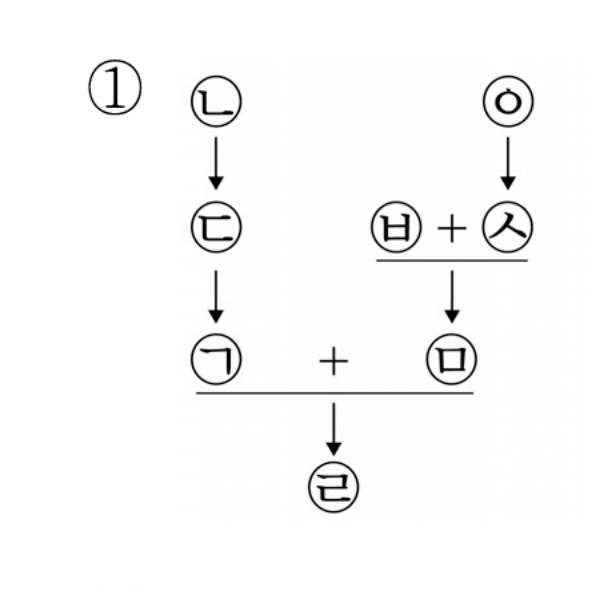
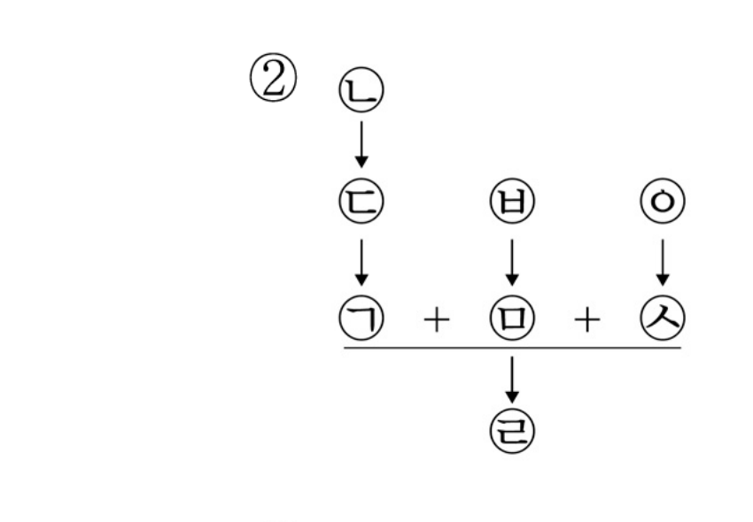
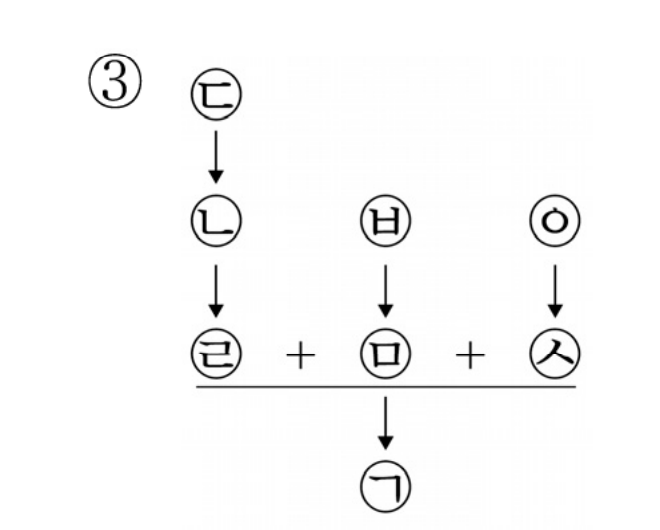
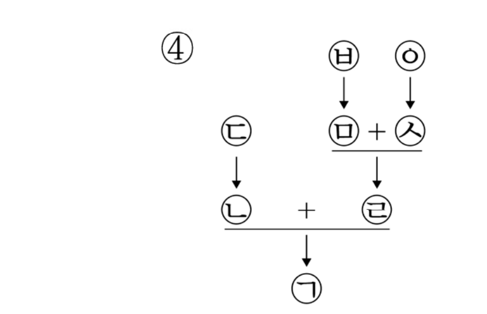
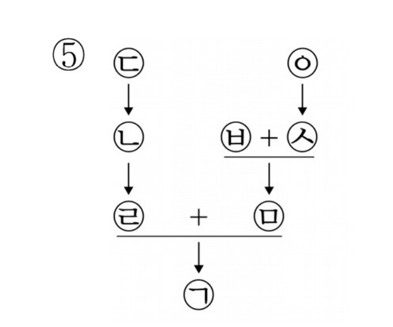
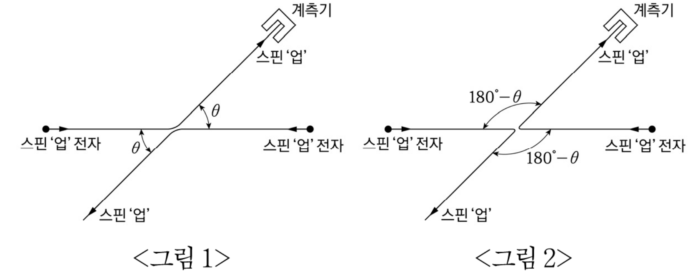

# 01 - RA (2024)

<견해>에 대한 평가로 옳은 것만을 <보기>에서 있는 대로 고른 것은?

## 제시문

<견해>

A : 불법행위는 본래 존재하던 정의로운 상태 또는 형평상태를 파괴하는 행위이다. 따라서 불법행위법은 불법행위로 인하여 파괴된 본래 상태를 회복하여 피해자를 구제하는 시스템이다. 불법행위법에서 회복을 지향하는 것은 정의 또는 윤리에 기초한 요청이고, 그것이 사회의 효용증진에 이바지하거나 기능적으로 유용하기 때문이 아니다. 나아가 가해자나 제3자(사회공동체 포함)가 아닌 피해자의 관점에서 불법행위 이전의 상태로 완전하게 회복되지 않는 한 진정한 피해자 구제는 실패한 것이다.

B : 불법행위는 사람이 고의나 과실로 저지르는 위법행위라는 점에 본질이 있다. 따라서 불법행위법은 불법행위로 말미암은 손해의 회복과 더불어 불법행위의 예방을 목표로 하여야 한다. 불법행위법은 사회 구성원들에게 행위지침을 제시하고 바람직한 행위로 나아갈 인센티브를 부여하여야 한다. 예방을 위한 메시지는 가해자에게만이 아니라, 가해자를 포함한 공동체 구성원 전원에게 발신되어야 한다. 어떠한 메시지를 전달할 것인가를 정할 때도 무엇이 공동체에 최고의 선인가를 진지하게 고려하여야 한다.

## 보기

ㄱ. 불법행위로 물건을 파손한 사안에서 수리비가 그 물건의 교환가치를 초과한 경우에도 수리비 전액을 피해자에게 배상하도록 X국 법원이 판결하였다면, A는 약화된다.

ㄴ. 회사의 영업비밀 자료를 경쟁사에 넘겨 이득을 취하였으나 회사에는 현실적 손해가 발생하지 않은 사안에서 그 이득을 손해로 보아 회사에 배상하도록 X국 법원이 판결하였다면, B는 강화된다.

ㄷ. 비하적 표현을 반복적으로 사용하여 명예를 훼손하였으나 피해자가 용서한 사안에서 그러한 비하적 표현을 용인하는 것이 사회의 자유로운 토론을 저해함을 이유로 제3자에게 배상하도록 X국 법원이 판결하였다면, A는 약화되고 B는 강화된다.

## 선택지

(1) ㄱ

(2) ㄷ

(3) ㄱ, ㄴ

(4) ㄴ, ㄷ

(5) ㄱ, ㄴ, ㄷ

# 02 - RA (2024)

<원칙>에 따라 [규정]을 <사례>에 적용한 것으로 옳은 것만을 <보기>에서 있는 대로 고른 것은?

## 제시문

<원칙>

법률을 사건에 적용할 때 <u>㉠ 법률 규정의 문언이 가지는 ‘통상적 의미’</u>에 따른다. ‘통상적 의미’는 ‘일상적 의미’로 해석하지만, 법학계에서 확립된 ‘전문적 의미’가 있어서 ‘일상적 의미’와 다르면 ‘전문적 의미’가 우선한다. 만약 단일한 해석이 불가능하면 <u>㉡ 문제된 조항과 관련된 조항 또는 관련된 다른 법률과의 연관관계</u>를 고려하여 해석하고, 그래도 단일한 해석이 불가능하면 <u>㉢ 입법목적 또는 유사사례와의 형평</u>을 고려하여 해석한다.

[규정]

제1조 공무원으로 정년까지 근무한 사람에게 정년퇴직수당을 지급한다.

제2조 ① 공무원으로 총 15년 이상 재직한 사람은 정년퇴직일의 1년 전까지 명예퇴직을 신청할 수 있다.

② 명예퇴직을 신청하는 사람에게 명예퇴직수당을 지급한다. 다만 <u>ⓐ 명예퇴직수당을 지급받은 사실이 있는 경우</u>에는 그러하지 아니하다.

<사례>

X국의 갑은 A직 공무원으로 17년 근무한 후 명예퇴직하여 명예퇴직수당을 지급받았다. 퇴직한 후 갑은 B직 공무원으로 재임용되었고 이전에 지급받은 명예퇴직수당 전액과 이자 상당액을 반환하였다. 갑은 B직 공무원으로 5년 근무한 후 정년퇴직일 2년 전에 명예퇴직을 신청하였다(갑은 총 22년의 재직기간을 인정받아 명예퇴직 신청자격은 충족됨).

## 보기

ㄱ. ⓐ가 수당으로 받은 금전적 이익을 실제로 향유하고 있는 경우만을 의미한다는 것이 법학계의 확립된 견해라면, ㉠만으로 갑에게 명예퇴직수당이 지급된다.

ㄴ. ⓐ가 수당으로 받은 금전적 이익을 실제로 향유하고 있는 경우만을 의미하는지, 혹은 수당으로 받은 금전적 이익을 실제로 누린 바 없어도 지급받은 사실이 있는 경우까지 의미하는지 논란이 있다면, ㉡에 따라 갑에게 명예퇴직수당이 지급된다.

ㄷ. ⓐ의 의미가 불명확하고 관련 법률·조항을 고려해도 단일한 해석을 할 수 없는 경우, [규정] 제2조 제2항 단서의 입법목적이 명예퇴직수당의 실질적인 중복 수혜를 막기 위한 것이라면, ㉢에 따라 갑에게 명예퇴직수당이 지급된다.

## 선택지

(1) ㄱ

(2) ㄴ

(3) ㄱ, ㄷ

(4) ㄴ, ㄷ

(5) ㄱ, ㄴ, ㄷ

# 03 - RA (2024)

다음으로부터 <사례>를 판단한 것으로 옳은 것만을 <보기>에서 있는 대로 고른 것은?

## 제시문

거래 당사자들은 특별한 경우에는 거래에 필요한 정보를 상대방에게 고지해야 한다.

객관적이고 평균적인 거래 당사자의 입장에서 보아 거래를 결정하는 데에 중요하지 않은 정보는 고지할 필요가 없다. 거래의 당사자 일방이 가지는 주관적 사정을 고려하면 중요한 정보이더라도 객관적이고 평균적인 거래 당사자에게 중요한 정보가 아니라면 고지할 필요가 없다. 거래의 당사자 일방이 상대방에게 의미가 있는 주관적인 사정을 인지하였더라도 마찬가지이다. 객관적이고 평균적인 거래 당사자의 입장에서 중요한 정보(이하 ‘객관적 정보’)인지는 세대별 시장 가격 차이를 가져오는 요인을 통해 판단한다. 객관적 정보는 정보 보유자가 목적한 바에 따라 비용을 들여 조사한 결과로 취득한 것인지 아니면 우연히 취득한 것인지에 따라 고지의무 유무가 달라진다. 전자의 경우 정보 보유자가 거래 상대방에게 정보를 고지할 필요가 없지만 거래의 일방 당사자가 정보 취득을 위해 탐지 비용을 들인 경우에도 취득한 정보를 통해 이미 비용 지출 목적을 달성하였다면 정보를 고지해야 한다. 후자의 경우 고지의무를 부담하나 정보 제공에 의해 거래 상대방이 거래 가격을 상승시킬 유인이 된다면 그 정보를 고지할 필요가 없다. 또한 시장 가격보다 낮은 금액으로 거래할 경우 객관적 정보이더라도 거래 상대방에게 고지할 필요는 없다.

<사례>

거래 대상인 A지역 B아파트의 세대별 평($3.3\,\mathrm{m}^2$)당 시장 가격은 아래 표와 같다.

|  | 강 조망 | 숲 조망 | 도시 조망 | 기타 조망 |
|---|---:|---:|---:|---:|
| 평당 가격(만 원) | 2,000 | 1,800 | 1,600 | 1,400 |

## 보기

ㄱ. 갑이 우연히 B아파트가 재건축되어 시장 가격이 상승될 것임을 알게 된 후 B아파트의 도시 조망 세대를 평당 1,600만 원에 매수하는 경우, 갑은 매도인에게 이 정보를 고지할 의무가 있다.

ㄴ. 매수인이 강을 보는 것을 두려워한다는 사실을 밝혔음에도 B아파트 강 조망 세대의 소유자 을이 매수인에게 강 조망이라는 사실을 알리지 않고 평당 1,600만 원에 매도하였다면, 을은 고지의무를 위반한 것이다.

ㄷ. B아파트 숲 조망 세대의 소유자 병이 시장 가격 하락 요인인 바닥의 누수 여부를 확인하기 위해 비용을 들여 조사한 결과 바닥에 누수가 발생하였음을 확인한 후 이 정보를 알리지 않고 평당 1,800만 원에 매도하였다면, 병은 고지의무를 위반한 것이다.

## 선택지

(1) ㄱ

(2) ㄷ

(3) ㄱ, ㄴ

(4) ㄴ, ㄷ

(5) ㄱ, ㄴ, ㄷ

# 04 - RA (2024)

[규정]의 적용으로 옳은 것만을 <보기>에서 있는 대로 고른 것은?

## 제시문

[규정]

제1조 용도지역 또는 용도지구(이하 ‘용도지역등’)에 있는 대지의 용적률(대지 면적에 대한 건물 각 층의 바닥 면적을 합한 전체 면적의 비율)과 건폐율(대지 면적에 대한 건물 바닥 면적의 비율)은 다음과 같다.

|  | 주거지역 | 상업지역 | 고도지구 | 경관지구 |
|---|---:|---:|---:|---:|
| 용적률($\%$) | 500 | 1,500 | 200 | 100 |
| 건폐율($\%$) | 70 | 90 | 60 | 50 |

제2조 하나의 대지가 둘 이상의 용도지역등에 걸치는 경우에 다음 각호를 제외하고는 그 대지 중 가장 넓은 면적이 속하는 용도지역등에 관한 규정을 적용한다.

1. 각 용도지역등에 걸치는 부분 중 가장 작은 부분의 규모가 $400\,\mathrm{m}^2$ 이하인 경우, 전체 대지의 용적률과 건폐율은 <계산식>에 따른 결과값(가중평균 용적률 또는 건폐율)을 적용한다. 다만 대지의 용도변경에 의해 각 용도지역등에 걸치는 부분 중 가장 작은 부분의 규모가 $400\,\mathrm{m}^2$ 이하가 된 경우에는 종전보다 용적률과 건폐율이 모두 증가하는 경우에 한하여 <계산식>에 따른 결과값을 적용한다.

2. 대지 위 건축물이 고도지구에 걸치는 경우, 그 대지의 전부에 대하여 고도지구의 대지에 관한 용적률과 건폐율을 적용한다. 다만 건축물이 경관지구에도 걸치는 경우에는 대지의 절반은 경관지구로 나머지 절반은 고도지구로 보고, 전체 대지의 용적률과 건폐율은 <계산식>에 따른 결과값을 적용한다.

<계산식>

○ 가중평균 용적률(건폐율) $=$ [각 용도지역등에 해당하는 토지 부분의 면적에 그 부분의 용적률(건폐율)을 곱한 값의 총합] $\div$ [전체 대지 면적]

## 보기

ㄱ. $1{,}000\,\mathrm{m}^2$의 대지가 상업지역 $600\,\mathrm{m}^2$와 주거지역 $400\,\mathrm{m}^2$로 걸치는 경우, 대지의 용적률은 $1{,}100\%$이고 건폐율은 $82\%$이다.

ㄴ. $1{,}000\,\mathrm{m}^2$의 대지가 상업지역 $550\,\mathrm{m}^2$와 주거지역 $450\,\mathrm{m}^2$로 걸치고 대지 위 건축물이 고도지구와 경관지구에 걸치는 경우, 대지의 용적률은 $150\%$이고 건폐율은 $55\%$이다.

ㄷ. $1{,}000\,\mathrm{m}^2$의 대지가 주거지역 $550\,\mathrm{m}^2$와 상업지역 $450\,\mathrm{m}^2$로 걸쳐 있었는데 관할관청의 용도변경으로 주거지역 $400\,\mathrm{m}^2$와 상업지역 $600\,\mathrm{m}^2$로 걸치게 되는 경우, 대지의 용적률은 $500\%$이고 건폐율은 $70\%$이다.

## 선택지

(1) ㄱ

(2) ㄷ

(3) ㄱ, ㄴ

(4) ㄴ, ㄷ

(5) ㄱ, ㄴ, ㄷ

# 05 - RA (2024)

다음으로부터 추론한 것으로 옳지 않은 것은?

## 제시문

계약은 당사자의 자율적 합의로 성립된다. 계약의 본질과 기능에 비추어 계약법은 당사자의 자율을 승인할 뿐만 아니라 이를 최대한 관철시키고 강화하는 규범체계라야 한다. 당사자의 자율은 어느 경우에 제한할 수 있는가? 이에 대해 세 가지 견해가 있다.

A : 자율은 그것이 가져오는 결과보다는 자율 그 자체에 가치가 있는 것이기에 보호되어야 한다. 당사자의 의사는 ‘원래’ 존중할 가치가 있기 때문에, 당사자 일방이 의도했던 의사가 다르게 표시되어 상대방이 그 표시대로 믿었더라도 표시보다는 당사자 일방이 의도한 의사를 존중해야 한다. 국가의 후견적 관여는 자율의 행사가 오히려 자율 그 자체를 본질적으로 침해하는 정도에 이르러야 비로소 정당화된다.

B : 자율 그 자체의 가치보다는 자율이 당사자에게 가져다주는 효용에 주목하여 자율을 보호해야 한다. 자율을 제한함으로써 당사자에게 발생하는 비용($-$)의 절댓값이 당사자에게 발생하는 효용($+$)의 절댓값보다 작으면, 자율에 대한 제한은 정당화된다. 자율을 제한하여 당사자 이외의 제3자(국가나 사회 포함)의 효용을 높일 수 있다는 것만으로는 자율에 대한 제한이 정당화되지 않는다.

C : 자율 그 자체의 가치보다는 자율이 사회 전체에 가져다주는 효용에 주목하여 자율을 보호해야 한다. 이러한 사고는 효용을 평가할 때 당사자가 아닌 사회 전체에 초점을 맞춘다. 다만 자율을 제한함으로써 당사자에게 발생하는 비용($-$)의 절댓값이 당사자에게 발생하는 효용($+$)의 절댓값보다 큰 경우에는 그 차액만큼 국가 등이 보상해주어야 자율을 제한할 수 있다. 보상된 만큼 당사자의 효용은 증가된 것으로 본다.

## 선택지

(1) A에 따르면, 당사자 일방이 자신이 의도했던 의사가 ㉮임에도 실수로 ㉯로 표시하여 상대방이 ㉯로 인식한 경우에도 당사자 일방의 의사를 ㉮로 본다.

(2) B에 따르면, 당사자의 자율을 정당하게 제한함으로써 발생하는 당사자의 비용($-$)과 효용($+$)의 합은 항상 양($+$)이다.

(3) C에 따르면, 당사자의 자율을 제한하는 경우에 당사자의 비용($-$)과 효용($+$)의 합이 음($-$)인 경우가 발생한다.

(4) A와 C 중 어느 것에 따르든, 당사자의 자율을 제한하여 발생하는 당사자의 비용($-$)과 효용($+$)의 합이 양($+$)이 되더라도 당사자의 자율을 제한할 수 없는 경우가 존재한다.

(5) X국 규제기본법이 “사회 전체에 창출되는 효용의 총합이 자율을 제한하여 발생하는 비용을 초과하는 경우에만 당사자의 자율을 제한한다.”라고 규정한다면, 이는 B보다는 C에 따라 입법된 것이다.

# 06 - RA (2024)

<견해>에 대한 평가로 옳은 것만을 <보기>에서 있는 대로 고른 것은?

## 제시문

X국에서 드론을 이용하여 고층 아파트 거실을 무단으로 촬영한 사건이 발생하였고, <u>㉠ 타인의 주거 내부를 외부에서 무단으로 촬영한 행위</u>를 [규정]에 따라 처벌할 수 있는지가 문제되고 있다.

[규정]

제1조(비밀탐지죄) 공개되지 아니한 타인의 주거나 건조물 내부를 <u>녹음 또는 청취 등의 방식</u>으로 탐지한 자는 5년 이하의 징역에 처한다.

제2조(불법수색죄) 타인의 주거나 건조물을 권한 없이 수색한 자는 3년 이하의 징역에 처한다.

<견해>

A : ㉠은 비밀탐지죄에 해당한다. ‘탐지’는 주거 내부의 정보를 알아내어 거주자가 누리는 사생활의 안전감을 침해하는 것이고, ‘녹음 또는 청취 등의 방식’은 반드시 음향적 또는 청각적 방식에 제한되지 않으므로 녹화 또는 조망의 방식을 포함한다.

B : ㉠은 불법수색죄에 해당한다. ‘수색’은 사람이나 물건을 발견하기 위하여 일정한 장소를 조사하는 것이다. 기존에 불법수색죄는 주거나 건조물에 적법하게 들어간 사람이 권한 없이 수색하는 경우를 처벌해왔지만, 불법수색죄의 문언 자체는 주거나 건조물에 들어간 경우만으로 제한하고 있지 않다. 따라서 불법수색죄는 위법하게 주거나 건조물에 들어가 권한 없이 수색한 사람도 처벌할 수 있고, 주거나 건조물 밖에서 그 내부를 권한 없이 수색한 사람도 처벌할 수 있다고 보아야 한다.

## 보기

ㄱ. 외부에서 창문을 통해 육안으로 타인의 주거를 들여다보는 것만으로는 비밀탐지죄의 ‘탐지’에 해당하지 않는다고 X국 법원이 판결하였다면, A는 약화된다.

ㄴ. 타인의 주거에 위법하게 들어가 정보를 획득하는 행위가 적법하게 들어가 정보를 획득하는 행위보다 더 위법하다는 것이 [규정] 제1조와 제2조의 형량을 다르게 정한 입법 취지라면, B는 강화된다.

ㄷ. 경찰이 수배자 갑을 찾기 위해 드론으로 영장 없이 을의 주거를 외부에서 촬영한 행위가 사생활의 안전감을 침해하지는 않았으나 위법한 ‘수색’에는 해당한다고 X국 법원이 판결하였다면, A는 약화되고 B는 강화된다.

## 선택지

(1) ㄱ

(2) ㄴ

(3) ㄱ, ㄷ

(4) ㄴ, ㄷ

(5) ㄱ, ㄴ, ㄷ

# 07 - RA (2024)

[규정]의 적용으로 옳은 것만을 <보기>에서 있는 대로 고른 것은?

## 제시문

[규정]

제1조 ① 도로관리청은 도로와 도로구역을 관리한다.

② ‘도로’란 차도, 보도를 말하며, 도로의 부속물(도로관리청이 도로의 이용과 관리를 위하여 설치하는 주차장, 버스정류시설, 휴게시설 등)을 포함한다.

③ ‘도로구역’이란 도로를 구성하는 일단의 토지를 말한다.

제2조 ① 도로관리청은 도로 노선의 지정 또는 폐지의 고시가 있으면 해당 도로구역을 지정 또는 폐지하여야 한다. 도로구역의 지정 또는 폐지의 효력은 고시함으로써 발생한다.

② 도로(도로구역 포함)로 지정된 국유지 또는 사유지를 점용하려는 자는 도로관리청의 허가를 받아야 하고, 매월 일정한 토지점용료(이하 ‘월 토지점용료’)를 납부하여야 한다.

제3조 ① 도로점용허가를 받지 아니하고 도로를 점용(이하 ‘무단점용’)한 경우 무단점용한 기간에 대하여 무단점용한 토지에 부과되어야 하는 월 토지점용료의 100분의 150에 상당하는 금액을 변상금으로 징수한다.

② 도로점용허가를 받은 자가 도로점용허가의 내용을 초과하여 도로를 점용(이하 ‘초과점용’)한 경우 초과점용한 기간에 대하여 초과점용한 토지에 부과되어야 하는 월 토지점용료의 100분의 120에 상당하는 금액을 변상금으로 징수한다. 다만 초과점용이 도로 점용자의 고의·과실로 인한 것이 아닌 경우에는 도로관리청은 초과점용 부분에 대한 토지점용료 상당액을 징수한다.

## 보기

ㄱ. 도로의 초과점용에 대하여 6,000만 원의 변상금 부과처분을 하였으나, 고의·과실 없이 초과점용한 것으로 밝혀져 변상금 부과처분이 취소된 경우, 도로관리청이 초과점용을 이유로 부과할 토지점용료 상당액은 5,000만 원이다.

ㄴ. 신도로 완공 후, 구도로 노선의 도로구역으로 지정되었던 토지에 도로관리청의 도로점용허가 없이 농지를 조성한 경우가 변상금 부과처분 대상이 아닌 것으로 확정되었다면, 구도로 노선의 도로구역 폐지의 고시가 있었을 것이다.

ㄷ. 도로인 X국유지(월 토지점용료 1,200만 원)를 도로점용허가 없이 1개월간 점용한 경우 부과처분될 변상금액은, X국유지에 대하여 도로점용허가를 받은 후 인근의 도로구역인 사유지(월 토지점용료 1,500만 원)를 고의로 1개월간 초과점용한 경우 부과처분될 변상금액과 같다.

## 선택지

(1) ㄱ

(2) ㄷ

(3) ㄱ, ㄴ

(4) ㄴ, ㄷ

(5) ㄱ, ㄴ, ㄷ

# 08 - RA (2024)

[선발 규칙]과 [조정 규칙]의 적용으로 옳은 것만을 <보기>에서 있는 대로 고른 것은?

## 제시문

P사는 신입사원을 선발할 때 [선발 규칙]의 세 가지 안 중 하나를 적용하여 1,600명을 우선 선발하였고, [조정 규칙]을 적용하여 추가 선발하였다.

[선발 규칙]

1안 : 공대 출신과 비공대 출신을 $3:1$로 선발한다.

2안 : 공대 출신과 비공대 출신을 $3:2$로 선발하고, 경력자와 비경력자도 $3:2$로 선발한다. 이때 비공대 출신 경력자와 비공대 출신 비경력자는 같은 수가 되도록 한다.

3안 : 공대 출신 경력자, 공대 출신 비경력자, 비공대 출신 경력자, 비공대 출신 비경력자를 $1:1:1:1$로 선발한다.

[조정 규칙]

1안 : 비공대 출신 선발자 수의 4분의 1에 해당하는 비공대 출신을 추가로 선발한다. 추가 선발자 중 경력자와 비경력자는 같은 수가 되도록 한다.

2안 : 선발된 경력자 수의 2분의 1에 해당하는 경력자를 추가로 선발한다. 추가 선발자 중 공대 출신과 비공대 출신은 같은 수가 되도록 한다.

## 보기

ㄱ. [선발 규칙] 1안에 따른 결과를 [조정 규칙] 1안에 따라 조정하였다면, 최종 선발자 중 경력자의 수는 1,650명을 넘을 수 없다.

ㄴ. [선발 규칙] 2안에 따른 결과를 [조정 규칙] 2안에 따라 조정하였다면, 최종 선발자 중 공대 출신의 수는 비공대 출신의 수의 1.5배를 초과한다.

ㄷ. [선발 규칙] 3안에 따른 결과를 [조정 규칙] 1안에 따라 조정하고 그 결과를 [조정 규칙] 2안에 따라 조정하였든, [선발 규칙] 3안에 따른 결과를 [조정 규칙] 2안에 따라 조정하고 그 결과를 [조정 규칙] 1안에 따라 조정하였든, 최종 선발된 공대 출신 비경력자의 수는 같다.

## 선택지

(1) ㄱ

(2) ㄴ

(3) ㄱ, ㄷ

(4) ㄴ, ㄷ

(5) ㄱ, ㄴ, ㄷ

# 09 - RA (2024)

[규정]과 <약관>으로부터 추론한 것으로 옳은 것만을 <보기>에서 있는 대로 고른 것은?

## 제시문

렌터카 사업을 하는 P사는 포인트 적립 계약과 관련한 <약관>을 두고 있었는데, <약관>의 일부 조항을 개정하여 즉시 시행한다고 공지하자 기존 가입자 중 일부가 개정된 조항이 [규정]에 위반되는 불공정약관조항이라고 주장하고 있다.

[규정]

제1조 ‘불공정약관조항’이란 사업자에게만 이익이 되고 고객에게 일방적으로 불리한 내용을 정하고 있는 약관조항을 말한다.

제2조 위원회는 사업자가 제1조를 위반한 경우 사업자에게 해당 불공정약관조항의 삭제·수정 등 시정에 필요한 조치를 권고할 수 있다.

<약관>

1. 소비자는 렌터카를 이용하여 1년간 주행할 것으로 예상되는 거리에 따라 A, B 플랜 중 하나만 선택하여 가입할 수 있다.

2. 각 플랜의 계약기간은 1년으로 하고, 적립포인트의 유효기간은 각 플랜의 계약기간이 종료된 날로부터 2년으로 한다.

3. 포인트는 다음 표에 따라 적립된다. A 플랜에서는 기준거리를 초과한 경우에만 전체 주행거리에 대해서 포인트가 적립된다.

<table>
<tr><th rowspan="2">플랜</th><th rowspan="2">기준거리</th><th colspan="2">적립포인트($\mathrm{km}$당)</th></tr>
<tr><th>개정 전</th><th>개정 후</th></tr>
<tr><td>A</td><td>$1{,}000\,\mathrm{km}$</td><td>1.5</td><td>2.0</td></tr>
<tr><td>B</td><td>없음</td><td>1.0</td><td>0.5</td></tr>
</table>

## 보기

ㄱ. <약관> 개정 후 A 플랜 계약자는 <약관> 개정 전과 동일한 포인트를 적립하기 위하여 $25\%$ 더 적은 거리를 주행하여도 충분하나, B 플랜 계약자는 $100\%$ 더 많은 거리를 주행하여야 한다.

ㄴ. 위원회가 개정된 <약관>의 ‘개정 후’ 부분에 대해서 [규정] 제2조에 따라 시정조치를 권고하는 경우, 기존 가입자에게 개정된 <약관>을 잔여 계약기간에 적용할지를 선택할 수 있도록 함으로써 기존 가입자의 그 기간에 대한 불공정성을 완화할 수 있다.

ㄷ. 위원회의 시정조치 권고에 따라, 개정 후 <약관>의 B 플랜을 선택하는 계약자에게 $1{,}000\,\mathrm{km}$를 초과한 부분에 대해서는 1.5 포인트를 적립해주기로 한다면, $2{,}000\,\mathrm{km}$를 초과하여 운행해야만 개정 전 <약관>에 따라 B 플랜을 선택한 경우보다 더 많은 포인트가 적립된다.

## 선택지

(1) ㄱ

(2) ㄴ

(3) ㄱ, ㄷ

(4) ㄴ, ㄷ

(5) ㄱ, ㄴ, ㄷ

# 10 - RA (2024)

<이론>에 따라 [규정]을 <사례>에 적용한 것으로 옳은 것만을 <보기>에서 있는 대로 고른 것은?

## 제시문

상표는 그것이 등록된 나라에서 상표권으로 보호된다. 그런데 상표가 등록되지 않은 나라에서 상표를 무단 복제하여 상품을 생산하거나 판매하는 경우에 대하여 그 나라의 법원이 재판권을 행사할 수 있는지가 문제된다. 이에 관한 X국의 [규정]은 <이론>에 따라 해석한다.

[규정]

제○조 X국 법원은 X국에서 상표권이 침해되는 경우 그로 인한 손해배상청구 사건에 대하여 재판권을 행사할 수 있다. 다만 이 경우 X국에서 상표권자가 입은 손해액을 한도로 재판권을 행사한다.

<이론>

A : 상표권은 오직 상표가 등록된 나라에서만 침해될 수 있다. 상표가 등록되지 않은 나라에서 상표를 무단 복제하여 상품을 생산하거나 판매하더라도 상표권 침해는 그 나라가 아니라 그 시점에 상표가 등록되어 있는 나라에서 발생한 것으로 보아야 한다.

B : 상표권은 상표가 등록되지 않은 나라에서도 침해될 수 있다. 상표가 등록되지 않은 나라에서 상표를 무단 복제하여 상품을 생산하거나 판매하면 상표권 침해는 그 나라에서 발생한 것으로 보아야 한다.

<사례>

갑은 P상표를 W국에는 등록하였으나 X국, Y국에는 등록하지 않았다. 을은 X국 공장에서 P상표를 무단 복제하여 부착한 Q상품을 생산하여 W국, X국, Y국에서 판매하였다. 을이 Q상품을 각국에서 판매하여 얻은 이익만큼 갑은 각국에서 손해를 입었다. 갑은 을을 상대로 X국 법원에 을의 P상표 침해에 대한 손해배상청구 소송을 제기하였다. X국 법원은 이 사건에 대하여 재판권을 행사할 수 있는지를 [규정]에 따라 판단하고자 한다.

## 보기

ㄱ. A에 따르면 을이 Q상품을 W국에서 판매하여 갑이 입은 손해에 대하여 X국 법원은 재판권을 행사할 수 있다.

ㄴ. B에 따르면 을이 Q상품을 X국에서 판매하여 갑이 입은 손해에 대하여 X국 법원은 재판권을 행사할 수 있다.

ㄷ. A와 B 중 어느 것에 따르든 을이 Q상품을 Y국에서 판매하여 갑이 입은 손해에 대하여 X국 법원은 재판권을 행사할 수 없다.

## 선택지

(1) ㄱ

(2) ㄴ

(3) ㄱ, ㄷ

(4) ㄴ, ㄷ

(5) ㄱ, ㄴ, ㄷ

# 11 - RA (2024)

[규정]을 <사례>에 적용한 것으로 옳은 것만을 <보기>에서 있는 대로 고른 것은?

## 제시문

W국은 X주, Y주 등으로 구성된 연방국가이다. [규정]은 W국의 모든 주에 적용된다.

[규정]

제1조 당사자들 사이에 형성된 일정한 법률관계로 말미암아 분쟁이 발생하면 당사자들은 그 법률관계와 관련이 있는 주 법원에 그 분쟁에 관한 소송을 제기한다. 하나의 분쟁에 관한 소송은 하나의 주 법원에서만 소송절차를 개시할 수 있고, 같은 분쟁에 관하여 나중에 소송이 제기된 주 법원은 소송절차를 개시할 수 없다.

제2조 당사자들은 그들 사이에 형성된 일정한 법률관계로 말미암아 분쟁이 발생하면 그 분쟁에 관한 소송을 특정한 주 법원에만 제기하기로 하는 합의(이하 ‘전속관할합의’)를 할 수 있다. 전속관할합의의 대상인 법률관계로 말미암은 소송이 당사자들이 합의하지 않은 주 법원에 제기되면 그 주 법원은 소송절차를 개시할 수 없다.

제3조 당사자들이 전속관할합의를 한 법원이 그 합의의 대상인 법률관계와 아무런 관련이 없는 경우 그 합의는 처음부터 무효인 것으로 본다. 그 법원이 있는 주에 당사자들의 영업소 소재지 또는 의무 이행지가 없다면 그 법원은 전속관할합의의 대상인 법률관계와 아무런 관련이 없는 것으로 본다. 이는 어느 주 법원에 소송이 제기되어 해당 전속관할합의의 유효 여부가 문제되는 시점을 기준으로 판단한다. 전속관할합의가 무효라면 당사자들이 합의한 주 법원은 소송절차를 개시할 수 없고, 그 법원에 처음부터 소송이 제기되지 않은 것으로 본다.

제4조 제3조는 2023. 1. 1.부터 시행한다. 제3조 시행 당시 어느 주 법원에서든 소송절차가 이미 개시된 분쟁에는 제3조를 적용하지 않는다.

<사례>

갑과 을의 영업소는 X주에만 있다. 2022. 10. 1. 갑과 을은 물품매매계약을 체결하면서, 갑의 물품인도의무와 을의 대금지급의무는 추후 갑의 영업소에서 동시에 이행하기로 하고, 그 계약으로 말미암은 소송은 Y주 법원에만 제기하기로 합의하였다. 이후 갑과 을 사이에 위 계약으로 말미암은 분쟁 P가 발생하였다.

## 보기

ㄱ. 2022. 12. 1. 갑이 을을 상대로 X주 법원에 P에 관한 소송을 제기하였다면, X주 법원은 소송절차를 개시할 수 없다.

ㄴ. 2022. 12. 1. 갑이 을을 상대로 Y주 법원에 P에 관한 소송을 제기하였고 2023. 1. 1. 을이 갑을 상대로 X주 법원에 P에 관한 소송을 제기하였다면, X주 법원은 소송절차를 개시할 수 없다.

ㄷ. 2023. 2. 1. 갑이 을을 상대로 Y주 법원에 P에 관한 소송을 제기하였고 2023. 3. 1. 을이 갑을 상대로 X주 법원에 P에 관한 소송을 제기하였다면, X주 법원은 소송절차를 개시할 수 없다.

## 선택지

(1) ㄴ

(2) ㄷ

(3) ㄱ, ㄴ

(4) ㄱ, ㄷ

(5) ㄱ, ㄴ, ㄷ

# 12 - RA (2024)

[규칙]을 <사례>에 적용한 것으로 옳은 것만을 <보기>에서 있는 대로 고른 것은?

## 제시문

과거 P집안은 같은 성(姓)을 사용하되 그 집안 소속 남성들의 이름을 [규칙]에 따라 지었다.

[규칙]

1. 같은 항렬에 있는 세대는 오행(五行), 즉 목(木), 화(火), 토(土), 금(金), 수(水) 중 하나를 부수(部首)로 하는 같은 한자를 사용하여 이름을 짓는다. 그 한자를 ‘돌림자’라고 한다. 돌림자의 부수는 목, 화, 토, 금, 수를 순서대로 반복하여 사용한다.

2. 이름을 두 글자로 짓는 경우 돌림자는 이름의 첫째 글자로든 둘째 글자로든 사용할 수 있으나, 같은 세대이면 한쪽으로 일치시킨다. 그리고 돌림자 아닌 글자로는 형제간이라면 같은 부수가 왼쪽에 붙은 한자를 사용한다. 그 부수를 ‘돌림변’이라고 하는데, 사촌간이라면 다른 돌림변을 사용한다.

3. 이름을 한 글자로 짓는 경우 같은 항렬에 있는 세대는 돌림자 대신에 돌림변을 사용한다. 그 세대에서 이름을 두 글자로 지었더라면 사용하였을 돌림자의 부수는 바로 다음 세대에서 사용한다.

<사례>

갑, 을, 병, 정, 무는 P집안 소속의 남성이다. 갑의 이름은 ‘일곤(一坤)’이다. 을과 병은 갑의 아들이다.

(상황 1) 정과 무는 을의 아들이다.

(상황 2) 정은 을의 아들이고 무는 병의 아들이다.

## 보기

ㄱ. 을과 병의 이름은 ‘인(仁)’과 ‘신(信)’일 수 없다.

ㄴ. (상황 1)이면 정과 무의 이름은 ‘종인(鍾仁)’과 ‘종근(鍾根)’일 수 없다.

ㄷ. (상황 2)이면 정과 무의 이름은 ‘근(根)’과 ‘식(植)’일 수 없다.

## 선택지

(1) ㄱ

(2) ㄴ

(3) ㄱ, ㄷ

(4) ㄴ, ㄷ

(5) ㄱ, ㄴ, ㄷ

# 13 - RA (2024)

<견해>에 대한 분석으로 옳은 것만을 <보기>에서 있는 대로 고른 것은?

## 제시문

우리의 직관에 따르면 살인은 도덕적으로 정당화되지 못하며 살인자에게 도덕적 책임이 있다. 아래 두 상황을 살펴보자.

(상황 1) 은행강도를 계획한 마피아 조직의 책임자 갑이 조직원 을에게 은행 보안담당자를 죽이라고 지시하였다. 을은 갑의 지시에 따라 보안담당자를 저격하여 살해하였다.

(상황 2) 적과 치열한 교전 중 지휘관 병이 부하 정에게 적의 저격수를 사살하라고 지시하였다. 정은 병의 지시에 따라 적의 저격수를 사살하였다.

위 두 상황에서 을과 정의 행위에 대해 도덕적 책임을 평가하는 원리와 관련하여 아래와 같은 두 견해가 있다.

<견해>

A : (상황 1)과 (상황 2)는 살인 행위가 발생하였다는 점에서 차이가 없다. 따라서 (상황 1)과 (상황 2)에서 살인에 대한 도덕적 책임을 평가하는 원리가 달라야 할 이유는 없다. 도덕적 책임을 평가하는 원리 $P$를 “자기방어가 아닌 어떠한 살인도, 살인 명령도, 살인 명령의 수행도 해서는 안 되며 이를 위반한 행위에 대해 도덕적 책임이 있다.”라고 하자. (상황 1)의 을과 (상황 2)의 정의 살인에 대해 도덕적 책임을 평가할 때 $P$를 똑같이 적용할 수 있어야 한다.

B : 전쟁에서의 폭력과 일상생활에서의 폭력은 분명히 다르므로, 일상생활에서 살인에 대한 도덕적 책임을 평가하는 원리와는 다른 특수한 도덕적 원리가 전쟁에서 요구된다. 따라서 (상황 1)의 을과 (상황 2)의 정의 행위에 대한 도덕적 책임을 평가하기 위해서는 적어도 두 가지 원리가 필요하다. 전쟁에서의 살인에 대한 도덕적 책임을 적절히 평가하기 위해서는 일상생활에서 적용되는 도덕적 원리가 아닌 다른 도덕적 원리를 적용할 수 있어야 한다.

## 보기

ㄱ. $P$에 의해 을에게 도덕적 책임이 있지만 정에게 도덕적 책임이 없다는 결론이 도출된다면, A는 약화된다.

ㄴ. A에 따라 (상황 2)에서 $P$에 의해 정에게 살인에 대한 도덕적 책임이 있다고 주장하기 위해서는 정의 행위가 자기방어에 해당하지 않는 것임을 입증해야 한다.

ㄷ. B에 따르면 을과 정 모두에게 도덕적 책임이 있다는 결론은 도출될 수 없다.

## 선택지

(1) ㄴ

(2) ㄷ

(3) ㄱ, ㄴ

(4) ㄱ, ㄷ

(5) ㄱ, ㄴ, ㄷ

# 14 - RA (2024)

㉠에 대한 평가로 옳은 것은?

## 제시문

여론 형성 과정에서 진실보다 개인적인 신념이나 감정이 더 큰 영향력을 발휘하는 현상이 만연하고 있다. 개인적인 감정에 기초하여 작성된 누리소통망 글이 사실과 다름에도 사회적으로 큰 영향력을 끼치는 현상이 한 가지 예이다. 이러한 현상은 여러 유형으로 나타나는데, 그중 하나는 정보의 진위를 확인할 수 있음에도 확인하지 않고 진실인 것처럼 주장하는 경우이다. 우리는 그러한 경우 화자에게 책임이 귀속된다고 단순하게 생각하기 쉽다. 하지만 A에 따르면 <u>㉠ 그러한 경우라 하더라도 언제나 화자에게 책임이 귀속되는 것은 아니다.</u> 가령 정상적인 관찰 조건에서 갑이 높은 빌딩 옥상에서 내려다 보니 빌딩 옆 광장에 사람들이 많이 모여 있는 듯 보였다고 하자. 그래서 갑은 “광장에 사람들이 많이 모여 있다.”라고 주장한다. 그런데 실은 광장에 있는 것은 사람이 아니라 행사를 위해 설치한 사람 모양의 인형들이었다. 갑에게 자신의 관찰은 분명한 것으로 느껴졌기에, 갑은 1층으로 내려가 정확한 정보를 확인하는 간단한 조치도 하지 않았다. 갑 스스로 증거가 미심쩍다고 여겼거나 타인으로부터 확인을 요구받았더라면 갑은 확인했을 것이지만, 굳이 그럴 필요를 느끼지 않았을 만큼 자신의 경험을 확신했던 것이다. A에 따르면 이 경우 갑의 주장이 진실이 아니더라도 갑에게 책임을 귀속시키기 어렵다. A는 어떤 행위가 그 자체로 비난의 대상이 되는 오직 그 경우에만 그 행위자에게 책임이 귀속된다는 전제를 받아들인다. A에 따르면 위 예에서 “광장에 사람들이 많이 모여 있다.”라는 갑의 주장 행위는 그 자체로는 비난의 대상이 아니다. 갑의 주장 행위는 인지적 착각에 불과하기 때문이다. 따라서 갑에게는 책임이 귀속되지 않는다. A는 진실이 아닌 것을 진실이라고 믿거나 주장하는 행위에서 중요한 부분은 위의 예와 같은 허용 가능한 수준의 태만이나 인지적 실수가 아니라, 의도적으로 정보의 습득을 회피하거나 거부하는 적극적인 회피 태도라고 말한다. 그러한 태도를 지닌 주체에게 책임이 귀속됨은 물론이다. 아주 간단한 확인 절차만으로 무엇이 진실인지를 알 수 있음에도 확인을 의도적으로 거부하면서 가짜 뉴스를 신봉하여 전파하는 사람에게 책임이 귀속되는 것은 자명하다.

## 선택지

(1) 그 자체로 비난의 대상이 아닌 행위는 어떤 것도 인지적 착각이 아니라면, ㉠은 약화된다.

(2) 가짜 뉴스를 신봉하여 전파하는 사람에게 언제나 책임이 귀속되는 것은 아니라면, ㉠은 약화된다.

(3) 그 자체로 비난의 대상이 아닌 행위의 행위자에게 책임이 귀속되지 않는 경우가 있다면, ㉠은 약화된다.

(4) 정상적인 관찰 조건에서의 거짓 주장은 언제나 적극적인 회피 태도에서 비롯한 것이라면, ㉠은 강화된다.

(5) 진실 여부를 확인하는 것이 불가능한 상황에서는 인지적 착각에 불과한 행위가 일어날 수 없다면, ㉠은 강화된다.

# 15 - RA (2024)

<견해>에 대한 평가로 옳은 것만을 <보기>에서 있는 대로 고른 것은?

## 제시문

A, B, C 세계가 있다고 하자.

A : 1억 명이 산다. 이들 모두는 각자 100단위의 높은 복지를 누린다.

B : 100억 명이 낮은 수준이지만 살 만한 가치가 있는 각자 5단위의 복지를 누리며 살고 있었는데, A에 살고 있던 1억 명이 이주해 왔다. A에서 이주한 1억 명은 각자 105단위의 복지를 누린다. B에 본래 살고 있던 100억 명은 각자 5단위의 복지를 그대로 누린다.

C : 아무도 살지 않던 C로 B에 살고 있던 101억 명이 모두 이주하였다. C에 사는 101억 명 모두 각자 10단위의 복지를 누린다.

<견해>

갑 : A에 살다가 B로 이주한 사람들은 A에 살았을 때보다 복지 수준이 높아졌다. 또한 B에 사는 나머지 사람들은 살 만한 가치가 있는 각자 5단위의 복지 수준을 그대로 누리고 있다. 따라서 B가 A보다 좋다.

을 : C에는 완전한 평등이 있고, C가 B보다 복지 평균도 높다. 따라서 C가 B보다 좋다.

병 : 복지 총합은 C가 A보다 크지만, 복지 평균은 A가 C보다 높다. 따라서 A가 C보다 좋다.

## 보기

ㄱ. 불평등이 더 적은 세계가 더 좋은 세계라면, 갑의 결론은 부정되고 을의 결론은 부정되지 않는다.

ㄴ. 을이 C가 B보다 좋다고 주장하는 이유를 적용한다면, 을은 병의 결론에는 동의하고 갑의 결론에는 동의하지 않을 것이다.

ㄷ. 복지 평균이 더 높은 세계가 더 좋은 세계라면 갑의 결론은 부정되며, 복지 총합이 더 큰 세계가 더 좋은 세계라면 을의 결론은 부정되지 않고 병의 결론은 부정된다.

## 선택지

(1) ㄱ

(2) ㄷ

(3) ㄱ, ㄴ

(4) ㄴ, ㄷ

(5) ㄱ, ㄴ, ㄷ

# 16 - RA (2024)

<사례 1>, <사례 2>에 대한 판단으로 옳은 것만을 <보기>에서 있는 대로 고른 것은?

## 제시문

선택이 제한적인 상황에서 취해야 하는 행위를 어떻게 평가해야 할까? 주어진 상황에서 사회 공리를 극대화하는 행위는 ‘허용가능하다’고 하고, 그렇지 않은 행위는 ‘허용불가능하다’고 하자. 어떤 행위가 ‘칭찬할 만하다’는 것은 그 행위를 해야 할 충분히 좋은 이유가 존재하고 그것을 함으로써 자기희생도 따른다는 것을 의미한다. 자신이 피해를 겪음에도 불구하고 사회 공리를 높이는 행위를 했다면, 이는 칭찬할 만하다. 반대로 어떤 행위가 ‘비난할 만하다’는 것은 그 행위를 할 충분히 좋은 이유가 없거나 그 행위가 나쁜 이유에 기초한 행위라는 것을 의미한다. 우리는 어떤 행위를 ‘부분적으로’, 즉 대안과 상관없이 그 행위 자체가 칭찬할 만한지 혹은 비난할 만한지 평가할 수 있다. 또한 행위에 대해 ‘전체적으로’ 평가하는 것도 가능하다. 칭찬할 만한 어떤 행위가 다른 모든 대안보다 사회 공리를 더 높인다면, 이 행위는 전체적으로 칭찬할 만하다. 반면에 어떤 비난할 만한 행위가 다른 모든 대안과 비교할 때 사회 공리를 최소화한다면, 이 행위는 전체적으로 비난할 만하다.

<사례 1>

어린이 2명의 생명이 위험한 상황이며, 당신에겐 오직 3개의 선택지가 있다. 첫째, 당신은 어떠한 손해도 보지 않고 1명을 구한다. 둘째, 당신은 어떠한 손해도 보지 않고 2명을 구한다. 셋째, 당신은 그냥 지나치고 2명은 죽게 된다.

<사례 2>

빨강 버튼과 녹색 버튼이 있다. 어떤 버튼이든 누르고 나면 당신은 손가락을 잃고, 누르지 않으면 당신에게 아무 일도 일어나지 않는다. 오직 3개의 선택지가 있다. 첫째, 당신은 아무것도 하지 않고, 결국 10명이 죽는다. 둘째, 빨강 버튼을 눌러 10명의 목숨을 구하지만 그중 1명은 손가락을 잃는다. 셋째, 녹색 버튼을 눌러 10명의 목숨을 구하고 그중 1명이 손가락을 잃는 것도 막는다.

## 보기

ㄱ. <사례 1>에서 그냥 지나치는 행위는 허용불가능하면서 전체적으로 비난할 만하다.

ㄴ. <사례 2>에서 빨강 버튼을 누르는 행위는 허용불가능하지만 부분적으로 칭찬할 만하다.

ㄷ. <사례 1>과 <사례 2> 각각에서, 허용가능하며 전체적으로 칭찬할 만한 행위의 선택지가 있다.

## 선택지

(1) ㄱ

(2) ㄷ

(3) ㄱ, ㄴ

(4) ㄴ, ㄷ

(5) ㄱ, ㄴ, ㄷ

# 17 - RA (2024)

다음 글에 대한 분석으로 적절한 것만을 <보기>에서 있는 대로 고른 것은?

## 제시문

선(善), 즉 좋음에는 두 가지 차원이 있다. <u>㉠ 일차적 선은 한 존재가 지니는 본질적 완전성을 의미한다.</u> 모든 존재자는 이것을 결여하면 더 이상 그 존재가 아니라는 점에서 이는 본질적인 선이다. 이러한 선은 적극적 의미에서 결여의 부정을 뜻한다. 인간에게 인간성이 없으면 더 이상 인간이 아니다. 인간이 인간으로 존재하는 한, 설사 개인 간의 신체 능력이나 덕성의 차이가 아무리 크다고 한들 그것 때문에 누가 더 인간이라는 진술은 성립하지 않는다. 이차적 선은 인간이라는 존재에 ‘직립 보행’이라는 우연적인 성질이 속하는 것처럼 어떤 주체와 이에 속하는 부수적 성질 사이의 관계를 의미한다. 이러한 선은 ‘존재성을 형성하는 선’이 아니라 ‘존재성에 수반되는 선’이다. 이차적 선은 다시 둘로 나뉜다. <u>㉡ 첫 번째 이차적 선은, 어떤 성질이 그 자체로 그것이 속하는 존재의 완전성에 기여하는 적합성을 가리킨다.</u> 건강은 인간에게 일차적 선이 아니라 이차적 선이다. 아픈 인간도 여전히 인간이기 때문이다. 그리고 건강이 인간에게 좋다면, 건강은 그 자체로 인간에게 좋은 성질이다. <u>㉢ 두 번째 이차적 선은, 어떤 성질이 어떤 존재에 속했을 때 그 존재에게서 발견되는 선함을 가리킨다.</u> 이러한 의미의 선은 세부 성질 자체가 아닌, 한 존재가 가지는 좋음이다. 어떤 음식이 맛있다고 한다면, 염도, 산도, 식감 등이 잘 어울릴 때 그 음식이 맛있는 것이다. 여러 요소 중 하나만 떼어 맛있다고 하기는 어렵다.

## 보기

ㄱ. 악이 선의 결여라면, 악은 ㉠이다.

ㄴ. “어떤 대상이 아름답다면, 아름다움은 그 대상이 가지는 크기, 형태, 색채 등의 조화로운 총체이다.”라는 말에서 아름다움은 ㉢이다.

ㄷ. 어떤 것이 누구에게 언제나 좋으면 ㉠이고, 그렇지 않으면 ㉡ 또는 ㉢이다.

## 선택지

(1) ㄱ

(2) ㄴ

(3) ㄱ, ㄷ

(4) ㄴ, ㄷ

(5) ㄱ, ㄴ, ㄷ

# 18 - RA (2024)

다음 논쟁에 대한 분석으로 옳은 것만을 <보기>에서 있는 대로 고른 것은?

## 제시문

갑1 : 종이에 쓰인 ‘개’라는 기호는 개에 관한 것이야. 마찬가지로 우리 머릿속의 개-생각 또한 개에 관한 것이지. 그런데 ‘개’라는 임의의 기호가 왜 개에 관한 것인지를 설명할 때와 마찬가지로, 개-생각이 어떻게 개에 관한 것인지를 설명하기도 까다로운 것 같아.

을1 : 그건 간단히 설명할 수 있어. 만약 대상 $X$가 어떤 생각을 인과적으로 야기하고, 그리고 $X$가 있을 때만 그 생각이 인과적으로 야기된다면, 그 생각은 $X$에 관한 것이지. 승강기 지시등을 생각해봐. 7층 지시등은 승강기가 7층에 도달하면 그리고 오직 그 경우에만 켜지잖아. 7층 지시등이 7층에 관한 것임과 똑같은 방식으로 개-생각은 개에 관한 것이야.

갑2 : 너의 견해는 만족스럽지 않아. 예를 들어 병이 개를 본다고 해봐. 개에서 병의 개-생각까지 이어지는 인과적 경로는 매우 길어. 빛이 개의 털에 반사되어 병의 망막으로 들어오지. 망막은 특정한 양식으로 활성화되고 그 정보는 시신경을 통해 뇌에 전달돼. 마지막으로 개-생각이 병의 뇌 깊은 데서 형성되지. <u>㉠ 병의 망막 위의 활성화 양식</u>을 ‘d-양식’이라 하자. 그렇다면 개가 아닌 d-양식이라는 대상에 의해, 그리고 오직 그 대상이 있을 때만 병의 개-생각이 인과적으로 야기된다고 말할 수 있지.

을2 : 하지만 그 d-양식을 인과적으로 야기한 대상의 인과관계를 계속 거슬러 올라가면 마지막에는 항상 개가 있지. 그러므로 병의 개-생각은 여전히 개에 관한 것임에 변함이 없어.

갑3 : 그러면 병이 안개 낀 저녁에 양을 개로 오인하고 “저 안개 너머에 개가 있다.”라고 생각했다고 해볼까? 지금 병의 개-생각은 양에 의해서 야기되었어. 반면 정상적인 상황에서는 양이 아닌 개가 병의 개-생각을 야기하겠지. 개-생각은 양에 의해 야기되기도 하고 개에 의해 야기되기도 해. 그렇다면 개-생각은 개 또는 양에 의해 야기된다고 해야 해. 그러므로 너의 견해가 옳다면 병의 개-생각은 개가 아닌 개-또는-양이라는 대상에 관한 것이라는 결론에 도달해.

## 보기

ㄱ. ㉠까지 이어지는 인과적 경로의 출발점이 개 전체가 아니라 개의 일부라고 가정하더라도 갑2의 결론은 똑같이 도출된다.

ㄴ. 을2는 대상 $a$, $b$, $c$에 대해서 만약 $a$가 $b$를 인과적으로 야기하고 $b$가 $c$를 인과적으로 야기한다면 $a$는 $c$를 인과적으로 야기한다는 원리를 전제한다.

ㄷ. 갑2와 갑3에 제시된 논증은, 만약 을1의 견해를 수용한다면 병의 개-생각이 개가 아닌 다른 무언가에 관한 것일 수 있다는 것이다.

## 선택지

(1) ㄱ

(2) ㄷ

(3) ㄱ, ㄴ

(4) ㄴ, ㄷ

(5) ㄱ, ㄴ, ㄷ

# 19 - RA (2024)

다음 논쟁에 대한 분석으로 옳은 것만을 <보기>에서 있는 대로 고른 것은?

## 제시문

갑 : 모든 명제는 수학, 윤리 등 어느 하나의 논의 주제에만 관한 것이며 어떤 논의 주제에 관한 것도 아닌 명제는 없다. 또한 명제는 그 명제의 논의 주제에 상대적으로만 참이거나 거짓이다. 그래서 “명제 $p$는 참이다.”, “명제 $q$는 거짓이다.”와 같이 말하는 것은 적절하지 않으며, “명제 $p$는 수학적-참이다.”, “명제 $q$는 윤리적-거짓이다.” 등과 같이 말해야 옳다. 명제는 그 명제의 논의 주제가 아닌 다른 주제에 관해서는 참이 아니다. 즉 윤리에 관한 명제 $p$는 수학적-참이 아니다. 그런데 ‘이가 원리’에 의하면 모든 명제는 참이거나 거짓이거나 둘 중 하나이다. 다시 말해, 어떤 명제가 참이 아니라면 그 명제는 거짓이고, 그 명제가 거짓이 아니라면 그 명제는 참이다. 나의 견해는 얼핏 이가 원리와 충돌하는 것처럼 보인다. 하나의 명제가 수학적-참이면서 윤리적-참은 아닐 수 있기 때문이다. 그러나 어떤 명제가 수학적-참이면서 수학적-참이 아니라고 말하는 것이 모순이지, 수학적-참이면서 윤리적-참이 아니라고 말하는 것은 모순이 아니다.

을 : 그렇지 않다. 너의 견해와 이가 원리를 모두 받아들이면 모순이 발생한다. “살인은 나쁘다.”라는 명제를 $r$라고 하자. $r$는 윤리에 관한 명제이므로 수학적-참이 아니다. 그런데 너의 견해에 따르면 모든 참 거짓은 논의 주제에 상대적이므로, $r$가 수학적-참이 아니라는 명제 또한 어떤 특정한 논의 주제에 상대적으로 참이다. 살인에 대한 가치 평가의 참 거짓 문제가 수학적 주제에 관한 것이 아니라는 것은 명백하기에, $r$가 수학적-참이 아니라는 명제가 윤리의 논의 주제에 관한 것이라고 가정해 보자. 우리의 가정에 의해서, $r$가 수학적-참이 아니라는 명제는 윤리적-참이다. 그런데 너의 견해에 따르면 모든 명제는 하나의 논의 주제에만 속하므로, 윤리적-참인 명제는 수학적-참이 아니다. 그러므로 $r$가 수학적-참이 아니라는 명제는 수학적-참이 아니다. 그런데 이가 원리에 따르면 모든 명제 $p$에 대해서, $p$가 참이 아니라는 것이 참이 아니라면, $p$는 참이다. 그러므로 $r$는 수학적-참이다. 이는 $r$가 수학적-참이 아니라는 우리의 가정과 충돌한다.

## 보기

ㄱ. 논의 주제 $s$에 관한 명제 $p$에 대해서, $p$가 $s$-참이 아니라면 $p$가 $s$-거짓이라는 것을 갑은 부정하지 않는다.

ㄴ. “$p$는 참이 아니라는 것은 참이 아니다.”에서 앞의 ‘참’과 뒤의 ‘참’이 같은 논의 주제에 관한 것일 수 없다면, 을의 주장은 약화된다.

ㄷ. $r$가 수학적-참이 아니라는 명제가 윤리의 논의 주제가 아닌 예술의 논의 주제에 관한 것이라고 가정하더라도 을의 결론은 똑같이 도출된다.

## 선택지

(1) ㄱ

(2) ㄴ

(3) ㄱ, ㄷ

(4) ㄴ, ㄷ

(5) ㄱ, ㄴ, ㄷ

# 20 - RA (2024)

다음 논쟁에 대한 분석으로 적절한 것만을 <보기>에서 있는 대로 고른 것은?

## 제시문

갑 : 인간은 지각을 바탕으로 세상과 상호작용해. 그런데 인간은 때로 대상을 잘못 보기도 하지. 외부 세계에 정확히 대응하도록 지각하는 능력은 인간의 진화 과정에서 중요해. 실제 행동에서 차이가 날 테니까. 그래서 정확한 표상과 오표상을 구분하는 것이 중요한 거야.

을 : 우리는 주어진 지각만으로는 정확한 표상과 오표상을 가려낼 수 없어. 시지각은 오직 망막에 전달된 정보에 의해 결정돼. 이때 동일한 지각에 대응하는 외부 대상은 복수일 수 있는데, 우리는 그중 무엇이 진짜인지 알 수 없어. 갈색이 섞인 노란 표면도 주위가 붉을 때 중립적인 노란색으로 지각되고, 연두색이 섞인 노란 표면도 주위가 녹색일 때 중립적인 노란색으로 지각돼. 이 경우 우리는 중립적인 노란색만을 지각할 뿐, 표면이 원래 무슨 색인지 알 방법은 없지.

갑 : 네 말은 결국 설익은 바나나와 잘 익은 바나나를 구분하기 어렵다는 것이지? 내가 보는 것이 무엇인지 알 수 없으면, 잘 익은 바나나를 골라 먹을 수 없잖아. 이는 진화 과정에서 인간에게 불리하게 작용해.

을 : 물론 잘 익은 것만 알아내어 먹을 수 있으면 좋겠지. 그런데 우리는 설익었는지 잘 익었는지를 매번 정확하게 알 필요는 없어. 우리 행동반경 안에는 노란 바나나가 더 많아. 마트 진열대는 노란 바나나로 가득하잖아. 노란색 지각에 따라 먹는다면, 잘 익은 바나나를 먹게 될 거야.

## 보기

ㄱ. 같은 지각을 산출하는 복수의 대상 중 어떤 것이 그 지각에 정확하게 대응할 확률이 가장 높은지를 지각자가 알 수 있다고 하더라도 갑의 주장은 약화되지 않는다.

ㄴ. 서로 다른 크기의 두 동그라미가 각각을 둘러싼 다른 동그라미의 크기에 따라서 같은 크기의 동그라미로 지각될 수 있다면, 을의 주장은 약화된다.

ㄷ. “어떤 지각은 외부 대상에 정확하게 대응한다.”라는 명제에 대해 갑은 동의하지 않지만 을은 동의한다.

## 선택지

(1) ㄱ

(2) ㄴ

(3) ㄱ, ㄷ

(4) ㄴ, ㄷ

(5) ㄱ, ㄴ, ㄷ

# 21 - RA (2024)

다음 글에 대한 분석으로 옳은 것만을 <보기>에서 있는 대로 고른 것은?

## 제시문

예술비평은 예술작품을 평가하는 언어적 활동이다. 비평가는 작품의 구조적 특징이나 재현적·표현적 성질에 주목하고, 이를 바탕으로 작품의 의미를 발굴하는 등의 활동을 통해 작품에 대한 예술적 가치평가의 근거가 되는 이유들을 제시한다. 다음 <비평>을 놓고 갑과 을이 견해를 개진한다.

<비평>

○ 평가 : 미켈란젤로의 〈피에타〉는 훌륭하다.

○ 이유 : 미켈란젤로의 〈피에타〉는 실물 같다.

갑 : 〈비평〉의 평가가 타당하다고 여기는 누군가는 “만약 예술작품 $W$가 실물 같다면, $W$는 훌륭하다.”라는 기준이 〈비평〉에 적용됐다고 주장할 수 있을 것이다. 그러나 이 기준은 워홀의 〈브릴로 상자〉에는 적용될 수 없다. 〈브릴로 상자〉가 실제 세제 상자와 동일한 외관을 지녔지만, 그 때문에 훌륭한 것은 아니기 때문이다. “예술작품 $W$에 대해서 속성 $F$가 $W$에 귀속된다면, $W$는 훌륭하다.”라는 비평의 기준은 확립될 수 없다.

을 : 모든 예술작품에 예외 없이 적용될 수 있는 일반화된 비평 기준은 없다. 그러나 예술작품은 최소한 하나 이상의 범주에 속하는 것으로 분류될 수 있다. 그렇다면 우리는 각각의 범주에서 그것의 목적을 실현한다는 의미에서 작품의 훌륭함을 보장하는 일반화된 비평 기준, 즉 “범주 $C$에 속하는 예술작품 $W$에 대해서 속성 $F$가 $C$의 목적에 기여한다면, $F$는 $W$를 훌륭하게 만든다.”를 찾아낼 수 있다. 〈비평〉의 평가는 “르네상스 조각에 속하는 예술작품 $W$에 대해, ‘실물 같음’이라는 속성이 르네상스 조각의 목적에 기여하는 한, ‘실물 같음’은 $W$를 훌륭하게 만든다.”라는 기준이 적용된 것으로 볼 수 있다.

## 보기

ㄱ. 갑에 따르면, 비평의 기준은 어떤 방식으로도 일반화될 수 없으므로 평가는 언제나 개별 작품의 관점에서만 이루어져야 한다.

ㄴ. 회화 작품을 평가할 때, “통일성 있는 예술작품은 모두 훌륭하므로 이 작품은 훌륭하다.”라는 평가는 을이 주장하는 ‘일반화된 비평 기준’이 적용된 것이다.

ㄷ. “극의 훌륭함을 저해하는 전형적인 속성인 ‘개연성 없는 플롯’이 부조리극의 목적에는 기여하더라도, 부조리극 비평의 일반화된 기준은 있을 수 없다.”라는 주장은 갑의 견해와는 모순되지 않지만, 을의 견해와는 모순된다.

## 선택지

(1) ㄱ

(2) ㄷ

(3) ㄱ, ㄴ

(4) ㄴ, ㄷ

(5) ㄱ, ㄴ, ㄷ

# 22 - RA (2024)

B의 논증에 대한 반론이 될 수 있는 것만을 <보기>에서 있는 대로 고른 것은?

## 제시문

A : 감정은 언제나 적절한 평가적 믿음을 요구한다. 어떤 대상에 대한 두려움은 그 대상이 나에게 위험하다는 믿음에 근거하고, 어떤 일에 대한 슬픔은 그 일이 나에게 큰 손실이라는 믿음을 기초로 삼는다. 만약 내가 이러한 평가적 믿음과 모순되는 믿음을 가진다면, 이 경우 나는 감정을 느끼는 것이 아니거나 하나의 주장을 긍정하는 동시에 부정하고 있는 것이다.

B : 적절한 평가적 믿음을 갖지 않고도 감정을 경험하는 것은 충분히 가능할 뿐 아니라, 실제로 흔한 일이다. 어떤 사람은 눈앞에 있는 거미가 자신에게 위험하지 않다고 굳게 믿으면서도, 그 거미에 대해 두려움을 느낄 수 있다. 나아가, 동물이나 영유아도 명백히 두려움 같은 감정을 느낄 수 있다. 그러나 언어능력이 없는 동물이나 영유아는 ‘위험’과 같은 평가적 개념을 아예 갖고 있지 않으며, 그러므로 뭔가가 자신에게 위험하다는 믿음을 가질 수도 없다.

## 보기

ㄱ. 모순되는 믿음들을 가지는 것은 충분히 가능할 뿐만 아니라 흔한 일이다. 모순되는 믿음들을 지니는 것과, 평가적 믿음과 그에 모순되는 감정을 가지는 것 사이에는 그 가능성이나 빈도 면에서 큰 차이가 없다.

ㄴ. 감정이 언제나 적절한 평가적 믿음을 요구한다는 주장은 그러한 평가적 믿음만 있으면 그에 따른 감정을 느끼게 된다는 주장이 아니다. 즐거움이나 고통과 같은 감각들도 감정의 필수 요소이고, 동물이나 영유아도 이런 감각들은 충분히 느낄 수 있다.

ㄷ. 어떤 개념을 갖는다는 것이 그 개념을 언어적으로 표현할 능력이 있다는 것을 의미하지는 않는다. 포식자가 접근할 때 재빠르게 도망치는 성향을 지닌 동물이 있다면, 이 동물이 ‘위험’이라는 단어를 아는지와 무관하게 포식자의 위험성에 대한 믿음을 지닌다고 볼 수 있다.

## 선택지

(1) ㄱ

(2) ㄷ

(3) ㄱ, ㄴ

(4) ㄴ, ㄷ

(5) ㄱ, ㄴ, ㄷ

# 23 - RA (2024)

다음으로부터 추론한 것으로 옳은 것만을 <보기>에서 있는 대로 고른 것은?

## 제시문

한 사회는 외부의 압력에 의해 파괴되는 경우보다 내부로부터의 압력에 의해 해체되는 경우가 더 많다. 사회가 해체되는 첫 단계는 도덕적 연대가 느슨해지면서부터라는 것을 역사는 반복해서 보여주고 있다. 그러므로 사회의 존속에 필수적인 도덕적 규약을 보존하기 위한 노력은 정당하다. 이러한 규약은 개개인이 아닌, 한 사회 공동체의 도덕적 판단에 의해 형성된다. 사회 공동체 X에서 그 사회의 도덕적 판단은 X의 구성원 중에서 선정된 배심원단이 주어진 안건을 놓고 토론과 숙의를 거침으로써 결정한다. 이 판단은 언제나 X가 용인할 수 있는 한계를 넘어서는 것이 무엇인지를 확고히 한다. 이러한 과정을 통해 무언가를 사회적으로 용인할 수 없다는 결정에 이르는 일은 단지 선호 여부의 문제가 아니라 실제로 그것을 거부하고자 하는 느낌에 기초한다. 만약 그런 느낌이 실제로 느껴진 것이고 꾸며낸 것이 아니라면, 그것은 사회적으로 조건화된 역겨움, 즉 사회적 역겨움이다. 그러므로 사회적 역겨움은 사회적 용인의 한계점인 도덕적 금기가 무엇인지를 결정하는 데에 필수적이며, 그러한 금기의 위반을 두려워하여 역겨움을 느끼는 성향이 있는 사람이 X의 배심원으로 선정된다. 결국 X의 존속에 필수적인 도덕적 연대를 공고히 하는 것은 이렇게 결정된 도덕적 금기를 지키는 일과 다르지 않다.

## 보기

ㄱ. X에서 인종차별이 도덕적 금기로 결정되지 않았다면, X에는 배심원으로 선정된 사람도 없을 것이다.

ㄴ. X에서 도덕적 금기의 위반 사례가 나타난다면, X에는 사회적 역겨움을 느끼는 사람들이 있었을 것이다.

ㄷ. 어떤 사회이든 사람들 사이에 도덕적 판단이 일치하지 않는다면, 그 사회의 도덕적 판단이 무엇인지는 결정될 수 없다.

## 선택지

(1) ㄴ

(2) ㄷ

(3) ㄱ, ㄴ

(4) ㄱ, ㄷ

(5) ㄱ, ㄴ, ㄷ

# 24 - RA (2024)

다음 글에 대한 평가로 옳은 것만을 <보기>에서 있는 대로 고른 것은?

## 제시문

<가설>

상황의 압박을 받아 행해진 행동 $X$와 그 행위자의 도덕성에 대해 사람들은 다음과 같이 판단한다.

○ $X$가 나쁘면 자발적이라고 판단하고, $X$가 좋으면 강제되었다고 판단한다.

○ $X$가 자발적이라고 판단하면 $X$를 근거로 행위자의 도덕성을 판단하지만, $X$가 강제되었다고 판단하면 $X$로부터 도덕성을 판단하지 않는다.

<실험>

100명의 참여자를 집단 1과 집단 2로 나누고, 집단 1은 글 1을, 집단 2는 글 2를 각각 읽도록 한다.

글 1: 갑과 을이 노숙자와 마주친다. 갑이 을에게 가진 돈을 모두 노숙자에게 주라고 시킨다. 을은 가지고 있던 모든 돈을 노숙자에게 준다.

글 2: 갑과 을이 노숙자와 마주친다. 갑이 을에게 노숙자의 돈을 빼앗으라고 시킨다. 을은 노숙자의 돈을 빼앗는다.

글을 읽은 각 집단에게 을의 행동이 자발적인지 강제되었는지, 그리고 을이 도덕적인지 아닌지 묻는다.

## 보기

ㄱ. 집단 1에서 을의 행동이 강제되었다고 답한 사람의 대부분이 을이 도덕적이라고 답하였다면, <가설>은 약화된다.

ㄴ. 집단 1의 대부분이 을의 행동이 강제되었다고 답하였지만 집단 2의 대부분은 을의 행동이 자발적이라고 답하였다면, <가설>은 약화된다.

ㄷ. 집단 1의 대부분이 을이 도덕적인지 아닌지 모르겠다고 답하였지만 집단 2의 대부분은 을이 부도덕하다고 답하였다면, <가설>은 약화된다.

## 선택지

(1) ㄱ

(2) ㄷ

(3) ㄱ, ㄴ

(4) ㄴ, ㄷ

(5) ㄱ, ㄴ, ㄷ

# 25 - RA (2024)

다음 논증의 구조를 분석한 것으로 가장 적절한 것은?

## 제시문

<이미지 포함됨>

㉠ 인간 이성의 본성으로부터 윤리 규범이나 가치의 필연성을 도출해 낼 수는 없다. ㉡ 규범이나 가치는 사회적, 역사적 우연성을 반영한다. ㉢ 우리가 지금과 다른 사회·문화적 조건에 처해 있었더라면, 우리는 지금과 다른 실천적 문제에 직면했을 것이고 다른 규범 및 가치 체계를 지녔을 것이기 때문이다. ㉣ 어떠한 윤리 규범도 우리가 이성적 존재라는 사실에서만 비롯한 것일 수 없으며, 모든 가치는 우리의 평가적 관점에 의존한다. ㉤ 윤리 규범은 인간 이성의 본성으로부터 도출해 낼 수 있는 ‘이성의 사실’이 아니다. ㉥ 우리가 이성의 법칙으로부터 순수 논리학과 수학의 법칙을 이끌어 낼 수 있을지 모르지만, 우리가 참으로 여기는 도덕 법칙을 마찬가지로 연역해 낼 수 있는 것은 아니다. ㉦ 가치의 원천은 특정 행위자의 평가적 태도에서 찾아야 한다. ㉧ 어떤 것을 가치 있게 만드는 것은 결국 우리가 그것을 가치 있는 것으로 여긴다는 데에 있기 때문이다.

## 선택지

(1)

(2)

(3)

(4)

(5)

# 26 - RA (2024)

다음으로부터 추론한 것으로 옳은 것만을 <보기>에서 있는 대로 고른 것은?

## 제시문

“목적을 욕구하는 사람이라면 그것에 필수불가결한 수단 역시 욕구해야 한다.”라는 칸트의 격률에 대해서는 두 해석이 존재한다. 두 해석은 칸트의 격률에 나타난 ‘해야 한다’의 범위에 대한 것으로, 그 적용 및 만족 조건에 있어 차이가 있다.

“건강을 바라는 사람이라면 담배를 끊고자 해야 한다.”라는 요구를 생각해 보자. 좁은 범위 해석에 따르면, ‘해야 한다’는 이 조건문의 전건을 충족시키는 행위자에게 적용되며, 이런 행위자에게 요구되는 것은 조건문의 후건을 충족시키는 것이다. 즉 담배를 끊고자 하는 것이 위의 요구를 만족시키는 방법이며, 담배를 끊고자 하지 않는다면 해당 요구를 위반한다. 한편 건강을 바라지 않는 행위자에게는 애초에 이 요구가 적용되지 않으므로 만족 여부를 논할 수 없다.

반면 넓은 범위 해석에 따르면, ‘해야 한다’는 조건문 전체, 즉 “건강을 바라는 사람이라면 담배를 끊고자 한다.”를 범위로 갖는다. 다시 말해, 위의 요구는 행위자가 주어진 목적을 욕구하는지 여부와 무관하게 모든 행위자에게 적용되며, 요구를 만족시킬 수 있는 방법은 두 가지이다. 하나는 목적을 욕구하지 않는 것이고, 다른 하나는 필수적인 수단을 욕구하는 것이다. 금연 사례의 경우, 건강을 바라는 행위자에게든 그렇지 않은 행위자에게든 위의 요구가 적용되며, 행위자는 담배를 끊고자 함으로써 이 요구를 만족시킬 수도 있지만, 건강을 바라지 않음으로써도 이 요구를 만족시킬 수 있다.

## 보기

ㄱ. 좁은 범위 해석에 따르면, 목적을 욕구하지 않으면서 그것에 필수적인 수단은 욕구하는 행위자는 칸트의 격률을 만족시킨다.

ㄴ. 넓은 범위 해석에 따르면, 일평생 그 어떠한 목적도 욕구해 본 적이 없는 행위자는 칸트의 격률을 만족시킨다.

ㄷ. “목적을 욕구하면서 그것에 필수적인 수단을 욕구하지 않을 경우 그리고 오직 그 경우에만 행위자는 칸트의 격률을 위반한다.”라는 점에 대해 좁은 범위 해석과 넓은 범위 해석은 차이가 없다.

## 선택지

(1) ㄱ

(2) ㄴ

(3) ㄱ, ㄷ

(4) ㄴ, ㄷ

(5) ㄱ, ㄴ, ㄷ

# 27 - RA (2024)

다음 글에 대한 평가로 적절한 것만을 <보기>에서 있는 대로 고른 것은?

## 제시문

배심원들이 확률적 증거에 기초하여 피고에게 사건의 책임이 있을 가능성이 크다고 추론하였음에도 불구하고 유죄나 원고 승소 평결을 내리기 주저하는 현상이 발견된다. 이를 설명하는 <가설>이 있다.

<가설>

사건의 책임이 누구에게 있는지를 명시적으로 제시하지 않은 증거는 그 자체로 타당하다고 받아들여지더라도 정보로서의 가치가 낮게 평가된다. 따라서 이러한 정보는 배심원의 평결에 영향을 덜 미치게 된다.

즉 “피고에 책임이 있을 확률이 $80\%$이다.”라는 증언과 “맞을 확률이 $80\%$인 증거에 근거할 때 피고에 책임이 있다.”라는 증언은 배심원들이 받아들이는 데에 심리적으로 큰 차이가 있다는 것이다. 연구진은 이 가설을 검증하기 위해 <실험>을 진행하였다.

<실험>

모의 배심원들에게 다음과 같은 사건 개요를 읽게 한다.

“갑은 같이 산책 중이던 자신의 개를 친 혐의로 버스 회사 B를 고소했다. 갑이 사는 도시에는 파란색 버스만 운행하는 회사 B와 회색 버스만 운행하는 회사 G, 2개만 있는데, 갑은 색맹이어서 사고를 낸 버스의 색을 확인할 수 없었다.”

모의 배심원을 무작위로 둘로 나눈 뒤, 집단 1에게는 조사관의 증언 X만을, 집단 2에게는 조사관의 증언 X와 Y 모두를 제시한다.

X : 타이어 매칭 기술을 적용한 결과 B의 전체 버스 10대 중 8대와 G의 전체 버스 10대 중 2대가 사고 현장에서 수거한 타이어 자국과 완벽하게 일치한다.

Y : 나는 타이어 자국 증거에 근거해서 B의 버스가 원고의 개를 쳤다고 본다.

모의 배심원들로 하여금 B의 버스가 실제로 개를 쳤을 확률을 제시하고 B에 대한 평결을 내리도록 했다. 실험 결과, 모의 배심원이 B에 책임이 있을 확률로 제시한 값인 ‘주관적 확률’은 두 집단이 같았고, 각 집단에서 B에 책임이 있다고 판단한 모의 배심원의 비율인 ‘원고 승소 평결률’은 두 집단 모두에서 주관적 확률보다 낮았다.

## 보기

ㄱ. 집단 1의 원고 승소 평결률이 집단 2보다 유의미하게 낮다면, <가설>은 약화된다.

ㄴ. 주관적 확률과 원고 승소 평결률 사이의 차이가 집단 2보다 집단 1에서 유의미하게 크다면, <가설>은 강화된다.

ㄷ. 만약 회색 버스가 갑의 개를 쳤다는 목격자의 증언이 두 집단에게 추가로 제공되었을 때, 집단 1보다 집단 2에서 원고 승소 평결률이 유의미하게 더 낮아졌다면, <가설>은 약화된다.

## 선택지

(1) ㄱ

(2) ㄴ

(3) ㄱ, ㄷ

(4) ㄴ, ㄷ

(5) ㄱ, ㄴ, ㄷ

# 28 - RA (2024)

다음 글에 대한 평가로 옳은 것만을 <보기>에서 있는 대로 고른 것은?

## 제시문

<이론>

사람들은 익숙한 순서대로 정보가 주어질 때 정보 처리가 수월하다고 느낀다. 정보 처리가 수월하다는 느낌은 대상에 대한 친숙함으로 이어지고, 이에 따라 대상의 호감도가 높아진다. 주재료와 최종 제품은 정보 자체에 시간적 흐름의 개념을 내포하고 있으므로, 소비자에게 제품의 주재료를 먼저 제시하고 그 이후에 그 재료로 만들어지는 최종 제품을 제시하면, 역순으로 정보를 제공하는 경우보다 제품에 대한 소비자의 호감도를 높일 수 있을 것이다. 하지만 이러한 효과는 누구에게나 같은 강도로 나타나는 것은 아니다. 제품에 대한 친숙도가 낮을수록 효과가 커지고, 높을수록 작아질 것이다.

<실험>

무작위로 선정된 남녀 각 60명을 대상으로 먼저 올리브 비누에 대한 친숙도를 조사하였다. 조사 결과 대체로 남성은 친숙도가 낮았고 여성은 친숙도가 높았다. 남녀를 각각 두 집단으로 나눈 뒤, 한 집단에는 올리브 비누의 재료인 올리브 오일이 올리브 비누보다 먼저 나오는 광고를, 다른 집단에는 올리브 비누가 올리브 오일보다 먼저 나오는 광고를 보여 주었다. 이후 네 집단 각각에 대해 올리브 비누에 대한 정보 처리의 수월성 정도와 제품 호감도를 측정하였다.

## 보기

ㄱ. ‘올리브 비누 － 올리브 오일’ 순으로 정보가 제시될 때보다 역순으로 제시될 때, 남성은 올리브 비누에 대한 호감도가 유의미하게 높았다면 <이론>은 강화된다.

ㄴ. ‘올리브 비누 － 올리브 오일’ 순으로 정보가 제시될 때보다 역순으로 제시될 때, 여성은 정보 처리가 더 수월하다고 느꼈지만 남성은 그렇지 않았다면 <이론>은 강화된다.

ㄷ. 모든 집단에서 올리브 비누에 대한 친숙도가 유사한 사람들을 대상으로 제품 호감도를 비교했을 때, 남녀 사이에 유의미한 차이가 없었다면 이 결과는 <이론>과 양립 가능하다.

## 선택지

(1) ㄱ

(2) ㄴ

(3) ㄱ, ㄷ

(4) ㄴ, ㄷ

(5) ㄱ, ㄴ, ㄷ

# 29 - RA (2024)

다음 논쟁에 대한 분석으로 옳은 것만을 <보기>에서 있는 대로 고른 것은?

## 제시문

갑 : 경제 행동은 독립적이고 합리적인 개인이 자기이익을 추구하는 행동이야. 완벽한 경쟁과 자기규제가 이루어지는 이상적인 시장의 토대는 바로 이러한 원자화되고 합리적인 사람들의 행동이지. 사람들의 사회 관계는 경쟁 시장에 방해가 될 뿐이야.

을 : 하지만 현실적으로 시장은 그렇게 완벽하게 작동하지 않아. 시장에서 강압과 기만이 일어나기도 하니까. 물론 강압과 기만도 자기이익을 추구하는 과정에서 생겨나는 것이지. 사람들의 강압과 기만을 억누를 정도로 시장이 충분히 자기규제력을 발휘할 수 있을까? 최소한 사람들 사이에 어느 정도의 신뢰가 작동해야 해.

병 : 그러한 신뢰의 원천은 일반화된 도덕이야. 타인을 존중해야 한다는 암묵적 합의가 존재하고, 사람들은 대부분 그러한 합의에 자동적으로 따르지. 인간은 우리가 합의하는 규범과 가치 체계의 명령에 자연스럽게 복종하거든. 이를 사회화를 통해 철저하게 내면화하기 때문이지. 도덕을 강하게 공유하기 때문에 질서 있는 거래가 보장되는 거야.

을 : 하지만 일반화된 도덕이 작동해서 신뢰에 입각한 경제 행동을 하는 것인지 확인할 수 있는 거래 상황은 현실에서 거의 발견할 수 없어. 시장의 질서 있는 거래를 일반적으로 설명하기 위해서는 행위자의 의도적 행동이 현재 이루어지고 있는 구체적인 사회 관계에 뿌리 박고 있다는 사실에 주목해야 해. 시장에서 신뢰를 낳고 부정행위를 억제하는 것은 구체적인 사적 관계와 그 연결망이야. 우리는 평판이 좋은 사람과 거래하려고 하지, 일반화된 도덕에만 의존하지는 않아. 그리고 일반적 평판에만 의존하기보다는 거래 상대를 잘 아는 지인을 찾아서 정보를 얻으려고 하지. 물론 자신도 좋은 평판을 유지하려고 노력하면서 말야. 원자화된 개인을 가정해서는 현실을 설명할 수 없어.

## 보기

ㄱ. 갑과 을은 자기이익을 추구하는 개인을 가정한다.

ㄴ. 경제 관계가 지속되면서 자연스럽게 형성되는 관계의 사회적 성격이 경제생활에 긍정적이라는 주장에 갑은 동의하지 않지만 을은 동의한다.

ㄷ. 의사결정이 이루어지는 시점에 개인이 맺고 있는 구체적인 사회 관계는 병보다 을에게 중요하다.

## 선택지

(1) ㄱ

(2) ㄴ

(3) ㄱ, ㄷ

(4) ㄴ, ㄷ

(5) ㄱ, ㄴ, ㄷ

# 30 - RA (2024)

다음 글에 대한 분석으로 옳은 것만을 <보기>에서 있는 대로 고른 것은?

## 제시문

경제학에서는 경제주체의 효용이 다른 경제주체에 의해 영향을 받으면 외부성이 존재한다고 말한다. 남이 최소한의 소득 수준은 누리기를 내가 바라는 경우, 나의 소득이 어느 수준을 넘어서면 나의 효용은 오히려 감소할 수도 있다. 이러한 상황에서의 소득 배분을 보다 구체적으로 살펴보기 위해, 두 사람 갑과 을로 구성된 가상의 사회를 생각해 보자. 둘이 나눠 가지는 소득의 총량은 100으로 고정되어 있다. 각자의 소득은 정수이며 둘은 100을 남김없이 나눠 가진다고 하자. 이때 두 사람의 효용은 다음과 같이 정해진다.

갑, 을 모두 동일한 임계점 $y_c$가 있어(단 $y_c \ge 50$), 자신의 소득이 $y_c$ 이하일 때는 소득이 그대로 효용이 되지만, 소득이 그보다 클 때는 소득이 $y_c$를 초과한 값을 $y_c$에서 뺀 값이 효용이 된다. 예를 들어 $y_c$가 70일 때, 만약 소득이 60이라면 효용은 60이지만, 소득이 90이라면 효용은 50이다.

이 사회에서 하나의 배분을 두 소득의 조합 $(y_1, y_2)$로 표시하자. 여기서 $y_1$과 $y_2$는 각각 갑과 을의 소득을 나타낸다. 위 상황에서 특정 배분을 평가하는 기준으로 효율성 개념을 이용할 수 있다. 임의의 배분 $y = (y_1, y_2)$에 대해 또 다른 배분 $y' = (y_1', y_2')$이 존재하여 $y$보다 $y'$에서 갑과 을 각각의 효용이 모두 더 높다면, $y$를 ‘비효율적 배분’이라고 정의한다. 반면 이러한 $y'$이 존재하지 않는다면, $y$를 ‘효율적 배분’이라고 정의한다.

## 보기

ㄱ. $y_c = 100$이면, 갑은 소득이 증가할수록 효용이 증가한다.

ㄴ. $y_c = 80$일 때 배분 $(10, 90)$은 효율적이다.

ㄷ. $y_c$가 커질수록 효율적인 배분의 개수는 줄어든다.

## 선택지

(1) ㄱ

(2) ㄴ

(3) ㄱ, ㄷ

(4) ㄴ, ㄷ

(5) ㄱ, ㄴ, ㄷ

# 31 - RA (2024)

다음으로부터 추론한 것으로 옳은 것은?

## 제시문

X국 정부는 암 치료제 개발에 대한 경제적 유인을 제공하기 위해, 암 치료제를 개발한 제약회사에 특허를 주어 20년간 제조 및 판매에 대한 배타적 권리를 인정해 주고 있다. 특허를 얻은 제품을 판매하기 위해서는 임상시험을 통과해야 한다.

암 치료제는 암의 진행 단계에 맞추어 설계된다. 어떤 약은 초기암에 더 효과적이고 어떤 약은 말기암에 더 효과적이다. 이른 시기에 치료를 시작할수록 암이 완치될 확률이 높아지므로 사회적 관점에서는 초기암 치료제의 가치가 말기암 치료제보다 더 높다. 그런데 X국에서 특허를 얻은 암 치료제의 종류를 조사한 한 연구에 따르면, 실제로 개발되어 출시되는 암 치료제는 초기암 치료제보다 말기암 치료제가 월등히 많았다. 이는 사회적으로 비효율이 존재함을 의미한다. 이 연구는 이러한 문제가, ㉠ 초기암 치료제의 임상시험에 소요되는 시간과 ㉡ 말기암 치료제의 임상시험에 소요되는 시간의 차이가 ㉢ X국에서 암 치료제에 대한 배타적 권리가 개시되는 시점에 대한 규정과 결합하여 발생한다고 결론지었다. 이 상황에서는 초기암 치료제보다 말기암 치료제를 개발하여 출시하는 것이 더 높은 이윤을 가져다준다는 것이다.

## 선택지

(1) ㉠이 ㉡보다 길고, ㉢은 특허를 얻은 시점이다.

(2) ㉠이 ㉡보다 길고, ㉢은 임상시험 통과 시점이다.

(3) ㉡이 ㉠보다 길고, ㉢은 특허를 얻은 시점이다.

(4) ㉡이 ㉠보다 길고, ㉢은 임상시험 통과 시점이다.

(5) ㉠과 ㉡이 같고, ㉢은 임상시험 통과 시점이다.

# 32 - RA (2024)

다음 글에 대한 분석으로 옳은 것은?

## 제시문

공리 $P$는 선택 가능한 대안의 집합이 축소되는 경우 개인의 선택에 대해 적용되는 공리이다. 선택 가능한 대안 전체의 집합 $T$에서 $x$가 선택되었다고 하자. 또한 $T$의 한 부분집합 $S$에 대해 $x$가 여전히 $S$에 속한다고 하자. 그러면 $P$는 축소된 집합 $S$에서도 여전히 $x$가 선택되어야 할 것을 요구한다. $P$를 위배하는 선택은 직관적으로 매우 이상하게 느껴진다. 가령 짜장면을 주문하려는 사람에게 종업원이 “참, 오늘 볶음밥은 안 됩니다.”라고 하자 이 사람이 주문을 짬뽕으로 바꾸었다고 하자. 이러한 선택은 상식적으로 납득하기 어렵다. $P$는 이러한 상식을 정식화한 것이다.

<사례 1>

한 선거에서 갑과 을만 입후보한 양자대결 구도에서는 갑이 우세했으나, 제3의 후보인 병이 등장하자 을이 선두를 차지했다.

<사례 2>

결선투표로 당선자를 뽑는 선거에 세 후보 A, B, C가 출마했다. 1차 투표에서 A가 1위를 차지하였으나 과반 획득에 실패하여, 2위를 차지한 B와 함께 결선투표에 진출하였다. 동일한 투표자가 참여한 결선투표에서 B가 과반을 얻어 당선되었다.

<사례 3>

한 아파트에서 단지 내 유휴지 사용을 위한 안으로 X, Y, Z를 선정하여 전체 주민 100명의 의견을 물었다. 1차 조사에서는 X, Y, Z를 선택한 사람이 각각 17명, 0명, 83명이었다. 2차 조사에서는 동일한 사람들에게 X와 Z만 제시하였는데, X와 Z를 선택한 사람은 각각 68명과 32명으로 집계되었다.

## 선택지

(1) <사례 1>에는 $P$를 위배한 사람이 존재한다.

(2) <사례 2>의 1차 투표에서 C를 선택한 사람 중 적어도 1명은 $P$를 위배하였다.

(3) <사례 2>의 1차 투표에서 B를 선택한 사람보다 A를 선택한 사람이 더 많이 $P$를 위배하였다.

(4) <사례 3>에서 $P$를 위배한 사람은 전체 주민의 절반을 넘지 않는다.

(5) <사례 3>에서 $P$를 위배하지 않은 사람의 비율이 $15\%$일 수 있다.

# 33 - RA (2024)

다음으로부터 추론한 것으로 옳은 것만을 <보기>에서 있는 대로 고른 것은?

## 제시문

갑, 을, 병, 정, 무로 구성된 위원회는 안건의 통과 여부를 다음 방식에 따라 결정한다.

○ 각 위원은 기권할 수는 없고, 찬성이나 반대 중에서 하나를 선택하여야 한다.

○ 각 위원은 찬성하는 경우 1점, 2점, 3점, 4점, 5점 중 하나를 부여하고, 반대하는 경우 0점을 부여한다.

○ 각 위원이 부여한 점수의 합이 17점 이상이면 안건은 통과된다.

안건 P에 대하여 갑, 을, 병 중에서 찬성한 위원은 짝수 점수를 부여하였고, 정, 무 중에서 찬성한 위원은 홀수 점수를 부여하였다고 한다.

## 보기

ㄱ. 을이 부여한 점수가 정이 부여한 점수보다 클 때, P가 통과되었다면 갑은 찬성하였다.

ㄴ. P에 대하여 다섯 명의 위원이 부여한 점수의 합이 13점이면 반대한 위원도 있고 4점을 부여한 위원도 있다.

ㄷ. 반대한 위원이 병이고 P가 통과되었다면 다섯 명의 위원이 부여한 점수의 합은 18점이다.

## 선택지

(1) ㄴ

(2) ㄷ

(3) ㄱ, ㄴ

(4) ㄱ, ㄷ

(5) ㄱ, ㄴ, ㄷ

# 34 - RA (2024)

다음으로부터 추론한 것으로 옳은 것만을 <보기>에서 있는 대로 고른 것은?

## 제시문

A, B, C, D, E, F, G 종류의 LED 전구로 다음과 같은 네 개의 전광판을 만들었다.

<table>
<tr>
<td><table><tr><td>A</td><td>B</td><td>C</td><td>E</td></tr></table></td>
<td><table><tr><td>A</td><td>C</td><td>D</td><td>F</td></tr></table></td>
<td><table><tr><td>B</td><td>D</td><td>E</td><td>G</td></tr></table></td>
<td><table><tr><td>C</td><td>E</td><td>F</td><td>G</td></tr></table></td>
</tr>
</table>

이 LED 전구들은 다음 규칙에 따라 켜지거나 꺼진다.

○ 각 전광판에 켜진 LED 전구의 개수는 0 또는 2 또는 4이다.

○ 같은 종류의 LED 전구는 한꺼번에 켜지거나 한꺼번에 꺼진다.

○ A, B, C 중에서 켜져 있는 종류는 하나이다.

## 보기

ㄱ. A 종류의 LED 전구는 켜져 있다.

ㄴ. 켜져 있는 LED 전구의 종류가 3가지이면 D 종류의 LED 전구는 켜져 있다.

ㄷ. F 종류의 LED 전구가 켜져 있으면 G 종류의 LED 전구도 켜져 있다.

## 선택지

(1) ㄱ

(2) ㄷ

(3) ㄱ, ㄴ

(4) ㄴ, ㄷ

(5) ㄱ, ㄴ, ㄷ

# 35 - RA (2024)

다음으로부터 추론한 것으로 옳지 않은 것은?

## 제시문

연구자가 2021년과 2022년에 어느 고등학교 학생들의 혈액형을 조사하였더니 다음과 같았다.

(단, 모든 학생은 A형, B형, AB형, O형 중 하나의 혈액형을 가진다.)

○ 여학생 수와 남학생 수의 비는 $2:3$에서 $1:2$로 변했다.

○ 여학생 수는 변화가 없었다.

○ AB형 학생 수는 변화가 없었다.

○ B형 여학생 수는 감소하였고 O형 남학생 수는 변화가 없었다.

○ 남학생 수에 대한 AB형 남학생 수의 비율은 변화가 없었다.

○ B형 학생 수에 대한 B형 남학생 수의 비율은 변화가 없었다.

## 선택지

(1) 남학생 수가 증가하고 여학생 수도 증가한 혈액형은 1개이다.

(2) A형 여학생 수가 감소하였다면 O형 여학생 수는 증가하였다.

(3) 남학생 수가 감소한 혈액형의 여학생 수는 감소하였다.

(4) 여학생 수가 증가한 혈액형은 AB형이 아니다.

(5) B형 남학생 수는 감소하였다.

# 36 - RA (2024)

다음으로부터 추론한 것으로 옳은 것만을 <보기>에서 있는 대로 고른 것은?

## 제시문

단백질 합성에 필요한 정보는 유전자에 저장되어 있다. 단백질의 기능을 밝히는 데 중요한 열쇠는 특정 단백질이 어떤 단백질과 결합하는지를 알아내는 것이다.

단백질 T는 특정 DNA에 결합하여 단백질 R의 합성을 활성화하며, BD와 AD라는 두 영역으로 이루어진다. BD는 DNA에 결합하고, AD는 R의 합성을 활성화한다. BD와 AD가 각각 별개의 단백질로 합성되면, BD와 AD는 더 이상 연결되어 있지 않다. 이때 BD는 AD와 연결되지 않아도 DNA에 결합하지만, AD는 BD와 연결되지 않으면 R의 합성을 활성화할 수 없다. 하지만 BD와 AD가 다른 단백질을 매개로 간접적으로라도 연결되면 R의 합성이 활성화된다. 이런 특성을 이용하여 단백질 사이의 결합 여부를 알아낼 수 있다.

<실험>

T를 합성하지 못하며 모든 유전자가 동일한 두 세포, 세포 1과 세포 2를 준비한다. 세포 1에는 AD에 단백질 Y가 연결된 단백질(AD-Y)과 BD에 단백질 X가 연결된 단백질(BD-X)이 합성되도록 하고, 세포 2에는 AD에 단백질 Z가 연결된 단백질(AD-Z)과 BD-X가 합성되도록 한다. 시약을 처리하여, R가 합성된 세포만 파란색으로 바뀌도록 한다. 세포 1은 색의 변화가 없었고 세포 2는 파란색으로 변했다.

## 보기

ㄱ. 세포 1이 파란색으로 변하지 않은 이유는 R의 합성에 필요한 정보를 저장한 유전자가 없기 때문이다.

ㄴ. 세포 2에서 영역 BD와 영역 AD가 간접적으로 연결되었다.

ㄷ. <실험>은 X와 Y가 결합한다는 것을 보여 준다.

## 선택지

(1) ㄱ

(2) ㄴ

(3) ㄱ, ㄷ

(4) ㄴ, ㄷ

(5) ㄱ, ㄴ, ㄷ

# 37 - RA (2024)

다음 글에 대한 평가로 적절한 것만을 <보기>에서 있는 대로 고른 것은?

## 제시문

멘델 유전은 <u>㉠ 특정 유전자가 정자로부터 왔는지 난자로부터 왔는지는 중요하지 않다는 생각</u>을 기초로 한다. 그러나 포유류에서 일부 유전자는 정자와 난자 중 어디에서 왔는지가 중요하다고 알려졌으며, 오직 정자 유래 또는 난자 유래 대립유전자만 배타적으로 발현된다. 이러한 현상은 DNA에 메틸기($-\mathrm{CH}_3$)가 부착되는 현상인 DNA 메틸화에 의해 나타날 수 있다. 정자형성과정과 난자형성과정에서는 기존의 DNA 메틸화가 초기화되고 성별 특이적으로 새롭게 DNA 메틸화가 일어난다. 수라니 연구팀은 <u>㉡ DNA의 특정 부위가 부모 중 어느 쪽으로부터 유전되었느냐에 따라 이 부위에 있는 유전자의 활성이 다를 수 있다는 생각</u>을 실험적으로 입증하였다. 연구팀은 메틸화의 정도를 쉽게 측정할 수 있는 특정 DNA가 삽입된 유전자 변형 생쥐를 만들고 이 생쥐의 후손들에서 이 DNA의 메틸화 정도를 조사했는데, 어미로부터 물려받은 자식의 이 DNA는 메틸화가 많이 되어 있었지만, 아비로부터 물려받은 자식의 이 DNA는 메틸화가 적게 되어 있었다. DNA의 메틸화는 유전자 발현 조절과 관련이 있는데, DNA의 메틸화에 의한 유전자 발현 조절은 <u>㉢ 조절 단백질이 DNA에 결합하는 것을 메틸기가 방해하는 기작</u>, 또는 <u>㉣ 조절 단백질이 메틸기를 매개로 DNA에 결합하는 기작</u>을 통해 일어날 수 있다. 이때 조절 단백질은 유전자의 발현을 활성화하는 단백질이거나 억제하는 단백질이다. 생쥐의 초기 배아발생과정 동안 유전자 $x$는 아비로부터 받은 것만 발현되며 어미로부터 받은 것은 발현되지 않는데, 이는 특정 조절 단백질이 어미로부터 받은 유전자 $x$의 DNA에만 결합하기 때문이다.

## 보기

ㄱ. 수라니 연구팀의 실험 결과는 ㉠을 강화한다.

ㄴ. 특정 염색체 이상이 아버지로부터 유래했을 때는 아이에게서 프래더－윌리 증후군이 나타나지만 동일한 염색체 이상이 어머니로부터 유래했을 때는 이 증후군이 나타나지 않는다면, ㉡은 강화된다.

ㄷ. 부모 중 어미로부터 받은 유전자 $x$의 DNA만 메틸화가 되었다면 유전자 $x$의 발현이 조절되는 방식은 ㉢과 ㉣ 중 ㉣에 해당한다.

## 선택지

(1) ㄱ

(2) ㄴ

(3) ㄱ, ㄷ

(4) ㄴ, ㄷ

(5) ㄱ, ㄴ, ㄷ

# 38 - RA (2024)

다음으로부터 추론한 것으로 옳은 것만을 <보기>에서 있는 대로 고른 것은?

## 제시문

사냥꾼 사이의 미시적 상호 작용의 한 모형으로서 평평한 원판 형태의 사냥터 안에서 무작위로 흩어져 있던 사냥꾼들이 사냥감을 쫓아가서 포획하는 경우를 생각해 보자. 사냥꾼과 사냥감은 모두 이 사냥터를 벗어날 수 없다. 사냥꾼 주위의 일정 거리 안으로 사냥감이 들어오면 사냥감은 포획되고, 사냥감의 개체수는 시간이 지남에 따라 점차 줄어들 것이다. 사냥꾼과 사냥감은 각각 일정한 속력으로 움직이고, 사냥감은 사냥꾼 혹은 사냥터 경계가 자신으로부터 일정 거리 안에 들어오면 그중 가장 가까운 대상으로부터 멀어지는 방향으로 움직인다. 사냥꾼이 ‘직접 추격 전략(D)’을 택하면 단순히 자기에게 가장 가까운 사냥감을 쫓아간다. 반면 ‘집단 추격 전략(G)’을 택하면 일정 거리 안에 있는 다른 사냥꾼들의 위치를 고려하여 사냥감이 자신을 포함한 사냥꾼 무리의 중심에 놓이게끔 자신의 운동 방향을 결정한다. 즉 G를 선택한 사냥꾼은 다른 사냥꾼들이 사냥감으로 접근할 때, 사냥꾼 집단이 사냥감을 더 잘 포위하도록 자신은 오히려 사냥감으로부터 물러날 때도 있다. 사냥꾼 각각은 D와 G 중 하나를 선택한다. 사냥꾼 50명이 사냥감 100마리를 사냥하는 모형을 시뮬레이션 하였다. 표는 사냥꾼들이 모두 D를 선택한 경우와 모두 G를 선택한 경우, 시간에 따라 살아남은 사냥감의 개체수를 나타낸다. 사냥감의 속력은 1이다. 주어진 시간 $t$에서의 ‘사냥률’이란 시간 0부터 $t$까지 포획한 사냥감의 개체수를 $t = 0$에서의 사냥감의 개체수로 나눈 값이다.

<table>
<tr><th>속력</th><th>시간($t$)</th><th>0</th><th>20</th><th>40</th><th>60</th><th>80</th><th>100</th></tr>
<tr><td rowspan="3">전략 D 사냥꾼 속력</td><td>0.7</td><td>100</td><td>99</td><td>98</td><td>97</td><td>96</td><td>95</td></tr>
<tr><td>0.8</td><td>100</td><td>98</td><td>96</td><td>95</td><td>93</td><td>92</td></tr>
<tr><td>0.9</td><td>100</td><td>97</td><td>95</td><td>93</td><td>91</td><td>90</td></tr>
<tr><td rowspan="3">전략 G 사냥꾼 속력</td><td>0.7</td><td>100</td><td>92</td><td>86</td><td>78</td><td>72</td><td>68</td></tr>
<tr><td>0.8</td><td>100</td><td>88</td><td>78</td><td>69</td><td>61</td><td>53</td></tr>
<tr><td>0.9</td><td>100</td><td>83</td><td>71</td><td>60</td><td>50</td><td>41</td></tr>
</table>

## 보기

ㄱ. 전략이 D인 경우, 사냥꾼의 속력이 빠를수록 사냥률이 높다.

ㄴ. 사냥꾼들의 속력이 0.8이고 전략이 D인 경우 $t = 100$에서의 사냥률과, 속력이 0.7이고 전략이 G인 경우 $t = 20$에서의 사냥률은 같다.

ㄷ. 속력이 0.9인 사냥꾼 1명이 전략 D로 속력이 1인 사냥감 10마리를 사냥하는 모형을 시뮬레이션한다면, 사냥감은 대부분 사냥터 가운데에서 포획될 것이다.

## 선택지

(1) ㄱ

(2) ㄷ

(3) ㄱ, ㄴ

(4) ㄴ, ㄷ

(5) ㄱ, ㄴ, ㄷ

# 39 - RA (2024)

다음으로부터 추론한 것으로 옳은 것만을 <보기>에서 있는 대로 고른 것은?

## 제시문

<이미지 포함됨>

양자 역학에서 입자의 상태를 나타내는 함수를 ‘상태함수’라고 한다. 구별불가능한 두 전자 전체에 대한 상태함수는 두 전자를 맞바꾸는 연산을 고려하여 다음과 같이 주어진다. 1번 전자가 $a$ 상태에 있고 2번 전자가 $b$ 상태에 있을 상태함수 $\psi(1 = a, 2 = b)$와, 두 전자의 상태를 바꾼 상태함수에 $-1$을 곱한 것을 합한 것, 즉 $\psi(1 = a, 2 = b) - \psi(1 = b, 2 = a)$가 구별불가능한 두 전자 전체에 대한 상태함수이다. 그런데 전자는 운동량이나 위치와 같은 상태뿐만 아니라, ‘업’과 ‘다운’ 중 하나의 스핀 상태를 갖는다. 스핀값이 다른 두 전자는 구별가능하지만, 스핀값이 같은 두 전자는 구별불가능하다. 구별가능한 두 전자의 경우, 그 상태함수는 $\psi(1 = a, 2 = b)$ 또는 $\psi(1 = b, 2 = a)$로 나타낼 수 있으므로, 두 전자를 맞바꾸는 연산을 고려할 필요가 없다.

모두 스핀 ‘업’인 두 전자가 서로를 향해 진행하여 산란하는 경우는 어떠한가? <그림 1>과 같이 두 전자가 모두 처음 진행 방향과 $\theta$의 산란각으로 산란하면 두 전자의 상태함수는 $f(\theta)$이다. <그림 2>와 같이 산란 후 두 전자를 맞바꾸는 연산을 하면, 두 전자는 모두 처음 진행 방향과 $180^\circ - \theta$의 산란각으로 산란하며 두 전자의 상태함수는 $f(180^\circ - \theta)$이다. 따라서 두 전자 전체에 대한 상태함수는 $f(\theta) - f(180^\circ - \theta)$가 되고, 이때 스핀 ‘업’ 전자를 각도 $\theta$에서 발견할 확률은 $\left|f(\theta) - f(180^\circ - \theta)\right|^2$이다. 이는 계측기에 도착하는 전자가 왼쪽에서 왔는지 오른쪽에서 왔는지 알 수 없기 때문이라고 할 수 있다.

반면 산란 전 오른쪽에서 오는 전자만을 스핀 ‘다운’ 전자로 바꾸어 산란시키면 스핀 ‘업’ 전자를 각도 $\theta$에서 발견할 확률은 $\left|f(\theta)\right|^2$이 된다. 이는 두 전자가 구별가능하여 스핀 ‘업’ 전자가 왼쪽에서 왔다는 것을 확실히 알 수 있기 때문이다.

## 보기

ㄱ. 스핀값이 다른 두 전자를 맞바꾸면, 두 전자의 상태함수는 달라진다.

ㄴ. 스핀 ‘다운’인 두 전자를 이용하여 산란 실험을 하면 각도 $\theta$에서 스핀 ‘다운’ 전자를 발견할 확률은 $\left|f(\theta) - f(180^\circ - \theta)\right|^2$이다.

ㄷ. 스핀값이 같은 두 전자를 맞바꾸는 연산을 하였을 때, 바꾸기 전의 상태함수 $\psi(1 = a, 2 = b)$가 바꾼 후의 상태함수 $\psi(1 = b, 2 = a)$와 같으면 두 전자 전체에 대한 상태함수는 $0$이다.

## 선택지

(1) ㄱ

(2) ㄴ

(3) ㄱ, ㄷ

(4) ㄴ, ㄷ

(5) ㄱ, ㄴ, ㄷ

# 40 - RA (2024)

다음으로부터 추론한 것으로 옳은 것만을 <보기>에서 있는 대로 고른 것은?

## 제시문

결정 내 원자 배열 간격과 비슷한 파장의 X선을 결정에 쬐면 회절 현상을 관측할 수 있다. 물질의 미세 결정 구조를 정밀하게 관측하는 몇몇 장비들은 전자기파인 X선이 아니라 전자를 사용한다. 전자를 이러한 첨단 회절 장비에 사용하게 된 원인을 거슬러 올라가면 전자와 같은 입자도 파동성을 갖는다는 것을 처음 주장한 드 브루이와 마주치게 된다. 이 주장을 실험적으로 증명한 것은 A였다. A는 처음에 진공상태에서 다결정 니켈 시료에 전자 빔을 쬐어 산란되는 전자를 이용하여 니켈 원자의 배열을 알아내려는 실험을 하고 있었다. 이 실험은 알파 입자의 입자성을 이용하여 핵에 대한 산란 실험을 했던 것과 같은 방식이었다. 이 과정에서 실수로 진공 장비 내에 공기가 새어 들어가 니켈 표면에 산화막이 형성되었다. 이 산화막을 없애기 위해 A는 고온 전기로에 시료를 넣고 가열하였다. 이 과정에서 원자 배열이 고르지 않던 기존의 다결정 니켈 시료가 원자 배열이 주기적인 단결정 구조로 변했는데, 정작 A는 그 사실을 인지하지 못했다. 고온 처리한 시료에서 전자에 의한 회절 패턴을 얻게 되자 A는 아예 니켈 단결정을 사용하여 실험을 수행하였다. 전자가 회절한다는 결과는 입자의 파동성을 증명하는 획기적 실험 증거였다.

## 보기

ㄱ. A는 처음에 전자의 입자성을 이용한 실험을 설계하였다.

ㄴ. 단결정 상태가 아닌 니켈 시료에 전자를 쬐면 전자는 산란하지 않는다.

ㄷ. 첨단 회절 장비에서 전자를 활용해 물질의 미세 결정 구조를 관측할 수 있는 것은 전자의 파동성 덕분이다.

## 선택지

(1) ㄱ

(2) ㄴ

(3) ㄱ, ㄷ

(4) ㄴ, ㄷ

(5) ㄱ, ㄴ, ㄷ
